# Mark Schemes — Angles in Polygons & Parallel Lines
**Geometry** · Edexcel IGCSE Maths A (Modular) (4XMAF/4XMAH) — 24/Higher Unit 2

## Q1 — very_hard — 4 marks · exam-questions

### 12() — 4 marks
> *Calculate the size of an interior angle of a regular pentagon using: *`s i z e space o f space i n t e r i o r space a n g l e space equals space fraction numerator 180 open parentheses n minus 2 close parentheses over denominator n end fraction`*, where *$n$* is the number of sides of the polygon.*

`table row blank blank cell fraction numerator 180 open parentheses 5 minus 2 close parentheses over denominator 5 end fraction end cell end table`

**[1]**

`table row blank equals cell 108 degree end cell end table`

> *CD** and **AB** are both lines of symmetry of a regular pentagon, so they each bisect an edge at right-angles.*

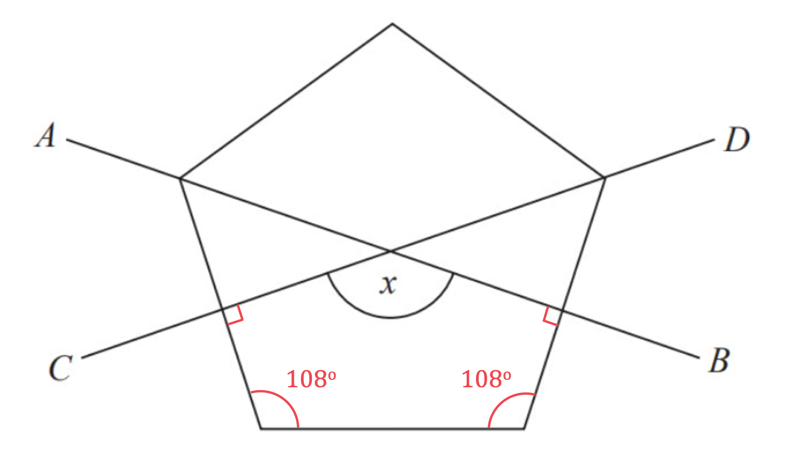

**[1]**

> *An irregular pentagon is formed, calculate the sum of the interior angles of a pentagon using: *`s u m space o f space i n t e r i o r space a n g l e s space equals space 180 open parentheses n minus 2 close parentheses`

`180 open parentheses 5 minus 2 close parentheses equals 540 degree`

> *Form an equation for the sum of the interior angles in the irregular pentagon.*

$108+108+90+90+x=540$

> *Simplify.*

$396+x=540$

**[1]**

> *Subtract 396 from both sides.*

$x=144^{\circ}$** [1]**

## Q2 — hard — 4 marks · exam-questions

### 6() — 4 marks
> *Find angle **DEC**.*

*Angle ***DEC*** + Angle ***CEB  ***= 180**o*  *(Angles on a straight line)*

`table row cell Angle space D E C space end cell equals cell space 180 minus 41 end cell row blank equals cell space 139 degree end cell end table`

**[1]**

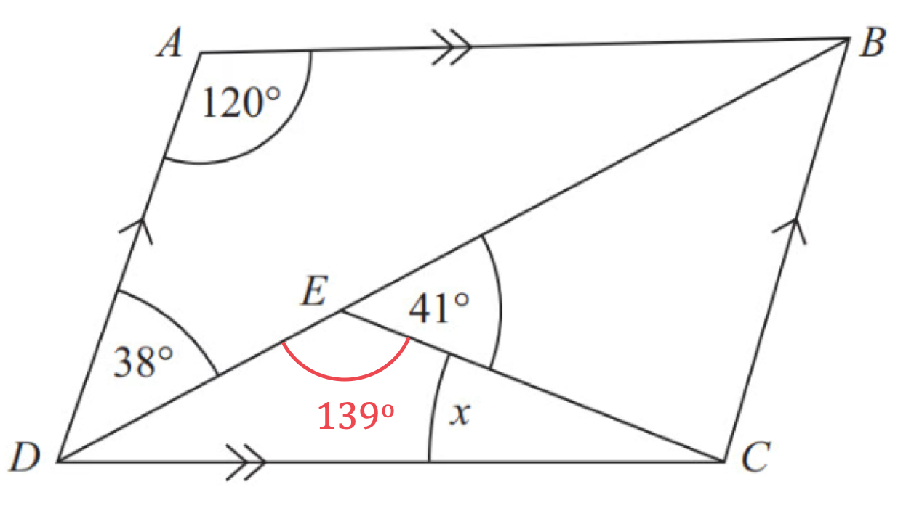

> *Find angle **EDC**.*

*Angle ***DAB ***+ Angle ***CDA*** = 180**o** (Co-interior angles)*

`table row cell 120 plus 38 plus Angle space E D C space end cell equals cell space 180 end cell row cell Angle space E D C end cell equals cell 180 minus 120 minus 38 end cell row cell Angle space E D C end cell equals cell 22 degree end cell end table`

**[1]**

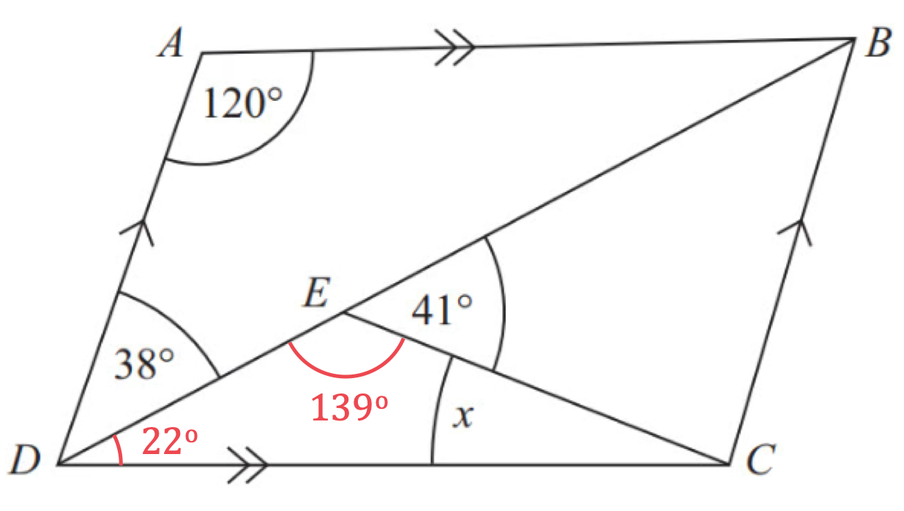

> *Form an equation for the interior angles of triangle **CDE** and solve to find *$x$*.*

*Angle ***CDE*** + Angle ***DEC*** + Angle ***DCE ***= 180**o**   (Angles in a triangle)*

`table row cell 22 plus 139 plus x end cell equals 180 row x equals cell 180 minus 22 minus 139 end cell end table`

$x=19^{\circ}$ **[1]**

**Fully correct reasons**** [1]**

## Q3 — medium — 3 marks · exam-questions

### 1() — 3 marks
> *Method 1:*

> *Find angle **CBE**.*

*Angle ***CBE*** = Angle ***GEF*** = 47**o**   (Corresponding angles)*

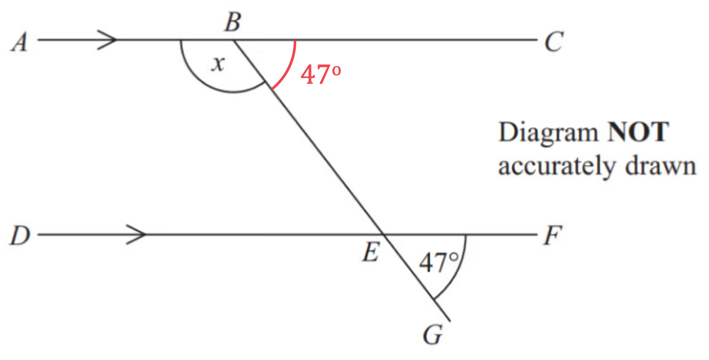

> *Find angle **ABE**.*

*Angle ***ABE*** + Angle ***CBE*** = 180**o**   (Angles on a straight line)*

`table row cell x plus 47 end cell equals 180 row x equals cell 180 minus 47 end cell end table`

**[1]**

$x=133^{\circ}$ **[1]**

**Full reasons given**** [1]**

> *Method 2:*

> *Find angle **BED**.*

*Angle*** BED*** = Angle ***GEF*** = 47**o**   (Vertically opposite angles)*

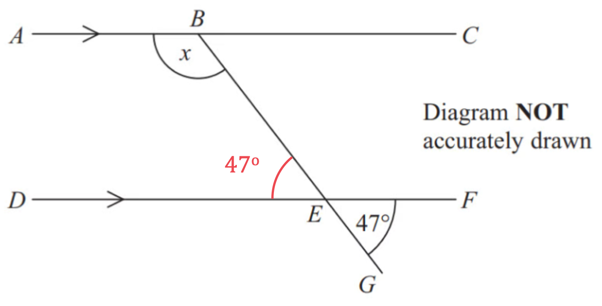

> *Find angle **ABE**.*

*Angle ***ABE*** + Angle ***BED*** = 180**o**   (Co-interior angles)*

`table row cell x plus 47 end cell equals 180 row x equals cell 180 minus 47 end cell end table`

**[1]**

$x=133^{\circ}$** [1]**

**Full reasons given**** [1]**

## Q4 — very_hard — 3 marks · exam-questions

### 5() — 3 marks
> *Find angle **EAB** and angle **DBA.*

*Angle** ***EAB*** = Angle ***EDB*** = 130**o**   (***ABDE*** is a kite)*

*Angle ***AED*** + Angle ***EDB *** + Angle ***DBA ***+ Angle ***BAE*** = 360**o** (Angles in a quadrilateral)*

`table row cell 40 plus 130 plus Angle space D B A plus 130 end cell equals 360 row cell Angle space D B A end cell equals cell 360 minus 40 minus 130 minus 130 end cell row cell Angle space D B A end cell equals cell 60 degree end cell end table`

**[1]**

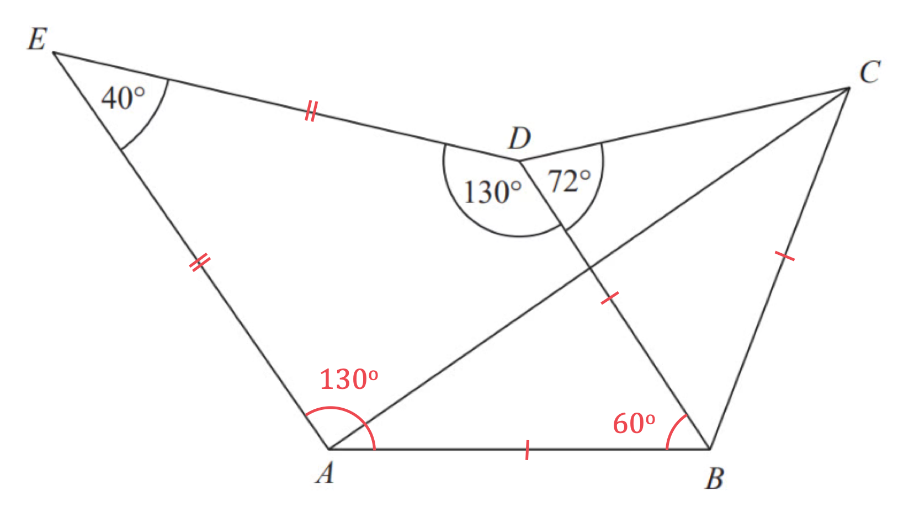

> *Find angle **BCD.*

*Angle ***BDC*** = Angle ***BCD   ***(Triangle BCD is isosceles)*

*Angle ***BCD*** = 72**o*

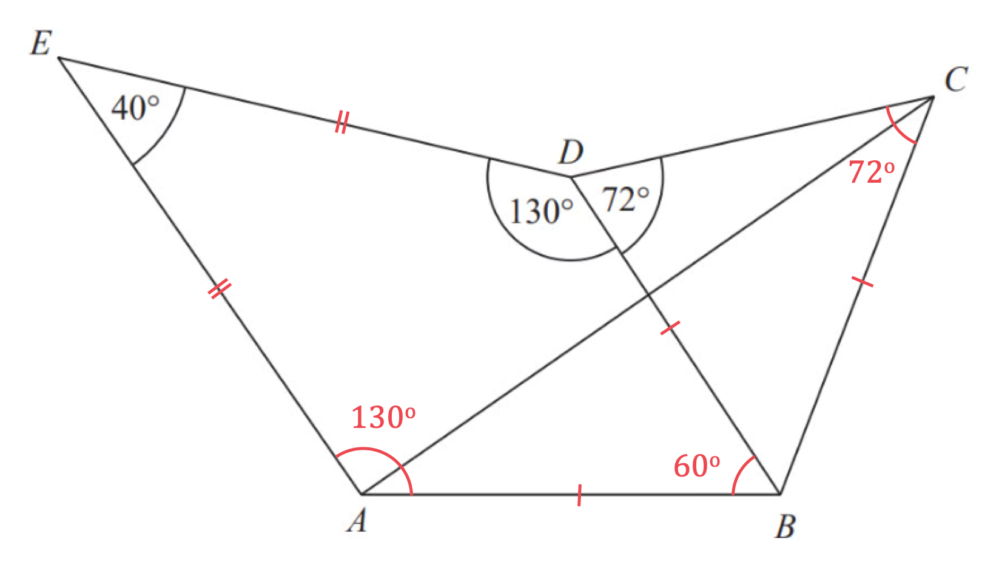

> *Find angle **CBD**.*

*Angle ***CBD ***+ Angle ***BDC*** + Angle ***BCD*** = 180**o**   (Angles in a triangle sum to 180**o**)*

`table row cell Angle space C B D plus 72 plus 72 end cell equals 180 row cell Angle space C B D end cell equals cell 180 minus 72 minus 72 end cell row cell Angle space C B D end cell equals cell 36 degree end cell end table`

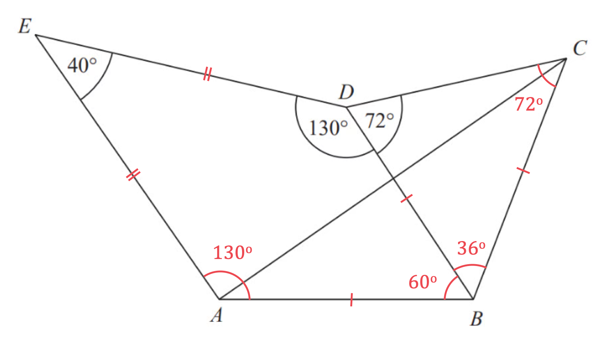

> *Triangle **ABC** is isosceles.*

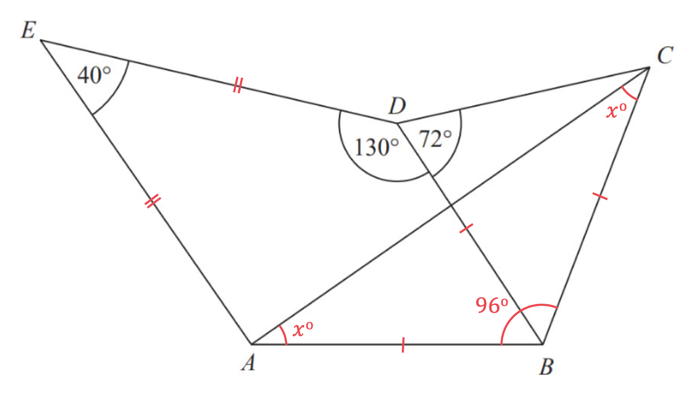

> *Form an equation for the sum of interior angles of a triangle and solve.*

`table attributes columnalign right center left columnspacing 0px end attributes row cell 2 x plus 96 end cell equals 180 row cell 2 x end cell equals 84 end table`

**[1]**

$\mathrm{Angle}ACB=42^{\circ}$** [1]**

## Q5 — hard — 4 marks · exam-questions

### 8() — 4 marks
> *Find angle **GFB**.*

*Angle ***ABF*** = Angle ***GFB*** = 65**o**  (Alternate angles)*

**[1]**

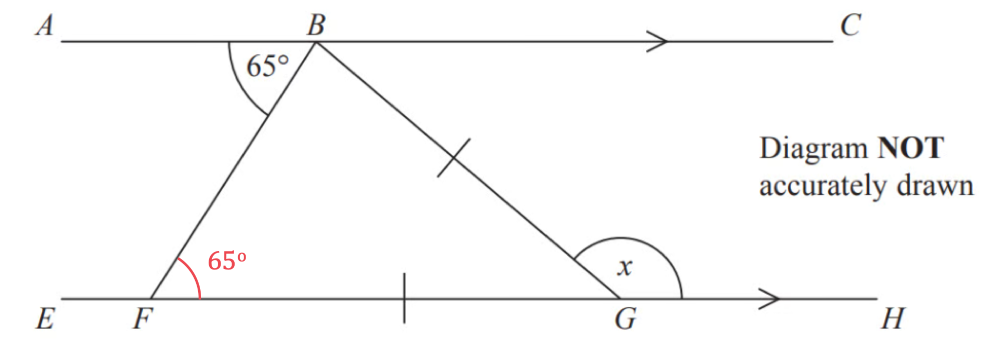

> *Find angle **FBG**.*

*Angle ***BFG*** = Angle ***FBG*** = 65**o**   (Isosceles triangle)*

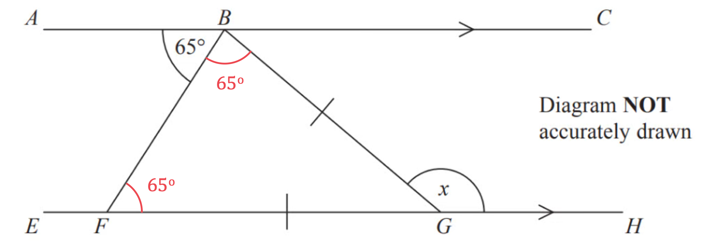

> *Find angle **BGF**.*

*Angle ***BFG*** + Angle ***FBG*** + Angle ***BGF*** = 180**o**   (Angles in a triangle)*

`table row cell 65 plus 65 plus Angle space B G F end cell equals 180 row cell Angle space B G F end cell equals cell 180 minus 65 minus 65 end cell row cell Angle space B G F end cell equals cell 50 degree end cell end table`

> *Find angle *$x$*.*

*Angle ***FGB*** + Angle ***BGH***  = 180**o**  (Angles on a straight line)*

`table attributes columnalign right center left columnspacing 0px end attributes row cell 50 plus x end cell equals 180 end table`

**[1]**

$x=130^{\circ}$* *

**Correct answer with one correct reason**** [1] **
**Correct answer with full correct**** reasoning [1]**

## Q6 — medium — 4 marks · exam-questions

### 9() — 4 marks
> *Find angle **ABQ**.*

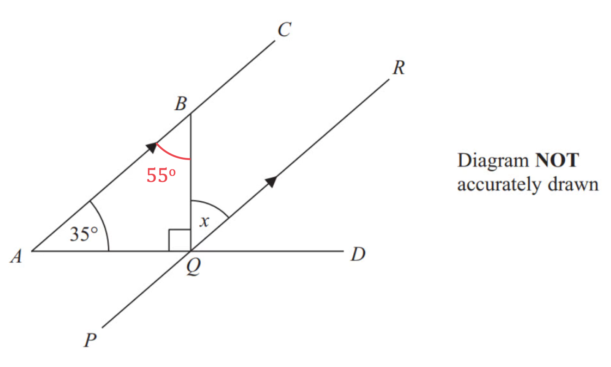

*Angle ***ABQ ***+ Angle ***BAQ*** + Angle ***AQB*** = 180**o**   (Angles in a triangle)*

**[1]**

`table row cell Angle space A B Q plus 35 plus 90 end cell equals 180 row cell Angle space A B Q end cell equals cell 180 minus 35 minus 90 end cell row cell Angle space A B Q end cell equals cell 55 degree end cell end table`

**[1]**

> *Find angle **BQR**.*

*Angle ***ABQ ***= Angle ***BQR*** (alternate angles)*

**[1]**

** **$x=55^{\circ}$** [1]**

## Q7 — very_hard — 4 marks · exam-questions

### 15() — 4 marks
> *Method 1:*

> *Calculate the size of an interior angle in a regular 9-sided polygon using: *`s i z e space o f space i n t e r i o r space a n g l e space equals space fraction numerator 180 open parentheses n minus 2 close parentheses over denominator n end fraction`*, where *$n$* is the number of sides of the polygon.*

`fraction numerator 180 open parentheses 9 minus 2 close parentheses over denominator 9 end fraction equals 140 degree`

**180(9-2) ****[1] **
**Division by 9 ****[1]**

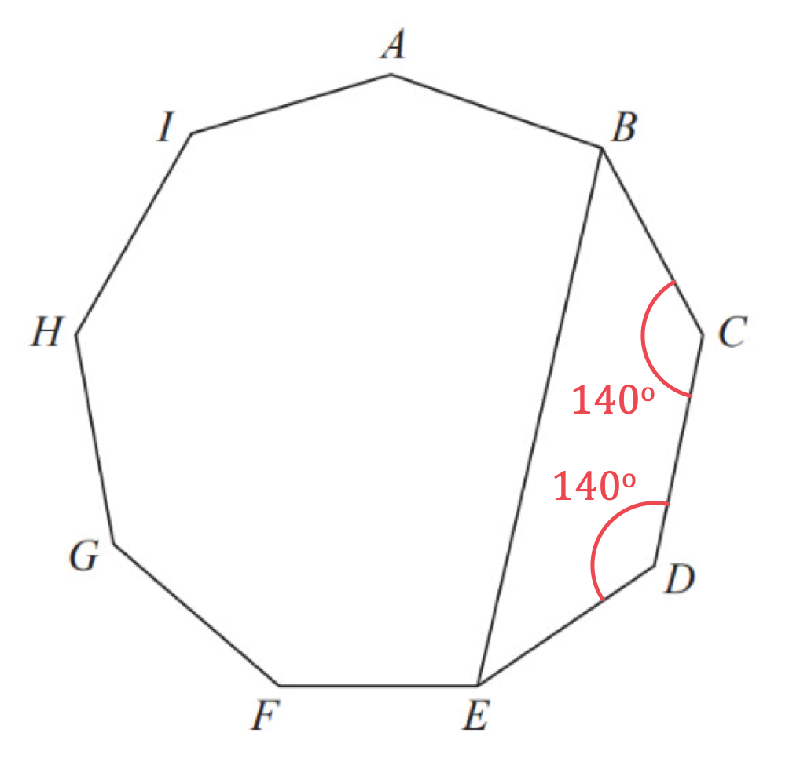

> *BCDE is a trapezium with a line of symmetry between the midpoint of **BE** and the midpoint of **CD**.*

> *Find angle **EBC** and angle **BED.*

*Angle ***EBC*** = Angle ***BED  **

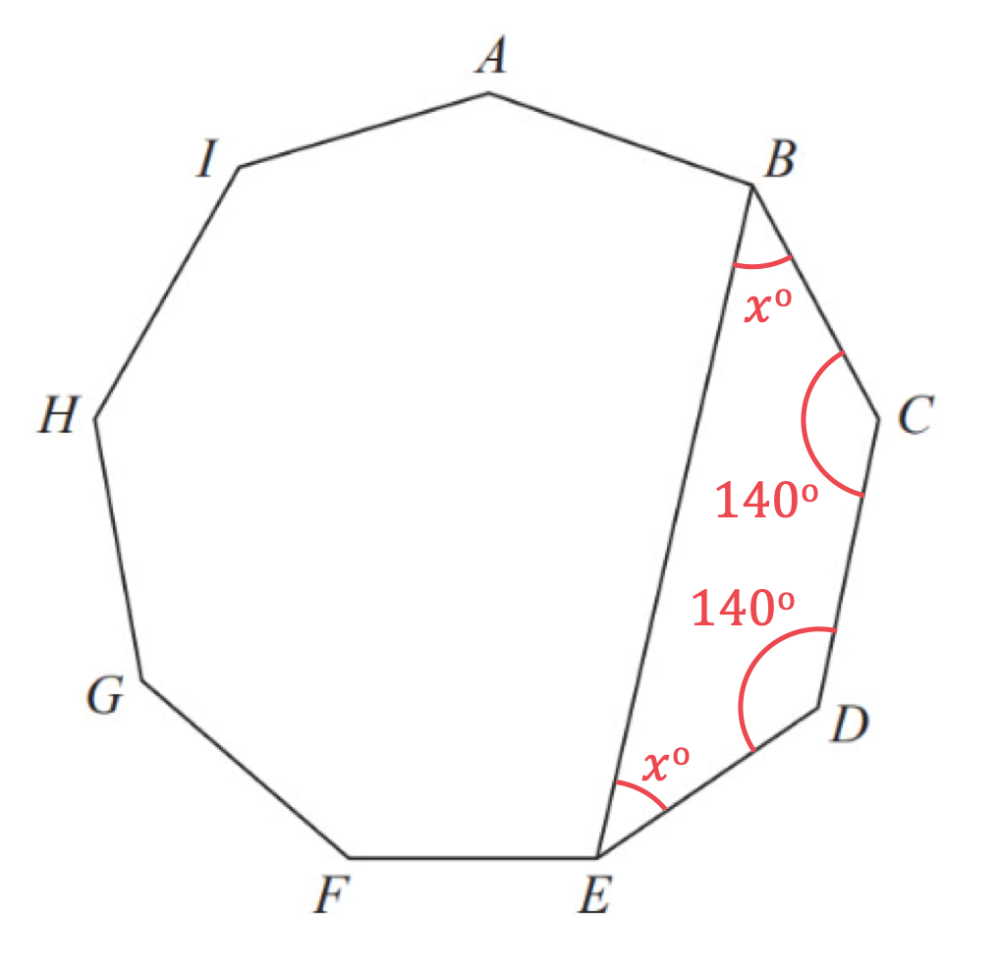

> *Form an equation for the sum of interior angles of a quadrilateral, and solve to find *$x$*.*

*Angles in a quadrilateral sum to 360**o*

`table row cell x plus x plus 140 plus 140 end cell equals 360 row cell 2 x plus 280 end cell equals 360 row cell 2 x end cell equals 80 row x equals cell 40 degree end cell end table`

> *Angle **BEF** and Angle **BED** sum to the total of one interior angle of the regular 9-sided polygon.*

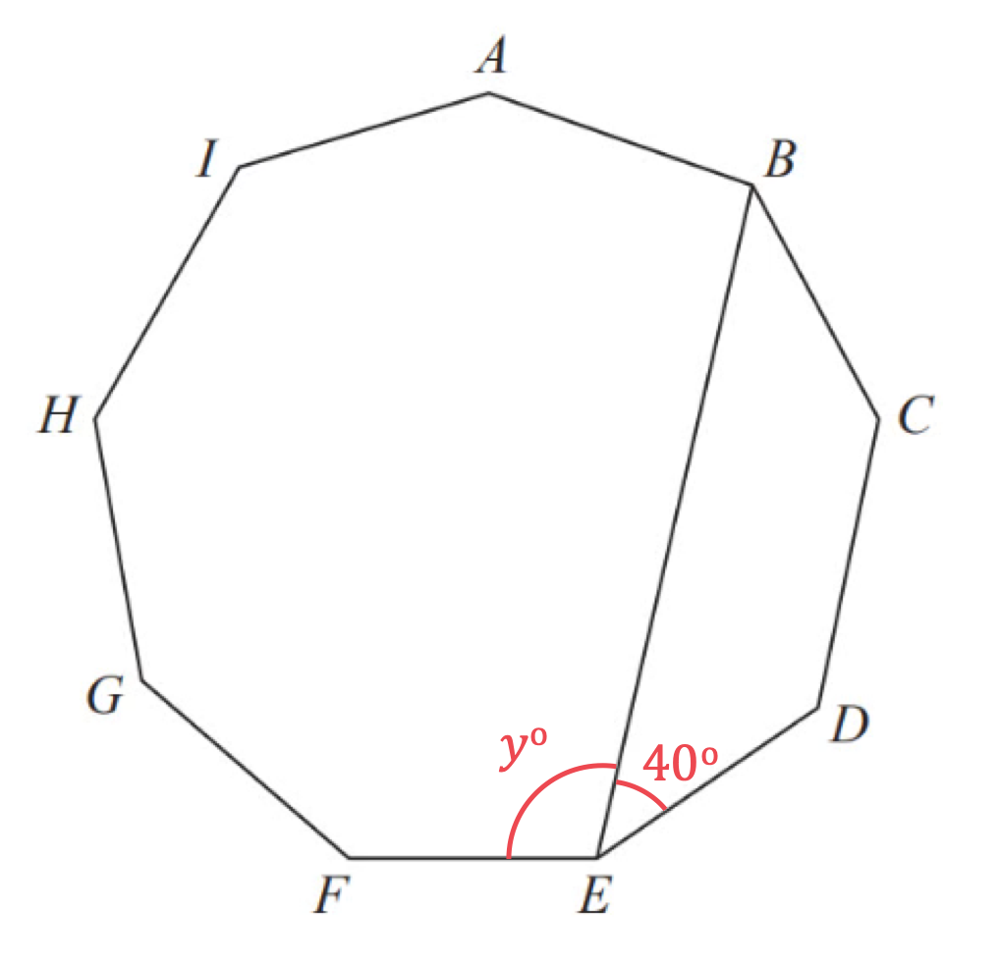

> *Form an equation and solve to find *$y$*.*

`table row cell y plus 40 end cell equals 140 end table`

**[1]**

** **$\mathrm{Angle}BEF=100^{\circ}$* ***[1]**

> *Method 2:*

> *Calculate the size of an exterior angle in a regular 9-sided polygon using: *$sizeofexteriorangle=\frac{360}{n}$*, where *$n$* is the number of sides of the polygon.*

$\frac{360}{9}=40^{\circ}$

**[1]**

> *Find angle** BED**.*

*Angle ***BED*** = Exterior angle at D (Corresponding angles, ***BE*** and ***CD*** are parallel lines)*

*Angle ***BED ***= 40**o*

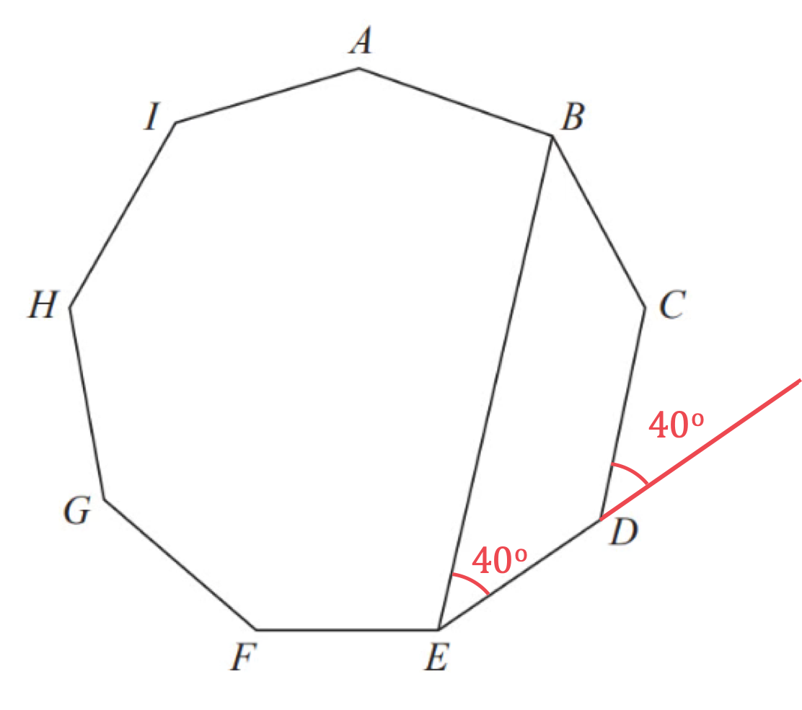

**[1]**

> *Angle **BEF** and angle **BED** sum to the total of one interior angle of the regular 9-sided polygon.*

> *Form an equation and solve to find *$y$*.*

`table row cell y plus 40 end cell equals 140 end table`

**[1]**

`table row y equals 100 end table`

** **$\mathrm{Angle}BEF=100^{\circ}$* ***[1]**

## Q8 — hard — 4 marks · exam-questions

### 6() — 4 marks
> *Find angle **FBC.*

*Angle ***FBC*** = Angle ***EFB***   (Alternate angles)*

*Angle ***FBC*** = 70**o*

**[1]**

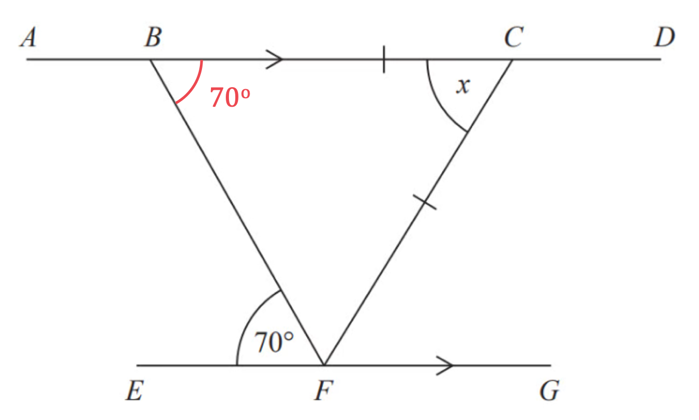

> *Find angle **BFC**.*

*Angle ***BFC*** = Angle ***FBC***   (Isosceles triangle)*

*Angle ***BFC*** = 70**o*

**[1]**

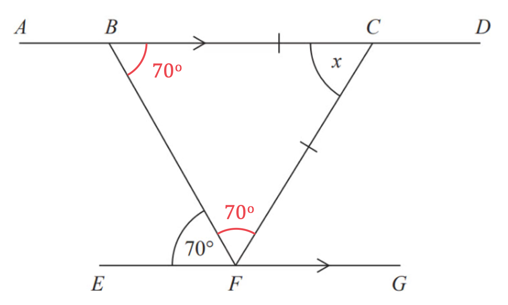

> *Find angle **BCF**.*

*Angle ***FBC*** + Angle ***CFB*** + Angle ***BCF*** = 180**o**   (Angles in a triangle)*

`table attributes columnalign right center left columnspacing 0px end attributes row cell 70 plus 70 plus x end cell equals 180 row x equals cell 180 minus 70 minus 70 end cell end table`

$x=40^{\circ}$** [1]**

**Full correct**** ****reasoning**** [1]**

## Q9 — medium — 3 marks · exam-questions

### 7() — 3 marks
> *Find angle **WRS**.*

*Angle ***ZWY*** = Angle ***WRS***   (Corresponding angles)*

*Angle ***WRS*** = 126**o*

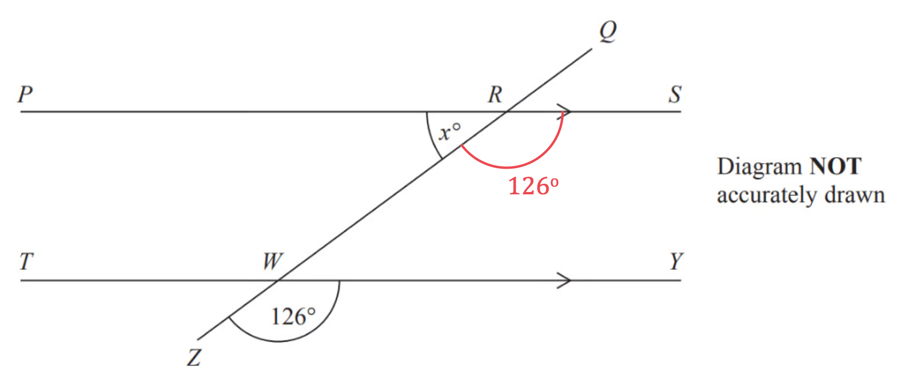

**[1]**

> *Find angle **PRW**.*

*Angle ***PRW***  + Angle ***WRS*** = 180**o** (Angles on a straight line)*

`table attributes columnalign right center left columnspacing 0px end attributes row cell x plus 126 end cell equals 180 row x equals cell 180 minus 126 end cell end table`

$x=54^{\circ}$**[1]**

**Appropriate reasons given**** [1]**

**There are other valid methods using other angle facts too, e.g. vertically opposite and co-interior angles or angles along a straight line and alternate angles **

## Q10 — very_hard — 4 marks · exam-questions

### 5() — 4 marks
> *Label angle *$CDE$

*Angle *$CDE=x$

> *Write angle *$BCD$* in terms of *$x$

*Angle *$BCD=2x$

**[1]**

> *Find the sum of the interior angles using *`open parentheses n minus 2 close parentheses cross times 180`

`open parentheses 6 minus 2 close parentheses cross times 180 equals 720`

**[1]**

> *The hexagon is symmetrical, so each angle appears twice*

> *Set up an equation*

`2 open parentheses 117 plus x plus 2 x close parentheses equals 720`

> *Solve for *$x$

`table row cell 117 plus 3 x end cell equals 360 row cell 3 x end cell equals 243 row x equals 81 end table`

**[1]**

> *Angle *$AFE$* is equal to angle *$BCD$

> *Substitute *$x$* into *$2x$

$2\times81=162$

**[1]**

**162°** **[1]**

## Q11 — hard — 4 marks · exam-questions

### 9() — 4 marks
> *Find angle **AEB.*

*Angle ***FEG*** = Angle ***AEB***   (Vertically opposite angles)*

*Angle ***AEB*** = 70**o*

**[1]**

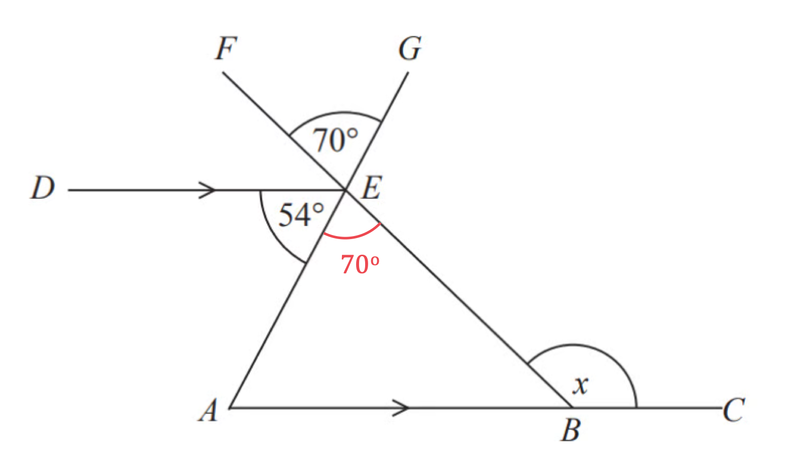

> *Find angle **BAE**.*

*Angle ***BAE*** = Angle ***DEA***   (Alternate angles)*

*Angle ***BAE ***= 54**o*

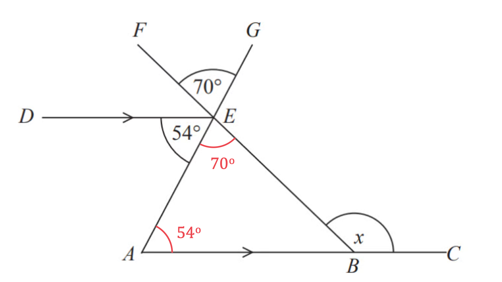

> *Find angle **ABE**.*

*Angle ***BAE*** + Angle ***AEB*** + Angle ***ABE*** = 180**o**   (Angles in a triangle)*

`table attributes columnalign right center left columnspacing 0px end attributes row cell 54 plus 70 plus Angle space A B E end cell equals 180 row cell Angle space A B E end cell equals cell 180 minus 54 minus 70 end cell row cell Angle space A B E end cell equals cell 56 degree end cell end table`

> *Find angle **EBC**.*

*Angle ***ABE*** + Angle ***EBC*** = 180**o**   (Angles on a straight line)*

$56+x=180$

$x=124^{\circ}$** ****[1]**

** ****One appropriate reason related to parallel lines given ****[1] **
**Full reasons given appropriate to the method ****[1]**

## Q12 — medium — 4 marks · exam-questions

### 12() — 4 marks
> *Find angle **EQR.*

*Angle ***ABE*** = Angle ***EQR***   (Alternate angles)*

**[1]**

*Angle ***EQR*** = 60**o*

**[1]**

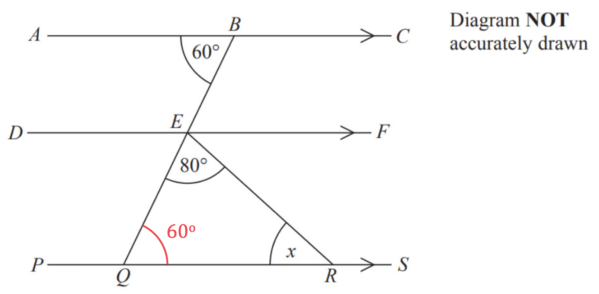

> *Find angle** QRE.*

*Angle ***EQR ***+ Angle ***QRE*** + Angle ***REQ*** = 180**o**   (Angles in a triangle)*

**[1]**

`table row cell 60 plus x plus 80 end cell equals 180 row x equals cell 180 minus 60 minus 80 end cell end table`

$x=40^{\circ}$ **[1]**

## Q13 — very_hard — 5 marks · exam-questions

### 20() — 5 marks
> *To prove that **ST  **is equal to** UT ** you will need to **prove **that the triangle **STU **is **isosceles**. This can be done by finding the angles. *

> *PQRST **is a regular pentagon, so the angle **TSU** is the exterior angle of a regular pentagon. *
*Exterior angles in any polygon add up to 360°. *
*A regular pentagon has 5 equal exterior angles.*

> * *`T S with hat on top U space equals 360 over 5 equals space 72 degree`

**[1]**

> *To find the size of angle **SUT**, you will need to consider circle theorems.*

> *Begin by joining the point **O** to the points **T** and **R,** marking all the radiuses of the circle as equal lengths on the diagram.*

> *TP** and **TR **are also tangents to the circle, so by the circle theorem 'A tangent always meets a radius at 90°', angles **ORQ **and **OTP **are both 90°. *

`O R with hat on top Q space equals space O T with hat on top P space equals 90 degree`* **(angle between tangent and radius)*

**[1]**

> *Mark these onto the diagram.*

> *The sum of the interior angles in any polygon can be found using the formula 180°(n - 2). A regular pentagon has 5 equal interior angles, therefore these can be found using the formula *`fraction numerator 180 open parentheses 5 space minus space 2 close parentheses over denominator 5 end fraction`*.*

> * *`T P with hat on top Q space equals P Q with hat on top R space equals space fraction numerator 3 open parentheses 180 close parentheses over denominator 5 end fraction equals space 108 degree`

> *Add these angles to the diagram.*

> *PQROT  **is a pentagon, so the angle **ROT**  can be found by subtracting the other four angles from the sun of the angles in a pentagon.*

> *The sum of the interior angles in any polygon can be found using the formula 180°(n - 2).*

`R O with hat on top T space plus O T with hat on top P space plus space T P with hat on top Q space plus space P Q with hat on top R space plus space Q R with hat on top O space equals space 180 open parentheses 5 space minus space 2 close parentheses degree space equals space 540 degree`

> *Substitute in the angles you know to find angle **ROT**.*

`table row cell R O with hat on top T space plus space 90 degree space plus space 90 degree space plus space 108 degree space plus space 108 degree space end cell equals cell space 540 degree end cell row cell R O with hat on top T space plus space 396 degree space end cell equals cell space 540 degree end cell row cell R O with hat on top T space space end cell equals cell space 144 degree end cell end table`

**[1]**

> *By the circle theorem, the angle at the centre is twice the angle at the circumference, angle **ROT **is twice angle **RUT.*

`R O with hat on top T space equals 2 open parentheses R U with hat on top T close parentheses space equals space 2 open parentheses S U with hat on top T close parentheses`

`S U with hat on top T space equals fraction numerator R O with hat on top T over denominator 2 end fraction equals space 144 over 2 space equals space 72 degree`

**[1]**

> *This proves that angle **TSU **is equal to angle **SUT **and so triangle **STU **is isosceles.*

**Therefore ****ST ****= ****UT **
**All reasons given clearly [1]**

## Q14 — hard — 4 marks · exam-questions

### 9() — 4 marks
> *Find angle **CBD**.*

*Angle ***CBD*** + Angle ***ABD*** = 180**o**   (Angles on a straight line)*

`table row cell Angle italic space C B D plus 125 end cell equals 180 row cell Angle space C B D end cell equals cell 180 minus 125 end cell row cell Angle italic space C B D end cell equals cell 55 degree end cell end table`

**[1]**

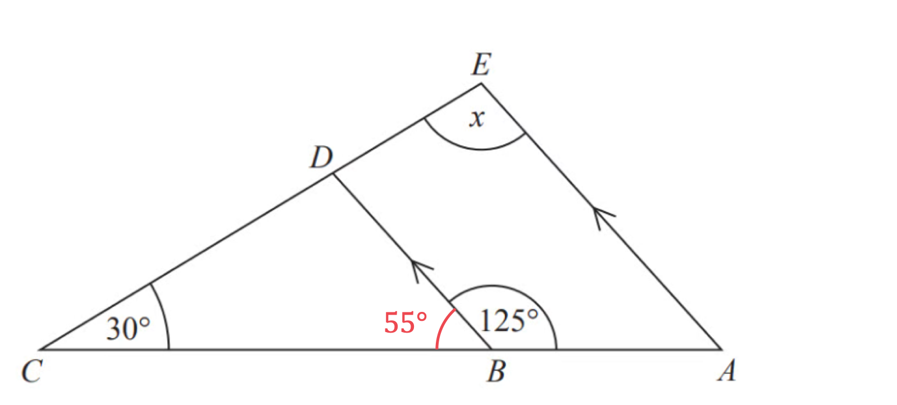

> *Find angle **BDC**.*

*Angle ***BDC*** + Angle ***BCD*** + Angle ***DBC*** = 180**o**   (Angles in a triangle)*

`table row cell Angle space B D C plus 30 plus 55 end cell equals 180 row cell Angle space B D C end cell equals cell 180 minus 30 minus 55 end cell row cell Angle space B D C end cell equals cell 95 degree end cell end table`

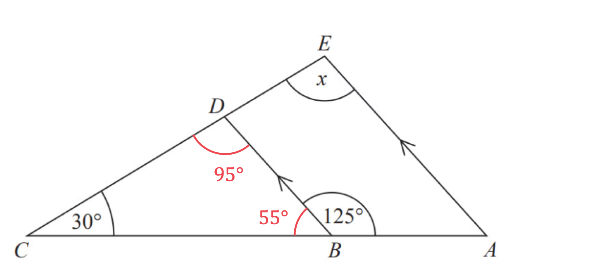

> *AE** and **BD** are parallel lines, find angle **DEA**.*

*Angle ***DEA*** = Angle ***BDC***   (Corresponding angles)*

$x=95^{\circ}$** [1]**

**One appropriate reason given relating to parallel lines**** [1] **
**Full reasoning given appropriate to the method**** [1]**

## Q15 — medium — 3 marks · exam-questions

### 25() — 3 marks
> *Method 1:*

> *Find the interior angle of the regular octagon, using, *`s i z e space o f space i n t e r i o r space a n g l e space equals space fraction numerator 180 open parentheses n minus 2 close parentheses over denominator n end fraction`*, where *$n$*is the number of sides of the polygon.*

`fraction numerator 180 open parentheses 8 minus 2 close parentheses over denominator 8 end fraction equals 135 degree`

**[1]**

> *Find the interior angle of the regular hexagon.*

`fraction numerator 180 open parentheses 6 minus 2 close parentheses over denominator 6 end fraction equals 120 degree`

**[1]**

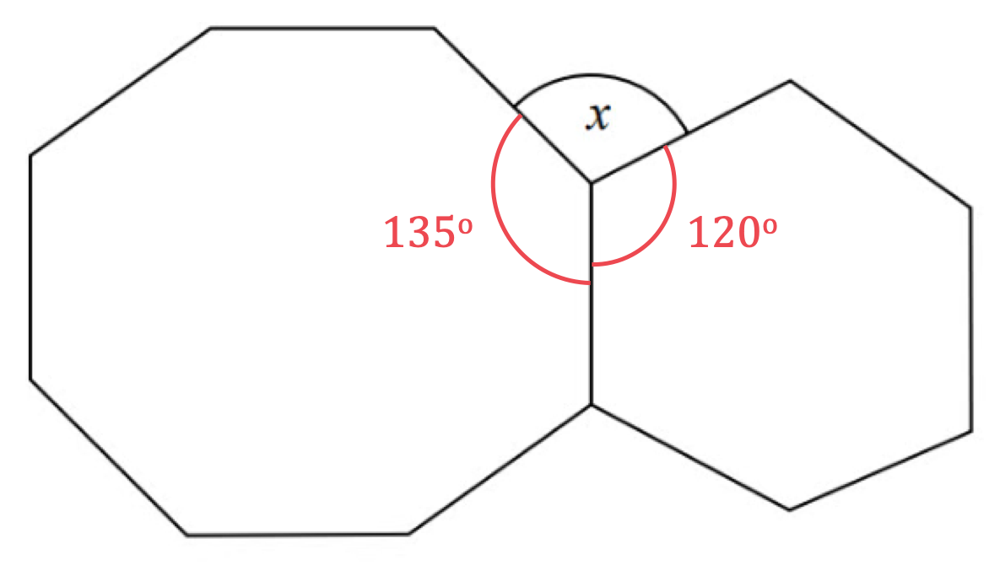

> *Angles around a point are equal to 360**o**.*

`table attributes columnalign right center left columnspacing 0px end attributes row cell 135 plus 120 plus x end cell equals 360 row x equals cell 360 minus 135 minus 120 end cell end table`

$x=105^{\circ}$** ****[1]**

> *Method 2:*

> *Find the exterior angle of the regular octagon, using, *$sizeofexteriorangle=\frac{360}{n}$*, where *$n$*is the number of sides of the polygon.*

$\frac{360}{8}=45^{\circ}$

**[1]**

> *Find the interior angle of the regular octagon by subtracting the exterior angle from 180**o**.*

$180-45=135^{\circ}$

> *Find the exterior angle of the regular hexagon.*

$\frac{360}{6}=60^{\circ}$

**[1]**

> *Find the interior angle of the regular hexagon by subtracting the exterior angle from 180**o**.*

$180-60=120^{\circ}$

> *Angles around a point are equal to 360**o**.*

`table attributes columnalign right center left columnspacing 0px end attributes row cell 135 plus 120 plus x end cell equals 360 row x equals cell 360 minus 135 minus 120 end cell end table`

$x=105^{\circ}$* ***[1]**

## Q16 — very_hard — 4 marks · exam-questions

### 11() — 4 marks
> *Find the size of an interior angle of the regular 10-sided polygon using the formula: *`Interior space Angle equals fraction numerator open parentheses n minus 2 close parentheses cross times 180 degree over denominator n end fraction.`

`fraction numerator open parentheses 10 minus 2 close parentheses cross times 180 degree over denominator 10 end fraction equals 144 degree`

**[1]**

> *Consider the 5-sided polygon **AGHIJ**. Find the sum of the angles using the formula: *`Sum space of space Interior space Angle equals open parentheses n minus 2 close parentheses cross times 180 degree.`

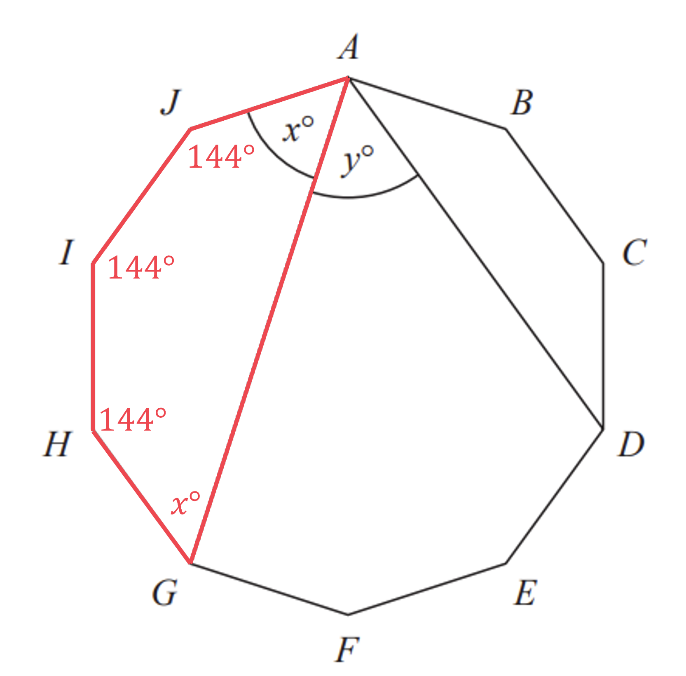

`open parentheses 5 minus 2 close parentheses cross times 180 degree equals 540 degree`

> *The angle at **A** is the same as the angle at **G** by symmetry. The other three angles are 144°. Form an equation and solve it to find **x**.*

`table attributes columnalign right center left columnspacing 0px end attributes row cell x plus x plus 144 plus 144 plus 144 end cell equals 540 row cell 2 x plus 432 end cell equals 540 row cell 2 x end cell equals 108 row x equals 54 end table`

**[1]**

> *Consider the quadrilateral **ABCD**. The angles should add up to 360°. The angle at **A** is the same as the angle at **D** by symmetry. The other three angles are 144°. Form an equation and solve it to find **t**he missing angles.*

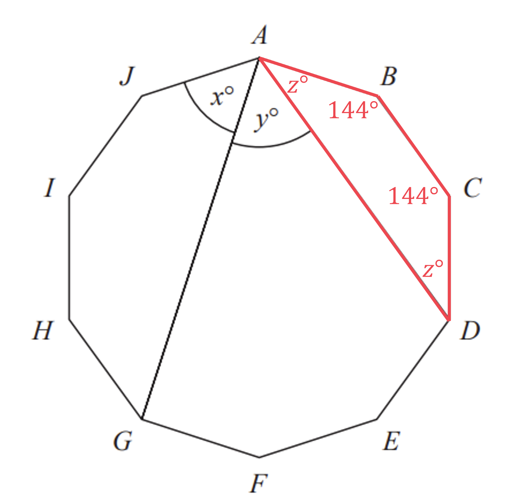

`table attributes columnalign right center left columnspacing 0px end attributes row cell z plus z plus 144 plus 144 end cell equals 360 row cell 2 z plus 288 end cell equals 360 row cell 2 z end cell equals 72 row z equals 36 end table`

**[1]**

> *The three angles in the 10-sdied polygon at A add up to 144°. Form an equation and solve it to find **y**.*

`table attributes columnalign right center left columnspacing 0px end attributes row cell 54 plus y plus 36 end cell equals 144 row cell y plus 90 end cell equals 144 row y equals 54 end table`

$x=y=54$* ***[1]**

## Q17 — hard — 4 marks · exam-questions

### 3() — 4 marks
> *Find angle **AFB**.*

*Angle ***AFB*** = Angle ***EFD***   (Vertically opposite angles)*

*Angle ***AFB*** = 35**o*

**[1]**

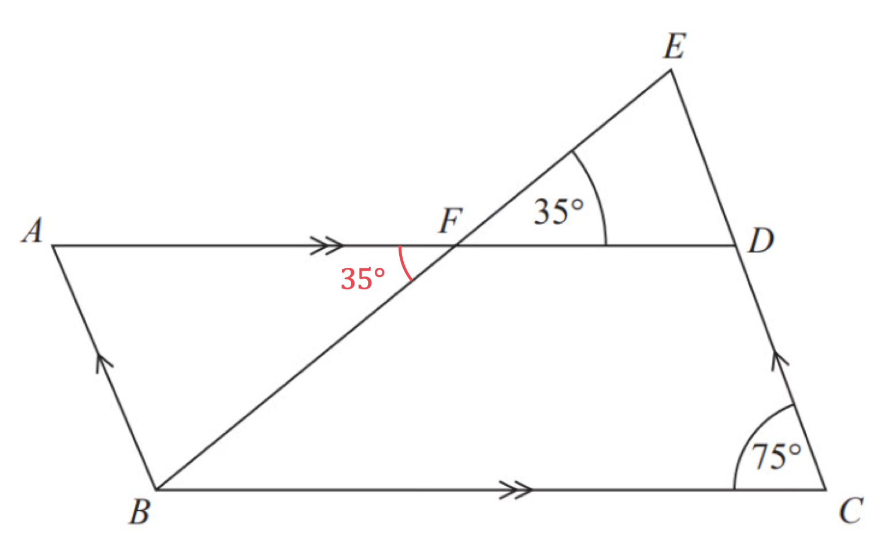

> *Find angle **BAF**.*

*Angle ***BAF*** = Angle ***BCD***   (Opposite angles in a parallelogram are equal)*

*Angle ***BAF*** = 75**o*

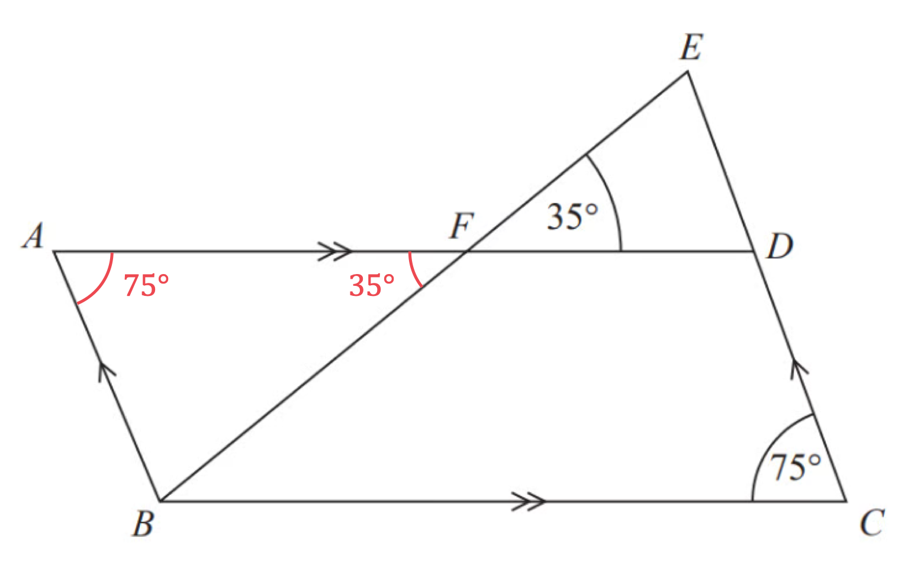

> *Find angle **ABF**.*

*Angle ***BAF ***+ Angle ***AFB*** + Angle ***ABF*** = 180**o**   (Angles in a triangle)*

`table row cell 75 plus 35 plus Angle space A B F end cell equals 180 row cell Angle space A B F space end cell equals cell space 180 minus 75 minus 35 end cell end table`

**[1]**

**Final answer:** **Angle ****ABF**** = 70****o**

**Correct answer and one reason clearly used and stated**** [1] **
**All figures correct with all appropriate reasons used and stated**** [1]**

**There are a number of ways you can show this using angle facts, but you must label all angles fully and give reasons throughout to gain full marks.**

## Q18 — medium — 3 marks · exam-questions

### 14() — 3 marks
*Find the interior angle of the regular pentagon* *using, *`s i z e space o f space i n t e r i o r space a n g l e space equals space fraction numerator 180 open parentheses n minus 2 close parentheses over denominator n end fraction`*, where *$n$*is the number of sides of the polygon.*

`fraction numerator 180 open parentheses 5 minus 2 close parentheses over denominator 5 end fraction equals 108 degree`

**[1]**

> *The two pentagons are both regular, this means that all of the trapezia that are formed are congruent.*

*Angle ***SRC*** = Angle ***CRQ**

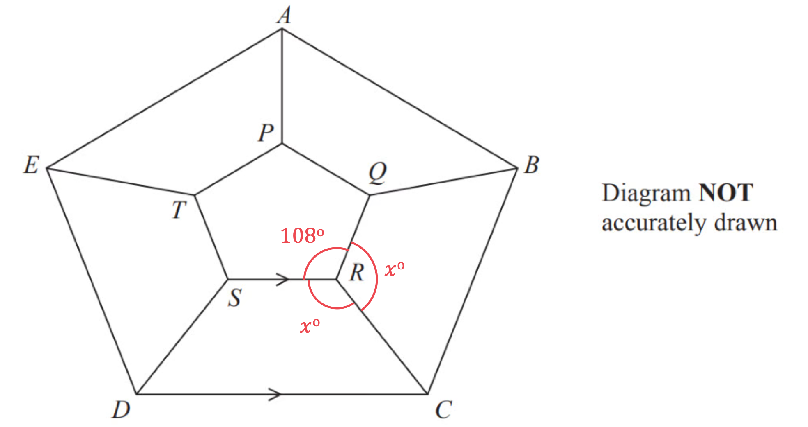

> *Angles around a point sum to 360**o**.*

`table attributes columnalign right center left columnspacing 0px end attributes row cell 108 plus 2 x end cell equals 360 row x equals cell fraction numerator 360 minus 108 over denominator 2 end fraction end cell end table`

**[1]**

**Angle ****SRC**** = 126****o** **[1]**

## Q19 — very_hard — 4 marks · exam-questions

### 4() — 4 marks
> *Find the size of an interior angle of the regular octagon using the formula: *`Interior space Angle equals fraction numerator open parentheses n minus 2 close parentheses cross times 180 degree over denominator n end fraction.`

`fraction numerator open parentheses 8 minus 2 close parentheses cross times 180 degree over denominator 8 end fraction equals 135 degree`

> *Find the size of an interior angle of the regular pentagon.*

`fraction numerator open parentheses 5 minus 2 close parentheses cross times 180 degree over denominator 5 end fraction equals 108 degree`

**Finding the interior angle for one polygon**** [1]**

> *The angle **CBI** is the difference between the interior angles of the two regular polygons.*

`table row cell A n g l e space C B I end cell equals cell 135 degree minus 108 degree end cell row blank equals cell 27 degree end cell end table`

**[1]**

> *As the octagon and pentagon are regular polygons which share a side (**AB**) all the lengths must be equal. Therefore the triangle **BCI** is isosceles. Angles **BIC** and **BCI** are equal. Form an equation and solve it to find **x**.*

`table row cell x plus x plus 27 end cell equals 180 row cell 2 x plus 27 end cell equals 180 row cell 2 x end cell equals 153 row x equals cell 153 over 2 end cell end table`

**[1]**

$\mathrm{Angle}x=76.5^{\circ}$* ***[1]**

## Q20 — hard — 3 marks · exam-questions

### 23() — 3 marks
> *Find angle **CBD**.*

*Angle ***CBD*** = Angle ***FCB***   (Alternate angles)*

*Angle ***CBD*** = 38**o*

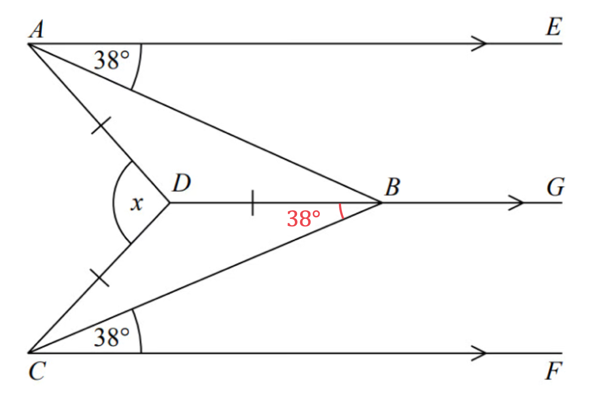

> *Find angle **BCD**.*

*Angle ***BCD*** = Angle ***CBD***   (Isosceles triangle)*

*Angle ***BCD*** = 38**o*

**[1]**

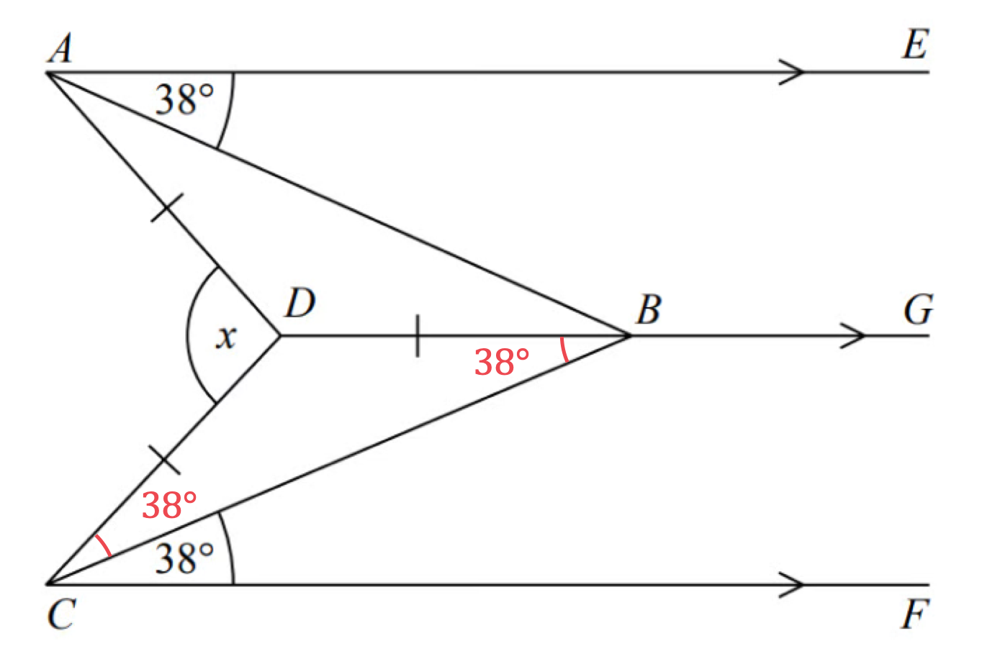

> *Find angle **CDB.*

*Angle ***CDB*** + Angle ***CBD*** + Angle ***BCD*** = 180**o**   (Angles in a triangle)*

`table row cell Angle space C D B plus 38 plus 38 end cell equals 180 row cell Angle space C D B end cell equals cell 180 minus 38 minus 38 end cell row cell Angle space C D B end cell equals cell 104 degree end cell end table`

**[1]**

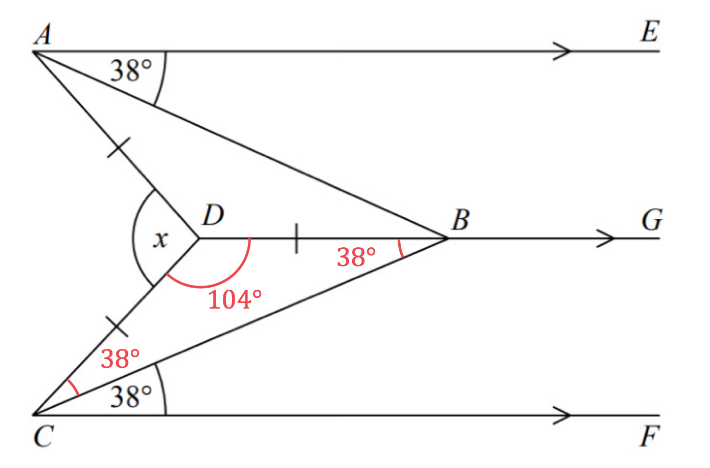

> *Find angle **ADB**.*

*Angle ***ADB*** = Angle ***CDB***   (Triangles ***ABD*** and ***BCD*** are congruent)*

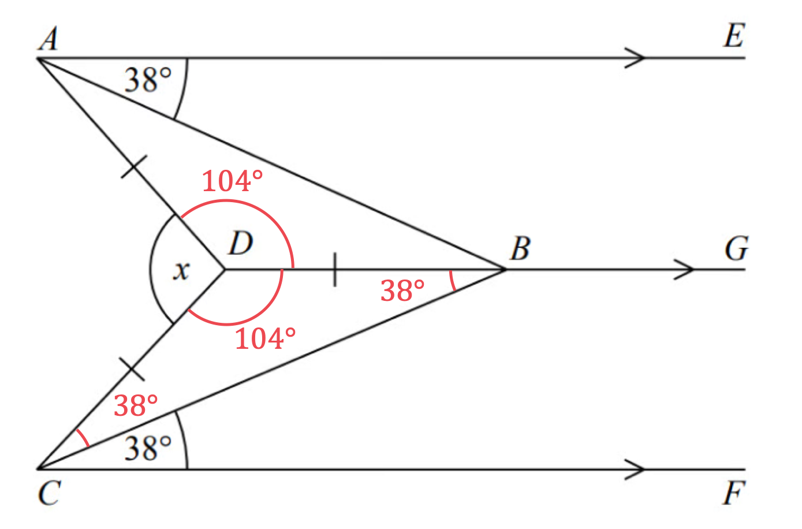

> *Find *$x$*.*

*Angle ***CDA*** + Angle ***ADB*** + Angle ***BDC*** = 360**o**   (Angles around a point)*

`table row cell x plus 104 plus 104 end cell equals 360 row x equals cell 360 minus 104 minus 104 end cell end table`

$x=152^{\circ}$ **[1]**

## Q21 — medium — 3 marks · exam-questions

### 12() — 3 marks
*Find the exterior angle of a 12-sided regular polygon using:* $exteriorangle=\frac{360}{n}$*.*

$\frac{360}{12}=30^{\circ}$

> *Find the interior angle, knowing that the sum of the interior angle and exterior angle is 180**o**.*

$180-30=150^{\circ}$

**[1]**

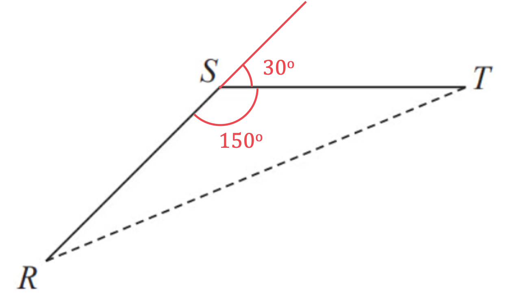

> *As it is a regular polygon, **RS** = **ST**, so triangle **RST** is an isosceles triangle.*

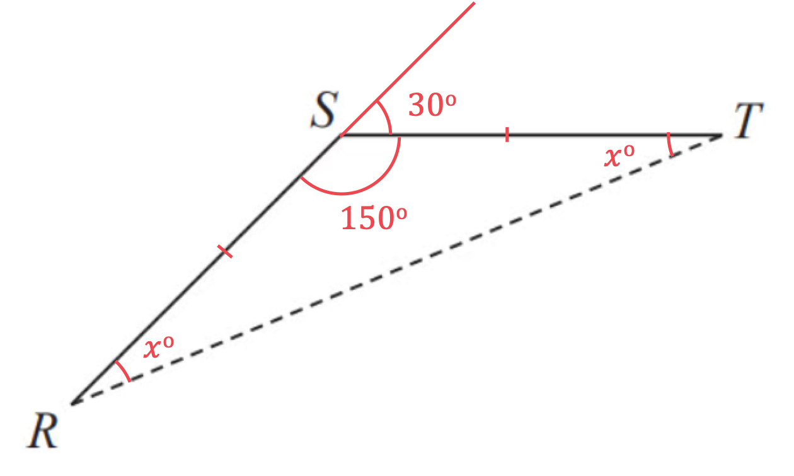

> *Angles in a triangle sum to 180**o**.*

`table attributes columnalign right center left columnspacing 0px end attributes row cell 150 plus 2 x end cell equals 180 row cell 2 x end cell equals 30 row x equals 15 end table`

**[1]**

**Angle ****STR****  = 15****o** **[1]**

## Q22 — very_hard — 3 marks · exam-questions

### 20() — 3 marks
> *The formula for the interior angle of a regular **n**-sided polygon is *`fraction numerator open parentheses n minus 2 close parentheses cross times 180 degree over denominator n end fraction.`* A decagon has 10 sides so substitute **n** = 10 into the formula.*

`fraction numerator open parentheses 10 minus 2 close parentheses cross times 180 degree over denominator 10 end fraction equals 144 degree`

**[1]**

> *The given shape has 5 sides so substitute **n** = 5 into the formula to find the sum of its interior angles.*

`open parentheses 5 minus 2 close parentheses cross times 180 degree equals 540 degree`

> *3 of the angles are 144° and 2 are **w°. **Use this to form an equation and solve it.*

`table row cell 2 w plus 3 cross times 144 end cell equals 540 row cell 2 w plus 432 end cell equals 540 row cell 2 w end cell equals 108 row w equals cell 108 over 2 end cell end table`

**[1]**

**54 degrees** **[1]**

## Q23 — hard — 4 marks · exam-questions

### 9() — 4 marks
> *The four rhombuses are identical so the angles that meet at the centre point will all be equal.*

> *Let one of these angles be labelled *$x$*. Form an equation for the angles around a point and solve for *$x$*.*

`table attributes columnalign right center left columnspacing 0px end attributes row 360 equals cell x plus x plus x plus x plus 25 plus 25 plus 25 plus 25 end cell row 360 equals cell 4 x plus 100 end cell row 260 equals cell 4 x end cell end table`

**[1]**

`table attributes columnalign right center left columnspacing 0px end attributes row x equals 65 end table`

**[1]**

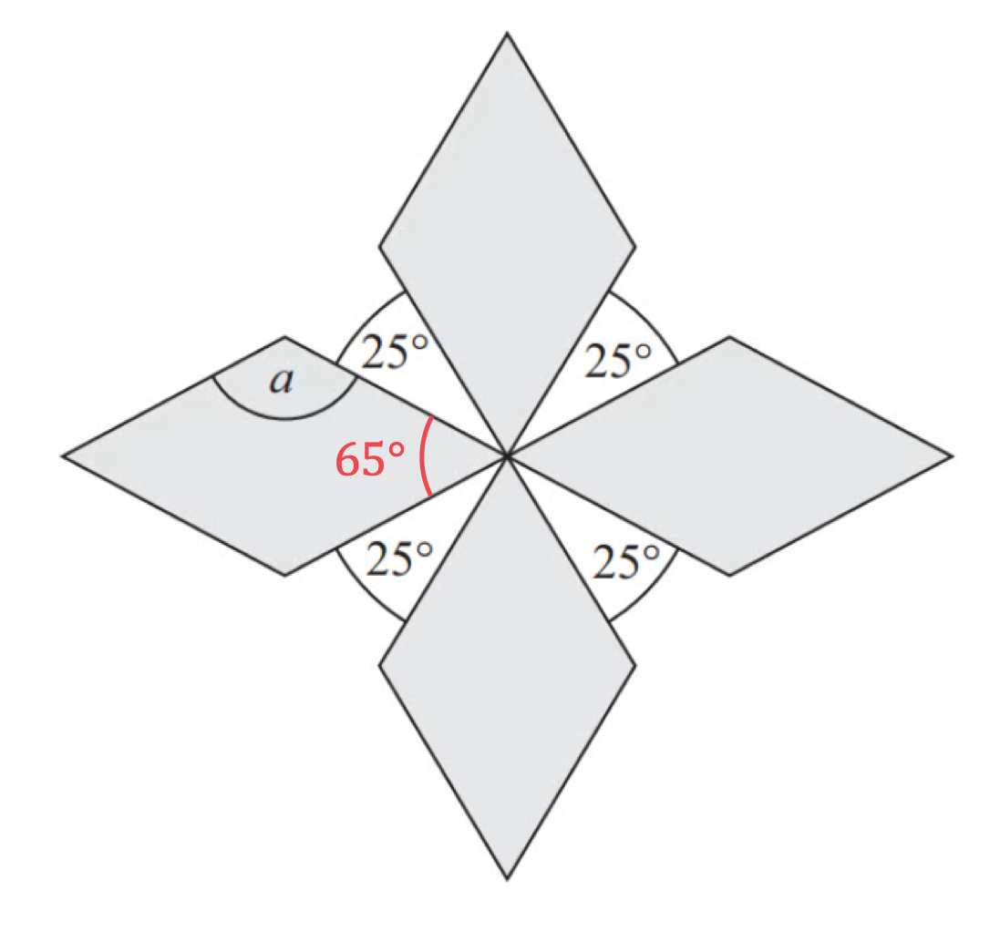

> *Adjacent angles in a rhombus are co-interior because of parallel lines.*

`table attributes columnalign right center left columnspacing 0px end attributes row cell a plus 65 end cell equals 180 row a equals cell 180 minus 65 end cell end table`

**[1]**

$a=115^{\circ}$** [1]**

## Q24 — medium — 4 marks · exam-questions

### 10() — 4 marks
> *Find angle **AED**.*

*Angle ***BAE***  = Angle ***AED***   (Alternate angles)*

*Angle ***AED*** = 38**o*

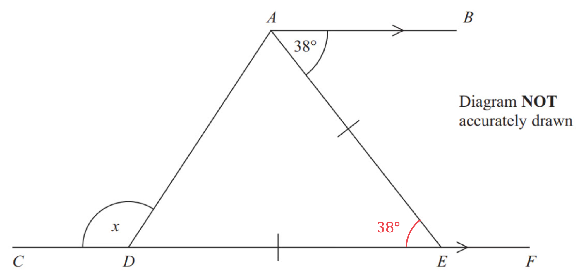

**[1]**

> *Find angle **ADE**.*

*Angle ***ADE*** = Angle ***DAE*** (Isosceles triangle)*

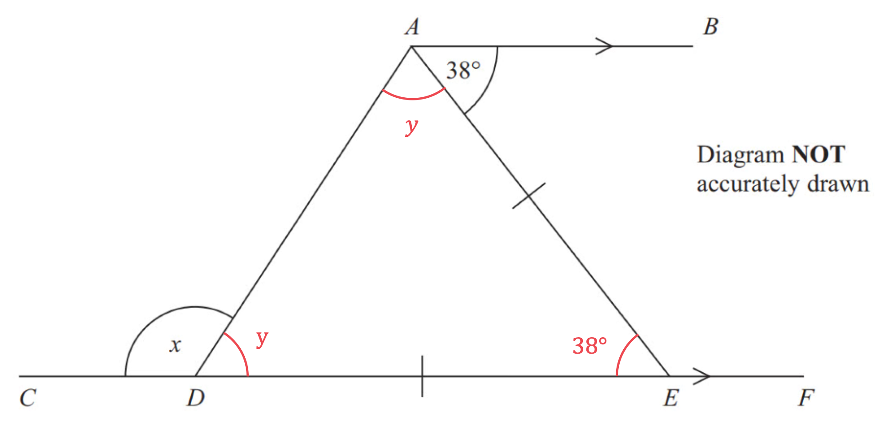

*Angle ***ADE*** + Angle ***DAE*** + Angle ***DEA*** = 180**o** (Angles in a triangle equal 180**o**)*

`table row cell 2 y plus 38 end cell equals 180 row cell 2 y end cell equals 142 row y equals 71 end table`

**[1]**

> *Angles on a straight line sum to 180**o**.*

`table row cell x plus 71 end cell equals 180 row x equals cell 180 minus 71 end cell end table`

$x=109^{\circ}$** ****[1]**

**Correct reasons used throughout**** [1]**

## Q25 — very_hard — 7 marks · exam-questions

### 10((a)) — 4 marks
> *If **AB** and **CD** are parallel then 2**x**+10° and 3**x**-20° are corresponding angles so are equal. Form an equation.*

$3x-20=2x+10$

**[1]**

> *Solve to find **x**.*

$x=30$

**[1]**

> *Substitute **x** = 30 back in to one of the expressions to find the size of the angle.*

$3\times30-20=70\,2\times30+10=70$

**[1]**

> *This angle and **y** form a straight line so subtract this angle from 180 to find the value of **y.*

$180-70=110$

**110 degrees*** ***[1]**

### 10((b)) — 3 marks
> *w** = 60 and 2**x**+10 are vertically opposite angles so are equal. Form an equation and solve it.*

`table attributes columnalign right center left columnspacing 0px end attributes row cell 2 x plus 10 end cell equals 60 row cell 2 x end cell equals 50 row x equals 25 end table`

**[1]**

> *Substitute this value into the angle 3**x**-20.*

$3\times25-20=55$

**[1]**

> *Subtract this from 180 to find **y**.*

$180-55=125$

$y\mathrm{is} \mathrm{bigger} \mathrm{by}15^{\circ}$ **[1]**

## Q26 — hard — 4 marks · exam-questions

### 17() — 4 marks
> *Find the interior angle of the regular octagon using: *`s i z e space o f space i n t e r i o r space a n g l e space equals fraction numerator 180 open parentheses n minus 2 close parentheses over denominator n end fraction`*, where *$n$* is the number of sides of the polygon.*

`fraction numerator 180 open parentheses 8 minus 2 close parentheses over denominator 8 end fraction equals 135 degree`

**[1]**

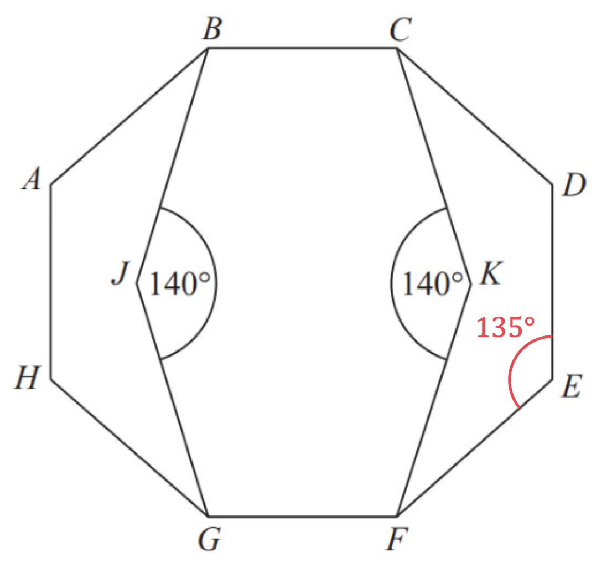

> *Find angle **GFK.*

*Let Angle ***GFK *** =** *$x$

*Angle ***JBC*** = Angle ***BCK*** = Angle ***JGF*** = Angle ***GFK**

> *Find the sum of the interior angles of the hexagon using: *`s u m space o f space i n t e r i o r space a n g l e s space equals 180 open parentheses n minus 2 close parentheses`* where *$n$* is the number of sides of the polygon.*

`180 open parentheses 6 minus 2 close parentheses equals 720 degree`

*Form an equation for the sum of the interior angles of the hexagon and solve for *$x$.

`table row cell x plus x plus x plus x plus 140 plus 140 end cell equals 720 row cell 4 x plus 280 end cell equals 720 row cell 4 x end cell equals 440 row x equals cell 110 degree end cell end table`

**[1]**

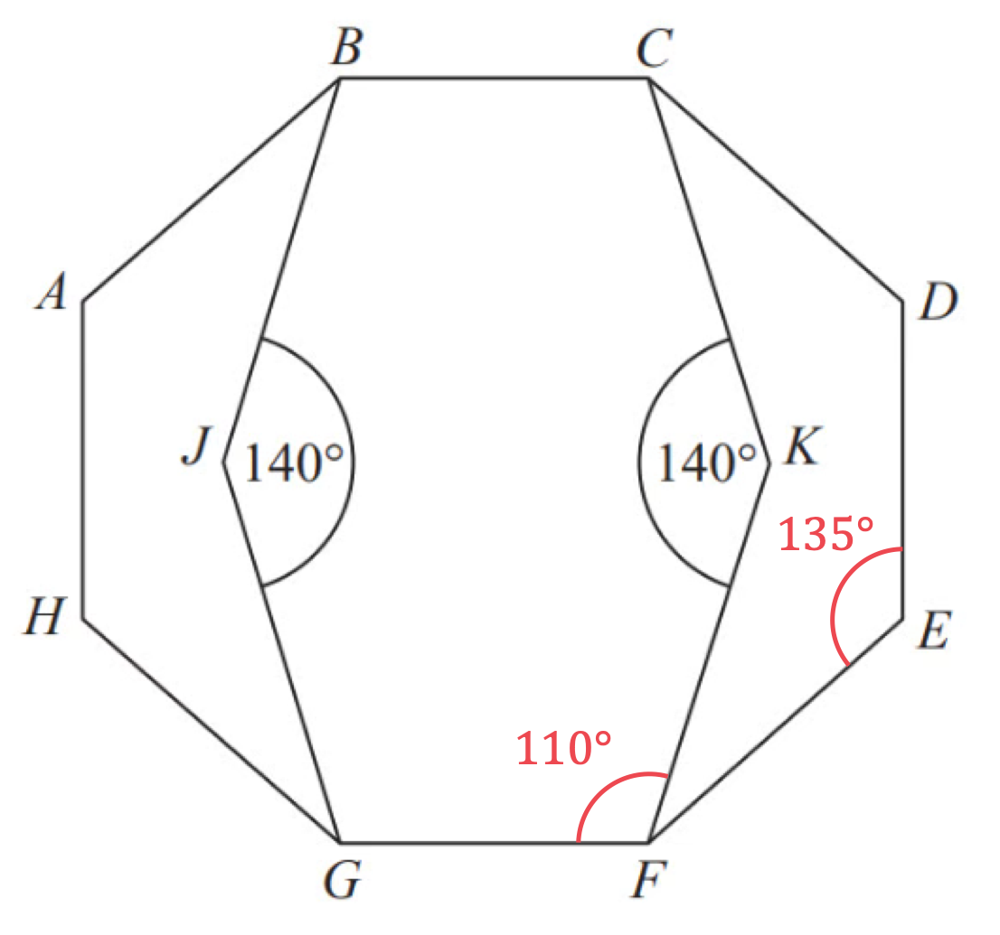

> *Find angle **KFE**.*

*Angle ***KFE*** + Angle ***GFK*** = interior angle of the regular octagon*

`table row cell Angle space K F E plus 110 end cell equals 135 row cell Angle space K F E end cell equals cell 135 minus 110 end cell end table`

**[1]**

$\mathrm{Angle}KFE=25^{\circ}$* ***[1]**

## Q27 — medium — 5 marks · exam-questions

### 8() — 5 marks
> *Label angle **ABC** and angle **BCD** as *$x$* and *$2x$* respectively.*

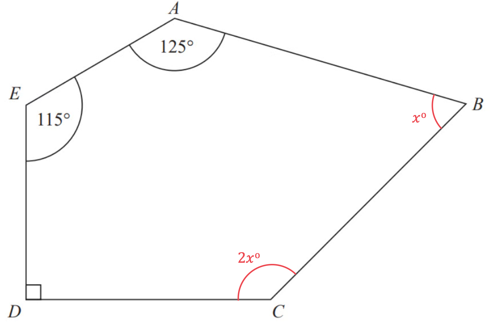

> *Find the sum of interior angles of a pentagon using: *`s u m space o f space i n t e r i o r space a n g l e s space equals space 180 open parentheses n minus 2 close parentheses`*, where *$n$* is the number of sides of the polygon.*

*Sum of interior angles = *`180 open parentheses 5 minus 2 close parentheses`

**[1]**

*Sum of interior angles = 540**o*

**[1]**

> *Form an equation for the sum of the interior angles of the pentagon using the values given in the diagram.*

$90+115+125+x+2x=540$

**[1]**

> *Simplify the equation by collecting like terms.*

$330+3x=540$

> *Subtract 330 from both sides.*

$3x=210$

**[1]**

> *Divide both sides by 3.*

$x=70^{\circ}$

> *Double to find angle **BCD**.*

**Final answer:** **Angle ****BCD****  = 140****o**** [1]**

**If you show the correct answer of 140****o**** but don't show any working, you won't receive any marks!**

## Q28 — very_hard — 4 marks · exam-questions

### 16() — 4 marks
> *The angles **x**+25 and 2**x**+35 form a straight line so add up to 180°. Form an equation.*

`open parentheses x plus 25 close parentheses plus open parentheses 2 x plus 35 close parentheses equals 180`

**[1]**

> *Simplify the left hand side and then solve.*

`table row cell 3 x plus 60 end cell equals 180 row cell 3 x end cell equals 120 row x equals 40 end table`

**[1]**

> *The lines are parallel if the angles 2x+35 and 5**x**-85 are equal as they would then be corresponding angles. Substitute **x**=40 into the expressions for the angles.*

$2\times40+35=115\,5\times40-85=115$

**[1]**

**AB**** and ****CD ****are ****parallel**** as the lines contain ****corresponding angles**** [1]**

## Q29 — hard — 4 marks · exam-questions

### 18() — 4 marks
> *The tiles all meet at a point with no gaps in between, so look at interior angles for each of the tiles.*

*Interior angle of an equilateral triangle = *$60^{\circ}$

**[1]**

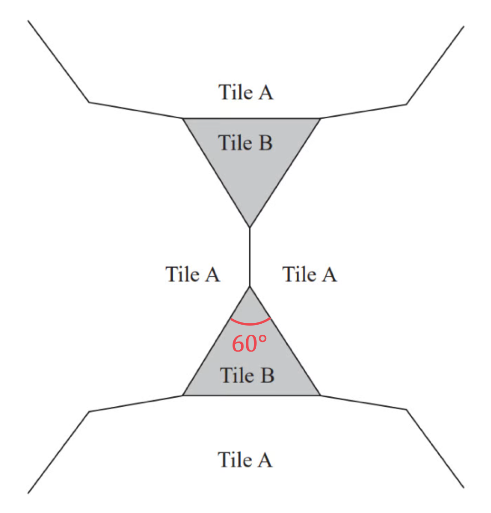

> *Find the interior angle of Tile A, given angles around a point = 360**o**.*

`table row cell 2 straight A plus 60 end cell equals 360 row cell 2 straight A end cell equals 300 row straight A equals cell 150 degree end cell end table`

**[1]**

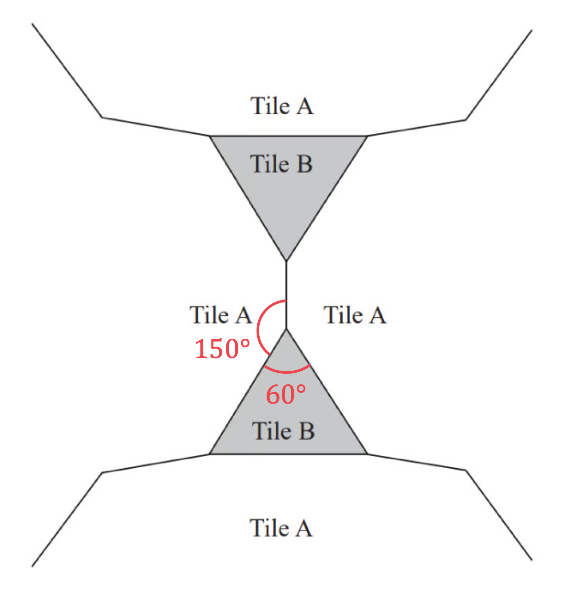

> *Find the exterior angle of Tile A by subtracting the interior angle from 180**o**.*

$180-150=30^{\circ}$

> *Find the number of sides of the polygon for Tile A using:  *$sizeofexteriorangle=\frac{360}{n}$

`table attributes columnalign right center left columnspacing 0px end attributes row 30 equals cell 360 over n end cell end table`

**[1]**

`table attributes columnalign right center left columnspacing 0px end attributes row n equals cell 360 over 30 end cell row n equals 12 end table`

**12 sides ****[1]**

## Q30 — medium — 4 marks · exam-questions

### 11() — 4 marks
> *Find the sum of the interior angles of a 10-sided polygon using the formula: *`Sum space of space Interior space Angles equals open parentheses n minus 2 close parentheses cross times 180 degree.`

`open parentheses 10 minus 2 close parentheses cross times 180 degree equals 1440 degree`

**[1]**

> *Form an equation and solve it to find the missing interior angle in the polygon.*

`table row cell y plus 148 plus 2 cross times open parentheses 150 plus 168 plus 134 plus 125 close parentheses end cell equals 1440 row cell y plus 1302 end cell equals 1440 row y equals 138 end table`

**[1]**

> *The angle **x** and this interior angle make a full turn. Subtract from 360 to find the value of **x**.*

$360-138$

**[1]**

$x=222$ **[1]**

## Q31 — very_hard — 6 marks · exam-questions

### 8((a)) — 3 marks
> *Method 1*

> *Find the exterior angle for each regular polygon using the formula *$\mathrm{Exterior} \mathrm{Angle}=\frac{360^{\circ}}{n}.$* Substitute **n** = 5 into the formula for the pentagon and **n** = 6 for the hexagon.*

$\frac{360^{\circ}}{5}=72^{\circ}\,\frac{360^{\circ}}{6}=60^{\circ}$

**Using the correct formula**** [1] **
**At least one correct angle**** [1]**

> *The angle **a** is made up by an exterior angle of the pentagon and an exterior angle of the hexagon. Add together the exterior angles to find **a**.*

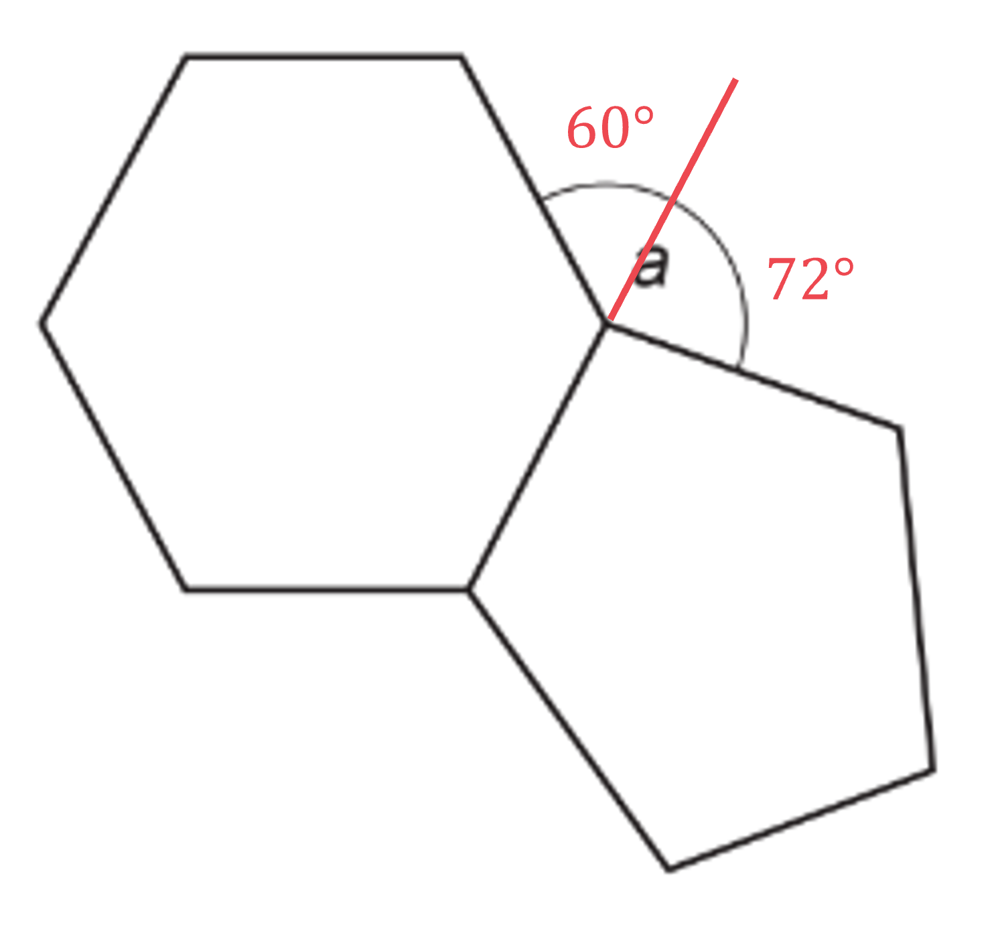

$a=72^{\circ}+60^{\circ}$

$a=132^{\circ}$ **[1]**

> *Method 2*

> *Find the interior angle for each regular polygon using the formula *`Interior space Angle equals fraction numerator open parentheses n minus 2 close parentheses cross times 180 degree over denominator n end fraction.`* Substitute **n** = 5 into the formula for the pentagon and **n** = 6 for the hexagon.*

`fraction numerator open parentheses 5 minus 2 close parentheses cross times 180 degree over denominator 5 end fraction equals fraction numerator 540 degree over denominator 5 end fraction equals 108 degree
fraction numerator open parentheses 6 minus 2 close parentheses cross times 180 degree over denominator 6 end fraction equals fraction numerator 720 degree over denominator 6 end fraction equals 120 degree`

**Using the correct formula**** [1]**
** ****At least one correct angle**** [1]**

> *The angle **a** and the two interior angles made a full turn. Subtract the interior angles from 360° to find the value of **a**.*

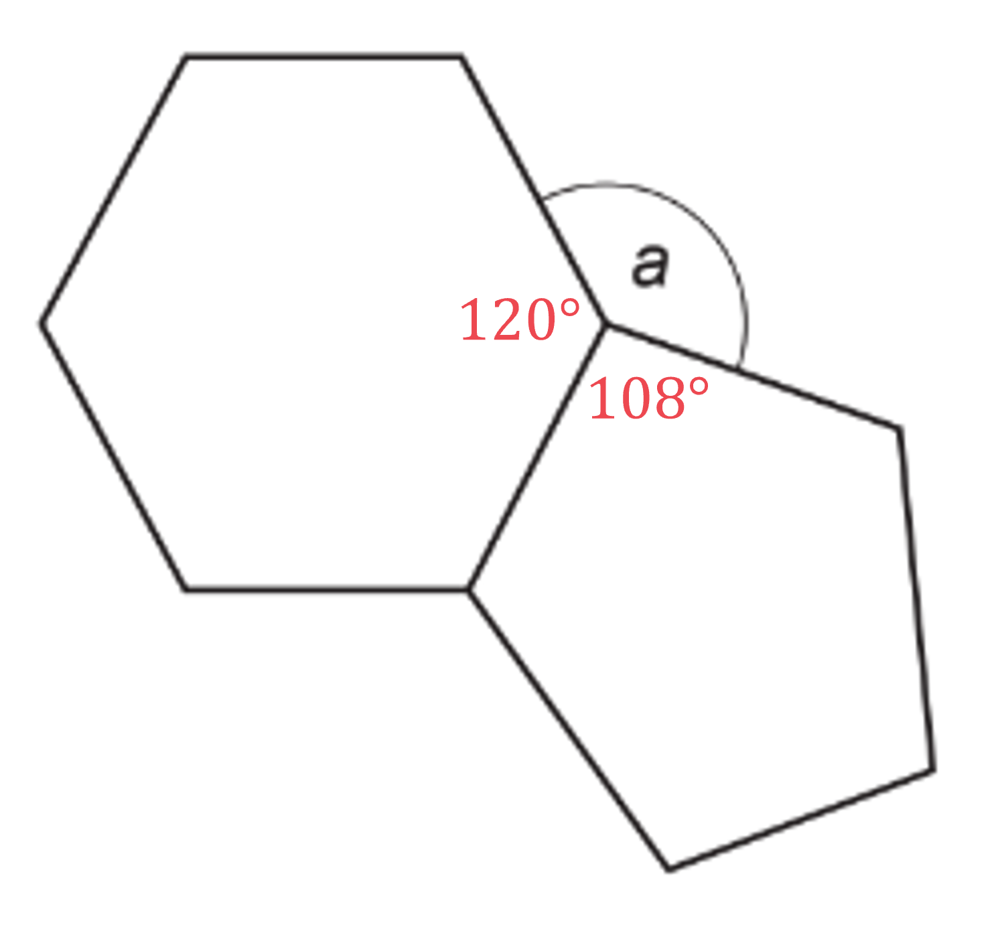

`table row straight a equals cell 360 degree minus open parentheses 108 degree plus 120 degree close parentheses end cell row blank equals cell 360 degree minus 228 degree end cell end table`

$a=132^{\circ}$ **[1]**

### 8((b)) — 3 marks
> *Find the exterior angle of the third polygon by subtracting **a** from 180°.*

$180^{\circ}-132^{\circ}=48^{\circ}$

**[1]**

> *If the **n**-sided polygon is regular then you can use the formula *$\mathrm{Exterior} \mathrm{Angle}=\frac{360^{\circ}}{n}.$* Substitute the values into the formula and rearrange.*

`table row 48 equals cell 360 over n end cell row n equals cell 360 over 48 end cell end table`

**[1]**

> *Simplify the fraction to determine if **n** is an integer.*

$n=\frac{360}{48}=\frac{15}{2}=7.5$

**Imran is ****incorrect**** as the number of sides (****n****) needs to be a ****positive integer** **[1]**

## Q32 — hard — 4 marks · exam-questions

### 17() — 4 marks
*Find the interior angle of a regular pentagon using: * `s i z e space o f space a n space i n t e r i o r space a n g l e space equals space fraction numerator 180 open parentheses n minus 2 close parentheses over denominator n end fraction`*.*

`fraction numerator 180 open parentheses 5 minus 2 close parentheses over denominator 5 end fraction`

**[1]**

$=108^{\circ}$

**[1]**

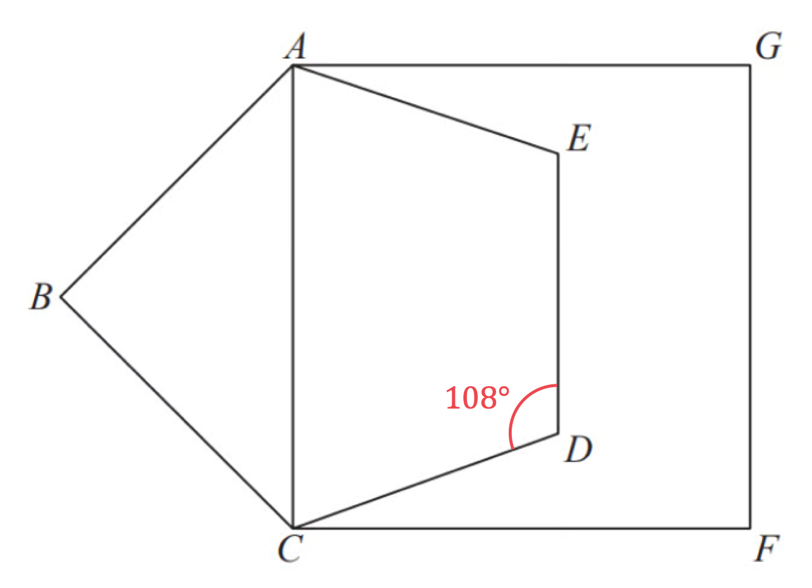

> *ACDE** is a trapezium with a line of symmetry running through the midpoint of **AC** and the midpoint of **DE**.*

> *Angle **ACD** = Angle **CAE**.*

*Let angle ***ACD*** = *$x$

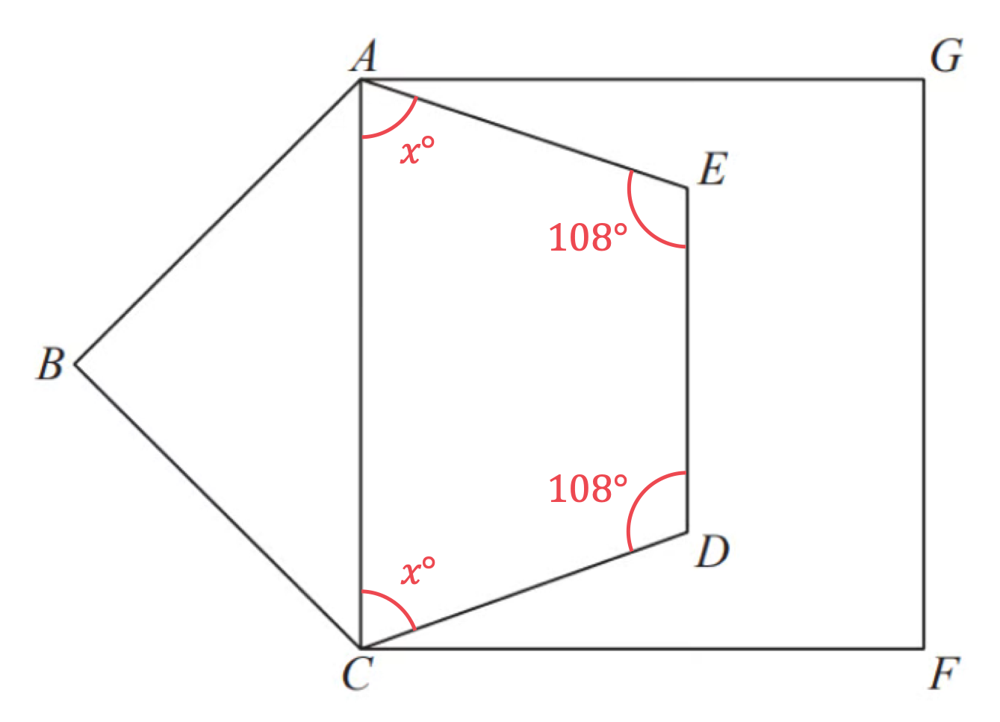

> *Find *$x$* using the sum of interior angles of a quadrilateral = 360**o**.*

`table attributes columnalign right center left columnspacing 0px end attributes row cell x plus x plus 108 plus 108 end cell equals 360 row cell 2 x plus 216 end cell equals 360 row cell 2 x end cell equals 144 row x equals 72 end table`

> *Find angle **DCF**.*

`table row cell Angle space D C F plus 72 space end cell equals cell space 90 end cell end table`

**[1]**

`table row cell bold Angle bold space bold italic D bold italic C bold italic F end cell bold equals cell bold 18 bold degree end cell end table`* ***[1]**

## Q33 — medium — 3 marks · exam-questions

### 2() — 3 marks
> *Subtract the interior angle from 180° to find the size of an exterior angle.*

$180^{\circ}-162^{\circ}=18^{\circ}$

**[1]**

> *Form an equation using the formula: *$\mathrm{Exterior} \mathrm{Angle}=\frac{360^{\circ}}{n}.$

$18=\frac{360}{n}$

**[1]**

> *Multiply both sides by **n** and then divide both sides by 18.*

`table row cell 18 n end cell equals 360 row n equals cell 360 over 18 end cell row n equals 20 end table`

**20 sides** **[1]**

## Q34 — very_hard — 5 marks · exam-questions

### 7() — 5 marks
> *Find the size of an interior angle of the regular polygons using the formula: *`Interior space Angle equals fraction numerator open parentheses n minus 2 close parentheses cross times 180 degree over denominator n end fraction.`* Substitute **n** = 10 and **n** = 18 into the formula.*

`fraction numerator open parentheses 10 minus 2 close parentheses cross times 180 degree over denominator 10 end fraction equals 144 degree
fraction numerator open parentheses 18 minus 2 close parentheses cross times 180 degree over denominator 18 end fraction equals 160 degree`

**[2] **
**1 mark for each correct formula**** [2] **
**1 mark for each correct interior angle**

> *Angle BAC is half the difference between the two interior angles. Subtract the interior angles and then divide by 2.*

$\frac{160-144}{2}=8$

**Angle BAC = 8° ****[1]**

## Q35 — hard — 4 marks · exam-questions

### 14() — 4 marks
> *Find the exterior angle of the regular octagon using: *$sizeofexteriorangle=\frac{360}{n}$*, where *$n$* is the number of sides of the polygon.*

$\frac{360}{8}=45^{\circ}$

**[1]**

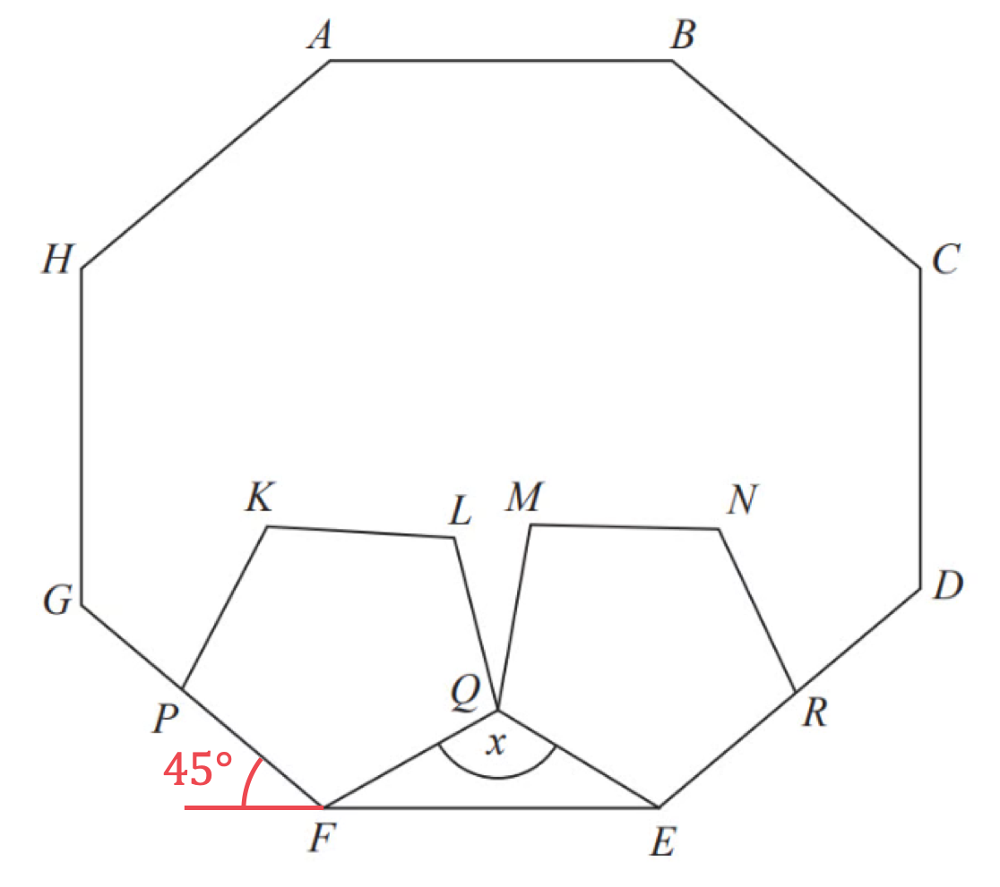

> *Find the interior angle of the regular pentagon using: *`s i z e space o f space i n t e r i o r space a n g l e space equals space fraction numerator 180 open parentheses n minus 2 close parentheses over denominator n end fraction`*, where *$n$* is the number of sides of the polygon.*

`fraction numerator 180 open parentheses 5 minus 2 close parentheses over denominator 5 end fraction equals 108 degree`

**[1]**

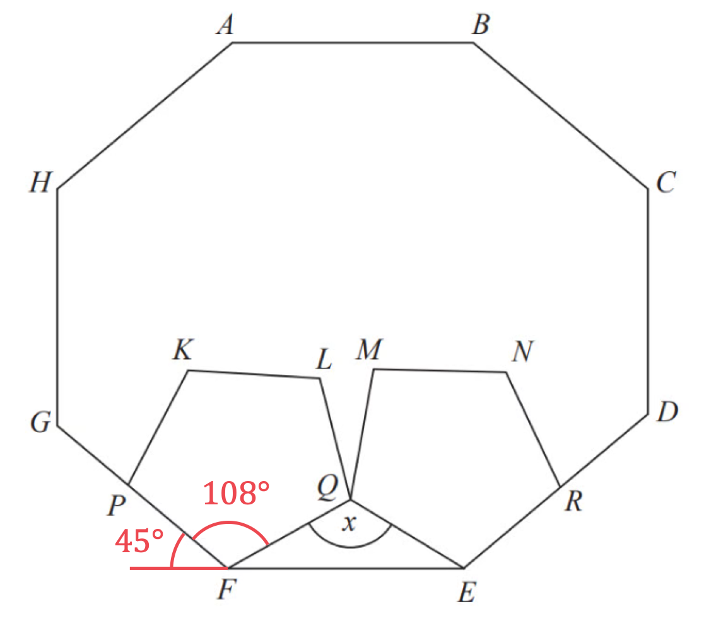

> *Find the angle **QFE**, using angles along a straight line = 180**o**.*

`table row cell 45 plus 108 plus Angle space Q F E end cell equals 180 row cell Angle space Q F E end cell equals cell 180 minus 45 minus 108 end cell row cell Angle space Q F E end cell equals cell 27 degree end cell end table`

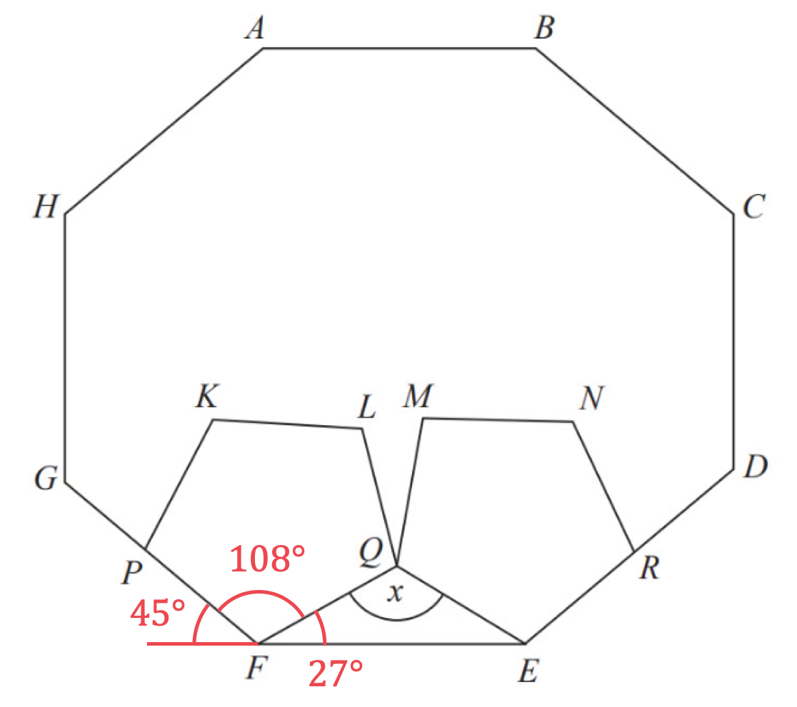

*Triangle **QFE** is an isosceles triangle because of symmetry.* *Find angle *$x$*.*

`table row cell 27 plus 27 plus x end cell equals 180 row x equals cell 180 minus 27 minus 27 end cell end table`

**[1]**

$x=126^{\circ}$* ***[1]**

## Q36 — medium — 4 marks · exam-questions

### 4() — 4 marks
> *The interior angles angles in a triangle add up to 180°. Use this to form an equation.*

`open parentheses 4 x plus 10 close parentheses plus open parentheses x plus 20 close parentheses plus 30 equals 180`

**Left hand side correct**** [1] **
**Correct equation**** [1]**

> *Simplify the left hand side of the equation by collecting like terms.*

$5x+60=180$

> *Subtract 60 from both sides.*

$5x=120$

**[1]**

> *Divide both sides by 5.*

$x=\frac{120}{5}$

$x=24$ **[1]**

## Q37 — hard — 4 marks · exam-questions

### 5() — 4 marks
> *Find the interior angle of the regular 12-sided polygon using:  *`s i z e space o f space i n t e r i o r space a n g l e space equals space fraction numerator 180 open parentheses n minus 2 close parentheses over denominator n end fraction`*, where *$n$* is the number of sides of the polygon.*

`fraction numerator 180 open parentheses 12 minus 2 close parentheses over denominator 12 end fraction equals 150 degree`

**[1]**

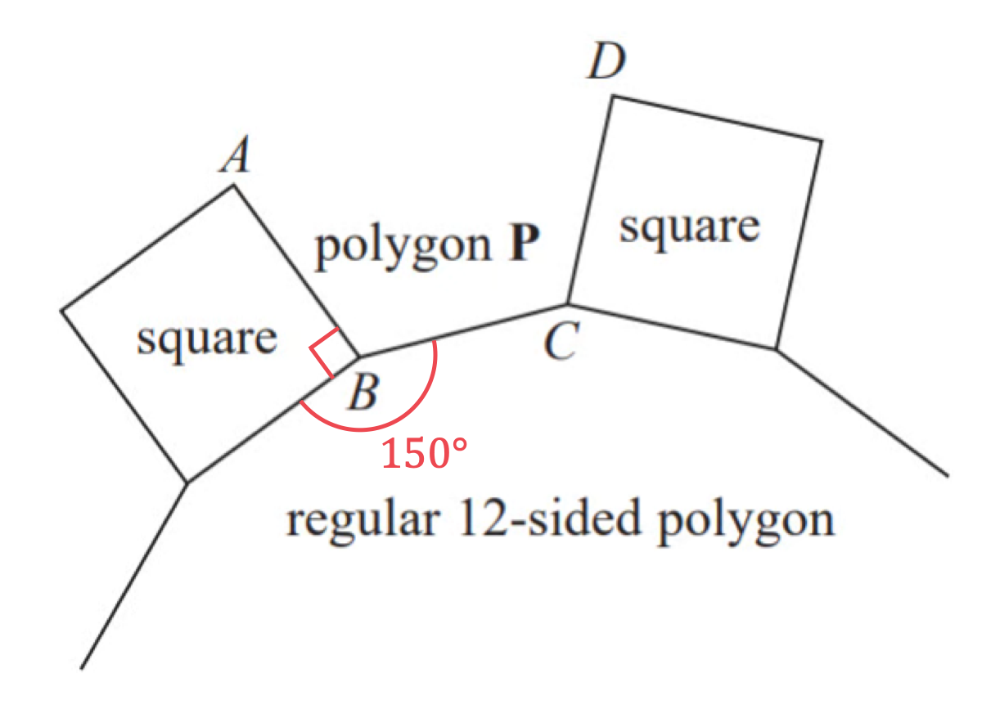

> *The interior angles of the square, regular 12-sided polygon and polygon P meet at a point with no gaps.*

> *Find the interior angle of polygon P, given that the angles around a point add up to 360**o**.*

`table attributes columnalign right center left columnspacing 0px end attributes row cell 90 plus 150 plus straight P end cell equals 360 end table`

**[1]**

`table row straight P equals cell 360 minus 90 minus 150 end cell row straight P equals cell 120 degree end cell end table`

**Correct values of 120 and 150 seen**** [1]**

> *Find the number of sides of polygon P.*

`table row cell fraction numerator 180 open parentheses n minus 2 close parentheses over denominator n end fraction end cell equals 120 row cell 180 open parentheses n minus 2 close parentheses end cell equals cell 120 n end cell row cell 180 n minus 360 end cell equals cell 120 n end cell row cell 180 n end cell equals cell 120 n plus 360 end cell row cell 60 n end cell equals 360 row n equals 6 end table`

**Polygon P has 6 sides so P is a hexagon**** [1]**

## Q38 — medium — 5 marks · exam-questions

### 3() — 5 marks
> *Method 1*

> *In a parallelogram each pair of adjacent angles are co-interior angles (allied angles) so they add up to 180°.*

*Angles ***BCD*** and*** CDA*** are co-interior angles so add up to 180°* `table row cell Angle space C D A end cell equals cell 180 degree minus 58 degree end cell row blank equals cell 122 degree end cell end table`

**[1]**

> *Vertically opposite angles that are formed by two intersecting lines are equal.*

*Angles ***CDA*** and ***EDF*** are vertically opposite so are equal* `table row cell Angle space E D F end cell equals cell 122 degree end cell end table`

> *In an isosceles triangle the base angles are equal.*

*Angles ***DEF ***and ***DFE*** are the base angles in an isosceles triangle so are equal* `table row cell Angle space D E F end cell equals cell Angle space D F E equals x degree end cell end table`

> *The interior angles in a triangle add up to 180°.*

*Angles ***EDF, DEF ***and ***DFE*** are the interior angles in a triangle so add up to 180°* `table row cell x degree plus x degree plus 122 degree end cell equals cell 180 degree end cell row cell 2 x plus 122 end cell equals 180 row cell 2 x end cell equals 58 row x equals 29 end table`

**[1]**

$\mathrm{Angle}DEF=29^{\circ}$ **[1] **
**One correct reason stated**** [1]** 
**All correct reasons stated**** [1]**

> *Method 2*

> *The lines **BC **and **AD** are parallel. Corresponding angles in parallel lines are equal.*

*Angles ***BCD*** and*** ADF*** are corresponding angles so are equal* `table row cell Angle space A D F end cell equals cell 58 degree end cell end table`

**[1]**

> *In an isosceles triangle the base angles are equal.*

*Angles ***DEF ***and ***DFE*** are the base angles in an isosceles triangle so are equal* `table attributes columnalign right center left columnspacing 0px end attributes row cell Angle space D E F end cell equals cell Angle space D F E equals x degree end cell end table`

> *The sum of two angles in a triangle is equal to the opposite exterior angle.*

*Angles ***DEF ***and ***DFE*** are two interior angles in a triangle opposite the exterior angle ***ADF*** so the sum of the two interior angles is equal to the exterior angle* `table row cell x degree plus x degree end cell equals cell 58 degree end cell row cell 2 x end cell equals 58 row x equals 29 end table`

**[1]**

$\mathrm{Angle}DEF=29^{\circ}$ **[1] **
**One correct reason stated**** [1]** 
**All correct reasons stated**** [1]**

## Q39 — hard — 5 marks · exam-questions

### 8() — 5 marks
> *Opposite angles in a parallelogram are equal.*

> *Form an equation in terms of *$x$* for the bottom left and top right angles.*

$5x-20=2x+43$

**[1]**

> *Subtract *$2x$* from both sides.*

$3x-20=43$

> *Add 20 to both sides.*

$3x=63$

**[1]**

> *Divide both sides by 3.*

$x=21$

> *Two adjacent angles in a parallelogram sum to 180**o** (co-interior angles in parallel lines).*

> *Form an equation in terms of *$x$* and *$y$* for the bottom right and top right angles.*

$2x+43+4y-5x=180$

> *Substitute *$x=21$* into equation.*

`2 open parentheses 21 close parentheses plus 43 plus 4 y minus 5 open parentheses 21 close parentheses equals 180`

> *Simplify.*

$-20+4y=180$

> *Add 20 to both sides.*

$4y=200$

**[1]**

> *Divide both sides by 4.*

$y=50$

$x=21$** **
** **$y=50$** **

**Correct value for **$x$** ****[1] **
**Correct value for **$y$** ****[1]**

## Q40 — medium — 1 marks · exam-questions

### 4() — 1 marks
> *A decagon has 10 sides. The formula for the for the exterior angle of a regular polygon is *$\mathrm{Exterior} \mathrm{Angle}=\frac{360^{\circ}}{n}.$

$\mathrm{Exterior} \mathrm{Angle}=\frac{360^{\circ}}{10}$

$36^{\circ}$** [1]**

## Q41 — hard — 3 marks · exam-questions

### 13() — 3 marks
> *Find the interior angle of the regular pentagon using:  *`s i z e space o f space i n t e r i o r space a n g l e space equals fraction numerator space 180 open parentheses n minus 2 close parentheses over denominator n end fraction`*, where *$n$* is the number of sides of the polygon.*

`fraction numerator 180 open parentheses 5 minus 2 close parentheses over denominator 5 space end fraction equals 108 degree`

**[1]**

> *The interior angle of a square is 90**o**.*

> *The square, two pentagons and *$x$* meet at a point with no gaps, so the angles must sum to 360**o**.*

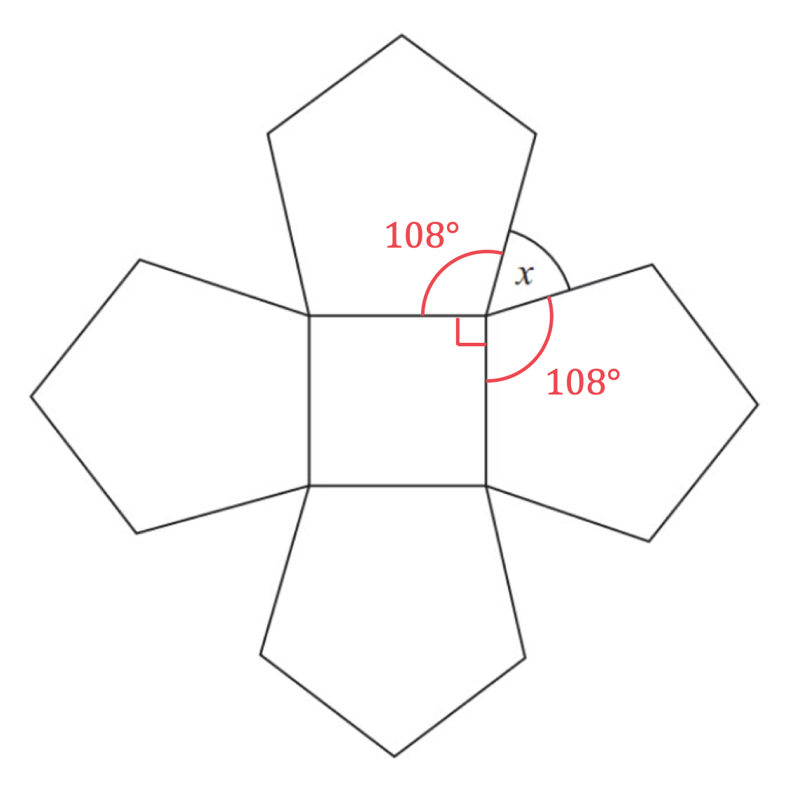

> *Form an equation in terms of *$x$*.*

$108+108+90+x=360$

> *Solve for *$x$*.*

$x=360-108-108-90$

**[1]**

$x=54^{\circ}$** ****[1]**

## Q42 — medium — 1 marks · exam-questions

### 9() — 1 marks
> *The formula for the for the exterior angle of a regular polygon is *$\mathrm{Exterior} \mathrm{Angle}=\frac{360^{\circ}}{n}.$* Substitute the 45 for the exterior angle.*

$45^{\circ}=\frac{360^{\circ}}{n}$

> *Solve by rearranging.*

`table row n equals cell 360 over 45 end cell row blank equals 8 end table`

> *Find the shape with 8 sides.*

**Final answer:** **Octagon**** [1]**

*A pentagon has 5 sides*** **
*A hexagon has 6 sides*** **
*A decagon has 10 sides*

## Q43 — hard — 4 marks · exam-questions

### 5() — 4 marks
> *AB** and **GE **are parallel lines.*

> *Find angle **GAD**.*

*Angle ***GAD*** = Angle ***CGE***   (Corresponding angles are equal)*

*Angle ***GAD*** = 55**o*

**[1]**

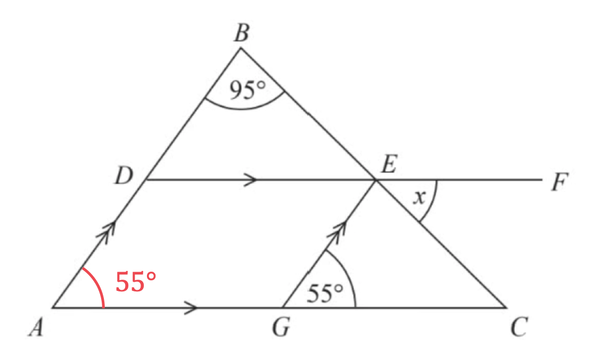

> *Find angle **ACB**.*

*Angle ***ACB*** + Angle ***BAC*** + Angle ***ABC*** = 180**o**   (Angles in a triangle = 180**o**)*

`table row cell Angle space A C B plus 55 plus 95 end cell equals 180 row cell Angle space A C B end cell equals cell 180 minus 55 minus 95 end cell row cell Angle space A C B end cell equals cell 30 degree end cell end table`

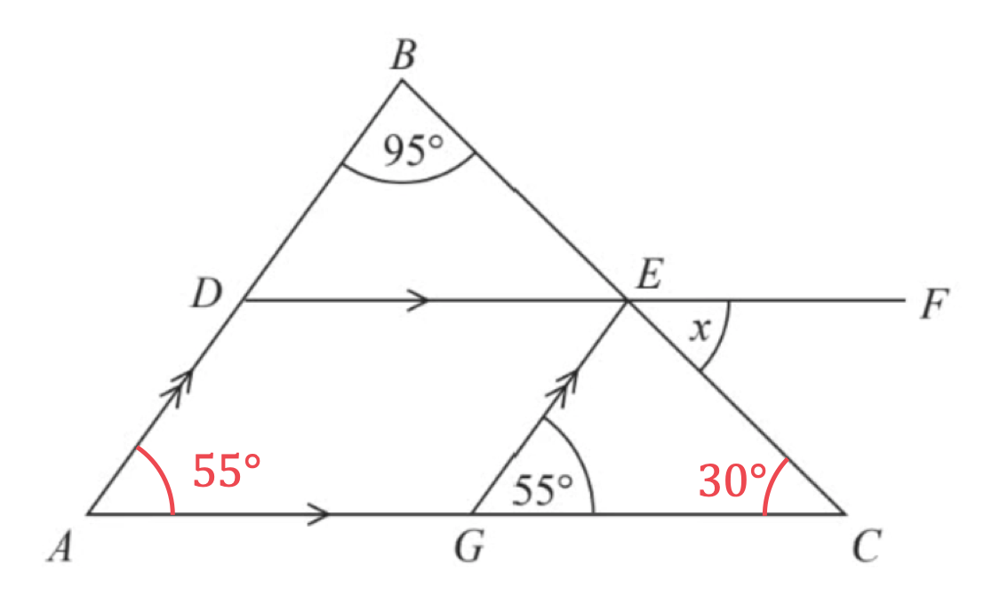

> *Find angle **DEB**.*

*Angle ***DEB*** = Angle ***ACB***  (Corresponding angles are equal)*

*Angle ***DEB*** = 30**o*

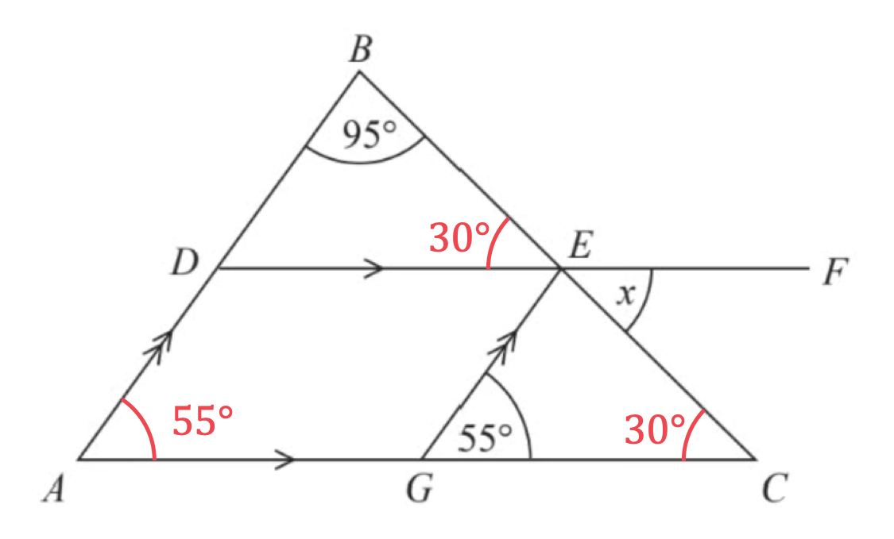

> *Find *$x$*.*

*Angle ***CEF ***= Angle ***DEB   ***(Vertically opposite angles)*

$x=30^{\circ}$* ***[1]**

**One appropriate reason relating to parallel lines**** [1] **
**Full reasoning given appropriate to the method**** [1]**

## Q44 — medium — 2 marks · exam-questions

### 12() — 2 marks
> *Method 1*

> *The formula for the sum of the interior angles of an **n**-sided polygon is *`open parentheses n minus 2 close parentheses cross times 180 degree.`* Substitute **n** = 15 into the formula.*

`open parentheses 15 minus 2 close parentheses cross times 180 degree equals 2340 degree`

**[1]**

> *It is a regular polygon so all the angles are the same. Divide by 15 to find the size of each interior angle.*

$\frac{2340}{15}=156$

**156 degrees** **[1]**

> *Method 2*

> *The formula for the external angle of a regular **n**-sided polygon is *$\frac{360^{\circ}}{n}.$* Substitute **n** = 15 into the formula.*

$\frac{360^{\circ}}{15}=24^{\circ}$

**[1]**

> *An exterior angle and its corresponding interior angle form a straight line so add up to 180°. Subtract the exterior angle from 180.*

$180-24=156$

**156 degrees** **[1]**

## Q45 — hard — 3 marks · exam-questions

### 11() — 3 marks
> *Calculate the exterior angle of a regular pentagon by dividing 360**o** by 5.*

$\frac{360}{5}=72^{\circ}$

**[1]**

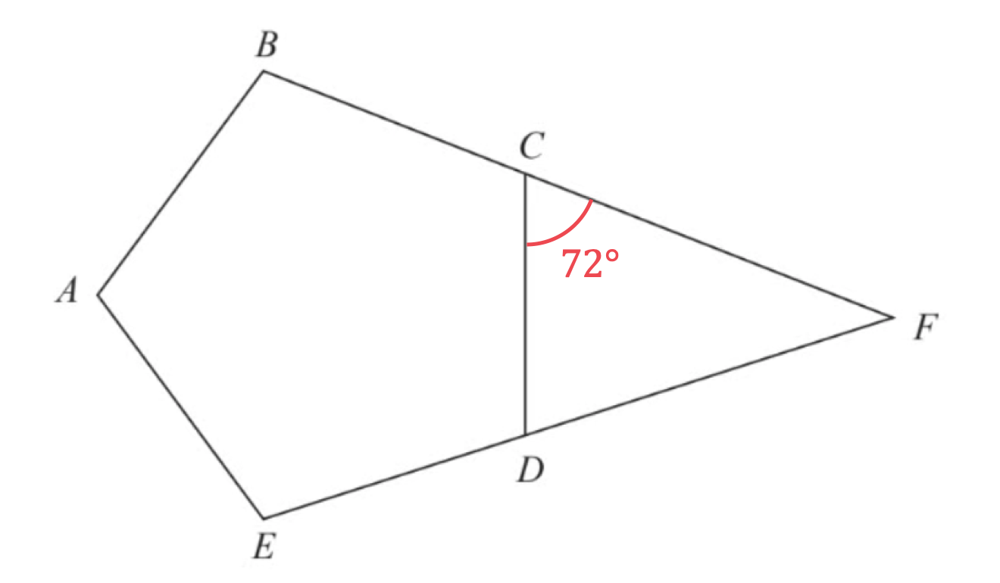

> *CF** and **DF** are of equal length, so triangle **CDF** is an isosceles triangle.*

> *Work out angle **CDF**.*

*Angle ***CDF ***= Angle ***DCF**

*Angle ***CDF*** = 72**o*

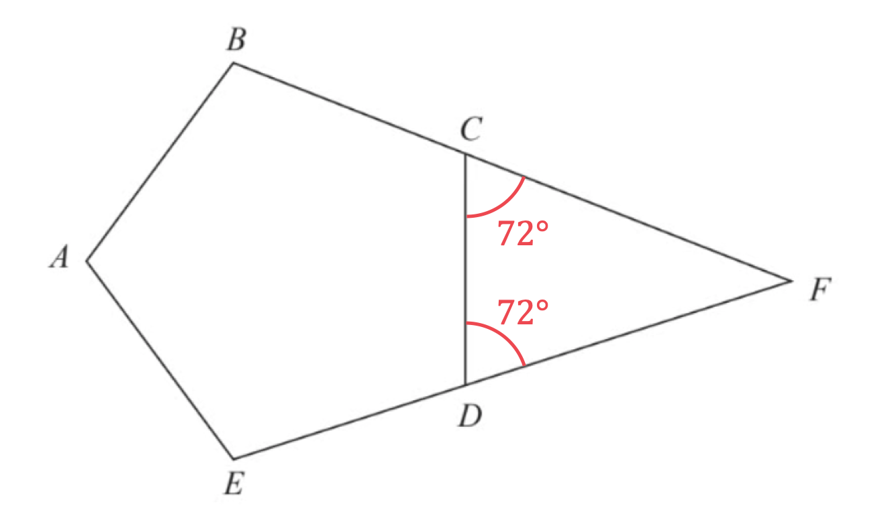

> *Work out angle **CFD**.*

*Angle ***CFD*** + Angle ***DCF*** + Angle ***CDF*** = 180**o**   (Angles in a triangle = 180**o**)*

`table row cell Angle space C F D plus 72 plus 72 end cell equals 180 row cell Angle space C F D end cell equals cell 180 minus 72 minus 72 end cell end table`

**[1]**

**Angle ****CFD**** = 36****o**** ****[1]**

## Q46 — medium — 2 marks · exam-questions

### 7() — 2 marks
> *The formula for the sum of the interior angles in an **n**-sided polygon is *`open parentheses n minus 2 close parentheses cross times 180 degree.`* This could be shown by splitting a pentagon into 3 triangles. Substitute **n** = 5 into the formula.*

`open parentheses 5 minus 2 close parentheses cross times 180 equals 540`

**[1]**

**No**** because the sum of the angles in any pentagon is ****540°** **[1]**

## Q47 — hard — 3 marks · exam-questions

### 14() — 3 marks
> *First find the size of angle **b**. Start by dividing 90 (the size of angle **a**) by 5 (the 'angle **a**' number in the ratio).*

$90\div5=18^{\circ}$

> *That gives the size of one of the 'parts' that the ratio divides the angles into. Now multiply that by 3 (the 'angle **b**' number in the ratio) to find the size of angle **b**.*

$b=18\times3=54^{\circ}$

**[1]**

> *Next find the size of angle **x**. The angles in a quadrilateral always add up to 360 degrees. So angles **x **and **y **together must be equal to 360 degrees minus angles **a** and **b.*

`x space plus space y space equals space 360 space minus space open parentheses 90 space plus space 54 close parentheses space equals space 216 degree`

> *Divide that by 4 (the sum of the **x** : **y** ratio numbers) to find the size of one of the 'parts' that that ratio divides the 216 degrees into. And then because the '**x** number' in the ratio is 1, that part is the same as the size of angle **x.*

$216\div4=54\,\,x=1\times54=54^{\circ}$

**[1]**

> *Finally, state your conclusion.*

**b**** = 54° and ****x ****= 54****°.  ****Therefore ****b**** = ****x.****  [1]**

## Q48 — medium — 3 marks · exam-questions

### 15() — 3 marks
> *"The quadrilateral is a rectangle". This is only true if the interior angles are right-angles. We don't know if they are or not, so this **may be true**.*

> *"The quadrilateral is a parallelogram". This is **true** not matter what the interior angles are, as opposite sides are equal.*

> *"The quadrilateral is a rhombus". This can only be true if the sides are all the same length. We know that two sides are twice the length of the other two, so it is **not true**.*

> *"The quadrilateral is a kite". This can only be true if the equal length sides are adjacent to each other. But here the equal length sides are opposite each other. So this statement is **not true**.*

|   | **True** | **May be true** | **Not true** |
|---|---|---|---|
| The quadrilateral is a rectangle |   | **Final answer:** **✓** |   |
| The quadrilateral is a parallelogram | **Final answer:** **✓** |   |   |
| The quadrilateral is a rhombus |   |   | **Final answer:** **✓** |
| The quadrilateral is a kite |   |   | **Final answer:** **✓** |

**one or two correct ****[1]** 
**three correct ****[1]** 
**all correct ****[1]**

## Q49 — hard — 6 marks · exam-questions

### 9((a)) — 2 marks
> *Start by rearranging the equation so that you have  *$\frac{p}{q}$* alone on one side of it.*

$5p=q\,\,\frac{5p}{q}=1\,\,\frac{p}{q}=\frac{1}{5}$

**[1]**

> *Now you can just read the ratio off of the fractions. *
*If two fractions are equal, then the ratios of the numerator to the denominator in each one are also equal.*

**p**** : ****q**** = 1 : 5****  [1]**

### 9((b)) — 4 marks
> *Remember that in any polygon, an interior angle and its corresponding exterior angle add up to 180° *
*Therefore  **p** + **q** = 180.*

> *Now add up the ratio numbers from the ratio in part (a) to find how many 'parts' the ratio divides the 180° into. *
*Then divide 180° by that sum to find the size of one part.*

$1+5=6\,\,180\div6=30$

**[1]**

> *So each part is 30°. *
*And the **p  **number in the ratio is 1. *
*That means that **p** gets 1 part, i.e. that  **p** = 30.*

$p=30\times1=30$

**[1]**

> *Now there are two possibilities:*

> *1)  **p**  is one of the equal angles in the isosceles triangle.      Then there is another angle equal to 30°.      And the third angle is equal to (180 - (30 + 30))°.*

`180 space minus space open parentheses 30 plus 30 close parentheses space equals space 180 space minus space 60 space equals space 120`

> *2)  **p**  is not one of the equal angles in the isosceles triangle.      Then the other two angles are the equal angles.      And each is equal to ((180 - 30) ÷ 2)°.*

`table attributes columnalign right center left columnspacing 0px end attributes row cell open parentheses 180 space minus space 30 close parentheses space divided by space 2 space end cell equals cell space 150 space divided by space 2 space equals space 75 end cell end table`

**Triangle 1:  30°, 30****°, 120°****       **
**Triangle 2:  30°, 75****°, 75°****  [2]**

**1 mark for each set of correct angles for one triangle. (It doesn't matter which one you call 'Triangle 1' and which one you call 'Triangle 2'!)**

## Q50 — medium — 1 marks · exam-questions

### 13() — 1 marks
> *You are expected to know the properties of quadrilaterals- including the rhombus- for your GCSE exams. If in doubt, sketch a rhombus:*

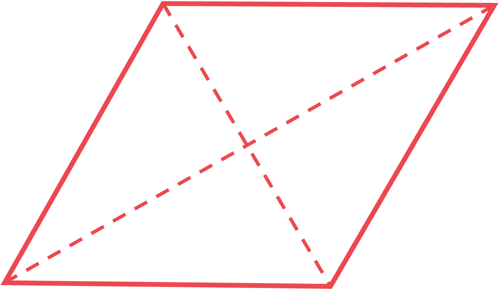

> *The diagonals are **not** equal in length. However the other three statements are correct.*

`down diagonal up diagonal strike square` The diagonals are lines of symmetry

`down diagonal up diagonal strike square`  The diagonals bisect each other.

`down diagonal up diagonal strike square`  The diagonals are perpendicular.

`square`  The diagonals are equal in length.

## Q51 — hard — 5 marks · exam-questions

### 10() — 5 marks
> *Calculate the sum of interior angles for a pentagon using *`open parentheses n minus 2 close parentheses cross times 180`

`open parentheses 5 minus 2 close parentheses cross times 180 equals 540`

> *Calculate one interior angle of a regular pentagon*

$540\div5=108$

**[M1]**

> *Calculate the sum of interior angles for an octagon*

`open parentheses 8 minus 2 close parentheses cross times 180 equals 1080`

> *Calculate one interior angle of a regular octagon*

$1080\div8=135$

**[M1]**

> *Triangle ABC is isosceles as it shares two of its side lengths with the regular pentagons, therefore angles CAB and ABC are equal*

> *Calculate angles CAB and ABC*

*135-108=27*

**[M1]**

> *Calculate angle *$y$*using the sum of angles in a triangle rule*

`180 minus open parentheses 27 plus 27 close parentheses equals 126`

**[M1]**

**Final answer:** $y=$**126****o**

**[A1]**

## Q52 — medium — 3 marks · exam-questions

### 5((a)) — 2 marks
> *The formula for the size of an exterior angle of a regular **n**-sided polygon is *$\mathrm{Exterior} \mathrm{Angle}=\frac{360^{\circ}}{n}.$* Substitute **n **= 12 into the formula.*

$\mathrm{Exterior} \mathrm{Angle}=\frac{360^{\circ}}{12}$

**[1]**

**Exterior Angle = 30°** **[1]**

### 5((b)) — 1 marks
> *An exterior angle and its corresponding interior angle form a straight line so therefore add up to 180°. Subtract the exterior angle from 180° to find the interior angle.*

$\mathrm{Interior} \mathrm{Angle}=180^{\circ}-30^{\circ}$

**Interior Angle = 150°** **[1]**

## Q53 — medium — 5 marks · exam-questions

### 9((a)) — 2 marks
**Angle DCE = **$a^{\circ}$** because it is ****corresponding to angle BAC ****[1]**

### 9((b)) — 3 marks
> *Look for other angles that you can find using the parallel lines.*

*Angle BCD = *$b^{\circ}$* because it is alternate to angle ABC*

**Correctly identifying**** ****b****° [1]*** *
**Correct reason**** [1]**

> *Look at the angles at point C that form a straight line. They are the same three angles as the interior angles in the triangle.*

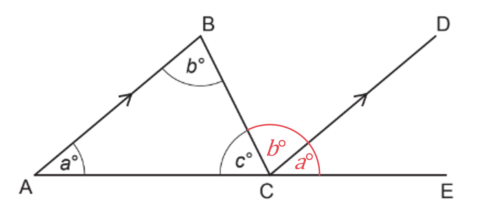

$a^{\circ}+b^{\circ}+c^{\circ}=180^{\circ}$* because angles that form a straight line add up to 180°*

**Therefore the angles in a triangle add up to 180° **** [1]**

## Q54 — medium — 3 marks · exam-questions

### 11() — 3 marks
> *Calculate angle FOE; it is an angle at the centre of a 9-sided regular polygon, so*

$\mathrm{angle}FOE=360\div9=40$

**[M1]**

> *You can use this to calculate angle OFE, as triangle FOE is an isosceles triangle*

$\mathrm{angle}OFE=\frac{180-40}{2}=70$

> *Angle FOD must be double angle FOE*

$\mathrm{angle}FOD=40\times2=80$

**[M1]**

> *Then calculate *$x$* using the sum of angles in triangle FOK*

$180-70-80=30$

**Final answer:** **30**

**[A1]**
