# Exam Questions — Angles in Polygons & Parallel Lines
**Geometry** · Edexcel IGCSE Maths A (Modular) (4XMAF/4XMAH) — 24/Higher Unit 2
> Source: [https://www.savemyexams.com/igcse/maths/edexcel/a-modular/24/higher-unit-2/topic-questions/geometry/angles-in-polygons-and-parallel-lines/exam-questions/](https://www.savemyexams.com/igcse/maths/edexcel/a-modular/24/higher-unit-2/topic-questions/geometry/angles-in-polygons-and-parallel-lines/exam-questions/) · 54 questions · total 202 marks

## Q1 — very_hard — 4 marks · exam-questions

### 12() — 4 marks — command: work_out — structured — from paper June 2016 · 1MA0/2H
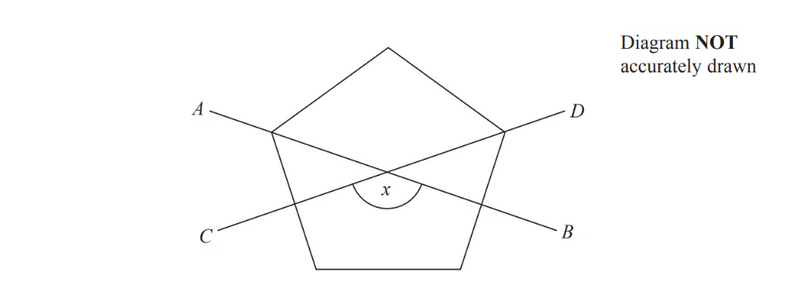

The diagram shows a regular pentagon.
 $AB$ and $CD$ are two of the lines of symmetry of the pentagon.

Work out the size of the angle marked $x$. 
You must show all your working.

## Q2 — hard — 4 marks · exam-questions

### 6() — 4 marks — command: calculate — structured — from paper November 2012 · 1MA0/2H
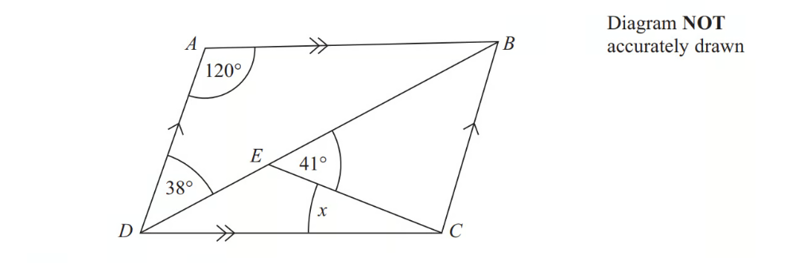

$ABCD$ is a parallelogram.

Angle $ADB=38^{\circ}$. 
Angle $BEC=41^{\circ}$. 
Angle $DAB=120^{\circ}$.

Calculate the size of angle $x$. 
You must give reasons for your answer.

## Q3 — medium — 3 marks · exam-questions

### 1() — 3 marks — command: work_out — structured — from paper June 2012 · 1MA0/2H
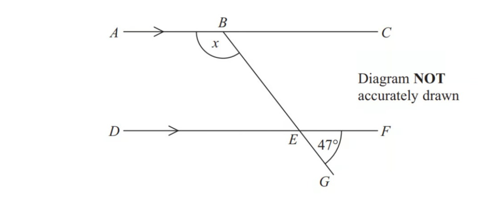

$ABC$ and $DEF$ are parallel lines. 
$BEG$ is a straight line. 
Angle $GEF=47^{\circ}$.

Work out the size of the angle marked $x$. 
Give reasons for your answer.

## Q4 — very_hard — 3 marks · exam-questions

### 5() — 3 marks — command: work_out — structured — from paper June 2017 · 1MA0/1H
Here is a pentagon $ABCDE$.

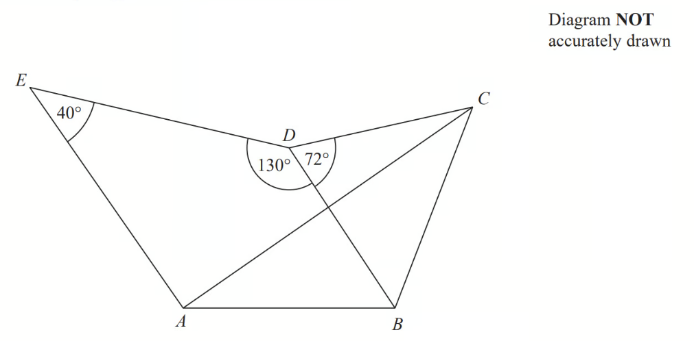

$AB=BC=BD$
 $ABDE$ is a kite.

Angle $AED=40^{\circ}$ 
Angle $EDB=130^{\circ}$ 
Angle $BDC=72^{\circ}$

Work out the size of angle $ACB$.

## Q5 — hard — 4 marks · exam-questions

### 8() — 4 marks — command: work_out — structured — from paper November 2014 · 1MA0/1H
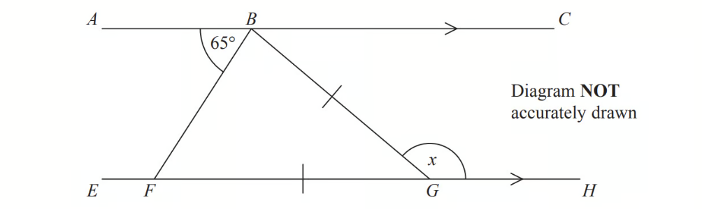

$ABC$ is parallel to $EFGH$.

$GB=GF$ 
Angle $ABF=65^{\circ}$

Work out the size of the angle marked $x$. 
Give reasons for your answer.

## Q6 — medium — 4 marks · exam-questions

### 9() — 4 marks — command: work_out — structured — from paper June 2013 · 1MA0/2H
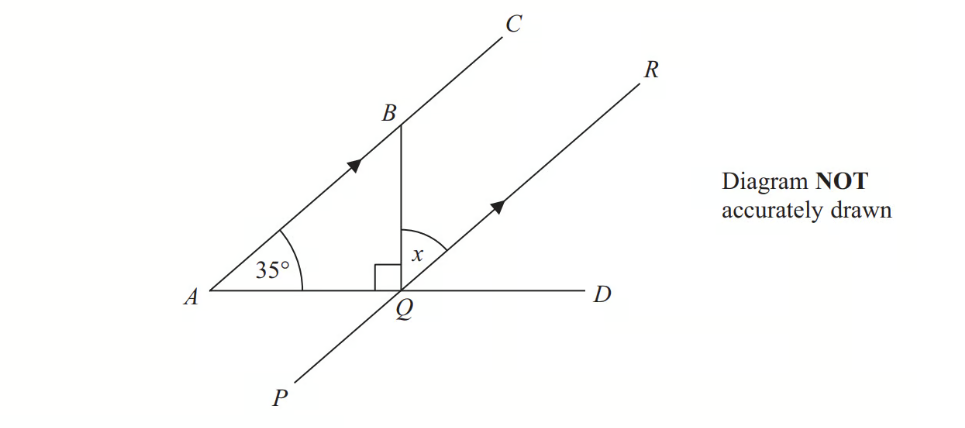

$ABC,PQR$ and $AQD$ are straight lines.
 $ABC$ is parallel to $PQR$.

Angle $BAQ=35^{\circ}$ 
Angle $BQA=90^{\circ}$

Work out the size of the angle marked $x$. 
Give reasons for each stage of your working.

## Q7 — very_hard — 4 marks · exam-questions

### 15() — 4 marks — command: work_out — structured — from paper June 2017 · 1MA0/2H
$ABCDEFGHI$ is a regular 9-sided polygon.

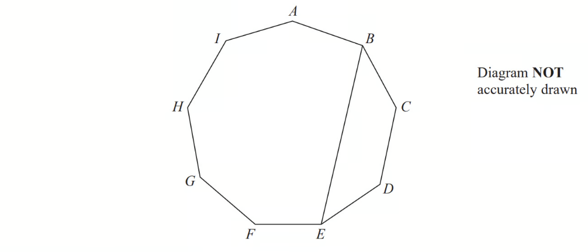

The vertices $B$ and $E$ are joined with a straight line.

Work out the size of angle $BEF$. 
You must show how you get your answer.

## Q8 — hard — 4 marks · exam-questions

### 6() — 4 marks — command: work_out — structured — from paper November 2015 · 1MA0/1H
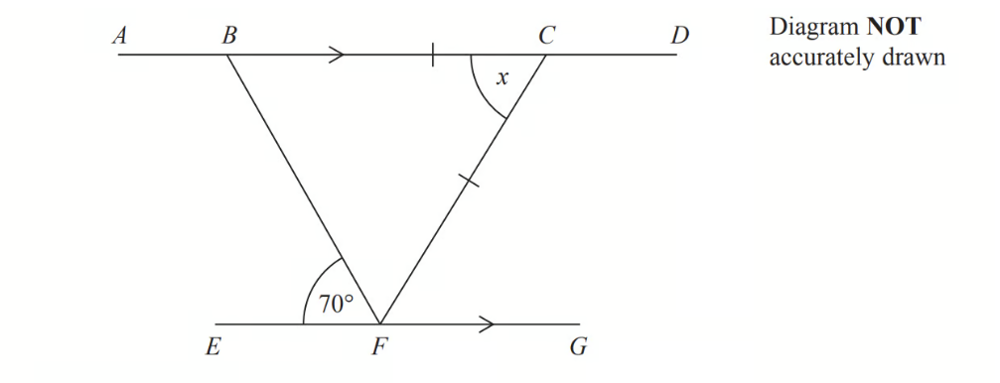

$ABCD$ and $EFG$ are parallel lines.
 $BC=CF$ 
Angle $BFE=70^{\circ}$

Work out the size of the angle marked $x$. 
Give reasons for each stage of your working.

## Q9 — medium — 3 marks · exam-questions

### 7() — 3 marks — command: work_out — structured — from paper June 2014 · 1MA0/2H
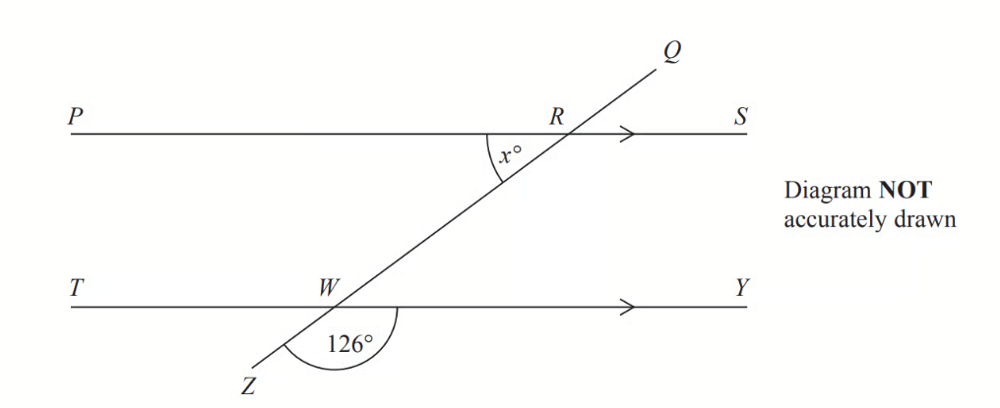

$PRS$ and $TWY$ are parallel straight lines. 
$QRWZ$ is a straight line.

Work out the value of $x$. 
Give reasons for your answer.

## Q10 — very_hard — 4 marks · exam-questions

### 5() — 4 marks — command: work_out — structured — from paper June 2019 · 1MA1/3H
The diagram shows a hexagon.
 The hexagon has one line of symmetry.

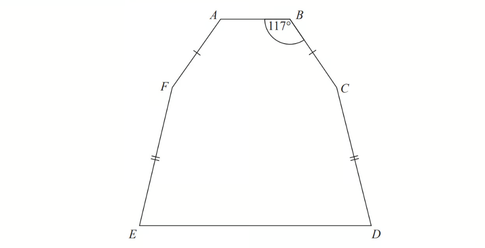

$FA=BC$ 
$EF=CD$ 
Angle $ABC=117^{\circ}$

Angle $BCD=2\times$ angle $CDE$.

Work out the size of angle $AFE$. 
You must show all your working.

## Q11 — hard — 4 marks · exam-questions

### 9() — 4 marks — command: work_out — structured — from paper June 2016 · 1MA0/2H
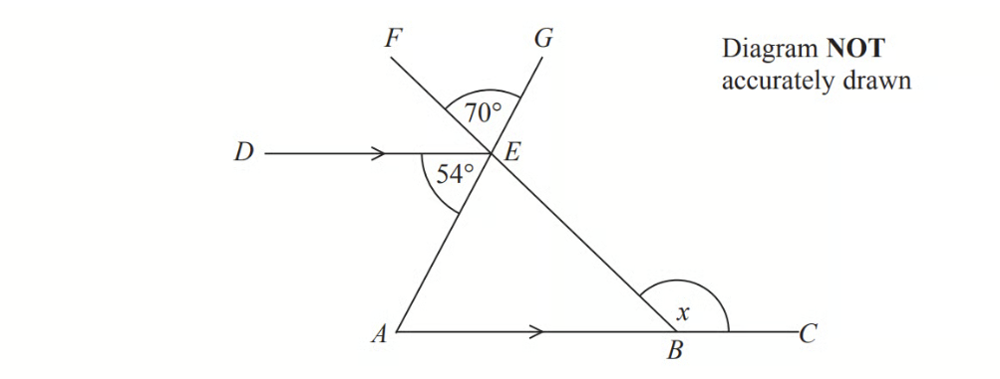

$ABC$ and $DE$ are parallel lines.
 $AEG$ and $BEF$ are straight lines.

Angle $AED=54^{\circ}$ 
Angle $FEG=70^{\circ}$

Work out the size of the angle marked $x$. 
Give a reason for each stage of your working.

## Q12 — medium — 4 marks · exam-questions

### 12() — 4 marks — command: work_out — structured — from paper June 2015 · 1MA0/1H
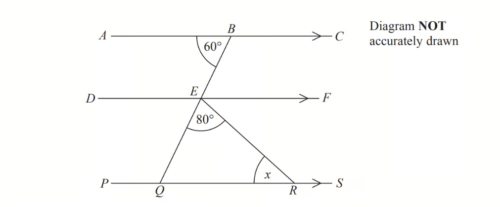

$ABC,DEF$ and $PQRS$ are parallel lines. 
$BEQ$ is a straight line.

Angle $ABE=60^{\circ}$. 
Angle $QER=80^{\circ}$.

Work out the size of the angle marked $x$. 
Give reasons for each stage of your working.

## Q13 — very_hard — 5 marks · exam-questions

### 20() — 5 marks — command: prove — structured — from paper 2015 Spec2 · 1MA1/2H
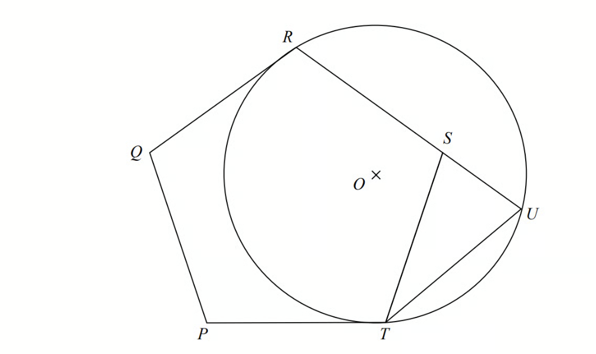

$PQRST$ is a regular pentagon.
 $R,U$ and $T$ are points on a circle, centre $O$.
 $QR$ and $PT$ are tangents to the circle.
 $RSU$ is a straight line.

Prove that $ST=UT$.

## Q14 — hard — 4 marks · exam-questions

### 9() — 4 marks — command: work_out — structured — from paper November 2016 · 1MA0/1H
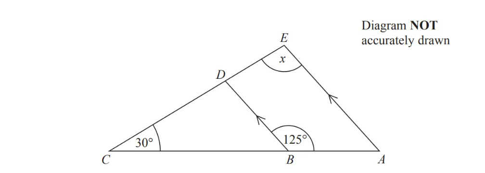

$ABC$ and $EDC$ are straight lines. 
$AE$ and $BD$ are parallel.
 Angle $ABD=125^{\circ}$ 
Angle $BCD=30^{\circ}$

Work out the size of the angle marked $x$. 
Give reasons for your answer.

## Q15 — medium — 3 marks · exam-questions

### 25() — 3 marks — command: find — structured — from paper Spec2 · 1MA1/2H
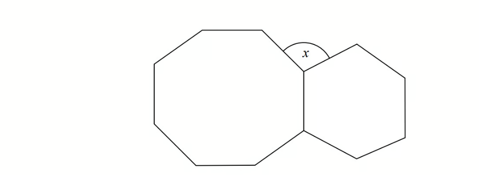

The diagram shows a regular octagon and a regular hexagon.

Find the size of the angle marked $x$. 
You must show all your working.

## Q16 — very_hard — 4 marks · exam-questions

### 11() — 4 marks — command: show — structured — from paper Jan 2022 · 4MA1/2H
The diagram shows a regular 10-sided polygon, $ABCDEFGHIJ$

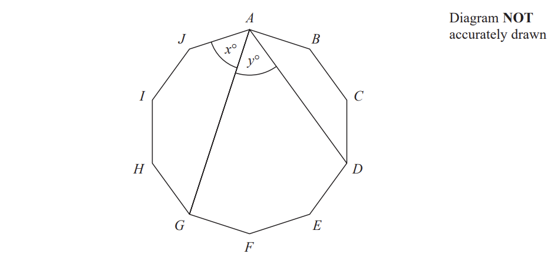

Show that $x=y$.

## Q17 — hard — 4 marks · exam-questions

### 3() — 4 marks — command: show — structured — from paper November 2017 · 1MA1/1H
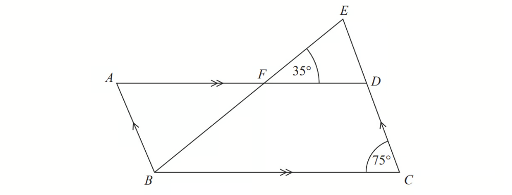

$ABCD$ is a parallelogram. 
$EDC$ is a straight line.
 $F$ is the point on $AD$ so that $BFE$ is a straight line.

Angle $EFD=35^{\circ}$ 
Angle $DCB=75^{\circ}$

Show that angle $ABF=70^{\circ}$ 
Give a reason for each stage of your working.

## Q18 — medium — 3 marks · exam-questions

### 14() — 3 marks — command: work_out — structured — from paper November 2016 · 1MA0/2H
$ABCDE$ and $PQRST$ are regular pentagons.

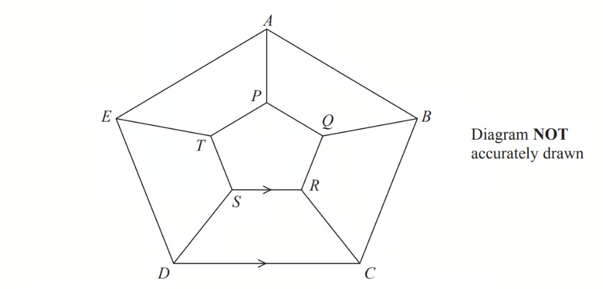

$SR$ is parallel to $DC$. 
$AP=BQ=CR=DS=ET$

Work out the size of angle $SRC$. 
You must show all your working.

## Q19 — very_hard — 4 marks · exam-questions

### 4() — 4 marks — command: work_out — structured — from paper Jan 2022 · 4MA1/2HR
The diagram shows a regular octagon $ABCDEFGH$ and a regular pentagon $ABIJK$

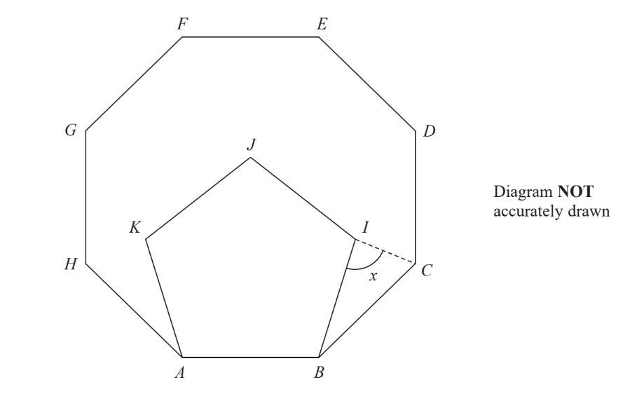

Work out the size of the angle$x$.

## Q20 — hard — 3 marks · exam-questions

### 23() — 3 marks — command: work_out — structured — from paper Sample 2015 · 1MA1/1H
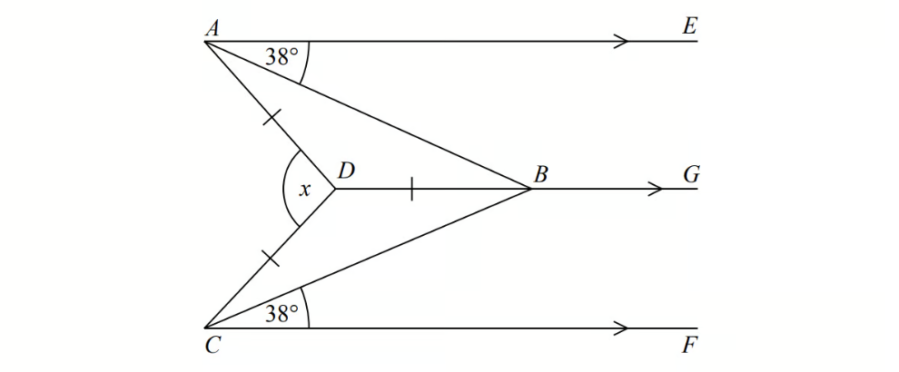

$AE,DBG$ and $CF$ are parallel
. $DA=DB=DC$. 
Angle $EAB=$ angle $BCF=38^{\circ}$

Work out the size of the angle marked $x$.
 You must show your working.

## Q21 — medium — 3 marks · exam-questions

### 12() — 3 marks — command: work_out — structured — from paper November 2017 · 1MA1/2H
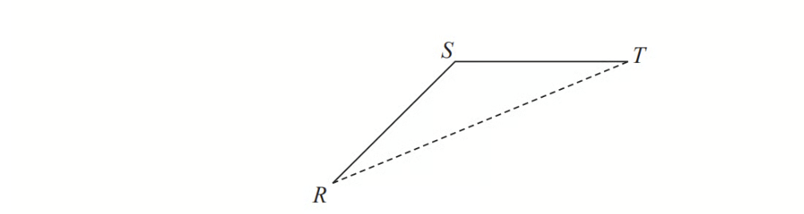

$RS$ and $ST$ are 2 sides of a regular 12-sided polygon.
$RT$ is a diagonal of the polygon.

Work out the size of angle $STR$. 
You must show your working.

## Q22 — very_hard — 3 marks · exam-questions

### 20() — 3 marks — command: work_out — structured — from paper Nov 2020 · 8300/2H
$AB,BC,CD$ and $DE$are four of the sides of a regular decagon.

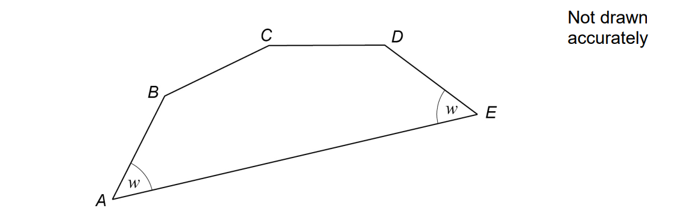

Work out the size of angle $w$.

..............................degrees

## Q23 — hard — 4 marks · exam-questions

### 9() — 4 marks — command: work_out — structured — from paper November 2013 · 1MA0/2H
The diagram shows a pattern using four identical rhombuses.

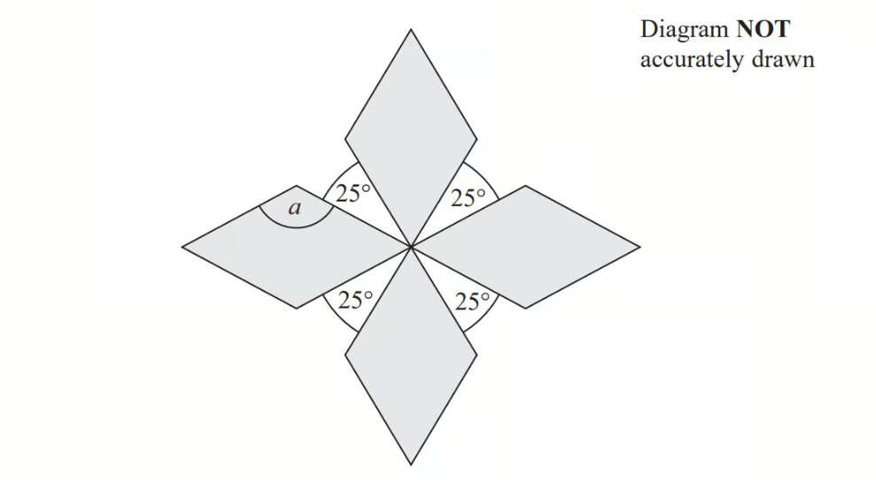

Work out the size of the angle marked $a$. 
You must show your working.

## Q24 — medium — 4 marks · exam-questions

### 10() — 4 marks — command: work_out — structured — from paper March 2013 · 1MA0/1H
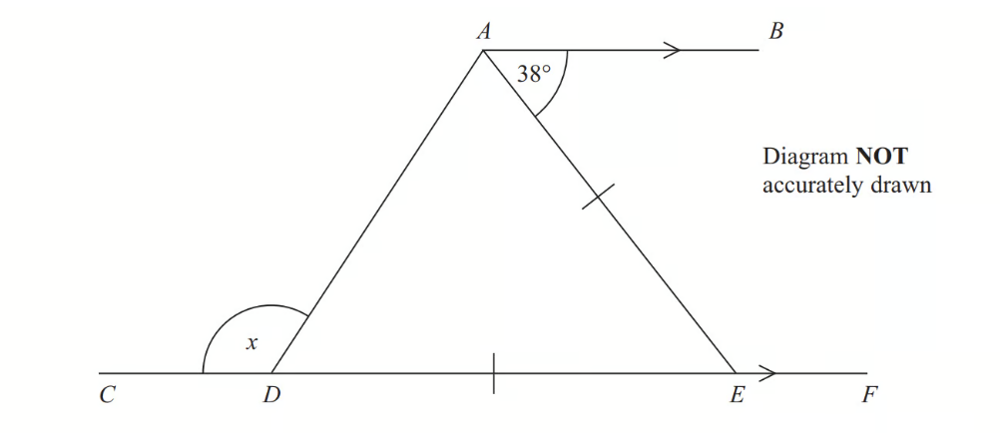

$CDEF$ is a straight line. 
$AB$ is parallel to $CF$.
 $DE=AE$.

Work out the size of the angle marked $x$. 
You must give reasons for your answer.

## Q25 — very_hard — 7 marks · exam-questions

### 10((a)) — 4 marks — command: what — structured — from paper June 2017 · 8300/3H
$AB,CD$ and $EF$ are straight lines.

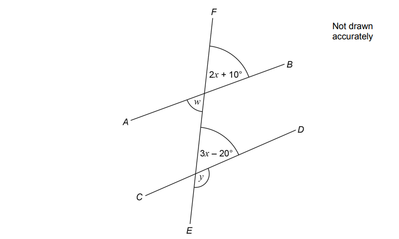

Ava assumes that $AB$and $CD$ are parallel.

What answer should she get for the size of angle $y$?

...............................degrees

### 10((b)) — 3 marks — command: show — structured — from paper June 2017 · 8300/3H
In fact,

$AB$ and $CD$ are not parallel angle$w$ is 60°

What effect does this have on the size of angle $y$? Tick a box.

| `begin mathsize 28px style square end style` | $y$ is bigger |
|---|---|
| `begin mathsize 28px style square end style` | $y$ is the same |
| `begin mathsize 28px style square end style` | $y$ is smaller |

Show working to support your answer.

## Q26 — hard — 4 marks · exam-questions

### 17() — 4 marks — command: work_out — structured — from paper November 2014 · 1MA0/1H
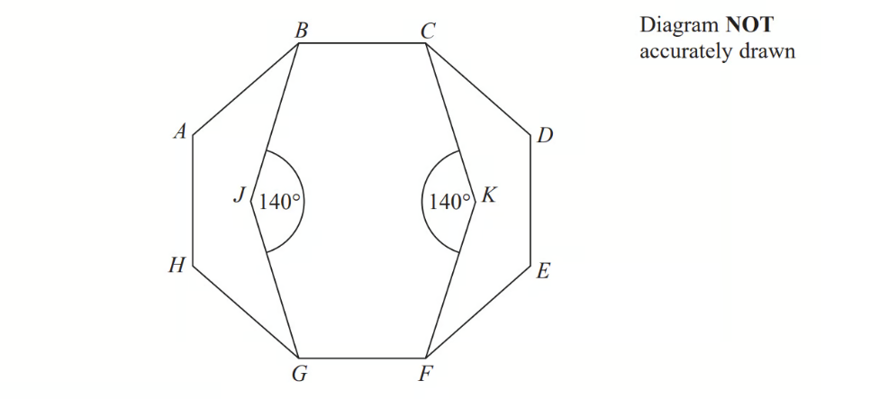

$ABCDEFGH$ is a regular octagon. 
$BCKFGJ$ is a hexagon.

$JK$ is a line of symmetry of the hexagon. 
Angle $BJG$ $=$ angle $CKF=140^{\circ}$

Work out the size of angle $KFE$. 
You must show all your working.

## Q27 — medium — 5 marks · exam-questions

### 8() — 5 marks — command: work_out — structured — from paper June 2018 · 1MA1/3H
$ABCDE$ is a pentagon.

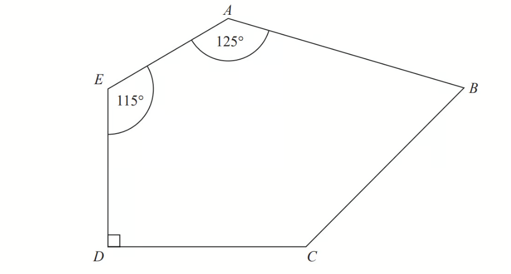

Angle $BCD=2\times$ angle $ABC$.

Work out the size of angle $BCD$. 
You must show all your working.

## Q28 — very_hard — 4 marks · exam-questions

### 16() — 4 marks — command: show — structured — from paper Specimen 2015 · 8300/1H
$AB,CD$ and $YZ$ are straight lines. All angles are in degrees.

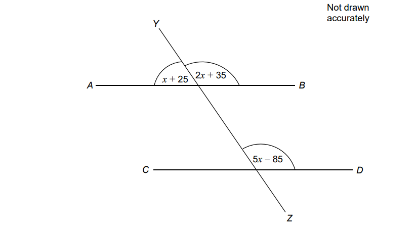

Show that $AB$ is parallel to $CD$.

## Q29 — hard — 4 marks · exam-questions

### 18() — 4 marks — command: work_out — structured — from paper November 2012 · 1MA0/1H
The diagram shows part of a pattern made from tiles.

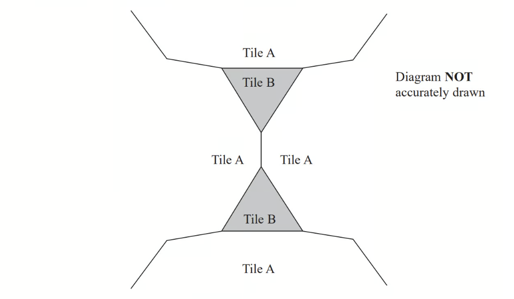

The pattern is made from two types of tiles, tile A and tile B.

Both tile A and tile B are regular polygons.

Work out the number of sides tile A has.

## Q30 — medium — 4 marks · exam-questions

### 11() — 4 marks — command: work_out — structured — from paper Nov 2020 · 4MA1/1H
Here is a 10-sided polygon.

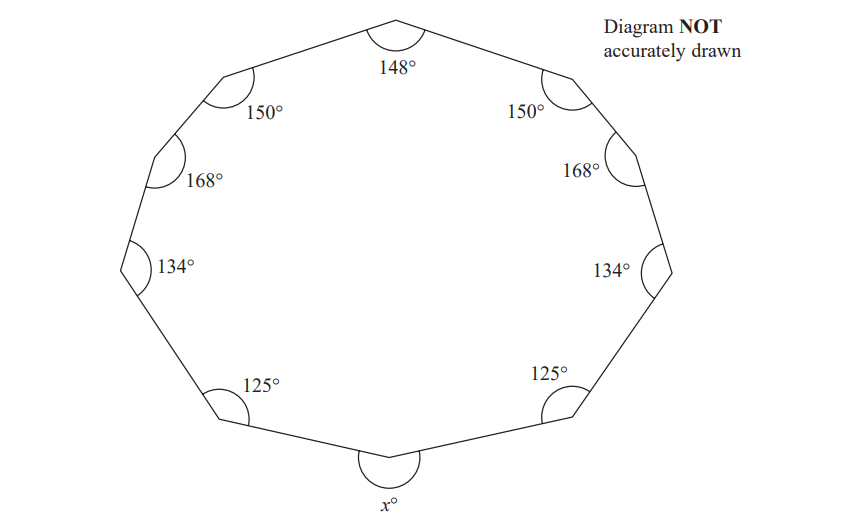

Work out the value of $x.$

$x=$.................................................

## Q31 — very_hard — 6 marks · exam-questions

### 8((a)) — 3 marks — command: show — structured — from paper June 2017 · J560/05
Imran joins two tiles together as shown below. One tile is a regular hexagon and the other tile is a regular pentagon.

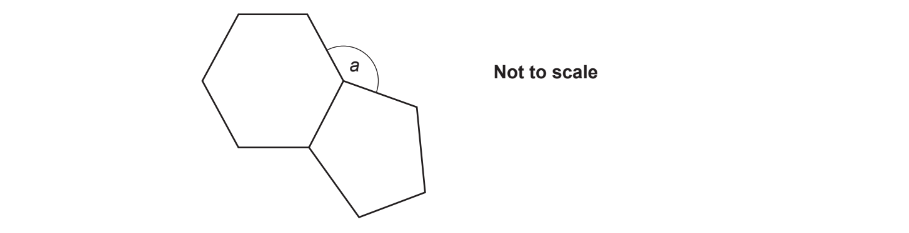

Show that angle $a$ is 132°.

### 8((b)) — 3 marks — command: show — structured — from paper June 2017 · J560/05
Imran thinks that another tile in the shape of a regular polygon will fit **exactly **into angle $a$. Is Imran correct? Show your reasoning.

## Q32 — hard — 4 marks · exam-questions

### 17() — 4 marks — command: work_out — structured — from paper June 2015 · 1MA0/1H
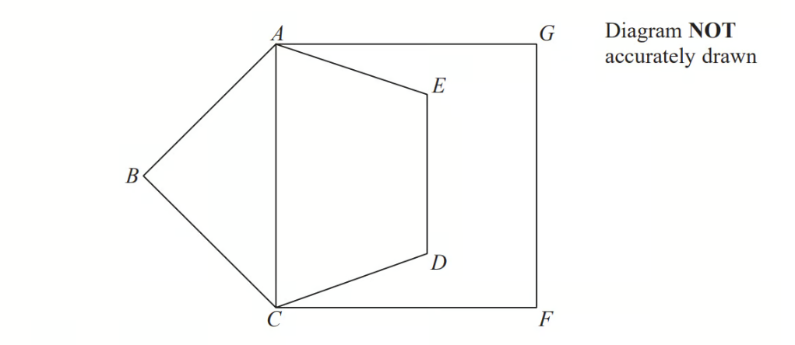

$ABCDE$ is a regular pentagon. 
$ACFG$ is a square.

Work out the size of angle $DCF$. 
You must show all your working.

## Q33 — medium — 3 marks · exam-questions

### 2() — 3 marks — command: work_out — structured — from paper June 2019 · 4MA1/1HR
Each interior angle of a regular polygon is 162° 
Work out the number of sides the polygon has.

## Q34 — very_hard — 5 marks · exam-questions

### 7() — 5 marks — command: work_out — structured — from paper Nov 2017 · J560/04
Angle BAE is part of a regular 18-sided polygon. 
Angle CAD is part of a regular 10-sided polygon. 
The dashed line through A is a line of symmetry of both polygons.

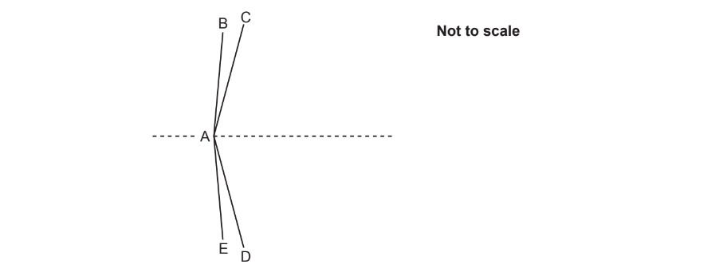

Work out angle BAC.

## Q35 — hard — 4 marks · exam-questions

### 14() — 4 marks — command: work_out — structured — from paper November 2015 · 1MA0/1H
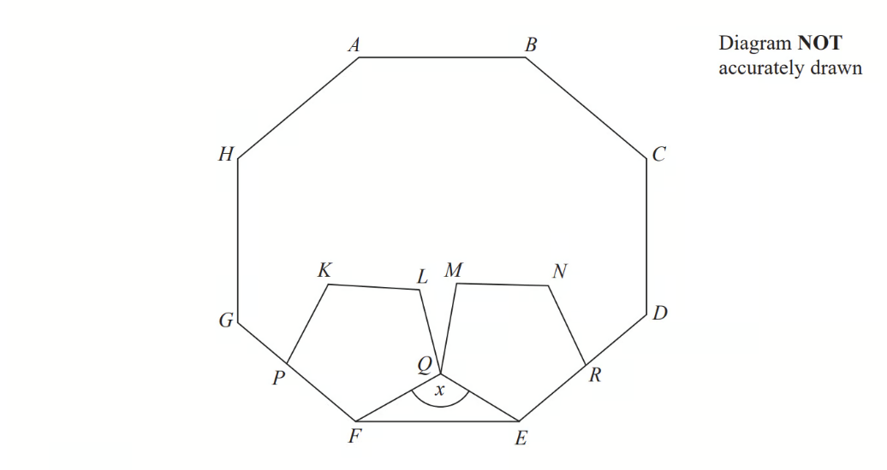

$ABCDEFGH$ is a regular octagon. 
$KLQFP$ and $MNREQ$ are two identical regular pentagons.

Work out the size of the angle marked $x$. 
You must show all your working.

## Q36 — medium — 4 marks · exam-questions

### 4() — 4 marks — command: work_out — structured — from paper Jan 2020 · 4MA1/2H
The diagram shows a triangle.

Work out the value of $x$.

$x$ = ..................

## Q37 — hard — 4 marks · exam-questions

### 5() — 4 marks — command: show — structured — from paper June 2017 · 1MA1/3H
In the diagram, $AB$, $BC$ and $CD$ are three sides of a regular polygon **P**.

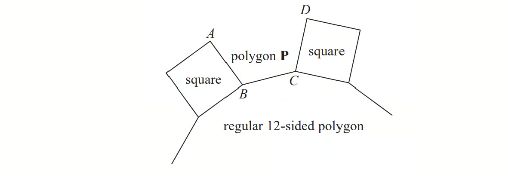

Show that polygon **P** is a hexagon. 
You must show your working.

## Q38 — medium — 5 marks · exam-questions

### 3() — 5 marks — command: work_out — structured — from paper Nov 2020 · 4MA1/2H
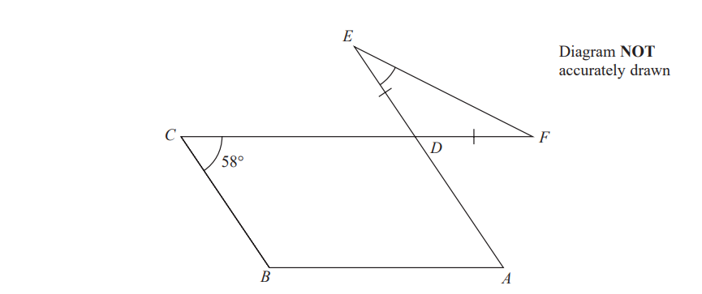

The diagram shows a parallelogram $ABCD$ and an isosceles triangle $DEF$ in which $DE=DF$

$CDF$ and $ADE$ are straight lines. 
Angle $BCD=58^{\circ}$

Work out the size of angle $DEF.$ 
Give a reason for each stage of your working.

## Q39 — hard — 5 marks · exam-questions

### 8() — 5 marks — command: work_out — structured — from paper Sample 2015 · 1MA1/1H
Here is a parallelogram.

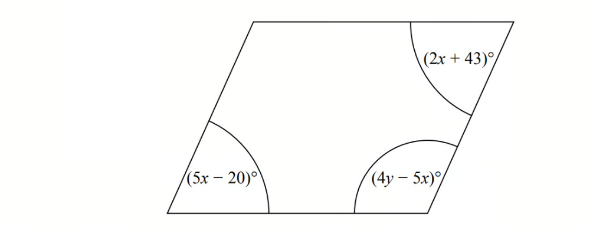

Work out the value of $x$ and the value of $y$.

## Q40 — medium — 1 marks · exam-questions

### 4() — 1 mark — command: what — structured — from paper June 2018 · 8300/3H
What is the size of an exterior angle of a regular decagon?

Circle your answer.

| 18° | 36° | 144° | 162° |
|---|---|---|---|
|   |   |   |   |

## Q41 — hard — 3 marks · exam-questions

### 13() — 3 marks — command: work_out — structured — from paper March 2013 · 1MA0/1H
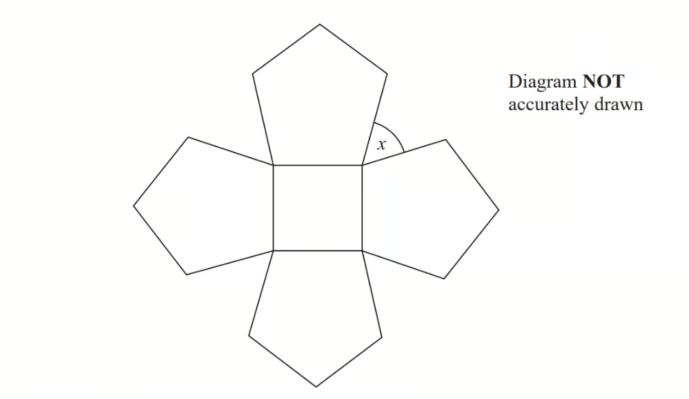

The diagram shows a square and 4 regular pentagons.

Work out the size of the angle marked $x$.

## Q42 — medium — 1 marks · exam-questions

### 9() — 1 mark — command: circle — structured — from paper Specimen 2015 · 8300/3H
The exterior angle of a regular polygon is 45°

Circle the name of the regular polygon.

| pentagon | hexagon | octagon | decagon |
|---|---|---|---|

## Q43 — hard — 4 marks · exam-questions

### 5() — 4 marks — command: work_out — structured — from paper 2017	June · 1MA0/2H
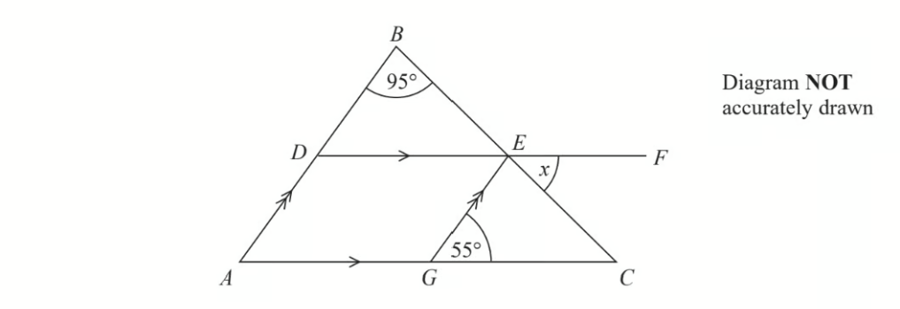

$AGC$ and $DEF$ are parallel lines.
 $ADB$ and $GE$ are parallel lines.
 $BEC$ is a straight line.

Angle $DBE=95^{\circ}$ 
Angle $CGE=55^{\circ}$

Work out the size of the angle marked $x$. 
Give reasons for each stage of your working.

## Q44 — medium — 2 marks · exam-questions

### 12() — 2 marks — command: work_out — structured — from paper Nov 2021 · 8300/3H
Part of a regular polygon with 15 sides is shown.

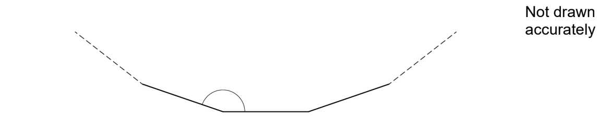

Work out the size of an interior angle.

....................................................degrees

## Q45 — hard — 3 marks · exam-questions

### 11() — 3 marks — command: work_out — structured — from paper 2014	June · 1MA0/1H
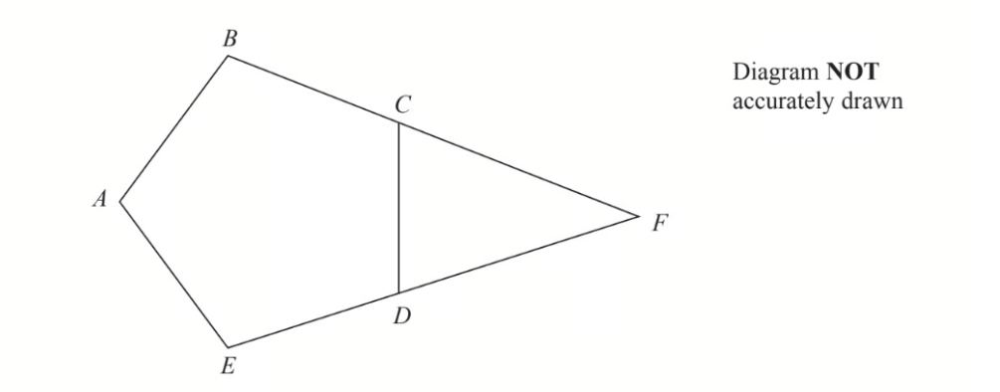

$ABCDE$ is a regular pentagon.
 $BCF$ and $EDF$ are straight lines.

Work out the size of angle $CFD$. 
You must show how you got your answer.

## Q46 — medium — 2 marks · exam-questions

### 7() — 2 marks — command: show — structured — from paper Nov 2018 · 8300/1H
The sum of the angles in any quadrilateral is 360°

For example, in a rectangle 4 × 90° = 360°

Zak writes,

5 × 90° = 450° so the sum of the angles in any pentagon must be 450°

Is he correct?

Tick a box.

`square` Yes         `size 26px square` No

Show working to support your answer.

## Q47 — hard — 3 marks · exam-questions

### 14() — 3 marks — command: show — structured — from paper June 2019 · 8300/1H
Here is a quadrilateral.

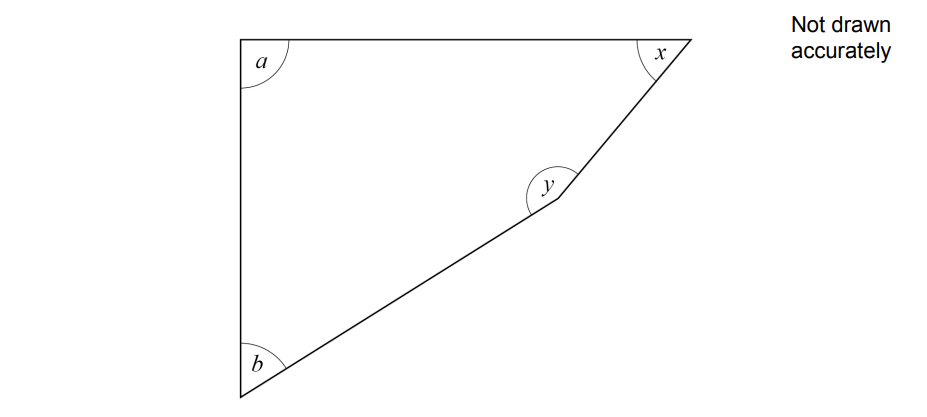

$a=90^{\circ}$ and $a:b=5:3$

$x:y=1:3$

Show that $b=x$

## Q48 — medium — 3 marks · exam-questions

### 15() — 3 marks — command: tick — structured — from paper Nov 2019 · 8300/1H
Here is a **sketch **of a quadrilateral.

All lengths are in centimetres.

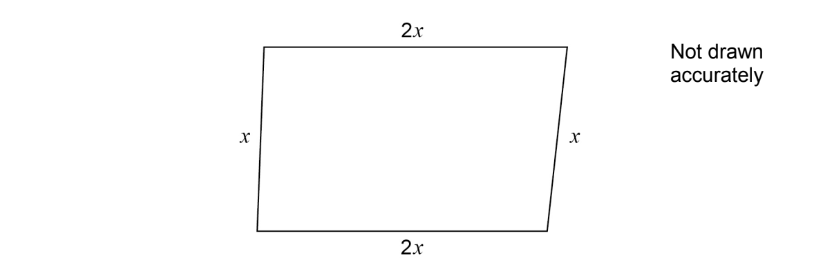

Tick **one **box for each statement.

|   | **True** | **May be true** | **Not true** |
|---|---|---|---|
| The quadrilateral is a rectangle |   |   |   |
| The quadrilateral is a parallelogram |   |   |   |
| The quadrilateral is a rhombus |   |   |   |
| The quadrilateral is a kite |   |   |   |

## Q49 — hard — 6 marks · exam-questions

### 9((a)) — 2 marks — command: write — structured — from paper June 2019 · J560/05
An interior angle of an isosceles triangle is p° and an exterior angle is *q *°.

It is given that *q* = 5*p* .

Write the ratio *p *: *q* in its simplest form.

### 9((b)) — 4 marks — command: work_out — structured — from paper June 2019 · J560/05
Work out the two different possible sets of angles for the isosceles triangle.

Triangle 1: ............°, .............°, .............°
 Triangle 2: ............°, .............°, .............°

## Q50 — medium — 1 marks · exam-questions

### 13() — 1 mark — command: tick — structured — from paper June 2018 · 8300/3H
Tick **all** the statements that are true for any rhombus.

`square`  The diagonals are lines of symmetry

`size 26px square`  The diagonals bisect each other

`size 26px square`  The diagonals are perpendicular

`size 26px square`  The diagonals are equal in length

## Q51 — hard — 5 marks · exam-questions

### 10() — 5 marks — command: show — structured — from paper Specimen paper · 4MA1/2H
The diagram shows two congruent regular pentagons drawn inside a regular octagon.

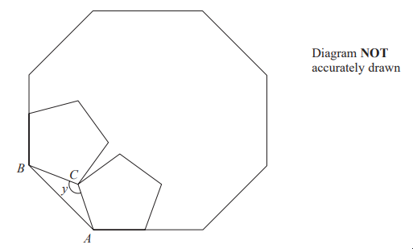

One side of each pentagon lies along a side of the octagon.

$AB$ is a side of the octagon. 
$AC$ is a side of one of the pentagons. $BC$ is a side of the other pentagon.

Work out the size of angle $y$. 
Show your working clearly

## Q52 — medium — 3 marks · exam-questions

### 5((a)) — 2 marks — command: work_out — structured — from paper Nov 2020 · J560/06
Work out the size of the exterior angle of a regular 12-sided polygon.

### 5((b)) — 1 mark — command: write — structured — from paper Nov 2020 · J560/06
Use your answer to part (a) to write down the size of the interior angle of a regular 12-sided polygon.

## Q53 — medium — 5 marks · exam-questions

### 9((a)) — 2 marks — command: insert — structured — from paper June 2019 · J560/04
The diagram shows triangle ABC. 
CD is parallel to AB. 
A, C and E lie in a straight line. 
Angles of size $a^{\circ},b^{\circ}$and $c^{\circ}$ are shown.

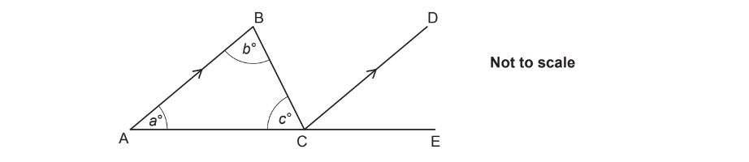

Insert  $a^{\circ},b^{\circ}$° or $c^{\circ}$ to make this statement true. 
Give a reason for your answer.

Angle DCE = ......... because ....................................................................................................

### 9((b)) — 3 marks — command: show — structured — from paper June 2019 · J560/04
Use the diagram and the answer to part (a) to show that the angles of a triangle add up to 180°.

Give a reason for each statement you make.

## Q54 — medium — 3 marks · exam-questions

### 11() — 3 marks — command: work_out — structured — from paper 2023 June · 4MA1/2H
Here is a 9-sided regular polygon $ABCDEFGHJ$, with centre $O$

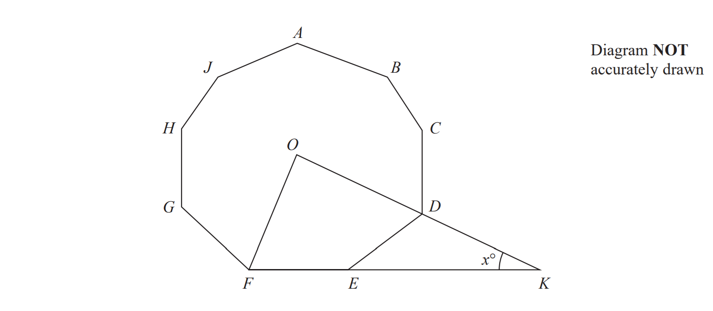

$ODK$and $FEK$ are straight lines.
Work out the value of $x$
