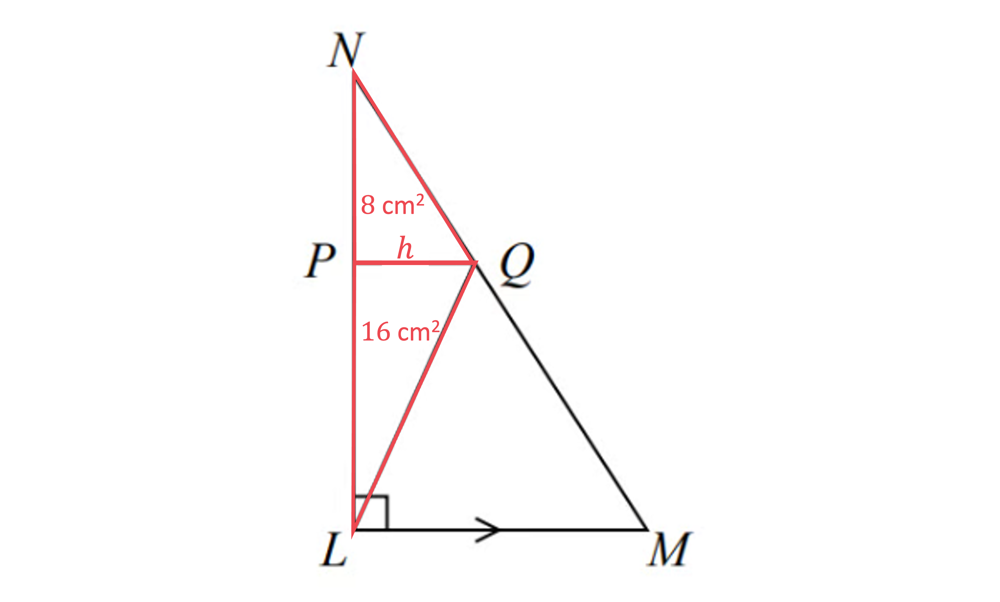
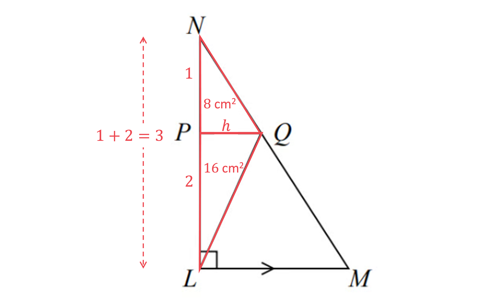
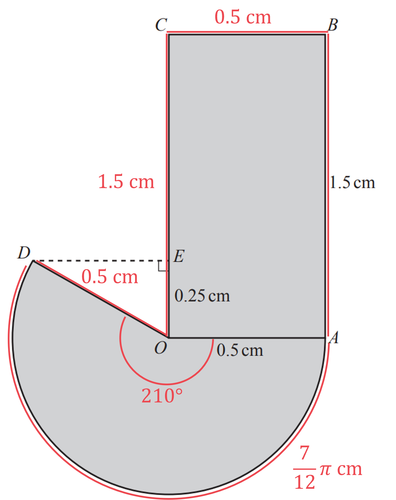

# Mark Schemes — Area & Volume of Similar Shapes
**Geometry** · Edexcel IGCSE Maths A (Modular) (4XMAF/4XMAH) — 24/Higher Unit 2

## Q1 — very_hard — 4 marks · exam-questions

### 18() — 4 marks
> *Be clear which triangles are being referred to in the text of the question- triangles **NPQ **and **NLM** are similar but only the areas of **NPQ** and **LPQ** are given (not **NLM**)*

> *16 is twice 8, so we know that area of triangle **LPQ** is twice the area of triangle **NPQ. **Given that they share the same height (**PQ**, which we have labelled **h** on the diagram), we can deduce using logic- or the more formal method below- that **NP **= 2**PL*

`table attributes columnalign right center left columnspacing 0px end attributes row cell Area subscript L P Q end subscript end cell equals cell 2 cross times Area subscript N P Q end subscript end cell row cell therefore 1 half cross times PL cross times h end cell equals cell 2 cross times 1 half cross times N P cross times h end cell end table`

> *By simplifying and cancelling we get*

`table row cell down diagonal strike 1 half end strike cross times P L cross times down diagonal strike h end cell equals cell 2 cross times down diagonal strike 1 half end strike cross times N P cross times down diagonal strike h end cell row cell P L end cell equals cell 2 N P end cell end table`

**[1]**

> *Thus the ratio of **NP **: **PL ** is 1 : 2 *
*From the diagram below it is clear that the linear scale factor of enlargement for triangles **NPQ** and **NLM** is 3*

**[1]**

> *For similar shapes, if the linear scale factor is *$k$*, then the area factor is *$k^{2}$*; to find the area of triangle **NLM  **we can multiply the area of triangle **NPQ **by 3**2*

$\mathrm{Area}_{NLM}=8\times3^{2}=72$* **cm**2*

**[1]**

> *Now we can find the area of triangle **LQM** by subtracting the areas of triangles **LPQ **and **PNQ** from the area of triangle **NLM*

$\mathrm{Area}_{LQM}=72-8-16$

**Final answer:** ** ****48 cm****2 ****[1]**

## Q2 — hard — 2 marks · exam-questions

### 21() — 2 marks
> $k$*, the scale factor of enlargement for the lengths, is 3 (as "the dimensions of the larger rectangle will be three times the dimensions of the smaller rectangle")*

> *The depth of the soil will be the same in both flower beds, so the change in mass of the soil in kg is dependent only on the area. For similar shapes, if the length scale factor is *$k$*, then the area scale factor is *$k^{2}$* *
*To find the larger** **mass, multiply the smaller mass by *$k^{2}$

$180\times3^{2}$

**[1]**

$=180\times9$

**1620 kg**** [1]**

**Always check whether you should be making the shape larger or smaller, and whether your answer matches this**

## Q3 — medium — 3 marks · exam-questions

### 16() — 3 marks
> *Calculate *$k$*, the scale factor of enlargement for the lengths, using *$k=\frac{\mathrm{second} \mathrm{corresponding} \mathrm{length}}{\mathrm{first} \mathrm{corresponding} \mathrm{length}}$

$k=\frac{120}{20}=6$

**[1]**

> *For similar shapes, if the length scale factor is *$k$*, then the area scale factor is *$k^{2}$* *$k>1$*and we want to find the **larger** surface area, so we can **multiply** the smaller surface area by *$k^{2}$

$120\times6^{2}$

**[1]**

$=300\times36\,=10800$

**Surface area = 10 800*** ***cm****2**** [1]**

**Always check whether you should be making the shape larger or smaller, and whether your answer matches this**

## Q4 — very_hard — 4 marks · exam-questions

### 17() — 4 marks
> *Calculate *$k$*, the scale factor of enlargement for the heights, using *$k=\frac{\mathrm{second} \mathrm{corresponding} \mathrm{length}}{\mathrm{first} \mathrm{corresponding} \mathrm{length}}$

$k=\frac{15}{10}=\frac{3}{2}$

> *For similar shapes, if the length scale factor is *$k$*, then the volume factor is *$k^{3}$

`k cubed equals open parentheses 3 over 2 close parentheses cubed equals 27 over 8`

**[1]**

> *We can write an equation from "the difference between the volume of vase A and the volume of vase B is 1197 cm**3**. If we let the volume of vase **A** be *$a$* and the volume of vase **B** be *$b$* then*

`b minus a equals 1197 space space space space space circle enclose 1`

> *And we know that the volume of vase **A** multiplied by *$k^{3}$* gives the volume of vase B. So*

`b equals 27 over 8 a space space space space space circle enclose 2`

> * Substitute *`circle enclose 2`* into *`circle enclose 1`* to form an equation in *$a$

$\frac{27}{8}a-a=1197$

**[1]**

> *Solve this equation to find *$a$*. Start by subtracting the algebraic fractions*

`space space space space space space space a open parentheses 27 over 8 minus 1 close parentheses equals 1197 space space space space or space space space space space 27 over 8 a minus 8 over 8 a equals 119
space space space space space space space 19 over 8 a equals 1197`

**[1]**

`table attributes columnalign right center left columnspacing 0px end attributes row a equals cell 1197 divided by 19 over 8 equals 504 end cell end table`

**Volume of shape A = 504 cm****3 **** ****[1]**

## Q5 — hard — 4 marks · exam-questions

### 22() — 4 marks
> *Calculate the volume of Prism **P** by multiplying its cross section by its length*

*Prism ****P**** volume = 10 × 15 = 150 cm**3*

**[1]**

> *Now calculate *$k$*, the scale factor of enlargement for the lengths, using *$k=\frac{\mathrm{second} \mathrm{corresponding} \mathrm{length}}{\mathrm{first} \mathrm{corresponding} \mathrm{length}}$

$k=\frac{12}{6}=2$

**[1]**

> *For similar shapes, if the length scale factor is *$k$*, then the volume scale factor is *$k^{3}$
$k>1$*and we want to find the **larger **volume, so we can **multiply** the smaller volume by *$k^{3}$

$150\times2^{3}$

**[1]**

$=150\times8\,=1200$

$\mathrm{Volume}=1200$** ****cm****3**** [1]**

**Always check whether you should be making the shape larger or smaller, and whether your answer matches this**

## Q6 — medium — 4 marks · exam-questions

### 25((a)) — 2 marks
> *Calculate *$k$*, the scale factor of enlargement for the lengths, using *$k=\frac{\mathrm{second} \mathrm{corresponding} \mathrm{length}}{\mathrm{first} \mathrm{corresponding} \mathrm{length}}$

$k=\frac{8}{4}=2$

> *For similar shapes, if the length scale factor is *$k$*, then the volume scale factor is *$k^{3}$
* *$k>1$* and we want to find the **larger **volume, so we can **multiply** the volume of A by *$k^{3}$

$80\times2^{3}$

**[1]**

$=80\times8\,=640$

**Volume = 640 cm****3**** [1]**

**Always check whether you should be making the shape larger or smaller, and whether your answer matches this**

### 25((b)) — 2 marks
> *From (a) we know that *$k$*, the scale factor of enlargement for the lengths, is 2*

> *For similar shapes, if the length scale factor is *$k$*, then the surface area scale factor is *$k^{2}$

> $k>1$*and we want to find the **smaller** surface area, so we need to **divide** the larger surface area by *$k^{2}$

$160\div2^{2}$

**[1]**

$=160\div4\,=40$

**Surface area = 40 cm****2**** [1]**

**Always check whether you should be making the shape larger or smaller, and whether your answer matches this**

## Q7 — very_hard — 4 marks · exam-questions

### 20() — 4 marks
> *Calculate *$k$*, the scale factor of enlargement for the heights, using *$k=\frac{\mathrm{second} \mathrm{corresponding} \mathrm{length}}{\mathrm{first} \mathrm{corresponding} \mathrm{length}}$

$k=\frac{13}{9}$

> *For similar shapes, if the length scale factor is *$k$*, then the area scale factor is *$k^{2}$

`k squared equals open parentheses 13 over 9 close parentheses squared equals 169 over 81`

**[1]**

> *If we let the surface area of vase **A** be *$a$* and the surface area of vase **B** be *$b$* then*

`a plus b equals 1800 space space space space space space circle enclose 1`

> *We know that the surface area of vase **A** multiplied by *$k^{2}$* gives the surface area of vase **B**. So*

`b equals 169 over 81 a space space space space space space space circle enclose 2`

> *Substitute *`circle enclose 2`* into *`circle enclose 1`* to form an equation in *$a$

$a+\frac{169}{81}a=1800$

**[1]**

> *Solve. Start by adding the fractions on the left-hand side*

`space space a open parentheses 1 plus 169 over 81 close parentheses equals 1800 space space space space or space space space space space 81 over 81 a plus 169 over 81 a equals 1800
space 250 over 81 a equals 1800`

**[1]**

`table row a equals cell 1800 divided by 250 over 81 equals 583.2 end cell end table`

**Surface area of vase A = 583.2 cm****2 **** ****[1]**

## Q8 — hard — 5 marks · exam-questions

### 18((a)) — 2 marks
> *AE **and **AE **are similar lengths. Calculate *$k$*, the scale factor of enlargement, using *$k=\frac{\mathrm{second} \mathrm{corresponding} \mathrm{length}}{\mathrm{first} \mathrm{corresponding} \mathrm{length}}=\frac{BC}{EF}$

$k=\frac{18}{12}=\frac{3}{2}$

**[1]**

> $k>1$*and **AB** is **bigger **than **AE**, so we can **multiply** **AE** by *$k$

$AB=5\times\frac{3}{2}$

$AB=\frac{15}{2}\mathrm{or}7.5$** ****cm**** [1]**

**Always check whether you should be making the length larger or smaller, and whether your answer matches this**

### 18((b)) — 3 marks
> *We know from (a) that *$k$*, the scale factor of enlargement for the lengths, is *$\frac{3}{2}$

> *AEFG **and** ABCD **are similar- note that **ABCD** is **not** the same as the **shaded area**! The shaded area is **ABCD − AEFG** *
*For similar shapes, if the length scale factor is *$k$*, then the area scale factor is *$k^{2}$* *
$k>1$*and we want to find the **larger **surface area, so we can find **ABCD **by **multiplying** the smaller area by *$k^{2}$

`Area subscript A B C D end subscript equals 36 cross times open parentheses 3 over 2 close parentheses squared`

**[1]**

$=36\times\frac{9}{4}=81$

**[1]**

> *Now find the shaded area by subtracting the area of **AEFG** from the area of **ABCD*

*Shaded area = 81 − 36*

**[1]**

**Shaded area = 45 cm****2**** [1]**

## Q9 — medium — 4 marks · exam-questions

### 17((a)) — 2 marks
> *Calculate *$k$*, the scale factor of enlargement for the heights, using *$k=\frac{\mathrm{second} \mathrm{corresponding} \mathrm{length}}{\mathrm{first} \mathrm{corresponding} \mathrm{length}}$

$k=\frac{36}{24}=1.5$

> *For similar shapes, if the length scale factor is *$k$*, then the area scale factor is *$k^{2}$* *$k>1$* and we want to find the **larger **surface area, so we can **multiply** the surface area of **A** by *$k^{2}$

$960\times1.5^{2}$

**[1]**

$=960\times2.25\,=2160$

**Surface area = 2160 cm****2**** [1]**

**Always check whether you should be making the shape larger or smaller, and whether your answer matches this**

### 17((b)) — 2 marks
> *Method 1*

> *From (a) we know that *$k$*, the scale factor of enlargement for the lengths, is *$\frac{3}{2}$

> *For similar shapes, if the length scale factor is *$k$*, then the volume scale factor is *$k^{3}$

`volume space scale space factor equals space open parentheses 3 over 2 close parentheses cubed equals 27 over 8`

$(\frac{3}{2})^{3}$**or  **$\frac{27}{8}$** ****or **** **$3.375$** [1]**

> $k>1$*and we want to find the **smaller** volume, so we need to **divide** the larger volume by *$k^{3}$

`table row cell space V divided by 27 over 8 end cell equals cell V cross times 8 over 27 end cell row blank equals cell 8 over 27 V end cell end table`

**Volume of vase A = **$\frac{8}{27}V$** cm****3****   **$(\mathrm{or}\frac{V}{3.375}\mathrm{cm}^{3})$** **** [1]**

> *Method 2*

> *Calculate *$k$*, as in (a) but using the smaller height as the second length using *

$k=\frac{24}{36}=\frac{2}{3}$

> *For similar shapes, if the length scale factor is *$k$*, then the volume scale factor is *$k^{3}$

`volume space scale space factor equals space open parentheses 2 over 3 close parentheses cubed equals 8 over 27`

$(\frac{3}{2})^{3}$**or  **$\frac{27}{8}$** ****or**** **** **$3.375$** [1]**

> $k<1$*and we want to find the **smaller** volume, so we need to **multiply** the larger volume by *$k^{3}$

`table row blank blank cell V cross times 8 over 27 end cell row blank blank blank end table`

**Volume of vase A = **$\frac{8}{27}V$** cm****3****  ****[1]**

**8/27 cannot be expressed exactly as a decimal, so you must express it as a fraction**

## Q10 — very_hard — 4 marks · exam-questions

### 18() — 4 marks
> *The total surface area of a hemisphere is*

`table row cell S A subscript h e m i s p h e r e end subscript end cell equals cell 1 half cross times 4 straight pi r squared plus straight pi r squared end cell row blank equals cell 3 straight pi r squared end cell end table`

> *Now that we have used *$r$* as the radius of the hemisphere, let *$R$* be the radius of the cylinder (and let its height be *$h$*). The curved surface area of the cylinder is therefore*

$SA_{cylinder}=2πRh$

> *"The radius of the cylinder is twice the radius of the hemisphere" therefore*

$R=2r$

> *Substitute this into the formula for the curved surface area of the cylinder*

`table row cell S A subscript c y l i n d e r end subscript end cell equals cell 2 straight pi open parentheses 2 r close parentheses h end cell row blank equals cell 4 straight pi r h end cell end table`

> *Equate the formulae for the surface areas of the hemisphere and the cylinder*

$3πr^{2}=4πrh$

**[1]**

> *Rearrange to get *$h$* in terms of *$r$

`table row cell 3 up diagonal strike straight pi r squared end cell equals cell 4 up diagonal strike straight pi r h end cell row cell 3 r to the power of up diagonal strike 2 end exponent end cell equals cell 4 up diagonal strike r h end cell row cell 3 r end cell equals cell 4 h end cell row h equals cell 3 over 4 r end cell end table`

**[1]**

> *Now find the volume of the hemisphere in terms of *$r$

`table row cell v o l u m e subscript h e m i s p h e r e end subscript end cell equals cell 1 half cross times 4 over 3 straight pi r cubed end cell row blank equals cell 2 over 3 straight pi r cubed end cell end table`

> *And find the volume of the cylinder in terms of *$r$

`table row cell v o l u m e subscript c y l i n d e r end subscript end cell equals cell straight pi R squared h end cell row blank equals cell straight pi open parentheses 2 r close parentheses squared cross times 3 over 4 r end cell row blank equals cell straight pi up diagonal strike 4 r squared cross times fraction numerator 3 over denominator up diagonal strike 4 end fraction r end cell row blank equals cell 3 straight pi r cubed end cell end table`

** correct expressions for volume of hemisphere and volume of cylinder ****[1]**

> $m$*, the scale factor for the volumes, is the volume of the cylinder divided by the volume of the hemisphere*

`table row m equals cell fraction numerator 3 straight pi r cubed over denominator 2 over 3 straight pi r cubed end fraction equals fraction numerator 3 up diagonal strike straight pi r cubed end strike over denominator 2 over 3 up diagonal strike straight pi r cubed end strike end fraction end cell row blank equals cell 3 cross times 3 over 2 end cell row blank equals cell 9 over 2 end cell end table`

$m=\frac{9}{2}\mathrm{or}4.5$ **[1]**

## Q11 — hard — 3 marks · exam-questions

### 13() — 3 marks
> *Method 1 *
*Shape **A **is the smaller shape, we want to find a smaller volume Use the given ratio to calculate *$k^{2}$*, the scale factor of enlargement for the areas, using *$\frac{\mathrm{larger} \mathrm{area}}{\mathrm{smaller} \mathrm{area}}$

$k^{2}=\frac{4}{3}$

> *Therefore *$k$*, the scale factor for lengths, is*

$k=\sqrt{\frac{4}{3}}$

**[1]**

> *For similar shapes, if the length scale factor is *$k$*, then the volume scale factor is *$k^{3}$* *
*Check: *$k>1$*and we want to find the **smaller** volume, so we need to **divide** the larger volume by *$k^{3}$

`10 divided by open parentheses square root of 4 over 3 end root close parentheses cubed`

**[1]**

$=6.495190528...$

> *Round to 3 significant figures, as specified in the question*

**Final answer:** ** ****6.50 cm****3 ****[1]**

**Check that you have given your answer correct to 3 significant figures- you cannot achieve full marks if not**

> *Method 2 *
*Shape **A **is the smaller shape, we want to find a smaller volume. So start by calculating *$k^{2}$*, the scale factor of enlargement for the areas, using *$\frac{\mathrm{smaller} \mathrm{area}}{\mathrm{larger} \mathrm{area}}$

$k^{2}=\frac{3}{4}$

> *Therefore *$k$*, the scale factor for lengths, is*

$k=\sqrt{\frac{3}{4}}$

**[1]**

> *For similar shapes, if the length scale factor is *$k$*, then the volume scale factor is *$k^{3}$* *
*Check: *$k<1$*and we want to find the **smaller** volume, so we can **multiply** the larger volume by *$k^{3}$

`10 cross times open parentheses square root of 3 over 4 end root close parentheses cubed`

**[1]**

$=6.495190528...$

> *Round to 3 significant figures, as specified in the question*

**Final answer:** ** ****6.50 cm****3 ****[1]**

**Check that you have given your answer correct to 3 significant figures- you cannot achieve full marks if not**

## Q12 — medium — 3 marks · exam-questions

### 20() — 3 marks
> *We have two similar volumes so calculate *$k^{3}$*, the scale factor of enlargement for the volumes, using *$k^{3}=\frac{\mathrm{second} \mathrm{corresponding} \mathrm{volume}}{\mathrm{first} \mathrm{corresponding} \mathrm{volume}}$

$k^{3}=\frac{4352}{1836}=\frac{64}{27}$

> *(Notice that both the numerator and denominator are cube numbers)*

> *Find the length scale factor, *$k$*, by cube rooting *$k^{3}$

`table attributes columnalign right center left columnspacing 0px end attributes row k equals cell cube root of 64 over 27 end root equals 4 over 3 end cell end table`

$\frac{4}{3}$** or **$\frac{3}{4}$** [1]**

> *And find the area scale factor, *$k^{2}$*, by squaring *$k$

`table attributes columnalign right center left columnspacing 0px end attributes row cell k squared end cell equals cell open parentheses 4 over 3 close parentheses squared equals 16 over 9 end cell end table`

> *(Note that we can perform the above two steps in one line by; *`k squared equals open parentheses cube root of 64 over 27 end root close parentheses squared equals 16 over 9`* )*

> $k>1$* and we want to find the **smaller **surface area, so we **divide** the surface area of **B** by *$k^{2}$

$1120\div\frac{16}{9}$

**dividing by **$\frac{16}{9}$** or multiplying by **$\frac{9}{16}$**  ****[1]**

**Surface area of A =  630 cm****2**** [1]**

**Always check whether you should be making the shape larger or smaller, and whether your answer matches this**

## Q13 — very_hard — 4 marks · exam-questions

### 16() — 4 marks
> *First sketch a diagram of a side view of the cones and frustum. We will let the height of the frustum be *$f$*, the height of the small cone be *$H$* and the radius of the small cone be *$R$

> *We need *$f$* and we can see that *$f=h-H$*. So we need *$H$* in terms of *$h$

> *If *$\frac{98}{125}$* represents the fraction of the large cone that the frustum occupies, then the fraction of the large cone that the small cone occupies is *

$1-\frac{98}{125}=\frac{27}{125}$

**[1]**

> *This *$\frac{27}{125}$* is effectively the scale factor of the small cone to the large cone*

> *Therefore if we cube root *$\frac{27}{125}$*, we have the length scale factor of the small cone to the large cone*

`cube root of 27 over 125 end root equals 3 over 5`

**[1]**

> *Therefore *

$H=\frac{3}{5}h$

> *And*

`table row f equals cell h minus H end cell row blank equals cell h minus 3 over 5 h end cell end table`

**[1]**

**The height of the frustum is **`table row blank blank cell bold 2 over bold 5 bold italic h end cell end table`** ****[1]**

## Q14 — hard — 3 marks · exam-questions

### 18() — 3 marks
> *Method 1 *
*Solid **A **is the smaller solid. We need to find a smaller volume** **Use the given ratio to calculate *$k^{2}$*, the scale factor of enlargement for the areas, using *$\frac{\mathrm{larger} \mathrm{area}}{\mathrm{smaller} \mathrm{area}}$

$k^{2}=\frac{9}{4}$

> *Therefore *$k$*, the scale factor for lengths, is*

$k=\sqrt{\frac{9}{4}}=\frac{3}{2}$

**showing that the linear scale factor is **$\frac{3}{2}$** or 1.5 ****[1]**

> *For similar shapes, if the length scale factor is *$k$*, then the volume scale factor is *$k^{3}$* *
$k>1$*and we want to find the **smaller** volume, so we need to **divide** the larger volume by *$k^{3}$

*Volume of ****A**** = *$405\div(\frac{3}{2})^{3}$

**clearly showing the calculation that leads to the correct answer**** [1]**

> *Calculate the answer.*

**Volume of A = 120 cm****3 **** ****[1]**

> *Method 2 *
*Solid **A **is the smaller solid. We need to find a smaller volume. So start by calculating *$k^{2}$*, the scale factor of enlargement for the areas, using *$\frac{\mathrm{smaller} \mathrm{area}}{\mathrm{larger} \mathrm{area}}$

$k^{2}=\frac{4}{9}$

> *Therefore *$k$*, the scale factor for lengths, is*

$k=\sqrt{\frac{4}{9}}=\frac{2}{3}$

**showing that the linear scale factor is **$\frac{2}{3}$** ****[1]**

> *For similar shapes, if the length scale factor is *$k$*, then the volume scale factor is *$k^{3}$* *
$k<1$*and we want to find the **smaller** volume, so we can **multiply** the larger volume by *$k^{3}$

*Volume of ****A**** = *$405\times(\frac{2}{3})^{3}$

**clearly showing the calculation that leads to the correct answer**** [1]**

> *Calculate the answer.*

**Volume of A = 120 cm****3****  ****[1]**

## Q15 — medium — 3 marks · exam-questions

### 23() — 3 marks
> *We have two similar surface areas, so calculate *$k^{2}$*, the scale factor of enlargement for the surface areas, using *$k^{2}=\frac{\mathrm{second} \mathrm{corresponding} \mathrm{area}}{\mathrm{first} \mathrm{corresponding} \mathrm{area}}$

$k^{2}=\frac{300}{108}=\frac{25}{9}$

> *(Notice that both the numerator and denominator are square numbers)*

> *Find *$k$*, the length scale factor, by square rooting  *$k^{2}$

$k=\sqrt{\frac{25}{9}}=\frac{5}{3}$

$\frac{5}{3}$** ****or**** **$\frac{3}{5}$**[1]**

> *Find the volume scale factor, *$k^{3}$*, by cubing *$k$

`table attributes columnalign right center left columnspacing 0px end attributes row cell k cubed end cell equals cell open parentheses square root of 25 over 9 end root close parentheses cubed equals open parentheses 5 over 3 close parentheses cubed equals 125 over 27 end cell end table`

> *(Note that the two steps above can be performed in one step: *`k cubed equals open parentheses square root of 25 over 9 end root close parentheses cubed`

> *Shape **R** has a surface area of 108 cm**2** and shape **S** has a surface area of 300 cm**2** so **shape S is bigger** *$k>1$* and we want to find the **bigger **volume, so we **multiply** the volume of **R** by *$k^{3}$

$135\times\frac{125}{27}$

**multiplying by **$\frac{125}{27}$** or dividing by **$\frac{27}{125}$**  ****[1]**

**Volume of shape S =  625 cm****3**** [1]**

**Always check whether you should be making the shape larger or smaller, and whether your answer matches this**

## Q16 — very_hard — 4 marks · exam-questions

### 18((b)) — 4 marks
> *An increase of 50% is equal to a percentage of 150%. So the volume of the larger tin is 150% of the volume of the smaller tin.*

$V_{L}=\frac{150}{100}V_{s}=1.5V_{S}$

**[1]**

> *The volume scale factor is 1.5. *
*For similar shapes, if the length scale factor is *$k$*, then the volume scale factor is *$k^{3}$*. *

> *Find the length scale factor by taking the cube root of the volume scale factor. *

`table row cell k to the power of 3 space end exponent space end cell equals cell space 1.5 end cell row cell k space end cell equals cell space cube root of 1.5 end root end cell end table`

**[1]**

> *The length scale factor is *`k space equals space cube root of 1.5 end root`*, multiply this by the smaller radius to find the radius of the large tin.*

`r space equals space 10 space cross times space cube root of 1.5 end root`

**[1]**

> *Round your answer to 3 significant figures.*

$r=11.447...$

**Radius large tin = 11.4 cm ****[1]**

**Always check whether you should be making the shape larger or smaller, and whether your answer matches this**

## Q17 — hard — 3 marks · exam-questions

### 20() — 3 marks
> *Use the given ratio to calculate *$k^{2}$*, the scale factor of enlargement for the areas, using *$\frac{\mathrm{second} \mathrm{corresponding} \mathrm{area}}{\mathrm{first} \mathrm{corresponding} \mathrm{area}}$

$k^{2}=\frac{253.5}{6}$

> *Therefore *$k$*, the scale factor for lengths, is*

`k equals square root of fraction numerator 253.5 over denominator 6 end fraction end root equals 13 over 2 space space open parentheses or space 6.5 close parentheses`

**[1]**

> *The mass of the clay is dependent on the volume. For similar shapes, if the length scale factor is *$k$*, then the volume scale factor is *$k^{3}$
* *$k>1$*and we want to find the **larger** mass, so we can **multiply** the larger mass by *$k^{3}$

`table row cell Volume space of space statue end cell equals cell 2 cross times stretchy left parenthesis 13 over 2 stretchy right parenthesis cubed end cell row blank equals cell 549.25 space kg end cell end table`

**[1]**

> *Clay is sold in 10 kg bags so divide this mass by 10*

$549.25\div10=54.925$

> *Round up to the nearest whole number of bags*

**55 bags ****[1]**

## Q18 — medium — 3 marks · exam-questions

### 20() — 3 marks
> *Work out the length ratio by taking the square root of all parts of the area ratio.*

*length of small block : length of large block*

$\sqrt{25}:\sqrt{36}$

**[1]**

$5:6$

> *Cube each part of the length ratio to find the volume ratio.*

*volume of small block : volume of large block*

$5^{3}:6^{3}$

$125:216$

> *Convert the ratio into a scale factor by writing it as a fraction.*

$\frac{216}{125}$

> *Multiply the volume of one small block by the volume scale factor to find the volume of one large block.*

$300\times\frac{216}{125}$

**[1]**

**518.4 cm****3 ****[1]**

**An answer of 518 will be accepted**

## Q19 — very_hard — 2 marks · exam-questions

### 25((b)) — 2 marks
> *When a shape is enlarged by a scale factor, the lengths are multiplied by the scale factor, and the area is multiplied by the (scale factor)**2**, also known as the area scale factor*

> *Finding the area scale factor*

`table row cell 6 space cm squared cross times Area space Scale space Factor space end cell equals cell space 73.5 space cm squared end cell row cell Area space Scale space Factor end cell equals cell fraction numerator 73.5 over denominator 6 end fraction equals 49 over 4 equals 12.25 end cell end table`

> *Therefore the scale factor for the lengths is*

$\mathrm{Length} \mathrm{scale} \mathrm{factor}=\sqrt{\frac{49}{4}}=\frac{7}{2}=3.5$

**[1]**

> *As all the lengths have been multiplied by 3.5, this means the overall perimeter will also be 3.5 times larger for the bigger pentagon*

> *Expressing this as a ratio of the larger pentagon : smaller pentagon*

$3.5:1$

> *Rewriting with integers*

$7:2$** ****[1]**

## Q20 — hard — 3 marks · exam-questions

### 14() — 3 marks
> *Method 1 *
*Solid **B **is the smaller solid. We need to find a smaller surface area** **Use the given ratio to calculate *$k^{3}$*, the scale factor of enlargement for the volumes, using *$\frac{\mathrm{larger} \mathrm{area}}{\mathrm{smaller} \mathrm{area}}$

$k^{3}=\frac{27}{8}$

> *Therefore *$k$*, the scale factor for lengths, is*

`k equals cube root of 27 over 8 end root equals 3 over 2`

**showing that the linear scale factor is **$\frac{3}{2}$** or 1.5 ****[1]**

> *For similar shapes, if the length scale factor is *$k$*, then the surface area factor is *$k^{2}$* *
$k>1$*and we want to find the **smaller** volume, so we need to **divide** the larger volume by *$k^{2}$

*Surface area of ****B**** = *$297\div(\frac{3}{2})^{2}$

**clearly showing the calculation that leads to the correct answer**** [1]**

> *Calculate the answer, showing the method used*

**Final answer:** **Surface area of B**`bold equals bold 297 bold divided by bold 9 over bold 4 bold equals scriptbase up diagonal strike bold 297 end scriptbase presuperscript bold 33 bold cross times bold 4 over up diagonal strike bold 9 subscript bold 1 bold equals bold 132`** cm****3**

**method leading to "132" shown ****[1]**

> *Method 2 *
*Solid **B **is the smaller solid. We need to find a smaller surface area** **Use the given ratio to calculate *$k^{3}$*, the scale factor of enlargement for the volumes, using *$\frac{\mathrm{smaller} \mathrm{area}}{\mathrm{larger} \mathrm{area}}$

$k^{3}=\frac{8}{27}$

> *Therefore *$k$*, the scale factor for lengths, is*

`k equals cube root of 8 over 27 end root equals 2 over 3`

**showing that the linear scale factor is **$\frac{2}{3}$**[1]**

> *For similar shapes, if the length scale factor is *$k$*, then the surface area factor is *$k^{2}$
$k<1$*and we want to find the **smaller** volume, so we can **multiply** the larger volume by *$k^{2}$

*Surface area of ****B**** = *$297\times(\frac{2}{3})^{2}$

**clearly showing the calculation that leads to the correct answer**** [1]**

> *Calculate the answer, showing the method used*

**Final answer:** **Surface area of B**`bold equals scriptbase up diagonal strike bold 297 end scriptbase presuperscript bold 33 bold cross times bold 4 over up diagonal strike bold 9 subscript bold 1 bold equals bold 132`** cm****3**

**method leading to "132" shown ****[1]**

## Q21 — medium — 3 marks · exam-questions

### 16() — 3 marks
> *Work out the volume scale factor by dividing the volume of **B** by the volume of **A**.*

$\mathrm{volume} \mathrm{scale} \mathrm{factor}=\frac{960}{405}=\frac{64}{27}$

> *Take the cube root of the volume scale factor to find the length scale factor.*

`length space scale space factor space equals fraction numerator cube root of 64 over denominator cube root of 27 end fraction equals 4 over 3`

**[1]**

> *Work out the area scale factor by squaring the length scale factor.*

$\mathrm{area} \mathrm{scale} \mathrm{factor}=\frac{4^{2}}{3^{2}}=\frac{16}{9}$

> *Calculate the surface area of **A** by dividing the surface area of **B** by the area scale factor.*

$928\div\frac{16}{9}$

**[1]**

**522 cm****2**** ****[1]**

## Q22 — very_hard — 11 marks · exam-questions

### 6((a)) — 5 marks
> *The perimeter is the total length around the outside of the shape.*

> *You'll need the length of the arc **AB**. *

> *To help find the angle of the sector, first find the acute angle **DOE**. *

> *Triangle **ODE** is right-angled and we have the hypotenuse (**DO** = 0.5) and the adjacent side (**OE** = 0.25). So we can use *`cos open parentheses D O E close parentheses equals Adjacent over Hypotenuse.`

`cos open parentheses D O E close parentheses equals fraction numerator 0.25 over denominator 0.5 end fraction equals 1 half`

**[1]**

> *Use inverse cos on your calculator to find the size of the angle.*

`D O E equals cos to the power of negative 1 end exponent open parentheses 1 half close parentheses equals 60`

> *Subtract angle **DOE** from 270° to get the size of the angle of the sector.*

$θ=270-60=210$

**[1]**

> *Find the arc length using the formula *$l=\frac{θ}{360}\times2πr$*. Leave your answer in terms of π.*

$l=\frac{210}{360}\times2π\times0.5\,l=\frac{7}{12}π$

**[1]**

*The perimeter is formed by 5 sides: **OC**, **CB**, **BA**, **AD**, **DO**.* 
*OC** = **BA** = 1.5 cm.* 
*CB** = **OA** = 0.5 cm.* 
*DO** is the radius so is also 0.5 cm.*

> *Add together the lengths.*

`table row blank blank cell 1.5 plus 0.5 plus 1.5 plus 7 over 12 straight pi plus 0.5 end cell row blank equals cell 4 plus 7 over 12 straight pi end cell row blank equals cell 5.8325... end cell end table`

**[1]**

> *Round to 3 significant figures.*

**5.83 cm**** ****[1]**

### 6((b)) — 3 marks
> *The area is made up two shapes: a rectangle and a sector.*

> *Find the area of the rectangular using the formula *$A=bh.$

$0.5\times1.5=0.75$

> *Find the area of the sector using the formula *$A=\frac{θ}{360}\timesπr^{2}.$* Leave your answer in terms of π.*

$\frac{210}{360}\timesπ\times0.5^{2}=\frac{7}{48}π$

**[1]**

> *Add the two areas together.*

$0.75+\frac{7}{48}π=1.2081...$

**[1]**

> *Round to 3 significant figures.*

**1.21 cm****2** **[1]**

### 6((c)) — 3 marks
> *Find the area scale factor needed by dividing the area of the new logo by the area of the old logo. Use the full answer from part (b) or the answer button.  *

> $\frac{77.44}{1.2081...}=64.0980...$*  *

> *The area scale factor is the square of the length scale factor. Square root the area scale factor to find the scale factor between the radii.  *

$\sqrt{\frac{77.44}{1.2081...}}=8.0061...$

**[1]**

> *The radius of the sector from the new logo divided by the radius of the sector from the original logo is equal to this scale factor. Use this to form an equation.*

$\frac{r}{0.5}=8.0061...$

> *Multiply both sides by 0.5.*

$r=0.5\times8.0061...=4.0030...$

**[1]**

> *Round to 3 significant figures.*

**Radius is 4.00 cm** **[1] **
**4 cm is acceptable if you use the rounded 1.21 for the area**

## Q23 — hard — 4 marks · exam-questions

### 9((a)) — 2 marks
> *Calculate ratio of the circumference of circle **A **to circle **B*

*circumference ****A**** : circumference**** B**** = 100% : 90%*

> *Remove the "%" and simplify*

*circumference ****A**** : circumference**** B**** = 100 : 90*

*                                                        = 10 : 9*

**[1]**

> *Circumference is a length. For similar shapes, if the length ratio is *$m:n$*, then the area ratio is *$m^{2}:n^{2}$* Therefore, square both sides of the circumference ratio*

*area of circle ****A**** : area of circle**** B**** = *$10^{2}:9^{2}$

**100 : 81 ****[1]**

### 9((b)) — 2 marks
> *Calculate ratio of the area of square **E **to square **F** as percentages. "44% bigger" is equivalent to 144%*

*area ****E**** : area**** F**** = 144% : 100%*

> *Remove the "%" and simplify*

*area ****E**** : area**** F**** = 144 : 100*
*                                    = 72 : 50   *
                                   *= 36 : 25 *

**"144 : 100" or "36 : 25"**** ****[1]**

> *For similar shapes, if the area ratio is *$m:n$*, then the area ratio is *$\sqrt{m}:\sqrt{n}$* Square root both sides of the area ratio*

* *`table row cell e space colon space f space end cell equals cell square root of 36 space colon square root of 25 end cell row blank equals cell 6 space colon space 5 end cell end table`

**6 : 5 ****[1]**

**"12 : 10" will be accepted as a final answer though it is convention to simplify ratios where possible**

## Q24 — medium — 3 marks · exam-questions

### 21() — 3 marks
> *Work out the area scale factor by dividing the surface area of **B** by the surface area of **A**.*

$\mathrm{area} \mathrm{scale} \mathrm{factor}=\frac{540}{240}=\frac{9}{4}$

> *Find the length scale factor by taking the square root of the area scale factor.*

$\mathrm{length} \mathrm{scale} \mathrm{factor}=\frac{\sqrt{9}}{\sqrt{4}}=\frac{3}{2}$

**[1]**

> *Find the volume scale factor by cubing the length scale factor.*

$\mathrm{volume} \mathrm{scale} \mathrm{factor}=\frac{3^{3}}{2^{3}}=\frac{27}{8}$

> *Calculate the volume of **A** by dividing the volume of **B** by the volume scale factor.*

$2025\div\frac{27}{8}$

**[1]**

**600 cm****3**** ****[1]**

## Q25 — very_hard — 5 marks · exam-questions

### 23() — 5 marks
> *Work out the linear scale factor using the area scale factors*

$\sqrt{\frac{7776}{486}}=\sqrt{16}=4$

**[M1]**

> *The volume scale factor is the cube of the linear scale factor*

$4^{3}=64$

> *Form an equation using the information about the volumes*

$8^{x}=2^{x+4}\times64$

**[M1]**

> *Rewrite using powers of 2*

`open parentheses 2 cubed close parentheses to the power of x space equals space 2 to the power of x space plus space 4 end exponent space cross times space 2 to the power of 6`

> *Using laws of indices*

- *mutliply the powers on the left-hand side*
- *add the powers on the right-hand side*

$2^{3x}=2^{x+10}$

> *The bases are the same so the powers must be equal*

$3x=x+10$

> *Solve the equation*

$2x=10$

$x=5$

**[M1]**

> *Work out the height of solid B*

$3^{5}\div4=60.75$

**[M1]**

$60.75$

**[A1]**

## Q26 — hard — 4 marks · exam-questions

### 18() — 4 marks
> *Take the square root of the area ratio of  **A** **: **B**  to find the length ratio of  **A** : **B**.*

`table row blank blank cell space space space space bold A space colon space bold B end cell row blank blank cell square root of 4 space colon space square root of 9 end cell end table`

**[1]**

$2:3$

> *Take the cube root of the volume ratio of  **B** : **C**  **to find the length ratio of **B** : **C**.*

`space space space space space space space space bold B space colon space bold C
cube root of 125 space colon thin space cube root of 343`

**[1]**

$5:7$

> *Identify the lowest common multiple for the two values of **B** given in the different length ratios.*

*Lowest common multiple of 3 and 5 is 15.*

> *Multiply both parts of the length ratio of  **A **:** B**  by 5, to make the value for **B** become 15.*

$2\times5:3\times5\,10:15$

> *Multiply both parts of the length ratio of  **B** : **C**  by 3, to make the value for **B** become 15.*

$5\times3:7\times3\,15:21$

**[1]**

> *The length ratio of  **A** : **B** : **C **can now be written as there is a common value for **B** in both ratios.*

$A:B:C\,10:15:21$

> *Write down the length ratio for  **A** : **C**  (the height of **A** : the height of **C**).*

**10 : 21**** [1]**

## Q27 — medium — 2 marks · exam-questions

### 27() — 2 marks
> *The ratio for the surface areas of similar shapes, whether they are curved or not, is the same as the ratio for the areas*

**curved surface area of A : curved surface area of B = 9 : 25*** ***[1]**

> *If the ratio for the areas of similar shapes is *$m^{2}:n^{2}$*, then the ratio for corresponding lengths on those shapes is *$m:n$*. The height of A and height of B are corresponding lengths so we can square root the area ratio.*

> * *$\sqrt{9}:\sqrt{25}\,=3:5$

**height of A : height of B = 3 :**** ****5**** ****[1]**

## Q28 — hard — 3 marks · exam-questions

### 14((b)) — 3 marks
*A regular hexagon is made up of 6 equilateral triangles.* *Calculate the area of the smaller hexagon by multiplying the area of one triangle by 6.*

$5\times6=30$

> *Find the area scale factor between the two hexagons by squaring the length scale factor.*

$\mathrm{area} \mathrm{scale} \mathrm{factor}=2^{2}=4$

> *Calculate the area of the larger hexagon by multiplying the area of the smaller hexagon by the area scale factor.*

$30\times4=120$

**[1]**

> *Find the shaded area by subtracting the area of the smaller hexagon from the area of the larger hexagon.*

$120-30$

**[1]**

**90 cm****2**** ****[1]**

## Q29 — medium — 1 marks · exam-questions

### 23() — 1 marks
> *If the ratio for the areas of similar shapes is *$m^{2}:n^{2}$*, then the linear ratio (ratio for corresponding lengths) for those shapes is *$m:n$* and the ratio for the volumes of the similar shapes is *$m^{3}:n^{3}$*.*

> *First find the linear ratio by square rooting the area ratio.*

> * *`table row cell linear space scale space factor end cell equals cell square root of 16 space colon space square root of 25 end cell row blank equals cell 4 space colon space 5 end cell end table`

> *Next find the volume ratio by cubing the linear ratio.*

`table row cell volume space scale space factor end cell equals cell 4 cubed space colon space 5 cubed end cell row blank equals cell 64 space colon space 125 end cell end table`

**The third option is correct, 64 : 125*** ***[1]**

> *The first option, "4 : 5", is the length ratio.*

> *The second option, "16 : 25", is the area (or surface area) ratio.*

> *The fourth option, "256 : 625", is the linear ratio to the power of 4; "4**4** : 5**4**". This is not useful for Area & Volume of Similar Shapes questions.*

## Q30 — hard — 3 marks · exam-questions

### 12() — 3 marks
> *EJ** = 4**AE**, which means that the length of one edge of the larger pentagon is 5 times the length of the corresponding edge on the smaller pentagon.*

$\mathrm{length} \mathrm{scale} \mathrm{factor}=5$

> *Find the area scale factor by squaring the length scale factor.*

$\mathrm{area} \mathrm{scale} \mathrm{factor}=5^{2}=25$

**[1]**

> *Calculate the area of the larger pentagon by multiplying the area of the smaller pentagon by the area scale factor.*

$8\times25=200$

> *Find the shaded area by subtracting the area of the smaller pentagon from the area of the larger pentagon.*

$200-8$

**[1]**

**192 cm****2**** ****[1]**

## Q31 — medium — 3 marks · exam-questions

### 23() — 3 marks
> *The volume of Solid X and Solid Y are in the ratio 64 : 343. And if the volumes of two solids are in the ratio *$m^{3}:n^{3}$*, then the corresponding lengths are in the ratio *$m:n$* and corresponding areas are in the ratio *$m^{2}:n^{2}$*.*

> *First find the linear ratio (ratio of corresponding lengths) in X and Y by cube rooting the volume ratio.*

`cube root of 64 space colon space cube root of 343 space equals space 4 space colon space 7`

**[1]**

> *Now find the area (or surface area) ratio by squaring the linear ratio.*

$4^{2}:7^{2}=16:49$

**[1]**

> *Now use the area ratio with the surface area of X to find the surface area of Y, which we will call *$y$*.*

$16:49=176:y$

> *We can find **y** by scaling up the ratio. 176 ÷ 16 = 11 so both sides of the ratio need to be multiplied by 11.*

$16:49\,\times11\times11\,=176:49\times11\,=176:539$

**The surface area of Y = 539 cm****2**** ****[1]**

> *Alternatively, from *$16:49=176:y$*, we could convert to a fraction and solve:*

`table row cell 176 over 16 end cell equals cell y over 49 end cell row y equals cell 49 cross times 176 over 16 end cell row blank equals 539 end table`

## Q32 — hard — 4 marks · exam-questions

### 23() — 1 marks
*Tim found the correct length scale factor but then used it to find the area for B.* 
*He should have converted the length scale factor to the area scale factor by squaring it before multiplying it by the surface area of A.*

**The area scale factor should be 4** **[1]**

**Any valid criticism of Tim's method will be accepted, e.g.** 
**The surface area is **$248$** cm****2**
 $62\times2^{2}$ 
**SF = **$2^{2}$

### 23((b)) — 3 marks
> *Find the length scale factor of A to C by finding taking the cube root of the volume scale factor of A to C.*

`cube root of 125 over 8 end root equals 5 over 2`

**[1]**

> *Multiply the width of the base of A by the length scale factor of A to C to find the corresponding length *$x$* on C.*

$5\times\frac{5}{2}$

**[1]**

$12.5\mathrm{cm}$ **[1]**

## Q33 — medium — 2 marks · exam-questions

### 16((b)) — 2 marks
> *Write down the ratio of the length of the table top to the length of the card model.*

$8:1$

> *The table top and the card model are similar shapes so the area scale factor is the square of the length scale factor.*

> *Square each part of the length ratio to find the ratio of the area of the table top to the area of the card model.*

$8^{2}:1^{2}$

**[1]**

> *Simplify.*

$64:1$* ***[1]**

## Q34 — hard — 4 marks · exam-questions

### 14() — 4 marks
> *Compare the shorter of the two parallel sides on both trapezia to find the length scale factor between the two shapes.*

*Length scale factor =** *$\frac{10}{4}=2.5$

**[1]**

> *Divide the length of the longer parallel side on the larger trapezium by the length scale factor to find the length of the corresponding side on the smaller trapezium.*

$18\div2.5=7.2$

**[1]**

> *Divide the length of the perpendicular height of the larger trapezium by the length scale factor to find the perpendicular height of the smaller trapezium.*

$25\div2.5=10$

> *Calculate the area of the larger trapezium using the formula for the area of a trapezium, *`A equals 1 half open parentheses a plus b close parentheses h`*, where *$a$* and *$b$* are the lengths of the parallel sides and *$h$* is the perpendicular height of the trapezium.*

`table row cell A subscript l a r g e end subscript end cell equals cell 1 half cross times open parentheses 10 plus 18 close parentheses cross times 25 end cell row blank equals 350 end table`

> *Calculate the area of the smaller trapezium using the formula again.*

`table row cell A subscript s m a l l end subscript end cell equals cell 1 half cross times open parentheses 4 plus 7.2 close parentheses cross times 10 end cell row blank equals 56 end table`

**Must see correct working for both trapezia**** [1]**

> *Calculate the shaded area by subtracting the area of the smaller trapezium from the area of the larger trapezium.*

$350-56$

$294\mathrm{cm}^{2}$* ***[1]**

**The answer mark cannot be given without correct working seen**

## Q35 — medium — 4 marks · exam-questions

### 13() — 4 marks
> *Use the given ratio to calculate *$k$*, the scale factor of enlargement for the lengths. *
*If the ratio is 2 : 3 then length AB can be said to be 2**x **cm, BC will be 3**x **cm, and the length AC = 5**x** cm. *

$k=\frac{\mathrm{AC}}{\mathrm{AB}}=\frac{5x}{2x}=\frac{5}{2}=2.5$

**[1]**

> *For similar shapes, if the length scale factor is *$k$*, then the area scale factor is *$k^{2}$* *
$k>1$*and we want to find the **larger** area, so we can **multiply** the smaller area by *$k^{2}$

$8\times2.5^{2}$

**Squaring scale factor ****[1] **
**Multiplying by 8 ****[1]**

$=8\times6.25$

**Area ACD = 50*** ***cm****2**** [1]**

**Always check whether you should be making the shape larger or smaller, and whether your answer matches this**

## Q36 — hard — 4 marks · exam-questions

### 17() — 4 marks
> *As these are similar shapes, the area scale factor is the square of the length scale factor.*

> *Write down the ratio of the areas of the three different shapes.*

$1^{2}:4^{2}:5^{2}$

$4^{2}$** ****or **$5^{2}$** seen**** ****[1]**

$1:16:25$

> *Find the total area of the shaded part by subtracting the area of the smallest shape from the area of the middle-sized shape.*

$16-1=15$

> *Subtract the area of the middle-sized shape from the area of the largest shape.*

> *Add the result of this to the area of the smallest shape to find the total area of the parts that are unshaded.*

`open parentheses 25 minus 16 close parentheses plus 1 equals 10`

$16-1$** or  **$25-16$** seen**** [1]**

> *Write down the ratio of the total shaded area to the total unshaded area.*

$15:10$

> *Simplify.*

$3:2$* ***[1]**

## Q37 — medium — 3 marks · exam-questions

### 13((a)) — 3 marks
> *For similar shapes, if the length scale factor is *$k$*, then the volume scale factor is *$k^{3}$*. *
$k>1$*and we want to find the **smaller **volume, so we can **divide **the larger volume by *$k^{3}$

$90\div72^{3}$

**Squaring scale factor ****[1] **
**Dividing ****[1]**

> *The volume of the lorry is given in m**3** but the answer needs to be in cm**3**. It is easiest to convert the units first.*

$90m^{3}=90\times100^{3}\mathrm{cm}^{3}=90000000\mathrm{cm}^{3}$

> *Calculate the answer and round to 3 significant figures.*

$90000000\div72^{3}=241.12654...$

**Volume model = 241*** ***cm****3**** [1]**

**Always check whether you should be making the shape larger or smaller, and whether your answer matches this**

## Q38 — hard — 4 marks · exam-questions

### 9((b)) — 4 marks
(i) *Write a statement about converting from an area scale factor to a length scale factor.*

**The height scale factor is the square root of the area scale factor** **[1]**

**The answer must include a reference to the root or square root**

**  **

(ii) *Write down the ratio of the height of the prism P to the height of the prism Q by taking the square root of the area ratio.*

$\sqrt{1}:\sqrt{3}$

$1:\sqrt{3}$

**[1]**

> *Write down the ratio of the volume of prism P to the volume of prism Q by cubing the length ratio.*

`1 cubed space colon space open parentheses square root of 3 close parentheses cubed`

$1:3\sqrt{3}$

**[1]**

> *Find the volume of prism P by dividing the volume of prism Q by *$3\sqrt{3}$*.*

$\frac{86}{3\sqrt{3}}=16.5507...$

> *The question does not ask for a specific level of accuracy but it would be sensible to round your answer to 1 or 2 decimal places.*

$16.6\mathrm{cm}^{3}$* ***[1]**

**Answers between 16.5 and 16.6 will be accepted**

**An answer of **$\frac{86\sqrt{3}}{9}$** will also be accepted**

## Q39 — medium — 4 marks · exam-questions

### 21() — 4 marks
> *Use the given volumes to calculate *$k$*, the scale factor of enlargement for the volumes. For similar shapes, if the length scale factor is *$k$*, then the volume scale factor is *$k^{3}$*.*

$V_{1}=k^{3}V_{2}\,15.625=k^{3}\times8$

**[1]**

> *Rearrange and solve to find the value of *$k$*.*

`k cubed equals fraction numerator 15.625 over denominator 8 end fraction equals 125 over 64
k space equals space cube root of 125 over 64 end root space equals space 5 over 4`

**[1]**

> *The length scale factor is *$k=\frac{5}{4}$*, multiply this by the smaller width to find the width of the large brick.*

$w=\frac{5}{4}\times2.1$

**[1]**

**Width = 2.625 cm ****[1]**

**Always check whether you should be making the shape larger or smaller, and whether your answer matches this**
