# Exam Questions — Area & Volume of Similar Shapes
**Geometry** · Edexcel IGCSE Maths A (Modular) (4XMAF/4XMAH) — 24/Higher Unit 2
> Source: [https://www.savemyexams.com/igcse/maths/edexcel/a-modular/24/higher-unit-2/topic-questions/geometry/area-and-volume-of-similar-shapes/exam-questions/](https://www.savemyexams.com/igcse/maths/edexcel/a-modular/24/higher-unit-2/topic-questions/geometry/area-and-volume-of-similar-shapes/exam-questions/) · 39 questions · total 140 marks

## Q1 — very_hard — 4 marks · exam-questions

### 18() — 4 marks — command: work_out — structured — from paper Spec2 2015 · 1MA1/1H
$LMN$ is a right-angled triangle.

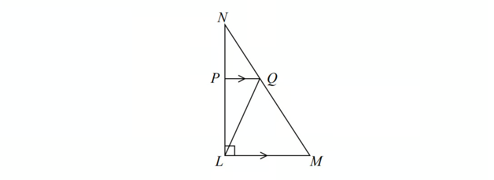

Angle $NLM$= 90° 
$PQ$ is parallel to $LM$.

The area of triangle $PNQ$ is 8 cm2
 The area of triangle $LPQ$ is 16 cm2

Work out the area of triangle $LQM$.

## Q2 — hard — 2 marks · exam-questions

### 21() — 2 marks — command: work_out — structured — from paper June 2015 · 1MA0/2H
Fred is making two rectangular flower beds.

The dimensions of the larger rectangle will be three times the dimensions of the smaller rectangle.

There is going to be the same depth of soil in each flower bed. Fred needs 180 kg of soil for the smaller flower bed.

Work out how much soil Fred needs for the larger flower bed.

## Q3 — medium — 3 marks · exam-questions

### 16() — 3 marks — command: work_out — structured — from paper November 2013 · 1MA0/1H
A company makes monsters.

The company makes small monsters with a height of 20 cm.

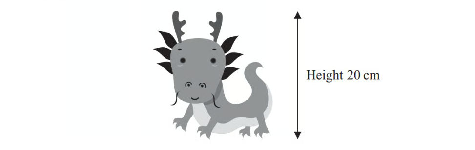

A small monster has a surface area of 300 cm2.

The company also makes large monsters with a height of 120 cm.

A small monster and a large monster are mathematically similar.

Work out the surface area of a large monster.

## Q4 — very_hard — 4 marks · exam-questions

### 17() — 4 marks — command: calculate — structured — from paper Jan 2022 · 4MA1/1H
$A$ and$B$are two similar vases.

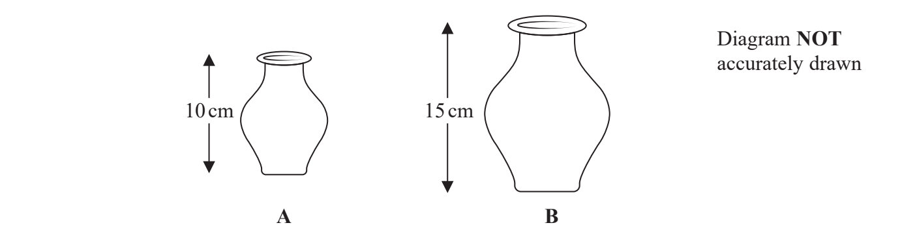

Vase $A$ has height 10 cm. 
Vase $B$ has height 15 cm.

The difference between the volume of vase $A$ and the volume of vase $B$ is 1197 cm3

Calculate the volume of vase $A$

...................................................... cm3

## Q5 — hard — 4 marks · exam-questions

### 22() — 4 marks — command: work_out — structured — from paper June 2013 · 1MA0/1H
$P$ and $Q$ are two triangular prisms that are mathematically similar.

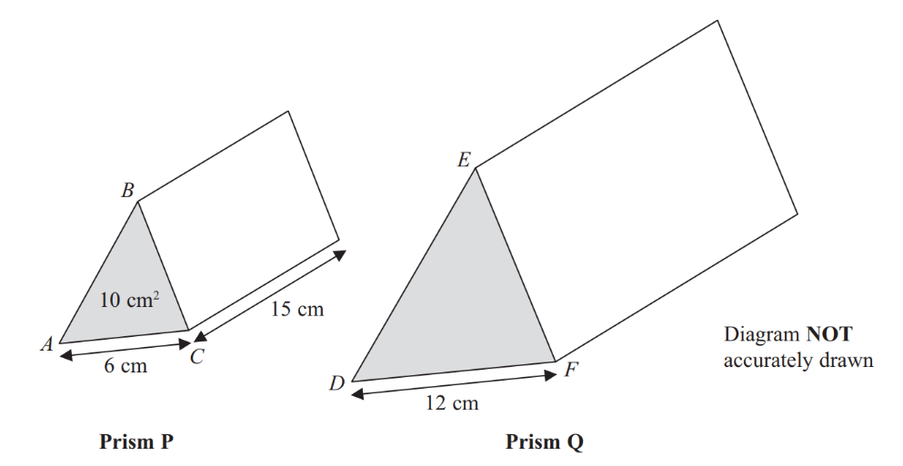

Prism $P$ has triangle $ABC$ as its cross section. 
Prism $Q$ has triangle $DEF$ as its cross section.

$AC$ = 6 cm 
$DF$= 12 cm

The area of the cross section of prism $P$ is 10 cm2. 
The length of prism $P$ is 15 cm.

Work out the volume of prism $Q$.

## Q6 — medium — 4 marks · exam-questions

### 25((a)) — 2 marks — command: work_out — structured — from paper November 2012 · 1MA0/1H
The diagram shows two similar solids, $A$ and $B$.

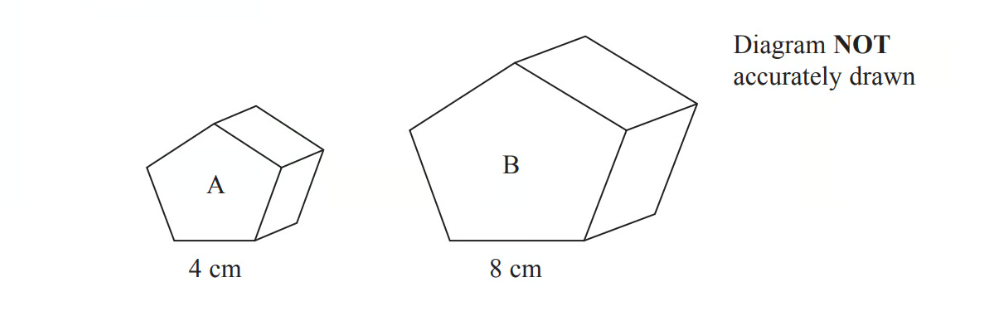

Solid A has a volume of 80 cm3.

Work out the volume of solid B.

### 25((b)) — 2 marks — command: work_out — structured — from paper November 2012 · 1MA0/1H
Solid B has a total surface area of 160 cm2.

Work out the total surface area of solid $A$.

## Q7 — very_hard — 4 marks · exam-questions

### 20() — 4 marks — command: calculate — structured — from paper Jan 2020 · 4MA1/2HR
The diagram shows two similar vases, $A$ and $B$.

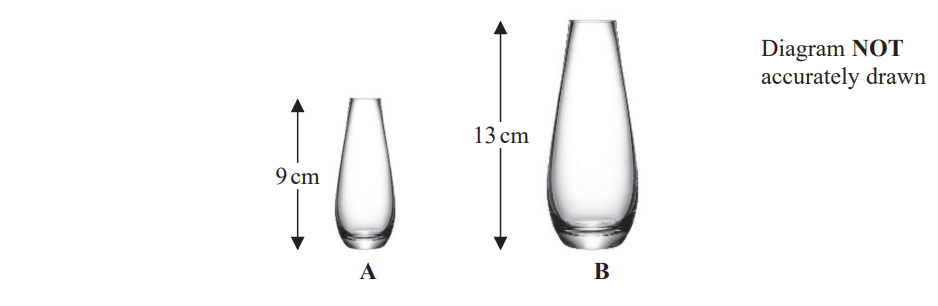

The height of vase $A$ is 9cm and the height of vase $B$ is 13 cm.

Given that

surface area of vase $A$ + surface area of vase $B$ = 1800$\mathrm{cm}^{2}$

calculate the surface area of vase $A$.

........................$\mathrm{cm}^{2}$

## Q8 — hard — 5 marks · exam-questions

### 18((a)) — 2 marks — command: work_out — structured — from paper November 2014 · 1MA0/1H
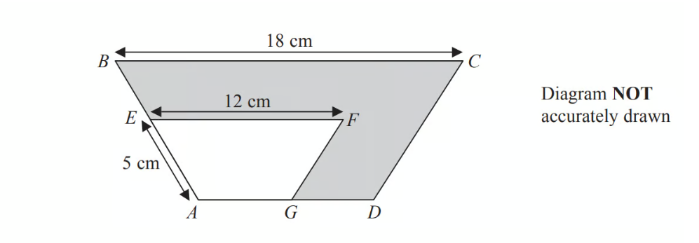

$ABCD$ and $AEFG$ are mathematically similar trapeziums.$AE=5\mathrm{cm}\,EF=12\mathrm{cm}\,BC=18\mathrm{cm}$

Work out the length of  $AB$.

### 18((b)) — 3 marks — command: work_out — structured — from paper November 2014 · 1MA0/1H
Trapezium $AEFG$ has an area of 36 cm2.

Work out the area of the shaded region.

## Q9 — medium — 4 marks · exam-questions

### 17((a)) — 2 marks — command: work_out — structured — from paper June 2019 · 4MA1/1H
$A$ and $B$ are two similar vases.

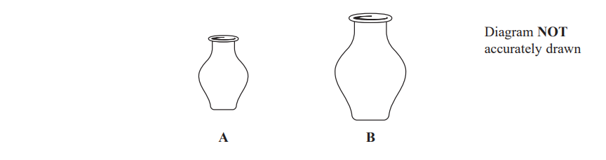

Vase $A$has height 24 $\mathrm{cm}$. 
Vase $B$ has height 36 $\mathrm{cm}$.

Vase $A$ has a surface area of 960 $\mathrm{cm}^{2}$

Work out the surface area of vase $B$.

........................$\mathrm{cm}^{2}$

### 17((b)) — 2 marks — command: find — structured — from paper June 2019 · 4MA1/1H
Vase $B$ has a volume of $V\mathrm{cm}^{3}$

Find in terms of $V$ , an expression for the volume, in $\mathrm{cm}^{3}$, of vase $A$.

.........................$\mathrm{cm}^{3}$

## Q10 — very_hard — 4 marks · exam-questions

### 18() — 4 marks — command: find — structured — from paper Jan 2019 · 4MA1/1H
The total surface area of a solid hemisphere is equal to the curved surface area of a cylinder.

The radius of the hemisphere is $r$ cm. 
The radius of the cylinder is twice the radius of the hemisphere.

Given that

$\mathrm{volume} \mathrm{of} \mathrm{hemisphere}:\mathrm{volume} \mathrm{of} \mathrm{cylinder}=1:m$

find the value of $m$.

## Q11 — hard — 3 marks · exam-questions

### 13() — 3 marks — command: work_out — structured — from paper June 2018 · 1MA1/3H
Here are two similar solid shapes.

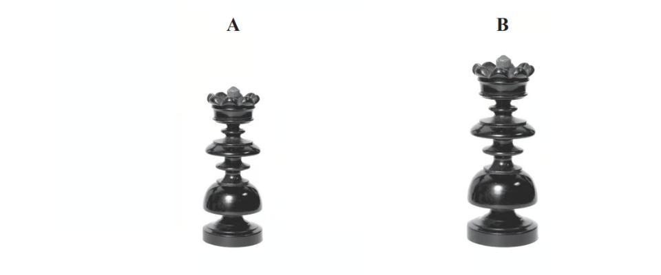

surface area of shape **A** : surface area of shape **B **= 3:4

The volume of shape **B** is 10 cm3

Work out the volume of shape **A**. 
Give your answer correct to 3 significant figures.

## Q12 — medium — 3 marks · exam-questions

### 20() — 3 marks — command: work_out — structured — from paper Jan 2021 · 4MA1/1H
$A$ and$B$are two similar solids.

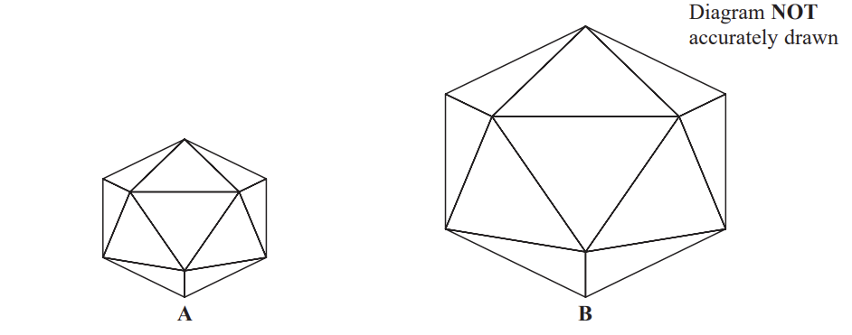

$A$ has a volume of 1836 cm3 
$B$ has a volume of 4352 cm3

$B$ has a total surface area of 1120 cm2 
Work out the total surface area of $A$.

...................................................... cm2

## Q13 — very_hard — 4 marks · exam-questions

### 16() — 4 marks — command: find — structured — from paper June 2018 · 4MA1/1H
A frustum is made by removing a small cone from a large cone. The cones are mathematically similar.

The large cone has base radius $r$ cm and height $h$ cm. Given that

$\frac{\mathrm{volume} \mathrm{of} \mathrm{frustum}}{\mathrm{volume} \mathrm{of} \mathrm{large} \mathrm{cone}}=\frac{98}{125}$

find an expression, in terms of $h$, for the height of the frustum.

....................................................... cm

## Q14 — hard — 3 marks · exam-questions

### 18() — 3 marks — command: show — structured — from paper Sample 2015 · 1MA1/1H
Solid **A** and solid **B** are mathematically similar. 
The ratio of the surface area of solid **A **to the surface area of solid **B** is 4: 9

The volume of solid** B **is 405 cm3.

Show that the volume of solid **A** is 120cm3.

## Q15 — medium — 3 marks · exam-questions

### 23() — 3 marks — command: work_out — structured — from paper Nov 2020 · 4MA1/1H
$R$and $S$ are two similar solid shapes.

Shape $R$ has surface area $108\mathrm{cm}^{2}$ and volume $135\mathrm{cm}^{3}$ 
Shape $S$ has surface area $300\mathrm{cm}^{2}$

Work out the volume of shape $S$.

............................................... $\mathrm{cm}^{3}$

## Q16 — very_hard — 4 marks · exam-questions

### 18((b)) — 4 marks — command: calculate — structured — from paper June 2018 · J560/06
A standard tin and a large tin are mathematically similar. 
The **volume** of the large tin is 50% more than the volume of the standard tin. 
Both tins are cylinders.
The radius of the standard tin is 10cm.

Calculate the radius of the large tin.

........................... cm

## Q17 — hard — 3 marks · exam-questions

### 20() — 3 marks — command: how — structured — from paper Spec1 2015 · 1MA1/3H
Mark has made a clay model. 
He will now make a clay statue that is mathematically similar to the clay model.

The model has a base area of 6cm2 
The statue will have a base area of 253.5 cm2

Mark used 2kg of clay to make the model.

Clay is sold in 10kg bags. 
Mark has to buy all the clay he needs to make the statue.

How many bags of clay will Mark need to buy?

## Q18 — medium — 3 marks · exam-questions

### 20() — 3 marks — command: work_out — structured — from paper June 2021 · 4MA1/2H
Mathematically similar wooden blocks are made in a workshop.

There are small blocks and there are large blocks.

The volume of each small block is 300cm3

Given that the surface area of each small block : the surface area of each large block = 25 : 36

work out the volume of each large block.

....................................................... cm3

## Q19 — very_hard — 2 marks · exam-questions

### 25((b)) — 2 marks — command: find — structured — from paper 2019	May/June · 0580/23
The area of pentagon *A* is $73.5\text{cm}^{2}$. 
The area of pentagon *B* is $6\text{cm}^{2}$.

Find the ratio    perimeter of pentagon *A* : perimeter of pentagon *B*   in its simplest form.

......................... : .........................

## Q20 — hard — 3 marks · exam-questions

### 14() — 3 marks — command: show — structured — from paper November 2017 · 1MA1/3H
Cone **A** and cone **B** are mathematically similar. 
The ratio of the volume of cone **A **to the volume of cone **B** is 27:8

The surface area of cone **A** is 297 cm2

Show that the surface area of cone **B** is 132 cm2

## Q21 — medium — 3 marks · exam-questions

### 16() — 3 marks — command: work_out — structured — from paper Jan 2019 · 4MA1/2H
The diagram shows two mathematically similar vases, $A$ and $B.$

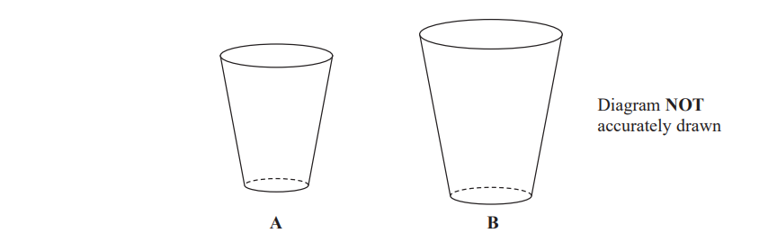

$A$ has a volume of $405\mathrm{cm}^{3}$ 
$B$ has a volume of $960\mathrm{cm}^{3}$

$B$ has a surface area of $928\mathrm{cm}^{2}$

Work out the surface area of $A.$

## Q22 — very_hard — 11 marks · exam-questions

### 6((a)) — 5 marks — command: calculate — structured — from paper 2019 March · 0580/42
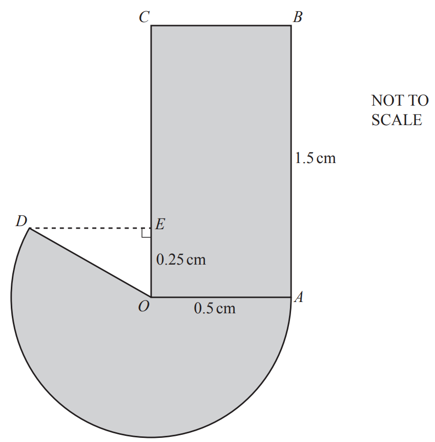

The diagram shows a company logo made from a rectangle and a major sector of a circle. 
The circle has centre *O* and radius *OA*. *OA* = *OD* = 0.5 cm and *AB* = 1.5 cm. 
*E* is a point on *OC* such that *OE* = 0.25 cm and angle *OED* = 90°.

Calculate the perimeter of the logo.

............................................. cm

### 6((b)) — 3 marks — command: calculate — structured — from paper 2019 March · 0580/42
Calculate the area of the logo.

............................................ cm2

### 6((c)) — 3 marks — command: calculate — structured — from paper 2019 March · 0580/42
A mathematically similar logo is drawn. 
The area of this logo is 77.44 cm2.

Calculate the radius of the major sector in this logo.

............................................. cm

## Q23 — hard — 4 marks · exam-questions

### 9((a)) — 2 marks — command: find — structured — from paper June 2019 · 1MA1/2H
The circumference of circle **B** is 90% of the circumference of circle **A**.

Find the ratio of the area of circle **A** to the area of circle **B**.

### 9((b)) — 2 marks — command: work_out — structured — from paper June 2019 · 1MA1/2H
Square **E** has sides of length $e$ cm. 
Square **F** has sides of length $f$ cm.

The area of square **E** is 44% greater than the area of square **F**.

Work out the ratio $e:f$

## Q24 — medium — 3 marks · exam-questions

### 21() — 3 marks — command: work_out — structured — from paper June 2019 · 4MA1/2HR
The diagram shows two similar bottles, $A$ and $B$.

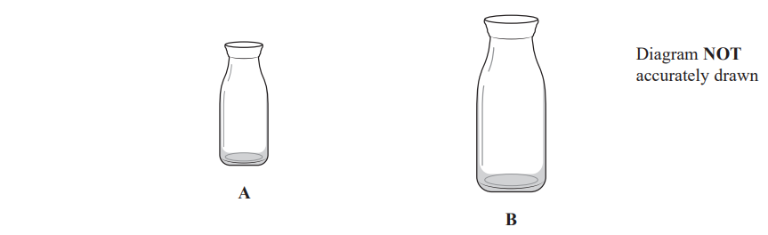

Bottle $A$  has surface area $240\mathrm{cm}^{2}$ 
Bottle $B$ has surface area 540 $\mathrm{cm}^{2}$and volume $2025\mathrm{cm}^{3}$

Work out the volume of bottle $A$.

.......................$\mathrm{cm}^{3}$

## Q25 — very_hard — 5 marks · exam-questions

### 23() — 5 marks — command: work_out — structured — from paper 2023 Nov · 4MA1/1H
Solid **A** is similar to solid **B**

Here is some information about solid **A **and solid **B**

|   | solid A | solid B |
|---|---|---|
| Height (cm) | $3^{x}$ |   |
| Area (cm2 ) | 7776 | 486 |
| Volume (cm3 ) | $8^{x}$ | $2^{x+4}$ |

Work out the height of solid **B **
Give your answer as a decimal

## Q26 — hard — 4 marks · exam-questions

### 18() — 4 marks — command: work_out — structured — from paper Jan 2022 · 4MA1/1HR
The three solids $A,B$ and C are similar such that

the surface area of $A:$ the surface area of $B=4:9$

and

the volume of $B:$the volume of $C=125:343$

Work out the ratio

the height of $A:$ the height of $C$

Give your ratio in its simplest form.

## Q27 — medium — 2 marks · exam-questions

### 27() — 2 marks — command: complete — structured — from paper Nov 2020 · 8300/1H
A and B are similar solid cylinders.

| base area of A : base area of B = 9 : 25 |
|---|

Complete these ratios.

curved surface area of A : curved surface area of B =................... : ................

height of A : height of B =.................... : ................

## Q28 — hard — 3 marks · exam-questions

### 14((b)) — 3 marks — command: calculate — structured — from paper Nov 2021 · 4MA1/1H
$ABCDEF$ and $GHIJKL$ are regular hexagons each with centre $O$.

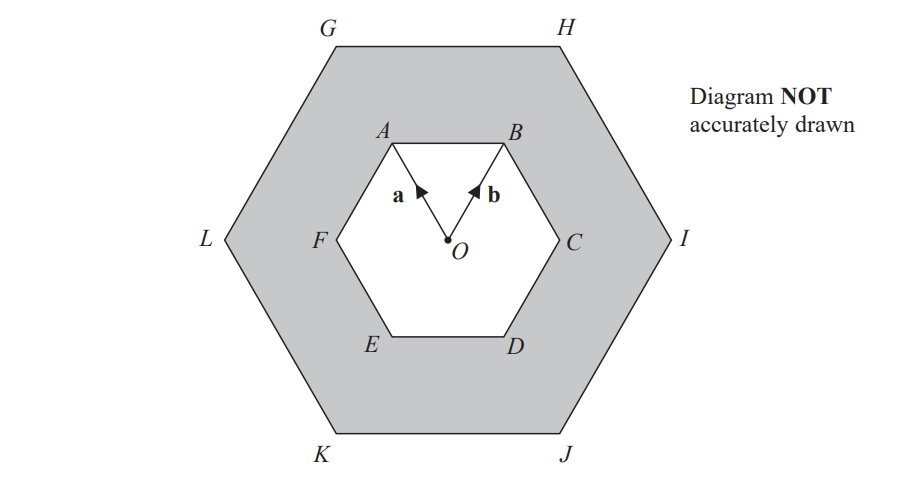

$GHIJKL$ is an enlargement of $ABCDEF$, with centre $O$ and scale factor 2

The triangle $OAB$ has an area of 5 cm2

Calculate the area of the shaded region.

....................................................... cm2

## Q29 — medium — 1 marks · exam-questions

### 23() — 1 mark — command: work_out — structured — from paper June 2019 · 8300/2H
A and B are similar cuboids.

surface area of A : surface area of B = 16 : 25

Work out volume of A : volume of B

Circle your answer.

| 4 : 5 | 16 : 25 | 64 : 125 | 256 : 625 |
|---|---|---|---|

## Q30 — hard — 3 marks · exam-questions

### 12() — 3 marks — command: calculate — structured — from paper Specimen 2016 · 4MA1/1H
$ABCDE$ and $AFGHJ$ are regular pentagons.

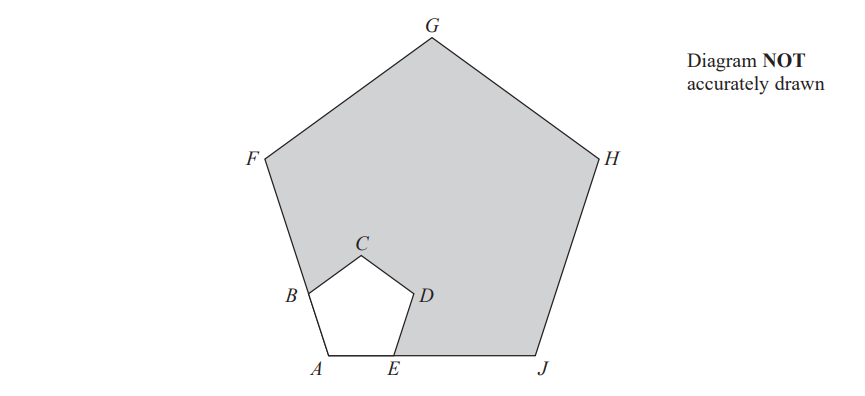

$AEJ$ and $ABF$are straight lines.

$EJ=4AE$ 
The area of $ABCDE$ is $8\mathrm{cm}^{2}$

Calculate the area of the shaded region.

.............................$\mathrm{cm}^{2}$

## Q31 — medium — 3 marks · exam-questions

### 23() — 3 marks — command: work_out — structured — from paper June 2018 · 8300/2H
Solids $X$ and $Y$ are similar.

$X$ has volume 64 cm3 
$Y$ has volume 343 cm3

The surface area of $X$ is 176 cm2 
Work out the surface area of $Y$.

..........................cm2

## Q32 — hard — 4 marks · exam-questions

### 23() — 1 mark — command: comment — structured — from paper Nov 2019 · 8300/2H
Here are three similar cuboids, A, B and C.

A has length 5 cm, width 2 cm and height 3 cm 
B has length 10 cm 
C has length $x$ cm

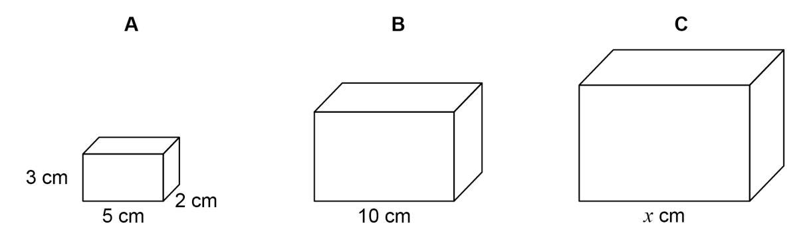

The total surface area of A is 62 cm2

Tim wants to work out the total surface area of B.

Here is his working.

| `table row cell 10 space divided by space 5 space end cell equals cell space 2 space end cell row cell 62 space cross times space 2 space end cell equals cell space 124 space end cell row cell Total space surface space area space of space straight B space end cell equals cell space 124 space cm squared end cell end table` |
|---|

Make one criticism of Tim’s method.

### 23((b)) — 3 marks — command: work_out — structured — from paper Nov 2019 · 8300/2H
Volume of $A\times\frac{125}{8}=$ Volume of C

Work out the value of $x$.

## Q33 — medium — 2 marks · exam-questions

### 16((b)) — 2 marks — command: find — structured — from paper Specimen 2015 · J560/06
Simon cuts the corners off a square piece of card to leave the regular octagon shown below.

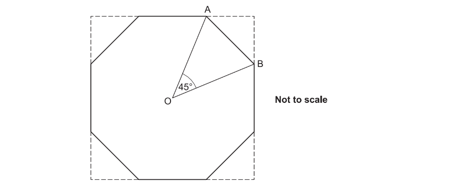

Simon makes a table top using the card as a model. 
The sides of the table top are 8 times as long as the sides of the card model.

Find the ratio of the **area** of Simon’s table top to the **area** of the card model.

## Q34 — hard — 4 marks · exam-questions

### 14() — 4 marks — command: show — structured — from paper Specimen 2015 · 8300/2H
A pattern is made from two **similar **trapeziums.

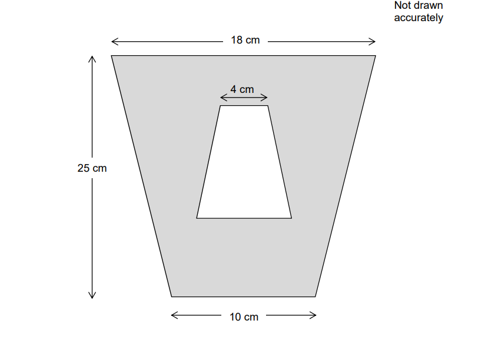

Show that the shaded area is 294 cm2

## Q35 — medium — 4 marks · exam-questions

### 13() — 4 marks — command: work_out — structured — from paper Nov 2020 · J560/06
In the diagram, AED and ABC are straight lines and BE is parallel to CD.

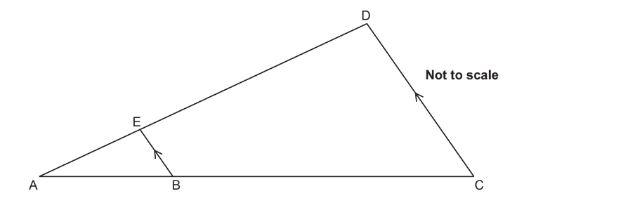

The ratio of length AB to length BC is 2 : 3. 
Triangle ABE has an area of 8cm2 .

Work out the area of triangle ACD.

................................................... cm2

## Q36 — hard — 4 marks · exam-questions

### 17() — 4 marks — command: find — structured — from paper Nov 2018 · J560/05
The diagram consists of three mathematically similar shapes. The heights of the shapes are in the ratio 1 : 4 : 5.

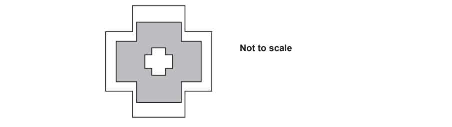

Find the ratio

total shaded area : total unshaded area.

Give your answer in its simplest form.

total shaded area : total unshaded area ............ : ..........

## Q37 — medium — 3 marks · exam-questions

### 13((a)) — 3 marks — command: work_out — structured — from paper Nov 2019 · J560/04
A transport lorry consists of a cab and a trailer. 
The trailer has a volume of 90m3. 
Alfie makes a model of this lorry using a scale of 1 : 72.

Work out the volume of the trailer in Alfie’s model, giving your answer in cm3.

................................................... cm3

## Q38 — hard — 4 marks · exam-questions

### 9((b)) — 4 marks — command: multiple — structured — from paper June 2017 · J560/06
Prism P and prism Q are similar. The ratio of the surface area of prism P to the surface area of prism Q is 1 : 3.

i) Jay says

The height of prism P is one third of the height of prism Q.

Explain why he is wrong.

[1]

ii) The volume of prism Q is 86 cm3.

Calculate the volume of prism P.

.................................................... cm3 [3]

## Q39 — medium — 4 marks · exam-questions

### 21() — 4 marks — command: calculate — structured — from paper June 2019 · J560/06
Toy building bricks are available in two sizes, small and large.

The small and large bricks are mathematically similar.

A small brick has volume 8cm3 and width 2.1cm.

A large brick has volume 15.625 cm3.

Calculate the width of a large brick.

..................................................... cm
