# Mark Schemes — Circle Theorems
**Geometry** · Edexcel IGCSE Maths A (Modular) (4XMAF/4XMAH) — 24/Higher Unit 2

## Q1 — easy — 4 marks · exam-questions

### 14((a)) — 2 marks
(i)

> *Look for a circle theorem that involves a triangle in a semicircle*

**Final answer:** **90°**

**[B1]**

(ii)

> *Explain the circle theorem you have used*

**Final answer:** **Angle in a semicircle is 90°**

**Final answer:** **or**

**Final answer:** **A triangle in a semicircle is 90°**

**Final answer:** **or**

**Final answer:** **The angle at the circumference is half the angle in the centre**

**Final answer:** **or**

**Final answer:** **The angle in the centre is double the angle at the circumference**

**[B1]**

### 14((b)) — 2 marks
(i)

> *This angle is equal to PRQ*

**Final answer:** **22°**

**[B1]**

(ii)

> *Explain the circle theorem you have used which can be worded in one of these ways*

**Final answer:** **Angles subtended from the same arc are equal**

**Final answer:** **or**

**Final answer:** **Angles in the same segment are equal**

**Final answer:** **or**

**Final answer:** **Angles on the same chord are equal**

**[B1]**

## Q2 — very_hard — 5 marks · exam-questions

### 22() — 5 marks
> *For triangles **BCD** and **ECA** to be similar, they must have three corresponding angles of the same size.*

> *Show that Angle **AED** = Angle **ABD*

*Let Angle ***AED*** = *$x^{\circ}$

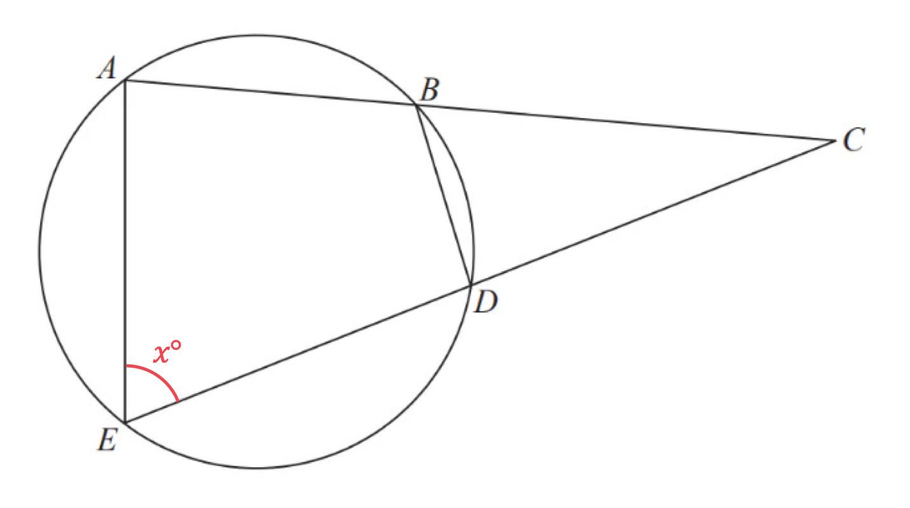

> *Find an expression in terms of *$x$* for angle **ABD**.*

*Angle ***AED*** + Angle ***ABD*** = 180**o**   (Opposite angles in a cyclic quadrilateral = 180**o**)*

*Angle *** ABD*** = (180 - *$x$*)**o*

**[1]**

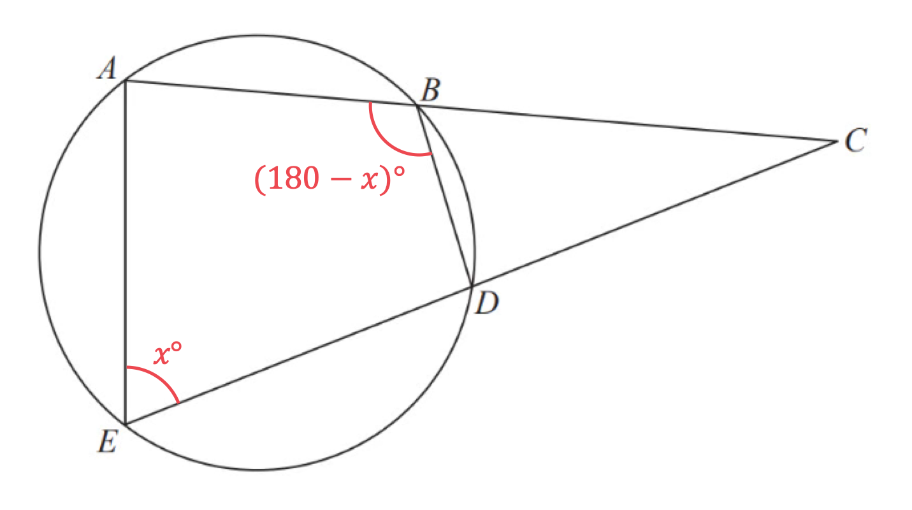

> *Find an expression in terms of *$x$* for angle **CBD**.*

*Angle ***ABD*** + Angle ***CBD*** = 180**o**   (Angles along a straight line = 180**o**)*

*Angle ***CBD*** = *$x^{\circ}$

**[1]**

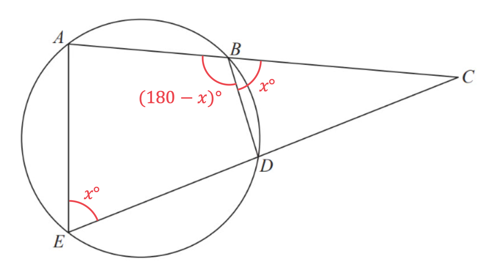

> *Show that Angle **EAB** = Angle **BDC*

*Let Angle ***EAB*** = *$y^{\circ}$* *

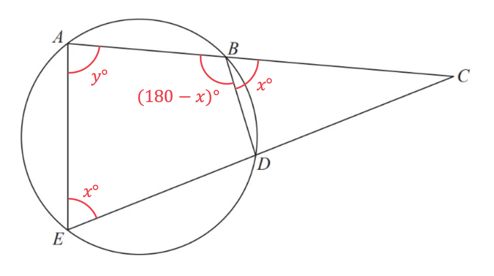

> *Find an expression in terms of *$y$* for angle **EDB**.*

*Angle ***EDB*** + Angle ***EAB*** = 180**o**   (Opposite angles in a cyclic quadrilateral = 180**o**)*

*Angle *** EBD*** = (180 - *$y$*)**o*

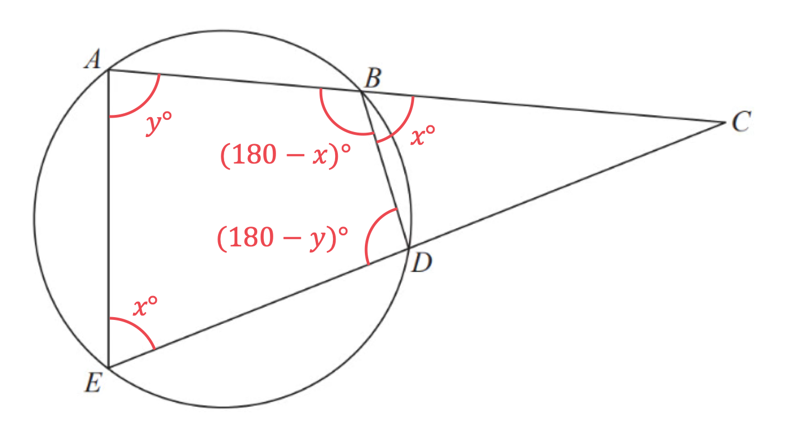

> *Find an expression in terms of *$y$* for angle **BDC**.*

*Angle ***EBD*** + Angle ***BDC*** = 180**o**   (Angles along a straight line = 180**o**)*

*Angle ***BDC*** = *$y^{\circ}$

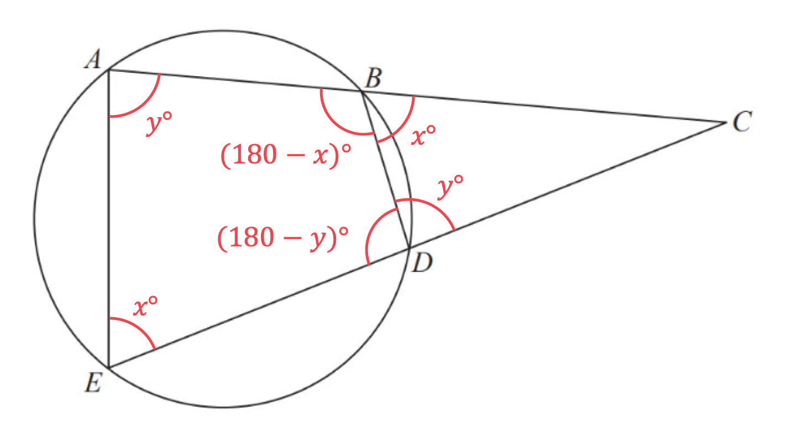

> *Show that triangles **BCD **and **ECA **are similar*

*Angle ***AED ***= Angle ***DBC **
*Angle ***EAB*** = Angle ***BDC** 
*Angle*** BCD*** is shared by both triangles*

**Indication that Angle BCD is common to both triangles**** [1]**

**Final answer:** $\therefore$** Triangles ****BCD**** and ****ECA**** are similar **

**At least one correct reasoning statement made ****[1] **
**Complete proof**** [1]**

## Q3 — hard — 3 marks · exam-questions

### 21() — 3 marks
> *Find the angles **ABO** and angle **ADO**.*

*Angle ***ABO*** = Angle ***ADO*** = 90**o**   (Angle between a tangent and a radius is 90**o**)*

**[1]**

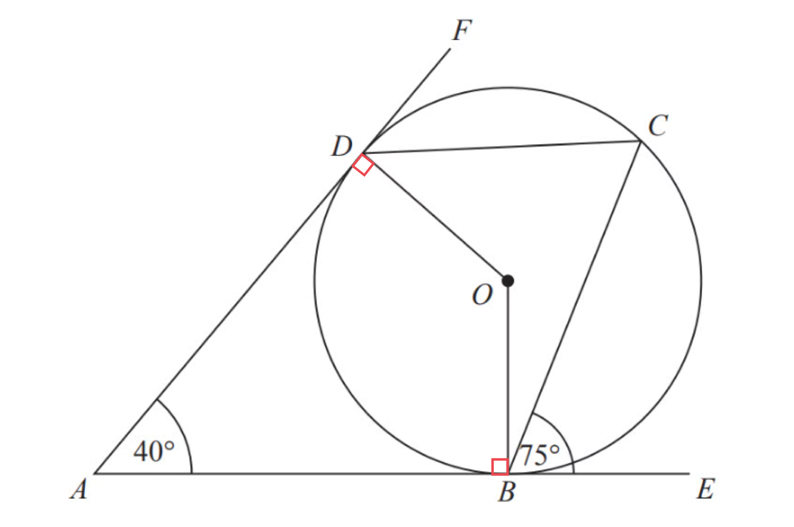

> *Find angle **BOD**.*

*Angle ***BOD*** + Angle ***BAD*** + Angle ***ADO*** + Angle ***BDO*** = 180**o**   (Angles in a quadrilateral = 180**o**)*

*Angle ***BOD*** + 40 + 90 + 90 = 180 *
*Angle ***BOD*** = 140**o*

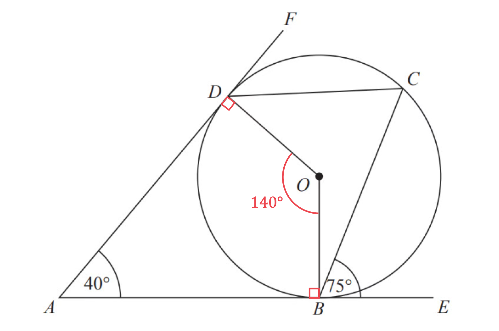

> *Find the angle **BCD**.*

*Angle ***BCD*** = *$\frac{1}{2}$* x Angle ***BOD***   (Angle at the centre is twice the angle at the circumference)*

*Angle ***BCD*** = *$\frac{1}{2}\times140$

*Angle ***BCD*** = 70**o*

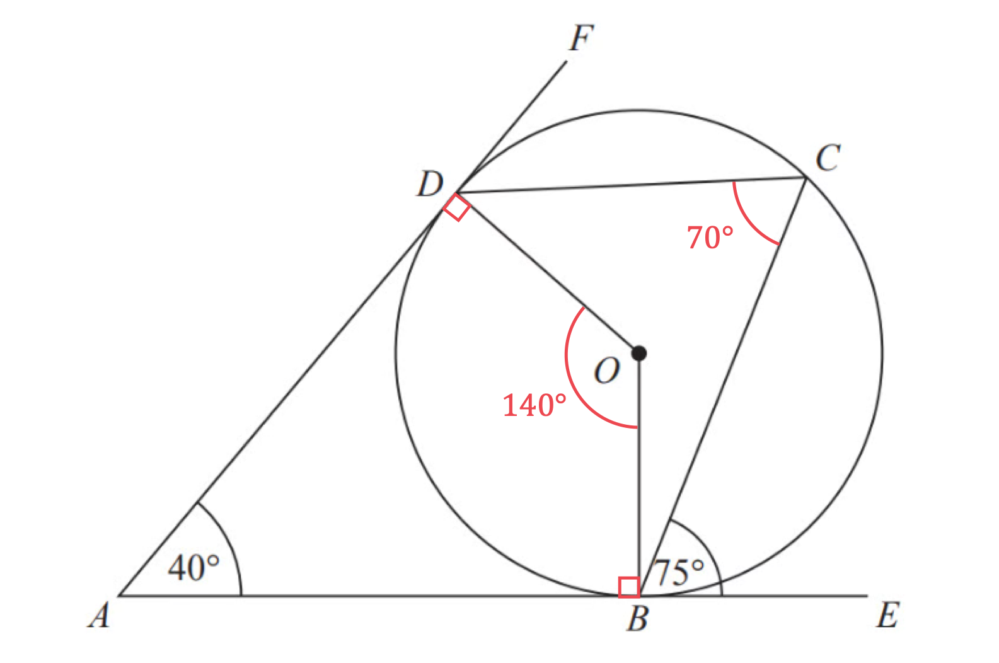

> *Find angle **CBD**.*

*Angle ***CBO*** + Angle ***ABO*** + Angle ***CBE*** = 180**o**   (Angles along a straight line = 180**o**)*

*Angle ***CBO*** + 90 + 75 = 180*

*Angle ***CBO*** = 15**o*

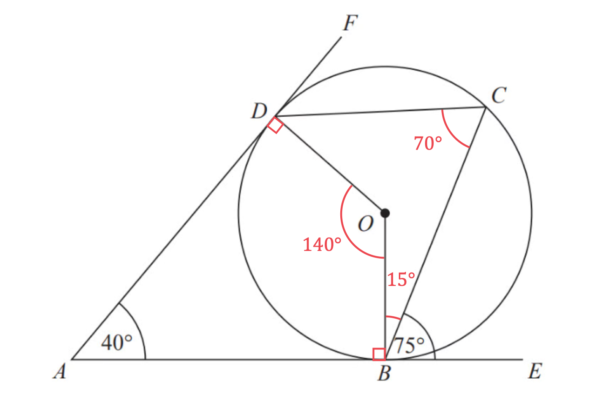

> *Find the reflex angle **BOD**.*

*Reflex Angle ***BOD ***+ Obtuse Angle ***BOD*** = 360**o**   (Angles around a point = 360**o**)*

*Reflex Angle ***BOD*** + 140 = 360 *
*Reflex Angle ***BOD*** = 220**o*

**[1]**

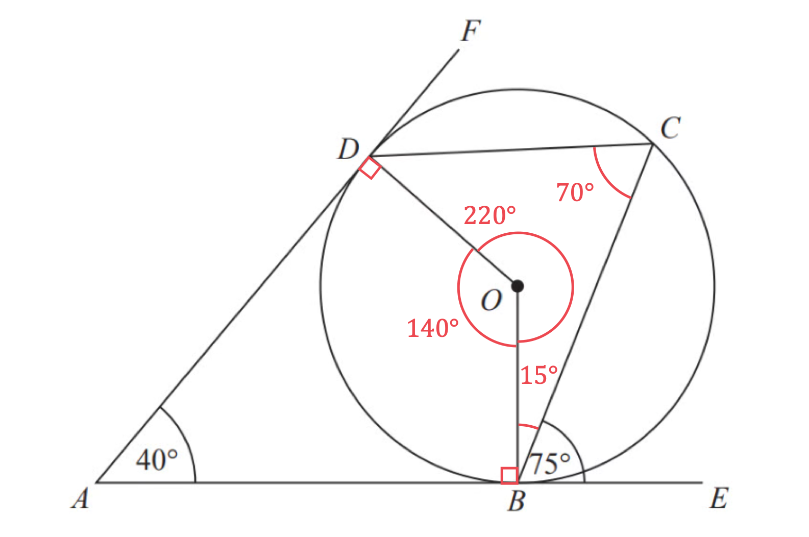

> *Find angle **ODC**.*

*Angle ***ODC*** + Angle ***DCB*** + Angle ***CBD*** + Reflex Angle ***BOD*** = 360**o **  (Angles in a quadrilateral = 360**o**)*

*Angle ***ODC ***+ 70 + 15 + 220 = 360*

**Angle ****ODC ****= 55****o**** ****[1]**

## Q4 — medium — 4 marks · exam-questions

### 21() — 4 marks
> *Find angle **ADO** and angle **ABO**.*

*Angle ***ADO*** = Angle ***ABO*** = 90**o**   (Angle between a tangent and a radius = 90**o**)*

**90****o**** stated ****[1]**

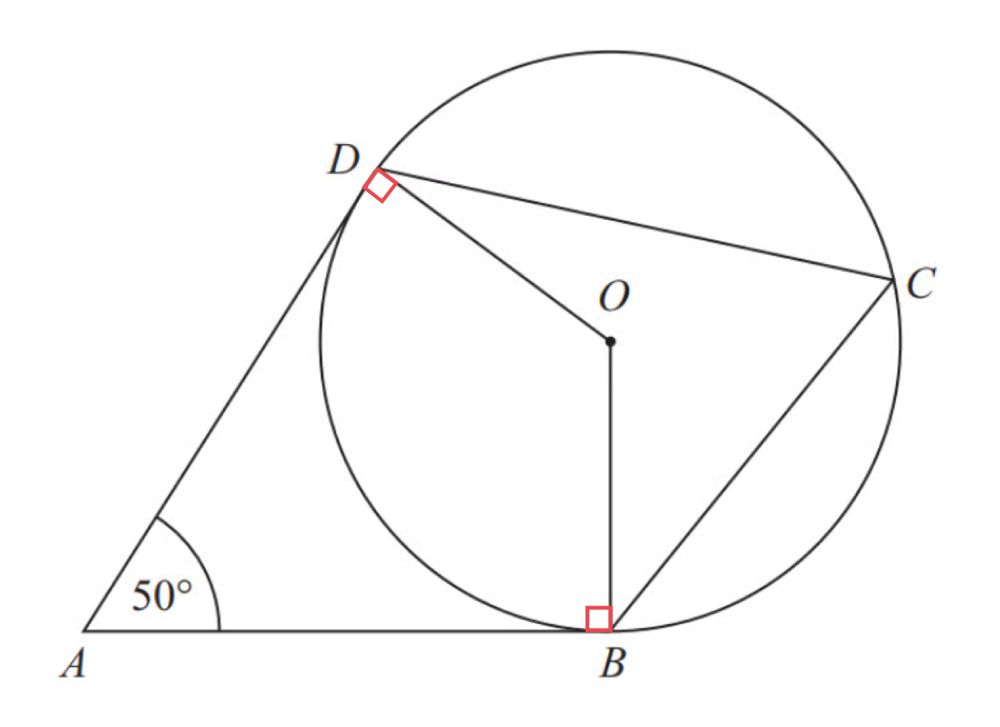

> *Find angle **DOB**.*

*Angle ***DOB*** + Angle ***ADO*** + Angle ***ABO*** + Angle ***DAB*** = 360**o**   (Angles inside a quadrilateral = 360**o**) *

*Angle ***DOB*** + 90 + 90 + 50 = 360 *
*Angle ***DOB*** = 360 - 90 - 90 - 50 *
*Angle ***DOB*** = 130**o*

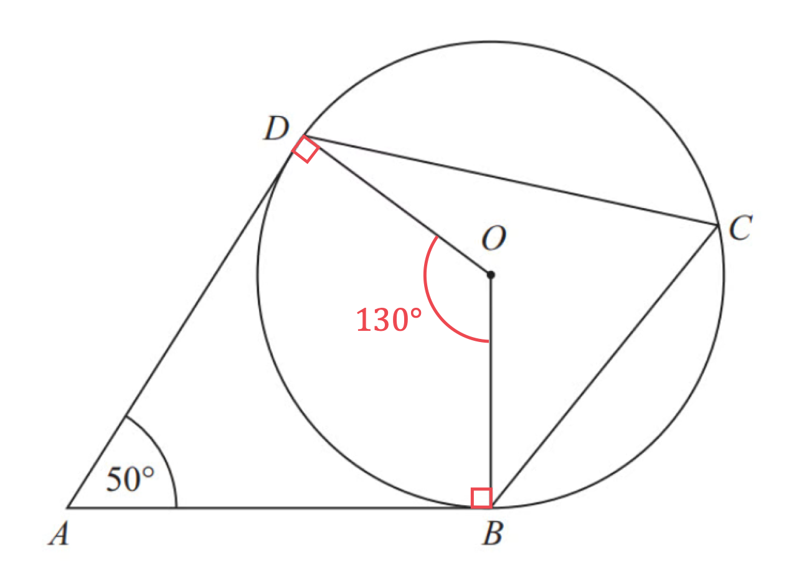

> *Find angle **BCD**.*

*Angle ***DOB*** = 2 x Angle ***BCD***   (Angle at the centre is twice the angle at the circumference)*

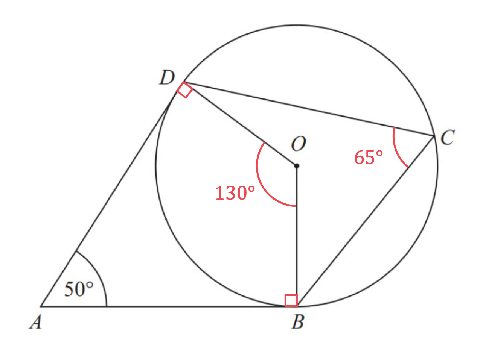

**One correct circle theorem stated**** [1]**** **
**All correct reasons stated**** [1]**

**Angle ****BCD**** = 65****o**** ****[1]**

## Q5 — very_hard — 4 marks · exam-questions

### 13((a)) — 3 marks
> *Find Angle **BDE**.*

*Angle ***BAD*** = Angle ***BDE*** = *$y^{\circ}$*   (Alternate segment theorem)*

**[1]**

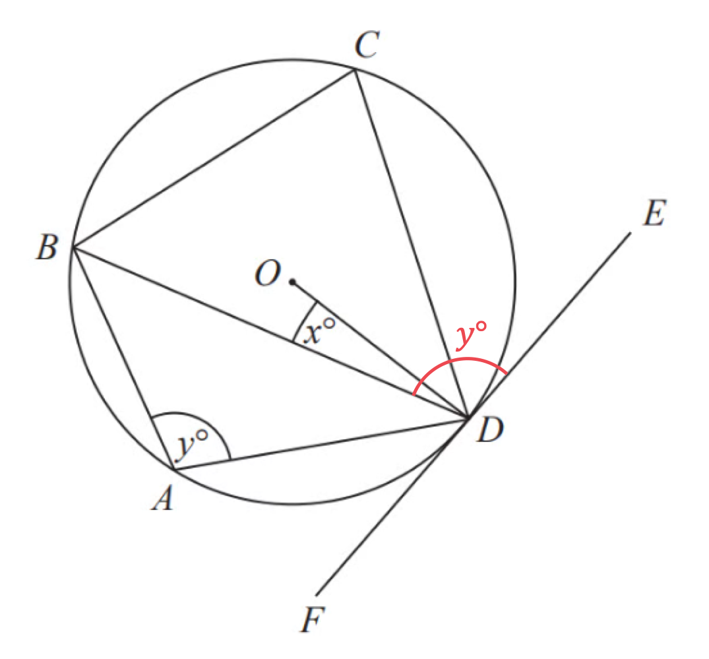

> *Find angle **ODE**.*

*Angle ***ODE*** = 90**o**   (Angle between a tangent and a radius = 90**o**)*

> *Write down an expression for angle **ODE** in terms of angles **BDE** and **BDO**.*

*Angle ***BDE*** - Angle ***BDO*** = Angle ***ODE**

$y-x=90$

**Correct circles theorems stated for the working**** shown [1] ****Completely correct method leading to given answer**** [1]**

### 13((b)) — 1 marks
**Final answer:** **Dylan is incorrect because **$x$** must be less than 90****o**** as it is part of an angle between a tangent and a radius**

**or**

**Final answer:** **Dylan is incorrect because **$y$** must be less than 180****o**** as it is an angle within a triangle**

**One correct answer and explanation given**** [1]**

## Q6 — hard — 4 marks · exam-questions

### 17() — 4 marks
> *Find angle **ABC**.*

*Angle ***ABC*** = 90**o**   (Triangle in a semi-circle has a right angle)*

**[1]**

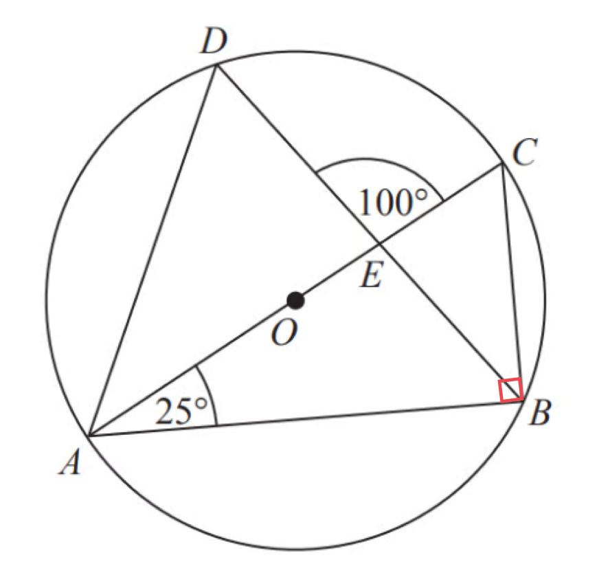

> *Find angle **ACB**.*

*Angle ***ACB*** + Angle ***ABC*** + Angle ***CAB*** = 180**o**   (Angles in a triangle = 180**o**)*

*Angle ***ACB*** + 90 + 25 = 180 *
*Angle ***ACB*** = 65**o*

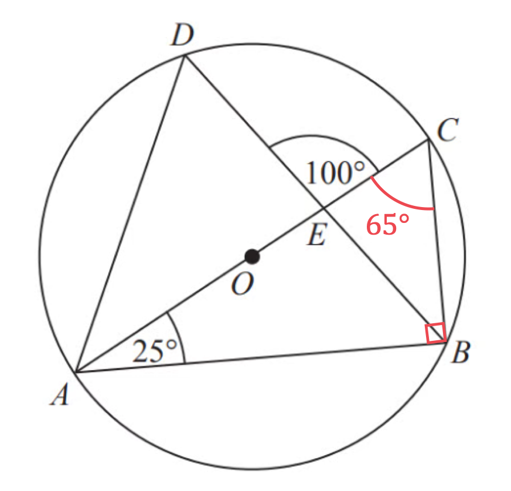

> *Find angle **ADB**.*

*Angle ***ADB*** = Angle ***ACB***   (Angles in the same segment are equal)*

*Angle ***ADB*** = 65**o*

**[1]**

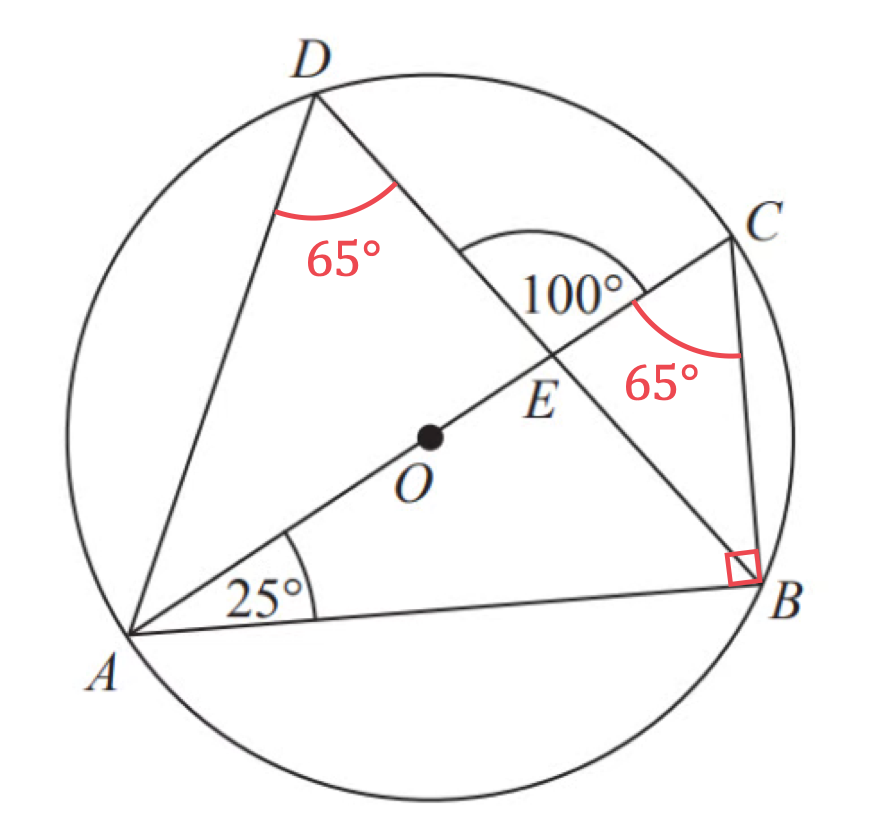

> *Find angle **DEA**.*

*Angle ***DEA*** + Angle ***DEC*** = 180**o**   (Angles along a straight line = 180**o**)*

*Angle ***DEA*** + 100 = 180 *
*Angle ***DEA*** = 80**o*

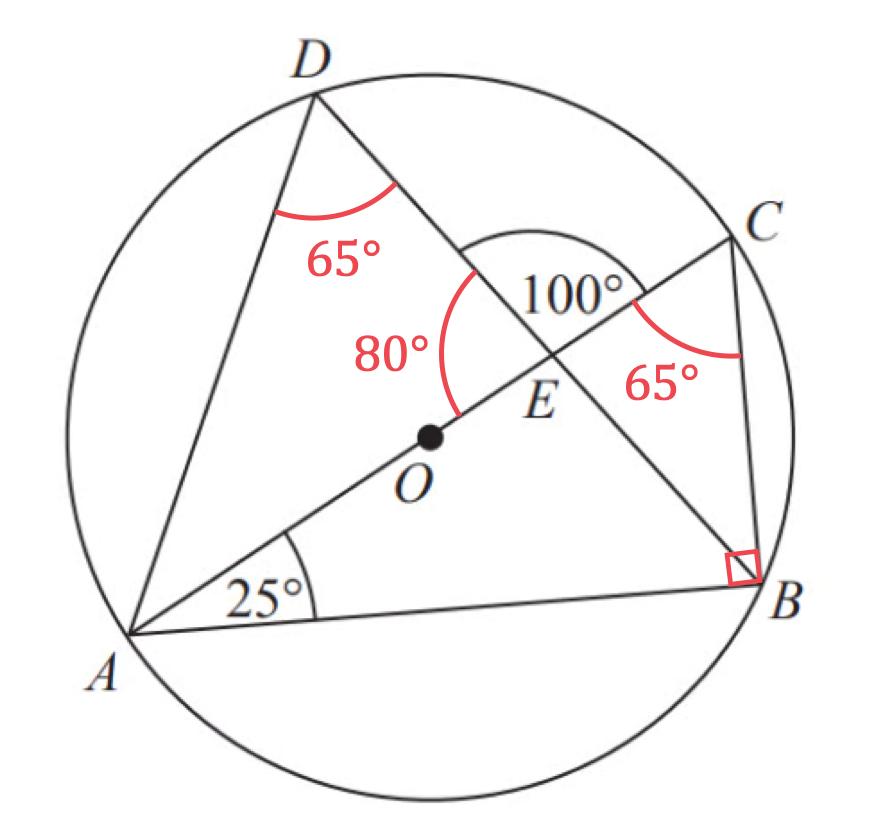

> *Find angle **DAC**.*

*Angle ***DAE ***+ Angle ***AED*** + Angle ***ADE*** = 180**o**   (Angles in a triangle = 180**o**)*

*Angle ***DAE*** + 80 + 65 = 180*

**[1]**

*Angle ***DAE***  = 35*

*Angle ***DAE *** = Angle ***DAC**

**Angle ****DAC ****= 35****o*** ***[1]**

**Final answer must be supported by working.**

## Q7 — medium — 5 marks · exam-questions

### 16() — 5 marks
> *Find angle **PTO**.*

*Angle ***PTO*** = 90**o**   (Angle between a tangent and a radius = 90**o**)*

**Value of 90****o**** seen ****[1]**

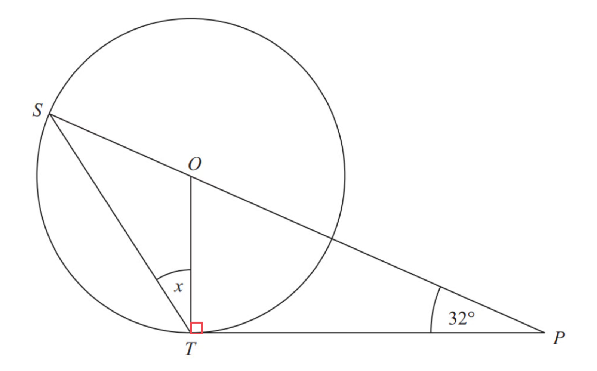

> *Find angle **TOP**.*

*Angle ***TOP*** + Angle ***OTP*** + Angle ***TPO*** = 180**o**   (Angles in a triangle = 180**o**)*

*Angle ***TOP*** + 90 + 32 = 180 *
*Angle ***TOP***  = 58**o*

**Correct method to find TOP or value of 58****o**** seen ****[1]**

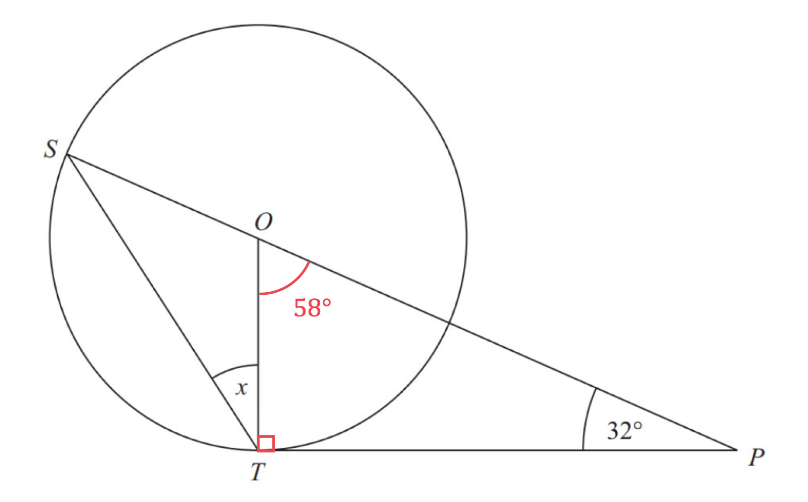

> *Find angle **TOS**.*

*Angle ***TOS*** + Angle ***TOP*** = 180**o**   (Angles along a straight line = 180**o**)*

*Angle ***TOS*** + 58 = 180 *
*Angle ***TOS *** = 122**o*

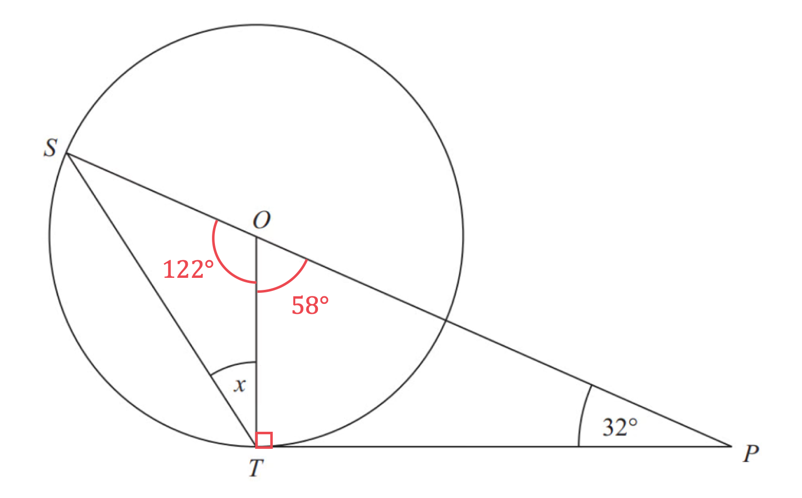

> *Look at triangle **OST**.*

*Angle ***OST*** = Angle ***STO*** = *$x^{\circ}$*  (Triangle ***OST*** is an isosceles triangle)*

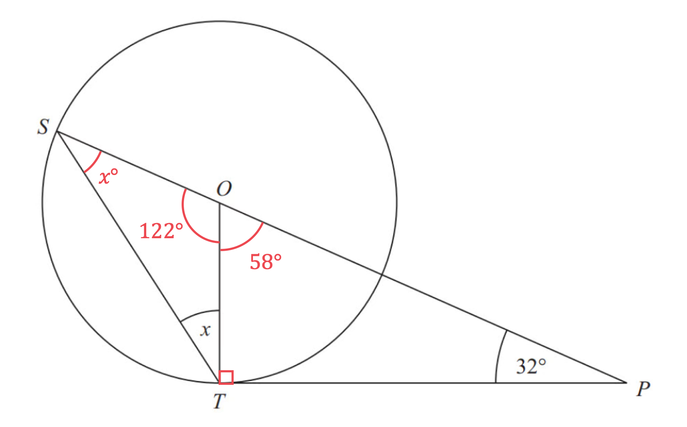

> *Find angle *$x$*.*

*122 + *$x$* + *$x$* = 180   (Angles in a triangle = 180**o**)*

*122 + 2*$x$* = 180*
* 2*$x$* = 58*

** ****Method to find **$x$**[1] **
**At least two correct reasons given including angle between radius and tangent = 90****o**** ****[1]**

$x$** ****= 29****o*** ***[1]**

## Q8 — very_hard — 5 marks · exam-questions

### 20() — 5 marks
> *To prove that **ST  **is equal to** UT ** you will need to **prove **that the triangle **STU **is **isosceles**. This can be done by finding the angles. *

> *PQRST **is a regular pentagon, so the angle **TSU** is the exterior angle of a regular pentagon. *
*Exterior angles in any polygon add up to 360°. *
*A regular pentagon has 5 equal exterior angles.*

> * *`T S with hat on top U space equals 360 over 5 equals space 72 degree`

**[1]**

> *To find the size of angle **SUT**, you will need to consider circle theorems.*

> *Begin by joining the point **O** to the points **T** and **R,** marking all the radiuses of the circle as equal lengths on the diagram.*

> *TP** and **TR **are also tangents to the circle, so by the circle theorem 'A tangent always meets a radius at 90°', angles **ORQ **and **OTP **are both 90°. *

`O R with hat on top Q space equals space O T with hat on top P space equals 90 degree`* **(angle between tangent and radius)*

**[1]**

> *Mark these onto the diagram.*

> *The sum of the interior angles in any polygon can be found using the formula 180°(n - 2). A regular pentagon has 5 equal interior angles, therefore these can be found using the formula *`fraction numerator 180 open parentheses 5 space minus space 2 close parentheses over denominator 5 end fraction`*.*

> * *`T P with hat on top Q space equals P Q with hat on top R space equals space fraction numerator 3 open parentheses 180 close parentheses over denominator 5 end fraction equals space 108 degree`

> *Add these angles to the diagram.*

> *PQROT  **is a pentagon, so the angle **ROT**  can be found by subtracting the other four angles from the sun of the angles in a pentagon.*

> *The sum of the interior angles in any polygon can be found using the formula 180°(n - 2).*

`R O with hat on top T space plus O T with hat on top P space plus space T P with hat on top Q space plus space P Q with hat on top R space plus space Q R with hat on top O space equals space 180 open parentheses 5 space minus space 2 close parentheses degree space equals space 540 degree`

> *Substitute in the angles you know to find angle **ROT**.*

`table row cell R O with hat on top T space plus space 90 degree space plus space 90 degree space plus space 108 degree space plus space 108 degree space end cell equals cell space 540 degree end cell row cell R O with hat on top T space plus space 396 degree space end cell equals cell space 540 degree end cell row cell R O with hat on top T space space end cell equals cell space 144 degree end cell end table`

**[1]**

> *By the circle theorem, the angle at the centre is twice the angle at the circumference, angle **ROT **is twice angle **RUT.*

`R O with hat on top T space equals 2 open parentheses R U with hat on top T close parentheses space equals space 2 open parentheses S U with hat on top T close parentheses`

`S U with hat on top T space equals fraction numerator R O with hat on top T over denominator 2 end fraction equals space 144 over 2 space equals space 72 degree`

**[1]**

> *This proves that angle **TSU **is equal to angle **SUT **and so triangle **STU **is isosceles.*

**Therefore ****ST ****= ****UT **
**All reasons given clearly [1]**

## Q9 — hard — 5 marks · exam-questions

### 20() — 5 marks
> *Find angle **RSP**.*

*Angle ***RSP***  + Angle ***PSO*** = 90**o**    (Angle between a tangent and a radius = 90**o**)*

*Angle ***RSP***  + 48 = 90  *
*Angle ***RSP***  = 42**o*

**[1]**

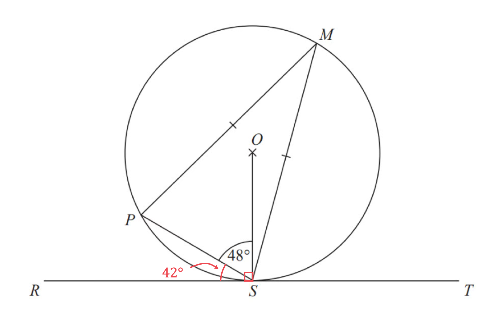

> *Find angle **PMS**.*

*Angle ***PMS  ***= Angle ***RSP***   (Alternate segment theorem)*

*Angle ***PMS  ***= 42**o*

**[1]**

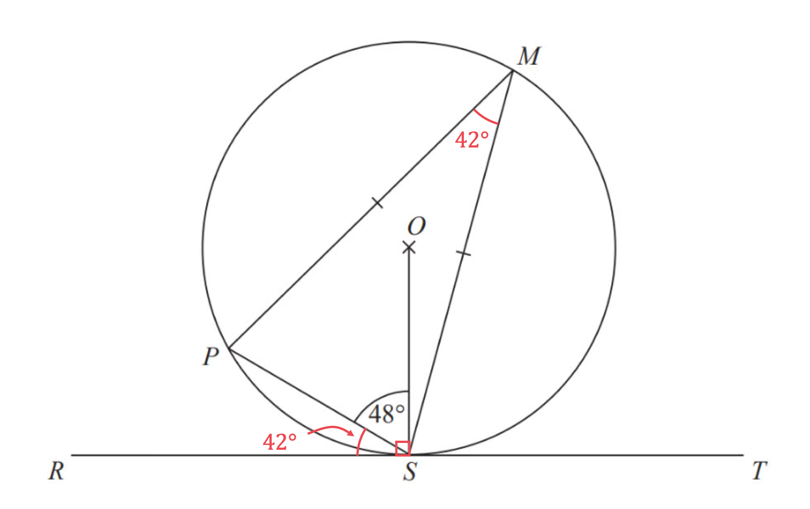

> *Find angle **SPM**.*

*Angle ***SPM*** = Angle*** PSM***   (Isosceles triangle)*

*2 x Angle ***SPM ***+ Angle ***PMS*** = 180**o**   (angles in a triangle = 180**o**)*

*2 x Angle ***SPM ***+ 42 = 180 *
*Angle ***SPM  ***= 69**o*

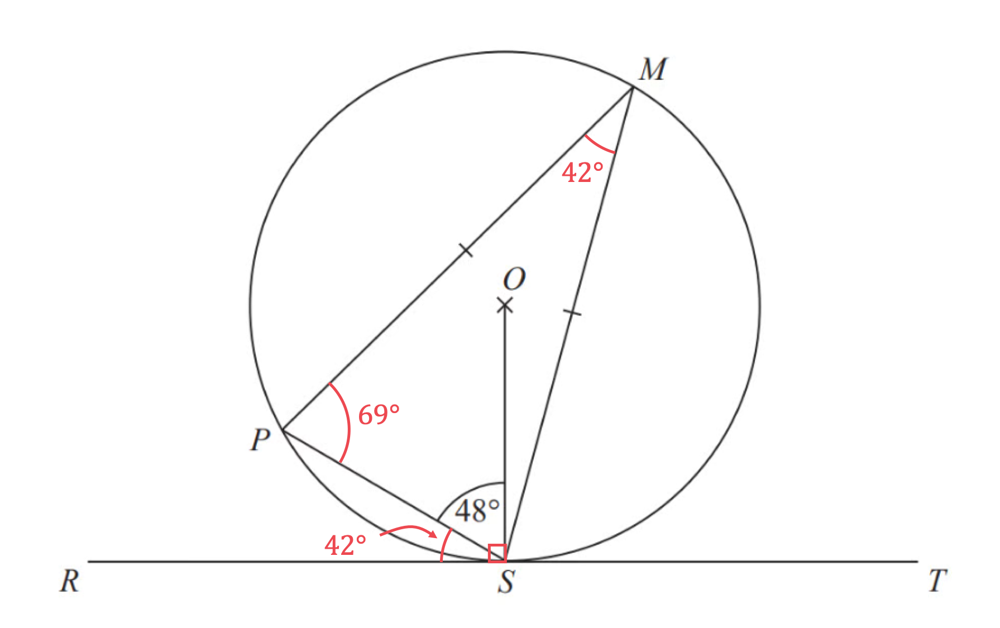

> *Find angle **MST**.*

*Angle ***MST*** = Angle ***SPM   ***(Alternate segment theorem)*

**Angle ****MST**** = 69****o**** ****[1]**

**One correct circle theorem reason given with working ****[1]  **
**Full correct and complete reasoning with circle theorems**** [1]**

## Q10 — medium — 3 marks · exam-questions

### 19() — 3 marks
> *Find angle **OBC**. *

*Angle ***OBC*** = 90**o**   (Angle between a tangent and a radius = 90**o**)*

**[1]**

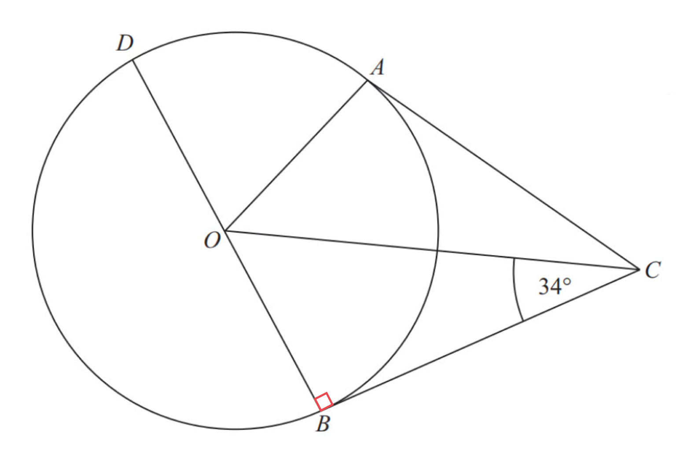

> *Find angle **BOC**.*

*Angle ***BOC*** + Angle ***OBC*** + Angle ***BCO*** = 180**o**   (Angles in a triangle = 180**o**)*

**[1]**

*Angle ***BOC*** + 90 + 34 = 180 *
*Angle ***BOC*** = 56**o*

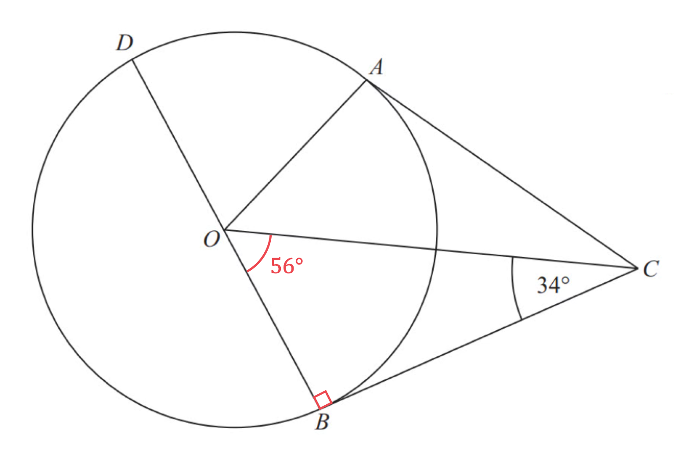

> *Find angle **AOC**.*

*Angle ***AOC*** = Angle ***BOC*** = 56**o**   (Triangles ***AOC*** and ***OBC*** are congruent)*

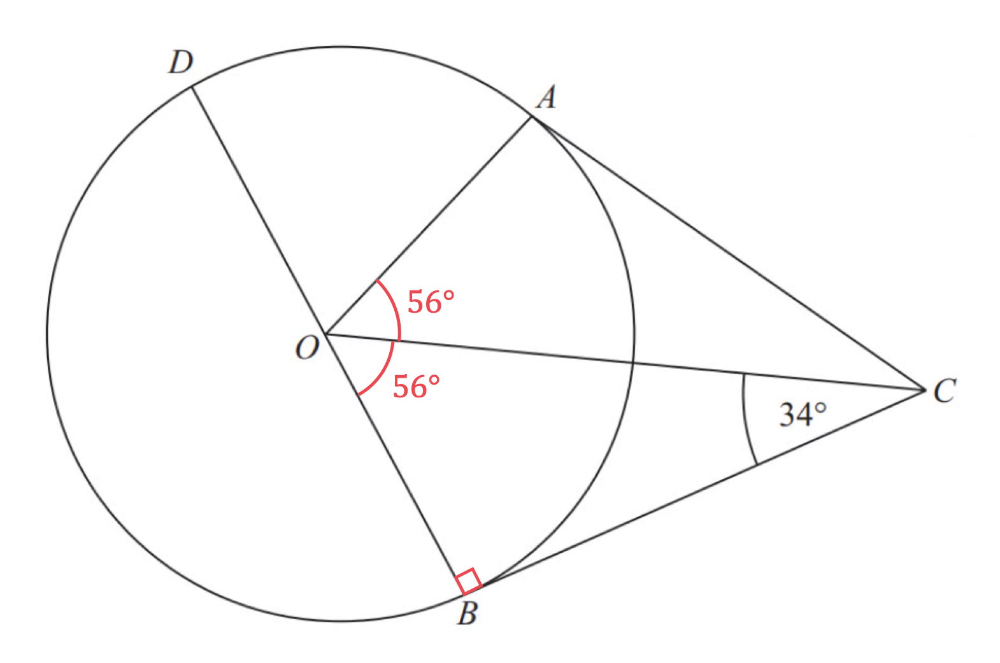

> *Find angle **DOA**.*

*Angle ***DOA*** + Angle ***AOC*** + Angle ***BOC*** = 180**o**   (Angles along a straight line = 180**o**)*

*Angle ***DOA*** + 56 + 56 = 180*

**Angle ****DOA**** = 68****o**** [1]**

**The angle ****DOA**** must be clearly stated and not just shown on the diagram.**

## Q11 — very_hard — 6 marks · exam-questions

### 1() — 6 marks
> *Using the properties of Intersecting Chords (internal intersection), we know that*

$AP\timesPB=CP\timesPD$

> *Use that equation with the numbers and variables given in the question.*

`table row cell 5 space cross times space x space end cell equals cell space 3 space cross times space y end cell row cell 5 x space end cell equals cell space 3 y end cell end table`

**[2] **
**1 mark for using the Intersecting Chords (internal) property **
**1 mark for finding a correct equation connecting x and y**

> *Triangle **DPB** is a right-angled triangle. *
*So you can use the Pythagoras' Theorem equation with the lengths of its sides.*

`table row cell x squared space plus space y squared space end cell equals cell space 7 squared end cell end table`

**[1]**

> *Now you can use the result *$5x=3y$* to turn that into a quadratic equation in only one variable.*

`table row cell 5 x space end cell equals cell space 3 y space space space space so space space space space y space equals space 5 over 3 x end cell end table`

> *That expression for **y** can now be substituted into the Pythagoras equation.*

`x squared space plus space open parentheses 5 over 3 x close parentheses squared space equals space 7 squared

x squared space plus space 25 over 9 x squared space equals space 49

34 over 9 x squared space equals space 49`

**[1] **
**You would also get this mark for using  **$x=\frac{3}{5}y$**  and finding the equation  **$\frac{34}{25}y^{2}=49.$

> *Now solve that equation for **x. *
*Then use  *$y=\frac{5}{3}x$*  to find the value of **y**. *
*Don't forget to round your final answers to 3 s.f.!*

$x^{2}=49\div\frac{34}{9}\,\,x^{2}=\frac{441}{34}\,\,x=\sqrt{\frac{441}{34}}\,\,x=3.60147...\,\,y=\frac{5}{3}\times3.60147...\,\,y=6.00245...$

**Final answer:** **x**** = 3.60,  ****y**** = 6.00 (3 s.f.)****  [2]**

**1 mark for a correct value for either x or  y.  1 mark for both values correct.**

$\sqrt{\frac{441}{34}}=\pm3.60147...$**,  but because ****x**** is a length you can ignore the negative solution.**

## Q12 — hard — 5 marks · exam-questions

### 22() — 5 marks
> *Find angle **ADO**.*

*Angle ***ADO*** = 90**o**   (Angle between a tangent and a radius = 90**o**)*

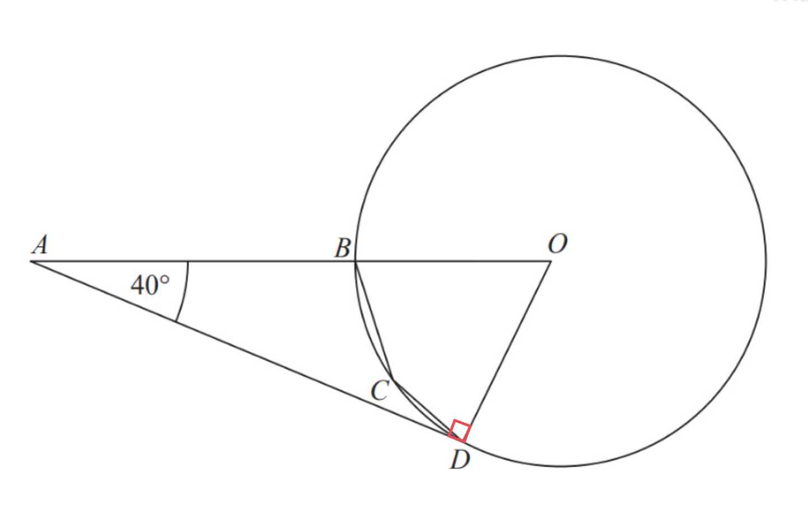

> *Find acute angle **AOD**.*

*Acute Angle ***AOD ***+ Angle ***ADO*** + Angle ***DAO*** = 180**o**   (Angles in a triangle = 180**o**)*

*Angle ***AOD*** + 90 + 40 = 180 *
*Angle ***AOD*** = 50**o*

**Correct working to find angle AOD ****[1]**

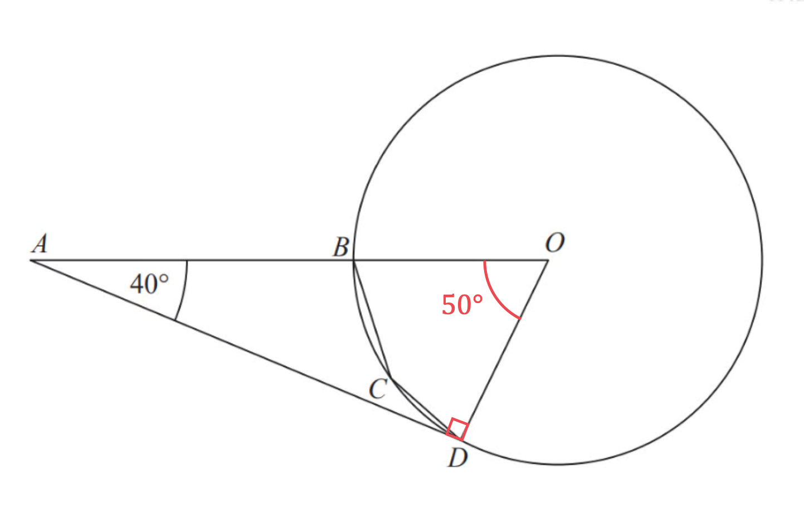

> *Find reflex angle **AOD**.*

*Reflex Angle ***AOD***  + Acute Angle ***AOD*** = 360**o**   (Angles around a point = 360**o*

*Reflex Angle ***AOD***  + 50 = 360 *
*Reflex Angle ***AOD***  = 310**o*

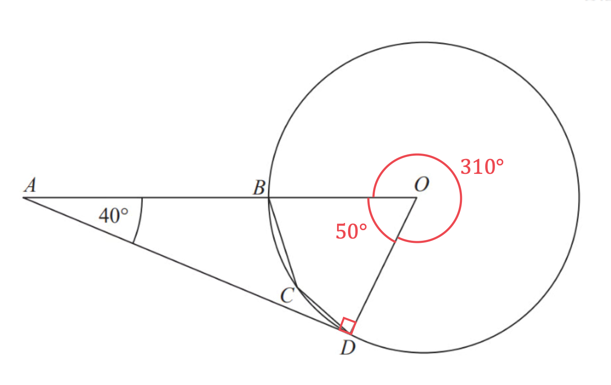

> *Find angle **BCD**.*

*2 x Angle ***BCD*** = Reflex Angle ***AOD   ***(Angle at the centre is twice the angle at the circumference)*

*2 x Angle ***BCD***  = 310*

** ****Correct working to find**** ****angle BCD ****[1]**

**Angle ****BCD**** = 155****o**** [1]**

**At least two reasons, one of which is a circle theorem ****[1]  ****Complete reasons for method ****[1]**

## Q13 — medium — 4 marks · exam-questions

### 22() — 4 marks
> *Find angle **ADC**.*

*Angle ***ADC*** = *$\frac{1}{2}$* x Angle ***AOC***   (Angle at the centre is twice the angle at the circumference)*

**[1]**

*Angle ***ADC*** = *$\frac{y}{2}$*  *

**[1]**

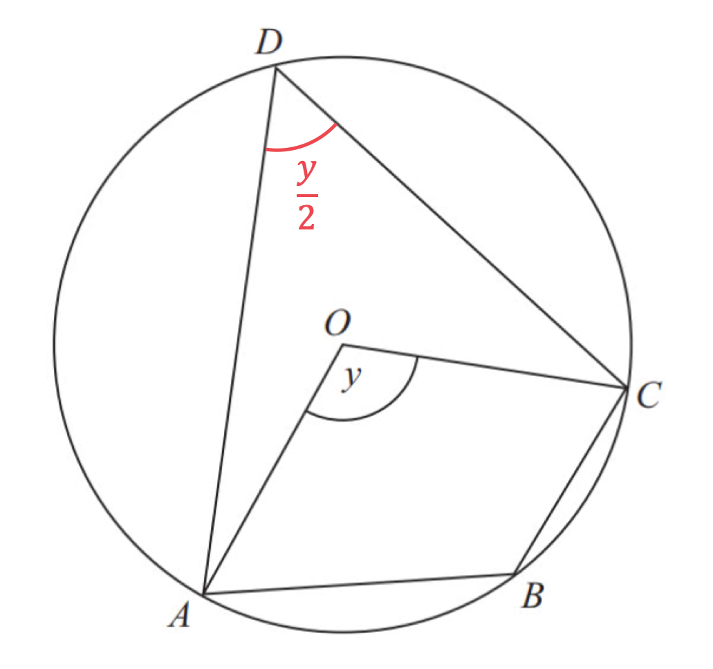

> *Find angle **ABC**.*

*Angle ***ADC*** + Angle ***ABC*** = 180**o**   (Opposite angles in a cyclic quadrilateral = 180**o**)*

**[1]**

*Angle ***ABC*** + *$\frac{y}{2}$* = 180*

**Angle ****ABC  ****=**** **$180-\frac{y}{2}$* ***[1]**

## Q14 — very_hard — 6 marks · exam-questions

### 1() — 6 marks
> *Remember that a diameter is a chord.*
* Extend **COP** across the circle and label the point of intersection **G. *
*Extend **EDO** across the circle and label the point of intersection **F**. *

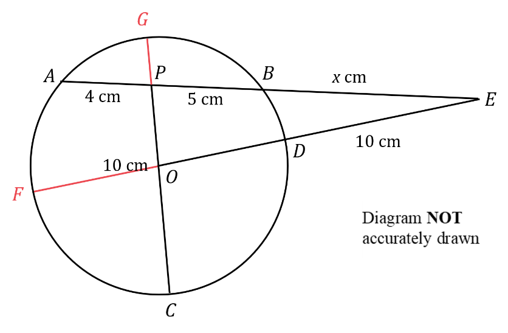

> *The diameters **CG** and **DF** are now chords that we can apply the Intersecting Chords properties to.*

> *First use the properties of Intersecting Chords (internal intersection) on chords **AB** and **CG** to find the length of **PG**. From the properties of Intersecting Chords (internal intersection), we know that*

$CP\timesPG=AP\timesPB$

> *Use that equation with the numbers given in the question.*

`table row cell 10 space cross times space P G space end cell equals cell space 4 space cross times space 5 end cell end table`

**[1]**

> *Now solve that equation to find the length of **PG**.*

`table row cell 10 space cross times space P G space end cell equals cell space 20 end cell row cell P G space end cell equals cell space 20 space divided by space 10 end cell row cell P G space end cell equals cell space 2 end cell end table`

**[1]**

> *CG** is a diameter. *
*That means that the diameter of the circle is equal to 10 + 2 = 12 cm. *
*And that means that **FD **= 12cm, because **FD **is also a diameter.*

> *Now we can use the properties of Intersecting Chords (external intersection) on **ABE** and **FDE** to find the value of **x**. *
*From the properties of Intersecting Chords (external intersection), we know that*

$BE\timesAE=DE\timesFE$

> *Or equivalently*

`B E space cross times space open parentheses A B plus B E close parentheses space equals space D E space cross times space open parentheses F D plus D E close parentheses`

> *Use that equation with the numbers and variable given in the question.*

`table row cell x space cross times space open parentheses x plus 9 close parentheses space end cell equals cell space 10 space cross times space open parentheses 12 plus 10 close parentheses end cell end table`

**[1]**

> *Now expand the brackets and rearrange into a quadratic equation that you can solve.*

`table attributes columnalign right center left columnspacing 0px end attributes row cell x squared space plus space 9 x space end cell equals cell space 220 end cell row cell x squared space plus space 9 x space minus space 220 space end cell equals cell space 0 end cell end table`

**[1]**

> *Now factorise the quadratic.*

`open parentheses x minus 11 close parentheses open parentheses x plus 20 close parentheses space equals space 0`

**[1] **
**You would also get this mark if you used the quadratic formula or completing the square to solve the equation.**

> *And finally solve the equation for **x. *
*There is a positive and a negative solution. *
*But because **x** is a length, the negative solution can be disregarded.*

$x=11\mathrm{or}x=-20$

**Final answer:** **x**** = 11****  [1]**

**This mark is only awarded if you do NOT include x = **$-$**20 as part of your final answer.**

## Q15 — hard — 5 marks · exam-questions

### 11() — 5 marks
> *Draw a radius from **O** to point **B**.*

*Let angle ***OBA *** = *$x^{\circ}$

**[1]**

*Angle ***OBC *** = 90**o**   (Angle between a radius and a tangent = 90**o**) *

**[1]**

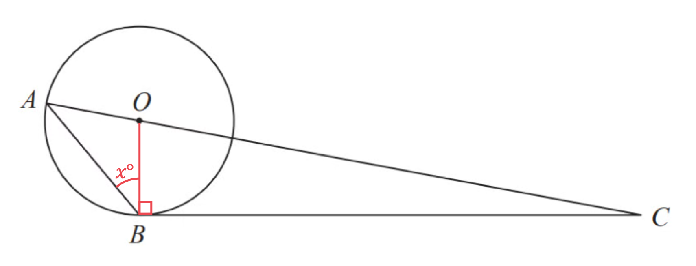

> *Find angle **OAB**.*

*Angle ***OAB***  = Angle ***OBA   ***(Triangle ***OAB***  is isosceles)*

*Angle ***OAB *** = *$x^{\circ}$

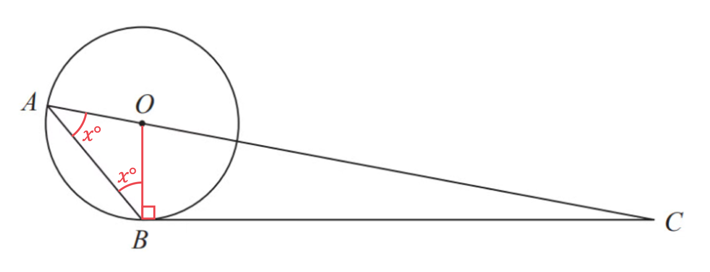

> *Find angle **AOB**.*

*Angle ***AOB***  + Angle ***OAB***  + Angle ***OBA***  = 180**o**   (Angles in a triangle = 180**o**)*

*Angle ***AOB***  + *$x$* + *$x$* = 180 *
*Angle ***AOB *** = (180 - 2*$x$*)**o*

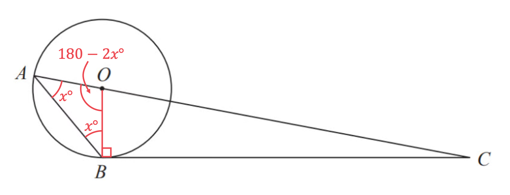

> *Find angle **BOC**.*

*Angle ***BOC***  + Angle ***AOB***  = 180**o**   (Angles along a straight line = 180**o**)*

*Angle ***BOC***  + 180 - 2*$x$* = 180*
* Angle ***BOC***  = 2*$x$*o** *

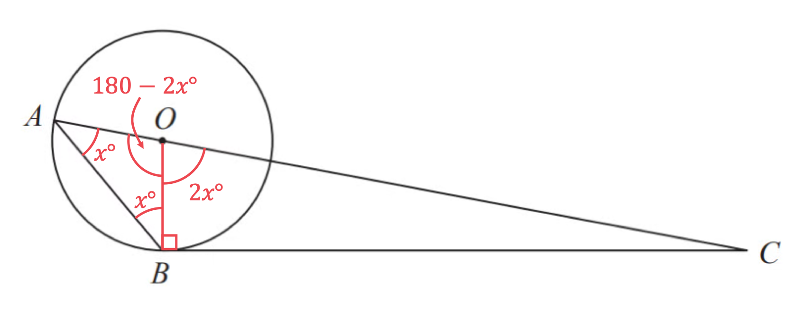

> *Find angle **OCB**.*

*Angle ***OCB***  + Angle ***OBC  ***+ Angle ***BOC***  = 180**o**   (Angles in a triangle = 180**o**)*

*Angle ***OCB***  + 90 + 2*$x$* = 180*

**[1]**

*Angle ***OCB  ***= 90 - 2*$x$

> *Find angle **ACB**.*

*Angle ***ACB***  = Angle ***OCB**

**Angle ****ACB****  = (90 - 2**$x$**)****o**** ****[1]**

**Full reasons given for method throughout ****[1]**

## Q16 — medium — 4 marks · exam-questions

### 18() — 4 marks
> *Find angle **ABD**.*

*Angle ***ABD*** = Angle ***ACD***   (Angles in the same segment are equal)*

*Angle ***ABD*** = 62**o*

**[1]**

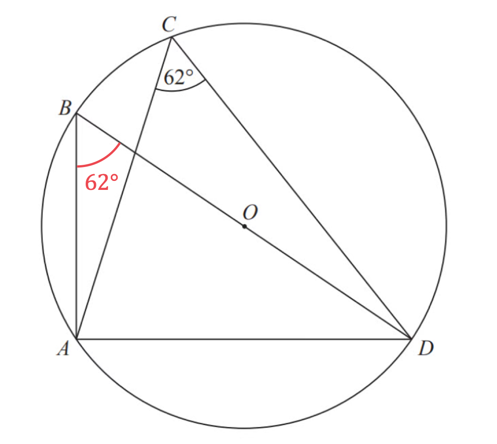

> *Find the angle **BAD**.*

*Angle ***BAD*** = 90**o**   (Triangle in a semi-circle has a right-angle)*

**[1]**

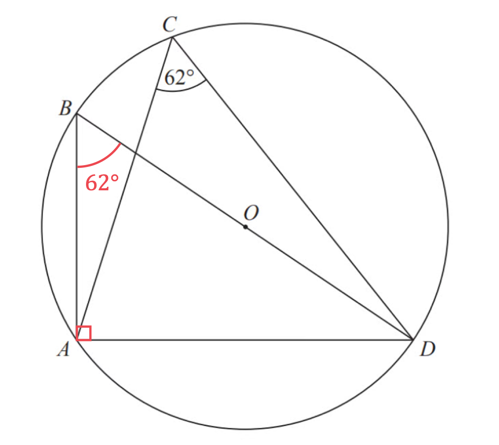

> *Find angle **ADB**.*

*Angle ***ADB*** + Angle ***DAB*** + Angle ***ABD*** = 180**o**   (Angles in a triangle = 180**o**)*

*Angle ***ADB*** + 90 + 62 = 180*

**Full correct reasons given**** [1]**

**Angle ****ADB**** = 28****o**** ****[1]**

## Q17 — very_hard — 5 marks · exam-questions

### 30() — 5 marks
> *It may help to label *$AB$* as *$x$* in the diagram and use *$AB=x$* throughout the proof.*

> *From the properties of Intersecting Chords (external intersection), we know that*

$AC\timesBC=CE\timesCD$

> *Or equivalently,*

`B C space cross times space open parentheses A B plus B C close parentheses space equals space C D space cross times space open parentheses C D plus D E close parentheses`

> *Use that equation with the expressions given in the question.*

`table row cell space open parentheses 2 space plus square root of 5 space close parentheses space cross times space A C space end cell equals cell open parentheses 2 square root of 5 close parentheses cross times space open parentheses 2 square root of 5 space plus space 4 space plus space square root of 5 close parentheses space space end cell end table`

**[1]**

> *Rearrange to make *$AC$* the subject.*

`table row cell space A C space end cell equals cell fraction numerator space open parentheses 2 square root of 5 close parentheses cross times space open parentheses 2 square root of 5 space plus space 4 space plus space square root of 5 close parentheses over denominator 2 space plus space square root of 5 end fraction space space end cell end table`

**[1]**

> *Simplify the numerator.*

`table row cell space A C space end cell equals cell fraction numerator space 2 square root of 5 open parentheses 4 space plus space 3 square root of 5 close parentheses over denominator 2 space plus space square root of 5 end fraction space space end cell end table`

> *Expand the brackets on the numerator.*

`table row cell space A C space end cell equals cell fraction numerator space 8 square root of 5 space plus space 2 square root of 5 cross times 3 square root of 5 over denominator 2 space plus space square root of 5 end fraction space equals space space fraction numerator space 8 square root of 5 space plus space 6 space cross times space 5 over denominator 2 space plus space square root of 5 end fraction space equals space fraction numerator space 8 square root of 5 space plus space 30 over denominator 2 space plus space square root of 5 end fraction end cell end table`

> *Rationalise the denominator.*

`table row cell space A C space end cell equals cell fraction numerator space 8 square root of 5 space plus space 30 over denominator 2 space plus square root of 5 end fraction cross times fraction numerator 2 space minus square root of 5 over denominator 2 space minus square root of 5 end fraction space equals space fraction numerator open parentheses 30 plus 8 square root of 5 close parentheses open parentheses 2 minus square root of 5 close parentheses over denominator open parentheses 2 plus square root of 5 close parentheses open parentheses 2 minus square root of 5 close parentheses end fraction end cell end table`

**[1]**

> *Expand the numerator and the denominator.*

`table row cell space A C space end cell equals cell space fraction numerator 60 space minus space 30 square root of 5 space plus space 16 square root of 5 space minus space 8 cross times 5 over denominator 4 space minus 2 square root of 5 space plus 2 square root of 5 space minus 5 end fraction space equals space fraction numerator 20 space minus 14 square root of 5 over denominator negative 1 end fraction space equals space 14 square root of 5 space minus space 20 end cell end table`

**[1]**

> *Letting *$AB=x$* gives*

`table row cell space x space plus open parentheses space 2 space plus square root of 5 close parentheses space end cell equals cell space 14 square root of 5 space minus space 20 end cell end table`

> *Rearrange to find *$x$* *

`table row blank blank space end table table row blank blank x end table table row blank blank space end table table row blank blank space end table table row blank equals blank end table table row blank blank space end table table row blank blank cell open parentheses 14 square root of 5 space minus space 20 close parentheses end cell end table table row blank blank space end table table row blank blank minus end table table row blank blank space end table table row blank blank cell open parentheses space 2 space plus square root of 5 close parentheses end cell end table table row blank blank space end table table row blank equals blank end table table row blank blank space end table table row blank blank 13 end table table row blank blank cell square root of 5 end cell end table table row blank blank space end table table row blank blank minus end table table row blank blank space end table table row blank blank 22 end table`

**Final answer:** $AB=13\sqrt{5}-22$**  [1]**

## Q18 — hard — 3 marks · exam-questions

### 15() — 3 marks
> *Similar triangles have three equal angles. Use circle theorems to identify any corresponding angles that are equal between triangles **ABE**  and **DCE**.*

> *The same segment circle theorem states that angles at the circumference subtended by the same arc are equal.*

> *Vertically opposite angles at a point are equal.*

> *The statement that if three corresponding angles between two triangles are equal then the two triangles are similar must be made.*

**Angle ****ABE****  = angle ****DCA****  as they are angles in the same segment. **
**Angle ****BAE****  = angle ****CDE****  as they are angles in the same segment. Angle ****AEB****  = angle ****DEC****  as they are vertically opposite angles. **** **
**A****t least one of the three statements given, with reason ****[1]  **
**A****t least two of the three statements given, with reasons ****[1]**** **
**All three angles are the same so the triangles are similar. **
** ****All three statements and explanation of similar triangles ****[1]**

## Q19 — medium — 5 marks · exam-questions

### 18() — 5 marks
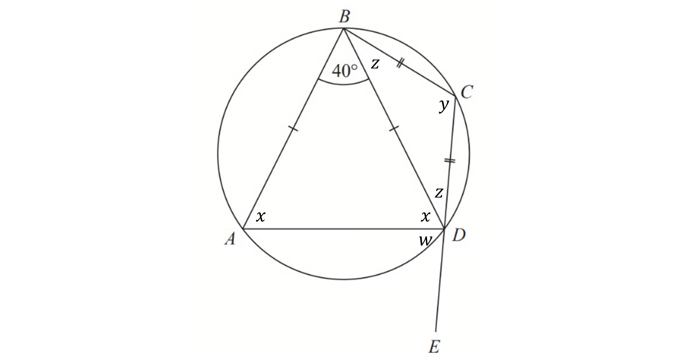

> *Triangle *$ABD$* is isosceles*

> *Find the missing angles*

$x=\frac{180-40}{2}=70$

**[1]**

*Angle *$DAB$* = Angle *$BDA$* = 70° because the interior angles in a triangle sum to 180° and base angles in an isosceles triangle are equal*

> *Quadrilateral *$ABCD$* is a cyclic quadrilateral*

$y=180-70=110$

**[1]**

*Angle *$BCD$* = 110° because opposite angles in a cyclic quadrilateral are equal*

**Correct reason [1]**

> *Triangle *$BCD$* is isosceles*

> *Find the missing angles*

$z=\frac{180-110}{2}=35$

*Angle *$DBC$* = Angle *$CDB$* = 35° because the interior angles in a triangle sum to 180° and base angles in an isosceles triangle are equal*

> $CDE$* is a straight line*

$w=180-35-70=75$

*Angle *$ADE$* =75° because angles on a straight line sum to 180°*

**Angle **$ADE$** =75°*** ***[1]**

**All correct reasons given [1]**

## Q20 — very_hard — 5 marks · exam-questions

### 23() — 5 marks
> *Draw in the chord from the point **C** to point **A**.*

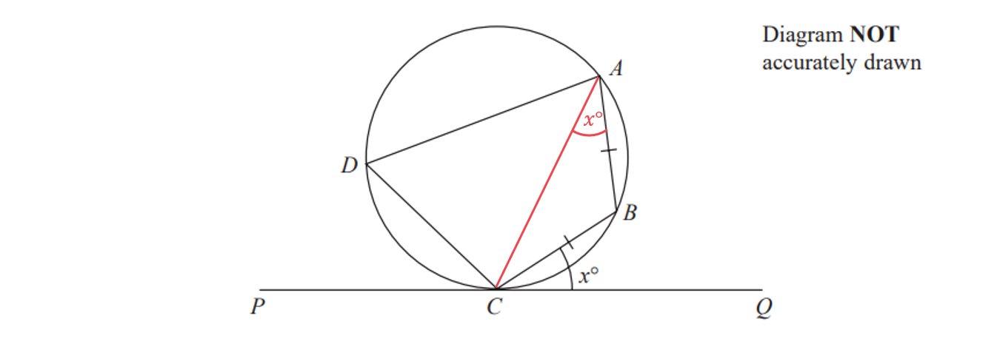

> *By the Alternate Segment Theorem, the angle **BAC **is equal to the angle **BCQ.*

*Angle ***BAC *** = *$x^{\circ}$* (Alternate Segment Theorem)*

**[1]**

> *Triangle **ABC **is isosceles, so the angle **BCA **is equal to the angle **BAC.*

*Angle ***BAC *** =  *$x^{\circ}$*(Base Angles in isosceles triangles are equal)*

> *Find angle **ABC **in terms of *$x.$

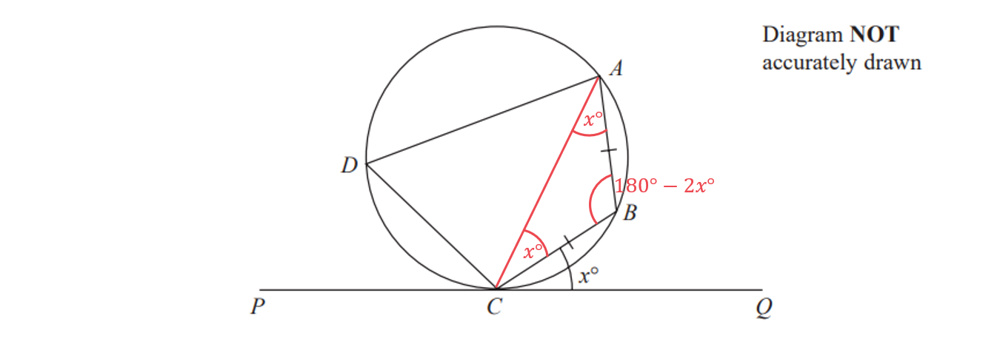

*Angle ***ABC***  + Angle ***ACB***  + Angle ***BAC***  = 180**o**   (Angles in a triangle = 180**o**)*

*Angle ***ABC***  + *$x$* + *$x$* = 180° *
*Angle ***ABC *** = (180 - 2*$x$*)**o*

**[1]**

> *Find angle **CDA**.*

*Angle ***CDA***  + Angle ***ABC ***  = 180**o**   (Opposite angles in a cyclic quadrilateral = 180**o**)*

*Angle ***CDA***  + (180 - 2*$x$*) = 180*

*Angle ***CDA  ***= 180 - (180 - 2*$x$*) = -(-2*$x$*) *

**[1]**

**Angle ****CDA****  = 2**$x$**o**** **
**At least one correct reason given ****[1] **
**Full reasons given for method throughout ****[1]**

## Q21 — hard — 3 marks · exam-questions

### 1() — 3 marks
> *This is a special case of the properties of Intersecting Chords (external intersection). *
*The 'inside the circle' part of **CP** has a length of zero, therefore*

`B P space cross times space open parentheses B P plus A B close parentheses space equals space C P space cross times space open parentheses C P plus 0 close parentheses`

> *Use that equation with the numbers given in the question.*

`8 space cross times space open parentheses 8 plus 10 close parentheses space equals space C P space cross times space open parentheses C P plus 0 close parentheses`

**[1]**

> *Now just expand the brackets, rearrange the equation, and solve for **CP**.*

`table row cell 144 space end cell equals cell space C P space cross times space C P end cell row cell 144 space end cell equals cell space open parentheses C P close parentheses squared end cell row cell square root of 144 space end cell equals cell space C P end cell row cell 12 space end cell equals cell space C P end cell end table`

**Final answer:** **12 cm****  [2]**

**1 mark for a correct start made on solving the equation 1 mark for a fully correct solution**

$\sqrt{144}=\pm12$**, but because CP is a length we can ignore the negative answer!**

## Q22 — medium — 2 marks · exam-questions

### 1() — 2 marks
> *Using the properties of Intersecting Chords (internal intersection), we know that*

$AP\timesPB=CP\timesPD$

> *Use that equation with the numbers given in the question.*

$14\times6=10\timesPD$

**[1]**

> *Now just rearrange the equation and solve for **PD**.*

`table attributes columnalign right center left columnspacing 0px end attributes row cell 84 space end cell equals cell space 10 space cross times space P D end cell row cell 84 space divided by space 10 space end cell equals cell space P D end cell row cell 8.4 space end cell equals cell space P D end cell end table`

**Final answer:** **8.4 cm****  [1]**

## Q23 — very_hard — 4 marks · exam-questions

### 23() — 4 marks
> *ABC **is a straight line so angle **ABF **and angle *$x$* add up to 180°. **BCDF** is a cyclic quadrilateral so angle **CDF **and angle *$x$* add up to 180°.*

> *Add both of these to the diagram.*

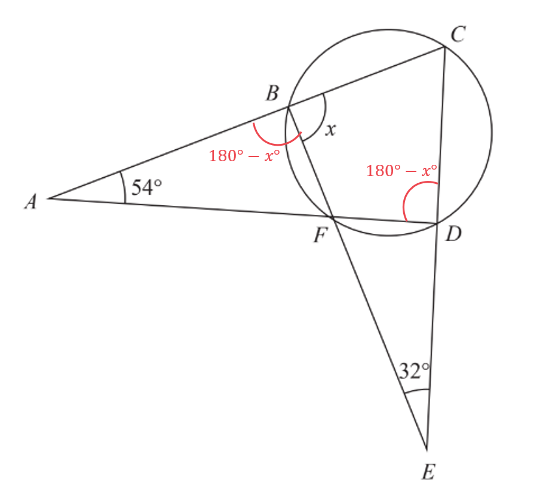

*Angle ***ABF *** = angle ***CDF ***=  *$180-x^{\circ}$

**Expression for either angle found**** [1]**

> *Angle **AFB **is equal to 180 - (angle **ABF** + angle **BAF).*

*Angle ***AFB *** =  *`180 space minus space open parentheses 180 space minus space x space plus space 54 close parentheses space equals space x space minus space 54 degree`

> *Angle **FDE **is equal to 180 - (angle **CDF).*

*Angle ***FDE *** =  *`180 space minus space open parentheses 180 space minus space x close parentheses space equals space x degree`

> *Find angle **DFE **in terms of *$x$*.*

*Angle ***DFE***  + Angle ***EDF***  + Angle ***DEF ***= 180**o**   (Angles in a triangle = 180**o**)*

*Angle ***DFE***  + *$x$* + 32 = 180 *
*Angle ***DFE *** = (180 - 32 -*$x$*)**o **= *$148-x^{\circ}$

**[1]**

> *Opposite angles are equal.*

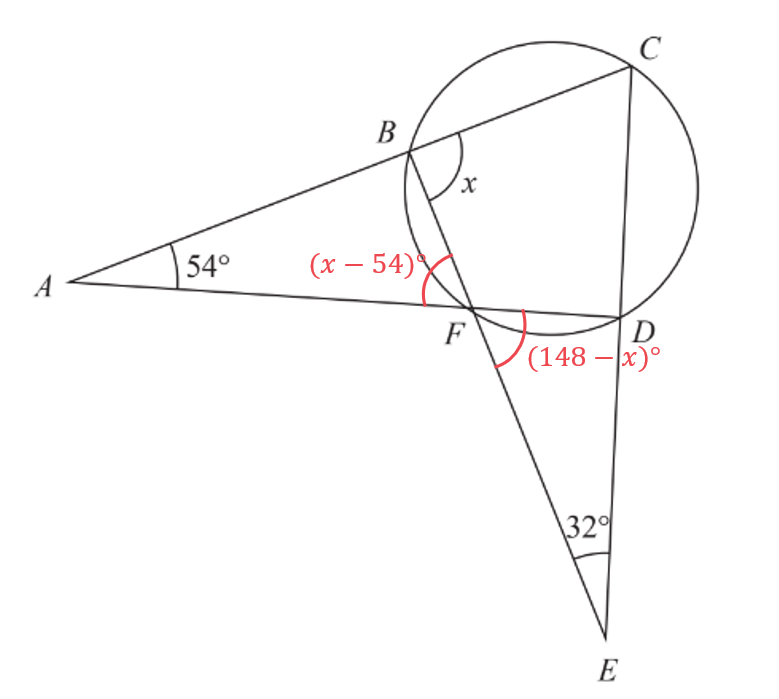

> *Form an equation.*

$x-54=148-x$

**[1]**

> *Add *$x$* to both sides.*

$2x-54=148$

> *Solve.*

`table row cell 2 x space end cell equals cell space 202 end cell row cell x space end cell equals cell space 202 over 2 end cell end table`

**Angle **$x=101^{\circ}$**[1]**

## Q24 — hard — 5 marks · exam-questions

### 1() — 5 marks
> *OC** is a radius.  Remember that a radius is half of a diameter, and that a diameter is a chord.  *
*Extend **OC** across the circle and label the point of intersection **D.*

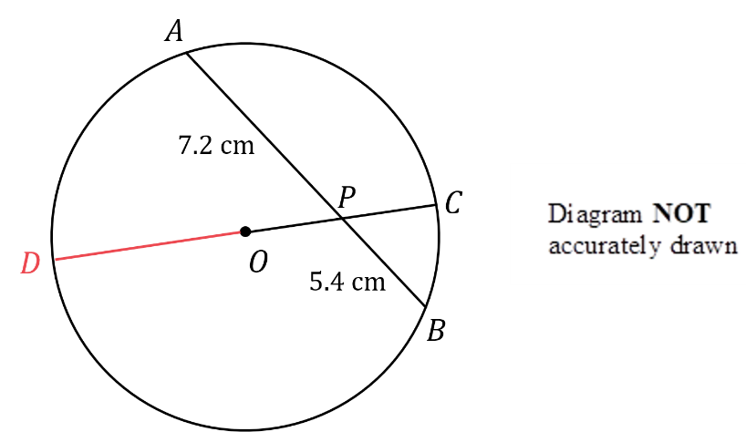

**[1] **
**This mark can also be gained if treating CO as a radius is clearly implied in later working.**

> *OC **is bisected at point **P**, so **OP **=** PC** and **OC** = 2(**PC**). *
*DO** and **OC** are both radii, so **DO** = **OC** = 2(**PC**).*
* And **DP **=** DO **+** OP** = 2(**PC**) + **PC** = 3(**PC**)**.*
* From the properties of Intersecting Chords (internal intersection) we know that*

$DP\timesPC=AP\timesPB$

> *Use that equation along with the facts above and the numbers given in the question.*

`open parentheses 3 cross times P C close parentheses space cross times space P C space equals space 7.2 space cross times space 5.4`

**[1]**

> *Now just expand the brackets and solve for **PC**.*

`table row cell 3 space cross times space open parentheses P C close parentheses squared space end cell equals cell space 38.88 end cell row cell open parentheses P C close parentheses squared space end cell equals cell space 38.88 space divided by space 3 end cell row cell open parentheses P C close parentheses squared space end cell equals cell space 12.96 end cell row cell P C space end cell equals cell space square root of 12.96 end root end cell row cell P C space end cell equals cell space 3.6 end cell end table`

**[1]**

> *PC **= 3.6 cm, so the radius of the circle is 2 × **PC **= 2 × 3.6 = 7.2 cm. *
*Use that along with the circle area formula  **A** = **πr**2** to find the area of the circle.*

`equation`

**[1]**

> *Finally round that to 3 s.f., as asked for in the question. Don't forget the units!*

**Final answer:** **163 cm****2**** (3 s.f.)****  [1]**

$\sqrt{12.96}=\pm3.6$**, but because PC is a length we can ignore the negative answer!**

## Q25 — medium — 3 marks · exam-questions

### 1() — 3 marks
> *Using the properties of Intersecting Chords (external intersection), we know that*

$DC\timesEC=BC\timesAC$

> *Or equivalently*

`D C space cross times space open parentheses E D plus D C close parentheses space equals space B C space cross times space open parentheses A B plus B C close parentheses`

> *Use that equation with the numbers given in the question.*

`15 space cross times space open parentheses 15 plus 24 close parentheses space equals space 18 space cross times space open parentheses A B plus 18 close parentheses`

**[1]**

> *Now just expand the brackets, rearrange the equation, and solve for **PD**.*

`table row cell 585 space end cell equals cell space open parentheses 18 space cross times space A B close parentheses space plus space 324 end cell row cell 585 space minus space 324 space end cell equals cell space 18 space cross times space A B end cell row cell 261 space end cell equals cell space 18 space cross times space A B end cell row cell 261 space divided by space 18 space end cell equals cell space A B end cell row cell 14.5 space end cell equals cell space A B end cell end table`

**Final answer:** **14.5 cm****  [2]**

**1 mark for a correct start made on solving the equation. **
**1 mark for a fully correct solution.**

## Q26 — very_hard — 6 marks · exam-questions

### 22() — 6 marks
> *This question uses both the internal and the external intersection properties of intersecting chords.*

> *Extend the radius **OD **to the circumference to form a diameter, let the diameter be **XD. **Remember that a diameter is a chord.*

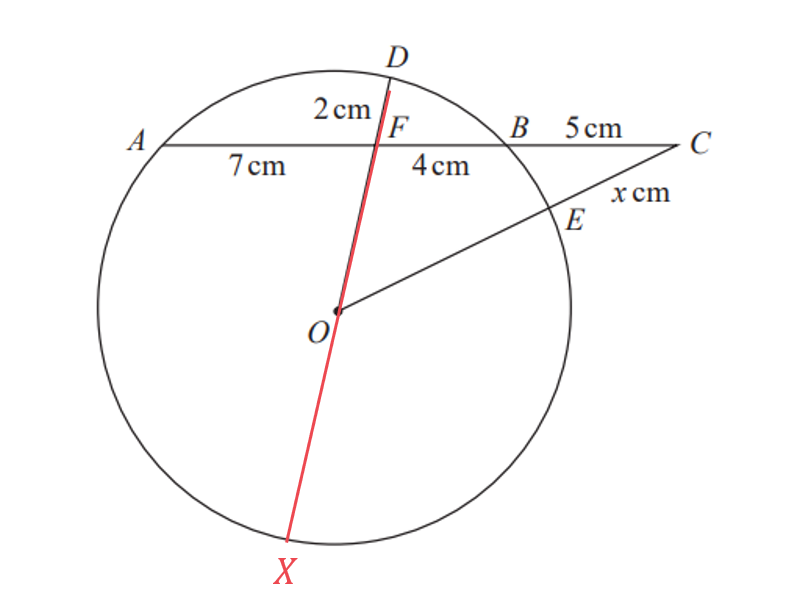

> *Considering first the intersecting internal chords **AB **and **XD,*

$AF\timesFB=XF\timesFD$

> *Form an equation with the numbers given in the question.*

$7\times4=XF\times2$

**[1]**

> *Rearrange the equation and solve for **XF**.*

`table row cell 28 space end cell equals cell space 2 X F end cell row cell X F space end cell equals cell space 14 end cell end table`

> *The diameter of the circle is **XF **+ **FD.*

*Diameter = 14 + 2 = 16 cm*

**[1]**

> *Extend the radius **OE **to the circumference to form another diameter, let the diameter be Y**E. *
*Remember that a diameter is a chord = 16 cm.*

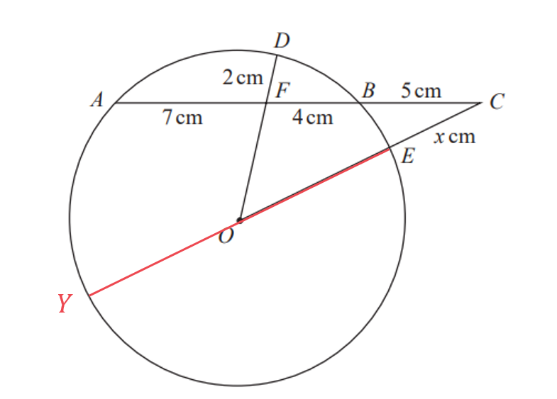

> *Considering the intersecting external chords **AC **and **YC,*

`open parentheses A B space plus space B C close parentheses space cross times space B C space equals space open parentheses Y E space plus space E C close parentheses space cross times space E C`

> *Form an equation with the numbers given in the question, remember that **YE **is a diameter so **YE **= 16 cm..*

`open parentheses 7 space plus space 4 space plus space 5 close parentheses cross times space 5 space equals open parentheses space 16 space plus space x close parentheses space cross times space x`

**[1]**

> *Simplify the equation.*

`table row cell 16 space cross times space 5 space end cell equals cell x open parentheses 16 space plus space x close parentheses end cell row cell 80 space end cell equals cell space 16 x space plus space x squared end cell end table`

> *Rearrange to form a quadratic equal to 0.*

`table row cell x squared space plus space 16 x space minus space 80 space end cell equals cell space 0 end cell end table`

**[1]**

> *Factorise, or use the quadratic equation.*

`table row cell open parentheses x space plus thin space 20 close parentheses open parentheses x space minus space 4 close parentheses space end cell equals cell space 0 end cell end table`

**[1]**

> *Solve.*

`table row cell x space end cell equals cell space minus 20 space space space space space or space space space space space space x space equals space 4 end cell end table`

> *x** is a length so it must be positive, disregard the negative value.*

**Final answer:** $x=4$**  [1]**

## Q27 — hard — 7 marks · exam-questions

### 1() — 3 marks
> *Using the properties of Intersecting Chords (external intersection), we know that*

$BY\timesAY=CY\timesDY$

> *Or equivalently*

`B Y space cross times space open parentheses A B plus B Y close parentheses space equals space C Y space cross times space open parentheses D C plus C Y close parentheses`

> *Use that equation with the numbers and variable given in the question.*

`x space cross times space open parentheses x plus 13 close parentheses space equals space 9 space cross times space open parentheses x plus 9 close parentheses`

**[1]**

> *Now just expand the brackets and rearrange the equation into the form asked for.*

`table row cell x squared space plus space 13 x space end cell equals cell space 9 x space plus space 81 end cell row cell x squared space plus 13 x space minus space 9 x space minus 81 space end cell equals cell space 0 end cell end table`

**Final answer:** $x^{2}+4x-81=0$**  [2]**

**1 mark for a correct start made on rearranging the equation **
**1 mark for showing a fully correct process**

### 2() — 4 marks
> *The equation from part (a) is a quadratic equation. *
*'Give your answer correct to 3 s.f.' is a strong hint that you need to use the quadratic formula to solve it. *
*Use the quadratic formula with *$a=1$*, *$b=4$*, *$c=-81$*.*

`table row cell x space end cell equals cell space fraction numerator negative open parentheses 4 close parentheses space plus-or-minus space square root of open parentheses 4 close parentheses squared space minus space 4 open parentheses 1 close parentheses open parentheses negative 81 close parentheses end root over denominator 2 open parentheses 1 close parentheses end fraction end cell row blank blank blank row cell x space end cell equals cell space minus 2 space plus-or-minus space square root of 85 end cell row blank blank blank row cell x space end cell equals cell space 7.21954... space space or space italic space minus 11.21954... end cell end table`

**[2] **
**1 mark for using the quadratic formula.  1 mark for a correct solution for x.**

> *Because **x** is the length of **BY** and **DC **we can ignore the negative solution for **x**. *
*Now add the lengths of **DC** and **CY** together to find the length of **DY**.*

`table row cell 7.21954... space plus space 9 space end cell equals cell space 16.21954... end cell end table`

**[1]**

> *And finally round to 3 s.f., as asked for in the question. Don't forget the units!*

**Final answer:** **16.2 cm (3 s.f.)****  [1]**

**Note that you could use the equation given in part (a) to answer part (b) of this question, even if you couldn't answer part (a)!**

## Q28 — medium — 4 marks · exam-questions

### 16() — 4 marks
> *Add the angle you need to the diagram and label it **x.*

> *Add the radius **OD **to the diagram, by the circle theorem the angle at the centre is twice the angle at the circumference, angle **DOE **is equal to twice the angle **DGE.*

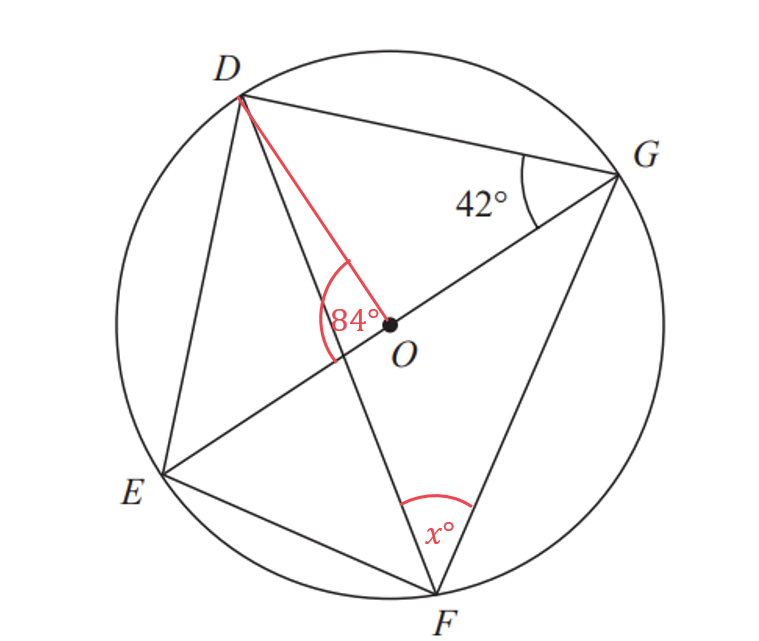

*Angle ***DOE ***= 2(42)° = 84°  (Angle at the centre is twice the angle at the circumference)*

> *Angles on a straight line add up to 180°.*

*Angle ***DOE***  + Angle ***DOG ***= 180**o**   (Angles on a straight line = 180**o**)*

*Angle ***DOG***  = 180 - 84 = 96°*

**[1]**

> *By the circle theorem the angle at the centre is twice the angle at the circumference, angle **DOG **is equal to twice the angle **DFG.*

*Angle ***DOG ***= 96 = 2*$x$*° *

$x=\frac{96}{2}$

* (Angle at the centre is twice the angle at the circumference)*

**Angle ****DFG****  = 48****o ****[1] **
**At least one correct reason given ****[1] **
**Full reasons given for method throughout ****[1]**

## Q29 — very_hard — 5 marks · exam-questions

### 22() — 5 marks
> *The line segments **DE **and **AB **are parallel so angles **DEB **and **ABE **are equal.*

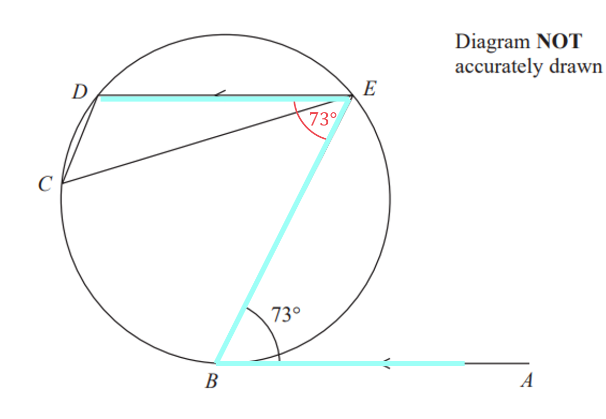

*Angle ***DEB *** = 73° (Alternate Angles on Parallel Lines)*

**[1]**

> *Draw in the chord from the point **B** to point **C**.*

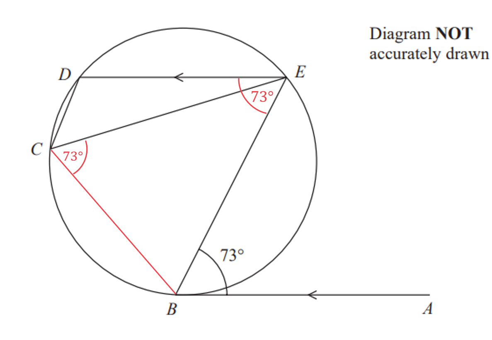

> *By the Alternate Segment Theorem, the angle **BCE **is equal to the angle **ABE.*

*Angle ***BCE *** = 73° (Alternate Segment Theorem)*

**[1]**

> *BCDE **is a cyclic quadrilateral, so the angle **BCD **and the angle **BED** add up to 180°.*

*Angle ***BCD***  + Angle ***BED ***  = 180**o**   (Opposite angles in a cyclic quadrilateral = 180**o**)*

*(Angle ***DCE***  + 73) + 73 = 180*

*Angle ***DCE   ***= 180 - (73 + 73) *

**[1]**

**Angle ****DCE****  = 34****o**** **
**At least one correct reason given ****[1] **
**Full reasons given for method throughout ****[1]**

## Q30 — hard — 4 marks · exam-questions

### 14() — 4 marks
> *By the Alternate Segment Theorem, the angle **DFB **is equal to the angle **ABD.*

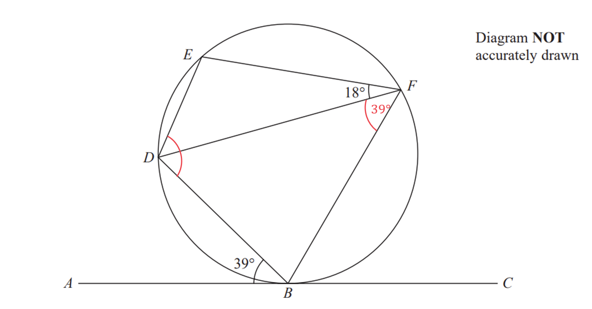

*Angle ***DFB ***= 39° (Alternate Segment Theorem)*

**[1]**

> *BDEF **is a cyclic quadrilateral, so the angle **BDE **and the angle **EFB** add up to 180°.*

*Angle ***BDE***  + Angle ***EFB***  = 180**o**   (Opposite angles in a cyclic quadrilateral = 180**o**)*

*Angle ***BDE***  + (18 + 39) = 180*

*Angle ***BDE   ***= 180 - (18 + 39) *

**[1]**

**Angle ****BDE****  = 123****o ****[1] **
**Full reasons given for method throughout ****[1]**

## Q31 — medium — 3 marks · exam-questions

### 19() — 3 marks
> *"**PTQ** is the diameter", so **TP **and **TQ** are two parts of the diameter. We know **TQ **and we can find **TP** using the **intersecting chord theorem,*
* *$TP\timesTQ=TR\timesTS$

$TP\times3=12\times4$

> *Find **TP** by dividing both sides by 3*

`table row cell T P end cell equals cell fraction numerator 12 cross times 4 over denominator 3 end fraction equals 16 end cell end table`

**[1]**

*Now find the diameter by adding* *TP **and **TQ*

*diameter =*** TP ***+ ***TQ ***= 16 + 3 = 19*

> *Finally, find the radius by dividing the diameter by 2*

*radius = 19 ÷ 2*

*** *****[1]**

**radius = 9.5 cm****  [1]**

## Q32 — very_hard — 5 marks · exam-questions

### 20() — 5 marks
> *Angle **AOC **is made by drawing lines from the points **A** and **C **on the circle which meet at the centre (**O**).*

*The circle theorem states that the angle at the centre is double the angle at the circumference.* 
*Therefore angle **AOC **is double angle **ABC**.*

$\mathrm{Angle}AOC=2\times75^{\circ}=150^{\circ}$

**[1]**

> *Form an expression for the area of the sector **AOC **using the formula for area of a sector *$=\frac{θ}{360^{\circ}}\timesπr^{2}$* and substituting the values into the formula, letting *$θ=150$* and *$r=r$*.*

$\mathrm{Area}_{\mathrm{sector}}=\frac{150}{360}\timesπ\timesr^{2}=\frac{5}{12}πr^{2}$

**[1]**

> *Form an expression for the area of the triangle **AOC **using the formula for area of a triangle *$=\frac{1}{2}ab\mathrm{sin}θ$* and substituting the values into the formula, letting *$θ=150$* and *$r=r$*.*

$\mathrm{Area}_{\mathrm{triangle}}=\frac{1}{2}\timesr\timesr\times\mathrm{sin}150=\frac{1}{4}r^{2}$

**[1]**

> *Form an expression for the area of the shaded region by subtracting the area of the triangle from the area of sector **AOC.*

$\mathrm{Area}_{\mathrm{shaded}}=\frac{5}{12}πr^{2}-\frac{1}{4}r^{2}$

> *Form an equation by setting the expression for the area of the shaded region equal to 200 cm**2**.*

$\frac{5}{12}πr^{2}-\frac{1}{4}r^{2}=200$

**[1]**

> *Factorise out **r**2**.*

`r to the power of italic 2 open parentheses 5 over 12 pi space minus space 1 fourth close parentheses space equals space 200`

> *Isolate **r**2**.*

`r to the power of italic 2 space equals space fraction numerator 200 over denominator open parentheses 5 over 12 pi space minus space 1 fourth close parentheses space end fraction`

> *Solve to find **r **by taking the square root of both sides.*

`r space equals space square root of fraction numerator 200 over denominator open parentheses 5 over 12 pi space minus space 1 fourth close parentheses space end fraction end root space equals space 13.74256...`

> *Round to 3 significant figures.*

**radius = 13.7 cm**** ****(3 s.f.)**** [1] **
**Answers in the range 13.7 to 13.8 accepted**

## Q33 — hard — 4 marks · exam-questions

### 20() — 4 marks
> *Angle **QPR **= Angle **QSR ** because they are angles in the same segment/angles subtended by the same arc.*

*Angle *$QPR=27^{\circ}$* (Angles in the same segment are equal)*

**[1]**

> *Angles in a triangle sum to 180° and triangle **XPS **is isosceles, so angle **RPS **= Angle **QSP.*

*Angle** *$RPS=\frac{180-50}{2}=65^{\circ}$* *
*(Base angles in an isosceles triangle are equal and angles in a triangle = 180°)*

**[1]**

> *If **QS **is a diameter of the circle, then angle **QPS **would be an angle in a semicircle so would be equal to 90°.*

*Angle *$QPS=\mathrm{angle}QPR+\mathrm{angle}RPS=27^{\circ}+65^{\circ}\neq90^{\circ}$

**[1]**

**Angle **$QPS=92^{\circ}$** so is not a right angle**** [1]**

## Q34 — medium — 2 marks · exam-questions

### 18() — 2 marks
> *This is an example of **intersecting chord theorem** therefore *$PD\timesPC=PB\timesPA$

$PD\times8=6\times9$

**[1]**

> *Find **PD** by dividing both sides by 8*

$PD=\frac{6\times9}{8}$

**PD**** = 6.75 cm**** ****[1]**

## Q35 — very_hard — 4 marks · exam-questions

### 29() — 4 marks
> *The line segments **OB **and **OC **are radii because they join the centre to the circumference.*

> * Angles **OBD** and **OCD **are where tangents meet a radius.*

*Angle ***OBD ***= angle*** OCD*** = 90°   (Angle between a tangent and a radius = 90°)*

> *ABDC **is a kite, so its angles add up to 360°. Find angle **BOC **in terms of *$x$*.*

** ***Angle ***BOC*** + angle ***BDC ***+ angle ***OBD*** + angle ***OCD *** = 360° *** ***Angle ***BOC*** + *$x$* + 90° + 90°*** *** = 360° *
*Angle ***BOC*** = 180 - *$x$*°*

**[1]**

> *Write down an expression for angle **BAC **in terms of *$x$*.*

*Angle ***BOC *** = 2 x angle ***BAC***   (Angle at the centre is twice the angle at the circumference) Therefore angle ***BAC *** = *$\frac{1}{2}$*(Angle ***BOC***)*

*Angle ***BAC ***= *`1 half open parentheses 180 space minus space x close parentheses degree space equals space 90 space minus space x over 2 degree`

**[1]**

> *Adding the information to the diagram as you go will help to see the next step.*

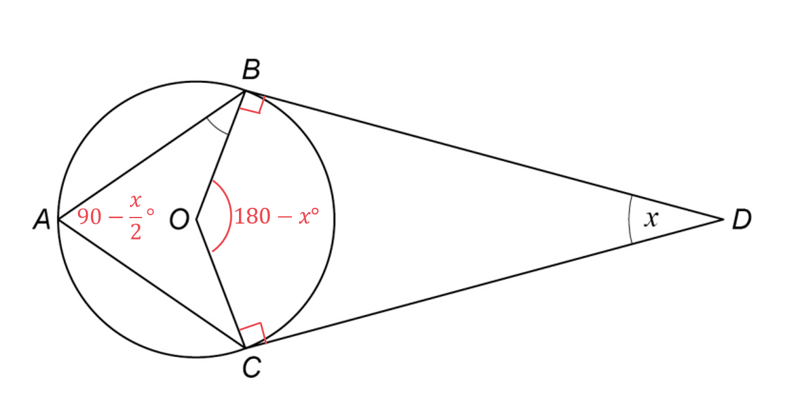

> *Kites are symmetrical, so the line **AD **is a line of symmetry. Add this line the the diagram and consider one of the triangles. The line of symmetry cuts both angle **BAC **and angle **BDC **in half. Find the angles **BAD **and **BDA**.*

*Angle ***BAD*** = *$\frac{1}{2}$*angle ***BAC*** = *`1 half open parentheses 90 space minus space x over 2 close parentheses space equals space 45 space minus space x over 4 space`

*Angle ***BDA*** = *$\frac{1}{2}$*angle ***BDC*** = *$\frac{1}{2}x$

> *Looking at triangle **ABD **only. *

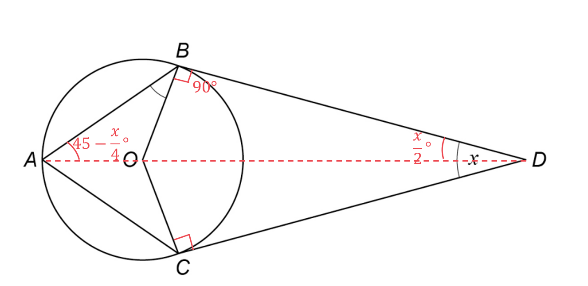

> *Angles in a triangle add up to 180°. Find angle **ABO **in terms of *$x$*by subtracting all the other angles in triangle **ABD **from 180°.*

** ***Angle ***ABO*** + angle ***OBD ***+ angle ***BDO*** + angle ***BAO *** = 180° (angles in a triangle add up to 180°) *** **
*Angle ***ABO*** + 90° + *$\frac{x}{2}$* + *`open parentheses 45 space minus space x over 4 close parentheses`* = 180° *
*Angle ***ABO*** = 180 - 90 - *`open parentheses 45 space minus space x over 4 close parentheses`* - *$\frac{x}{2}$

> *Simplify.*

**Angle ****ABO****  = **$45+\frac{x}{4}-\frac{x}{2}=45-\frac{x}{4}^{\circ}$**  ****[1] **
**Completely correct method leading to given answer with all reasons stated**** [1]**

## Q36 — hard — 3 marks · exam-questions

### 21() — 3 marks
> *The word 'bisect' means 'to cut in half', so angle **ABC **= angle **CBQ .*

*Angle*** ABC ***= angle ***CBQ*** = *$x^{\circ}$* (***CB ***bisects angle ***ABQ***).*

**[1]**

> *The alternate segment theorem states that an angle inside a triangle with all three vertices on the circumference of a circle is equal to the angle between the opposite side and a tangent.*

> *The angle *$x$* is between a tangent and a side of a triangle which has all three vertices on the circumference. So it is equal to the angle in the triangle opposite that side.*

*Angle*** BAC ***= *$x^{\circ}$* (alternate segment theorem).*

**[1]**

> *If angles **ABC **and **BAC **are equal, then and triangle **ABC **is isosceles with sides **AC **= **BC.*

*Base angles in an isosceles triangle are equal.*

**Angle ****ABC**** = angle ****BAC ****= **$x^{\circ}$** so triangle ****ABC ****is isosceles**** ****[1]**

## Q37 — medium — 4 marks · exam-questions

### 23() — 4 marks
> *Opposite angles in a cyclic quadrilateral add to 180°. *

> *To prove that **ABCD **is not a cyclic quadrilateral, we will need to show that the angles opposite each other do **not **add up to 180° for a single value of *$x$*.*

> *Form an equation using angles **BAD **and **CBD, **assuming that they do add up to 180°.*

`table row cell 4 x space plus space 92 space end cell equals cell space 180 end cell end table`

**[1]**

> *Solve the equation to find the value of *$x$* for which these opposite angles do add up to 180°.*

`table row cell 4 x space end cell equals cell space 180 space minus space 92 end cell row cell 4 x space end cell equals cell space 88 end cell row cell x space end cell equals cell space 88 over 4 end cell row cell x space end cell equals cell space 22 degree end cell end table`

**[1]**

> *Substitute this value of *$x$* into the angles **ABC **and **ADC.*

`table row cell Angle space A B C space end cell equals cell space 5 open parentheses 22 close parentheses space plus space 30 space equals space 140 degree end cell end table`

`table row cell Angle space A D C space end cell equals cell space open parentheses 22 close parentheses space plus space 36 space equals space 58 degree end cell end table`

**[1]**

> *Show that for this value of *$x$*, the sum of the angles **ABC **and **ADC **is not 180°.*

`table row cell Angle space A B C space plus space Angle space A D C space end cell equals cell space 140 degree space plus space 58 degree space not equal to space 180 degree end cell end table`

**Opposite angles do not add to 180°** **[1]**

## Q38 — very_hard — 4 marks · exam-questions

### 25() — 4 marks
> *The alternate segment theorem states that an angle inside a triangle with all three vertices on the circumference of a circle is equal to the angle between the opposite side and a tangent.*

> *The angle *$4x$* is between a tangent and a side of a triangle which has all three vertices on the circumference. So it is equal to the angle in the triangle opposite that side.*

*Angle ***CED ***= *$4x^{\circ}$** ***(alternate segment theorem)*

**[1]**

> *Angles in a triangle sum to 180° and triangle **CED  **is isosceles, so angle **ECD  **= angle **EDC.*

*Angle ***DCE  ***=** *$\frac{180-4x}{2}$* *
*(Base angles in an isosceles triangle are equal and angles in a triangle = 180°)*

**[1]**

> *Vertically opposite angles are equal, so angle **ACB  **= angle **DCE.*

*Angle ***ACB*** = angle ***DCE  ***=** *$\frac{180-4x}{2}$* *
*(Vertically opposite angles are equal)*

> *Angles in a triangle sum to 180°, so angle **ACB  **+ angle **ABC **+ angle** BAC **= 180°.*

* *$\frac{180-4x}{2}+90-x+y=180$* *
*(Angles in a triangle = 180°)*

**[1]**

> *Simplify.*

> * *`table attributes columnalign right center left columnspacing 0px end attributes row cell space 90 space minus space 2 x space plus space 90 space minus space x space plus space y space end cell equals cell space 180 end cell row cell space 90 space plus space 90 space minus space 2 x space minus space x space plus space y space end cell equals cell space 180 end cell row cell 180 space minus space 3 x space plus space y space end cell equals cell space 180 end cell end table`

> *Cancel 180 from both sides and rearrange to make **y **the subject.*

> * *`table row cell up diagonal strike 180 space minus space 3 x space plus space y space end cell equals cell space up diagonal strike 180 end cell row cell negative 3 x space plus space y space end cell equals cell space 0 end cell row cell y space end cell equals cell space 3 x end cell end table`

$y=3x$ 
**Full method and all reasons clearly given**** [1]**

## Q39 — hard — 4 marks · exam-questions

### 16((a)) — 4 marks
> *Draw in the radius **OB **onto the circle.*

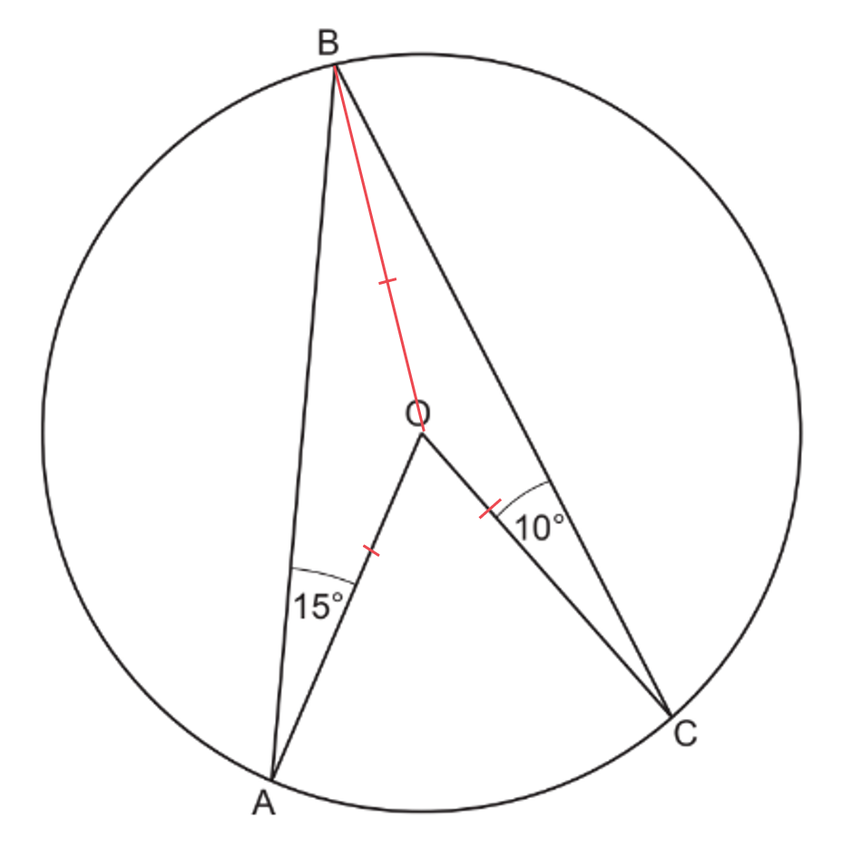

> *Triangles **AOB **and **COB** are isosceles so angles **OAB **and **ABO** are equal and angles **OCB **and **OBC** are equal. *

*Angle ***ABO ***= 15° Angle ***CBO ***= 10°*

**1 mark for each angle**** [2]**

> *Find angle **ABC.*

*Angle ***ABC ***= 15 + 10 = 25°*

**[1]**

> *The angle at the centre is twice the angle at the circumference therefore acute angle **AOC **is twice angle **ABC.*

*Angle ***AOC ***= 2(25)°*

**Angle ****AOC ****= 50°**** [1]**

## Q40 — medium — 2 marks · exam-questions

### 21((a)) — 2 marks
> *Two tangents from a circle to the same point outside of the circle are equal lengths.*

> *This means that triangle **ABP **is isosceles.*

*Angle ***ABP*** = Angle ***BAP***   (Base angles in an isosceles triangle are equal)*

*Angle ***ABP*** = 71**o*

**[1]**

> *Find the angle **APB **using the sum of the angle in a triangle.*

*Angle ***APB*** + Angle ***ABP*** + Angle ***BAP *** =  180**o**   (Angles in a triangle = 180**o**)*

*Angle ***APB*** + 71 +71 = 180*

*Angle ***APB***  = 180 - 2(71)*

**Angle ****APB**** = 38****o**** ****[1]**

## Q41 — very_hard — 5 marks · exam-questions

### 20((a)) — 4 marks
> *The line **DC **is a tangent to the circle and triangle **ABC **has all three vertices on the circumference, so the alternate segment theorem can be used.*

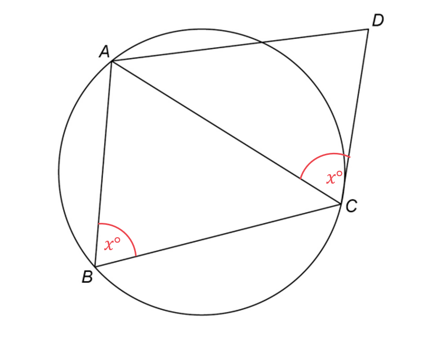

*Angle ***ACD*** = Angle ***ABC*** = *$x^{\circ}$*  (Alternate segment theorem)*

**[1]**

> *If triangle **ABC **is isosceles with **AC **= **BC**, then angle **BAC **= angle **ABC.*

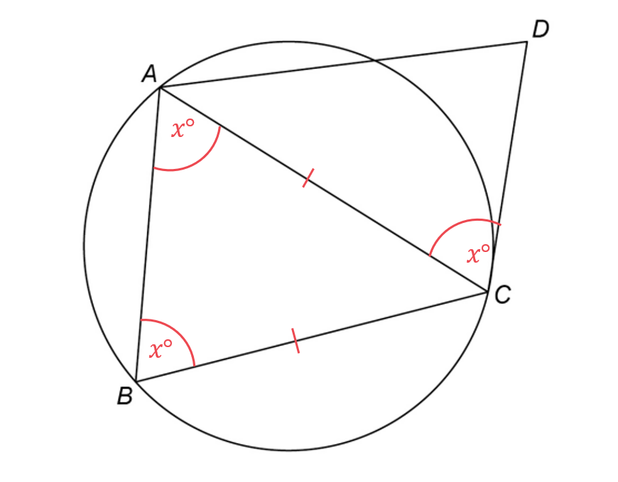

*Angle ***BAC ***= Angle ***ABC*** = *$x^{\circ}$*  (Base angles in an isosceles triangle are equal)*

**[1]**

> *This shows that angle **BAC ** is equal to angle **ACD**.*

*Angle ***BAC***  = Angle ***ACD  ***=  *$x^{\circ}$* *

*Therefore, angles ***BAC ***and ***ACD ***are alternate angles on parallel lines*

**Therefore, line segments ****AB ****and ****DC ****are parallel  **
**Alternate segment theorem stated with correct equal angles shown**** [1] **
**Completely correct method leading to given answer**** [1]**

### 20((b)) — 1 marks
> *If triangle **ABC **is equilateral, then we still have **AC **= **BC**, and so angle **BAC **is still equal to angle **ABC.*

*Angle ***ABC*** = Angle ***BAC***  = Angle ***ACD  ***=  *$x^{\circ}$* *
*Therefore, angles ***BAC ***and ***ACD ***are alternate angles on parallel lines*

> *If triangle **ABC **is equilateral, then we also have **AB** = **AC** = **BC**, and so angle **ACB **is also equal to angle **ABC. **(In fact they all equal 60°.)*

*Angle ***ABC*** = Angle ***BAC***  = Angle ***ACB  ***=  *$60^{\circ}$* *

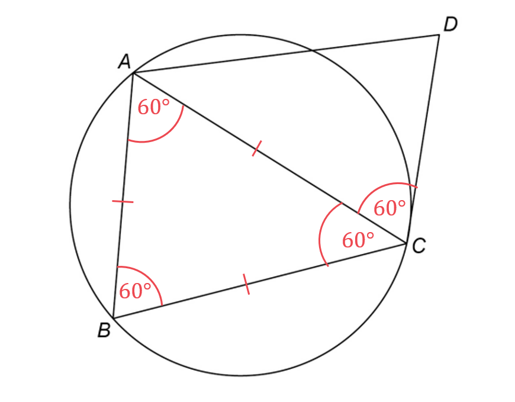

> *This shows that angle **ACB ** is equal to angle **ACD. **To bisect means to cut if half, so this shows that the line segment **AC **cuts angle **BCD **in half.*

** ****AB ****is parallel to ****DC**** **
**AC ****bisects angle ****BCD**** **
**Both statements ticked**** [1]**

## Q42 — hard — 5 marks · exam-questions

### 16((a)) — 2 marks
> *Angle *$ABD$* = Angle *$ACD$* because they are angles in the same segment/ angles subtended by the same arc.*

**Final answer:** **Angle **$ACD=58^{\circ}$** [1] **
**Angles in the same segment are equal.**** [1]**

### 16((b)) — 3 marks
> *Angle *$BAC$* = Angle *$BDC$* because they are angles in the same segment/ angles subtended by the same arc.*

*Angle *$BAC=22^{\circ}$ *(Angles in the same segment are equal)*

**[1]**

> *Angle *$ABC$* is the angle in a semicircle.*

*Angle *$ABC=90^{\circ}$ *(The angle in a semicircle is a right angle)*

**[1]**

> *And angles in a triangle sum to 180° so,*

*Angle *`A C B space equals space open parentheses 180 minus 90 minus 22 close parentheses degree`* (The sum of the angles in a triangle is 180°)*

**Angle **$ACB=68^{\circ}$** [1]**

## Q43 — medium — 2 marks · exam-questions

### 21((b)) — 2 marks
> *Using the property that angles at a point add up to 360°, find the value of *$x$*.*

`table row cell x space plus space 204 space end cell equals cell space 360 end cell row cell x space end cell equals cell space 360 space minus space 204 space equals space 156 end cell end table`

**[1]**

> *Using the circle theorem "The angle at the centre subtended by an arc is twice the angle at the circumference", find the value of *$x$*.*

`x space space equals space 2 open parentheses 78 close parentheses space equals space 156`

> *The two values of *$x$* are the same, so the angle **CXD **must be at the centre of the circle.*

**Yes, **$X$** is the centre of the circle**** [1]**

## Q44 — very_hard — 4 marks · exam-questions

### 24() — 4 marks
> *Opposite angles in a cyclic quadrilateral add up to 180°. Form an equation in terms of *$x$* and *$y$*.*

$x+y=180^{\circ}$*   (Opposite angles in a cyclic quadrilateral = 180°)*

> *Use the ratio  *$x:y=5:7$* to form a second equation in terms of *$x$* and *$y$*.*

$x:y\,5:7\,\,7x=5y$* *

> *Rearrange the second equation to find *$x$* in terms of *$y$*.*

$x=\frac{5y}{7}$*  *

> *Substitute  *$x=\frac{5y}{7}$* into the first equation.*

`table row cell fraction numerator 5 y over denominator 7 end fraction space plus space y space end cell equals cell space 180 end cell end table`* *

**[1]**

> *Simplify and solve to find *$y$*.*

`table row cell fraction numerator 5 y over denominator 7 end fraction plus fraction numerator 7 y over denominator 7 end fraction end cell equals 180 row cell fraction numerator 12 y over denominator 7 end fraction end cell equals 180 row cell 12 y space end cell equals cell space 1260 end cell row cell y space end cell equals cell space 1260 over 12 end cell row cell y space end cell equals cell space 105 degree space end cell end table`*  *

> *Substitute  *$y=105$*  into the second equation.*

`table row cell x space end cell equals cell space fraction numerator 5 open parentheses 105 close parentheses over denominator 7 end fraction space equals space 525 over 7 equals space 75 degree end cell end table`* *

**[1]**

> *Opposite angles in a cyclic quadrilateral add up to 180°. Form an equation in terms of *$x$* and *$w$*.*

`open parentheses x plus 20 close parentheses space plus space w space equals space 180 degree`*   (Opposite angles in a cyclic quadrilateral = 180°)*

> *Substitute  *$x=75^{\circ}$* into the this equation.*

`table row cell open parentheses 75 plus 20 close parentheses space plus space w space end cell equals cell space 180 degree end cell end table`* *

> *Simplify and solve to find *$w$*.*

`table row cell 95 space plus space w space end cell equals cell space 180 end cell row cell w space end cell equals cell space 180 space minus space 95 end cell end table`*  *

**[1]**

$w=85^{\circ}$** [1]**

## Q45 — medium — 1 marks · exam-questions

### 22() — 1 marks
> *The first property Sam has used is the alternate segment theorem, not the same segment theorem.*

**The reason in the first line should be the Alternate Segment Theorem**** [1]**

## Q46 — very_hard — 4 marks · exam-questions

### 19() — 4 marks
> *Angle *$BDC$* = Angle *$BAC$* because they are angles in the same segment/ angles subtended by the same arc*

*Angle *$BDC=24^{\circ}$ *(angles in the same segment are equal)*

**[1]**

> *Triangle *$CDF$* is isosceles and angles in a triangle sum to 180° so*

*Angle *$DFC$* = angle *$DCF=\frac{180-24}{2}$* (base angles in an isosceles triangle are equal)*

**[1]**

> *Add the angles so far onto the diagram.*

> * *

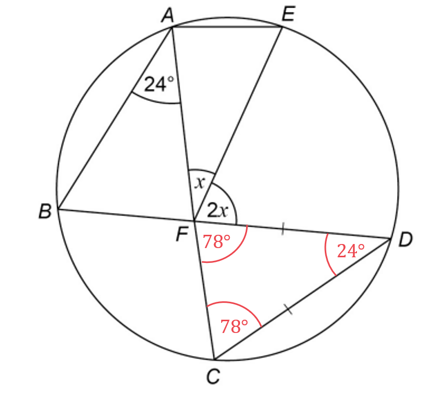

> *The line segment **AFC** is a straight line so angles **AFE, EFD **and **DFC** add up to 180°.*

* *`open parentheses x space plus space 2 x space plus space 78 close parentheses degree space equals space 180 degree`

> *Simplify and begin to solve by subtracting 78 from both sides.*

* *`table row cell 3 x space plus space 78 space end cell equals cell space 180 end cell row cell 3 x space end cell equals cell space 180 space minus space 78 end cell end table`

**[1]**

> *Solve to find the value of *$x$*.*

`table row cell 3 x space end cell equals cell space 102 end cell row cell x space end cell equals cell space 102 over 3 end cell end table`

$x=34^{\circ}$** [1]**

## Q47 — medium — 2 marks · exam-questions

### 19() — 2 marks
> *The alternate segment theorem states that an angle inside a triangle with all three vertices on the circumference of a circle is equal to the angle between the opposite side and a tangent.*

> *The angle *$x$* is between a tangent and a side of a triangle which has all three vertices on the circumference. So it is equal to the angle in the triangle opposite that side.*

> $x^{\circ}=\mathrm{angle}ABC=65^{\circ}$*  *

$x=65^{\circ}$ **[1] **
**Alternate Segment Theorem ****[1]**

## Q48 — very_hard — 7 marks · exam-questions

### 16((a)) — 4 marks
> *Opposite angles in a cyclic quadrilateral add up to 180°, so angles **BAD **and **BCD **add up to 180°. Find angle **BCD**. *

*Angle ***BAD  ***+ Angle*** BCD  ***= 180°** *
*Angle ***BCD  ***+ 112° = 180°   *
*Angle ***BCD *** = 180° - 112° = 68° *
*(Opposite angles in a cyclic quadrilateral add up to 180°) *

**Correct method to find angle BCD ****[1] **
**Correct reason ****[1]**

> *Find angle **OCB.*

*Angle*** OCB ***+ Angle*** OCD  ***= 68°*
* **Angle ***OCB ***+ 33° = 68°  *
* Angle ***OCB *** = 68° - 33° = 35°*

**Correct method to find angle OCB ****[1]**

> *Mark the radii **OB** and **OC **as equal lines on the diagram.*

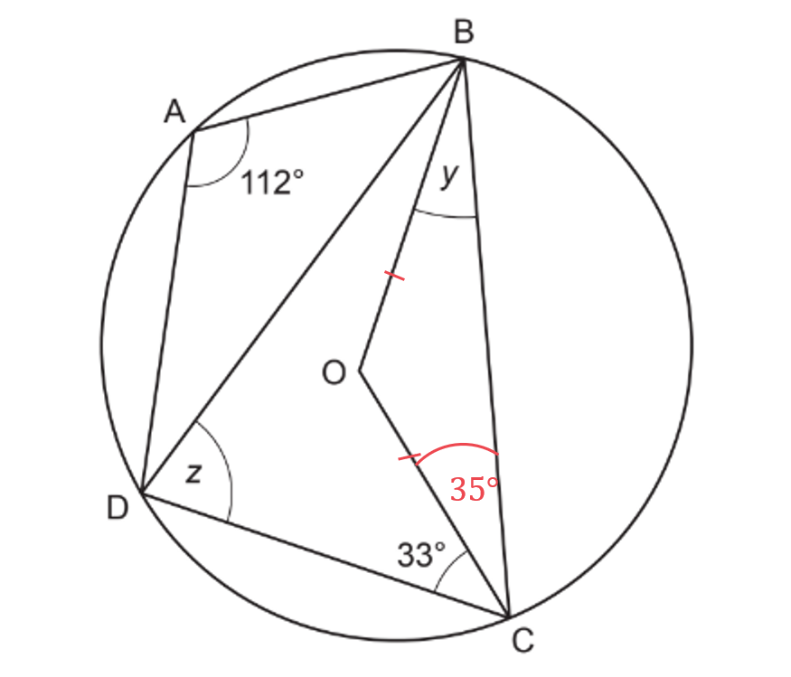

> *Triangle **OBC **is isosceles with angle **OBC **and angle **OCB **equal to each other.*

*Angle ***OBC ***= 35° *

**y****  = 35° (Base angles in an isosceles triangle are equal)**** ****[1] **
**All working and reasons must be shown.**

### 16((b)) — 3 marks
> *Find angle **BOC.*

> *Angles in a triangle add up to 180°.*

*Angle ***BOC***  + Angle ***OCB ***+ Angle*** OBC ***= 180°   (Angles in a triangle = 180**o**) Angle ***BOC***  = 180 - 2(35) = 110°*

**[1]**

> *The angle at the centre of a circle is twice the angle at the circumference. Therefore angle **BOC **is twice angle **BDC.*

`table row cell 110 space end cell equals cell space 2 open parentheses z degree close parentheses end cell row cell z space end cell equals cell 110 over 2 end cell end table`

**Angle ****z ****= 55° because the angle at the centre is twice the angle at the circumference and angle ****BOC ****= 110°.   **
**Correct angle ****[1] **
**Correct reason ****[1]**

## Q49 — medium — 2 marks · exam-questions

### 12() — 2 marks
> *Use the circle theorem: "The angle at the circumference in a semicircle is a right angle".*

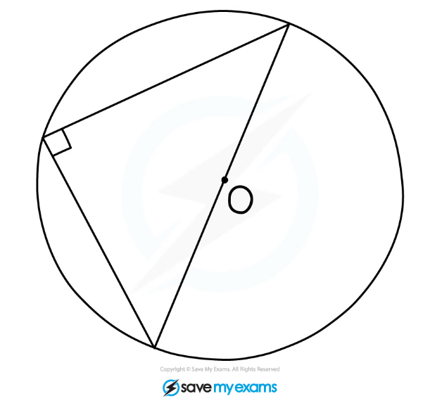

> *Find the missing angle in each of the triangles. Angles in a triangle add up to 180°.*

> *Options 3 and 4, **AC **and **BF**, cannot be diameters because the angles at the circumference subtended from their end points are not 90°.*

> *Find angle** BFE.** *

$180-95-5=80$

> *Angle **BFE **= 80° so the angle at the circumference from the line **BE **is not a right angle.*

> *Option 1, **BE**, cannot be the diameter.*

> *Find angle** ACD.** *

$180-80-10=90$

> *Angle **ACD **= 90° so the angle at the circumference from the line **AD **is a right angle.*

**Option 2, **$AD$**, is the diameter**** ****[1]**

## Q50 — very_hard — 5 marks · exam-questions

### 8() — 5 marks
> *To find the area of the circle, the length of the radius will need to be found.*

> *BD **is a diameter so angle **BCD** is the angle in a semicircle.*

*Angle ***BCD*** = 90°* *(The angle in a semicircle is a right angle)*

> *Triangle **BCD **is a right-angled triangle, so if one more angle is found, SOHCAHTOA can be used to find the length of the diameter.*

> *Find angle **CBD**.*

*Angle ***CBD*** = Angle ***CAD***   (Angles in the same segment are equal) Angle ***CBD*** = 28°*

**Either angle BCD or angle CBD found ****[1]**

> *Triangle **BCD** is a right angled triangle with an angle so you can use trigonometry. You know the length of the side that is opposite to the angle and you want the length of the hypotenuse. Therefore you can use the sine ratio: *$\mathrm{sin}θ=\frac{O}{H}$*.*

`sin open parentheses 28 close parentheses space equals space fraction numerator 6.4 over denominator B D end fraction`

**[1]**

> *Rearrange to make **BD **the subject.*

`table row cell 6.4 thin space end cell equals cell space B D cross times sin open parentheses 28 close parentheses end cell row cell B D end cell equals cell fraction numerator 6.4 over denominator sin open parentheses 28 close parentheses end fraction end cell row blank equals cell space 13.632348... end cell end table`

**[1]**

> *The radius is equal to half of the diameter.*

`table row cell r space end cell equals cell space fraction numerator 13.632348... over denominator 2 end fraction space equals space 6.8161742... end cell end table`

> *You can now find the area of the circle using the formula *$A=πr^{2}$*, where **r** is the radius of the circle. Use the answer button or store the radius in your calculator's memory.*

`table row cell Area space end cell equals cell space pi open parentheses 6.8161742... close parentheses squared end cell row blank equals cell 145.959123... end cell end table`

**[1]**

> *Round to 3 significant figures. Remember to include square units for the area.*

$\mathrm{Area}=146\mathrm{cm}^{2}(3s.f.)$* ***[1] **
**Answers in the range 145.2 to 146.2 accepted.**

## Q51 — medium — 4 marks · exam-questions

### 16((b)) — 4 marks
> *Mark the angle you need to find on the diagram and label it **x.*

> *By the Alternate Segment Theorem, the angle **DEF **is equal to the angle **HDF,** so angle **DEF  **can also be marked **x **on the diagram.*

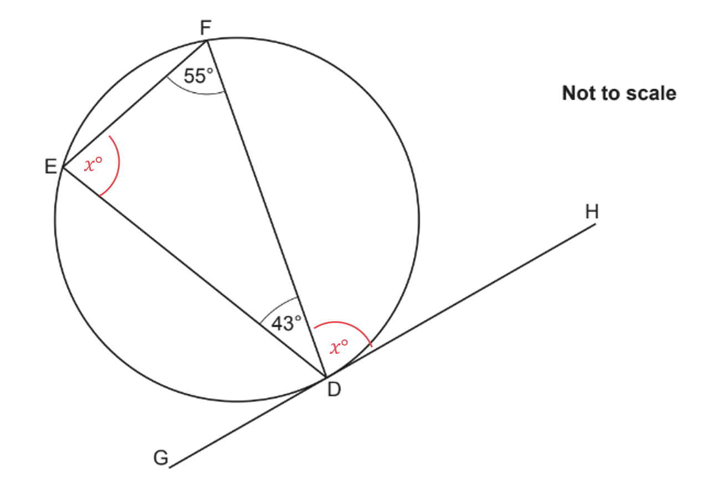

> *Angles in a triangle add up to 180°.*

*Angle ***DFE***  + Angle ***DEF  ***+ Angle*** EDF ***= 180**o**   (Angles in a triangle = 180°)*

**[1]**

*55° + ***x***°*** ***+ 43° = 180**o**   (Angles in a triangle = 180°) ***x***  = 180 - 55 - 43 = 82°*

**[1]**

> *By the Alternate Segment Theorem, angle **DEF **is equal to the angle **HDF.*

*Angle ***HDF ***= angle ***DEF *** = 82° *
* (Alternate Segment Theorem)*

**Angle ****HDF ****= angle ****DEF **** = 82°***** ***** ****[1] **
**At least one correct reason given ****[1] **
**Full reasons must be given for method throughout**

## Q52 — medium — 5 marks · exam-questions

### 19((a)) — 2 marks
> *Mark the radii **OC** and **OD **as equal lines on the diagram. Triangle **OCD **is isosceles with angle **OCD **and angle **ODC **equal to each other.*

*Angle ***OCD ***= 57° (Base angles in an isosceles triangle are equal)*

**[1]**

> *Angles in a triangle add up to 180°.*

*Angle ***DOC***  + Angle ***OCD ***+ Angle*** ODC ***= 180**o**   (Angles in a triangle = 180**o**) Angle ***DOC***  = 180 - 2(57) = 66°*

**x****  = 66**** ****[1]**

### 19((b)) — 3 marks
> *Opposite angles in a cyclic quadrilateral add up to 180°, so angles **ABC **and **ADC **add up to 180°. Find angle **ADO**. *

*Angle ***ADO  ***+ Angle*** OCD + ***Angle ***ABC ***= 180°** *
*Angle ***ADO  ***+ 57° + 82° = 180°   *
*Angle ***ADO *** = 180° - 57° - 82° = 41° *

**[1]**

> *A radius and a tangent meet at 90°, so angle **ODE **= 90°. *

*Angle*** ODE  ***= 90°*

**[1]**

> *Find angle **ADE**. *

*Angle ***ADE ***+ Angle ***ADO  ***= 90°  *
*Angle ***ADE ***+ 41° = 90°  *
*Angle ***ADE  ***= 90° - 41°*

**y ****= 49****  ****[1]**

## Q53 — medium — 4 marks · exam-questions

### 16((a)) — 2 marks
> *The angle at the centre of a circle is twice the angle at the circumference. Therefore angle **x **is twice angle **BAD.*

`table row cell x space end cell equals cell space 2 open parentheses B A D degree close parentheses end cell row cell x space end cell equals cell space 2 open parentheses 52 degree close parentheses end cell end table`

**Angle ****x ****= 104° because the angle at the centre is twice the angle at the circumference.   **
**Correct angle ****[1] **
**Correct reason ****[1]**

### 16((b)) — 2 marks
> *Opposite angles in a cyclic quadrilateral add up to 180°. Therefore angle **BAD **plus angle **BCD **equals 180°.*

`table row cell 52 space plus thin space y space end cell equals cell space 180 end cell row cell y space end cell equals cell space 180 space minus space 52 end cell end table`

**Angle ****y ****= 128° because opposite angles in a cyclic quadrilateral add up to 180****°.****   **
**Correct angle ****[1] **
**Correct reason ****[1]**

## Q54 — medium — 4 marks · exam-questions

### 16((a)) — 2 marks
*The alternate segment theorem states that the interior angle in a triangle is equal to the angle between the opposite side and a tangent.* 
*Therefore angle **BAD **is equal to angle **BDQ**.*

**Angle x = 72° because angle ****BAD ****is equal to angle ****BDQ ****by the alternate segment theorem  **
**Correct angle ****[1] **
**Correct reason ****[1]**

### 16((b)) — 2 marks
> *Opposite angles in a cyclic quadrilateral add up to 180°. Therefore angle **x **plus angle **y **equals 180°.*

`table row cell x space plus thin space y space end cell equals cell space 180 end cell row cell 72 space plus space y space end cell equals cell space 180 end cell row cell y space end cell equals cell space 180 space minus space 72 end cell end table`

**Angle ****y ****= 108° because opposite angles in a cyclic quadrilateral add up to 180****°.****   **
**Correct angle ****[1] **
**Correct reason ****[1]**

## Q55 — medium — 5 marks · exam-questions

### 14() — 5 marks
> **[exam-tip]**
> When asked to find a missing angle you will commonly need to work out other missing angles first. Write any calculated missing angles on the diagram provided making sure you write your method and reasons as you go.
> 
> Missing angles on a diagram within a circle will typically require you to apply your understanding of circle theorems.

> *Apply the 'angles in the same segment' circle theorem to calculate missing angle **ABD,** writing a clear reason alongside*

**ABD***=43**o** because angles in the same segment are equal*

**[M1 B1]**

> *Apply the 'angle in a semi-circle' circle theorem to calculate missing angle **DAB, **writing a clear reason alongside*

**DAB***=90**o** because the angle in a semi-circle is a right angle*

> *Calculate the missing angle ADB using the sum of angles in a triangle rule, writing a clear reason alongside*

$180-43-90=47$* because angles in a triangle add up to 180**o*

**[M1 B1]**

**Final answer:** **47****o**

**[A1]**

> **[mark-scheme]**
> **M1**: This mark is awarded for either *ABD* or *DAB *correctly evaluated.
> 
> **B1**: This is awarded for at least one fully correct circle theorem reason given that is relevant to the method that you have shown.
> 
> **M1**: A correct calculation for angle *ADB* will gain this mark.
> 
> **B1**: Awarded for all three fully correct reasons given to support your method and calculations.
> 
> **A1**: Awarded for *ADB*=47o

## Q56 — medium — 3 marks · exam-questions

### 16() — 3 marks
> **[exam-tip]**
> This question is a classic use of the intersecting secants theorem. A secant is a line that intersects a circle at two points.
> 
> The theorem states:
> 
> $(\mathrm{external} \mathrm{segment} \mathrm{length} \mathrm{of} \mathrm{secant}A)\times(\mathrm{full} \mathrm{secant} \mathrm{length}A)\,=(\mathrm{external} \mathrm{segment} \mathrm{length} \mathrm{of} \mathrm{secant}B)\times(\mathrm{full} \mathrm{secant} \mathrm{length}B)$

> *Write out the intersecting secants theorem in the context of the question*

$RS\timesRT=QR\timesPR$

> *Substitute in the lengths of known line segments and simplify*

`table row cell 3 cross times open parentheses 3 plus 8.5 close parentheses end cell equals cell 5 cross times open parentheses 5 plus P Q close parentheses end cell row cell 34.5 end cell equals cell 25 plus 5 P Q end cell end table`

**[M1]**

> *Solve to calculate *$PQ$

`table row cell 34.5 end cell equals cell 25 plus 5 P Q end cell row cell 34.5 minus 25 end cell equals cell 5 P Q end cell row cell 9.5 end cell equals cell 5 P Q end cell row cell fraction numerator 9.5 over denominator 5 end fraction end cell equals cell P Q end cell end table`

**[M1]**

$PQ=1.9$

**[A1]**

## Q57 — medium — 4 marks · exam-questions

### 7() — 4 marks
> **[exam-tip]**
> When asked to find a missing angle you will commonly need to work out other missing angles first.
> 
> Write any calculated missing angles on the diagram provided making sure you write your method and reasons as you go.
> 
> Missing angles on a diagram with a circle will typically require you to apply your understanding of circle theorems.

> *Calculate angles **OCB** and **OAB **using the radius meets a tangent** **circle theorem*

$OCB=90^{\circ}\,OAB=90^{\circ}$

*Because a radius meets a tangent at 90**o*

**[B1]**

> *Calculate angle *$x$*using  the sum of angles in a quadrilateral equals 360° rule*

`x equals 360 minus open parentheses 90 plus 90 plus 52 close parentheses
x equals 128`

*Because angles in a quadrilateral add up to 360**o*

**[B1 M1 A1]**

$x=128^{\circ}$

> **[mark-scheme]**
> **B1**: For stating that a radius meets a tangent at 90°.
> 
> **B1**: For stating that the interior angles of a quadrilateral add up to 360°.
> 
> **M1**: For a complete method to find the angle.
> 
> **A1**: Correct answer.

## Q58 — medium — 3 marks · exam-questions

### 7() — 3 marks
> *Using the circle theorem that a radius meets a tangent at 90°*

*DCO = DAO = 90°*

**[M1]**

> *The sum of the angles in a quadrilateral is 360°*

> *Use this to calculate the obtuse angle in the centre of the circle*

$360-90-90-48=132$

**[M1]**

> *Then calculate the reflex angle*

*360 - 132 *

**Final answer:** **228°**

**[A1]**

## Q59 — medium — 3 marks · exam-questions

### 14() — 3 marks
> $OAC$* is an isosceles triangle and base angles in an isosceles triangle are equal, so work out angle *$AOC$

$AOC=180-52-52=76$

**[M1]**

> *The angle at the centre is twice the angle at the circumference*

$76\div2=38$

$38^{\circ}$

**[A1]**

- **Base angles in an isosceles triangle are equal**
- **Angles in a triangle add up to 180**
- **The angle at the centre is twice the angle at the circumference**

**[B1]**

> **[mark-scheme]**
> **M1: **Correct method to find $AOC$.
> 
> **A1: **Correct answer.
> 
> **B1:** You must have two valid reasons, including one circle theorem, and one about angles in a triangle.
