# Mark Schemes — Similarity & Geometrical Proof
**Geometry** · Edexcel IGCSE Maths A (Modular) (4XMAF/4XMAH) — 24/Higher Unit 2

## Q1 — very_hard — 5 marks · exam-questions

### 20() — 5 marks
> *To prove that **ST  **is equal to** UT ** you will need to **prove **that the triangle **STU **is **isosceles**. This can be done by finding the angles. *

> *PQRST **is a regular pentagon, so the angle **TSU** is the exterior angle of a regular pentagon. Exterior angles in any polygon add up to 360°. A regular pentagon has 5 equal exterior angles.*

> * *`T S with hat on top U space equals 360 over 5 equals space 72 degree`

**[1]**

> *To find the size of angle **SUT**, you will need to consider circle theorems.*

> *Begin by joining the point **O** to the points **T** and **R,** marking all the radiuses of the circle as equal lengths on the diagram.*

> *TP** and **TR **are also tangents to the circle, so by the circle theorem 'A tangent always meets a radius at 90°', angles **ORQ **and **OTP **are both 90°. *

`O R with hat on top Q space equals space O T with hat on top P space equals 90 degree`* **(angle between tangent and radius)*

**[1]**

> *Mark these onto the diagram.*

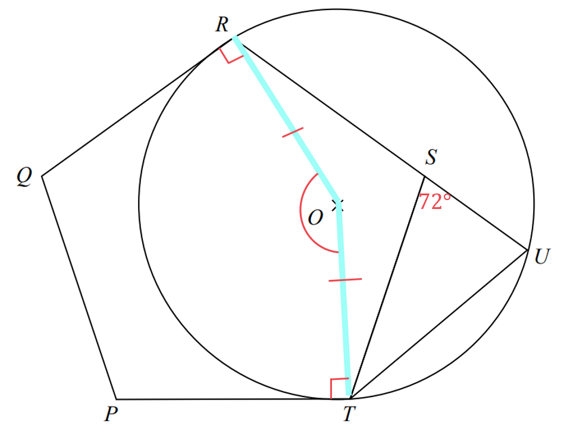

> *The sum of the interior angles in any polygon can be found using the formula 180°(n - 2). A regular pentagon has 5 equal interior angles, therefore these can be found using the formula *`fraction numerator 180 open parentheses 5 space minus space 2 close parentheses over denominator 5 end fraction`*.*

> * *`T P with hat on top Q space equals P Q with hat on top R space equals space fraction numerator 3 open parentheses 180 close parentheses over denominator 5 end fraction equals space 108 degree`

> *Add these angles to the diagram.*

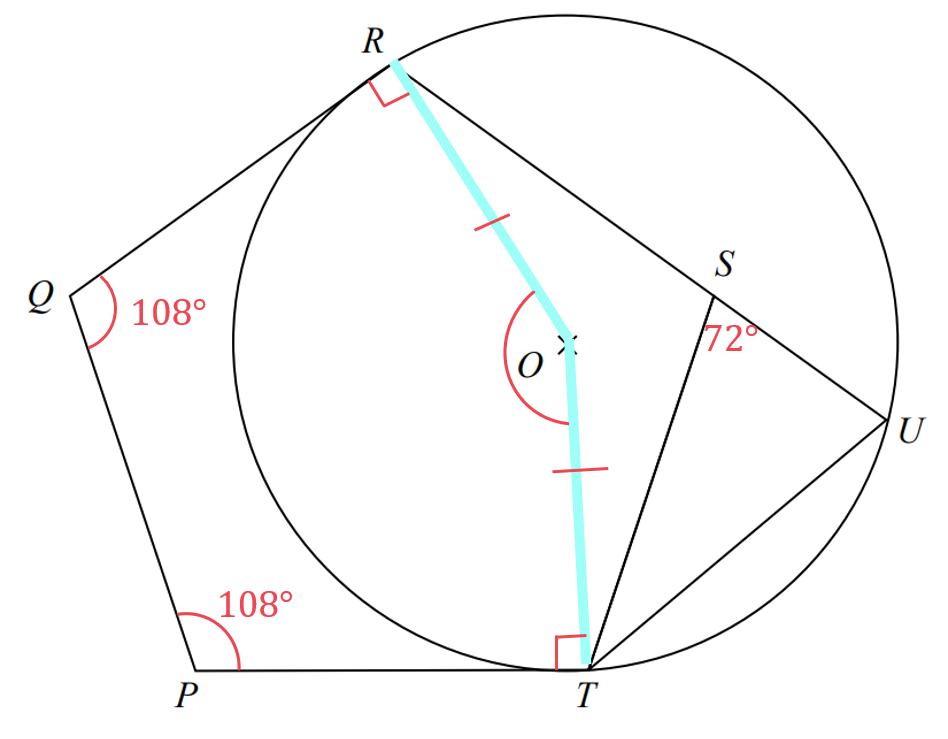

> *PQROT  **is a pentagon, so the angle **ROT**  can be found by subtracting the other four angles from the sun of the angles in a pentagon.*

> *The sum of the interior angles in any polygon can be found using the formula 180°(n - 2).*

`R O with hat on top T space plus O T with hat on top P space plus space T P with hat on top Q space plus space P Q with hat on top R space plus space Q R with hat on top O space equals space 180 open parentheses 5 space minus space 2 close parentheses degree space equals space 540 degree`

> *Substitute in the angles you know to find angle **ROT**.*

`table row cell R O with hat on top T space plus space 90 degree space plus space 90 degree space plus space 108 degree space plus space 108 degree space end cell equals cell space 540 degree end cell row cell R O with hat on top T space plus space 396 degree space end cell equals cell space 540 degree end cell row cell R O with hat on top T space space end cell equals cell space 144 degree end cell end table`

**[1]**

> *By the circle theorem, the angle at the centre is twice the angle at the circumference, angle **ROT **is twice angle **RUT.*

`R O with hat on top T space equals 2 open parentheses R U with hat on top T close parentheses space equals space 2 open parentheses S U with hat on top T close parentheses`

`S U with hat on top T space equals fraction numerator R O with hat on top T over denominator 2 end fraction equals space 144 over 2 space equals space 72 degree`

**[1]**

> *This proves that angle **TSU **is equal to angle **SUT **and so triangle **STU **is isosceles.*

**Therefore ****ST ****= ****UT **
**All reasons given clearly [1]**

## Q2 — hard — 3 marks · exam-questions

### 15() — 3 marks
> *Similar triangles have three equal angles. *
*Use circle theorems to identify any corresponding angles that are equal between triangles **ABE**  and **DCE**.*

> *The same segment circle theorem states that angles at the circumference subtended by the same arc are equal.*

> *Vertically opposite angles at a point are equal.*

> *The statement that if three corresponding angles between two triangles are equal then the two triangles are similar must be made.*

**Angle ****ABE****  = angle ****DCA****  as they are angles in the same segment. **
**Angle ****BAE****  = angle ****CDE****  as they are angles in the same segment. Angle ****AEB****  = angle ****DEC****  as they are vertically opposite angles. **** **
**A****t least one of the three statements given, with reason ****[1]  **
**A****t least two of the three statements given, with reasons ****[1]**** All three angles are the same so the triangles are similar.***** ***** ****All three statements and explanation of similar triangles ****[1]**

## Q3 — medium — 3 marks · exam-questions

### 21() — 3 marks
> *The triangles are similar so there will exist a value of **k **such that  *`table row cell A D space end cell equals cell space k A E end cell end table`* and *`table row cell C D space end cell equals cell space k B E end cell end table`*. *
*k **is known as the scale factor.*

> *It may help to draw the two triangles out separately next to each other.*

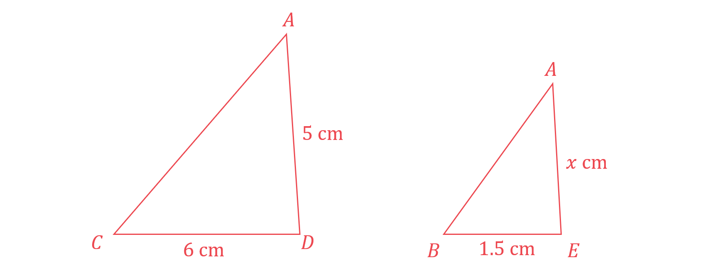

> *Form an equation using the two known sides of the triangle.*

`table row cell C D space end cell equals cell space k B E end cell end table`

> *Substitute the values of *$CD$* and *$BE$* into the equation and solve to find *$k$*.*

`table row cell 6 space end cell equals cell space 1.5 k end cell row cell k space end cell equals cell space fraction numerator 6 over denominator 1.5 end fraction space equals space 4 end cell end table`

**[1]**

> *Substitute into *`table row cell A D space end cell equals cell space k A E end cell end table`*.*

`table row cell A D space end cell equals cell space k A E end cell row cell 5 space end cell equals cell space left parenthesis 4 right parenthesis A E end cell end table`

> *Solve to find *$AE$*.*

`table row cell 5 space end cell equals cell space 4 A E end cell row cell A E space end cell equals cell space 5 over 4 space equals space 1.25 end cell end table`

> $ED=AD-AE$*. Substitute the values of*$AD$* and*$AE$* in.*

`table row cell E D space end cell equals cell space A D space minus space A E space equals space 5 space minus space 1.25 space end cell end table`

**[1]**

$ED=3.75$** cm**** ****[1]**

## Q4 — easy — 4 marks · exam-questions

### 17((a)) — 2 marks
> *As the two shapes are mathematically similar, there will exist a value of *
*k **such that *`table row cell L P space end cell equals cell space k A D end cell end table`* and *`table row cell P N space end cell equals cell space k C D end cell end table`*. *
$k$* **is known as the scale factor.*

> *Form an equation using the two known sides of the triangle.*

`table row cell P N space end cell equals cell space k C D end cell row cell space 9 space end cell equals cell space 6 k end cell end table`

> *Solve to find *$k$*.*

`table row cell k space end cell equals cell space 9 over 6 space equals space 3 over 2 end cell end table`

**[1]**

> *Substitute into *`table row cell L P space end cell equals cell space k A D end cell end table`*.*

`table attributes columnalign right center left columnspacing 0px end attributes row cell L P space end cell equals cell space 3 over 2 A D space equals space 3 over 2 open parentheses 5 close parentheses space equals space 15 over 2 end cell end table`

$LP=7.5$** cm**** ****[1]**

### 17((b)) — 2 marks
> *From part (a) the scale factor to enlarge any side from the smaller shape to the bigger one is *$k=1.5$*.*

> *Substitute this into *`table row cell M N space end cell equals cell space k B C end cell end table`*.*

`table row cell M N space end cell equals cell space 1.5 B C end cell row cell 12 space end cell equals cell space 1.5 B C end cell end table`

> *Solve to find *$BC$*.*

`table row cell B C space end cell equals cell space fraction numerator 12 over denominator 1.5 end fraction space equals space 8 end cell end table`

**[1]**

$BC=8$** cm**** ****[1]**

## Q5 — very_hard — 5 marks · exam-questions

### 22() — 5 marks
> *The triangles are similar so all the corresponding angles will be equal. The question does **not **state that the two lines **BE **and **CD **are parallel, so you cannot assume this. *

> *It may help to draw the two triangles out separately next to each other.*

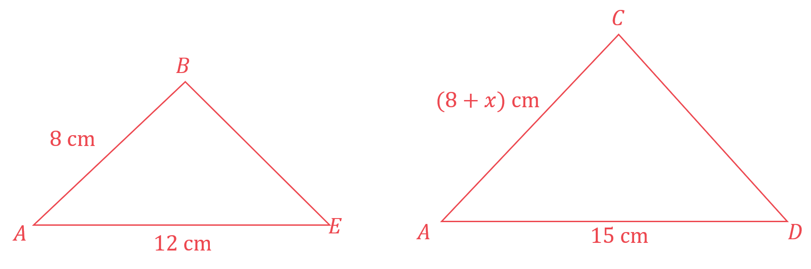

> *The angles **BAE **and **CAD** are the same angle so they are equal.*

> *If the lines **BE **and **CD **are parallel, then the angle **ABE **= angle **ACD **then there will exist a value of **k **such that  *`table row cell A C space end cell equals cell space k A B end cell end table`*, *`table row cell C D space end cell equals cell space k B E end cell end table`* and *`table row cell A D space end cell equals cell space k A E end cell end table`*. **k **is known as the scale factor.*

> *Form an equation using the two sides **AE **and **AD**.*

`table row cell A D space end cell equals cell space k A E end cell end table`

> *Substitute the values of *$AE$* and *$AD$* into the equation and solve to find *$k$*.*

`table row cell 15 space end cell equals cell space 12 k end cell row cell k space end cell equals cell space 15 over 12 space equals space 1.25 end cell end table`

**[1]**

> *Substitute into *`table row cell A C space end cell equals cell space k A B end cell end table`*.*

`table row cell A C space end cell equals cell space k A B end cell row cell 8 space plus space x space end cell equals cell space left parenthesis 1.25 right parenthesis open parentheses 8 close parentheses end cell end table`

> *Solve to find *$x$*.*

`table row cell 8 space plus space x space end cell equals cell space 10 end cell row cell x space end cell equals cell space 10 space minus space 8 end cell row cell x space end cell equals cell space 2 end cell end table`

**[1]**

> *If the lines **BE **and **CD **are **not **parallel, then it **may **instead be that angle **ABE **= angle **ADC.  **Drawing the triangles this way up instead will help.*

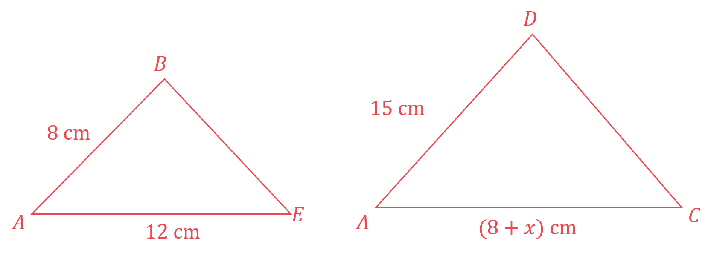

> *In this case, there will exist a value of **k **such that  *`table row cell A C space end cell equals cell space k A E end cell end table`*, *`table row cell C D space end cell equals cell space k B E end cell end table`* and *`table row cell A D space end cell equals cell space k A B end cell end table`*. **k **is known as the scale factor.*

> *Form an equation using the two sides **AB **and **AD**.*

`table row cell A D space end cell equals cell space k A B end cell end table`

> *Substitute the values of **AB** and **AD** into the equation and solve to find *$k$*.*

`table row cell 15 space end cell equals cell space 8 k end cell row cell k space end cell equals cell space 15 over 8 end cell end table`

> *Substitute into *`table row cell A C space end cell equals cell space k A E end cell end table`*.*

`table row cell A C space end cell equals cell space k A E end cell row cell 8 space plus space x space end cell equals cell space left parenthesis 15 over 8 right parenthesis open parentheses 12 close parentheses end cell end table`

**[1]**

> *Solve to find *$x$*.*

`table row cell space x space plus space 8 space end cell equals cell 45 over 2 end cell row cell x space end cell equals cell space 45 over 2 space minus space 8 end cell row blank equals cell fraction numerator space 29 over denominator 2 end fraction end cell end table`

** [1]**

$x=2$** cm, assuming that angle ****ABE  ****= angle ****ACD **
**or  **$x=14.5$** cm, assuming that angle ****ABE  ****= angle ****ADC**** **
**Both assumptions given ****[1]**

## Q6 — hard — 3 marks · exam-questions

### 20() — 3 marks
> *The piece of card is mathematically similar to the photo so there will exist a scale factor which can be used to find the length of one of the shapes, given the length of the other.*

> *Let the scale factor be **k**.*

> *Form an equation using the two known sides, these are the width of the photo and the width of the card.*

`table row cell W i d t h open parentheses c a r d close parentheses space end cell equals cell space k W i d t h open parentheses p h o t o close parentheses end cell row cell 15 space end cell equals cell space 10 k end cell end table`

> *Solve to find *$k$*.*

`table row cell 10 k space end cell equals cell space 15 end cell row cell k space end cell equals cell space 15 over 10 space equals space 1.5 end cell end table`

**[1]**

> *Form an equation for the length of the photo and the length of the card.*

`table row cell L e n g t h open parentheses c a r d close parentheses space end cell equals cell space k L e n g t h open parentheses p h o t o close parentheses end cell row cell space l space end cell equals cell 16 space k end cell end table`

> *Substitute *$k=1.5$* to find the length of the card.*

`table row cell l space end cell equals cell space 16 open parentheses 1.5 close parentheses end cell row cell l space end cell equals cell space 24 end cell end table`

**[1]**

> *This is the length of the card after *$x$* cm has been cut from the original length of 30 cm.*

`table row cell x space end cell equals cell space 30 space minus space l end cell row cell x space end cell equals cell space 30 space minus space 24 end cell end table`

$x=6$** cm**** ****[1]**

## Q7 — medium — 4 marks · exam-questions

### 5((a)) — 2 marks
> *All of the corresponding angles in the triangles **AEC **and **BDC **are the same, as angle **BCD** is in both triangles, and the other angles are corresponding angles on parallel lines. *

*Triangles ***AEC ***and ***BDC ***are similar*

> *The triangles are similar so there will exist a value of **k **such that  *`table row cell A E space end cell equals cell space k B D end cell end table`*, *`table row cell C D space end cell equals cell space k C E end cell end table`* and *`table row cell B C space end cell equals cell space k A C end cell end table`*. *
*k **is known as the scale factor.*

> *It may help to draw the two triangles out separately next to each other.*

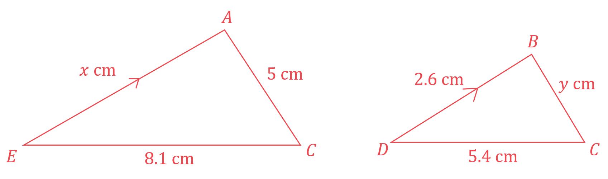

> *Form an equation using the two known sides of the triangle.*

`table row cell C E space end cell equals cell space k C D end cell end table`

> *Substitute the values of *$CE$* and *$CD$* into the equation and solve to find *$k$*.*

`table row cell 8.1 space end cell equals cell space 5.4 k end cell row cell k space end cell equals cell space fraction numerator 8.1 over denominator 5.4 end fraction space equals space 3 over 2 end cell end table`

**[1]**

> *Substitute into *`table row cell A E space end cell equals cell space k B D end cell end table`*.*

`table row cell A E space end cell equals cell space k B D end cell row cell x space end cell equals cell space left parenthesis 3 over 2 right parenthesis open parentheses 2.6 close parentheses end cell end table`

$AE=3.9$** cm**** ****[1]**

### 5((b)) — 2 marks
> *Add the new information to the diagram.*

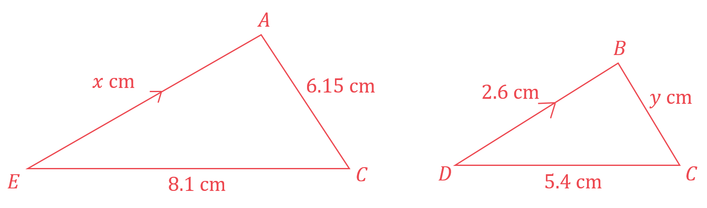

> *Find *`table attributes columnalign right center left columnspacing 0px end attributes row blank blank cell B C end cell end table`* by substituting *`table row cell k space end cell equals cell space 3 over 2 end cell end table`* into *`table row cell A C space end cell equals cell space k B C end cell end table`*.*

`table row cell A C space end cell equals cell space k B C end cell row cell 6.15 space end cell equals cell space left parenthesis 3 over 2 right parenthesis B C end cell end table`

> *Solve to find *`B C space open parentheses space equals space y close parentheses`*.*

`table row cell 6.15 space end cell equals cell space fraction numerator space 3 y over denominator 2 end fraction end cell row cell y space end cell equals cell space fraction numerator 2 open parentheses 6.15 close parentheses over denominator 3 end fraction space equals space 4.1 end cell end table`

**[1]**

> $AB=AC-BC$*. Substitute the values of*$AC$* and*$BC$* in.*

`table row cell A B space end cell equals cell space A C space minus space B C space equals space 6.15 space minus space 4.1 end cell end table`

$AB=2.05$** cm ****[1]**

## Q8 — easy — 3 marks · exam-questions

### 14() — 3 marks
> *The key here is to spot that the two triangles are similar.*

> *Similar triangles have three equal angles so look at the angles.*

> *Both triangles have a right angle and share the angle **ABD**, this means that the third angle in the triangles must also be equal.*

> *It may help to draw the two triangles out separately next to each other.*

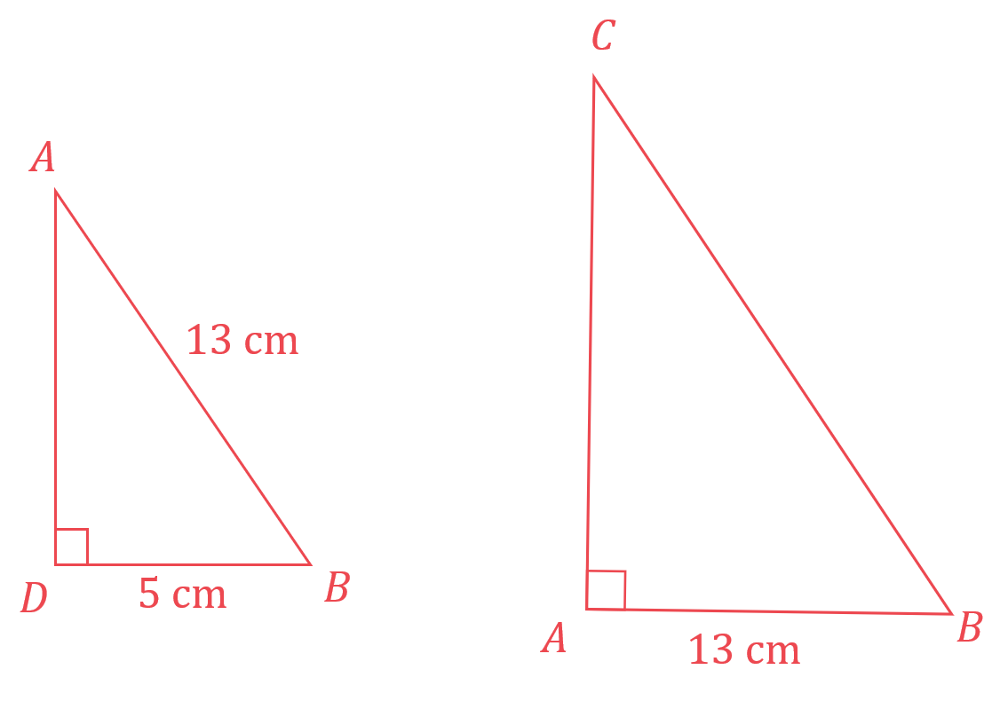

> *As the triangles are similar, there will exist a value of **k **such that*
* *`table row cell A B space end cell equals cell space k B D end cell end table`* and *`table row cell B C space end cell equals cell space k A B end cell end table`*. *
$k$* **is known as the scale factor.*

> *Form an equation using the two known sides of the triangle.*

`table row cell A B space end cell equals cell space k B D end cell row cell 13 space end cell equals cell space 5 k end cell end table`

**[1]**

> *Solve to find *$k$*.*

`table row cell k space end cell equals cell space 13 over 5 end cell end table`

> *Substitute into *`table row cell B C space end cell equals cell space k A B end cell end table`*.*

`table row cell B C space end cell equals cell space 13 over 5 open parentheses 13 close parentheses space equals space 169 over 5 end cell end table`

**[1]**

$BC=33.8$** cm**** ****[1]**

## Q9 — very_hard — 5 marks · exam-questions

### 23() — 5 marks
> *We have two similar triangles; a small triangle formed by the horizontal strut and the portion of step ladder above it, and a large triangle formed by the whole step ladder with the ground.*

> *We can label the height and the slant height of the small triangle as **H **and **L** respectively. On the diagram below, **h** is divided in the ratio 2 : 1 (because "the strut is one third of the way up the ladder");*

> *If **H** is the vertical height of the small triangle formed by the horizontal strut and the ladder above it, then **H** : **h** is in the ratio 2 : 3, or  *$H=\frac{2}{3}h$*.*

> *Therefore the scale factor, **k**, between the big triangle and the small triangle is *

$k=\frac{2}{3}$

> *From this we can calculate **L**, the slant height of the small triangle.*

$L=141\times\frac{2}{3}=94\mathrm{cm}$

**[1]**

> *We can form a right-angle triangle in the small triangle, where the base is half of the 48 cm strut length:*

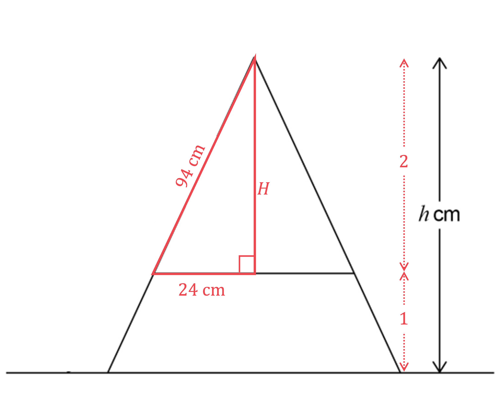

**connecting 94 and 24 in a right-angle triangle**** [1]**

> *We can find **H** using Pythagoras' Theorem*

`table row H equals cell square root of 94 squared minus 24 squared end root end cell row blank equals cell 90.88455214... end cell end table`

**[1]**

> *It is best to store this value in your calculator- but if you round it, round to at least 4 significant figures to preserve accuracy,*

> *We can connect this value for **H** with **h** using the scale factor.*

`table attributes columnalign right center left columnspacing 0px end attributes row cell 90.88455214... end cell equals cell 2 over 3 h end cell end table`

> *Divide both sides by *$\frac{2}{3}$* to find **h**.*

`table row h equals cell 90.88455214... divided by 2 over 3 end cell end table`

**[1]**

`table row blank equals cell 136.3268132... end cell end table`

> *As no level of accuracy is specified in the question, round your answer to a sensible level of accuracy- as a general rule, at least 3 significant figures but here we will use 1 decimal place.*

**Answer = 136.3 cm (1 d.p.)**** ****[1]**

## Q10 — hard — 3 marks · exam-questions

### 13() — 3 marks
> *The two rectangles are mathematically similar so there will exist a scale factor which can be used to find the length of one of the rectangles, given the length of the other.*

> *Let the scale factor be **k**.*

> *It will help to draw the two rectangles out side by side, with the length and the width of each in the same direction.*

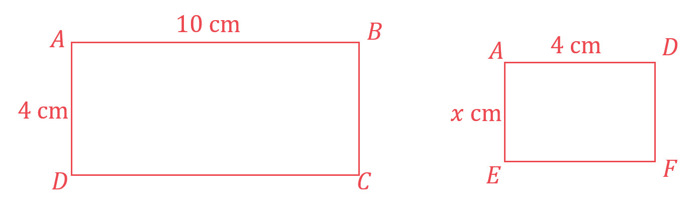

> *Form an equation using the two known sides, these are the two lengths (longer sides).*

`table row cell L e n g t h open parentheses A B C D close parentheses space end cell equals cell space k open parentheses L e n g t h open parentheses A D E F close parentheses close parentheses end cell row cell 10 space end cell equals cell space 4 k end cell end table`

> *Solve to find *$k$*.*

`table row cell 4 k space end cell equals cell space 10 end cell row cell k space end cell equals cell space 10 over 4 end cell end table`

**[1]**

> *Form an equation for the width of the two rectangles.*

`table row cell W i d t h open parentheses A B C D close parentheses space end cell equals cell space k open parentheses W i d t h open parentheses A D E F close parentheses close parentheses end cell row cell 4 space end cell equals cell space k x end cell end table`

> *Substitute *$k=\frac{10}{4}$* to find the width of the smaller rectangle*

`table row cell 4 space end cell equals cell 10 over 4 x end cell row cell 10 x space end cell equals cell space 16 end cell row cell x space end cell equals cell space 16 over 10 space equals space 1.6 end cell end table`

> *Find the area of rectangle **DAEF.*

`table row cell A r e a space end cell equals cell space l e n g t h space cross times space w i d t h space end cell row blank equals cell space 4 space cross times space 1.6 end cell end table`

**[1]**

**Area = 6.4 cm****2**** ****[1]**

## Q11 — medium — 3 marks · exam-questions

### 7() — 3 marks
> *The height of model **A** and the height of model **B** are corresponding lengths in similar shapes so find **k, **the scale factor, using**  *`table attributes columnalign right center left columnspacing 0px end attributes row k equals cell space fraction numerator second space corresponding space length over denominator first space corresponding space length end fraction end cell end table`

> *Method 1*

> *The height of model **B** is smaller than the height of model **A**. **To go from the big shape to the small shape, put the small length on top in the fraction so that **k** will be smaller than 1*

`table row cell k space end cell equals cell fraction numerator height space bold B over denominator height space bold A end fraction equals space 147 over 187 end cell end table`

**[1]**

> *Find the height of model **B** by multiplying the height of model **A** by **k **(notice that **k** < 1 so multiplying by **k** will make the length smaller)*

`table row cell height space bold B end cell equals cell space k open square brackets height space bold A close square brackets space equals space 147 over 187 cross times 90 end cell end table`

**[1]**

`table row blank equals cell space 70.7486631... end cell end table`

> *This answer is already in centimetres but give the final answer to the nearest centimetre as requested in the question*

**71 cm**** ****[1]**

> *Method 2*

> *Finding **k **using**  *`table attributes columnalign right center left columnspacing 0px end attributes row k equals cell space fraction numerator second space corresponding space length over denominator first space corresponding space length end fraction end cell end table`*, if you put the larger length on top of the fraction then;*

`table row cell k space end cell equals cell fraction numerator height space bold A over denominator height space bold B end fraction equals space 187 over 147 space end cell end table`

> *Notice that **k** > 1 so multiplying by **k** will make the length bigger- but in going from the height of model **A** to the height of model of **B**, we want to go from a longer length to a smaller length. So divide by **k **instead*

`table row cell height space bold B space end cell equals cell space height space bold A divided by k equals space 90 divided by 187 over 147 end cell end table`

**[1]**

`table row blank equals cell space 70.7486631... end cell end table`

> *This answer is already in centimetres but give the final answer to the nearest centimetre as requested in the question*

**71 cm ****[1]**

## Q12 — easy — 3 marks · exam-questions

### 3((a)) — 2 marks
> *QR** and **BC** are corresponding lengths in similar shapes so find **k, **the scale factor, using**  *`table attributes columnalign right center left columnspacing 0px end attributes row k equals cell space fraction numerator second space corresponding space length over denominator first space corresponding space length end fraction end cell end table`

> *Method 1*

> *BC** is smaller than **QR. **To go from the big shape to the small shape, put the small length on top in the fraction so that **k** will be smaller than 1*

`table attributes columnalign right center left columnspacing 0px end attributes row cell k space end cell equals cell fraction numerator A B over denominator P Q end fraction equals space 4 over 12 space equals space 1 third end cell end table`

**[1]**

> *Find **BC** by multiplying **QR** by **k **(notice that **k** < 1 so multiplying by **k** will make the length smaller)*

`table row cell B C space end cell equals cell space k Q R space equals space 1 third cross times 16.5 end cell end table`

$BC=5.5$** cm**** ****[1]**

> *Method 2 *
*Finding **k** using *`table row k equals cell space fraction numerator second space corresponding space length over denominator first space corresponding space length end fraction comma end cell end table`* if you put the larger length on top in the fraction then;*

`table row cell k space end cell equals cell fraction numerator P Q over denominator A B end fraction equals space 12 over 4 space equals space 3 end cell end table`

**[1]**

> *Notice that **k** > 1 so multiplying by **k** will make the length bigger- but in going from **QR **to **BC, **we want to go from a longer length to a smaller length. So divide by **k** instead*

`table row cell B C space end cell equals cell space Q R divided by k space end cell row blank equals cell space 16.5 divided by 3 end cell end table`

$BC=5.5$** cm**** ****[1]**

### 3((b)) — 1 marks
> *From part (a) we know that [a small corresponding side] =  *`table row blank blank cell 1 third cross times end cell end table`*[a large corresponding side]*

> *y is a larger side. Inversing the above, we know that [a large corresponding side = 3 × [a small corresponding side]*

`table row cell P R space end cell equals cell 3 cross times A C end cell end table`

> *Replacing **AC** with **x** and **PR** with **y**,*

`table row cell y space end cell equals cell 3 x end cell end table`

> *The question asks for an expression so only the "3**x**" is needed*

$3x$** ****[1]**

## Q13 — very_hard — 5 marks · exam-questions

### 13() — 5 marks
> $AD$* is a diameter so the radius is half of *$AD$* Angle *$ACD$* is 90° because it is the angle in a semi-circle*

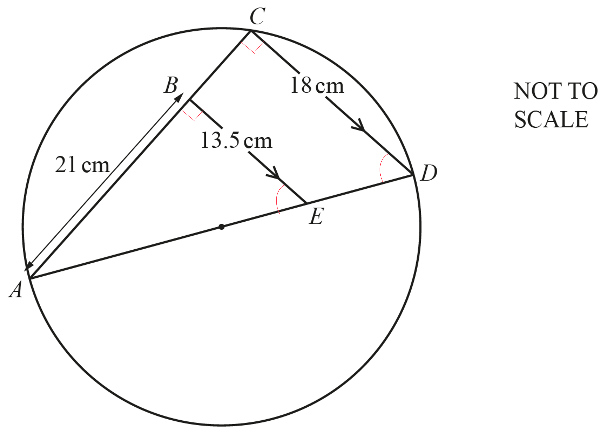

> *Therefore *$AD$* is the hypotenuse of right-angle triangle *$ACD$*. We can use Pythagoras' theorem to find *$AD$* but we need to find *$AC$* first*

> *Triangle *$ABE$* and triangle *$ACD$* are similar, and the scale factor is:*

$\frac{\mathrm{equivalent} \mathrm{longer} \mathrm{side}}{\mathrm{equivalent} \mathrm{shorter} \mathrm{side}}=\frac{CD}{BE}=\frac{18}{13.5}$

**[1]**

> *Multiplying the length of *$AB$* by the scale factor gives *$AC$

$AC=21\times\frac{18}{13.5}=28$

**[1]**

> *Now we can use Pythagoras' theorem *$a^{2}+b^{2}=c^{2}$

$28^{2}+18^{2}=AD^{2}$

**[1]**

> *Rearrange to get *$AD$

`table row cell A D end cell equals cell square root of 28 squared plus 18 squared end root end cell row blank equals cell space 33.28663395 end cell end table`

**[1]**

> *The radius is half of *$AD$

`table row r equals cell space open parentheses 33.28663395... close parentheses divided by 2 end cell row blank equals cell 16.64331698... end cell end table`

> *Round the answer to at least 3 significant figures*

**16.6 cm**** ****[1]**

## Q14 — hard — 5 marks · exam-questions

### 15((a)) — 2 marks
> *Calculate the area of the trapezium **QRST**, using the formula: *`A equals 1 half open parentheses a plus b close parentheses h`*, where *$a$* and *$b$* are the lengths of the parallel lines and *$h$* is the perpendicular height.*

`table row A equals cell 1 half open parentheses 4 plus 12 close parentheses cross times 10 end cell end table`

**[1]**

$80\mathrm{cm}^{2}$ **[1]**

### 15((b)) — 3 marks
> *Triangles **PRS**  and **PQT**  are similar.*

> *Compare the length of **RS** and **QT**  to find the length scale factor (LSF).*

$LSF=\frac{12}{4}=3$

**[1]**

> *Divide the length **PS** by the LSF to find the length **PT**.*

*Let ***PT*** =*$x$*, so ***PS*** = *$x+10$

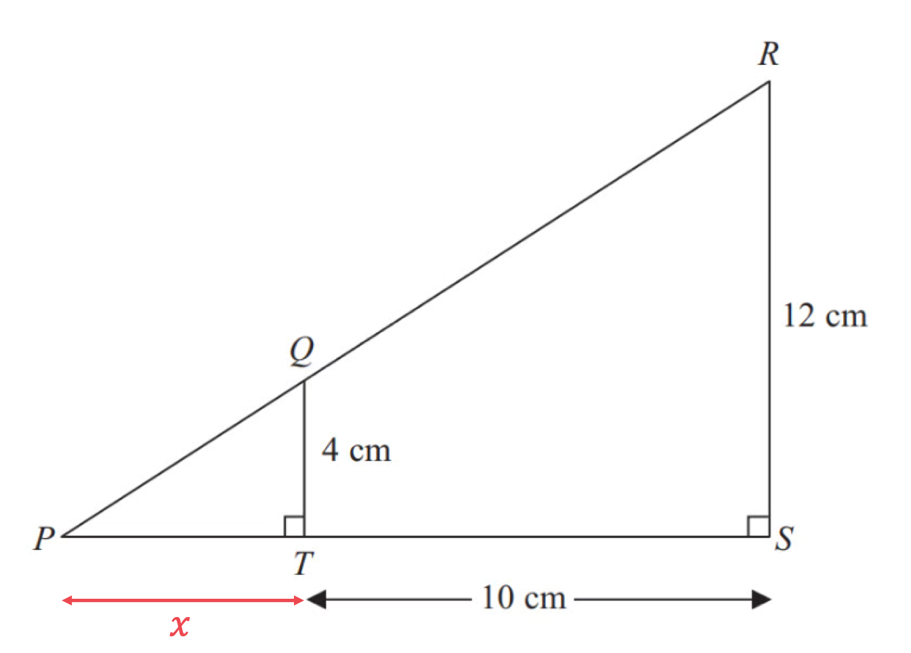

`fraction numerator open parentheses x plus 10 close parentheses over denominator 3 end fraction equals x`

**[1]**

> *Multiply both sides by 3.*

$x+10=3x$

> *Subtract 10 from both sides.*

$10=2x$

> *Divide both sides by 2.*

$5=x$

**5 cm**** ****[1]**

## Q15 — medium — 2 marks · exam-questions

### 18() — 2 marks
> *This is an example of **intersecting chord theorem** therefore *$PD\timesPC=PB\timesPA$

$PD\times8=6\times9$

**[1]**

> *Find **PD** by dividing both sides by 8*

$PD=\frac{6\times9}{8}$

**PD**** = 6.75 cm**** ****[1]**

## Q16 — easy — 4 marks · exam-questions

### 4((a)) — 2 marks
> *AB **and** DE** are corresponding lengths in similar shapes so we need to find **k, **the scale factor, using**  *`table attributes columnalign right center left columnspacing 0px end attributes row k equals cell space fraction numerator second space corresponding space length over denominator first space corresponding space length end fraction end cell end table`

> *Method 1*

> *AB i**s larger than** DE. **To go from the small shape to the big shape, put the big length on top of the fraction so that **k** will be bigger than 1*

`table row cell k space end cell equals cell fraction numerator A C over denominator D F end fraction equals space 45 over 20 space equals fraction numerator space 9 over denominator 4 end fraction end cell end table`

**[1]**

> *Find **AB** by multiplying **DE** by **k **(notice that **k**  > 1 so multiplying by **k** will make the length bigger as required)*

`table row cell A B end cell equals cell space k D E space equals space 9 over 4 cross times 36 end cell end table`

**AB ****= 81 cm**** ****[1]**

> *Method 2 *

> *Finding **k** using *`table attributes columnalign right center left columnspacing 0px end attributes row k equals cell space fraction numerator second space corresponding space length over denominator first space corresponding space length end fraction comma end cell end table`* if you put the smaller length on top in the fraction then;*

`table row cell k space end cell equals cell fraction numerator D F over denominator A C end fraction equals space 20 over 45 space equals space 4 over 9 end cell end table`

**[1]**

> *Notice that **k** < 1 so multiplying by **k** will make the length smaller- but in going from **DE **to **AB**, we want to go from a smaller length to a larger length. So divide by **k** instead*

`table row cell A B space end cell equals cell space D E divided by k space end cell row blank equals cell space 36 divided by 4 over 9 end cell end table`

**AB ****= 81 cm ****[1]**

### 4((b)) — 2 marks
> *BC ** and **EF** are corresponding lengths in similar shapes so use the value of **k **your found in part (a) with **BC** = 54 to find **EF*

> *Method 1*

> *If your **k** was *`table attributes columnalign right center left columnspacing 0px end attributes row blank blank cell 4 over 9 end cell end table`* then **k** < 1 and multiplying **BC** by **k** will make the length smaller as required*

`table row cell E F end cell equals cell k B C equals 4 over 9 cross times 54 end cell end table`

**EF ****= 24 cm ****[1]**

> *Method 2*

> *If your **k** was *`table row blank blank cell 9 over 4 end cell end table`* then **k** > 1 and multiplying **BC** by **k** will make the length larger, not smaller as required. So divide by **k** instead*

`table row cell E F end cell equals cell B C divided by k equals 54 divided by 9 over 4 end cell end table`

**EF ****= 24 cm ****[1]**

## Q17 — very_hard — 5 marks · exam-questions

### 8((c)) — 3 marks
> *Similar triangles have three equal angles. Use circle theorems to identify any corresponding angles that are equal between triangles **ADX**  and **BCX**.*

> *The same segment circle theorem states that angles at the circumference subtended by the same arc are equal.*

> *Vertically opposite angles at a point are equal.*

> *The statement that if three corresponding angles between two triangles are equal then the two triangles are similar must be made.*

**Angle ****ADX****  = angle ****BCX****  as they are subtended from the same arc. **
**Angle ****DAX****  = angle ****CBX****  as they are subtended from the same arc. Angle ****AXD****  = angle ****BXC****  as they are vertically opposite angles.**** **
** A****t least two of the three statements given, with reasons ****[2]**** **
**All three angles are the same so the triangles are similar.***** ***** ****Explanation of similar triangles ****[1]**

### 8((c)) — 2 marks
> *The two triangles are similar so there will exist a value of **k **such that each side of triangle **ADX** = **k**  **× each side of triangle **BCX. *

> *It may help to draw the triangles side by side and consider their corresponding sides.*

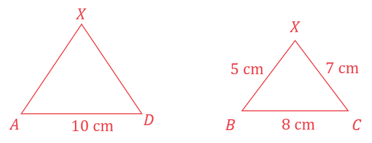

> *Form an equation using two corresponding sides that are known.*

`table row cell A D space end cell equals cell space space k B C end cell row cell 10 space end cell equals cell space k space cross times space 8 end cell end table`

> *Solve to find *$k$*.*

`table row cell k space end cell equals cell fraction numerator space 10 space over denominator 8 end fraction equals 1.25 end cell end table`

*Form an equation using the side that you want, this value of *`table row blank blank k end table` *and a corresponding side that is known.  *

`table row cell D X space end cell equals cell space space k C X end cell row cell D X space end cell equals cell space 1.25 space cross times space 7 end cell end table`** **

**Correct method ****[1]**
** **$DX=8.75$** cm**** ****[1]**

## Q18 — hard — 3 marks · exam-questions

### 19() — 3 marks
> *"**PTQ** is the diameter", so **TP **and **TQ** are two parts of the diameter. We know **TQ **and we can find **TP** using the **intersecting chord theorem,** *$TP\timesTQ=TR\timesTS$

$TP\times3=12\times4$

> *Find **TP** by dividing both sides by 3*

`table attributes columnalign right center left columnspacing 0px end attributes row cell T P end cell equals cell fraction numerator 12 cross times 4 over denominator 3 end fraction equals 16 end cell end table`

**[1]**

*Now find the diameter by adding* *TP **and **TQ*

*diameter =*** TP ***+ ***TQ ***= 16 + 3 = 19*

> *Finally, find the radius by dividing the diameter by 2*

*radius = 19 ÷ 2*

*** *****[1]**

**radius = 9.5 cm****  [1]**

## Q19 — medium — 1 marks · exam-questions

### 22() — 1 marks
> *QR **and **PR **are corresponding sides in triangles **QRS **and **PRT** respectively. Connecting all three pairs of corresponding sides in this way we would have;*

$\frac{\mathrm{smaller} \mathrm{corresponding} \mathrm{side}}{\mathrm{larger} \mathrm{corresponding} \mathrm{side}}=\frac{QR}{PR}=\frac{SR}{TR}=\frac{QS}{PT}$

> $\frac{SR}{TR}$* is not given as an option but *$\frac{QS}{PT}$* is.*

**The top right option is correct, **$\frac{QS}{PT}$ **[1]**

> *The top left option, *$\frac{RS}{ST}$*, is incorrect as **ST** is not a complete side in the larger similar triangle.*

> *The bottom two options, *$\frac{PT}{QS}$* and *$\frac{RT}{RS}$*are not correct as they both represent *$\frac{\mathrm{larger} \mathrm{corresponding} \mathrm{side}}{\mathrm{smaller} \mathrm{corresponding} \mathrm{side}}$*- but the given ratio was *$\frac{\mathrm{smaller}}{\mathrm{larger}}$*.*

## Q20 — easy — 2 marks · exam-questions

### 6((b)) — 2 marks
> *The radius of **A** and the radius of **B** are corresponding lengths in similar shapes so find **k, **the scale factor, using**  *`table attributes columnalign right center left columnspacing 0px end attributes row k equals cell space fraction numerator second space corresponding space length over denominator first space corresponding space length end fraction end cell end table`

> *Method 1*

> *The radius of **B** is smaller than the radius of **A**. **To go from the big shape to the small shape, put the small length on top in the fraction so that **k** will be smaller than 1*

`table row cell k space end cell equals cell fraction numerator height space bold B over denominator height space bold A end fraction equals space fraction numerator 0.6 over denominator 1.6 end fraction space equals space 3 over 8 end cell end table`

**[1]**

> *Find radius of **B** by multiplying the radius of **A** by **k **(notice that **k** < 1 so multiplying by **k** will make the length smaller)*

`table row cell radius space bold B end cell equals cell space k open square brackets radius space bold A close square brackets space equals space 3 over 8 cross times 0.56 end cell end table`

**0.21 m**** ****[1]**

> *Method 2*

> *Finding **k **using**  *`table attributes columnalign right center left columnspacing 0px end attributes row k equals cell space fraction numerator second space corresponding space length over denominator first space corresponding space length end fraction end cell end table`*, if you put the larger length on top of the fraction then;*

`table row cell k space end cell equals cell fraction numerator height space bold A over denominator height space bold B end fraction equals space fraction numerator 1.6 over denominator 0.6 end fraction space equals space 8 over 3 end cell end table`

> *Notice that **k** > 1 so multiplying by **k** will make the length bigger- but in going from the radius of **A** to the radius of **B**, we want to go from a longer length to a smaller length. So divide by **k **instead*

`table row cell radius space bold B space end cell equals cell space radius space bold A divided by k equals space 0.56 divided by 3 over 8 end cell end table`

**0.21 m ****[1]**

## Q21 — very_hard — 6 marks · exam-questions

### 10((b)) — 2 marks
> *Find the volume of the cone by substituting *$r=10$* and *$h=36$* into the formula *

$\frac{1}{3}\timesπ\times10^{2}\times36$

**[1]**

> *Work out the value on your calculator, giving your answer to 3 significant figures*

**3770 cm****3** **[1]**

### 10((b)) — 4 marks
> *Find the volume of the smaller cone by halving the volume of the bigger cone in part (b)(i) *

$\frac{1}{2}\times3770=1885$* cm**3*

**[1]**

*Method 1* 
*The ratio of radii (lengths) is 1 : 2 so the ratio of volumes is 1**3** : 2**3* *Split this volume up into the ratio 1 : 8 (by finding *$\frac{1}{9}$* of it and *$\frac{8}{9}$* of it*

> $\frac{1}{9}\times1885:\frac{8}{9}\times1885\,$* *

*The volume of the smaller sphere is *$\frac{1}{9}\times1885$ 
*Form an equation in *$r$* by setting the sphere volume formula equal to *$\frac{1}{9}\times1885$ * *

$\frac{4}{3}πr^{3}=\frac{1}{9}\times1885$

**[2]**

> *Get *$r^{3}$* on its own (by dividing both sides by *$\frac{4}{3}π$

> $r^{3}=\frac{\frac{1}{9}\times1885}{\frac{4}{3}π}\,$* *

> *Find *$r$* (by cube-rooting both sides*

`r equals cube root of fraction numerator 1 over 9 cross times 1885 over denominator 4 over 3 straight pi end fraction end root
`

**3.68 cm*** ***[1]**

*Method 2* 
*The ratio of radii is 1: 2 so write the smaller sphere radius as *$r$* and the bigger sphere radius as *$2r$ 
*Form an equation in *$r$* (the sum of the volumes of the two spheres equals *$1885$*)* * *

`4 over 3 straight pi r cubed plus 4 over 3 straight pi open parentheses 2 r close parentheses cubed equals 1885`

**[1]**

*Collect like terms, using *`open parentheses 2 r close parentheses cubed equals 8 r cubed` * *

$\frac{4}{3}πr^{3}+\frac{4}{3}π\times8r^{3}=1885\,\frac{36}{3}πr^{3}=1885\,12πr^{3}=1885$ * *

*Find *$r$* (by dividing both sides by *$12π$* then cube-rooting)*

`r equals cube root of fraction numerator 1885 over denominator 12 straight pi end fraction end root`

**[1]** 
**3.68 cm ****[1]**

## Q22 — hard — 3 marks · exam-questions

### 19() — 3 marks
> *Write down an expression for the angles around the point at which the triangle and the trapezium connect.*

$a+65+c+115=360$  *(Angles around a point are equal to 360**o**)*

**[1]**

> *Simplify.*

$a+c=180$

**[1]**

> *Write down an expression for angles *$b$*and *$c$*.*

$b+c=180$*  **(Co-interior angles sum to 180**o** )*

> *Equate the two angle expressions as both are equal to 180.*

$a+c=b+c$

> *Subtract *$c$* from both sides.*

$a=b$

**Both correct reasons given*** ***[1]**

## Q23 — medium — 3 marks · exam-questions

### 21() — 3 marks
> *Find an expression for angle **BAC**.*

*Angle ***BAC*** = Angle ***CBQ*** = *$x$** ***(Alternate segment theorem)*

**[1]**

> *Find an expression for angle **ABC**.*

*Angle ***ABC*** = Angle ***CBQ ***= *$x$* (Because ***BC***  bisects angle ***ABQ***)*

**[1]**

> *Identify the type of triangle that triangle **ABC** is based on its properties.*

**Angle ****BAC**** = Angle ****ABC**** , so triangle ****ABC****  is an isosceles triangle, therefore AC=BC ****[1]**

## Q24 — easy — 4 marks · exam-questions

### 6((a)) — 2 marks
> *Find the length scale factor by dividing the length **DE**  on the larger triangle by the corresponding length **AB**  on the smaller triangle.*

$\mathrm{length} \mathrm{scale} \mathrm{factor}=\frac{15}{6}=2.5$

**[1]**

> *Work out the length **DF**  on the larger triangle by multiplying the corresponding length **AC** on the smaller triangle by the length scale factor.*

$4.2\times2.5$

**10.5 cm**** ****[1]**

### 6((b)) — 2 marks
> *Find the length of **BC  **on the smaller triangle by dividing the corresponding length **EF**  on the larger triangle by the length scale factor.*

$19.5\div\frac{5}{2}$

**[1]**

**7.8 cm**** [1]**

## Q25 — hard — 5 marks · exam-questions

### 12() — 5 marks
> *Calculate the length of side QS on triangle QRS. *
*Use Pythagoras' theorem, *$c^{2}=a^{2}+b^{2}$*, where *$a$* and *$b$* are the lengths of the two shorter sides and *$c$* is the length of the hypotenuse.*

`table row cell Q S squared end cell equals cell 4 squared plus 8 squared end cell end table`

**[1]**

$QS=\sqrt{4^{2}+8^{2}}$

**[1]**

`table row cell Q S end cell equals cell square root of 80 end cell row cell Q S end cell equals cell square root of 16 cross times 5 end root end cell row cell Q S end cell equals cell 4 square root of 5 end cell end table`

> *Now that you know the length QS you can use Pythagoras' theorem again to calculate the length QP on triangle PQS.*

`table attributes columnalign right center left columnspacing 0px end attributes row cell 10 squared end cell equals cell Q P squared plus open parentheses 4 square root of 5 close parentheses squared end cell row cell 10 squared minus open parentheses 4 square root of 5 close parentheses squared end cell equals cell Q P squared end cell row cell square root of 10 squared minus open parentheses 4 square root of 5 close parentheses squared end root end cell equals cell Q P end cell row cell square root of 100 minus 80 end root end cell equals cell Q P end cell row cell square root of 20 end cell equals cell Q P end cell row cell 2 square root of 5 end cell equals cell Q P end cell end table`

> *Compare the ratios of the lengths of two pairs of corresponding sides.*

`table row cell fraction numerator Q R over denominator Q P end fraction end cell equals cell fraction numerator R S over denominator Q S end fraction end cell row cell fraction numerator 4 over denominator 2 square root of 5 end fraction end cell equals cell fraction numerator 8 over denominator 4 square root of 5 end fraction end cell end table`

> *Cancel common factors in each fraction.*

$\frac{2}{\sqrt{5}}=\frac{2}{\sqrt{5}}$

**[1]**

> *These two pairs of corresponding sides have the same ratio, compare this ratio to the third pair of corresponding sides.*

`table row cell fraction numerator Q R over denominator Q P end fraction end cell equals cell fraction numerator Q S over denominator P S end fraction end cell row cell fraction numerator 2 over denominator square root of 5 end fraction end cell equals cell fraction numerator 4 square root of 5 over denominator 10 end fraction end cell end table`

> *Simplify the fraction on the right hand side.*

$\frac{2}{\sqrt{5}}=\frac{2\sqrt{5}}{5}$

> *Rationalise the denominator of the first fraction by multiplying by *$\frac{\sqrt{5}}{\sqrt{5}}$*.*

$\frac{2\sqrt{5}}{\sqrt{5}\sqrt{5}}=\frac{2\sqrt{5}}{5}$

> *Simplify.*

$\frac{2\sqrt{5}}{5}=\frac{2\sqrt{5}}{5}$

**[1]**

**Triangles QRS and PQS are similar because they have three pairs of corresponding sides with the same ratio ****[1]**

## Q26 — medium — 5 marks · exam-questions

### 9((a)) — 2 marks
**Angle DCE = **$a^{\circ}$** because it is ****corresponding to angle BAC ****[1]**

### 9((b)) — 3 marks
> *Look for other angles that you can find using the parallel lines.*

*Angle BCD = *$b^{\circ}$* because it is alternate to angle ABC*

**Correctly identifying**** ****b****° [1]*** *
**Correct reason**** [1]**

> *Look at the angles at point C that form a straight line. They are the same three angles as the interior angles in the triangle.*

$a^{\circ}+b^{\circ}+c^{\circ}=180^{\circ}$* because angles that form a straight line add up to 180°*

**Therefore the angles in a triangle add up to 180° **** [1]**

## Q27 — easy — 2 marks · exam-questions

### 4((a)) — 2 marks
> *Find the length scale factor by dividing the length **EF**  on the larger triangle by the corresponding length **BC** on the smaller triangle.*

$\frac{40}{16}=2.5$

> *Work out the length of **DE**  on the larger triangle by multiplying the length of the corresponding length **AB** on the smaller triangle by the length scale factor.*

$12\times2.5$

**[1]**

**30 cm**** ****[1]**

## Q28 — hard — 2 marks · exam-questions

### 25((a)) — 2 marks
> *Add the information given in the question to the diagram as below*

> *We know that triangle *$APQ$* is similar to triangle *$ABC$* , because *`angle A P Q equals angle A B C`* (corresponding angles)*`angle A Q P equals angle A C B`* (corresponding angles) and *`angle P A Q equals angle B A C`* (shared angle), therefore*

$\frac{AP}{AB}=\frac{PQ}{BC}$

> *Replace the sides with the known lengths*

$\frac{AP}{9}=\frac{8}{10}$

**[1]**

> *Multiply both sides by 9 to solve for *$AP$

$AP=\frac{8}{10}\times9=7.2$

> *Subtract *$AP$* from *$AB$

$PB=9-7.2=1.8$

$1.8$** ****cm [****1]**

## Q29 — medium — 3 marks · exam-questions

### 14() — 3 marks
*The two triangles will be be similar if they have the same corresponding angles.* *Show that this is the case using angle facts in parallel lines.*

*Angle BAE = Angle EDC  (alternate angles)*

*Angle ABE = Angle ECD  (alternate angles)*

*Angle AEB = Angle CED (vertically opposite angles)*

**1 pair of angles with a correct statement ****[1]** 
**2 pairs of angles with correct statements**** [1]**

**Final answer:** **Triangle ABE and triangle CDE are similar as corresponding angles are equal**** [1]**

**The answer mark can be awarded only if no incorrect statements are seen**

## Q30 — easy — 2 marks · exam-questions

### 9() — 2 marks
> *We are told that the triangles are similar so use corresponding lengths to calculate the scale factor, **k. *$k=\frac{\mathrm{second} \mathrm{corresponding} \mathrm{length}}{\mathrm{first} \mathrm{corresponding} \mathrm{length}}$*. Taking the left triangle as the first one, and the right triangle as the second, *

$k=\frac{16}{20}=\frac{4}{5}$

**[1]**

> *Notice that **k** < 1 so multiplying by **k** will make a length smaller. Going from the first triangle to the second, the lengths get smaller (20 cm to 16 cm). So to get **a**, **multiply** 12 cm by **k**.*

`table row a equals cell 12 cross times 4 over 5 end cell row blank equals cell 48 over 5 end cell end table`

**Answer = **$\frac{48}{5}$**or **$9.6$** cm ****[1] **
**Always check to see whether you should be making a length bigger or smaller and whether your answer matches this**

## Q31 — medium — 5 marks · exam-questions

### 9((a)) — 3 marks
> *Method 1:*

> *Two similar triangles are formed, one between the girl and the ruler and the other between the girl and the tree.*

> * *

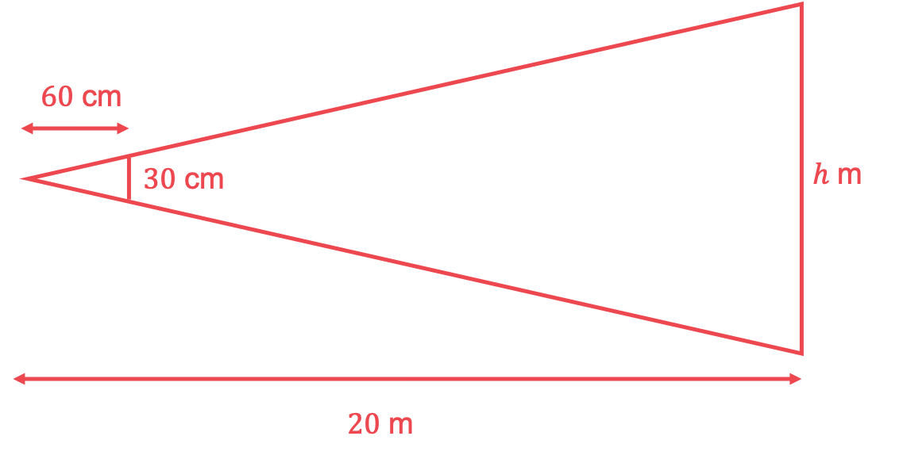

> *Find the ratio between the height of the ruler and its distance from the girl.*

$\frac{30}{60}=0.5$

**[1]**

> *The ratio of the height of the tree and its distance from the girl must be the same so compare the two values.*

$\frac{h}{20}=0.5$

> *Multiply the distance of the tree from the girl by the scale factor of 0.5 to find the height of the tree. *

$h=0.5\times20$

**[1]**

**10 m ****[1]**

> * *

> *Method 2:*

> *Two similar triangles are formed, one between the girl and the ruler and the other between the girl and the tree.*

> *Convert the distance between the girl and the tree from metres to centimetres by multiplying the distance by 100 and sketch a labelled diagram.*

$20\times100=2000$

> * *

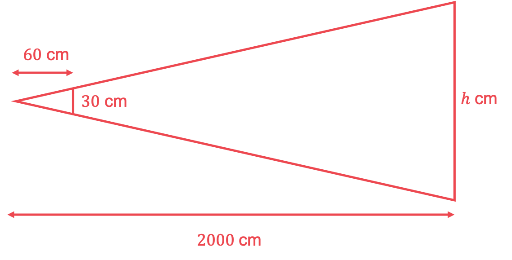

> *Compare the horizontal distance between the tree and the girl to find the length scale factor.*

$\frac{2000}{60}=\frac{100}{3}$

**[1]**

> *Multiply the length of the ruler by the length scale factor to find the height of the tree.*

$30\times\frac{100}{3}=1000$

**[1]**

> *Convert the height of the tree from centimetres to metres by dividing by 100.*

$\frac{1000}{100}$

**10 m ****[1]**

### 9((b)) — 2 marks
> *Give any two valid reasons.*

**She would have to stand a very long distance from the building**** [1]**

**Final answer:** **The estimate is likely to be inaccurate due to the scale factors at the distances involved**** [1]**

## Q32 — easy — 1 marks · exam-questions

### 1() — 1 marks
> *The triangles are similar as in both triangles the angles are 90°, *$x$*°** **and** *`open parentheses 90 minus x close parentheses`*°, so we have AAA. *
*The scale factor is *$k=\frac{\mathrm{second} \mathrm{corresponding} \mathrm{length}}{\mathrm{first} \mathrm{corresponding} \mathrm{length}}$*. Taking the left triangle as the first one, and the right triangle as the second, *

$k=\frac{15}{10}=\frac{3}{2}\mathrm{or}1.5$

> *So the lengths in the triangle on the right are 1.5 times as big as the lengths in the triangle on the left. So *$y$* is 1.5 times bigger than 6 cm*

`table row y equals cell 6 cross times 1.5 end cell row blank equals 9 end table`

**The third option is correct, 9 cm ****[1]**

> *The first option is greater than 6 but not in the correct scale factor because *$\frac{15}{10}\neq\frac{7.5}{6}$

> *The second option is greater than 6 but not in the correct scale factor because *$\frac{15}{10}\neq\frac{11}{6}$

> *The fourth option, 4, is smaller than its corresponding length, 6. But we can clearly see that *$y$* should be greater than 6.*

## Q33 — medium — 2 marks · exam-questions

### 8((a)) — 2 marks
> *Alternate angles in parallel lines are equal*

*The triangles are similar and reflected* * *

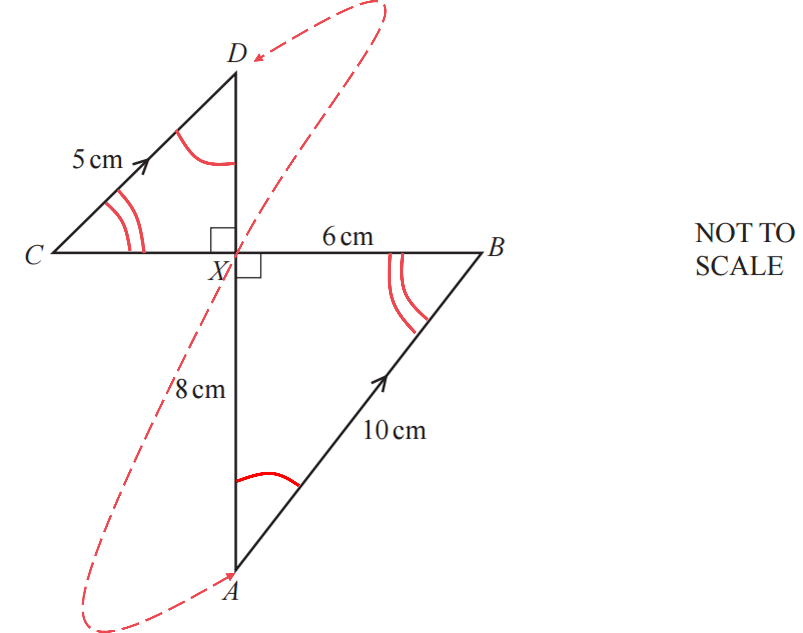

*Find the scale factor of enlargement (by dividing side **AB** by its corresponding side **CD**)* * *

*scale factor = *$\frac{10}{5}$* = 2* * *

*Find the corresponding side to **DX** (looking at the reflection)* * *

**DX*** corresponds to*** AX**

**[1]**

*AX** is a factor of 2 larger than **DX* *Find **DX** (by halving **AX**)*

**DX ***= *$\frac{8}{2}$* *

**4 cm**** [1]**

## Q34 — easy — 2 marks · exam-questions

### 12() — 2 marks
> *The triangles are similar so there will exist a value of **k **such that  *`table row cell P Q space end cell equals cell space k A B end cell end table`* and *`table attributes columnalign right center left columnspacing 0px end attributes row cell P R space end cell equals cell space k A C end cell end table`*.*

> *Form an equation using the two known sides of the triangle.*

`table row cell P R space end cell equals cell space k A C end cell end table`

> *Substitute the values of *$PR$* and *$AC$* into the equation and solve to find *$k$*.*

`table row cell 21.7 space end cell equals cell space 12.4 k end cell row cell k space end cell equals cell space fraction numerator 21.7 over denominator 12.4 end fraction space equals space 1.75 end cell end table`

**[1]**

> *Substitute into *`table row cell P Q space end cell equals cell space k A B end cell end table`*.*

`table row cell P Q space end cell equals cell space k A B end cell row cell P Q space end cell equals cell space left parenthesis 1.75 right parenthesis left parenthesis 5.2 right parenthesis end cell end table`

$PQ=9.1$** cm**** ****[1]**
