# Exam Questions — Similarity & Geometrical Proof
**Geometry** · Edexcel IGCSE Maths A (Modular) (4XMAF/4XMAH) — 24/Higher Unit 2
> Source: [https://www.savemyexams.com/igcse/maths/edexcel/a-modular/24/higher-unit-2/topic-questions/geometry/similarity-and-geometrical-proof/exam-questions/](https://www.savemyexams.com/igcse/maths/edexcel/a-modular/24/higher-unit-2/topic-questions/geometry/similarity-and-geometrical-proof/exam-questions/) · 34 questions · total 116 marks

## Q1 — very_hard — 5 marks · exam-questions

### 20() — 5 marks — command: prove — structured — from paper 2015 Spec2 · 1MA1/2H
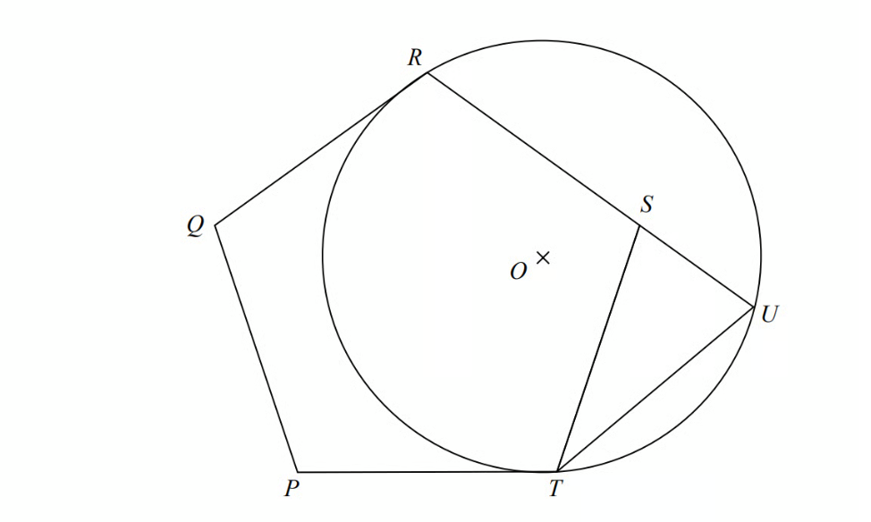

$PQRST$ is a regular pentagon. 
$R,U$ and $T$ are points on a circle, centre $O$. 
$QR$ and $PT$ are tangents to the circle. 
$RSU$ is a straight line.

Prove that $ST=UT$.

## Q2 — hard — 3 marks · exam-questions

### 15() — 3 marks — command: prove — structured — from paper 2017	June · 1MA1/2H
$A,B,C$ and $D$ are four points on the circumference of a circle.

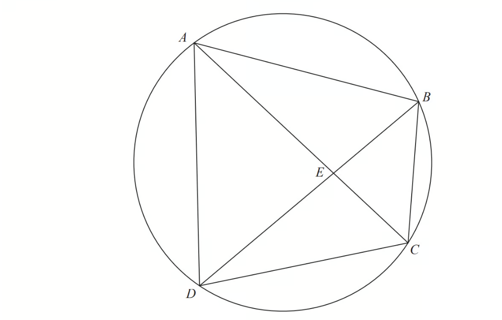

$AEC$ and $BED$ are straight lines. 
Prove that triangle $ABE$ and triangle $DCE$ are similar. 
You must give reasons for each stage of your working.

## Q3 — medium — 3 marks · exam-questions

### 21() — 3 marks — command: calculate — structured — from paper November 2016 · 1MA0/1H
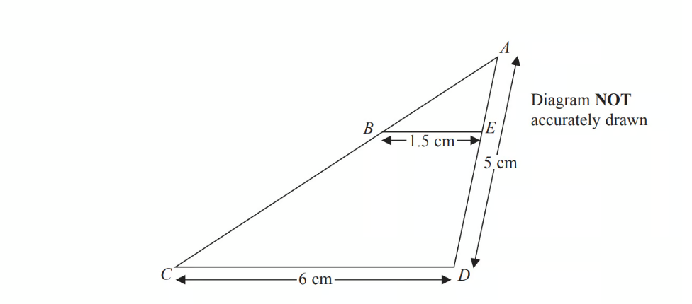

$ABC$ and $AED$ are straight lines. 
$BE$ and $CD$ are parallel

. $BE=1.5\mathrm{cm}.\,CD=6\mathrm{cm}.\,AD=5\mathrm{cm}.$

Calculate the length of $ED$.

## Q4 — easy — 4 marks · exam-questions

### 17((a)) — 2 marks — command: work_out — structured — from paper June 2014 · 1MA0/2H
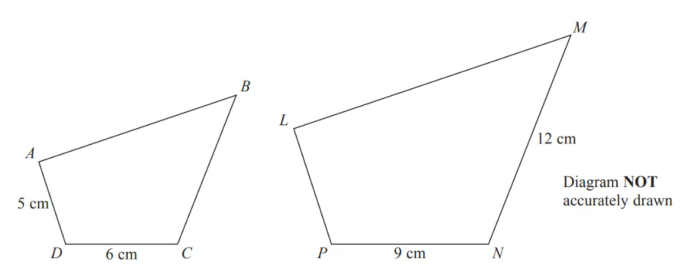

Quadrilaterals *ABCD* and *LMNP* are mathematically similar.

Angle *A* = angle *L *
Angle *B* = angle *M *
Angle *C* = angle *N* 
Angle *D* = angle *P*

Work out the length of *LP*.

### 17((b)) — 2 marks — command: work_out — structured — from paper June 2014 · 1MA0/2H
Work out the length of *BC*.

## Q5 — very_hard — 5 marks · exam-questions

### 22() — 5 marks — command: work_out — structured — from paper November 2017 · 1MA1/1H
The two triangles in the diagram are similar.

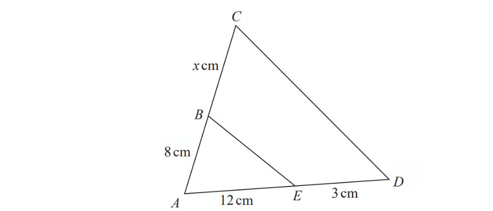

There are two possible values of $x$.

Work out each of these values. State any assumptions you make in your working.

## Q6 — hard — 3 marks · exam-questions

### 20() — 3 marks — command: work_out — structured — from paper June 2014 · 1MA0/1H
Steve has a photo and a rectangular piece of card.

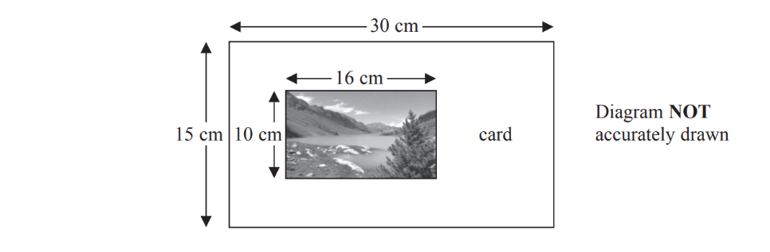

The photo is 16 cm by 10 cm. 
The card is 30 cm by 15 cm.

Steve cuts the card along the dotted line shown in the diagram below.

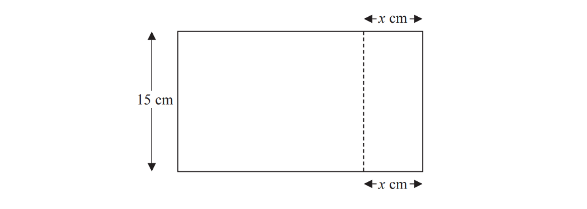

Steve throws away the piece of card that is 15 cm by $x$ cm. The piece of card he has left is mathematically similar to the photo.

Work out the value of $x$.

## Q7 — medium — 4 marks · exam-questions

### 5((a)) — 2 marks — command: work_out — structured — from paper June 2017 · 1MA1/2H
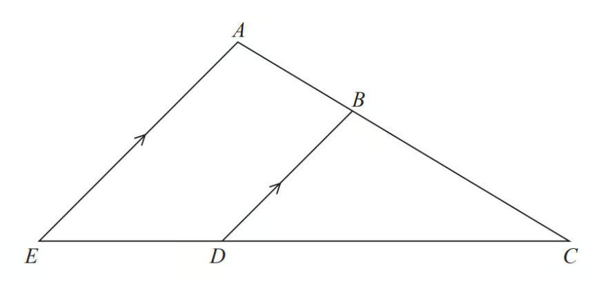

*ABC* and *EDC* are straight lines. 
*EA* is parallel to *DB*.

*EC* = 8.1 cm. 
*DC* = 5.4 cm. 
*DB* = 2.6 cm,

Work out the length of *AE*.

### 5((b)) — 2 marks — command: work_out — structured — from paper June 2017 · 1MA1/2H
*AC* = 6.15 cm.

Work out the length of *AB*.

## Q8 — easy — 3 marks · exam-questions

### 14() — 3 marks — command: work_out — structured — from paper Spec1 2015 · 1MA1/2H
$ABC$ and $ABD$ are two right-angled triangles.

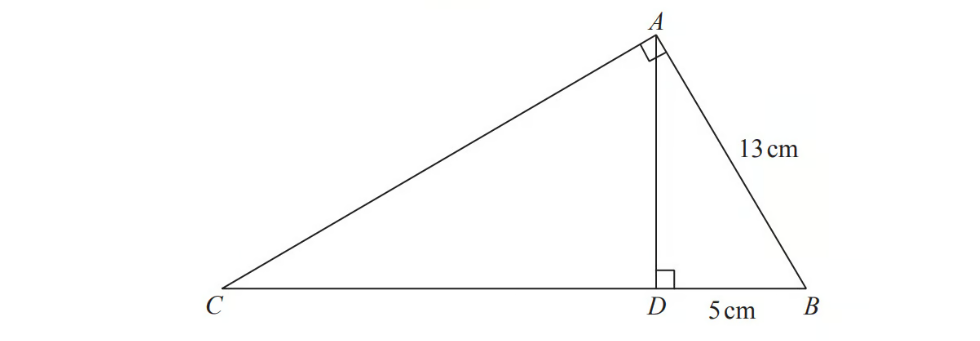

$\mathrm{Angle}BAC=\mathrm{angle}ADB=90^{\circ}\,\,AB=13\mathrm{cm}\,DB=5\mathrm{cm}$

Work out the length of $CB$.

## Q9 — very_hard — 5 marks · exam-questions

### 23() — 5 marks — command: work_out — structured — from paper Nov 2018 · 8300/3H
The diagram shows the side view of a step ladder with a horizontal strut of length 48 cm.

The strut is one third of the way up the ladder.

The symmetrical cross section of the ladder shows two similar triangles.

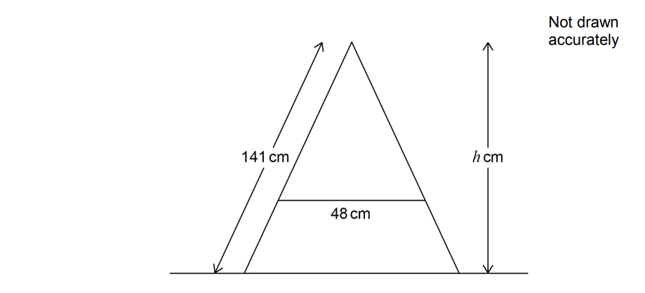

Work out the vertical height, $h$ cm, of the ladder.

...........................cm

## Q10 — hard — 3 marks · exam-questions

### 13() — 3 marks — command: work_out — structured — from paper Sample 2015 · 1MA1/1H
Rectangle $ABCD$ is mathematically similar to rectangle $DAEF$.

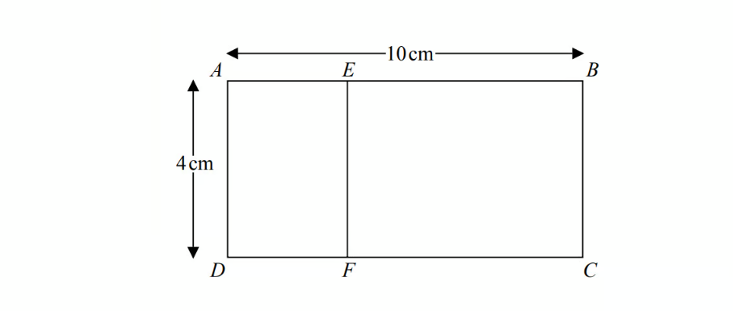

$AB=10\mathrm{cm}.\,AD=4\mathrm{cm}.$

Work out the area of rectangle $DAEF$.

## Q11 — medium — 3 marks · exam-questions

### 7() — 3 marks — command: work_out — structured — from paper Jan 2019 · 4MA1/1HR
The diagram shows two water towers in Kuwait.

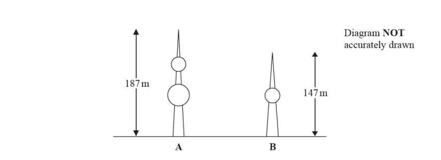

The real height of tower $A$ is $187m$. 
The real height of tower $B$ is $147m$.

Ahmed makes a scale model of both towers.

The height of tower $A$ on the scale model is $90\mathrm{cm}$.

Work out the height of tower $B$ on the scale model. 
Give your answer correct to the nearest centimetre.

## Q12 — easy — 3 marks · exam-questions

### 3((a)) — 2 marks — command: calculate — structured — from paper Jan 2022 · 4MA1/2H
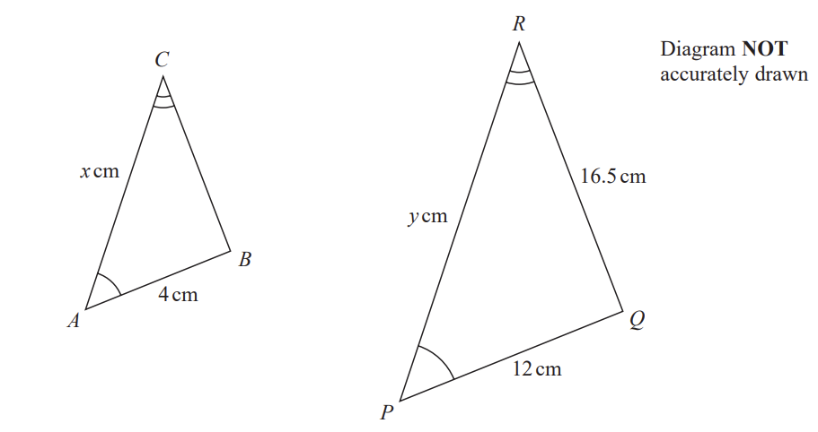

Triangle $ABC$ is similar to triangle $PQR$

$AB=4\mathrm{cm}$     $PQ=12\mathrm{cm}$       $RQ=16.5\mathrm{cm}$   $AC=x\mathrm{cm}$    $PR=y\mathrm{cm}$

Calculate the length of $BC$

### 3((b)) — 1 mark — command: write — structured — from paper Jan 2022 · 4MA1/2H
Write down an expression for $y$ in terms of $x$

y = ......................................

## Q13 — very_hard — 5 marks · exam-questions

### 13() — 5 marks — command: work_out — structured — from paper 2020	May/June · 0580/21
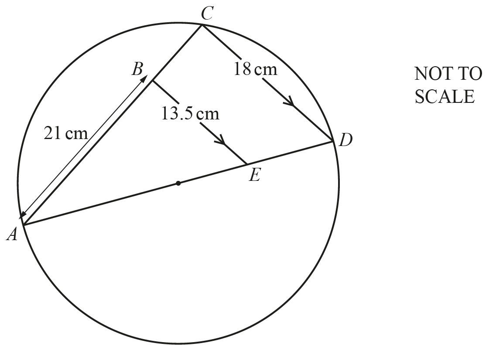

$C$ lies on a circle with diameter $AD$. 
$B$ lies on $AC$ and $E$ lies on $AD$ such that $BE$ is parallel to $CD$. 
$AB$ = 21 cm, $CD$ = 18 cm and $BE$ = 13.5 cm.

Work out the radius of the circle.

............................................ cm

## Q14 — hard — 5 marks · exam-questions

### 15((a)) — 2 marks — command: work_out — structured — from paper March 2013 · 1MA0/2H
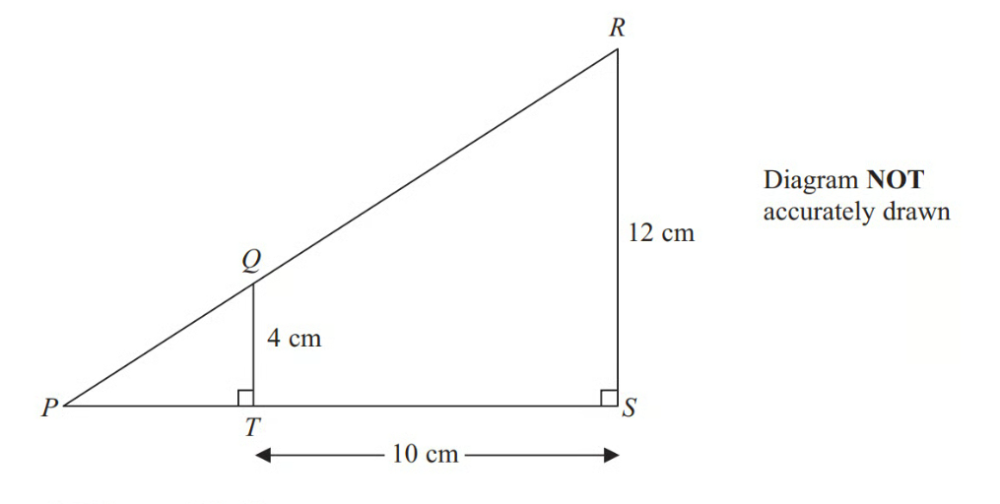

*PQR* and *PTS* are straight lines. 
Angle *PTQ* = Angle *PSR* = 90o. 
*QT* = 4 cm 
*RS* = 12 cm 
*TS* = 10 cm

Work out the area of the trapezium *QRST*.

### 15((b)) — 3 marks — command: work_out — structured — from paper March 2013 · 1MA0/2H
Work out the length of *PT*.

## Q15 — medium — 2 marks · exam-questions

### 18() — 2 marks — command: calculate — structured — from paper Jan 2020 · 4MA1/2HR

$APB$and $CPD$are chords of a circle. 

$AP$ = 9 cm $PB$ = 6 cm $CP$ = 8 cm

Calculate the length of $PD$.

......................cm

## Q16 — easy — 4 marks · exam-questions

### 4((a)) — 2 marks — command: work_out — structured — from paper Nov 2021 · 4MA1/2H
$ABC$ and $DEF$ are similar triangles.

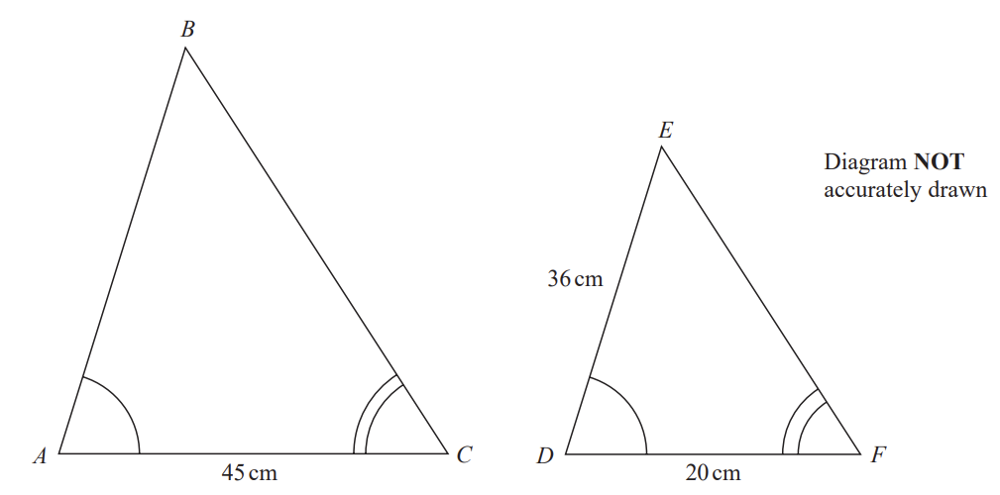

Work out the length of $AB$.

### 4((b)) — 2 marks — command: work_out — structured — from paper Nov 2021 · 4MA1/2H
Given that $BC=54\mathrm{cm}$, 
work out the length of $EF$.

## Q17 — very_hard — 5 marks · exam-questions

### 8((c)) — 3 marks — command: explain — structured — from paper 2020 Oct/Nov · 0580/42
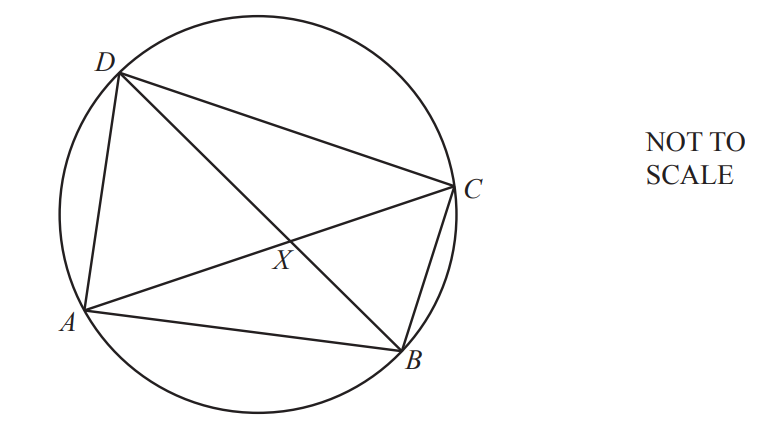

The diagonals of the cyclic quadrilateral *ABCD* intersect at *X*.

Explain why triangle *ADX* is similar to triangle *BCX*. Give a reason for each statement you make.

### 8((c)) — 2 marks — command: calculate — structured — from paper 2020 Oct/Nov · 0580/42
*AD  *= 10 cm, *BC  *= 8 cm, *BX*  = 5 cm, *CX * = 7 cm.

Calculate *DX*.

*DX* = ........................................... cm

## Q18 — hard — 3 marks · exam-questions

### 19() — 3 marks — command: calculate — structured — from paper Jan 2022 · 4MA1/2H

$PTQ$is a diameter of a circle. 
$RTS$ is a chord of the circle.

| $TQ=3\mathrm{cm}$ | $ST=4\mathrm{cm}$ | $TR=12\mathrm{cm}$ |
|---|---|---|

Calculate the radius of the circle.

........................................... cm

## Q19 — medium — 1 marks · exam-questions

### 22() — 1 mark — command: which — structured — from paper June 2017 · 8300/1H
$PRT$ and $QRS$ are similar triangles.

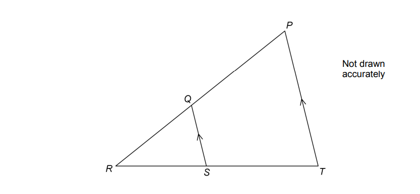

Which of these is equivalent to $\frac{QR}{PR}$?

Circle your answer.

| $\frac{RS}{ST}$ | $\frac{QS}{PT}$ |
|---|---|
| $\frac{PT}{QS}$ | $\frac{RT}{RS}$ |

## Q20 — easy — 2 marks · exam-questions

### 6((b)) — 2 marks — command: work_out — structured — from paper June 2018 · 4MA1/2H
The diagram shows two cylinders, $A$ and $B$

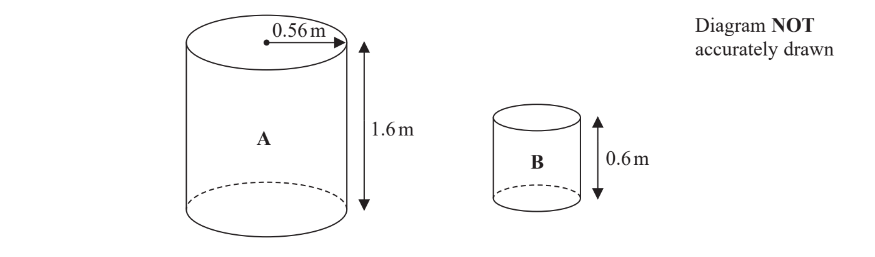

Cylinder $A$ has height 1.6 m and radius 0.56 m.

Cylinder $B$ is mathematically similar to cylinder $A$. 
The height of cylinder $B$ is 0.6 m. 
Work out the radius of cylinder $B$.

....................................................... m

## Q21 — very_hard — 6 marks · exam-questions

### 10((b)) — 2 marks — command: calculate — structured — from paper 2018	Oct/Nov · 0580/42
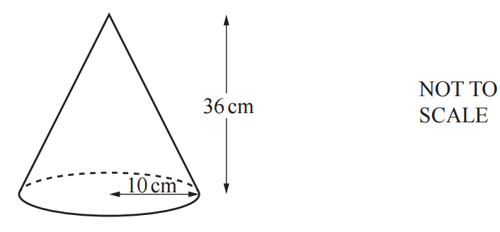

A solid metal cone has radius 10 cm and height 36 cm.
Calculate the volume of this cone.

[The volume, $V$, of a cone with radius $r$ and height $h$ is  $V=\frac{1}{3}πr^{2}h$.]

......................................... cm3

### 10((b)) — 4 marks — command: calculate — structured — from paper 2018	Oct/Nov · 0580/42
The cone is cut, parallel to its base, to give a smaller cone.

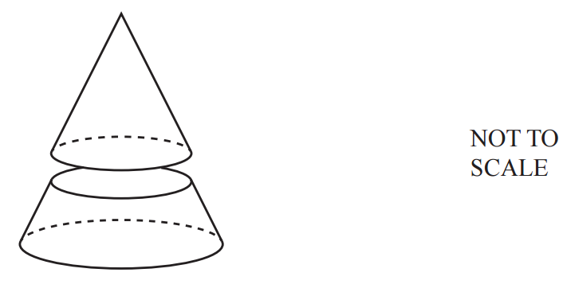

The volume of the smaller cone is half the volume of the original cone.

The smaller cone is melted down to make two different spheres.

The ratio of the radii of these two spheres is 1 : 2.

Calculate the radius of the smaller sphere.

[The volume, $V$, of a sphere with radius $r$ is  $V=\frac{4}{3}πr^{3}$.]

.......................................... cm

## Q22 — hard — 3 marks · exam-questions

### 19() — 3 marks — command: prove — structured — from paper Nov 2017 · 8300/1H
The diagram shows a triangle and a trapezium.

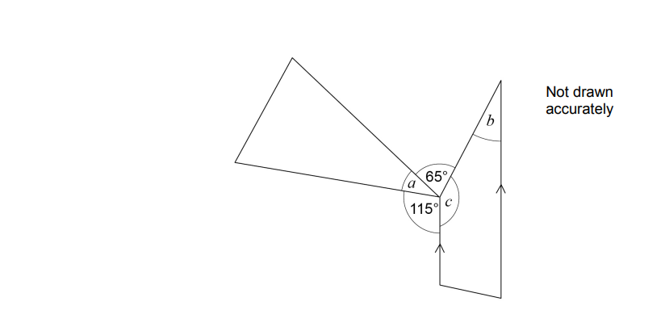

Prove that $a=b$

## Q23 — medium — 3 marks · exam-questions

### 21() — 3 marks — command: prove — structured — from paper Specimen 2015 · 8300/1H
$A,B$and $C$ are points on a circle.

- $BC$ bisects angle $ABQ$.
- $PBQ$ is a tangent to the circle.

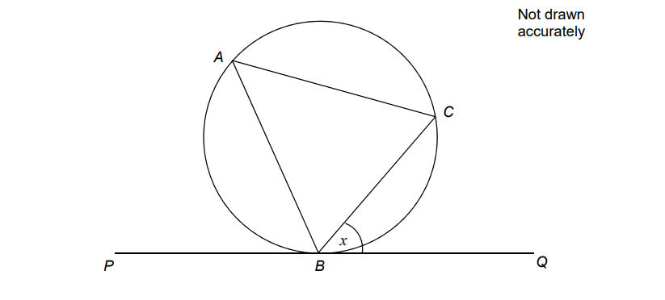

Angle $CBQ=x$

Prove that $AC=BC$

## Q24 — easy — 4 marks · exam-questions

### 6((a)) — 2 marks — command: work_out — structured — from paper June 2019 · 4MA1/2H
$ABC$and $DEF$are similar triangles.

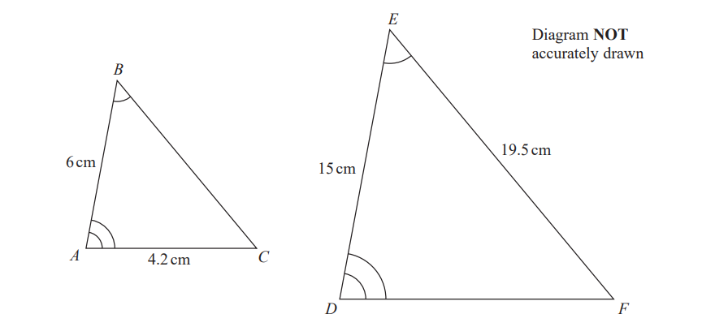

Work out the length of $DF$.

.......................$\mathrm{cm}$

### 6((b)) — 2 marks — command: work_out — structured — from paper June 2019 · 4MA1/2H
Work out the length of $BC$.

....................$\mathrm{cm}$

## Q25 — hard — 5 marks · exam-questions

### 12() — 5 marks — command: prove — structured — from paper June 2018 · J560/06
The diagram below shows two right-angled triangles.

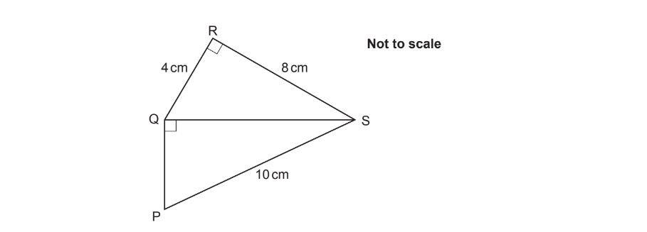

Prove that triangles PQS and QRS are similar.

## Q26 — medium — 5 marks · exam-questions

### 9((a)) — 2 marks — command: insert — structured — from paper June 2019 · J560/04
The diagram shows triangle ABC. 
CD is parallel to AB. 
A, C and E lie in a straight line. 
Angles of size $a^{\circ},b^{\circ}$and $c^{\circ}$ are shown.

Insert  $a^{\circ},b^{\circ}$° or $c^{\circ}$ to make this statement true. Give a reason for your answer.

Angle DCE = ......... because ....................................................................................................

### 9((b)) — 3 marks — command: show — structured — from paper June 2019 · J560/04
Use the diagram and the answer to part (a) to show that the angles of a triangle add up to 180°.

Give a reason for each statement you make.

## Q27 — easy — 2 marks · exam-questions

### 4((a)) — 2 marks — command: work_out — structured — from paper June 2019 · 4MA1/2HR
$ABC$and $DEF$are similar triangles.

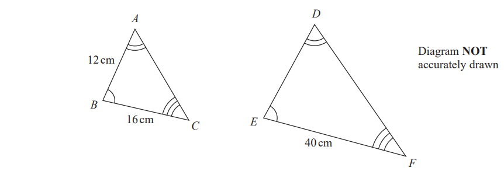

Work out the length of $DE.$

........................$\mathrm{cm}$

## Q28 — hard — 2 marks · exam-questions

### 25((a)) — 2 marks — command: calculate — structured — from paper 2018	May/June · 0580/23
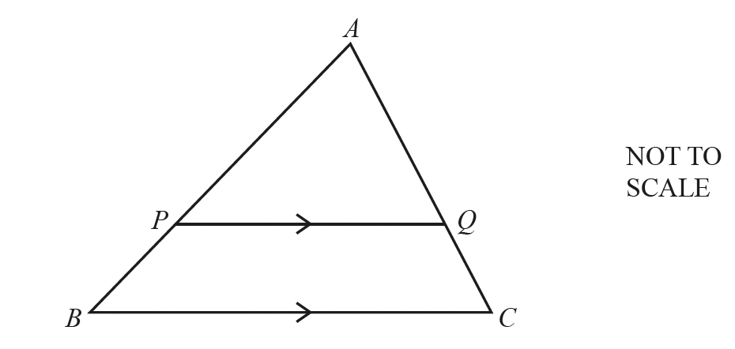

In the diagram, $PQ$ is parallel to $BC$.
$APB$ and $AQC$ are straight lines. 
$PQ$ = 8 cm, $BC$ = 10 cm and $AB$ = 9cm.

Calculate $PB$.

$PB$ = .......................................... cm

## Q29 — medium — 3 marks · exam-questions

### 14() — 3 marks — command: prove — structured — from paper June 2019 · J560/05
In the diagram AB is parallel to CD. 
AED and BEC are straight lines.

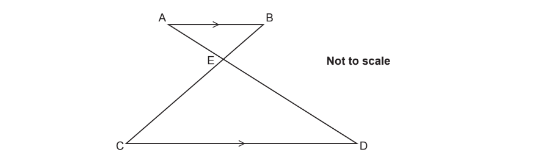

Prove that triangle ABE is similar to triangle CDE.

## Q30 — easy — 2 marks · exam-questions

### 9() — 2 marks — command: work_out — structured — from paper Nov 2020 · 8300/3H
These two triangles are similar.

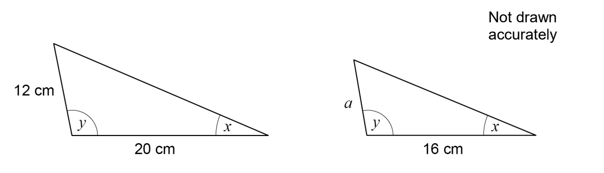

Work out the value of $a$.

............................cm

## Q31 — medium — 5 marks · exam-questions

### 9((a)) — 3 marks — command: calculate — structured — from paper Specimen 2015 · J560/04
Anna estimates the height of a tree.

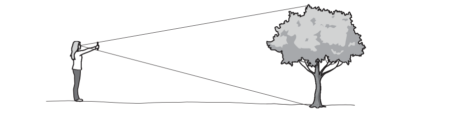

Anna holds a ruler vertically so the height of the tree is exactly covered by the ruler. 
She is 20 metres from the tree. 
The ruler is 30cm long. 
The horizontal distance from her eyes to the ruler is 60 cm.

Calculate an estimate of the height of the tree.

.......................... m

### 9((b)) — 2 marks — command: give — structured — from paper Specimen 2015 · J560/04
Give two reasons why this method may not be suitable to estimate the height of a very tall building.

## Q32 — easy — 1 marks · exam-questions

### 1() — 1 mark — command: circle — structured — from paper June 2019 · 8300/1H
Here are two right-angled triangles.

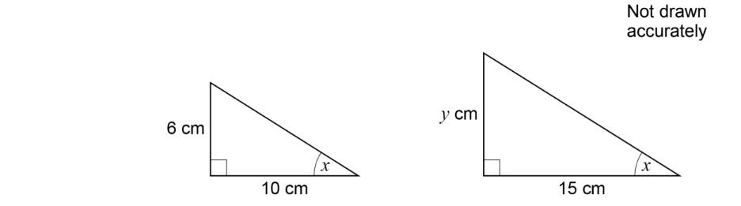

Circle the value of $y$.

| 11 | 7.5 | 9 | 4 |
|---|---|---|---|

## Q33 — medium — 2 marks · exam-questions

### 8((a)) — 2 marks — command: calculate — structured — from paper 2018	Oct/Nov · 0580/43
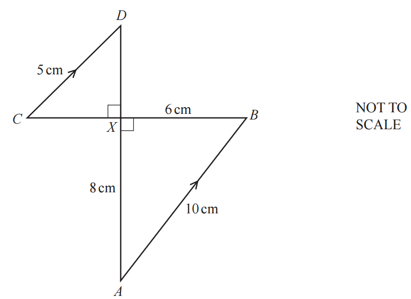

In the diagram, *AB* and *CD* are parallel. 
*AD* and *BC* intersect at right angles at the point *X*. 
*AB* = 10 cm, *CD* = 5 cm, *AX* = 8 cm and *BX* = 6 cm.

Use similar triangles to calculate *DX*.

*DX* = ........................................... cm

## Q34 — easy — 2 marks · exam-questions

### 12() — 2 marks — command: find — structured — from paper 2020 Specimen · 0580/02
Triangle $ABC$ is similar to triangle $PQR$.

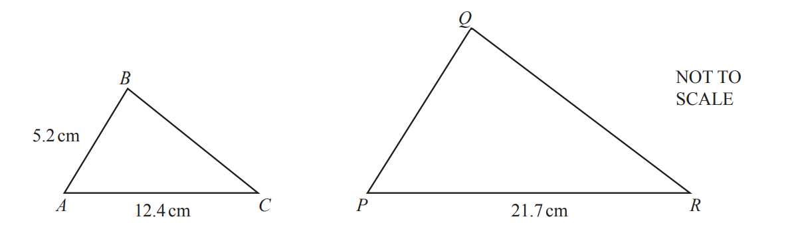

Find $PQ$.

$PQ=$ ......................................... cm
