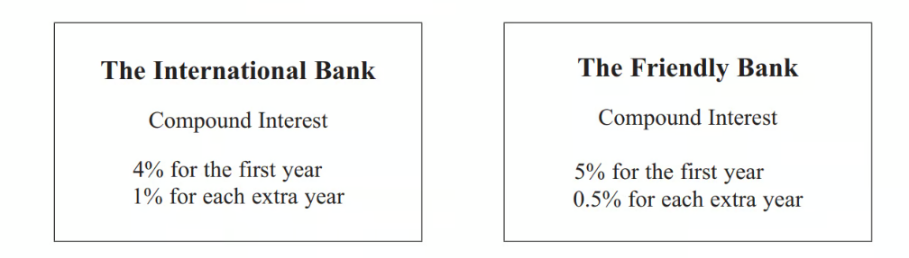
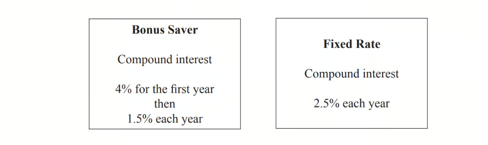
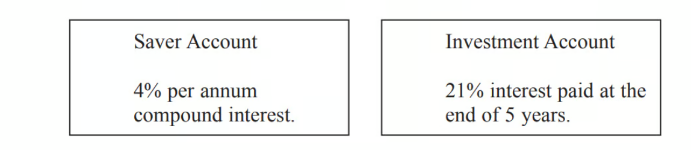
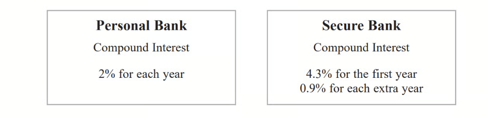
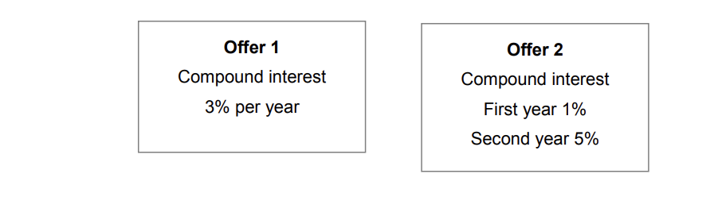

# Exam Questions — Compound Interest & Depreciation
**Number** · Edexcel IGCSE Maths A (Modular) (4XMAF/4XMAH) — 24/Higher Unit 2
> Source: [https://www.savemyexams.com/igcse/maths/edexcel/a-modular/24/higher-unit-2/topic-questions/number/compound-interest-and-depreciation/exam-questions/](https://www.savemyexams.com/igcse/maths/edexcel/a-modular/24/higher-unit-2/topic-questions/number/compound-interest-and-depreciation/exam-questions/) · 32 questions · total 124 marks

## Q1 — easy — 3 marks · exam-questions

### 8() — 3 marks — command: work_out — structured — from paper 2023 June · 4MA1/2H
Charlotte buys a painting for \$680 The value of the painting increases by 4% each year.

Work out the value of the painting at the end of 3 years. Give your answer correct to the nearest \$

## Q2 — very_hard — 3 marks · exam-questions

### 10() — 3 marks — command: work_out — structured — from paper 2017	June · 1MA1/3H
Naoby invests £6000 for 5 years.
The investment gets compound interest of *x*% per annum.

At the end of 5 years the investment is worth £8029.35

Work out the value of *x*.

## Q3 — hard — 4 marks · exam-questions

### 14() — 4 marks — command: which — structured — from paper 2013	June · 1MA0/2H
Viv wants to invest £2000 for 2 years in the same bank.

At the end of 2 years, Viv wants to have as much money as possible. 
Which bank should she invest her £2000 in?

## Q4 — medium — 2 marks · exam-questions

### 6() — 2 marks — command: how — structured — from paper 2015	Spec1 · 1MA1/2H
Toby invested £7500 for 2 years in a savings account. He was paid 4% per annum compound interest.

How much money did Toby have in his savings account at the end of 2 years?

## Q5 — very_hard — 4 marks · exam-questions

### 9() — 4 marks — command: what — structured — from paper 2018	June · 1MA1/2H
Jean invests £12000 in an account paying compound interest for 2 years.

In the first year the rate of interest is  $x$%
At the end of the first year the value of Jean's investment is £12336

In the second year the rate of interest is `x over 2 percent sign`

What is the value of Jean's investment at the end of 2 years?

## Q6 — hard — 6 marks · exam-questions

### 10((a)) — 3 marks — command: estimate — structured — from paper 2015	Spec2 · 1MA1/2H
The population of a city increased by 5.2% for the year 2014

At the beginning of 2015 the population of the city was 1 560 000

Lin assumes that the population will continue to Increase at a constant rate of 5.2% each year.

Use Lin's assumption to estimate the population of the city at the beginning of 2017 
Give your answer correct to 3 significant figures.

### 10((b)) — 3 marks — command: multiple — structured — from paper 2015	Spec2 · 1MA1/2H
i) Use Lin's assumption to work out the year in which the population of the city will reach 2000000

ii) If Lin's assumption about the rate of increase of the population is too low, how might this affect your answer to (b)(i)?

## Q7 — medium — 3 marks · exam-questions

### 1() — 3 marks — command: how — structured — from paper PRE 2017
Liam invests £6200 for 3 years in a savings account. He gets 2.5% per annum compound interest.

How much money will Liam have in his savings account at the end of 3 years?

## Q8 — very_hard — 5 marks · exam-questions

### 9((a)) — 2 marks — command: how — structured — from paper 2017	November · 1MA1/3H
Jack bought a new boat for £12500

The value, £$V$, of Jack’s boat at the end of $n$ years is given by the formula

`V equals 12500 space cross times open parentheses 0.85 close parentheses to the power of n`

At the end of how many years was the value of Jack’s boat first less than 50% of the value of the boat when it was new?

### 9((b)) — 3 marks — command: work_out — structured — from paper 2017	November · 1MA1/3H
A savings account pays interest at a rate of R% per year.
Jack invests £5500 in the account for one year.

At the end of the year, Jack pays tax on the interest at a rate of 40%.
After paying tax, he gets £79.20

Work out the value of  $R$.

## Q9 — hard — 6 marks · exam-questions

### 18((a)) — 3 marks — command: work_out — structured — from paper 2014	June · 1MA0/2H
Katie invests £200 in a savings account for 2 years.

The account pays compound interest at an annual rate of

3.3% for the first year 1.5% for the second year

Work out the total amount of money in Katie's account at the end of 2 years.

### 18((b)) — 3 marks — command: compare — structured — from paper 2014	June · 1MA0/2H
Katie travels to work by train. The cost of her weekly train ticket increases by 12.5% to £225

Katie's weekly pay increases by 5% to £535.50

Compare the increase in the amount of money Katie has to pay for her weekly train ticket with the increase in her weekly pay.

## Q10 — medium — 4 marks · exam-questions

### 14() — 4 marks — command: which — structured — from paper 2014	November · 1MA0/2H
Peter has £20 000 to invest in a savings account for 2 years.

He finds information about two savings accounts.

Peter wants to have as much money as possible in his savings account at the end of 2 years.

Which of these savings accounts should he choose?

## Q11 — very_hard — 8 marks · exam-questions

### 10((a)) — 4 marks — command: work_out — structured — from paper 2015	Sample · 1MA1/2H
Katy invests £2000 in a savings account for 3 years.

The account pays compound interest at an annual rate of

2.5% for the first year
$x$% for the second year
$x$% for the third year

There is a total amount of £2124.46 in the savings account at the end of 3 years.

Work out the rate of interest in the second year.

### 10((b)) — 4 marks — command: work_out — structured — from paper 2015	Sample · 1MA1/2H
Katy goes to work by train.

The cost of her weekly train ticket increases by 12.5% to £225

Work out the cost of her weekly train ticket before this increase.

## Q12 — hard — 5 marks · exam-questions

### 8((a)) — 3 marks — command: work_out — structured — from paper 2015	Spec1 · 1MA1/3H
Ian invested an amount of money at 3% per annum compound interest. 
At the end of 2 years the value of the investment was £2652.25

Work out the amount of money Ian invested.

### 8((b)) — 2 marks — command: which — structured — from paper 2015	Spec1 · 1MA1/3H
Noah has an amount of money to invest for five years.

Noah wants to get the most interest possible.

Which account is best? 
You must show how you got your answer.

## Q13 — medium — 4 marks · exam-questions

### 15() — 4 marks — command: work_out — structured — from paper 2016	June · 1MA0/2H
This notice was in a car magazine.

| Most new cars lose more than half of their value in the first three years |
|---|

Paul bought a new car. 
The value of the car was £15 000

In the first year, the value of the car depreciated by 23%. 
After the first year, the value of the car depreciated by 18% each year.

Work out if Paul's car lost more than half of its value by the end of three years.

## Q14 — very_hard — 3 marks · exam-questions

### 11() — 3 marks — command: work_out — structured — from paper Jan 2022 · 4MA1/1H
Himari invests 200 000 yen for 3 years in a savings account paying compound interest. The rate of interest is 1.8% for the first year and `x percent sign` for each of the second year and the third year.

The value of the investment at the end of the third year is 209 754 yen.

Work out the value of $x$ 
Give your answer correct to one decimal place.

$x=$ ...................................................... [3]

## Q15 — hard — 5 marks · exam-questions

### 13((a)) — 2 marks — command: calculate — structured — from paper 2017	November · 1MA1/2H
At the beginning of 2009, Mr Veale bought a company. The value of the company was £50 000

Each year the value of the company increased by 2%.

Calculate the value of the company at the beginning of 2017 
Give your answer correct to the nearest £100

### 13((b)) — 3 marks — command: find — structured — from paper 2017	November · 1MA1/2H
At the beginning of 2009 the value of a different company was £250 000 In 6 years the value of this company increased to £325 000

This is equivalent to an increase of `x percent sign` each year.

Find the value of $x$. 
Give your answer correct to 2 significant figures.

## Q16 — medium — 6 marks · exam-questions

### 16((a)) — 3 marks — command: work_out — structured — from paper 2013	March · 1MA0/2H
Derek buys a house for £150 000 
He sells the house for £154 500

Work out Derek's percentage profit.

### 16((b)) — 3 marks — command: work_out — structured — from paper 2013	March · 1MA0/2H
Derek invests £154 500 for 2 years at 4% per year compound interest.

Work out the value of the investment at the end of 2 years.

## Q17 — very_hard — 3 marks · exam-questions

### 8((f)) — 3 marks — command: show — structured — from paper 2020 Oct/Nov · 0580/41
Alan invests \$200 at a rate of  per year compound interest. 
After 2 years the value of his investment is \$206.46.

Show that     $r^{2}+200r-323=0$.

[3]

## Q18 — hard — 3 marks · exam-questions

### 11() — 3 marks — command: work_out — structured — from paper Jan 2020 · 4MA1/1H
Max invests \$6000 in a savings account for 3 years. The account pays compound interest at a rate of 1.5% per year for the first 2 years.

The compound interest rate changes for the third year. 
At the end of 3 years, there is a total of \$6311.16 in the account.

Work out the compound interest rate for the third year. 
Give your answer correct to 1 decimal place.

.....................%

## Q19 — medium — 3 marks · exam-questions

### 6() — 3 marks — command: show — structured — from paper 2017	June · 1MA1/2H
Anil wants to invest £25 000 for 3 years in a bank.

Which bank will give Anil the most interest at the end of 3 years?

You must show all your working.

## Q20 — very_hard — 3 marks · exam-questions

### 1((c)) — 3 marks — command: find — structured — from paper 2020 May/June · 0580/42
Edna invests \$500 at a rate of $r$% per year compound interest. 
At the end of 6 years, the value of Edna’s investment is \$559.78.

Find the value of $r$.

$r=$................................................ [3]

## Q21 — hard — 3 marks · exam-questions

### 16() — 3 marks — command: work_out — structured — from paper Nov 2020 · 4MA1/1H
Jan invests `$ 8000` in a savings account.
The account pays compound interest at a rate of `x percent sign` per year.

At the end of $6$ years, there is a total of `$ 8877.62` in the account.

Work out the value of $x.$ 
Give your answer correct to $2$ decimal places.

$x=$...............................................

## Q22 — medium — 3 marks · exam-questions

### 2() — 3 marks — command: calculate — structured — from paper June 2019 · 1MA1/3H
Katy invests £200 000 in a savings account for 4 years. 
The account pays compound interest at a rate of 1.5 % per annum.

Calculate the total amount of interest Katy will get at the end of 4 years.

## Q23 — very_hard — 3 marks · exam-questions

### 1((d)) — 3 marks — command: find — structured — from paper 2020 · Specimen 4
Hans invests \$550 at a rate of $x$% per year compound interest. 
At the end of 10 years, the value of the investment is \$638.30, correct to the nearest cent.

Find the value of $x.$

$x$ = .............................................. [3]

## Q24 — hard — 3 marks · exam-questions

### 10() — 3 marks — command: verify — structured — from paper June 2019 · 8300/3H
Mia wants to borrow £6000 and repay it, with interest, after two years.

She sees two offers for loans.

Mia says,

“I will pay back the same amount because the average of 1% and 5% is 3%”

Is she correct? 
You **must **show your working.

## Q25 — medium — 3 marks · exam-questions

### 11((b)) — 3 marks — command: work_out — structured — from paper June 2021 · 4MA1/2H
Zhi bought a house on 1st January 2017 
When she bought the house, its value was 120 000 yuan.

The value of the house increased by 1.8% per year.

Work out the value of Zhi’s house on 1st January 2020 
Give your answer correct to 3 significant figures.

....................................................... yuan

## Q26 — hard — 3 marks · exam-questions

### 15() — 3 marks — command: work_out — structured — from paper Nov 2017 · 8300/2H
Mirek invests £6000 at a compound interest rate of 1.5% per year.

He wants to earn more than £1000 interest.

Work out the **least** time, in whole years, that this will take.

.......................years

## Q27 — medium — 4 marks · exam-questions

### 7() — 4 marks — command: show — structured — from paper Nov 2021 · 4MA1/2H
Ali and Badia each have 25000 dollars to invest.

| **Cyclone Bank** | **Tornado Bank** |
|---|---|
| Invest 25 000 dollars 4.5% compound interest per year for 3 years | Invest 25 000 dollars Receive 1150 dollars interest each year for 3 years |

Ali invests in the Cyclone Bank for 3 years. 
Badia invests in the Tornado Bank for 3 years.

By the end of the 3 years, Ali will have received more interest than Badia.

How much more? 
Show your working clearly. 
Give your answer correct to the nearest dollar.

....................................................... dollars

## Q28 — hard — 6 marks · exam-questions

### 4((a)) — 5 marks — command: calculate — structured — from paper Specimen 2015 · J560/06
Here are the interest rates for two accounts.

| **Account A**  Interest: 3% per year compound interest. | **Account B**  Interest: 4% for the first year, 3% for the second year and 2% for the third year. |
|---|---|
| No withdrawals until the end of three years. | Withdrawals allowed at any time. |

Derrick has £10000 he wants to invest.

Calculate which account would give him most money if he invests his money for 3 years. 
Give the difference in the interest to the nearest penny.

Account ................... by ................... p

### 4((b)) — 1 mark — command: explain — structured — from paper Specimen 2015 · J560/06
Explain why he might **not** want to use Account A.

## Q29 — medium — 3 marks · exam-questions

### 8() — 3 marks — command: work_out — structured — from paper Jan 2020 · 4MA1/2HR
Hamish buys a new car for \$20 000 
The car depreciates in value by 19% each year.

Work out the value of the car at the end of 3 years. 
Give your answer to the nearest \$.

\$ .....................

## Q30 — medium — 4 marks · exam-questions

### 11() — 4 marks — command: work_out — structured — from paper Nov 2019 · 8300/2H
The value of a house is £120 000 
The value is expected to increase by 5% each year.

Work out the expected value after 4 years. 
Give your answer to 2 significant figures. 
You **must **show your working.

£..............................

## Q31 — medium — 3 marks · exam-questions

### 5() — 3 marks — command: work_out — structured — from paper Specimen paper · 4MA1/2H
Aayush invests 18 000 rupees for 3 years at a rate of 4% per year compound interest.

Work out the total amount of interest Aayush has received by the end of 3 years. 
Give your answer correct to the nearest rupee.

## Q32 — medium — 3 marks · exam-questions

### 7() — 3 marks — command: work_out — structured — from paper 2023 Nov · 4MA1/2H
Hermione buys a boat for \$26 800
The value of the boat depreciates by 8% each year.

Work out the value of the boat at the end of 3 years.
Give your answer correct to the nearest dollar.
