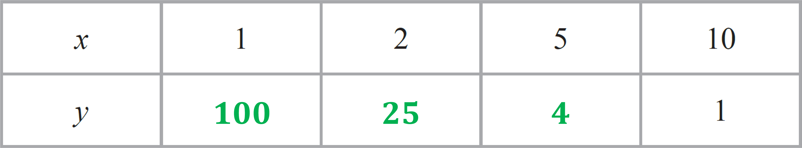
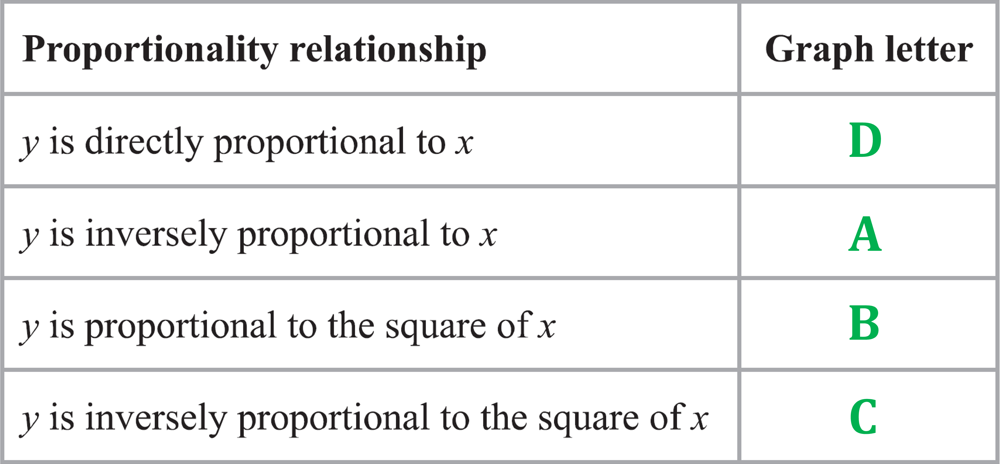
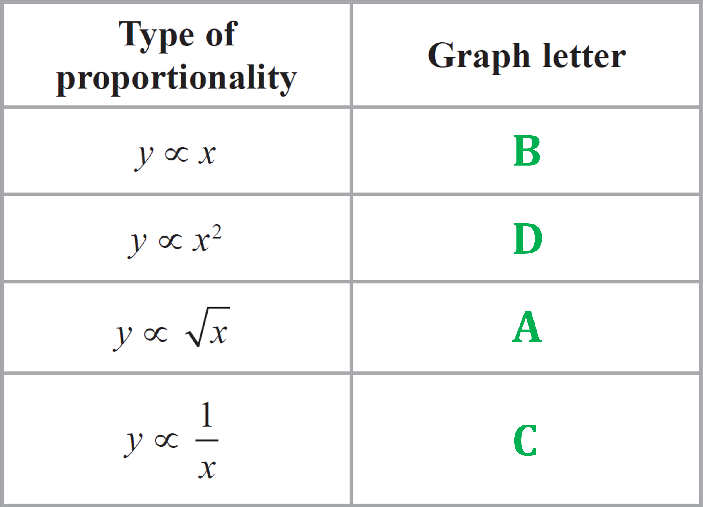
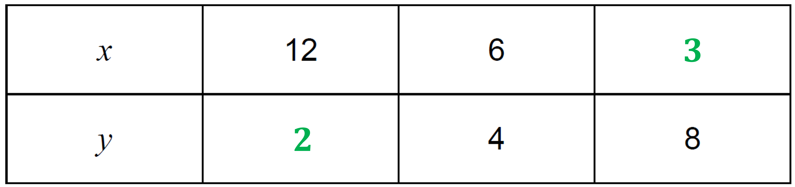
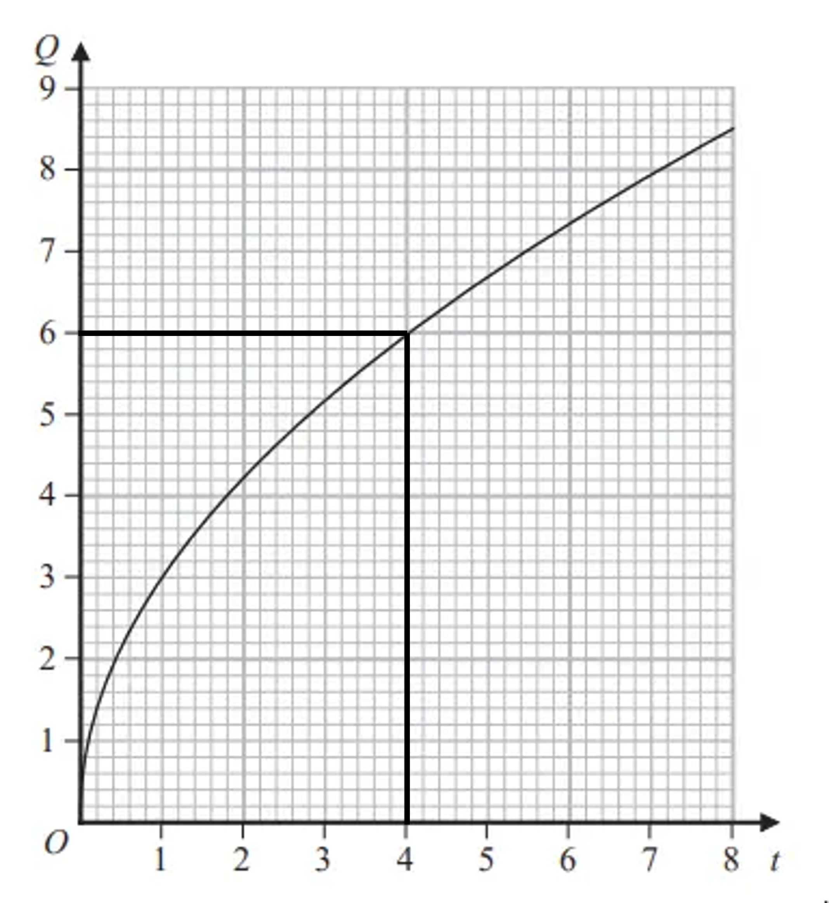
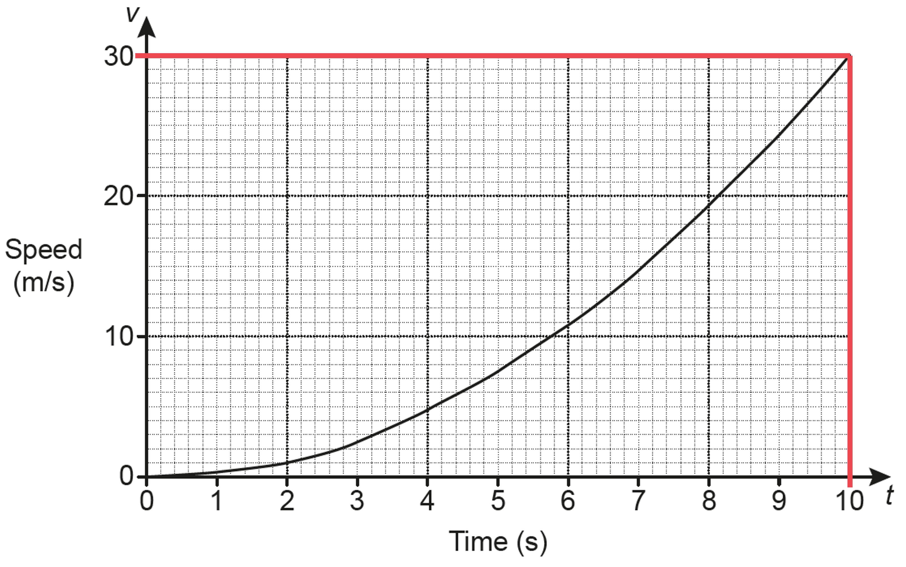

# Mark Schemes — Direct & Inverse Proportion
**Number** · Edexcel IGCSE Maths A (Modular) (4XMAF/4XMAH) — 24/Higher Unit 2

## Q1 — very_hard — 4 marks · exam-questions

### 13((a)) — 2 marks
> *Use the inverse proportion relationship  *$y=\frac{k}{x^{2}}$*,  and substitute in **any one** pair of corresponding **x** and **y** values from the table.  (Pick the pair that will make your calculations the easiest!) Then solve the equation to find the value of **k**.*

`table row cell 9 space end cell equals cell space k over 1 squared end cell row cell 9 space cross times space 1 squared space end cell equals cell space k end cell row cell 9 space cross times space 1 space end cell equals cell space k end cell row cell 9 space end cell equals cell space k end cell end table`

**[1]**

> *Now give the equation for **y** with that value of **k** inserted**.*

$y=\frac{9}{x^{2}}$**  [1]**

### 13((b)) — 2 marks
> *Substitute **y **= 16 into the equation from part (a). Then rearrange and solve to find the corresponding value of **x**.*

`table row cell 16 space end cell equals cell space 9 over x squared end cell row cell 16 space cross times space x squared space end cell equals cell space 9 end cell row cell x squared space end cell equals cell space 9 space divided by space 16 end cell row cell x squared space end cell equals cell space 9 over 16 end cell row cell x space end cell equals cell space square root of 9 over 16 end root end cell row cell x space end cell equals cell space plus-or-minus 3 over 4 end cell end table`

**[1]**

$x=\frac{3}{4}$**  [1]**

**Be sure to give the ****positive**** value of ****x****, as asked for in the question.**

## Q2 — hard — 4 marks · exam-questions

### 21() — 4 marks
> *Use the direct proportion relationship  *$y=kx^{2}$*,  and substitute in the known values of **x** and **y**.*

`table row cell 36 space end cell equals cell space k space cross times space 3 squared end cell end table`

**[1]**

> *Now solve that equation to find the value of **k**.*

`table row cell 36 space end cell equals cell space k space cross times space 9 end cell row cell 36 space divided by space 9 space end cell equals cell space k end cell row cell 4 space end cell equals cell space k end cell end table`

**[1]**

> *Now use the equation with that value of **k** and the new value of **x** to find the corresponding value of **y.*

`table row cell y space end cell equals cell space 4 space cross times space 5 squared end cell row cell y space end cell equals cell space 4 space cross times space 25 end cell end table`

**[1]**

$y=100$** **** [1]**

## Q3 — medium — 3 marks · exam-questions

### 9() — 3 marks
> *It may not be obvious at first, but this is an inverse proportion question.  *
*The number of hours spent by each cleaner is inversely proportional to the number of cleaners.*
*Use the inverse proportion relationship  *$y=\frac{k}{x}$*,  with **y** as the number of hours per cleaner and **x** as the number of cleaners  Then use the numbers in the question to find the value of **k**.*

`table row cell 4.5 space end cell equals cell space k over 5 end cell row cell 4.5 space cross times space 5 space end cell equals cell space k end cell row cell 22.5 space end cell equals cell space k end cell end table`

**[1]**

> *Now use the value of **k** to find the number of hours spent by each cleaner when the number of cleaners is 3.*

`table row cell y space end cell equals cell space fraction numerator 22.5 over denominator 3 end fraction end cell row cell y space end cell equals cell space 7.5 end cell end table`

**[1]**

> *Be careful now!  The cleaners are paid £8.20 for each hour **or part of an hour** that they work.  *
*So you need to multiply £8.20 by **8** to find the amount each cleaner will be paid. *
*Remember to give your final answer to 2 decimal places, as we are talking about money.*

`table row cell 8.20 space cross times space 8 space end cell equals cell space 65.6 end cell end table`

**£65.60****  [1]**

## Q4 — very_hard — 3 marks · exam-questions

### 16() — 3 marks
> *Use the direct proportion relationship  *`y space equals space k space cube root of x`*,  and substitute in the known values of **x** and **y**.*

`table attributes columnalign right center left columnspacing 0px end attributes row cell 1 1 over 6 space end cell equals cell space k space cross times space cube root of 8 end cell end table`

**[1]**

> *Now solve that equation to find the value of **k**.  Note that  *$2^{3}=8$*,  therefore  *`cube root of 8 space equals space 2`*.*

`table row cell 7 over 6 space end cell equals cell space k space cross times space 2 end cell row cell 7 over 6 space divided by space 2 space end cell equals cell space k end cell row cell 7 over 12 space end cell equals cell space k end cell end table`

**[1]**

> *Now use the equation with that value of **k** and the new value of **x** to find the corresponding value of **y.**  Note that  *$4^{3}=64$*,  therefore  *`cube root of 64 space equals space 4`*.*

`table row cell y space end cell equals cell space 7 over 12 cross times space cube root of 64 end cell end table`

$y=\frac{7}{3}$**  [1]**

## Q5 — hard — 3 marks · exam-questions

### 22() — 3 marks
> *Use the inverse proportion relationship  *$h=\frac{k}{r^{2}}$*,  and substitute the known values of **h** and **r** from the question. *
*Then solve this equation to find the value of **k**.*

`table row cell 3.4 space end cell equals cell space k over 5 squared end cell row cell 3.4 space cross times space 5 squared space end cell equals cell space k end cell row 85 equals k end table`

**[1]**

> *Now use the equation with that value of **k** and the new value of **r** to find the corresponding value of **h.*

`table row cell h space end cell equals cell space 85 over 8 squared end cell end table`

**[1]**

$h=\frac{85}{64}$**  [1]**

**That fraction is equal to 1.328125.  If you give your answer as a decimal, any answer in the range 1.32 to 1.33 would get the mark.**

## Q6 — medium — 3 marks · exam-questions

### 24() — 3 marks
> *Use the inverse proportion relationship  *$p=\frac{k}{t}$*,  and substitute the known values of **p** and **t**  from the question.*

`table row cell 12 space end cell equals cell space k over 4 end cell end table`

**[1]**

> *Solve that equation to find the value of **k**.*

`table row cell 12 space cross times space 4 space end cell equals cell space k end cell row cell 48 space end cell equals cell space k end cell end table`

**[1]**

> *Now use the equation with that value of **k** and the new value of **t** to find the corresponding value of **p.*

`table row cell p space end cell equals cell space 48 over 6 end cell end table`

**p**** = 8****  [1]**

## Q7 — very_hard — 5 marks · exam-questions

### 14() — 5 marks
> *Use the inverse proportion relationship  *$y=\frac{k_{1}}{d^{2}}$*,  and substitute in the known corresponding values of **y** and **d**. *
*Be careful!  There are two different constants of proportionality in this question. *
*We'll call the one connecting **y** and **d **in this part *$k_{1}$*, to distinguish it from the constant that connects **x** and **d**.*

`table row cell 4 space end cell equals cell space k subscript 1 over 10 squared end cell end table`

**[1]**

> *Now solve that equation to find the value of *$k_{1}$* and use that value to write an equation for **y** in terms of **d**.*

`table row cell 4 space cross times space 10 squared space end cell equals cell space k subscript 1 end cell row cell 4 space cross times space 100 space end cell equals cell space k subscript 1 end cell row cell 400 space end cell equals cell space k subscript 1 end cell row blank blank blank row cell y space end cell equals cell space 400 over d squared end cell end table`

**[1]**

> *Next use the direct proportion relationship  *$d=k_{2}x^{2}$*,  and substitute in the known corresponding values of **x** and **d**.  (We use *$k_{2}$* here to represent the constant of proportionality connecting **x** and **d**.) *
*Solve that equation to find the value of *$k_{2}$*, and use that value to write an equation for **d** in terms of **x**.*

`table row cell 24 space end cell equals cell space k subscript 2 space cross times space 2 squared end cell row cell 24 space end cell equals cell space 4 k subscript 2 end cell row cell 24 over 4 space end cell equals cell space k subscript 2 end cell row cell 6 space end cell equals cell space k subscript 2 end cell row blank blank blank row cell d space end cell equals cell space 6 x to the power of 2 space end exponent end cell end table`

**[1]**

> *Now substitute that expression for **d** into the equation  *`table row cell y space end cell equals cell space 400 over d squared end cell end table`*  from above.*

`table row cell y space end cell equals cell space 400 over open parentheses 6 x squared close parentheses squared end cell end table`

**[1]**

> *Finally, expand the brackets and simplify to get the final answer. Note that  *`open parentheses 6 x squared close parentheses squared space equals space 6 squared space cross times space open parentheses x squared close parentheses squared space equals space 36 x to the power of 4`*.*

$y=\frac{400}{36x^{4}}\,\,y=\frac{4\times100}{4\times9x^{4}}$

$y=\frac{100}{9x^{4}}$**  [1]**

## Q8 — hard — 4 marks · exam-questions

### 24() — 4 marks
> *Use the equation version  *$y=\frac{k}{x^{2}}$*  of the inverse proportion relationship,  and substitute in the known corresponding values of **x** and **y** from the table.*

`table row cell 1 space end cell equals cell space k over 10 squared end cell end table`

**[1]**

> *Then solve that equation to find the value of **k**.*

`table row cell 1 space cross times space 10 squared space end cell equals cell space k end cell row cell 1 space cross times space 100 space end cell equals cell space k end cell row cell 100 space end cell equals cell space k end cell end table`

**[1]**

> *Now use the equation with that value of **k,** and substitute in the other values of **x** to find the corresponding values of y**.*

`table row cell y space end cell equals cell space 100 over 1 squared space equals space 100 over 1 space equals space 100 end cell row blank blank blank row cell y space end cell equals cell space 100 over 2 squared space equals space 100 over 4 space equals space 25 end cell row blank blank blank row cell y space end cell equals cell space 100 over 5 squared space equals space 100 over 25 space equals space 4 end cell end table`

**  [2]**

**Final answer:** **One mark for ****one**** correct answer.  Two marks for ****all three**** answers correct.**

## Q9 — medium — 3 marks · exam-questions

### 13() — 3 marks
> *Use the inverse proportion relationship  *$d=\frac{k}{c}$*,  and substitute the known values of **c** and **d** from the question.*

`table row cell 25 space end cell equals cell space k over 280 end cell end table`

**[1]**

> *Solve that equation to find the value of **k**.*

`table row cell 25 space cross times space 280 space end cell equals cell space k end cell row cell 7000 space end cell equals cell space k end cell end table`

**[1]**

> *Now use the equation with that value of **k** and the new value of **c** to find the corresponding value of **d.*

`table row cell d space end cell equals cell space 7000 over 350 end cell end table`

**d**** = 20**** [1]**

## Q10 — very_hard — 3 marks · exam-questions

### 15() — 3 marks
> *First of all, note that we are not given any corresponding pairs of values for **T** and **L**.  Therefore we'll need to answer this question without finding the value of the constant of proportionality **k. **Start by writing down the direct proportion relationship  *$T=k\times\sqrt{L}$*,  using *$T_{1}$* to represent the initial period and *$L_{1}$* to represent the original length.*

`table row cell T subscript 1 space end cell equals cell space k space cross times space square root of L subscript 1 end root end cell end table`

**[1]**

> *Now write down the equation for the situation after the length is increased. *
*Call the new period *$T_{2}$*. *
*Increasing a quantity by 40% is the same as multiplying it by 1.4, so the new length will be  *$1.4L_{1}$*. *
*Remember that  *$T_{1}=k\times\sqrt{L_{1}}$*  (from above), and also that by the laws of surds  *$\sqrt{1.4L_{1}}=\sqrt{1.4}\times\sqrt{L_{1}}$* .*

`table row cell T subscript 2 space end cell equals cell space k space cross times space square root of 1.4 L subscript 1 end root end cell row cell T subscript 2 space end cell equals cell space k space cross times space square root of 1.4 end root space cross times space square root of L subscript 1 end root end cell row cell T subscript 2 space end cell equals cell space square root of 1.4 end root space cross times space open parentheses k space cross times space square root of L subscript 1 end root close parentheses end cell row cell T subscript 2 space end cell equals cell space square root of 1.4 end root space cross times space T subscript 1 end cell end table`

**[1]**

> *Finally, use your calculator to find the value of *$\sqrt{1.4}$* and interpret that multiplier as a percentage increase.*

`table attributes columnalign right center left columnspacing 0px end attributes row cell T subscript 2 space end cell equals cell space 1.183215... space cross times space T subscript 1 end cell end table`

**18.3% increase (3 s.f.)****  [1]**

**Answers from 18.3 to 18.4 would get you the mark here.**

## Q11 — hard — 3 marks · exam-questions

### 24() — 3 marks
> *Use the inverse proportion relationship  *$I=\frac{k}{d^{2}}$*,  and substitute the known values of *$I$* and **d** from the question. *
*Then solve this equation to find the value of **k**.*

`table row cell 30 space end cell equals cell space k over 2 squared end cell row cell 30 space cross times space 2 squared space end cell equals cell space k end cell row cell 30 space cross times space 4 end cell equals k row cell 120 space end cell equals cell space k end cell end table`

**[1]**

> *Now use the equation with that value of **k** and the new value of **d** to find the corresponding value of *$I$*.*

`table row cell I space end cell equals cell space 120 over 10 squared end cell row cell I space end cell equals cell space 120 over 100 end cell end table`

**[1]**

$I=1.2$**  [1]**

## Q12 — medium — 3 marks · exam-questions

### 10() — 3 marks
> *Use the inverse proportion relationship  *$y=\frac{k}{x}$*,  and substitute the known values of **x** and **y** from the question.*

`table row cell 36 space end cell equals cell space fraction numerator k over denominator 1.5 end fraction end cell end table`

**[1]**

> *Solve that equation to find the value of **k**.*

`table row cell 36 space cross times space 1.5 space end cell equals cell space k end cell row cell 54 space end cell equals cell space k end cell end table`

**[1]**

> *Now use the equation with that value of **k** and the new value of **x** to find the corresponding value of **y.*

`table row cell y space end cell equals cell space 54 over 6 end cell end table`

**y**** = 9****  [1]**

## Q13 — very_hard — 1 marks · exam-questions

### 14() — 1 marks
> *Use the direct proportion relationship  *$D=k\timesn^{3}$*. *
*When **n **is doubled, replace **n **in the equation by **2n**.*

`table row cell D space end cell equals cell space k space cross times space n cubed end cell end table`

*When ***n*** is doubled, then*

`table row cell D space end cell equals cell space k space cross times space open parentheses 2 n close parentheses cubed end cell row cell D space end cell equals cell space k space cross times space 8 n cubed end cell row cell D space end cell equals cell space 8 space cross times space open parentheses k space cross times space n cubed close parentheses end cell end table`

**When ****n**** is doubled ****D**** is multiplied by **$2^{3}=8$**,  not by  **$2\times3=6$**.**** **** [1]**

## Q14 — hard — 3 marks · exam-questions

### 20() — 3 marks
> *Use the inverse proportion relationship  *$T=\frac{k}{d^{2}}$*,  and substitute the known values of **T** and **d** from the question. *
*Then solve this equation to find the value of **k**.*

`table row cell 12 space end cell equals cell space k over 8 squared end cell row cell 12 space cross times space 8 squared space end cell equals cell space k end cell row cell 768 space end cell equals cell space k end cell end table`

**[1]**

> *Now use the equation with that value of **k** and the new value of **d** to find the corresponding value of **T.*

`table row cell T space end cell equals cell space fraction numerator 768 over denominator 0.5 squared end fraction end cell end table`

**[1]**

**T**** = 3072**** [1]**

## Q15 — medium — 4 marks · exam-questions

### 6((a)) — 3 marks
> *Substitute the values of **x** into the formula to find the corresponding values of **T**.*

`table row cell T subscript 1200 space end cell equals cell space 4500 over 1200 space equals space 3.75 end cell row blank blank blank row cell T subscript 2500 space end cell equals cell space 4500 over 2500 space equals space 1.8 end cell end table`

**[1]**

> *Now subtract the two values to find the difference. Remember to give your final answer as degrees Celsius.*

`table row cell 3.75 space minus space 1.8 space end cell equals cell space 1.95 end cell end table`

**[1]**

**Final answer:** $1.95^{\circ}C$**  [1]**

### 6((b)) — 1 marks
> *You need to know what the graphs look like for the different proportionality relationships.  See the revision notes on proportion for examples of these. Note however that 'inversely proportional' means that one variable is going down while the other is going up, so B and D are the only possible options here.  D, however, is the correct answer.*

**D****  [1]**

## Q16 — very_hard — 2 marks · exam-questions

### 16() — 2 marks
> *You need to know what the graphs look like for the different proportionality relationships, and especially for  *$y\proptox$*  and  *$y\propto\frac{1}{x}$*.  See the revision notes on proportion for examples of these. But there are other things you could use to help you here:*

> *'y is directly proportional to **x**' in equation form is  *$y=kx$*,  which is the equation of a straight line.  So that has to be graph D.*

> *'y is directly proportional to the square of **x**' in equation form is  *$y=kx^{2}$*.  That is a quadratic and its graph has the shape of a parabola, so that has to be graph B.*

> *Graphs A and C both show the 'standard' inverse proportion curve shape for  *$x>0$*.  However 'y is inversely proportional to **x**' in equation form is  *$y=\frac{k}{x}$*.  Assuming  *$k>0$*,  **y** is going to be positive when **x** is positive, and negative when **x** is negative.  So that has to be graph A.*

> *'y is inversely proportional to the square of **x**' in equation form is  *$y=\frac{k}{x^{2}}$*.  Assuming  *$k>0$*,  **y** is going to be positive when **x** is positive **and** when **x** is negative.  So that has to be graph C.*

**  [2]**

**Final answer:** **One mark for ****at least two**** correct answers.  Two marks for ****all four**** answers correct.**

## Q17 — hard — 2 marks · exam-questions

### 12() — 2 marks
> *You need to know what the graphs look like for the different proportionality relationships, and especially for  *$y\proptox$*  and  *$y\propto\frac{1}{x}$*.  See the revision notes on proportion for examples of these. *

> *But there are other things you could use to help you here:*

> *Of the four relationships shown, only *$y\propto\frac{1}{x}$* has one variable going down while the other goes up.  So that has to be graph C.*

> $y\proptox$*  in equation form is  *$y=kx$*, which is the equation of a straight line.  So that has to be graph B.*

> *With  *$y\proptox^{2}$*,  **y **is going to go up 'faster' than a straight line, because **x** is squared.  So that has to be graph D.*

> *And with  *$y\propto\sqrt{x}$*,  **y** is going to go up 'slower' than a straight line, because we are taking the square root of **x**.  So that has to be graph A.*

**  [2]**

**One mark for ****at least two**** correct answers.  Two marks for ****all four**** answers correct.**

## Q18 — medium — 4 marks · exam-questions

### 17((a)) — 3 marks
> *Use the inverse proportion relationship *$T=kr^{3}$*,  and substitute the known values of **T** and **r**  from the question.*

`table row cell 21.76 end cell equals cell k cross times 4 cubed end cell end table`

**[1]**

> *Then solve this equation to find the value of **k**.*

`table attributes columnalign right center left columnspacing 0px end attributes row k equals cell fraction numerator 21.76 over denominator 4 cubed end fraction end cell row blank equals cell 0.34 end cell end table`

**[1]**

> *Rewrite the inverse proportion relationship replacing **k** with 0.34.*

$T=0.34r^{3}$**  [1]**

### 17((b)) — 1 marks
> *Replace **r** with 6 in the formula from part (a).*

$T=0.34\times6^{3}$

> *Evaluate.*

$T=73.44$ **[1]**

## Q19 — very_hard — 4 marks · exam-questions

### 20() — 4 marks
> *Set up a relationship between *$h$* and *$p$

`table row h proportional to cell 1 over p end cell row h equals cell k over p end cell end table`

**[1]**

> *Find the value of *$k$* using *$h=10$* and *$p=6$

`table row 10 equals cell k over 6 end cell row k equals 60 row cell therefore h end cell equals cell 60 over p end cell end table`

**[1]**

> *Set up a relationship between *$p$* and *$t$

`table row p proportional to cell square root of t end cell row p equals cell m square root of t end cell end table`

> *Find the value of *$m$* using *$t=144$* and *$p=6$

`table row 6 equals cell m square root of 144 end cell row 6 equals cell 12 m end cell row m equals cell 0.5 end cell row cell therefore p end cell equals cell 0.5 square root of t end cell end table`

**both formulas [1]**

> *Substitute *$p$* into *$h$

$h=\frac{60}{0.5\sqrt{t}}$** or **$h=\frac{120}{\sqrt{t}}$** or **$h=\frac{120\sqrt{t}}{t}$** ****[1]**

## Q20 — hard — 3 marks · exam-questions

### 9() — 3 marks
> *Work out the number oof machine days needed*

$6\times9=54$

**[1]**

> *Calculate how many machine days are used in the first three days*

$3+4+5=12$

> *Find out how many machine days are remaining*

$54-12=42$

> *Divide by 6 to find out how many more days are needed with all 6 machines*

$42\div6=7$

**[1]**

> *Write down the total number of days including the first three days*

**10 days ****[1]**

## Q21 — medium — 2 marks · exam-questions

### 10() — 2 marks
> *Use the inverse proportion relationship  *$y=\frac{k}{x}$*,  and substitute the known corresponding values of **y** and **x** from the question (i.e., **y** = 4 when **x** = 6). *
*Then solve this equation to find the value of **k**.*

`table row cell 4 space end cell equals cell space k over 6 end cell row cell 4 space cross times space 6 space end cell equals cell space k end cell row cell 24 space end cell equals cell space k end cell end table`

> *Now use the equation with that value of **k** and the unpaired values of **x** and **y** to find the corresponding values of the other variable**. **First when **x **= 12.*

`table row cell y space end cell equals cell space 24 over 12 space equals space 2 end cell end table`

> *Then when **y** = 8.*

$8=\frac{24}{x}\,\,x=\frac{24}{8}=3$

> *Finally enter those values in the table.*

**  [2]**

**2 marks for both values in the table correct (no working required). **
**1 mark for one value correct, for finding the value k = 24, or for correctly setting up the equation 4 = k/6.**

## Q22 — very_hard — 4 marks · exam-questions

### 20() — 4 marks
> *Be careful!  There are two different constants of proportionality in this question. *
*We'll call the one connecting *$y$* and *$x$*  **"*$k_{1}$*" and the one connecting *$x$* and **T**  "*$k_{2}$*" to distinguish them.*

> *Write two algebraic statements to represent the two statements of proportion given in the question.*

* *$y=\frac{k_{1}}{\sqrt{x}}$*  **and**  *$x=k_{2}T^{3}$

> *We are given a value for *$y$* and **T** so we need to connect *$y$* and **T**. Substitute *$x=k_{2}T^{3}$* into *$y=\frac{k_{1}}{\sqrt{x}}$*.*

`table row y equals cell space fraction numerator k subscript 1 over denominator square root of k subscript 2 T cubed end root end fraction end cell end table`

> *This can be written as;*

`table row y equals cell space fraction numerator k subscript 1 over denominator square root of k subscript 2 end root cross times square root of T cubed end root end fraction end cell end table`

> *Which can be further rewritten as;*

`table row y equals cell space fraction numerator k subscript 1 over denominator square root of k subscript 2 end root end fraction cross times fraction numerator 1 over denominator square root of T cubed end root end fraction end cell end table`

> *It is important to realise here that *$k_{1}$* and *$k_{2}$* are both constants, so *$\frac{k_{1}}{\sqrt{k_{2}}}$* can be combined into a single unknown constant, let's just call it *$k$*. Therefore;*

`table row y equals cell k cross times fraction numerator 1 over denominator square root of T cubed end root end fraction end cell end table`* or  *`table row y equals cell fraction numerator k over denominator square root of T cubed end root end fraction end cell end table`

**[1]**

> *Next substitute in the given corresponding values of *$y$* and **T**.  *

`table attributes columnalign right center left columnspacing 0px end attributes row 8 equals cell fraction numerator k over denominator square root of 25 cubed end root end fraction end cell end table`

> *Solve that equation to find the value of *$k$*.*

`table row cell 8 cross times square root of 25 cubed end root end cell equals k row k equals 1000 end table`

**[1]**

> *Therefore;*

`table row y equals cell fraction numerator 1000 over denominator square root of T cubed end root end fraction end cell end table`

> *Now substitute *`table row y equals 27 end table`* into this formula.*

`table row 27 equals cell fraction numerator 1000 over denominator square root of T cubed end root end fraction end cell end table`

**[1]**

> *Finally, solve to find **T**.*

`table row cell square root of T cubed end root end cell equals cell 1000 over 27 end cell row cell square root of T end cell equals cell 10 over 3 end cell row T equals cell 100 over 9 end cell end table`

**  **`table row bold italic T bold equals cell bold 100 over bold 9 end cell end table`**[1]**

## Q23 — hard — 3 marks · exam-questions

### 15() — 3 marks
> *Use the inverse proportion relationship  *$A=\frac{k}{C^{2}}$*,  and substitute the known values of **A** and **C** from the question.*

`table row 40 equals cell fraction numerator k over denominator 1.5 squared end fraction end cell end table`

**[1]**

> *Then solve this equation to find the value of **k**.*

`table row cell 40 cross times 1.5 squared end cell equals k row 90 equals k end table`

> *Now use the equation with that value of **k** and the new value of **A.*

`table row 1000 equals cell 90 over C squared end cell end table`

> *Solve to find **C**.*

`table attributes columnalign right center left columnspacing 0px end attributes row cell 1000 C squared end cell equals 90 row cell C squared end cell equals cell 90 over 1000 end cell row C equals cell square root of 90 over 1000 end root end cell end table`

**[1]**

> *Complete using a calculator or by hand.*

`table attributes columnalign right center left columnspacing 0px end attributes row C equals cell square root of 9 over 100 end root equals 3 over 10 end cell end table`

**C**** = 0.3 or **$\frac{3}{10}$**  [1]**

## Q24 — medium — 4 marks · exam-questions

### 9() — 4 marks
> *Call the rate of flow "**R** ", and call the angle of turn "**T** ". *
*Use the direct proportion relationship  *$R=kT$*,  and substitute the known corresponding values **R **= 14 and **T** = 180 from the question. *
*Then solve to find the value of **k**.*

$14=k\times180\,\,k=\frac{14}{180}=\frac{7}{90}$

**[1]**

> *Now use the equation with that value of **k**. Substitute in **T **= 135 to find the corresponding value of **R**.*

`table row cell R space end cell equals cell space 7 over 90 space cross times space 135 space equals space 10.5 end cell end table`

**[1]**

> *So with the tap at 135°, the rate is 10.5 litres per minute. *
*Now divide the size of the tank (79.8 litres) by the rate (10.5 litres/min) to find out how many minutes it will take to fill the tank**.*

`table attributes columnalign right center left columnspacing 0px end attributes row cell 79.8 space divided by space 10.5 space end cell equals cell space 7.6 space minutes end cell end table`

**[1]**

*State your conclusion.*

**It will take 7.6 minutes to fill the tank.  That is longer than 7**$\frac{1}{2}$** = 7.5 minutes.  So no, it will not take less than 7**$\frac{1}{2}$** minutes to fill the tank.****  [1]**

**There are other ways to answer this question.  Any correct method supported by correct working will earn full marks.**

## Q25 — very_hard — 5 marks · exam-questions

### 17((a)) — 3 marks
> *Write "*$y$* is directly proportional to the cube of *$x$*" as a formula.*

$y=kx^{3}$

**[1]**

> *"*$y=20h$* when  *$x=h$*"**. Substitute these into the formula.*

> * *$20h=kh^{3}$

**[1]**

> *Rearrange to find *$k$* **in terms of *$h$*. (Divide both sides by *$h^{3}$*)*

`table row cell fraction numerator 20 h over denominator h cubed end fraction end cell equals k end table`

> *Simplify.*

`table attributes columnalign right center left columnspacing 0px end attributes row k equals cell 20 over h squared end cell end table`

> *Now replace *$k$* with *$\frac{20}{h^{2}}$* in the original formula.*

`table attributes columnalign right center left columnspacing 0px end attributes row y equals cell 20 over h squared x cubed end cell end table`

$y=\frac{20x^{3}}{h^{2}}$** [1]**

### 17((b)) — 2 marks
> *From part (a) we know that *$y=\frac{20x^{3}}{h^{2}}$*. Substitute *$y=67.5h$* into this.*

$67.5h=\frac{20x^{3}}{h^{2}}$

**[1]**

> *Multiply both sides by *$h^{2}$* and divide by 20.  *

`table attributes columnalign right center left columnspacing 0px end attributes row cell 67.5 h cubed end cell equals cell 20 x cubed end cell row cell 3.375 h cubed end cell equals cell x cubed end cell end table`

> *Cube root both sides to find *$x$* **in terms of *$h$*.*

`table row cell cube root of 3.375 h cubed end root end cell equals x row x equals cell cube root of 3.375 end root cross times cube root of h cubed end root end cell row blank equals cell 1.5 h end cell end table`

$x=1.5h$** [1]**

## Q26 — hard — 5 marks · exam-questions

### 16((a)) — 3 marks
> *We are not told whether to use direct or inverse proportion. However the graph is the shape of direct proportion with **t**2** so use direct proportion relationship *$R=kt^{2}$*.*

> *Get known values of **R** and **t** from the graph. For example, when **t** = 2, **R** = 10 or when **t **= 4**, R **= 40**. **Here we will use **t **= 4**, R **= 40.*

`table row 40 equals cell k cross times 4 squared end cell end table`

**any correct pair of values for t and R substituted into the direct proportion formula ****[1]**

> *Then solve this equation to find the value of **k**.*

`table attributes columnalign right center left columnspacing 0px end attributes row 40 equals cell 16 k end cell row k equals cell 40 over 16 equals 2.5 end cell end table`

**[1]**

> *Rewrite the direct proportion relationship replacing **k** with 2.5.*

$R=2.5t^{2}$**  [1]**

> *Check this answer using another pair of values for **t** and **R** from the graph. For example using **t** = 2, **R** = 10;*

`table row R equals cell 2.5 cross times 2 squared equals 10 comma space text correct end text end cell end table`

### 16((b)) — 2 marks
> $R=\frac{8}{5x}$* and from part (a), *$R=2.5t^{2}$*. Therefore;*

$\frac{8}{5x}=2.5t^{2}$

**[1]**

> *Rearrange to find **t** in terms of **x**.*

`table row 8 equals cell 2.5 t squared cross times 5 x end cell row 8 equals cell 12.5 t squared x end cell row cell divided by 12.5 space space end cell equals cell space space space space space space space space space space space divided by 12.5 space space end cell row cell 0.64 end cell equals cell t squared x end cell row cell fraction numerator 0.64 over denominator x end fraction end cell equals cell t squared end cell end table`

> *Square root both sides to find **t** in terms of **x**.*

`table row t equals cell square root of fraction numerator 0.64 over denominator x end fraction end root end cell end table`

> *This can be simplified to;*

`table row bold italic t bold equals cell fraction numerator square root of bold 0 bold. bold 64 end root over denominator square root of bold italic x end fraction bold space bold space bold or bold space bold space bold italic t bold equals fraction numerator bold 0 bold. bold 8 over denominator square root of bold italic x end fraction end cell end table`  **which is in the form expected if ****t**** is inversely proportional to **`table row blank blank cell square root of bold italic x end cell end table`  **[1]**

## Q27 — medium — 4 marks · exam-questions

### 17((a)) — 3 marks
> *Start by multiplying 15 by 4 by 8 to see how many 'person work hours' are required to complete the task.*

$15\times4\times8=480$

**[1]**

> *For 5 people and 6 hours per day, call the number of days that will be required "**d** ". *
*Then **d** × 5 × 6 also has to be equal to 480.*

`table attributes columnalign right center left columnspacing 0px end attributes row cell d space cross times space 5 space cross times space 6 space end cell equals cell space 480 end cell row cell 30 d space end cell equals cell space 480 end cell row cell d space end cell equals cell space 480 space divided by space 30 end cell row cell d space end cell equals cell space 16 end cell end table`

**[1]**

**16 days**** [1]**

### 17((a)) — 1 marks
> *The answer relies on the assumption that every 'person work hour' is the same as every other one!*

**It is assumed that each worker does the same amount of work in an hour.  If some people worked slower then the actual answer would be higher, or if some people worked faster then the actual answer would be lower.****  ****[1]**

## Q28 — very_hard — 6 marks · exam-questions

### 16((a)) — 3 marks
> *Use the inverse proportion relationship  *$A=\frac{k}{r^{2}}$*,  and substitute the known values of **A** and **r**  from the question.*

`table row cell 5 space end cell equals cell space fraction numerator k over denominator 0.3 squared end fraction end cell end table`

**[1]**

> *Then solve this equation to find the value of **k**.*

`table row cell 5 space cross times space 0.3 squared space end cell equals cell space k end cell row cell 0.45 space end cell equals cell space k end cell end table`

**[1]**

> *Rewrite the formula using the value of **k** that was found.*

$A=\frac{0.45}{r^{2}}$**  [1]**

### 16((b)) — 3 marks
> *Use the equation found in part (a) with the new value of **r.*

`table row cell A space end cell equals cell space fraction numerator 0.45 over denominator open parentheses 7.5 A close parentheses squared end fraction end cell end table`

**[1]**

> *Expand the brackets and rearrange. *
*Remember that *`open parentheses 7.5 A close parentheses squared space equals space 7.5 squared space cross times space A squared`*.*

$A=\frac{0.45}{56.25A^{2}}\,A\timesA^{2}=\frac{0.45}{56.25}\,A^{3}=\frac{1}{125}$

**[1]**

> *Solve for **A** by taking the cube root of both sides, using a calculator or by hand.*

`A space equals space cube root of 1 over 125 end root
A space equals space 1 fifth`

$A=\frac{1}{5}$**  [1]**

**Giving the answer in digital form as A**** = 0.2 ****will also get the mark.**

## Q29 — hard — 3 marks · exam-questions

### 14() — 3 marks
> *Use the inverse proportion relationship  *$F=\frac{k}{v^{2}}$*,  and substitute the known values of **F** and **v**  from the question.*

`table row cell 6.5 space end cell equals cell space k over 4 squared end cell end table`

**[1]**

> *Then solve this equation to find the value of **k**.*

`table row cell 6.5 space cross times space 4 squared space end cell equals cell space k end cell row cell 104 space end cell equals cell space k end cell end table`

**[1]**

> *Rewrite the formula using the value of **k** that was found.*

$F=\frac{104}{v^{2}}$**  [1]**

## Q30 — medium — 1 marks · exam-questions

### 4() — 1 marks
> *From your knowledge of proportionality graphs you should know that the graph for direct proportion is a straight line. *
*So that rules out graph C.*

> *You should also know that with direct proportion, if one variable goes up then the other goes up to. *
*That means that the graph will go 'up to the right'. *
*So that rules out graph A.*

> *How about graphs B and D then? *
*Remember that the direct proportion equation is **y **=** kx**. *
*That means that when **x **is 0, then **y** = **k**(0) = 0  (and that is true whatever **k** is equal to!). *
*And that means that the direct proportion graph must go through the origin (0, 0). *
*So that rules out graph B.*

**Graph D**** [1]**

## Q31 — hard — 5 marks · exam-questions

### 15((a)) — 3 marks
> *Set up an initial formula using **k** to represent the constant of proportionality*

`table row P proportional to cell fraction numerator 1 over denominator square root of q end fraction end cell row P equals cell fraction numerator k over denominator square root of q end fraction end cell end table`

**[M1]**

> *Substitute the values of **P **and **q*

$10=\frac{k}{\sqrt{0.0064}}$

**[M1]**

> *Solve to find the value of **k*

`table row cell 10 cross times square root of 0.0064 end root end cell equals k end table`

`table row k equals cell 0.8 end cell end table`

> *Substitute the value of **k** into the the initial formula*

$P=\frac{0.8}{\sqrt{q}}$

**[A1]**

### 15((b)) — 2 marks
> *Substitute** P** into the formula derived form part (a) of the question*

$20=\frac{0.8}{\sqrt{q}}$

> *Solve the equation to find the value of **q**, using the balance method or an equivalent method for solving*

`table row cell 20 cross times square root of q end cell equals cell 0.8 end cell row cell square root of q end cell equals cell fraction numerator 0.8 over denominator 20 end fraction end cell row q equals cell open parentheses fraction numerator 0.8 over denominator 20 end fraction close parentheses squared end cell end table`

**[M1]**

> *Evaluate using a calculator*

**Final answer:** $q=0.0016$** (or equivalent fraction answer)**

**[A1]**

## Q32 — very_hard — 4 marks · exam-questions

### 18() — 4 marks
> *First figure out how much of the work is left after two days. It would take Beth 8 days to complete ALL the work. *
*So after 2 days she will have completed 2/8 of it.*

$1-\frac{2}{8}=1-\frac{1}{4}=\frac{3}{4}\mathrm{of} \mathrm{the} \mathrm{work} \mathrm{left} \mathrm{after}2\mathrm{days}$

**[1]**

> *Beth can do 1/8 of the work in one day, and Mia can do 1/10 of the work in one day. *
*Add those together to find out how much of the work they can do in one day together.*

$\frac{1}{8}+\frac{1}{10}=\frac{5}{40}+\frac{4}{40}=\frac{9}{40}$

**[1]**

> *So together they can do 9/40 of the work in one day. *
*They need to complete 3/4 of the work. *
*So divide 3/4 by 9/40 to see how many days it will take them.*

$\frac{3}{4}\div\frac{9}{40}=\frac{3}{4}\times\frac{40}{9}=\frac{3\times4\times10}{4\times3\times3}=\frac{10}{3}$

**[1]**

> *Now just convert 10/3 into a mixed number as your answer.*

**3**$\frac{1}{3}$** days**** [1]**

**You would also get full marks for working in decimals or percentages instead of fractions. **
**Any other valid method supported by correct working would also receive full marks.**

## Q33 — hard — 4 marks · exam-questions

### 20((a)) — 3 marks
> *Use the inverse proportion relationship  *$T=\frac{k}{m^{2}}$*,  and substitute the known values of **T** and **m**  from the question.*

`table row cell 30 space end cell equals cell space fraction numerator k over denominator 0.5 squared end fraction end cell end table`

**[1]**

> *Then solve this equation to find the value of **k**.*

`table row cell 30 space cross times space 0.5 squared space end cell equals cell space k end cell row cell 7.5 space end cell equals cell space k end cell end table`

**[1]**

> *Rewrite the formula using the value of **k** that was found.*

$T=\frac{7.5}{m^{2}}$**  [1]**

### 20((b)) — 1 marks
> *Substitute the new value of **m** into the equation found in part (a).*

`table row cell T space end cell equals cell space fraction numerator 7.5 over denominator 0.1 squared end fraction end cell end table`

**T**** = 750****  [1]**

## Q34 — medium — 5 marks · exam-questions

### 1() — 5 marks
> *Find out how many minutes it takes to make one card by dividing the time by 3.*

$48\div3=16\mathrm{minutes}$

**[1] **

> *Find out how many minutes it will take to complete the order by multiplying by 80.*

$16\times80=1280\mathrm{minutes}$

**[1] **

> *She plans to work 8 hours a day for 3 days so multiply the values together to find out how many hours she plans to work.*

$8\times3=24\mathrm{hours}$

**[1] **

> *Convert to the same units to compare. 1 hour = 60 minutes.*

$24\mathrm{hours}=24\times60\mathrm{minutes}=1440\mathrm{minutes}$

**[1] **

> *The order needs 1280 minutes to complete and she plans to work 1440 minutes. Compare and interpret these values.*

**Yes**** because ****1280 minutes is less than 1440 minutes**** ****[1] **

## Q35 — hard — 5 marks · exam-questions

### 16((a)) — 3 marks
> *Start with a direct proportion equation with the constant of proportionality, **k**, to be worked out*

$Q=k\sqrt{t}$

**[M1]**

> *Read off the coordinates of a point from the graph to substitute into the equation*

*When ***t***=4, ***Q***=6*

> *Use this point in the equation to calculate **k*

`table row 6 equals cell k square root of 4 end cell row 6 equals cell 2 k end cell row k equals 3 end table`

**[M1]**

> *Write out the equation with your value of **k*

$Q=3\sqrt{t}$

**[A1]**

> **[mark-scheme]**
> **A1**: Your answer for *k* may be in the range 2.95-3.05 if you have read coordinates from the graph slightly differently.

### 16((b)) — 2 marks
> *Set up an equation using*

- *the equation from part (a)*
- *the percentage multiplier for a 20% increase (1.2)*
- *the values for **t** and **Q** from part (a), **t**=4 and **Q**=6*

> *The increased version of **Q** will be *$1.2\times6$*, and the increased version of **t** can be written as 4**x*

- *x** will be the percentage multiplier that turns 4 into the new version of **t*

> *Substitute *$Q=1.2\times6$* and *$t=4x$* into the equation from part (a), and solve for **x*

`table row cell 1.2 cross times 6 end cell equals cell 3 square root of 4 x end root end cell row cell fraction numerator 1.2 cross times 6 over denominator 3 end fraction end cell equals cell square root of 4 x end root end cell row cell open parentheses fraction numerator 1.2 cross times 6 over denominator 3 end fraction close parentheses squared end cell equals cell 4 x end cell row cell 5.76 space end cell equals cell space 4 x end cell row cell 1.44 end cell equals x end table`

**[M1]**

> *That is the multiplier for a percentage increase of 44%*

**Final answer:** **44%**

**[A1]**

> **[exam-tip]**
> You could use any other corresponding coordinates for *Q* and *t* to set up and solve the equation, e.g. $t=1$ and $Q=3$.
> 
> If you are very confident with the algebra you could also say that "$Q$ is directly proportional to $\sqrt{t}$" means that $t$ is proportional to $Q^{2}$
> 
> $t=kQ^{2}$
> 
> If $Q$ is increased by 20% to $1.2Q$, then
> 
> `t equals k open parentheses 1.2 Q close parentheses squared equals 1.44 open parentheses k Q squared close parentheses`
> 
> That gives you the percentage multiplier directly, and shows that $t$ increases by 44%.

## Q36 — very_hard — 4 marks · exam-questions

### 22((a)) — 3 marks
> *Use the direct proportion relationship  *$y=kx^{3}$*,  and substitute in the known values of **x** and **y**.*

`table row cell 17 space end cell equals cell space k space cross times space 4 cubed end cell end table`

**[1]**

> *Now solve that equation to find the value of **k**.*

$k=17\div4^{3}\,\,k=\frac{17}{4^{3}}\,\,k=\frac{17}{64}$

**[1]**

> *Now substitute that value of **k** back into the  *$y=kx^{3}$*  equation.*

`table row cell bold italic y bold space end cell bold equals cell bold space bold 17 over bold 64 bold italic x to the power of bold 3 end cell end table`  **[1]**

**You will also get the mark for writing 17/64 in digital form as 0.265625.**

### 22((b)) — 1 marks
> *Start with the inverse proportion relationship  *$m=\frac{k}{\sqrt{r}}$*.*

> *Say that  **r** = **R**  (where **R** is some particular number).  Then*

$m=\frac{k}{\sqrt{R}}$

> *If that value of **r** is multiplied by 4, then **r** = 4**R**.  In that case*

`m space equals space fraction numerator k over denominator square root of 4 R end root end fraction space equals space fraction numerator k over denominator square root of 4 cross times square root of R end fraction space equals space fraction numerator k over denominator 2 square root of R end fraction space equals space open parentheses fraction numerator k over denominator square root of R end fraction close parentheses space divided by space 2`

> *So the value of **m**  has been divided by 2, compared to its original value.*

$\div2$**  ****[1]**

## Q37 — hard — 5 marks · exam-questions

### 16((a)) — 3 marks
> *Use the inverse proportion relationship  *$y=\frac{k}{x^{2}}$*,  and substitute a pair of corresponding values of **y**  and **x**  from the question. *
*It doesn't matter which pair you use, as long as you use an **x  **and a **y  **that 'go together'. *
*So choose a pair that makes the calculations easy!*

`table row cell 9 space end cell equals cell space k over 2 squared end cell end table`

**[1]**

> *Then solve this equation to find the value of **k**.*
* **Any **corresponding pair of values chosen in the previous step will give you the same value for **k**.*

`table row cell 9 space cross times space 2 squared space end cell equals cell space k end cell row cell 36 space end cell equals cell space k end cell end table`

**[1]**

> *Rewrite the formula using the value of **k** that was found.*

$y=\frac{36}{x^{2}}$**  [1]**

### 16((b)) — 2 marks
> *Use the equation found in part (a) with the new value of **y. **Then rearrange to make **x**2**  the subject.*

`table row cell 144 space end cell equals cell space 36 over x squared end cell row cell x squared space end cell equals cell space 36 over 144 end cell row cell x squared space end cell equals cell space 1 fourth end cell end table`

**[1]**

> *Solve for **x** by taking the square root of both sides. *
*Remember to choose the positive value of **x  **for the final answer**,**  because the question states that** x > **0.*

$x=\sqrt{\frac{1}{4}}\,x=\frac{1}{2}\mathrm{or}-\frac{1}{2}\,\mathrm{But}x>0$

$x=\frac{1}{2}$**  [1]**

**Giving the answer in digital form as x**** = 0.5 ****will also get the mark.**

## Q38 — medium — 3 marks · exam-questions

### 6() — 3 marks
> *Use the inverse proportion relationship  *$y=\frac{k}{x}$*,  and substitute the known values of **x** and **y** from the question.*

`table row cell 0.04 space end cell equals cell space k over 80 end cell end table`

**[1]**

> *Solve that equation to find the value of **k**.*

`table row cell 0.04 space cross times space 80 space end cell equals cell space k end cell row cell 3.2 space end cell equals cell space k end cell end table`

**[1]**

> *Now use the equation with that value of **k** and the new value of **x** to find the corresponding value of **y.*

`table row cell y space end cell equals cell space fraction numerator 3.2 over denominator 32 end fraction end cell end table`

**y**** = 0.1****  [1]**

## Q39 — very_hard — 5 marks · exam-questions

### 26() — 5 marks
> *Use the inverse proportion relationship  *$P=k_{1}Q^{2}$*,  and substitute in the known corresponding values of **P** and **Q**. *
*Be careful!  There are two different constants of proportionality in this question. *
*We'll call the one connecting **P** and **Q **in this part *$k_{1}$*, to distinguish it from the constant that connects **Q** and **R**.*

`table row cell 1.25 space end cell equals cell space k subscript 1 space cross times space 0.5 squared end cell end table`

> *Now solve that equation to find the value of *$k_{1}$* and use that value to write an equation for **P** in terms of **Q**.*

$1.25\div0.5^{2}=k_{1}\,1.25\div0.25=k_{1}\,5=k_{1}\,\,P=5Q^{2}$

> *Next use the inverse proportion relationship  *$Q=\frac{k_{2}}{R}$*,  and substitute in the known corresponding values of **Q** and **R**.  (We use *$k_{2}$* here to represent the constant of proportionality connecting **Q** and **R**.) *
*Solve that equation to find the value of *$k_{2}$*, and use that value to write an equation for **Q** in terms of **R**.*

`table row cell 0.5 space end cell equals cell space k subscript 2 over 6 end cell row cell 0.5 space cross times space 6 space end cell equals cell space k subscript 2 end cell row cell 3 space end cell equals cell space k subscript 2 end cell row blank blank blank row cell Q space end cell equals cell space 3 over R end cell end table`

**[3] **
**1 mark for setting up a correct proportionality equation connecting P and Q OR Q and R.**** ****1 mark for finding one of the constants of proportionality. 1 mark for finding both constants of proportionality.**

> *Now use the **P** and **Q **equation to work out the value of **Q** when **P**  is 0.8.*

$0.8=5Q^{2}\,Q^{2}=\frac{0.8}{5}=0.16\,Q=\sqrt{0.16}=0.4$

> *(Although *`open parentheses negative 0.4 close parentheses squared`* is also equal to 0.16, the question says that **P, Q, **and **R**  have positive values.)*

> *Finally, use the **Q** and **R **equation to work out the value of **R** when **Q**  is 0.4.*

$0.4=\frac{3}{R}\,R=\frac{3}{0.4}$

**[1]**

$R=7.5$**  [1]**

$R=\frac{15}{2}$**  ****or **** **$R=7\frac{1}{2}$**  will also get the mark.**

## Q40 — hard — 5 marks · exam-questions

### 15((a)) — 3 marks
> *Use the inverse proportion relationship  *$P=\frac{k}{\sqrt{q}}$*,  and substitute the known values of **P**  and **q**  from the question.*

`table row cell 10 space end cell equals cell space fraction numerator k over denominator square root of 0.0064 end root end fraction end cell end table`

**[1]**

> *Then solve this equation to find the value of **k**.*

`table row cell 10 space cross times space square root of 0.0064 end root space end cell equals cell space k end cell row cell 0.8 space end cell equals cell space k end cell end table`

**[1]**

> *Rewrite the formula using the value of **k**  that was found.*

$P=\frac{0.8}{\sqrt{q}}$**  [1]**

### 15((b)) — 2 marks
> *Use the equation found in part (a) with the new value of **P. **Then rearrange to make *$\sqrt{q}$* the subject.*

`table row cell 20 space end cell equals cell space fraction numerator 0.8 over denominator square root of q end fraction end cell row cell square root of q space end cell equals cell space fraction numerator 0.8 over denominator 20 end fraction end cell row cell square root of q space end cell equals cell space 0.04 end cell end table`

**[1]**

> *Solve for **q**  by squaring both sides.*

$q=0.04^{2}$

**q ****= 0.0016****  [1]**

**Giving the answer in fraction form as  **$q=\frac{1}{625}$**, ****or in standard form as **** **$q=1.6\times10^{-3}$**, ****will also get the mark.**

## Q41 — medium — 2 marks · exam-questions

### 16() — 2 marks
> *Use the inverse proportion relationship  *$y=\frac{k}{\sqrt{x}}$*,  and substitute the known values of **x** and **y** from the question.*

`table row cell 6 space end cell equals cell space fraction numerator k over denominator square root of 4 end fraction space equals space k over 2 end cell end table`

> *Solve that equation to find the value of **k**.*

`table row cell 6 space cross times space 2 space end cell equals cell space k end cell row cell 12 space end cell equals cell space k end cell end table`

**[1]**

> *Now make sure the other **x** and **y **pairs 'work' with that value of **k.*

`table row cell y space end cell equals cell space fraction numerator 12 over denominator square root of 16 end fraction equals space 12 over 4 space equals space 3 space space space ✓ end cell row blank blank blank row cell y space end cell equals cell space fraction numerator 12 over denominator square root of 36 end fraction equals space 12 over 6 space equals space 2 space space space ✓ end cell end table`

> *All three **x** and **y **pairs work in the inverse proportion equation with the same value of **k**. *
*Therefore they "fit the relationship that **y** is inversely proportional to *$\sqrt{x}$*".*

$6=\frac{12}{\sqrt{4}},3=\frac{12}{\sqrt{16}},2=\frac{12}{\sqrt{36}}$**   [1]**

## Q42 — very_hard — 4 marks · exam-questions

### 11() — 4 marks
> *First of all, note that we are not given any corresponding pairs of values for **y** and **x**.  Therefore we'll need to answer this question without finding the value of the constant of proportionality **k.*

> *Use the direct proportion relationship  *$y=kx^{2}$*. *
*We want to know what happens when **x** is increased by 15%, however. 15% increase means 'multiply by 1.15', so replace **x **with 1.15**x** in the proportion equation. *
*Remember to put 1.15**x **in brackets, since that entire expression needs to be squared!.*

`table row cell y space end cell equals cell space k space open parentheses 1.15 x close parentheses squared end cell end table`

**[2] **
**1 mark for using the direct proportion equation**** ****1 mark for using 1.15x in place of x**

> *Now eliminate the brackets by squaring what's inside.*

$y=k\times1.15^{2}\timesx^{2}\,\,y=1.3225kx^{2}$

> *If **x** is **not** increased, then **y** is just equal to **kx**2**. *
*Here we have increased **x **by 15% and **y** has become equal to 1.3225 times **kx**2**. *
*So we need to figure out what percentage increase 1.3225 is the 'increase multiplier' for. *
*To do this, subtract 1 from 1.3225 and then multiply by 100.*

$1.3225-1=0.3225\,\,0.3225\times100=32.25$

**[1]**

**y**** increases by 32.25%****  [1]**

## Q43 — hard — 5 marks · exam-questions

### 21((a)) — 3 marks
> *Use the inverse proportion relationship  *$y=\frac{k}{\sqrt{x}}$*,  and substitute the known values of **x**  and **y**  from the question.*

`table row cell 4 space end cell equals cell space fraction numerator k over denominator square root of 9 end fraction end cell end table`

**[1]**

> *Then solve this equation to find the value of **k**.*

$4=\frac{k}{3}\,k=4\times3=12$

**[1]**

> *Finally rewrite the equation with the value of **k** substituted in**.*

$y=\frac{12}{\sqrt{x}}$**  [1]**

### 21((b)) — 2 marks
> *Use the equation from part (a) and substitute in **x** = 25.*

`table row cell y space end cell equals cell space fraction numerator 12 over denominator square root of 25 end fraction end cell end table`

**[1]**

> *Then finish working out the value of **y**.*

$y=\frac{12}{5}=2.4$

$y=2.4$**  [1]**

$y=\frac{12}{5}$**  **** ****or  **$y=2\frac{2}{5}$**will also get the mark here.**

## Q44 — medium — 8 marks · exam-questions

### 2((a)) — 2 marks
> *First of all figure out how many letters **one** person can put into envelopes in **one** hour. Start by dividing 600 by 2, to see how many Sam and her two friends did in one hour.*

$600\div2=300$

> *That is how many three of them did in one hour. Divide that by 3 to see how many one of them did in one hour.*

`300 space divided by space 1 space equals space 100 space space letters divided by hour space open parentheses per space person close parentheses`

**[1]**

> *So each person can put 100 letters in envelopes in one hour. To see how many four people can do in two hours, multiply that by 4 (the number of people) and 2 (the number of hours).*

$100\times4\times2=800$

**800 letters****  [1]**

### 2((b)) — 4 marks
> *From part (a) we know that one person can put 100 letters per hour into envelopes. *
*That means that five people can do 5×100 (=500) in one hour. Divide 1000 (the number of letters) by that to find how long it would take five people.*

$\frac{1000}{5\times100}=\frac{1000}{500}=2\mathrm{hours}$

**[2] **
**1 mark for using 100 per person per hour rate from part (a) **
**1 mark for correctly calculating the length of time for five people**

> *Similarly, four people can do 4×100 (=400) in one hour. *
*Divide 1000 (the number of letters) by that to find how long it would take four people.*

$\frac{1000}{4\times100}=\frac{1000}{400}=2.5\mathrm{hours}$

**[1] **
**1 mark for correctly calculating the length of time for four people**

> *Now just subtract 2 from 2.5 to work out the difference.*

$2.5-2=0.5$

**0.5 hours longer****  [1]**

**'30 minutes longer' or '1/2 an hour longer' will also get the mark here.**

### 2((c)) — 2 marks
> *Sam's maths is okay. *
*2 hours × 12 = 24 hours, which is the length of one day. *
*So scaling up '600 letters in 2 hours' by a factor of 12 gives (in theory!) how many letters three people could put in envelopes in 24 hours. *
*But no one could keep putting letters into envelopes at the same rate for 24 hours in a row!*

**Sam has assumed that the three people will be working for 24 hours straight putting letters into envelopes.  This is not reasonable because 'working all day' does not usually mean 'working for 24 hours'.****  [1]**

**This means that Sam's figure of 7200 is an overestimate.  The three people will not be able to work for 24 hours, or if they did they certainly wouldn't be able to work at the same rate for all that time.****  [1]**

## Q45 — very_hard — 4 marks · exam-questions

### 15() — 4 marks
> *First of all, note that we are not given any corresponding pairs of values for **V** and **p**.  Therefore we'll need to answer this question without finding the value of the constant of proportionality **k.*

> *Use the inverse proportion relationship  *$p=\frac{k}{V}$*. (Note that if **V **is inversely proportional to **p**, then  *$V=\frac{k}{p}$*  and  *$p=\frac{k}{V}$*  are both true.) *
*We want to know what happens when **V** is increased by 25%, however. 25% increase means 'multiply by 1.25', so replace **V **with 1.25**V** in the proportion equation.*

`table row cell p space end cell equals cell fraction numerator space k over denominator 1.25 V end fraction end cell end table`

**[2] **
**1 mark for using the inverse proportion equation**** **
**1 mark for using 1.25V in place of V**

> *Now rewrite that equation as a multiple of **k/V**.*

$p=\frac{1}{1.25}\times\frac{k}{V}=0.8\times\frac{k}{V}$

> *If **V** is **not** increased, then **p** is just equal to **k/V**. *
*Here we have increased **P **by 25% and **p** has become equal to 0.8 times **k/V**. *
*That is less than **k/V**, so the pressure has decreased. *
*So we need to figure out what percentage decrease 0.8 is the 'decrease multiplier' for. *
*To do this, subtract 0.8 from 1 and then multiply by 100.*

$1-0.8=0.2\,\,0.2\times100=20$

**[1]**

**The pressure decreases by 20%**** [1]**

## Q46 — hard — 3 marks · exam-questions

### 25() — 3 marks
> *Start by multiplying 15 by 8 to see how many 'machine hours' are required to complete the task.*

$15\times8=120$

**[1]**

> *In 6 hours the 15 machines will have completed 15 × 6 'machine hours' of the work. *
*Subtract that from 120 to see how many 'machine hours' are left to complete.*

`table row cell 120 space minus space open parentheses 15 cross times 6 close parentheses space end cell equals cell space 120 space minus space 90 space equals space 30 end cell end table`

> *So there are 30 'machine hours' of work left to do. *
*After 3 machines break down, there will be 15 - 3 = 12 machines left to complete the work. *
*Divide 30 by 12 to see how long it will take the remaining 12 machines to complete the work.*

$\frac{30}{12}=\frac{6\times5}{6\times2}=\frac{5}{2}=2.5$

**[1]**

> *So the remaining machines will have to work for 2.5 more hours to complete the work. *
*But now be careful! *
*We want the **total** number of hours worked by each of the machines that didn't break down. *
*That is the original 6 hours plus the extra 2.5 hours we just calculated.*

$6+2.5=8.5$

**8.5 hours**** [1]**

## Q47 — medium — 6 marks · exam-questions

### 1() — 5 marks
i)* **First see how long it takes him to swim one length. Divide 93 (the length in seconds) by 3 (the number of lengths)*

$93\div3=31\mathrm{seconds}/\mathrm{lap}$

** **** [1]**

> *Then multiply that by 100, to see the theoretical length of time to swim 100 lengths.*

$31\times100=3100\mathrm{seconds}$

**[1]**

> *Then divide that by 60 (the number of seconds in a minute) to see how many minutes that is.*

$3100\div60=51.666...\mathrm{minutes}$

**[1]**

> *Now write your conclusion.*

**51.666...  < 55.  So he can swim that distance in less than 55 minutes.**** [1]**

ii)* **We've assumed here that Donald's performance on every length is the same.*

**I assumed that he swims at the same rate on every length. ****[1]**

### 1((c)) — 1 marks
> *Donald will almost certainly start to get tired as he swims more and more lengths!*

**As he swims more and more lengths, Donald will get tired and begin to slow down.****  [1]**

## Q48 — very_hard — 4 marks · exam-questions

### 9() — 4 marks
> *Use the direct proportion relationship  *$x=k_{1}y$*,  and substitute in the known corresponding values of **x** and **y**. *
*Be careful!  There are two different constants of proportionality in this question. *
*We'll call the one connecting **x** and **y **in this part *$k_{1}$*, to distinguish it from the constant that connects **y** and **z**.*

`table row cell 10 space end cell equals cell space k subscript 1 space cross times space 60 end cell end table`

> *Now solve that equation to find the value of *$k_{1}$* and use that value to write an equation for **y** in terms of **x**.*

$10\div60=k_{1}\,\frac{1}{6}=k_{1}\,\,x=\frac{1}{6}y\,y=6x$

**[1]**

> *Next use the direct proportion relationship  *$z=k_{2}y$*,  and substitute in the known corresponding values of **y** and **z**.  (We use *$k_{2}$* here to represent the constant of proportionality connecting **y** and **z**.) *
*Solve that equation to find the value of *$k_{2}$*, and use that value to write an equation for **z** in terms of **y**.*

`table row cell 1.6 space end cell equals cell space k subscript 2 space cross times space 8 end cell row cell fraction numerator 1.6 space over denominator 8 end fraction end cell equals cell space k subscript 2 end cell row cell 0.2 space end cell equals cell space k subscript 2 end cell row blank blank blank row cell z space end cell equals cell space 0.2 y end cell end table`

**[1]**

> *Now substitute 6**x** in place of **y** in that last equation. (We know from before that **y **= 6**x**.)*

`z space equals space 0.2 open parentheses 6 x close parentheses`

**[1]**

> *Now just expand the brackets and give your answer in its final form.*

`z space equals space open parentheses 0.2 cross times 6 close parentheses x`

**z**** = 1.2****x****  [1]**

$z=\frac{6x}{5}$**  ****or  **$z=\frac{6}{5}x$**  will also get the mark.**

## Q49 — hard — 1 marks · exam-questions

### 12() — 1 marks
> $V=\frac{k}{H}$* is the inverse proportion equation for **V**  and **H**, so you should know right away that '**V** is inversely proportional to **H'  **is correct.*

> *V**  cannot be both inversely proportional to **H**  and directly proportional to **H**, so '**V** is directly proportional to **H'  **cannot be correct.*

> *V**  also cannot be both inversely proportional to **H**  and inversely proportional to 1/**H**, so you might suspect that '**V** is inversely proportional to *$\frac{1}{H}$*'  **cannot be correct.  And indeed it is not correct.*

> *But why is '**V**  is directly proportional to *$\frac{1}{H}$*' **correct? *
*Remember that the basic direct proportion equation is **y** = **kx. **Now notice that  *$V=\frac{k}{H}$*  is the same as  *`V space equals space k open parentheses 1 over H close parentheses`*. *
*That is the direct proportion equation, with **V** in the place of **y** and *$\frac{1}{H}$* in the place of **x**.*

> *So '**V  **is directly proportional to *$\frac{1}{H}$*'**  is indeed correct.*

**Final answer:** **V****  is inversely proportional to ****H   ****     **

**V  ****is directly proportional to **$\frac{1}{H}$**  ****[1]**

## Q50 — hard — 1 marks · exam-questions

### 14() — 1 marks
> *The two 'standard' proportionality equations are  *$y=kx$*(direct proportion)  and  *$y=\frac{k}{x}$* (inverse proportion), where **k** is a constant. So rearrange the equation in the question to make **y**  the subject, and compare it to the 'standard' equations.*

`x y space equals space c

y space equals space c space divided by space x

y space equals space c over x

y space equals space c open parentheses 1 over x close parentheses`

> *So **y**  is equal to a constant times *$\frac{1}{x}$*.  That is the direct proportion relationship, with the constant called "**c** " instead of "**k **", and with *$\frac{1}{x}$* taking the place of "**x** " in the 'standard' equation. *
*Therefore **y**  is directly proportional to  *$\frac{1}{x}$*. *
*(That is the same thing as **y**  being inversely proportional to **x**, but that isn't one of the answer options!)*

**y****  is directly proportional to  **$\frac{1}{x}$**  ****[1]*** *

## Q51 — hard — 4 marks · exam-questions

### 3() — 4 marks
> *Start by calculating how many 'person hours' it takes to deliver the leaflets to 270 houses. *
*This means multiplying the number of people by how many hours it takes them to do the task.*

$3\times2.5=7.5$

**[1]**

> *But now you need to scale that figure up for delivering to 405 houses instead of 270. *
*To do this, divide 7.5 by 270 to get the 'person hours per house'. Then multiply by 405 to get the number of person hours required for the larger task. *
*(You could also do it in one step and just multiply 7.5 by the fraction 405/270.)*

$7.5\div270=\frac{1}{36}\,\,\frac{1}{36}\times405=11.25$

**[1]**

> *So delivering to 405 houses will require 11.25 person hours to complete. *
*Divide that by the number of people (5) to see how many hours it will take them to complete the deliveries.*

$11.25\div5=2.25$

**[1]**

> *Don't forget to convert that to hours and minutes, as asked for in the question. *
*2.25 hours = 2*$\frac{1}{4}$*hours. *
*And there are 60 minutes in an hour, so 1/4 hour is 15 minutes.*

**2 hours 15 minutes****  [1]**

## Q52 — hard — 3 marks · exam-questions

### 14() — 3 marks
> *Use the inverse proportion relationship  *$y=\frac{k}{\sqrt{x}}$*,  and substitute the known values of **x** and **y** from the question.*

`table row cell 40 space end cell equals cell space fraction numerator k over denominator square root of 9 end fraction end cell end table`

**[1]**

> *Then solve the equation to find the value of **k**.*

`table row cell k space end cell equals cell space 40 space cross times space square root of 9 space equals space 40 space cross times space 3 space equals space 120 end cell end table`

**[1]**

> *For the final answer, just substitute that value of **k** into  *$y=\frac{k}{\sqrt{x}}$*.*

$y=\frac{120}{\sqrt{x}}$**  [1]**

## Q53 — hard — 3 marks · exam-questions

### 15((d)) — 3 marks
> *Start by writing down the direct proportion relationship  *$v=kt^{2}$*.*

`table row cell v space end cell equals cell space k t squared end cell end table`

**[1]**

> *To work out the value of **k** you need a corresponding pair of **v** and **t** values. *
*You can get these from the graph by drawing a line up to the graph from some value of **t **on the horizontal axis, and then across to the vertical axis to see what value of **v** it corresponds to. *
*Look for a place where the graph intersects the grid, ideally at a set of 'nice' **v** and **t** values. *
*The simplest one is to go up from **t** = 10, and across to find the corresponding value **v** = 30.*

> *Now put those values into the equation.*

`table row cell 30 space end cell equals cell space k open parentheses 10 close parentheses squared end cell end table`

**[1]**

> *Finally, solve to find the value of **k. **Then use that value of **k **in the equation for your final answer.*

`table row cell k space end cell equals cell space 30 over open parentheses 10 close parentheses squared space equals space 30 over 100 space equals space 0.3 end cell end table`

$v=0.3t^{2}$**  [1]**

**Values of**** ****k between 0.25 and 0.33 will get the mark here. k written in fraction form, for example k = 3/10, will also get the mark.**
