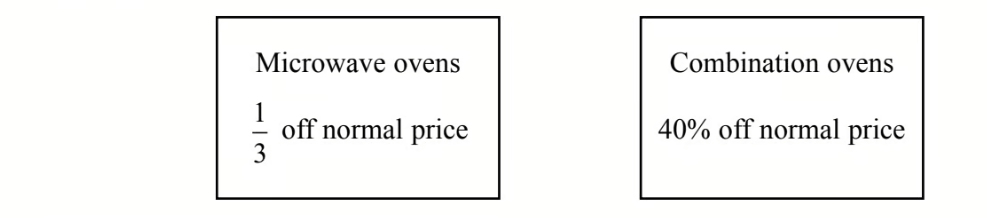
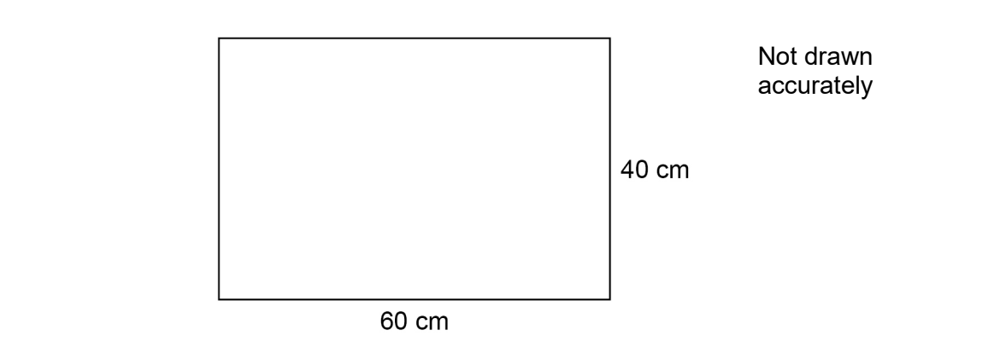

# Exam Questions — Using Percentages
**Number** · Edexcel IGCSE Maths A (Modular) (4XMAF/4XMAH) — 24/Higher Unit 2
> Source: [https://www.savemyexams.com/igcse/maths/edexcel/a-modular/24/higher-unit-2/topic-questions/number/percentages/exam-questions/](https://www.savemyexams.com/igcse/maths/edexcel/a-modular/24/higher-unit-2/topic-questions/number/percentages/exam-questions/) · 38 questions · total 137 marks

## Q1 — hard — 3 marks · exam-questions

### 11() — 3 marks — command: work_out — structured — from paper 2018	June · 1MA1/3H
In 2003, Jerry bought a house.

In 2007, Jerry sold the house to Mia. 
He made a profit of 20%

In 2012, Mia sold the house for £162 000. 
She made a loss of 10%

Work out how much Jerry paid for the house in 2003.

## Q2 — medium — 5 marks · exam-questions

### 6() — 5 marks — command: how — structured — from paper 2013	March · 1MA0/2H
Mr Watkins needs to buy some oil for his central heating.

Mr Watkins can put up to 1500 litres of oil in his oil tank. 
There are already 850 litres of oil in the tank. 
Mr Watkins is going to fill the tank with oil.

The price of oil is 67.2p per litre. 
Mr Watkins gets 5% off the price of the oil.

How much does Mr Watkins pay for the oil he needs to buy?

## Q3 — easy — 3 marks · exam-questions

### 16() — 3 marks — command: calculate — structured — from paper 2012	November · 1MA0/2H
Bill's weight decreases from 64.8 kg to 59.3 kg.

Calculate the percentage decrease in Bill's weight. 
Give your answer correct to 3 significant figures.

## Q4 — hard — 5 marks · exam-questions

### 9((a)) — 2 marks — command: verify — structured — from paper 2015	Spec2 · 1MA1/3H
Ibrar bought a house for `£ 145 space 000`

The value of the house depreciated by `4 percent sign` in the first year. The value of the house depreciated by `2.5 percent sign` in the second year.

Ibrar says,

"$4+2.5=6.5$ so in two years the value of my house depreciated by `6.5 percent sign`"

Is Ibrar right? 
You must give a reason for your answer.

### 9((b)) — 3 marks — command: work_out — structured — from paper 2015	Spec2 · 1MA1/3H
The value of Ibrar's house increases by `x percent sign` in the third year. 
At the end of the third year the value of Ibrar's house is `£ 140 space 000`.

Work out the value of $x$. 
Give your answer correct to $3$ significant figures.

## Q5 — medium — 4 marks · exam-questions

### 1() — 4 marks — command: how — structured — from paper 2015	November · 1MA0/1H
Sean wants to go on holiday.

He is going to get a loan of £720 to help pay for the holiday.

Sean will have to pay back the £720 plus interest of 15%. He will pay this back in 12 equal monthly installments.

How much money will Sean pay back each month?

## Q6 — easy — 3 marks · exam-questions

### 6() — 3 marks — command: work_out — structured — from paper Nov 2021 · 4MA1/2H
Victor buys 12 bottles of apple juice for a total cost of \$21
 Victor sells all 12 bottles at \$2.45 each bottle.

Work out Victor’s percentage profit.

.......................................................%

## Q7 — hard — 3 marks · exam-questions

### 20() — 3 marks — command: how — structured — from paper 2013	November · 1MA0/2H
In a sale normal prices are reduced by 20%.

A washing machine has a sale price of £464

By how much money is the normal price of the washing machine reduced?

## Q8 — medium — 3 marks · exam-questions

### 13() — 3 marks — command: express — structured — from paper 2016	June · 1MA0/1H
The table gives information about Ali's spending last month.

| **Item** | **Percentage of total spending** |
|---|---|
| rent | 30% |
| food | 15% |
| transport | 12% |
| other | 43% |

Ali's total spending last month was £800.

Next month Ali's rent, in pounds, is going to rise by 20%. His total spending will still be the same.

Express the amount of money Ali will spend on rent next month as a percentage of £800.

## Q9 — easy — 3 marks · exam-questions

### 6() — 3 marks — command: work_out — structured — from paper Specimen 2016 · 4MA1/1H
Lijuan’s salary is 180000 Hong Kong Dollars (HK\$). She gets a salary increase of 3%

Work out Lijuan’s salary after this increase.

HK\$ ..................................

## Q10 — hard — 4 marks · exam-questions

### 7() — 4 marks — command: which — structured — from paper 2015	Spec2 · 1MA1/1H
A shop has a sale.

A microwave oven has a sale price of £90 
A combination oven has a sale price of £84

Which of these ovens has the greater normal price?
You must show all your working.

## Q11 — medium — 3 marks · exam-questions

### 16() — 3 marks — command: work_out — structured — from paper 2013	June · 1MA0/1H
The normal price of a television is reduced by 30% in a sale.

The sale price of the television is £350.

Work out the normal price of the television.

## Q12 — easy — 3 marks · exam-questions

### 6() — 3 marks — command: verify — structured — from paper June 2018 · 8300/2H
The table shows information about the population of a city.

| **Population in 2001** | **Population in 2011** |
|---|---|
| 420 000 | 480 000 |

Liam claims,

“From 2011 to 2021 the population of the city will increase by    the same percentage as from 2001 to 2011”

He works out,

population increase from 2001 to 2011 = 480 000 – 420 000

= 60 000

population in 2021 = 480 000 + 60 000

= 540 000

Does the population of 540 000 match his claim? You **must** show your working.

## Q13 — hard — 3 marks · exam-questions

### 12() — 3 marks — command: find — structured — from paper June 2019 · 1MA1/1H
Here are three spheres.

The volume of sphere **Q** is 50% more than the volume of sphere **P.** 
The volume of sphere **R** is 50% more than the volume of sphere **Q.**

Find the volume of sphere **P** as a fraction of the volume of sphere **R.**

## Q14 — medium — 3 marks · exam-questions

### 22() — 3 marks — command: work_out — structured — from paper 2015	June · 1MA0/2H
Claire is making a loaf of bread.

A loaf of bread loses 12% of its weight when it is baked.

Claire wants the baked loaf of bread to weigh 1.1 kg.

Work out the weight of the loaf of bread before it is baked.

## Q15 — easy — 3 marks · exam-questions

### 5() — 3 marks — command: work_out — structured — from paper Specimen 2015 · 8300/3H
In 1999 the minimum wage for adults was £3.60 per hour.

In 2013 it was £6.31 per hour.

Work out the percentage increase in the minimum wage.

## Q16 — hard — 3 marks · exam-questions

### 10() — 3 marks — command: work_out — structured — from paper June 2019 · 1MA1/3H
Marie invests £8000 in an account for one year. 
At the end of the year, interest is added to her account.

Marie pays tax on this interest at a rate of 20% 
She pays £28.80 tax.

Work out the percentage interest rate for the account.

## Q17 — medium — 5 marks · exam-questions

### 14((a)) — 3 marks — command: work_out — structured — from paper 2015	November · 1MA0/2H
Each year Wenford Hospital records how long patients wait to be treated in the Accident and Emergency department.

In 2015 patients waited 11% less time than in 2014 
In 2015 the average time patients waited was 68 minutes.

Work out the average time patients waited in 2014 
Give your answer to the nearest minute.

### 14((b)) — 2 marks — command: work_out — structured — from paper 2015	November · 1MA0/2H
The hospital has a target to reduce the average time patients wait to be treated in the Accident and Emergency department to 60 minutes in 2016.

Work out the percentage decrease from 68 minutes to 60 minutes.

## Q18 — easy — 3 marks · exam-questions

### 3((b)) — 3 marks — command: work_out — structured — from paper June 2019 · J560/05
Ed has a card shop.

Ed’s profit on “Good Luck” cards in 2018 was £360. This was a decrease of 20% on his profit in 2017.

Work out Ed’s profit on “Good Luck” cards in 2017.

£ ......................................................

## Q19 — easy — 4 marks · exam-questions

### 3() — 4 marks — command: work_out — structured — from paper 2023 Nov  · 4MA1/1H
Joshua buys a car for \$12 500

He sells the car to Nina.

Nina pays

- a deposit of \$1500
- followed by 36 monthly payments of \$450

Work out Joshua’s percentage profit.

## Q20 — hard — 4 marks · exam-questions

### 14() — 4 marks — command: calculate — structured — from paper Jan 2021 · 4MA1/2HR
Simon bought a house at the beginning of 2018 
The value of Simon’s house had decreased by 15% by the end of 2018.

The house increased in value during both 2019 and 2020 
The percentage increases in the value of the house during 2019 and 2020 were the same.

The value of Simon’s house at the end of 2020 was 2.85% greater than the amount he paid for his house at the beginning of 2018.

Calculate the percentage increase in the value of the house during 2019.

## Q21 — medium — 2 marks · exam-questions

### 9() — 2 marks — command: what — structured — from paper 2017	June · 1MA1/1H
Jules buys a washing machine.

20% VAT is added to the price of the washing machine. Jules then has to pay a total of £600

What is the price of the washing machine with **no** VAT added?

## Q22 — hard — 3 marks · exam-questions

### 16() — 3 marks — command: work_out — structured — from paper Jan 2019 · 4MA1/2HR
Carlos, Flavia and Tazia shared `£ 861` between themselves.

The amount of money Flavia got is `65 percent sign` of the amount of money Carlos got. 
The amount of money Tazia got is `22 percent sign` **more** than the amount of money Carlos got.

Work out how much money Carlos got.

## Q23 — medium — 3 marks · exam-questions

### 6() — 3 marks — command: show — structured — from paper June 2018 · 1MA1/2H
A force of 70 newtons acts on an area of 20 cm2 

| pressure = $\frac{\mathrm{force}}{\mathrm{area}}$ |
|---|

The force is increased by 10 newtons. 
The area is increased by 10 cm2

Helen says,

"The pressure decreases by less than 20%"

Is Helen correct? 
You must show how you get your answer.

## Q24 — medium — 3 marks · exam-questions

### 8() — 3 marks — command: work_out — structured — from paper Specimen 2016 · 4MA1/2H
Ahmed, Behnaz and Carmen each have some money. Ahmed has 20% more money than Behnaz.

Carmen has $\frac{7}{8}$ of the amount of money that Behnaz has.

Carmen has 31.50 euros. 
Work out how much money Ahmed has.

.......................euros

## Q25 — medium — 3 marks · exam-questions

### 8() — 3 marks — command: work_out — structured — from paper Specimen paper · 4MA1/2H
Ahmed, Behnaz and Carmen each have some money.

Ahmed has 20% more money than Behnaz.

Carmen has  $\frac{7}{8}$ of the amount of money that Behnaz has.

Carmen has 31.50 euros.

Work out how much money Ahmed has.

## Q26 — hard — 2 marks · exam-questions

### 11((c)) — 2 marks — command: work_out — structured — from paper June 2019 · 4MA1/2H
During last season the cost of a ticket to watch Seapron United increased by 15% and then decreased by 8%.

Work out the overall percentage change in the cost of a ticket to watch Seapron United during last season.

## Q27 — medium — 2 marks · exam-questions

### 15() — 2 marks — command: give — structured — from paper 2015	Sample · 1MA1/1H
In a shop, all normal prices are reduced by `20 percent sign` to give the sale price.

The sale price of a TV set is then reduced by `30 percent sign`.

Mary says,

"$30+20=50$, so this means that the normal price of the TV set has been reduced by `50 percent sign`"

Is Mary right? 
You must give a reason for your answer.

## Q28 — hard — 4 marks · exam-questions

### 6() — 4 marks — command: work_out — structured — from paper June 2021 · 4MA1/2H
Mariana sells bags of bird food.

The bags that Mariana sold last week each contained 12kg of seeds.

The bags that she is going to sell next week will each contain a mixture of nuts and seeds where for each bag

weight of nuts : weight of seeds = 4 : 5

The total weight of the nuts and the seeds in each bag will be 19.35 kg

The weight of seeds in each bag that Mariana sells next week will be less than the weight of seeds in each bag that Mariana sold last week.

Work out this decrease as a percentage of the weight of seeds in each bag that Mariana sold last week. 
Give your answer correct to one decimal place.

....................................................... %

## Q29 — medium — 1 marks · exam-questions

### 18() — 1 mark — command: write — structured — from paper 2017	November · 1MA1/2H
At time *t* = 0 hours a tank is full of water.

Water leaks from the tank. 
At the end of every hour there is 2% less water in the tank than at the start of the hour.

The volume of water, in litres, in the tank at time *t* hours is *V**t*

Given that

*V**o*  = 2000 
*V**t +1* = *kV**t*

write down the value of *k*.

## Q30 — medium — 6 marks · exam-questions

### 6((a)) — 3 marks — command: work_out — structured — from paper Specimen paper · 4MA1/1H
Lijuan’s salary is 180000 Hong Kong Dollars (HK\$). 
She gets a salary increase of 3%

Work out Lijuan’s salary after this increase.

### 6((b)) — 3 marks — command: work_out — structured — from paper Specimen paper · 4MA1/1H
In a sale, all normal prices are reduced by 15% 
The sale price of a camera is HK\$6630

Work out the normal price of the camera.

## Q31 — hard — 4 marks · exam-questions

### 14() — 4 marks — command: show — structured — from paper Nov 2020 · 8300/3H
A rectangle has length 60 cm and width 40 cm

The length decreases by 15% 
The width decreases by 10%

Sue says,

‘‘The perimeter decreases by 25% because 15% + 10% is 25%’’

Is she must correct?

You **must **show calculations to support your answer.

## Q32 — medium — 4 marks · exam-questions

### 3() — 4 marks — command: work_out — structured — from paper 2023 June · 4MA1/1H
Nanette buys 60 notebooks for a total cost of 780 dirhams.

Nanette sells 70% of the notebooks for 22 dirhams each. 
She sells the remaining notebooks for 19 dirhams each.

Work out Nanette’s percentage profit. 
Give your answer correct to 3 significant figures.

## Q33 — hard — 4 marks · exam-questions

### 15() — 4 marks — command: work_out — structured — from paper Nov 2019 · 8300/3H
When you earn money you pay income tax. 
The amount you pay depends on how much you earn that year. You pay

0% on the first    £12500 you earn

20% on the next        £37 500 you earn

40% on the next        £112 500 you earn.

One year, Kim paid £9260 income tax.

Work out how much she earned that year.

£...........................

## Q34 — hard — 5 marks · exam-questions

### 21() — 5 marks — command: how — structured — from paper June 2019 · 8300/3H
Hanif makes green paint by mixing blue paint and yellow paint in the ratio

blue : yellow = 7 : 3

He buys blue paint in 50-litre containers, each costing £225 
He buys yellow paint in 20-litre containers, each costing £80

He wants to

sell the green paint in 5-litre tins make 40% profit on each tin.

How much should he sell each tin for?

£.......................................

## Q35 — hard — 6 marks · exam-questions

### 8() — 6 marks — command: calculate — structured — from paper Nov 2020 · J560/04
Lily buys and sells microwaves.

She buys each one for £32 and sells it for £60. 
She also pays £7 for the delivery of each microwave she sells.

If she sells a microwave that is faulty then Lily must pay for its repair and redelivery.  
This costs her another £25 for each faulty microwave.

Last month, 6 out of the 80 microwaves Lily sold were faulty.

This month she has orders for 133 microwaves.

Calculate her expected percentage profit on this month’s order.  Showing your working in the boxes below may help you present your work.

| Expected number of faulty microwaves: | Expected costs: |
|---|---|
| Income from sales: | Expected percentage profit: |

............................%

## Q36 — hard — 3 marks · exam-questions

### 10() — 3 marks — command: work_out — structured — from paper Nov 2020 · J560/06
Paintings are sold in an art gallery. 
The cost of a painting has $k$% commission added to it. 
Tax of 15% is then added to the total cost to give the price to pay.

Layla correctly calculates the price to pay by multiplying the cost of the painting by 1.403.

Work out the value of $k$.

$k=$................................

## Q37 — hard — 6 marks · exam-questions

### 10() — 6 marks — command: show — structured — from paper June 2019 · J560/06
In 2017, the value of a house increased by 4%. 
In 2018, the value of the house then decreased by 3%.

Teresa says

Over the two years the value of the house increased by exactly 1% because 4 – 3 = 1.

Show that Teresa is wrong.

## Q38 — hard — 6 marks · exam-questions

### 22() — 6 marks — command: show — structured — from paper Nov 2018 · J560/04
In a village the ratio of males to females is 2:1.

40% of the people in the village are right-handed males. 
25% of the people in the village are right-handed females.

Show that the proportion of females who are right-handed is greater than the proportion of males who are right-handed.
