# Mark Schemes — Prime Factors, HCF & LCM
**Number** · Edexcel IGCSE Maths A (Modular) (4XMAF/4XMAH) — 24/Higher Unit 2

## Q1 — hard — 3 marks · exam-questions

### 2((a)) — 2 marks
> *Find the prime factors of both numbers 40 and 56. *
*Factors trees are shown here.*

> * *

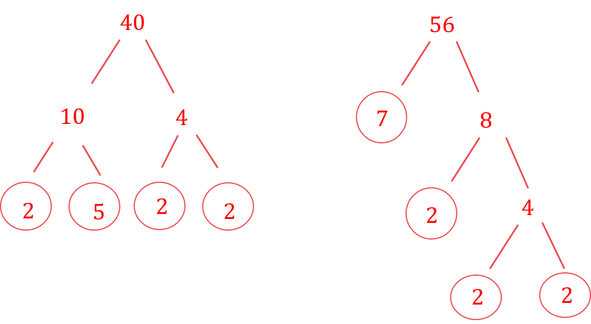

> *The prime factors of 40 are 2, 2, 2 and 5. *
*The prime factors of 56 are 2, 2, 2 and 7.*

**Correct method ****[1]**

> *The lowest common multiple is the product of the factors which exist in either list, ignoring repeats.   *
*An easy way of finding this is to sort the factors into a Venn diagram and then multiply the factors that are in all sections together.*

> * *

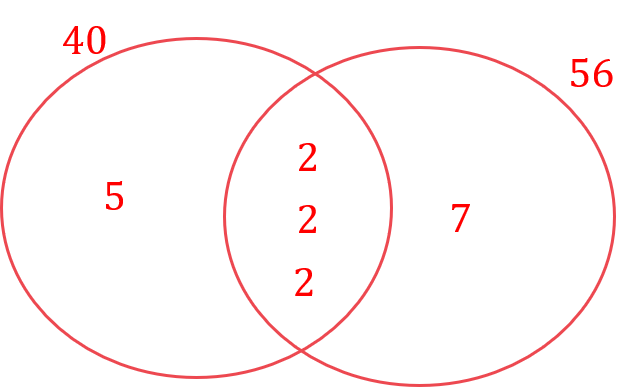

> *Multiply together all of the numbers in the Venn diagram.*

*LCM = 2 × 2 × 2 × 5 × 7*

** ****  LCM = 280 ****[1]**

### 2((b)) — 1 marks
> *The prime factors of **A** are 2, 2, 2, 3 and 5. *
*The prime factors of **B** are 2, 2, 3, 5 and 5.*

> *The highest common factor is the product of the factors which exist in both lists.   *
*There are two 2s, one 3 and one 5 in both lists, so multiply these together.*

*HCF = 2 × 2 × 3 × 5*

** ****  HCF = 60 ****[1]**

## Q2 — medium — 3 marks · exam-questions

### 7() — 3 marks
> *Find the lowest common multiple (LCM) of 20 and 24. List the multiples of both numbers until you find one that is common.*

*20 , 40, 60, 80, 100, 120, 140 ... *

*24, 48, 72, 96, 120... *

**1 mark for each correct list ****[2]**

> *The smallest number that is in both lists is 120. The next time will be after 120 minutes, divide by 60 to find this in hours.*

*120 minutes = 120 ÷ 60 = 2 hours*

> *They will next leave at the same time after 2 hours.*

**11.00 am**** [1]**

## Q3 — easy — 3 marks · exam-questions

### 5() — 3 marks
> *Either a factor tree or repeated division could be used here. *

> *Start with the number 525 and choose any two numbers that multiply together to make 525. Break it down into these two numbers and circle any prime numbers.*

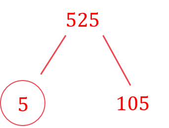

> *Repeat this with the next numbers until all of the values are prime numbers and cannot be broken down any further.*

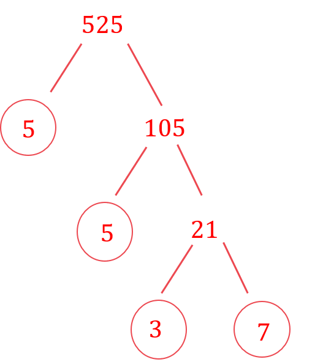

** Correct method**** ****[1]**
**  All factors c****orrect ****[1]**

> *The answer will be the same regardless of the factors chosen in the first step.*

> *Write the prime numbers out as a product, any repeated prime numbers can be written as a power.*

** ****  **$3\times5^{2}\times7$**[1]**

## Q4 — hard — 3 marks · exam-questions

### 10() — 3 marks
> *Lamp A flashes every 20 seconds and lamp C flashes every 120 seconds, so lamp C flashes every 6th time that lamp A flashes, as 20 × 6 = 120.*

> *This means that every time lamp C flashes, lamp A also flashes, so we only need to worry about when lamps B and C flash together.*

> *Find the times when lamps B and C flash together by finding the LCM of 45 and 120.  *
*Find the prime factors of both numbers 45 and 120.  Factors trees are shown here.*

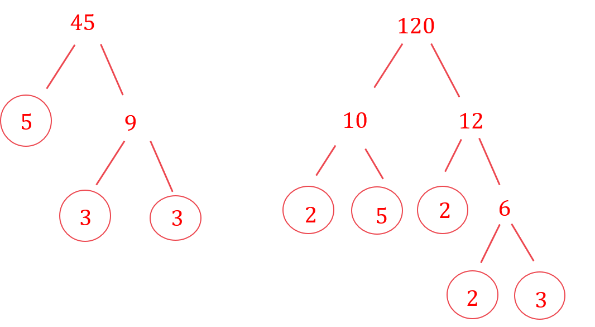

> *The prime factors of 45 are 3, 3 and 5. The prime factors of 120 are 2, 2, 2, 3 and 5.*

**Correct method ****[1]**

> *The lowest common multiple is the product of the factors which exist in either list, ignoring repeats. *
*An easy way of finding this is to sort the factors into a Venn diagram and then multiply the factors that are in the Venn diagram together.*

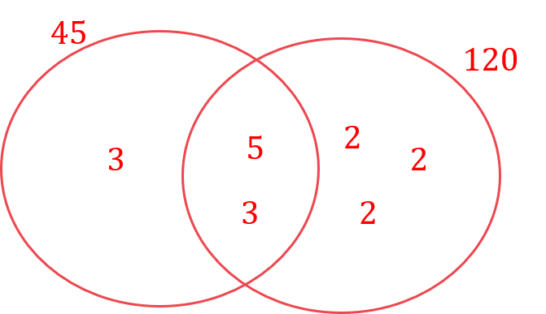

> *Multiply together the numbers that are in all sections.*

*LCM  = 2 × 2 × 2 × 3 × 3 × 5 = 360*

> *Lamps B and C will flash together every 360 seconds. *

> *Find how many times this is in one hour.*

*1 hour = 60 minutes × 60 seconds = 3600 seconds*

*3600 ÷ 360 = 10 *

**Correct method ****[1]**

** ****  The lamps will all flash together ten times per hour ****[1]**

## Q5 — medium — 4 marks · exam-questions

### 7() — 4 marks
i) *Find the lowest common multiple (LCM) of 12 and 20. List the multiples of both numbers.*

*12 , 24, 36, 48, 60, 72 ... *

*20, 40, 60, ...*

**Attempting both lists ****[1]**

> *The smallest number that is in both lists is 60. Rita buys exactly 60 cheese slices and burgers.*

> *Find the number of packs of each by dividing 60 by 12 for the number of burger boxes and 20 for the number of packs of cheese.*

*60 ÷ 12 = 5 *
*60 ÷ 20 = 3*

**[1]**

**3 packets of cheese slices      **
**5 boxes of burgers**** [1]**

ii) *Rita buys 60 individual burgers and 60 individual cheese slices (from (i), so she needs 60 bread rolls.*

**60 bread rolls ****[1]**

## Q6 — easy — 2 marks · exam-questions

### 2() — 2 marks
> *Either a factor tree or repeated division could be used here. *

> *Start with the number 56 and choose any two numbers that multiply together to make 56. Break it down into these two numbers and circle any prime numbers.*

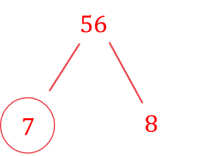

> *Repeat this with the next numbers until all of the values are prime numbers and cannot be broken down any further.*

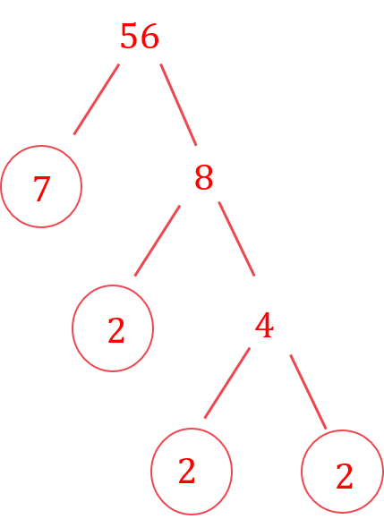

** ****Correct method ****[1]**

> *The answer will be the same regardless of the factors chosen in the first step.*

> *Write the prime numbers out as a product, any repeated prime numbers can be written as a power.*

** ****  **$2^{3}\times7$**[1]**

## Q7 — hard — 5 marks · exam-questions

### 14() — 5 marks
> *To buy the same number of cakes as sausage rolls you will need a common multiple of 12 and 8. *
*To buy more than 60 of both, you will need to find the smallest common multiple of 12 and 8 that is greater than 60.*

> *Using prime factor decomposition will find the LCM, which may be less than 60, so instead list the multiples of both 8 and 12 that are greater than 60, until you find the smallest number that is in both lists. *

*Multiples of 12, greater than 60:  72, 84, 96, 108 *
*Multiples of 8, greater than 60:  64, 72, ...*

> *The smallest number in both lists is 72.*

**Correct method ****[1] **
**Correct answer ****[1]**

> *Find the number of boxes of cakes and packs of sausage rolls Ali needs in order to buy 72 of each.*

*Cakes: 72 ÷ 12 = 6** *
*Sausage rolls: 72 ÷ 8 = 9*

**[1]**

> *Ali needs 6 boxes of cakes and 9 boxes of sausage rolls.*

> *Find the cost of 6 boxes of cakes, at £2.50 each.*

*6 × 2.5 = 15*

> *Find the cost of 9 boxes of sausage rolls, at £1.20 each.*

*9 × 1.2 = 10.8*

> *6 boxes of cakes cost £15 and 9 boxes of sausage rolls cost £10.80.*

> *Find the total cost by adding them together.*

*15 + 10.8 = 25.8*

**Correct method ****[1]**

** ****  The least total cost is £25.80 ****[1]**

## Q8 — medium — 3 marks · exam-questions

### 9() — 3 marks
> *Find the lowest common multiple (LCM) of 50 and 80. List the multiples of both numbers until you find one that is common.*

*50 , 100, 150, 200, 250, 300, 350, 400 ... *

*80, 160, 240, 320, 400... *

**Attempt at both lists ****[1]**

> *The smallest number that is in both lists is 400. The next time will be after 400 seconds, divide by 400 by the amount of time taken for each lap for each person. (Or count the number of digits in each list up to 400.) *

*Matt: 400 ÷ 50 = 8 laps*
*Dan: 400 ÷ 80 = 5 laps*

**[1]**

**Matt: 8 laps   **
**     Dan: 5 laps **** [1]**

## Q9 — easy — 2 marks · exam-questions

### 1() — 2 marks
> *Either a factor tree or repeated division could be used here. *

> *Start with the number 36 and choose any two numbers that multiply together to make 36. Break it down into these two numbers and circle any prime numbers.*

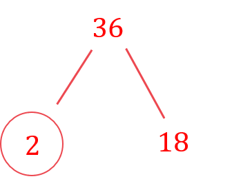

> *Repeat this with the next numbers until all of the values are prime numbers and cannot be broken down any further.*

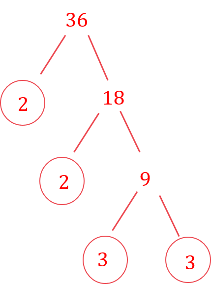

** ****Correct method ****[1]**

> *The answer will be the same regardless of the factors chosen in the first step.*

> *Write the prime numbers out as a product, any repeated prime numbers can be written as a power.*

** ****  **$2^{2}\times3^{2}$**[1]**

## Q10 — hard — 3 marks · exam-questions

### 9() — 3 marks
> *John must have bought the same number of pens as pencils. *
*To find the same number of pens and pencils you will need a common multiple of 40 and 15. *
*More than one answer is possible, but it is easiest to find the lowest common multiple of 40 and 15.  *

> *Using prime factor decomposition will find the LCM, however sometimes it is quicker to find it by listing the multiples. *

*Multiples of 40:  40, 80, 120, 160, 200, ... *
*Multiples of 15:  15, 30, 45, 60, 75, 90, 105, 120, ...*

> *The smallest number in both lists is 120.*

**Correct method ****[1] **
**Correct answer ****[1]**

> *Find the number of boxes of pens and packets of pencils John bought in order to buy 120 of each.*

*120 is the third number in the list of multiples of 40, so John bought 3 boxes of pencils *
*120 is the eighth number in the list of multiples of 15, so John bought 8 packets of pens*

**3 boxes of pencils and 8 packets of pens**** [1]**** **
**There are other possible correct answers, e.g. 6 and 16.**

## Q11 — medium — 5 marks · exam-questions

### 13((a)) — 3 marks
> *Either a factor tree or repeated division could be used here. *

> *Start with the number 180 and choose any two numbers that multiply together to make 180. *
*Break it down into these two numbers and circle any prime numbers.*

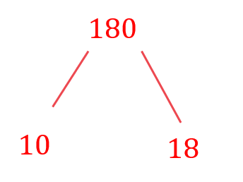

> *Repeat this with the next numbers until all of the values are prime numbers and cannot be broken down any further.*

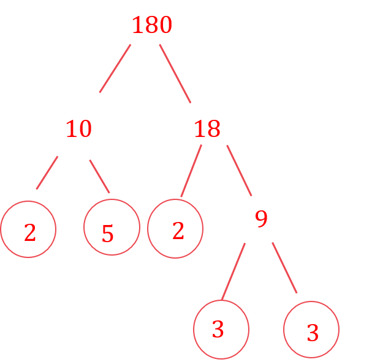

** ****Correct method ****[1] **
** All factors c****orrect ****[1]**

> *The answer will be the same regardless of the factors chosen in the first step.*

> *Write the prime numbers out as a product, any repeated prime numbers can be written as a power.*

** ****  **$2^{2}\times3^{2}\times5$**[1]**

### 13((b)) — 2 marks
> *6 is a factor of both numbers so the numbers must both be a multiple of 6. Choose one of the numbers as 6, to make sure the 6 is the highest common factor (choosing a multiple of 6 could mean that 6 is not the highest common factor).*

> *List the first few multiples of 6.*

*6, 12, 18, 24, 30, 36, ...*

> *  If the lowest common multiple is a multiple of 15, then the lowest common multiple could be 15, 30, 45, 60 etc. 30 is in both lists, so 30 is the second number (a multiple of 6 and 15).*

**Two possible answers are 6 and 30 **** **
**Both numbers have a HCF of 6 ****[1]  **
**Both numbers have an LCM of a multiple of 15 ****[1] **
**There are other possible correct answers, e.g. 12 and 30.**

## Q12 — easy — 3 marks · exam-questions

### 8() — 3 marks
> *Find the lowest common multiple (LCM) of 9 and 12. List the multiples of both numbers.*

*9 , 18, 27, 36, 45, 54, ... *

*12 , 24, 36, ... *

**1 mark for each correct list ****[2]**

> *The smallest number that is in both lists is 36. *
*The next time will be after 36 minutes.*

**9.36 am**** [1]**

## Q13 — hard — 3 marks · exam-questions

### 6() — 3 marks
> *If Liz bought the same number of red, silver and gold buttons  then the number of each that she bought must be a multiple of 8, 6 and 5. *
*Find the LCM of 8, 6 and 5.  *
*This can be done by listing the multiples or by finding the prime factor decomposition of each number. *
*Find the prime factors of both numbers 8 and 6 (5 is already a prime number).  *
*Factors trees are shown here.*

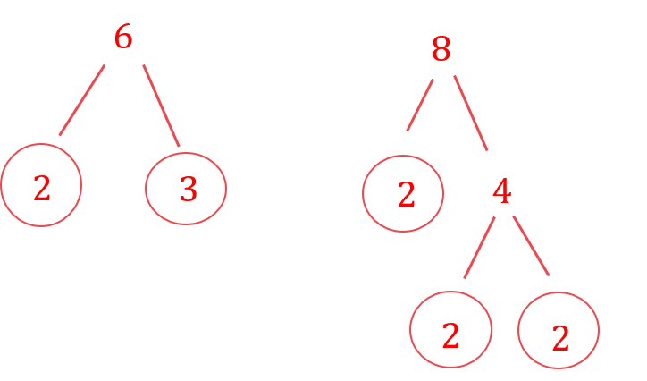

> *The prime factors of 8 are 2, 2 and 2. *
*The prime factors of 6 are 2 and 3. *
*The prime factor of 5 is 5.*

**Correct method ****[1]**

> *The lowest common multiple is the product of the factors which exist in either list, ignoring repeats. *
*An easy way of finding this is to sort the factors into a Venn diagram and then multiply the factors that are in the Venn diagram together.*

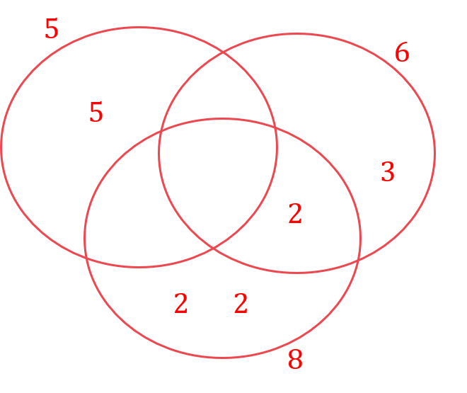

> *Multiply together the numbers that are in all sections.*

*LCM  = 2 × 2 × 2 × 3 × 5 = 120*

**Correct method ****[1]**

> *This means that the least amount of each type of buttons Liz could have bought is 120.*

> *Find the number of packets by dividing 120 buttons by the number of buttons in each pack.*

*Red = 120 ÷ 8 = 15  *
*Silver = 120 ÷ 6 = 20 *
*Gold = 120 ÷ 5 = 24  *

** ****  15 packets of red buttons       **
**20 packets of silver buttons      **** **
**24 packets of gold buttons ****[1] **
**This is the minimum number of buttons Liz could buy. Multiples of these also accepted.**

## Q14 — medium — 2 marks · exam-questions

### 3() — 2 marks
> *Find the prime factors of both numbers 72 and 90.  Factors trees are shown here.*

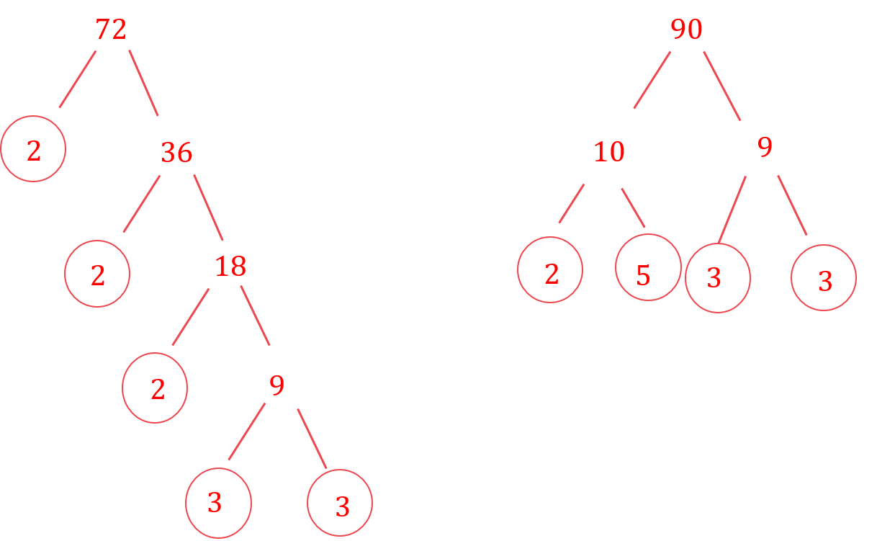

> *The prime factors of 72 are 2, 2, 2, 3 and 3. *
*The prime factors of 90 are 2, 3, 3 and 5.*

**Correct method ****[1]**

> *The highest common factor is the product of the factors which exist in both lists. *
*An easy way of finding this is to sort the factors into a Venn diagram and then multiply the factors that are in the overlapping section together.*

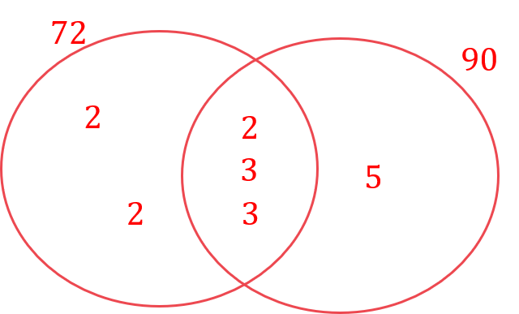

> *Multiply together the numbers that are in the overlapping section.*

*HCF = 2 × 3 × 3*

** ****  HCF = 18 ****[1]**

## Q15 — easy — 3 marks · exam-questions

### 1() — 3 marks
*Start by splitting 600 up as 3 times 200* 
*Repeat this, splitting each number up using a prime factor*

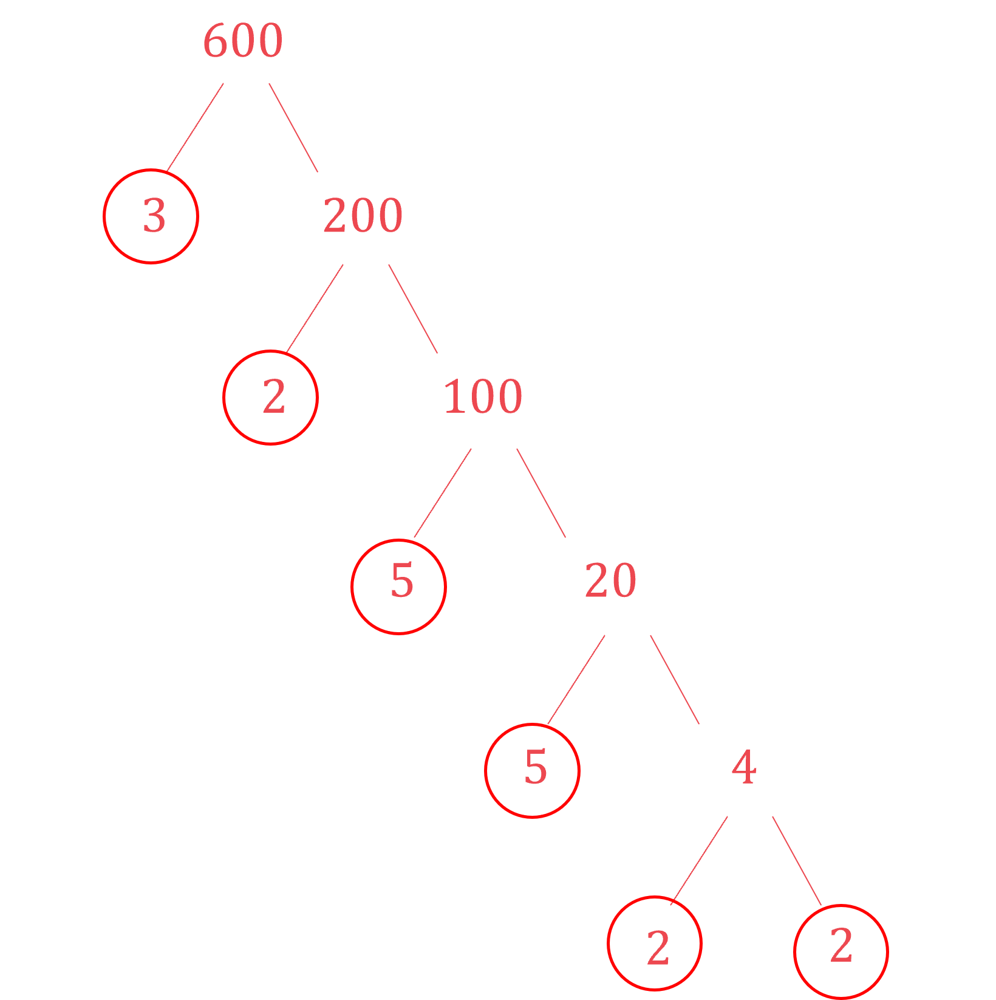

* ***Correct method ****[1]** ** **
**All factors correct ****[1]**

**600 = 2****3**** × 3 × 5****2** **[1]**

## Q16 — hard — 4 marks · exam-questions

### 6((a)) — 2 marks
> *Find the prime factors of both numbers 96 and 120. *
*Factors trees are shown here.*

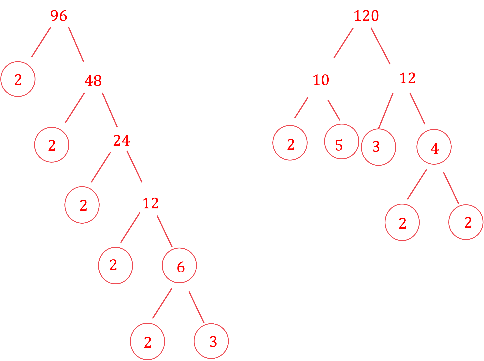

**any correct method to write 96 or 120 as products of primes ****[1]**

> *The prime factors of 96 are 2, 2, 2, 2, 2, 3 (96 = 2**5** × 3) and the prime factors of 120 are 2, 2, 2, 3, 5 (120 = 2**3** × 3 × 5).*

> *From this we can create a Venn diagram with the prime factors of both numbers.*

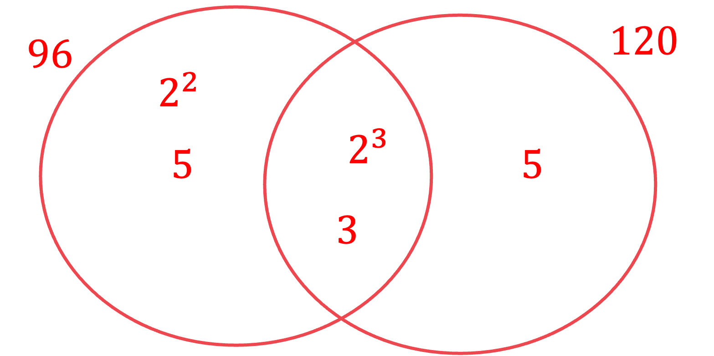

> *The HCF is the product of the prime factors which exist in the overlapping part of the Venn diagram*

*HCF = *$2^{3}\times3$

**HCF = 24*** ***[1]**

### 6((b)) — 2 marks
> *First it might be helpful to write the numbers as products of primes without the powers.*

$A=2\times2\times2\times5\times7\times7\times11\,B=2\times2\times2\times2\times7\times11\,C=3\times5\times5$

> *Now put the prime factors into a Venn diagram.*

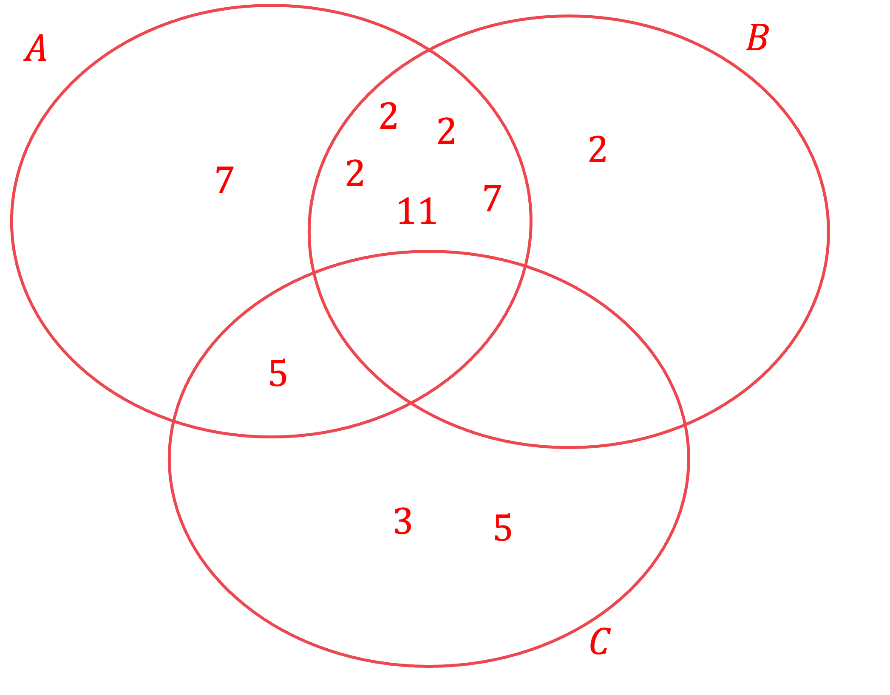

**[1]**

> *The LCM is the product of the prime numbers in the Venn diagram (in *$A\cupB\cupC$*)*

`table row LCM equals cell 7 cross times 2 cross times 2 cross times 2 cross times 11 cross times 7 cross times 2 cross times 5 cross times 3 cross times 5 end cell row blank equals cell 2 to the power of 4 cross times 3 cross times 5 squared cross times 7 squared cross times 11 end cell end table`

> *Use your calculator to evaluate the number.*

**LCM = 646 800** **[1]**

## Q17 — medium — 4 marks · exam-questions

### 10((a)) — 3 marks
> *Use a factor tree or repeated division to break 480 into its product of prime factors. E.g.*

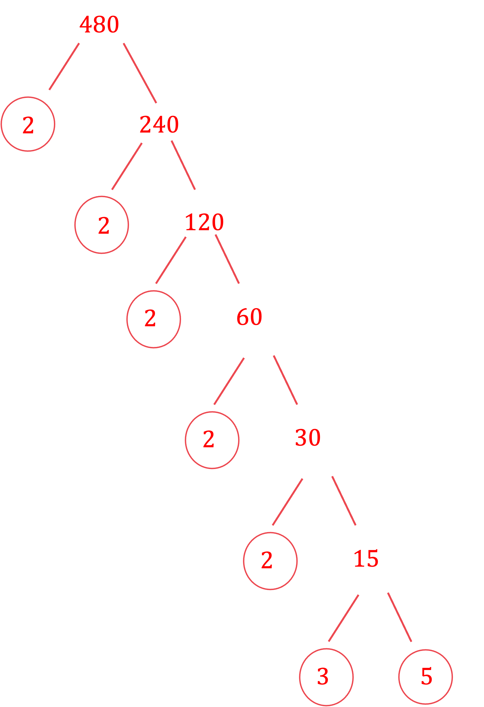

$480=2^{5}\times3\times5$

> *In the same way, 10 can also be broken down into prime factors.*

`10 to the power of 9 equals open parentheses 2 cross times 5 close parentheses to the power of 9`

> *Use the index law *`open parentheses a b close parentheses to the power of n equals a to the power of n cross times b to the power of n`*.*

$10^{9}=2^{9}\times5^{9}$

**tree diagram or "2****5**** × 3 × 5" or "2****9**** × 5****9****"**** [1]**

> *Combine the products of primes of 480 and 10**9**.*

`table row cell 480 cross times 10 to the power of 9 end cell equals cell 2 to the power of 5 cross times 3 cross times 5 cross times 2 to the power of 9 cross times 5 to the power of 9 end cell row blank equals cell 2 to the power of 5 cross times 2 to the power of 9 cross times 3 cross times 5 cross times 5 to the power of 9 end cell end table`

> *Using the index law *$a^{m}\timesa^{n}=a^{m+n}$*.*

`table row cell 480 cross times 10 to the power of 9 end cell equals cell equals 2 to the power of 5 plus 9 end exponent cross times 3 cross times 5 to the power of 1 plus 9 end exponent end cell end table`

**Final answer:** **Answer**`table row blank bold equals cell bold 2 to the power of bold 14 bold cross times bold 3 bold cross times bold 5 to the power of bold 10 end cell end table`

**2****m**** × 3 × 5****n**** where m and n are positive integers ****[1] **
**fully correct answer**** [1]**

### 10((b)) — 1 marks
> *The largest odd factor of **N** is the product of the odd prime factors. There are only two odd prime factors; 3 and 5**10**.*

*largest odd factor = *$3\times5^{10}$

**Answer = **$3\times5^{10}$ **[1]**

## Q18 — easy — 2 marks · exam-questions

### 10() — 2 marks
> *8 as a product of primes is 2**3** . So multiplying by 8 is the same as multiplying by 2**3**.*

`table row cell 8 A end cell equals cell 8 cross times 2 to the power of n cross times 3 cross times 5 to the power of m end cell row blank equals cell 2 cubed cross times 2 to the power of n cross times 3 cross times 5 to the power of m end cell end table`

**[1]**

> *Use the laws of indices to write "2**3** × 2**2**" as one power (add the powers).*

$8A=2^{3+n}\times3\times5^{m}$ **[1]**

## Q19 — hard — 2 marks · exam-questions

### 6((b)) — 2 marks
> *In **B, m **> 2 therefore the power of 5 must be at least 3. But the power of 5 in **A** is only 2, so the highest common factor that is a power of 5 will be 5**2**.*

> *Likewise in **B**, if **n** > 10, the power of 7 in **B** is at least 6. But the power of 7 in **A** is only 4, so the highest common factor that is a power of 7 is 7**4**.*

> *In **A**, **p** > 1 so the power of 11 must be at least 2. However the power of 11 in **B** is only 1 so the highest common factor that is a power of 11 is 11**1**.*

**HCF = 5****2**** × 7****4**** × 11 **
**two of  5****2****, 7****4**** and 11****1**** correct ****[1] **
**all correct ****[1]**

## Q20 — medium — 4 marks · exam-questions

### 8((a)) — 2 marks
> *A** and **B** have already been given as products of primes so we can put the prime factors into a Venn diagram. It is helpful to know the **laws of indices**.*

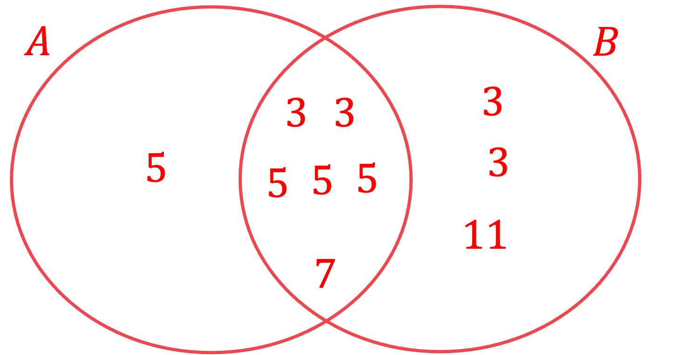

**[1]**

> *The HCF is the product of the primes in the overlapping part of the Venn diagram (*$A\capB$*).*

*HCF =** *$3^{2}\times5^{3}\times7$

> *Evaluate this using your calculator.*

**HCF = 7875** **[1]**

### 8((b)) — 2 marks
> *A** and **B** have already been given as products of primes so we can easily put the prime factors into a Venn diagram.*

**[1]**

> *The LCM is the product of the primes in the Venn diagram (*$A\cupB$*).*

*HCF =** *$5\times3^{2}\times5^{3}\times7\times3^{2}\times11$

> *Evaluate this using your calculator.*

**LCM = 3 898 125** **[1]**

## Q21 — easy — 4 marks · exam-questions

### 5((a)) — 3 marks
> *Use factor tree method or repeated division. E.g.*

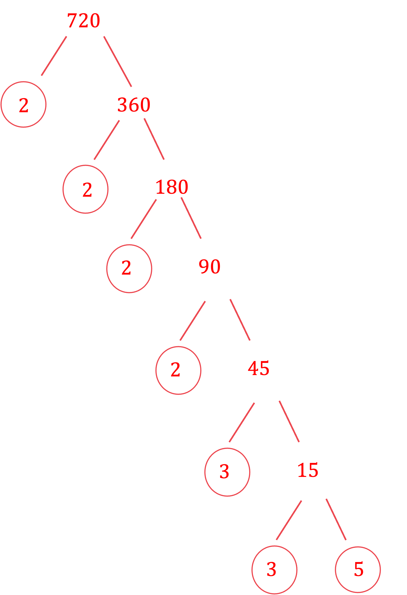

**[1]**

**720 = 2 × 2 × 2 × 2 × 3 × 3 × 5 = 2****4**** × 3****2**** × 5 ****[1] **
**You can write the final answer in either of the above forms**

### 5((b)) — 1 marks
> *Method 1*

> *If your answer to (a) is written in the form "2 × 2 × 2 × 2 × 3 × 3 × 5" then we can rearrange this to*

*[2 × 2 × 3] × [2 × 2 × 3] × 5*

> *[2 × 2 × 3] × [2 × 2 × 3] is already square so to make the full number square we would need to multiply by another 5 so the number becomes*

*[2 × 2 × 3 × 5] × [2 × 2 × 3 × 5]*

> *Using your calculator to evaluate this number gives 3600 (which is square)*

> *So the answer must be 5*

**5**** [1]**

> *Method 2*

> *If your answer to (a) is written in the form "2**4** × 3**2** × 5" then we can see that "2**4** × 3**2**" is already square (all even powers are square numbers, 2**4** × 3**2** = [2**2** × 3] × [2**2** × 3])*

> *To make the full number square, we would need to multiply by another 5 so the number becomes*

*2**4** × 3**2** × 5**2*

> * Using your calculator to evaluate this number gives 3600 (which is square)*

> *So the answer must be 5*

**5 ****[1]**

## Q22 — hard — 2 marks · exam-questions

### 8((b)) — 2 marks
> *We can create a Venn diagram of the prime factors for all three numbers*

*Only **B** and **C** have a shared factor of 2, and the HCF of **B** and** C** contains the term 2**3** so this must be in the overlap between **B** and** C** (but not in **A**)* 
*As the LCM of **A** and **C** contains 2**4**, but we know that **A** does not have a factor of 2, the **C** circle (the part which is only **C**) needs an extra 2 to make the total within **C**, 2**4*

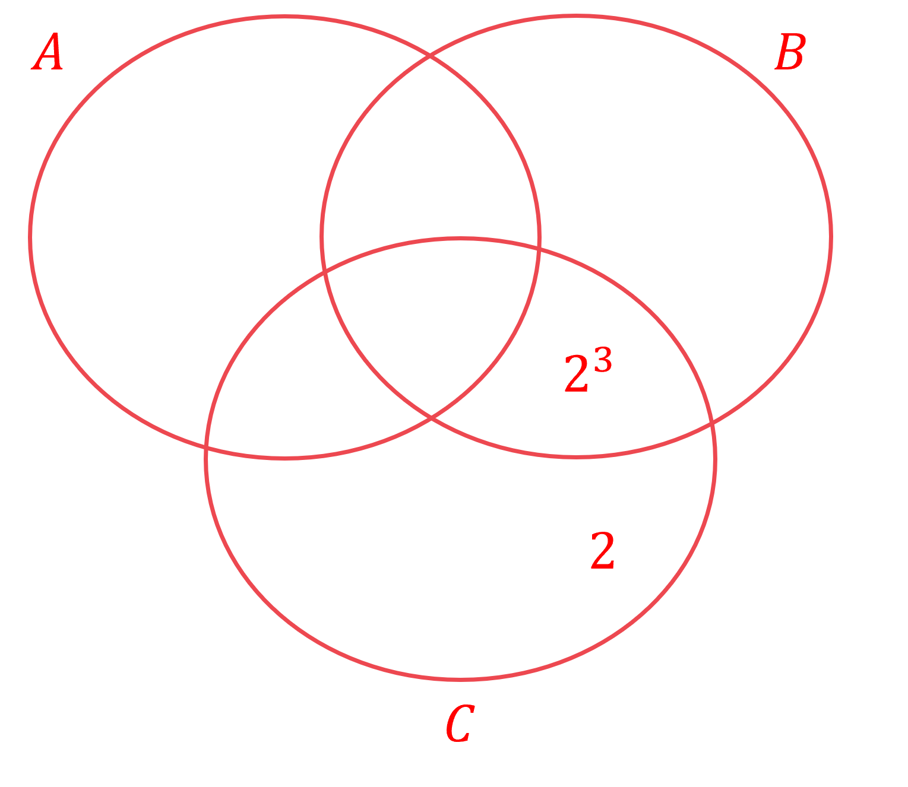

> *Only **A** and **B** have a shared factor of 3, **B** contains 3**1** and **A** contains 3**5** so we can put 3**1** into the overlap between **A** and **B** (but not in **C**), and then 3**4** into the "only** A**" section*

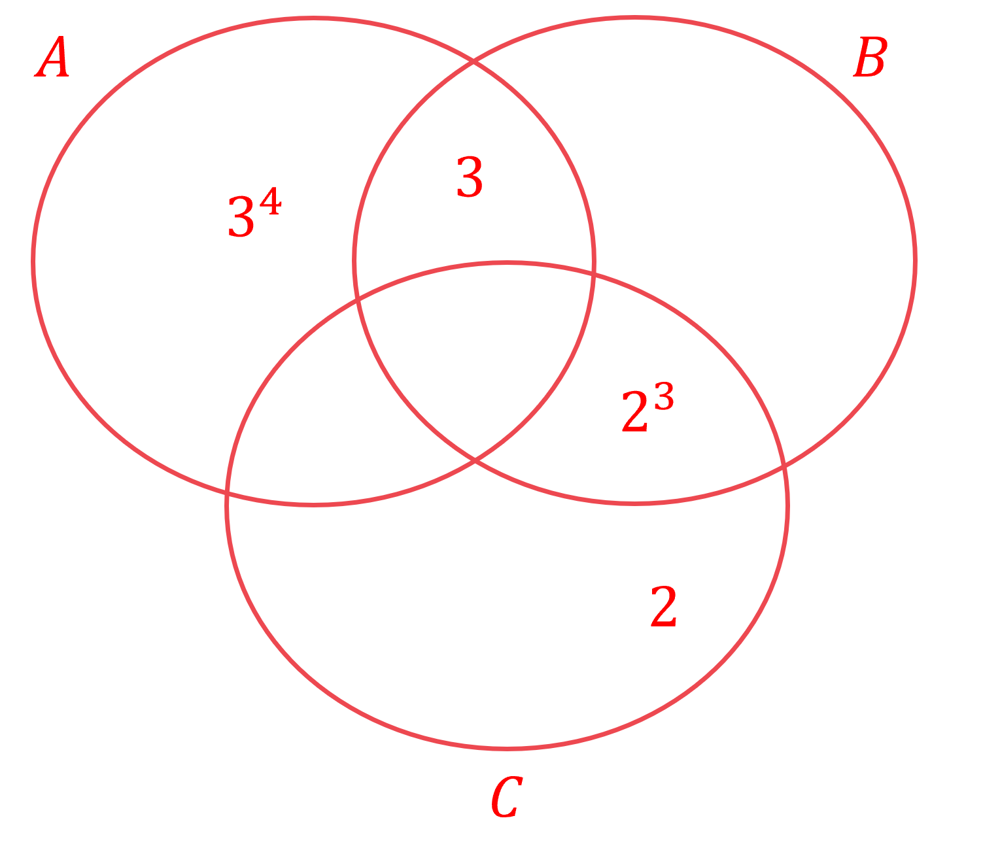

*Only **A** and **C** have a shared factor of 5, so there must be a power of 5 in the overlapping region between **A** and **C** (but not in **B**). **A** only contains 5**1**, so we can place 5**1** in the overlap* 
*The LCM of **A** and **C** contains 5**2**, so the remaining 5 must be in the "only **C**" section*

*All three of **A, B, C** contain a factor of 7, so there must be a power of 7 in the centre* 
*The HCF of **B** and **C** only contains 7**1**, so the power of 7 in the centre of the diagram will be 7**1*

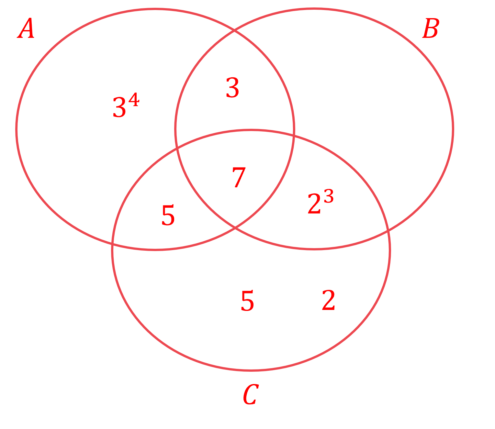

*A** contains a factor of 7**3**, so needs two more 7s* 
*B** contains a factor of 7**4**, so needs three more 7s* 
*This means we can put a 7**2** in the overlap between **A** and **B**, and then the remaining 7 in the "only** B**" section*

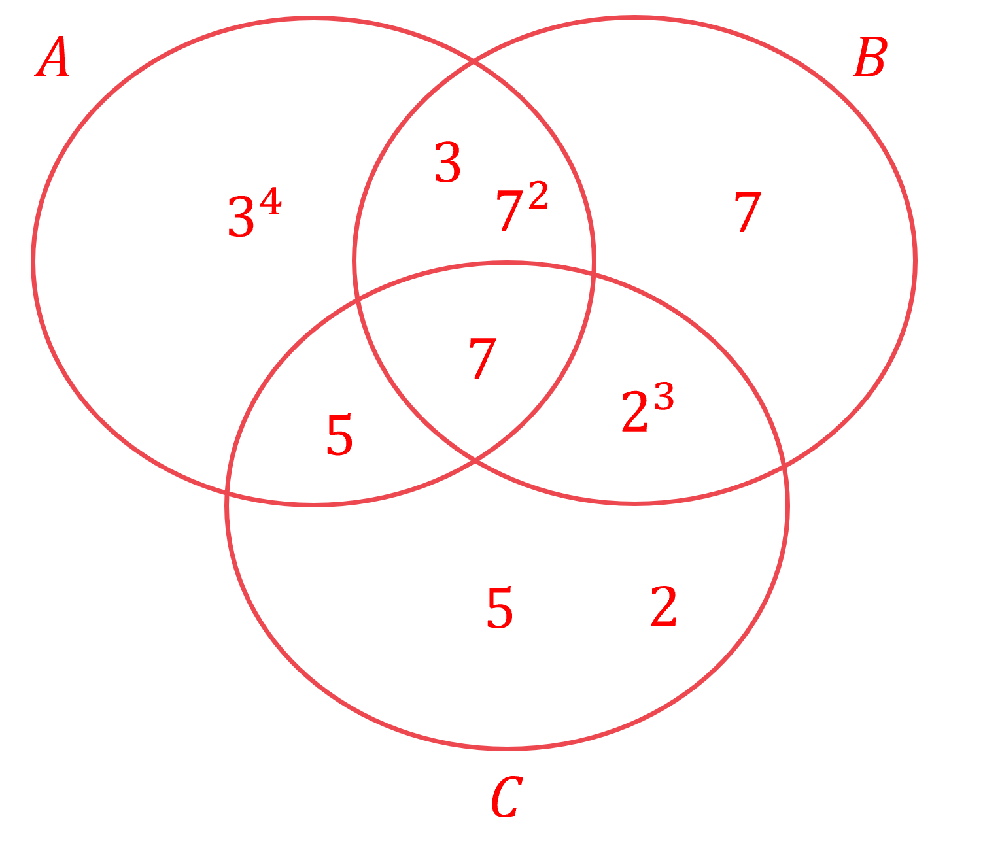

**Correct Venn diagram ****[1]**

> *Now that the Venn diagram is complete, we can read-off the factors of **C*

**C*** = 2×2**3**×5×5×7 = 2**4**×5**2**×7*

> *Recall that** C** was 2**p**×2**q**×2**r*

**p**** = 4** 
**q**** = 2**
 **r**** = 1** **[1]** 
**If Venn diagram not used then 1 mark out of 2 for either finding ****r****, or finding ****p**** and ****q**

## Q23 — medium — 2 marks · exam-questions

### 8((a)) — 2 marks
> *A** and **B** have already been given as products of primes so we can put the prime factors into a Venn diagram. It is helpful to know the **laws of indices**.*

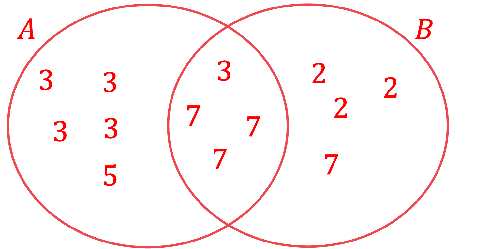

i) *The HCF is the product of the primes in the overlapping part of the Venn diagram (*$A\capB$*).*

**HCF =*** *$3\times7^{3}=1029$* ***[1] **
**You can write your final answer in either of the forms above**

ii) *The LCM is the product of the primes in the Venn diagram (*$A\cupB$*). Starting at the left of the Venn diagram;*

*LCM = *$3^{4}\times5\times3\times7^{3}\times2^{3}\times7$

> *Combine these using the laws of indices.*

**LCM =**** **$2^{3}\times3^{5}\times5\times7^{4}=23337720$* ***[1] **
**You can write your final answer in either of the forms above**

## Q24 — easy — 3 marks · exam-questions

### 7() — 3 marks
> *Rewrite without standard form*

> *3.6 × 10**3** = 3.6 × 1000 = 3600*

> *Use a factor tree to break down 3600 into its prime factors*

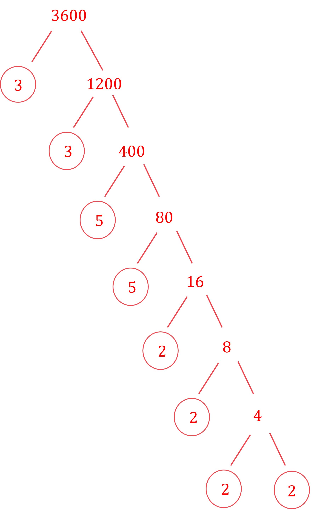

**At least 2 correct stages**** [1]**

*3600 = 2×2×2×2×3×3×5×5*

**[1]**

**3600 = 2****4**** × 3****2**** × 5****2**** ****[1]**

## Q25 — hard — 4 marks · exam-questions

### 5() — 4 marks
> *To maximise the value of *$\frac{a}{b}$*, we want the biggest value of **a** and the smallest value of **b*

> *This means we want to find the highest common factor of 72 and 120, and the lowest common multiple of 6 and 9*

**Identifying strategy ****[1]**

> *Finding the highest common factor of 72 and 120:*

> *Find the prime factors of 72 and 120 and write them in a Venn diagram*

*72 = 2**3** × 3**2** and 120 = 2**3** × 3 × 5*

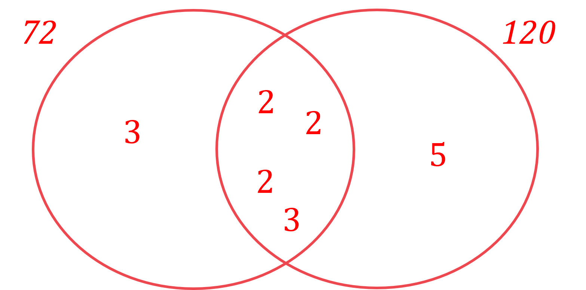

> *The highest common factor is the product of the numbers in the overlapping section in the middle*

*2×2×2×3=24 is the HCF of 72 and 120, so the value of ***a = 24**

**[1]**

> *Finding the lowest common multiple of 6 and 9:*

> *As these numbers are quite small, it is easier to just list out their multiples than use a Venn diagram*

*6, 12, ****18*** 
*9, ****18***

*The LCM of 6 and 9 is 18, so the value of ***b = 18**

**[1]**

> *Finding *$\frac{a}{b}$

$\frac{a}{b}=\frac{24}{18}$

> *Simplify by dividing numerator and denominator by 6*

$\frac{a}{b}=\frac{4}{3}$ **[1]**

## Q26 — medium — 2 marks · exam-questions

### 6((a)) — 2 marks
> *Find the prime factor decomposition of both numbers*

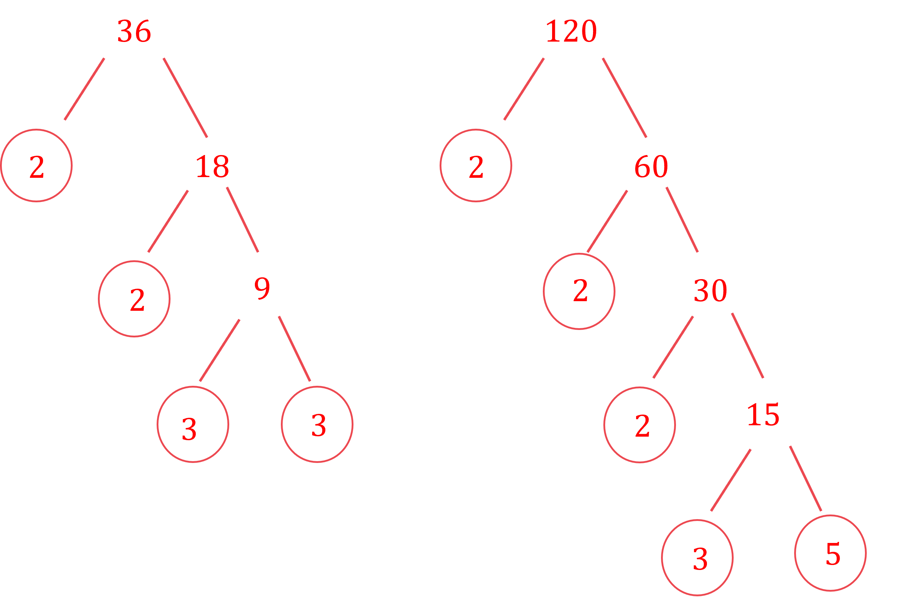

*36 = 2×2×3×3 = 2**2** × 3**2* 
*120 = 2×2×2×3×5 = 2**3** × 3 × 5*

**[1]**

> *We can put the prime factors into a Venn diagram*

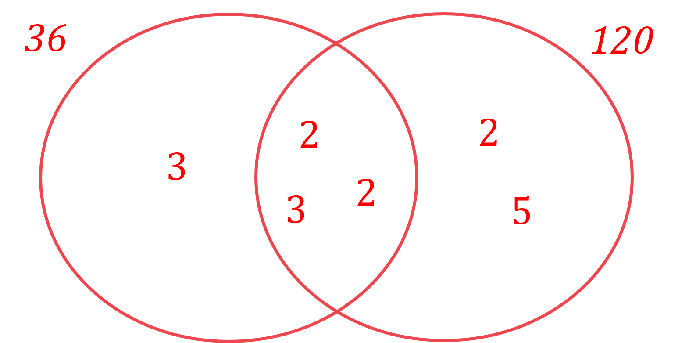

> *To find the lowest common multiple (LCM), multiply together all the numbers in the Venn diagram*

*3 × 2 × 2 × 3 × 2 × 5 = 360*

**LCM = 360** **[1]**

## Q27 — easy — 2 marks · exam-questions

### 1((b)) — 2 marks
> *Use factor tree method or repeated division. E.g.*

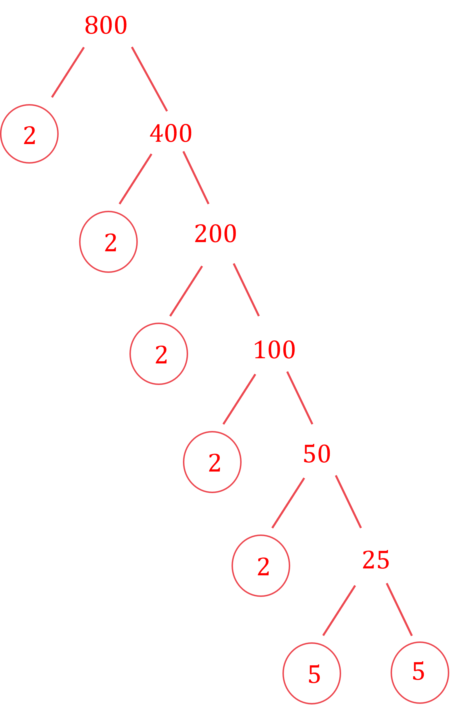

**[1]**

*800 = 2 × 2 × 2 × 2 × 2 × 5 × 5*

**800 = 2****5**** × 5****2**** [1]**

## Q28 — hard — 3 marks · exam-questions

### 21() — 3 marks
> *Write out *$3N^{2}$* in full*

`3 cross times open parentheses 2 cross times 3 to the power of 4 cross times y cubed close parentheses squared`

> *Remember that the power of 2 is applied to each term in the bracket, i.e. *`open parentheses a b c close parentheses squared equals a squared b squared c squared`

`3 cross times 2 squared cross times open parentheses 3 to the power of 4 close parentheses squared cross times open parentheses y cubed close parentheses squared`

> *Simplify the powers using the indices law: *`open parentheses a to the power of m close parentheses to the power of n equals a to the power of m cross times n end exponent`

$3\times2^{2}\times3^{8}\timesy^{6}$

> *Simplify using *$a^{m}\timesa^{n}=a^{m+n}$*, and recalling that *$3=3^{1}$

$2^{2}\times3^{9}\timesy^{6}$ **[3]** 
**1 mark for each correct term**

## Q29 — medium — 2 marks · exam-questions

### 9() — 2 marks
> *Write the prime factors into a Venn diagram*

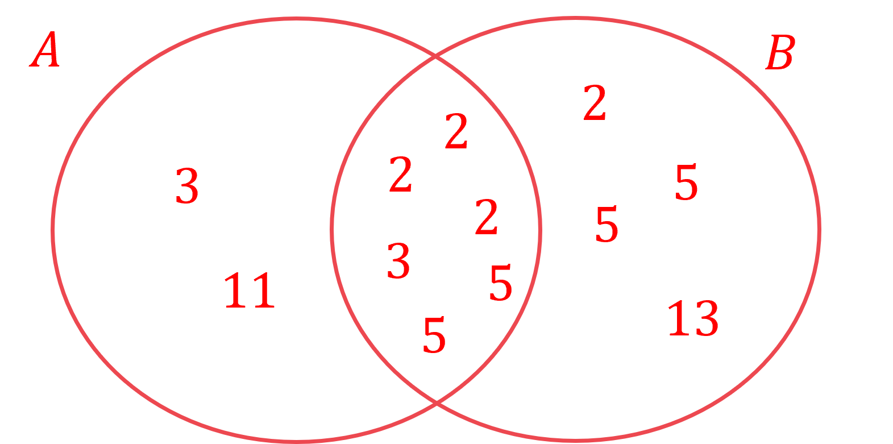

**[1]**

> *To find the lowest common multiple (LCM), multiply together all the values in the Venn diagram*

*3×11×2×2×2×3×5×5×2×5×5×13*

> *Give that as powers of prime factors, as required*

$2^{4}\times3^{2}\times5^{4}\times11\times13$ **[1]**

## Q30 — easy — 3 marks · exam-questions

### 2() — 3 marks
> *Use factor tree method or repeated division. E.g.*

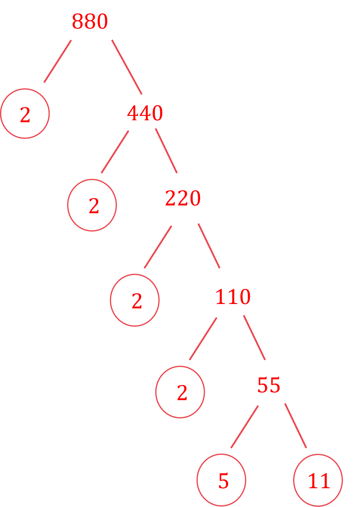

**At least 2 stages correct ****[1]**

*880 = 2 × 2 × 2 × 2 × 5 × 11*

**[1]**

**880 = 2****4**** × 5**** ****× 11 ****[1]**

## Q31 — medium — 2 marks · exam-questions

### 7() — 2 marks
> *To find the HCF, use the lowest power for each number*

$5^{3}\times7^{2}\times11^{4}$

**[B1 B1]**

> **[mark-scheme]**
> **B1**: $5^{p}\times7^{q}\times11^{r}$ with two of $p=3,q=2,r=4$
> 
> **B1**: All three powers correct

## Q32 — hard — 2 marks · exam-questions

### 11((a)) — 2 marks
*Use the prime factors to create a Venn diagram* 
*As there are so many 3s, we can use powers in the Venn diagram, to save writing out nine 3s*

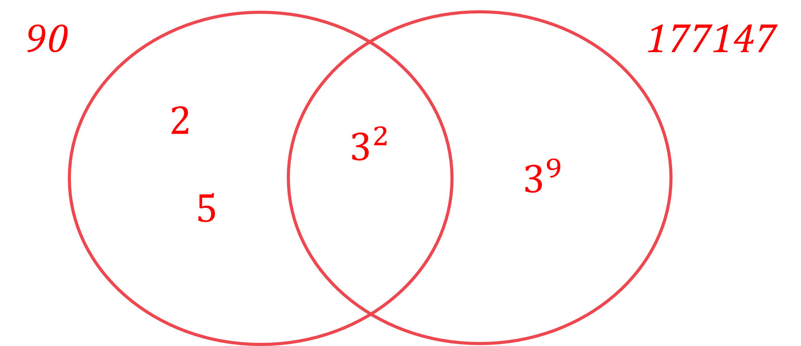

> *The lowest common multiple can be found by multiplying together all the numbers in the Venn diagram*

*2×5×3**2**×3**9*

> *Combine the powers of 3 using the indices law *$x^{n}\timesx^{m}=x^{n+m}$

*2×3**11**×5*

> *Use your calculator to find the value as an ordinary number*

*2×3**11**×5 = 1 771 470*

**Using power notation: 2×3****11****×5** **[1]** 
**As an ordinary number: 1 771 470** **[1]**

## Q33 — medium — 3 marks · exam-questions

### 3((b)) — 3 marks
> *We want to find the next time they sound at the same time, this would be after the lowest common multiple of 50 and 80 minutes later*

> *We can list out several multiples of each number, starting with the larger number*

*80, 160, 240, 320, 400, 480, ...*

> *It is easy to spot which would also be a multiple of 50, as multiples of 50 are either 100, 200, 300, ... or 150, 250, etc*

**Listing multiples, or alternatively using a prime factor and venn diagram method ****[1]**

*400 will be the lowest common multiple*

**400 identified ****[1]**

> *So the time they sound together next, will be 10 am plus 400 minutes*

*400 minutes = 400 ÷ 60 hours = 6.66666... hrs* 
*This is 6 hours and 2 thirds, or 6 hours 40 minutes*

*10 am + 6h40m = 16:40*

**16:40** **[1]**

## Q34 — easy — 2 marks · exam-questions

### 3((a)) — 2 marks
> *Find the prime factor decomposition of 140 and 245*

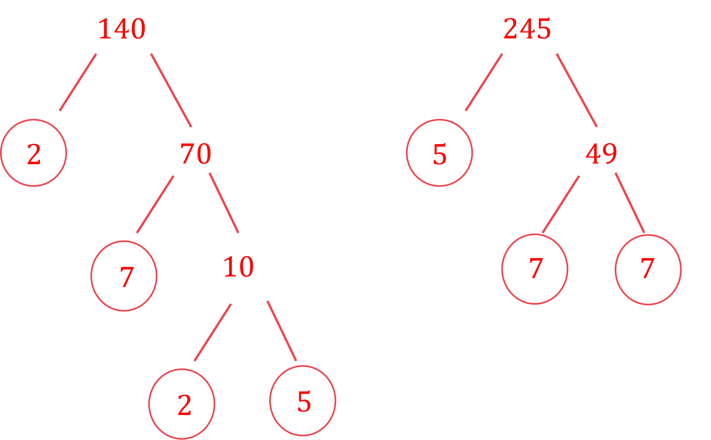

*140 = 2 × 2 × 5 × 7 =2**2** × 5 × 7* 
*245 = 5 × 7 × 7 = 5 × 7**2*

**[1]**

> *We can show the prime factors in a Venn diagram*

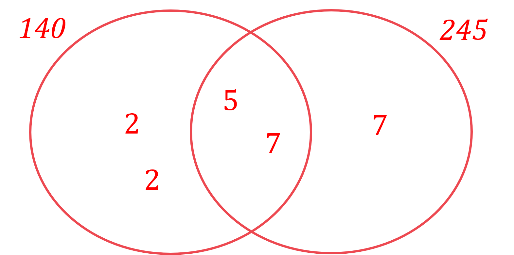

> *To find the highest common factor from the Venn diagram, multiply the numbers in the overlapping section in the middle*

*5 × 7 = 35*

**HCF = 35** **[1]**

**Alternatively, you could make a list of all the factors of both numbers, and compare the lists. However, it can be easy to miss a pair of factors like this.**

## Q35 — hard — 10 marks · exam-questions

### 8((a)) — 4 marks
*i) Put the prime factors of **P** and **Q** into a Venn diagram* *We can write powers on the factors to save writing them multiple times*

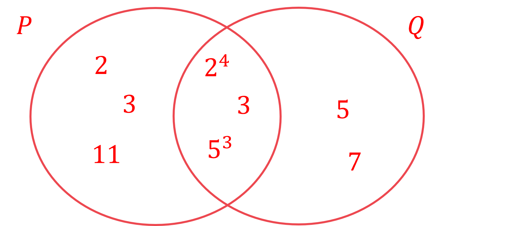

**[1]**

> *The lowest common multiple is the product of all the numbers in the Venn diagram*

*2 × 3 × 11 × 2**4 **× 3 × 5**3 **× 5 × 7 = 13 860 000*

**13 860 000** **[1]**

> *ii) *$P=2^{5}\times3^{2}\times5^{3}\times11$* and *$C=2^{3}\times3\times5^{2}$

> *Write *$P\divC$* as a fraction*

$\frac{2^{5}\times3^{2}\times5^{3}\times11}{2^{3}\times3\times5^{2}}$

> *Cancel the powers where possible, using the indices law; *$x^{n}\divx^{m}=x^{n-m}$

$2^{5}\div2^{3}=2^{2}$

$\frac{2^{2}\times3^{2}\times5^{3}\times11}{3\times5^{2}}$

$3^{2}\div3=3$

$\frac{2^{2}\times3\times5^{3}\times11}{5^{2}}$

**1 mark for 1 step away from final answer**** [1]**

$5^{3}\div5^{2}=5$

$2^{2}\times3\times5\times11$

$2^{2}\times3\times5\times11$ **[1]**

### 8((b)) — 6 marks
> *i) Use a factor tree to find the prime factors of 450*

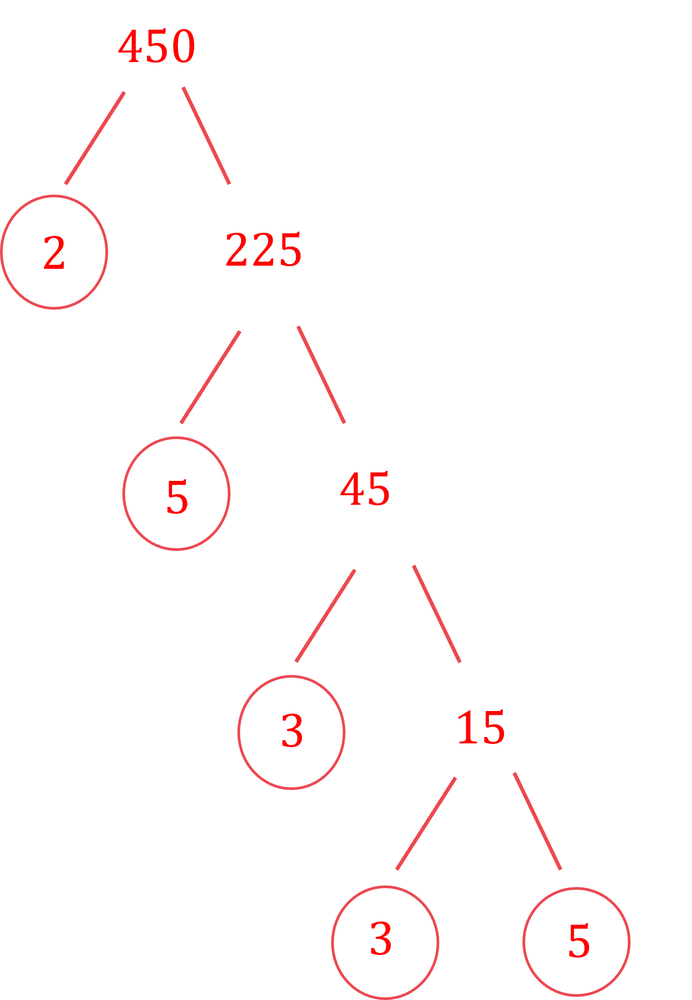

**[1]**

*450 = 2 × 3 × 3 × 5 × 5*

**[1]**

**2×3****2****×5****2**** ****[1]**

> *ii) To find the highest common factor of 450 and 270, we also need to find the prime factors of 270, we can do this either with a factor tree, or it can be quicker to consider the following*

*270 = 10 × 27 = 10 × 3**3** = 5×2×3**3*

**[1]**

*450 = 2×3**2**×5**2** and 270 = 2×3**3**×5* 
*Put the prime factors into a Venn diagram*

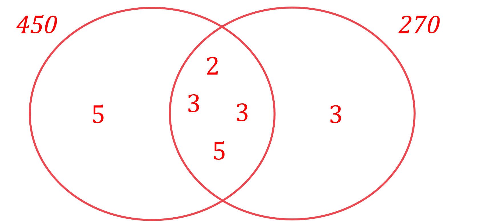

**[1]**

> *The highest common factor is the product of the numbers in the overlapping section in the middle of the Venn diagram*

*2×3×3×5 = 90*

**90** **[1]**

## Q36 — medium — 2 marks · exam-questions

### 6() — 2 marks
> *Write 75 and 105 as a product of their prime factors*

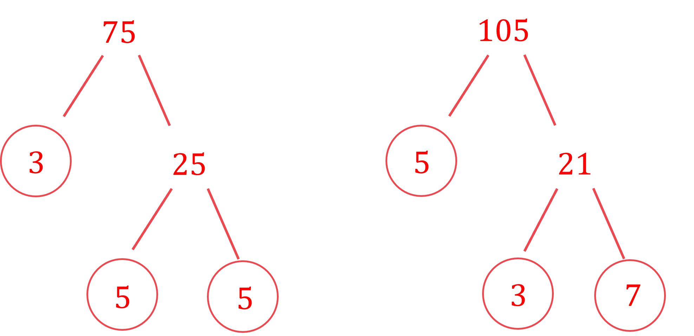

*75 = 3 × 5**2* 
*105 = 3 × 5 ×7*

> *Put the prime factors into a Venn diagram*

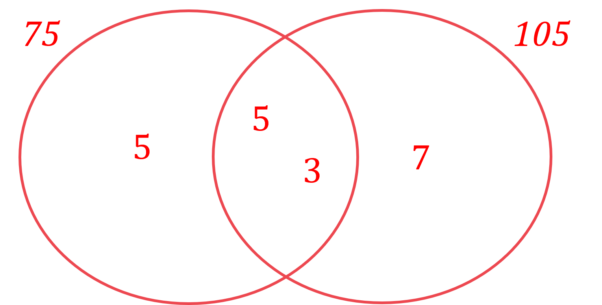

**[1]**

> *The highest common factor is the product of the numbers in the overlapping section in the middle*

*5×3*

**15 ****[1]**

## Q37 — easy — 1 marks · exam-questions

### 2() — 1 marks
> *The answer cannot be 5, as 5 is only a multiple of 5, and not 15 or 25 (although it is a factor of 15 and 25)*

> *The answer cannot be 45 as 45 is not a multiple of 25*

> *75 and 150 are both multiples of 5, 15, and 25, but 75 is the lowest*

**The answer is therefore 75** **[1]**

## Q38 — hard — 4 marks · exam-questions

### 3((c)) — 4 marks
> *List the factors of 360 and 288*

*<u>360</u>* 
*360, 1*
 *180, 2*
 *120, 3*
 *90, 4*
 *72, 5*
 *60, 6*
 *45, 8*
 *40, 9*
 *36, 10*
 *30, 12*
 *24, 15*
 *20, 18*

*<u>288</u>* 
*288, 1*
 *144, 2*
 *96, 3*
 *72, 4*
 *48, 6*
 *36, 8*
 *32, 9*
 *24, 12*
 *18, 16*

> *We can now list the common factors of 360 and 288 as*

*1, 2, 3, 4, 6, 8, 9, 12, 24, 36, 72*

**[1]**

*We can now apply the other conditions* *The first condition is that the number is a common multiple of 4 and 6*

*1**, **2**, **3**, 4, 6, **8**, **9**, 12, 24, 36, 72*

*4, 6, 12, 24, 36, 72*

**[1]**

> *The second condition is that the number is larger than 25, this only leaves 36 and 72*

**36 and 72** **[2]**

## Q39 — medium — 2 marks · exam-questions

### 5() — 2 marks
> *Write 120 and 144 as a product of their prime factors*

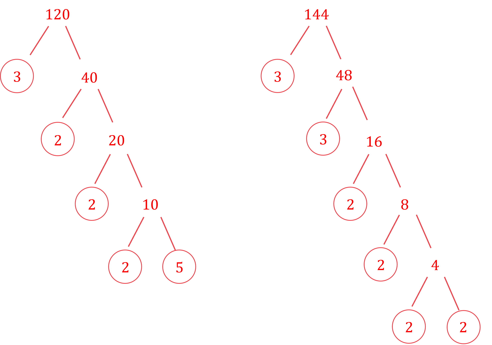

*120 = 2**3** × 3 × 5* 
*144 = 2**4** × 3**2*

> *Put the prime factors into a Venn diagram*

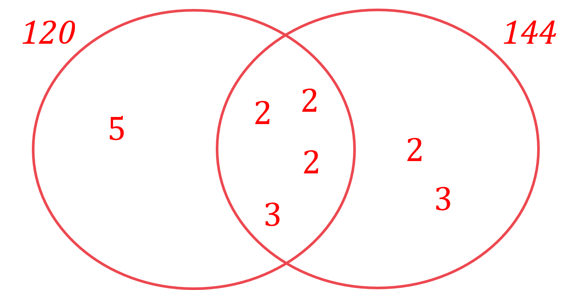

**[1]**

> *The lowest common multiple is the product of all the numbers in the Venn diagram*

*5×3×2×2×2×2×3*

**720 ****[1]**

## Q40 — easy — 1 marks · exam-questions

### 4() — 1 marks
> *The answer cannot be 10, as 10 is a factor of 20, 30, 40, rather than a multiple*

> *120, 240, and 24 000 are all multiples of 20, 30, and 40, but 120 is the lowest*

> *As this is a calculator question, you can divide 120 by 20, 30, and 40 to check*

**The answer is therefore 120** **[1]**

## Q41 — hard — 1 marks · exam-questions

### 20() — 1 marks
*Using index laws, 98**91** can be written as a multiple of each of 98**53**, 98**64**, 98**73** and 98**88*

`table row cell 98 to the power of 91 end cell equals cell 98 to the power of 53 plus 38 end exponent equals 98 to the power of 53 cross times 98 to the power of 38 end cell row cell 98 to the power of 91 end cell equals cell 98 to the power of 64 plus 27 end exponent equals 98 to the power of 64 cross times 98 to the power of 27 end cell row cell 98 to the power of 91 end cell equals cell 98 to the power of 73 plus 18 end exponent equals 98 to the power of 73 cross times 98 to the power of 18 end cell row cell 98 to the power of 91 end cell equals cell 98 to the power of 88 plus 3 end exponent equals 98 to the power of 88 cross times 98 cubed end cell end table`

*Each of 98**53**, 98**64**, 98**73** and 98**88 **go into 98**91*
*98**91** is therefore the lowest common multiple of all five*

$98^{91}$ **[1]**

## Q42 — medium — 3 marks · exam-questions

### 9((a)) — 2 marks
> *Start with the number 252 and choose any two numbers that multiply together to make 252. *
*Break it down into these two numbers and circle any prime numbers. *
*Repeat this with the next numbers until all of the values are prime numbers and cannot be broken down any further.*

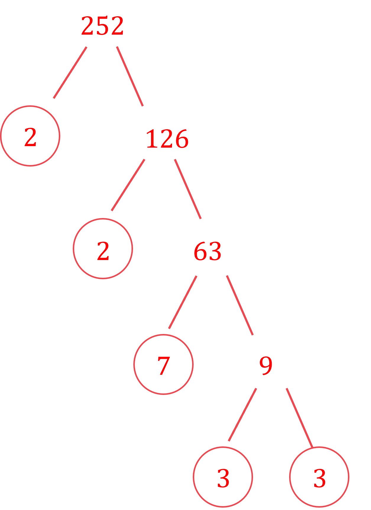

**[1]**

*252 = 2 × 2 × 3 × 3 × 7*

** 2****2**** × 3****2**** × 7*** ***[1]**

### 9((b)) — 1 marks
*From the question and part (a)* 
*672 = 2**5** × 3 ×7* 
*252 = 2**2** × 3**2** × 7*

> *Put these prime factorisations into a Venn diagram*

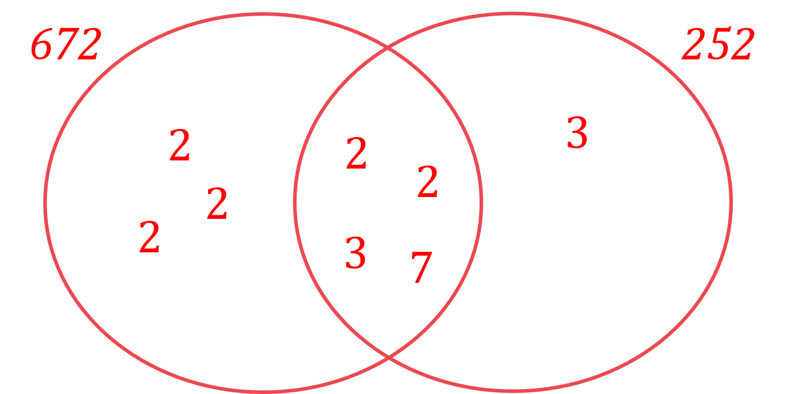

> *The highest common factor is the product of all the numbers in the overlapping section in the middle of the Venn diagram*

*2×2×3×7*

**84** **[1]**

## Q43 — easy — 3 marks · exam-questions

### 3((a)) — 3 marks
> *Start with the number 504 and choose any two numbers that multiply together to make 504. *
*Break it down into these two numbers and circle any prime numbers.*

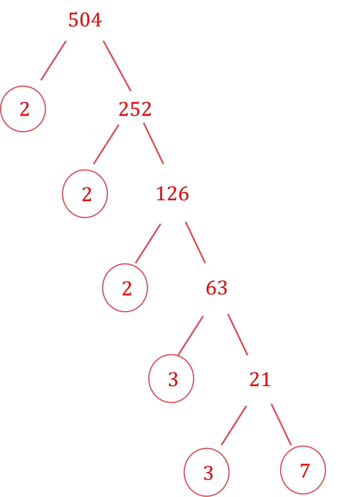

**Correct factors*** ***[2]**

> *Write the prime numbers out as a product, any repeated prime numbers can be written as a power.*

**2****3**** × 3****2**** ****× 7 ****[1]**

## Q44 — medium — 4 marks · exam-questions

### 3() — 4 marks
*Write down several multiples of 25 minutes and 45 minutes until you find a multiple that is in both lists (the lowest common multiple)* 
*It is a good idea to list the multiples of the biggest number first, as this might save you work and time*

*45, 90, 135, 180, ****225****, 270, 315*

*25, 50, 75, 100, 125, 150, 175, 200, ****225***

**225 as lowest common multiple**** [2]**

> *The first time that they leave the station at the same time again is after 225 minutes*

> *Find 225 minutes in hours and minutes*

*225 ÷ 60 = 3.75 hrs*

*0.75 × 60 = 45 minutes*

*So this is 3 hours 45 minutes later*

**Lowest common multiple in hrs and mins**** [1]**

> *Add this amount of time on to 8am (the time that they last left at the same time)*

*8 am + 3h45m = 11:45 am*

**11:45 am** **[1]**

## Q45 — easy — 3 marks · exam-questions

### 11() — 3 marks
> *The number we are given, 177 147 000 000, is 177 147 multiplied by 1 million (6 zeros)*

> *1 million can be written as 10**6*

> *As 177 147 = 3**11**, we can write 177 147 000 000 as 3**11** × 10**6*

* 177 147 000 000 = 3**11** × 10**6*

**[1]**

> *We can then split 10 up into its prime factors*

*3**11** × 10**6 **= 3**11** × (5×2)**6*

**[1]**

> *Expand this, remembering that the power will be applied to both terms in the bracket, as they are multiplied (this would not be true if it was (5+2)**6** however!)*

*3**11** × (5×2)**6** = 3**11**×5**6**×2**6*

**3****11****×5****6****×2****6** **[1]**

## Q46 — medium — 5 marks · exam-questions

### 4((a)) — 4 marks
*Write down several multiples of 20 minutes and 18 minutes until you find a multiple that is in both lists (the lowest common multiple)* *It is a good idea to list the multiples of the biggest number first, as this might save you work and time*

*20, 40, 60, 80, 100, 120, 140, 160, ****180****, 200*

*18, 36, 54, 72, 90, 108, 126, 144, 162, ****180***

**180 as lowest common multiple**** [2]**

> *The first time that they leave at the same time again is after 180 minutes*

> *Find 180 minutes in hours and minutes*

*180 ÷ 60 = 3 hrs*

**Lowest common multiple in hrs**** [1]**

> *Add this amount of time on to 8:37 am (the time that they last left at the same time)*

*8:37 am + 3h = 11:37 am*

**11:37 am** **[1]**

### 4((b)) — 1 marks
**It is assumed that there are no delays** **[1]**

> **[mark-scheme]**
> Any correct assumption receives the mark, e.g.
> 
> - buses keep to the timetable
> - there are no delays
> - there are no changes to the timetable
> - they do not cancel any buses

## Q47 — easy — 3 marks · exam-questions

### 2() — 3 marks
> *Carla runs every 3 days, and swims every Thursday, which means that she swims every 7 days*

> *So we need to find the lowest common multiple of 3 and 7*

> *Write out several multiples of each*

*3, 6, 9, 12, 15, 18, ****21*** 
*7, 14, ****21***

**Listing multiples**** [1]**

> *21 is the lowest common multiple of 3 and 7, so after 21 days, Carla will run and swim on the same day*

**Identifying 21**** [1]**

*9th November + 21 days = 30th November*

**30th November** **[1]**

## Q48 — medium — 7 marks · exam-questions

### 3((a)) — 5 marks
> *i) Use a factor tree to find the prime factors of 120*

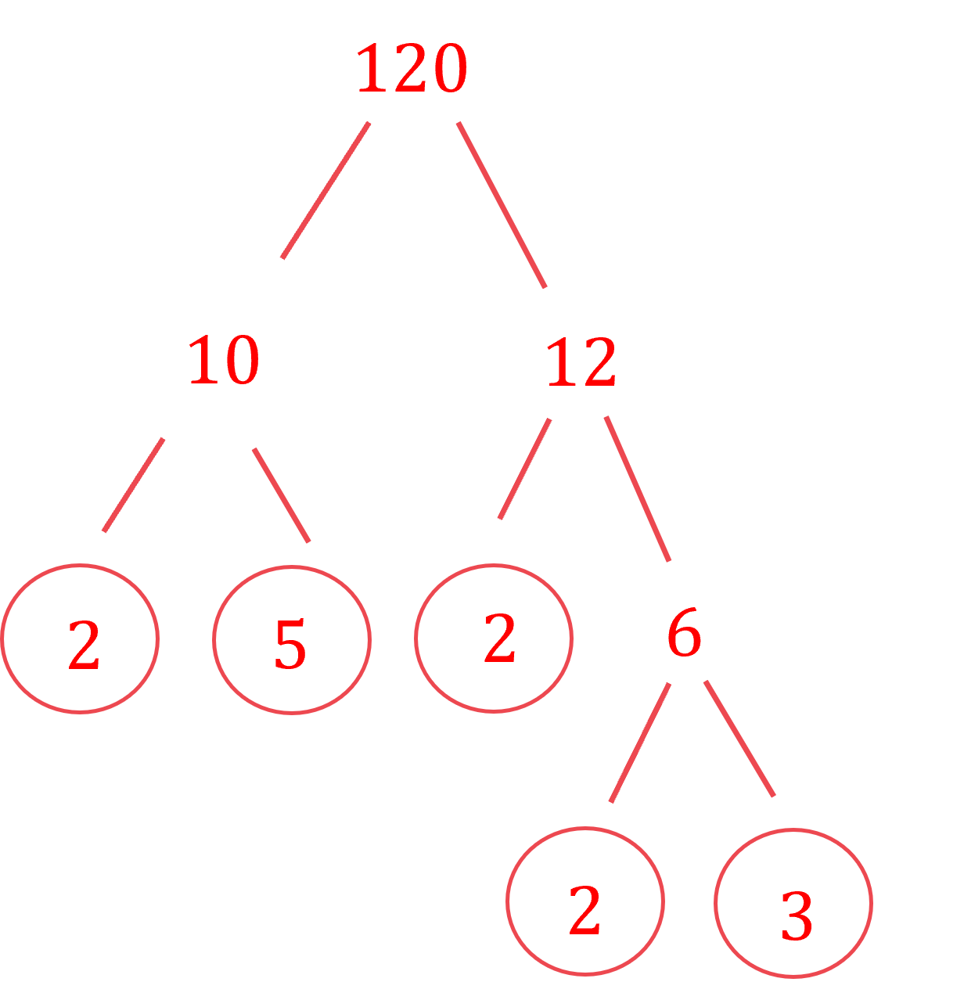

**[1]**

*120 = 2×2×2×3×5*

**[1]**

**120 = 2****3****×3×5** **[1]**

> *ii)  Write down the multiples of 120 up to 360*

*Multiples of 120: 120, 240, 360*

> *So we want to find the smallest number that is also a factor of 360, but not a factor of 240 (otherwise 240 would be their LCM)*

> *List the factors of 360*

*360, 1* 
*180, 2* 
*120, 3* 
*90, 4* 
*72, 5* 
*60, 6* 
*45, 8* 
*40, 9*
 *36, 10*
 *30, 12*
 *24, 15*
 *20, 18*

> *List the factors of 240*

*240, 1* 
*120, 2*
 *80, 3*
 *60, 4*
 *48, 5*
 *40, 6*
 *30, 8*
 *24, 10*
 *20, 12*
 *15, 16*

> *Comparing the two lists, the smallest number that is a factor of 360, but not 240, is **9*

**9**** ****[2]**** **
**1 mark for any of 18, 36, 45, 72, 90, 180 or 360 (these are numbers that would also have a common multiple of 360, but aren't the lowest number)**

### 3((b)) — 2 marks
> *We can put the prime factors into a Venn diagram*

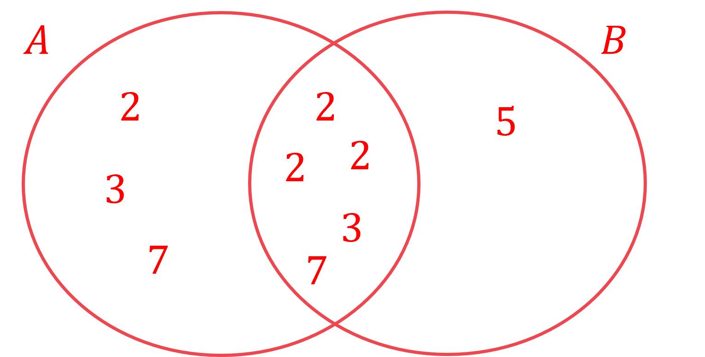

**[1]**

> *The highest common factor is the product of the factors in the overlapping section in the middle*

*2×2×2×3×7=168*

**168** **[1]**

## Q49 — medium — 2 marks · exam-questions

### 3((b)) — 2 marks
> *Find the prime factors of 180 and 504 using factor trees*

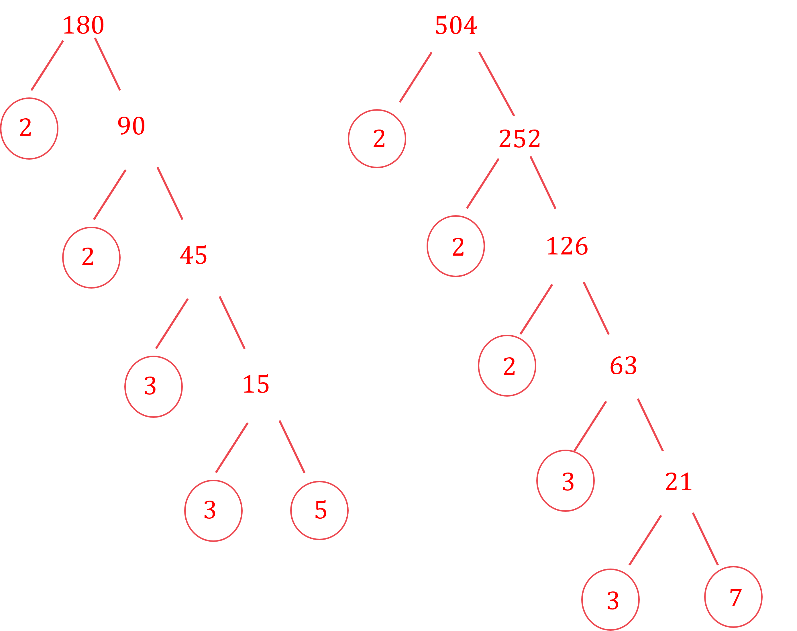

**[1]**

*180=2**2**×3**2**×5* 
*504=2**3**×3**2**×7*

> *Put the prime factors into a Venn diagram*

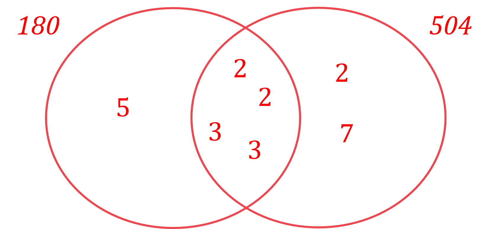

> *The lowest common multiple is the product of all the factors in the Venn diagram*

*5×2×2×3×3×2×7=2520*

**2520** **[1]**

## Q50 — medium — 5 marks · exam-questions

### 3((a)) — 2 marks
> *Write 140 and 245 as a product of prime factors (using a 'factor tree' for example)*

$140=2\times2\times5\times7\,245=5\times7\times7$

**[M1]**

> *Multiply the common factors*

$5\times7=35$

**Final answer:** **35**

**[A1]**

### 3((b)) — 3 marks
> **[exam-tip]**
> Look out for these 'when is the next time two things will happen together' types of questions. Although the question doesn't say so explicitly, it is a Lowest Common Multiple question.
> 
> The fact that this is part (b) to a Highest Common Factor part (a) might also be a hint in that direction.

> *List the multiples of 50 and 80*

$50,100,150,200,250,300,350,400,450,....\,80,160,240,320,400,...$

**[M1]**

> *Identify the lowest common multiple*

*400*

**[M1]**

> *Convert to hours and minutes*

*400 minutes = 6 hours and 40 minutes*

> *Calculate the time by adding that on to 10am*

**Final answer:** **16:40**

**[A1]**

> **[mark-scheme]**
> 4:40 pm will also get the final mark here.

## Q51 — medium — 4 marks · exam-questions

### 8((a)) — 2 marks
> *Use a factor tree, or another method, to break 300 down to prime numbers*

`table row 300 equals cell 3 cross times 100 end cell row 300 equals cell 3 cross times 2 cross times 50 end cell end table`

**[M1]**

$300=3\times2\times5\times10\,300=3\times2\times5\times2\times5$

> **[exam-tip]**
> You can then put these in ascending order, or group them using powers, but the question doesn't require that you do.

$300=2\times2\times3\times5\times5\mathrm{or}2^{2}\times3\times5^{2}$

**[A1]**

### 8((b)) — 2 marks
> *Multiply A and B by their coefficients leaving them as products of their primes*

$5A=2\times2\times2\times3\times3\times5\times5=2^{3}\times3^{2}\times5^{2}$

$7B=2\times2\times3\times3\times3\times5\times7=2^{2}\times3^{3}\times5\times7$

**[M1]**

> *To calculate the LCM*

- *compare both lists and identify the highest power of each prime number*
- *multiply them together*

$2^{3}\times3^{3}\times5^{2}\times7$

**Final answer:** **= 37800**

**[A1]**
