# Mark Schemes — Cumulative Frequency Diagrams
**Statistics** · Edexcel IGCSE Maths A (Modular) (4XMAF/4XMAH) — 24/Higher Unit 2

## Q1 — easy — 5 marks · exam-questions

### 21((a)) — 1 marks
*Cumulative frequency is a running total of the frequencies.* *(Note in this question a new table with every interval starting at zero is provided; sometimes a third column is added to the original table.) We are told in the question there are 100 lorries, so the final entry in the cumulative frequency column should be 100.*

| **Speed (*****s*****) in km/h** | **Cumulative Frequency** |
|---|---|
| 0 < *s* ≤ 20 | 2 |
| 20 < *s* ≤ 40 | *2 + 9 = ***11** |
| 40 < *s* ≤ 60 | *11 + 23 = ***34** |
| 60 < *s* ≤ 80 | *34 + 31 = ***65** |
| 80 < *s* ≤ 100 | *65 + 27 = ***92** |
| 100 < *s* ≤ 120 | *92 + 8 = ***100** |

**All correct**** [1]**

### 21((b)) — 2 marks
*Cumulative frequencies are plotted at the **end** of the class intervals.* 
*So in these case we would plot the points **(20, 2), (40, 11), (60, 34), (80, 65), (100, 92)** and **(120, 100)**. *
*Also plot a point at (0, 0) and join all points with a smooth curve.*

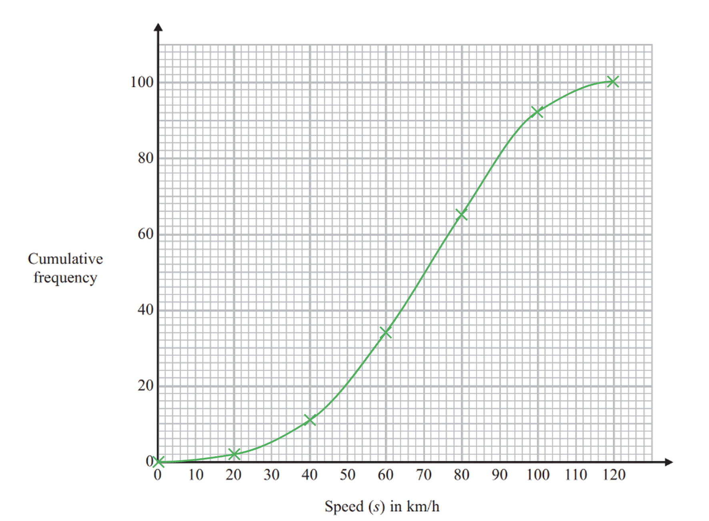

**Five or six points plotted correctly ****[1]**** **
**Points joined ****[1]**

### 21((c)) — 2 marks
*Draw a vertical line up from 90 km/h on the speed axis until it reaches the curve.* 
*Then draw a horizontal line across to the cumulative frequency axis and take a reading.*

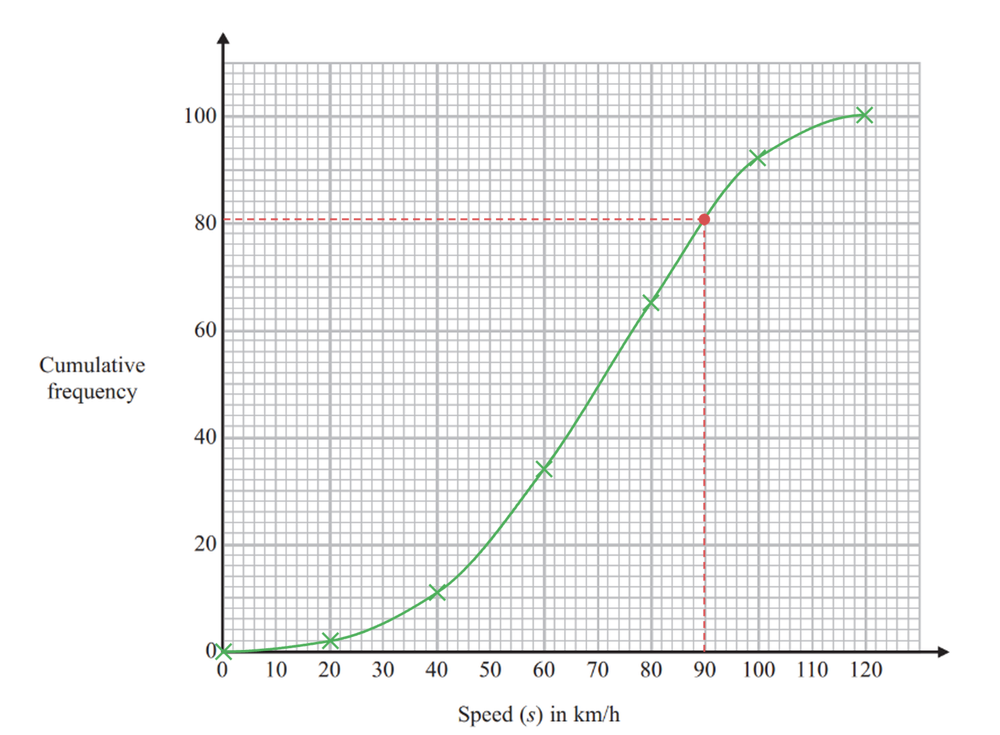

*90 km/h has a cumulative frequency of 80.5*

**Reading from graph*** ***[1]**

> *As the question wants to know the number of lorries with a speed of more than 90 km/h, we need to subtract this from the total number of lorries (100).*

*100 - 80.5 = 19.5*

> *As our answer is an estimate, and it is about a number of lorries, it makes sense to give the final answer as a whole number.*

**Approximately 20 lorries had a speed of more than 90 km/h** **[1]**

**Any answer in the range 18 - 24 would be accepted.**

## Q2 — easy — 4 marks · exam-questions

### 16((a)) — 2 marks
*Cumulative frequencies are plotted at the **end** of the class intervals.* 
*So in these case we would plot the points **(20, 25), (30, 70), (40, 138), (50, 175), (60, 186), (70, 194)** and **(80, 200)**. *
*Also plot a point at (0, 0) and join all points with a smooth curve.*

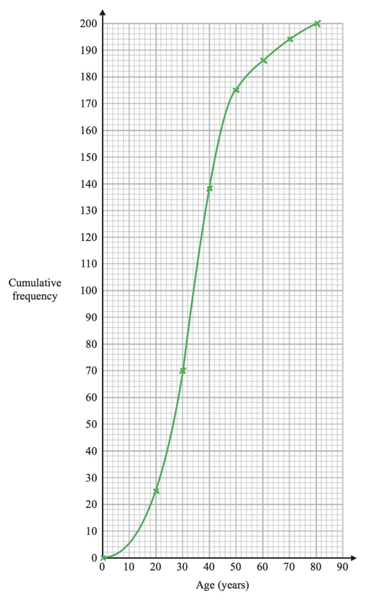

**6 or 7 points plotted correctly ****[1]**** **
**Fully correct joined graph ****[1]**

### 16((b)) — 2 marks
*Draw a vertical line up from 65 on the age axis until it reaches the curve.* *Draw a horizontal line across to the cumulative frequency axis and take a reading.*

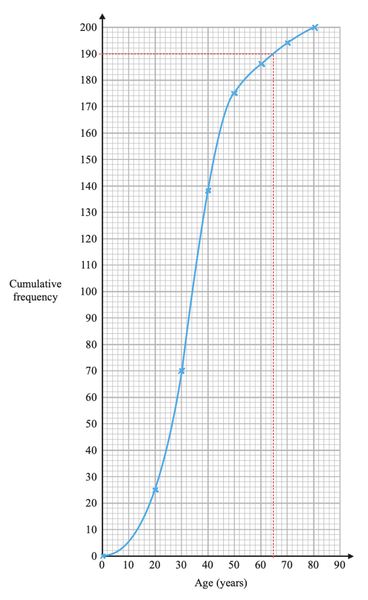

*An age of 65 years has a cumulative frequency of 190*

**[1]**

> *This means there are (approximately) 190 workers below the age of 65. Subtract this from the total number of workers to find the number of workers older than 65.*

*200 - 190 = 10*

> *Now write 10 out of 200 as a percentage by dividing 10 by 200 and multiplying by 100% and compare to Graham's statement.*

`10 over 200 cross times 100 percent sign equals 5 percent sign`

**Graham is not correct as there are approximately 5% of workers at the factory that are older than 65 ****[1]**

## Q3 — easy — 6 marks · exam-questions

### 15((a)) — 1 marks
*Cumulative frequency is a running total of the frequencies.* *(Note in this question a new table with every interval starting at zero is provided; sometimes a third column is added to the original table.) We are told in the question there are 80 parcels, so the final entry in the cumulative frequency column should be 80.*

| **Weight (*****w *****kg)** | **Cumulative Frequency** |
|---|---|
| 0 < *w* ≤ 1 | **Final answer:** **19** |
| 0 < *w* ≤ 2 | *19 + 17 = ***36** |
| 0 < *w* ≤ 3 | *36 + 15 = ***51** |
| 0 < *w* ≤ 4 | *51 + 12 = ***63** |
| 0 < *w* ≤ 5 | *63 + 10 = ***73** |
| 0 < *w* ≤ 6 | *73 + 7 = ***80** |

**All correct**** [1]**

### 15((b)) — 2 marks
*Cumulative frequencies are plotted at the **end** of the class intervals.* 
*So in these case we would plot the points **(1, 19), (2, 36), (3, 51), (4, 63), (5, 73)** and **(6, 80)**. *
*Also plot a point at (0, 0) and join all points with a smooth curve.*

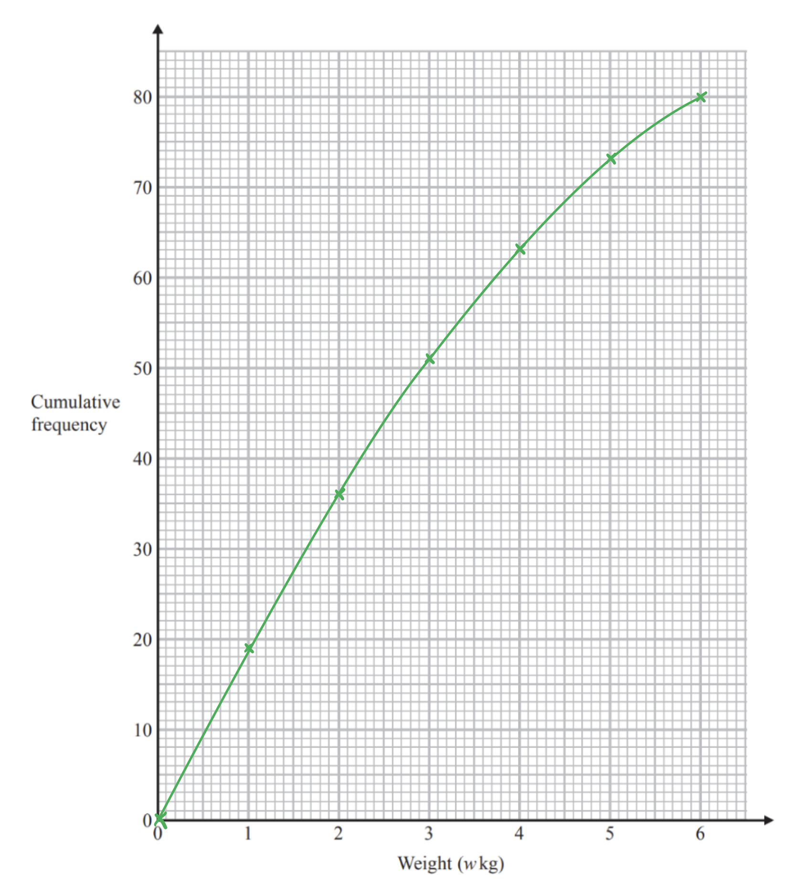

**Five or six points plotted correctly ****[1]**** **
**Points joined ****[1]**

### 15((c)) — 3 marks
*Draw a vertical line up from 3.4 kg on the weight axis until it reaches the curve.* 
*Then draw a horizontal line across to the cumulative frequency axis and take a reading.*

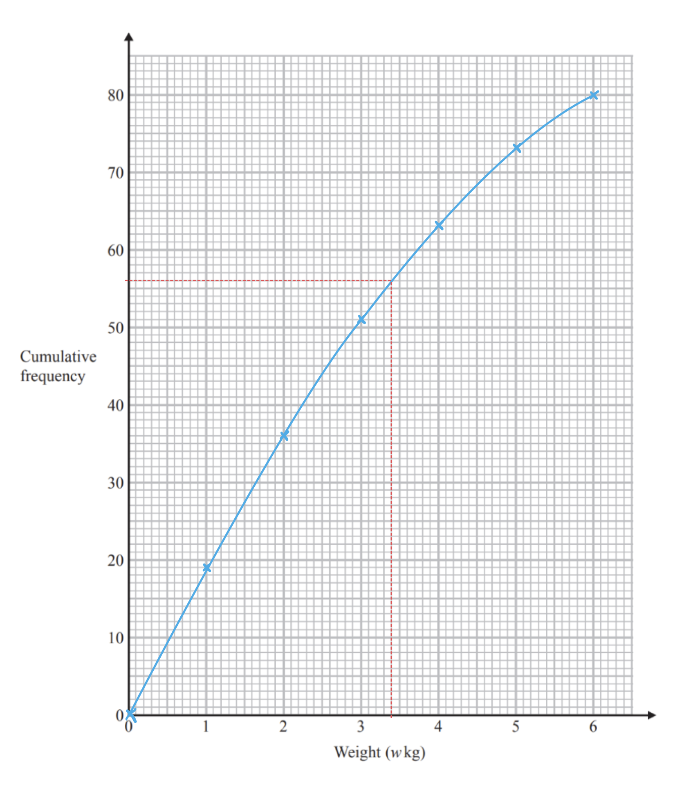

*3.4 kg has a cumulative frequency of 56*

**Reading from graph in range 55 - 57*** ***[1]**

> *This means there are (approximately) 56 parcels with a weight less than 3.4 kg. *
*To express this as a percentage so we can compare to what Sue says, write 56 out of 80 as a fraction and multiplying by 100%.*

`56 over 80 cross times 100 percent sign equals 70 percent sign`

**Sue is not correct as approximately 70% of the parcels weighed less than 2.4 kg ****[1]**

## Q4 — easy — 5 marks · exam-questions

### 16((a)) — 1 marks
*Cumulative frequency is a running total of the frequencies.* *(Note in this question a new table with every interval starting at zero is provided; sometimes a third column is added to the original table.)*

| **Mark (*****m*****)** | **Cumulative Frequency** |
|---|---|
| 0 < *m* ≤ 20 | **Final answer:** **40** |
| 0 < *m* ≤ 40 | *40 + 70 = ***110** |
| 0 < *m* ≤ 60 | *110 + 60 = ***170** |
| 0 < *m* ≤ 80 | *170 + 15 = ***185** |
| 0 < *m* ≤ 100 | *185 + 10 = ***195** |
| 0 < *m* ≤ 120 | *195 + 5 = ***200** |

**All correct**** [1]**

### 16((b)) — 2 marks
*Cumulative frequencies are plotted at the **end** of the class intervals.* 
*So in these case we would plot the points **(20, 40), (40, 110), (60, 170), (80, 185), (100, 195)** and **(120, 200)**. *
*Also plot a point at (0, 0) and join all points with a smooth curve.*

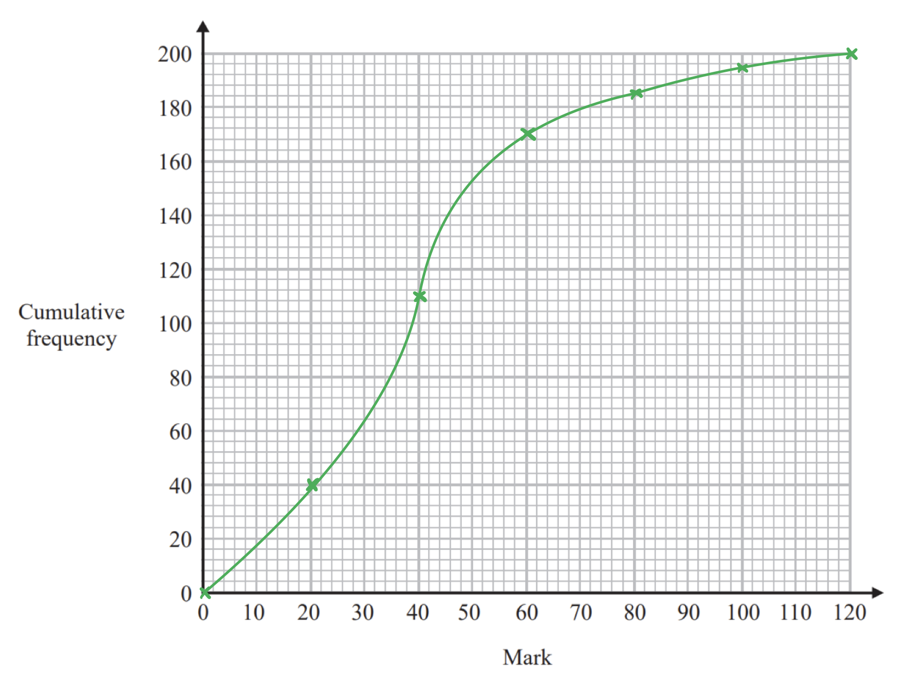

**At least five points plotted correctly ****[1]**** **
**Fully correctly and points joined ****[1]**

### 16((c)) — 2 marks
*Draw a vertical line up from 54 on the mark axis until it reaches the curve.* 
*Then draw a horizontal line across to the cumulative frequency axis and take a reading.*

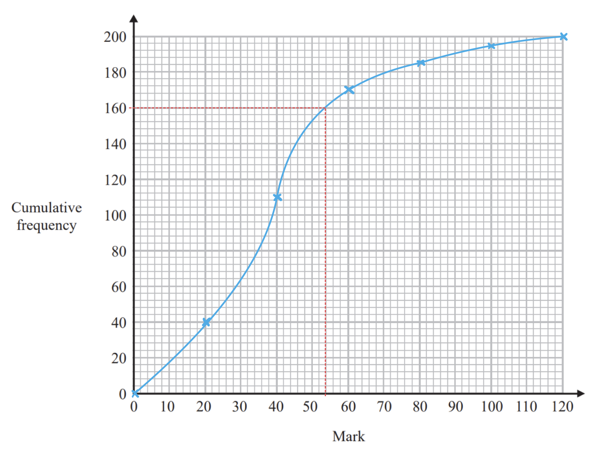

*A mark of 54 has a cumulative frequency of 160*

**Reading from graph in range 152 - 160*** ***[1]**

> *This means there are (approximately) 160 students who gained a mark less than 54. *
*The question requires the number of students who gained a mark of more than 54 so subtract this from the total number of students, which is 200.*

*200 - 160 = 40*

**Approximately 40 students gained a mark of more than 54 ****[1]**

**Answers in the range 40 - 48 are accepted.**

## Q5 — easy — 2 marks · exam-questions

### 8() — 2 marks
*Draw a vertical line up from 160 on the height axis until it reaches the curve.* 
*Then draw a horizontal line across to the cumulative frequency axis and take a reading.*

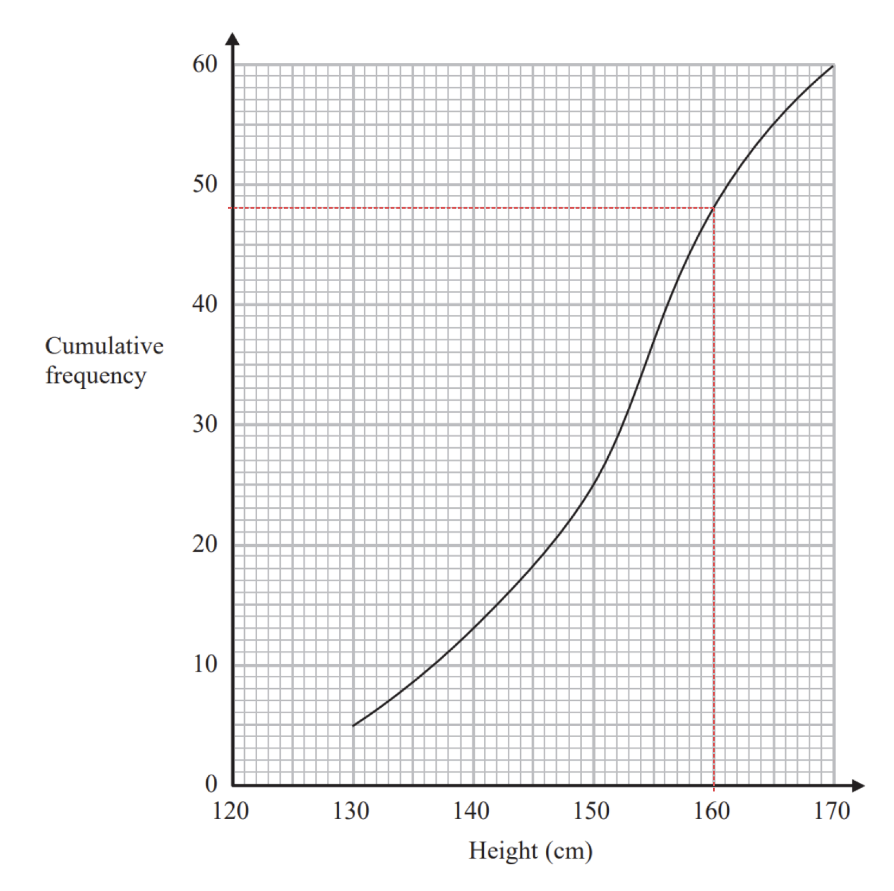

*A height of 160 cm has a cumulative frequency of 48*

**Reading from graph in range 152 - 160*** ***[1]**

> *This means there are (approximately) 48 students with a height less than 160 cm. *
*The question requires the number of students with a height greater than 160 cm so subtract this from the total number of students, which is 60.*

*60 - 48 = 12*

**Approximately 12 students have a height greater than 160 cm ****[1]**

**Answers in the range 11.8 - 12.2 are accepted.**

## Q6 — easy — 3 marks · exam-questions

### 16((a)) — 1 marks
> *The position of the median is usually given as the *`open parentheses fraction numerator n plus 1 over denominator 2 end fraction close parentheses to the power of th`* value, where *$n$* is the number of data values, so in this case *$n=60.$* *
*But as the data set is large, and we are only able to estimate the median using a cumulative frequency graph, it is convenient to use *`open parentheses n over 2 close parentheses to the power of th`* value.*

*Position of median is the *`open parentheses 60 over 2 close parentheses to the power of th equals 30 to the power of th`* value. *

*To find the median weight, draw a horizontal line across from 30 on the cumulative frequency axis until it reaches the curve.* 
*Then draw a vertical line down to the weight axis and take a reading.*

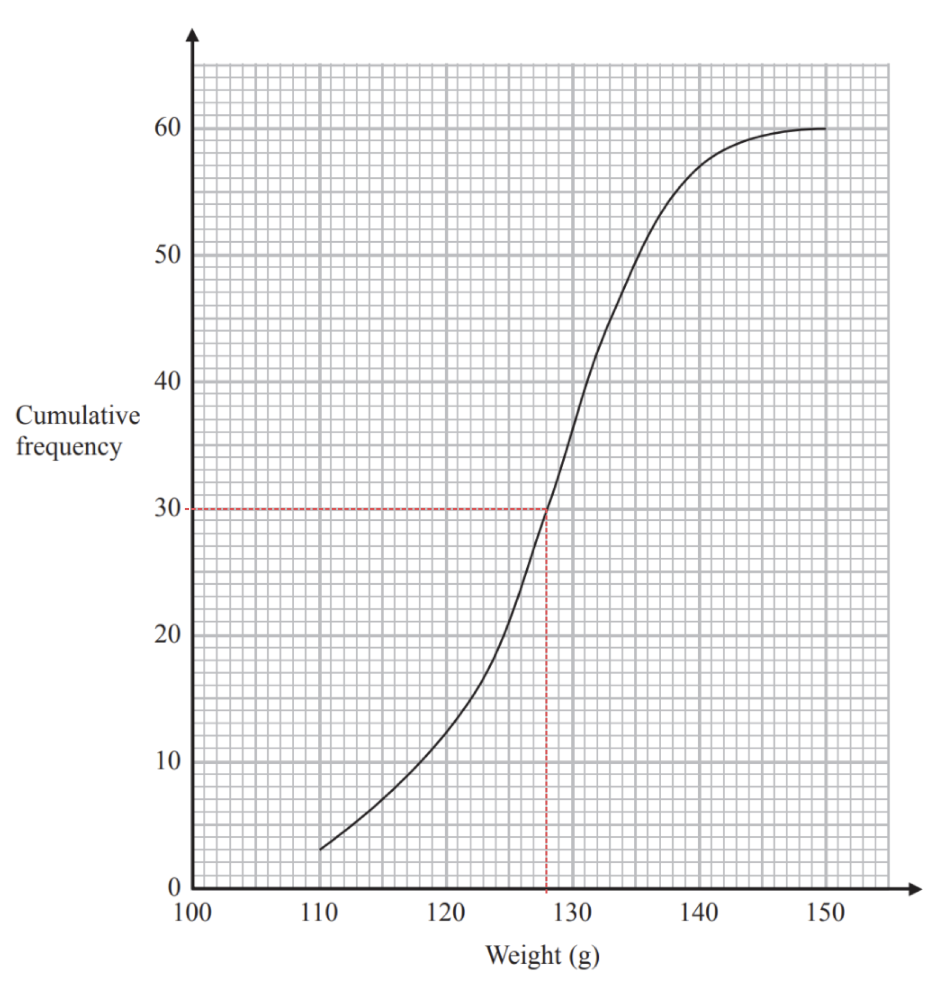

**The median weight of the apples is approximately 128 g ****[1]**

**Answers in the range 128 - 128.5 are accepted.**

### 16((b)) — 2 marks
> *The interquartile range (IQR) is the difference between the upper quartile (UQ) and the lower quartile (LQ). *
*Similar to finding the median, we can use the *`open parentheses n over 4 close parentheses to the power of th`* value to approximate the lower quartile and the *`open parentheses 3 cross times n over 4 close parentheses to the power of th`* value to approximate the upper quartile. *
*For this question, *$n=60.$

*The lower quartile is the *`open parentheses 60 over 4 close parentheses to the power of th equals 15 to the power of th`* value *
*The upper quartile is the *`open parentheses 3 cross times 60 over 4 close parentheses to the power of th equals 45 to the power of th`* value*

> *Draw horizontal lines from 15 and 45 on the cumulative frequency axis until they reach the curve. *
*Then draw vertical lines down at the weight axis and take readings.*

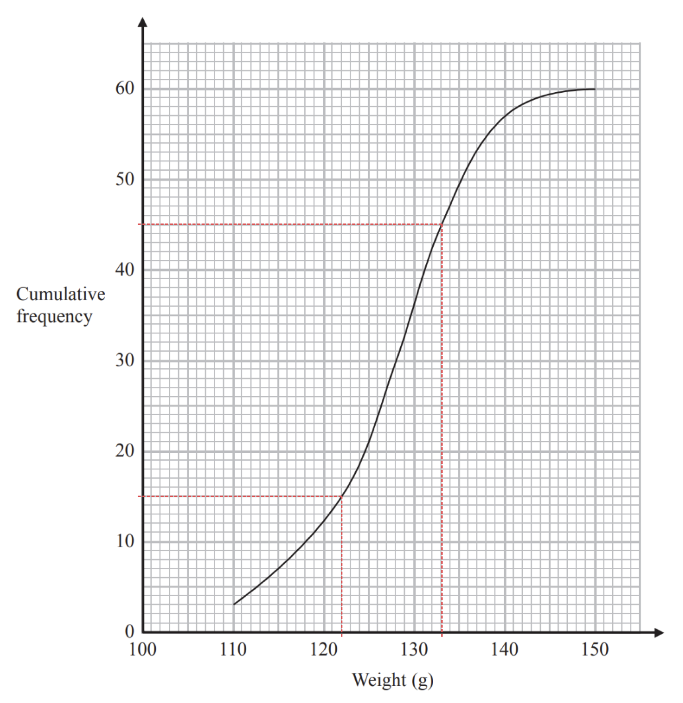

*IQR = UQ - LQ = 133 - 122 = 11*

**The interquartile range is approximately 11 g ****[1]**

**Answers in the range 10.5 - 11.5 are accepted.**

## Q7 — easy — 6 marks · exam-questions

### 11((a)) — 1 marks
> *Cumulative frequency is a running total of the frequencies.*

| **Time (*****t *****minutes)** | **Cumulative Frequency** |
|---|---|
| 0 < *t* ≤ 20 | **Final answer:** **5** |
| 0 < *t* ≤ 40 | *5 + 30 = ***35** |
| 0 < *t* ≤ 60 | *35 + 20 = ***55** |
| 0 < *t* ≤ 80 | *55 + 15 = ***70** |
| 0 < *t* ≤ 100 | *70 + 8 = ***78** |
| 0 < *t* ≤ 120 | *78 + 2 = ***80** |

**All correct**** [1]**

### 11((b)) — 2 marks
*Cumulative frequencies are plotted at the **end** of the class intervals.* 
*So in these case we would plot the points **(20, 5), (40, 35), (60, 55), (80, 70), (100, 78)** and **(120, 80)**. *
*Also plot a point at (0, 0) and join all points with a smooth curve.*

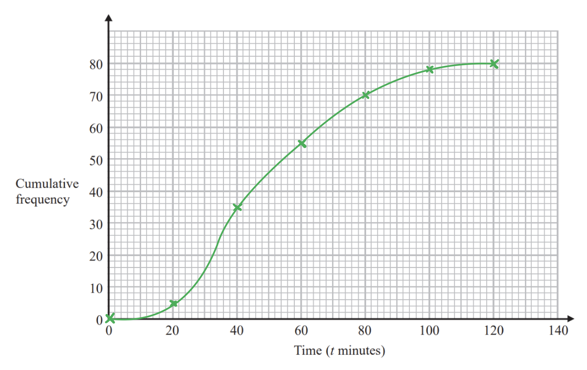

**At least five points plotted correctly ****[1]**** **
**Fully correct and points joined ****[1]**

### 11((c)) — 3 marks
*Draw a vertical line up from 90 minutes on the time axis until it reaches the curve.* 
*Then draw a horizontal line across to the cumulative frequency axis and take a reading.*

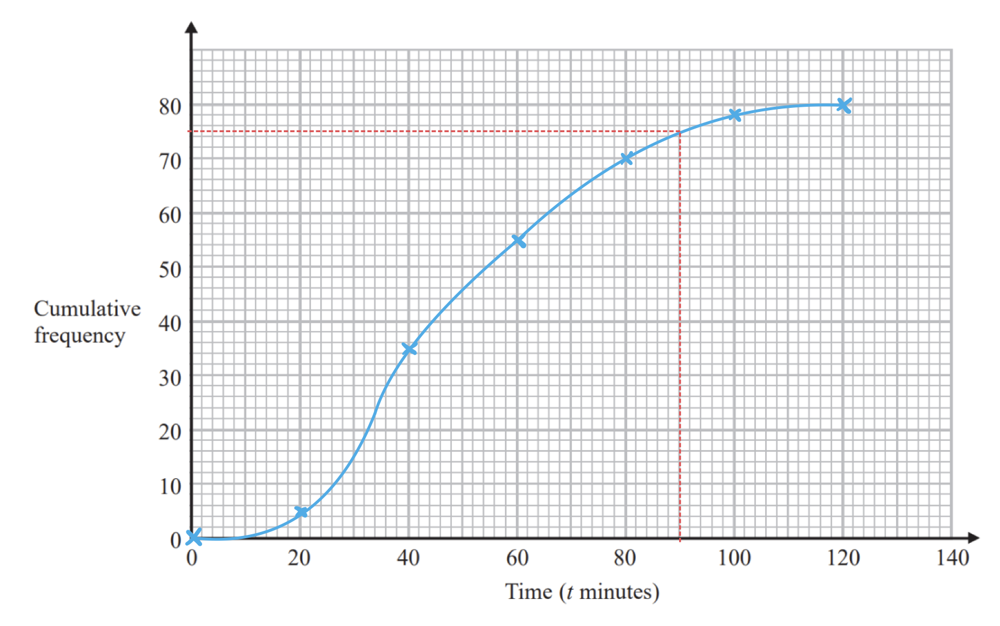

*A time of 90 minutes has a cumulative frequency of 75*

**Reading from graph in range 152 - 160*** ***[1]**

> *This means there are (approximately) 75 office workers who take less than 90 minutes to get to work. *
*The question requires the number of office workers who take more than 90 minutes to get to work so subtract this from the total number of students, which is 80.*

*80 - 75 = 5*

> *To express this as a percentage, write this as a fraction out of the total number of office workers, 80, and multiply by 100%.*

`5 over 80 cross times 100 percent sign equals 6.25 percent sign`

**[1]**

**Approximately 6.25% of the office workers take more than 90 minutes to get to work ****[1]**

**Readings of 72 - 76 are accepted leading to percentages 5% - 10%.**

## Q8 — easy — 5 marks · exam-questions

### 11((a)) — 1 marks
> *Cumulative frequency is a running total of the frequencies.*

| **Age (*****a *****years)** | **Cumulative Frequency** |
|---|---|
| 0 < *a* ≤ 20 | **Final answer:** **9** |
| 0 < *a* ≤ 30 | *9 + 19 = ***28** |
| 0 < *a* ≤ 40 | *28 + 17 = ***45** |
| 0 < *a* ≤ 50 | *45 + 18 = ***63** |
| 0 < *a* ≤ 60 | *63 + 13 = ***76** |
| 0 < *a* ≤ 70 | *76 + 4 = ***80** |

**All correct**** [1]**

### 15((b)) — 2 marks
*Cumulative frequencies are plotted at the **end** of the class intervals.* 
*So in these case we would plot the points **(20, 9), (30, 28), (40, 45), (50, 63), (60, 76)** and **(70, 80)**. *
*Also plot a point at (0, 0) and join all points with a smooth curve.*

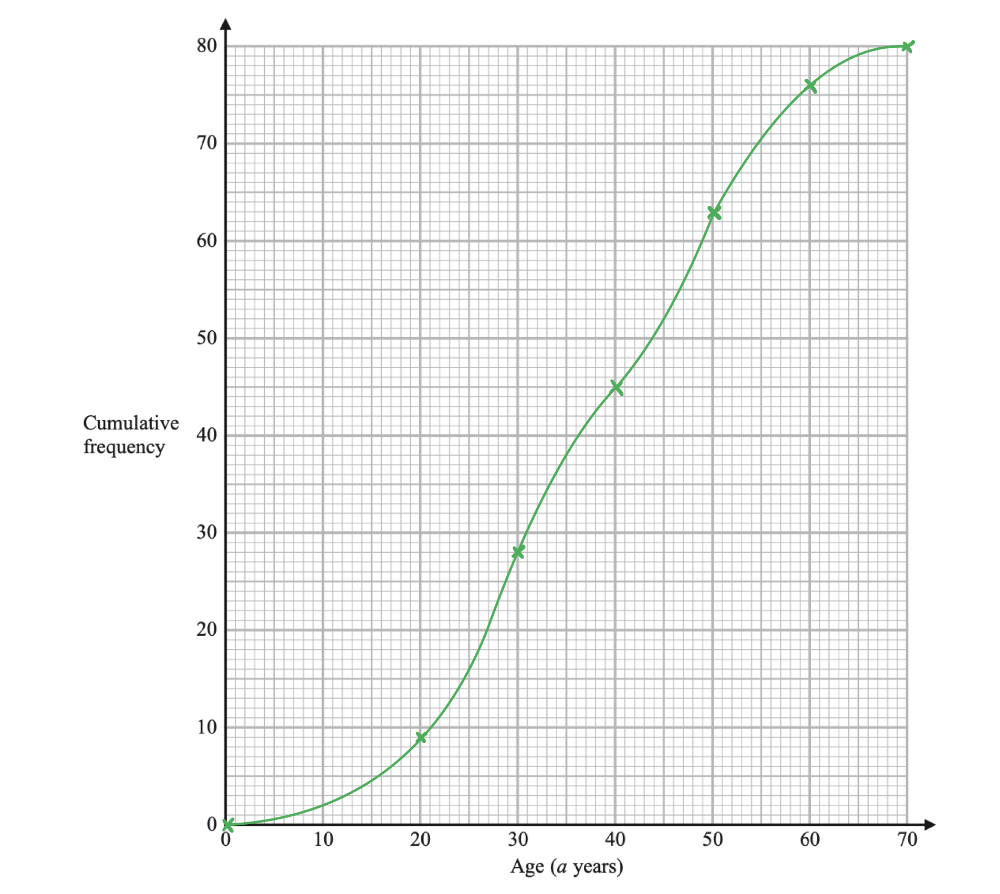

**At least five points plotted correctly ****[1]**** **
**Fully correct and points joined ****[1]**

### 15((c)) — 2 marks
> *The median is the middle value.*

> *As the data set is large and we are estimating, we can use the *`open parentheses n over 2 close parentheses to the power of th`* value to approximate the median. For this question, *$n=80.$

*The median is the *`open parentheses 80 over 2 close parentheses to the power of th equals 40 to the power of th`* value*

> *Draw a horizontal line from 40 on the cumulative frequency axis until it reaches the curve. *
*Then draw a vertical line down at the age axis and take a reading.*

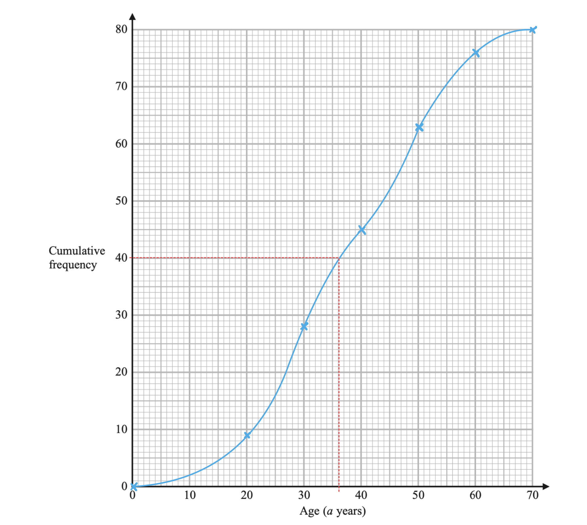

**The median age is approximately 36 years ****[1]**

**Answers in the range 35 - 38 are accepted.**

## Q9 — easy — 2 marks · exam-questions

### 7((a)) — 2 marks
> *To find the cumulative frequency for an interval add together the frequencies for all the intervals up to and including that interval. It is a running total.*

| Mass ($p$ grams) | $p\leq50$ | $p\leq100$ | $p\leq125$ | $p\leq150$ | $p\leq200$ |
|---|---|---|---|---|---|
| Cumulative frequency | $2$ | $2+5=7$ | $2+5+4=11$ | $2+5+4+6=17$ | $20$ |

**3 correct values**** [1]** 
**4 correct values**** [1]**

## Q10 — medium — 8 marks · exam-questions

### 13((a)) — 1 marks
*Cumulative frequency is a running total of the frequencies.* *(Note in this question a new table with every interval starting at 100 grams is provided; sometimes a third column is added to the original table.)*

| **Weight (*****w *****grams)** | **Cumulative Frequency** |
|---|---|
| 100 < *w* ≤ 120 | **Final answer:** **5** |
| 100 < *w* ≤ 140 | *5 + 25 = ***30** |
| 100 < *w* ≤ 160 | *30 + 30 = ***60** |
| 100 < *w* ≤ 180 | *60 + 15 = ***75** |
| 100 < *w* ≤ 200 | *75 + 5 = ***80** |

**All correct**** [1]**

### 13((b)) — 2 marks
*Cumulative frequencies are plotted at the **end** of the class intervals.* *So in these case we would plot the points **(120, 5), (140, 30), (160, 60), (180, 75)** and **(200, 80)**. *
*Also plot a point at (100, 0) and join all points with a smooth curve.*

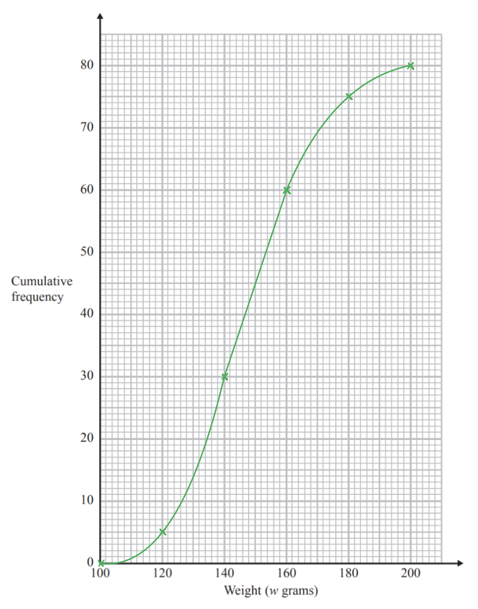

**At least four points plotted correctly ****[1]**** **
**Fully correctly and points joined ****[1]**

### 13((c)) — 2 marks
> *The interquartile range (IQR) is the difference between the upper quartile (UQ) and the lower quartile (LQ). *
*As estimating with a large data set we can use the *`open parentheses n over 4 close parentheses to the power of th`* value for the lower quartile and the *`open parentheses 3 cross times n over 4 close parentheses to the power of th`* value for the upper quartile. *
*For this question, *$n=80.$

*The lower quartile is the *`open parentheses 80 over 4 close parentheses to the power of th equals 20 to the power of th`* value*
* The upper quartile is the *`open parentheses 3 cross times 80 over 4 close parentheses to the power of th equals 60 to the power of th`* value*

> *Draw horizontal lines from 20 and 60 on the cumulative frequency axis until they reach the curve. *
*Then draw vertical lines down at the weight axis and take readings.*

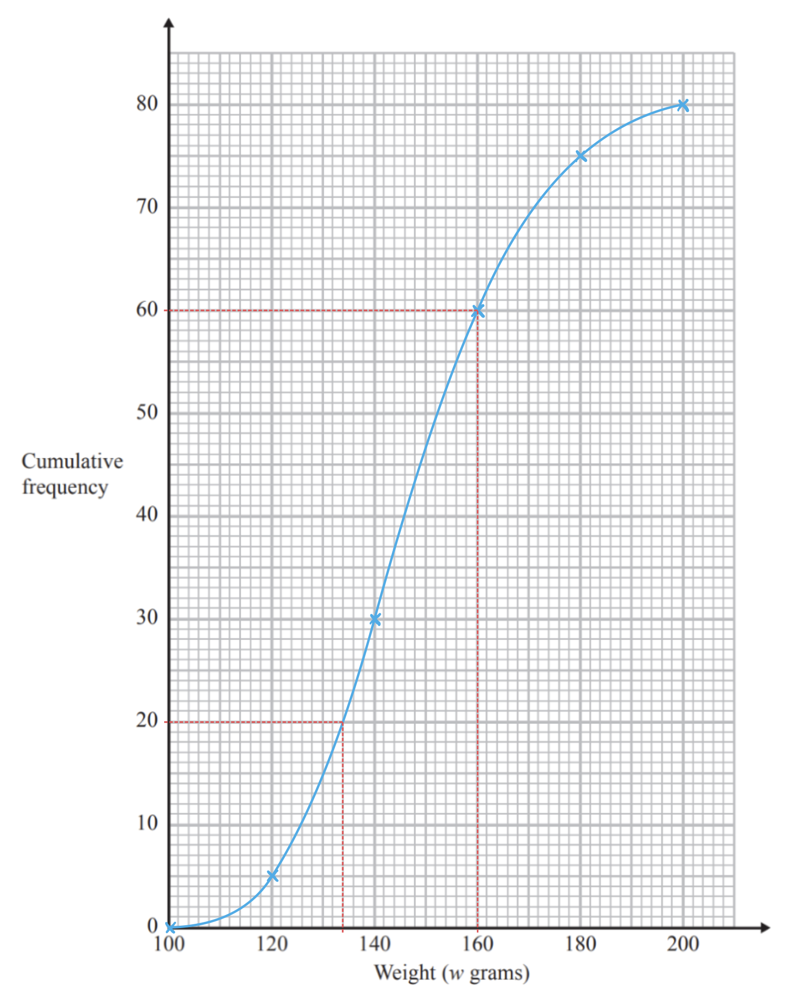

*IQR = UQ - LQ = 160 - 134 = 26*

**[1]**

**The interquartile range is approximately 26 g ****[1]**

**Answers in the range 26 - 28 are accepted.**

### 13((d)) — 3 marks
*Draw a vertical line up from 150 g on the weight axis until it reaches the curve.* 
*Then draw a horizontal line across to the cumulative frequency axis and take a reading.*

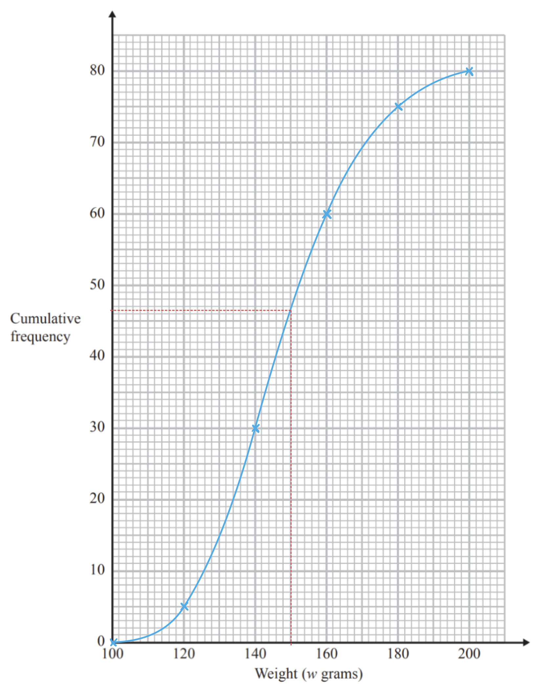

*A weight of 150 g has a cumulative frequency of 46.5*

**Reading from graph*** ***[1]**

*This means there are (approximately) 46.5 potatoes with a weight less than 150 g.*
 *To express this as a percentage, write this as a fraction out of the total number of potatoes, 80, and multiply by 100%.*

`fraction numerator 46.5 over denominator 80 end fraction cross times 100 percent sign equals 58.125 percent sign`

**[1]**

**Approximately 58% of Charlotte's potatoes had a weight less than 150 grams ****[1]**

**Readings of 72 - 76 are accepted leading to percentages 55% - 59%.**

## Q11 — medium — 6 marks · exam-questions

### 21((a)) — 3 marks
> *Cumulative frequency is a running total of the frequencies. *
*The easiest way to show these is to add a third column to the table.*

| **Height (*****x cm*****)** | **Frequency** | **Cumulative Frequency** |
|---|---|---|
| 140 < *x* ≤ 150 | 4 | **Final answer:** **4** |
| 150 < *x* ≤ 160 | 5 | *4 + 5 = ***9** |
| 160 < *x* ≤ 170 | 16 | *9 + 16 = ***25** |
| 170 < *x* ≤ 180 | 27 | *25 + 27 = ***52** |
| 180 < *x* ≤ 190 | 5 | *52 + 5 = ***57** |
| 190 < *x* ≤ 200 | 3 | *57 + 3 = ***60** |

**All correct**** [1]**

*Cumulative frequencies are plotted at the end of the class intervals.*** **
*So in this case we would plot the points*** ***(150, 4), (160, 9), (170, 25), (180, 52), (190, 57)*** ***and*** ***(200, 60)**.*** **
*Also plot a point at (140, 0) and join all points with a smooth curve.*

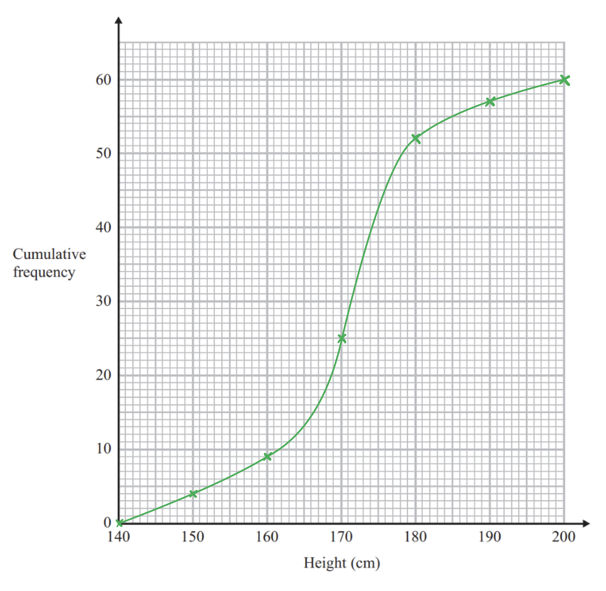

**Five points plotted consistently within intervals ****[1]**** **
**Fully correct cumulative frequency graph ****[1]**

### 21((b)) — 3 marks
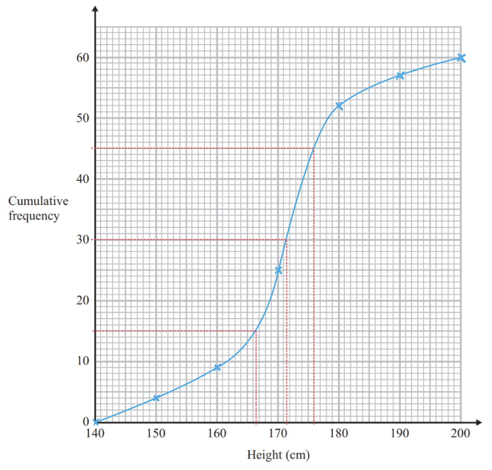

i)`table row blank row blank end table`*As estimating with a large data set, we can use the *`open parentheses n over 2 close parentheses to the power of th`* value.* *Here, *$n=60$*.*

*The median is the *`open parentheses 60 over 2 close parentheses to the power of th equals 30 to the power of th`* value*

> *Draw a horizontal line across from 30 on the cumulative frequency axis until it reaches the curve. Then draw a vertical line down to the height axis and take a reading.*

**The median height is 171.5 cm*** ***[1]**

ii) *The interquartile range (IQR) is the difference between the lower quartile (LQ) and the upper quartile (UQ).* *Similar to the median we can use the *`open parentheses n over 4 close parentheses to the power of th`* value for the lower quartile and the *`open parentheses 3 cross times n over 4 close parentheses to the power of th`* value for the upper quartile.*

*The LQ will be the *`open parentheses 60 over 4 close parentheses to the power of th equals 15 to the power of th`* value* 
*The UQ will be the *`open parentheses 3 cross times 60 over 4 close parentheses to the power of th equals 45 to the power of th`* value*

*Draw horizontal lines across from 115 and 45 on the cumulative frequency axis until they reach the curve.* 
*Then draw vertical lines down to the height axis and take a reading.*

*LQ = 166.5* 
*UQ = 176* 
*IQR = UQ - LQ = 176 - 166.5 = 9.5*

**The interquartile range is approximately 9.5 cm** **[1]**

## Q12 — medium — 7 marks · exam-questions

### 14((a)) — 1 marks
> *Cumulative frequency is a running total of the frequencies.*

| **Weekly wage (£*****x*****)** | **Cumulative Frequency** |
|---|---|
| 100 < *x* ≤ 200 | **Final answer:** **8** |
| 100 < *x* ≤ 300 | *8 + 15 = ***23** |
| 100 < *x* ≤ 400 | *23 + 30 = ***53** |
| 100 < *x* ≤ 500 | *53 + 17 = ***70** |
| 100 < *x* ≤ 600 | *70 + 7 = ***77** |
| 100 < *x* ≤ 700 | *77 + 3 = ***80** |

**All correct**** [1]**

### 14((b)) — 2 marks
*Cumulative frequencies are plotted at the **end** of the class intervals.* 
*So in these case we would plot the points **(200, 8), (300, 23), (400, 53), (500, 70), (600, 77)** and **(700, 80)**. *
*Also plot a point at (100, 0) and join all points with a smooth curve.*

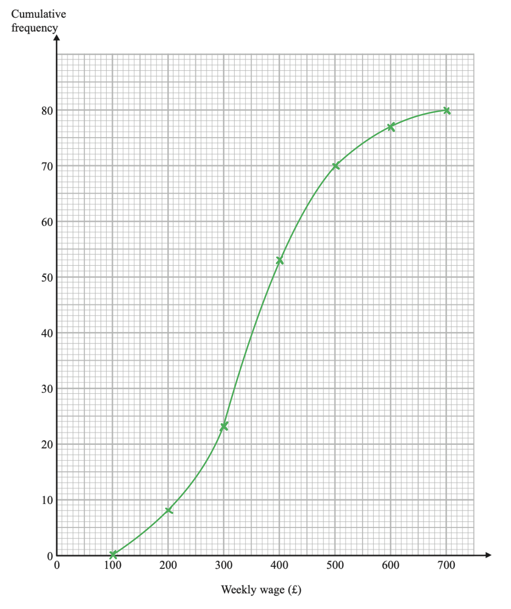

**At least five points plotted correctly ****[1]**** **
**Fully correctly and points joined ****[1]**

### 14((c)) — 2 marks
> *The interquartile range (IQR) is the difference between the upper quartile (UQ) and the lower quartile (LQ). *
*As estimating with a large data set we can use the *`open parentheses n over 4 close parentheses to the power of th`* value to approximate the lower quartile and the *`open parentheses 3 cross times n over 4 close parentheses to the power of th`* value to approximate the upper quartile. *
*For this question, *$n=80$*.*

*The lower quartile is the *`open parentheses 80 over 4 close parentheses to the power of th equals 20 to the power of th`* value *
*The upper quartile is the *`open parentheses 3 cross times 80 over 4 close parentheses to the power of th equals 60 to the power of th`* value*

> *Draw horizontal lines from 20 and 60 on the cumulative frequency axis until they reach the curve. *
*Then draw vertical lines down at the weight axis and take readings.*

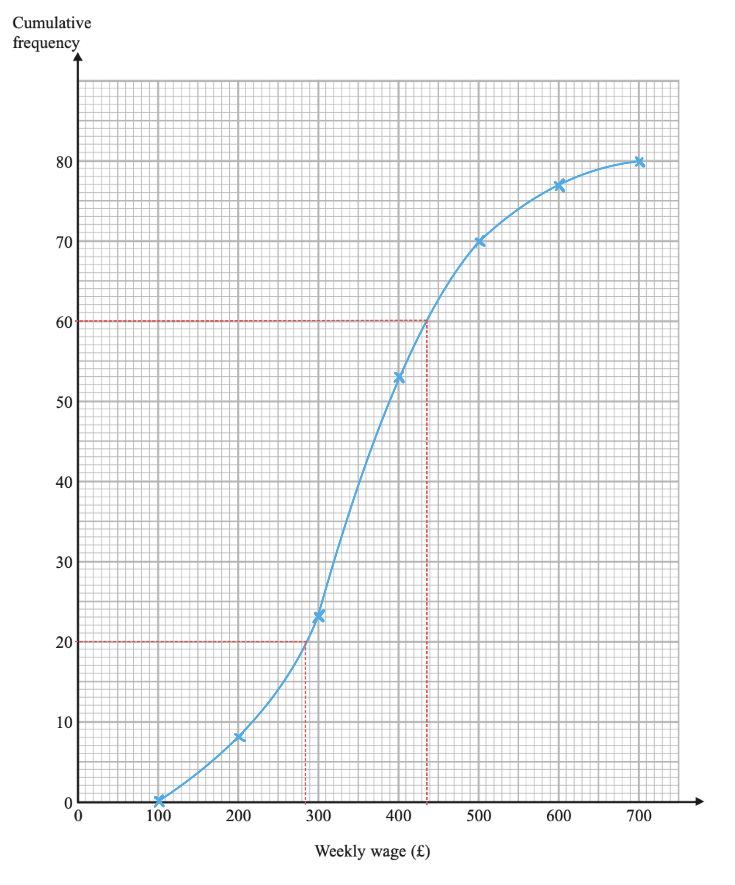

*LQ = 285** *
*UQ = 445** *
*IQR = UQ - LQ = 445 - 285 = 160*

**[1]**

**The interquartile range is approximately £160*** ***[1]**

### 14((d)) — 2 marks
*Draw a vertical line up from £530 on the weekly wage axis until it reaches the curve.* 
*Then draw a horizontal line across to the cumulative frequency axis and take a reading.*

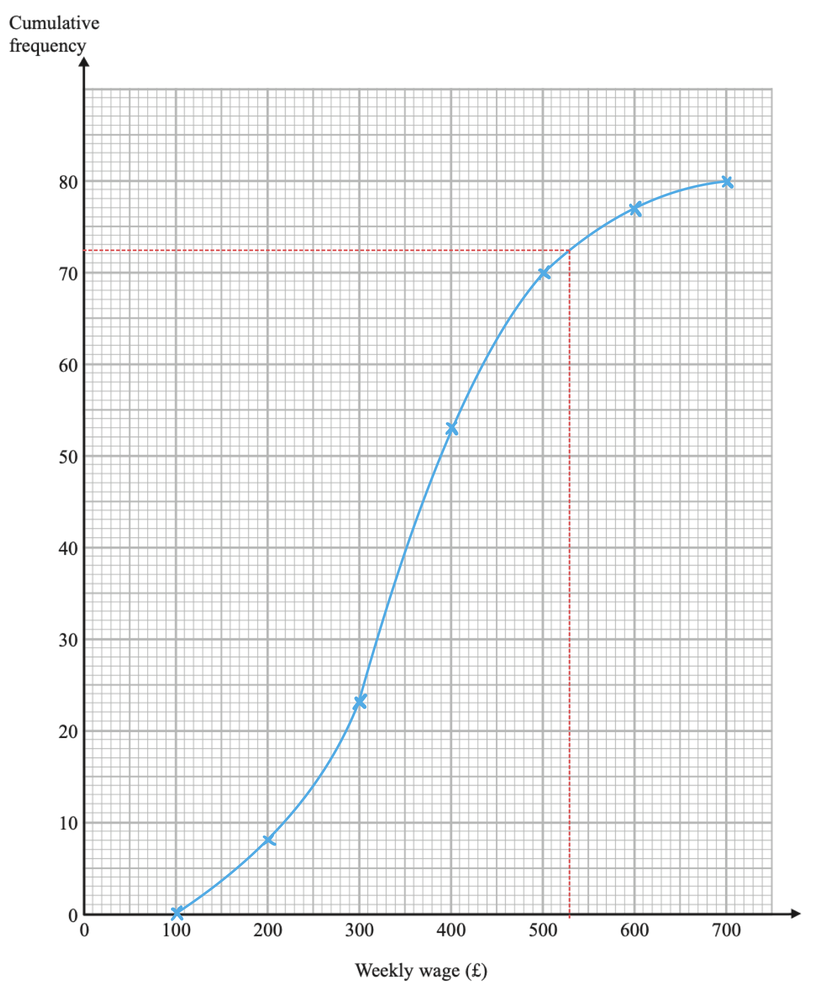

*A weekly wage of £530 has a cumulative frequency of 72.5*

**Reading from graph*** ***[1]**

> *This means there are (approximately) 72.5 workers with a weekly wage under £530. *
*The question requires the number of workers with a weekly wage of more than £530 so subtract this from the total number of workers, which is 80.*

*80 - 72.5 = 7.5*

**Approximately 8 workers have a wage more than £530 ****[1]**

**Final answers of 6 - 9 are accepted.**

## Q13 — medium — 6 marks · exam-questions

### 16((a)) — 1 marks
> *Cumulative frequency is a running total of the frequencies.*

| **Time (*****t***** minutes)** | **Cumulative Frequency** |
|---|---|
| 20 < *t* ≤ 30 | **Final answer:** **4** |
| 20 < *t* ≤ 40 | *4 + 16 = ***20** |
| 20 < *t* ≤ 50 | *20 + 36 = ***56** |
| 20 < *t* ≤ 60 | *56 + 24 = ***80** |
| 20 < *t* ≤ 70 | *80 + 14 = ***94** |
| 20 < *t* ≤ 80 | *94 + 6 = ***100** |

**All correct**** [1]**

### 16((b)) — 2 marks
*Cumulative frequencies are plotted at the **end** of the class intervals.* 
*So in these case we would plot the points **(30, 4), (40, 20), (50, 56), (60, 80), (70, 94)** and **(80, 100)**. *
*Also plot a point at (20, 0) and join all points with a smooth curve. *

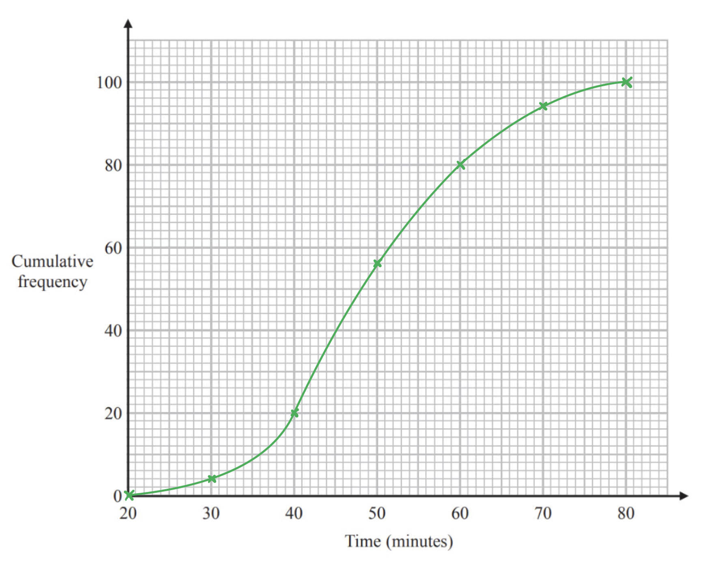

**At least five points plotted correctly ****[1]**** **
**Fully correctly and points joined ****[1]**

### 16((c)) — 1 marks
> *As estimating with a large data set. we can use the the *`open parentheses n over 2 close parentheses to the power of th`* value as an estiamte of the median.*

*Position of median is the *`open parentheses 100 over 2 close parentheses to the power of th equals 50 to the power of th`* value. *

*To find the median weight, draw a horizontal line across from 50 on the cumulative frequency axis until it reaches the curve.* 
*Then draw a vertical line down to the time axis and take a reading.*

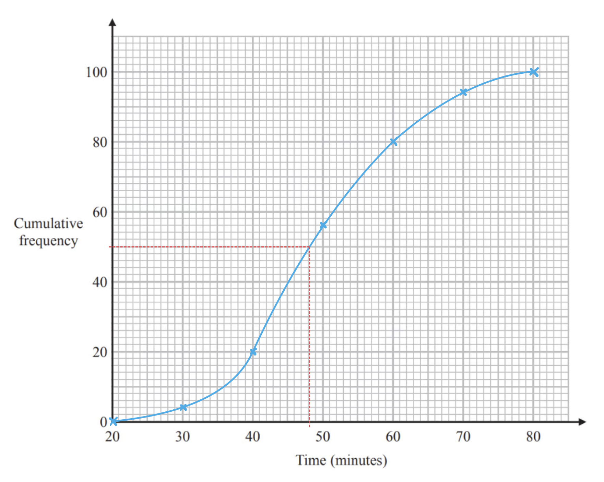

**The median time is approximately 48 minutes ****[1]**

**Answers in the range 47 - 49 are accepted.**

### 16((d)) — 2 marks
*Draw a vertical line up from 63 minutes on the time axis until it reaches the curve.* 
*Then draw a horizontal line across to the cumulative frequency axis and take a reading.*

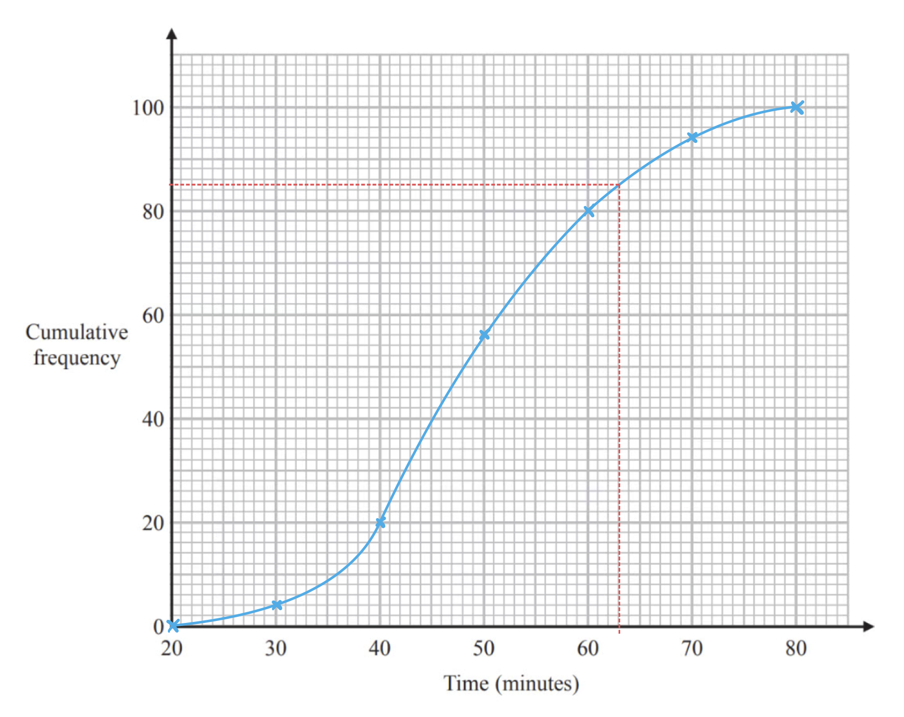

*A time of 63 minutes has a cumulative frequency of 85*

**Reading from graph in range 84 - 87*** ***[1]**

> *This means there are (approximately) 85 people who took **less** than 63 minutes. *
*The question requires the number of people who took **longer** than 63 minutes to get to work so subtract this from the total number of people, which is 100.*

*100 - 85 = 15*

**Approximately 15 people took more than 63 minutes ****[1]**

**Answers in the range 13 - 16 are accepted.**

## Q14 — medium — 4 marks · exam-questions

### 11((a)) — 1 marks
> *As estimating with a large data set, we can use the *`open parentheses n over 2 close parentheses to the power of th`* value to estimate the median.*
*In this question, *$n=60$*.*

*Position of median is the *`open parentheses 60 over 2 close parentheses to the power of th equals 30 to the power of th`* value. *

*To find the median weight, draw a horizontal line across from 30 on the cumulative frequency axis until it reaches the curve.* 
*Then draw a vertical line down to the weight axis and take a reading.*

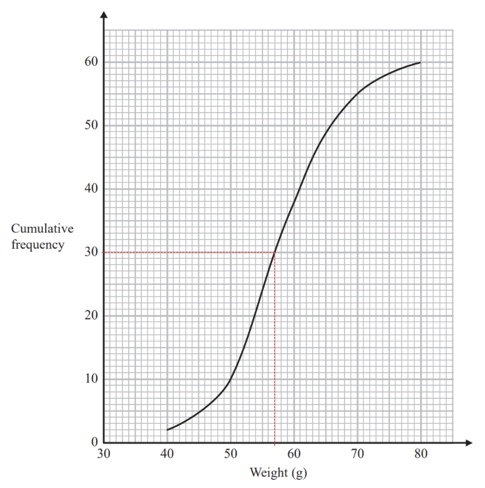

**The median weight of the potatoes is approximately 57 g ****[1] **

### 11((b)) — 1 marks
**Jamil is incorrect as the (exact) range cannot be found; we do not know the ****actual**** values of the lowest and highest weights** **[1]**

### 11((c)) — 2 marks
*Draw a vertical line up from 65 on the weight axis until it reaches the curve.* 
*Then draw a horizontal line across to the cumulative frequency axis and take a reading.*

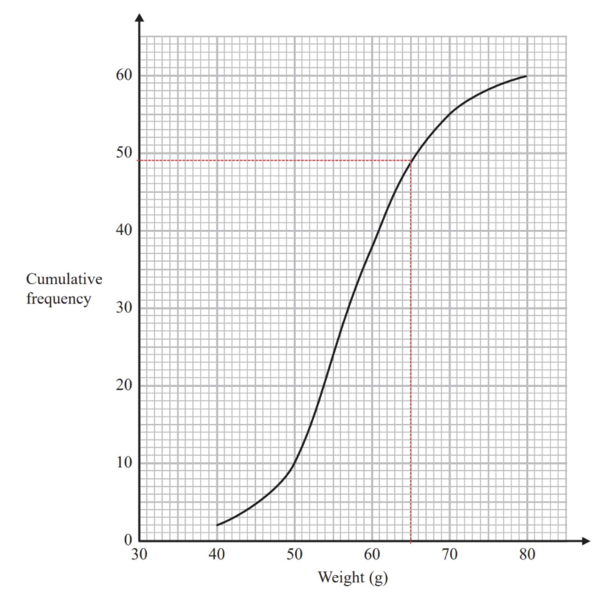

*A weight of 65 g has a cumulative frequency of 49*

**Reading from graph**** [1]**

> *This means there are (approximately) 49 potatoes that have a weight less than 65 g.*
*The question concerns weights greater than 65 g so subtract this from the total number of potatoes, 60.*

*60 - 49 = 11*

*To express this as a percentage, write it as a fraction out of the total number of potatoes, then multiply by 100%.* 
*Then compare to 25%.*

`11 over 60 cross times 100 percent sign equals 18.3 with dot on top percent sign`

**Approximately 18% of the potatoes have a weight greater than 65 g which is less than 25% ****[1]**

**Alternatively, you could find 25% of 60 (15) and compare this to 11.**

## Q15 — medium — 6 marks · exam-questions

### 7((a)) — 2 marks
*Cumulative frequencies are plotted at the **end** of the class intervals.* 
*So in these case we would plot the points* *(10, 8), (20, 23), (30, 48), (40, 65), (50, 74)* *and* *(60, 80)**. *
*Also plot a point at (0, 0) and join all points with a smooth curve.*

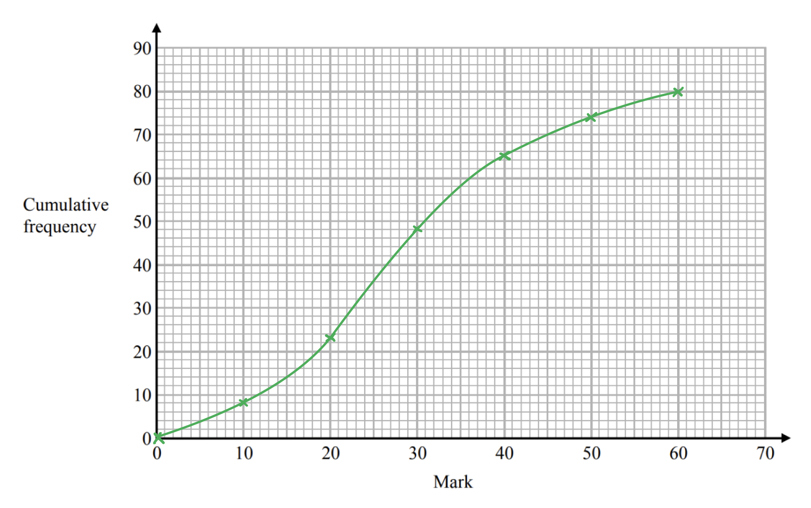

**At least five poinst plotted correctly**** [1] **
**Fully correct with points joined**** [1]**

### 7((b)) — 1 marks
> *As estimating with a large data set, the *`open parentheses n over 2 close parentheses to the power of th`* value can be used to estimate the median.*

*Position of median is the *`open parentheses 80 over 2 close parentheses to the power of th equals 40 to the power of th`* value. *

*To find the median weight, draw a horizontal line across from 40 on the cumulative frequency axis until it reaches the curve.* 
*Then draw a vertical line down to the weight axis and take a reading.*

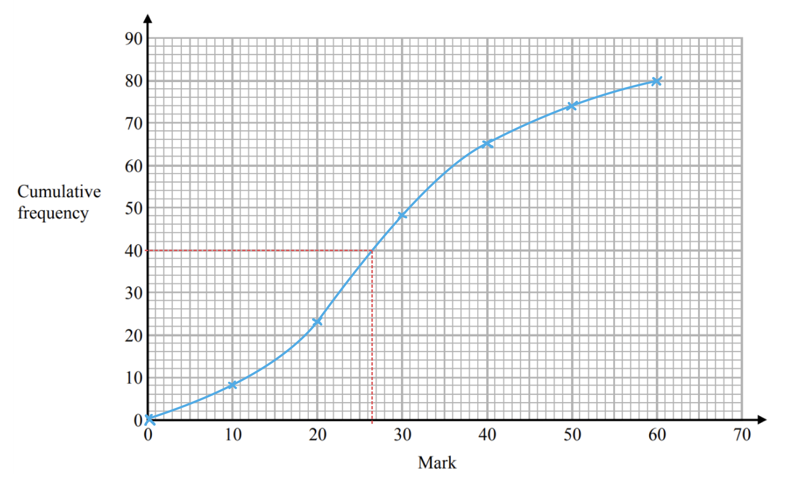

**The median mark is approximately 26.5*** ***[1]**

### 7((c)) — 3 marks
> *Consider the ratio of students passing and failing the test.*

*Pass : Fail* *  1   :   3*

> *There are 80 students in total.*
*Find the number of students failing by finding 3 'parts' of 80.*

$\frac{80}{3+1}\times3=\frac{80}{4}\times3=20\times3=60$

> *60 students fail the test, or are **below** the pass mark. *
*Use the frequency graph to estimate the pass mark by drawing a horizontal across from 60 on the cumulative frequency axis until it reaches the curve. *
*Then draw a vertical line down to the mark axis and take a reading.*

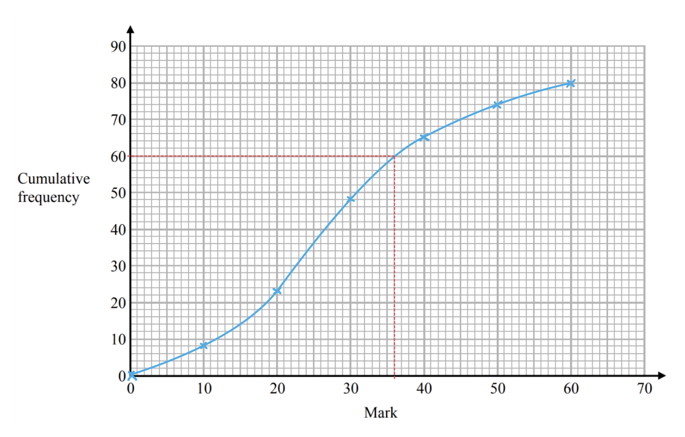

**The lowest possible pass mark is approximately 36*** ***[1]**

## Q16 — medium — 4 marks · exam-questions

### 12((a)) — 1 marks
> *Cumulative frequency is a running total of the frequencies.*

| **Time taken (*****t***** minutes)** | **Cumulative Frequency** |
|---|---|
| 0 < *t* ≤ 10 | **Final answer:** **7** |
| 0 < *t* ≤ 20 | *7 + 26 = ***33** |
| 0 < *t* ≤ 30 | *33 + 24 = ***57** |
| 0 < *t* ≤ 40 | *57 + 14 = ***71** |
| 0 < *t* ≤ 50 | *71 + 7 = ***78** |
| 0 < *t* ≤ 60 | *78 + 2 = ***80** |

**All correct**** [1]**

### 12((b)) — 2 marks
*Cumulative frequencies are plotted at the **end** of the class intervals.* 
*So in these case we would plot the points* *(10, 7), (20, 33), (30, 57), (40, 71), (50, 78)* *and* *(60, 80)**. *
*Also plot a point at (0, 0) and join all points with a smooth curve.*

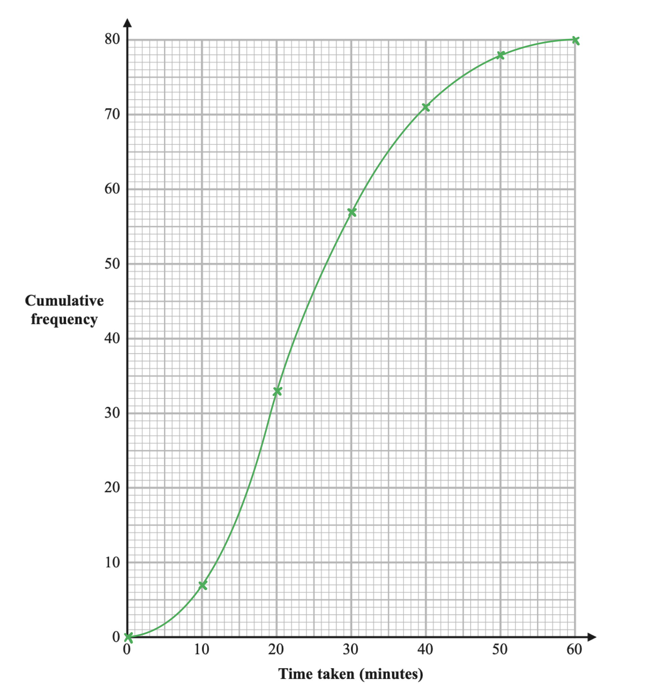

**At least five poinst plotted correctly**** [1] **
**Fully correct with points joined**** [1]**

### 12((c)) — 1 marks
> *As estimating with a large data set, the *`open parentheses n over 2 close parentheses to the power of th`* value can be used to estimate the median.*

*Position of median is the *`open parentheses 80 over 2 close parentheses to the power of th equals 40 to the power of th`* value *

*To find the median time taken, draw a horizontal line across from 40 on the cumulative frequency axis until it reaches the curve.* *Then draw a vertical line down to the time taken axis and take a reading.*

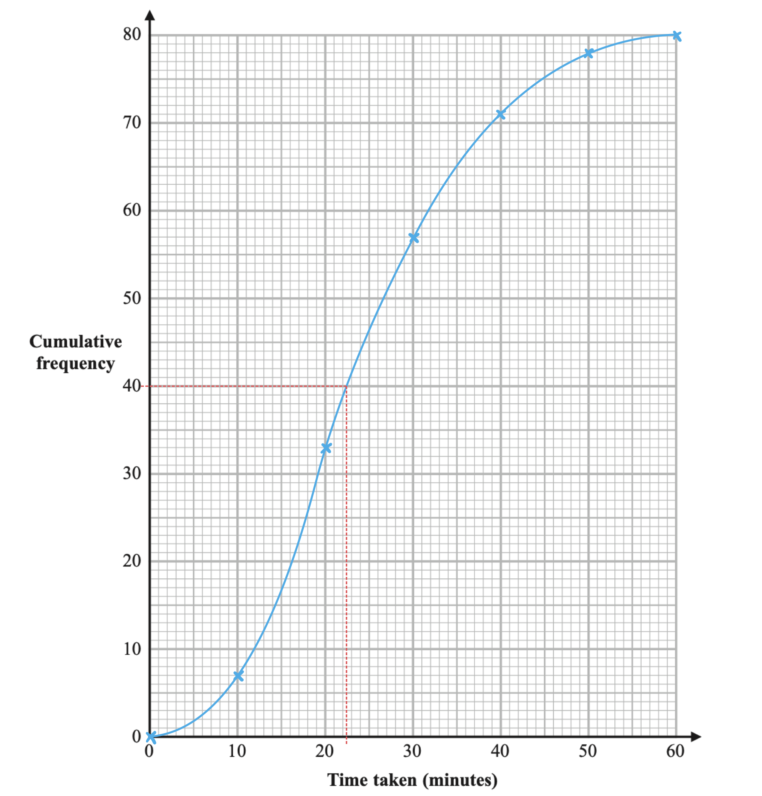

**The median mark is approximately 22.5*** ***[1]**

**Answers in the range 21-24 are accepted.**

## Q17 — medium — 5 marks · exam-questions

### 11((a)) — 2 marks
> *As estimating with a large data set, the *`open parentheses n over 2 close parentheses to the power of th`* value can be used to estimate the median.*

*Position of median is the *`open parentheses 90 over 2 close parentheses to the power of th equals 45 to the power of th`* value *

*To find the median time taken, draw a horizontal line across from 45 on the cumulative frequency axis until it reaches the curve.* *Then draw a vertical line down to the weight axis and take a reading.*

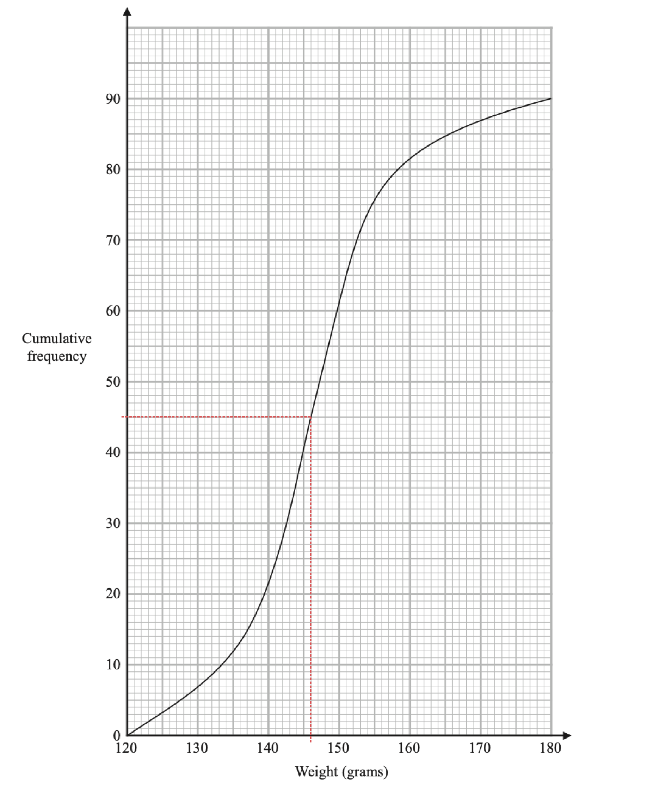

*Using cumulative frequency graph at 45** ***[1]**

**The median weight of a bag of sweets is approximately 146 g*** ***[1]**

**Answers in the range 145-147 are accepted.**

### 11((b)) — 3 marks
> *First find the number of large bags Roberto sells by dividing 93.75 by 3.75.*

*93.75 ÷ 3.75 = 25*

**[1]**

*25 bags have a weight greater than **d** grams.* 
*Subtract 25 from 90 to find the number of bags that have a weight less than **d** grams.*

*90 - 25 = 65*

*Taking a reading from the weight axis at a cumulative frequency of 65 will give (an estimate of) the value of **d**.* 
*Draw a horizontal line from 65 on the cumulative frequency axis across until it reaches the curve.  *
*Then draw a vertical line from the curve down to the weight axis.*

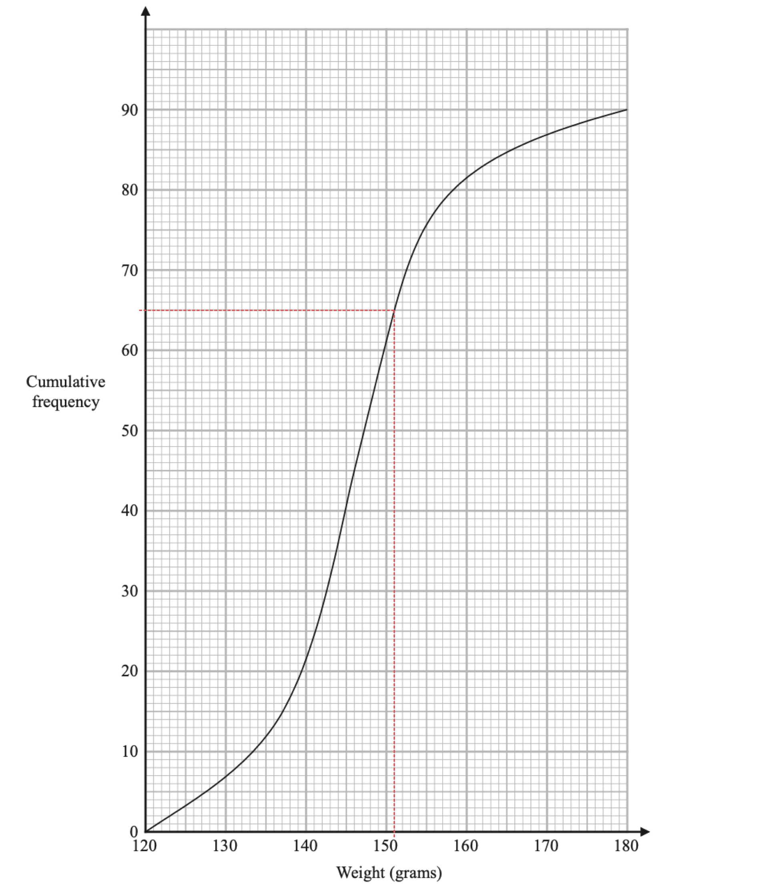

**Use of cumulative frequency graph at 65**** [1]**

**The value of ****d**** is (approximately) 151** **[1]**

**Answers in the range 150-152 are accepted.**

## Q18 — medium — 4 marks · exam-questions

### 11((a)) — 1 marks
> *Cumulative frequency is a running total of the frequencies.*

| **Time waited (*****t***** minutes)** | **Cumulative Frequency** |
|---|---|
| 0 < *t* ≤ 5 | **Final answer:** **8** |
| 0 < *t* ≤ 10 | *8 + 15 = ***23** |
| 0 < *t* ≤ 15 | *23 + 17 = ***40** |
| 0 < *t* ≤ 20 | *40 + 28 = ***68** |
| 0 < *t* ≤ 25 | *68 + 33 = ***101** |
| 0 < *t* ≤ 30 | *101 + 19 = ***120** |

**All correct**** [1]**

### 11((b)) — 2 marks
*Cumulative frequencies are plotted at the **end** of the class intervals.* 
*So in these case we would plot the points* *(5, 8), (10, 23), (15, 40), (20, 68), (25, 101)* *and* *(30, 120)**. *
*Also plot a point at (0, 0) and join all points with a smooth curve.*

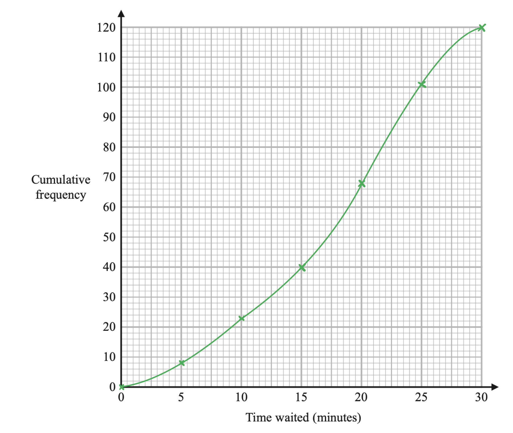

**At least five poinst plotted correctly**** [1] **
**Fully correct with points joined**** [1]**

### 11((c)) — 1 marks
> *As estimating with a large data set, the *`open parentheses n over 2 close parentheses to the power of th`* value can be used to estimate the median.*

*Position of median is the *`open parentheses 120 over 2 close parentheses to the power of th equals 60 to the power of th`* value *

> *To find the median waiting time, draw a horizontal line across from 60 on the cumulative frequency axis until it reaches the curve.*
*Then draw a vertical line down to the time waited axis and take a reading.*

> * *

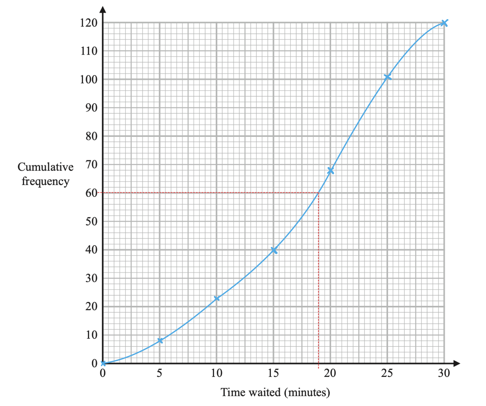

**The median time waited for a call to be answered is approximately 19 minutes*** ***[1]**

**Answers in the range 17-20 are accepted.**

## Q19 — medium — 5 marks · exam-questions

### 11((a)) — 1 marks
> *Cumulative frequency is a running total of the frequencies.*

| **Time (*****t***** minutes)** | **Cumulative Frequency** |
|---|---|
| 25 < *t* ≤ 35 | 12 |
| 25 < *t* ≤ 45 | *12 + 24 = ***36** |
| 25 < *t* ≤ 55 | *36 + 28 = ***64** |
| 25 < *t* ≤ 65 | *64 + 12 = ***76** |
| 25 < *t* ≤ 75 | *76 + 10 = ***86** |
| 25 < *t* ≤ 85 | *86 + 4 = ***90** |

**All correct**** [1]**

### 11((b)) — 2 marks
*Cumulative frequencies are plotted at the **end** of the class intervals.* 
*So in these case we would plot the points* *(35, 12), (45, 36), (55, 64), (65, 76), (75, 86)* *and* *(85, 90)**. *
*Also plot a point at (25, 0) and join all points with a smooth curve.*

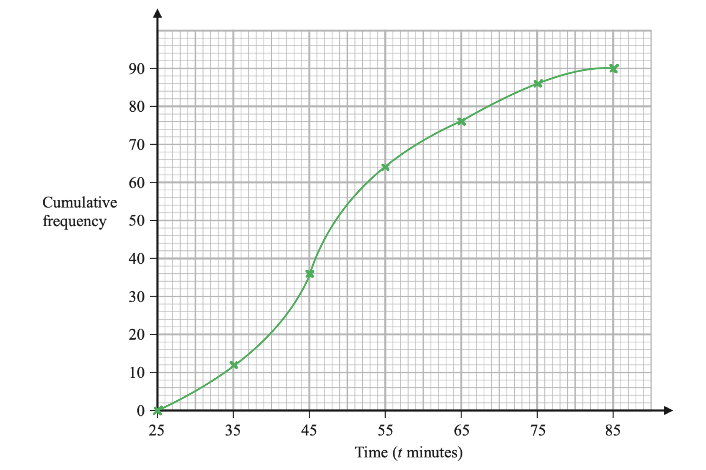

**At least five poinst plotted correctly**** [1] **
**Fully correct with points joined**** [1]**

### 11((c)) — 2 marks
> *Draw vertical lines from 42 and 52 on the time axis until they reach the curve. *
*Then draw horizontal lines across to the cumulative frequency axis and take readings.*

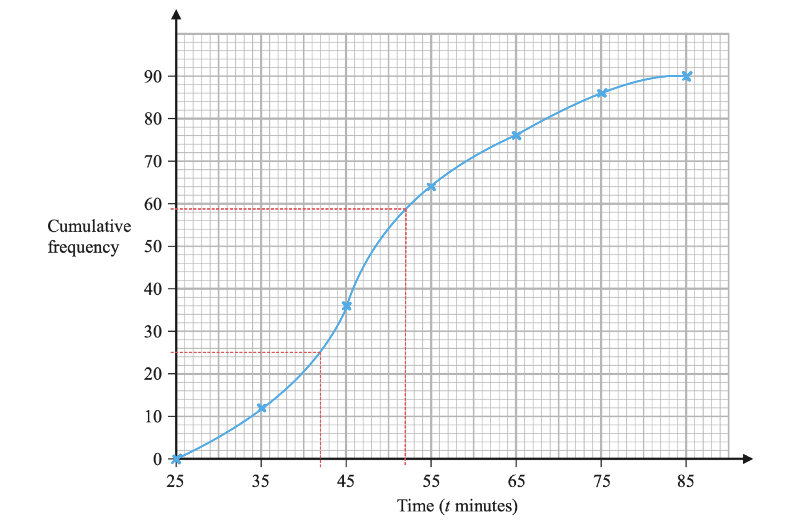

*A time of 42 minutes has a cumulative frequency of 25 *
*A time of 52 minutes has a cumulative frequency of 59*

> *The number of runners required will be the difference between these readings.*

*59 - 25 = 34*

**Approximately 34 runners would have been awarded a silver medal  ****[1]**

## Q20 — medium — 7 marks · exam-questions

### 9((a)) — 1 marks
> *Use addition to find the running total for the data categories*

| Age ($a$ years) | Cumulative frequency |
|---|---|
| `0 space less than space a space less-than or slanted equal to space 10` | *0+4 = ***4** |
| `0 space less than space a space less-than or slanted equal to space 20` | *4+14 = ***18** |
| `0 space less than space a space less-than or slanted equal to space 30` | *18+17 = ***35** |
| `0 space less than space a space less-than or slanted equal to space 40` | *35+13 = ***48** |
| `0 space less than space a space less-than or slanted equal to space 50` | *48+7 = ***55** |
| `0 space less than space a space less-than or slanted equal to space 60` | *55+3 = ***58** |
| `0 space less than space a space less-than or slanted equal to space 70` | *58+2 = ***60** |

**[B1]**

> **[mark-scheme]**
> The mark is awarded for all correct values only so workings are not required.

### 9((b)) — 2 marks
> *Plot coordinates using the upper limit of the class interval for the *$x$*-coordinate and the cumulative frequency for the *$y$*-coordinate*

> *The first coordinate is the lowest class interval value of the first category plotted against zero cumulative frequency*

*Plot (0,0), (10, 4), (20,18), (30,35), (40,48), (50,55), (60,58) and (70,60) *

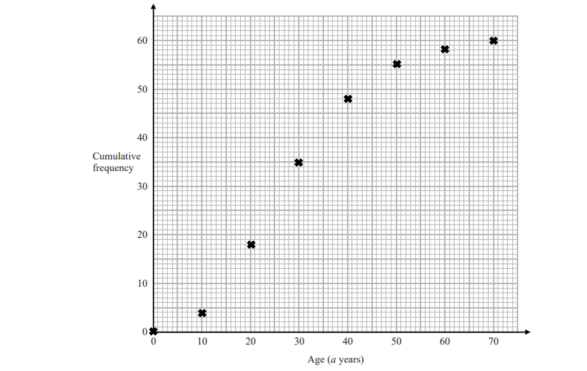

**[B1]**

> *Join the plotted points with a continuous curve*

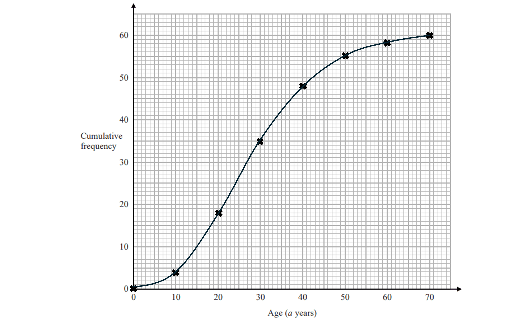

**[B1]**

> **[mark-scheme]**
> **B1**: Awarded for correctly plotted points accurate to $\pm$0.5 square.
> 
> **B1**: Awarded for curve *or* line segments to connect all points.
> 
> Even if the first mark is not gained, the second mark will still be gained if the curve connects at least 4 correctly plotted coordinates *or* if your coordinates have been plotted with the correct *y*-coordinate values against *x*-values that are consistently within each class interval.

### 9((c)) — 2 marks
> *Use the cumulative frequency graph to read off **x** values for the lower quartile (LQ) and upper quartile (UQ) positions*

*Lower quartile position is *$\frac{1}{4}\times60=15$

*Upper quartile position is *$\frac{3}{4}\times60=45$

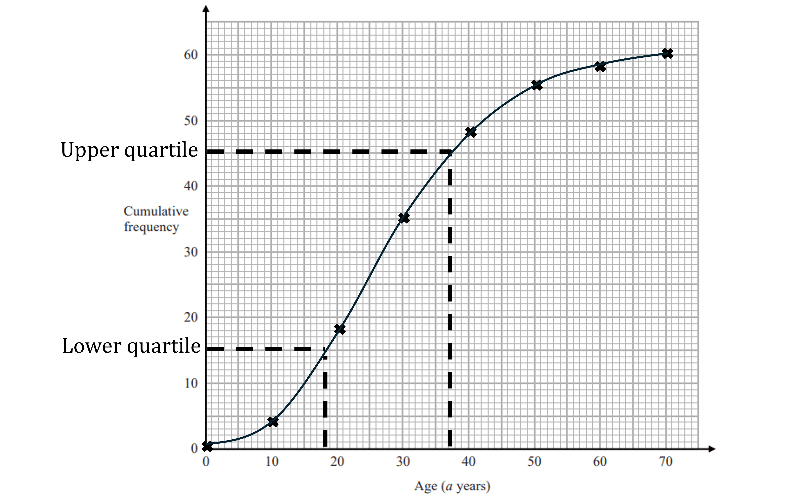

**[M1]**

*LQ value=18*

*UQ value=37*

> *Calculate the interquartile range (IQR) by calculating the difference between the UQ and LQ*

`table row IQR equals cell 37 minus 18 end cell row blank equals 19 end table`

**[A1]**

**Final answer:** **19**

> **[mark-scheme]**
> **M1**: This mark is gained for indicating correct positions of LQ and UQ on the graph (e.g. horizontal lines at 15 and 45 *or* 15.25 and 45.75).
> 
> **A1**: An answer approximate to 19 will gain the mark as long as the final answer has come from reading off your LQ and UQ values correctly.
> 
> This mark is still awarded if your answer comes from using your incorrect cumulative frequency graph and the first mark has been gained.
> 
> This mark is gained if you have not gained the first mark but your answer is  within $\pm$0.5 of 19 and your cumulative frequency graph is correct.

### 9((d)) — 2 marks
> *Use the graph to read off the **y** value corresponding to 48 years as below*

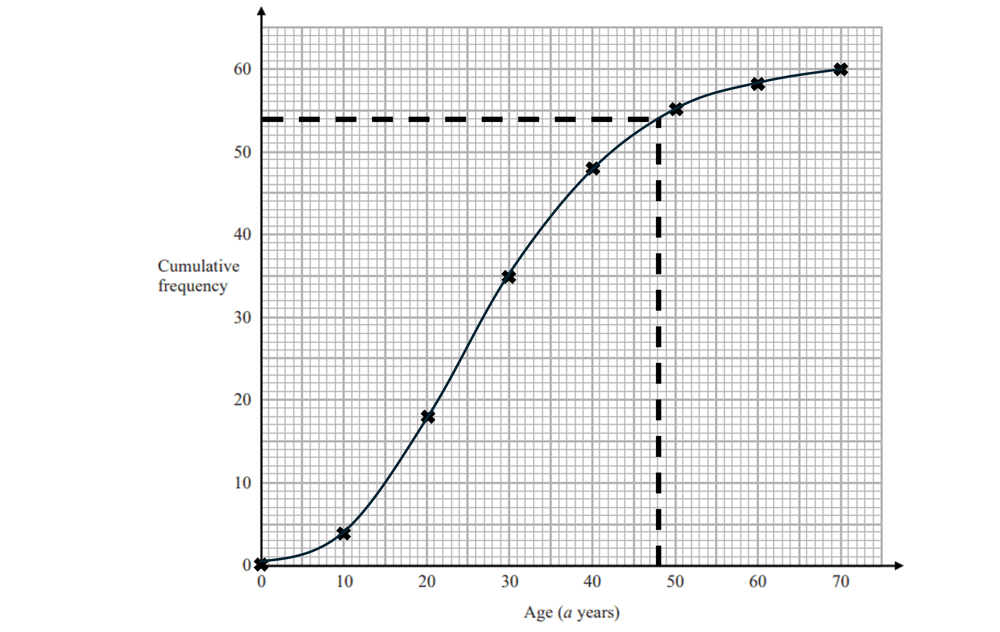

**[M1]**

*54 people are 48 years old or younger*

> *Calculate the number of people more than 48 years of age*

$60-54=6$

**[A1]**

**Final answer:** **6**

> **[mark-scheme]**
> **M1**: Is awarded for drawing a vertical line from 48 on the *x*-axis up to the cumulative frequency graph.
> 
> **A1**: An answer approximate to 6 will gain the mark as long as the answer has come from reading off your graph correctly.
> 
> This mark is still awarded if your answer comes from using your incorrect cumulative frequency graph and the first mark has been gained.
> 
> This mark is still awarded if you have not gained the first mark but your answer is  within $\pm$0.5 of 6 and your cumulative frequency graph is correct.

## Q21 — medium — 4 marks · exam-questions

### 12((a)) — 1 marks
> *Read across from 25 to the line of the curve and then straight down*

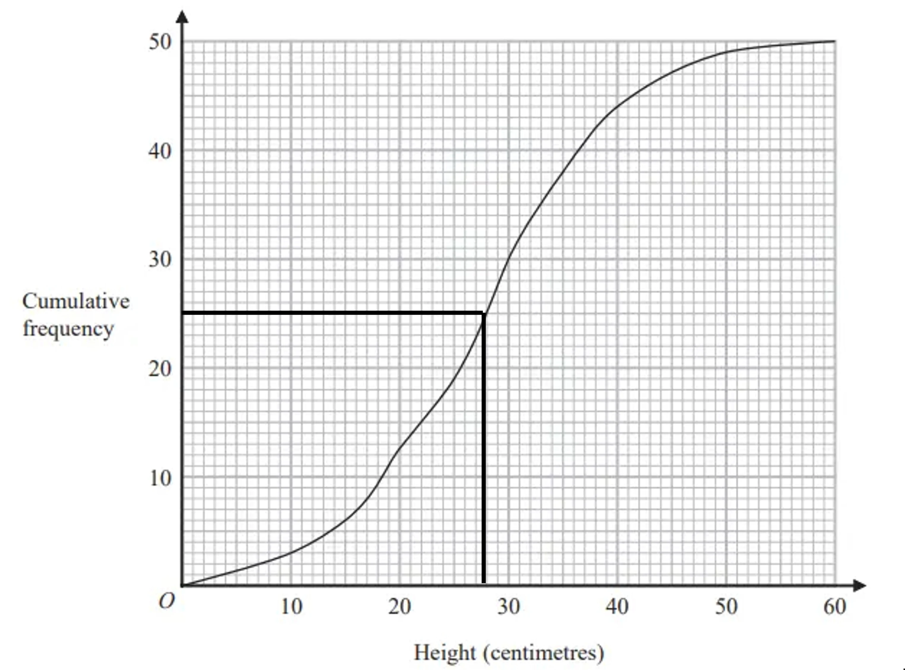

**Final answer:** **28**

**[B1]**

> **[mark-scheme]**
> You get the mark for an answer in the range 27.5 - 28.5.

### 12((b)) — 1 marks
> *Read off the graph at heights of 40 and 30 and subtract to find the frequency in that interval*

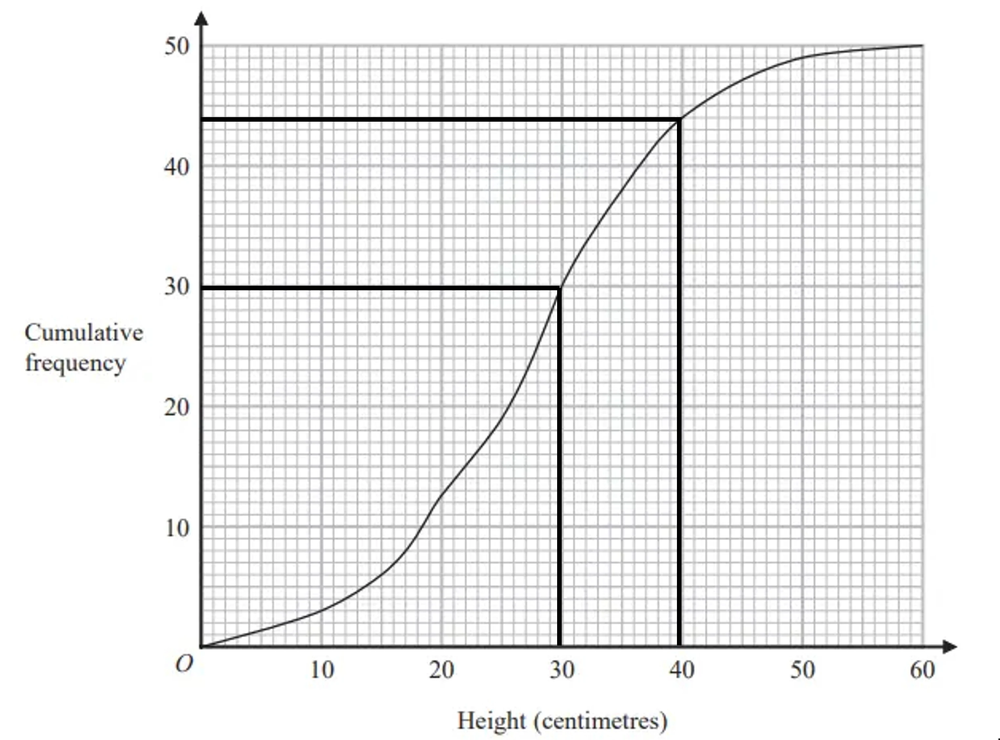

*Cumulative frequency at a height of 40 = 44*

*Cumulative frequency at a height of 30 = 30*

*44 - 30 = 14*

**Final answer:** **14**

**[B1]**

### 12((c)) — 2 marks
> *Read off the graph for a height of 35*

> *Subtract this answer from 50 to get how many are more than 35cm.*

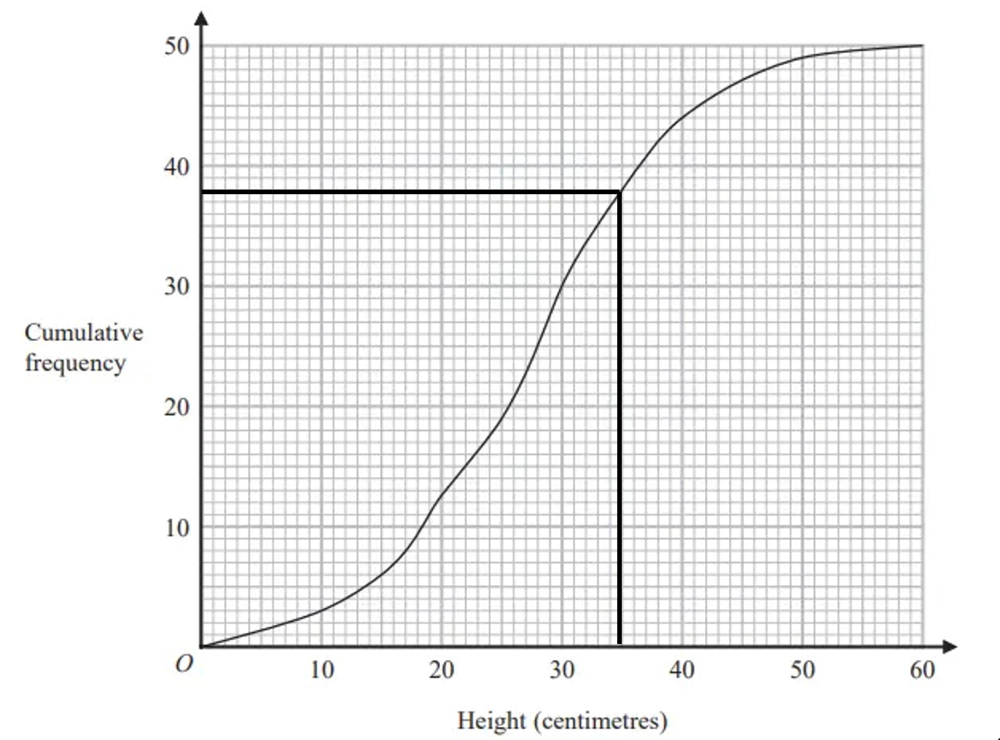

*Cumulative frequency at 35cm = 38*

**[M1]**

*50 - 38 = 12*

**Final answer:** **12**

**[A1]**

## Q22 — medium — 4 marks · exam-questions

### 13() — 1 marks
> *There are 80 people in total so the median is at 40*

> *Draw a line across with a ruler until you meet the curve, then draw a line down to the corresponding value on the *$x$* axis*

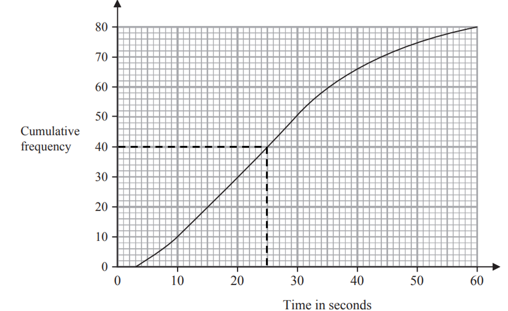

**Final answer:** **25**

**[B1]**

### 13((b)) — 3 marks
> *Work out how many adults took longer than 50 seconds by drawing a line with a ruler up from 50 seconds until you meet the curve, then across to the *$y$* axis*

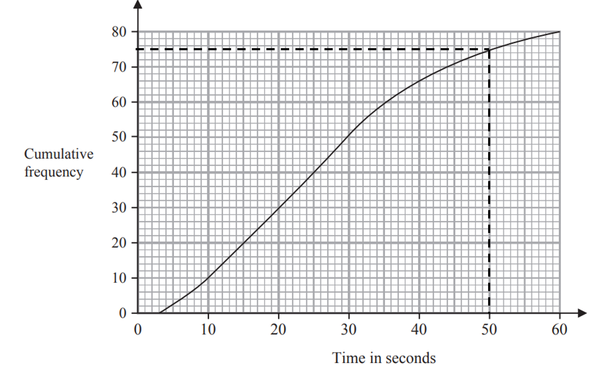

> *This meets at 75*

> *You want the people who took longer than 50 seconds so find the difference from 80*

$80-75=5$

**[M1]**

> *Convert this to a percentage by dividing by the total number of people and multiplying by 100*

`5 over 80 space cross times space 100 space equals space 6.25 percent sign`

**[M1]**

`6.25 percent sign`

**[A1]**

## Q23 — hard — 4 marks · exam-questions

### 11((b)) — 4 marks
*As there are 100 runners in both the male and female categories, the positions of the median and quartiles are easy to work out.*
*In both cases, the median will be (estimated by) the 50**th** value and the lower and upper quartiles by the 25**th** and 75**th** values respectively.* 
*There will be lots of lines on your graph to find these values, so work carefully, using a straight edge for accuracy. *
*Also be careful with the scale, 1 'small square' represents 6 seconds.*

> * *

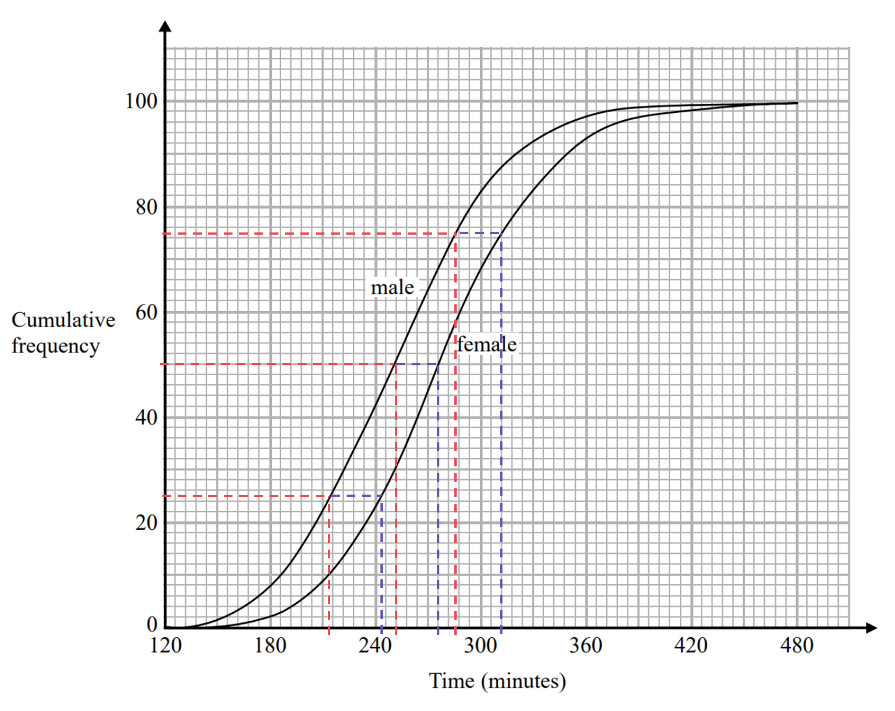

|   | ***Males*** | ***Females*** |
|---|---|---|
| ***Median*** | *252* | *276* |
| ***IQR**** (=UQ - LQ)* | *285 - 213 = 72* | *312 - 243 = 69* |

**At least one median (249-252 and 273-276) ****[1]** 
**At least one itnerquartile range (69-73 and 67-71) ****[1]**

> *Compare the average using medians, compare spread using IQR.*
*Make sure you answer in the context of the question which is about finishing times for the London marathon.*

**The median time for the female runners (276 mins) is higher than that for the male runners (252 mins) so on average the male runners were faster at running the London marathon ****[1]** **The interquartile range for the male runners (72 mins) is higher than that for the female runners (69 mins) showing that the times for the male runners were more varied ****[1]**

## Q24 — hard — 3 marks · exam-questions

### 11((b)) — 3 marks
*Find the number of large bags (by dividing 93.75 euros by 3.75)* * *

*93.75 ÷ 3.75 = 25 large bags*

**[1]**

*The top 25 largest bags is from the 90 - 25 = 65th bag onwards* *Draw a horizontal line from 65 on the **y**-axis across to the curve, then a vertical line from the curve down to the **x**-axis  *

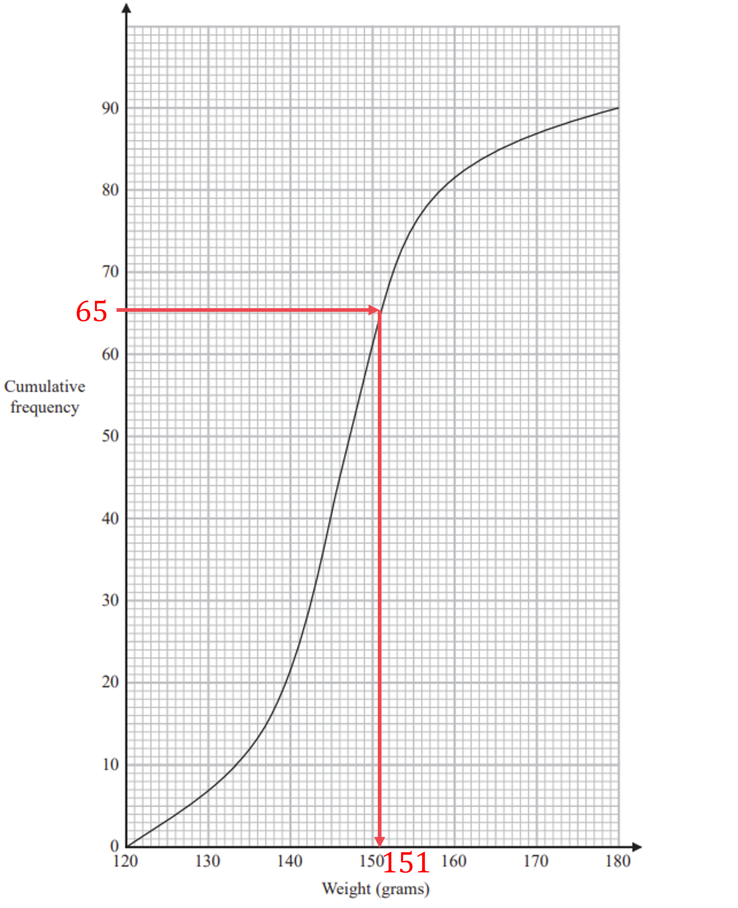

**[1]*** *

> *Read off the weight of the 65th bag *
*This is the weight, **d**, of large bags  *

*151 kg on the ***x***-axis*

**d**** = 151 ****[1]**

## Q25 — hard — 3 marks · exam-questions

### 12((b)) — 3 marks
> *Draw a vertical line up from 50 on the **x**-axis to the curve, then a horizontal line from the curve to the **y**-axis  *

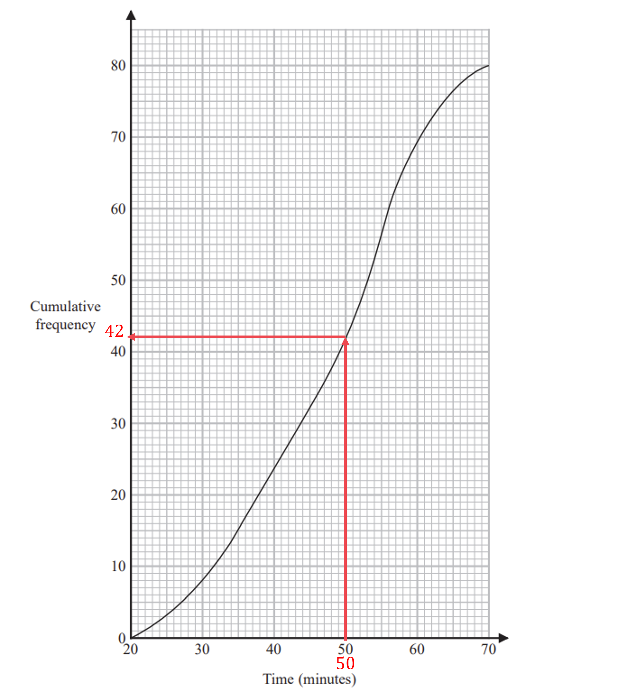

> * *

> *Read off the** y**-value  *

*42 runners took 50 minutes or less*

**any value between 40.5 and 43**** [1]**

> *No international runners took 50 minutes or less  *

*the 42 runner were all national runners**  *

> *These 42 national runners are only 60% of the total number of national runners, **N *
*Write this information as an equation  *

> $42=0.6\timesN$*  *

> *Solve the equation to find **N**  *

$\frac{42}{0.6}=N$

**dividing by 0.6**** [1]**

**There are 70 national runners*** ***[1]**

## Q26 — hard — 3 marks · exam-questions

### 10((b)) — 3 marks
*Method 1* 
*Find 35% of 80 films* * *

*0.35 × 80 = 28 films*

**[1] **

*Look at the top 80 - 28 = 52 films in terms of length* 
*Draw a horizontal line from 52 on the **y**-axis to the curve, then from the curve vertically down to the **x**-axis* * *

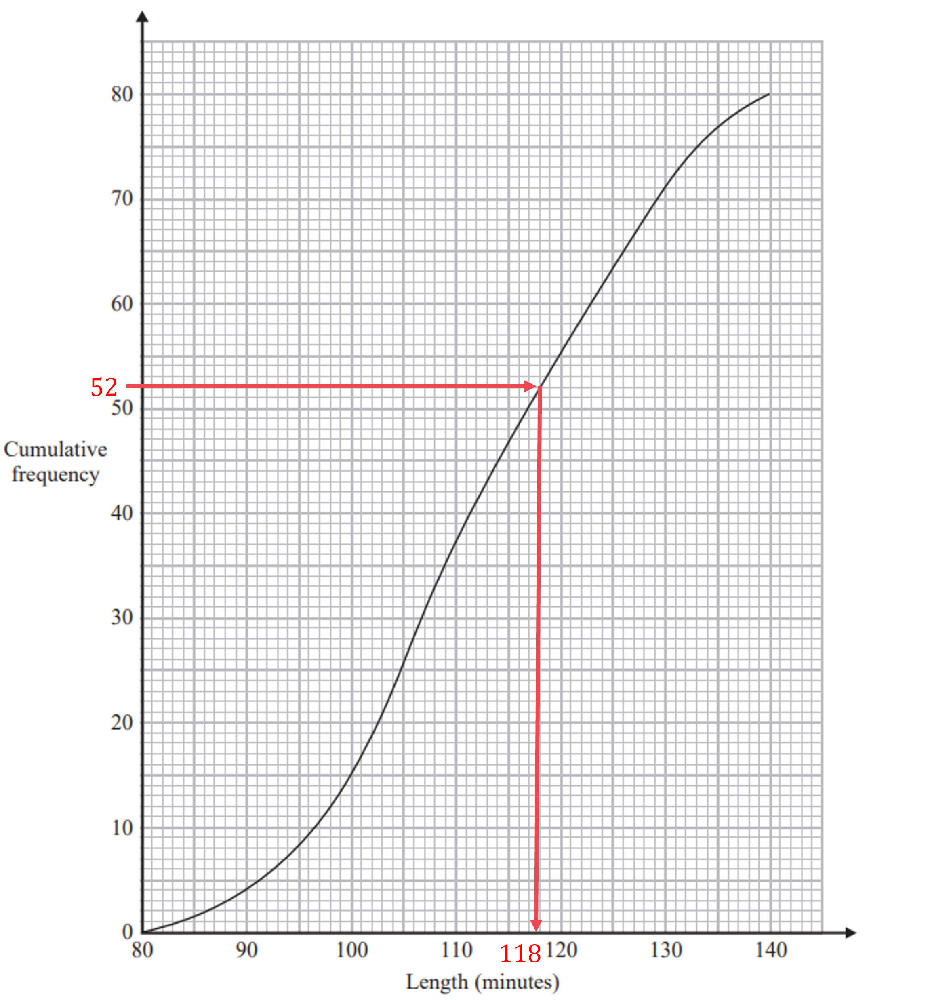

> * *

*Read off the **x**-value* * *

*118 minutes*

**[1]**

*Explain why Clare is not correct (using the wording in the question)* * *

*The bottom 65% of film lengths were 118 minutes or less* * *

**More than 35% of these films are over 118 minutes long so Clare is not correct*** ***[1]** * *

*Method 2* 
*Draw a vertical line up from 120 on the **x**-axis to the curve, then a horizontal line from the curve to the **y**-axis* * *

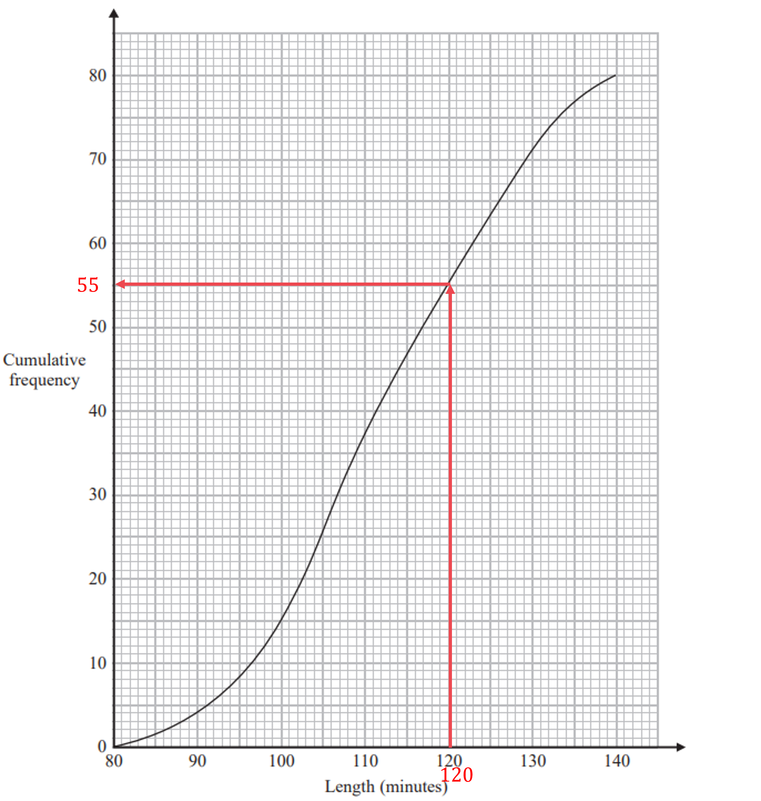

> * *

*Read off the **y**-value* * *

*55 films*

**[1]**

*Find 55 films as a percentage of 80 films* * *

`55 over 80 cross times 100 equals 68.75 percent sign`

**[1]**

> *Explain why Clare is not correct (using the wording in the question)*

*The bottom 68.75% of film lengths were 120 minutes or less*

**More than 31.25% of these films are over 120 minutes long so Clare is not correct** **[1]**

## Q27 — hard — 5 marks · exam-questions

### 14((a)) — 1 marks
> *As estimating with a large data set, the *`open parentheses n over 2 close parentheses to the power of th`* value can be used to estimate the median.*

*Position of median is the *`open parentheses 60 over 2 close parentheses to the power of th equals 30 to the power of th`* value *

*To find the median algebra mark, draw a horizontal line across from 30 on the cumulative frequency axis until it reaches the curve.* 
*Then draw a vertical line down to the algebra mark axis and take a reading.*

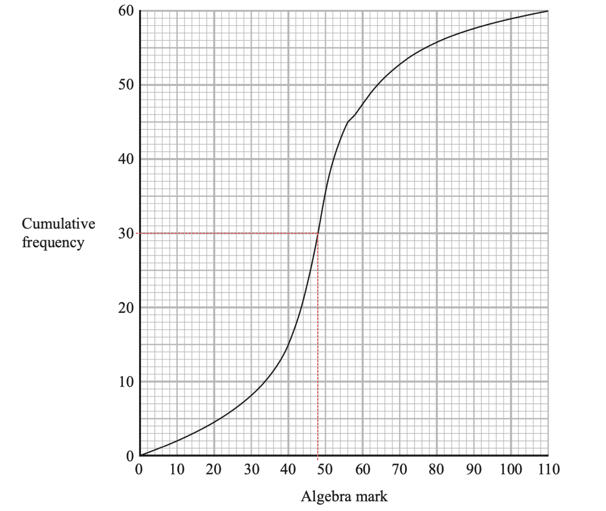

**The median mark in the algebra test is approximately 48*** ***[1]**

**Answers in the range 47-49 are accepted.**

### 14((b)) — 1 marks
> *Draw a vertical line up from 58 marks on the algebra mark axis until it reaches the curve.*
*Then draw a horizontal line across to the cumulative frequency axis and take a reading.*

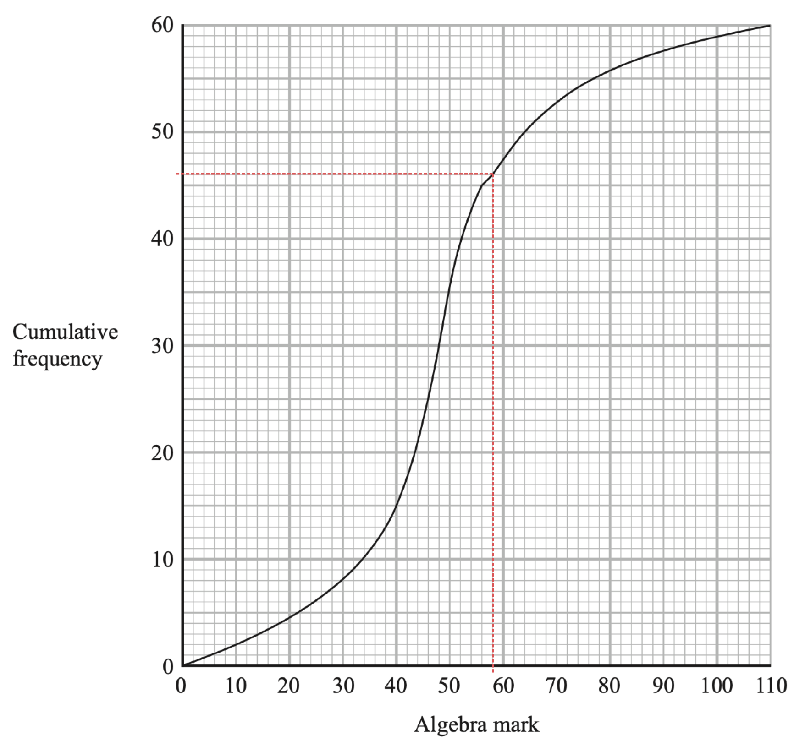

*An algebra mark of 58 has a cumulative frequency of 46*

**Approximately 46 students got an algebra mark of 58 or less ****[1]**

### 14((c)) — 2 marks
> *The interquartile range (IQR) is the difference between the upper quartile (UQ) and the lower quartile (LQ). *
*As estimating with a large data set we can use the *`open parentheses n over 4 close parentheses to the power of th`* value for the lower quartile and the *`open parentheses 3 cross times n over 4 close parentheses to the power of th`* value for the upper quartile. *
*For this question, *$n=60.$

*The lower quartile is the *`open parentheses 60 over 4 close parentheses to the power of th equals 15 to the power of th`* value *
*The upper quartile is the *`open parentheses 3 cross times 60 over 4 close parentheses to the power of th equals 45 to the power of th`* value*

> *Draw horizontal lines from 15 and 45 on the cumulative frequency axis until they reach the curve. *
*Then draw vertical lines down to the algebra mark axis and take readings.*

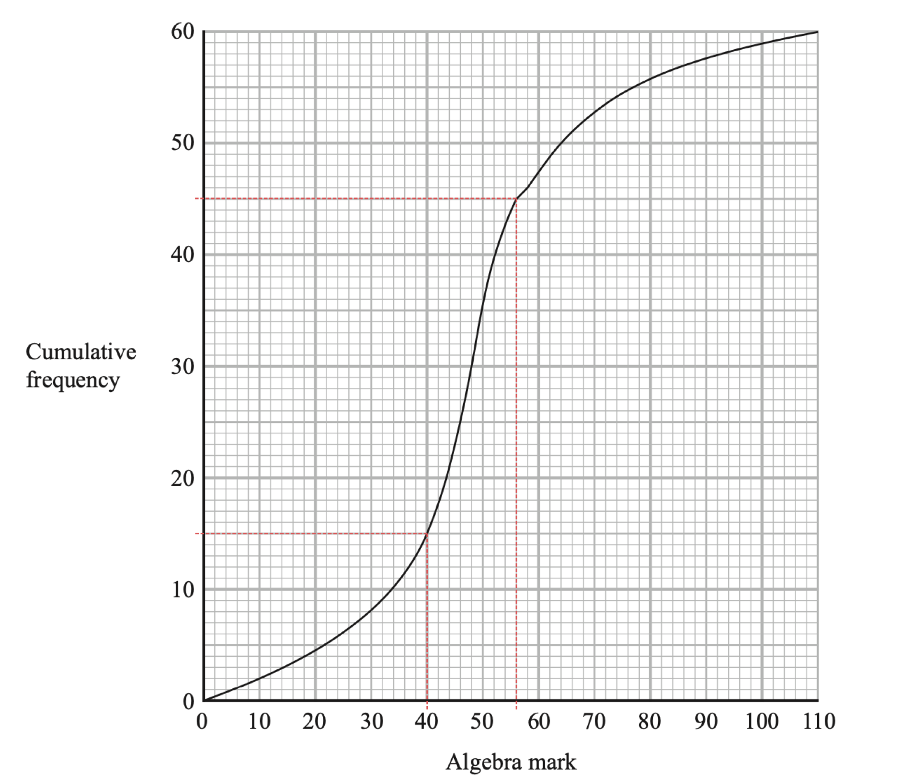

*IQR = UQ - LQ = 56 - 40 = 16*

** ****LQ of 40-41, UQ of 56-58**** [1]**

**The interquartile range for the algebra test is approximately 16 marks ****[1]**

**Answers in the range 16-18 are accepted.**

### 14((d)) — 1 marks
**Yes, Luis is correct, the students' marks are more spread out in the algebra test than in the geometry test** 
**This is because the interquartile range for the algebra test (16) is higher than the interquartile range for the geometry test (9). ****[1]**

## Q28 — hard — 7 marks · exam-questions

### 12((a)) — 2 marks
*Cumulative frequencies are plotted at the **end** of the class intervals.* *So in these case we would plot the points* *(5, 17), (10, 32), (15, 57), (20, 70), (25, 76)* *and* *(30, 80)**. *
*Also plot a point at (0, 0) and join all points with a smooth curve.*

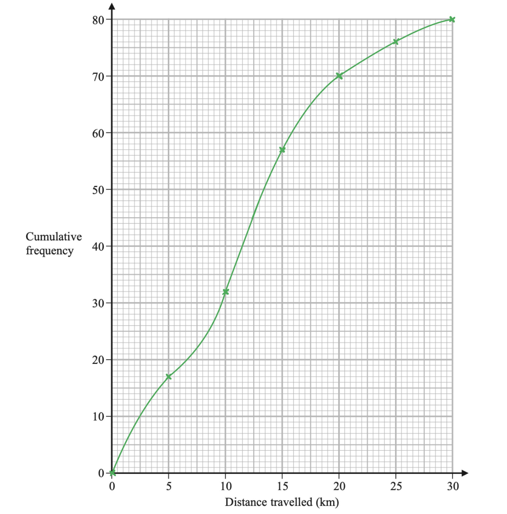

**At least four points plotted correctly**** [1] **
**Fully correct with points joined**** [1]**

### 12((b)) — 1 marks
> *As estimating with a large data set, the *`open parentheses n over 2 close parentheses to the power of th`* value can be used to estimate the median.*

*Position of median is the *`open parentheses 80 over 2 close parentheses to the power of th equals 40 to the power of th`* value *

*To find the median distance travelled, draw a horizontal line across from 40 on the cumulative frequency axis until it reaches the curve.* 
*Then draw a vertical line down to the distance travelled axis and take a reading.*

> * *

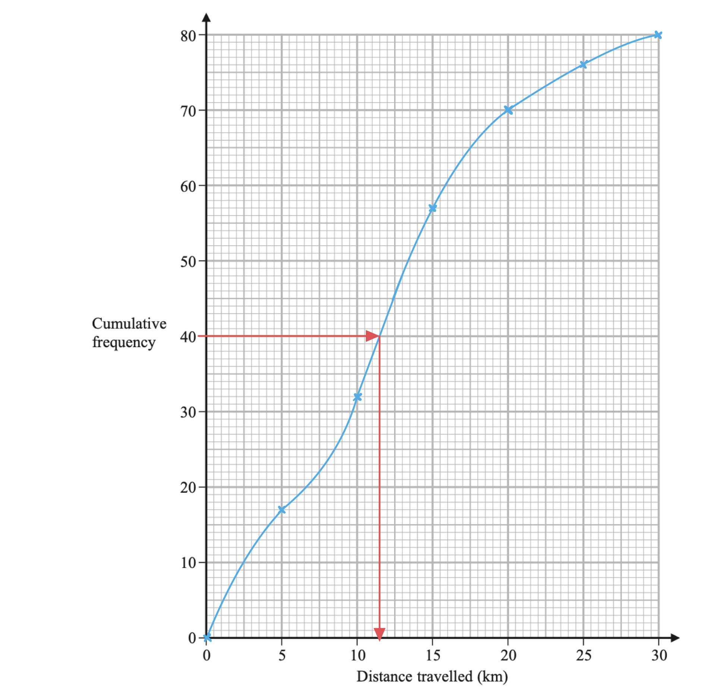

**The median distance travelled to office A is approximately 11.5 km*** ***[1]**

**Answers in the range 10.5-12 are accepted.**

### 12((c)) — 2 marks
> *The interquartile range (IQR) is the difference between the upper quartile (UQ) and the lower quartile (LQ). *

> *As estimating with a large data set we can use the *`open parentheses n over 4 close parentheses to the power of th`* value to approximate the lower quartile and the *`open parentheses 3 cross times n over 4 close parentheses to the power of th`* value to approximate the upper quartile. *
*For this question, *$n=80$*.*

*The lower quartile is the *`open parentheses 80 over 4 close parentheses to the power of th equals 20 to the power of th`* value The upper quartile is the *`open parentheses 3 cross times 80 over 4 close parentheses to the power of th equals 60 to the power of th`* value*

> *Draw horizontal lines from 20 and 60 on the cumulative frequency axis until they reach the curve. *
*Then draw vertical lines down to the distance travelled axis and take readings.*

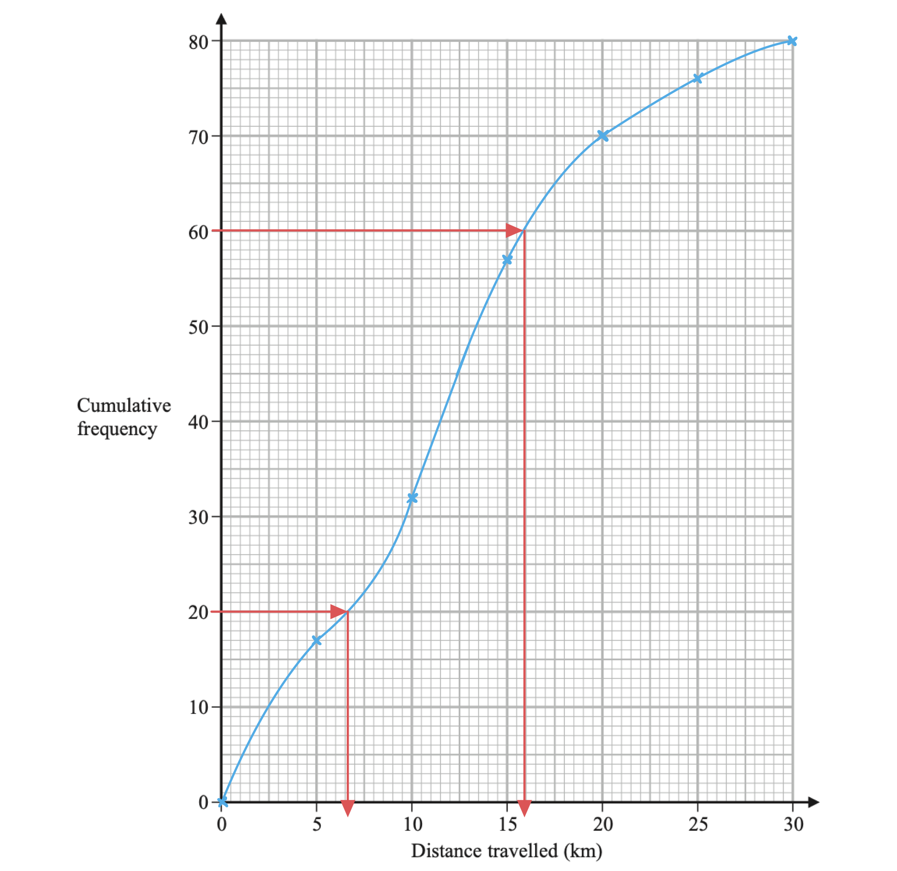

*LQ = 6.5** *
*UQ = 16** *
*IQR = UQ - LQ = 16 - 6.5 = 9.5*

**LQ: 5.5-7 and UQ: 15.5-17**** [1]**

**The interquartile range is approximately 9.5 km*** ***[1]**

**Answers in the range 8.5 to 11.5 are accepted.**

### 12((d)) — 2 marks
*When comparing distributions, aim to write a pair of sentences about average - in this case medians - and a pair of sentences about spread/variation - in this case interquartile ranges.* 
*The first sentence should be about the values, the second sentence should explain what that means in the context of the question.*

**The median distance travelled by workers from home to Office A is 11.5 km which is less than the median distance travelled by workers from home to Office B, which is 15 km** **Therefore, on average, workers at Office B travel further from home to work ****[1]**

**The interquartile range for Office A workers is 9.5 km which is greater than the interquartile range for Office B workers at 5 km** **Therefore there is more variation (spread) in the distances that Office A workers travel from home to work ****[1]**

## Q29 — hard — 5 marks · exam-questions

### 12((a)) — 1 marks
> *As estimating with a large data set, the *`open parentheses n over 2 close parentheses to the power of th`* value can be used to estimate the median.*

*Position of median is the *`open parentheses 60 over 2 close parentheses to the power of th equals 30 to the power of th`* value *

*To find the median waiting time, draw a horizontal line across from 30 on the cumulative frequency axis until it reaches the curve.* 
*Then draw a vertical line down to the waiting time axis and take a reading.*

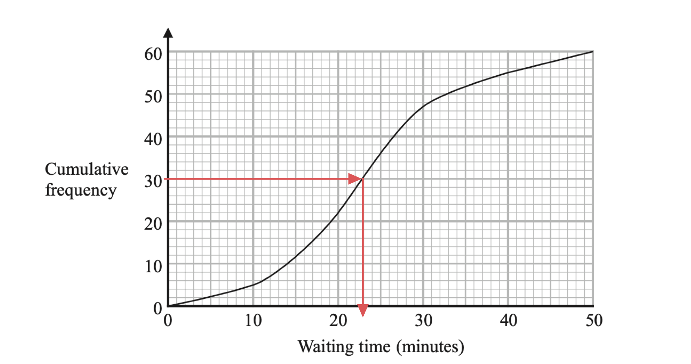

**The median waiting time at Hospital A is approximately 23 minutes*** ***[1]**

**Answers in the range 22-24 are accepted.**

### 12((b)) — 2 marks
> *The interquartile range (IQR) is the difference between the upper quartile (UQ) and the lower quartile (LQ). *

> *As estimating with a large data set we can use the *`open parentheses n over 4 close parentheses to the power of th`* value to approximate the lower quartile and the *`open parentheses 3 cross times n over 4 close parentheses to the power of th`* value to approximate the upper quartile. For this question, *$n=60$*.*

*The lower quartile is the *`open parentheses 60 over 4 close parentheses to the power of th equals 15 to the power of th`* value *
*The upper quartile is the *`open parentheses 3 cross times 60 over 4 close parentheses to the power of th equals 45 to the power of th`* value*

> *Draw horizontal lines from 15 and 45 on the cumulative frequency axis until they reach the curve. *
*Then draw vertical lines down to the waiting time axis and take readings.*

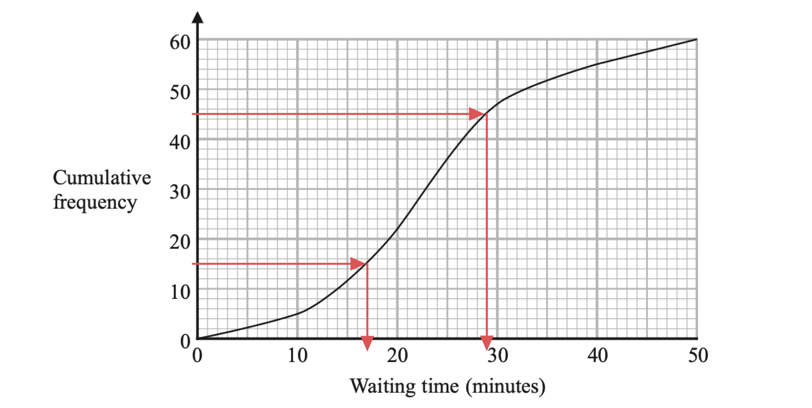

*LQ = 17** *
*UQ = 29** *
*IQR = UQ - LQ = 29 - 17 = 12*

**For subtracting readings at 15 and 45**** [1]**

**The interquartile range is approximately 12 minutes*** ***[1]**

**Answers in the range 10-14 are accepted.**

### 12((c)) — 2 marks
*When comparing distributions, aim to write a pair of sentences about average - in this case medians - and a pair of sentences about spread/variation - in this case interquartile ranges.* 
*The first sentence should be about the values, the second sentence should explain what that means in the context of the question.*

**The median waiting time at Hospital A is 23 minutes which is less than the median waiting time at Hospital B, which is 28 minutes** **Therefore, on average, people with appointments at Hospital B had a longer waiting time ****[1]**

**The interquartile range for Hospital A is 12 minutes which is less than the interquartile range for Hospital B, which is 19 minutes** **Therefore there is more variation (spread) in the waiting times for people with appointments at Hospital B**** ****[1]**

## Q30 — hard — 2 marks · exam-questions

### 10((a)) — 2 marks
> *The interquartile range (IQR) is the difference between the upper quartile (UQ) and the lower quartile (LQ). *
*As estimating with a large data set we can use the *`open parentheses n over 4 close parentheses to the power of th`* value to approximate the lower quartile and the *`open parentheses 3 cross times n over 4 close parentheses to the power of th`* value to approximate the upper quartile. *

> *For this question, *$n=80$*.*

*The lower quartile is the *`open parentheses 80 over 4 close parentheses to the power of th equals 20 to the power of th`* value *
*The upper quartile is the *`open parentheses 3 cross times 80 over 4 close parentheses to the power of th equals 60 to the power of th`* value*

> *Draw horizontal lines from 20 and 60 on the cumulative frequency axis until they reach the curve. *
*Then draw vertical lines down to the length and take readings.*

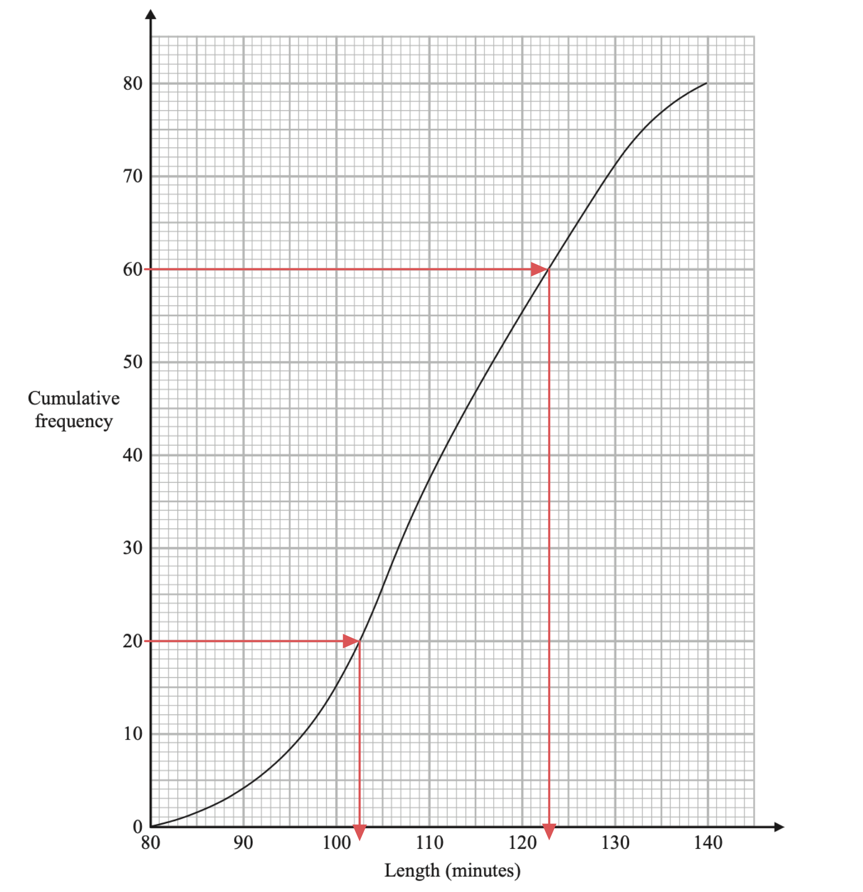

*LQ = 123** *
*UQ = 102.5** *
*IQR = UQ - LQ = 123 - 102.5 = 20.5*

**For readings at 15 and 45**** [1]**

**The interquartile range is approximately 20.5 minutes*** ***[1]**

**Answers in the range 19-21 are accepted.**

## Q31 — hard — 4 marks · exam-questions

### 17((a)) — 1 marks
> *As estimating with a large data set. we can use the the *`open parentheses n over 2 close parentheses to the power of th`* value as an estimate of the median.*

*Position of median is the *`open parentheses 200 over 2 close parentheses to the power of th equals 100 to the power of th`* value. *

*To find the median weight, draw a horizontal line across from 100 on the cumulative frequency axis until it reaches the curve.* *Then draw a vertical line down to the mass (**x**) axis and take a reading.*

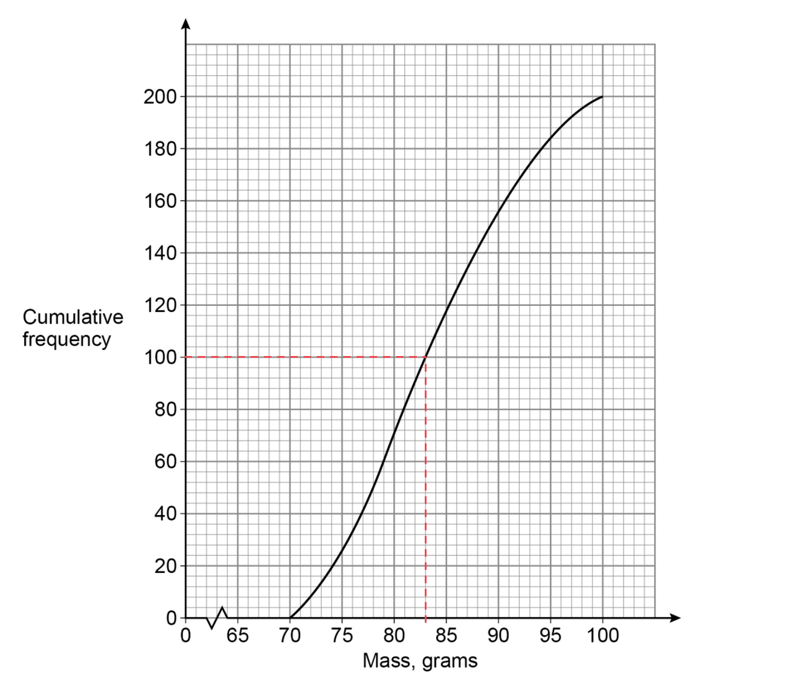

**The median mass is approximately 83 grams ****[1] **
**Answers in the range 82.5 - 83.5 are accepted.**

### 17((b)) — 3 marks
*Use the graph to find the number of apples that have a mass of both less than and more than 90 grams. *
*Draw a vertical line up from 90 on the mass (**x**) axis until it reaches the curve.* 
*Then draw a horizontal line across to the cumulative frequency axis and take a reading.*

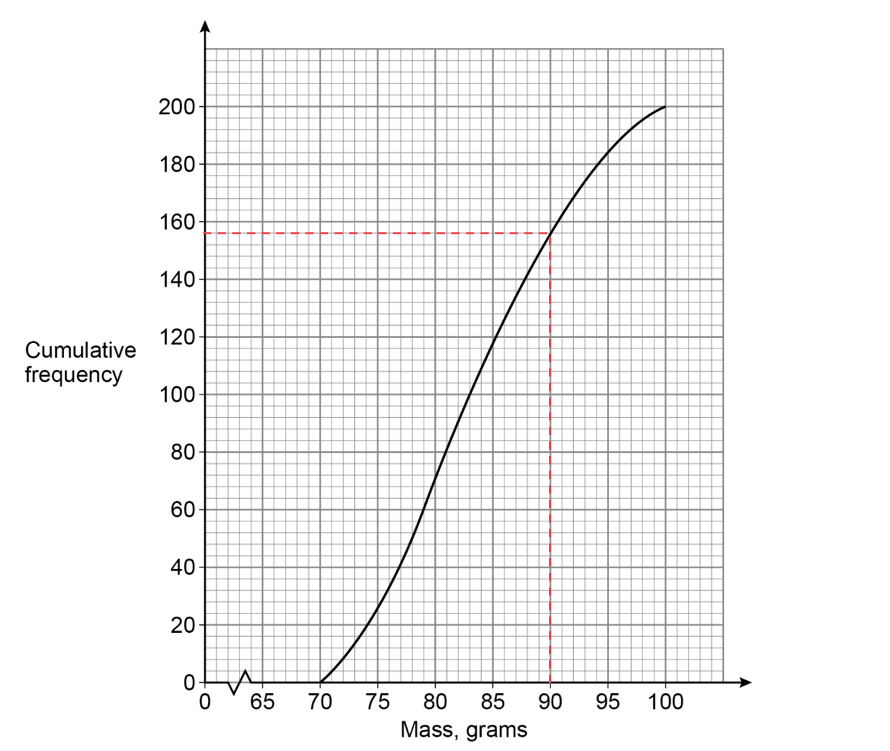

> *The scale on the **y **axis is 4 units per small square, use this to carefully read the cumulative frequency at 90 grams.*

*90 grams has a cumulative frequency of 156*

* ***[1]**

> *This means there are (approximately) 156 apples with a mass of 90 grams or less. *
*Multiply this by the cost of an apple with mass 90g or less.*

*156 × 0.32 = 49.92*

* ***[1]**

> *To estimate the number of apples with a mass of more than 90 grams, subtract 156 the total number of apples, which is 200.*

*200 - 156 = 44*

> *This means there are (approximately) 44 apples with a mass of more than 90 grams. *
*Multiply this by the cost of an apple with mass more than 90g.*

*44 × 0.39 = 17.16*

> *Find the total cost of the 200 apples by adding the two costs together.*

*Total cost = 49.92 + 17.16*

**The 200 apples cost approximately £67.08 ****[1]**

## Q32 — hard — 5 marks · exam-questions

### 22((a)) — 3 marks
> *Fill in the table by adding up the numbers as you go.  *
*A good way to check your work is to make sure your final number is the same as the total number of cars (60).*

| **Miles per gallon, **$x$ | **Frequency** |   | ***Miles per gallon, ***$x$ | ***Cumulative Frequency*** |
|---|---|---|---|---|
| `40 space less than space x space less-than or slanted equal to space 50` | 6 |   | `40 space less than space x space less-than or slanted equal to space 50` | *6* |
| `50 space less than space x space less-than or slanted equal to space 60` | 16 |   | `40 space less than space x space less-than or slanted equal to space 60` | *22* |
| `60 space less than space x space less-than or slanted equal to space 70` | 28 |   | `40 space less than space x space less-than or slanted equal to space 70` | *50* |
| `70 space less than space x space less-than or slanted equal to space 80` | 10 |   | `40 space less than space x space less-than or slanted equal to space 80` | *60* |

**[1]**

> *Plot the points with the **upper class boundaries **of the **x **values against the **cumulative frequency.  *
*The points you need to plot are (50, 6), (60, 22), (70, 50) and (80, 60). *

> *Join up the points using a smooth curve.*

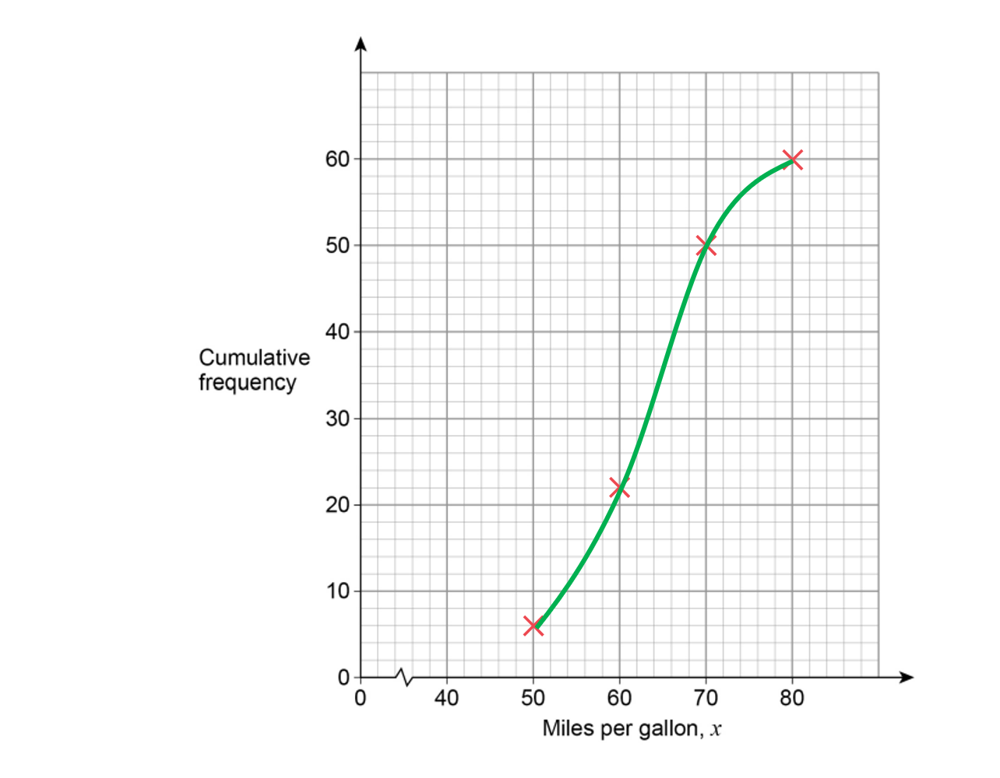

**Points plotted correctly ****[1]**** **
**Points joined ****[1]**

### 22((b)) — 2 marks
> *The interquartile range (IQR) is the difference between the upper quartile (UQ) and the lower quartile (LQ). *

> *When estimating from a cumulative frequency graph, we use the *`open parentheses n over 4 close parentheses to the power of th`* value for the lower quartile and the *`open parentheses 3 cross times n over 4 close parentheses to the power of th`*value for the upper quartile. For this question, *$n=60.$

*The lower quartile is the *`open parentheses 60 over 4 close parentheses to the power of th equals 15 to the power of th`* value *
*The upper quartile is the *`open parentheses 3 cross times 60 over 4 close parentheses to the power of th equals 45 to the power of th`* value*

> *Draw horizontal lines from 15 and 45 on the cumulative frequency axis until they reach the curve. *
*Then draw vertical lines down to the x axis and take readings.*

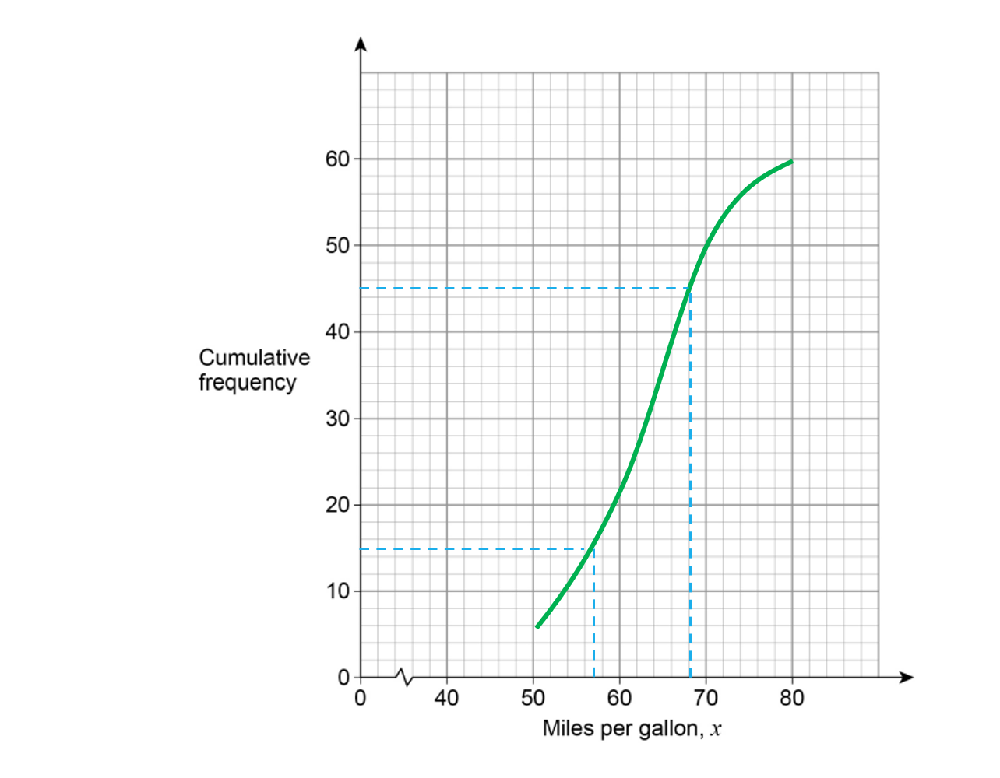

**At least one line drawn from the correct place**** [1]**

> *Read the values for the lower quartile and upper quartile from the **x **axis, note that the scale is 2 mpg per square. *

*LQ = 57 miles per gallon *
*UQ = 68 miles per gallon*

*IQR = UQ - LQ = 68 - 57 = 11*

**The interquartile range is approximately 11 mpg ****[1] **
**Answers consistent with the drawn graph are accepted.**

## Q33 — hard — 5 marks · exam-questions

### 19((a)) — 3 marks
> *Fill in the table by adding up the numbers as you go.  *
*A good way to check your work is to make sure your final number is the same as the total number of students (60).*

| **Mark, **$m$ | **Frequency** |   | ***Mark****, *$m$ | ***Cumulative Frequency*** |
|---|---|---|---|---|
| `40 space less than space m space less-than or slanted equal to space 50` | 9 |   | `40 space less than space m space less-than or slanted equal to space 50` | *9* |
| `50 space less than space m space less-than or slanted equal to space 60` | 16 |   | `40 space less than space m space less-than or slanted equal to space 60` | *25* |
| `60 space less than space m space less-than or slanted equal to space 70` | 20 |   | `40 space less than space m space less-than or slanted equal to space 70` | *45* |
| `70 space less than space m space less-than or slanted equal to space 80` | 8 |   | `40 space less than space m space less-than or slanted equal to space 80` | *53* |
| `80 space less than space m space less-than or slanted equal to space 90` | 7 |   | `40 space less than space m space less-than or slanted equal to space 90` | *60* |

**[1]**

> *Plot the points with the **upper class boundaries **of the **m **values against the **cumulative frequency.  *
*The points you need to plot are (50, 9), (60, 25), (70, 45), (80, 53) and (90, 60). *

> *Join up the points using a smooth curve.*

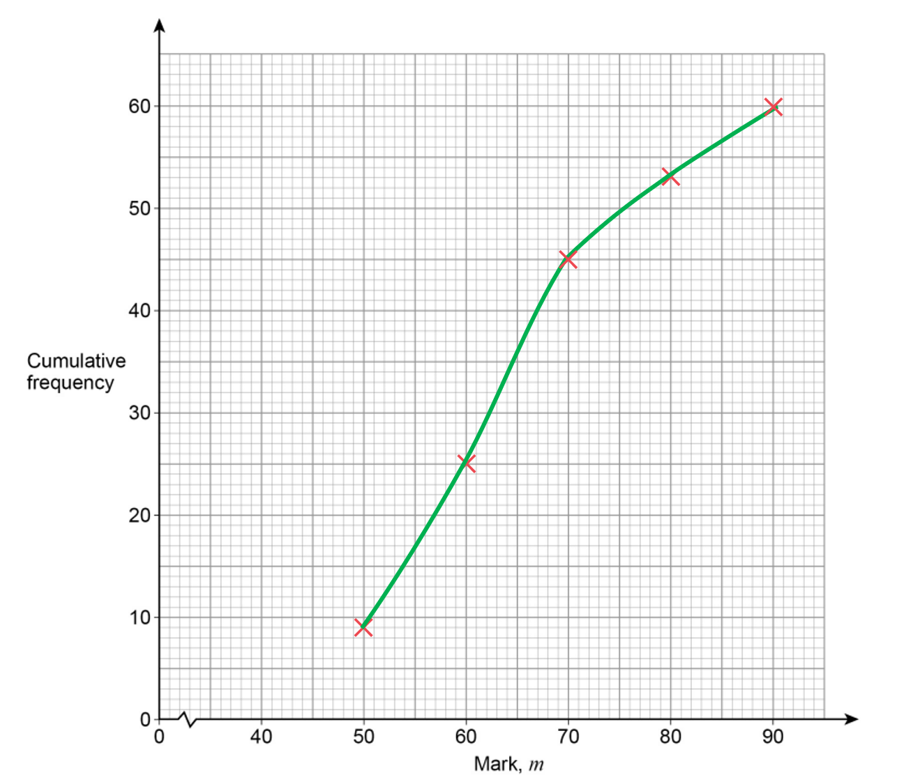

**Points plotted correctly ****[1]**** **
**Points joined ****[1]**

### 19((b)) — 2 marks
> *Find 20% of 60 (the total number of students).*

*20% of 60 = 0.2 × 60 = 12*

> *To find how many students make up the top 20% of students, subtract this number from the total number of students.*

*60 - 12 = 48 students.*

*Draw a horizontal line from 48 on the cumulative frequency axis until it reaches the curve.* 
*Then draw a vertical line down to the **x **axis and take a reading. This will be an estimate for the lowest mark for the top 12 students.*

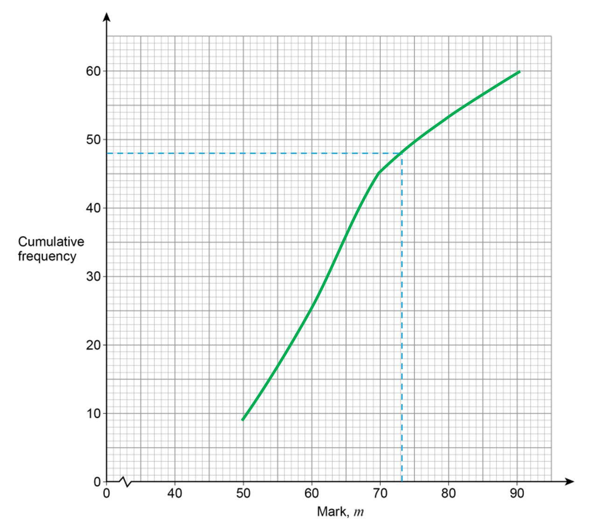

**Reading from graph*** ***[1]**

**The lowest mark for the top 12 students is approximately 73** **[1]**

**Answers consistent with graph or in the range 73 - 75 would be accepted.**

## Q34 — hard — 9 marks · exam-questions

### 12((a)) — 1 marks
*Work out half of the total number of workers* * *

*60 ÷ 2 = 30* * *

*Draw a horizontal line from 30 on the cumulative-frequency axis to the curve, then a vertical line from the curve to the **x**-axis* *Read off this value*

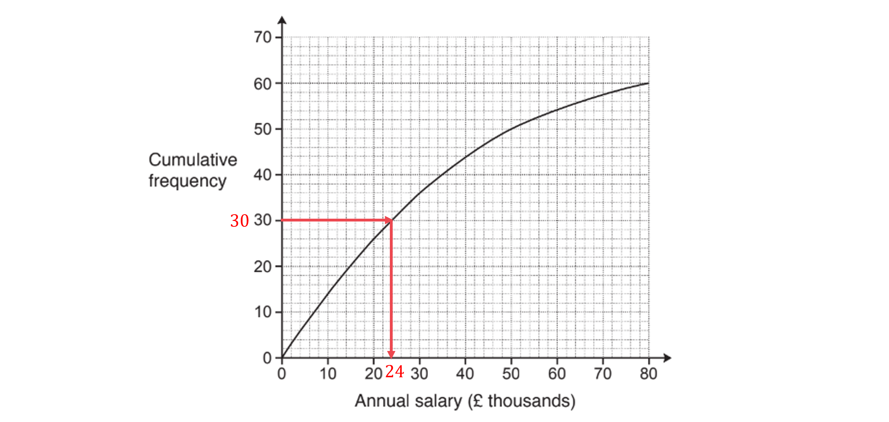

**£24 thousand**** ****[1]**

### 12((b)) — 2 marks
> *Use the graph to read off the cumulative frequencies at the upper values of **p** shown *
*Write these values in the table*

| *Annual salary,** p* *(£ thousands)* | *Cumulative* *frequency* |
|---|---|
| `p space less-than or slanted equal to space 10` | **Final answer:** **14** |
| `p space less-than or slanted equal to space 20` | **Final answer:** **26** |
| `p space less-than or slanted equal to space 30` | **Final answer:** **36** |
| `p space less-than or slanted equal to space 50` | **Final answer:** **50** |
| `p space less-than or slanted equal to space 80` | **Final answer:** **60** |

**completed table with 3 correct**** [1]** 
**fully correct**** [1]**

### 12((c)) — 5 marks
*Convert the cumulative frequency column back into a frequency column by "undoing" the adding up (the quickest way is to subtract the previous cumulative frequency from the current cumulative frequency)*

| *Annual salary,** p* *(£ thousands)* | > *Frequency* |
|---|---|
| `0 less than p space less-than or slanted equal to space 10` | *14* |
| `10 less than p space less-than or slanted equal to space 20` | *26 - 14 = 12* |
| `20 less than p space less-than or slanted equal to space 30` | *36 - 26 = 10* |
| `30 less than p space less-than or slanted equal to space 50` | *50 - 36 = 14* |
| `50 less than p space less-than or slanted equal to space 80` | *60 - 50 = 10* |

**follow-through error allowed from part (b) ****[1]**

*Create a midpoints column and fill in the midpoints of the intervals* * *

| *Annual salary,** p* *(£ thousands)* | > *Frequency* | > *Midpoints* |
|---|---|---|
| `0 less than p space less-than or slanted equal to space 10` | > *14* | *5* |
| `10 less than p space less-than or slanted equal to space 20` | > *12* | *15* |
| `20 less than p space less-than or slanted equal to space 30` | > *10* | *25* |
| `30 less than p space less-than or slanted equal to space 50` | > *14* | *40* |
| `50 less than p space less-than or slanted equal to space 80` | > *10* | *65* |

* ***allow one error ****[1]**

*Create a new column to multiply the frequencies by the midpoints* * *

| *Annual salary,** p* *(£ thousands)* | > *Frequency* | > *Midpoints* | > * * |
|---|---|---|---|
| `0 less than p space less-than or slanted equal to space 10` | > *14* | > *5* | *14 × 5 = 70* |
| `10 less than p space less-than or slanted equal to space 20` | > *12* | > *15* | *12 × 15 = 180* |
| `20 less than p space less-than or slanted equal to space 30` | > *10* | > *25* | *10 × 25 = 250* |
| `30 less than p space less-than or slanted equal to space 50` | > *14* | > *40* | *14 × 40 = 560* |
| `50 less than p space less-than or slanted equal to space 80` | > *10* | > *65* | *10 × 65 = 650* |

> * *

*Work out the total of the frequency column and the total of the final column* * *

| *Annual salary,** p* *(£ thousands)* | > *Frequency* | > *Midpoints* | > * * |
|---|---|---|---|
| `0 less than p space less-than or slanted equal to space 10` | > *14* | > *5* | > *14 × 5 = 70* |
| `10 less than p space less-than or slanted equal to space 20` | > *12* | > *15* | > *12 × 15 = 180* |
| `20 less than p space less-than or slanted equal to space 30` | > *10* | > *25* | > *10 × 25 = 250* |
| `30 less than p space less-than or slanted equal to space 50` | > *14* | > *40* | > *14 × 40 = 560* |
| `50 less than p space less-than or slanted equal to space 80` | > *10* | > *65* | > *10 × 65 = 650* |
|   | *Total = 60* | * * | *Total = 1710* |

**[1]**

*Work out an estimate of the mean (by dividing the total in the final column by the total of the frequency column)* * *

$\frac{1710}{60}$

**[1]**

**£28.5 thousands ****[1]**

### 12((d)) — 1 marks
*The exact value of the mean can only be calculated from a list of all 60 exact salaries * 
*The salaries, however, have been "grouped" together into a table, so their exact values have been lost*

**The mean is only approximate as the exact salaries for each worker are not given**** ****[1]**

**Other accepted answers are: "the mean assumes all values lie at the midpoint of the intervals" "the median is read accurately from a graph but the mean is estimated" "the median is only affected by mistakes in measuring" **

## Q35 — hard — 3 marks · exam-questions

### 13() — 3 marks
*Find the number of members who are 180 cm tall or less (by drawing a vertical line up from 180 to the curve, then a horizontal line from the curve to the cumulative-frequency axis)* * *

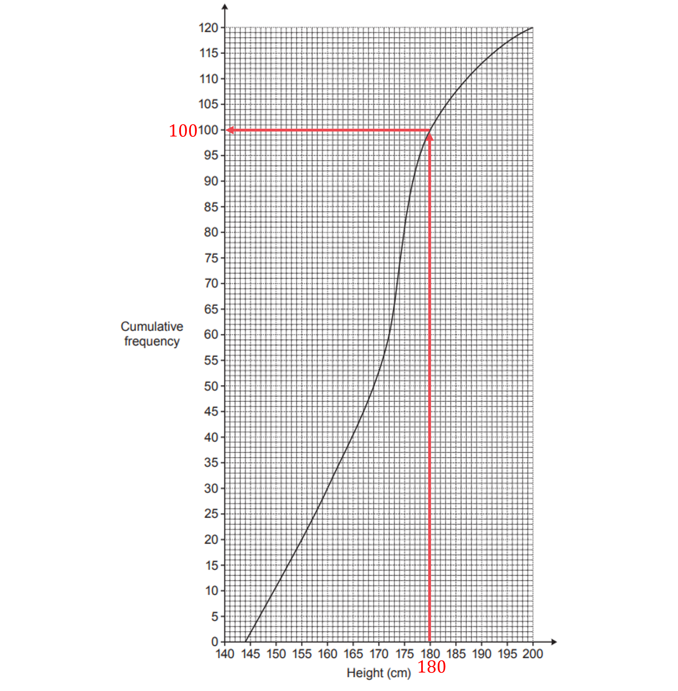

*100 members are 180 cm tall or less*

**[1]**

*Work out the number of members who are at least 180 cm tall (by subtracting 100 from 120)* * *

*120 - 100 = 20* * *

*Write 20 as a percentage of 120 (by dividing 20 by 120 and multiplying by 100)* * *

$\frac{20}{120}\times100$

**[1]**

*This gives 16.666...% * *Round the answer to 3 significant figures*

**16.7%** **[1]**

**Answers in the range 16.6 to 16.7, or the rounded answer 17, are accepted**

## Q36 — hard — 3 marks · exam-questions

### 15((b)) — 3 marks
*If passing : failing is 4 : 1 then *$\frac{4}{5}$* of students pass (80%) and *$\frac{1}{5}$* of students fail (20%)* 
*Work out *$\frac{1}{5}$* of 80 students* * *

$\frac{1}{5}\times80=16$

**80 ÷ 5 ****[1]** 
**16 seen**** [1]**

*Find the highest mark achieved by the bottom 16 students (by drawing a horizontal line from 16 on the cumulative-frequency axis to the curve, then a vertical line from the curve to **x**-axis)* * *

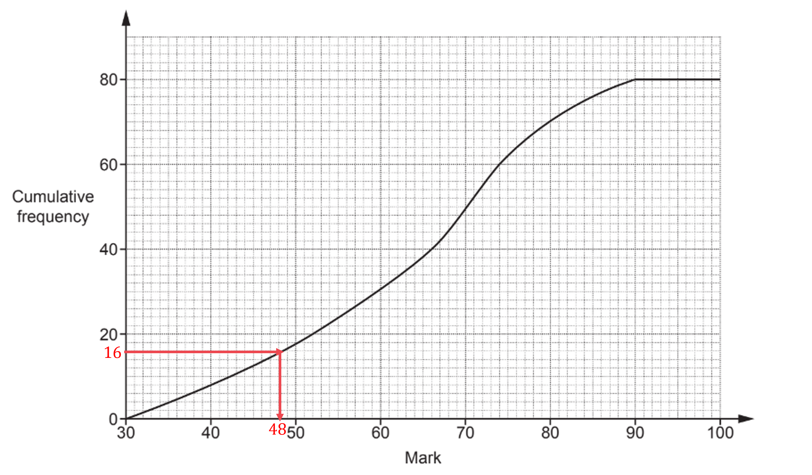

*16 students achieved at most 48 marks* * *

*The top 80% of students got above 48 marks, so make this the minimum number of marks required to pass*

**48 marks ****[1]**

**Accept 48 to 49**

## Q37 — hard — 9 marks · exam-questions

### 15((a)) — 3 marks
*(i) **Find half of the total number of families* * *

*200 ÷ 2 = 100* * *

*Draw a horizontal line from 100 on the cumulative-frequency axis across to the curve, then a vertical line from the curve to the **x**-axis* *Read off this value* * *

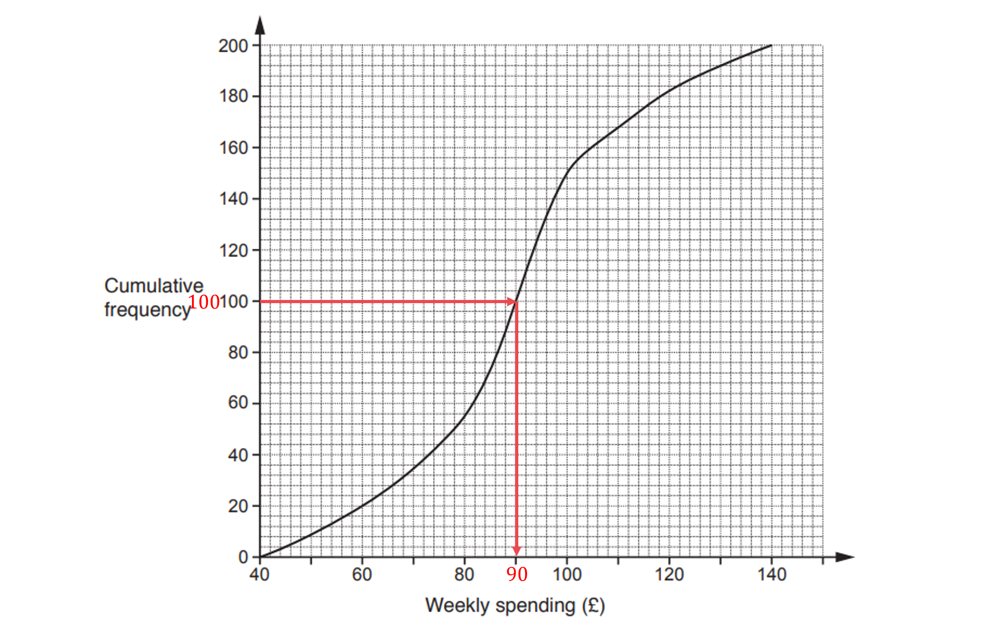

> * *

**£90*** ***[1]**

*(ii) **Find a quarter and three-quarters of the total number of families* * *

*200 ÷ 4 = 50  and  200 ÷ 4 × 3 = 150* * *

*Draw horizontal lines from 50 and 150 on the cumulative-frequency axis across to the curve, then a vertical lines from the curve to the **x**-axis* *Read off these values* * *

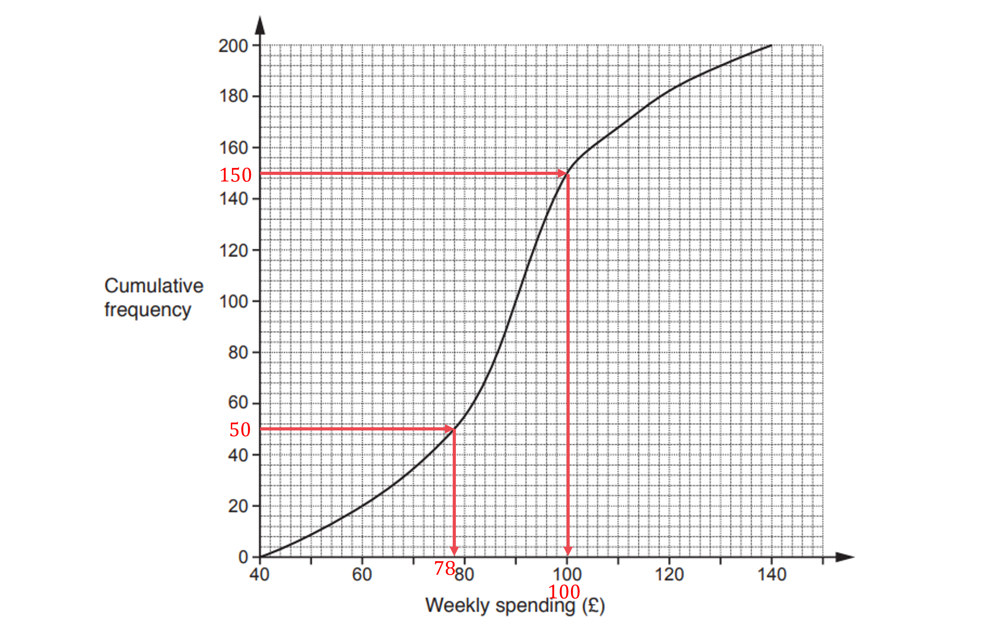

* lower quartile = 78* 
*upper quartile = 100*

**UQ = 100 or LQ = 77 - 79 ****[1]**

*Calculate the interquartile range (upper quartile subtract lower quartile)* * *

*100 - 78*

**£22 ****[1]**

**Accept 21 to 23**

### 15((b)) — 2 marks
*Method 1*
 *If 15% of families spend over £120 then 85% of families spend £120 or less* *Calculate 85% of 200 families (by multiplying 200 by 0.85)* * *

*200 × 0.85 = 170 families*

**[1]**

*Use the graph to read off the **x**-value when the cumulative frequency is 170*

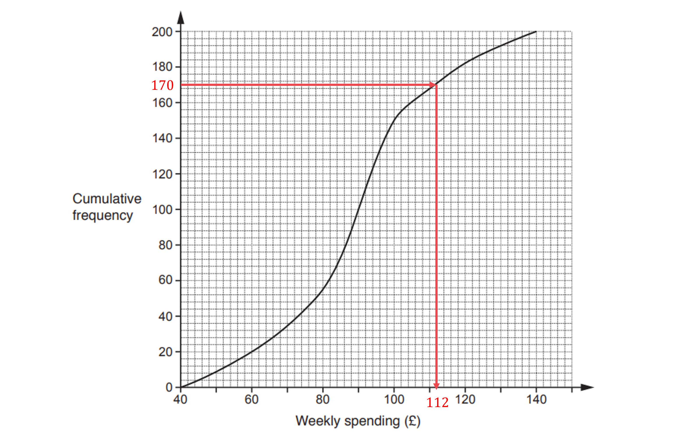

* *

*85% of families spend £112 or less* *15% of families spend over £112*

*State that she is not correct and compare numbers from the graph to her claim of £120* * *

**She is not correct, as 15% of families spend over £112 which is less than £120*** ***[1]**

**Accept £110 to £112** * *

> *Method 2 *
*Use the graph to find the number of families who spend £120 or less (by reading off the cumulative frequency when the weekly spending is £120 on the **x**-axis)*

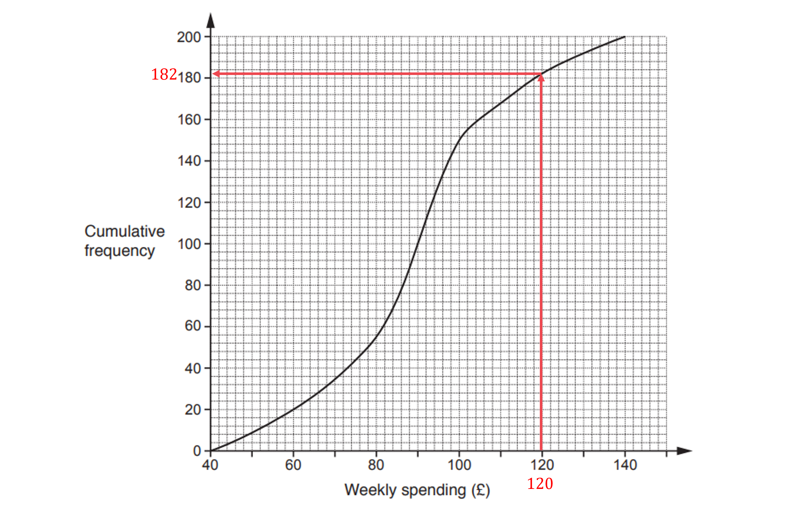

* *

*182 families spend £120 or less*

**180 to 184 ****[1]**

> *Work out 182 as a percentage of 200  *

> `182 over 200 cross times 100 equals 91 percent sign`*  *

> *Work out the percentage of the 200 families that spend over £120 (by subtracting 91 from 100)  *

*100 - 91 = 9%**  *

*State that she is not correct and compare this percentage with her claim of 15%* * *

**She is not correct, as 9% of families spend over £120 which is less than 15%*** ***[1]**

**Accept 8% to 10%** * *

### 15((c)) — 4 marks
*The medians tells you about their spending "on average"* *Compare the medians* * *

*median in the north = £90 and median in the south = £84* * *

*The interquartile range (IQR) tells you about how spread out the values are* *Compare the interquartile ranges* * *

*IQR in the north = £22 and IQR in the south = £28*

> * *

*State which part of the country spent more, on average, with medians used as evidence* 
*State which part of the country had more spread in its spending, with IQRs used as evidence*

**families in the south spent less, on average, than families in the north ****[1]** 
**because the median in the south, £84, is lower than the median in the north, £90 ****[1]** 
**families in the south had more spread in their spending than families in the north ****[1]** 
**because the interquartile range in the south, £28, is higher than the interquartile range in the north, £22 ****[1]**
