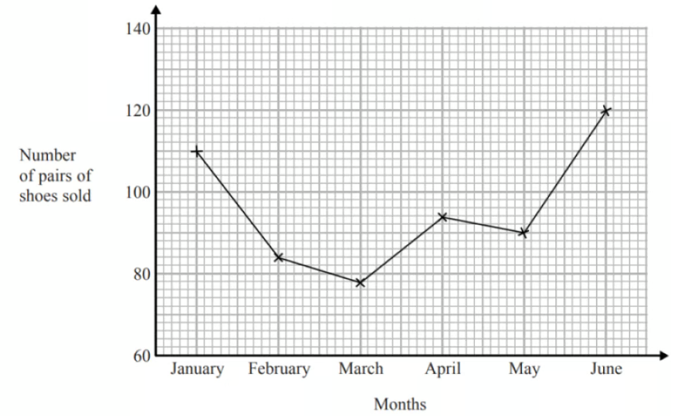
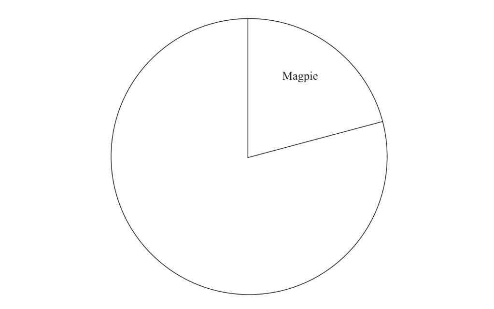
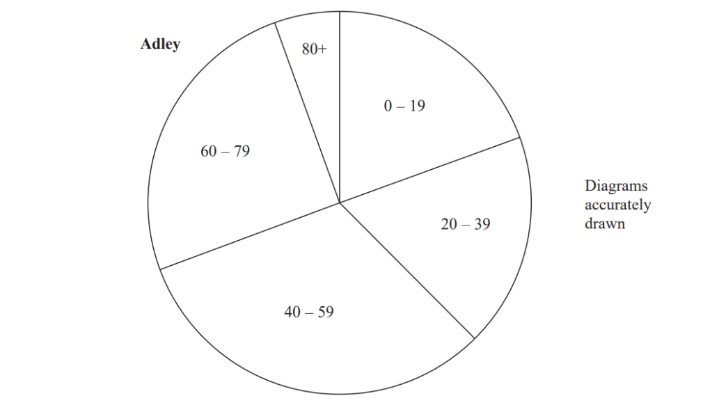
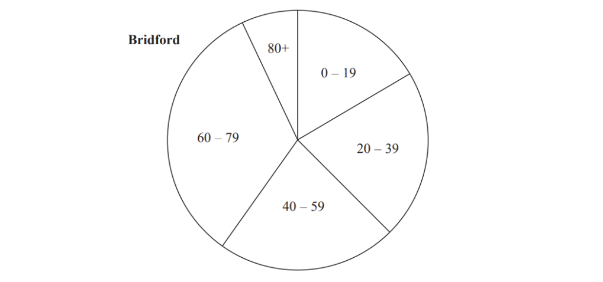
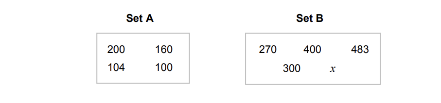
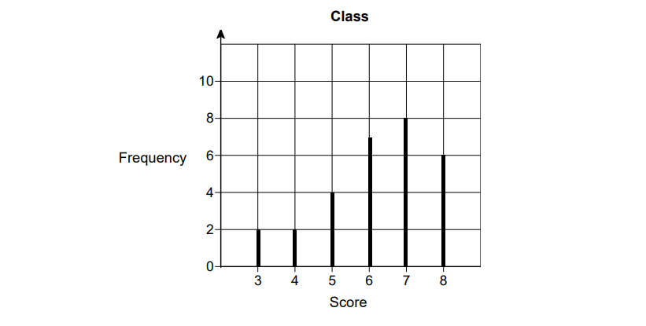
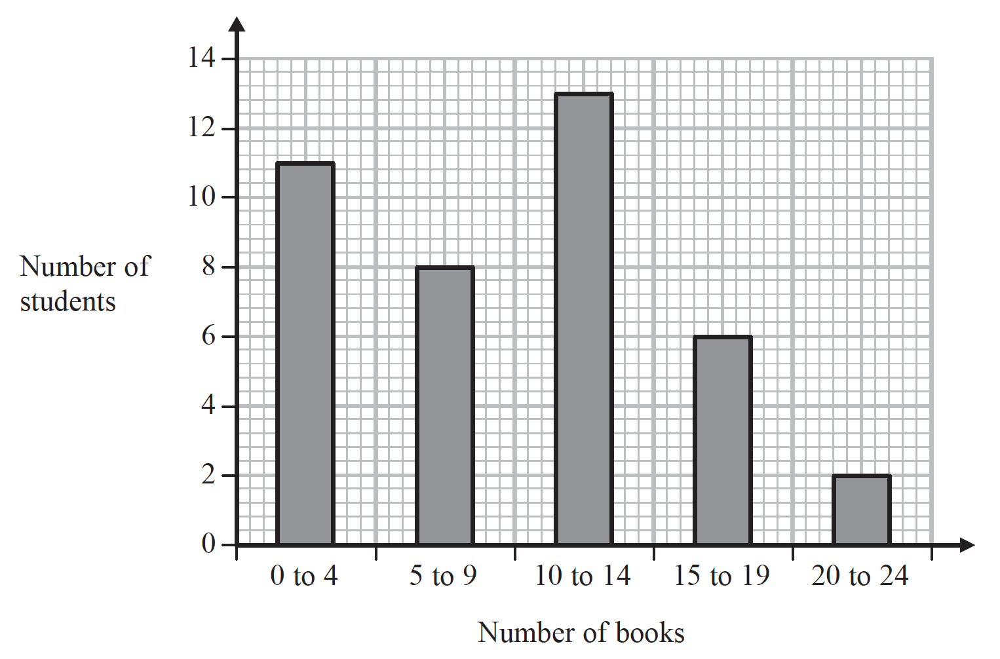

# Exam Questions — Statistics Toolkit
**Statistics** · Edexcel IGCSE Maths A (Modular) (4XMAF/4XMAH) — 24/Higher Unit 2
> Source: [https://www.savemyexams.com/igcse/maths/edexcel/a-modular/24/higher-unit-2/topic-questions/statistics/statistics-toolkit/exam-questions/](https://www.savemyexams.com/igcse/maths/edexcel/a-modular/24/higher-unit-2/topic-questions/statistics/statistics-toolkit/exam-questions/) · 62 questions · total 189 marks

## Q1 — hard — 3 marks · exam-questions

### 13() — 3 marks — command: how — structured — from paper 2013	November · 1MA0/1H
Hertford Juniors is a basketball team.

At the end of 10 games, their mean score is 35 points per game. At the end of 11 games, their mean score has gone down to 33 points per game.

How many points did the team score in the 11th game?

## Q2 — medium — 3 marks · exam-questions

### 6() — 3 marks — command: work_out — structured — from paper 2013	June · 1MA0/1H
Ed has 4 cards. There is a number on each card.

| 12 |   | 6 |   | 15 |   | ? |
|---|---|---|---|---|---|---|

The mean of the 4 numbers on Ed's cards is 10 Work out the number on the 4th card.

## Q3 — easy — 2 marks · exam-questions

### 12() — 2 marks — command: find — structured — from paper Jan 2021 · 4MA1/2H
15 people were asked how long, in minutes, they had been waiting for a bus.

Here are the results.

| 2 | 3 | 3 | 4 | 5 | 6 | 6 | 8 | 9 | 10 | 11 | 13 | 14 | 15 | 18 |
|---|---|---|---|---|---|---|---|---|---|---|---|---|---|---|

Find the interquartile range of these times.

## Q4 — hard — 3 marks · exam-questions

### 13() — 3 marks — command: work_out — structured — from paper 2015	November · 1MA0/1H
There are 18 packets of sweets and 12 boxes of sweets in a carton.

The mean number of sweets in all the 30 packets and boxes is 14. The mean number of sweets in the 18 packets is 10.

Work out the mean number of sweets in the boxes.

## Q5 — medium — 2 marks · exam-questions

### 3((a)) — 1 mark — command: find — structured — from paper 2017	June · 1MA1/3H
The table shows some information about the dress sizes of $25$women.

| **Dress size** | **Number of women** |
|---|---|
| $8$ | $2$ |
| $10$ | $9$ |
| $12$ | $8$ |
| $14$ | $6$ |

Find the median dress size.

### 3((b)) — 1 mark — command: verify — structured — from paper 2017	June · 1MA1/3H
$3$ of the $25$ women have a shoe size of $7$ 
Zoe says that if you choose at random one of the $25$ women, the probability that she has 
either a shoe size of           $7$or a dress size of               $14$ is   $\frac{9}{25}$because

$\frac{3}{25}+\frac{6}{25}=\frac{9}{25}$

Is Zoe correct? 
You must give a reason for your answer.

## Q6 — easy — 2 marks · exam-questions

### 14() — 2 marks — command: show — structured — from paper June 2021 · 4MA1/1H
Here is the number of goals that Henri’s team scored one summer in each water polo match.

5    8    9    11    13    13    14    15    16    17    20

Find the interquartile range of the numbers of goals. Show your working clearly.

## Q7 — hard — 3 marks · exam-questions

### 16() — 3 marks — command: work_out — structured — from paper 2016	November · 1MA0/1H
There are 15 children at a birthday party.

The mean age of the 15 children is 7 years.

9 of the 15 children are boys. 
The mean age of the boys is 5 years.

Work out the mean age of the girls.

## Q8 — medium — 3 marks · exam-questions

### 3() — 3 marks — command: determine — structured — from paper 2015	Spec1 · 1MA1/2H
The time-series graph gives some information about the number of pairs of shoes sold in a shoe shop in the first six months of 2014.

The sales target for the first six months of 2014 was to sell a mean of 96 pairs of shoes per month.

Did the shoe shop meet this sales target? 
You must show how you get your answer.

## Q9 — easy — 2 marks · exam-questions

### 12() — 2 marks — command: compare — structured — from paper Jan 2019 · 4MA1/2H
Twenty students took a Science test and a Maths test.

Both tests were marked out of $50$

The table gives information about their results.

|   | **Median** | **Interquartile range** |
|---|---|---|
| **Science** | $27$ | $18$ |
| **Maths** | $24.5$ | $11$ |

Use this information to compare the Science test results with the Maths test results. 
Write down **two** comparisons.

## Q10 — hard — 3 marks · exam-questions

### 7() — 3 marks — command: work_out — structured — from paper 2017	June · 1MA1/1H
There are 10 boys and 20 girls in a class. The class has a test.

The mean mark for all the class is 60 
The mean mark for the girls is 54

Work out the mean mark for the boys.

## Q11 — medium — 4 marks · exam-questions

### 11((a)) — 2 marks — command: complete — structured — from paper June 2019 · 1MA1/1H
A bus company recorded the ages, in years, of the people on coach A and the people on coach B.

Here are the ages of the 23 people on coach A.

| 41 | 42 | 44 | 48 | 52 | 53 | 53 | 53 | 56 | 57 | 57 | 59 |
|---|---|---|---|---|---|---|---|---|---|---|---|
| 60 | 61 | 63 | 64 | 64 | 66 | 67 | 69 | 74 | 77 | 79 |   |

Complete the table below to show information about the ages of the people on coach A.

| Median |   |
|---|---|
| Lower Quartile |   |
| Upper Quartile |   |
| Least age | 41 |
| Greatest age | 79 |

### 11((b)) — 1 mark — command: justify — structured — from paper June 2019 · 1MA1/1H
Here is some information about the ages of the people on coach B.

| Median | 70 |
|---|---|
| Lower quartile | 54 |
| Upper quartile | 73 |
| Least age | 42 |
| Greatest age | 85 |

Richard says that the people on coach A are younger than the people on coach B.

Is Richard correct? 
You must give a reason for your answer.

### 11((c)) — 1 mark — command: verify — structured — from paper June 2019 · 1MA1/1H
Richard says that the people on coach A vary more in age than the people on coach B.

Is Richard correct? 
You must give a reason for your answer.

## Q12 — easy — 1 marks · exam-questions

### 1() — 1 mark — command: write — structured — from paper Nov 2021 · 4MA1/2H
The table shows information about the weights, in kg, of 40 parcels.

| **Weight of parcel ( **$p$** kg)** | **Frequency** |
|---|---|
| `0 space less than space p space less-than or slanted equal to space 1` | 19 |
| `1 space less than space p space less-than or slanted equal to space 2` | 12 |
| `2 space less than space p space less-than or slanted equal to space 3` | 5 |
| `3 less than space space p space less-than or slanted equal to space 4` | 2 |
| `4 space less than space p less-than or slanted equal to space 5` | 2 |

Write down the modal class.

## Q13 — hard — 3 marks · exam-questions

### 9() — 3 marks — command: prove — structured — from paper 2015	Spec1 · 1MA1/1H
Walkden Reds is a basketball team.

At the end of 11 games, their mean score was 33 points per game. 
At the end of 10 games, their mean score was 2 points higher.

Jordan says,

"Walkden Reds must have scored 13 points in their 11th game."

Is Jordan right? 
You must show how you get your answer.

## Q14 — medium — 3 marks · exam-questions

### 4() — 3 marks — command: complete — structured — from paper 2012	November · 1MA0/2H
The table gives some information about the birds Paula sees in her garden one day.

| **Bird** | **Frequency** |
|---|---|
| Magpie | 15 |
| Thrush | 10 |
| Starling | 20 |
| Sparrow | 27 |

Complete the accurate pie chart.

## Q15 — easy — 3 marks · exam-questions

### 7((b)) — 3 marks — command: find — structured — from paper June 2018 · 4MA1/2H
The students in Class A and in Class B take the same examination.

The lowest score in Class A is 39 
The range of scores for Class A is 57 
The lowest score in Class B is 33 
The range of scores for Class B is 60

Find the range of scores for all the students in both classes.

## Q16 — hard — 2 marks · exam-questions

### 13() — 2 marks — command: justify — structured — from paper 2015	Spec2 · 1MA1/1H
Mr Brown gives his class a test. 
The 10 girls in the class get a mean mark of 70% 
The 15 boys in the class get a mean mark of 80%

Nick says that because the mean of 70 and 80 is 75 then the mean mark for the whole class in the test is 75%

Nick is not correct.
Is the correct mean mark less than or greater than 75%? 
You must justify your answer.

## Q17 — medium — 3 marks · exam-questions

### 5((a)) — 3 marks — command: write — structured — from paper Jan 2022 · 4MA1/1H
Jenny has six cards. Each card has a whole number written on it so that

the smallest number is 5 
the largest number is 24 
the median of the six numbers is 14 
the mode of the six numbers is 8

Jenny arranges her cards so that the numbers are in order of size.

For the remaining four cards, write on each dotted line a number that could be on the card.

## Q18 — easy — 1 marks · exam-questions

### 2((a)) — 1 mark — command: write — structured — from paper Jan 2021 · 4MA1/1H
The table gives information about the speeds, in kilometres per hour, of 80 motorbikes as each pass under a bridge.

| **Speed** **(s kilometres per hour)** | **Frequency** |
|---|---|
| `40 space less than space s space less-than or slanted equal to space 50` | 10 |
| `50 space less than space s space less-than or slanted equal to space 60` | 16 |
| `60 space less than space s space less-than or slanted equal to space 70` | 19 |
| `70 space less than space s space less-than or slanted equal to space 80` | 23 |
| `80 space less than space s space less-than or slanted equal to space 90` | 12 |

Write down the modal class.

## Q19 — hard — 4 marks · exam-questions

### 13() — 4 marks — command: work_out — structured — from paper 2012	June · 1MA0/2H
Bob asked each of $40$friends how many minutes they took to get to work. 
The table shows some information about his results.

| **Time taken (m minutes)** | **Frequency** |
|---|---|
| `0 less than m less-than or slanted equal to 10` | $3$ |
| `10 less than m less-than or slanted equal to 20` | $8$ |
| `20 less than m less-than or slanted equal to 30` | $11$ |
| `30 less than m less-than or slanted equal to 40` | $9$ |
| `40 less than m less-than or slanted equal to 50` | $9$ |

Work out an estimate for the mean time taken.

## Q20 — medium — 3 marks · exam-questions

### 15() — 3 marks — command: find — structured — from paper Jan 2022 · 4MA1/2H
Diyar recorded the distance, in kilometres, that he cycled each day for 11 days. Here are his results.

| 8 | 10 | 12 | 13 | 5 | 23 | 21 | 7 | 5 | 16 | 14 |
|---|---|---|---|---|---|---|---|---|---|---|

Find the interquartile range of his results.

....................................................... km

## Q21 — easy — 1 marks · exam-questions

### 6() — 1 mark — command: write — structured — from paper Nov 2020 · 4MA1/1HR
The table gives information about the length of time, in minutes, that each of $60$ students took to travel to school on Monday.

| **Length of time (**$t$** minutes)** | **Frequency** |
|---|---|
| `0 space less than space t space less-than or slanted equal to space 10` | 4 |
| `10 space less than space t space less-than or slanted equal to space 20` | 10 |
| `20 space less than space t space less-than or slanted equal to space 30` | 15 |
| `30 space less than space t space less-than or slanted equal to space 40` | 25 |
| `40 space less than space t space less-than or slanted equal to space 50` | 6 |

Write down the modal class interval.

## Q22 — hard — 4 marks · exam-questions

### 14() — 4 marks — command: calculate — structured — from paper 2015	June · 1MA0/2H
Sumeet records the times, in minutes, for 40 runners to finish a half marathon. 
Information about these times is shown in the table.

| **Time (**$t$** minutes)** | **Frequency** |
|---|---|
| `60 less than t less-than or slanted equal to 90` | $10$ |
| `90 less than t less-than or slanted equal to 120` | $14$ |
| `120 less than t less-than or slanted equal to 150` | $9$ |
| `150 less than t less-than or slanted equal to 180` | $5$ |
| `180 less than t less-than or slanted equal to 210` | $2$ |

Calculate an estimate for the mean time.

## Q23 — medium — 4 marks · exam-questions

### 5() — 4 marks — command: find — structured — from paper Jan 2022 · 4MA1/1HR
Yusuf sat 8 examinations. 
Here are his marks for 5 of the examinations.

| 68 | 72 | 75 | 77 | 80 |
|---|---|---|---|---|

For his results in all 8 examinations

the mode of his marks is 80 
the median of his marks is 74 
the range of his marks is 16

Find Yusuf’s marks for each of the other 3 examinations.

## Q24 — easy — 4 marks · exam-questions

### 11() — 4 marks — command: compare — structured — from paper Specimen 2016 · 4MA1/1H
15 students took an English test. 
The same 15 students took a Maths test. 
Both tests were marked out of 30.

For the English test results the median was 21 
the interquartile range was 14

The Maths test results are shown below.

| 18 | 18 | 19 | 20 | 24 | 25 | 25 | 26 | 28 | 28 | 29 | 29 | 29 | 30 | 30 |
|---|---|---|---|---|---|---|---|---|---|---|---|---|---|---|

Use the information above to compare the English test results with the Maths test results. 
Write down **two** comparisons.

## Q25 — hard — 4 marks · exam-questions

### 10() — 4 marks — command: work_out — structured — from paper 2016	June · 1MA0/2H
The table gives information about the heights of $50$trees.

| **Height( **$h$** metres)** | **Frequency** |
|---|---|
| `0 less than h less-than or slanted equal to 4` | $8$ |
| `4 less than h less-than or slanted equal to 8` | $21$ |
| `8 less than h less-than or slanted equal to 12` | $12$ |
| `12 less than h less-than or slanted equal to 16` | $7$ |
| `16 less than h less-than or slanted equal to 20` | $2$ |

Work out an estimate for the mean height of the trees.

## Q26 — medium — 4 marks · exam-questions

### 2() — 4 marks — command: work_out — structured — from paper Jan 2021 · 4MA1/2H
Given that  $a<b<c$ the four whole numbers $a,a,b$ and $c$ have

a mode of 7 
a median of 8.5 
a mean of 9

Work out the value of a, the value of b and the value of $c$.

`table row a equals cell.................. end cell row b equals cell.................. end cell row c equals cell.................. end cell end table`

## Q27 — easy — 6 marks · exam-questions

### 8((a)) — 1 mark — command: which — structured — from paper Nov 2018 · 8300/1H
Kim works at an airport in the UK.

She records the number of planes landing between 10 am and 2 pm each day.

The table shows the data for the first 10 days in January.

| **Day** | 1 | 2 | 3 | 4 | 5 | 6 | 7 | 8 | 9 | 10 |
|---|---|---|---|---|---|---|---|---|---|---|
| **Number of planes** | 148 | 151 | 147 | 155 | 153 | 147 | 155 | 102 | 151 | 154 |

The airport was affected by fog on one of the days.

Which day do you think it was? 
Give a reason for your answer.

### 8((b)) — 3 marks — command: work_out — structured — from paper Nov 2018 · 8300/1H
Kim uses the data to predict how many planes will land at the airport in a year.

In her method, she    
uses an estimate of 150 planes in each 4-hour period throughout the day    
assumes the same number of planes each day.

Work out her prediction.

### 8((c)) — 2 marks — command: what — structured — from paper Nov 2018 · 8300/1H
In fact,

fewer planes land in winter than in summer    
   fewer planes land at night than during the day.

What does this tell you about Kim’s prediction? 
Tick **one** box.

`square` Her prediction is too low

`square` Her prediction is too high

`square` Her prediction could be too low or too high

Give a reason for your answer.

## Q28 — hard — 5 marks · exam-questions

### 12((a)) — 1 mark — command: find — structured — from paper 2017	June · 1MA0/2H
The table gives information about the heights of $35$girls.

| **Height(**$h$** metres)** | **Frequency** |
|---|---|
| `1.30 less-than or slanted equal to h less than 1.40` | $11$ |
| `1.40 less-than or slanted equal to h less than 1.50` | $9$ |
| `1.50 less-than or slanted equal to h less than 1.60` | $7$ |
| `1.60 less-than or slanted equal to h less than 1.70` | $6$ |
| `1.70 less-than or slanted equal to h less than 1.80` | $2$ |

Find the class interval that contains the median.

### 12((b)) — 4 marks — command: work_out — structured — from paper 2017	June · 1MA0/2H
Work out an estimate for the mean height.

## Q29 — medium — 4 marks · exam-questions

### 18((a)) — 3 marks — command: show — structured — from paper Nov 2020 · 4MA1/2HR
Sandeep sat $11$ tests in January $2020$ Each test was marked out of $60$

Here are his test results.

$4541354438474739374342$

Find the interquartile range of these test results. Show your working clearly.

### 18((b)) — 1 mark — command: which — structured — from paper Nov 2020 · 4MA1/2HR
Sandeep also sat some tests in May $2020$ 
Each test was marked out of $60$

The median of the May $2020$ test results is $42$ 
The interquartile range of the May $2020$ test results is $12$

In which month, January or May, were Sandeep’s test results more consistent? 
Give a reason for your answer.

## Q30 — easy — 1 marks · exam-questions

### 15() — 1 mark — command: tick — structured — from paper June 2018 · 8300/2H
100 men and 100 women took a test.

**Scores**

|   | **Median** | **Interquartile range** | **Range** |
|---|---|---|---|
| **Men** | 28 | 7.5 | 31 |
| **Women** | 30 | 9 | 37 |

Using this data, which statement **must** be true? 
Tick **one** box.

`square`   Men had a higher average score than women

`square`   Men had more consistent scores than women

`size 26px square`   A woman had the highest score

`size 26px square`   A man had the lowest score

## Q31 — medium — 4 marks · exam-questions

### 11() — 4 marks — command: compare — structured — from paper Specimen paper · 4MA1/1H
15 students took an English test. 
The same 15 students took a Maths test. 
Both tests were marked out of 30

For the English test results

the median was 21

the interquartile range was 14

The Maths test results are shown below.

18  18  19  20  24  25  25  26  28  28  29  29  29  30  30

Use the information above to compare the English test results with the Maths test results. Write down **two **comparisons.

## Q32 — hard — 4 marks · exam-questions

### 5((a)) — 3 marks — command: work_out — structured — from paper 2017	November · 1MA1/1H
The table shows information about the weekly earnings of $20$people who work in a shop.

| **Weekly earnings(**`bold £ bold italic x`**)** | **Frequency** |
|---|---|
| `150 less than x less-than or slanted equal to 250` | $1$ |
| `250 less than x less-than or slanted equal to 350` | $11$ |
| `350 less than x less-than or slanted equal to 450` | $5$ |
| `450 less than x less-than or slanted equal to 550` | $0$ |
| `550 less than x less-than or slanted equal to 650` | $3$ |

Work out an estimate for the mean of the weekly earnings.

### 5((b)) — 1 mark — command: justify — structured — from paper 2017	November · 1MA1/1H
Nadiya says,

"The mean may **not** be the best average to use to represent this information."

Do you agree with Nadiya? 
You must justify your answer.

## Q33 — medium — 1 marks · exam-questions

### 9() — 1 mark — command: circle — structured — from paper Nov 2017 · 8300/1H
Circle the expression for the range of $n$ consecutive integers.

| $\frac{n+1}{2}$ | $n--1$ | $n$ | $n+1$ |
|---|---|---|---|

## Q34 — easy — 2 marks · exam-questions

### 20() — 2 marks — command: which — structured — from paper Nov 2017 · 8300/1H
In one month, the number of hours of exercise taken by 10 people are

4    7    2    8    6    5    1    82    3    9

Which is the appropriate average to use in this situation? 
Tick a box.

`square` Mean       `size 26px square` Median       `size 26px square` Mode

Give one reason for each of the other two averages as to why they are **not** appropriate.

## Q35 — medium — 2 marks · exam-questions

### 10() — 2 marks — command: find — structured — from paper 2023 June · 4MA1/1H
Here are the test marks of 15 students.

7    10    14    15    16    17    18    19    20    20    23    25    30    39    40

Find the interquartile range of these marks.

## Q36 — hard — 4 marks · exam-questions

### 5((a)) — 1 mark — command: write — structured — from paper 2015	Sample · 1MA1/2H
The table shows some information about the foot lengths of $40$adults.

| **Foot length(**$f$** cm)** | **Number of adults** |
|---|---|
| `16 less-than or slanted equal to f less than 18` | $3$ |
| `18 less-than or slanted equal to f less than 20` | $6$ |
| `20 less-than or slanted equal to f less than 22` | $10$ |
| `22 less-than or slanted equal to f less than 24` | $12$ |
| `24 less-than or slanted equal to f less than 26` | $9$ |

Write down the modal class interval.

### 5((b)) — 3 marks — command: calculate — structured — from paper 2015	Sample · 1MA1/2H
Calculate an estimate for the mean foot length.

## Q37 — medium — 1 marks · exam-questions

### 7() — 1 mark — command: circle — structured — from paper Nov 2017 · 8300/3H
Here is some information about the times taken by 40 people to fill in a form.

| **Time, **$t$** minutes** | **Number of people** |
|---|---|
| `0 space less than space t space less-than or slanted equal to space 5` | 3 |
| `5 space less than space t space less-than or slanted equal to space 10` | 9 |
| `10 space less than space t space less-than or slanted equal to space 15` | 11 |
| `15 space less than space t space less-than or slanted equal to space 20` | 17 |

In which class interval is the median? Circle your answer.

| `0 space less than space t space less-than or slanted equal to space 5` | `5 space less than space t space less-than or slanted equal to space 10` | `10 space less than space t space less-than or slanted equal to space 15` | `15 space less than space t space less-than or slanted equal to space 20` |
|---|---|---|---|

## Q38 — easy — 3 marks · exam-questions

### 5() — 3 marks — command: work_out — structured — from paper Nov 2021 · 8300/3H
Six positive numbers have

a mean of 10 
a range of 19

Four of the numbers are    12    7    15    3

Work out the other two numbers.

## Q39 — medium — 4 marks · exam-questions

### 10() — 4 marks — command: how — structured — from paper 2023 June · 4MA1/2H
Team **A **and Team **B **take part in a quiz league.

After 11 rounds, Team **A **has a mean score per round of 17
 After 9 rounds, Team** B** has a mean score per round of 18

Both teams take part in a further round. 
After this round, both teams have a mean score per round of 18.5

In the further round, Team **A **scored more points than Team **B.**

How many more?

## Q40 — hard — 5 marks · exam-questions

### 4((a)) — 3 marks — command: calculate — structured — from paper 2015	Spec1 · 1MA1/3H
Jenny works in a shop that sells belts.

The table shows information about the waist sizes of $50$customers who bought belts from the shop in May.

| **Belt size** | **Waist( **$w$** inches)** | ** Frequency** |
|---|---|---|
| Small | `28 less than w less-than or slanted equal to 32` | $24$ |
| Medium | $32<w\leq36$ | $12$ |
| Large | $36<w\leq40$ | $8$ |
| Extra Large | $40<w\leq44$ | $6$ |

Calculate an estimate for the mean waist size.

### 4((b)) — 2 marks — command: who — structured — from paper 2015	Spec1 · 1MA1/3H
Belts are made in sizes Small, Medium, Large and Extra Large.

Jenny needs to order more belts in June. 
The modal size of belts sold is Small.

Jenny is going to order $\frac{3}{4}$ of the belts in size Small. The manager of the shop tells Jenny she should **not** order so many Small belts.

Who is correct, Jenny or the manager? 
You must give a reason for your answer.

## Q41 — medium — 3 marks · exam-questions

### 7() — 3 marks — command: determine — structured — from paper Nov 2021 · 8300/2H
102 boys and 85 girls took a test.

The table shows information about the mean marks.

|   | **Boys** | **Girls** |
|---|---|---|
| **Number of students** | 102 | 85 |
| **Mean mark** | 68.5 | 72.4 |

The pass mark for the test was 70 
Was the mean mark for **all **of these students greater than the pass mark? 
You **must **show your working.

## Q42 — easy — 1 marks · exam-questions

### 6((b)) — 1 mark — command: estimate — structured — from paper Nov 2018 · 8300/2H
A station manager looks at the information below.

| **Number of** **minutes late, **$t$ | **Number of trains** |
|---|---|
| `0 space less-than or slanted equal to space t space less than space 2` | 12 |
| `2 space less-than or slanted equal to space t space less than space 4` | 0 |
| `4 space less-than or slanted equal to space t space less than space 6` | 7 |
| `6 space less-than or slanted equal to space t space less than space 8` | 0 |
| `8 space less-than or slanted equal to space t space less than space 10` | 0 |
| `10 space less-than or slanted equal to space t space less than space 12` | 1 |

Estimate the mean number of minutes late.

## Q43 — medium — 4 marks · exam-questions

### 1((a)) — 1 mark — command: write — structured — from paper 2023 Nov · 4MA1/2H
The table shows information about the lengths, in minutes, of 50 telephone calls.

| Length of telephone call ($m$ minutes) | Frequency |
|---|---|
| `0 space less than space m space less-than or slanted equal to space 5` | 8 |
| `5 space less than space m space less-than or slanted equal to space 10` | 2 |
| `10 space less than space m space less-than or slanted equal to space 15` | 6 |
| `15 space less than space m space less-than or slanted equal to space 20` | 4 |
| `20 space less than space m space less-than or slanted equal to space 25` | 12 |
| `25 space less than space m space less-than or slanted equal to space 30` | 18 |

Write down the modal class.

### 1((b)) — 3 marks — command: work_out — structured — from paper 2023 Nov · 4MA1/2H
Work out an estimate for the total length, in minutes, of these telephone calls.

## Q44 — hard — 1 marks · exam-questions

### 20() — 1 mark — command: work_out — structured — from paper 2014 June · 1MA0/2H
25 students in class A did a science exam. 
30 students in class B did the same science exam.

The mean mark for the 25 students in class A is 67.8 The mean mark for all the 55 students is 72.0

Work out the mean mark for the students in class B.

## Q45 — medium — 3 marks · exam-questions

### 12() — 3 marks — command: work_out — structured — from paper Nov 2020 · 8300/3H
Here is some information about 26 houses.

$a,b$ and $c$ are all **different **numbers.

| **Number of bedrooms** | **Number of houses** |
|---|---|
| 1 | 7 |
| 2 | $a$ |
| 3 | $b$ |
| 4 | $c$ |
| 5 | 8 |

The median number of bedrooms is 3.5

Work out a possible set of values for $a,b$ and $c$.

$a=............................\,b=............................\,c=............................$

## Q46 — easy — 3 marks · exam-questions

### 14() — 3 marks — command: work_out — structured — from paper Nov 2018 · 8300/3H
The mean mass of a squad of 19 hockey players is 82 kg

A player of mass 93 kg joins the squad.

Work out the mean mass of the squad now.

.......................kg

## Q47 — medium — 2 marks · exam-questions

### 13() — 2 marks — command: find — structured — from paper 2023 Nov · 4MA1/2H
Robert asked 11 people how many meetings they attended last week.

Here are the results in numerical order.

1     2     4     6     6      8     11     12    13    14    17

Find the interquartile range of the number of meetings.

## Q48 — hard — 3 marks · exam-questions

### 11() — 3 marks — command: what — structured — from paper 2017 Nov · 1MA1/2H
The pie charts give information about the ages, in years, of people living in two towns, 
Adley and Bridford.

The ratio of the number of people living in Adley to the number of people living in Bridford is given by the ratio of the areas of the pie charts. 
What proportion of the total number of people living in these two towns live in Adley and are aged 0 – 19? 
Give your answer correct to 3 significant figures.

## Q49 — medium — 3 marks · exam-questions

### 13() — 3 marks — command: work_out — structured — from paper Nov 2019 · 8300/2H
200 people recorded the time they spent on social media one day.

The table shows the results.

| **Time, t (mins)** | **Frequency** | **Midpoint** |   |
|---|---|---|---|
| `0 space less-than or slanted equal to space t space less than space 30` | 24 |   |   |
| `30 space less-than or slanted equal to space t space less than space 50` | 76 |   |   |
| `50 space less-than or slanted equal to space t space less than space 60` | 52 |   |   |
| `60 space less-than or slanted equal to space t space less than space 90` | 48 |   |   |
|   | Total = 200 |   |   |

Work out an estimate of the mean time.

..................................mins

## Q50 — easy — 4 marks · exam-questions

### 6() — 4 marks — command: tick — structured — from paper June 2019 · 8300/3H
The table shows information about the times for 10 people to complete a task.

| **Time, **$t$** (minutes)** | **Frequency** |
|---|---|
| `0 space less than space t space less-than or slanted equal to space 20` | 1 |
| `20 space less than space t space less-than or slanted equal to space 40` | 6 |
| `40 space less than space t space less-than or slanted equal to space 60` | 3 |

These statements are about the mean and range of the actual times. Tick the correct box for each statement.

|   | **True** | **False** |
|---|---|---|
| The mean could be less than 20 minutes | `begin mathsize 28px style square end style` | `square` |
| The mean could be more than 40 minutes | `square` | `square` |
| The mean could be less than 40 minutes | `square` | `square` |
|   |   |   |
| The range could be more than 40 minutes | `square` | `square` |
| The range could be less than 40 minutes | `square` | `square` |
| The range could be more than 60 minutes | `square` | `square` |

## Q51 — hard — 4 marks · exam-questions

### 11() — 4 marks — command: work_out — structured — from paper June 2019 · 8300/3H
Here are two sets of numbers, A and B.

mean of Set A : mean of Set B = 3 : 8

Work out the value of $x.$

## Q52 — medium — 3 marks · exam-questions

### 8() — 3 marks — command: work_out — structured — from paper Nov 2017 · 8300/2H
The table shows information about the distances walked by 120 students on their way to school one week.

| **Distance, **$x$** (miles)** | **Frequency** |   |   |
|---|---|---|---|
| `0 space less than space x space less-than or slanted equal to space 5` | 20 |   |   |
| `5 space less than space x space less-than or slanted equal to space 10` | 48 |   |   |
| `10 space less than space x space less-than or slanted equal to space 15` | 30 |   |   |
| `15 space less than space x space less-than or slanted equal to space 20` | 22 |   |   |
|   | Total = 120 |   |   |

Work out an estimate for the mean distance.

...................miles

## Q53 — easy — 2 marks · exam-questions

### 11() — 2 marks — command: work_out — structured — from paper Specimen 2015 · 8300/1H
Students in a class took a spelling test.

The diagram shows information about the scores.

Lucy is one of the 29 students in the class.

Her score was the same as the **median **score for her class.

Work out her score.

## Q54 — hard — 3 marks · exam-questions

### 4((a)) — 2 marks — command: work_out — structured — from paper 2018	Oct/Nov · 3H
Fran asks each of 40 students how many books they bought last year.

The chart below shows information about the number of books bought by each of the 40 students.

Work out the percentage of these students who bought 20 or more books.

...........%

### 4((b)) — 1 mark — command: show — structured — from paper 2018	Oct/Nov · 3H
Show that an estimate for the mean number of books bought is 9.5
 You must show all your working.

## Q55 — medium — 5 marks · exam-questions

### 3((a)) — 4 marks — command: calculate — structured — from paper Nov 2017 · J560/06
A shop records the time taken by its customers to complete a purchase on its website. The results from one day are summarised in this table.

| Time taken ($t$ minutes) | Number of customers |   |   |
|---|---|---|---|
| `0 space less than space t space less-than or slanted equal to space 3` | 6 |   |   |
| `3 less than space t space less-than or slanted equal to space 6` | 10 |   |   |
| `6 space less than space t space less-than or slanted equal to space 9` | 6 |   |   |
| `9 space less than space t space less-than or slanted equal to space 12` | 2 |   |   |
| `12 space less than space t space less-than or slanted equal to space 15` | 1 |   |   |

Calculate an estimate of the mean time taken.

....................... minutes

### 3((b)) — 1 mark — command: explain — structured — from paper Nov 2017 · J560/06
Explain why it is not possible to use the information from this table to calculate the **exact** value of the mean time taken.

## Q56 — easy — 3 marks · exam-questions

### 1() — 3 marks — command: find — structured — from paper June 2018 · J560/06
Ping chooses four numbers.

The mode of these four numbers is 8, the range is 7 and the mean is 11.

Find Ping’s four numbers.

## Q57 — hard — 3 marks · exam-questions

### 8() — 3 marks — command: work_out — structured — from paper 2023 Nov · 4MA1/2H
The mean number of goals scored by a hockey team in 8 matches is 6
The team plays 2 more matches and scores $k$ goals in each match.
The mean number of goals scored by the hockey team in the 10 matches is 7

Work out the value of $k$

## Q58 — medium — 5 marks · exam-questions

### 2() — 5 marks — command: multiple — structured — from paper Nov 2018 · J560/06
The police record the speed of vehicles passing a speed checkpoint. 
The speeds are recorded in the table below.

| **Speed (s mph)** | **Number of** **vehicles** |   |   |
|---|---|---|---|
| `0 space less than space s space less-than or slanted equal to 20` | 5 |   |   |
| `20 space less than space s space less-than or slanted equal to 40` | 8 |   |   |
| `40 space less than space s space less-than or slanted equal to 50` | 37 |   |   |
| `50 space less than space s space less-than or slanted equal to 60` | 47 |   |   |
| `60 space less than space s space less-than or slanted equal to 80` | 3 |   |   |

i)  Calculate an estimate of the mean speed of the vehicles.

..................... mph [4]

ii) Explain why it is not possible to use the information from this table to calculate the **exact** value of the mean speed.

[1]

## Q59 — easy — 4 marks · exam-questions

### 6() — 4 marks — command: what — structured — from paper June 2017 · J560/05
Jenny played four games of golf. 
For these games her modal score was 76 and her mean score was 75. 
Her range of scores was 10.

What were her scores for the four games?

## Q60 — easy — 3 marks · exam-questions

### 2() — 3 marks — command: work_out — structured — from paper 2023 June · 4MA1/1H
The table gives information about the number of minutes that Abby spent walking each day in September.

| Number of minutes ($M$) | Frequency |
|---|---|
| `space 0 space less than space M space less-than or slanted equal to thin space space 30` | 5 |
| `30 space less than space M space less-than or slanted equal to thin space space 60` | 6 |
| `space 60 space less than space M space less-than or slanted equal to thin space space 90` | 8 |
| `space 90 space less than space M space less-than or slanted equal to thin space space 120` | 9 |
| `space 120 space less than space M space less-than or slanted equal to thin space space 150` | 2 |

Work out an estimate for the total number of minutes that Abby spent walking in September.

## Q61 — medium — 4 marks · exam-questions

### 19((b)) — 1 mark — command: give — structured — from paper June 2018 · J560/05
Ceri records the time taken, $t$ minutes, to travel to school for a sample of 168 students at her Academy.

| **Time taken** **(**$t$** minutes)** | **Frequency** |
|---|---|
| `0 space less than space t space less-than or slanted equal to space 10` | 54 |
| `10 space less than space t space less-than or slanted equal to space 20` | 50 |
| `20 space less than space t space less-than or slanted equal to space 40` | 44 |
| `40 space less than space t space less-than or slanted equal to space 80` | 20 |

Ceri says

The longest time that any of these students took to travel to school was 80 minutes.

Is she correct? 
Give a reason for your answer.

### 19((c)) — 3 marks — command: multiple — structured — from paper June 2018 · J560/05
Ceri also claims that 25% of all of the students at this Academy took more than 30 minutes to travel to school.

i) Show how Ceri might have worked out her claim.

[2]

ii) State one assumption that Ceri has made in making her claim.

[1]

## Q62 — medium — 3 marks · exam-questions

### 7() — 3 marks — command: how — structured — from paper Specimen paper · 4MA1/1H
Ian plays 7 games of cricket. 
His mean score per game for these 7 games is 42 runs.

Ian is going to play one more game of cricket. 
He wants his mean score per game for the 8 games to be exactly 50 runs.

How many runs must he score in his 8th game?
