# Mark Schemes — Vectors
**Vectors & Transformation Geometry** · Edexcel IGCSE Maths A (Modular) (4XMAF/4XMAH) — 24/Higher Unit 2

## Q1 — very_hard — 6 marks · exam-questions

### 24((a)) — 3 marks
> *Find the vector *$\overset{\rightarrow}{AB}$* by finding a path starting at **A** and ending at **B** using known vectors.*

$\overset{\rightarrow}{AB}=\overset{\rightarrow}{AO}+\overset{\rightarrow}{OB}$

> *Use the property that reversing the direction of the vector is the same as multiplying it by -1.*

`table row cell stack A O with rightwards arrow on top end cell equals cell negative stack O A with rightwards arrow on top end cell row cell stack A B with rightwards arrow on top end cell equals cell negative stack O A with rightwards arrow on top plus stack O B with rightwards arrow on top end cell row cell stack A B with rightwards arrow on top end cell equals cell stack O B with rightwards arrow on top minus stack O A with rightwards arrow on top end cell end table`

> *Use the given vectors.*

`table row cell stack A B with rightwards arrow on top end cell equals cell bottom enclose straight b minus bottom enclose straight a end cell end table`

*Use the ratio to write **AN **as a fraction of **AB**.* *AN** : **NB**  = 2 : 1 therefore **AN** is *$\frac{2}{2+1}$* of the length **AB**.*

$\overset{\rightarrow}{AN}=\frac{2}{3}\times\overset{\rightarrow}{AB}$

> *Use the vector for *$\overset{\rightarrow}{AB}.$

`table row cell stack A N with rightwards arrow on top end cell equals cell 2 over 3 cross times open parentheses bottom enclose straight b minus bottom enclose straight a close parentheses end cell row blank equals cell 2 over 3 bottom enclose straight b minus 2 over 3 bottom enclose straight a end cell end table`

**[1]**

> *Find a path starting at **O** and ending at **N**.*

$\overset{\rightarrow}{ON}=\overset{\rightarrow}{OA}+\overset{\rightarrow}{AN}$

**[1]**

> *Substitute the expressions for the vectors.*

`table row cell stack O N with rightwards arrow on top end cell equals cell bottom enclose straight a plus 2 over 3 bottom enclose straight b minus 2 over 3 bottom enclose straight a end cell row blank equals cell bottom enclose straight a minus 2 over 3 bottom enclose straight a plus 2 over 3 bottom enclose straight b end cell end table`

> *Simplify.*

`table row cell stack bold italic O bold italic N with bold rightwards arrow on top end cell bold equals cell bold 1 over bold 3 bottom enclose bold a bold plus bold 2 over bold 3 bottom enclose bold b end cell end table`* ***[1]**

**It is acceptable to write in factorised form:*** *`table row cell stack O N with rightwards arrow on top end cell equals cell 1 third open parentheses bottom enclose straight a plus 2 bottom enclose straight b close parentheses end cell end table`

### 24((b)) — 3 marks
> *To show that three points form a straight line you need to choose two pairs of points and show that the two vectors between these points are parallel. As there are three points, the two vectors will share a common point and therefore form a straight line.*

> *Find the vector *$\overset{\rightarrow}{OD}$* by finding a path between **O** and **D**.*

$\overset{\rightarrow}{OD}=\overset{\rightarrow}{OA}+\overset{\rightarrow}{AC}+\overset{\rightarrow}{CD}$

> *AC** is parallel to **OB** therefore *$\overset{\rightarrow}{AC}=\overset{\rightarrow}{CD}=\overset{\rightarrow}{OB}=b$*.*

`table row cell stack O D with rightwards arrow on top end cell equals cell bottom enclose straight a plus bottom enclose straight b plus bottom enclose straight b end cell row blank equals cell bottom enclose straight a plus 2 bottom enclose straight b end cell end table`

**[1]**

> *Two vectors are parallel if one is a scalar multiple of the other.*

`table row cell stack O N with rightwards arrow on top end cell equals cell 1 third open parentheses bottom enclose straight a plus 2 bottom enclose straight b close parentheses equals 1 third stack O D with rightwards arrow on top end cell row blank blank cell therefore O N space & space O D space are space parallel end cell end table`

**[1]**

**OND**** is a straight line as ****ON**** and ****OD**** are parallel lines that have a ****common point ****O ****[1]**

## Q2 — hard — 5 marks · exam-questions

### 28((a)) — 1 marks
> *Find a path starting at **P** and ending at **B** using known vectors.*

$\overset{\rightarrow}{PB}=\overset{\rightarrow}{PN}+\overset{\rightarrow}{NA}+\overset{\rightarrow}{AB}$

> *Use the property that reversing the direction of the vector is the same as multiplying it by -1.*

`table row cell stack P B with rightwards arrow on top end cell equals cell negative stack N P with rightwards arrow on top minus stack A N with rightwards arrow on top plus stack A B with rightwards arrow on top end cell row blank equals cell negative bottom enclose straight b minus 2 bottom enclose straight b plus bottom enclose straight a end cell end table`

> *Simplify.*

`stack bold italic P bold italic B with bold rightwards harpoon with barb upwards on top bold equals bottom enclose bold a bold minus bold 3 bottom enclose bold b` **[1]**

### 28((b)) — 4 marks
> *To show that three points form a straight line you need to choose two pairs of points and show that the two vectors between these points are parallel. As there are three points, the two vectors will share a common point and therefore form a straight line.*

> *Find the vector *$\overset{\rightarrow}{NM}$* by finding a path between **N** and **M**.*

$\overset{\rightarrow}{NM}=\overset{\rightarrow}{NP}+\overset{\rightarrow}{PM}$

> *M** is the midpoint of **PB** therefore *$\overset{\rightarrow}{PM}=\frac{1}{2}\times\overset{\rightarrow}{PB}.$

`table row cell stack N M with rightwards arrow on top end cell equals cell stack N P with rightwards arrow on top plus 1 half cross times stack P B with rightwards arrow on top end cell row blank equals cell bottom enclose straight b plus 1 half open parentheses bottom enclose straight a minus 3 bottom enclose straight b close parentheses end cell row blank equals cell bottom enclose straight b plus 1 half bottom enclose straight a minus 3 over 2 bottom enclose straight b end cell row blank equals cell 1 half bottom enclose straight a minus 1 half bottom enclose straight b end cell row blank equals cell 1 half open parentheses bottom enclose straight a minus bottom enclose straight b close parentheses end cell end table`

**[1]**

> *Find the vector *$\overset{\rightarrow}{MC}$* by finding a path between **M** and **C**.*

$\overset{\rightarrow}{MC}=\overset{\rightarrow}{MB}+\overset{\rightarrow}{BC}$

*M** is the midpoint of **PB** therefore *`stack M B with rightwards arrow on top equals 1 half cross times stack P B with rightwards arrow on top equals 1 half bottom enclose straight a minus 3 over 2 bottom enclose straight b`*.* *B** is the midpoint of AC therefore *`stack A B with rightwards arrow on top equals stack B C with rightwards arrow on top equals bottom enclose straight a`*.*

`table row cell stack M C with rightwards arrow on top end cell equals cell 1 half bottom enclose straight a minus 3 over 2 bottom enclose straight b plus bottom enclose straight a end cell row blank equals cell 3 over 2 bottom enclose straight a minus 3 over 2 bottom enclose straight b end cell row blank equals cell 3 over 2 open parentheses bottom enclose straight a minus bottom enclose straight b close parentheses end cell end table`

**[1]**

> *Two vectors are parallel if one of them is a scalar multiple of the other.*

`table row cell stack M C with rightwards arrow on top end cell equals cell 3 over 2 open parentheses bottom enclose straight a minus bottom enclose straight b close parentheses equals 3 cross times 1 half open parentheses bottom enclose straight a minus bottom enclose straight b close parentheses equals 3 stack N M with rightwards arrow on top end cell row blank blank cell therefore M C space & space N M space are space parallel end cell end table`

**[1]**

**NMC**** is a straight line as ****NM**** and ****MC**** are ****parallel**** lines that join at the ****common point ****M**** ****[1]**

## Q3 — medium — 3 marks · exam-questions

### 10((a)) — 1 marks
> *-2**a** is double the length but the direction is reversed. *
*Draw a line goes down 4 squares and left 2 squares. Include an arrow that points down the line.*

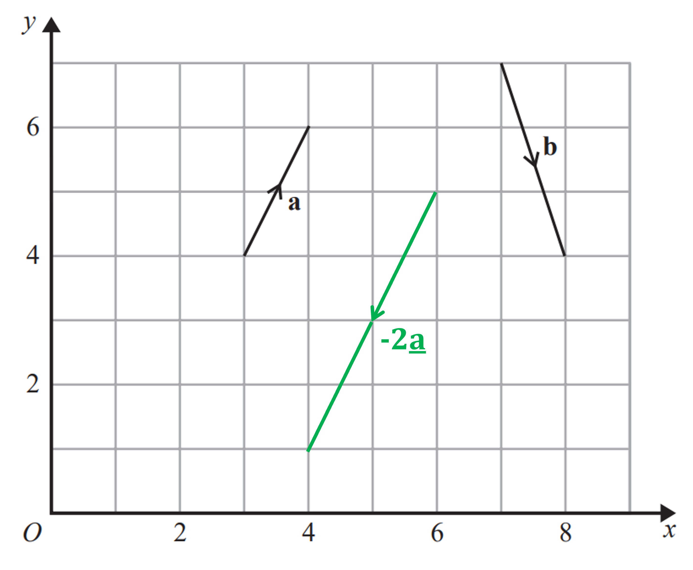

*  ***[1] **
**The vector can be drawn anywhere on the grid**

### 10((b)) — 2 marks
> *Method 1*

*Write a and b as column vectors.* 
*a goes 1 to the right and 2 up.* 
*b goes 1 to the right and 3 down.*

`bottom enclose straight a equals open parentheses table row 1 row 2 end table close parentheses space space space bottom enclose straight b equals open parentheses table row 1 row cell negative 3 end cell end table close parentheses`

> *Substitute the column vectors into the expression.*

`table row cell bottom enclose straight a plus 2 bottom enclose straight b end cell equals cell open parentheses table row 1 row 2 end table close parentheses plus 2 cross times open parentheses table row 1 row cell negative 3 end cell end table close parentheses end cell end table`

**[1]**

`table attributes columnalign right center left columnspacing 0px end attributes row cell bottom enclose straight a plus 2 bottom enclose straight b end cell equals cell open parentheses table row 1 row 2 end table close parentheses plus open parentheses table row 2 row cell negative 6 end cell end table close parentheses end cell row blank equals cell open parentheses table row cell 1 plus 2 end cell row cell 2 minus 6 end cell end table close parentheses end cell end table`

`bottom enclose bold a bold plus bold 2 bottom enclose bold b bold equals stretchy left parenthesis table row 3 row cell negative 4 end cell end table stretchy right parenthesis` **[1]**

> *Method 2*

> *Draw the resultant vector on the grid. Draw the vector** b** starting at the end of vector **a**. Draw another vector **b** starting at the end of the previous vector **b**.*

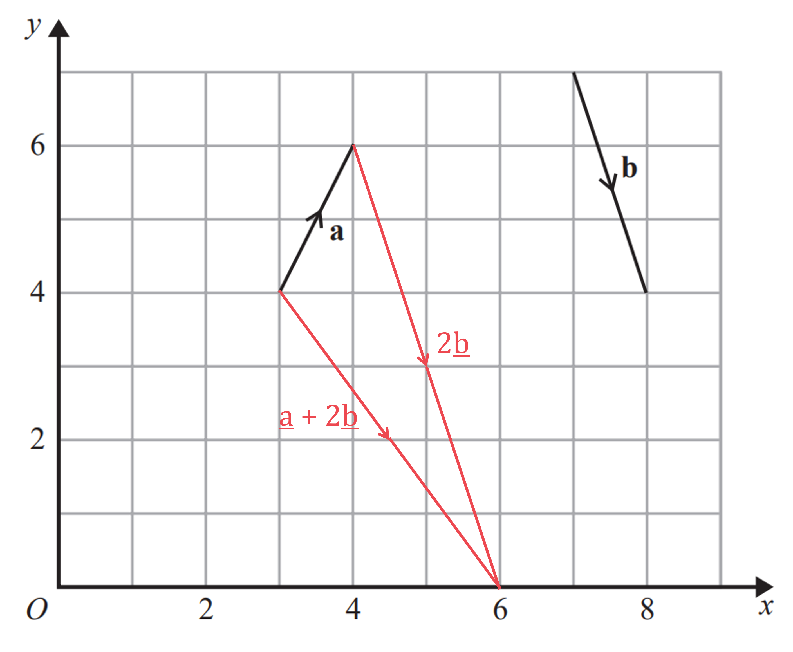

**[1]**

> *Write the resultant vector (from start of **a** to the end of the second **b**) as a column vector. It goes 3 to the right and 4 down,.*

`bottom enclose bold a bold plus bold 2 bottom enclose bold b bold equals stretchy left parenthesis table row 3 row cell negative 4 end cell end table stretchy right parenthesis` **[1]**

## Q4 — very_hard — 4 marks · exam-questions

### 27() — 4 marks
> *Find the vector *$\overset{\rightarrow}{AB}$* by finding a path from **A** to **B**.*

`table row cell stack A B with rightwards arrow on top end cell equals cell negative stack O A with rightwards arrow on top plus stack O B with rightwards arrow on top end cell row blank equals cell negative open parentheses 2 bottom enclose straight a plus bottom enclose straight b close parentheses plus 3 bottom enclose straight a plus 2 bottom enclose straight b end cell row blank equals cell negative 2 bottom enclose straight a plus 3 bottom enclose straight a minus bottom enclose straight b plus 2 bottom enclose straight b end cell row blank equals cell bottom enclose straight a plus bottom enclose straight b end cell end table`

**[1]**

> *AB** : **BC** = 2 : 5 therefore **AB** is *$\frac{2}{2+5}$* of the length of **AC**.*

$\overset{\rightarrow}{AB}=\frac{2}{7}\times\overset{\rightarrow}{AC}$

> *Rearrange to find *$\overset{\rightarrow}{AC}$*.*

`table row cell stack A C with rightwards arrow on top end cell equals cell 7 over 2 cross times stack A B with rightwards arrow on top end cell row blank equals cell 7 over 2 left parenthesis bottom enclose straight a plus bottom enclose straight b right parenthesis end cell row blank equals cell 7 over 2 bottom enclose straight a plus 7 over 2 bottom enclose straight b end cell end table`

**[1]**

> *Find the vector *$\overset{\rightarrow}{OC}$* by finding a path from **O** to **C**.*

`table row cell stack O C with rightwards arrow on top end cell equals cell stack O A with rightwards arrow on top plus stack A C with rightwards arrow on top end cell row blank equals cell 2 bottom enclose straight a plus bottom enclose straight b plus 7 over 2 bottom enclose straight a plus 7 over 2 bottom enclose straight b end cell end table`

**[1]**

> *Simplify.*

`stack bold italic O bold italic C with bold rightwards arrow on top bold equals bold 11 over bold 2 bottom enclose bold a bold plus bold 9 over bold 2 bottom enclose bold b` **[1]**

**It is acceptable to write in factorised form: **`stack O C with rightwards arrow on top equals 1 half open parentheses 11 bottom enclose straight a plus 9 bottom enclose straight b close parentheses`

## Q5 — hard — 6 marks · exam-questions

### 23((a)) — 2 marks
(i) *Find a path from **O** to **T** using known vectors.*

$\overset{\rightarrow}{OT}=\overset{\rightarrow}{OP}+\overset{\rightarrow}{PT}$

`stack bold italic O bold italic T with bold rightwards arrow on top bold equals bottom enclose bold a bold plus bottom enclose bold b` **[1]**

(ii) *Find a path from **P** to **R** using known vectors.*

$\overset{\rightarrow}{PR}=\overset{\rightarrow}{PO}+\overset{\rightarrow}{OR}$

> *Use the property that reversing the direction of the vector is the same as multiplying it by -1.*

`table row cell stack P R with rightwards arrow on top end cell equals cell negative stack O P with rightwards arrow on top plus stack O R with rightwards arrow on top end cell end table`

`stack bold italic P bold italic R with bold rightwards arrow on top bold equals bold minus bottom enclose bold a bold plus bold 3 bottom enclose bold b`* ***[1] **
**It is also acceptable to write: **`stack P R with rightwards arrow on top equals 3 bottom enclose straight b minus bottom enclose straight a`

### 23((b)) — 2 marks
*Use the ratio to write **PS** as a fraction of **PR**.* *PS** : **SR**  = 1 : 3 therefore **PS** is *$\frac{1}{1+3}$* of the length **PR**.*

$\overset{\rightarrow}{PS}=\frac{1}{4}\times\overset{\rightarrow}{PR}$

> *Use the vector for *$\overset{\rightarrow}{PR}.$

`table row cell stack P S with rightwards arrow on top end cell equals cell 1 fourth cross times open parentheses 3 bottom enclose straight b minus bottom enclose straight a close parentheses end cell row blank equals cell 3 over 4 bottom enclose straight b minus 1 fourth bottom enclose straight a end cell end table`

> *Find a path starting at **O** and ending at **S**.*

$\overset{\rightarrow}{OS}=\overset{\rightarrow}{OP}+\overset{\rightarrow}{PS}$

**[1]**

> *Substitute the expressions for the vectors.*

`table row cell stack O S with rightwards arrow on top end cell equals cell bottom enclose straight a plus 3 over 4 bottom enclose straight b minus 1 fourth bottom enclose straight a end cell row blank equals cell bottom enclose straight a minus 1 fourth bottom enclose straight a plus 3 over 4 bottom enclose straight b end cell end table`

> *Simplify.*

`table row cell stack bold italic O bold italic S with bold rightwards arrow on top end cell bold equals cell bold 3 over bold 4 bottom enclose bold a bold plus bold 3 over bold 4 bottom enclose bold b end cell end table` **[1]**

**Factorising is acceptable:** `table row cell stack O P with rightwards arrow on top end cell equals cell 3 over 4 open parentheses bottom enclose straight a plus bottom enclose straight b close parentheses end cell end table`

### 23((c)) — 2 marks
> *Compare the vectors *`stack O T with rightwards arrow on top equals bottom enclose straight a plus bottom enclose straight b`* and *`stack O S with rightwards arrow on top equals 3 over 4 open parentheses bottom enclose straight a plus bottom enclose straight b close parentheses.`

$\overset{\rightarrow}{OS}=\frac{3}{4}\overset{\rightarrow}{OT}$

> *If one vector is a scalar multiple of another then the two vectors are parallel.*

**OT*** and ***OS*** are parallel with a common point ***O***, therefore ***OST*** is a straight line*

**[1]**

**S**** lies on the line ****OT**** and ****OS**** : ****ST**** = 3 : 1 ****[1]**

## Q6 — medium — 4 marks · exam-questions

### 26((a)) — 1 marks
> *Find a path starting at **A** and ending at **B** using known vectors.*

$\overset{\rightarrow}{AB}=\overset{\rightarrow}{AO}+\overset{\rightarrow}{OB}$

> *Use the property that reversing the direction of the vector is the same as multiplying it by -1.*

`table row cell stack A O with rightwards arrow on top end cell equals cell negative stack O A with rightwards arrow on top end cell row cell stack A B with rightwards arrow on top end cell equals cell negative stack O A with rightwards arrow on top plus stack O B with rightwards arrow on top end cell row cell stack A B with rightwards arrow on top end cell equals cell stack O B with rightwards arrow on top minus stack O A with rightwards arrow on top end cell end table`

> *Use the given vectors.*

`stack bold italic A bold italic B with bold rightwards harpoon with barb upwards on top bold equals bottom enclose bold b bold minus bottom enclose bold a` **[1]**

### 26((b)) — 3 marks
*Use the ratio to write **AP** as a fraction of **AB**.*
 *AP** : **PB**  = 3 : 1 therefore **AP** is *$\frac{3}{3+1}$* of the length **AB**.*

$\overset{\rightarrow}{AP}=\frac{3}{4}\times\overset{\rightarrow}{AB}$

> *Use the vector for *$\overset{\rightarrow}{AB}.$

`table row cell stack A P with rightwards arrow on top end cell equals cell 3 over 4 cross times open parentheses bottom enclose straight b minus bottom enclose straight a close parentheses end cell row blank equals cell 3 over 4 bottom enclose straight b minus 3 over 4 bottom enclose straight a end cell end table`

**[1]**

> *Find a path starting at **O** and ending at **P**.*

$\overset{\rightarrow}{OP}=\overset{\rightarrow}{OA}+\overset{\rightarrow}{AP}$

**[1]**

> *Substitute the expressions for the vectors.*

`table attributes columnalign right center left columnspacing 0px end attributes row cell stack O P with rightwards arrow on top end cell equals cell bottom enclose straight a plus 3 over 4 bottom enclose straight b minus 3 over 4 bottom enclose straight a end cell row blank equals cell bottom enclose straight a minus 3 over 4 bottom enclose straight a plus 3 over 4 bottom enclose straight b end cell end table`

> *Simplify.*

`table row cell stack bold italic O bold italic P with bold rightwards arrow on top end cell bold equals cell bold 1 over bold 4 bottom enclose bold a bold plus bold 3 over bold 4 bottom enclose bold b end cell end table` **[1]**

**Factorising is acceptable:** `table attributes columnalign right center left columnspacing 0px end attributes row cell stack O P with rightwards arrow on top end cell equals cell 1 fourth open parentheses bottom enclose straight a plus 3 bottom enclose straight b close parentheses end cell end table`

## Q7 — very_hard — 5 marks · exam-questions

### 20() — 5 marks
> *To show that three points form a straight line you need to choose two pairs of points and show that the two vectors between these points are parallel. As there are three points, the two vectors will share a common point and therefore form a straight line.*

> *Find the vector *$\overset{\rightarrow}{DA}$* by finding a path between **D** and **A**.*

$\overset{\rightarrow}{DA}=\overset{\rightarrow}{DC}+\overset{\rightarrow}{CB}+\overset{\rightarrow}{BA}$

> *B** is the midpoint of **AC **therefore *$\overset{\rightarrow}{CB}=\overset{\rightarrow}{BA}=a$*.*

`table row cell stack D A with rightwards arrow on top end cell equals cell 2 bottom enclose straight b plus bottom enclose straight a plus bottom enclose straight a end cell row blank equals cell 2 bottom enclose straight a plus 2 bottom enclose straight b end cell end table`

**[1]**

> *Find the vector *$\overset{\rightarrow}{EB}$* by finding a path between **E** and **B**.*

`table row cell stack E B with rightwards arrow on top end cell equals cell stack E D with rightwards arrow on top plus stack D C with rightwards arrow on top plus stack C B with rightwards arrow on top end cell row blank equals cell bottom enclose straight b plus 2 bottom enclose straight b plus bottom enclose straight a end cell row blank equals cell bottom enclose straight a plus 3 bottom enclose straight b end cell end table`

> *M** is the midpoint of **BE** therefore *$\overset{\rightarrow}{MB}=\frac{1}{2}\times\overset{\rightarrow}{EB}$*.*

`table row cell stack M B with rightwards arrow on top end cell equals cell 1 half open parentheses bottom enclose straight a plus 3 bottom enclose straight b close parentheses end cell row blank equals cell 1 half bottom enclose straight a plus 3 over 2 bottom enclose straight b end cell end table`

**[1]**

> *Find the vector *$\overset{\rightarrow}{MA}$* by finding a path between **M** and **A**.*

`table row cell stack M A with rightwards arrow on top end cell equals cell stack M B with rightwards arrow on top plus stack B A with rightwards arrow on top end cell row blank equals cell 1 half bottom enclose straight a plus 3 over 2 bottom enclose straight b plus bottom enclose straight a end cell row blank equals cell 3 over 2 bottom enclose straight a plus 3 over 2 bottom enclose straight b end cell end table`

**[1]**

> *Two vectors are parallel if they are scalar multiples of a common vector.*

`table row cell stack D A with rightwards arrow on top end cell equals cell 2 open parentheses bottom enclose straight a plus bottom enclose straight b close parentheses space & space stack M A with rightwards arrow on top equals 3 over 2 open parentheses bottom enclose straight a plus bottom enclose straight b close parentheses end cell row blank blank cell therefore D A space & space M A space are space parallel end cell end table`

**[1]**

**AMD**** is a straight line as ****DA**** and ****MA**** are ****parallel**** lines that have a ****common point**** ****A**** ****[1]**

## Q8 — hard — 4 marks · exam-questions

### 23() — 4 marks
> *Two vectors are parallel if one is scalar multiple of the other.*

> *Find the vector *$\overset{\rightarrow}{AB}$* by finding a path from **A** to **B**.*

$\overset{\rightarrow}{AB}=\overset{\rightarrow}{AO}+\overset{\rightarrow}{OB}$

> *Use the property that reversing the direction of the vector is the same as multiplying it by -1.*

`table row cell stack A O with rightwards arrow on top end cell equals cell negative stack O A with rightwards arrow on top end cell row cell stack A B with rightwards arrow on top end cell equals cell negative stack O A with rightwards arrow on top plus stack O B with rightwards arrow on top end cell row cell stack A B with rightwards arrow on top end cell equals cell stack O B with rightwards arrow on top minus stack O A with rightwards arrow on top end cell end table`

> *Use the given vectors.*

`table row cell stack A B with rightwards arrow on top end cell equals cell 2 bottom enclose straight b minus 5 bottom enclose straight a end cell end table`

**[1]**

*Use the ratio to write **AT** as a fraction of **AB**.* *AT** : **TB**  = 5 : 1 therefore **AT** is *$\frac{5}{5+1}$* of the length **AB**.*

$\overset{\rightarrow}{AT}=\frac{5}{6}\times\overset{\rightarrow}{AB}$

> *Use the vector for *$\overset{\rightarrow}{AB}.$

`table row cell stack A T with rightwards arrow on top end cell equals cell 5 over 6 cross times open parentheses 2 bottom enclose straight b minus 5 bottom enclose straight a close parentheses end cell row blank equals cell 5 over 3 bottom enclose straight b minus 25 over 6 bottom enclose straight a end cell end table`

> *Find a path starting at **O** and ending at **T**.*

$\overset{\rightarrow}{OT}=\overset{\rightarrow}{OA}+\overset{\rightarrow}{AT}$

**[1]**

> *Substitute the expressions for the vectors.*

`table row cell stack O T with rightwards arrow on top end cell equals cell 5 bottom enclose straight a plus 5 over 3 bottom enclose straight b minus 25 over 6 bottom enclose straight a end cell row blank equals cell 5 bottom enclose straight a minus 25 over 6 bottom enclose straight a plus 5 over 3 bottom enclose straight b end cell end table`

**[1]**

> *Simplify.*

`table row cell stack O T with rightwards arrow on top end cell equals cell 5 over 6 bottom enclose straight a plus 5 over 3 bottom enclose straight b end cell end table`

> *Factorise out the *$\frac{5}{6}$*. It will help to write *$\frac{5}{3}$* as *$\frac{10}{6}$*.*

`table row cell stack O T with rightwards arrow on top end cell equals cell 5 over 6 bottom enclose straight a plus 10 over 6 bottom enclose straight b end cell row blank equals cell 5 over 6 open parentheses bottom enclose straight a plus 2 bottom enclose straight b close parentheses end cell end table`

`stack bold italic O bold italic T with bold rightwards arrow on top bold equals bold 5 over bold 6 stretchy left parenthesis bottom enclose a plus 2 bottom enclose b stretchy right parenthesis`** ****therefore ****OT**** is parallel to **`bottom enclose bold a bold plus bold 2 bottom enclose bold b`** ****[1]**

## Q9 — medium — 4 marks · exam-questions

### 27((a)) — 1 marks
> *Find a path starting at **S** and ending at **Q** using known vectors.*

$\overset{\rightarrow}{SQ}=\overset{\rightarrow}{SP}+\overset{\rightarrow}{PQ}$

> *Use the property that reversing the direction of the vector is the same as multiplying it by -1.*

`table row cell stack S P with rightwards arrow on top end cell equals cell negative stack P S with rightwards arrow on top end cell row cell stack S Q with rightwards arrow on top end cell equals cell negative stack P S with rightwards arrow on top plus stack P Q with rightwards arrow on top end cell row cell stack S Q with rightwards arrow on top end cell equals cell stack P Q with rightwards arrow on top minus stack P S with rightwards arrow on top end cell end table`

> *Use the given vectors.*

`stack bold italic S bold italic Q with bold rightwards harpoon with barb upwards on top bold equals bottom enclose bold a bold minus bottom enclose bold b` **[1]**

### 27((b)) — 3 marks
*Use the ratio to write **NQ** as a fraction of **SQ**.* 
*SN** : **NQ**  = 3 : 2 therefore **NQ** is *$\frac{2}{3+2}$* of the length **SQ**.*

$\overset{\rightarrow}{NQ}=\frac{2}{5}\times\overset{\rightarrow}{SQ}$

> *Use the vector for *$\overset{\rightarrow}{SQ}.$

`table row cell stack N Q with rightwards arrow on top end cell equals cell 2 over 5 cross times open parentheses bottom enclose straight a minus bottom enclose straight b close parentheses end cell row blank equals cell 2 over 5 bottom enclose straight a minus 2 over 5 bottom enclose straight b end cell end table`

**[1]**

> *Find a path starting at **N** and ending at **R**.*

$\overset{\rightarrow}{NR}=\overset{\rightarrow}{NQ}+\overset{\rightarrow}{QR}$

**[1]**

> *QR** is parallel and equal in length to **PS** therefore *$\overset{\rightarrow}{QR}=\overset{\rightarrow}{PS}=b.$* Substitute the expressions for the vectors.*

`table row cell stack N R with rightwards arrow on top end cell equals cell 2 over 5 bottom enclose straight a minus 2 over 5 bottom enclose straight b plus bottom enclose straight b end cell end table`

> *Simplify.*

`table row cell stack N R with rightwards arrow on top end cell equals cell 2 over 5 bottom enclose straight a minus 2 over 5 bottom enclose straight b plus bottom enclose 5 over 5 straight b end enclose end cell end table`

`table row cell stack bold italic N bold italic R with bold rightwards arrow on top end cell bold equals cell bold 2 over bold 5 bottom enclose bold a bold plus bold 3 over bold 5 bottom enclose bold b end cell end table` **[1]**

**Factorising is acceptable:** `table row cell stack N R with rightwards arrow on top end cell equals cell 1 fifth open parentheses 2 bottom enclose straight a plus 3 bottom enclose straight b close parentheses end cell end table`

## Q10 — very_hard — 4 marks · exam-questions

### 19() — 4 marks
> *Draw a diagram to help visualise the problem.*

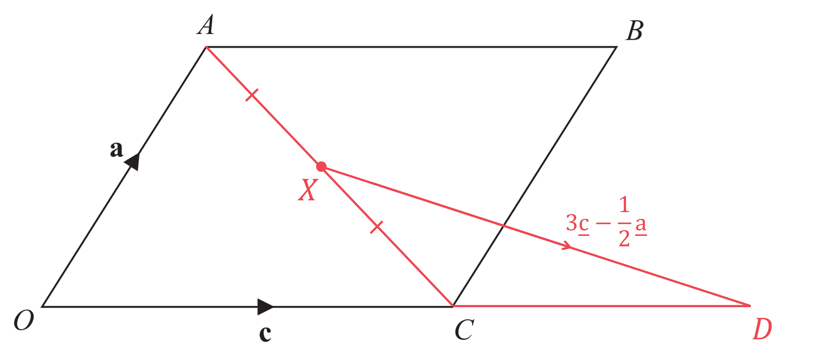

> *Find the vector *$\overset{\rightarrow}{CA}$* by finding a path starting at **C** and ending at **A** using known vectors.*

`table row cell stack C A with rightwards arrow on top end cell equals cell stack C O with rightwards arrow on top plus stack O A with rightwards arrow on top end cell row blank equals cell negative bottom enclose straight c plus bottom enclose straight a end cell row blank equals cell bottom enclose straight a minus bottom enclose straight c end cell end table`

**[1]**

> *X** is the midpoint of **AC** therefore *$\overset{\rightarrow}{CX}=\frac{1}{2}\times\overset{\rightarrow}{CA}$*.*

`table row cell stack C X with rightwards arrow on top end cell equals cell 1 half open parentheses bottom enclose straight a minus bottom enclose straight c close parentheses end cell row blank equals cell 1 half bottom enclose straight a minus 1 half bottom enclose straight c end cell end table`

> *Find the vector *$\overset{\rightarrow}{CD}$* by finding a path starting at **C** and ending at **D** using known vectors.*

`table row cell stack C D with rightwards arrow on top end cell equals cell stack C X with rightwards arrow on top plus stack X D with rightwards arrow on top end cell row blank equals cell 1 half bottom enclose straight a minus 1 half bottom enclose straight c plus 3 bottom enclose straight c minus 1 half bottom enclose straight a end cell row blank equals cell 5 over 2 bottom enclose straight c end cell end table`

**[1]**

> *Compare the vectors *$\overset{\rightarrow}{OC}$* and *$\overset{\rightarrow}{CD}$* and use the ratio given in the question to form an equation.*

`stack O C with rightwards arrow on top equals bottom enclose straight c space & space stack C D with rightwards arrow on top equals 5 over 2 bottom enclose straight c
therefore O C colon C D equals 1 colon 5 over 2
therefore k colon 1 equals 1 colon 5 over 2`

**[1]**

> *The ratio in the question has a 1 in the second place. Therefore multiply both parts by 2 and divide both parts by 5 for the second ratio.*

$k:1=\frac{2}{5}:1$

> *You can now compare the ratios to write down the value of **k**.*

`table row bold italic k bold equals cell bold 2 over bold 5 end cell end table` **[1]**

**It is acceptable to write as a decimal: **$k=0.4$

## Q11 — hard — 6 marks · exam-questions

### 24((a)) — 2 marks
> *Method 1*

> *The position vector of the midpoint of the line **AB** is found using the formula *`1 half open parentheses stack O A with rightwards arrow on top plus stack O B with rightwards arrow on top close parentheses`*.*

`stack O M with rightwards arrow on top equals 1 half open parentheses 6 bottom enclose straight a plus 6 bottom enclose straight b close parentheses`

**[1]**

> *Simplify.*

`stack bold italic O bold italic M with bold rightwards arrow on top bold equals bold 3 bottom enclose bold a bold plus bold 3 bottom enclose bold b` **[1]**

> *Method 2*

> *Find a path starting at **A** and ending at **B** using known vectors.*

$\overset{\rightarrow}{AB}=\overset{\rightarrow}{AO}+\overset{\rightarrow}{OB}$

> *Use the property that reversing the direction of the vector is the same as multiplying it by -1.*

`table row cell stack A O with rightwards arrow on top end cell equals cell negative stack O A with rightwards arrow on top end cell row cell stack A B with rightwards arrow on top end cell equals cell negative stack O A with rightwards arrow on top plus stack O B with rightwards arrow on top end cell row cell stack A B with rightwards arrow on top end cell equals cell stack O B with rightwards arrow on top minus stack O A with rightwards arrow on top end cell end table`

> *Use the given vectors.*

`table row cell stack A B with rightwards arrow on top end cell equals cell 6 bottom enclose straight b minus 6 bottom enclose straight a end cell end table`

**[1]**

> *M** is the midpoint of **AB** therefore *$\overset{\rightarrow}{AM}=\frac{1}{2}\times\overset{\rightarrow}{AB}$*.*

`table row cell stack A M with rightwards arrow on top end cell equals cell 1 half cross times open parentheses 6 bottom enclose straight b minus 6 bottom enclose straight a close parentheses end cell row blank equals cell 3 bottom enclose straight b minus 3 bottom enclose straight a end cell end table`

> *Find a path from **O** to **M**.*

`table row cell stack O M with rightwards arrow on top end cell equals cell stack O A with rightwards arrow on top plus stack A M with rightwards arrow on top end cell row blank equals cell 6 bottom enclose straight a plus 3 bottom enclose straight b minus 3 bottom enclose straight a end cell end table`

> *Simplify.*

** **`stack bold italic O bold italic M with bold rightwards arrow on top bold equals bold 3 bottom enclose bold a bold plus bold 3 bottom enclose bold b`** [1]**

### 24((b)) — 4 marks
> *To show that three points form a straight line you need to choose two pairs of points and show that the two vectors between these points are parallel. As there are three points, the two vectors will share a common point and therefore form a straight line.*

> *Find the vector *$\overset{\rightarrow}{AN}$* by finding a path between **A** and **N**.*

$\overset{\rightarrow}{AN}=\overset{\rightarrow}{AO}+\overset{\rightarrow}{ON}$

> *N** is the midpoint of **OB** therefore *$\overset{\rightarrow}{ON}=\frac{1}{2}\times\overset{\rightarrow}{OB}.$* Reversing the direction of a vector is the same as multiplying the vector by -1, therefore *$\overset{\rightarrow}{AO}=-\overset{\rightarrow}{OA}.$

`table row cell stack A N with rightwards arrow on top end cell equals cell negative stack O A with rightwards arrow on top plus 1 half cross times stack O B with rightwards arrow on top end cell row blank equals cell negative 6 bottom enclose straight a plus 1 half cross times 6 bottom enclose straight b end cell row blank equals cell negative 6 bottom enclose straight a plus 3 bottom enclose straight b end cell row blank equals cell 3 open parentheses negative 2 bottom enclose straight a plus bottom enclose straight b close parentheses end cell end table`

**[1]**

> *Find the vector *$\overset{\rightarrow}{AG}$* by finding a path between **A** and **G**.*

$\overset{\rightarrow}{AG}=\overset{\rightarrow}{AO}+\overset{\rightarrow}{OG}$

> *G** splits **OM **in the ratio 2:1 therefore **OG** is *$\frac{2}{2+1}$* of the length **OM**.*

`table row cell stack O G with rightwards arrow on top end cell equals cell 2 over 3 cross times stack O M with rightwards arrow on top end cell row blank equals cell 2 over 3 open parentheses 3 bottom enclose straight a plus 3 bottom enclose straight b close parentheses end cell row blank equals cell 2 bottom enclose straight a plus 2 bottom enclose straight b end cell end table`

**[1]**

> *Substitute in to the find vector *$\overset{\rightarrow}{AG}$*.*

`table attributes columnalign right center left columnspacing 0px end attributes row cell stack A G with rightwards arrow on top end cell equals cell negative stack O A with rightwards arrow on top plus stack O G with rightwards arrow on top end cell row blank equals cell negative 6 bottom enclose straight a plus 2 bottom enclose straight a plus 2 bottom enclose straight b end cell row blank equals cell negative 4 bottom enclose straight a plus 2 bottom enclose straight b end cell row blank equals cell 2 open parentheses negative 2 bottom enclose straight a plus bottom enclose straight b close parentheses end cell end table`

**[1]**

> *Two vectors are parallel if they are both scalar multiples of a common vector.*

`table row cell stack A N with rightwards arrow on top end cell equals cell 3 open parentheses negative 2 bottom enclose straight a plus bottom enclose straight b close parentheses space & space table row blank blank cell stack A G with rightwards arrow on top end cell end table table row blank equals blank end table table row blank blank 2 end table table row blank blank cell open parentheses negative 2 bottom enclose straight a plus bottom enclose straight b close parentheses end cell end table table row blank blank space end table table row blank blank space end table end cell row blank blank cell therefore A N space & space A G space are space parallel end cell end table`

**AGN**** is a straight line as ****AN**** and ****AG**** are ****parallel**** lines that have a ****common point**** ****A**** ****[1]**

## Q12 — medium — 3 marks · exam-questions

### 24() — 3 marks
> *Two vectors are parallel if one is scalar multiple of the other.*

> *Find the vector *$\overset{\rightarrow}{MN}$* by finding a path from **M** to **N**.*

$\overset{\rightarrow}{MN}=\overset{\rightarrow}{MO}+\overset{\rightarrow}{ON}$

**[1]**

> *Use the property that reversing the direction of the vector is the same as multiplying it by -1.*

`table row cell stack M O with rightwards arrow on top end cell equals cell negative stack O M with rightwards arrow on top end cell row cell stack M N with rightwards arrow on top end cell equals cell negative stack O M with rightwards arrow on top plus stack O N with rightwards arrow on top end cell row cell stack M N with rightwards arrow on top end cell equals cell stack O N with rightwards arrow on top minus stack O M with rightwards arrow on top end cell end table`

> *Use the given vectors.*

`table row cell stack M N with rightwards arrow on top end cell equals cell bottom enclose straight n minus bottom enclose straight m end cell end table`

> *Find the vector *$\overset{\rightarrow}{AB}$* by finding a path from **A** to **B**.*

$\overset{\rightarrow}{AB}=\overset{\rightarrow}{AO}+\overset{\rightarrow}{OB}\,\overset{\rightarrow}{AB}=-\overset{\rightarrow}{OA}+\overset{\rightarrow}{OB}\,\overset{\rightarrow}{AB}=\overset{\rightarrow}{OB}-\overset{\rightarrow}{OA}$

> *M and N are midpoints therefore *$\overset{\rightarrow}{OA}=2\overset{\rightarrow}{OM}$* and *$\overset{\rightarrow}{OB}=2\overset{\rightarrow}{ON}$*.*

`table row cell stack A B with rightwards arrow on top end cell equals cell 2 stack O N with rightwards arrow on top minus 2 stack O M with rightwards arrow on top end cell row blank equals cell 2 bottom enclose straight n minus 2 bottom enclose straight m end cell end table`

**[1]**

> *Factorise.*

`table row cell stack A B with rightwards arrow on top end cell equals cell 2 open parentheses bottom enclose straight n minus bottom enclose straight m close parentheses end cell end table`

$\overset{\rightarrow}{AB}=2\overset{\rightarrow}{MN}$* ***therefore ****AB**** is parallel to ****MN ****[1]**

## Q13 — very_hard — 5 marks · exam-questions

### 21() — 5 marks
> *Vectors between any two points on a line must be parallel to each other. Find any two of the vectors: *$\overset{\rightarrow}{MP},\overset{\rightarrow}{MN},\overset{\rightarrow}{PN}$*.*

> *Find the vector *$\overset{\rightarrow}{MN}$* by finding a path between **M** and **N**.*

$\overset{\rightarrow}{MN}=\overset{\rightarrow}{MO}+\overset{\rightarrow}{OA}+\overset{\rightarrow}{AN}$

> *M** is the midpoint of **OB** therefore *$\overset{\rightarrow}{OM}=\frac{1}{2}\times\overset{\rightarrow}{OB}=\frac{1}{2}b$*. **AN** = 2**OA** therefore *$\overset{\rightarrow}{AN}=2\times\overset{\rightarrow}{OA}=2a$*.*

`table row cell stack M N with rightwards arrow on top end cell equals cell negative 1 half bottom enclose straight b plus bottom enclose straight a plus 2 bottom enclose straight a end cell row blank equals cell 3 bottom enclose straight a minus 1 half bottom enclose straight b end cell end table`

**[1]**

> *Find the vector *$\overset{\rightarrow}{AB}$* by finding a path between **A** and **B**.*

`table row cell stack A B with rightwards arrow on top end cell equals cell stack A O with rightwards arrow on top plus stack O B with rightwards arrow on top end cell row blank equals cell negative bottom enclose straight a plus bottom enclose straight b end cell row blank equals cell bottom enclose straight b minus bottom enclose straight a end cell end table`

**[1]**

> *Find the vector *$\overset{\rightarrow}{AP}$* using *$\overset{\rightarrow}{AP}=k\overset{\rightarrow}{AB}$

`table row cell stack A P with rightwards arrow on top end cell equals cell k open parentheses bottom enclose straight b minus bottom enclose straight a close parentheses end cell row blank equals cell k bottom enclose straight b minus k bottom enclose straight a end cell end table`

> *Find the vector *$\overset{\rightarrow}{PN}$* by finding a path between **P** and **N**.*

`table row cell stack P N with rightwards arrow on top end cell equals cell stack P A with rightwards arrow on top plus stack A N with rightwards arrow on top end cell row blank equals cell negative open parentheses k bottom enclose straight b minus k bottom enclose straight a close parentheses plus 2 bottom enclose straight a end cell row blank equals cell negative k bottom enclose straight b plus k bottom enclose straight a plus 2 bottom enclose straight a end cell row blank equals cell open parentheses k plus 2 close parentheses bottom enclose straight a minus k bottom enclose straight b end cell end table`

**[1]**

> *Two vectors are parallel if one is a scalar multiple of the other. **PN** and **MN **are part of the same line so are parallel therefore their vectors are scalar multiples. Multiply one vector by a constant (call it **q**) and make it equal to the other vector.*

`table row cell stack P N with rightwards arrow on top end cell equals cell q cross times stack M N with rightwards arrow on top end cell row blank blank cell therefore open parentheses k plus 2 close parentheses bottom enclose straight a minus k bottom enclose straight b equals q open parentheses 3 bottom enclose straight a minus 1 half bottom enclose straight b close parentheses end cell end table`

> *The coefficients of **a** for both vectors must be equal. Also the coefficients for **b** for both vectors must be equal. Form two equations.*

`circle enclose 1 space k plus 2 equals 3 q space
circle enclose 2 space minus k equals negative 1 half q`

**[1]**

> *Multiply both sides of the second equation by -6 so that the coefficient of **q** is the same for both equations.*

`circle enclose 1 space k plus 2 equals 3 q space
circle enclose 2 space 6 k equals 3 q`

> *As the right hand sides of both equations are equal, the left hand sides must also be equal. Form an equation and solve it to find **k**.*

`table attributes columnalign right center left columnspacing 0px end attributes row cell k plus 2 end cell equals cell 6 k end cell row 2 equals cell 5 k end cell row cell 2 over 5 end cell equals k end table`

$k=\frac{2}{5}$** ****[1]**

**It is acceptable to write the answer as a decimal: **$k=0.4$

## Q14 — hard — 5 marks · exam-questions

### 22() — 5 marks
> *Find a path starting at **A** and ending at **B** using known vectors.*

$\overset{\rightarrow}{AB}=\overset{\rightarrow}{AC}+\overset{\rightarrow}{CB}$

> *Use the property that reversing the direction of the vector is the same as multiplying it by -1.*

`table row cell stack A C with rightwards arrow on top end cell equals cell negative stack C A with rightwards arrow on top end cell row cell stack A B with rightwards arrow on top end cell equals cell negative stack C A with rightwards arrow on top plus stack C B with rightwards arrow on top end cell row cell stack A B with rightwards arrow on top end cell equals cell stack C B with rightwards arrow on top minus stack C A with rightwards arrow on top end cell end table`

> *Use the given vectors.*

`stack A B with rightwards harpoon with barb upwards on top equals 6 bottom enclose straight b minus 3 bottom enclose straight a`

**[1]**

*Use the ratio to write **AX** as a fraction of **AB**.* *AX** : **XB**  = 1 : 2 therefore **AX** is *$\frac{1}{1+2}$* of the length **AB**.*

$\overset{\rightarrow}{AX}=\frac{1}{3}\times\overset{\rightarrow}{AB}$

**[1]**

> *Use the vector for *$\overset{\rightarrow}{AB}.$

`table row cell stack A X with rightwards arrow on top end cell equals cell 1 third cross times open parentheses 6 bottom enclose straight b minus 3 bottom enclose straight a close parentheses end cell row blank equals cell 2 bottom enclose straight b minus bottom enclose straight a end cell end table`

> *Find the vector *$\overset{\rightarrow}{CX}$* by finding a path starting at **C** and ending at **X**.*

$\overset{\rightarrow}{CX}=\overset{\rightarrow}{CA}+\overset{\rightarrow}{AX}$

> *Substitute the expressions for the vectors.*

`table row cell stack C X with rightwards arrow on top end cell equals cell bottom enclose 3 straight a end enclose plus 2 bottom enclose straight b minus bottom enclose straight a end cell row blank equals cell 2 bottom enclose straight a plus 2 bottom enclose straight b end cell end table`

**[1]**

> *Find the vector *$\overset{\rightarrow}{CY}$* by finding a path from **C** to **Y**.*

`table row cell stack C Y with rightwards arrow on top end cell equals cell stack C B with rightwards arrow on top plus stack B Y with rightwards arrow on top end cell row blank equals cell 6 bottom enclose straight b plus 5 bottom enclose straight a minus bottom enclose straight b end cell row blank equals cell 5 bottom enclose straight b plus 5 bottom enclose straight a end cell end table`

**[1]**

`Error converting from MathML to accessible text.`** [****1]**

## Q15 — medium — 5 marks · exam-questions

### 26((a)) — 1 marks
> *Find a path starting at **A** and ending at **B** using known vectors.*

$\overset{\rightarrow}{AB}=\overset{\rightarrow}{AO}+\overset{\rightarrow}{OB}$

> *Use the property that reversing the direction of the vector is the same as multiplying it by -1.*

`table row cell stack A O with rightwards arrow on top end cell equals cell negative stack O A with rightwards arrow on top end cell row cell stack A B with rightwards arrow on top end cell equals cell negative stack O A with rightwards arrow on top plus stack O B with rightwards arrow on top end cell row cell stack A B with rightwards arrow on top end cell equals cell stack O B with rightwards arrow on top minus stack O A with rightwards arrow on top end cell end table`

> *Use the given vectors.*

`stack bold italic A bold italic B with bold rightwards harpoon with barb upwards on top bold equals bold 6 bottom enclose bold b bold minus bold 3 bottom enclose bold a` **[1]**

### 26((b)) — 4 marks
*Use the ratio to write **AX** as a fraction of **AB**.* *AX** : **XB**  = 1 : 2 therefore **AX** is *$\frac{1}{1+2}$* of the length **AB**.*

$\overset{\rightarrow}{AX}=\frac{1}{3}\times\overset{\rightarrow}{AB}$

**[1]**

> *Use the vector for *$\overset{\rightarrow}{AB}.$

`table row cell stack A X with rightwards arrow on top end cell equals cell 1 third cross times open parentheses 6 bottom enclose straight b minus 3 bottom enclose straight a close parentheses end cell row blank equals cell 2 bottom enclose straight b minus bottom enclose straight a end cell end table`

> *Find the vector *$\overset{\rightarrow}{OX}$* by finding a path starting at **O** and ending at **X**.*

$\overset{\rightarrow}{OX}=\overset{\rightarrow}{OA}+\overset{\rightarrow}{AX}$

> *Substitute the expressions for the vectors.*

`table row cell stack O X with rightwards arrow on top end cell equals cell bottom enclose 3 straight a end enclose plus 2 bottom enclose straight b minus bottom enclose straight a end cell row blank equals cell 2 bottom enclose straight a plus 2 bottom enclose straight b end cell end table`

**[1]**

> *Find the vector *$\overset{\rightarrow}{OY}$* by finding a path from **O** to **Y**.*

`table row cell stack O Y with rightwards arrow on top end cell equals cell stack O B with rightwards arrow on top plus stack B Y with rightwards arrow on top end cell row blank equals cell 6 bottom enclose straight b plus 5 bottom enclose straight a minus bottom enclose straight b end cell row blank equals cell 5 bottom enclose straight b plus 5 bottom enclose straight a end cell end table`

**[1]**

`equation` **[1]**

## Q16 — very_hard — 5 marks · exam-questions

### 18() — 5 marks
> *Vectors between any two points on a line must be parallel to each other. Find any two of the vectors: *$\overset{\rightarrow}{MN},\overset{\rightarrow}{MC},\overset{\rightarrow}{NC}$*.*

> *Find the vector *$\overset{\rightarrow}{AB}$* by finding a path between **A** and **B**.*

`table row cell stack A B with rightwards arrow on top end cell equals cell stack A O with rightwards arrow on top plus stack O B with rightwards arrow on top end cell row blank equals cell negative 6 bottom enclose straight a plus 6 bottom enclose straight b end cell row blank equals cell 6 bottom enclose straight b minus 6 bottom enclose straight a end cell end table`

**[1]**

> *Find the vector *$\overset{\rightarrow}{MC}$* by finding a path between **M** and **C**.*

`table row cell stack M C with rightwards arrow on top end cell equals cell stack M A with rightwards arrow on top plus stack A B with rightwards arrow on top plus stack B C with rightwards arrow on top end cell end table`

> *M** is the midpoint of **OA** therefore *$\overset{\rightarrow}{MA}=\frac{1}{2}\times\overset{\rightarrow}{OA}$*.*

`stack M A with rightwards arrow on top equals 1 half cross times 6 bottom enclose straight a equals 3 bottom enclose straight a`

**[1]**

> *B** is the midpoint of **AC** therefore *$\overset{\rightarrow}{AB}=\overset{\rightarrow}{BC}=6b-6a$*.*

`table row cell stack M C with rightwards arrow on top end cell equals cell 3 bottom enclose straight a plus open parentheses 6 bottom enclose straight b minus 6 bottom enclose straight a close parentheses plus open parentheses 6 bottom enclose straight b minus 6 bottom enclose straight a close parentheses end cell row blank equals cell 12 bottom enclose straight b minus 9 bottom enclose straight a end cell end table`

> *Find the vector *$\overset{\rightarrow}{MN}$* by finding a path between **M** and **N**.*

`table row cell stack M N with rightwards arrow on top end cell equals cell stack M O with rightwards arrow on top plus stack O N with rightwards arrow on top end cell row blank equals cell negative 3 bottom enclose straight a plus k bottom enclose straight b end cell row blank equals cell k bottom enclose straight b minus 3 bottom enclose straight a end cell end table`

**[1]**

> *Two vectors are parallel if one is a scalar multiple of the other. **MC** and **MN** are on the same straight line so must be scalar multiples. Multiply one vector by a constant (call it **q**) and make it equal to the other vector.*

`table row cell stack M C with rightwards arrow on top end cell equals cell q cross times stack M N with rightwards arrow on top end cell row cell therefore 12 bottom enclose straight b minus 9 bottom enclose straight a end cell equals cell q open parentheses k bottom enclose straight b minus 3 bottom enclose straight a close parentheses end cell end table`

> *The coefficients of **a** for both vectors must be equal. Also the coefficients for **b** for both vectors must be equal. Form two equations.*

`circle enclose 1 space 12 equals q k space
circle enclose 2 space minus 9 equals negative 3 q`

**[1]**

> *Solve the second equation to find **q**.*

$q=3$

> *Substitute the value of **q** into the first equation to find **k**.*

`table row 12 equals cell 3 k end cell row cell 12 over 3 end cell equals k end table`

$k=4$** ****[1]**

## Q17 — hard — 4 marks · exam-questions

### 20() — 4 marks
> *Find the vector *$\overset{\rightarrow}{AB}$* by finding a path starting at **A** and ending at **B** using known vectors.*

$\overset{\rightarrow}{AB}=\overset{\rightarrow}{AO}+\overset{\rightarrow}{OB}$

> *Use the property that reversing the direction of the vector is the same as multiplying it by -1.*

`table row cell stack A O with rightwards arrow on top end cell equals cell negative stack O A with rightwards arrow on top end cell row cell stack A B with rightwards arrow on top end cell equals cell negative stack O A with rightwards arrow on top plus stack O B with rightwards arrow on top end cell row cell stack A B with rightwards arrow on top end cell equals cell stack O B with rightwards arrow on top minus stack O A with rightwards arrow on top end cell end table`

> *Use the given vectors.*

`table attributes columnalign right center left columnspacing 0px end attributes row cell stack A B with rightwards arrow on top end cell equals cell 2 bottom enclose straight b minus 2 bottom enclose straight a end cell end table`

**[1]**

*Use the ratio to write **AP **as a fraction of **AB**.* *AP** : **PB**  = 5 : 3 therefore **AP** is *$\frac{5}{5+3}$* of the length **AB**.*

$\overset{\rightarrow}{AP}=\frac{5}{8}\times\overset{\rightarrow}{AB}$

> *Use the vector for *$\overset{\rightarrow}{AB}.$

`table row cell stack A P with rightwards arrow on top end cell equals cell 5 over 8 cross times open parentheses 2 bottom enclose straight b minus 2 bottom enclose straight a close parentheses end cell row blank equals cell 5 over 4 bottom enclose straight b minus 5 over 4 bottom enclose straight a end cell end table`

**[1]**

> *Find a path starting at **O** and ending at **P**.*

$\overset{\rightarrow}{OP}=\overset{\rightarrow}{OA}+\overset{\rightarrow}{AP}$

**[1]**

> *Substitute the expressions for the vectors.*

`table row cell stack O P with rightwards arrow on top end cell equals cell 2 bottom enclose straight a plus 5 over 4 bottom enclose straight b minus 5 over 4 bottom enclose straight a end cell row blank equals cell 2 bottom enclose straight a minus 5 over 4 bottom enclose straight a plus 5 over 4 bottom enclose straight b end cell end table`

> *Simplify.*

`table row cell stack O P with rightwards arrow on top end cell equals cell 3 over 4 bottom enclose straight a plus 5 over 4 bottom enclose straight b end cell end table`

> *Factorise out the *$\frac{1}{4}.$

`table row cell stack O P with rightwards arrow on top end cell equals cell 1 fourth open parentheses 3 bottom enclose straight a plus 5 bottom enclose straight b close parentheses end cell end table`

`table row bold italic k bold equals cell bold 1 over bold 4 end cell end table` **[1]**

## Q18 — medium — 2 marks · exam-questions

### 13() — 2 marks
*The vector *$\overset{\rightarrow}{AC}$* means move from **A** to **C* *This is the same as moving from **A** to** B** to** C* * *

$\overset{\rightarrow}{AC}=\overset{\rightarrow}{AB}+\overset{\rightarrow}{BC}$ * *

*The vector *$\overset{\rightarrow}{BC}$* is the negative of vector *$\overset{\rightarrow}{CB}$ * *

$\overset{\rightarrow}{AC}=\overset{\rightarrow}{AB}-\overset{\rightarrow}{CB}$ * *

*Substitute the vectors from the question into the line above*

`table row cell stack A C with rightwards arrow on top end cell equals cell open parentheses table row 5 row 3 end table close parentheses minus open parentheses table row cell negative 2 end cell row 4 end table close parentheses end cell row blank equals cell open parentheses table row cell 5 plus 2 end cell row cell 3 minus 4 end cell end table close parentheses end cell end table`

**[1]**

`equation` **[1]**

## Q19 — very_hard — 6 marks · exam-questions

### 20((a)) — 2 marks
> *Find the vector *$\overset{\rightarrow}{FE}$* by finding a path starting at **F** and ending at **E** using known vectors.*

`table row cell stack F E with rightwards arrow on top end cell equals cell stack F C with rightwards arrow on top plus stack C D with rightwards arrow on top plus stack D E with rightwards arrow on top end cell row blank equals cell open parentheses bottom enclose straight a minus bottom enclose straight b close parentheses plus bottom enclose straight a plus bottom enclose straight b end cell end table`

**[1]**

> *Simplify.*

`table row cell stack bold italic F bold italic E with bold rightwards arrow on top end cell bold equals cell bold 2 bottom enclose bold a end cell end table`* ***[1]**

### 20((b)) — 4 marks
> *Vectors between any two points on a line must be parallel to each other. Find any two of the vectors: *$\overset{\rightarrow}{CE},\overset{\rightarrow}{CX},\overset{\rightarrow}{XE}$*.*

> *Find the vector *$\overset{\rightarrow}{CE}$* by finding a path between **C** and **E**.*

`table row cell stack C E with rightwards arrow on top end cell equals cell stack C D with rightwards arrow on top plus stack D E with rightwards arrow on top end cell row blank equals cell bottom enclose straight a plus bottom enclose straight b end cell end table`

**[1]**

> *Find the vector *$\overset{\rightarrow}{FM}$* by finding a path between **F** and **M**.*

`table row cell stack F M with rightwards arrow on top end cell equals cell stack F E with rightwards arrow on top plus stack E M with rightwards arrow on top end cell end table`

> *M** is the midpoint of **DE** therefore *$\overset{\rightarrow}{EM}=\frac{1}{2}\times\overset{\rightarrow}{ED}=\frac{1}{2}\times-\overset{\rightarrow}{DE}$*.*

`stack F M with rightwards arrow on top equals 2 bottom enclose straight a minus 1 half bottom enclose straight b`

*Use the ratio to write **XM** as a fraction of **FM**.* *FX** : **XM**  = **n** : 1 therefore **XM** is *$\frac{1}{n+1}$* of the length **FM**.*

`table row cell stack X M with rightwards arrow on top end cell equals cell fraction numerator 1 over denominator n plus 1 end fraction cross times stack F M with rightwards arrow on top end cell row blank equals cell fraction numerator 1 over denominator n plus 1 end fraction open parentheses 2 bottom enclose straight a minus 1 half bottom enclose straight b close parentheses end cell row blank equals cell fraction numerator 2 over denominator n plus 1 end fraction bottom enclose straight a minus fraction numerator 1 over denominator 2 open parentheses n plus 1 close parentheses end fraction bottom enclose straight b end cell end table`

> *Find the vector *$\overset{\rightarrow}{XE}$* by finding a path between **X** and **E**.*

`table row cell stack X E with rightwards arrow on top end cell equals cell stack X M with rightwards arrow on top plus stack M E with rightwards arrow on top end cell row blank equals cell open parentheses fraction numerator 2 over denominator n plus 1 end fraction bottom enclose straight a minus fraction numerator 1 over denominator 2 open parentheses n plus 1 close parentheses end fraction bottom enclose straight b close parentheses plus 1 half bottom enclose straight b end cell row blank equals cell fraction numerator 2 over denominator n plus 1 end fraction bottom enclose straight a plus open parentheses 1 half minus fraction numerator 1 over denominator 2 open parentheses n plus 1 close parentheses end fraction close parentheses bottom enclose straight b end cell end table`

> *Add the fractions by writing each as an equivalent fraction with a common denominator.*

`table row cell stack X E with rightwards arrow on top end cell equals cell fraction numerator 2 over denominator n plus 1 end fraction bottom enclose straight a plus open parentheses fraction numerator n plus 1 over denominator 2 open parentheses n plus 1 close parentheses end fraction minus fraction numerator 1 over denominator 2 open parentheses n plus 1 close parentheses end fraction close parentheses bottom enclose straight b end cell row blank equals cell fraction numerator 2 over denominator n plus 1 end fraction bottom enclose straight a plus fraction numerator n plus 1 minus 1 over denominator 2 open parentheses n plus 1 close parentheses end fraction bottom enclose straight b end cell row blank equals cell fraction numerator 2 over denominator n plus 1 end fraction bottom enclose straight a plus fraction numerator n over denominator 2 open parentheses n plus 1 close parentheses end fraction bottom enclose straight b end cell end table`

**[1]**

> *Two vectors are parallel if one is a scalar multiple of the other. **CE** and **XE** are on the same straight line so must be scalar multiples. Multiply one vector by a constant (call it **q**) and make it equal to the other vector.*

`stack X E with rightwards arrow on top equals q cross times stack C E with rightwards arrow on top
therefore fraction numerator 2 over denominator n plus 1 end fraction bottom enclose straight a plus fraction numerator n over denominator 2 open parentheses n plus 1 close parentheses end fraction bottom enclose straight b equals q open parentheses bottom enclose straight a plus bottom enclose straight b close parentheses`

> *The coefficients of **a** for both vectors must be equal. Also the coefficients for **b** for both vectors must be equal. Form two equations.*

`circle enclose 1 space fraction numerator 2 over denominator n plus 1 end fraction equals q
circle enclose 2 space fraction numerator n over denominator 2 open parentheses n plus 1 close parentheses end fraction equals q
`

**[1]**

> *As the right hand sides of both equations are equal, the left hand sides must also be equal. Form an equation and solve it to find **n**.*

`fraction numerator 2 over denominator n plus 1 end fraction equals fraction numerator n over denominator 2 open parentheses n plus 1 close parentheses end fraction`

> *Multiply the numerator and denominator of the first fraction by 2 so that the denominators are the same for both fractions. Once the denominators are it, then the numerators must be equal.*

`table attributes columnalign right center left columnspacing 0px end attributes row cell fraction numerator 4 over denominator up diagonal strike 2 open parentheses n plus 1 close parentheses end strike end fraction end cell equals cell fraction numerator n over denominator up diagonal strike 2 open parentheses n plus 1 close parentheses end strike end fraction end cell row 4 equals n end table`

$n=4$** ****[1]**

## Q20 — hard — 3 marks · exam-questions

### 23() — 3 marks
*Find *$\overset{\rightarrow}{PM}$*, for example by going from **P** to **A** to** B **to **M* *It is useful to use that *$\overset{\rightarrow}{BC}=-4a+2b$ * *

`table row cell stack P M with rightwards arrow on top end cell equals cell stack P A with rightwards arrow on top plus stack A B with rightwards arrow on top plus stack B M with rightwards arrow on top end cell row blank equals cell open parentheses negative stack A P with rightwards arrow on top close parentheses plus stack A B with rightwards arrow on top plus 1 half stack B C with rightwards arrow on top end cell row blank equals cell negative open parentheses 3 over 2 bold a plus 3 over 4 bold b close parentheses plus 4 bold a plus 1 half open parentheses negative 4 bold a plus 2 bold b close parentheses end cell end table`

**[1]**

*Expand and collect like terms* * *

`table row cell stack P M with rightwards arrow on top end cell equals cell negative 3 over 2 bold a minus 3 over 4 bold b plus 4 bold a minus 2 bold a plus bold b end cell row blank equals cell 1 half bold a plus 1 fourth bold b end cell end table` * *

*AP** = *`vertical line table row blank blank cell stack A P with rightwards arrow on top end cell end table vertical line`* and **PM** = *`vertical line table row blank blank cell stack P M with rightwards arrow on top end cell end table vertical line`*, as **AP** and **PM** are both lengths* *Find **AP** : **PM  *

`space open vertical bar 3 over 2 bold a plus 3 over 4 bold b close vertical bar colon open vertical bar 1 half bold a plus 1 fourth bold b close vertical bar`

**[1]**

*Factorise out a 3 on the left-hand side and cancel the common factor on both sides* * *

`table row cell 3 space up diagonal strike open vertical bar 1 half bold a plus 1 fourth bold b close vertical bar end strike space colon space up diagonal strike open vertical bar 1 half bold a plus 1 fourth bold b close vertical bar end strike end cell equals cell 3 colon 1 end cell end table`

**3 : 1*** ***[1]**

## Q21 — medium — 1 marks · exam-questions

### 14() — 1 marks
*(i) **Go from **A** to **O** to **B*

`table row cell stack A B with rightwards arrow on top end cell equals cell stack A O with rightwards arrow on top plus stack O B with rightwards arrow on top end cell row blank equals cell negative stack O A with rightwards arrow on top plus stack O B with rightwards arrow on top end cell end table`

$\overset{\rightarrow}{AB}=-a+b$ **[1]**

*(ii) **Go from **K** to **J** to **I* *K** to **J** is double **A** to **B**, found in part (i)* *J** to **I** is double **O** to **B*

`table row cell stack K I with rightwards arrow on top end cell equals cell stack K J with rightwards arrow on top plus stack J I with rightwards arrow on top end cell row blank equals cell 2 stack A B with rightwards arrow on top plus 2 stack O B with rightwards arrow on top end cell row blank equals cell 2 open parentheses negative bold a plus bold b close parentheses plus 2 bold b end cell end table`

**[1]**

*Expand and simplify*

$\overset{\rightarrow}{KI}=-2a+2b+2b$

$\overset{\rightarrow}{KI}=-2a+4b$ **[1]**

*(iii) **Go from **L** to** F** to **E** to **D* *L** to** F** and **E** to **D** are both the same as **A** to **B**, found in part (i)* *F** to **E** is the negative of **O** to **A  *

`table row cell stack L D with rightwards arrow on top end cell equals cell stack L F with rightwards arrow on top plus stack F E with rightwards arrow on top plus stack E D with rightwards arrow on top end cell row blank equals cell stack A B with rightwards arrow on top minus stack O A with rightwards arrow on top plus stack A B with rightwards arrow on top end cell row blank equals cell open parentheses negative bold a plus bold b close parentheses minus bold a plus open parentheses negative bold a plus bold b close parentheses end cell end table`

**[1]**

*Expand and simplify* * *

$\overset{\rightarrow}{LD}=-a+b-a-a+b$

$\overset{\rightarrow}{LD}=-3a+2b$* ***[1]**

**There are many other possible paths that lead to the same answer, such as ****L**** to ****F**** to ****O**** to ****D**

## Q22 — very_hard — 5 marks · exam-questions

### 22() — 5 marks
*Think of *$\overset{\rightarrow}{OP}$* in two different ways (one using **MA** and another using **ON**)* *First, go from **O** to **M  *

$\overset{\rightarrow}{OM}=\frac{1}{3}\overset{\rightarrow}{OB}=\frac{1}{3}\times6b=2b$**  **

*You would next go from **M** to **P,** but this distance is unknown* $\overset{\rightarrow}{MP}$* is some smaller "amount" of the vector *$\overset{\rightarrow}{MA}$*(parallel vectors) so write *$\overset{\rightarrow}{MP}=k\overset{\rightarrow}{MA}$*(where **k** is a scalar multiple that you need to find later)* * *

`stack M P with rightwards arrow on top equals k space stack M A with rightwards arrow on top equals k open parentheses negative 2 bold b plus 8 bold a close parentheses`

*Write down this total journey as one vector, *$\overset{\rightarrow}{OP}$ * *

`stack O P with rightwards arrow on top equals stack O M with rightwards arrow on top plus stack M P with rightwards arrow on top equals 2 bold b plus k open parentheses negative 2 bold b plus 8 bold a close parentheses`

**[1]**

*Now find **O** to **P** using a different method / journey* 
$\overset{\rightarrow}{OP}$* is some smaller "amount" of the vector *$\overset{\rightarrow}{ON}$* (parallel vectors) so write *
$\overset{\rightarrow}{OP}=l\overset{\rightarrow}{ON}$* (where **l** is a scalar multiple, different to **k **used previously)* 
*Find *$\overset{\rightarrow}{ON}$* by going from **O** to** A** then half of **A** to **B* * *

> `table row cell stack O N with rightwards arrow on top end cell equals cell stack O A with rightwards arrow on top plus 1 half stack A B with rightwards arrow on top end cell row blank equals cell 8 bold a plus 1 half open parentheses negative 8 bold a plus 6 bold b close parentheses end cell row blank equals cell 4 bold a plus 3 bold b end cell end table`* *

**[1]**

*Write down *$\overset{\rightarrow}{OP}$* (using *$\overset{\rightarrow}{OP}=l\overset{\rightarrow}{ON}$*from above)* * *

`stack O P with rightwards arrow on top equals l open parentheses 4 bold a plus 3 bold b close parentheses`

**[1]**

*Compare the previous version of *$\overset{\rightarrow}{OP}$* to this version of *$\overset{\rightarrow}{OP}$ * *

`2 bold b plus k open parentheses negative 2 bold b plus 8 bold a close parentheses`*  **and ** *`l open parentheses 4 bold a plus 3 bold b close parentheses` * *

*Expand the expressions and collect the **a**'s and **b**'s* * *

`8 k bold a plus open parentheses 2 minus 2 k close parentheses bold b`*  **and  *$4la+3lb$ * *

*Both expressions represent the same journey, *$\overset{\rightarrow}{OP}$*, so the amount of **a**'s and **b**'s must be equal* 
*Form two equations by setting the amount of **a**'s equal and the amount of **b**'s equal*

$8k=4l$* ** and ** *$2-2k=3l$

**[1]**

*Solve these equations simultaneously, for example by substituting *$2k=l$* into the second equation* * *

`table row cell 2 minus l end cell equals cell 3 l end cell row 2 equals cell 4 l end cell row cell 1 half end cell equals cell l space space and space space k equals 1 fourth end cell end table`

> * *

*Finally, find *$\overset{\rightarrow}{OP}$* by substituting either **l** or **k** into its expression for *$\overset{\rightarrow}{OP}$ * *

$\overset{\rightarrow}{OP}=4\times\frac{1}{2}a+3\times\frac{1}{2}b$

$\overset{\rightarrow}{OP}=2a+\frac{3}{2}b$* ***[1]**

## Q23 — hard — 3 marks · exam-questions

### 25() — 3 marks
*To prove something is a trapezium, prove that it has two parallel sides* 
*Draw a diagram to show **O**, **A**, **B**, **a** and **b*

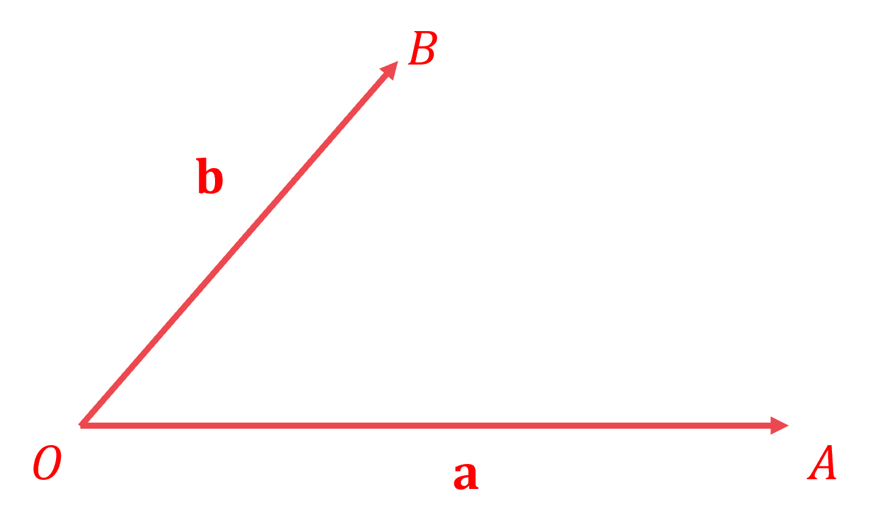

> *Draw **C** and **D** on to the diagram (a third of the way along **OA** and **OB**)** *
*Draw on trapezium **ABDC*

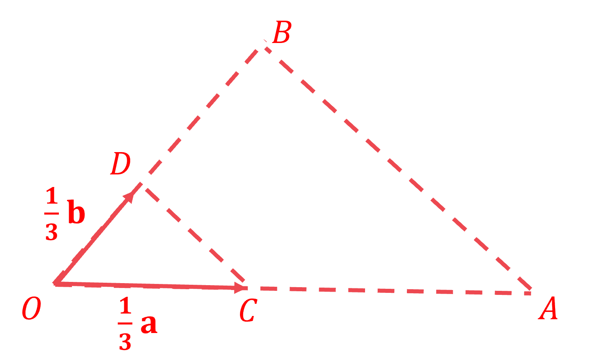

*Two vectors are parallel if one vector is a scalar multiple of another,** **p** = k**q* 
*Prove that sides **BA** and **DC** are parallel*

$\overset{\rightarrow}{BA}=-b+a$

**[1]**

$\overset{\rightarrow}{DC}=-\frac{1}{3}b+\frac{1}{3}a$

**[1]**

$\overset{\rightarrow}{DC}=\frac{1}{3}\overset{\rightarrow}{BA}$

> *Write a conclusion that mentions the words "parallel" and "trapezium"*

**DC**** and ****BA**** are parallel so ****ABDC ****is a trapezium**** ****[1]**

## Q24 — medium — 4 marks · exam-questions

### 25() — 4 marks
> *For example, go from **E** to **D** to **C** to **X ** *

$\overset{\rightarrow}{EX}=\overset{\rightarrow}{ED}+\overset{\rightarrow}{DC}+\overset{\rightarrow}{CX}$

**[1]**

*E** to **D** is the same as **A** to** B* * *

$\overset{\rightarrow}{ED}=\overset{\rightarrow}{AB}=a$ * *

*D** to** C** can be formed using **a** followed by the negative of **b**, as shown in the image below* * *

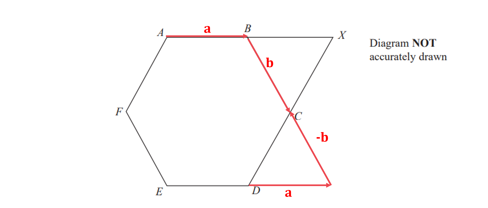

> * *

`stack D C with rightwards arrow on top equals bold a plus open parentheses negative bold b close parentheses`

**[1]**

*C** to **X** is the same as **D** to **C* * *

`table row cell stack E X with rightwards arrow on top end cell equals cell stack E D with rightwards arrow on top plus stack D C with rightwards arrow on top plus stack C X with rightwards arrow on top end cell row blank equals cell bold a plus bold a plus open parentheses negative bold b close parentheses plus bold a plus open parentheses negative bold b close parentheses end cell end table`

$\overset{\rightarrow}{EX}=3a-2b$* ***[1]**

## Q25 — very_hard — 5 marks · exam-questions

### 24() — 5 marks
*Think of *$\overset{\rightarrow}{ON}$* in two different ways (one using **MZ** and another using **OY**)* *First, go from **O** to **M  *

> $\overset{\rightarrow}{OM}=\frac{1}{2}\overset{\rightarrow}{OX}=\frac{1}{2}a$*  *

*You would next go from **M** to **N,** but this distance is unknown* 
$\overset{\rightarrow}{MN}$* is some smaller "amount" of the vector *$\overset{\rightarrow}{MZ}$*(parallel vectors) so write *
$\overset{\rightarrow}{MN}=k\overset{\rightarrow}{MZ}$*(where **k** is a scalar multiple that you can find later)* * *

`stack M N with rightwards arrow on top equals k space stack M Z with rightwards arrow on top equals k open parentheses negative 1 half bold a plus 3 bold b close parentheses`

**[1]**

*Write down this total journey as one vector, *$\overset{\rightarrow}{ON}$ * *

`stack O N with rightwards arrow on top equals stack O M with rightwards arrow on top plus stack M N with rightwards arrow on top equals 1 half bold a plus k open parentheses negative 1 half bold a plus 3 bold b close parentheses`

**[1]**

*Now find **O** to **N** using a different method / journey* 
$\overset{\rightarrow}{ON}$* is **λ** "amounts" of the vector *$\overset{\rightarrow}{OY}$* (parallel vectors) so write *$\overset{\rightarrow}{OP}=λ\overset{\rightarrow}{ON}$* *
*(where** λ** is a scalar multiple, different to **k **used previously)* * *

`stack O N with rightwards arrow on top equals lambda space stack O Y with rightwards arrow on top equals lambda open parentheses bold a plus bold b close parentheses`

**[1]**

*Compare the previous version of *$\overset{\rightarrow}{ON}$* to this version of *$\overset{\rightarrow}{ON}$ * *

`1 half bold a plus k open parentheses negative 1 half bold a plus 3 bold b close parentheses`*  **and ** *`lambda open parentheses bold a plus bold b close parentheses` * *

*Expand the expressions and collect the **a**'s and **b**'s* * *

`open parentheses 1 half minus 1 half k close parentheses bold a plus 3 k bold b`*  **and  *$λa+λb$ * *

*Both expressions represent the same journey, *$\overset{\rightarrow}{ON}$*, so the amount of **a**'s and **b**'s must be equal* 
*Form two equations by setting the amount of **a**'s equal and the amount of **b**'s equal*

$\frac{1}{2}-\frac{1}{2}k=λ$* ** and ** *$3k=λ$

**[1]**

*Solve these equations simultaneously, for example by substituting *$3k=λ$* into the first equation* * *

`table attributes columnalign right center left columnspacing 0px end attributes row cell 1 half minus 1 half k end cell equals cell 3 k end cell row cell 1 minus k end cell equals cell 6 k end cell row 1 equals cell 7 k end cell row cell 1 over 7 end cell equals cell k space space and space space lambda equals 3 over 7 end cell end table`

$λ=\frac{3}{7}$* ***[1]**

## Q26 — hard — 5 marks · exam-questions

### 17((a)) — 3 marks
*Draw the components of vectors *$\overset{\rightarrow}{AB}$* and *$\overset{\rightarrow}{AC}$* on to a diagram* *Also, draw on the coordinates of **B:** (5, 8)* * *

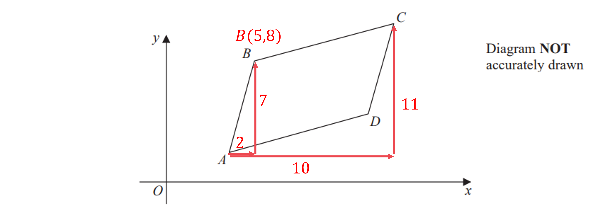

> * *

*Use **B**'s coordinates to work out the coordinates of **A** (by moving backwards from **B** to **A**)* * *

**A***(5 - 2, 8 - 7) = ***A***(3, 1)*

**[1]**

*Use **A**'s coordinates to work out **C**'s coordinates (by moving from **A** to **C**)*

**C***(3 + 10, 1 + 11)*

**[1]**

**(13, 12)**** [1]**

### 17((b)) — 2 marks
*If** ABE** is a straight line, then the vectors *$\overset{\rightarrow}{AE}$* and *$\overset{\rightarrow}{AB}$* must be parallel*
 *Find *$\overset{\rightarrow}{AE}$* by moving from **A**(3, 1) in part (a) to **E**(63, 211)* * *

`stack A E with rightwards arrow on top equals open parentheses table row cell 63 minus 3 end cell row cell 211 minus 1 end cell end table close parentheses equals open parentheses table row 60 row 210 end table close parentheses`

**[1]**

*Parallel vectors are scalar multiples of each other, *$\overset{\rightarrow}{AE}=k\overset{\rightarrow}{AB}$ *Prove that *$\overset{\rightarrow}{AE}$* is a scalar multiple of *$\overset{\rightarrow}{AB}$

`stack A E with rightwards arrow on top equals open parentheses table row 60 row 210 end table close parentheses equals 30 cross times open parentheses table row 2 row 7 end table close parentheses equals 30 stack A B with rightwards arrow on top`

$\overset{\rightarrow}{AE}=30\overset{\rightarrow}{AB}$** so ****ABE**** is a straight line ****[1]**

**This question can also be done by showing **$\overset{\rightarrow}{BE}=29\overset{\rightarrow}{AB}$

## Q27 — medium — 3 marks · exam-questions

### 14() — 3 marks
*The vector *$\overset{\rightarrow}{AC}$* means move from **A** to **C* *This is the same as moving from **A** to** B** to** C* * *

$\overset{\rightarrow}{AC}=\overset{\rightarrow}{AB}+\overset{\rightarrow}{BC}$ * *

*The vector *$\overset{\rightarrow}{BC}$* is the negative of vector *$\overset{\rightarrow}{CB}$ * *

$\overset{\rightarrow}{AC}=\overset{\rightarrow}{AB}-\overset{\rightarrow}{CB}$ * *

*Substitute the vectors from the question into the line above*

`table row cell stack A C with rightwards arrow on top end cell equals cell open parentheses table row 6 row cell negative 9 end cell end table close parentheses minus open parentheses table row 1 row 3 end table close parentheses end cell row blank equals cell open parentheses table row cell 6 minus 1 end cell row cell negative 9 minus 3 end cell end table close parentheses end cell row blank equals cell open parentheses table row 5 row cell negative 12 end cell end table close parentheses end cell end table`

**[1]**

*The magnitude (length) of a vector is given by *`open vertical bar open parentheses table row x row y end table close parentheses close vertical bar equals square root of x squared plus y squared end root`**  **

`table row cell open vertical bar stack A C with rightwards arrow on top close vertical bar end cell equals cell square root of 5 squared plus open parentheses negative 12 close parentheses squared end root end cell row blank equals cell square root of 25 plus 144 end root end cell row blank equals cell square root of 169 end cell end table`

**13**** [1]**

## Q28 — very_hard — 5 marks · exam-questions

### 26() — 5 marks
*Think of *$\overset{\rightarrow}{OP}$* in two different ways (one using **AB** and another using **OC**)* *First, go from **O** to **A  *

> $\overset{\rightarrow}{OA}=2a$*  *

*You would next go from **A** to **P,** but this distance is unknown* $\overset{\rightarrow}{AP}$* is some smaller "amount" of the vector *$\overset{\rightarrow}{AB}$*(parallel vectors) so write *$\overset{\rightarrow}{AP}=k\overset{\rightarrow}{AB}$*(where **k** is a scalar multiple that you need to find later)* * *

`stack A P with rightwards arrow on top equals k space stack A B with rightwards arrow on top equals k open parentheses negative 2 bold a plus 5 bold b close parentheses`

*Write down this total journey as one vector, *$\overset{\rightarrow}{OP}$ * *

`stack O P with rightwards arrow on top equals stack O A with rightwards arrow on top plus stack A P with rightwards arrow on top equals 2 bold a plus k open parentheses negative 2 bold a plus 5 bold b close parentheses`

**[1]**

*Now find **O** to **P** using a different method / journey* 
$\overset{\rightarrow}{OP}$* is some smaller "amount" of the vector *$\overset{\rightarrow}{OC}$* (parallel vectors) so write*
* *$\overset{\rightarrow}{OP}=l\overset{\rightarrow}{OC}$* (where **l** is a scalar multiple, different to **k **used previously)* 
*Find *$\overset{\rightarrow}{OC}$* by going from **O** to** A** then **A** to **B* * *

> `table row cell stack O C with rightwards arrow on top end cell equals cell stack O A with rightwards arrow on top plus stack A C with rightwards arrow on top end cell row blank equals cell 2 bold a plus 3 bold b end cell end table`* *

*Write down *$\overset{\rightarrow}{OP}$* (using *$\overset{\rightarrow}{OP}=l\overset{\rightarrow}{OC}$*from above)* * *

`stack O P with rightwards arrow on top equals l open parentheses 2 bold a plus 3 bold b close parentheses`

**[1]**

*Compare the previous version of *$\overset{\rightarrow}{OP}$* to this version of *$\overset{\rightarrow}{OP}$ * *

`2 bold a plus k open parentheses negative 2 bold a plus 5 bold b close parentheses`*  **and ** *`l open parentheses 2 bold a plus 3 bold b close parentheses` * *

*Expand the expressions and collect the **a**'s and **b**'s* * *

`open parentheses 2 minus 2 k close parentheses bold a plus 5 k bold b`*  **and  *$2la+3lb$ * *

*Both expressions represent the same journey, *$\overset{\rightarrow}{OP}$*, so the amount of **a**'s and **b**'s must be equal* 
*Form two equations by setting the amount of **a**'s equal and the amount of **b**'s equal*

$2-2k=2l$* ** and ** *$5k=3l$

**[1]**

*Solve these equations simultaneously, for example substituting *$k=\frac{3}{5}l$* into the first equation* * *

`table row cell 2 minus 6 over 5 l end cell equals cell 2 l end cell row cell 10 minus 6 l end cell equals cell 10 l end cell row 10 equals cell 16 l end cell row cell 5 over 8 end cell equals cell l space space space and space space k equals 3 over 5 cross times 5 over 8 equals 3 over 8 end cell end table`

**[1]*** *

*Finally, find *$\overset{\rightarrow}{OP}$* by substituting either **l** or **k** into its expression for *$\overset{\rightarrow}{OP}$ * *

$\overset{\rightarrow}{OP}=2\times\frac{5}{8}a+3\times\frac{5}{8}b$

$\overset{\rightarrow}{OP}=\frac{5}{4}a+\frac{15}{8}b$* ***[1]**

## Q29 — hard — 5 marks · exam-questions

### 19((a)) — 3 marks
*(i) **For example, go from **B** to **A** to **C** to **D*

`table row cell stack B D with rightwards arrow on top end cell equals cell stack B A with rightwards arrow on top plus stack A C with rightwards arrow on top plus stack C D with rightwards arrow on top end cell row blank equals cell negative bold p plus bold q plus bold q end cell end table`

$\overset{\rightarrow}{BD}=-p+2q$ **[1]**

*(ii) **For example, go from **M** to **B** to **N* 
*Start with **M** to **B**, which is a quarter of the vector **p *

$\overset{\rightarrow}{MB}=\frac{1}{4}p$

*B **to **N** is half of **B** to **C** (where **B** to **C** can be thought of as **B** to **A** to **C**)* * *

> `stack B N with rightwards arrow on top equals 1 half open parentheses negative bold p plus bold q close parentheses`* *

*Add together the two results above* * *

`stack M N with rightwards arrow on top equals 1 fourth bold p plus 1 half open parentheses negative bold p plus bold q close parentheses`

**[1]**

*Expand and collect like terms*

$\overset{\rightarrow}{MN}=\frac{1}{4}p-\frac{1}{2}p+\frac{1}{2}q$

$\overset{\rightarrow}{MN}=-\frac{1}{4}p+\frac{1}{2}q$ **[1]**

### 19((b)) — 2 marks
*Two vectors, **a** and **b**, are parallel if they are scalar multiples of each other, **a** = **k**b* 
*Show that *$\overset{\rightarrow}{MN}$* and *$\overset{\rightarrow}{BD}$* are parallel*

`table row cell stack M N with rightwards arrow on top end cell equals cell negative 1 fourth bold p plus 1 half bold q end cell row blank equals cell 1 fourth open parentheses negative bold p plus 2 bold q close parentheses end cell row blank equals cell 1 fourth stack B D with rightwards arrow on top end cell end table`

> *MN** and **BD** are parallel and **MN** is a quarter of **BD*

**MN ****is parallel to**** BD**** ****[1]**** **
**MN**** is a quarter of the length of ****BD**** ****[1]**

**The second fact can also be written as "****BD**** is four times the length of ****MN****"**

## Q30 — medium — 4 marks · exam-questions

### 7() — 2 marks
*The column vector *`open parentheses table row a row b end table close parentheses`* represents **a** units to the right and **b** units up* *Vector **a** shown is 4 units to the right and 2 units down (-2 up)*

**one component correct**** [1]**

`bold a bold equals stretchy left parenthesis table row 4 row cell negative 2 end cell end table stretchy right parenthesis` **[1]**

### 7((b)) — 2 marks
*The column vector *`open parentheses table row a row b end table close parentheses`* represents **a** units to the right and **b** units up* *Vector 4**b** shown is 4 units to the right and 9 units up  *

> `4 bold b equals open parentheses table row 4 row 9 end table close parentheses`*  *

> *To find **b**, divide each component by 4  *

`bold b equals open parentheses table row cell 4 over 4 end cell row cell 9 over 4 end cell end table close parentheses`

**one component correct**** [1]**

`equation` **[1]**

**any equivalent fraction or 2.25 are accepted**

## Q31 — hard — 5 marks · exam-questions

### 22((a)) — 2 marks
(i)

> *Vector *$\overset{\rightarrow}{OC}$* can be found by travelling from **O** to **B** to **C*

$\overset{\rightarrow}{OC}=\overset{\rightarrow}{OB}+\overset{\rightarrow}{BC}$

$\overset{\rightarrow}{OC}=4b+2a-2b=2b+2a$

$2b+2a$

**[B1]**

(ii)

> *Vector *$\overset{\rightarrow}{AB}$* can be found by travelling from **A** to **O** to **B*

$\overset{\rightarrow}{AB}=\overset{\rightarrow}{AO}+\overset{\rightarrow}{OB}$

$\overset{\rightarrow}{AB}=-3a+4b$

$-3a+4b$

**[B1]**

### 22((b)) — 3 marks
> **[exam-tip]**
> Find two different ways to express the vector $\overset{\rightarrow}{AP}$. The first way would be to travel via point *O* and part way along the vector $\overset{\rightarrow}{OC}$. The distance travelled along $\overset{\rightarrow}{OC}$ is unknown, so use a letter as a scalar multiple to be found.

> *Find one expression for *$\overset{\rightarrow}{AP}$

`stack A P with rightwards arrow on top space equals space minus 3 bold a space plus space x open parentheses 2 bold a space plus thin space 2 bold b close parentheses
stack A P with rightwards arrow on top space equals space minus 3 bold a space plus space 2 x bold a space plus thin space 2 x bold b`

> *P** is also partway along the vector *$\overset{\rightarrow}{AB}$* so there it will also be a scalar multiple of the vector for *$\overset{\rightarrow}{AB}$

`stack A P with rightwards arrow on top space equals space y open parentheses negative 3 bold a space plus thin space 4 bold b close parentheses
stack A P with rightwards arrow on top space equals space minus 3 y bold a space plus space 4 y bold b`

**[M1]**

> *The coefficients of *$a$* must be equal and the coefficients of *$b$* must be equal because they are representing the same "pathway". *

> *Equate the coefficients of *$a$

$-3+2x=-3y$

> *Equate the coefficients of *$b$

$2x=4y$

**[M1]**

> *These can be thought of as simultaneous equations*

> *Substitute the second equation into the first *

$-3+4y=-3y$

> *Simplify and solve*

$7y=3\,y=\frac{3}{7}$

> *This means that *

$\overset{\rightarrow}{AP}=\frac{3}{7}\overset{\rightarrow}{AB}\,\overset{\rightarrow}{PB}=\frac{4}{7}\overset{\rightarrow}{AB}$

> *Therefore*

$\overset{\rightarrow}{AP}:\overset{\rightarrow}{PB}\,\frac{3}{7}:\frac{4}{7}$

> *Simplify*

$3:4$

**[A1]**

## Q32 — very_hard — 6 marks · exam-questions

### 27((a)) — 2 marks
*D** to **X** is **D** to **H** to **X* * *

$\overset{\rightarrow}{DX}=\overset{\rightarrow}{DH}+\overset{\rightarrow}{HX}$ * *

*H** to **X** is a quarter of **H** to **E* *First, find **H** to **E** (by going **H** to **D** to **E**)* * *

$\overset{\rightarrow}{HE}=-b+a$

**[1]**

*Now, find **H** to **X** (a quarter of **H** to **E**)* * *

`stack H X with rightwards arrow on top equals 1 fourth stack H E with rightwards arrow on top equals 1 fourth open parentheses negative bold b plus bold a close parentheses` * *

*Substitute this, and *$\overset{\rightarrow}{DH}=b$*, into the expression for *$\overset{\rightarrow}{DX}$* above* * *

`table row cell stack D X with rightwards arrow on top end cell equals cell stack D H with rightwards arrow on top plus stack H X with rightwards arrow on top end cell row blank equals cell bold b plus 1 fourth open parentheses bold a minus bold b close parentheses end cell end table` * *

*Expand and simplify*

`table row cell stack D X with rightwards arrow on top end cell equals cell bold b plus 1 fourth open parentheses bold a minus bold b close parentheses end cell row blank equals cell bold b plus 1 fourth bold a minus 1 fourth bold b end cell end table`

`table row cell stack bold italic D bold italic X with bold rightwards arrow on top end cell bold equals cell bold 1 over bold 4 bold a bold plus bold 3 over bold 4 bold b end cell end table`** [1]**

### 27((b)) — 4 marks
*To show** DXF** is a straight line using vectors, find *$\overset{\rightarrow}{DX}$* and *$\overset{\rightarrow}{DF}$* and show that they are parallel* 
*Find **D** to **F** by going** D** to **E** to **F* * *

$\overset{\rightarrow}{DF}=\overset{\rightarrow}{DE}+\overset{\rightarrow}{EF}$ * *

> *D** to **E** is **a** and **E** to** F** is a quarter of **E** to **G  *

> `table row cell stack D F with rightwards arrow on top end cell equals cell stack D E with rightwards arrow on top plus stack E F with rightwards arrow on top end cell row blank equals cell bold a plus 1 fourth stack E G with rightwards arrow on top end cell end table`*  *

*Find **E** to **G** (by going **E** to **D** to **H** to **G**)* * *

`table row cell stack E G with rightwards arrow on top end cell equals cell negative bold a plus bold b plus 8 bold b end cell row blank equals cell negative bold a plus 9 bold b end cell end table`

**[1]**

*Substitute this result into the expression for *$\overset{\rightarrow}{DF}$*, expand and simplify* * *

`table row cell stack D F with rightwards arrow on top end cell equals cell bold a plus 1 fourth open parentheses negative bold a plus 9 bold b close parentheses end cell row blank equals cell bold a minus 1 fourth bold a plus 9 over 4 bold b end cell row blank equals cell 3 over 4 bold a plus 9 over 4 bold b end cell end table`

**correct unsimplified**** [1]**

**correct simplified**** [1]**

*Two vectors are parallel is one can be written as a scalar multiple of the other, **p** = **k**q* 
*Show that *$\overset{\rightarrow}{DX}$* and *$\overset{\rightarrow}{DF}$* are parallel (by finding a constant **k** such that *$\overset{\rightarrow}{DF}=k\overset{\rightarrow}{DX}$*)* * *

`table row cell stack D F with rightwards arrow on top end cell equals cell 3 over 4 bold a plus 9 over 4 bold b end cell row blank equals cell 3 open parentheses 1 fourth bold a plus 3 over 4 bold b close parentheses end cell row blank equals cell 3 stack D X with rightwards arrow on top end cell end table` * *

$\overset{\rightarrow}{DF}=3\overset{\rightarrow}{DX}$** so ****DF**** and ****DX**** are parallel and share a common point (****D****) so ****DXF**** is a straight line*** ***[1]**

**This question could also be done by showing ****DX**** and ****XF**** are parallel and share a common point (X)**

## Q33 — hard — 3 marks · exam-questions

### 23() — 3 marks
$\overset{\rightarrow}{JM}$* is half of *$\overset{\rightarrow}{JK}$*as **M** is the midpoint* * *

$\overset{\rightarrow}{JM}=\frac{1}{2}\overset{\rightarrow}{JK}$ * *

$\overset{\rightarrow}{JK}$* is **J** to **N** to **L** to **K* * *

$\overset{\rightarrow}{JK}=\overset{\rightarrow}{JN}+\overset{\rightarrow}{NL}+\overset{\rightarrow}{LK}$ * *

*L** to **K** is the negative of **K** to **L* * *

`table row cell stack J K with rightwards arrow on top end cell equals cell stack J N with rightwards arrow on top plus stack N L with rightwards arrow on top plus open parentheses negative stack K L with rightwards arrow on top close parentheses end cell row blank equals cell stack J N with rightwards arrow on top plus stack N L with rightwards arrow on top minus 7 bold a end cell end table`

*JN** : **NL** is 3 : 2 which is equivalent to 6 : 4* *If *$\overset{\rightarrow}{NL}$* = 4**b**, then *$\overset{\rightarrow}{JN}$* = 6**b* * *

`table row cell stack J K with rightwards arrow on top end cell equals cell stack J N with rightwards arrow on top plus stack N L with rightwards arrow on top minus 7 bold a end cell row blank equals cell 6 bold b plus 4 bold b minus 7 bold a end cell row blank equals cell 10 bold b minus 7 bold a end cell end table`

**seeing **$\overset{\rightarrow}{JN}=6b$** [1]** 
**all correct**** [1]**

*Substitute this result into *$\overset{\rightarrow}{JM}$* and expand*

`stack J M with rightwards arrow on top equals 1 half stack J K with rightwards arrow on top
equals 1 half open parentheses 10 bold b minus 7 bold a close parentheses
equals 5 bold b minus 3.5 bold a`

$\overset{\rightarrow}{JM}=5b-3.5a$ **[1]**

$5b-\frac{7}{2}a$** is also accepted**

## Q34 — medium — 3 marks · exam-questions

### 9((b)) — 3 marks
*The vector *`bold a equals open parentheses table row 3 row cell negative 1 end cell end table close parentheses`* represents 3 units to the right and 1 unit down, which is the bottom-left line of the triangle* *Draw a vector arrow pointing in this direction and label it **a*

*The vector *`bold italic 2 bold b equals 2 open parentheses table row 1 row 3 end table close parentheses equals open parentheses table row 2 row 6 end table close parentheses`* represents 2 units to the right and 6 units up, which is the bottom-right line of the triangle* *Draw a vector arrow pointing in this direction and label it 2**b*

> *The vector **a** + 2**b** joins the beginning of **a** to the end of 2**b** (draw this on, label it and include the vector arrow)  *

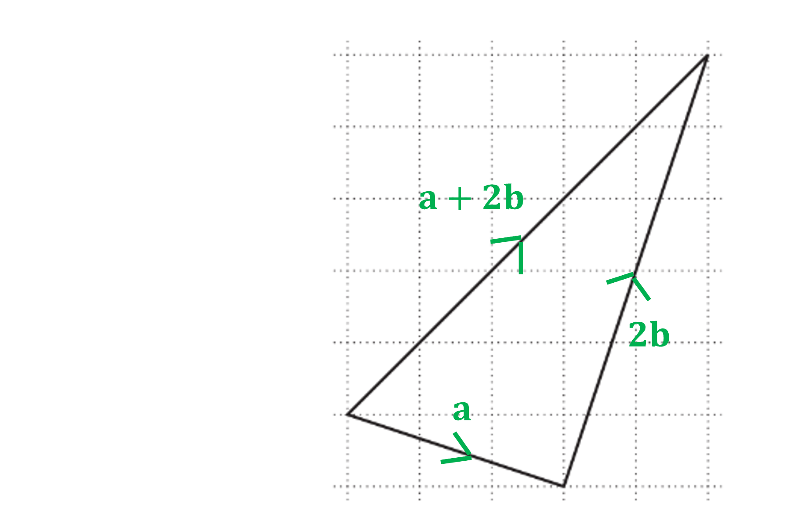

**correct vector arrows on ****a**** and 2****b**** ****[1] **
**correct labels on ****a**** and 2****b**** [1] **
**correct label and arrow on ****a**** + 2****b**** [1]**

## Q35 — very_hard — 3 marks · exam-questions

### 27() — 3 marks
*Two vectors, **p** and **q**, are parallel if they are scalar multiples of each other (**p** = **k**q** where **k** is a constant)* 
*Find vector *$\overset{\rightarrow}{PQ}$* in terms of **a**, **b** and** c **(by going from **P** to **S **to **R** to **Q**)* * *

$\overset{\rightarrow}{PQ}=a+b+c$

**[1]**

*Write the vector *$\overset{\rightarrow}{XY}$* as a journey from **X** to **S** to **R** to **Q* * *

$\overset{\rightarrow}{XY}=\overset{\rightarrow}{XS}+\overset{\rightarrow}{SR}+\overset{\rightarrow}{RY}$ * *

$\overset{\rightarrow}{XS}$* is two-thirds of *$\overset{\rightarrow}{PS}$*, *$\overset{\rightarrow}{SR}=b$* and *$\overset{\rightarrow}{RY}$* is two-thirds of *$\overset{\rightarrow}{RQ}$ * *

`table row cell stack X Y with rightwards arrow on top end cell equals cell stack X S with rightwards arrow on top plus stack S R with rightwards arrow on top plus stack R Y with rightwards arrow on top end cell row blank equals cell 2 over 3 stack P S with rightwards arrow on top plus bold b plus 2 over 3 stack R Q with rightwards arrow on top end cell row blank equals cell 2 over 3 bold a plus bold b plus 2 over 3 bold c end cell end table`

**[1]**

*Factorise out *$\frac{2}{3}$* to see if *$\overset{\rightarrow}{XY}$* can be written as a scalar multiple of *$\overset{\rightarrow}{PQ}=a+b+c$ * *

`table row cell stack X Y with rightwards arrow on top end cell equals cell 2 over 3 open parentheses bold a plus 3 over 2 bold b plus bold c close parentheses end cell row blank not equal to cell 2 over 3 stack P Q with rightwards arrow on top end cell end table`

**No they are not parallel as **$\overset{\rightarrow}{XY}$** is not a scalar multiple of **$\overset{\rightarrow}{PQ}$* ***[1]**

**The factorisation step is not compulsory, but answers must reference ****XY**** not being a multiple of ****PQ**** **

## Q36 — hard — 1 marks · exam-questions

### 23() — 1 marks
*It helps to find *$\overset{\rightarrow}{QR}$*first*
* *$\overset{\rightarrow}{PQ}$* and *$\overset{\rightarrow}{QR}$* are parallel and in the same direction (so must have the same sign)* 
*PQ** : **QR** = 3 : 1  = *$1:\frac{1}{3}$

$\overset{\rightarrow}{PQ}:\overset{\rightarrow}{QR}=a:\frac{1}{3}a$

> $\overset{\rightarrow}{QR}=\frac{1}{3}a$* *
*This helps to find *$\overset{\rightarrow}{RQ}$*, as it is the negative of *$\overset{\rightarrow}{QR}$* (opposite directions)*

> $\overset{\rightarrow}{RQ}=-\overset{\rightarrow}{QR}=-\frac{1}{3}a$*  *

> *The** third option** is correct*

$\overset{\rightarrow}{RQ}=-\frac{1}{3}a$ **[1]**

## Q37 — medium — 3 marks · exam-questions

### 20((a)) — 3 marks
> *Any multiple of *`open parentheses table row 2 row 1 end table close parentheses`* is parallel to *`open parentheses table row 2 row 1 end table close parentheses`*, *

`open parentheses table row 4 row 2 end table close parentheses comma space open parentheses table row 6 row 3 end table close parentheses comma space open parentheses table row 8 row 4 end table close parentheses comma space...`

**any multiple of**** **`open parentheses table row 2 row 1 end table close parentheses`** ****seen**** [1]**

*Find a vector, **b**, such that *`bold b plus open parentheses table row 5 row 2 end table close parentheses`* is a multiple of *`open parentheses table row 2 row 1 end table close parentheses`

`open parentheses table row 1 row 1 end table close parentheses plus open parentheses table row 5 row 2 end table close parentheses equals open parentheses table row 6 row 3 end table close parentheses`* which is a multiple of* `open parentheses table row 2 row 1 end table close parentheses`

*Find another vector, **b**, that gives a different multiple*

`open parentheses table row 3 row 2 end table close parentheses plus open parentheses table row 5 row 2 end table close parentheses equals open parentheses table row 8 row 4 end table close parentheses` *which is a multiple of *`open parentheses table row 2 row 1 end table close parentheses`*  *

`begin bold style stretchy left parenthesis table row 1 row 1 end table stretchy right parenthesis end style`** ****and**** **`stretchy left parenthesis table row 3 row 2 end table stretchy right parenthesis`* ***[2]**

**any two that work, for example **`open parentheses table row 5 row 3 end table close parentheses comma space open parentheses table row cell negative 1 end cell row 0 end table close parentheses comma space open parentheses table row cell negative 3 end cell row cell negative 1 end cell end table close parentheses comma space open parentheses table row cell negative 7 end cell row cell negative 3 end cell end table close parentheses comma space open parentheses table row cell negative 9 end cell row cell negative 4 end cell end table close parentheses comma space open parentheses table row cell negative 11 end cell row cell negative 5 end cell end table close parentheses comma space open parentheses table row cell negative 13 end cell row cell negative 6 end cell end table close parentheses comma space open parentheses table row cell negative 15 end cell row cell negative 7 end cell end table close parentheses`

## Q38 — very_hard — 3 marks · exam-questions

### 26() — 3 marks
*If **BCDE** is a parallelogram, then the vector *$\overset{\rightarrow}{BC}$* must be equal and parallel to *$\overset{\rightarrow}{ED}$ 
*Find *$\overset{\rightarrow}{BC}$* by going from **B** to **A** to **E** to **C* * *

`table row cell stack B C with rightwards arrow on top end cell equals cell stack B A with rightwards arrow on top plus stack A E with rightwards arrow on top plus stack E C with rightwards arrow on top end cell row blank equals cell bold a plus 2 bold b plus open parentheses bold b minus 2 bold a close parentheses end cell end table`

**[1]**

*Expand and simplify* * *

`table row cell stack B C with rightwards arrow on top end cell equals cell bold a plus 2 bold b plus bold b minus 2 bold a end cell row blank equals cell negative bold a plus 3 bold b end cell end table`

**[1]**

*Find *$\overset{\rightarrow}{ED}$* by making *$\overset{\rightarrow}{DE}$* negative* * *

`table row cell stack E D with rightwards arrow on top end cell equals cell negative stack D E with rightwards arrow on top end cell row blank equals cell negative open parentheses bold a minus 3 bold b close parentheses end cell row blank equals cell negative bold a plus 3 bold b end cell end table`

$\overset{\rightarrow}{BC}=\overset{\rightarrow}{ED}$** so ****BC**** and ****ED**** are parallel and equal in length, making ****BCDE**** a parallelogram**** [1]**

**This question can also be done by showing **$\overset{\rightarrow}{BE}=\overset{\rightarrow}{CD}$

## Q39 — hard — 4 marks · exam-questions

### 11((a)) — 2 marks
*Add the top rows and add the bottom rows*

`open parentheses table row 6 row cell negative 10 end cell end table close parentheses plus open parentheses table row cell negative 1 end cell row 2 end table close parentheses plus open parentheses table row cell negative 4 end cell row 7 end table close parentheses
equals open parentheses table row cell 6 minus 1 minus 4 end cell row cell negative 10 plus 2 plus 7 end cell end table close parentheses`

**top or bottom correct ****[1]**

> *Give your final answer as a vector*

`stretchy left parenthesis table row 1 row cell negative 1 end cell end table stretchy right parenthesis` **[1]**

### 11((b)) — 2 marks
> *To show two vectors, **p** and **q**, are parallel, show that **p** is a scalar multiple of **q**, i.e. **p** = **k**q *
*Work out **a** + 2**c*

`table row cell bold a plus 2 bold c end cell equals cell open parentheses table row 6 row cell negative 10 end cell end table close parentheses plus 2 open parentheses table row cell negative 4 end cell row 7 end table close parentheses end cell row blank equals cell open parentheses table row 6 row cell negative 10 end cell end table close parentheses plus open parentheses table row cell negative 8 end cell row 14 end table close parentheses end cell row blank equals cell open parentheses table row cell 6 minus 8 end cell row cell negative 10 plus 14 end cell end table close parentheses end cell row blank equals cell open parentheses table row cell negative 2 end cell row 4 end table close parentheses end cell end table`

**[1]**

*Show that **a** + 2**c** is a multiple of** b**, for example by factorising out a 2 from top-and-bottom*

`table row cell bold a plus 2 bold c end cell equals cell open parentheses table row cell negative 2 end cell row 4 end table close parentheses equals 2 open parentheses table row cell negative 1 end cell row 2 end table close parentheses equals 2 bold b end cell end table`

**a + 2c = 2b, so a + 2c is a scalar multiple of b, which makes a + 2c and b parallel**** [1]**

## Q40 — medium — 1 marks · exam-questions

### 2() — 1 marks
*The vector *`open parentheses table row a row b end table close parentheses`* means **a** units to the right and **b** units up*

*The arrow moves 3 units right, and 2 units down*

**The**** third ****option****, **`stretchy left parenthesis table row 3 row cell negative 2 end cell end table stretchy right parenthesis`** ****is therefore correct** **[1]**

> *The first option would mean 3 units right, and 2 units upwards*

> *The second option would mean 3 units left and 2 units upwards*

> *The fourth option would mean 3 units left and 2 units down*

## Q41 — very_hard — 4 marks · exam-questions

### 20() — 4 marks
*Find 2**m** by multiplying each component in **m** by 2* * *

`table row cell 2 bold m end cell equals cell 2 open parentheses table row 2 row k end table close parentheses end cell row blank equals cell open parentheses table row 4 row cell 2 k end cell end table close parentheses end cell end table`

**[1]**

*Find 2**m** + **n** by adding the components* * *

`table attributes columnalign right center left columnspacing 0px end attributes row cell 2 bold m plus bold n end cell equals cell open parentheses table row 4 row cell 2 k end cell end table close parentheses plus open parentheses table row 3 row 11 end table close parentheses end cell row blank equals cell open parentheses table row 7 row cell 2 k plus 11 end cell end table close parentheses end cell end table`

**[1]**

*This vector needs to be parallel to *`open parentheses table row 1 row cell negative 1 end cell end table close parentheses` * *

*Method 1* 
*The vector *`open parentheses table row 1 row cell negative 1 end cell end table close parentheses`* means 1 step to the right then 1 step down* 
*The vector *`open parentheses table row 7 row cell 2 k plus 11 end cell end table close parentheses`* means 7 steps to the right then (2**k** + 11) steps up* 
*Make these directions match, by forcing (2k + 11) to represents 7 steps down* * *

$2k+11=-7$

**[1]**

> *Solve this equation to find **k  *

$2k=-18\,k=-9$

**k ****= -9*** ***[1]**

*Method 2* 
*Two vectors, **p **and **q**, are parallel if they are scalar multiples, **p** = **b**q**  *

> `open parentheses table row 7 row cell 2 k plus 11 end cell end table close parentheses equals b open parentheses table row 1 row cell negative 1 end cell end table close parentheses equals open parentheses table row b row cell negative b end cell end table close parentheses`*  *

> *Read off two simultaneous equations  *

$7=b$*  and ** *$2k+11=-b$*  *

> *Substitute the first equation into the second equation  *

$2k+11=-7$

**[1]**

> *Solve this equation to find **k  *

$2k=-18\,k=-9$

**k ****= -9*** ***[1]**

## Q42 — hard — 3 marks · exam-questions

### 23() — 3 marks
*To show** BCD** is a straight line using vectors, find *$\overset{\rightarrow}{BC}$* and *$\overset{\rightarrow}{BD}$* and show that they are parallel* 
*Find **B** to **C** by going from **B** to **A** to **C* * *

$\overset{\rightarrow}{BC}=\overset{\rightarrow}{BA}+\overset{\rightarrow}{AC}$* *

> *A** to **C** is the negative of **C** to **A**  *

`table row cell stack B C with rightwards arrow on top end cell equals cell stack B A with rightwards arrow on top plus stack A C with rightwards arrow on top end cell row blank equals cell stack B A with rightwards arrow on top minus stack C A with rightwards arrow on top end cell row blank equals cell open parentheses 5 bold a minus 2 bold b close parentheses minus open parentheses 3 bold a plus bold b close parentheses end cell end table`

> *Expand and simplify*

`table row cell stack B C with rightwards arrow on top end cell equals cell open parentheses 5 bold a minus 2 bold b close parentheses minus open parentheses 3 bold a plus bold b close parentheses end cell row blank equals cell 5 bold a minus 2 bold b minus 3 bold a minus bold b end cell row blank equals cell 2 bold a minus 3 bold b end cell end table`

**[1]*** *

*Find **B** to **D** by going from **B** to **A** to **D* * *

`stack B D with rightwards arrow on top equals stack B A with rightwards arrow on top plus stack A D with rightwards arrow on top
equals open parentheses 5 bold a minus 2 bold b close parentheses plus open parentheses 3 bold a minus 9 bold b close parentheses`* *

> *Expand and simplify*

`table row cell stack B D with rightwards arrow on top end cell equals cell open parentheses 5 bold a minus 2 bold b close parentheses plus open parentheses 3 bold a minus 9 bold b close parentheses end cell row blank equals cell 5 bold a minus 2 bold b plus 3 bold a minus 9 bold b end cell row blank equals cell 8 bold a minus 11 bold b end cell end table`

**[1]*** *

`table row cell stack B D with rightwards arrow on top end cell equals cell 8 bold a minus 11 bold b end cell end table`* and *`table row cell stack B C with rightwards arrow on top end cell equals cell 2 bold a minus 3 bold b end cell end table`* Two vectors, **p** and **q**, are parallel is one can be written as a scalar multiple of the other, **p** = **k**q* $\overset{\rightarrow}{BD}$* and *$\overset{\rightarrow}{BC}$* cannot be written in the form *$\overset{\rightarrow}{BD}=k\overset{\rightarrow}{BC}$*, for example* * *

`table row cell 4 stack B C with rightwards arrow on top end cell equals cell 4 open parentheses 2 bold a minus 3 bold b close parentheses equals 8 bold a minus 12 bold b not equal to stack B D with rightwards arrow on top end cell end table` * *

**No, **`table row blank blank cell stack bold italic B bold italic C with bold rightwards arrow on top end cell end table`** is not a scalar multiple of **`table row blank blank cell stack bold italic B bold italic D with bold rightwards arrow on top end cell end table`** ****[1]**

**This question could also be done by showing **$\overset{\rightarrow}{BC}$** ****is not a scalar multiple of **$\overset{\rightarrow}{CD}$

## Q43 — medium — 1 marks · exam-questions

### 17() — 1 marks
> *Work out **a** - 3**b **as follows*

`table attributes columnalign right center left columnspacing 0px end attributes row cell bold a minus 3 bold b end cell equals cell open parentheses table row cell negative 3 end cell row 2 end table close parentheses minus 3 open parentheses table row 1 row cell negative 5 end cell end table close parentheses end cell row blank equals cell open parentheses table row cell negative 3 end cell row 2 end table close parentheses minus open parentheses table row 3 row cell negative 15 end cell end table close parentheses end cell row blank equals cell open parentheses table row cell negative 3 minus 3 end cell row cell 2 minus negative 15 end cell end table close parentheses end cell row blank equals cell open parentheses table row cell negative 6 end cell row 17 end table close parentheses end cell end table`

**The ****first**** option is therefore correct, **`stretchy left parenthesis table row cell negative 6 end cell row 17 end table stretchy right parenthesis`** [1]**

## Q44 — very_hard — 5 marks · exam-questions

### 15() — 5 marks
*OCD is a straight line if *$\overset{\rightarrow}{\mathrm{OC}}$* and *$\overset{\rightarrow}{\mathrm{OD}}$* are parallel* 
*To find *$\overset{\rightarrow}{\mathrm{OC}}$*, you can go from O to A to C* 
*To help with this journey, find *$\overset{\rightarrow}{\mathrm{AB}}$* first, by going from A to O to B* * *

$\overset{\rightarrow}{\mathrm{AB}}=-3a+3b$

**[1]**

*A to C is two-thirds of A to B* 
*Find *$\overset{\rightarrow}{\mathrm{OC}}$* * * *

`table row cell OC with rightwards arrow on top end cell equals cell OA with rightwards arrow on top plus AC with rightwards arrow on top end cell row blank equals cell OA with rightwards arrow on top plus 2 over 3 AB with rightwards arrow on top end cell row blank equals cell 3 bold a plus fraction numerator space 2 space over denominator 3 end fraction open parentheses negative 3 bold a plus 3 bold b close parentheses end cell end table`

**[1]**

*Expand and simplify* * *

`table row cell OC with rightwards arrow on top end cell equals cell 3 bold a minus 2 bold a plus 2 bold b end cell row blank equals cell bold a plus 2 bold b end cell end table`

**[1]**

*Find *`table row blank blank cell OD with rightwards arrow on top end cell end table`* by going from O to B to D* * *

`table row cell OD with rightwards arrow on top end cell equals cell OB with rightwards arrow on top plus BD with rightwards arrow on top end cell row blank equals cell 3 bold b plus open parentheses 2 bold a plus bold b close parentheses end cell end table`

**[1]**

*Expand and simplify* * *

`table row cell OD with rightwards arrow on top end cell equals cell 3 bold b plus 2 bold a plus bold b end cell row blank equals cell 4 bold b plus 2 bold a end cell end table` * *

*Two vectors, **p** and **q**, are parallel if they are scalar multiples of each other, **p** = **k**q* 
*Show that *`table row blank blank cell OD with rightwards arrow on top end cell end table`* is a scalar multiple of *`table attributes columnalign right center left columnspacing 0px end attributes row blank blank cell OB with rightwards arrow on top end cell end table`* (by factorising out a 2)* * *

`table row cell OD with rightwards arrow on top end cell equals cell 2 open parentheses 2 bold b plus bold a close parentheses equals 2 OC with rightwards arrow on top end cell end table` * *

`table attributes columnalign right center left columnspacing 0px end attributes row cell bold OD with bold rightwards arrow on top end cell bold equals cell bold 2 bold OC with bold rightwards arrow on top end cell end table`* ***so OD and OC are ****parallel**** and share a common point, O, so**** OCD is a straight line*** ***[1]**

## Q45 — hard — 5 marks · exam-questions

### 20((b)) — 5 marks
*This is a vector equation.* 
*m** and **n** are scalars.*

*The 'top row' would give as an equation in **m** and **n** by considering the **x**-direction of the vector.* 
*The 'bottom row' would give us an equation in **m** and **n** by considering the **y**-direction of the vector.*

`table attributes columnalign right center left columnspacing 0px end attributes row cell 4 m plus 5 n end cell equals 12 row cell m plus 2 n end cell equals 6 end table`

**One for each equation ****[2]**

> *As **m** is already isolated in the second equation, the easiest method to solve these equations simultaneously would be to rearrange the second to make **m** the subject, and then substitute that into the first equation.*

$m=6-2n$

`therefore 4 open parentheses 6 minus 2 n close parentheses plus 5 n equals 12`

**[1]**

> *Expand, simplify and solve this equation to find **n**.*

`table row cell 24 minus 8 n plus 5 n end cell equals 12 row cell 24 minus 3 n end cell equals 12 row cell 3 n end cell equals 12 row n equals 4 end table`

**[1]**

> *Substitute **n** = 4 into either of the original equations (second one is easiest) to find **m**.*

`table attributes columnalign right center left columnspacing 0px end attributes row cell m plus 2 open parentheses 4 close parentheses end cell equals 6 row m equals cell 6 minus 8 end cell row m equals cell negative 2 end cell end table`

$\thereforem=-2,n=4$** ****[1]**

## Q46 — medium — 3 marks · exam-questions

### 11((a)) — 2 marks
*Calculate 2**a** and **a** + **b* * *

`2 bold a equals 2 open parentheses table row 2 row 1 end table close parentheses equals open parentheses table row 4 row 2 end table close parentheses`*  **and  *`bold a plus bold b equals open parentheses table row 2 row 1 end table close parentheses plus open parentheses table row cell negative 2 end cell row 1 end table close parentheses equals open parentheses table row 0 row 2 end table close parentheses` * *

*Draw these two vectors* * *

*2****a**** is 4 units right and 2 units up*
***a**** + ****b**** is 0 units right and 2 units up* * *

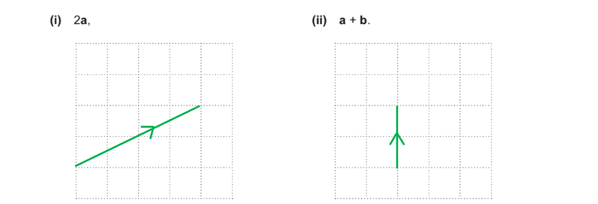

**each correct with direction arrows**** [2]**

### 11((b)) — 1 marks
*Vector **a** goes 4 units to the right and 2 units up whereas vector **b** goes 2 units to the left and 1 unit up*

**they are in different directions** **[1]**

## Q47 — very_hard — 3 marks · exam-questions

### 16((c)) — 3 marks
*Two vectors, **p** and **q**, are parallel if they are scalar multiples of each other, **p** = **k**q* 
*You need to show that *$\overset{\rightarrow}{\mathrm{EF}}$* is a scalar multiple of *$\overset{\rightarrow}{\mathrm{AG}}$
*To find *$\overset{\rightarrow}{\mathrm{EF}}$*, go from E to B to F (and use that E to B is a quarter of A to B)  *

> `EF with rightwards arrow on top equals EB with rightwards arrow on top plus BF with rightwards arrow on top
equals 1 fourth AB with rightwards arrow on top plus 1 half BC with rightwards arrow on top
equals 1 fourth open parentheses bold b minus bold a close parentheses plus 1 half bold b`*  *

> *Expand and simplify  *

`table row cell EF with rightwards arrow on top end cell equals cell 1 fourth bold b minus 1 fourth bold a plus 1 half bold b end cell row blank equals cell negative 1 fourth bold a plus 3 over 4 bold b end cell end table`

**[1]**

> *To find *$\overset{\rightarrow}{\mathrm{AG}}$* go from A to D to G  *

> `table row cell AG with rightwards arrow on top end cell equals cell AD with rightwards arrow on top plus DG with rightwards arrow on top end cell row blank equals cell AD with rightwards arrow on top plus 1 half AB with rightwards arrow on top end cell row blank equals cell bold b plus 1 half open parentheses bold b minus bold a close parentheses end cell end table`*  *

> *Expand and simplify  *

`table row cell AG with rightwards arrow on top end cell equals cell bold b plus 1 half bold b minus 1 half bold a end cell row blank equals cell negative 1 half bold a plus 3 over 2 bold b end cell end table`

**[1]**

> *Show that *$\overset{\rightarrow}{\mathrm{EF}}$*  is a scalar multiple of *$\overset{\rightarrow}{\mathrm{AG}}$* (by factorising out a half)  *

`table row cell EF with rightwards arrow on top end cell equals cell 1 half open parentheses negative 1 half bold a plus 3 over 2 bold b close parentheses equals 1 half AG with rightwards arrow on top end cell end table`

`table row blank blank cell bold EF with bold rightwards arrow on top end cell end table bold equals bold 1 over bold 2 table row blank blank cell stack bold A bold G with bold rightwards arrow on top end cell end table`** so **`table row blank blank cell bold EF with bold rightwards arrow on top end cell end table`** and **`table row blank blank cell bold AG with bold rightwards arrow on top end cell end table`** are parallel ****[1]**

## Q48 — hard — 3 marks · exam-questions

### 10() — 3 marks
*The vector **a** + 2**b** is the same as **a** + **b** + **b* 
*Draw the vectors **a**, followed by **b**, followed by **b** again on the grid as shown (vectors must have arrows and labels)*

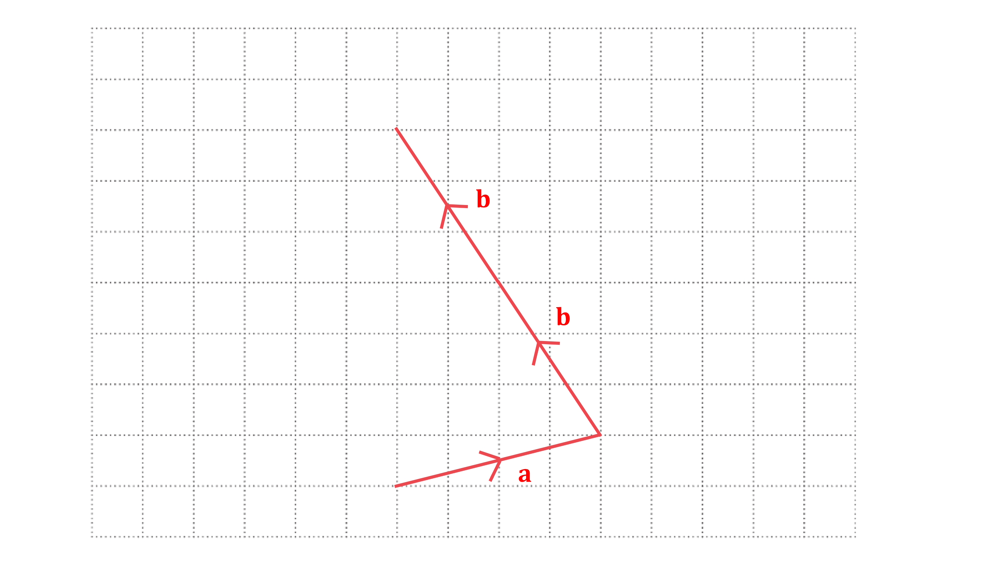

* The vector **a** + 2**b** connects the start to the finish, which in this case goes vertically upwards* 
*Draw this vector on and measure its lengths by counting squares*

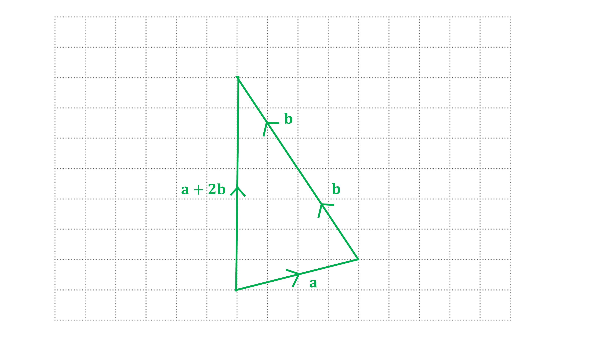

**Final answer:** **The length of a + 2b is 7 cm**

**2****b**** drawn correctly**** [1]** 
**2****b**** correctly connected to ****a**** [1]** 
**fully correct triangle drawn with ****a**** + 2****b**** labelled and with correct vector arrow**** [1]**

## Q49 — medium — 3 marks · exam-questions

### 1((b)) — 3 marks
*Geometrically, **c** is 3 lots of **a* 
*d** is **a** followed by **b* 
*e** is **a** followed by the reverse direction of **b** (which is -**b**)*

**c = 3a ****[1]** 
**d = a + b ****[1]** 
**e = a - b ****[1]**

## Q50 — hard — 2 marks · exam-questions

### 11((c)) — 2 marks
*Find **a** - **b** by subtracting components* * *

`bold a minus bold b equals open parentheses table row 2 row 1 end table close parentheses minus open parentheses table row cell negative 2 end cell row 1 end table close parentheses equals open parentheses table row 4 row 0 end table close parentheses` * *

*Substitute **a** - **b** and **c** into **k**(**a** - **b**) = **c* * *

`k open parentheses table row 4 row 0 end table close parentheses equals open parentheses table row cell negative 12 end cell row 0 end table close parentheses`

**[1]**

*Multiply the components on the left by **k* * *

`open parentheses table row cell 4 k end cell row 0 end table close parentheses equals open parentheses table row cell negative 12 end cell row 0 end table close parentheses` * *

*Read off the equation from the top components and solve it*

`table row cell 4 k end cell equals cell negative 12 end cell row k equals cell negative 12 over 4 end cell end table`

**k**** = -3**** ****[1]**

## Q51 — hard — 5 marks · exam-questions

### 18() — 5 marks
*Two vectors, **p** and **q**, are parallel if they are scalar multiples of each other, **p** = **k**q* 
*You need to show that *$\overset{\rightarrow}{\mathrm{PQ}}$* is a scalar multiple of *$\overset{\rightarrow}{\mathrm{SR}}$ 
*To find *$\overset{\rightarrow}{\mathrm{PQ}}$* you can go from P to X to Q  *

`table row cell PQ with rightwards arrow on top end cell equals cell PX with rightwards arrow on top plus XQ with rightwards arrow on top end cell row blank equals cell bold a plus bold b end cell end table`

**[1]**

> *To find *$\overset{\rightarrow}{\mathrm{SR}}$* you can go from S to Z to R*
* It helps to find *$\overset{\rightarrow}{\mathrm{ZY}}$* first, by going from Z to S to O to P to X to Q to Y  *

`table row cell ZY with rightwards arrow on top end cell equals cell ZS with rightwards arrow on top plus SO with rightwards arrow on top plus OP with rightwards arrow on top plus PX with rightwards arrow on top plus XQ with rightwards arrow on top plus QY with rightwards arrow on top end cell row blank equals cell negative bold c minus bold c plus bold a plus bold a plus bold b plus bold b end cell row blank equals cell negative 2 bold c plus 2 bold a plus 2 bold b end cell end table`

**[1]**

*Now use this to help find *$\overset{\rightarrow}{\mathrm{SR}}$

`table row cell SR with rightwards arrow on top end cell equals cell SZ with rightwards arrow on top plus ZR with rightwards arrow on top end cell row blank equals cell SZ with rightwards arrow on top plus 1 half ZY with rightwards arrow on top end cell row blank equals cell bold c plus 1 half open parentheses negative 2 bold c plus 2 bold a plus 2 bold b close parentheses end cell end table`

**[1]**

*Expand and simplify*

`table row cell SR with rightwards arrow on top end cell equals cell bold c minus bold c plus bold a plus bold b end cell row blank equals cell bold a plus bold b end cell end table`

**[1]**

> *The vector *$\overset{\rightarrow}{\mathrm{PQ}}$* is identical to *$\overset{\rightarrow}{\mathrm{SR}}$* so they must be parallel*

`table row cell bold PQ with bold rightwards arrow on top end cell bold equals cell bold SR with bold rightwards arrow on top end cell end table`** so PQ and SR are ****parallel ****[1]**

## Q52 — hard — 5 marks · exam-questions

### 19((a)) — 3 marks
> **[exam-tip]**
> Label vectors onto the diagram provided as you work through the question.

(i)

> *Given that C is the midpoint of **AD,** it is true that:*

$\overset{\rightarrow}{AC}=\overset{\rightarrow}{CD}$

> *Find a route for *$\overset{\rightarrow}{BD}$* using the diagram and given vectors*

$\overset{\rightarrow}{BD}=\overset{\rightarrow}{BA}+\overset{\rightarrow}{AC}+\overset{\rightarrow}{CD}\,\overset{\rightarrow}{BD}=-p+q+q$

> *Simplify by collecting terms*

$\overset{\rightarrow}{BD}=2q-p$

**[B1]**

(ii)

> *Find a route for *$\overset{\rightarrow}{MN}$* using the diagram*

$\overset{\rightarrow}{MN}=\overset{\rightarrow}{MB}+\overset{\rightarrow}{BN}$

> *Work out *$\overset{\rightarrow}{MB}$*, using AM : MB=3 : 1 to state:*

$\overset{\rightarrow}{MB}=\frac{1}{4}\overset{\rightarrow}{AB}$

> *Express  *$\overset{\rightarrow}{MB}$* in terms of p and q*

$\overset{\rightarrow}{MB}=\frac{1}{4}p$

**[M1]**

> *Work out *$\overset{\rightarrow}{BN}$*, using** N** is the midpoint of **BC** to state:*

`stack B N with rightwards arrow on top equals 1 half stack B C with rightwards arrow on top
stack B N with rightwards arrow on top equals 1 half open parentheses stack B A with rightwards arrow on top plus stack A C with rightwards arrow on top close parentheses`

> *Express *$\overset{\rightarrow}{BN}$* in terms of** p **and q*

`table row cell stack B N with rightwards arrow on top end cell equals cell 1 half open parentheses negative bold p plus bold q close parentheses end cell end table`

> *Use the calculated vectors to work out *$\overset{\rightarrow}{MN}$* in terms of p and q and simplify*

`table row cell stack M N with rightwards arrow on top end cell equals cell stack M B with rightwards arrow on top plus stack B M with rightwards arrow on top end cell row blank equals cell space 1 fourth bold p plus 1 half open parentheses negative bold p plus bold q close parentheses end cell row blank equals cell 1 fourth bold p minus 1 half bold p plus 1 half bold q end cell row blank equals cell negative 1 fourth bold p plus 1 half bold q end cell end table`

**[A1]**

$\overset{\rightarrow}{MN}=\frac{1}{2}q-\frac{1}{4}p$

### 19((b)) — 2 marks
> **[exam-tip]**
> The geometric facts most typically related to vector questions will require you to show that two vectors are either parallel, where one vector is a multiple of the other, or co-linear, where the vectors are parallel and share a common point.

> *Compare the vectors in terms of **p** and **q **for *$\overset{\rightarrow}{MN}$* and *$\overset{\rightarrow}{BD}$* to determine if one is a multiple of the other*

$\overset{\rightarrow}{BD}=2q-p$* *

$\overset{\rightarrow}{MN}=\frac{1}{2}q-\frac{1}{4}p$

> *Multiplying *$\overset{\rightarrow}{MN}$* by 4 gives *$\overset{\rightarrow}{BD}$*, therefore the vectors are parallel*

`4 open parentheses 1 half bold q minus 1 fourth bold p close parentheses equals 2 bold q minus bold p`* *

**Final answer:** **Therefore **$\overset{\rightarrow}{BD}=4\overset{\rightarrow}{MN}$** and **$\overset{\rightarrow}{BD}$** is parallel to **$\overset{\rightarrow}{MN}$

**[B1]**

**Final answer:** **As **$\overset{\rightarrow}{BD}=4\overset{\rightarrow}{MN}$** then the magnitude of **$\overset{\rightarrow}{BD}$** is four times greater than **$\overset{\rightarrow}{MN}$

**[B1]**

## Q53 — hard — 5 marks · exam-questions

### 19((a)) — 1 marks
> *Consider the pathway to get from A to N*

$\overset{\rightarrow}{AN}=\overset{\rightarrow}{AO}+\overset{\rightarrow}{OB}$

$\overset{\rightarrow}{AN}=-2a+b$

**[B1]**

### 19((b)) — 4 marks
> *Calculate the vector  *$\overset{\rightarrow}{OP}$* in two different ways  using x and y as the unknown scalars*

> *Path through A*

`stack O P with rightwards arrow on top space equals space stack O A with rightwards arrow on top plus stack A P with rightwards arrow on top
stack O P with rightwards arrow on top space equals space stack O A with rightwards arrow on top plus x stack A N with rightwards arrow on top
stack O P with rightwards arrow on top space equals space 2 bold italic a space plus space x open parentheses negative 2 bold italic a space plus space bold italic b close parentheses`

**[M1]**

> *Path  through M*

`stack O P with rightwards arrow on top space equals space stack O M with rightwards arrow on top plus stack M P with rightwards arrow on top
stack O P with rightwards arrow on top space equals space stack O M with rightwards arrow on top plus y stack M B with rightwards arrow on top
stack O P with rightwards arrow on top space equals space bold italic a space plus space y open parentheses negative bold italic a space plus space 6 bold italic b close parentheses`

**[M1]**

> *Put the two vectors for  *$\overset{\rightarrow}{OP}$* equal to each other*

`bold italic a space plus space y open parentheses negative bold italic a space plus space 6 bold italic b close parentheses space equals space 2 bold italic a space plus space x open parentheses negative 2 bold italic a space plus space bold italic b close parentheses`

> *Rewrite it to see the coefficients of **a** and **b*

`open parentheses 1 space minus space y close parentheses bold italic a space plus space 6 y bold italic b space equals space open parentheses 2 space minus space 2 x close parentheses bold italic a space plus space x bold italic b`

> *Equate coefficients to create simultaneous equations*

$a:1-y=2-2x\,b:6y=x$

**[M1]**

> *Solve simultaneously by substituting the second equation into the first*

`table row cell 1 minus y end cell equals cell 2 minus 2 open parentheses 6 y close parentheses end cell row cell 1 minus y end cell equals cell 2 minus 12 y end cell row cell 11 y space end cell equals cell space 1 end cell row cell y space end cell equals cell fraction numerator space 1 over denominator 11 end fraction end cell end table`

`table row x equals cell 6 open parentheses 1 over 11 close parentheses equals 6 over 11 end cell end table`

> *As **x** is the fraction of  *$\overset{\rightarrow}{AN}$* that gives  *$\overset{\rightarrow}{AP}$* , that means *$\overset{\rightarrow}{AP}$* is *$\frac{6}{11}$* of *$\overset{\rightarrow}{AN}$* *

> *That tells you the ratio of *$AP:PN$

$AP:PN=6:5$

**[A1]**
