# Exam Questions — Vectors
**Vectors & Transformation Geometry** · Edexcel IGCSE Maths A (Modular) (4XMAF/4XMAH) — 24/Higher Unit 2
> Source: [https://www.savemyexams.com/igcse/maths/edexcel/a-modular/24/higher-unit-2/topic-questions/vectors-and-transformation-geometry/vectors/exam-questions/](https://www.savemyexams.com/igcse/maths/edexcel/a-modular/24/higher-unit-2/topic-questions/vectors-and-transformation-geometry/vectors/exam-questions/) · 53 questions · total 208 marks

## Q1 — very_hard — 6 marks · exam-questions

### 24((a)) — 3 marks — command: write — structured — from paper November 2013 · 1MA0/1H
$OACB$ is a parallelogram.

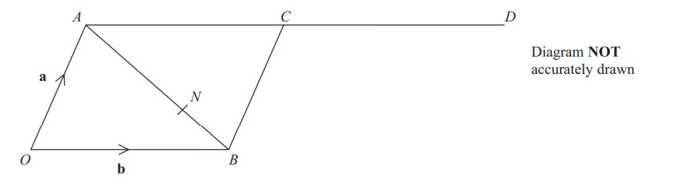

$\overset{\rightarrow}{OA}=a\mathrm{and}\overset{\rightarrow}{OB}=b$

$D$is the point such that $\overset{\rightarrow}{AC}=\overset{\rightarrow}{CD}$ 
The point $N$ divides $AB$in the ratio $2:1$

Write an expression for $\overset{\rightarrow}{ON}$ in terms of $a$and $b$.

### 24((b)) — 3 marks — command: prove — structured — from paper November 2013 · 1MA0/1H
Prove that $OND$is a straight line.

## Q2 — hard — 5 marks · exam-questions

### 28((a)) — 1 mark — command: find — structured — from paper November 2012 · 1MA0/1H
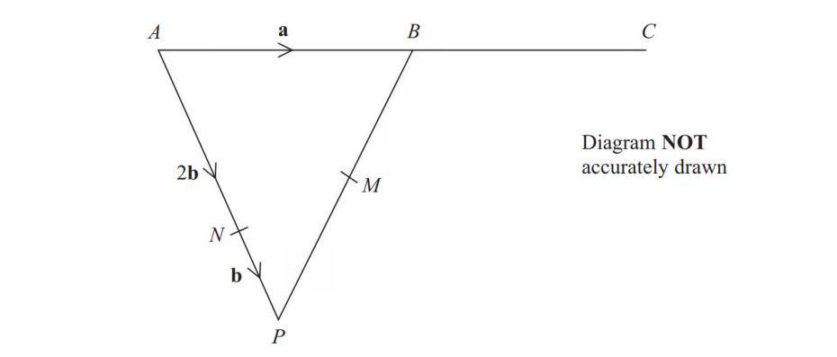

$APB$ is a triangle. 
$N$ is a point on $AP$.

$\overset{\rightarrow}{AB}=a\overset{\rightarrow}{AN}=2b\overset{\rightarrow}{NP}=b$

Find the vector $\overset{\rightarrow}{PB}$, in terms of $a$ and $b$.

### 28((b)) — 4 marks — command: show — structured — from paper November 2012 · 1MA0/1H
$B$ is the midpoint of $AC$.
 $M$ is the midpoint of $PB$.

Show that $NMC$ is a straight line.

## Q3 — medium — 3 marks · exam-questions

### 10((a)) — 1 mark — command: draw — structured — from paper June 2018 · 1MA1/2H
The vector $a$and the vector $b$ are shown on the grid.

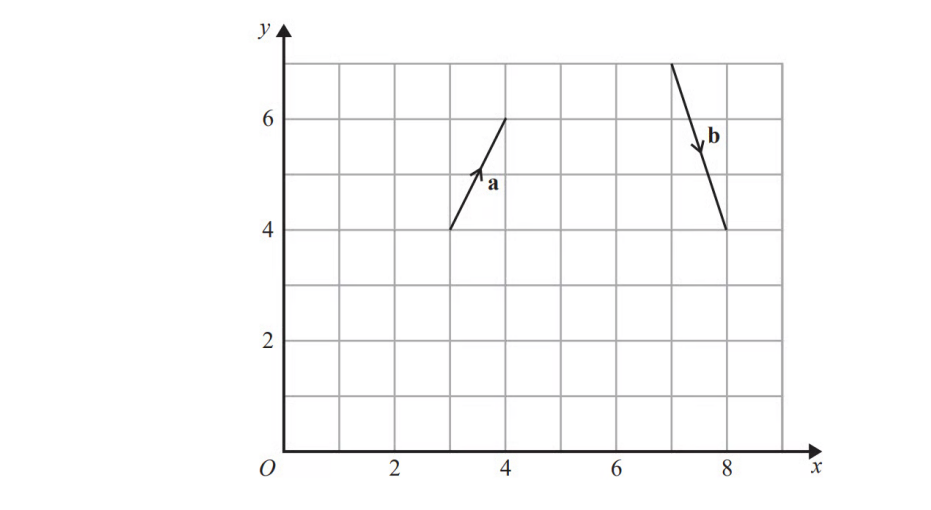

On the grid, draw and label vector $-2a$

### 10((b)) — 2 marks — command: work_out — structured — from paper June 2018 · 1MA1/2H
Work out $a+2b$ as a column vector.

## Q4 — very_hard — 4 marks · exam-questions

### 27() — 4 marks — command: express — structured — from paper June 2015 · 1MA0/2H
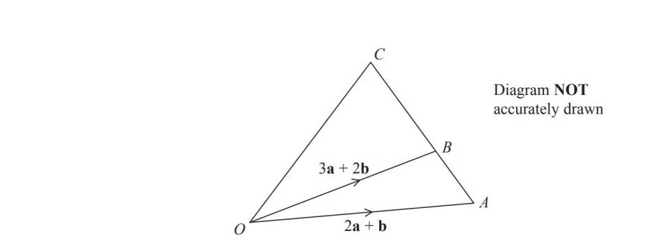

$ABC$is a straight line.

$AB:BC=2:5$

$\overset{\rightarrow}{OA}=2a+b\,\overset{\rightarrow}{OB}=3a+2b$

Express $\overset{\rightarrow}{OC}$ in terms of $a$and $b$. 
Give your answer in its simplest form.

## Q5 — hard — 6 marks · exam-questions

### 23((a)) — 2 marks — command: find — structured — from paper June 2016 · 1MA0/1H
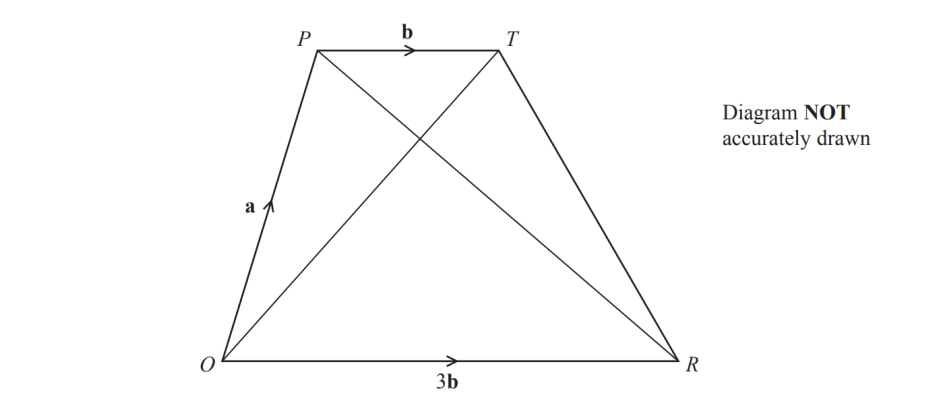

$OPTR$is a trapezium.

$\overset{\rightarrow}{OP}=a\,\overset{\rightarrow}{PT}=b\,\overset{\rightarrow}{OR}=3b$

i) Find $\overset{\rightarrow}{OT}$ in terms of $a$ and$b$

[1]

ii) Find $\overset{\rightarrow}{PR}$ in terms of $a$ and $b$ 
Give your answer in its simplest form.

[1]

### 23((b)) — 2 marks — command: find — structured — from paper June 2016 · 1MA0/1H
$S$ is the point on $PR$ such that $PS:SR$ = 1 : 3

Find $\overset{\rightarrow}{OS}$ in terms of $a$ and $b$. 
Give your answer in its simplest form.

### 23((c)) — 2 marks — command: what — structured — from paper June 2016 · 1MA0/1H
What does your answer to part (b) tell you about the position of point $S$?

## Q6 — medium — 4 marks · exam-questions

### 26((a)) — 1 mark — command: find — structured — from paper June 2012 · 1MA0/2H
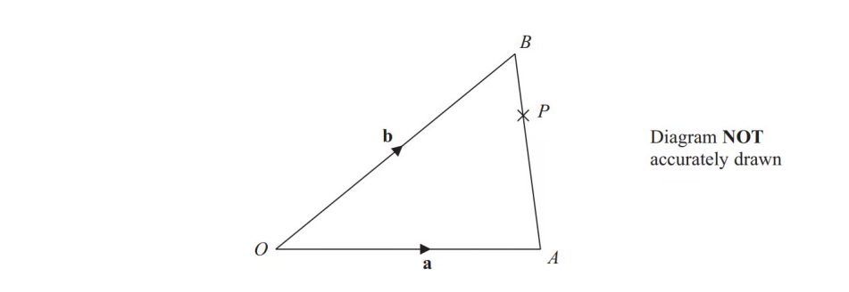

$OAB$is a triangle.

$\overset{\rightarrow}{OA}=a\,\overset{\rightarrow}{OB}=b\,$

Find  $\overset{\rightarrow}{AB}$ in terms of $a$and $b$.

### 26((b)) — 3 marks — command: find — structured — from paper June 2012 · 1MA0/2H
$P$ is the point on $AB$ such that $AP:PB=3:1$

Find $\overset{\rightarrow}{OP}$in terms of $a$ and $b$. 
Give your answer in its simplest form.

## Q7 — very_hard — 5 marks · exam-questions

### 20() — 5 marks — command: show — structured — from paper November 2015 · 1MA0/1H
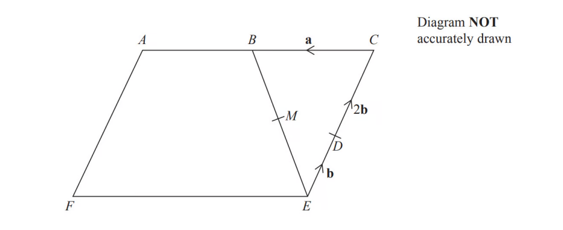

$ACEF$is a parallelogram. 
$B$ is the midpoint of $AC$. 
$M$ is the midpoint of $BE$.

$\overset{\rightarrow}{CB}=a\,\overset{\rightarrow}{ED}=b\,\overset{\rightarrow}{DC}=2b$

Show that $AMD$ is a straight line.

## Q8 — hard — 4 marks · exam-questions

### 23() — 4 marks — command: show — structured — from paper November 2016 · 1MA0/2H
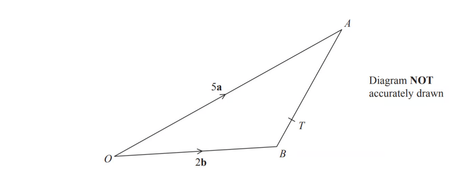

$OAB$is a triangle.
 $\overset{\rightarrow}{OA}=5a\,\overset{\rightarrow}{OB}=2b$

$T$ is the point on $AB$such that $AT:TB=5:1$

Show that $OT$is parallel to the vector $a+2b$

## Q9 — medium — 4 marks · exam-questions

### 27((a)) — 1 mark — command: write — structured — from paper June 2013 · 1MA0/1H
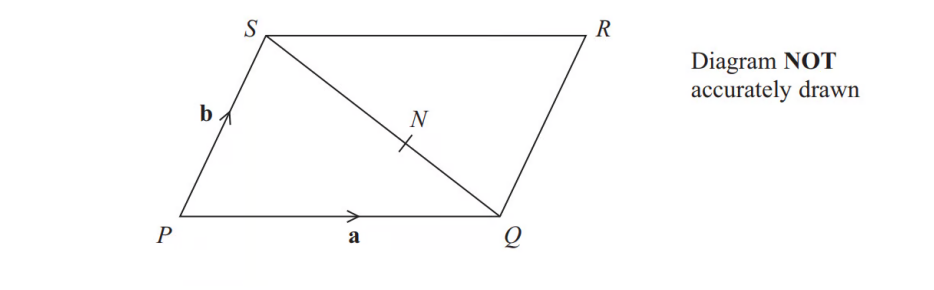

$PQRS$is a parallelogram. 
$N$ is the point on $SQ$such that $SN:NQ=3:2$

$\overset{\rightarrow}{PQ}=a\,\overset{\rightarrow}{PS}=b$

Write down, in terms of $a$and  $b$, an expression for $\overset{\rightarrow}{SQ}.$

### 27((b)) — 3 marks — command: express — structured — from paper June 2013 · 1MA0/1H
Express $\overset{\rightarrow}{NR}$ in terms of $a$ and$b$.

## Q10 — very_hard — 4 marks · exam-questions

### 19() — 4 marks — command: find — structured — from paper June 2017 · 1MA1/1H
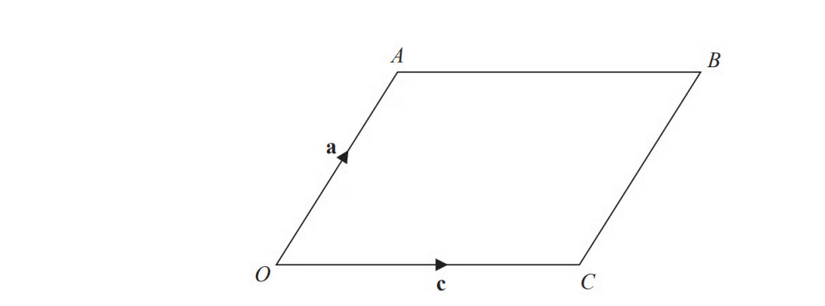

$OABC$is a parallelogram.
 $\overset{\rightarrow}{OA}=a\mathrm{and}\overset{\rightarrow}{OC}=c$

$X$ is the midpoint of the line $AC$.

$OCD$is a straight line so that $OC:CD=k:1$

Given that $\overset{\rightarrow}{XD}=3c-\frac{1}{2}a$

find the value of$k.$

## Q11 — hard — 6 marks · exam-questions

### 24((a)) — 2 marks — command: give — structured — from paper June 2017 · 1MA0/1H
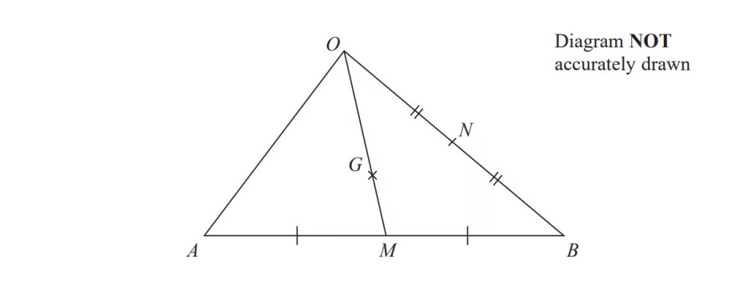

$\overset{\rightarrow}{OA}=6a$ and $\overset{\rightarrow}{OB}=6b$ 
$M$ is the midpoint of $AB$.

Write $\overset{\rightarrow}{OM}$in terms of $a$ and $b$. 
Give your answer in its simplest form.

### 24((b)) — 4 marks — command: show — structured — from paper June 2017 · 1MA0/1H
$N$ is the midpoint of $OB$. 
$G$ is the point on $OM$ such that $OG:GM$= 2 : 1

Show that $AGN$ is a straight line.

## Q12 — medium — 3 marks · exam-questions

### 24() — 3 marks — command: show — structured — from paper June 2014 · 1MA0/1H
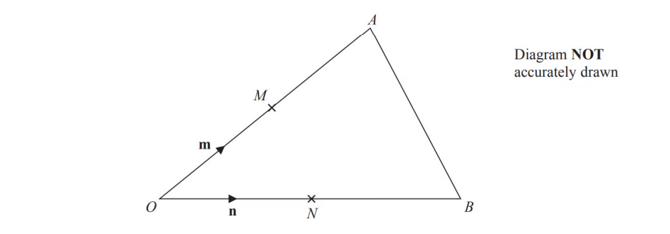

$OAB$ is a triangle. 
$M$ is the midpoint of $OA$.
 $N$ is the midpoint of $OB$.

$\overset{\rightarrow}{OM}=m\,\overset{\rightarrow}{ON}=n$

Show that $AB$is parallel to $MN$.

## Q13 — very_hard — 5 marks · exam-questions

### 21() — 5 marks — command: find — structured — from paper November 2017 · 1MA1/3H
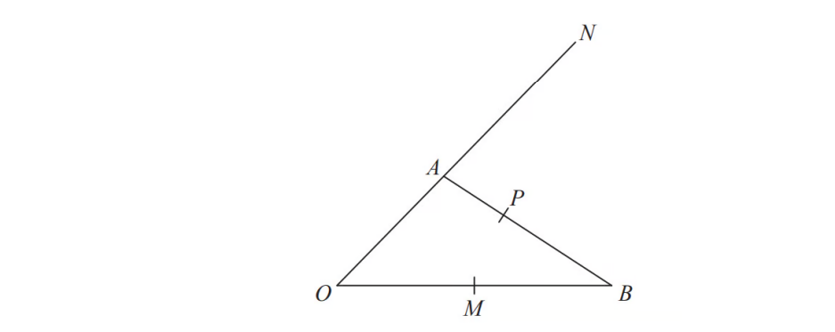

$OAN,OMB$ and $APB$are straight lines.
 $AN=2OA.$
 $M$ is the midpoint of $OB$.

$\overset{\rightarrow}{OA}=a\overset{\rightarrow}{OB}=b$

$\overset{\rightarrow}{AP}=k\overset{\rightarrow}{AB}$ where $k$ is a scalar quantity.

Given that $MPN$is a straight line, find the value of $k$.

## Q14 — hard — 5 marks · exam-questions

### 22() — 5 marks — command: prove — structured — from paper Spec1 2015 · 1MA1/1H
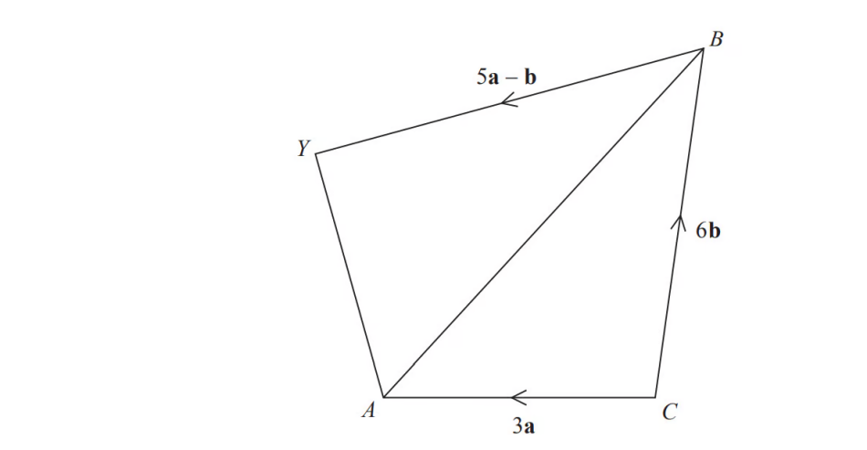

$CAYB$ is a quadrilateral.

$\overset{\rightarrow}{CA}=3a\,\overset{\rightarrow}{CB}=6b\,\overset{\rightarrow}{BY}=5a-b$

$X$ is the point on $AB$such that $AX:XB=1:2$

Prove that $\overset{\rightarrow}{CX}=\frac{2}{5}\overset{\rightarrow}{CY}$

## Q15 — medium — 5 marks · exam-questions

### 26((a)) — 1 mark — command: express — structured — from paper March 2013 · 1MA0/1H
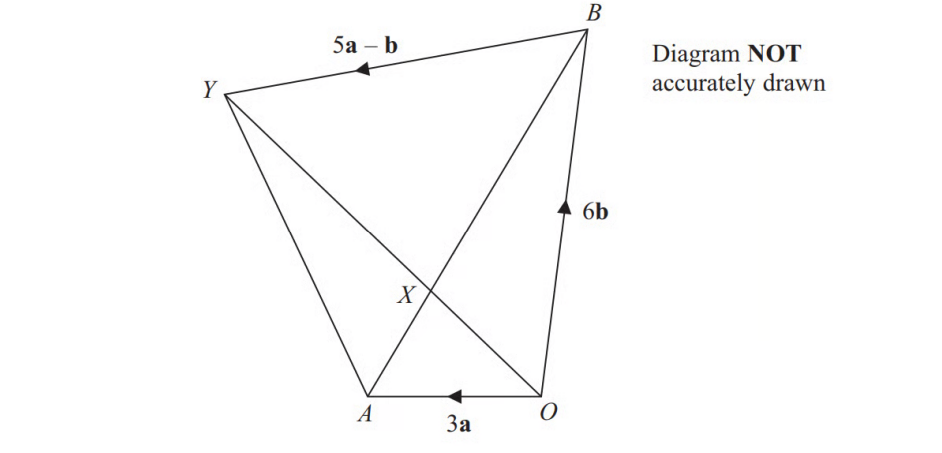

$OAYB$ is a quadrilateral.

$\overset{\rightarrow}{OA}=3a\,\overset{\rightarrow}{OB}=6b$

Express $\overset{\rightarrow}{AB}$ in terms of $a$and $b$.

### 26((b)) — 4 marks — command: prove — structured — from paper March 2013 · 1MA0/1H
$X$ is the point on$AB$such that $AX:XB=1:2$ and $\overset{\rightarrow}{BY}=5a-b$

Prove that           $\overset{\rightarrow}{OX}=\frac{2}{5}\overset{\rightarrow}{OY}$

## Q16 — very_hard — 5 marks · exam-questions

### 18() — 5 marks — command: find — structured — from paper Sample 2015 · 1MA1/3H
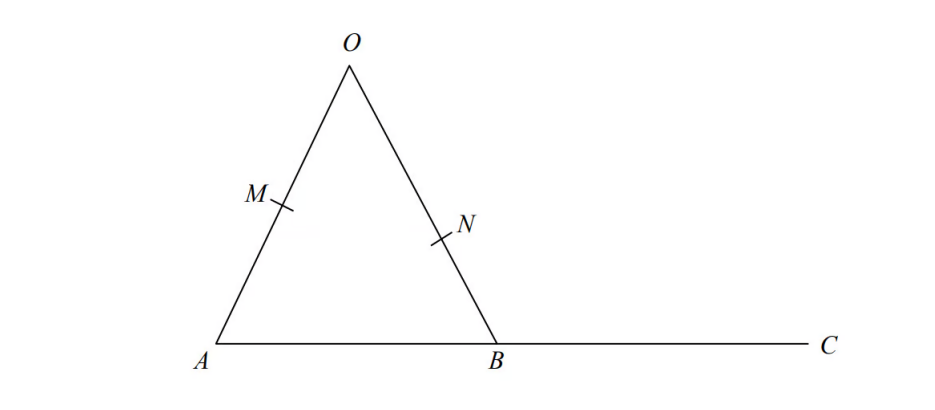

$OMA,ONB$ and $ABC$are straight lines. 
$M$ is the midpoint of $OA$. 
$B$ is the midpoint of $AC$.

$\overset{\rightarrow}{OA}=6a\overset{\rightarrow}{OB}=6b\overset{\rightarrow}{ON}=kb$ where $k$ is a scalar quantity.

Given that $MNC$is a straight line, find the value of $k$.

## Q17 — hard — 4 marks · exam-questions

### 20() — 4 marks — command: find — structured — from paper Spec2 2015 · 1MA1/3H
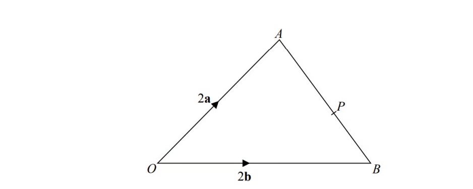

$OAB$is a triangle. $P$ is the point on $AB$such that $AP:PB=5:3$

$\overset{\rightarrow}{OA}=2a\,\overset{\rightarrow}{OB}=2b$

$\overset{\rightarrow}{OP}=k(3a+5b)$ where $k$ is a scalar quantity.

Find the value of $k$.

## Q18 — medium — 2 marks · exam-questions

### 13() — 2 marks — command: find — structured — from paper Jan 2021 · 4MA1/1HR
Here are two vectors.

`stack A B with rightwards arrow on top equals open parentheses table row 5 row 3 end table close parentheses`               `stack C B with rightwards arrow on top equals open parentheses table row cell negative 2 end cell row 4 end table close parentheses`

Find, as a column vector, $\overset{\rightarrow}{AC}$

## Q19 — very_hard — 6 marks · exam-questions

### 20((a)) — 2 marks — command: express — structured — from paper June 2019 · 1MA1/2H
$CDEF$is a quadrilateral.

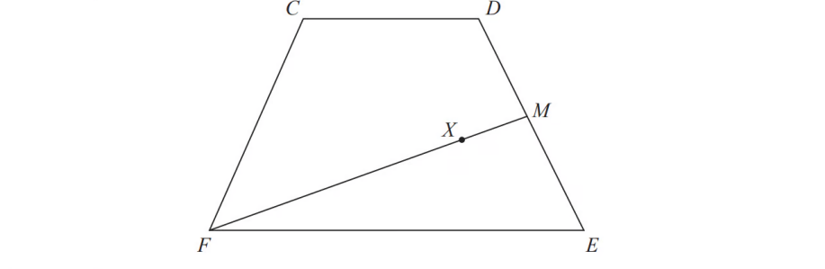

$\overset{\rightarrow}{CD}=a,\overset{\rightarrow}{DE}=b\mathrm{and}\overset{\rightarrow}{FC}=a-b.$

Express $\overset{\rightarrow}{FE}$ in terms of $a$ and/or $b$. 
Give your answer in its simplest form.

### 20((b)) — 4 marks — command: work_out — structured — from paper June 2019 · 1MA1/2H
$M$ is the midpoint of $DE$. 
$X$ is the point on $FM$such that $FX:XM=n:1$ 
$CXE$ is a straight line.

Work out the value of $n$.

## Q20 — hard — 3 marks · exam-questions

### 23() — 3 marks — command: find — structured — from paper Jan 2020 · 4MA1/2H
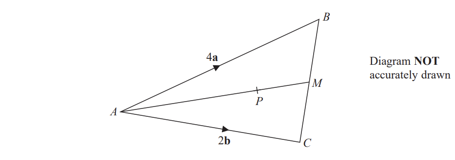

$ABC$is a triangle. 
The midpoint of $BC$is $M$. 
$P$ is a point on $AM$.

`table row cell stack A B with rightwards arrow on top space end cell equals cell space 4 bold a end cell row cell stack A C with rightwards arrow on top space end cell equals cell space 2 bold b end cell row cell stack A P with rightwards arrow on top space end cell equals cell space 3 over 2 bold a bold space plus space 3 over 4 bold b end cell end table`

Find the ratio $AP:PM$

## Q21 — medium — 1 marks · exam-questions

### 14() — 1 mark — command: simplify — structured — from paper Nov 2021 · 4MA1/1H
$ABCDEF$ and $GHIJKL$ are regular hexagons each with centre $O$.

$GHIJKL$ is an enlargement of $ABCDEF$, with centre $O$ and scale factor 2

$\overset{\rightarrow}{OA}=a\overset{\rightarrow}{OB}=b$

Write the following vectors, in terms of $a$and $b$. Simplify your answers.

i) $\overset{\rightarrow}{AB}$

[1]

ii) $\overset{\rightarrow}{KI}$

[2]

iii) $\overset{\rightarrow}{LD}$

[2]

## Q22 — very_hard — 5 marks · exam-questions

### 22() — 5 marks — command: show — structured — from paper Jan 2022 · 4MA1/1H
The diagram shows triangle $OAB$

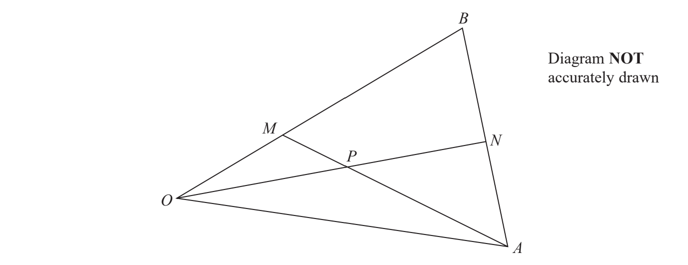

$\overset{\rightarrow}{OA}=8a$     $\overset{\rightarrow}{OB}=6b$

$M$ is the point on $OB$ such that $OM:MB=1:2$ 
$N$ is the midpoint of $AB$ 
$P$ is the point of intersection of $ON$ and $AM$

Using a vector method, find $\overset{\rightarrow}{OP}$ as a simplified expression in terms of $a$ and $b$ 
Show your working clearly.

$\overset{\rightarrow}{OP}$= ...................................

## Q23 — hard — 3 marks · exam-questions

### 25() — 3 marks — command: prove — structured — from paper Nov 2020 · 4MA1/2H
$OAB$ is a triangle.
 $\underset{OA}{\rightarrow}=a\underset{OB}{\rightarrow}=b$

The point $C$ lies on $OA$ such that $OC:CA=1:2$
 The point $D$ lies on $OB$ such that $OD:DB=1:2$

Using a vector method, prove that $ABDC$ is a trapezium.

## Q24 — medium — 4 marks · exam-questions

### 25() — 4 marks — command: find — structured — from paper Jan 2019 · 4MA1/1HR
$ABCDEF$ is a regular hexagon.

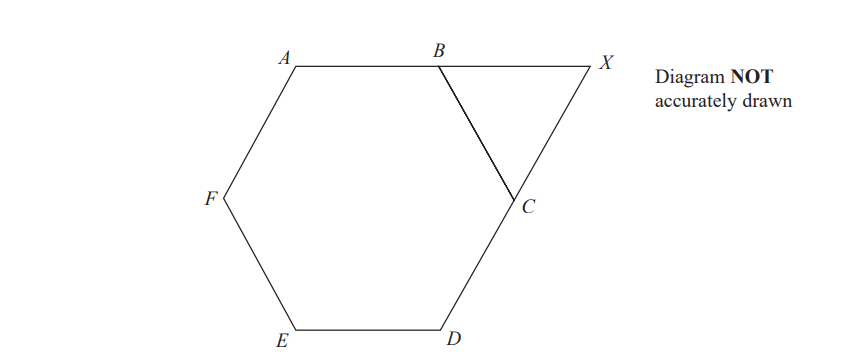

$ABX$ and $DCX$ are straight lines.

$\underset{AB}{\rightarrow}=a\underset{BC}{\rightarrow}=b$

Find $\underset{EX}{\rightarrow}$ in terms of $a$ and $b$. 
Give your answer in its simplest form.

## Q25 — very_hard — 5 marks · exam-questions

### 24() — 5 marks — command: find — structured — from paper Jan 2022 · 4MA1/1HR
$OXYZ$ is a trapezium.

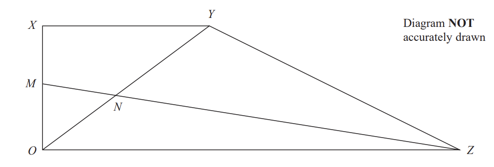

$\overset{\rightarrow}{OX}=a$

$\overset{\rightarrow}{XY}=b$

$\overset{\rightarrow}{OZ}=3b$

$M$is the midpoint of $OX$ 
$N$ is the point such that  $MNZ$ and  $ONY$ are straight lines.

Given that $ON:OY=λ:1$

use a vector method to find the value of $λ$

$λ=$ ....................................................

## Q26 — hard — 5 marks · exam-questions

### 17((a)) — 3 marks — command: work_out — structured — from paper June 2018 · 4MA1/1H
The diagram shows parallelogram $ABCD$.

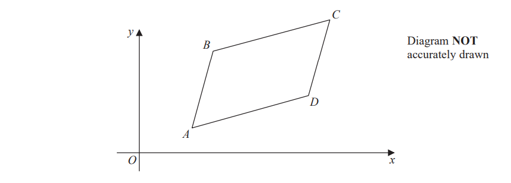

`stack A B with rightwards arrow on top equals open parentheses table row 2 row 7 end table close parentheses`       `stack A C with rightwards arrow on top equals open parentheses table row 10 row 11 end table close parentheses`

The point $B$ has coordinates (5, 8) 
Work out the coordinates of the point $C$.

### 17((b)) — 2 marks — command: prove — structured — from paper June 2018 · 4MA1/1H
The point $E$ has coordinates (63, 211) 
Use a vector method to prove that $ABE$ is a straight line.

## Q27 — medium — 3 marks · exam-questions

### 14() — 3 marks — command: find — structured — from paper June 2019 · 4MA1/2H
Here are two vectors.

`stack A B space with rightwards arrow on top space equals space open parentheses table row 6 row cell negative 9 end cell end table close parentheses`       `stack C B with rightwards arrow on top space equals space open parentheses table row 1 row 3 end table close parentheses`

Find the magnitude of $\overset{\rightarrow}{AC}$.

## Q28 — very_hard — 5 marks · exam-questions

### 26() — 5 marks — command: show — structured — from paper June 2021 · 4MA1/1H
$OACB$is a trapezium.

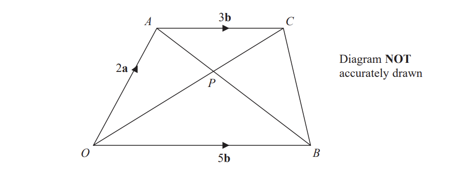

$\overset{\rightarrow}{OA}=2a$       $\overset{\rightarrow}{OB}=5b$       $\overset{\rightarrow}{AC}=3b$

The diagonals, OC and AB, of the trapezium intersect at the point $P$.

Find and simplify an expression, in terms of $a$ and $b$, for $\overset{\rightarrow}{OP}$ Show your working clearly.

$\overset{\rightarrow}{OP}=$...............................

## Q29 — hard — 5 marks · exam-questions

### 19((a)) — 3 marks — command: express — structured — from paper Specimen 2016 · 4MA1/2H
The diagram shows triangle $ABD.$

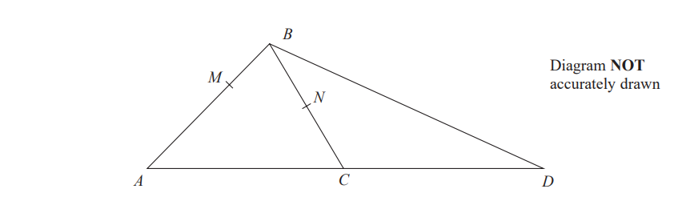

$N$ is the midpoint of $BC$.

$C$ is the midpoint of $AD$.

$M$ is the point on $AB$ such that $AM:MB=3:1$

$\overset{\rightarrow}{AB}=p$     and    $\overset{\rightarrow}{AC}=q$

Express, in terms of $p$ and $q$,

i) $\overset{\rightarrow}{BD}$

ii)$\overset{\rightarrow}{MN}$

[3]

### 19((b)) — 2 marks — command: state — structured — from paper Specimen 2016 · 4MA1/2H
State, giving reasons, two different geometric facts relating $MN$ and $BD.$

## Q30 — medium — 4 marks · exam-questions

### 7() — 2 marks — command: write — structured — from paper Nov 2020 · J560/06
Vectors $a$ and 4**b **are drawn on the grid.

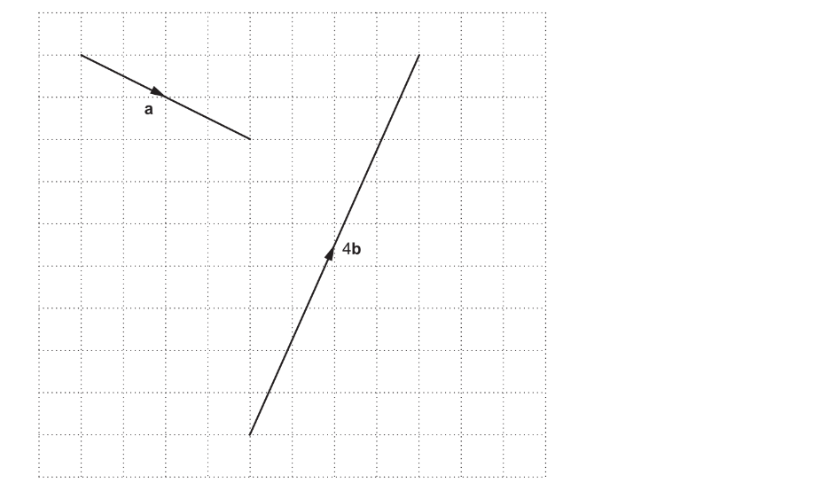

Write vector $a$ as a column vector.

### 7((b)) — 2 marks — command: find — structured — from paper Nov 2020 · J560/06
Find vector **b** as a column vector.

## Q31 — hard — 5 marks · exam-questions

### 22((a)) — 2 marks — command: multiple — structured — from paper 2023 Nov · 4MA1/2H
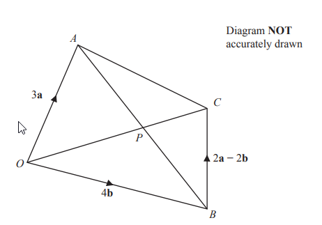

$OCAB$ is a quadrilateral.

$\overset{\rightarrow}{OA}=3a\overset{\rightarrow}{OB}=4b\overset{\rightarrow}{BC}=2a-2b$

(i)  Find the vector  $\overset{\rightarrow}{OC}$ in terms of **a** and **b**
       Simplify your answer.

(ii)  Find the vector $\overset{\rightarrow}{AB}$  in terms of **a **and **b**

### 22((b)) — 3 marks — command: show — structured — from paper 2023 Nov · 4MA1/2H
The point $P$ lies on $AB$ and on $OC$

Using a vector method, find the ratio $AP:PB$
Show your working clearly.

## Q32 — very_hard — 6 marks · exam-questions

### 27((a)) — 2 marks — command: show — structured — from paper Nov 2021 · 8300/3H
In the diagram

`table row cell stack D E with rightwards arrow on top end cell equals bold a row cell stack D H with rightwards arrow on top end cell equals bold b row cell stack H G with rightwards arrow on top end cell equals cell 8 bold b end cell row cell E X colon X H end cell equals cell 3 colon 1 end cell row cell E F colon F G end cell equals cell 1 colon 3 end cell row blank blank blank end table`

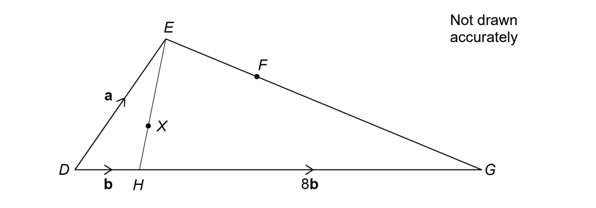

Show that  $\overset{\rightarrow}{DX}=\frac{1}{4}a+\frac{3}{4}b$

### 27((b)) — 4 marks — command: show — structured — from paper Nov 2021 · 8300/3H
Is $DXF$ a straight line?

Show working to support your answer.

## Q33 — hard — 3 marks · exam-questions

### 23() — 3 marks — command: work_out — structured — from paper Nov 2020 · 8300/3H
In triangle $JKL$

$M$ is the midpoint of $JK$ 
$JN:NL=3:2$
 $\overset{\rightarrow}{KL}=7a$      $\overset{\rightarrow}{NL}=4b$

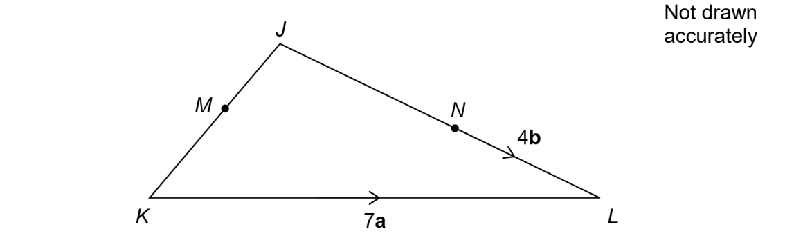

Work out $\overset{\rightarrow}{JM}$ in terms of $a$ and $b$.

Give your answer in its simplest form.

## Q34 — medium — 3 marks · exam-questions

### 9((b)) — 3 marks — command: complete — structured — from paper Nov 2019 · J560/06
Vector `bold a equals open parentheses table row 3 row cell negative 1 end cell end table close parentheses` and vector `bold b equals open parentheses table row 1 row 3 end table close parentheses`

Gavin starts to draw a diagram to show that `bold a plus 2 bold b equals open parentheses table row 5 row 5 end table close parentheses`

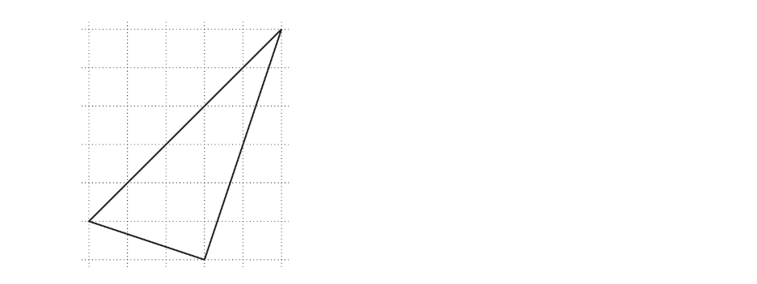

Complete Gavin’s diagram.

## Q35 — very_hard — 3 marks · exam-questions

### 27() — 3 marks — command: show — structured — from paper Nov 2019 · 8300/3H
Here is quadrilateral $PQRS$.

$\overset{\rightarrow}{PS}=a$      $\overset{\rightarrow}{SR}=b$     $\overset{\rightarrow}{RQ}=\text{c}$

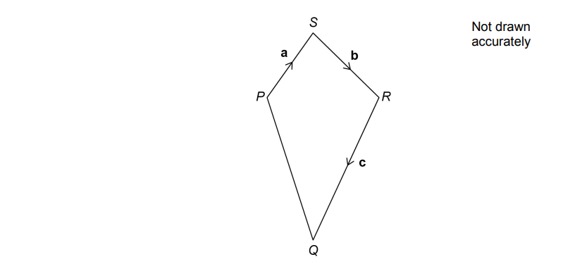

$X$ is a point on $PS$ where    $PX:XS=1:2$

$Y$ is a point on $RQ$ where         $RY:YQ=2:1$

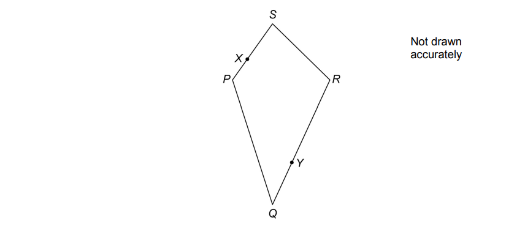

Is $XY$ parallel to $PQ$

Show working to support your answer.

## Q36 — hard — 1 marks · exam-questions

### 23() — 1 mark — command: circle — structured — from paper Nov 2018 · 8300/2H
$PQR$ is a straight line.

$PQ:QR=3:1$

$\overset{\rightarrow}{PQ}=a$

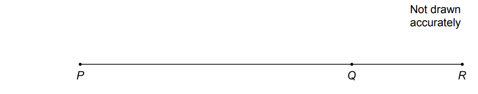

Circle the vector $\overset{\rightarrow}{RQ}$

| $\frac{1}{3}a$ | $\frac{1}{4}a$ | $-\frac{1}{3}a$ | $-\frac{1}{4}a$ |
|---|---|---|---|

## Q37 — medium — 3 marks · exam-questions

### 20((a)) — 3 marks — command: find — structured — from paper Nov 2018 · J560/06
$b$ is a vector.

Given that `bold b space plus space open parentheses table row 5 row 2 end table close parentheses` is parallel to `open parentheses table row 2 row 1 end table close parentheses` , find two possible answers for $b$.

`bold b bold space bold equals space stretchy left parenthesis table row blank row blank end table stretchy right parenthesis` or `open parentheses table row blank row blank end table close parentheses`

## Q38 — very_hard — 3 marks · exam-questions

### 26() — 3 marks — command: show — structured — from paper Nov 2017 · 8300/2H
$ABCDE$ is a pentagon.

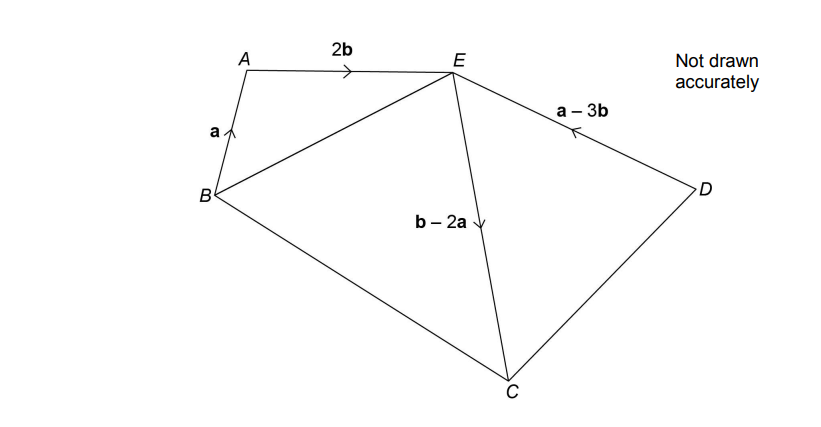

Show that $BCDE$ is a parallelogram.

## Q39 — hard — 4 marks · exam-questions

### 11((a)) — 2 marks — command: work_out — structured — from paper June 2018 · 8300/3H
`bold a space equals space open parentheses table row 6 row cell negative 10 end cell end table close parentheses`       `bold b space equals space open parentheses table row cell negative 1 end cell row 2 end table close parentheses`      `bold c space equals space open parentheses table row cell negative 4 end cell row 7 end table close parentheses`

Work out $a+b+c$

### 11((b)) — 2 marks — command: show — structured — from paper June 2018 · 8300/3H
Show that $a+2c$ is parallel to $b$

## Q40 — medium — 1 marks · exam-questions

### 2() — 1 mark — command: circle — structured — from paper Nov 2020 · 8300/1H
Here is vector $a$.

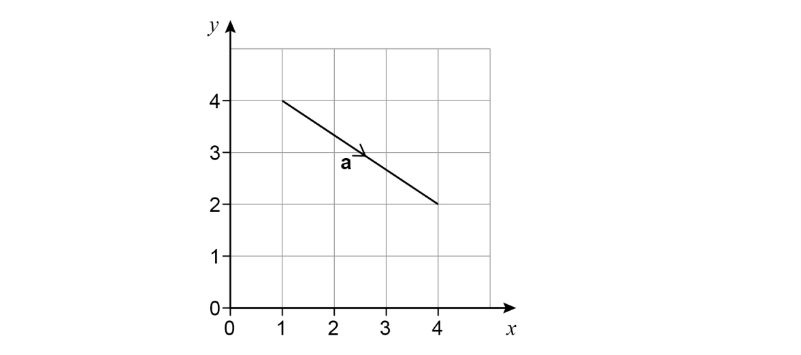

Circle the column vector that represents $a$.

| `open parentheses table row 3 row 2 end table close parentheses` | `open parentheses table row cell negative 3 end cell row 2 end table close parentheses` | `open parentheses table row 3 row cell negative 2 end cell end table close parentheses` | `open parentheses table row cell negative 3 end cell row cell negative 2 end cell end table close parentheses` |
|---|---|---|---|

## Q41 — very_hard — 4 marks · exam-questions

### 20() — 4 marks — command: find — structured — from paper Nov 2020 · J560/06
Vector **m**=`open parentheses table row 2 row k end table close parentheses` and vector **n **=`open parentheses table row 3 row 11 end table close parentheses`

Vector 2**m** +** n**  is parallel to `open parentheses table row 1 row cell negative 1 end cell end table close parentheses`

Find the value of $k$.

$k=$.........................................

## Q42 — hard — 3 marks · exam-questions

### 23() — 3 marks — command: show — structured — from paper June 2017 · 8300/2H
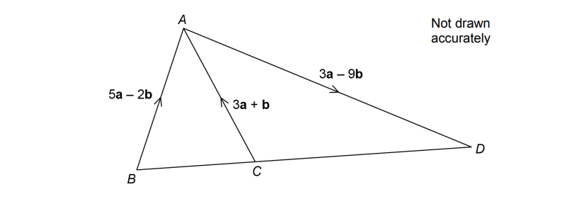

Is $BCD$ a straight line? 
Show working to support your answer.

## Q43 — medium — 1 marks · exam-questions

### 17() — 1 mark — command: work_out — structured — from paper Nov 2019 · 8300/1H
`bold a equals open parentheses table row cell negative 3 end cell row 2 end table close parentheses` and `bold b equals open parentheses table row 1 row cell negative 5 end cell end table close parentheses`

Work out $a--3b$ Circle your answer.

| `open parentheses table row cell negative 6 end cell row 17 end table close parentheses` | `open parentheses table row cell negative 6 end cell row cell negative 13 end cell end table close parentheses` | `open parentheses table row 0 row 17 end table close parentheses` | `open parentheses table row 0 row cell negative 13 end cell end table close parentheses` |
|---|---|---|---|

## Q44 — very_hard — 5 marks · exam-questions

### 15() — 5 marks — command: show — structured — from paper June 2019 · J560/04
The diagram shows triangle OAB and points C and D.

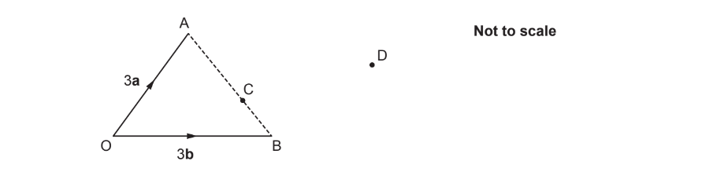

$\overset{\rightarrow}{\mathrm{OA}}$ = 3$a$and $\overset{\rightarrow}{\mathrm{OB}}$ = 3**b**. 
C lies on AB such that AC = 2CB. 
D is such that $\overset{\rightarrow}{\mathrm{BD}}$ = + 2$a$ + **b**. 
Show, using vectors, that OCD is a straight line.

## Q45 — hard — 5 marks · exam-questions

### 20((b)) — 5 marks — command: find — structured — from paper Nov 2018 · J560/06
Given that

`m open parentheses table row 4 row 1 end table close parentheses space plus space n open parentheses table row 5 row 2 end table close parentheses space equals space open parentheses table row 12 row 6 end table close parentheses`

find the value of $m$ and the value of $n$.

$m$ = .......................

$n$ = .......................

## Q46 — medium — 3 marks · exam-questions

### 11((a)) — 2 marks — command: draw — structured — from paper June 2017 · J560/05
Vector `bold a equals open parentheses table row 2 row 1 end table close parentheses` , vector `bold b equals open parentheses table row cell negative 2 end cell row 1 end table close parentheses`.

On each grid below, draw a vector to represent

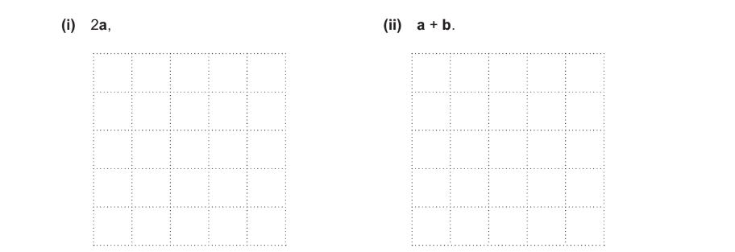

### 11((b)) — 1 mark — command: explain — structured — from paper June 2017 · J560/05
Emma says that if she draws vector $a$ and vector $b$ they will be the same.

Explain why this is incorrect.

## Q47 — very_hard — 3 marks · exam-questions

### 16((c)) — 3 marks — command: prove — structured — from paper Nov 2017 · J560/06
$\mathrm{ABCD}$ is a parallelogram.

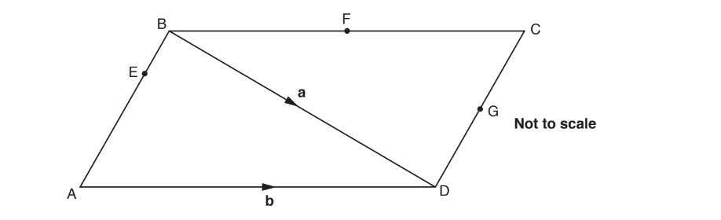

$\overset{\rightarrow}{\mathrm{BD}}=a$ and $\overset{\rightarrow}{\mathrm{AD}}=b$. 
$F$ is the midpoint of $\mathrm{BC}$. 
$G$ is the midpoint of $\mathrm{DC}$. 
$\mathrm{AE}=3\mathrm{EB}.$

Prove that $\overset{\rightarrow}{\mathrm{EF}}$and $\overset{\rightarrow}{\mathrm{AG}}$ are parallel.

## Q48 — hard — 3 marks · exam-questions

### 10() — 3 marks — command: show — structured — from paper June 2018 · J560/06
Two vectors, **a** and** b**, are shown on the 1 centimetre grid below.

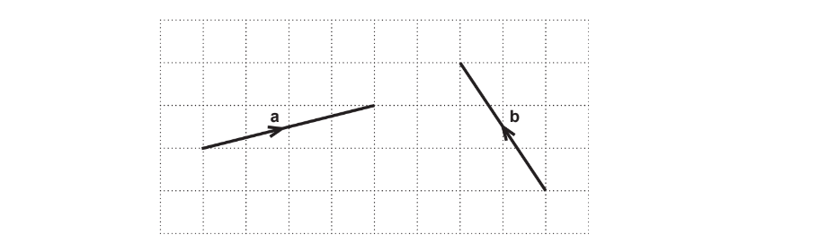

Show that the vector** a** + 2**b** has length 7cm. 
You may use the grid below.

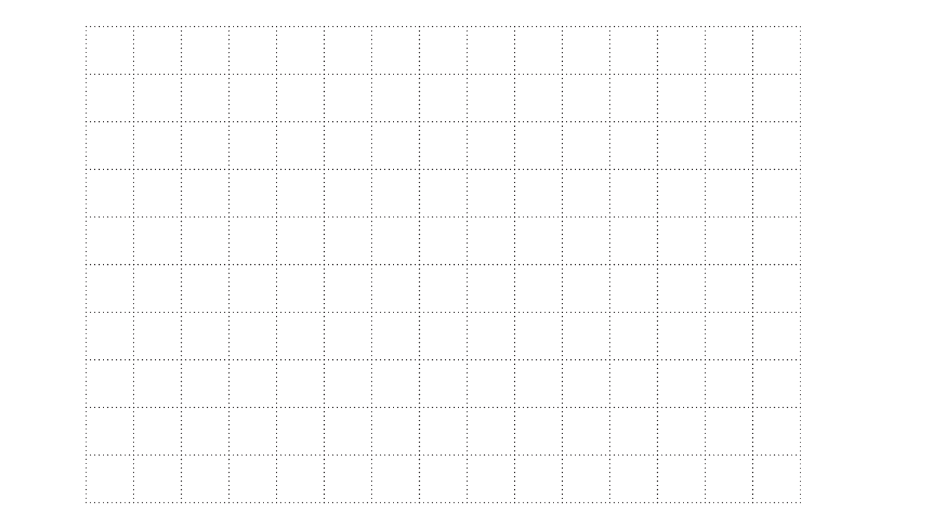

## Q49 — medium — 3 marks · exam-questions

### 1((b)) — 3 marks — command: write — structured — from paper Specimen 2015 · J560/05
Vectors **a**, **b**, **c**, **d** and **e** are drawn on an isometric grid.

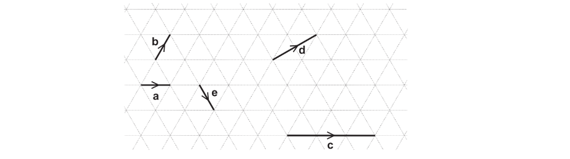

Write each of the vectors **c**, **d** and **e** in terms of **a** and/or **b**.

**c** = ....................

**d** = ....................

**e** = ....................

## Q50 — hard — 2 marks · exam-questions

### 11((c)) — 2 marks — command: find — structured — from paper June 2017 · J560/05
Vector `bold a equals open parentheses table row 2 row 1 end table close parentheses` , vector `bold b equals open parentheses table row cell negative 2 end cell row 1 end table close parentheses`.

`bold c equals open parentheses table row cell negative 12 end cell row 0 end table close parentheses`

Find the value $k$ so that `k open parentheses bold a minus bold b close parentheses equals bold c`

$k$ = .....................................................

## Q51 — hard — 5 marks · exam-questions

### 18() — 5 marks — command: show — structured — from paper Specimen 2015 · J560/05
P, Q, R and S are the midpoints of OX, XY, YZ and OZ respectively.

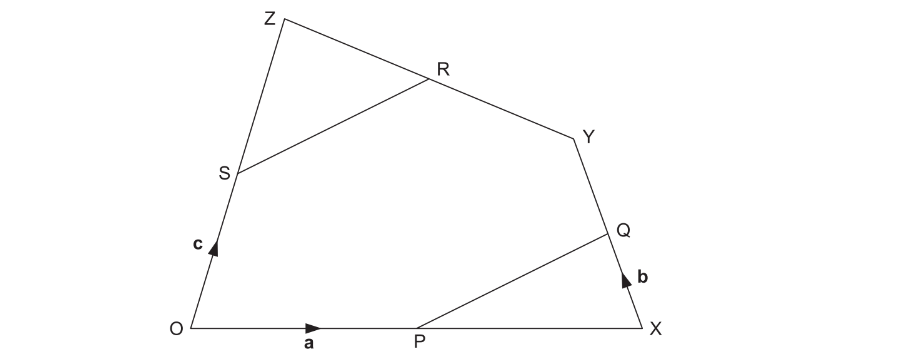

$\overset{\rightarrow}{\mathrm{OP}}=a$ , $\overset{\rightarrow}{\mathrm{XQ}}=b$ and $\overset{\rightarrow}{\mathrm{OS}}=c$.

Show that $\mathrm{PQ}$ is parallel to $\mathrm{SR}$.

## Q52 — hard — 5 marks · exam-questions

### 19((a)) — 3 marks — command: express — structured — from paper Specimen paper · 4MA1/2H
The diagram shows triangle $ABD$.

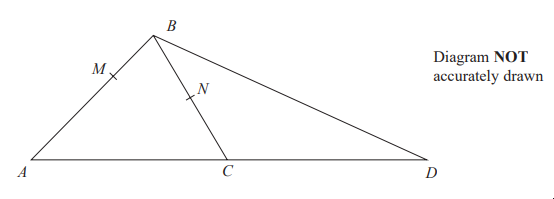

$N$ is the midpoint of $BC$. 
$C$ is the midpoint of $AD$. 
$M$ is the point on $AB$ such that $AM:MB=3:1$

$\overset{\rightarrow}{AB}=p$  and  $\overset{\rightarrow}{AC}=q$

Express, in terms of $p$ and  $q$,

(i)  $\overset{\rightarrow}{BD}$

(ii)   $\overset{\rightarrow}{MN}$

### 19((b)) — 2 marks — command: state — structured — from paper Specimen paper · 4MA1/2H
State, giving reasons, two different geometric facts relating $MN$ and $BD$

## Q53 — hard — 5 marks · exam-questions

### 19((a)) — 1 mark — command: find — structured — from paper 2023 June · 4MA1/1H
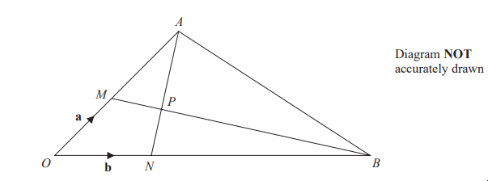

$OMA,ONB,MPB$and $NPA$are straight lines.

$M$ is the midpoint of $OA$

$ON:NB=1:5$

$\overset{\rightarrow}{OM}=a\overset{\rightarrow}{ON}=b$

Find in terms of**  **$a$ and**  **$b$the vector $\overset{\rightarrow}{AN}$

### 19((b)) — 4 marks — command: find — structured — from paper 2023 June · 4MA1/1H
Use a vector method to find the ratio $AP:PN$
