# Mark Schemes — Forces, Movement & Changing Shape
**1. Forces & Motion** · Edexcel IGCSE Physics (4PH1)

## Q1 — easy — 1 marks · exam-questions

### 1((a)) — 1 marks
**Correct answer: B** — Force

**Final answer:** **The correct answer is ****B**** because:**

- A vector quantity is any that has a **magnitude** (size) and **direction**

  - This means that a force of 10 N and –10 N are in opposite directions
- Only force can be represented with both a magnitude and direction

One way to know whether a quantity is scalar or vector is thinking about the equations that are associated with it. For example:

- Density = $\frac{mass}{volume}$ Since mass and volume are both scalar, density is also a scalar
- Mass is scalar, since you cannot have 'negative' mass
- Speed is the scalar version of velocity
- Force = mass × acceleration. Since acceleration is a vector, and mass is a scalar, force must therefore also be a vector.

In summary:

- vector × scalar = vector
- scalar × scalar = scalar

## Q2 — easy — 1 marks · exam-questions

### 1((b)) — 1 marks
**Correct answer: B** — Energy

**Final answer:** **The correct answer is ****B**** because:**

- A scalar quantity is one that just has **magnitude** (size) and no direction
- Acceleration, momentum and velocity are vector quantities
- Energy is a quantity which has a magnitude but no direction

  - Hence, option **B** is correct

One way to know whether a quantity is scalar or vector is thinking about the equations that are associated with it. For example:

- Momentum = mass × velocity. Since velocity is a vector, and mass is a scalar, momentum must therefore also be a vector.
- Acceleration = $\frac{velocity}{time}$. Since velocity is a vector, and time is a scalar, acceleration must therefore also be a vector.
- Velocity = $\frac{displacement}{time}$. Since displacement is vector, and time is a scalar, velocity must therefore also be a vector.
- Energy = power × time. Power and time are both scalars, so energy must also be a scalar.

In summary:

- vector × scalar = vector
- scalar × scalar = scalar

## Q3 — easy — 5 marks · exam-questions

### 16((a)) — 2 marks
Two forces that oppose the driving force are:

Any **two **from:

- Braking force; **[1 mark]**
- Air resistance / drag; **[1 mark]**
- (Road or tyre) friction; **[1 mark]**

**[Total: 2 marks]**

### 16((a)) — 3 marks
(i) State the equation linking force, mass and acceleration:

- (Resultant) force = mass × acceleration **OR** *F* = *ma ***[1 mark]**

(ii) To calculate the force causing this acceleration:

List the known quantities:

- Mass, *m* = 1400 kg
- Acceleration, *a* = 5.5 m s–2

Substitute the values into the force equation:

- Force = 1400 × 5.5 **[1 mark]**

Calculate the force causing the acceleration:

- Force = 7700 N or 7.7 kN **[1 mark]**

**[Total: 3 marks]**

> *In part (i) it is acceptable to provide the equation both in words and letters, as well as in any rearrangement of the equation. *

> *Hence, *$mass=\frac{Force}{Acceleration}$* and *$Acceleration=\frac{Force}{Mass}$* are both acceptable answers.*

## Q4 — easy — 5 marks · exam-questions

### 1() — 1 marks
**Correct answer: C** — terminal velocity

**Final answer:** **The correct answer is ****C**** because:**

- Terminal velocity is the name used to describe the constant velocity reached by an object in free fall

**A** is incorrect as average velocity is the total displacement moved divided by the total time taken

**B** is incorrect as instantaneous velocity is the velocity of an object at a specific moment in time

**D** is incorrect as non-uniform velocity is when an object moves unequal displacements in equal intervals of time

### 2() — 4 marks
The skydiver fall at constant velocity because:

- As the skydiver fall, the weight **stays the same** but the air resistance **increases**; **[1 mark]**
- The weight of skydiver acts **downwards** and air resistance acts **upwards**; **[1 mark]**
- Initially, the resultant force acts **downwards** because the weight is **greater than** the air resistance, however, the air resistance gradually **increases** until they are **balanced**; **[1 mark]**
- At this point, the resultant force is** ****equal to** zero which means skydiver is moving at constant velocity; **[1 mark]**

**[Total: 4 marks]**

> *This explanation is a classic exam question. Memorise it step by step as written above so that you can write the explanation by yourself.*

> *Remember that the definition of acceleration is the 'rate of change of velocity'. If there is no acceleration, this means the velocity does **not** change i.e. it remains constant.*

## Q5 — easy — 13 marks · exam-questions

### 5((a)) — 2 marks
Two measuring instruments that he would need for this investigation are:

Any **two** from:

- A **balance**/scales to measure the **mass** of the cases; **[1 mark]**
- A **stopwatch**/stop-clock to measure the **time** for the cases to fall; **[1 mark]**
- A metre **ruler**/measuring tape to measure **distance** fallen; **[1 mark]**

**[Total: 2 marks]**

### 5((b)) — 2 marks
- The dependent variable is the **time taken** for the cases to fall; **[1 mark]**
- The independent variable is the **mass** of the cases; **[1 mark]**

**[Total: 2 marks]**

> *Remember the difference between the two:*

- *The dependent variable is the variable being measured as a result of changes to the independent variable (i.e. what you measure)*
- *The independent variable is what is changed by the person conducting the experiment to measure the dependent variable*

> *Since it is related to the time taken for the cases to fall, you could also say the dependent variable could be the speed of the cases. However, this is not something we measure directly with an instrument, it is calculated from the distance and time taken. You could also say the 'number' or 'weight' of cases for the independent variable.*

### 2((c)) — 1 marks
One factor that the student should keep constant in order to make this investigation valid is:

Any **one** from:

- (Constant height); **[1 mark]**
- Still air / no (cross) wind; **[1 mark]**
- The cups are released from rest / zero force at launch; **[1 mark]**
- The (cupcake) cases are identical; **[1 mark]**

**[Total: 1 mark]**

### 5((d)) — 2 marks
A table that would score 2 marks should look like:

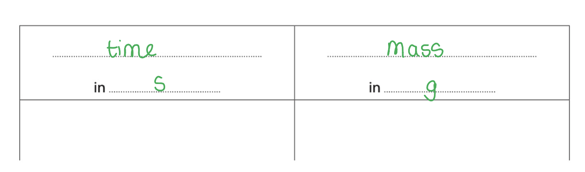

- Time in s; **[1 mark]**
- Mass in g; **[1 mark]**

**[Total: 2 marks]**

> *Depending on your answers to part (a), you could also put 'weight in N' and 'number of cases (with no units) as well. Mass in kg is also accepted, however, these cases will be likely in the order of g rather than heavier objects which would be easier to measure in kg.*

### 5((e)) — 1 marks
One way that the student can improve this investigation is by:

Any **one** from:

- Taking **repeat **readings, and use them to calculate an **average** time for each mass; **[1 mark]**
- Work indoors to reduce the effects of wind; **[1 mark]**
- Dropping the cases from a **greater height **/ using cases with a **larger surface** **area**; **[1 mark]**

**[Total: 1 mark]**

> *Think about the what could make your dependent variable difficult to measure if you were conducting this experiment. You want to decrease the error in your readings from a stopwatch. This time could be difficult to measure if the cupcake was falling erratically because there was a gust of wind. If it just fell from a short height, you wouldn't have enough time to measure the case falling a certain distance. Therefore, increasing the time taken for the cases to fall reduces the each in our measurement of time.*

### 5((f)) — 5 marks
(i)   The forces on the middle diagram are:

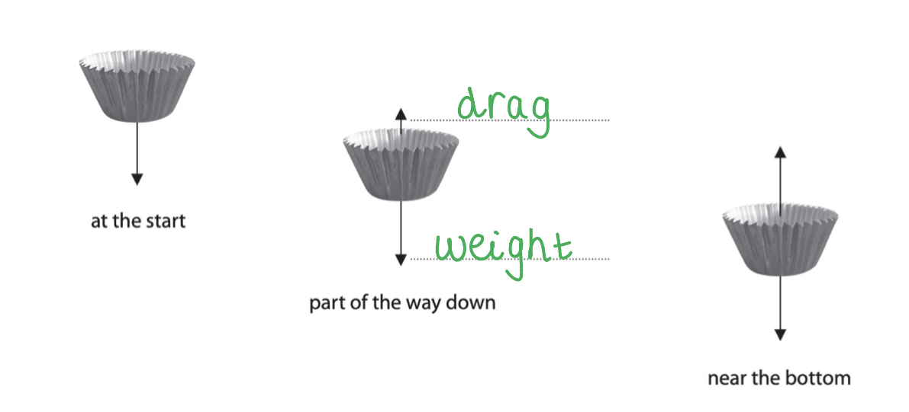

- Down arrow labelled 'weight'; **[1 mark]**
- Up arrow labelled 'drag'; **[1 mark]**

(ii)   The cases acceleration and then falls at constant speed because:

Any **three** from:

- At the beginning, the only force (on the case) is its weight **AND **the weight is initially greater than the drag (force); **[1 mark]**
- These (unbalanced forces) causes **acceleration**; **[1 mark]**
- As the speed increases, the drag force increases, so eventually, the forces become **balanced**;** ****[1 mark]**
- Therefore there is **no acceleration**, and the case reaches terminal velocity; **[1 mark]**

**[Total: 5 marks]**

## Q6 — easy — 8 marks · exam-questions

### 1() — 2 marks
Describe the effects of the forces acting on the ball as it collides with the wall:

- The ball <u>changes shape</u> momentarily <u>on impact</u>; **[1 mark]**
- The ball <u>changes direction</u> due to the<u> force from the wall</u>; **[1 mark]**

**[Total: 2 marks]**

> *For describe questions, make sure you develop the point beyond just a simple statement. Just saying that the ball 'changes shape' is not enough to gain the mark.*

### 2() — 3 marks
Identify three types of force acting on the ball as it collides with the wall:

- Gravitational force **[1 mark]**
- Normal contact force from the wall **[1 mark]**
- Friction / drag / air resistance **[1 mark]**

**[Total: 3 marks]**

### 3() — 1 marks
One correct statement is:

- Force is a vector quantity. **[1 mark]**

**[Total: 1 mark]**

### 4() — 2 marks
Describe how the ball demonstrates elastic behaviour when it hits the wall:

Any **two **from:

- The ball temporarily deforms on impact; **[1 mark]**
- The ball returns to its original shape once the force is removed; **[1 mark]**
- This demonstrates the ball’s ability to recover after deformation; **[1 mark]**

## Q7 — medium — 1 marks · exam-questions

### 1((d)) — 1 marks
**Correct answer: D** — the vertical forces on it are balanced

**Final answer:** **The correct answer is ****D**** because:**

- An object falling at terminal velocity is falling at **constant** **velocity**
- This means that it has **no acceleration**

  - This is because acceleration is defined as the rate of change in velocity
  - If velocity doesn't change (i.e. it is constant) then acceleration is 0
- Newton's second law states that:

  - *F* = *ma*
  - Where *F* is the resultant force, *m* is the mass and *a* is the acceleration
- Therefore, an object that has no acceleration also has **no** **resultant force**
- An object falling vertically downwards has no forces in the horizontal direction, only in the vertical

  - If the object has no resultant force, this means the vertical forces on it are **balanced**

Make sure you're familiar with the change in forces on a falling* *object.

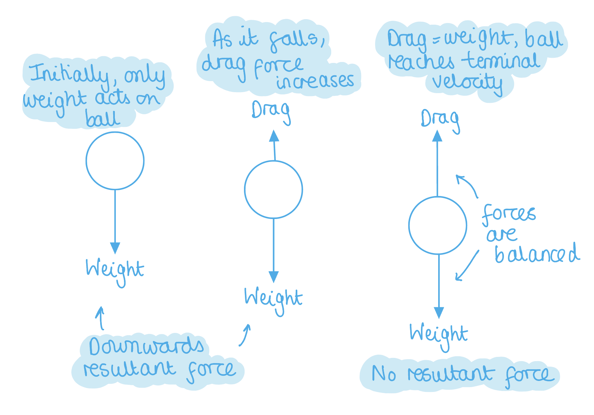

## Q8 — medium — 1 marks · exam-questions

### 9() — 1 marks
**Correct answer: C** — 0.1 mm

**Final answer:** **The correct answer is ****C ****because:**

- If 4.1 cm is approximated to 4 cm
- Then, 400 pages are about 4 cm thick

  - This means 100 pages are 1 cm thick
  - And 10 pages are 0.1 cm thick
- Since there are 10 mm in 1 cm

  - This means 10 pages are 0.1 cm = 1 mm thick
  - Therefore, 1 page is 0.01 cm = 0.1 mm thick
- This is option **C**

## Q9 — medium — 13 marks · exam-questions

### 7((a)) — 4 marks
(i)   The equation linking force, mass and acceleration is:

- Force = mass × acceleration **OR** *F* = *ma*; **[1 mark]**

(ii) The force needed to produce this acceleration is:

List the known quantities:

- Acceleration, *a* = 1.5 m/s2
- Mass, *m* = 38 kg

Substitute values into the force equation:

- Force = 38 × 1.5 **[1 mark]**
- Force = 57 N **[1 mark]**

(iii) A reason why the force exerted must be greater than the force calculated is because:

Any **one** from:

- There is <u>friction</u> between the snow / ground and sledge; **[1 mark]**
- The ground is not level; **[1 mark]**
- The rope is towed at an angle to the ground; **[1 mark]**

**[Total: 4 marks]**

> *Avoid writing **air resistance** or **drag** as the answer for part (iii). Although it is an acceptable answer, the force from the friction of the sledge on the ground / snow is going to have a much larger affect than the air resistance, especially if it's not windy!*

### 7((b)) — 3 marks
(i)   The relationship between acceleration, velocity and time is:

Any **one** from:

- `a c c e l e r a t i o n equals fraction numerator c h a n g e space i n space v e l o c i t y over denominator t i m e space open parentheses t a k e n close parentheses end fraction`**[1 mark]**
- $a=\frac{Δv}{t}$**[1 mark]**
- $a=\frac{v-u}{t}$**[1 mark]**

(ii)   The time taken is:

List the known quantities:

- Time, *t* = 2 s
- Speed, *v* = 2.8 m/s

Rearrange the acceleration equation for time:

- $time=\frac{changeinvelocity}{acceleration}$

Substitute in the values:

- $time=\frac{2.8}{1.5}$ **[1 mark]**
- time = 1.867 = 1.9 s **[1 mark]**

**[Total: 3 marks]**

> *When stating the relationship between acceleration, velocity and time make sure to mention the **change in** velocity to gain the mark. If you are stating this in symbol, **s** will not be accepted for speed, **v** should be used for velocity instead. Speed and velocity are different!*

### 7((c)) — 6 marks
(i)   The distance travelled by the sledge is:

- The total distance is the area under the graph;** [1 mark]**

Calculate distance under the graph:

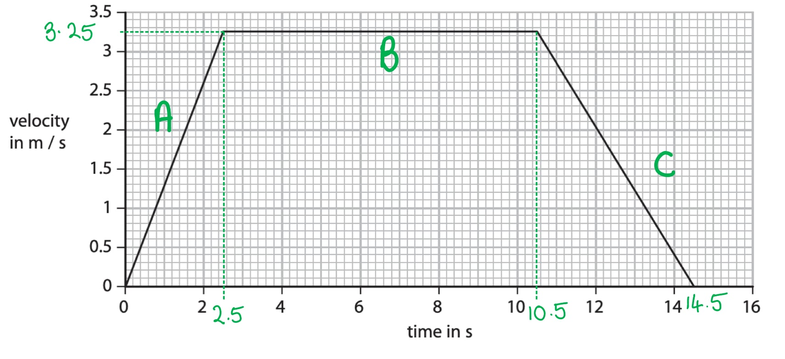

Any **one** from:

- Distance during acceleration (A) = $\frac{1}{2}$ × 3.25  × 2.5 = 4.1 m **[1 mark]**
- Distance during constant speed (B) = 3.25 × (10.5 – 2.5) = 26 m **[1 mark]**
- Distance during deceleration (C) = $\frac{1}{2}$ × 3.25 × (14.5 – 10.5) = 6.5 m **[1 mark]**

Calculate total distance:

- Total distance = Distance A + Distance B + Distance C
- Total distance = 4.1 + 26 + 6.5 = 36.6 m **[1 mark]**

(ii) The equation linking average speed, distance move and time taken is:

- `open parentheses a v e r a g e close parentheses space s p e e d equals fraction numerator d i s t a n c e italic thin space stretchy left parenthesis m o v e d stretchy right parenthesis over denominator t i m e space open parentheses t a k e n close parentheses end fraction` **[1 mark]**

**OR**

- $v=\frac{s}{t}$ **[1 mark]**

(iii) The average speed of the sledge for the whole journey is:

Determine the time taken from the graph:

- Total time taken = 14.5 s

Substitute values into average speed equation:

- $averagespeed=\frac{36.6}{14.5}$ **[1 mark]**
- average speed = 2.52 m/s **[1 mark]**

**[Total: 6 marks]**

## Q10 — medium — 3 marks · exam-questions

### 8((c)) — 3 marks
State the relationship between mass and acceleration:

- From the equation *F* = *ma, *mass is equal to $m=\frac{F}{a}$
- Mass and acceleration are inversely related / proportional; **[1 mark]**

The car has a greater acceleration when the caravan is removed because:

- The total mass of the system is less / decreases, therefore, there is less (air) resistance / friction; **[1 mark]**

The car uses less fuel when the caravan is removed because:

- There is less work done / energy used since burning fuel provides work / energy; **[1 mark]**

**[Total: 3 marks]**

> *You can see that mass and acceleration are inversely proportional to each other by rearranging the equation **F** = **ma** to *$m=\frac{F}{a}$*. Not mass, **m** and acceleration **a** are on opposite sides of the equals sign, we can see that if **a** was to increase, since it is in the denominator of the fraction, **m** would decrease and vice versa.*

## Q11 — medium — 9 marks · exam-questions

### 8((a)) — 1 marks
A table that would score 2 marks should look like:

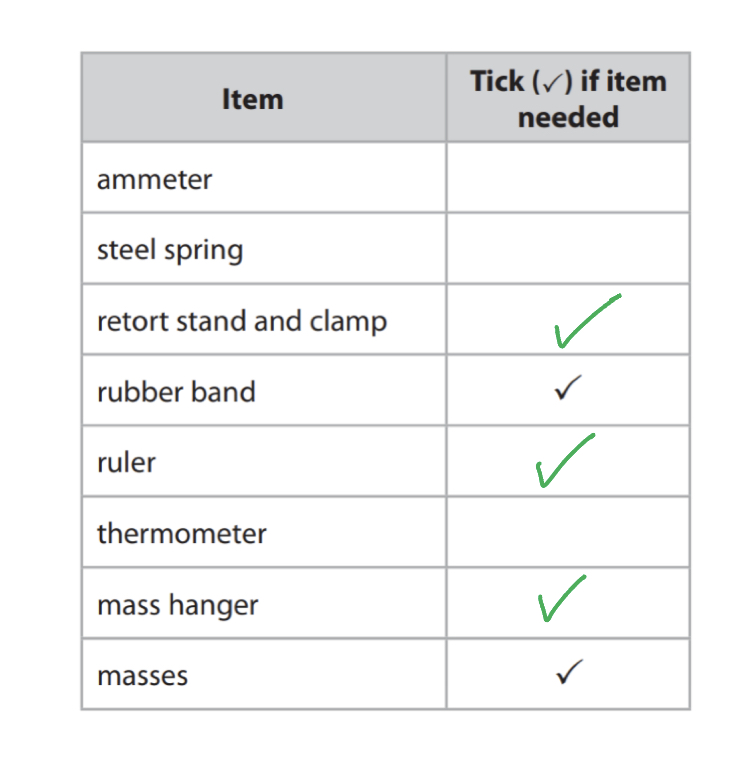

- *2* *marks for all three correct ticks*
- *1 mark for any two correct ticks*

**[Total: 2 marks]**

### 8((b)) — 8 marks
(i) Complete the table by inserting the missing force

A table that would score 1 mark should look like:

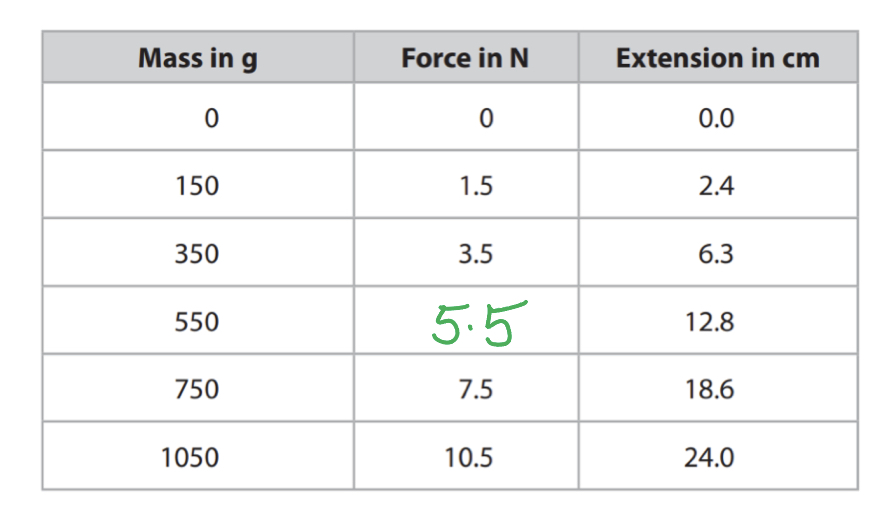

- Force = Mass × *g*
- Force = (550 × 10–3) × 10 = 5.5 N **[1 mark]**

(ii) Plot a graph to show how force varies with extension:

A graph that would score 5 marks should look like:

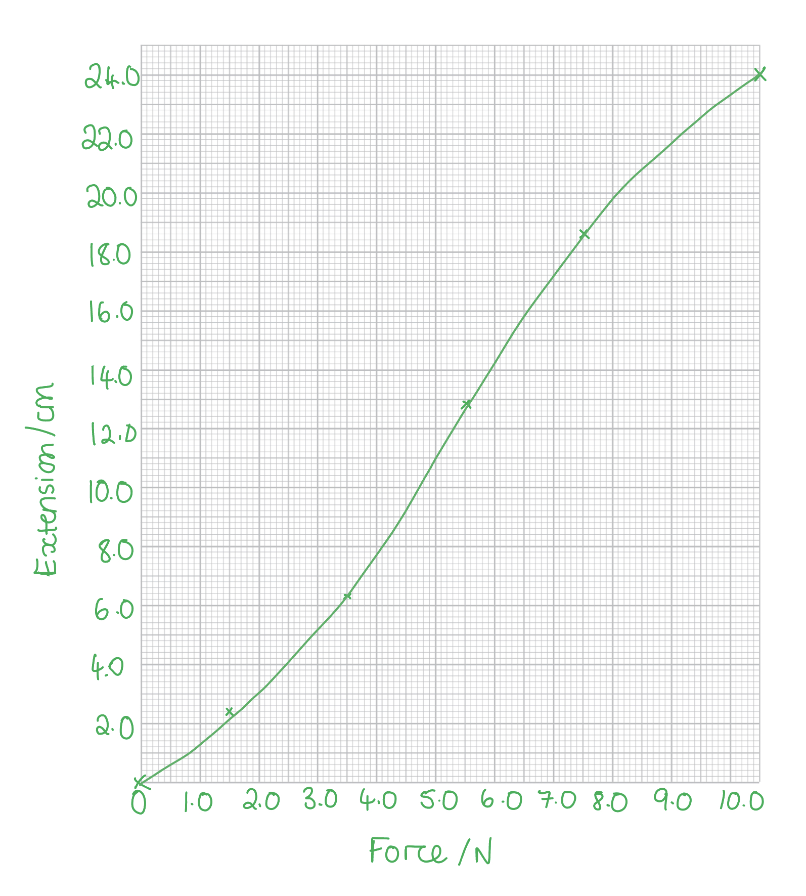

- Suitable scale for both axes; **[1 mark]**
- Horizontal axis labelled with unit N/Newtons and vertical axis labelled with unit cm/m/centimetres/metres; **[1 mark]**
- Points for force plotted corrected to nearest mm; **[1 mark]**
- **Points for extension plotted corrected to nearest mm; [1 mark]**
- Appropriate curve of best fit; **[1 mark]**

(iii) Use the graph to explain whether the rubber band obeys Hooke's Law

- Hooke's law should show directly proportionality for force and extension; **[1 mark]**

**   OR**

- Since the graph is a curve, this shows that the rubber band extends unevenly and that force is not proportional to extension; **[1 mark]**

- Therefore, the rubber band does **not** obey Hooke's law; **[1 mark]**

**[Total: 8 marks]**

## Q12 — medium — 4 marks · exam-questions

### 3() — 4 marks
Factors affecting the chance of the rabbit escaping the car:

Any **four** from:

- Reaction time of driver (including comments on drink/drugs / driver paying attention / driver distracted / driver tired); **[1 mark]**
- Condition of car’s brakes / force applied to brakes; **[1 mark]**
- Condition of car’s tyres; **[1 mark]**
- Condition of road surface (e.g. icy / wet / muddy / low friction); **[1 mark]**
- Stopping distance of car; **[1 mark]**
- Velocity / speed / behaviour of rabbit (across road); **[1 mark]**
- Distance of rabbit from car; **[1 mark]**
- Visibility factor (e.g. fog / dirty windscreen); **[1 mark]**

Maximum **two** from:

- Kinetic energy of car; **[1 mark]**
- Momentum of car; **[1 mark]**
- Velocity / speed of car; **[1 mark]**
- Mass / weight of car / number of passengers; **[1 mark]**

**                  **

**An example of an answer that would score 4 marks:**

Reaction time of the driver i.e. the time it takes for the driver to realise that there is a rabbit on the road and to apply the brakes; **[1 mark]**

Velocity of the car when they put the brakes on; **[1 mark]**

Initial distance between the rabbit and car before brakes are applied; **[1 mark]**

Surface conditions, because lower friction (like a wet road) increases the stopping distance, whereas higher friction decreases stopping distance; **[1 mark]**

**[Total: 4 marks]**

> *Remember that momentum = mass × velocity and kinetic energy = mass × velocity**2**, therefore, if you state kinetic energy, momentum, velocity and mass as factors, you will only be able to score two out of the four marks available.*

## Q13 — medium — 8 marks · exam-questions

### 15((a)) — 6 marks
(i)   The name of this constant velocity is:

- Terminal (velocity);** [1 mark]**

(ii)   This velocity stays at a constant value because:

- At terminal velocity, the upwards force (of air resistance) on the parachute is <u>equal</u> to the downwards force (of the weight);** [1 mark]**
- This means the resultant force is <u>zero</u> / there is <u>no</u> resultant force;** [1 mark]**
- Due to Newton's <u>2nd </u>law (*F* = *ma*) this means there is <u>no acceleration</u>;** [1 mark]**

(iii) The constant velocity reached by the spacecraft in photograph **H** compared to that in photograph **G **is:

- The constant velocity reached by this spacecraft (in photograph **H**) is greater/higher;** [1 mark]**

Any** one** from:

- Spacecraft **H** (2 parachutes) has a smaller surface area;** [1 mark]**
- There is initially less air resistance/drag/resistive force;** [1 mark]**
- It will take a different amount of time (to reach terminal velocity);** [1 mark]**
- There is less deceleration (before reaching terminal velocity);** [1 mark]**

**[Total: 6 marks]**

> *Be sure to state the obvious when answering exam questions. You must specify that the upwards acting and downward acting forces are balanced. You could also do this by naming the forces. *

> *Parachute G has a greater surface area, so its terminal velocity will be lower. But to avoid confusion, it is better to use the wording of the question and phrase your answer in terms of parachute H. Parachute H has a smaller surface area, so its terminal velocity will be higher. *

> *The drag force is always related to the amount of surface area that it acts upon. For the drag force to fully cancel out the weight, a higher drag force is needed, which requires a higher velocity. Therefore, the parachute with the greater surface area takes longer to reach terminal velocity. However, avoid saying there is 'no' air resistance for the parachute with the smaller surface area, this is not true, it is just has **less** area resistance initially. *

> *In the terminal velocity topic, avoid saying 'upthrust' at all costs. This is not related to this topic at all, even if something is travelling through water and reached terminal velocity, still refer to the resistive force as the **drag** force.*

### 15((b)) — 2 marks
If the parachute of the shuttle did not open the stopping distance would be:

- Increased / further / longer; **[1 mark]**

Give the reason:

Any **one** from:

- There is less braking force / air resistance / drag; **[1 mark]**
- It takes longer to decelerate / there is a reduced deceleration; **[1 mark]**
- There is a smaller resultant force; **[1 mark]**

**[Total: 2 marks]**

> *Avoid mentioning that the shuttle takes a 'longer time'. The question asks about stopping **distance** so remember to state in your explanation what affects the stopping distance. The speed you are travelling at affects stopping distance the most, and if the parachute didn't open, you must think about how that affects the speed and why. In this case, there is less deceleration from the lower amount of air resistance to slow the Shuttle down.*

## Q14 — medium — 16 marks · exam-questions

### 11((a)) — 7 marks
(i) The laboratory apparatus that the students need for the this investigation is:

- Clamp stand;** [1 mark]**
- Ruler;** [1 mark]**
- Weights;** [1 mark]**

(ii) Draw a line from each variable to its type

A diagram that would score 2 marks should look like:

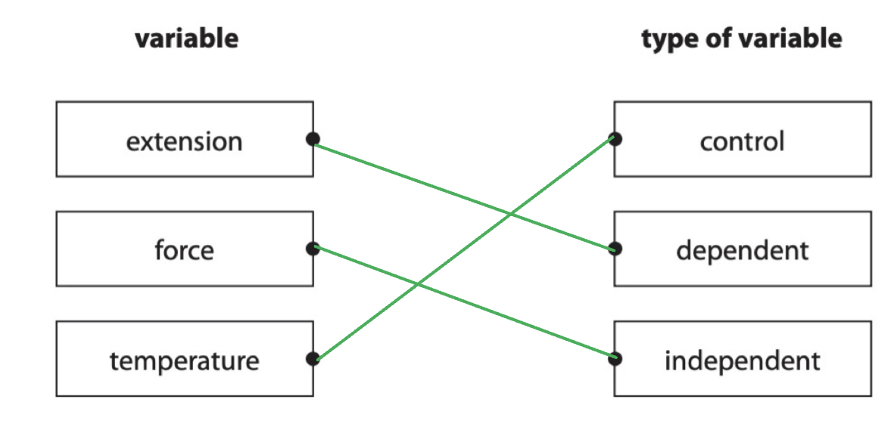

- Extension linked to dependent; **[1 mark]**

  - This is variable being investigated / measured
- Force linked to independent;** [1 mark]**

  - This is the variable being changes to see what effect it has on the dependent variable
- Temperature links to control;** [1 mark]**

  - This is the variable kept constant so it doesn't affect the results of the experiment

(iii) The student can measure the extension of the elastic band when he adds a force of 12 N by:

- Measure the length of the elastic band without any added weights **AND** add the 12 N weight and measure the length again; **[1 mark]**
- Subtract the initial length from the extended length to find the extension / calculate the difference in lengths; **[1 mark]**

**[Total: 7 marks]**

### 11((b)) — 9 marks
(i) The student could improve the quality of his data by:

Any **two** from:

- Measure the extension for loading and unloading at the same intervals; **[1 mark]**
- Take measurements of extension for unloading forces between 3 N and 7 N, as there is a large gap in these values measured; **[1 mark]**
- Take measurements at smaller intervals so the trend is clearer, especially where there are significant changes in extension between readings; **[1 mark]**
- Increase the range of forces/loads for which the extension is measured; **[1 mark]**

(ii) Draw a curve of best fit through the loading data:

A diagram that would score 1 mark should look like:

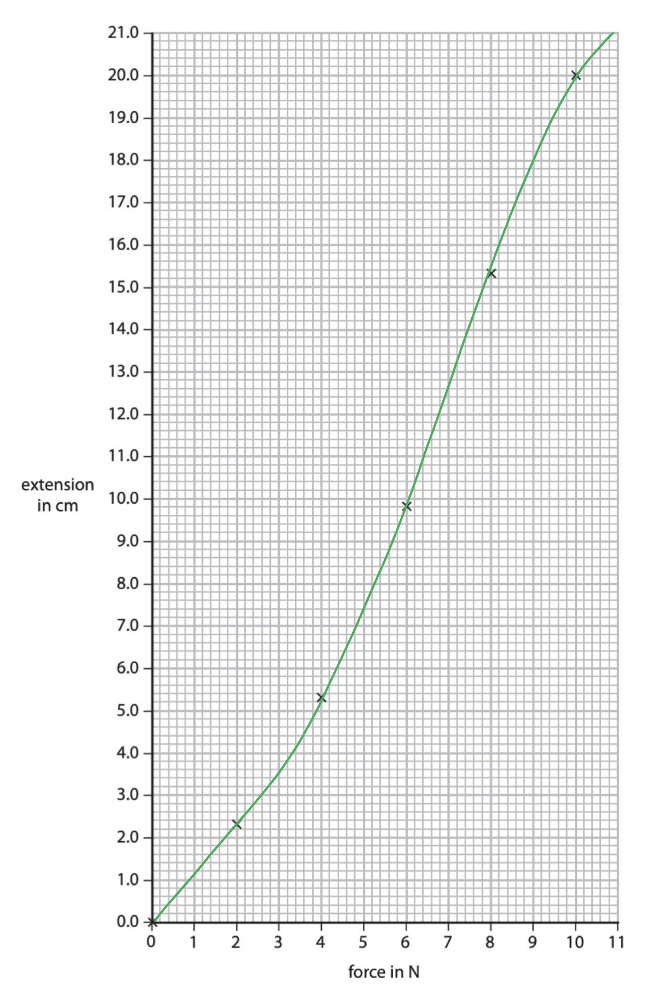

- Smooth curve going through all (or most of) the points;** [1 mark]**

(iii)  Plot the unloading data:

A diagram that would score 2 marks should look like:

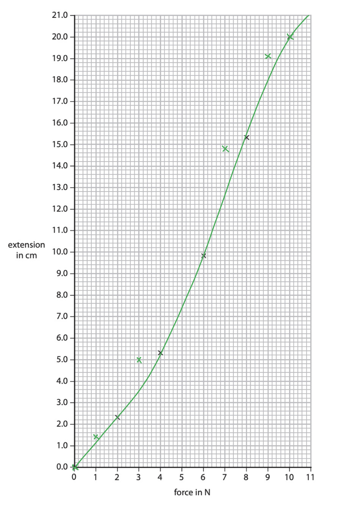

- 4 points plotted correctly; **[1 mark]**
- All 6 points plotted correctly; **[1 mark]**

(iv) Draw a curve of best fit through the unloading data:

A diagram that would score 1 mark should look like:

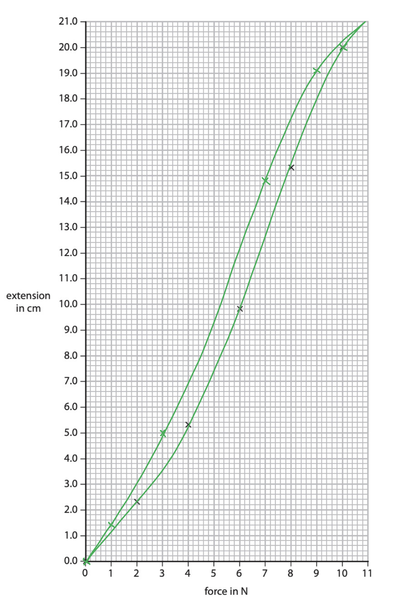

- Smooth curve going through all (or most of) the points;** [1 mark]**

(v) Discuss whether the conclusion that the band is an elastic material and that it obeys Hooke's law is correct:

- Hooke's law states that *extension is directly proportional to applied force*, this would be a straight line graph (through the origin)

  - This is not a straight line graph, therefore, the band does not obey Hooke's law;** [1 mark]**
- This graph shows elastic behaviour;** [1 mark]**

  - Since it returns to its original length at 0 extension (passes through 0,0) after being unloaded;** [1 mark]**

**[Total: 9 marks]**

> *For part (iv), you want to be as detailed as possible. It is easy to spot whether a material obeys Hooke's law:*

- *If the graph of force against extension is a straight line through the origin, the material obeys Hooke's law*
- *If the graph of force against extension is curve, the material does not obey Hooke's law*

> *Elastic behaviour is slightly different. A material is elastic if it goes back to its original shape once it has been deformed i.e. there is no extension when the force is back to 0. This is the case for this material because the graph goes back to 0. *

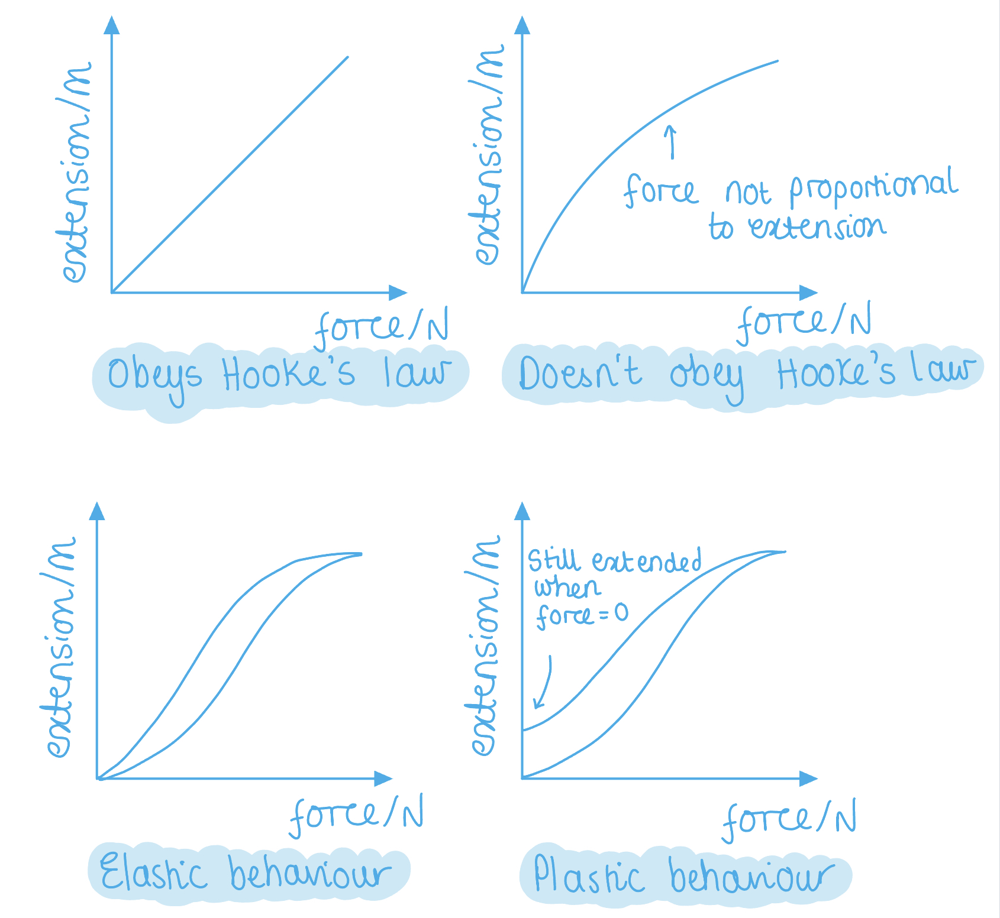

## Q15 — medium — 12 marks · exam-questions

### 7((a)) — 3 marks
(i) State the equation linking weight, mass and *g*:

- Weight = mass × *g* **[1 mark]**

(ii) Calculate the weight of the skydiver:

List the known quantities:

- Mass of the skydiver = 70 kg
- Acceleration due to gravity = 10 N/kg

Substitute the values into the equations:

- Weight = 70 × 10
- Weight = 700** [1 mark]**

State the final answer with the unit:

- Weight = 700 N / newton(s);** [1 mark]**

**[Total: 3 marks]**

### 7((b)) — 4 marks
Explain the shape of the velocity-time graph:

Any **four** from:

- Initially, only (the skydiver's) weight acts / resultant force downwards; **[1 mark]**
- So, at first (the skydiver) accelerates; **[1 mark]**
- Drag / air resistance increases with speed; **[1 mark]**
- Hence, as speed increases, resultant force decreases; **[1 mark]**
- As resultant force decreases, acceleration decreases; **[1 mark]**
- Eventually, the forces will be equal / balanced; **[1 mark]**
- (This is the point the skydiver) reaches terminal velocity; **[1 mark]**

**An example of an answer that would score 4 marks:**

At the start of the motion, the acceleration is constant, shown by the straight slope. This is because, initially, only the skydiver's weight is acting **[1 mark]**, so the skydiver will accelerate downwards **[1 mark]**

The curved part of the graph shows the deceleration of the skydiver. This is because air resistance increases with velocity and so the resultant downwards force will decrease as the skydiver speeds up **[1 mark]**

The horizontal part of the graph shows where the skydiver travels at a constant velocity. This represents the skydiver reaching terminal velocity, which is the point where the forces of weight and drag are equal **[1 mark]**

**[Total: 4 marks]**

> *When structuring a long answer like this, it's useful to split the different sections of the graph up and explain one section at a time so you can make sure you include all the key information. It can also be useful to draw force diagrams to help visualise the situation*

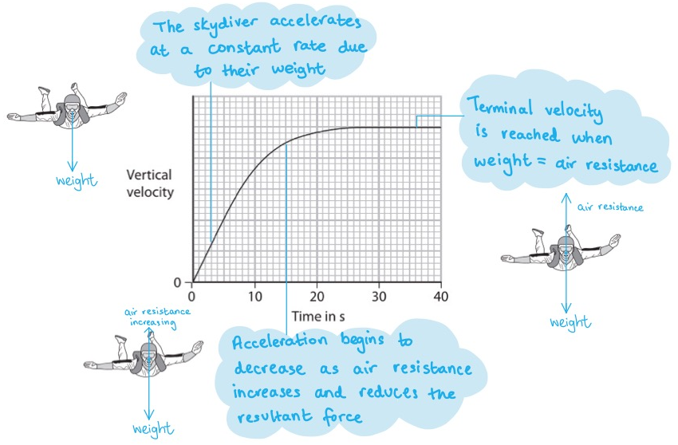

### 7((c)) — 3 marks
The forces on the skydiver when travelling at terminal velocity:

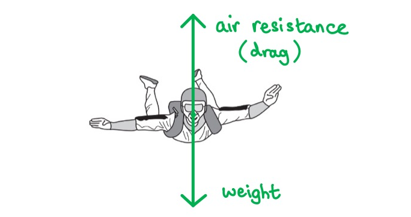

- Arrow up labelled drag / air resistance / air friction; **[1 mark]**
- Arrow down labelled weight; **[1 mark]**
- Arrows drawn approximately equal length; **[1 mark]**

**[Total: 3 marks]**

> *In this question, you would score all the marks if your arrows were not touching. However, it's more physically correct to draw the arrows from the same point, to indicate they are acting from the centre of gravity, so it's a good habit to get into!*

### 7((d)) — 2 marks
Motion of the skydiver after opening the parachute:

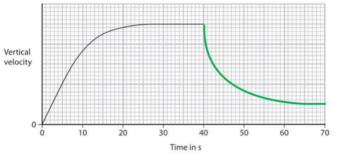

- Smooth curve or line drawn showing a reduction in velocity; **[1 mark]**
- Horizontal line drawn to show a new lower terminal / constant positive velocity; **[1 mark]**

**[Total: 2 marks]**

> *In a similar way to in part (b), make sure you can explain the motion of the skydiver when the parachute is opened:*

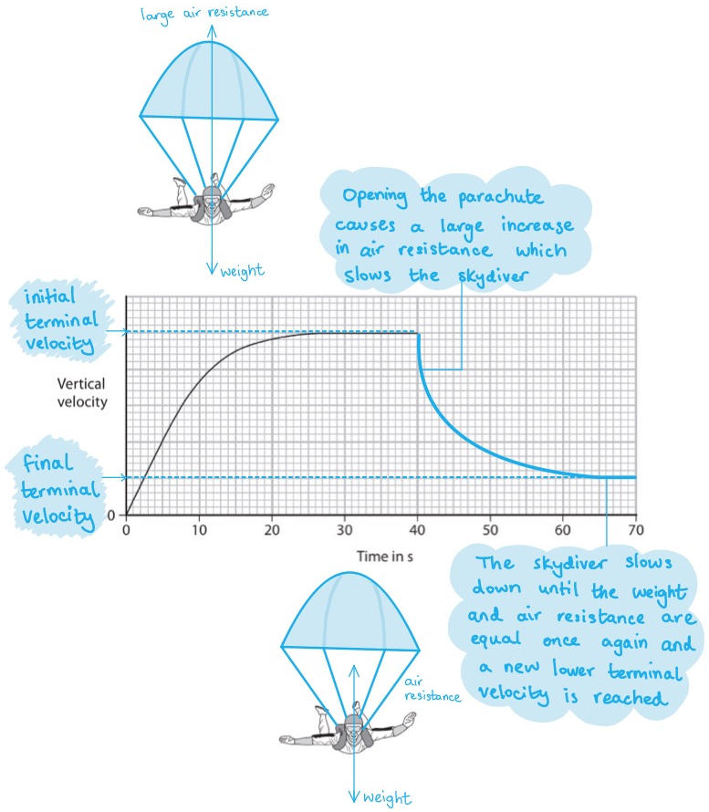

## Q16 — medium — 9 marks · exam-questions

### 3((a)) — 1 marks
The equation linking stopping distance, thinking distance and braking distance is:

- Stopping distance = thinking distance + braking distance **[1 mark]**

**[Total: 1 mark]**

### 3((b)) — 2 marks
Describe the patterns shown in the graph:

Any **two** from:

- As the speed (of the car) increases, the thinking / braking / stopping distance increases;** [1 mark]**
- As thinking distance increases so does braking distance;** [1 mark]**
- A difference in pattern between thinking / braking distances identified, e.g.

  - Each increase in thinking distance is less than increase in braking distance; **[1 mark]**
  - The increase in thinking distance is linear / proportional; **[1 mark]**
  - The increase in braking / stopping distance is non-linear; **[1 mark]**

**An example of an answer that would score 2 marks:**

The graph shows that as the speed of the car increases, thinking and braking distances increase, hence the overall stopping distance of a car increases **[1 mark]**

The graph also shows that thinking distance increases linearly with speed, while braking distance increases non-linearly with speed, meaning the greater the speed, the greater the increase in braking distance **[1 mark]**

**[Total: 2 marks]**

### 3((c)) — 1 marks
From the graph:

- Stopping distance at 30 mph ≈ 22 m
- Stopping distance at 40 mph ≈ 38 m

Estimate the stopping distance at 35 mph:

- The stopping distance will be between the stopping distances at 30 mph and 40 mph
- Stopping distance at 35 mph ≈ 30 m  **[1 mark]**

**[Total: 1 mark]**

An answer in the range of 28 to 32 m will gain the mark.

### 3((d)) — 1 marks
To find the minimum stopping distance:

- Use the smallest / minimum values obtained; **[1 mark]**

**[Total: 1 mark]**

### 3((e)) — 4 marks
(i) The difference in thinking distance between a dry and an icy road:

- Thinking distance depends on the alertness of the driver and the speed of the car; **[1 mark]**
- Thinking distance does not depend on road conditions so there would be no change; **[1 mark]**

(ii) The difference in braking distance between a dry and an icy road:

- Braking distance depends on road conditions, so it is likely to increase; **[1 mark]**
- This is because there is less friction between the tyres and the road (on an icy road), so the car will travel further in the same time; **[1 mark]**

**[Total: 4 marks]**

## Q17 — medium — 10 marks · exam-questions

### 10((a)) — 5 marks
A plan for the student's investigation is:

Set out a basic plan:

- Add 7 or more masses one at a time; **[1 mark]**
- For each mass, measure the length of the spring; **[1 mark]**
- Calculate the extension of the spring by subtracting the original length of the spring from the new length after each mass is added; **[1 mark]**

Demonstrate the results:

- Draw a graph of the force of the mass (weight) / load against the extension of the spring; **[1 mark]**

Ensure accuracy in the experiment:

Any **one** from:

- The new length of the spring after the mass is added should be measured from the same part of the spring each time; **[1 mark]**
- Repeat the readings by taking the masses off; **[1 mark]**
- Check the weight of the masses on a balance; **[1 mark]**
- Check that the ruler is vertical when measuring the length of the spring using a set square / use a clamp; **[1 mark]**
- Avoid parallel error by reading from the ruler at eye level; **[1 mark]**

**An example of an answer which would score 5 marks:**

Measure the initial length of the spring and record it for applied load = 0

Check the exact weight of the masses using a digital scale for mass **[1 mark] **and multiplying by 10 to get weight in N

Add the masses one at a time, for each new mass added measure and record the length **[1 mark] **and the total load

Take care to measure from the same points on the spring each time **[1 mark]**

**Marks from a diagram:**

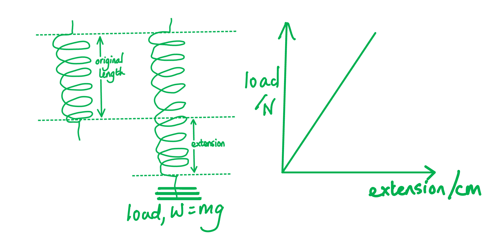

The diagram shows

- How to measure extension **[1 mark]**

  - The correct graph **[1 mark]**

**[Total: 5 marks]**

> *There are many marks you can get from diagrams. For example this sketch on the exam paper would score two marks;*

- *Holding the ruler in a fixed vertical position near the spring; [1 mark]*
- *Reading the measurement at eye level; [1 mark]*

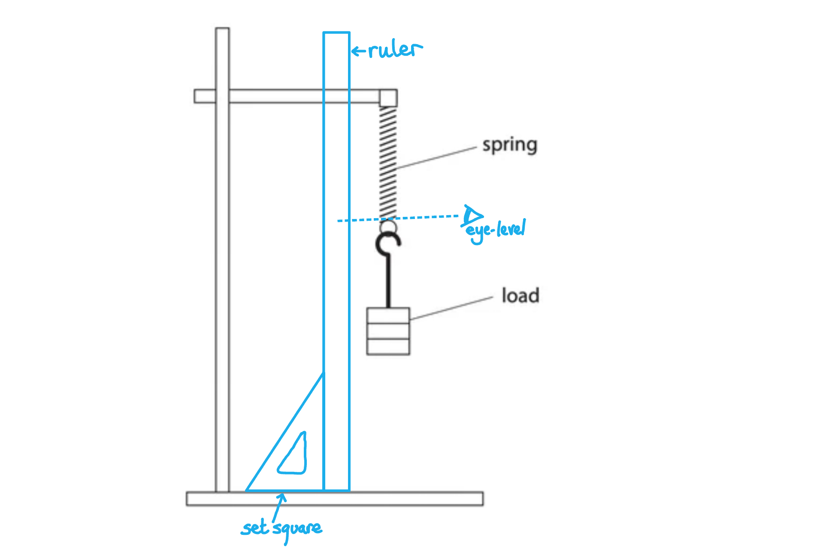

### 10((b)) — 3 marks
A graph that would score 3 marks should look like:

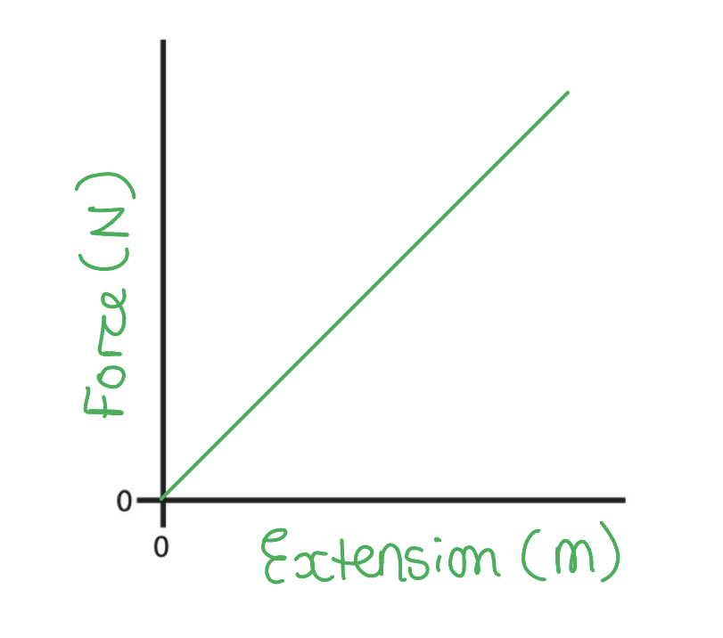

- Straight line; **[1 mark]**
- Axes labelled force/weight and extension; **[1 mark]**
- Line through the origin (0,0); **[1 mark]**

**[Total: 3 marks]**

### 10((c)) — 2 marks
Elastic behaviour is when:

- A material returns to its <u>original</u> length / shape; **[1 mark]**
- When the (stretching) force is <u>removed</u>; **[1 mark]**

**[Total: 2 marks]**

## Q18 — medium — 14 marks · exam-questions

### 11((a)) — 2 marks
(i) The student places masses on the block because:

Any **one** from:

- To ensure good contact; **[1 mark]**
- Increase the friction (between the wood and table); **[1 mark]**
- Increase the pressure (of the wood on the table); **[1 mark]**
- To prevent the block from slipping sideways; **[1 mark]**
- Make the block easier to control (and move); **[1 mark]**

(ii) He keeps the masses constant during the experiment because:

- It is a controlled variable **OR** to keep a fair test; **[1 mark]**

**[Total: 2 marks]**

### 11((b)) — 6 marks
(i) An example of a non-continuous variable in this investigation is:

- The (type of) surface; **[1 mark]**

(ii) Complete the table

A table that would score 1 mark should look like:

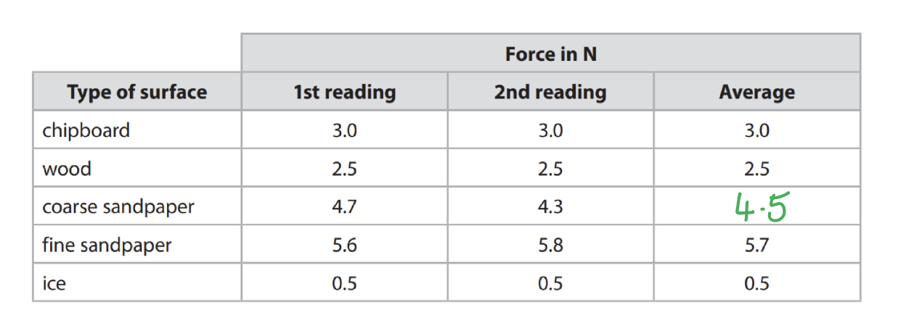

- The average of a set of readings is the sum of the readings divided by the number of readings
- Average force for coarse sandpaper is $\frac{4.7+4.3}{2}$= 4.5 N **[1 mark]**

(iii) Display the average force results for this investigation on the grid

A graph that would score 4 marks should look like:

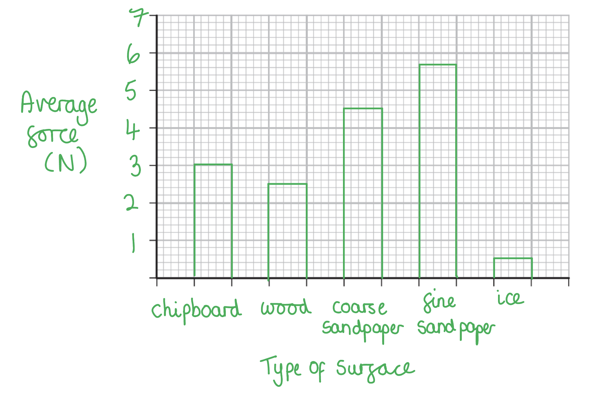

- Axes labelled with quantity and unit; **[1 mark]**
- Linear scale such that longest bar occupies at least half the grid; **[1 mark]**
- 3 bars correctly plotted; **[1 mark]**
- 5 bars correctly plotted; **[1 mark]**

**[Total: 6 marks]**

### 11((c)) — 2 marks
Other in the classes could have different values for the forces because:

- They were using different masses; **[1 mark]**
- The surfaces were not uniformly smooth; **[1 mark]**

> **[mark-scheme]**
> **Mark allocation**
> 
> One mark is awarded for each valid reason (up to a maximum of two marks)
> 
> **Alternative content**
> 
> The answer above is just one example of a response to this question. Other information that could be used in the question includes:
> 
> - A different experimental set-up:
> 
>   - Different kind of wooden block
>   - Different speed of pull
> - Variable friction:
> 
>   - The wooden block did not move evenly across the surface
> - Errors in the force meter reading:
> 
>   - Errors recording the force on the newtonmeter
>   - A faulty scale on the newtonmeter
>   - Zero errors / different ranges of newtonmeters used
>   - Different angle of the newtonmeter
> - Different contact:
> 
>   - The weight of the block may not have been evenly places on the block
>   - The block was not pressed down onto the surface evenly
> - Friction reduces as the experiment progresses:
> 
>   - The wooden block becomes smoother as the experiment proceeds (resulting in less friction)
>   - The block moves over the surface more easily as the experiment progresses
>   - There is a lubricant on the block

**[Total: 2 marks]**

### 11((d)) — 2 marks
This change affects the pressure by:

- Pressure = $\frac{Force}{Area}$
- Pressure is inversely proportional to area; **[1 mark]**
- Since the area is larger, the pressure would be less; **[1 mark]**

**[Total: 2 marks]**

### 11((e)) — 2 marks
Two ways in which the student could reduce friction between the two surfaces are:

Any **two** from:

- Placing a lubricant between the two surfaces; **[1 mark]**
- Make the surfaces smoother; **[1 mark]**
- Decrease the weight/masses on the block; **[1 mark]**
- Reduce the area of contact;** [1 mark]**
- Decrease the mass of the blocks;** [1 mark]**

**[Total: 2 marks]**

## Q19 — medium — 6 marks · exam-questions

### 12((a)) — 1 marks
The additional measuring instrument the student needs for the investigation is:

Any **one** from:

- A (metre) ruler;** [1 mark]**
- Set square;** [1 mark]**
- Tape measure;** [1 mark]**
- Digital callipers;** [1 mark]**

**[Total: 1 mark]**

### 12((b)) — 5 marks
The student can investigate whether the spring obeys Hooke’s law by:

- Measure the original length of the spring; **[1 mark]**
- Add a (known) weight onto the end of the spring and measure the new length; **[1 mark]**
- Repeat the experiment for a range of masses; **[1 mark]**
- Calculate the extension of the spring for each mass by subtracting the original length from the new length and plot a graph of extension against force/weight; **[1 mark]**
- If the spring obeys Hooke's law, the graph should be a straight line that passes through the origin / force should be proportional to extension; **[1 mark]**

**[Total: 5 marks]**

> *Your answer for investigations can be roughly split into two sections: the recording of the data and the handling of the data / conclusions from it. The possible marks you could get for each section are:*

> *Recording of data:*

- *Measuring the original length*
- *Add a mass/force/load/weight*
- *Measure the new length / extension*
- *Repeat and take an average of the new length*
- *Repeat for range of values of load*
- *Use a pointer to reduce parallax error in reading the lengths*

> *Handling data / conclusions:*

- *Calculate the extension*
- *Plot a graph of extension/length against force/weight/load*
- *The graph should be a straight line, so has a constant gradient*
- *The graph should pass through the origin*
- *Force should be proportional to extension*

> *The reason mass and weight are used interchangeably at times depends on the equipment. You can use weights straight away (also could be called force or loads) such as 0.5 N or 1 N weights. Most of the time, you will only have access to **masses** such as 0.1 g mass or 0.2 g mass, which you keep adding to extend the spring. Therefore, you must **multiply by **g** (10 m/s**2**) (since weight = mass × gravitational field strength (**g**)) to convert this into a weight or force before plotting your values on the graph! *

## Q20 — medium — 9 marks · exam-questions

### 13((a)) — 1 marks
After the ropes are untied, the value of the force acting downwards on the balloon is:

- 9100 N **[1 mark]**

**[Total: 1 mark]**

### 13((b)) — 3 marks
(i) The relationship between unbalanced force, mass and acceleration is:

- $F=m\timesa$** OR**** **Force = mass × acceleration **[1 mark]**

(ii) Calculate the initial acceleration

List the known quantities:

- Mass of the balloon, *m* = 910 kg
- Unbalanced (resultant) force, *F *= 400 N

Rearrange the force equation for acceleration, *a*:

- $a=\frac{F}{m}$

Substitute values into the acceleration equation:

- $a=\frac{400}{910}$**[1 mark]**
- *a *= 0.4396 = 0.44 m/s2 **[1 mark]**

**[Total: 3 marks]**

### 13((c)) — 3 marks
The upwards acceleration changes during the first few seconds of its flight by:

- The speed (of the balloon) increases; **[1 mark]**
- The drag forces / downward forces (also) start to increase; **[1 mark]**
- (Hence), acceleration <u>decreases</u>; **[1 mark]**

**[Total: 3 marks]**

> *Acceleration is the rate of change of velocity. If the speed increases, normally, acceleration also increases. However, the drag force is going to have a bigger affect. As this increases, downwards, opposing the motion of the balloon upwards, this decelerates the balloon (i.e. its acceleration decreases).*

### 13((d)) — 2 marks
The upward acceleration of the balloon is affected when the pilot pours sand from the bags by:

- The acceleration <u>increases</u>; **[1 mark]**

This is because:

Any **one** from:

- The weight (of the balloon) decreases; **[1 mark]**
- The downward force (on the balloon) decreases; **[1 mark]**
- The mass (of the balloon) decreases; **[1 mark]**
- The unbalanced force (on the balloon) increases; **[1 mark]**

**[Total: 2 marks]**

## Q21 — medium — 7 marks · exam-questions

### 1() — 4 marks
> **[mark-scheme]**
> (i) While the puck is in contact with the hockey stick:
> 
> - Its speed is increasing **OR**
> - It is accelerating **[1 mark]**

(ii) The other forces acting on the puck are:

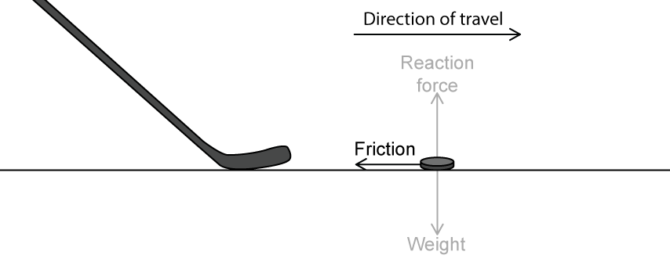

**[3 marks]**

> **[mark-scheme]**
> 1 mark for an upwards arrow from the puck labelled reaction force / normal reaction
> 
> 1 mark for a downwards arrow from the puck labelled weight / gravitational force
> 
> 1 mark for the reaction and weight arrows drawn the same length (by eye)

> **[exam-tip]**
> Since the puck is moving on a horizontal surface, it is not accelerating in a vertical direction. Therefore, the vertical forces (weight and reaction) are equal and opposite (balanced), so their arrows should be the same length.

### 2() — 3 marks
> **[mark-scheme]**
> (i) The direction of the puck's acceleration is:
> 
> - To the left / in the opposite direction to its motion **[1 mark]**
> 
> (ii) This is shown by the force arrows in the diagram because:
> 
> - There is an unbalanced / resultant force to the left **[1 mark]**
> - Objects accelerate in the direction of the unbalanced / resultant force **[1 mark]**

> **[exam-tip]**
> Even though the puck is moving to the right, there is no force pushing it right once it is no longer in contact with the stick. Friction is the only horizontal force acting, so it provides a resultant force that acts to the left. An object’s acceleration is always in the direction of the resultant force, so the puck slows down while moving to the right, because its acceleration points to the left.

## Q22 — hard — 1 marks · exam-questions

### 7((b)) — 1 marks
**Correct answer: A** — an unbalanced force acts on the squirrel

**Final answer:** **The correct answer is ****A**** because:**

- As the squirrel leaves the tree at P, its velocity increases from zero
- From P to Q, the squirrel glides at a constant velocity
- As the squirrel reaches the tree at Q, the velocity decreases to zero
- Since the velocity changes at P and Q, the squirrel accelerates and decelerates at these points
- Only an unbalanced (or resultant) force can cause an acceleration, and hence a change in velocity

  - Therefore, the velocity of the squirrel decreases to zero when it reaches the second tree because **an unbalanced force acts on the squirrel**
- This is option **A**

** B **is incorrect as there must be a force acting on the squirrel at point Q in order for its velocity to decrease

**C **is incorrect as the height of the squirrel decreases, therefore its GPE must decrease

** D **is incorrect as the KE of the squirrel increases as its velocity increases and decreases as its velocity decreases, however, this change in KE is a consequence of the change in velocity, not the cause

## Q23 — hard — 10 marks · exam-questions

### 1((a)) — 5 marks
The falling object can reach terminal velocity by:

Any **five** from:

- The object has weight / a downward force due to gravity; **[1 mark]**
- This causes it to accelerate downwards; **[1 mark]**
- This causes a drag force caused by the medium it is travelling through, which opposes the motion (of the object) / actsupwards; **[1 mark]**
- As the speed of the falling object increases, the drag (force) on it increases; **[1 mark]**
- Eventually, the magnitude of the drag force is equal to the magnitude of the weight, the two will be balanced; **[1 mark]**
- This means that there is no resultant force (on the object) / resultant force is 0; **[1 mark]**
- Therefore, the object travels at constant speed, known as terminal velocity; **[1 mark]**

**[Total: 5 marks]**

> *Your wording is extremely important in gaining full marks here. You could also mention water resistance or air resistance instead of drag, but **not** upthrust! Avoid terms such as 'drag slows it down' and 'resistance = acceleration. Be careful to always state 'constant speed' before stating that this is the terminal velocity.*

> *The link between 'no resultant force' and constant speed is important. Newton's second law states that **F** = **ma**, or in other words, resultant force is proportional to acceleration. Therefore, no resultant force means no acceleration. *

> *Acceleration is defined as the 'rate of change of velocity'. Therefore, no acceleration means no change in velocity i.e. constant velocity.*

### 1((b)) — 5 marks
Describe a method to find out if the ball reaches terminal velocity as it falls through the oil:

Any **five** from:

Consider the measurements:

- Use a timer / stop-clock / light gate (and data logger); **[1 mark]**
- Use a ruler / scale; **[1 mark]**

Consider the measurements made:

- Measure the time taken for the ball to pass between two points; **[1 mark]**
- Determine the distance apart; **[1 mark]**
- Repeat readings lower down; **[1 mark]**

**OR**

- For a set time (e.g. 1 s); **[1 mark]**
- Measure the distance travelled in that time; **[1 mark]**
- Repeat readings lower down; **[1 mark]**

**OR**

- Measure the velocity using the light gate with a data logger; **[1 mark]**
- At two different places; **[1 mark]**

Consider the measurements:

- Use $speed=\frac{distance}{time}$; **[1 mark]**
- Show how the results indicate terminal velocity has been achieved; **[1 mark]**

**An example of an answer that would gain 5 marks:**

- The student should align a <u>ruler</u> with the side of the glass tube and a <u>stopwatch</u> to time the ball is it falls over set distances; **[1 mark]**
- Measure the time passed between set distances e.g. for every 2 cm fallen by the ball and repeat these; **[1 mark]**
- These times must be recoded and used to determine the average time taken for the ball to fall through each 2 m distance; **[1 mark]**
- From the equation $speed=\frac{distance}{time}$, if the time taken to travel a certain distance is constant, the object travels at constant speed; **[1 mark]**
- Therefore, terminal velocity is reached when the time for the ball to fall through 2cm remains constant for consecutive readings; **[1 mark]**

**[Total: 5 marks]**

## Q24 — hard — 12 marks · exam-questions

### 2((a)) — 5 marks
(i) A diagram showing the forces would look like:

Any **two **from:

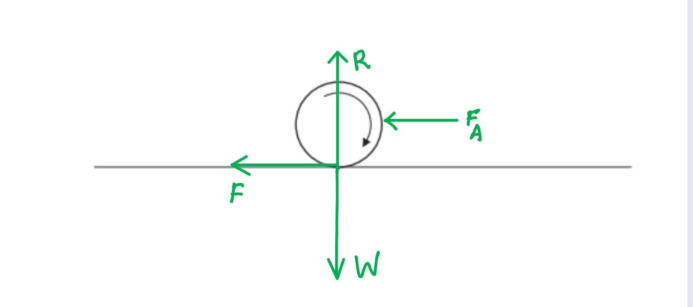

- Upwards arrow can be labelled 'contact' or 'reaction', C or R; **[1 mark]**
- Downwards arrow labelled 'weight' or W; **[1 mark]**
- Arrow <u>pointing left</u> labelled 'air resistance' or 'drag', FA / AF / D; **[1 mark]**
- Arrow on the surface labelled 'friction' or F; **[1 mark]**

(ii) The ball slows down and stops because:

Any **three **points from:

- (The action of) friction / drag / resistance; **[1 mark]**
- Unbalanced forces (are acting); **[1 mark]**
- F = ma; **[1 mark]**
- Energy store transfers (from kinetic to thermal); **[1 mark]**

**[Total: 5 marks]**

> *Force diagrams can be drawn in different ways. The essential points are that forces touch the body they are affecting and that the arrows' lengths are roughly to scale as a ratio of the size of force they represent.*

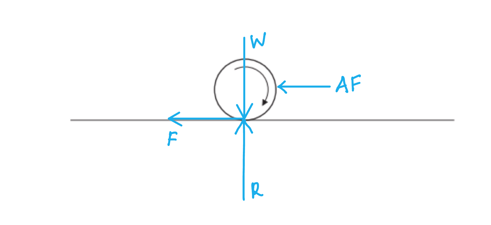

### 2((b)) — 1 marks
Ball Y travels much further than ball X before it stops because:

- There is <u>less friction</u> between the ball and the air (than between the ball and the ground); **[1 mark]**

**[Total: 1 mark]**

> *If you are unsure of an answer due to an unfamiliar scenario, always think of the equations.*

> *If the ball goes further then there must have been **less force** preventing it moving.*

> *From the diagram, the horizontal forces (the ones affecting distance travelled horizontally) are both frictional. **So the overall effect of friction must be less for the ball which goes further.*

### 2((c)) — 6 marks
(i) The equation linking kinetic energy, mass and speed:

- $KE=\frac{1}{2}mv^{2}$ **[1 mark]**

(ii) The initial speed of ball Y:

List the known quantities:

- Mass of ball, *m* = 45 g
- Initial *KE* = 36 J

Convert mass into kg:

- *m* = 45 g = 0.045 kg **[1 mark]**

Rearrange the equation from part (i) to make speed the subject:

- $v=\sqrt{\frac{2KE}{m}}$ **[1 mark]**

Substitute the values:

- $v=\sqrt{\frac{2\times36}{0.045}}$ **[1 mark]**

Calculate the answer:

- *v* = 40 m/s **[1 mark]**

(iii) How to hit ball Y so it can reach a greater height:

Any **one **from:

- (Hit harder to) transfer more energy; **[1 mark]**
- (Hit the ball with) higher initial velocity / speed; **[1 mark]**
- (Hit the ball with) more force; **[1 mark]**

**[Total: 6 marks]**

## Q25 — hard — 10 marks · exam-questions

### 3((a)) — 5 marks
(i) Calculate the acceleration due to gravity on the Moon

Use the graph to determine the final velocity and time taken:

- Initial velocity = 0
- Final velocity = 2.0 m/s
- Time taken = 1.26 s

Calculate the average acceleration:

- The average acceleration is the average rate at which the initial velocity changes to the final velocity
- $acceleration=\frac{finalvelocity-initialvelocity}{timetaken}=\frac{2.0}{1.26}$ **[1 mark]**
- Acceleration = 1.587 = 1.6 **[1 mark]**

State the answer with the correct unit:

- Acceleration = 1.6 m/s2 **[1 mark]**

(ii) Calculate the height the hammer was dropped from

- The distance that the hammer falls can be found using:

  - $distance=speed\timestime$
- This distance can be determined by calculating the area under the velocity-time graph

- The area under the line is a right-angled triangle, where:

  - The triangle height, or velocity = 2 m/s
  - The triangle width, or time = 1.26 s

- Height = 1⁄2 × 2 × 1.26 **[1 mark]**
- Height = 1.26 m **[1 mark]**

**[Total: 5 marks]**

### 3((b)) — 1 marks
The gravitational field strength is smaller on the Moon than on the Earth because:

- The Moon has less mass / a lower density (than Earth); **[1 mark]**

**OR**

The gravitational field strength is greater on Earth than on the Moon because:

- The Earth has a greater mass / density (than the Moon); **[1 mark]**

**[Total: 1 mark]**

### 3((c)) — 4 marks
Explain why the feather reaches the ground after the hammer:

Any **four** from:

- The feather is lighter / has less mass / weighs less (than the hammer); **[1 mark]**
- Terminal velocity is reached when drag = weight; **[1 mark]**
- The feather reaches terminal velocity earlier / sooner / before the hammer; **[1 mark]**
- (This is because) a smaller (drag / air resistance) force is needed; **[1 mark]**
- (Therefore) the average / terminal velocity of the feather is lower; **[1 mark]**
- The feather falls at a slower rate than the hammer; **[1 mark]**

**An example of an answer that would score 4 marks:**

The hammer and feather are released from rest at the same time, therefore, they accelerate (due to gravity) at the same rate. However, air resistance increases as velocity increases.

The feather has less mass than the hammer, hence it has a lower weight **[1 mark] **therefore, less air resistance is required to equal its weight. The point when air resistance is equal to the weight is known as terminal velocity **[1 mark]**

The feather reaches a lower terminal velocity **[1 mark]** than the hammer because it spends less time accelerating (as not as much air resistance needs to be built up).

The lower terminal velocity, as well as the shorter acceleration time, means the feather falls at a slower rate and reaches the ground after the hammer **[1 mark]**

**[Total: 4 marks]**

## Q26 — hard — 10 marks · exam-questions

### 4((a)) — 2 marks
Explain why it is difficult to measure the thickness of a single piece of paper with a ruler:

Any **two** from:

- The ruler has a <u>mm</u> scale **OR** the ruler's <u>scale is too big;</u> **[1 mark]**
- The ruler's resolution is inappropriate; **[1 mark]**
- The paper is (very) thin / thinner than 1 mm; **[1 mark]**

**[Total: 2 marks]**

### 4((b)) — 2 marks
Suggest two reasons why the student's value for the thickness of the pile may be inaccurate:

Any **two** from:

- Parallax error; **[1 mark]**
- Gap left between ruler and paper; **[1 mark]**
- Ruler not perpendicular (to plane of paper); **[1 mark]**
- (The ruler has a) zero error; **[1 mark]**
- (The student has) misread the ruler; **[1 mark]**

**[Total: 2 marks]**

### 4((c)) — 6 marks
(i) Explain why the forces on the paper aeroplane must be balanced:

Any **two **from:

- Acceleration requires an unbalanced force; **[1 mark]**
- The aeroplane is not accelerating (as it is travelling at constant speed); **[1 mark]**
- There is no unbalanced / overall / resultant force **OR** all the forces are balanced; **[1 mark]**

(ii) Complete the diagram to show the directions of weight, lift and drag:

- The dotted lines represent the **allowed range of angles** for each force

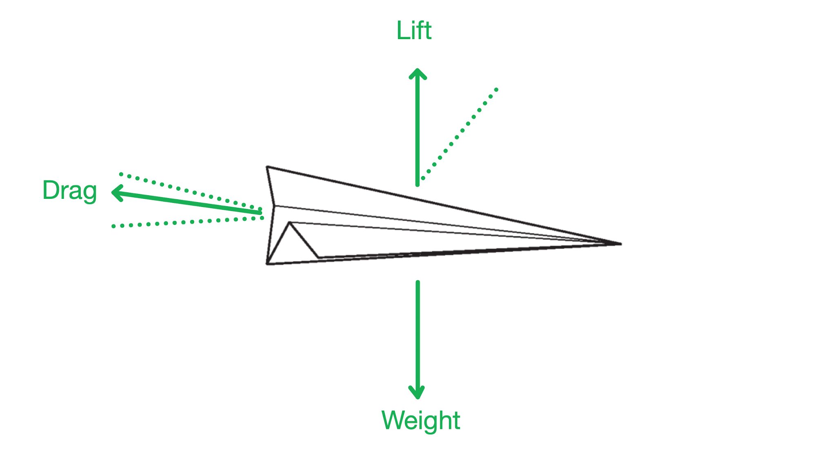

- Weight arrow is vertically down; **[1 mark]**
- Lift arrow is upwards (between vertical and 45° to the right of vertical); **[1 mark]**
- Drag arrow acts to the left (inside the angle of the aeroplane wings); **[1 mark]**

(iii) State what happens to this lost gravitational potential energy:

- Lost / dissipated as sound / heat energy **OR**** **transferred to the thermal store of the air; **[1 mark]**

**[Total: 6 marks]**

## Q27 — hard — 11 marks · exam-questions

### 5((a)) — 3 marks
(i) Estimate the length of the four rubber bands and complete the table:

A table that would score 1 mark should look like:

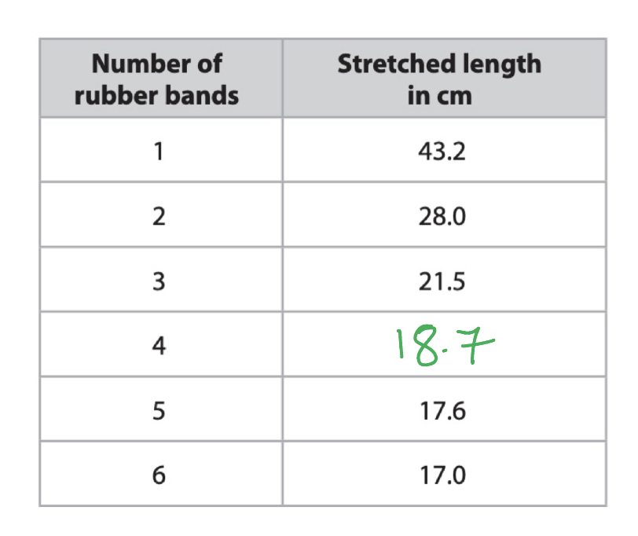

- 18.7 ± 0.5

(ii) The estimate may not be accurate because:

Any **two** from:

- There could be <u>parallax error</u> when reading from the ruler; **[1 mark]**
- The rubber bands don't align directly with 0 on the ruler causing a <u>zero error</u>; **[1 mark]**
- The end of the ruler is worn out; **[1 mark]**
- The hook is curved so difficult to locate the end of the rubber bands; **[1 mark]**
- The hook stretches each band to different length; **[1 mark]**
- The bands are not close to the ruler; **[1 mark]**
- The bands are not parallel to the ruler; **[1 mark]**
- The bands are twisted; **[1 mark]**

**[Total: 3 marks]**

### 5((b)) — 1 marks
The student made this investigation a fair test by:

Any **one **from:

- Keeping the force/temperature constant; **[1 mark]**
- Use the same type of rubber bands; **[1 mark]**
- Using the same material of rubber bands; **[1 mark]**
- Using the same thickness of the rubber bands; **[1 mark]**
- All the rubber bands have the same elasticity; **[1 mark]**
- All rubber bands have the same original length (before extension); **[1 mark]**

**[Total: 1 mark]**

> *Keeping a fair test is to do with having a **controlled** variable i.e. what are you **not** changing between each reading. Therefore, it is incorrect to state the idea of a consistent technique such as 'using the same equipment' as this is too vague. *

### 5((c)) — 7 marks
(i) The type of variable which is a series of whole numbers is:

Any **one** from:

- Discrete; **[1 mark]**
- Discontinuous; **[1 mark]**
- Non-continuous; **[1 mark]**
- Categoric; **[1 mark]**

(ii) Display the results of the student's investigation on the grid

A grid that would score 4 marks should look like:

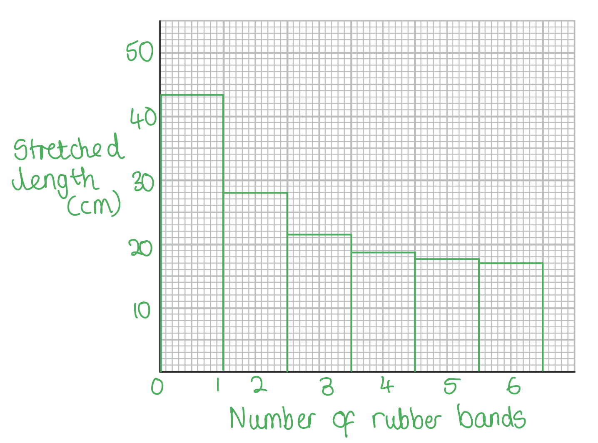

- Axes labelled and quantities (Number of rubber bands) with no units **AND** distance (stretched length / extension) in cm; **[1 mark]**
- Suitable scale chosen with longest bar occupying at least half the grid; **[1 mark]**
- 3 bars for given data correctly plotted; **[1 mark]**
- 5 bars for given data correctly plotted; **[1 mark]**

(iii) The relationship between the number of rubber bands and the stretched length is:

- They are inversely proportional; **[1 mark]**
- Since as the number of rubber bands increases, the strength length / extension decreases; **[1 mark]**

**[Total: 7 marks]**

## Q28 — hard — 5 marks · exam-questions

### 6((a)) — 1 marks
(i) Complete the table by calculating the missing value

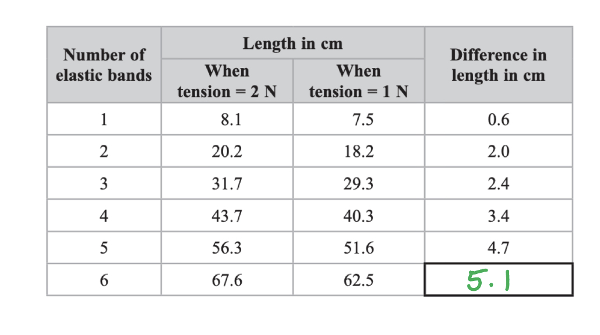

- 67.6 – 62.5 = 5.1 **[1 mark]**

(ii) Use the grid to plot a graph to show the relationship between the number of elastic bands and the difference in length

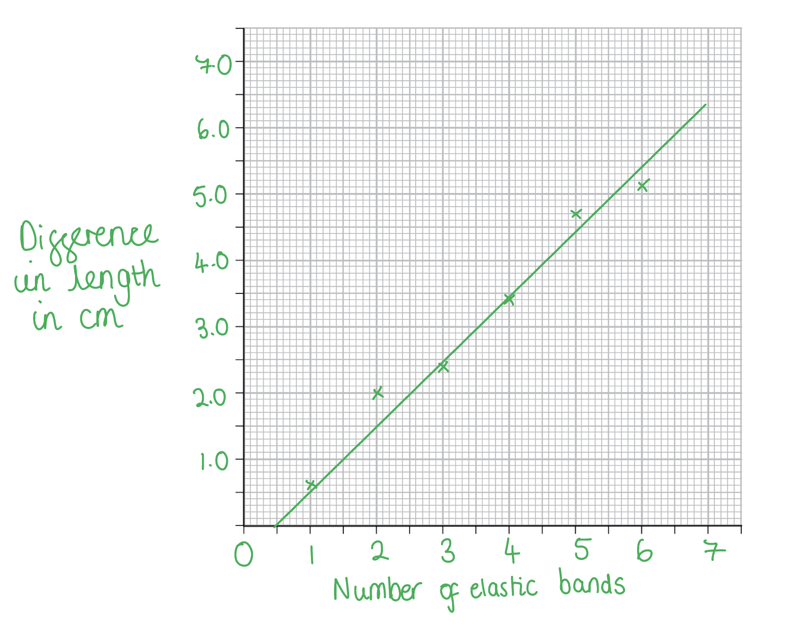

- Suitable scale chose with > 50 % of the grid used; **[1 mark]**
- Axes labelled 'number of elastic band' and 'difference in length in cm'; **[1 mark]**
- 4 points plotted correctly (to nearest half square); **[1 mark]**
- 6 points plotted correctly (to nearest half square); **[1 mark]**
- Acceptable line of best fit; **[1 mark]**

(iii) The line of best fit can be described as:

Any **two** from:

- It is a straight line; **[1 mark]**
- The gradient / slope / correlation is positive; **[1 mark]**
- The line doesn’t pass through origin; **[1 mark]**
- The variables of directly correlated; **[1 mark]**
- The variables are proportional; **[1 mark]**
- The difference in length increases with the number of elastic bands; **[1 mark]**

**[Total: 8 marks]**

### 3((b)) — 2 marks
An estimate of the length of the paperclip is:

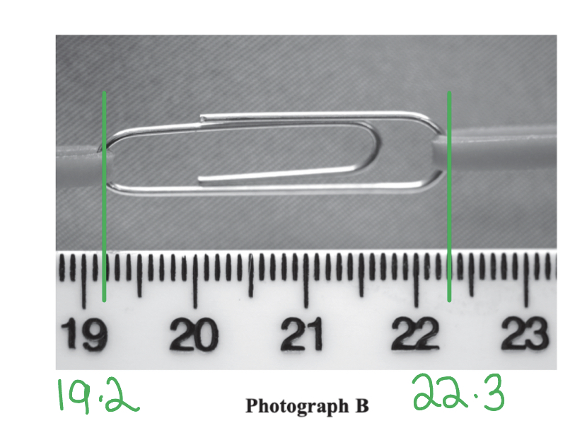

- Lines drawn where the start and edge of the paperclip is measured from; **[1 mark]**

Calculate the length of the paperclip:

- 22.3 – 19.2 = 3.1 cm (± 0.1 cm) **[1 mark]**

**[Total: 2 marks]**

> *Remember to look at the number of marks to see how much detail the question requires. In this question, show your working clearly for the first mark by drawing on the image how you are reading the values on the ruler. Make sure to use a thin pencil and a straight edge or ruler to get the most accurate value, don't just rely on the range of answers that could be accepted!*

### 6((c)) — 2 marks
Two ways that the student could improve his measuring technique are:

Any **two** from:

- Place the paperclip parallel with the scale when measuring its length; **[1 mark]**
- Place the paperclip closer to the scale when measuring its length; **[1 mark]**
- Use a fiducial marker, such a set square, to make sure the paperclip is parallel to the scale; **[1 mark]**
- Reduce parallax error by reading the values from the scale directly above the paperclip; **[1 mark]**
- Remove the paperclip from the chain before measuring its length; **[1 mark]**
- Use a more precise scale; **[1 mark]**
- Use stiffer paperclips; **[1 mark]**

**[Total: 2 marks]**

> *Improving measurement techniques are more about accuracy in the results rather than their reliability. Therefore, incorrect answers would be to mention repeating measurements. Measuring the paperclip from zero would also not improve the measurement technique, as it does not mention a way to make **reading the values** more accurate. You should think about what could cause errors in reading the values from the scale, for example, thinking about why it could have been difficult to read an accurate value from part (b).*

## Q29 — hard — 14 marks · exam-questions

### 7((a)) — 2 marks
Two ways that the student can measure distance *h* more accurately are:

Any **two** from:

- Make sure the ruler is vertical; **[1 mark]**
- Use a fiducial marker; **[1 mark]**
- Use a ruler with finer calibration / more detail / smaller intervals; **[1 mark]**
- Reduce parallax errors by reading *h* at eye level; **[1 mark]**
- Use a calliper; **[1 mark]**

**[Total: 2 marks]**

> *Avoid saying to use a more 'accurate' ruler, without stating what that would look like. A more accurate value can be read from a ruler with smaller divisions for example.*

### 7((b)) — 12 marks
(i) The dependent variable in this investigation is:

- The distance; **[1 mark]**

(ii) The force values in the table are calculated by:

Any **two** from:

- Mass is converted from grams (g) to kilograms (kg) / ÷ 1000 **[1 mark]**
- Weight is the force on the mass **OR **weight = mass × gravitational field strength / *W* = mg; **[1 mark]**
- There is 1 N of force for every 100 g **[1 mark]**
- *g* is 10 N/kg (or m/s2); **[1 mark]**

(iii) Plot a graph of distance *h* against force, and draw the line of best fit

A graph that would score 5 marks should look like:

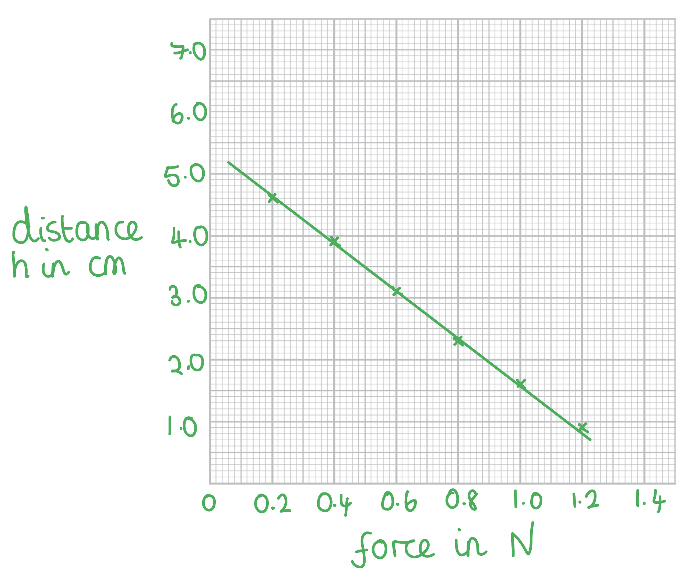

- Suitable linear scale chosen with > 50% of the grid used; **[1 mark]**
- Axes labelled with force in N and distance in cm; **[1 mark]**
- 3 points correctly plotted to the nearest half square; **[1 mark]**
- 5 points correctly plotted to the nearest half square; **[1 mark]**
- Acceptable line of best fit; **[1 mark]**

(iv) Use the graph to find the force for which *h* is zero

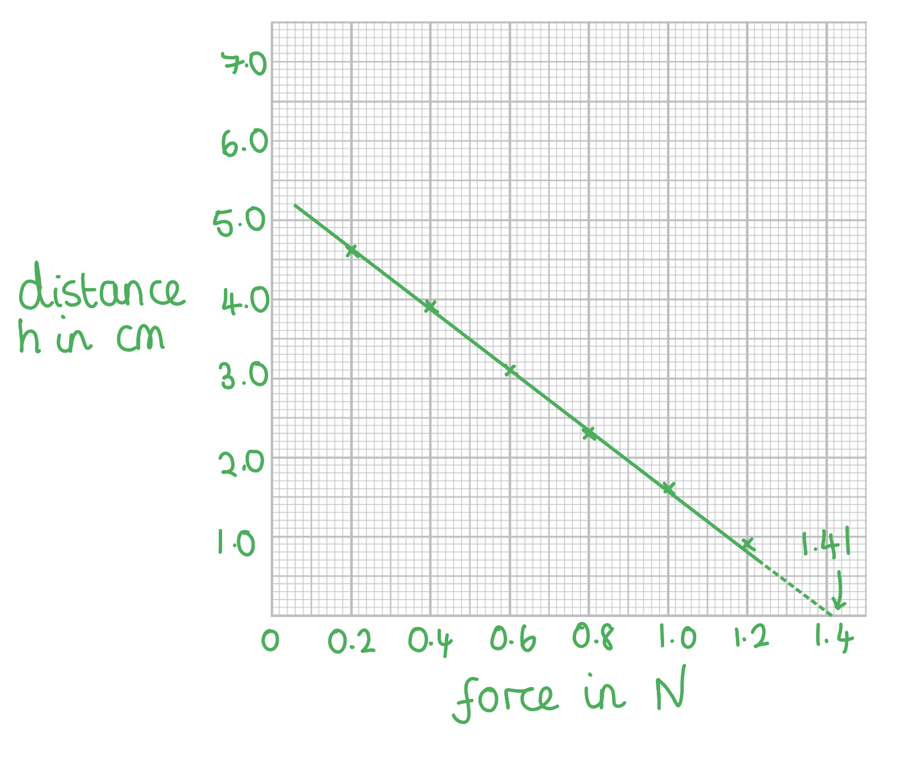

- Straight line seen that is extended to the force axis; **[1 mark]**
- 1.41 N (1.40 ≤ *F  *≤ 1.46) **[1 mark]**

(v) Explain whether this spring obeys Hooke's law

Any **two** from:

- Hooke's law states that the force applied to a material is directly proportional to its extension; **[1 mark]**
- The graph shows equal steps/decrements for distance with force; **[1 mark]**
- (The line goes down because) a different distance has been measured; **[1 mark]**
- The graph does not pass through the origin; **[1 mark]**

**[Total: 12 marks]**

> *For part (v), no mark is given just for saying 'yes' or 'no'. The command word 'explain' requires you to back up your decision with the data and shape of the graph.*
