# Exam Questions — Forces, Movement & Changing Shape
**1. Forces & Motion** · Edexcel IGCSE Physics (4PH1)
> Source: [https://www.savemyexams.com/igcse/physics/edexcel/19/topic-questions/1-forces-and-motion/1-2-forces-movement-and-changing-shape/exam-questions/](https://www.savemyexams.com/igcse/physics/edexcel/19/topic-questions/1-forces-and-motion/1-2-forces-movement-and-changing-shape/exam-questions/) · 29 questions · total 228 marks

## Q1 — easy — 1 marks · exam-questions

### 1((a)) — 1 mark — multiple_choice — from paper 2016 January · 2P
Which of the following is a vector quantity?
- **A.** Density
- **B.** Force
- **C.** Mass
- **D.** Speed

## Q2 — easy — 1 marks · exam-questions

### 1((b)) — 1 mark — multiple_choice — from paper 2016 January · 2P
Which of the following is a scalar quantity?
- **A.** Acceleration
- **B.** Energy
- **C.** Momentum
- **D.** Velocity

## Q3 — easy — 5 marks · exam-questions

### 16((a)) — 2 marks — command: name — structured — from paper June 2012 · 1P
The diagram shows the driving force on a sports car as it moves along a race track.

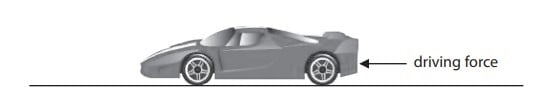

Name **two** forces that oppose the driving force.

### 16((a)) — 3 marks — command: multiple — structured — from paper June 2012 · 1P
The car has a mass of 1400 kg.

The acceleration of the car is 5.5 m/s2.

(i) State the equation linking force, mass and acceleration.

(ii) Calculate the force causing this acceleration.

force = ............................................... N

## Q4 — easy — 5 marks · exam-questions

### 1() — 1 mark — multiple_choice
The diagram shows a skydiver falling at constant velocity.

The name for this constant velocity is
- **A.** average velocity
- **B.** instantaneous velocity
- **C.** terminal velocity
- **D.** non-uniform velocity

### 2() — 4 marks — command: complete — structured
The following passage is about falling at a constant velocity.

Use the words and phrases in the box to complete the sentences about why skydiver fall at a constant velocity. Some words may be used more than once, or not at all.

| **stays the same         increases         decreases          downwards  upwards         greater than         less than         equal to       balanced         unbalanced** |
|---|

As the skydiver falls, the weight ......................... but the air resistance ......................... .

The weight of the skydiver acts ......................... and air resistance acts ......................... .

Initially, the resultant force acts ......................... because the weight is ......................... the air resistance, however, the air resistance gradually ......................... until they are ......................... .

At this point, the resultant force is ......................... zero which means the skydiver is moving at constant velocity.

## Q5 — easy — 13 marks · exam-questions

### 5((a)) — 2 marks — command: name — structured — from paper 2014 June · 1PR
A student investigates the motion of different falling masses by measuring the time taken for empty cupcake cases to fall from a window.

The student drops one case from the window.

He repeats the experiment with two cases stuck together, then with three cases and then with four.

Name two measuring instruments that he would need for his investigation.

### 5((b)) — 2 marks — command: state — structured — from paper 2014 June · 1PR
State the dependent and independent variables in this investigation.

### 2((c)) — 1 mark — command: state — structured — from paper 2012 June · 1PR
State one factor that the student should keep constant in order to make this investigation valid (a fair test).

### 5((d)) — 2 marks — command: add — structured — from paper 2014 June · 1PR
The student draws this table to record his results.

Add suitable headings to his table.

| ----------------------  in ------------ | ----------------------  in ------------ |
|---|---|
|   |   |
|   |   |

### 5((e)) — 1 mark — command: state — structured — from paper 2014 June · 1PR
State one way that the student can improve his investigation.

### 5((f)) — 5 marks — command: multiple — structured — from paper 2014 June · 1PR
The student notices that the cases accelerate and then fall at constant speed.

(i) The arrows in the diagrams show the size and direction of the forces acting on a case at different points in its fall. Label the forces on the middle diagram.

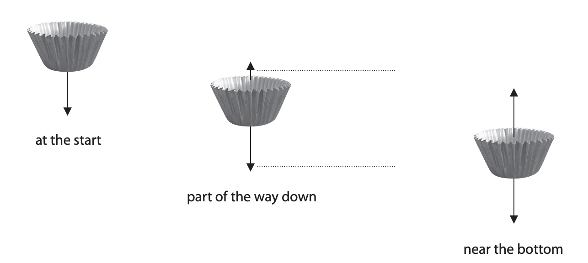

(ii) Explain why the case accelerates and then falls at constant speed.

## Q6 — easy — 8 marks · exam-questions

### 1() — 2 marks — command: describe — structured
A child throws a rubber ball horizontally towards a wall. Describe the effects of the forces acting on the ball as it collides with the wall.

### 2() — 3 marks — command: identify — structured
Identify three types of force acting on the ball as it collides with the wall.

### 3() — 1 mark — command: state — structured
State whether force is a vector quantity or a scalar quantity.

### 4() — 2 marks — command: describe — structured
Describe how the ball demonstrates elastic behaviour when it hits the wall.

## Q7 — medium — 1 marks · exam-questions

### 1((d)) — 1 mark — multiple_choice — from paper 2016 January · 2P
When an object falls at terminal velocity
- **A.** it accelerates at 10 m/s2
- **B.** it has no weight
- **C.** the resultant vertical force is downwards
- **D.** the vertical forces on it are balanced

## Q8 — medium — 1 marks · exam-questions

### 9() — 1 mark — multiple_choice — from paper June 2013 · 1P
The student puts a pile of 400 sheets of paper on a table.

He uses a ruler to measure the height of the pile.

The student records the thickness of the pile as 4.1 cm.

This means that the thickness of **one** piece of paper is about
- **A.** 1 cm
- **B.** 1 mm
- **C.** 0.1 mm
- **D.** 0.01 mm

## Q9 — medium — 13 marks · exam-questions

### 7((a)) — 4 marks — command: multiple — structured — from paper June 2015 · 1PR
The diagram shows a man pulling a child on a sledge.

The acceleration of the sledge is 1.5 m/s2. The mass of the child and sledge is 38 kg.

(i) State the equation linking force, mass and acceleration.

(ii) Calculate the force needed to produce this acceleration.

force = ............................................... N

(iii) Suggest a reason why the force exerted on the sledge by the man must be greater than the force calculated.

### 7((b)) — 3 marks — command: multiple — structured — from paper June 2015 · 1PR
The sledge starts from rest and accelerates at 1.5 m/s2 until its velocity is 2.8 m/s.

(i) State the relationship between acceleration, velocity and time.

(ii) Show that the time taken to reach 2.8 m/s is about 2 s.

### 7((c)) — 6 marks — command: multiple — structured — from paper June 2015 · 1PR
This velocity-time graph shows the motion of the sledge as it travels down a hill.

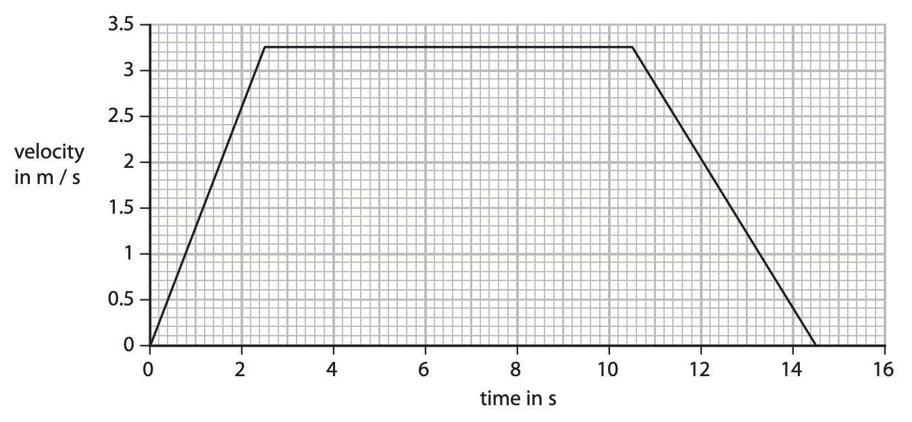

(i) Calculate the distance travelled by the sledge.

distance travelled = ............................................... m

(ii) State the equation linking average speed, distance moved and time taken.

(iii) Calculate the average speed of the sledge for the whole journey.

average speed = ...............................................m/s

## Q10 — medium — 3 marks · exam-questions

### 8((c)) — 3 marks — command: explain — structured — from paper 2013 June · 1P
A car pulls a caravan along a horizontal road.

The caravan is removed and the car makes the return journey without it.

Without the van, the car has a greater acceleration and uses less fuel.

Explain these changes.

## Q11 — medium — 9 marks · exam-questions

### 8((a)) — 1 mark — command: tick — structured — from paper 2013 June · 1PR
A student investigates the extension of a rubber band when masses are added.

Tick the boxes to select the correct items of apparatus that the student would need in order to complete this investigation.

Two items have already been selected.

| Item | Tick (✓**) if item needed** |
|---|---|
| ammeter |   |
| steel spring |   |
| retort stand and clamp |   |
| rubber band | **✓** |
| ruler |   |
| thermometer |   |
| mass hanger |   |
| masses | **✓** |

### 8((b)) — 8 marks — command: multiple — structured — from paper 2013 June · 1PR
The table below shows the student's results.

| Mass in g | Force in N | Extension in cm |
|---|---|---|
| 0 | 0 | 0.0 |
| 150 | 1.5 | 2.4 |
| 350 | 3.5 | 6.3 |
| 550 |   | 12.8 |
| 750 | 7.5 | 18.6 |
| 1050 | 10.5 | 24.0 |

(i) Complete the table by inserting the missing force.

(ii) Plot a graph to show how force varies with extension.

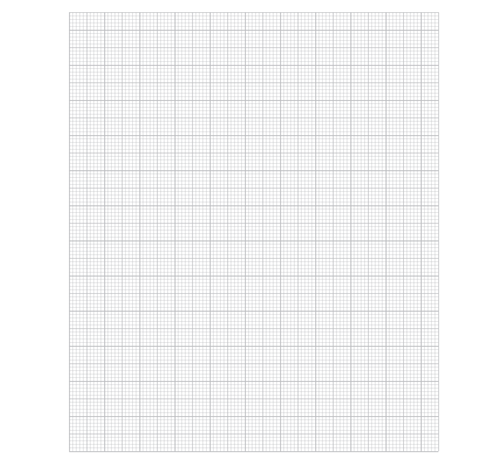

(iii) Use the information from the graph to explain whether the rubber band obeys Hooke's Law.

## Q12 — medium — 4 marks · exam-questions

### 3() — 4 marks — command: state — structured — from paper June 2012 · 1P
A rabbit runs across the road in front of a car.

The driver applies the brakes.

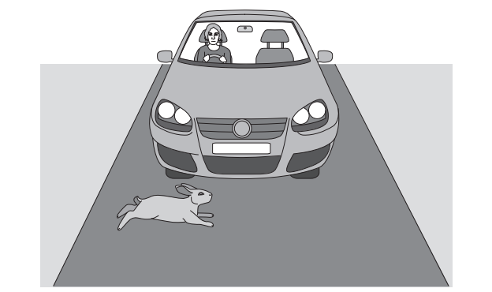

State **four** factors that affect the chance of the rabbit escaping without being hit.

## Q13 — medium — 8 marks · exam-questions

### 15((a)) — 6 marks — command: multiple — structured — from paper 2012 June · 1P
Parachutes are used to slow down a spacecraft as it falls through the atmosphere.

Photograph **G** shows an Apollo spacecraft with three parachutes attached.

This spacecraft falls at a constant velocity.

(i) State the name of this constant velocity.

(ii) Explain why this velocity stays at a constant value.

(iii) Photograph **H** shows an identical Apollo spacecraft. Only two of its parachutes are working.

Explain how the constant velocity reached by this spacecraft compares with the constant velocity of the spacecraft shown in photograph **G**.

### 15((b)) — 2 marks — command: explain — structured — from paper 2012 June · 1P
Photograph **I **shows a space shuttle using a parachute when it lands on a runway.

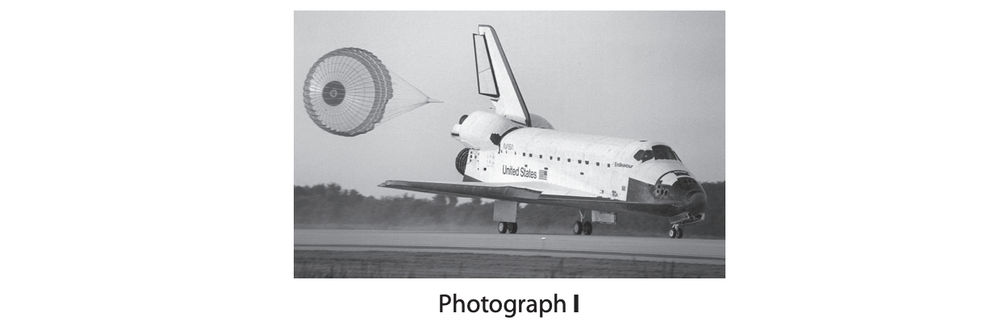

Explain what would happen to the stopping distance of the shuttle if this parachute did not open.

## Q14 — medium — 16 marks · exam-questions

### 11((a)) — 7 marks — command: multiple — structured — from paper 2016 January · 1P
A student investigates the extension of an elastic band for different forces.

(i) List the laboratory apparatus that the student needs for this investigation.

(ii) Extension, force and temperature are variables for this investigation.

Draw a line from each variable to its type.

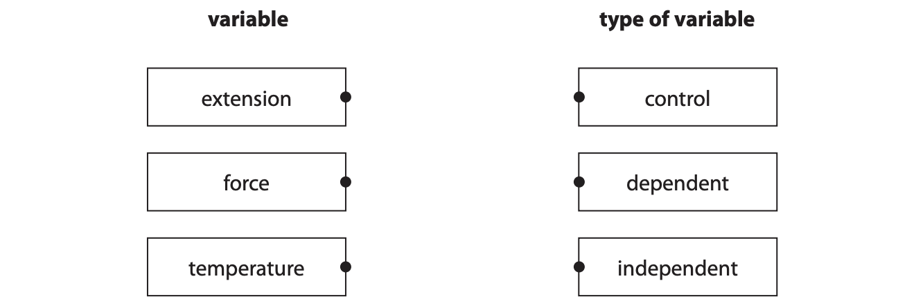

(iii) Describe how the student can measure the extension of the elastic band when he adds a force of 12 N.

### 11((b)) — 9 marks — command: multiple — structured — from paper 2016 January · 1P
The student obtains this data as he first adds weights to the elastic band (loading) and as he then removes weights from the band (unloading).

| Force in N | Extension in cm  (Loading) |
|---|---|
|   |   |
|   |   |
| 0 | 0.0 |
| 2 | 2.3 |
| 4 | 5.3 |
| 6 | 9.8 |
| 8 | 15.3 |
| 10 | 20.0 |

| Force in N | Extension in cm  (Unloading) |
|---|---|
|   |   |
|   |   |
| 0 | 0.0 |
| 1 | 1.4 |
| 3 | 5.0 |
| 7 | 14.8 |
| 9 | 19.1 |
| 10 | 20.0 |

He plots the loading data on a graph as shown.

(i) Suggest how the student could improve the quality of his data.

(ii)  Draw a curve of best fit through the loading data.

(iii) On the same axes, plot the unloading data.

(iv)  Draw a curve of best fit through the unloading data.

(v) The student concludes that the band is an elastic material and that it obeys Hooke’s law.

Discuss whether his conclusion is correct.

You should support your argument with data.

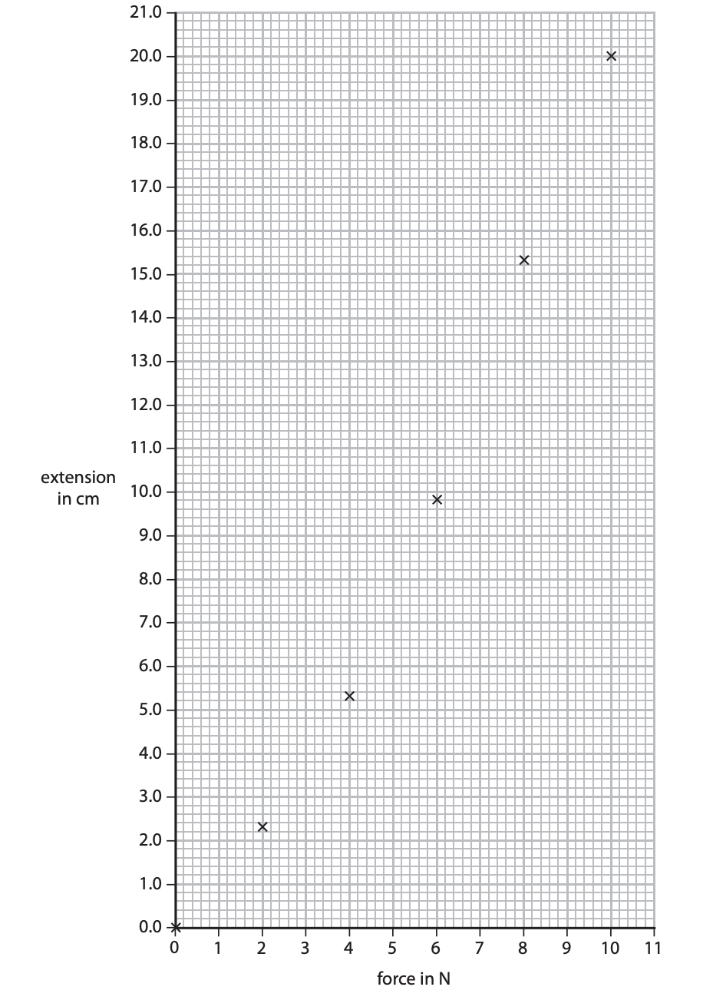

## Q15 — medium — 12 marks · exam-questions

### 7((a)) — 3 marks — command: multiple — structured — from paper 2014 January · 1P
A skydiver jumps from an aircraft.

The mass of the skydiver is 70 kg.

(i) State the equation linking weight, mass and *g*.

(ii) Calculate the weight of the skydiver and state the unit.

weight = ....................................... unit .......................................

### 7((b)) — 4 marks — command: explain — structured — from paper 2014 January · 1P
The graph shows the vertical velocity of the skydiver during the first 40 s of the fall.

His parachute is not open during this time.

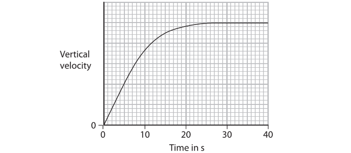

Explain the shape of the graph.

### 7((c)) — 3 marks — command: add — structured — from paper 2014 January ·  1P
The diagram shows the skydiver falling at a constant velocity.

Add two labelled arrows to the diagram to represent the forces acting on the skydiver.

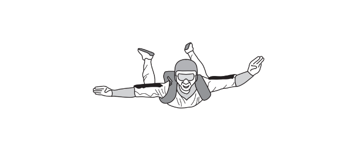

### 7((d)) — 2 marks — command: continue — structured — from paper 2014 January · 1P
The skydiver opens his parachute after 40 s.

Continue the line on the graph to show how the skydiver’s vertical velocity changes and reaches terminal velocity.

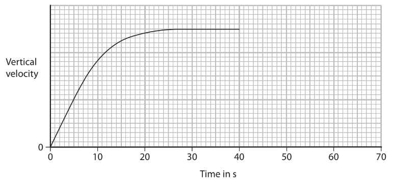

## Q16 — medium — 9 marks · exam-questions

### 3((a)) — 1 mark — command: complete — structured — from paper 2012 January · 1P
The graph shows the minimum stopping distances, in metres, for a car travelling at different speeds on a dry road.

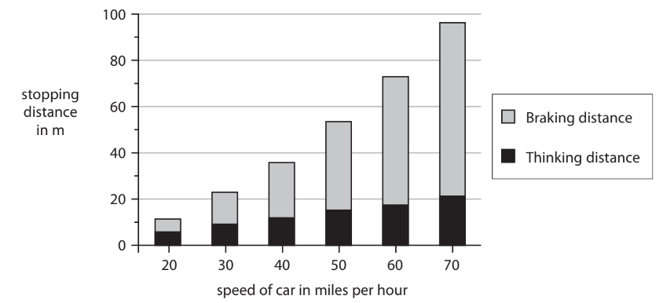

Complete the equation to show the link between stopping distance, thinking distance and braking distance.

Stopping distance = ........................................................................

### 3((b)) — 2 marks — command: describe — structured — from paper 2012 January · 1P
Describe the patterns shown in the graph.

### 3((c)) — 1 mark — command: estimate — structured — from paper 2012 January · 1P
Use the graph to estimate the stopping distance for a car travelling at 35 miles per hour.** **

stopping distance = ......................................... m

### 3((d)) — 1 mark — command: suggest — structured — from paper 2012 January · 1P
To find the minimum stopping distance, several different cars were tested.

Suggest how the data from the different cars should be used to give the values in the graph.

### 3((e)) — 4 marks — command: explain — structured — from paper 2012 January · 1P
The tests were carried out on a dry road.

If the road is icy, describe and explain what change there would be, if any, to

(i) the thinking distance

(ii) the braking distance

## Q17 — medium — 10 marks · exam-questions

### 10((a)) — 5 marks — command: plan — structured — from paper 2014 January · 1P
A student investigates how the extension of a spring varies when he hangs different loads from it.

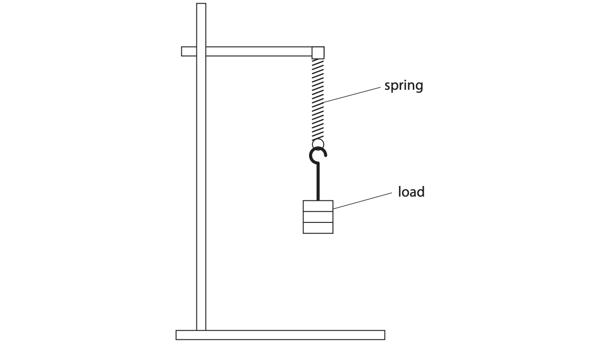

Write a plan for the student’s investigation.

Your plan should include details of how the student can make accurate measurements.

You may add to the diagram to help your answer.

### 10((b)) — 3 marks — command: draw — structured — from paper 2014 January · 1P
The student finds that the spring obeys Hooke’s law.

Draw a graph on the axes to show Hooke’s law relationship. Label the axes.

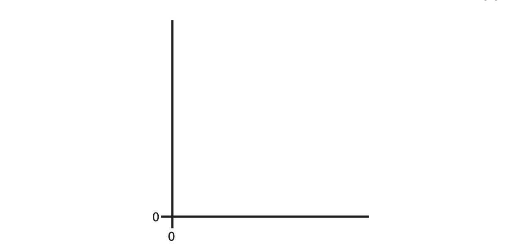

### 10((c)) — 2 marks — command: explain — structured — from paper 2014 January · 1P
The student concludes that the spring shows elastic behaviour.

Explain what is meant by the term **elastic behaviour**.

## Q18 — medium — 14 marks · exam-questions

### 11((a)) — 2 marks — command: multiple — structured — from paper 2013 June · 2PR
A student investigates friction between a block of wood and different types of surface.

The student uses the equipment shown in photograph A to measure the force needed to move the block of wood.

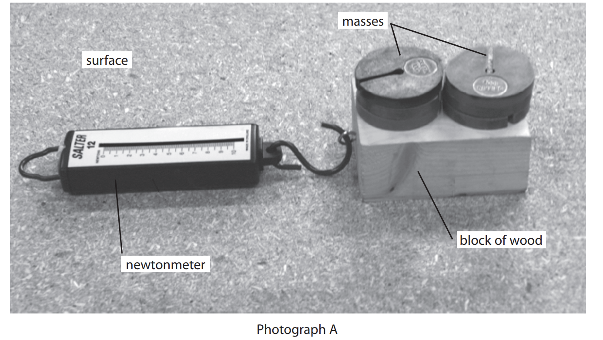

(i) Suggest why the student places masses on the block.

(ii) Explain why he keeps the masses constant during the experiment.

### 11((b)) — 6 marks — command: multiple — structured — from paper 2013 June · 2PR
The student investigates five different types of surface.

The table shows his results.

| Types of surface | Force in N  1st reading | Force in N  2nd reading | Force in N  Average |
|---|---|---|---|
| chipboard | 3.0 | 3.0 | 3.0 |
| wood | 2.5 | 2.5 | 2.5 |
| coarse sandpaper | 4.7 | 4.3 |   |
| fine sandpaper | 5.6 | 5.8 | 5.7 |
| ice | 0.5 | 0.5 | 0.5 |

(i) Give an example of a non-continuous variable in this investigation.

(ii) Complete the table by inserting the missing average.

(iii) Display the average force results for this investigation on the grid.

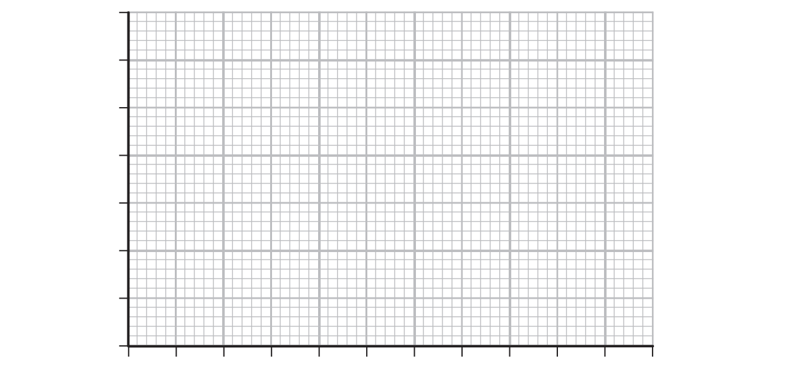

### 11((c)) — 2 marks — command: suggest — structured — from paper 2013 · 2PR
The student compares his results with others in the class.

He finds that they have different values for the forces.

Suggest why.

### 11((d)) — 2 marks — command: explain — structured — from paper 2013 · 2PR
The student repeats the investigation using another block of wood as shown in photograph B.

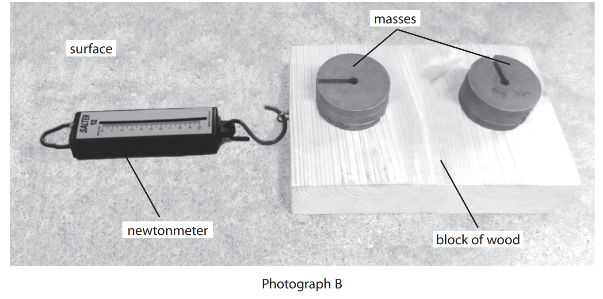

This block of wood has the same mass but a different area of contact.

Explain how this change affects the pressure on the surface.

### 11((e)) — 2 marks — command: suggest — structured — from paper 2013 · 2PR
Suggest two ways in which the student could reduce friction between the two surfaces.

## Q19 — medium — 6 marks · exam-questions

### 12((a)) — 1 mark — command: which — structured — from paper 2016 June · 1P
A student investigates whether a spring obeys Hooke’s law.

She uses the apparatus shown in the photograph.

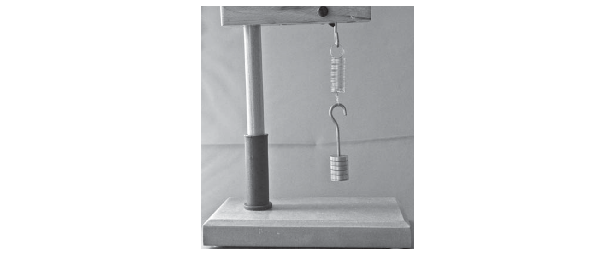

Which additional measuring instrument does the student need for the investigation?

### 12((b)) — 5 marks — command: explain — structured — from paper 2016 June · 1P
Explain how the student can investigate whether the spring obeys Hooke’s law.

## Q20 — medium — 9 marks · exam-questions

### 13((a)) — 1 mark — command: state — structured — from paper 2016 June · 1PR
A hot-air balloon is tied to the ground by two ropes.

The diagram shows the forces acting on the balloon.

The tension T in each rope is 200 N.

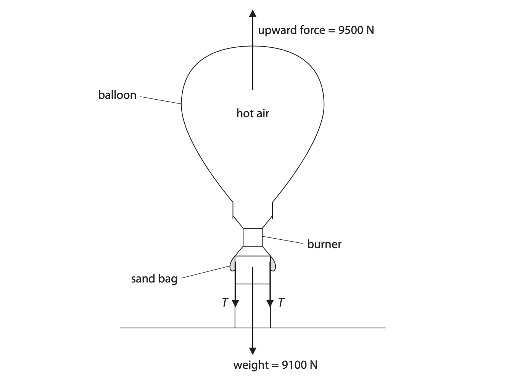

The ropes are untied and the balloon starts to move upwards.

State the value of the force acting downwards on the balloon immediately after the ropes are untied and before the balloon starts moving.

force downwards = ............................................... N

### 13((b)) — 3 marks — command: multiple — structured — from paper 2016 June · 1PR
(i) State the relationship between unbalanced force, mass and acceleration.

(ii) The balloon has a total mass of 910 kg.

The initial unbalanced force on the balloon is 400 N upwards.

Calculate the initial acceleration.

initial acceleration = ............................................... m/s2

### 13((c)) — 3 marks — command: explain — structured — from paper 2016 June · 1PR
Explain how the upward acceleration of the balloon changes during the first few seconds of its flight.

### 13((d)) — 2 marks — command: explain — structured — from paper 2016 June · 1PR
While the balloon is still accelerating, the pilot controls the balloon by pouring some sand from the bags.

Explain how this affects the upward acceleration of the balloon.

## Q21 — medium — 7 marks · exam-questions

### 1() — 4 marks — command: multiple — structured
An ice hockey player strikes a puck, initially at rest, towards a goal.

(i) Describe the motion of the puck while it is in contact with the hockey stick.

[1]

The diagram shows the puck immediately after it has lost contact with the hockey stick.

The force of friction on the puck is represented on the diagram.

(ii) Draw labelled arrows on the diagram to show the other forces that act on the puck at this instant.

[3]

### 2() — 3 marks — command: multiple — structured
After leaving the hockey stick, the puck does not move with constant speed.

(i) State the direction in which the puck is accelerating.

[1]

(ii) Explain how the force arrows in the diagram show this.

[2]

## Q22 — hard — 1 marks · exam-questions

### 7((b)) — 1 mark — multiple_choice — from paper Jun 2015 · 1P
A flying squirrel is an animal that can glide through the air. It spreads out its limbs to stretch out a membrane that helps it to glide.

© Robert Savannah

The flying squirrel glides from P to Q with a constant velocity.

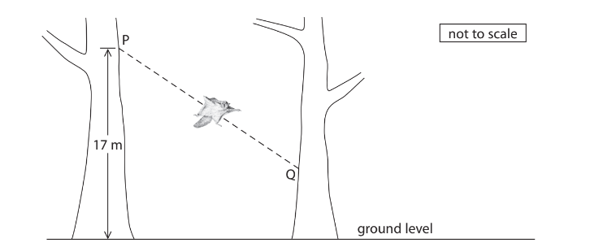

The velocity of the squirrel decreases to zero when it reaches the second tree because
- **A.** an unbalanced force acts on the squirrel
- **B.** no force acts on the squirrel
- **C.** the GPE of the squirrel increases
- **D.** the KE of the squirrel increases

## Q23 — hard — 10 marks · exam-questions

### 1((a)) — 5 marks — command: explain — structured — from paper 2014 June · 1P
A student investigates terminal velocity.

She uses a tall glass tube filled with oil.

She drops a metal ball into the tube.

The ball falls through the oil.

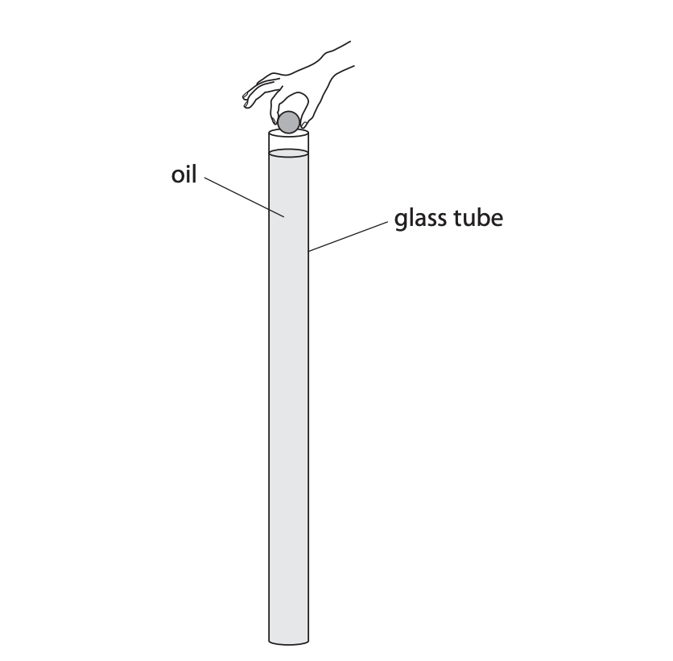

Use ideas about forces to explain how a falling object can reach a terminal velocity.

### 1((b)) — 5 marks — command: describe — structured — from paper 2014 June · 1P
Describe how the student could find out if the ball reaches terminal velocity as it falls through the oil.

In your answer, you should include

- the measuring instruments that the student will need
- the measurements that she should take
- how she could use her measurements to find out if the ball reached terminal velocity.

You may include a labelled diagram in your answer.

## Q24 — hard — 12 marks · exam-questions

### 2((a)) — 5 marks — command: multiple — structured — from paper 2015 January · 1P
A golfer practises hitting balls on a golf course.

Ball X rolls along level ground, as shown in the diagram.

(i) Add labelled arrows to the diagram to show the directions of two of the forces acting on ball X.

(ii) Explain why ball X slows down and stops.

### 2((b)) — 1 mark — command: suggest — structured — from paper Jan 2015 · 1P
The golfer hits ball Y at an angle into the air.

He gives it the same initial kinetic energy as ball X.

Suggest why ball Y travels much further than ball X before it stops.

### 2((c)) — 6 marks — command: multiple — structured — from paper 2015 January · 1P
The mass of ball Y is 45 g.

The golfer gives the ball 36 J of kinetic energy when he hits it.

(i) State the equation linking kinetic energy, mass and speed.

(ii) Calculate the initial speed of ball Y.

initial speed = .............................................................. m/s

(iii) Ball Y reaches a maximum height of 30 m.

Suggest how the golfer should hit ball Y so it can reach a greater height.

## Q25 — hard — 10 marks · exam-questions

### 3((a)) — 5 marks — command: calculate — structured — from paper 2013 January · 1P
The Apollo 15 mission landed on the Moon in 1971.

The astronaut David Scott dropped a hammer and a feather.

They were released from rest at the same time and from the same height.

The hammer and the feather landed at the same time.

The graph shows how the velocity of the hammer changed with time.

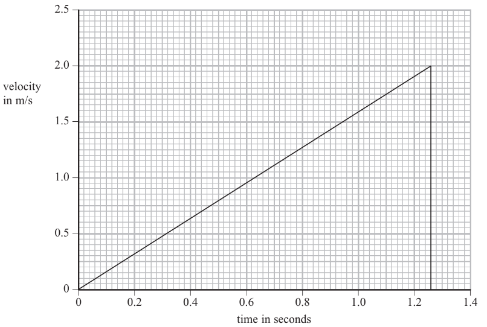

(i) Use the graph to calculate the acceleration due to gravity on the Moon.

Give the unit.

acceleration = .......................... unit .................

(ii) Use the graph to calculate the height the hammer was dropped from.

height = ................................... m

### 3((b)) — 1 mark — command: suggest — structured — from paper 2013 January · 1P
The gravitational field strength is smaller on the Moon than on the Earth.

Suggest why.

### 3((c)) — 4 marks — command: explain — structured — from paper 2013 January · 1P
If the same experiment is carried out on Earth, air resistance affects both objects.

The feather reaches the ground after the hammer, even though the force of air resistance is smaller on the feather than on the hammer.

Explain why the feather reaches the ground after the hammer.

## Q26 — hard — 10 marks · exam-questions

### 4((a)) — 2 marks — command: explain — structured — from paper June 2013 · 1P
A student plans to measure the thickness of a sheet of paper with a ruler.

Explain why it is difficult to measure the thickness of a single piece of paper with a ruler.

### 4((b)) — 2 marks — command: suggest — structured — from paper June 2013 · 1P
The student puts a pile of 400 sheets of paper on a table.

He uses a ruler to measure the height of the pile.

The student records the thickness of the pile as 4.1 cm.

Suggest two reasons why the student's value for the thickness of the pile may be inaccurate.

### 4((c)) — 6 marks — command: multiple — structured — from paper June 2013 · 1P
The student folds the sheet of paper to make a paper aeroplane.

He throws the paper aeroplane into the air and it flies at a constant velocity.

(i) Explain why the forces on the paper aeroplane must be balanced.

(ii) The diagram shows the paper aeroplane as it moves at a constant velocity towards the right and slightly downwards.

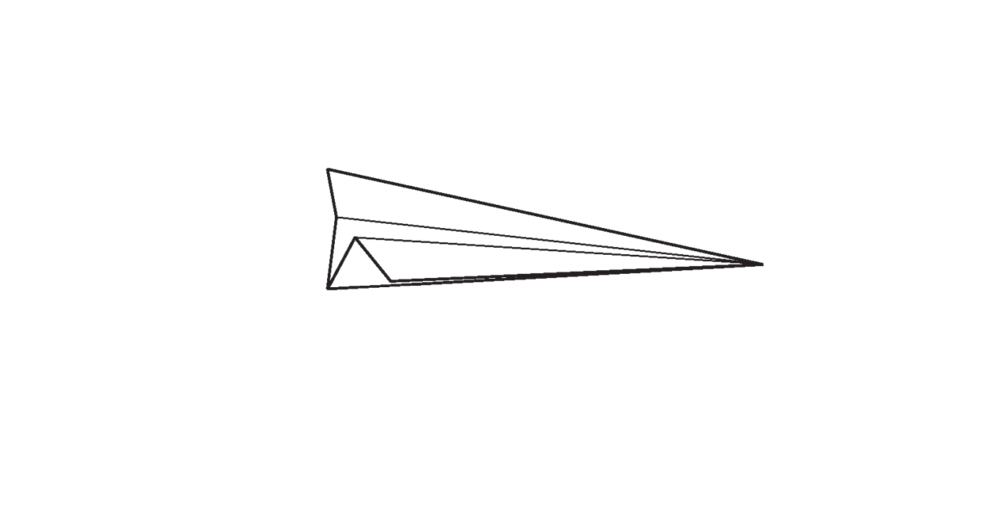

Add labelled arrows to the diagram to show the directions of the forces of

- Weight
- Lift
- Drag

(iii) As it flies, the paper aeroplane loses gravitational potential energy.

What happens to this energy?

## Q27 — hard — 11 marks · exam-questions

### 5((a)) — 3 marks — command: multiple — structured — from paper 2015 January · 2P
A student investigates the stretching of rubber bands.

She stretches four rubber bands as shown in the photograph.

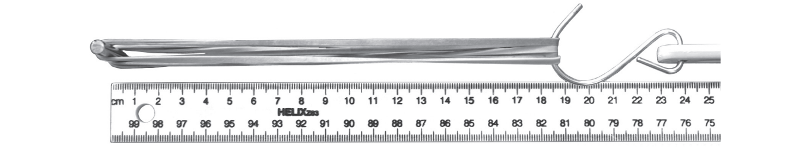

She applies a force of 5.0 N and measures the length of the rubber bands.

She repeats the experiment with different numbers of rubber bands, using a force of 5.0 N each time.

The table shows her results.

| Number of rubber bands | Stretched length in cm |
|---|---|
| 1 | 43.2 |
| 2 | 28.0 |
| 3 | 21.5 |
| 4 |   |
| 5 | 17.6 |
| 6 | 17.0 |

(i) Estimate the length of the four rubber bands shown in the photograph and use your value to complete the table.

(ii) Suggest two reasons why your estimate may not be accurate.

### 5((b)) — 1 mark — command: suggest — structured — from paper 2015 January · 2P
Suggest how the student made this investigation a fair test.

### 5((c)) — 7 marks — command: multiple — structured — from paper 2015 January · 2P
(i) The number of rubber bands is a series of whole numbers.

State the name of this type of variable.

(ii) Display the results of the student’s investigation on the grid.

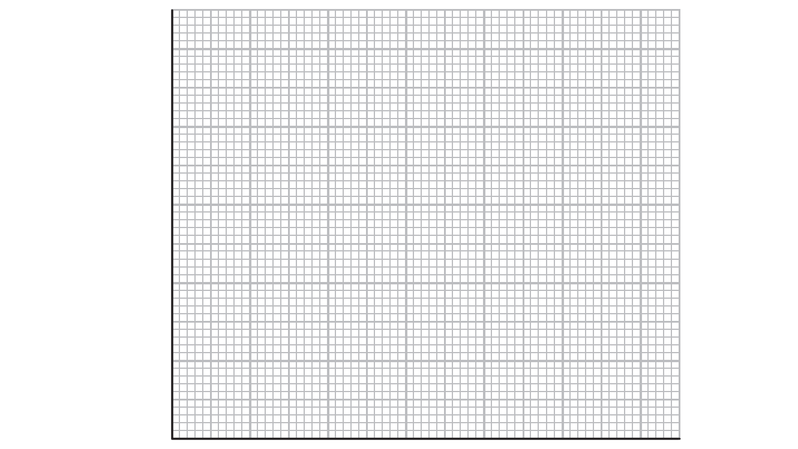

(iii) Describe the relationship between the number of rubber bands and the stretched length.

## Q28 — hard — 5 marks · exam-questions

### 6((a)) — 1 mark — command: multiple — structured — from paper 2013 January · 2P
A student makes chains of elastic bands by joining them together with paperclips.

He uses a newtonmeter to stretch each chain along a metre rule, as shown in photograph **A**.

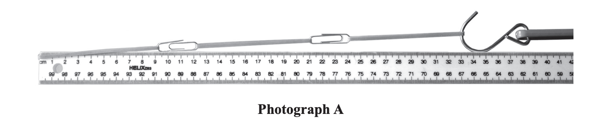

For each chain, he records

- the number of elastic bands
- the length when the tension is 2 N
- the length when the tension is 1 N

Then he calculates the difference in length for each chain.

(i) Complete the table by calculating the missing value.

| Number of elastic bands | Length in cm when  tension = 2 N          tension = 1 N | Difference in length in cm |   |
|---|---|---|---|
| 1 | 8.1 | 7.5 | 0.6 |
| 2 | 20.2 | 18.2 | 2.0 |
| 3 | 31.7 | 29.3 | 2.4 |
| 4 | 43.7 | 40.3 | 3.4 |
| 5 | 56.3 | 51.6 | 4.7 |
| 6 | 67.6 | 62.5 |   |

(ii) Use the grid to plot a graph to show the relationship between the number of elastic bands and the difference in length.

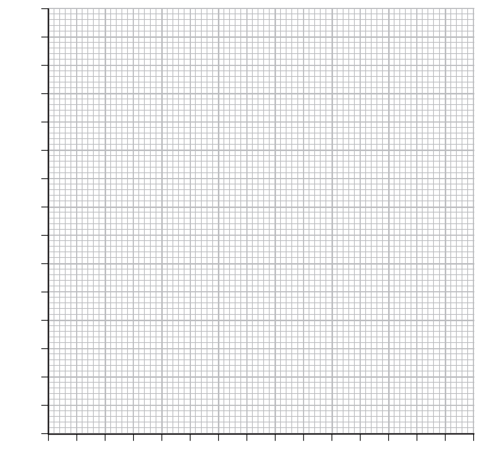

(iii) Describe your line of best fit.

### 3((b)) — 2 marks — command: estimate — structured — from paper 2013 January · 2P
Photograph **B **shows a paperclip in one of the chains against the same metre rule.

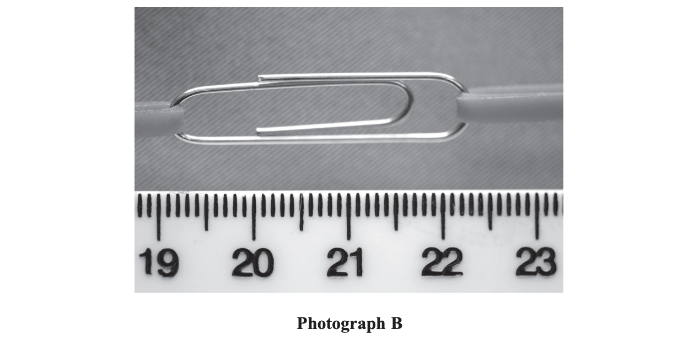

Use photograph **B** to estimate the length of this paperclip.

length = ....................................cm

### 6((c)) — 2 marks — command: suggest — structured — from paper 2013 January · 2P
Look again at photograph** A**.

Suggest two ways that the student could improve his measuring technique.

## Q29 — hard — 14 marks · exam-questions

### 7((a)) — 2 marks — command: suggest — structured — from paper 2015 June · 1P
A student uses this apparatus to investigate forces stretching a spring.

She uses a ruler to measure the vertical distance *h* between the bottom of the mass hanger and the base of the stand.

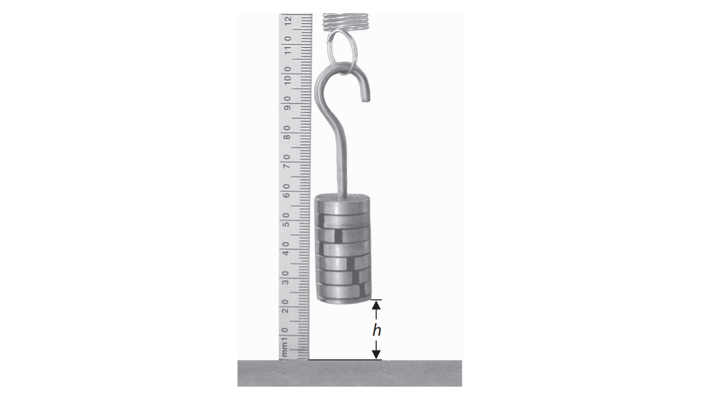

Suggest two ways that the student can measure distance *h *more accurately.

### 7((b)) — 12 marks — command: multiple — structured — from paper 2015 June · 1P
The student continues her investigation by loading the spring with different masses.

The table shows her results.

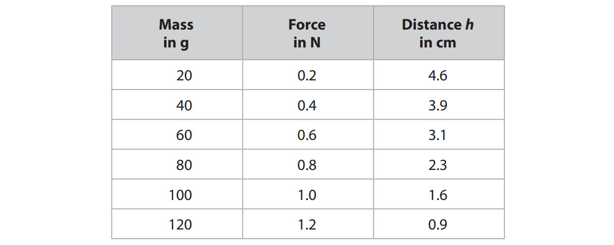

(i) Name the dependent variable in this investigation.

(ii) Explain how the force values in the table are calculated.

(iii) Plot a graph of distance *h* against force, and draw the line of best fit.

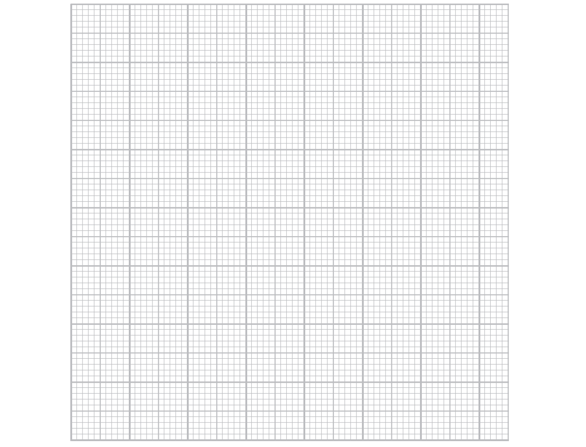

(iv) Use the graph to find the force for which *h* is zero

force = ......................N

(v) Explain whether the spring obeys Hooke's law.
