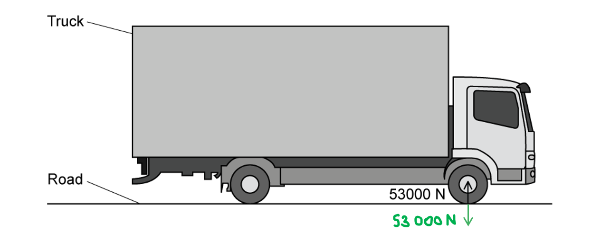
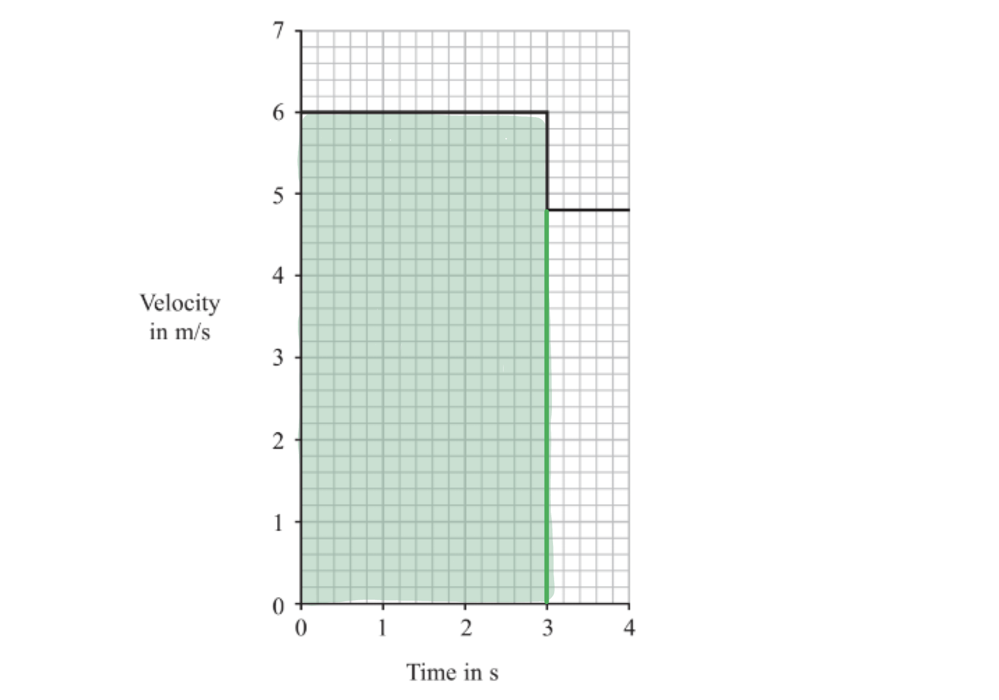
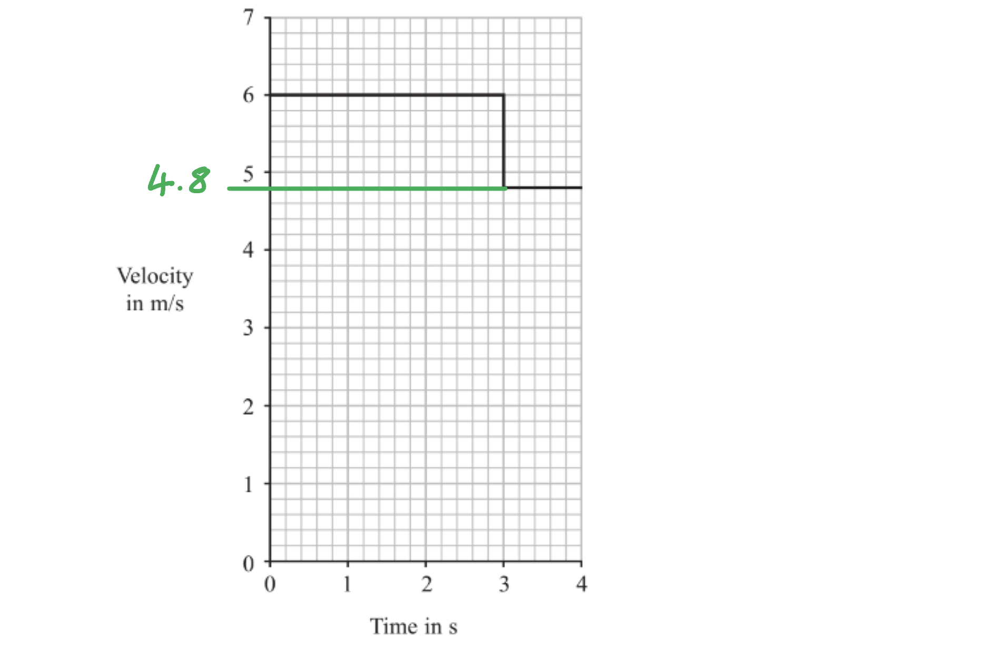

# Mark Schemes — Momentum
**1. Forces & Motion** · Edexcel IGCSE Physics (4PH1)

## Q1 — easy — 4 marks · exam-questions

### 1() — 1 marks
**Correct answer: B** — 

The correct answer is B because:

- Momentum = mass (kg) × velocity (m/s)

  - Therefore, the units are kg m/s

- In symbols, momentum can be written as $p=mv$

  - This is the same as $v=\frac{p}{m}$
- Hence, **B** is the only correct answer

### 2() — 1 marks
**Correct answer: B** — $F\Deltat=\Deltap$

**Final answer:** **The correct answer is ****B**** because:**

- Force is equal to the rate of change in momentum
- This means $F=\frac{\Deltap}{\Deltat}$
- Therefore, the only expression that is correct is $F\Deltat=\Deltap$

  - This is option **B**

### 3() — 2 marks
The correct sentences are:

- Momentum is a **vector** quantity because it has **magnitude and direction**; **[1 mark]**
- In a closed system, the total momentum before a collision is **equal to** the total momentum after the event; **[1 mark]**

**[Total: 2 marks]**

## Q2 — easy — 8 marks · exam-questions

### 3((a)) — 2 marks
Tick the vector and scalar quantities:

| ** Quantity** | **Vector** | **Scalar** |
|---|---|---|
| distance |   | **Final answer:** **✓** |
| force | **Final answer:** **✓** |   |
| momentum | **✓** |   |
| speed |   | **Final answer:** **✓** |
| velocity | **Final answer:** **✓** |   |

- Three correct ticks; **[1 mark]**
- A fourth correct tick; **[1 mark]**

**[Total: 2 marks]**

### 3((b)) — 3 marks
(i) The relationship between momentum, mass and velocity is:

- Momentum = mass × velocity **OR ***p* = *mv *; **[1 mark]**

(ii) Calculate the momentum of the truck:

List the known quantities:

- Mass of the truck, *m* = 15 000 kg
- Velocity of the truck, *v* = 20 m/s

Substitute values into the momentum equation:

- *p* = 15 000 × 20 **[1 mark]**
- *p* = 300 000 kg m/s **[1 mark]**

**[Total: 3 marks]**

### 4((c)) — 3 marks
(i) Newton's Third Law states:

- When two bodies interact, the forces they exert on each other are <u>equal</u> and act in the <u>opposite</u> direction; **[1 mark] **

(ii) The Newton's Third Law force pair is:

- Arrow drawn from tyre downwards; **[1 mark] **
- Arrow drawn to the same size; **[1 mark] **
- (The force on the road from the tyre is) 53 000 N; **[1 mark] **

**[Total: 4 marks]**

## Q3 — easy — 4 marks · exam-questions

### 1() — 1 marks
**Correct answer: A** — 

**Final answer:** **The correct answer is ****A**** because:**

- A Newton's Third Law force pair must:

  - Have the same size
  - Act in the opposite direction
  - Act on different objects
  - Be of the same type

- The force pairs shown in diagram **A** are the only ones to meet all of these conditions

- Students often forget that Newton's Third Law force pairs must be of the **same type**:

  - The force pair between the book and the table is a **contact** force
  - Weight is a force that occurs due to gravity, which is a **non-contact force**

- Therefore, do not make the mistake of labelling a force pair as "Reaction force" and "Weight" as these are **not** the same type of force!

### 2() — 3 marks
One mark for each correct statement:

- When a person walks on the ground, there is a force from the **foot**** **which pushes the **ground**** **backward; **[1 mark]**
- From Newton's Third Law, there is an **equal** and **opposite** force; **[1 mark]**
- From the **ground** on the **foot** which pushes the foot forward; **[1 mark]**

**[Total: 3 marks]**

## Q4 — easy — 10 marks · exam-questions

### 1() — 1 marks
**Correct answer: C** — increasing the time taken for the driver to stop

**Final answer:** **The correct answer is ****C**** because:**

- Safety features are designed to reduce the impact of a force by reducing the rate of change in momentum experienced by the driver
- This can be achieved by **increasing the time taken** for the driver to stop

  - This is because impact force = the rate of change of momentum or $F=\frac{\Deltap}{\Deltat}$

- So, **increasing the time** of the impact will** reduce the size** of the impact force felt by the driver

**A, B **&** D** are incorrect as the aim of the airbag is to reduce the force experienced during a crash, so increasing the force, rate of change of momentum, or time taken to stop would all increase the impact force and hence, not protect the driver

### 2() — 3 marks
(i) State the equation linking momentum, mass and velocity:

- Momentum = mass × velocity **OR**** ***p* = *mv* **[1 mark]**

(ii) Calculate the momentum of the driver:

List the known quantities:

- Mass, *m* = 67 kg
- Velocity,* v* = 15 m/s

Substitute the known values into the equation:

- *p* = 67 × 15 **[1 mark]**
- *p* = 1005 kg m/s **[1 mark]**

**[Total: 3 marks]**

### 3() — 3 marks
(i) State the equation linking force, change in momentum and time:

- Force = $\frac{changeinmomentum}{time}$  **OR ** `F space equals space fraction numerator open parentheses m v space minus space m u close parentheses over denominator t end fraction`, $F=\frac{\Deltap}{\Deltat}$ **[1 mark]**

(ii) Calculate the force on the driver:

List the known quantities:

- Initial momentum of the driver = 1005 kg m/s
- Time taken = 0.36 s

Calculate the force using the rate of change of momentum:

- Force = $\frac{changeinmomentum}{time}$
- The final momentum *mv* is 0, as the driver comes to a stop, therefore change in momentum = 1005 kg m/s
- Force = $\frac{1005}{0.36}$ **[1 mark]**
- Force = 2792 = 2800 N **[1 mark]**

**[Total: 3 marks]**

### 4() — 3 marks
Calculate the time taken by the passenger to come to a stop:

List the known quantities:

- Change in momentum = 1005 kg m/s
- Force on driver = 2800 N

Calculate the time taken:

- Force = $\frac{changeinmomentum}{time}\Rightarrow$time = $\frac{changeinmomentum}{force}$
- Force on the passenger = 2800 × 5 = 14 000 N **[1 mark]**
- Time taken = $\frac{1005}{14000}$ **[1 mark]**
- Time taken = 0.07 s **[1 mark]**

**[Total: 3 marks]**

## Q5 — easy — 8 marks · exam-questions

### 1() — 2 marks
The principle of conservation of momentum states:

- The total momentum before a collision is equal to the total momentum after the collision; **[1 mark]**
- In an isolated / closed system **OR** when no external forces act; **[1 mark]**

**[Total: 2 marks]**

### 2() — 5 marks
(i) The poles of the magnets are:

- Alike / the same / North-North / South-South; **[1 mark]**
- (Because there is) repulsion (due to like magnetic poles); **[1 mark]**

(ii) The total momentum of glider **A** and glider **B** after the collision is:

- 0.50 kg m/s **[1 mark]**

(iii) Calculate the velocity of glider **A** before the collision:

List the known quantities:

- Mass of glider **A**, *m* = 0.250 kg
- Momentum of glider **A**, *p* = 0.5 kg m/s

Calculate velocity using the equation for momentum:

- Momentum = mass × velocity **or** *p* = *mv*
- $p=mv\Rightarrowv=\frac{p}{m}$
- $v=\frac{0.5}{0.250}$ **[1 mark]**
- Velocity of glider **A** = 2 m/s **[1 mark]**

**[Total: 5 marks]**

### 3() — 1 marks
**Correct answer: A** — 1 m/s

**Final answer:** **The correct answer is ****A**** because:**

- Momentum is equal to *p* = *mv*
- From conservation of momentum: Momentum before = Momentum after

  - Momentum before: 0.5 kg m/s
  - Momentum after: *mv* + *mv* = 2*mv*

- The two gliders will move with the same velocity in the opposite direction to each other
- Therefore:

  - 2*mv* = 0.5
  - *mv* = 0.25
  - *v* = 0.25 ÷ 0.25 = 1 m/s

- Therefore, option **A** is correct

## Q6 — medium — 9 marks · exam-questions

### 6((a)) — 5 marks
(i) The relationship between momentum, mass and velocity is:

- Momentum = mass × velocity **OR ***p* = *mv; ***[1 mark]**

(ii) Calculate the momentum of the hammer:

List the known quantities:

- Mass of the hammer, *m* = 0.50 kg
- Velocity of the hammer, *v* = 3.1 m/s

Substitute values into the momentum equation:

- *p* = 0.50 × 3.1 **[1 mark]**
- *p* = 1.55 = 1.6 kg m/s **[1 mark]**

(iii) Calculate the amount of force that causes the momentum of the hammer to reduce to zero in 0.070 s

List the known quantities:

- Time for moment to reduce to zero, *t* = 0.070 s
- Initial moment, *p* = 1.55 kg m/s

From the equation sheet:

- $Force=\frac{changeinmomentum}{timetaken}$     `F equals fraction numerator open parentheses m v minus m u close parentheses over denominator t end fraction`

Substitute values into force equation:

- *F* = $\frac{1.55}{0.070}$ **[1 mark]**
- *F *= 22.143 = 22 N **[1 mark]**

**[Total: 5 marks]**

> *Force is sometimes referred to as the 'rate of change of momentum' based on the equation *$force=\frac{changeinmomentum}{timetaken}$

> *You will often see questions linking the two variables together!*

### 6((b)) — 2 marks
These two forces are related because:

- The forces are <u>equal</u>; **[1 mark]**
- and <u>opposite</u> / one is up and one is down; **[1 mark]**

**OR**

- Newton's <u>third</u> law; **[1 mark]**
- States that whenever two bodies interact, the forces they exert on each other are equal and opposite; **[1 mark]**

**[Total: 2 marks]**

> *Avoid saying that the forces are 'balanced'. Newton's third law applies in all situations, even when forces are not balanced.*

### 6((c)) — 2 marks
The nail exerts more pressure on the wood than it does on the hammer because:

Any **two** from:

- Pressure is equal to the force per unit area **or** $\frac{force}{area}$**[1 mark]**
- Pressure is inversely proportional to area; **[1 mark]**
- The forces on the wood and hammer are equal; **[1 mark]**
- Therefore, since a <u>smaller area</u> of the nail is in contact with the wood, it exerts more pressure on the wood; **[1 mark]**

**[Total: 2 marks]**

## Q7 — medium — 9 marks · exam-questions

### 5((a)) — 3 marks
(i) The relationship between momentum, mass and velocity is:

- momentum = mass × velocity **OR ***p* = *mv *; **[1 mark]**

(ii) Calculate the initial momentum of the snowball:

List the known quantities:

- Mass of the snowball, *m* = 0.23 kg
- Velocity of the snowball, *v* = 13 m/s

Substitute values into the momentum equation:

- *p* = 0.23 × 13 **[1 mark]**
- *p* = 2.99 = 3.0 kg m/s **[1 mark]**

**[Total: 3 marks]**

### 5((b)) — 3 marks
The skater moves backwards after throwing the snowball forwards because:

**Explanation 1: Conservation of momentum**

- Total momentum (of the skater-snowball system) is conserved; **[1 mark]**
- The snowball gains forward momentum; **[1 mark]**
- Therefore, the skater must gain <u>equal and opposite</u> (backward) momentum (for momentum to be conserved); **[1 mark]**

**OR**

**Explanation 2: Newton’s third law**

- The skater exerts a force on the snowball in the forward direction; **[1 mark]**
- The snowball exerts an <u>equal</u> and <u>opposite</u> force on the skater; **[1 mark]**
- This (backward) force causes the skater to accelerate backwards ; **[1 mark]**

**[Total: 3 marks]**

### 5((c)) — 3 marks
Soft knee pads are protective because:

**Explanation 1: Momentum**

Any **three** from:

- Force is rate of change in momentum **OR** *F* = change in momentum ÷ time; **[1 mark]**
- (Knee pads) increase the time (of impact); **[1 mark]**
- (This means) the same change in momentum; **[1 mark]**
- (Results in) reduced force (on knee); **[1 mark]**

**OR**

**Explanation 2: Acceleration**

Any **three** from:

- (Knee pads) increase the distance / time (to slow down); **[1 mark]**
- (This means) the same change in velocity / speed; **[1 mark]**
- (Leads to) reduced acceleration; **[1 mark]**
- (Results in) reduced force (on knee); **[1 mark]**

**OR**

**Explanation 3: Pressure**

Any **three** from:

- Pressure = force ÷ area **OR ***P* = *F* ÷ *A*; **[1 mark]**
- (Knee pads) increase the area (in contact with ground / knee); **[1 mark]**
- (This means) pressure (on knee) is reduced; **[1 mark]**
- (Results in) reduced force (on knee); **[1 mark]**

**An example of an answer that would score 3 marks:**

The change in momentum of the skater is equal to the skater's initial momentum, as final momentum is zero. If the skater falls over, the compression of the pads on impact with the ice means that the time of impact on the skater's knees is increased **[1 mark]**

Since force is proportional to the rate of change of momentum **[1 mark] **if the time of impact is increased, the rate of change of momentum is reduced, so the force on her knees is also reduced. **[1 mark]**

**[Total: 3 marks]**

## Q8 — medium — 9 marks · exam-questions

### 5() — 4 marks
This airbag can reduce injuries to pedestrians because:

Any **four** from:

- The momentum is reduced; **[1 mark]**
- By the same amount; **[1 mark]**
- Over a longer period of time; **[1 mark]**
- Therefore, the force is reduced; **[1 mark]**
- Because force is the rate of change of momentum; **[1 mark]**
- Less force means less damage / injuries; **[1 mark]**

**[Total: 4 marks]**

### 3((c)) — 5 marks
(i) Calculate the average force on the car:

List the known quantities:

- Initial momentum = 22 500 kg m/s
- Final momentum = 0
- Change in momentum = 22 500 − 0 = 22 500 kg m/s
- Time taken to stop = 0.14 s

Substitute the values into the equation:

- Force = change in momentum ÷ time
- Force = $\frac{22500}{0.14}$ **[1 mark]**
- Force = 160 000 N **[1 mark]**

(ii) Seat belts can reduce injuries to passengers during a crash because

Any **three** from:

- (Seatbelts) increase the time (of impact); **[1 mark]**
- For the same momentum change (with or without a seatbelt); **[1 mark]**
- (This leads to a) reduced force; **[1 mark]**
- Passenger stays on seat / is not thrown from the vehicle; **[1 mark]**

**An answer that would score 3 marks:**

The movement and slight stretching of a seatbelt means that during a crash, the time of impact is longer. **[1 mark]**

The momentum change on the person is the same with or without a seatbelt. **[1 mark]**

Hence, the increased time of impact reduces the average force on the person during the impact, reducing injury. **[1 mark]**

The seatbelt also keeps the person in their seat so that they are not thrown from the car on impact, which further reduces the risk and severity of injury.

**[Total: 5 marks]**

## Q9 — medium — 8 marks · exam-questions

### 7((a)) — 2 marks
Safety features in cars include:

Any **two **from:

- Air bags; **[1 mark]**
- Side impact beams / bars; **[1 mark]**
- Crumple zones / collapsible bumpers; **[1 mark]**
- Collapsible steering column / wheel; **[1 mark]**
- Strong / laminated / safety glass in windows; **[1 mark]**

**[Total: 2 marks]**

> *The question already mentions seat belts, so you would not get any marks for naming them. Also, if you refer to bumpers, you must state they are 'collapsible,' or you will not gain the mark.*

### 7((b)) — 5 marks
(i) Explain how a seat belt reduces the risk of serious injury in a car crash

Any **four** from:

- (Seatbelts) increase the time (of impact); **[1 mark]**
- For the same momentum change (with or without a seatbelt); **[1 mark]**
- (This leads to a) reduced rate of momentum change;
- (Which results in a) reduced force; **[1 mark]**
- The seat belt stretches (during collision); **[1 mark]**
- (Which) increases the area over which the force acts; **[1 mark]**
- (Hence) pressure (on the driver) is reduced; **[1 mark]**

**An example of an answer that would score 4 marks:**

Since force is equal to the rate of change of momentum, as the seatbelt stretches a small amount during the collision **[1 mark]**, it will increase the impact time **[1 mark]**

This increased time will reduce the rate of change of momentum **[1 mark]**, therefore the average force on the driver will be reduced **[1 mark]**

This also increases the area that the force is acting over and hence will reduce the pressure on the driver. This will reduce the risk of injury.

(ii) Suggest why a full-body harness is used in a racing car:

Any **one** from:

- There is a larger change in momentum (transferred in collision); **[1 mark]**
- There is a larger force during impact; **[1 mark]**
- Straps have a greater area over which force acts; **[1 mark]**
- Larger area of straps reduces the pressure (on driver); **[1 mark]**

**[Total: 5 marks]**

### 7((c)) — 1 marks
State what happens to the momentum of the car during the crash:

- Momentum (of car and dummy) reduces to zero; **[1 mark]**

**OR**

- All momentum is absorbed by the wall/Earth; **[1 mark]**

**[Total: 1 mark]**

## Q10 — medium — 8 marks · exam-questions

### 9((a)) — 6 marks
(i) State the equation linking momentum, mass and velocity:

- Momentum = mass × velocity

**OR**

- $p=mv$ **[1 mark]**

(ii) Calculate the momentum of the wet cloth and give the unit:

List the known quantities:

- Mass,* m* = 0.15 kg
- Velocity, *v* = 6.0 m/s

Substitute the known values into the equation from part (i):

- $p=0.15\times6.0$ **[1 mark]**
- *p *= 0.9 **[1 mark]**

State the unit:

- kg m/s / N s **[1 mark]**

(iii) Calculate the velocity of the cloth and tin 1:

Rearrange the momentum equation to make velocity the subject:

- $v=\frac{p}{m}$

Determine the combined mass of the cloth and tin 1:

- Total mass = mass of cloth + mass of tin 1
- Total mass = 0.15 + 0.050 = 0.2 kg

Substitute the known values into the equation:

- $v=\frac{0.9}{0.2}$ **[1 mark]**
- v = 4.5 m/s **[1 mark]**

**[Total: 6 marks]**

### 9((b)) — 2 marks
Explain why you agree or disagree with the student's conclusion:

- The student is incorrect; **[1 mark]**
- Because the variables were not controlled; **[1 mark]**

**[Total: 2 marks]**

> *The student would be correct if the mass of the second cloth was 0.3 kg, or if the momentum of the second cloth was 1.8 kg m/s, assuming that all the tins have the same mass as tin 1, and that the cloths are thrown with the same velocity. If you have explained this in your answer, you would still be awarded full marks. *

## Q11 — medium — 9 marks · exam-questions

### 1() — 1 marks
**Correct answer: C** — kg m/s

**Final answer:** **The correct answer is C**

- Momentum is defined as

$p=mv$

- Where:

  - $m$ = mass in kg
  - $v$ = velocity in m/s
- Therefore, the units for momentum are

$\mathrm{mass}\times\mathrm{velocity}$

$\mathrm{kg}\timesm/s=\mathrm{kg}m/s$

- This is option **C**

### 2() — 2 marks
To calculate the momentum of the car:

- List the known quantities:

  - Mass, $m=1200\mathrm{kg}$
  - Velocity, $v=15m/s$
- State the relevant equation:

$p=mv$

- Substitute in the known values to calculate:

$p=1200\times15$ **[1 mark]**

$p=$ $18000\mathrm{kg}m/s$** ****[1 mark]**

### 3() — 6 marks
(i) To calculate the velocity of the two vehicles immediately after the collision:

- List the known quantities:

  - Mass of car, $m_{C}=1200\mathrm{kg}$
  - Initial velocity of car, $u_{C}=15m/s$
  - Mass of van, $m_{V}=1800\mathrm{kg}$
  - Initial velocity of van, $u_{V}=0m/s$
- Apply the principle of conservation of momentum:

$p_{before}=p_{after}$ **[1 mark]**

- Determine the momentum before the collision:

$p_{before}=m_{C}u_{C}+m_{V}u_{V}$

`p subscript text before end text end subscript space equals space open parentheses 1200 cross times 15 close parentheses space plus space open parentheses 1800 cross times 0 close parentheses`

$p_{before}=18000\text{kg m/s}$ **[1 mark]**

- Determine the velocity after the collision:

$p_{\text{before}} = p_{\text{after}}$

`18 space 000 space equals space open parentheses 1200 plus 1800 close parentheses cross times v`

$v=\frac{18000}{3000}$ **[1 mark]**

$v=$$6.0m/s$** ****[1 mark]**

(ii) To calculate the magnitude of the average force exerted on the car during the impact:

- State the relevant equation:

`F space equals space fraction numerator m open parentheses v space minus space u close parentheses over denominator t end fraction`

- where $t$ = time of collision = 0.2 s
- Substitute in the known values to calculate:

`F space equals space fraction numerator 1200 cross times open parentheses 6.0 space minus space 15 close parentheses over denominator 0.2 end fraction` **[1 mark]**

$F=$ $54000N$** ****[1 mark]**

> **[mark-scheme]**
> - Equivalent methods will also gain full marks:
> 
>   - using impulse = change in momentum
>   - using* F = ma*

> **[exam-tip]**
> The question asks for a 'magnitude', which means the minus sign can be ignored in the final answer.

## Q12 — hard — 9 marks · exam-questions

### 8((a)) — 1 marks
Describe how the graph can be used to find the distance the ball rolls before it hits the pin:

- The distance is the area under the graph between 0 s and 3 s

Distance = $6 \times 3 =$$18 \text{m}$ **[1 mark]**

> **[mark-scheme]**
> The mark is awarded for identifying the area under the graph between 0 s and 3 s, for the calculation 6 × 3, for the answer 18 m, or for the area shaded on the graph

### 8((b)) — 4 marks
> **[mark-scheme]**
> (i) State the equation linking momentum, mass and velocity:
> 
> - Momentum = mass × velocity **OR** $p = m v$ **[1 mark]**

(ii) Calculate the momentum of the ball before it hits the pin:

- List the known quantities

Mass, *m* = $6 . 4 \text{kg}$

Velocity, *v* = $6 \text{m/s}$, read from the graph before the collision

- Substitute the known values into the equation

$p = 6 . 4 \times 6$ **[1 mark]**

$p = 38 . 4$ **[1 mark]**

- Give the unit with the final answer

Momentum = $38 . 4 \text{kg m/s}$ **[1 mark]**

> **[mark-scheme]**
> 1 mark for substitution into the correct equation, 1 mark for the value and 1 mark for the unit
> 
> Either kg m/s or N s is accepted for the unit

### 8((c)) — 4 marks
(i) Use the graph to determine the velocity of the ball after it hits the pin:

- Read the velocity off the graph after the step at 3 s

Velocity after the collision = $4 . 8 \text{m/s}$ **[1 mark]**

(ii) Calculate the mass of the pin:

- List the known quantities

Momentum before the collision, $p_{1} = 38 . 4 \text{kg m/s}$

Velocity of the ball and pin after the collision, $v = 4 . 8 \text{m/s}$

Mass of the ball, $m_{ball} = 6 . 4 \text{kg}$

- Apply conservation of momentum, remembering that the ball and the pin move off together

Momentum before = momentum after **[1 mark]**

`p_{1} = \left(m_{ball} + m_{pin}\right) \times v`

- Rearrange to make the mass of the pin the subject

$m_{pin} = \frac{p_{1}}{v} - m_{ball}$

- Substitute the known values into the equation

$m_{pin} = \frac{38.4}{4.8} - 6 . 4$ **[1 mark]**

$m_{pin} =$$1 . 6 \text{kg}$ **[1 mark]**

> **[exam-tip]**
> This part asks you to rearrange the momentum equation, so set your working out clearly and line by line. Even if the final answer goes wrong you can still pick up marks for the steps that are right.
> 
> The ball and the pin move off together, so the momentum afterwards belongs to their **combined** mass. Dividing 38.4 by 4.8 gives you 8 kg, which is the ball and the pin together — remember to subtract the 6.4 kg ball to leave the pin.

## Q13 — hard — 7 marks · exam-questions

### 6((a)) — 5 marks
(i) State the equation linking momentum, mass and velocity:

- Momentum = mass × velocity **OR**
- $p=mv$ **[1 mark]**

(ii) Calculate the momentum of ball A at the time of impact and give the unit:

List the known quantities:

- Mass, *m* = 100 g
- Velocity, *v* = 3 m/s

Convert mass into SI units:

- $\frac{100}{1000}=0.1$ kg

Substitute the known values into the equation from part (i):

- $p=0.1\times3$ **[1 mark]**
- *p* = 0.3 **[1 mark]**

State the unit:

- kg m/s **or** N s **[1 mark]**

(iii) Give a reason why the momentum of ball E as it moves away is the same as the momentum of ball A at the time of impact:

- Momentum is conserved; **[1 mark]**

**[Total: 5 marks]**

### 6((b)) — 2 marks
Predict what will happen to the other balls:

- Two balls at opposite ends of the cradle (balls D and E) move up / away **OR **Ball E moves up / away with velocity 2*v*; **[1 mark]**

Give a reason for your answer:

Any **one** from:

- Momentum is still conserved in the collision; **[1 mark]**
- The total momentum of the system is constant; **[1 mark]**
- There is twice the momentum of one ball so the (total) momentum is transferred to two balls; **[1 mark]**

**[Total: 2 marks]**

## Q14 — hard — 4 marks · exam-questions

### 8((a)) — 1 marks
The equation linking momentum, mass and velocity is:

- Momentum = mass × velocity **OR** *p* = *mv ***[1 mark]**

**[Total: 1 mark]**

> *If you're explaining this equation in symbols rather than words, make sure not to use 'm' or 'M' for momentum, which is always represented by 'p'.*

### 8((b)) — 3 marks
List the known quantities:

- Mass of truck, *m*T = 10 000 kg
- Velocity of truck, *v*T = 4.5 m/s
- Mass of car, *m*C = 1500 kg

Calculate momentum of the truck, *p*T:

- *p*T* *=  *m*T*v*T = (10 000) × 4.5 = 45 000 kg m/s **[1 mark]**

Rearrange momentum equation for the velocity, *v*C:

- For the car, *p*C =  *m*C*v*C
- The car has the same momentum as the truck, so *p*C = *p*T
- *v*C = $\frac{p_{C}}{m_{C}}$=  $\frac{45000}{1500}$ **[1 mark]**
- *v*C = 30 m/s **[1 mark]**

**[Total: 3 marks]**

## Q15 — hard — 7 marks · exam-questions

### 5((a)) — 5 marks
(i) State the relationship between momentum, mass and velocity:

- Momentum = mass × velocity **OR ***p *= *mv ***[1 mark]**

(ii) Calculate the combined velocity of the boy and skateboard just after the boy lands on it:

List the known quantities:

- Mass of boy, *m**1* = 43.2 kg
- Mass of skateboard, *m**2* = 2.50 kg
- Velocity of boy before impact, *u**1* = 4.10 m/s 
- Velocity of skateboard before impact, *u**2* = 0 m/s
- Velocity of boy and skateboard after impact, *v *

State the principle of conservation of momentum:

- Momentum (of the boy just) <u>before</u> (he lands on the skateboard) is equal to the <u>combined</u> momentum (of the skateboard and the boy just) <u>after</u> (he lands on it); **[1 mark]**

**OR**

- Momentum before impact = momentum after impact; **[1 mark]**

**OR**

- `m subscript 1 u subscript 1 plus space m subscript 2 u subscript 2 space equals space v open parentheses m subscript 1 plus m subscript 2 close parentheses` **[1 mark]**

Calculate momentum before the impact:

- Momentum of skateboard = (mass of skateboard) × (velocity of skateboard)

  - Momentum of skateboard = 2.50 × 0 = 0

- Momentum of boy = (mass of boy) × (velocity of boy)

  - Momentum of boy = 43.2 × 4.10 = 177.12

- Momentum before impact = Momentum of skateboard + Momentum of boy = 177.12 + 0
- Momentum before impact = 177.12 kg m/s **[1 mark]**

Calculate the combined mass of the boy and the skateboard after the impact:

- Combined mass = 43.2 + 2.5 = 45.7 kg

Apply the conservation of momentum:

- Momentum before impact = momentum after impact
- 177.12 = (mass of boy and skateboard) × (velocity of boy and skateboard)
- 177.12 = 45.7 × (velocity of boy and skateboard)

Rearrange the equation to make velocity the subject and substitute the values:

- Velocity of boy and skateboard = $\frac{177.12}{45.7}$ = 3.8757 **[1 mark]**
- Velocity of boy and skateboard = 3.88 m/s **[1 mark]**

**[Total: 5 marks]**

### 5((b)) — 2 marks
Explain what happens to the boy and the skateboard:

- The boy and the skateboard move backwards / in the opposite direction to the ball; **[1 mark]**
- (This is because of) conservation of momentum** OR **Newton's third law; **[1 mark]**

**[Total: 2 marks]**

> *This question is a tricky one because of the combined effect of the boy on the skateboard. The total momentum of the ball, the boy and the skateboard is conserved. The boy and the skateboard are stationary to begin with so the total momentum before throwing the ball is zero. For the total momentum of the system to be conserved it must still be zero after the ball is thrown. *

> *When the boy throws the ball forward the ball gains momentum in the forward direction. This means that the boy and the skateboard must move backwards with the same momentum as the ball has forwards. *

## Q16 — hard — 8 marks · exam-questions

### 4((a)) — 3 marks
(i) State the equation linking momentum, mass and velocity:

- Momentum = mass × velocity **OR**** ***p* = *mv* **[1 mark]**

(ii) Calculate the total momentum of the lorry and its load:

List the known quantities:

- Mass, *m* = 17 000 kg
- Velocity,* v* = 13 m/s

Substitute the known values into the equation:

- *p* = 17 000 × 13 **[1 mark]**
- *p* = 221 000 kg m/s **[1 mark]**

**[Total: 3 marks]**

### 4((b)) — 5 marks
(i) The load slides to the front when the lorry stops suddenly because:

- The load has momentum; **[1 mark]**
- The lorry stops in a shorter time because of the brakes **OR**** **the load takes longer to stop (because there is no direct stopping force acting on it); **[1 mark]**

(ii) Force B increases when the load slides to the front because:

- The centre of gravity (of the load and lorry) moves closer to the front (of the lorry); **[1 mark]**
- The clockwise and anticlockwise moments are equal; **[1 mark]**
- Therefore, the force on B must increase to balance the moments **OR** to keep the system in equilibrium; **[1 mark]**

**[Total: 5 marks]**

## Q17 — hard — 3 marks · exam-questions

### 1() — 2 marks
The pair of equal and opposite forces that show how momentum is conserved in this situation is:

- The <u>rocket</u> exerts a force on the **exhaust gases** (backwards). **[1 mark]**
- The <u>exhaust gases</u> exert a force <u>equal  in magnitude and opposite in direction</u> on the <u>rocket</u> (forwards). **[1 mark]**

**[Total: 2 marks]**

### 2() — 1 marks
Suggest how rocket engineers could use the idea of momentum to design safety features to protect the crew when the rocket ignites its engines:

Any **one **from:

- Harnesses / restraints could be used to reduce the forces experienced by astronauts due to the rocket’s change in momentum; **[1 mark]**
- Shock absorbers in seats that would extend the time interval over which the momentum changes, reducing the forces exerted on the astronauts; **[1 mark]**
- Protective padding around the astronauts that reduces impact by increasing the time interval over which the forces act; **[1 mark]**

**[Total: 1 mark]**

> *The mark is awarded for suggesting a safety feature AND correctly linking it to momentum. Any reasonable suggestion with a correct explanation would gain the mark.*
