# Exam Questions — Momentum
**1. Forces & Motion** · Edexcel IGCSE Physics (4PH1)
> Source: [https://www.savemyexams.com/igcse/physics/edexcel/19/topic-questions/1-forces-and-motion/1-3-momentum/exam-questions/](https://www.savemyexams.com/igcse/physics/edexcel/19/topic-questions/1-forces-and-motion/1-3-momentum/exam-questions/) · 17 questions · total 124 marks

## Q1 — easy — 4 marks · exam-questions

### 1() — 1 mark — multiple_choice
Which row shows the correct definition for momentum and its unit?

| ** ** | **definition** | **unit** |
|---|---|---|
| **A.** | $v=\frac{m}{p}$ | N s |
| **B.** | $v=\frac{p}{m}$ | kg m/s |
| **C.** | $p=\frac{m}{v}$ | N/kg |
| **D.** | $p=\frac{v}{m}$ | kg m/s2 |
- **A.** 
- **B.** 
- **C.** 
- **D.** 

### 2() — 1 mark — multiple_choice
Which of the following correctly shows the relationship between force, change in momentum and time?
- **A.** `increment p space equals space fraction numerator open parentheses m v space minus space m u close parentheses over denominator increment t end fraction`
- **B.** $F\Deltat=\Deltap$
- **C.** `F space equals space open parentheses m v space minus space m u close parentheses increment t`
- **D.** $p=\frac{\DeltaF}{\Deltat}$

### 3() — 2 marks — command: circle — structured
Circle the correct words in the following sentences:

Momentum is a **scalar / vector **quantity because it has **magnitude only** / **magnitude and direction**

In a closed system, the total momentum before a collision is **greater than / less than / equal to** the total momentum after the event

## Q2 — easy — 8 marks · exam-questions

### 3((a)) — 2 marks — command: complete — structured — from paper 2014 June · 2P
Some quantities are vectors, others are scalars.

Complete the table by ticking the boxes to show which quantities are vectors and which are scalars.

One has been done for you.

| ** Quantity** | **Vector** | **Scalar** |
|---|---|---|
| distance |   |   |
| force |   |   |
| momentum | **✓** |   |
| speed |   |   |
| velocity |   |   |

### 3((b)) — 3 marks — command: multiple — structured — from paper 2014 June · 2P
A truck travels at 20 m/s.

The mass of the truck is 15 000 kg.

(i) State the equation linking momentum, mass and velocity.

(ii) Calculate the momentum of the truck.

momentum = .......................... kg m/s

### 4((c)) — 3 marks — command: multiple — structured — from paper Jun 2013 · 2P
The diagram shows the force of the road on one of the tyres of the truck.

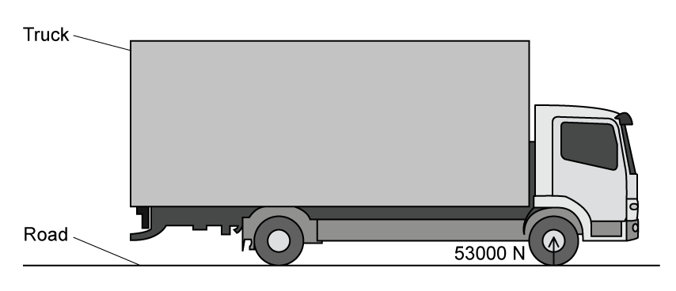

The magnitude of this force is 53 000 N.

(i) State Newton's Third Law.

(ii) Draw an arrow on the diagram to show the other force in this Newton's Third Law force pair, and state the value of this force.

## Q3 — easy — 4 marks · exam-questions

### 1() — 1 mark — multiple_choice
Four students draw a Newton's Third Law force pair for a book on a table.

Which student's Newton's Third Law force pair is correct?

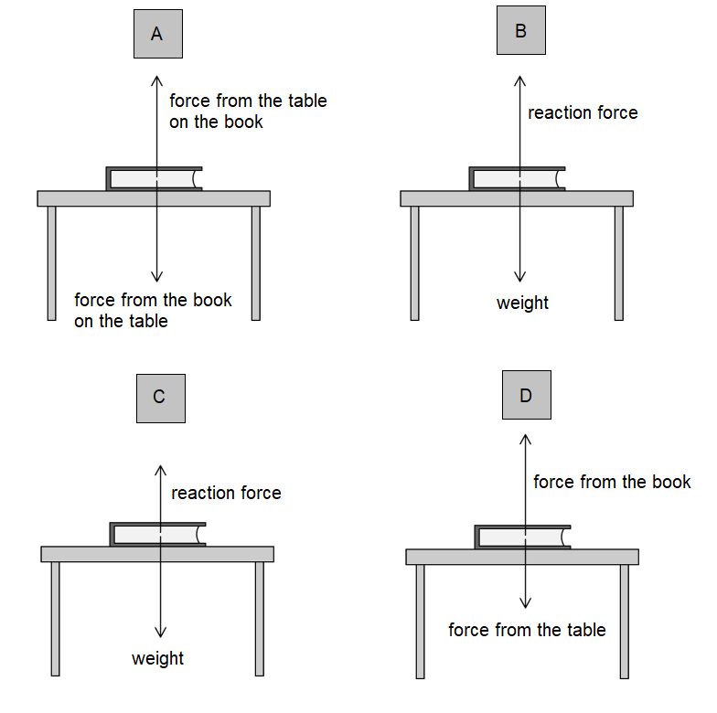
- **A.** 
- **B.** 
- **C.** 
- **D.** 

### 2() — 3 marks — command: complete — structured
Complete the sentences to explain how a Newton's Third Law force pair on the foot and the ground is responsible for the motion of walking:

When a person walks on the ground, there is a force from the ..................... which pushes the ..................... backward.

From Newton's Third Law, there is an ..................... and ..................... force from the ..................... on the ..................... which pushes the foot forward.

## Q4 — easy — 10 marks · exam-questions

### 1() — 1 mark — multiple_choice
Airbags are one of the many safety devices used in cars to protect the driver if there is a crash. Airbags protect the driver by
- **A.** increasing the force acting on the driver
- **B.** increasing the rate of change of momentum of the crash
- **C.** increasing the time taken for the driver to stop
- **D.** decreasing the time taken for the driver to stop

### 2() — 3 marks — command: multiple — structured
A driver has a mass of 67 kg and drives at a velocity of 15 m/s.

(i) State the formula linking momentum, mass and velocity.

(ii) Calculate the momentum of the driver.

### 3() — 3 marks — command: multiple — structured
The car is involved in a crash. The driver is wearing a seatbelt and comes to rest in 0.36 s.

(i) State the equation linking force, change in momentum and time.

(ii) Show that the force on the driver is about 2800 N.

### 4() — 3 marks — command: calculate — structured
A passenger with the same mass as the driver is also in the car at the time of the crash.

They were not wearing a seatbelt and experienced an impact force that was 5 times greater than the force experienced by the driver.

Calculate the time taken by the passenger to come to a stop.

** **time taken = .............................................................. s

## Q5 — easy — 8 marks · exam-questions

### 1() — 2 marks — command: state — structured
The principle of conservation of momentum applies when two objects collide.

State the principle of conservation of momentum.

### 2() — 5 marks — command: multiple — structured
A student is investigating conservation of momentum using an air track and two gliders, **A** and **B**, which both have magnets attached, as shown in the diagram.

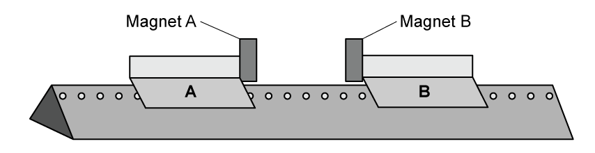

Initially, glider **A** has a momentum of 0.50 kg m/s and moves towards glider **B**, which is at rest. The gliders collide and the magnets cause them to move in opposite directions.

Both gliders are identical and each has a mass of 0.250 kg.

(i) State and explain whether the poles of the magnets are opposite or alike.

(ii) State the total momentum of glider **A** and glider **B** after the collision.

(iii) Calculate the velocity of glider **A** before the collision.

velocity of glider **A** = ............................................... m/s

### 3() — 1 mark — multiple_choice
What is the velocity of glider **B** after the collision?
- **A.** 1 m/s
- **B.** 2 m/s
- **C.** 3 m/s
- **D.** 4 m/s

## Q6 — medium — 9 marks · exam-questions

### 6((a)) — 5 marks — command: multiple — structured — from paper 2016 June · 2P
The photograph shows a hammer just before it hits a nail.

The mass of the hammer is 0.50 kg.

When it hits the nail, the hammer is travelling downwards with a velocity of 3.1 m/s.

(i) State the relationship between momentum, mass and velocity.

(ii) Calculate the momentum of the hammer.

momentum = .............................................................. kg m/s

(iii) The hammer stops quickly when it hits the nail.

The momentum of the hammer reduces to zero in 0.070 s.

Calculate the amount of force that causes this to happen.

force = ........................................ N

### 6((b)) — 2 marks — command: explain — structured — from paper 2016 June · 2P
As it enters the wood, the nail exerts a force on the wood. At the same time, the wood exerts a force on the nail.

Explain how these two forces are related.

### 6((c)) — 2 marks — command: explain — structured — from paper 2016 June · 2P
Both ends of the nail exert pressure when the nail goes into the wood.

Explain why the nail exerts more pressure on the wood than it does on the hammer.

## Q7 — medium — 9 marks · exam-questions

### 5((a)) — 3 marks — command: multiple — structured — from paper 2015 June · 2P
An ice skater throws a 0.23 kg snowball with a velocity of 13 m/s.

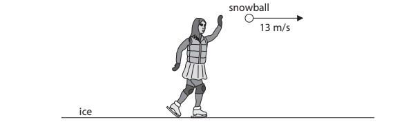

(i) State the equation linking momentum, mass and velocity.

(ii) Calculate the initial momentum of the snowball.

initial momentum = .......................... kg m/s

### 5((b)) — 3 marks — command: explain — structured — from paper 2015 June · 2P
When the skater throws the snowball forwards, she slides backwards on the ice.

Explain why she moves in this direction.

### 5((c)) — 3 marks — command: explain — structured — from paper 2015 June · 2P
The skater wears soft knee pads that compress easily.

Explain how the pads protect her knees when she falls on the ice.

## Q8 — medium — 9 marks · exam-questions

### 5() — 4 marks — command: explain — structured — from paper Jan 2014 · 2P
Some cars have a pedestrian airbag for safety. If a pedestrian is hit and lands on the front of the car, the airbag inflates.

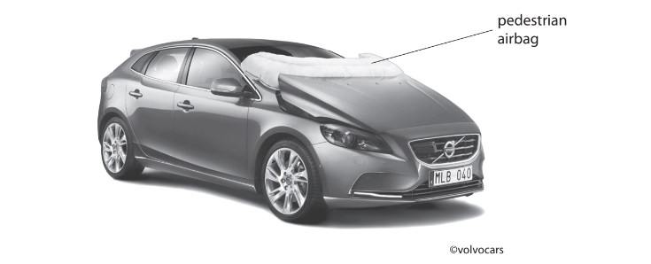

Use ideas about momentum to explain how this airbag can reduce injuries to pedestrians.

### 3((c)) — 5 marks — command: multiple — structured — from paper 2014 June · 2P
In a crash test, a car runs into a wall and stops.

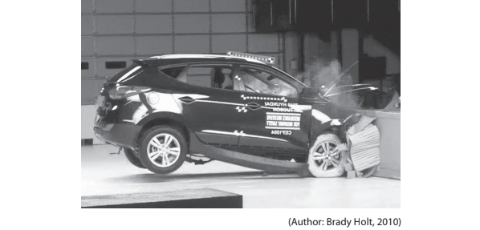

The momentum of the car before the crash is 22 500 kg m/s.

The car stops in 0.14 s.

(i) Calculate the average force on the car during the crash.

average force = .......................... N

(ii) Use ideas about momentum to explain how seat belts can reduce injuries to passengers during a crash.

## Q9 — medium — 8 marks · exam-questions

### 7((a)) — 2 marks — command: name — structured — from paper 2014 June · 2PR
Cars have a number of features that make them safer in a collision.

Apart from seat belts, name two safety features that reduce the risk of serious injury in a car crash.

### 7((b)) — 5 marks — command: multiple — structured — from paper 2014 June · 2PR
Photograph A shows a person wearing a seat belt.

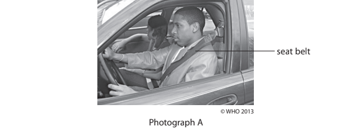

(i) Using ideas of momentum and force, explain how a seat belt reduces the risk of serious injury in a car crash.

(ii) Photograph B shows a full-body harness used in a racing car.

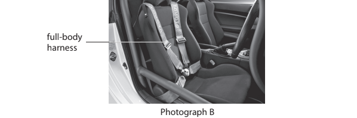

Suggest why a full-body harness is used in a racing car, instead of an ordinary seatbelt.

### 7((c)) — 1 mark — command: state — structured — from paper 2014 June · 2PR
Photograph C shows a crash-test dummy in a car. The car has crashed into a concrete wall.

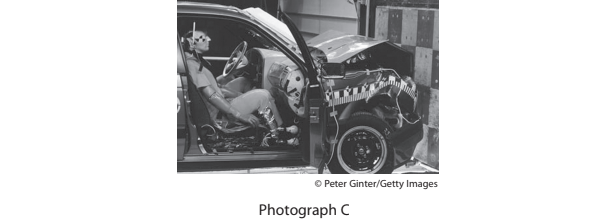

State what happens to the momentum of the car during the crash.

## Q10 — medium — 8 marks · exam-questions

### 9((a)) — 6 marks — command: multiple — structured — from paper Jun 2012 · 2P
A student is playing a game with some empty tins.

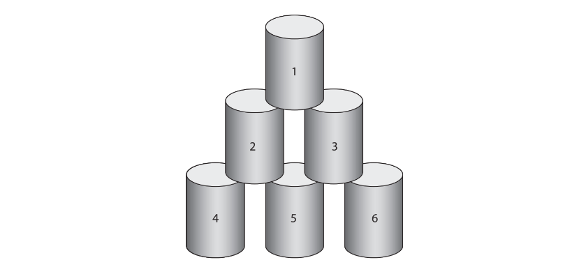

He throws a wet cloth of mass 0.15 kg at the tins. The wet cloth moves at a velocity of 6.0 m/s.

(i) State the equation linking momentum, mass and velocity.

(ii) Calculate the momentum of the wet cloth and give the unit.

** **Momentum = ................................ unit ...................

(iii) The wet cloth sticks to tin 1.

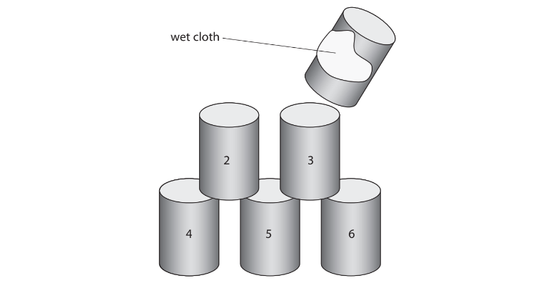

The mass of tin 1 is 0.050 kg. The cloth and tin 1 move away together.

Calculate the velocity of the cloth and tin 1.

Velocity = .......................... m/s

### 9((b)) — 2 marks — command: explain — structured — from paper Jun 2012 · 2P
The student throws a bigger wet cloth at the remaining tins. This wet cloth sticks to tins 2 and 3 and they move away together.

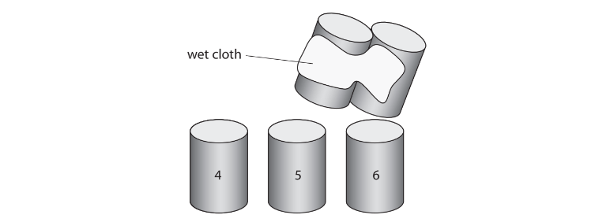

The student concludes

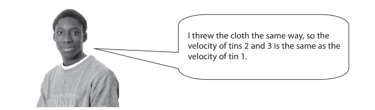

Do you agree with this conclusion? Explain why.

## Q11 — medium — 9 marks · exam-questions

### 1() — 1 mark — multiple_choice
Which of these are the correct units for momentum?
- **A.** kg m/s2
- **B.** kg/m
- **C.** kg m/s
- **D.** N/m

### 2() — 2 marks — command: calculate — structured
A car of mass 1200 kg is travelling at a velocity of 15 m/s.

Calculate the momentum of the car.

### 3() — 6 marks — command: calculate — structured
The car collides with a stationary van of mass 1800 kg.

The two vehicles move together after the collision.

(i) Calculate the velocity of the two vehicles immediately after the collision.

[4]

(ii) During the collision, the car comes to a stop relative to the van in 0.2 seconds.

Calculate the magnitude of the average force exerted on the car during the impact.

[2]

## Q12 — hard — 9 marks · exam-questions

### 8((a)) — 1 mark — command: describe — structured — from paper Jan 2013 · 2P
A bowling ball rolls for 3 s and hits a pin.

The graph shows how the velocity of the ball changes with time.

Describe how the graph can be used to find the distance that the ball rolls before it hits the pin.

### 8((b)) — 4 marks — command: multiple — structured — from paper Jan 2013 · 2P
The mass of the ball is 6.4 kg.

(i) State the equation linking momentum, mass and velocity.

[1]

(ii) Calculate the momentum of the ball before it hits the pin.

Give the unit.

[3]

Momentum = ............................ unit ......................

### 8((c)) — 4 marks — command: multiple — structured — from paper Jan 2013 · 2P
(i) Use the graph to determine the velocity of the ball after it hits the pin.

[1]

Velocity = ............................ m/s

(ii) After the collision, the ball and the pin have the same velocity.

Calculate the mass of the pin.

[3]

Mass = .................................... kg

## Q13 — hard — 7 marks · exam-questions

### 6((a)) — 5 marks — command: multiple — structured — from paper Jun 2013 · 2PR
Newton's Cradle consists of a set of identical solid metal balls hanging by threads from a frame so that they are in contact with each other.

A student initially pulls ball A to the side as shown. The student releases ball A and it collides with ball B.

(i) State the equation linking momentum, mass and velocity.

(ii) Each ball has a mass of 100 g. At the time of collision, ball A has a velocity of 3 m/s.

Calculate the momentum of ball A at the time of impact and give the unit.

** **Momentum = ........................... unit ....................

(iii) After the collision, ball A stops. Ball E moves away. The other balls remain still.

The momentum of ball E as it moves away is the same as the momentum of ball A at the time of impact.

Suggest a reason for this.

### 6((b)) — 2 marks — command: predict — structured — from paper Jun 2013 · 2PR
The student then releases balls A and B together as shown below.

Predict what will happen to the other balls after the collision and give a reason for your answer.

## Q14 — hard — 4 marks · exam-questions

### 8((a)) — 1 mark — command: state — structured — from paper 2014 June · 2PR
State the equation linking momentum, mass and velocity.

### 8((b)) — 3 marks — command: calculate — structured — from paper 2014 June · 2PR
A truck of mass 10 000 kg is moving with a velocity of 4.5 m/s.

A car of mass 1500 kg has the same momentum as the truck.

Calculate the velocity of the car.

velocity = .......................... m/s

## Q15 — hard — 7 marks · exam-questions

### 5((a)) — 5 marks — command: multiple — structured — from paper June 2015 · 2PR
A boy of mass 43.2 kg runs and jumps onto a stationary skateboard.

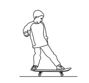

The boy lands on the skateboard with a horizontal velocity of 4.10 m/s.

(i) State the relationship between momentum, mass and velocity.

(ii) The skateboard has a mass of 2.50 kg.

Using ideas about conservation of momentum, calculate the combined velocity of the boy and skateboard just after the boy lands on it.

combined velocity = ............................................... m/s

### 5((b)) — 2 marks — command: explain — structured — from paper June 2015 · 2PR
The boy holds a heavy ball as he stands on a stationary skateboard. The boy throws the ball forwards while still standing on the skateboard.

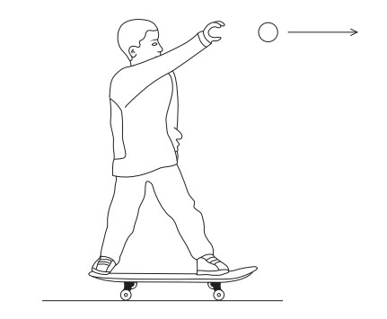

Explain what happens to the boy and the skateboard.

## Q16 — hard — 8 marks · exam-questions

### 4((a)) — 3 marks — command: multiple — structured — from paper Jun 2013 · 2P
A lorry carries a load of hot asphalt – a runny mixture of small stones and tar.

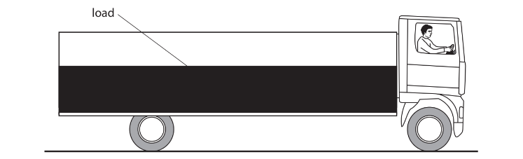

The mass of the lorry and its load is 17 000 kg. The velocity is 13 m/s.

(i) State the equation linking momentum, mass and velocity.

(ii) Calculate the total momentum of the lorry and its load.

Momentum = ............................... kg m/s

### 4((b)) — 5 marks — command: explain — structured — from paper Jun 2013 · 2P
The lorry stops suddenly and the load slides to the front, as shown below.

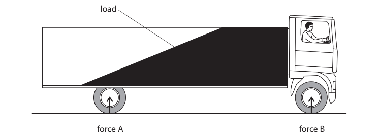

Force A and force B are upward forces from the road on the lorry.

(i) Use ideas about momentum to explain why the load slides to the front when the lorry stops suddenly.

(ii) Use ideas about moments to explain why force B increases when the load slides to the front.

## Q17 — hard — 3 marks · exam-questions

### 1() — 2 marks — command: identify — structured
A stationary rocket in deep space ignites its engines, propelling exhaust gases at high speed away from the rocket. Identify the pair of equal and opposite forces that show how momentum is conserved in this situation.

### 2() — 1 mark — command: suggest — structured
Suggest how rocket engineers could use the idea of momentum to design safety features to protect the crew when the rocket ignites its engines.
