# Mark Schemes — Components in Series & Parallel Circuits
**2. Electricity** · Edexcel IGCSE Physics (4PH1)

## Q1 — easy — 3 marks · exam-questions

### 1() — 1 marks
**Correct answer: B** — a filament lamp

**Final answer:** **The correct answer is ****B**** because:**

- This is an IV graph for a filament lamp

Remember the key features of a filament lamp:

- Current and voltage are **not **directly proportional
- Resistance increases as the temperature increases

### 2() — 1 marks
**Correct answer: A** — a fixed resistor

**Final answer:** **The correct answer is ****A**** because:**

- This is an IV graph for a fixed resistor

Remember the key features of a fixed resistor:

- Current and voltage are** directly proportional**
- Resistance has a **constant** value

### 3() — 1 marks
**Correct answer: C** — a diode

**Final answer:** **The correct answer is ****C**** because:**

- This is an IV graph for a diode

Remember the key features of a diode:

- Current and voltage are **not **directly proportional
- Current can only flow in one direction

## Q2 — easy — 6 marks · exam-questions

### 2() — 1 marks
**Correct answer: C** — a fuse

**Final answer:** **The correct answer is ****C**** because:**

- The symbol for a fuse is

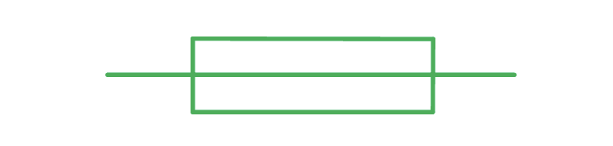

### 1() — 1 marks
**Correct answer: A** — in parallel

**Final answer:** **The correct answer is ****A ****because:**

- A lamp controlled by its own switch can only happen when the lamp and the switch are in parallel with the other circuit components
- When in parallel, other components in the circuit are not affected

  - Hence, the correct answer is **A **

### 3() — 2 marks
The correct advantages of series circuits are:

| They are more difficult to install, repair and maintain |   |
|---|---|
| They are the easiest type of circuit to install, repair and maintain | **Final answer:** **✓** |
| They do not overheat easily because they share the same current | **Final answer:** **✓** |
| Adding too many lamps may cause overheating |   |

- One tick correct; **[1 mark]**
- Both ticks correct; **[1 mark]**

**[Total: 2 marks]**

### 4() — 2 marks
The correct advantages of parallel circuits are:

| If one lamp fails, other lamps will still function | **Final answer:** **✓** |
|---|---|
| If one lamp fails, other lamps will not function |   |
| Different lamps can have different brightnesses and not affect the others | **Final answer:** **✓** |
| Not all lamps have the same brightness |   |

- One tick correct; **[1 mark]**
- Both ticks correct; **[1 mark]**

**[Total: 2 marks]**

> *Make sure you learn all the advantages and disadvantages of series and parallel circuits!*

> *Advantages of series circuits*

- *They are the easiest type of circuit to install, repair and maintain*
- *They do not overheat easily because they share the same current*

> *Disadvantages of series circuits*

- *If one lamp fails, other lamps will not function*
- *They will not all have the same brightness*

> *Advantages of parallel circuits:*

- *If one lamp fails, other lamps will still function*
- *Different lamps can have different brightnesses and not affect the others*

> *Disadvantages of parallel circuits*

- *They are more difficult to install, repair and maintain*
- *Adding too many lamps may cause overheating*

## Q3 — easy — 4 marks · exam-questions

### 1() — 1 marks
**Correct answer: B** — $A_{1}=A_{2}=A_{3}$

**Final answer:** **The correct answer is ****B**** because:**

- In a series circuit, the current is the same at all points
- Therefore, $A_{1}=A_{2}=A_{3}$

### 2() — 3 marks
The correct sentences are:

- When the current becomes **larger than** the value of the fuse, the fuse wire **melts**; **[1 mark]**
- This **stops** the flow of current in the circuit; **[1 mark]**
- This is an important safety feature in a circuit to prevent the wires in the circuit from **overheating**; **[1 mark]**

**[Total: 3 marks]**

## Q4 — easy — 4 marks · exam-questions

### 7((a)) — 1 marks
The correct symbol for a thermistor is:

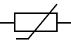

- Correct symbol drawn; **[1 mark]**

**[Total: 1 mark]**

> *The symbol can be drawn in any orientation but it is much easier to remember all your circuit symbols in the same orientation.*

> *This will avoid confusion when drawing full circuits of symbols.*

> *The symbol you draw can be of any size, it does not have to contain the connection leads and the rest of the circuit does not need to be included. *

### 2() — 3 marks
The graph of resistance against light intensity for an LDR is:

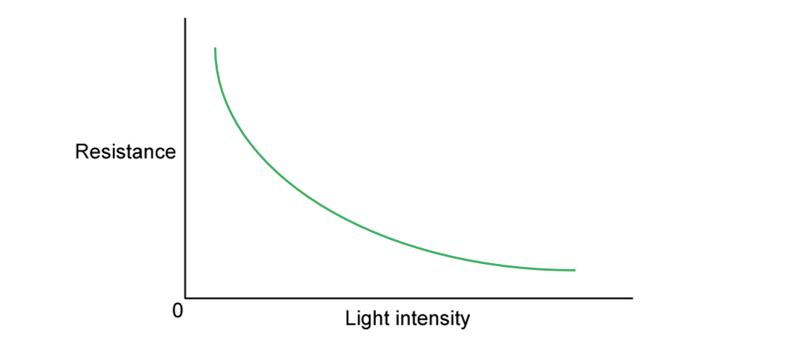

- Graph shows low resistance at high light intensities; **[1 mark]**
- Graph shows high resistance at low light intensities; **[1 mark]**
- Curve shows non-linear relationship; **[1 mark]**

**[Total: 3 marks]**

## Q5 — easy — 9 marks · exam-questions

### 1() — 1 marks
**Correct answer: B** — there must be a current in the circuit

**Final answer:** **The correct answer is B**

- An LED is a light-emitting diode, and it only emits light while charge is flowing through it
- Light coming from the LED therefore shows that there is a current in the circuit

**A** is incorrect because an LED works on direct current, and only conducts in one direction

**C** is incorrect because a faulty LED would not light up at all

**D** is incorrect because a blown fuse breaks the circuit, so no current would flow and the LED would stay off

### 2() — 1 marks
**Correct answer: D** — 1.38 A

**Final answer:** **The correct answer is D**

- Point X is on the wire between the battery and the first branch, so it carries the total current in the circuit

- In a parallel circuit the total current is the sum of the currents in the separate branches

$I_{total} = 0 . 26 + 0 . 43 + 0 . 17 + 0 . 26 + 0 . 26$

$I_{total} = 1 . 38 \text{A}$

**A**, **B** and **C** are each the current in one branch only. X is before the circuit branches, so it carries all of them added together

### 3() — 3 marks
> **[mark-scheme]**
> (i) State the equation linking power, current and voltage:
> 
> - Power = current × voltage **OR** $P = I V$ **[1 mark]**

(ii) Calculate the power of the LEDs:

- List the known quantities

Current, *I* = $1 . 38 \text{A}$

Voltage, *V* = $12 \text{V}$

- Substitute the known values into the equation from part (i)

$P = 1 . 38 \times 12$ **[1 mark]**

$P = 16 . 56 \text{W}$

Power = $16 . 6 \text{W}$ **[1 mark]**

> **[mark-scheme]**
> 1 mark for correct substitution into the equation and 1 mark for the correct answer

> **[exam-tip]**
> When a question asks you to state an equation, any correct rearrangement earns the mark, so write down whichever form you remember most reliably.

### 4() — 4 marks
> **[mark-scheme]**
> (i) State the equation linking power, energy transferred and time:
> 
> - Power = energy transferred ÷ time **OR** $P = \frac{E}{t}$ **[1 mark]**

(ii) Calculate the amount of energy transferred by the LEDs in 300 seconds:

- List the known quantities

Power, *P* = $16 . 6 \text{W}$

Time, *t* = $300 \text{s}$

- Rearrange the equation to make the energy transferred the subject

$P = \frac{E}{t} \Rightarrow E = P t$ **[1 mark]**

- Substitute the known values into the equation

$E = 16 . 6 \times 300$ **[1 mark]**

Energy transferred = $4980 \text{J}$ **[1 mark]**

> **[mark-scheme]**
> 1 mark for a correct rearrangement, 1 mark for correct substitution and 1 mark for the correct answer
> 
> 4968 J is also accepted, from carrying the unrounded power of 16.56 W through from the previous part

> **[exam-tip]**
> Pick the power equation, not a charge equation such as $Q = I t$. The question asks about energy transferred over a time, which is what power describes.
> 
> When you rearrange $P = \frac{E}{t}$ for energy, multiply the power by the time. Dividing gives a tiny value that should immediately look wrong for 300 seconds of operation.

## Q6 — medium — 4 marks · exam-questions

### 2((a)) — 1 marks
**Correct answer: A** — 

**Final answer:** **The correct answer is ****A**** because:**

- The current must flow through the ammeter

  - Therefore the ammeter must be connected in series
  - This discounts option **B** and **C**
- The voltmeter measures the difference in electrical potential between two points in the circuit

  - Therefore, the voltmeter must be connected in parallel to the component
  - This discounts option **D**
- Therefore, the only answer fitting these criteria is option **A**

### 2((e)) — 3 marks
(i) Complete the table by putting a tick (**✓**) in the box if the lamp is lit and a cross (**х**) in the box if the lamp is not lit;

| **S****1**** position** | **S****2**** position** | **Lamp lit (✓ or х)** |
|---|---|---|
| W | X | **Final answer:** **✓** |
| W | Y | **Final answer:** **х** |
| Z | X | **Final answer:** **х** |
| Z | Y | **Final answer:** **✓** |

- *2 marks for all four correct*
- *1 mark for three correct*
- *0 marks for fewer than three correct*

(ii) Suggest where this circuit would be useful in a house:

Any **one** from:

- Corridor; **[1 mark]**
- Stairs; **[1 mark]**
- Basement / cellar; **[1 mark]**
- Bedroom; **[1 mark]**
- Kitchen; **[1 mark]**
- Room with two doorways; **[1 mark]**

**[Total: 3 marks]**

> *For part (ii), any reasonable suggestion of where a two way switching scenario would be useful in a home would be accepted.*

## Q7 — medium — 9 marks · exam-questions

### 7((b)) — 4 marks
(i) The equation linking voltage, current and resistance is:

- Voltage = current × resistance** ****OR ***V* = *IR* **[1 mark]**

(ii) Show that the resistance of the thermistor at 80 °C is about 5000 Ω:

List the known quantities:

- Voltage, *V *= 13.2 V
- Current, *I *= 2.60 mA = 0.0026 A **[1 mark]**

Substitute the known values into the equation from part (i) and rearrange the make resistance, *R *the subject:

- *V *= *IR*
- 13.2 = 0.0026 × *R *
- Therefore, $R=\frac{13.2}{0.0026}$ **[1 mark]**

Calculate resistance, *R *to greater than 1 s.f.:

- *R *= 5077 Ω **[1 mark]**

**[Total: 4 marks]**

> *For part (i) it is acceptable to include any rearrangement of Ohm's Law but it is easier to remember it in this form. *

> *Part (ii) is a "show that" type question, so all the workings must be shown to achieve full marks in the question.*

### 7((c)) — 5 marks
At least **one** and maximum** three **from:

Graph A:

- Resistance of A decreases with temperature; **[1 mark] ****OR**
- When the temperature of A is low the resistance is high; **[1 mark]**

- The largest slope / rate of change is at a lower temperature; **[1 mark] ****OR**
- The smallest slope / rate of change is at a higher temperature; **[1 mark]**

- Graph A represents a thermistor; **[1 mark]**

At least **one **and maximum** three** from:

Graph B:

- The resistance of B increases with temperature; **[1 mark] ****OR**
- When the temperature of B is low, the resistance is low; **[1 mark]**

- The largest slope / rate of change is at a higher temperature; **[1 mark] ****OR**
- The smallest slope / rate of change is at a lower temperature; **[1 mark]**

- Resistance of B is constant below 50 °C / up to 60 °C ; **[1 mark]**

At least **one** and maximum **three** from:

About both A and B:

- There are more results for B / fewer results for A; **[1 mark]**
- Both relationships are non-linear; **[1 mark]**
- The range of temperature / resistance values for both is similar; **[1 mark]**
- Both A and B have the <u>same resistance at 80 °C</u>; **[1 mark]**

**[Total: 5 marks]**

## Q8 — medium — 8 marks · exam-questions

### 10() — 2 marks
A diagram that would score 2 marks should look like this:

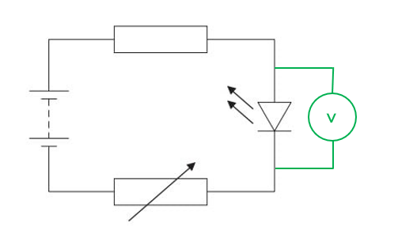

- The voltmeter must be connected in parallel; **[1 mark]**
- The component chosen is the LED; **[1 mark]**

**[Total: 2 marks]**

### 5() — 4 marks
A graph that would score **four** marks is:

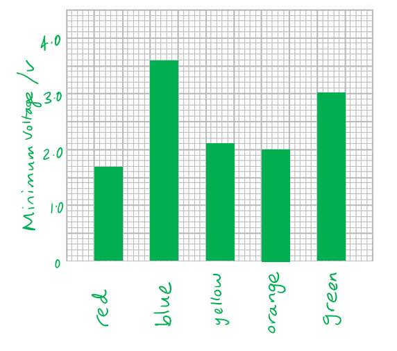

- Both axes are labelled correctly
- Minimum voltage (V) on the y-axis

  - The colours (in any order) on the x-axis; **[1 mark]**
- A linear scale has been used so that the longest bar occupies at least half of the grid; **[1 mark]**
- At least 3 bars are plotted correctly; **[1 mark]**
- 2 more bars are plotted correctly; **[1 mark]**

**[Total: 4 marks]**

### 5() — 2 marks
Explain why the student is right:

Any **two **from:

- The visible spectrum is a sequence consisting of: red, orange, yellow, green, blue, indigo and violet; **[1 mark]**
- The wavelength of the visible light directly relates to the colour

  - e.g. red has the longest wavelength; **[1 mark]**
- The colour directly relates to voltage

  - e.g. blue has the highest minimum voltage; **[1 mark]**

**[Total: 2 marks]**

## Q9 — medium — 13 marks · exam-questions

### 6((a)) — 4 marks
A diagram that would score **four** marks would look like:

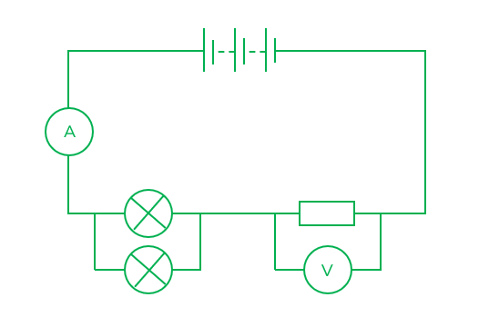

- A resistor in series with the lamp only; **[1 mark]**
- A second lamp in parallel with the first lamp; **[1 mark]**
- A voltmeter that measures the voltage across the resistor; **[1 mark]**
- An ammeter in series with the power supply, one lamp and the resistor; **[1 mark]**

**[Total: 4 marks]**

### 6((b)) — 6 marks
(i) A graph that would score **four** marks would look like:

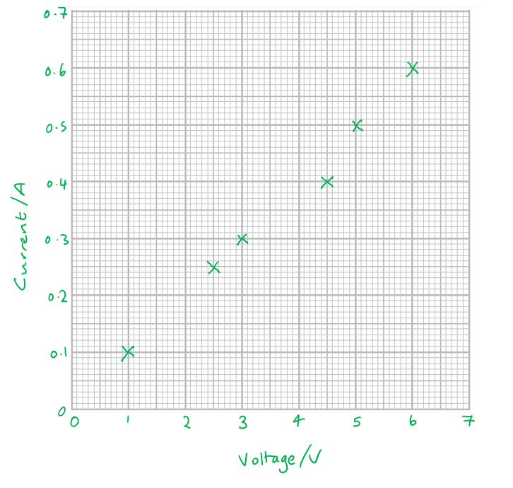

- Both axes are labelled with their correct quantity and unit and can be either way around

  - Voltage (V)
  - Current (A); **[1 mark]**
- The scales on the axis are split into equal sections and occupy over half the space vertically and horizontally on the grid; **[1 mark]**
- 5 points are plotted correctly; **[1 mark]**
- 1 additional point is plotted correctly; **[1 mark]**

(ii) A circled anomalous point on the graph would look like:

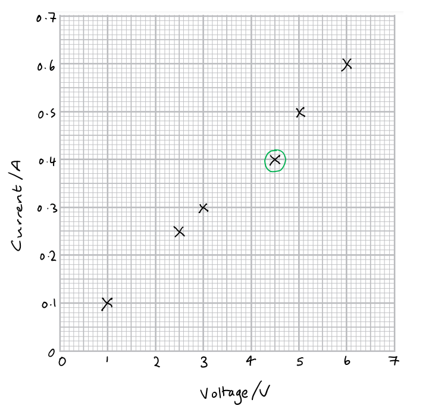

- The anomalous point at I = 0.4 A and V = 4.5 V is circled; **[1 mark]**

(iii) A line of best fit which would score one mark would look like:

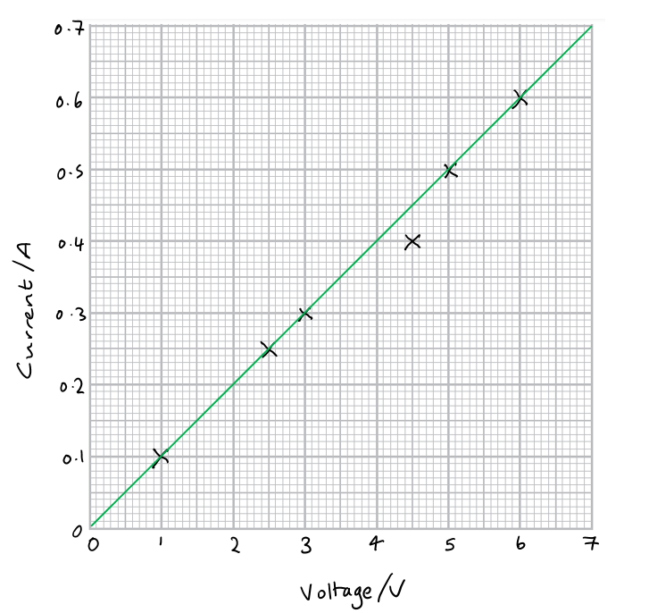

- The line of best fit is a straight line passing through all the points apart from the anomalous point; **[1 mark]**

**[Total: 6 marks]**

> *When plotting the graph in part (i) it is important to plot each point with a cross. This is easier to see than dots and makes it quicker to draw the line of best fit. *

### 6() — 3 marks
(i) To state the equation linking voltage, current and resistance:

- Voltage = current × resistance

**   OR**** **

- *V *= *IR ***[1 mark]**

(ii) To find a value for the resistance of the resistor:

Use the graph to obtain values current, *I *and voltage *V*:

- The highest point is (0.6, 6)

  - So *I *= 0.6 A
  - *V *= 6 V

Recall the equation linking voltage, current and resistance from part (i):

- *V *= *IR*

Rearrange the equation to make resistance, *R *the subject:

- $R=\frac{V}{I}$

Substitute the values into the equation:

- $R=\frac{6}{0.6}$ **[1 mark]**

Calculate the value of the resistance, *R*:

- *R *= 10 Ω **[1 mark]**

**[Total: 3 marks]**

## Q10 — medium — 8 marks · exam-questions

### 12((a)) — 4 marks
A circuit diagram that would score four marks would look like:

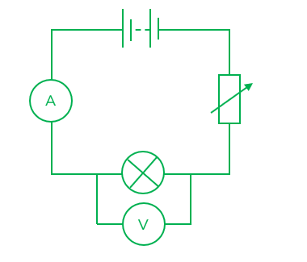

- A series circuit containing a lamp and a power supply with no gaps between components/wires; **[1 mark]**
- The ammeter is in series with the lamp; **[1 mark]**
- The voltmeter is in parallel across the lamp; **[1 mark]**
- The variable resistor is in series with the lamp and the ammeter and the power supply

**   OR **

- A variable power supply has been used; **[1 mark]**

**[Total: 4 marks]**

### 12((b)) — 4 marks
(i) To state how you can tell that the resistance of the filament lamp changes as the voltage is increased:

- The gradient of the graph changes (the voltage increases more rapidly than the current); **[1 mark]**

**   OR**

- Line is curved / not a straight line; **[1 mark]**

**   ****OR**** **

- Voltage is not proportional to current; **[1 mark]**

(ii) To explain these changes in resistance as seen on the graph:

- The lamp heats up; **[1 mark]**
- So, there is a greater chance of electron collisions; **[1 mark]**
- Hence, resistance inside the lamp increases; **[1 mark]**

**[Total: 4 marks]**

> *Part (ii) is asking you to explain the shape of the graph. This means you need to say **why **the graph is this shape. You should not describe the shape of the graph but state why the resistance is changing. *

## Q11 — medium — 9 marks · exam-questions

### 10((a)) — 6 marks
(i) A diagram that would score 3 marks would look like:

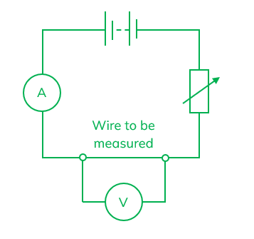

- The circuit includes the following components drawn with the correct circuit symbols only:

  - Battery / cell / d.c. power supply
  - Ammeter
  - Voltmeter; **[1 mark]**
- Ammeter is placed in a series circuit with the wire, variable resistor and power supply; **[1 mark]**
- Voltmeter is in parallel across the wire; **[1 mark]**

(ii) To describe what she should do to obtain a set of results for her investigation:

- Current measured through the wire; **[1 mark]**
- Voltage measured across the wire; **[1 mark]**
- Range of values (of I and V obtained) by altering the variable resistor

**   OR**** **

- Range of values (of I and V obtained) by repeating for different voltages; **[1 mark]**

**[Total: 6 marks]**

### 10((b)) — 1 marks
To suggest why she keeps the temperature of the wire constant throughout the investigation:

- The resistance of the wire changes with temperature; **[1 mark]**

**[Total: 1 mark]**

In science investigations, you want to test how one thing (the independent variable) affects another (the dependent variable). If you don’t keep other factors the same, they might accidentally affect your results.

As the resistance of the wire increases, the temperature increases, causing the current flowing in the wire to decrease. Therefore, temperature must be controlled (a control variable) to ensure the results are valid.

### 10((c)) — 2 marks
(i) To state the relationship linking voltage, current and resistance:

- Voltage = current × resistance

**   OR**** **

- *V *= *IR ***[1 mark]**

(ii) A graph that would score one mark would look like:

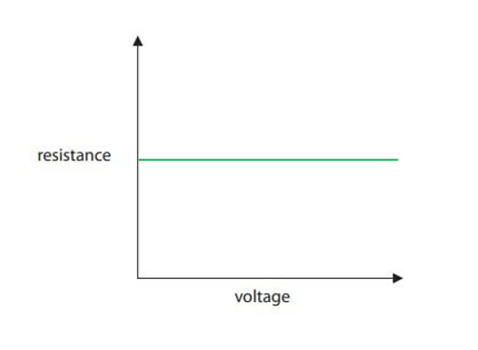

- Horizontal line drawn above the x-axis; **[1 mark]**

**[Total: 2 marks]**

## Q12 — medium — 14 marks · exam-questions

### 10((a)) — 3 marks
Any **three **from:

- Cells are connected the wrong way around / with the wrong polarity; **[1 mark]**
- Ammeter is connected in parallel (and not in series with the wire); **[1 mark]**
- Voltmeter is connected in series (and not in parallel with the wire); **[1 mark]**
- There is no switch (in the circuit); **[1 mark]**

**[Total: 3 marks]**

### 10() — 5 marks
A graph that would score **five** marks would look like this:

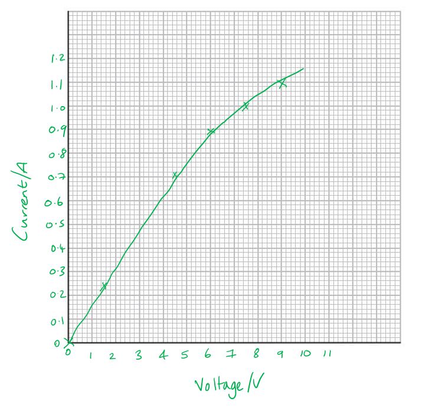

- Even spacing between numbers on the scale used and more than half of the grid is used; **[1 mark]**
- Axes are labelled with correct quantities and units, either way around

  - Voltage (V)
  - Current (A); **[1 mark]**
- At least 5 points are plotted correctly to the nearest half square; **[1 mark]**
- 1 more point is plotted correctly to the nearest half square; **[1 mark]**
- The line of best fit passes through zero; **[1 mark]**

**[Total: 5 marks]**

> *When drawing a graph and plotting points accuracy is really important. It is easy to miss something on your graph. Make a mental checklist for graph questions to ensure you are awarded all the marks. When plotting points use an 'x' to mark the point and not a dot. This makes it easier to add the line of best fit. *

### 10() — 2 marks
(i) To find the current when the voltage is 2.5 V:

- Draw a line from 2.5 V to the line of best fit

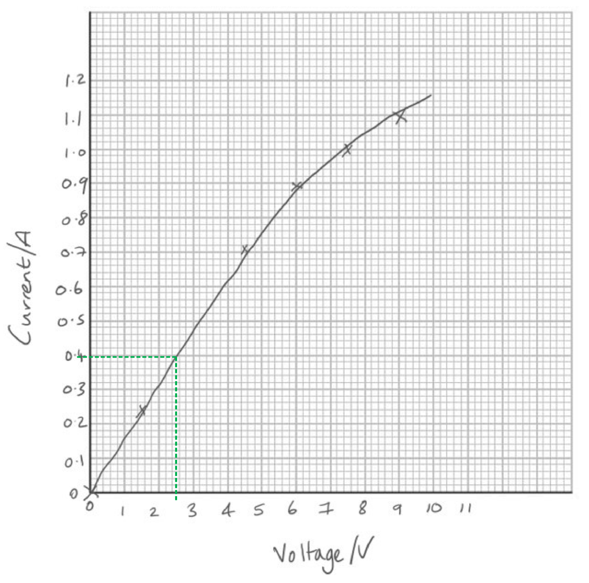

- Then from this point on the line perpendicular to the current axis
- The current is 0.40 A; **[1 mark]**

  - *Acceptable range: 0.39 A - 0.41 A*

(ii) To suggest why the line on the graph curves:

Any **one **from:

- Temperature of the wire was not constant; **[1 mark]**
- Resistance of the wire was not constant; **[1 mark]**

**[Total: 2 marks]**

### 10() — 4 marks
Any **four **from:

- Include in the circuit an instrument to measure temperature; **[1 mark]**
- This means the temperature of the wire can be kept constant; **[1 mark]**
- Use *V *= *IR*; **[1 mark]**
- Repeat readings to obtain a range of values (at the same temperature) and find the average; **[1 mark]**
- Obtain additional points; **[1 mark]**
- Use the linear part of the graph / the part of the graph where current is less than 0.6 A; **[1 mark]**
- Use the gradient of the graph to find the resistance; **[1 mark]**

**[Total: 4 marks]**

## Q13 — medium — 14 marks · exam-questions

### 2((b)) — 4 marks
Plot a graph of these results and draw a curve of best fit:

A graph scoring **four **marks:

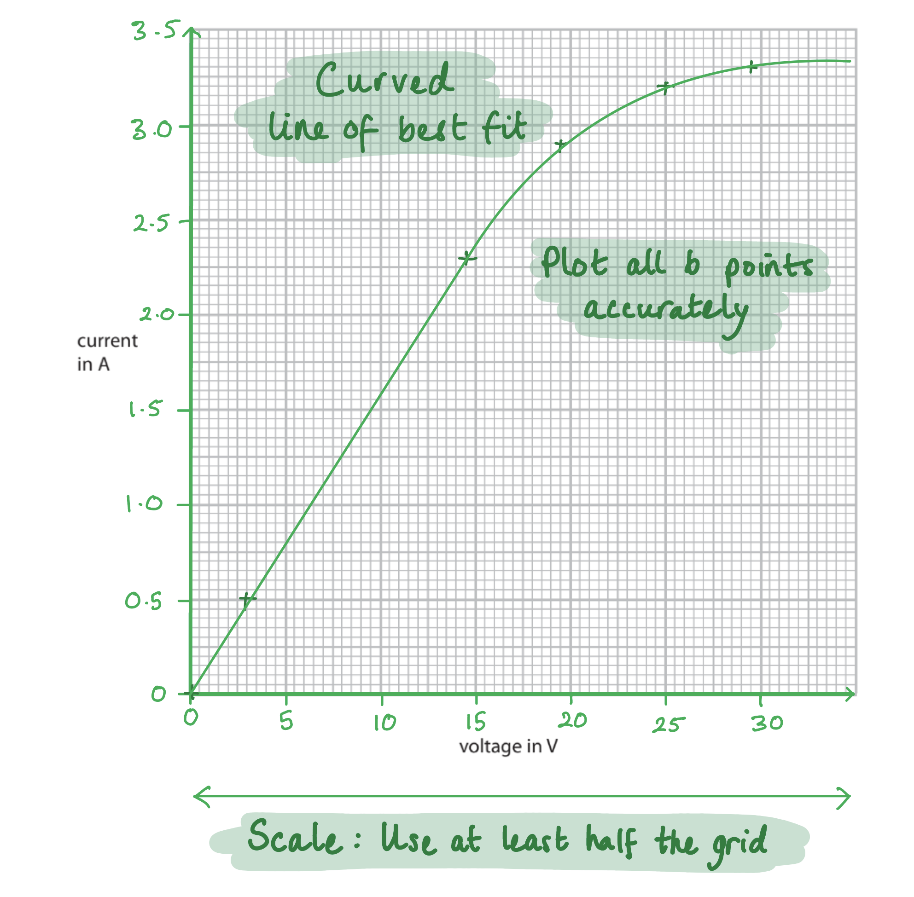

- Use of a suitable scale using at least half the grid in both directions; **[1 mark]**
- A smooth curve of best fit; **[1 mark]**
- 5 points plotted correctly; **[1 mark]**

**OR**

- 6 points plotted correctly; **[2 marks]**

**[Total: 4 marks]**

> *There are two marks available for the correct plotting of the data points. Plotting all six points correctly will score the maximum of 2 marks. Plotting five out of the six points correctly will score 1 mark. Plotting less than five points correctly will score zero marks. But the two marks for scale and the curve of best fit can still be obtained. *

> *The curve of best fit **must be a free hand curve** and not at dot-to-dot line. Remember that a line of best fit will have the same number of data points above as below the line. If you have plotted some data points incorrectly, you will still get the mark for the line of best fit, if you have followed this rule.*

### 2((b)) — 5 marks
(i) State the equation linking voltage, current and resistance:

- Voltage = current × resistance

**OR**

- $V=IR$ **[1 mark]**

(ii) Calculate the resistance of component X when the voltage across it is 10.0 V, giving the unit:

Determine from the graph the current when *V* = 10.0 V:

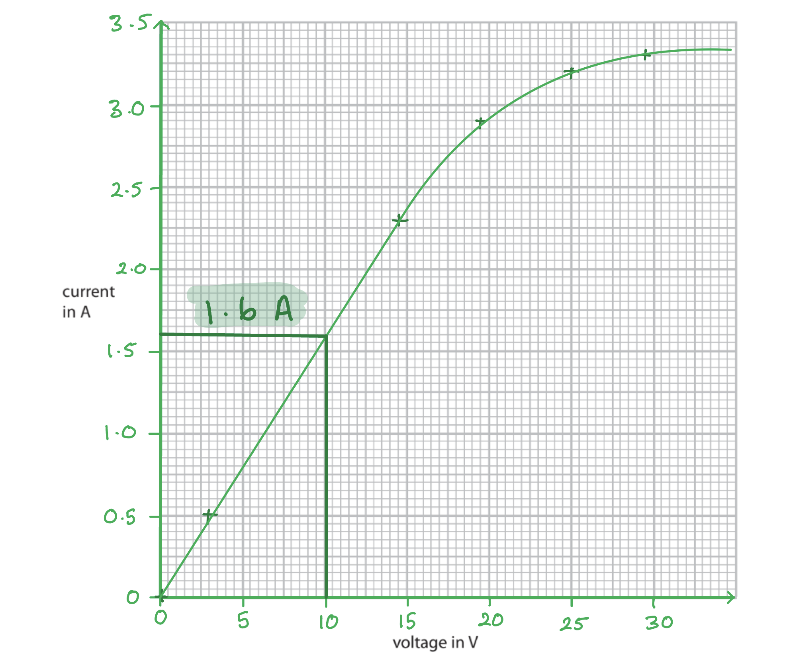

- *I *= 1.6 A **[1 mark]**

Rearrange the equation to make R the subject:

- $R=\frac{V}{I}$

Substitute the known values into the equation to calculate R:

- $R=\frac{10.0}{1.6}$ **[1 mark]**
- R = 6.3 / 6.25 **[1 mark]**

State the unit:

- Ω / ohms; **[1 mark]**

**[Total: 5 marks]**

> *For questions where you have to obtain a value from a graph, there is usually a little bit of wiggle room.*

> *The standard is ± *$\frac{1}{2}$* small square.  Therefore, values for current that would still get the mark are 1.55 A to 1.65 A as long as you show this on your graph. The resistance calculated from these values would be in the range of 6.0-6.5 Ω which would still get you the mark as long as your working is clearly shown.*

### 2((b)) — 5 marks
(i) Describe the pattern shown by the graph from part (a):

Any** three **from:

- As voltage increases, current increases; **[1 mark]**
- The gradient / resistance is constant in the first part of the graph (the straight line portion); **[1 mark]**
- Therefore, current is proportional to voltage; **[1 mark]**
- The gradient / resistance changes / is non-linear at high voltages; **[1 mark]**
- At high voltages / voltages above 15 V, the change in current is smaller; **[1 mark]**

(ii) Suggest a conclusion for the investigation:

Any **two** from:

**Straight line portion of graph**

- Resistance is constant at first

**OR**

- Voltage and current are proportional at first

**OR**

- The component obeys Ohm's law at first; **[1 mark]**

**Graph overall**

- Resistance is not constant (overall)

**OR**

- Voltage and current are not proportional

**OR**

- The component does not obey Ohm's Law; **[1 mark]**

**Reason**

- Because the component gets hotter

**OR**

- Because the temperature increases; **[1 mark]**

**Identification**

- Component X is a filament lamp; **[1 mark]**

**[Total: 5 marks]**

## Q14 — medium — 14 marks · exam-questions

### 1() — 4 marks
(i) Plot the data on the graph:

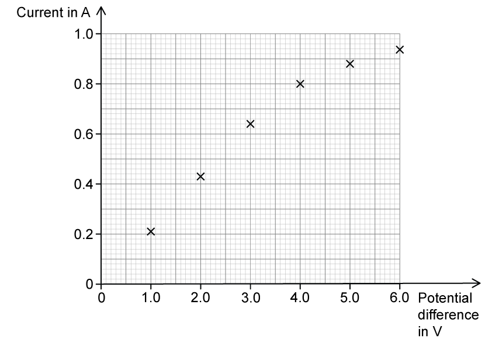

**[3 marks]**

> **[mark-scheme]**
> 1 mark for a sensible scale for the axes covering more than half of the available graph space
> 
> 1 mark for the axes labelled correctly with units
> 
> 1 mark for all data points plotted correctly to within half a small square

(ii) Draw the curve of best fit:

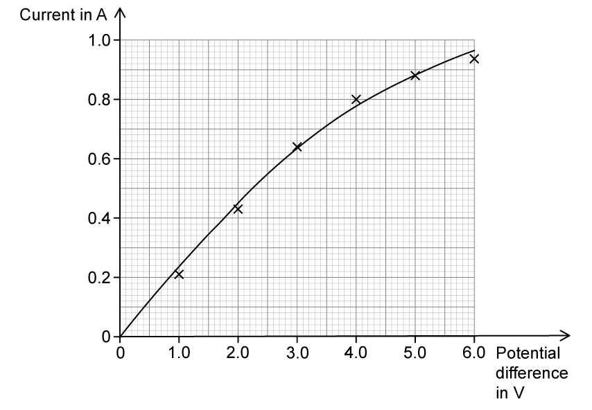

**[1 mark]**

> **[mark-scheme]**
> 1 mark for a smooth curve within ½ a small square of each point

### 2() — 2 marks
> **[mark-scheme]**
> (i) Component X is:
> 
> - A filament lamp / bulb **[1 mark]**

> **[exam-tip]**
> A filament lamp has a characteristic curved IV graph with a decreasing gradient. Don't always assume the data show a straight line.

(ii) The circuit symbol for this component:

**[1 mark]**

### 3() — 8 marks
> **[mark-scheme]**
> (i) The formula linking resistance, voltage and current is:
> 
> - $\mathrm{voltage}=\mathrm{current}\times\mathrm{resistance}$
> **OR** $V=I\timesR$ **[1 mark]**

(ii) Describe how resistance changes as current changes, using data:

- Calculate the resistance at a lower current, e.g. when $V=1.0V$, $I=0.21A$

$R=\frac{V}{I}=\frac{1.0}{0.21}=4.8Ω$ **[1 mark]**

- Calculate the resistance at a higher current, e.g. when $V=6.0V$, $I=0.94A$

$R=\frac{V}{I}=\frac{6.0}{0.94}=6.4Ω$ **[1 mark]**

- Write a concluding statement:

As the current increases, the resistance increases **[1 mark]**

> **[mark-scheme]**
> 1 mark for two corresponding values of $V$ and $I$ read from the table
> 
> 1 mark for the resistance calculated using $R=\frac{V}{I}$
> 
> 1 mark for a correct conclusion reached from the data

(iii) Calculate the voltage across the cell:

- List the known quantities:

  - Voltage across the lamp, $V_{L}=4.0V$
  - Resistance of variable resistor, $R=5.0Ω$
- Determine the current in the circuit from the table when $V_{L}=4.0V$

$I=0.80A$ **[1 mark]**

- Calculate the voltage across the variable resistor:

  - Current is the same everywhere in a series circuit

$V_{R}=I\timesR$

$V_{R}=0.80\times5.0$

$V_{R}=0.80\times5.0$ **[1 mark]**

$V_{R}=4.0V$ **[1 mark]**

- Determine the voltage supplied by the cell:

  - In a series circuit, the total voltage of the cell is shared between the components (the bulb and the variable resistor)

$V_{cell}=V_{L}+V_{R}$

$V_{cell}=4.0+4.0$ **[1 mark]**

- Evaluate the final answer:

$V_{cell}=8.0V$ **[1 mark]**

## Q15 — hard — 1 marks · exam-questions

### 5((b)) — 1 marks
**Correct answer: D** — 

**Final answer:** **The correct answer is ****D ****because:**

- There is now an alternating current in the circuit
- Current can only pass through a diode in one direction
- So when the current reverses due to the a.c. supply no current will be able to pass through
- This means for every other reversal of the current there will be no current flowing in the circuit
- So only one half of an a.c. graph will be obtained
- This produces the graph shown in option **D **

## Q16 — hard — 1 marks · exam-questions

### 2() — 1 marks
**Correct answer: B** — the diameter of the hole

**Final answer:** **The correct answer is ****B ****because:**

- The independent variable in the experiment is the variable that is changed by the person doing the experiment

  - In this experiment, it is the diameter of the hole that is changed
- Hence, the correct answer is **B **

Dependent and independent variables can be unnecessarily confusing. Remember which one is changed and which one is measured and you will always be able to answer these types of questions successfully.

The dependent variable is the variable that is measured in the experiment; in this experiment, it is the resistance of the LDR that is measured.

## Q17 — hard — 13 marks · exam-questions

### 8((a)) — 8 marks
(i) A circuit diagram for this investigation that would score **two** marks is:

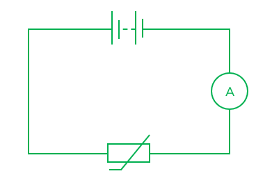

- Correct symbols are drawn; **[1 mark]**

  - A cell / battery / box labelled power supply / a.c. symbol / component ends for a battery drawn
  - Ammeter / milliammeter
  - Thermistor
- The components are connected in series; **[1 mark]**

(ii) Adding a voltmeter to the circuit, a diagram that would score one mark is:

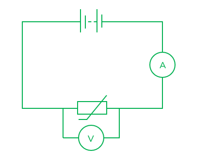

- The voltmeter is connected in parallel to the thermistor; **[1 mark]**

(iii) To explain how the student can use the apparatus to investigate how the resistance of the thermistor varies:

Any **five **from:

- Take measurements of current at any fixed / known temperature; **[1 mark]**
- Take measurements of voltage at any fixed / known temperature; **[1 mark]**
- Measure the temperature (using a thermometer); **[1 mark]**
- Vary the temperature and take new readings; **[1 mark]**
- Allow the temperature (of the thermistor) to equalise between readings; **[1 mark]**
- Change the temperature by heating water / allowing water to cool from 100 °C; **[1 mark]**
- Start with ice **OR**** **use ice cubes to take the temperature down to below room temperature; **[1 mark]**

- Calculate the resistance at each temperature using the equation $R=\frac{V}{I}$; **[1 mark]**
- Take repeat measurements of current and voltage at each temperature and find the average (to calculate the resistance); **[1 mark]**
- Use a stirrer / digital thermometer (to maintain a constant temperature through the water); **[1 mark]**

**[Total: 8 marks]**

> *It is important to use the correct thermistor symbol. This is a closed rectangle, where the wire should not pass inside. There should be a line crossing the longest side of the rectangle on a diagonal with the first part of this line parallel to the longest side of the rectangle. This is shown below. *

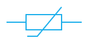

> *There are various symbols for the battery/power supply that will be accepted in your examination. The symbol shown in the mark scheme is the best one. If the question asks for a cell, this looks different:*

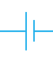

> *An essential part of IGCSE circuitry is remembering that voltmeters are connected in parallel to the component they are measuring the voltage of and ammeters are always connected in series next to the other components in the circuit. *

### 8((b)) — 2 marks
(i) To suggest which line is better, giving a reason for your choice:

- A / the curve is better as it fits more points / more of the points lie closer to the line **OR**
- B / the straight line is better as there is an equal number of points above and below the line; **[1 mark]**

(ii) To suggest why measuring the resistance of the thermistor at 10 °C could help to decide which line is better:

Any **one **of the following:

- The new point could be nearer to one line than the other; **[1 mark]**
- The lines are furthest apart at 10 °C; **[1 mark]**
- This measurement would provide more data; **[1 mark]**

**[Total: 2 marks]**

### 8((c)) — 3 marks
(i) The graph for a metal wire at constant temperature is:

- L **[1 mark]**

(ii) The graph for a diode is:

- K **[1 mark]**

(iii) The graph for a filament lamp is:

- J **[1 mark]**

**[Total: 3 marks]**

> *These graphs have potential difference on the y axis, not the x axis as you may be used to seeing. These are VI graphs, not IV graphs. This means the graphs for each component is the other way round to what you may normally see. Reflecting these plotted lines along a diagonal line between the axes will show the IV graph for each component.*

## Q18 — hard — 10 marks · exam-questions

### 5() — 2 marks
Any **two **from:

- The beaker of water acts like a water bath; **[1 mark]**
- The beaker of water provides more gradual heat / cooling; **[1 mark]**

**   OR **

- The beaker of water gives an easier / better control of temperature; **[1 mark]**
- The water protects the thermistor against direct heating / prevents intense heating; **[1 mark]**

**[Total: 2 marks]**

### 5() — 6 marks
(i) A graph that would score** ****four** marks would look like this:

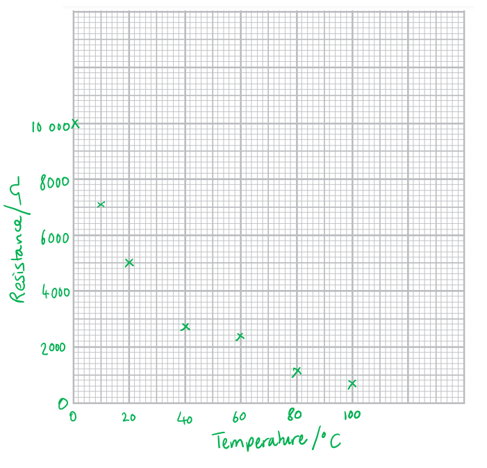

- Correct scale:

  - Suitable scales with even spacing between each number on each axis
  - More than half the space provided by the graph is used; **[1 mark]**

- Correct axes:

  - Resistance measured in ohms (Ω)
  - Temperature in degrees Celcius (°C); **[1 mark]**
- At least 3 points are plotted correctly within ± $\frac{1}{2}$ a small square; **[1 mark]**
- A further 3 points are plotted correctly within ± $\frac{1}{2}$ a small square; **[1 mark]**

(ii) The graph with the anomalous point circled would look like:

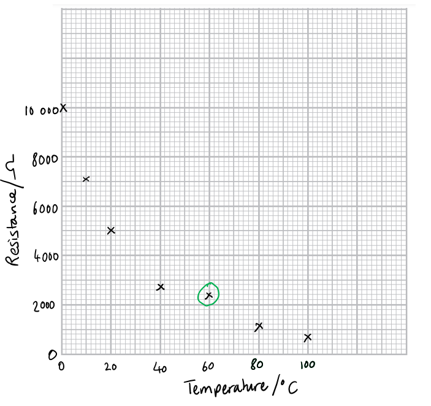

- Point at (60, 2350) is circled; **[1 mark]**

(iii) A curve of best fit which would score **one** mark would look like:

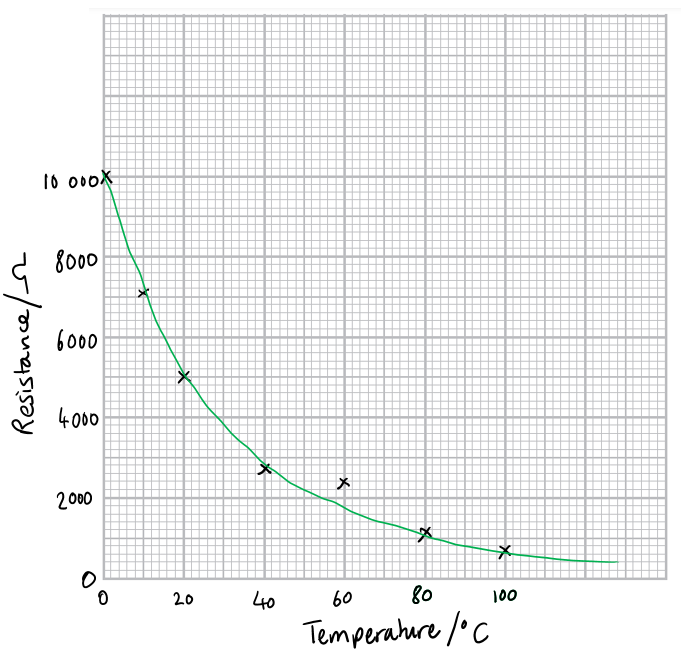

- The line of best fit should go through the point (60, 1750)

**AND**

- It should have no obvious abrupt changes in gradient; **[1 mark]**

**[Total: 6 marks]**

### 5((d)) — 2 marks
(i) The maximum temperature in the student’s investigation is limited to 100 °C because:

- Water boils at 100 °C; **[1 mark]**

(ii) To suggest how the student obtains readings below room temperature:

- Room temperature is considered below 20°C

Any **one **from:

- Adding ice to water; **[1 mark]**
- Using cold water from the tap / fridge; **[1 mark]**
- Using a 'walk-in' fridge; **[1 mark]**

**[Total: 2 marks]**

## Q19 — hard — 12 marks · exam-questions

### 5((a)) — 4 marks
(i) A diagram that would score **two** marks would look like:

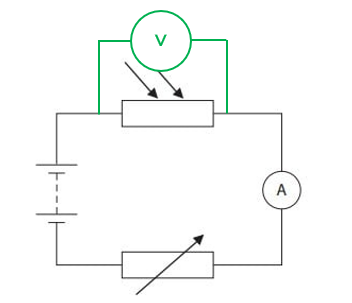

- The voltmeter is connected in parallel with a component; **[1 mark]**
- The component is the LDR; **[1 mark]**

(ii) To explain how the student can work out the resistance of the LDR using this circuit:

- Measure the current / take the current reading

**   OR**

- Measure the (number of) amperes / take the ampere reading; **[1 mark]**
- Divide the voltage (reading) / number of volts by the current (reading) / number of amperes

**   OR **

- Use the equation $R=\frac{V}{I}$; **[1 mark]**

**[Total: 4 marks]**

### 5() — 1 marks
Any **one **from:

- Move the ruler to cover half the hole / halfway down the hole (to measure across the diameter); **[1 mark]**
- Draw guidelines (at right angles to the ruler); **[1 mark]**
- Place a set square against the ruler; **[1 mark]**
- Move the ruler nearer the hole; **[1 mark]**
- Start from 0 on the ruler; **[1 mark]**

**[Total: 1 mark]**

### 5((c)) — 7 marks
(i) A graph that would score **four** marks would look like:

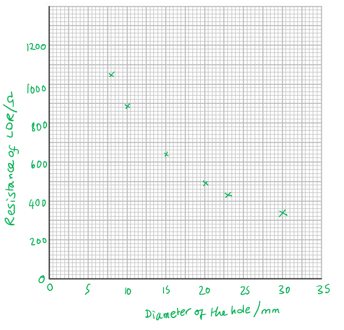

- A scale increasing in even increments and covering more than half of the width and height on the grid; **[1 mark]**
- Axes labelled with the quantities and unit in either orientation

  - Resistance of LDR / Ω
  - Diameter of hole / mm; **[1 mark]**
- 5 points plotted correctly, accurate to the nearest half square; **[1 mark]**
- 1 more point plotted correctly, accurate to the nearest half square; **[1 mark]**

(ii) A line of best fit which would gain **one** mark would look like:

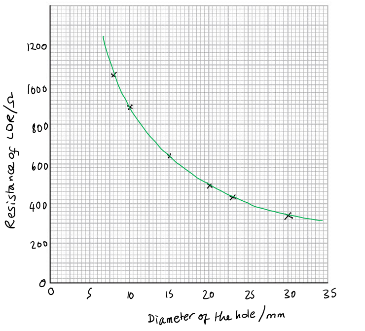

- The line of best fit should be a smooth curve

**   ****AND **

- Points distributed evenly about the line; **[1 mark]**

(iii) To describe the relationship between the resistance of the LDR and the diameter of the hole:

- The relationship between resistance and diameter) is a <u>non-linear</u> relationship; **[1 mark]**
- Resistance and diameter are <u>inversely proportional </u>to each other / have an <u>inverse</u> relationship; **[1 mark]**

**[Total: 7 marks]**

> *In part (iii) it is not correct to say that resistance and current have a negative correlation. You must say they are inversely proportional to earn the mark. When plotting points on the graph it is always more accurate and easier to add the line of best fit if you mark each point with a cross (x) and not a dot. *

## Q20 — hard — 7 marks · exam-questions

### 14((a)) — 4 marks
(i) To add the voltmeter to the circuit diagram:

A diagram that would score** ****two**** **marks would look like:

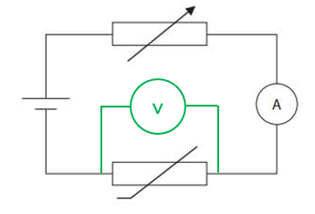

- The voltmeter is connected in parallel; **[1 mark]**
- The voltmeter is in parallel with the thermistor; **[1 mark]**

(ii) To give a reason for keeping the voltage across the thermistor constant:

- The voltage is a <u>controlled variable</u>; **[1 mark]**

**   ****OR**** **

- This makes the experiment a <u>fair test</u>; **[1 mark]**

(iii) To give a reason for including the variable resistor in the circuit:

- The current / circuit resistance can be adjusted; **[1 mark]**

**OR**

- To control the (amount of) current in the circuit; **[1 mark]**

**[Total: 4 marks]**

### 14((b)) — 3 marks
Any **one **from:

References to the data:

- The thermometer works when the temperature is high and the current value almost matches the temperature; **[1 mark]**
- The thermometer does not work when the temperature is lower the current value does not match the temperature; **[1 mark]**
- The thermometer is only correct at 10 (and 100); **[1 mark]**

Any **one **from:

References to the underlying physics:

- The current (in the thermometer) cannot be negative when the temperature is negative; **[1 mark]**
- The voltage (in the thermometer) will not be constant; **[1 mark]**
- The voltage (in the thermometer) has to be adjusted to be kept constant; **[1 mark]**

Any **one **from:

References to the line:

- The line / graph is curved; **[1 mark]**
- The graph shows that current is not directly proportional to temperature; **[1 mark]**
- Line / graph does not pass through the origin / coordinate (0, 0); **[1 mark]**

**[Total: 3 marks]**
