# Exam Questions — Static Electricity
**2. Electricity** · Edexcel IGCSE Physics (4PH1)
> Source: [https://www.savemyexams.com/igcse/physics/edexcel/19/topic-questions/2-electricity/2-4-static-electricity/exam-questions/](https://www.savemyexams.com/igcse/physics/edexcel/19/topic-questions/2-electricity/2-4-static-electricity/exam-questions/) · 16 questions · total 103 marks

## Q1 — easy — 2 marks · exam-questions

### 2((a)) — 1 mark — multiple_choice — from paper Jan 2016 · 1P
Which of these non-metals can conduct electricity?
- **A.** Carbon
- **B.** Chalk
- **C.** Plastic
- **D.** Rubber

### 4((a)) — 1 mark — multiple_choice — from paper June 2013 · 2PR
Which of these materials is an electrical conductor?
- **A.** Paper
- **B.** Plastic
- **C.** Silver
- **D.** Wood

## Q2 — easy — 3 marks · exam-questions

### 1() — 1 mark — multiple_choice
Which of the following pairs of charges shows the correct electric force between them?

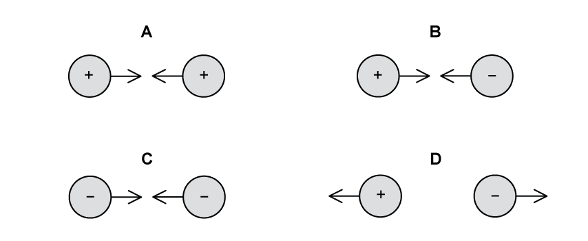
- **A.** 
- **B.** 
- **C.** 
- **D.** 

### 2() — 1 mark — multiple_choice
A student rubs a plastic rod with a cloth. Both are uncharged initially. The cloth becomes positively charged.

Compared with the cloth, which row is correct for the charge on the plastic rod?

|   | **sign of charge** | **size of charge** |
|---|---|---|
| **A** | positive | larger |
| **B** | positive | equal |
| **C** | negative | larger |
| **D** | negative | equal |
- **A.** 
- **B.** 
- **C.** 
- **D.** 

### 3() — 1 mark — multiple_choice
The student holds the charged plastic rod near a running tap. The student observes the stream of water bend towards the plastic rod.

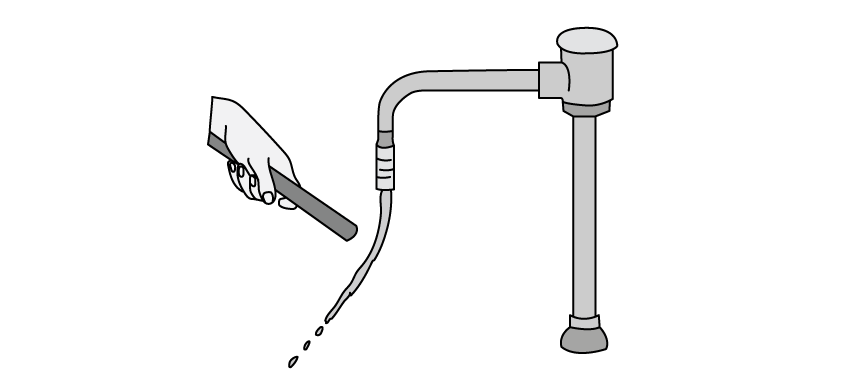

Which of the following shows the correct arrangement of charges in the stream of water?

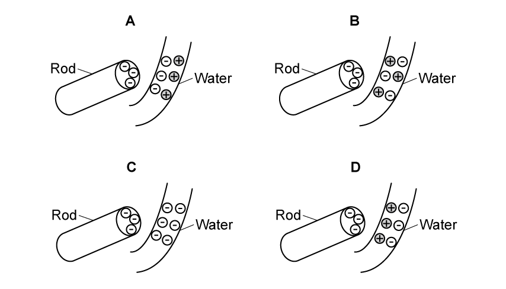
- **A.** 
- **B.** 
- **C.** 
- **D.** 

## Q3 — easy — 4 marks · exam-questions

### 3((a)) — 2 marks — command: complete — structured — from paper January 2012 · 2P
This question is about electrostatic charges.

Complete the sentences using words from the box. Each word may be used once, more than once or not at all.

| **electrons       negative       neutral       neutrons       positive       protons    ** |
|---|

When a plastic rod is rubbed with a cloth, the plastic rod gains ..................................... .

After the plastic rod has been rubbed with the cloth, the plastic rod has a .................................... charge.

### 3((c)) — 2 marks — command: state — structured — from paper January 2012 · 2P
Give **one** hazard caused by electrostatic charges and state how the risk from this hazard can be reduced.

## Q4 — easy — 9 marks · exam-questions

### 7((a)) — 2 marks — command: explain — structured — from paper June 2016 · 2P
A man pushes a metal trolley along a corridor towards a lift.

The trolley has nylon wheels and the floor of the corridor is covered with plastic.

The man wears shoes with rubber soles.

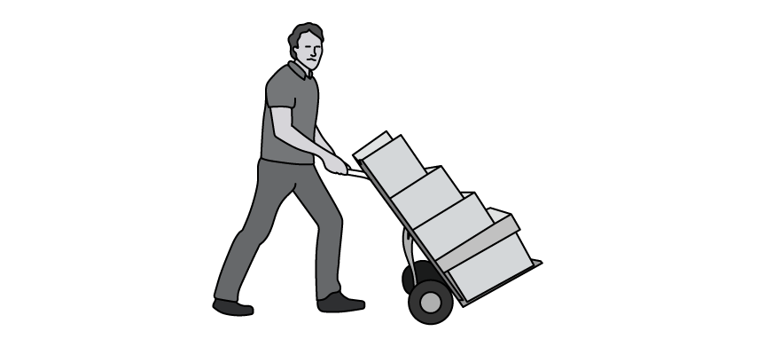

As he moves the trolley, the man gains an electric charge.

Explain how the man gains an electric charge.

### 2() — 4 marks — command: multiple — structured
The man presses a metal button to operate the lift. There is a spark and the man receives an electric shock.

The spark lasts for 0.08 s and 0.0017 C of charge passes.

(i) State the equation linking charge, current and time.

(ii) Calculate the average current in the spark.

Current = .......................... A

### 3() — 3 marks — command: complete — structured
Metal appliances, such as the lift button, are earthed for safety.

Use words from the box to complete the sentences.** **

| **conductor      insulator      potential difference      current      charge      resistance      electrons       earth      air** |
|---|

The man receives a shock even though the button is properly earthed because the lift button is made from metal, which is a ................................. . Since the man is charged, there is a ................................. between him and the button.

When he touches the button, the ................................. that have built up on the man are transferred to the ................................. through the button.

This movement of ................................. is the ................................. flowing through the man's body, which he feels as a small electric shock.

## Q5 — easy — 4 marks · exam-questions

### 2((a)) — 1 mark — command: state — structured — from paper June 2014 · 2P
When a plastic rod is rubbed with a cloth, the rod gains charge.

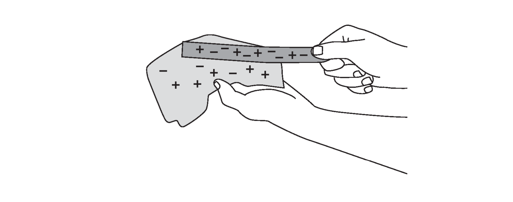

State** one** method to show that the plastic rod has gained charge.

### 2((b)) — 2 marks — command: explain — structured — from paper June 2014 · 2P
Explain how the plastic rod gains charge when it is rubbed.

### 3() — 1 mark — multiple_choice
Once the student rubs the plastic rod with a cloth, the rod becomes negatively charged and the cloth becomes positively charged.

The cloth becomes positively charged because
- **A.** the negative charge has moved from the rod to the cloth
- **B.** the negative charge has moved from the cloth to the rod
- **C.** the positive charge has moved from the rod to the cloth
- **D.** the positive charge has moved from the cloth to the rod

## Q6 — easy — 7 marks · exam-questions

### 1() — 2 marks — command: explain — structured
A student uses a plastic rod and a dry cloth to demonstrate electrostatic charge.

They rub the plastic rod with the dry cloth.

The rod becomes negatively charged.

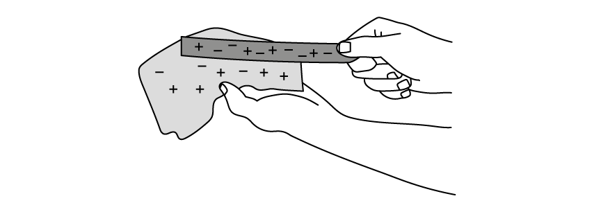

Explain how the rod becomes negatively charged.

### 2() — 1 mark — multiple_choice
Which of these is a correct unit for charge?
- **A.** Ampere
- **B.** Coulomb
- **C.** Joule
- **D.** Watt

### 3() — 4 marks — command: explain — structured
Static electricity can be dangerous when refuelling an aircraft.

As fuel flows through the pipe, it becomes charged.

An earth wire, called a bonding line, is used to connect the aircraft to the ground.

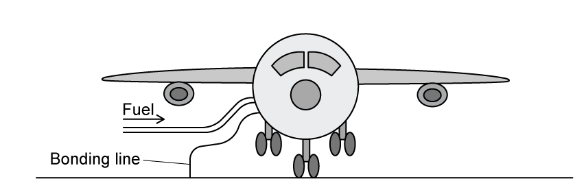

(i) Explain why it is dangerous if the charge is allowed to build up on the aircraft.

[2]

(ii) Explain how connecting an earth wire to the aircraft reduces this danger.

[2]

## Q7 — medium — 6 marks · exam-questions

### 4((b)) — 2 marks — command: explain — structured — from paper June 2013 · 2PR
A forensic scientist uses an electrostatic dust print lifter (EDPL) to take impressions of footprints. The diagram shows a  simplified EDPL and a description of how it works.

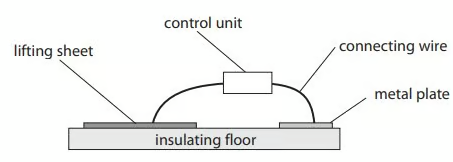

| **This is how it works**  A lifting sheet is placed over the footprint.  The metal plate is placed near it.  The control unit applies a voltage of 10 kV between the lifting sheet and the metal plate.  The lifting sheet becomes negatively charged and the metal plate becomes positively charged.  A dust print forms on the lower surface of the lifting sheet. |
|---|

Use the idea of charge movement to explain how the lifting sheet becomes negatively charged and the metal plate becomes positively charged.

### 4((c)) — 2 marks — command: suggest — structured — from paper June 2013 · 2PR
The photograph shows a typical dust print on a lifting sheet.

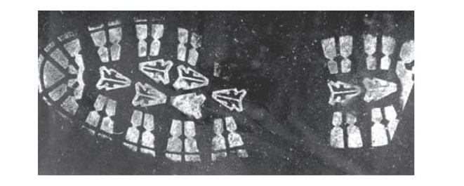

Suggest why dust particles are lifted off the floor on to the lifting sheet.

### 4((d)) — 2 marks — command: suggest — structured — from paper June 2013 · 2PR
This photograph shows a charged polythene rod placed next to a stream of water flowing from a tap.

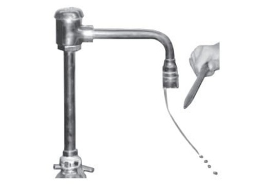

Suggest why water is deflected.

## Q8 — medium — 5 marks · exam-questions

### 6((a)) — 3 marks — command: explain — structured — from paper Jun 2015 · 2P
A student holds a roll of sticky tape and pulls the end down as shown in the diagram.

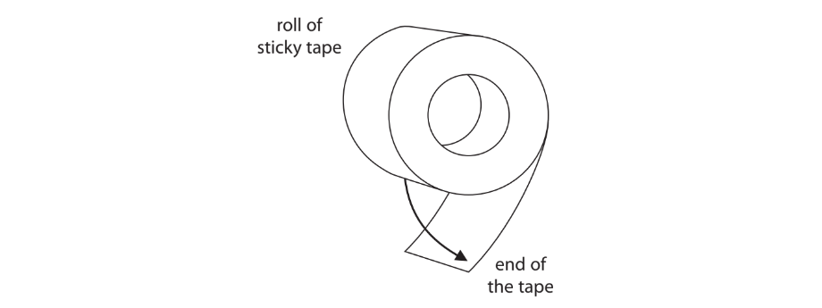

This causes both the roll and the end of the tape to become electrically charged by friction.

Explain how an object becomes charged by friction.

### 6((b)) — 2 marks — command: explain — structured — from paper Jun 2015 · 2P
The student lets go of the end of the tape and the charges cause it to move towards the roll.

Explain why the end of the tape moves back towards the roll.

## Q9 — medium — 6 marks · exam-questions

### 6((a)) — 2 marks — command: explain — structured — from paper June 2014 · 2PR
The photograph shows an investigation of static electricity.

A teacher rubs a balloon with a cloth so that the balloon gains a positive charge.

She then holds the balloon close to her head, and her hair rises.

Explain, in terms of moving charges, how the balloon becomes positively charged.

### 6((b)) — 2 marks — command: explain — structured — from paper June 2014 · 2PR
Explain why the teacher's hair rises.

### 6((c)) — 1 mark — command: suggest — structured — from paper June 2014 · 2PR
Suggest why the charge remains on the balloon even when it is being held.

### 6((d)) — 1 mark — command: suggest — structured — from paper June 2014 · 2PR
Suggest why the experiment does not work so well when the air is humid (damp).

## Q10 — medium — 6 marks · exam-questions

### 4((a)) — 3 marks — command: multiple — structured — from paper january 2016 · 2P
A car becomes electrically charged as it travels along a road.

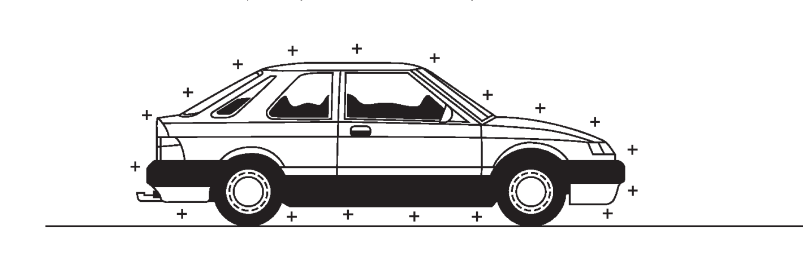

(i) Explain how a moving car becomes electrically charged.

(ii) Why does this charge remain on the car after it has stopped moving?

### 4((b)) — 3 marks — command: multiple — structured — from paper january 2016 · 2P
Some people prefer to prevent their car from becoming charged.

They do this by fixing a metal strap underneath the car.

The metal strap rubs on the ground as the car moves.

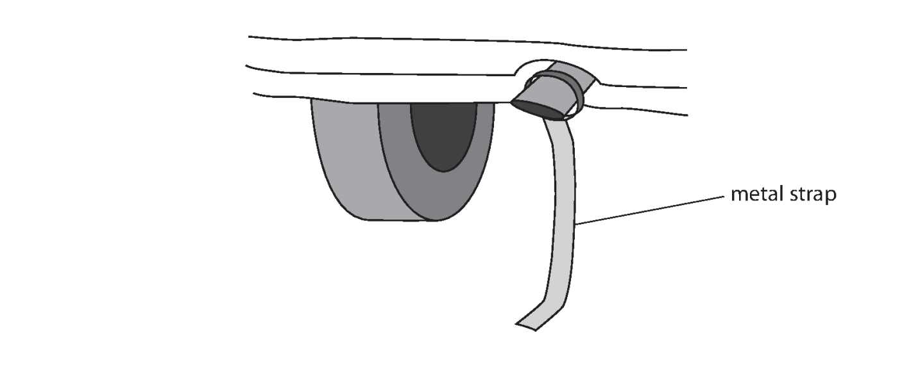

(i) Suggest why it is safer to have no electrical charge on a car.

(ii) Explain how the metal strap prevents a car from becoming charged.

## Q11 — medium — 5 marks · exam-questions

### 3((a)) — 2 marks — command: explain — structured — from paper January 2015 · 2P
The photograph shows a fuel delivery at a petrol station.

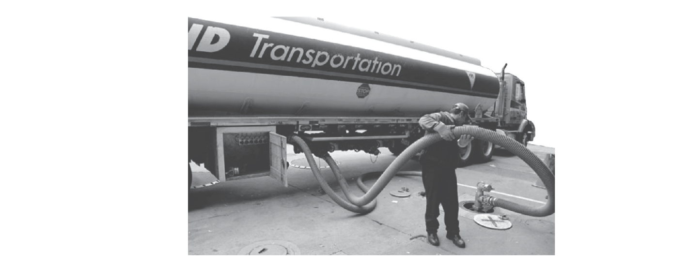

Source: Jefferson Siegel New York Daily News

Explain how a fuel tanker can become electrically charged while it is moving.

### 3((b)) — 3 marks — command: multiple — structured — from paper January 2015 · 2P
Pumping fuel from an electrically-charged tanker can be dangerous.

(i) Describe a possible danger of pumping fuel from an electrically-charged tanker.

(ii) The driver connects an earth wire to the fuel tanker before pumping fuel.

Explain how connecting the earth wire reduces the possible dangers.

## Q12 — hard — 11 marks · exam-questions

### 8((a)) — 4 marks — command: multiple — structured — from paper Jan 2022 · 2PR
Diagram 1 shows a machine used for demonstrating electrostatics.

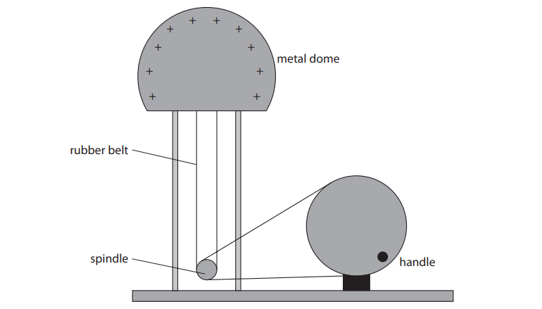

**Diagram 1**

When the handle is turned, the dome becomes positively charged.

(i) In terms of electron movement, give a reason why the metal dome becomes positively charged.

** **(ii) When the handle is turned for 15 s the dome gains 0.50 J of energy in its electrostatic store as it becomes charged.

The voltage between the dome and the earth is 120 kV.

Calculate the mean charging current during this time.

mean charging current = ............................................... A

### 8((b)) — 7 marks — command: explain — structured — from paper Jan 2022 · 2PR
The metal dome is discharged.

A thin metal case is then placed on top of the metal dome, as shown in Diagram 2.

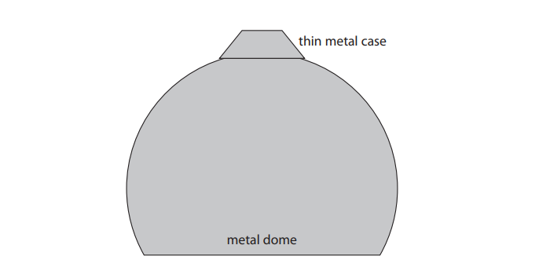

**Diagram 2**

** **

(i) When the handle is turned, the thin metal case moves upwards away from the dome.

Explain why the thin metal case starts to move upwards.

** **

(ii) Explain why the metal case reaches a maximum height above the metal dome.

## Q13 — hard — 10 marks · exam-questions

### 1() — 3 marks — command: calculate — structured
Electrostatic charges can be useful during paint spraying.

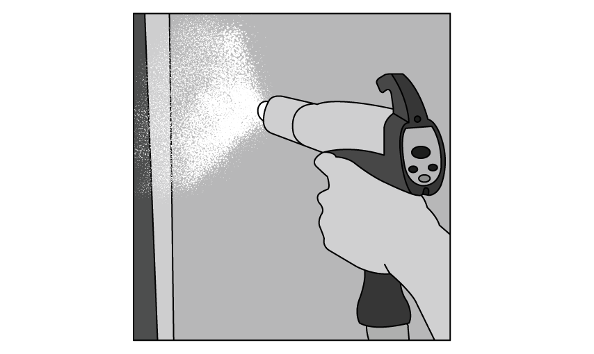

There is a current of 6 mA in the sprayer for a time of 8 minutes.

Calculate the charge supplied to the sprayer in this time.

charge = ............................................... C

### 2() — 4 marks — command: explain — structured
Explain why the following are advantages compared to an uncharged spray:

(i) The droplets of paint are given the same charge as they leave the sprayer.

** **

(ii) The droplets of paint are positively charged. The object being painted is given a negative charge.

### 2((c)) — 3 marks — command: describe — structured — from paper June 2014 · 2P
There are two types of charge.

Describe how you could demonstrate this using different insulating rods and a cloth.

In your answer, you should name any other equipment you would use.

## Q14 — hard — 5 marks · exam-questions

### 1() — 2 marks — command: explain — structured
A student reads an article about the possible build-up of static electricity during the refuelling of an aircraft.

Explain why this build-up could be dangerous.

### 7((c)) — 3 marks — command: explain — structured — from paper June 2016 · 2P
The article explains that the aircraft and fuel tank are connected by a metal cable to the ground.

Explain how these cables reduce the dangers when refuelling the aircraft.

## Q15 — hard — 12 marks · exam-questions

### 1() — 2 marks — command: explain — structured
A student investigating static electricity charges two balloons and hangs them side by side. They observe the balloons do not hang vertically, as shown in the diagram.

Explain why the cotton threads are not vertical.

### 2() — 6 marks — command: multiple — structured
The student charges the balloon by rubbing it with a cloth. The balloon becomes negatively charged.

(i) Explain how the balloon becomes negatively charged.

** **(ii) Compare the charge on the cloth compared to the balloon before and after rubbing the balloon.

### 3() — 4 marks — command: multiple — structured
The student investigates the effect of putting charged balloons on different surfaces. They put one charged balloon against a metal cabinet and one charged balloon against a wall.

(i) Describe what happens to the charge on the balloon when it touches the metal cabinet.

(ii) The student charges another balloon and holds it against a wall. The charged balloon sticks to the wall when he lets go.

Suggest why the balloon sticks to the wall.

## Q16 — hard — 8 marks · exam-questions

### 1() — 2 marks — command: describe — structured
In terms of electrons, describe the differences between conductors and insulators.

### 2() — 3 marks — command: multiple — structured
The diagram shows a positively charged cube of insulating material. The cube is fixed to a piece of polystyrene that is floating on water.

A negatively charged rod is held above the piece of polystyrene and brought close to the cube, as shown.

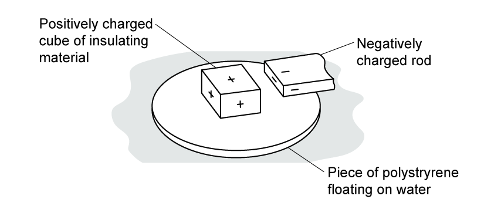

(i) Draw an arrow on the diagram to show the force acting on the insulating cube.

(ii) Describe and explain any movement by the piece of polystyrene.

### 3() — 3 marks — command: multiple — structured
The diagram shows two cubes of insulating material. One is positively charged and the other is negatively charged. The cubes are fixed to a piece of polystyrene that is floating on water.

Charged rods are held above the piece of polystyrene and brought close to the cubes, as shown.

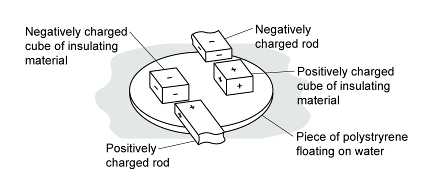

(i) Draw two arrows on the diagram to show the forces acting on the insulating materials.

(ii) Describe and explain any movement by the piece of polystyrene.
