# Exam Questions — Reflection & Refraction
**3. Waves** · Edexcel IGCSE Physics (4PH1)
> Source: [https://www.savemyexams.com/igcse/physics/edexcel/19/topic-questions/3-waves/3-2-reflection-and-refraction/exam-questions/](https://www.savemyexams.com/igcse/physics/edexcel/19/topic-questions/3-waves/3-2-reflection-and-refraction/exam-questions/) · 23 questions · total 184 marks

## Q1 — easy — 1 marks · exam-questions

### 6((a)) — 1 mark — multiple_choice — from paper 2016 January · 1P
The diagram shows changes to light waves passing from air into glass.

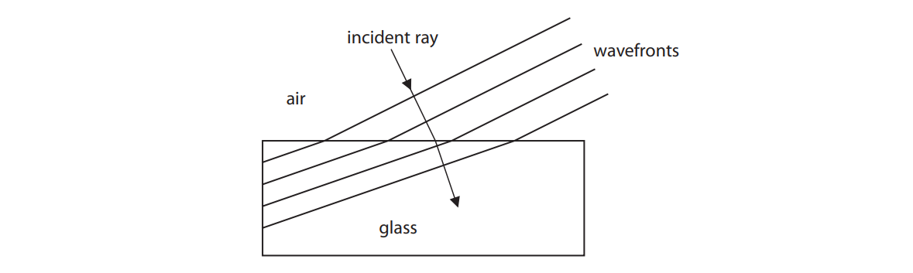

The effect shown in the diagram is
- **A.** diffraction
- **B.** dispersion
- **C.** reflection
- **D.** refraction

## Q2 — easy — 1 marks · exam-questions

### 11((a)) — 1 mark — multiple_choice — from paper 2015 January · 1P
Which diagram shows the reflection of a ray of light at a plane mirror?

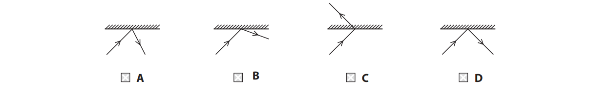
- **A.** 
- **B.** 
- **C.** 
- **D.** 

## Q3 — easy — 1 marks · exam-questions

### 3((a)) — 1 mark — multiple_choice — from paper 2015 June · 1PR
A student plans to measure the refractive index of glass.

She traces a ray of light through a glass block as shown in the diagram.

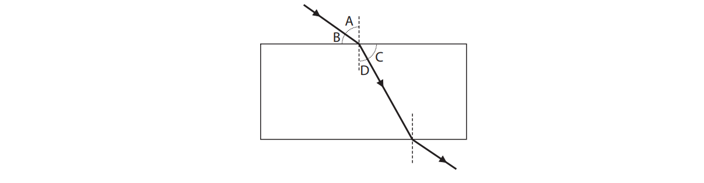

Which letter represents the angle of refraction?
- **A.** 
- **B.** 
- **C.** 
- **D.** 

## Q4 — easy — 4 marks · exam-questions

### 3((a)) — 2 marks — command: state — structured — from paper 2015 June · 1PR
The diagram shows changes to light waves passing from air into glass.

State two ways in which the light waves change as they pass into the glass.

### 3((b)) — 2 marks — command: multiple — structured — from paper 2015 June · 1PR
Using the diagram in part (a)

(i) Draw the normal to the incident ray on the diagram.

(ii) Label the angle of incidence on the diagram.

## Q5 — easy — 6 marks · exam-questions

### 2((a)) — 3 marks — command: multiple — structured — from paper 2012 June · 1P
The diagram shows a light ray passing though a semicircular block of glass.

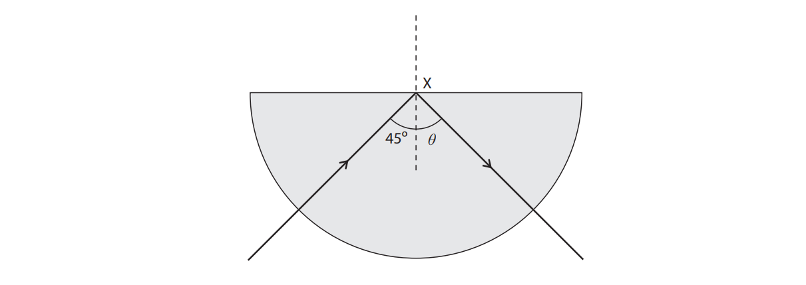

The dotted line is the normal to the surface at X.

When the light ray hits the surface as shown, **all **of it is reflected back inside.

(i) Name the process shown in the diagram

(ii) What is the angle labelled θ?

### 2((b)) — 3 marks — command: complete — structured — from paper 2012 June · 1P
The diagram shows another light ray entering a right-angled glass It hits the inside surface at Y as shown.

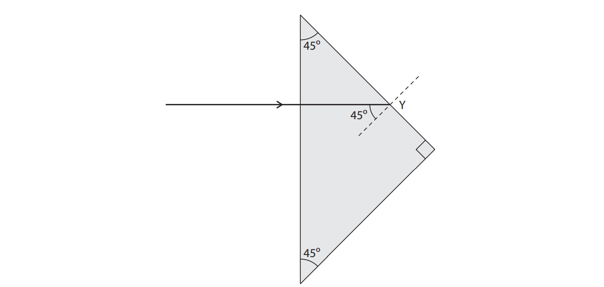

Add to the diagram to complete the path of the ray.

## Q6 — medium — 7 marks · exam-questions

### 12((a)) — 4 marks — command: multiple — structured — from paper 2015 June · 1P
A light ray can undergo total internal reflection.

(i) What is meant by the term total internal reflection?

(ii) State two uses of total internal reflection.

### 12((b)) — 3 marks — command: multiple — structured — from paper 2015 June · 1P
The diagram shows a ray of light entering a glass block and travelling towards point **O**.

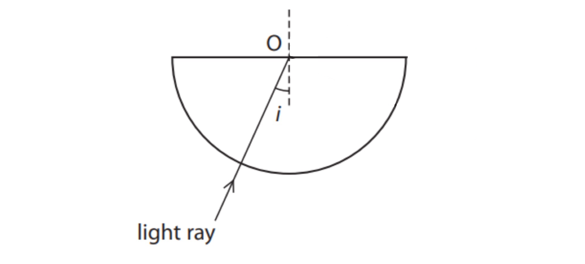

The angle *i *= 25°.

The critical angle of the glass = 42°.

(i) State the equation linking critical angle and refractive index.

(ii) Calculate the refractive index of the glass.

**   **refractive index = ....................

## Q7 — medium — 8 marks · exam-questions

### 11((a)) — 2 marks — command: explain — structured — from paper 2013 June · 1P
A ray of light enters a glass block and is refracted as shown in Figure 1.

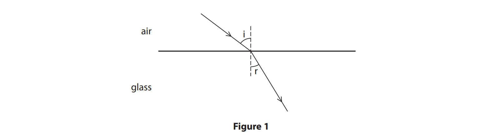

Explain why the ray of light is refracted towards the normal.

### 11((b)) — 6 marks — command: multiple — structured — from paper 2013 June · 1P
Opals and diamonds are transparent stones used in jewellery.

Jewellers shape the stones so that light is reflected inside.

Figure 2 shows the path of a ray of light that enters and leaves a shaped piece of opal.

This ray of light is totally internally reflected.

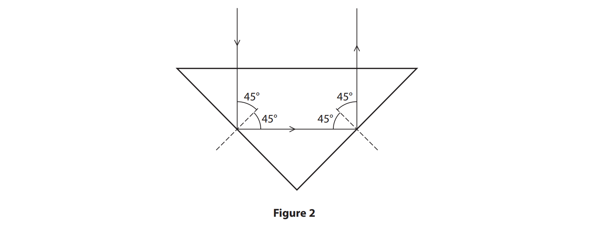

(i) State the equation linking refractive index and critical angle.

(ii) The critical angle of opal is 43°.

Show that the refractive index of opal is about 1.5.

(iii) The refractive index of diamond is 4.

Explain why rays of light inside a diamond are more likely to be totally internally reflected than those inside an opal.

## Q8 — medium — 3 marks · exam-questions

### 1((a)) — 1 mark — command: what — structured — from paper 2013 June · 1PR
The diagram shows one of two 45° prisms used in an optical instrument.

The second prism is not shown.

The path of a ray of light is partly shown.

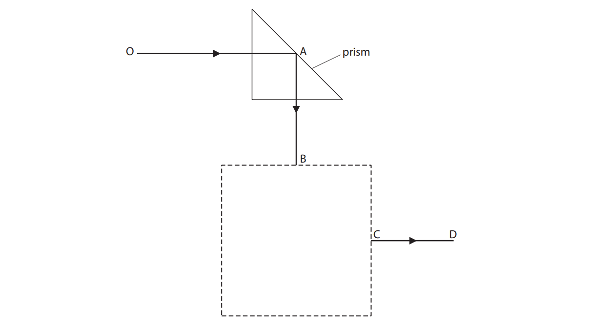

What is the effect shown at point A?

### 1((b)) — 2 marks — command: multiple — structured — from paper 2013 June · 1PR
The ray of light exits from the second prism along the line CD.

(i) Draw the position of the second prism inside the dotted square.

(ii) Complete the path of the light through the second prism.

## Q9 — medium — 10 marks · exam-questions

### 6((a)) — 6 marks — command: multiple — structured — from paper 2016 January · 1P
The diagram below shows a ray of light as it passes from air into a glass.

The angle of incidence is 43° and the light is refracted as shown.

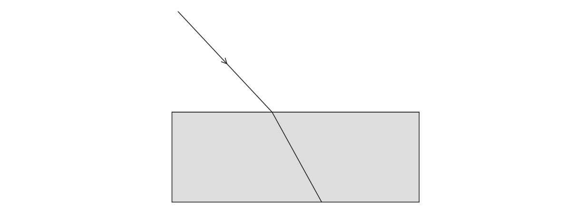

(i) On the diagram, draw the normal for this refraction.

(ii) On the diagram, mark the angle of refraction.

(iii) Measure the angle of refraction.

angle of refraction = ................. °

(iv) State the relationship between refractive index, angle of incidence and angle of refraction.

(v) Calculate the refractive index of the glass.

### 6((b)) — 4 marks — command: multiple — structured — from paper 2016 January · 1P
The diagram shows how light can travel in a glass fibre.

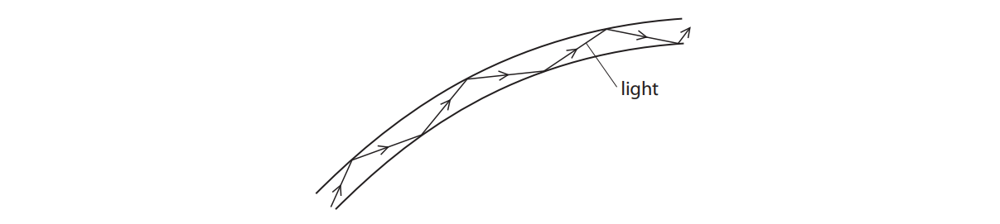

(i) What is the name given to the effect shown?

(ii) Explain what is happening to the light in the glass fibre.

## Q10 — medium — 8 marks · exam-questions

### 2((a)) — 3 marks — command: add — structured — from paper 2014 January · 1P
Pepper’s Ghost is a theatre effect used to make it appear that there is an image on stage.

The diagram shows a theatre viewed from above.

A sheet of glass is placed on the stage. A brightly lit actor stands behind a curtain at the side of the stage.

The audience sees the reflection of this actor in the glass.

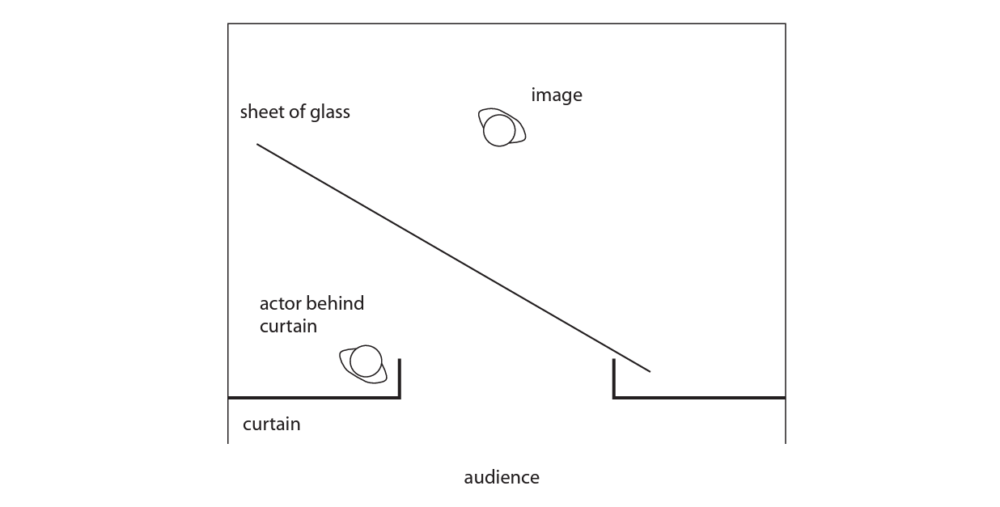

Add a ray diagram to show how light from the actor appears to come from the image.

### 2((b)) — 1 mark — command: state — structured — from paper 2014 January · 1P
The image formed by the glass is a virtual

State what is meant by the term **virtual image**.

### 2((c)) — 4 marks — command: multiple — structured — from paper 2014 January · 1P
Light travels as a transverse wave.

Some waves travel as longitudinal waves.

(i) Give an example of a wave that travels as a longitudinal wave.

(ii) Describe the difference between transverse waves and longitudinal waves.

You may draw diagrams to help your answer.

## Q11 — medium — 9 marks · exam-questions

### 2((a)) — 4 marks — command: multiple — structured — from paper 2013 January · 1P
This question is about the reflection of light.

Light reflects from a plane mirror.

(i) Use words from the box to complete the sentence below.

| less than         equal to         greater than |
|---|

When light reflects from the surface of a plane mirror, the angle of incidence is ......................................... the angle of reflection.

(ii) The diagram shows two rays of light coming from an object.

Continue the two rays and add further lines to the diagram to show how an image is formed by a plane mirror.

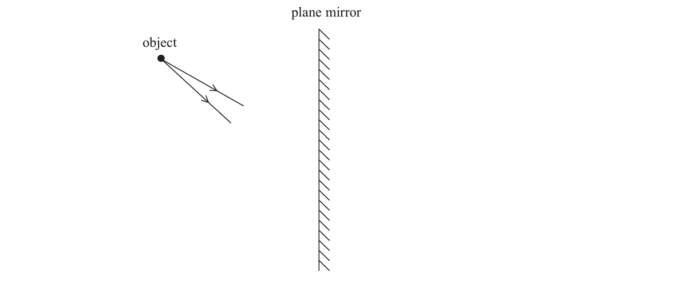

(iii) The image in a plane mirror is a **virtual image**.

How can you tell this from your diagram?

### 2((b)) — 5 marks — command: multiple — structured — from paper 2013 January · 1P
Light can also reflect along optical fibres by total internal reflection.

(i) Complete the diagram to show the path of the ray of light as it enters and passes through the optical fibre.

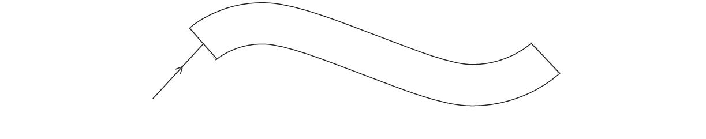

**   **

(ii) State **two **conditions required for total internal reflection to happen.

**   **

(iii) Telephone signals can be sent along optical fibres using In earlier systems the signals were sent using electric currents in copper wires.

Suggest **one **advantage of sending signals using optical fibres.

## Q12 — medium — 10 marks · exam-questions

### 4((a)) — 1 mark — command: what — structured — from paper 2012 January · 1P
A student is investigating refraction of light.

What is refraction?

### 4((b)) — 2 marks — command: add — structured — from paper 2012 January · 1P
The diagram shows a ray of light travelling from air to glass.

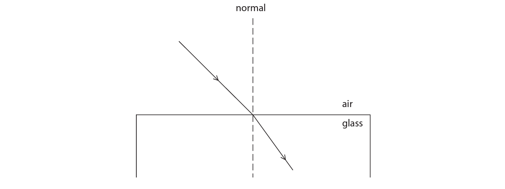

Add labels to show the angle of incidence, *i* and the angle of refraction, *r*.

### 4((c)) — 7 marks — command: multiple — structured — from paper 2012 January · 1P
The student wants to find the refractive index of the glass.

(i) State the equation linking refractive index, angle of incidence and angle of refraction.

(ii) The photograph shows the apparatus the student has available.

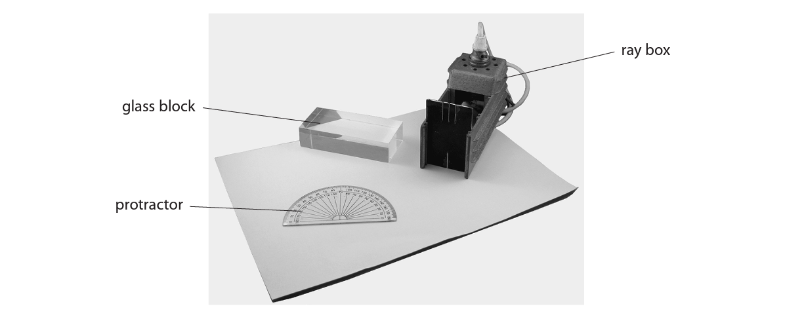

Describe how the student should carry out the experiment. You should include:

- what the student should measure
- how the measurements should be made
- how the student should use a graph to find the refractive index.

## Q13 — medium — 10 marks · exam-questions

### 6((a)) — 8 marks — command: multiple — structured — from paper 2016 June · 2P
A student investigates refraction using a glass block.

She wants to find the refractive index of the glass.

She sends rays of light into the block at different angles and measures the angle of incidence and the angle of refraction.

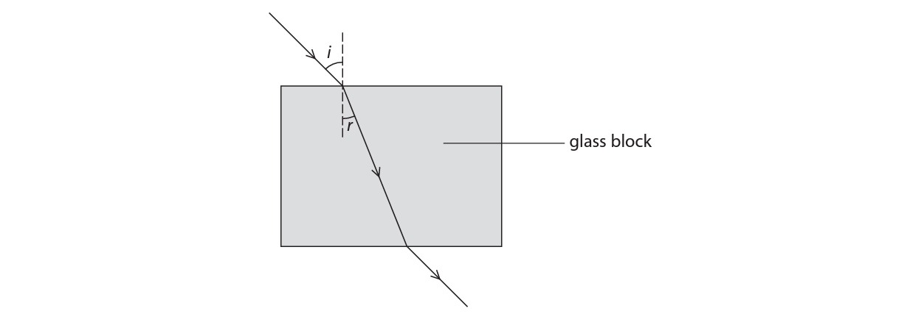

The table shows her results.

| **Angle of incidence, *****i*** | **Angle of refraction, *****r*** | **sin *****i*** | **sin *****r*** |
|---|---|---|---|
| 0° | 0° | 0.00 | 0.00 |
| 15° | 10° | 0.26 | 0.17 |
| 25° | 16° | 0.42 |   |
| 35° | 22° | 0.57 |   |
| 45° | 28° | 0.71 | 0.47 |

(i) Complete the table by calculating the missing values of sin *r*.

(ii) Draw a graph of sin *i *(*y*-axis) against sin *r *(*x*-axis).

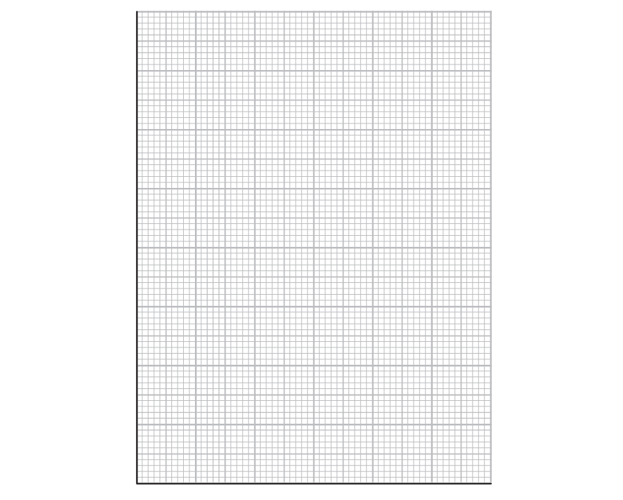

(iii) Use your graph to find the refractive index of the glass.

### 6((b)) — 2 marks — command: suggest — structured — from paper 2016 June · 2P
Suggest two reasons why using a graph to find the refractive index is a better method than simply calculating it using a pair of angles from the table.

## Q14 — medium — 11 marks · exam-questions

### 5((a)) — 4 marks — command: draw — structured — from paper 2016 June · 2P
A student uses a rectangular glass block to determine the refractive index of glass.

The diagram shows a ray of red light in air as it enters the glass block at **P**.

The normal at **P** is shown as a dotted line.

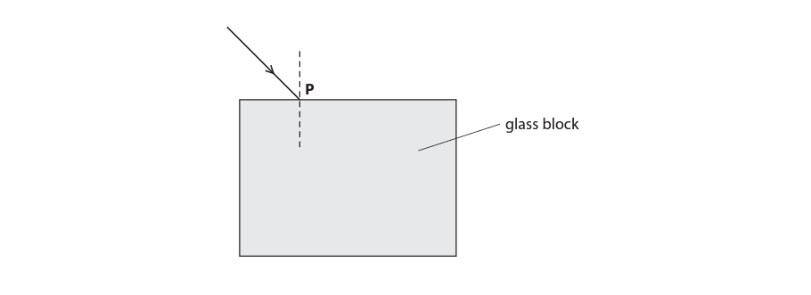

Complete the diagram by

- drawing the ray that continues inside the block
- labelling the angle of incidence (*i*) and the angle of refraction (*r*)
- drawing the ray that leaves the block.

### 5((b)) — 4 marks — command: multiple — structured — from paper 2016 June · 2P
The student measures values for the angle of incidence (*i*) and the angle of refraction (*r*).

| *i* | 60° |
|---|---|
| *r* | 34° |
| sin *i* |   |
| sin *r* |   |

(i) Complete the table by inserting values for sin *i *and sin *r*.

(ii) State the equation that links refractive index, angle of incidence (*i*) and angle of refraction (*r*).

(iii) Calculate the refractive index of the glass.

### 5((c)) — 3 marks — command: how — structured — from paper 2016 June · 2P
How should the student continue the investigation to obtain a more accurate value for the refractive index of glass?

## Q15 — medium — 9 marks · exam-questions

### 6((a)) — 6 marks — command: multiple — structured — from paper 2014 January · 2P
A student wants to find the refractive index of a glass block.

(i) Draw a diagram to show how the student should set up the apparatus needed to find the refractive index of a glass block.

Label your diagram.

(ii) What measurements should the student take to find the refractive index of the glass block?

(iii) Describe how the student should use these measurements to find the refractive index of the glass block.

### 6((b)) — 3 marks — command: multiple — structured — from paper 2014 January · 2P
The diagram shows a section through a bicycle reflector.

A ray of light is incident on the flat surface of the reflector.

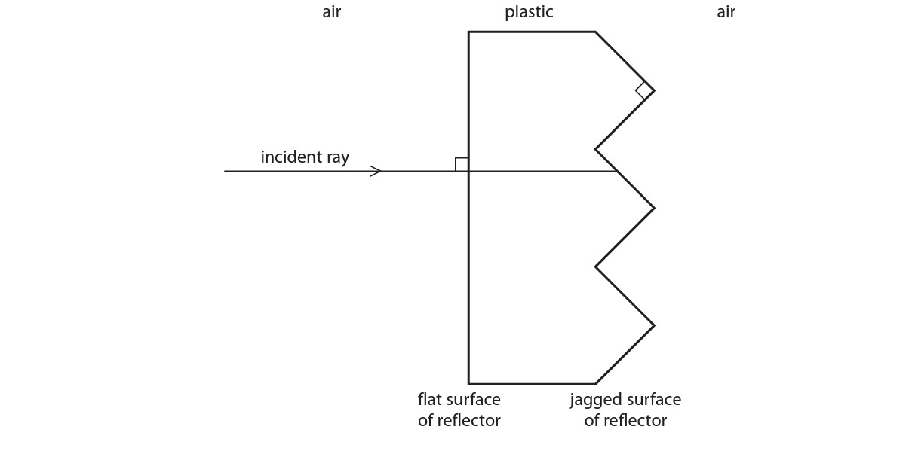

(i) The critical angle for the plastic of the reflector is less than 45°.

Continue the incident ray on the diagram to show the path of the ray until it emerges from the plastic.

(ii) What happens to the incident ray as it enters the plastic?

## Q16 — medium — 10 marks · exam-questions

### 1() — 6 marks — command: multiple — structured
This question is about refraction.

The diagram shows a beam of light from a laser passing through air and reaching the surface of a glass block at an angle.

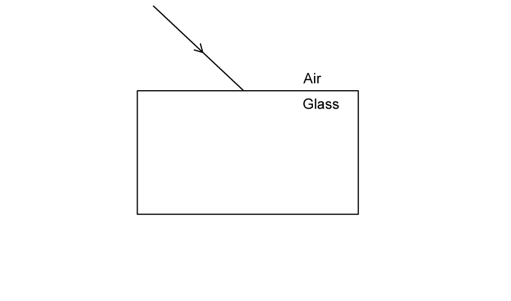

(i) State what is meant by refraction.

[1]

(ii) Draw the normal at the point where the ray meets the glass.

[1]

(iii) Draw the path of the ray of light in the glass and label the angles of incidence and refraction.

[2]

(iv) Draw the path of the light as it exits the glass block.

[2]

### 2() — 2 marks — command: calculate — structured
A student measured the angle of incidence as 46° and the angle of refraction as 28°.

Calculate the refractive index of the glass.

### 3() — 2 marks — command: describe — structured
Describe what would happen to the incident ray in (a) if the glass block were replaced with a plane mirror.

## Q17 — hard — 1 marks · exam-questions

### 12((b)) — 1 mark — multiple_choice — from paper 2015 June · 1P
The diagram shows a ray of light entering a glass block and travelling towards point **O**.

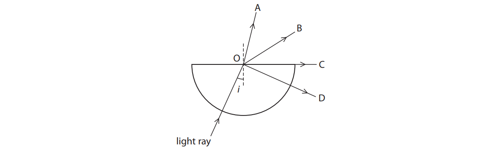

The angle* i* = 25°

The critical angle of the glass = 42°

Which path does the ray take after leaving point **O**?
- **A.** 
- **B.** 
- **C.** 
- **D.** 

## Q18 — hard — 14 marks · exam-questions

### 7((a)) — 2 marks — command: tick — structured — from paper 2016 June · 1P
A student watches a demonstration of the total internal reflection of light in a semicircular glass block.

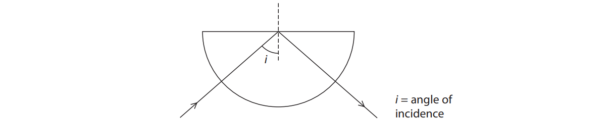

He takes notes, but some of his notes are wrong.

Place a tick or a cross in the table to show which statements are right or wrong.

The first statement is right and has been done for you.

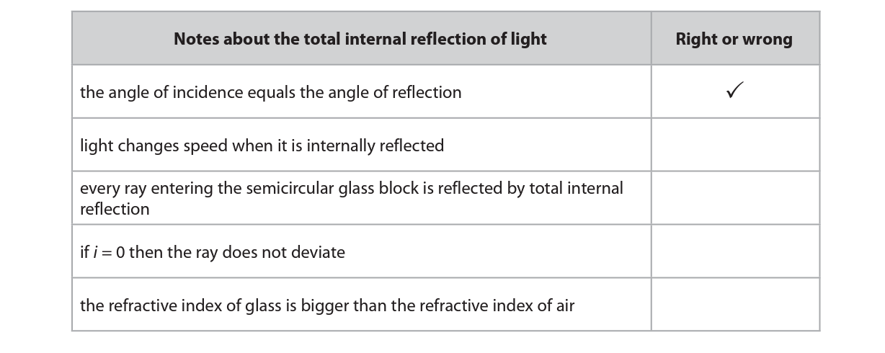

### 7((b)) — 3 marks — command: complete — structured — from paper 2016 June · 1PR
Jewellers cut jewels so that total internal reflection is more likely.

Light enters a jewel along the normal AB and leaves along the normal CD as shown.

Between B and C there are two total internal reflections.

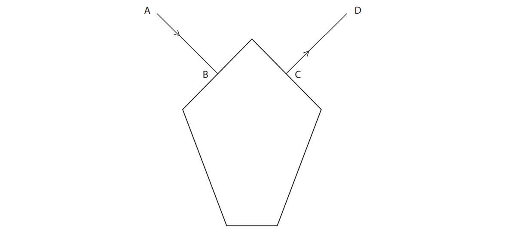

Complete the path of the light through the jewel.

### 7((c)) — 5 marks — command: multiple — structured — from paper 2016 June · 1PR
(i) Show, by calculation, that the critical angle for a refractive index of 1.5 is about 42°

(ii) Explain why the quantity called refractive index has no unit.

### 7((d)) — 4 marks — command: multiple — structured — from paper 2016 June · 1PR
The graph shows how critical angle varies with refractive index.

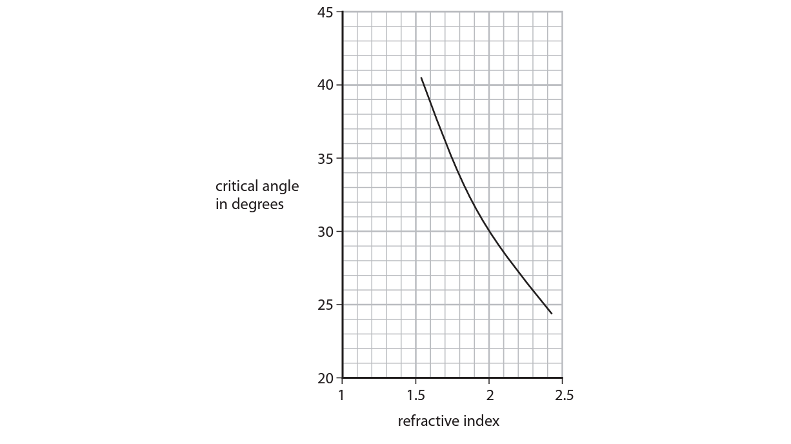

(i) Add the point (1.5, 42°) to the graph.

(ii) How can you tell that the point (1.5, 42°) is **not **anomalous?

(iii) Suggest two reasons why the axes of the graph do not start from zero.

## Q19 — hard — 16 marks · exam-questions

### 7((a)) — 3 marks — command: list — structured — from paper 2016 June · 1PR
A student uses a semicircular glass block to investigate refraction in glass.

List three other pieces of equipment that he needs for this investigation.

### 7((b)) — 5 marks — command: multiple — structured — from paper 2016 June · 1PR
He shines a ray of light into the block at point P, as shown.

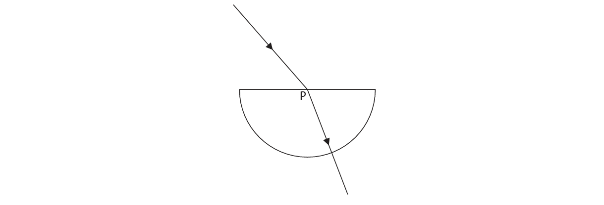

P is the middle of the flat surface.

(i) On the diagram, draw the **normal **at P.

(ii) Measure the angle of incidence and the angle of refraction.

(iii) Explain why the ray of light changes direction at P.

### 7((c)) — 8 marks — command: multiple — structured — from paper 2016 June · 1PR
The student varies the angle of incidence and obtains this table of results.

| **Angle of**  **incidence *****i*** | **Angle of**  **refraction *****r*** | **sin *****i*** | **sin *****r*** |
|---|---|---|---|
| 11° | 7° | 0.19 | 0.12 |
| 24° | 15° | 0.41 | 0.26 |
| 47° | 28° | 0.73 | 0.47 |
| 65° | 36° | 0.91 | 0.59 |
| 90° | 40° | 1.00 | 0.64 |

(i) Plot a graph of sin i against sin r.

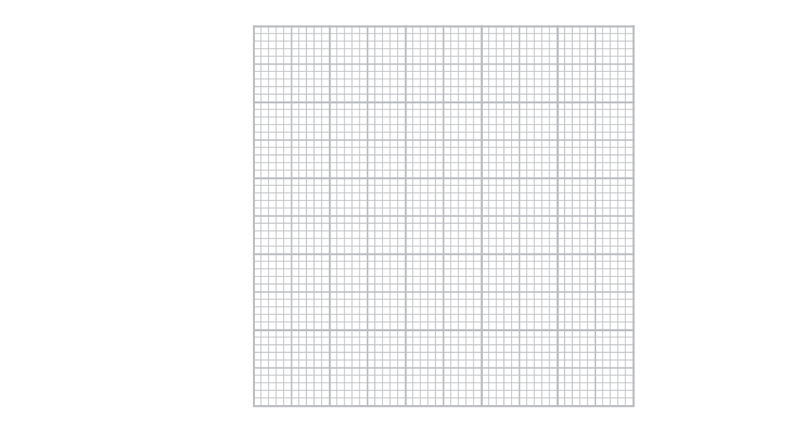

(ii) Draw the straight line of best fit.

(iii) State the relationship between refractive index, angle of incidence and angle of refraction.

(iv) Use your graph to find the refractive index of glass.

## Q20 — hard — 19 marks · exam-questions

### 4((a)) — 9 marks — command: multiple — structured — from paper 2014 June · 1PR
A student investigates refraction of light by using a salt solution in a hollow prism.

He shines a ray of blue light from A to B and traces the path of the ray through the prism.

The diagram shows the path of the ray of blue light.

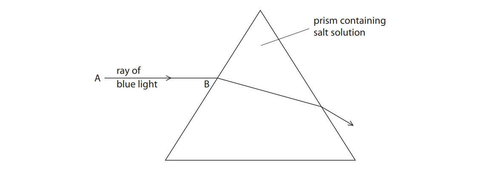

(i) Explain what is meant by the term refraction.

(ii) On the diagram, draw the normal at B and measure the angle of incidence.

(iii) The student then shines a ray of red light from A to B.

The refractive index of the salt solution is lower for red light than it is for blue light.

On the diagram, sketch a possible path for the red light through the solution and out of the prism.

(iv) Suggest what would happen to the path of the blue light if the student used a salt solution with a higher refractive index.

### 4((b)) — 10 marks — command: multiple — structured — from paper 2014 June · 1PR
A technician working in a soft drinks factory uses refraction of light to measure sugar concentration in drinks.

She takes readings using a refractometer. Different sugar concentrations give different scale readings on the refractometer.

The table shows her results.

| Sugar  concentration(%) | Refractometer  reading |
|---|---|
| 0 | 48 |
| 10 | 60 |
| 30 | 57 |
| 50 | 69 |
| 70 | 86 |
| 90 | 108 |

(i) Plot a graph of the refractometer reading against sugar concentration and draw the curve of best fit.

(ii) Circle the anomalous point on your graph and suggest what the correct refractometer reading should be.

refractometer reading =  ....................

**  **

(iii) Use your graph to find the sugar concentration when the refractometer reading is 80.

**  **sugar concentration =  .................... %

**   **

(iv) Describe the pattern shown by your graph.

## Q21 — hard — 4 marks · exam-questions

### 11((b)) — 4 marks — command: explain — structured — from paper 2015 January · 1P
Explain how the student can use the glass block to find an accurate value for the refractive index of glass.

## Q22 — hard — 9 marks · exam-questions

### 15((a)) — 2 marks — command: complete — structured — from paper 2015 January · 1P
In 1969, astronauts left a reflector on the surface of the Moon.

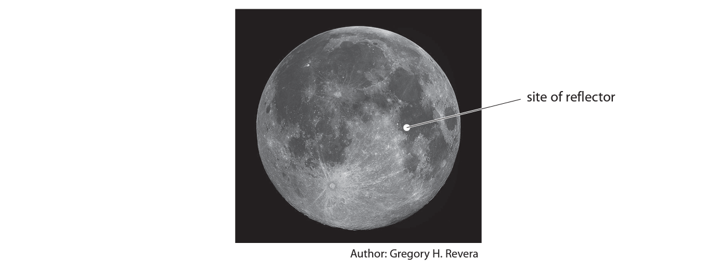

The reflector consists of mirrors at 90° to each other.

Scientists on Earth aim light from a laser at the reflector.

This light reflects back to them.

The diagram shows two mirrors in the reflector.

Complete the diagram to show the path of the ray of light.

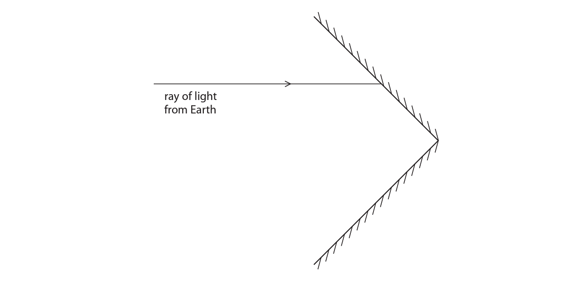

### 15((b)) — 3 marks — command: show — structured — from paper 2015 January · 1P
The speed of light in a vacuum is 300 000 km/s.

The average time for a ray of light to travel to the Moon and back is about 2.6 s.

Show that the Moon is about 400 000 km from the Earth.

### 15((c)) — 4 marks — command: multiple — structured — from paper 2015 January · 1P
Scientists measure the time for the light to travel to the Moon and back very accurately, but the time is different every day.

The graph shows how these times change over the period of one month.

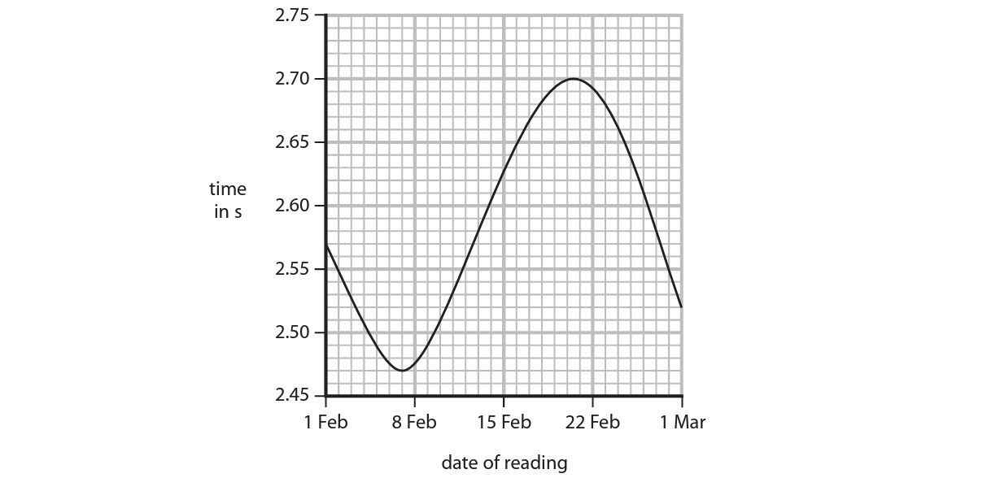

(i) Suggest what can be deduced about the orbit of the Moon from the information in the graph.

(ii) The scientists also discovered that the average time for light to travel to the Moon and back increases gradually every year.

What further information does this give about the orbit of the Moon?

## Q23 — hard — 13 marks · exam-questions

### 7((a)) — 3 marks — command: describe — structured — from paper 2012 January · 1P
A teacher and two students are measuring the speed of sound. The teacher makes a loud sound by hitting two cymbals together.

Each student starts a stopwatch when they see the teacher hit the cymbals.

They each stop their stopwatch when they hear the sound.

Describe how a sound wave moves through the air.

### 7((b)) — 5 marks — command: multiple — structured — from paper 2012 January · 1P
The students repeat the experiment and record their readings in a table.

| **Student** | **Time in s** |
|---|---|
| Andrew | 0.44, 0.46, 0.44, 0.48, 0.43 |
| Kefe | 0.5, 0.6, 0.4, 0.4, 0.6 |

(i) State the precision of Andrew’s readings.

(ii) State the equation linking speed, distance travelled and time taken.

(iii) The teacher was standing 150 m from the students.

Use the experimental data recorded by each student to complete the table below.

| Student | Mean (average) time in s | Speed of sound in m/s |
|---|---|---|
| Andrew |   |   |
| Kefe |   |   |

Give your answers to an appropriate number of significant figures.

### 7((c)) — 5 marks — command: evaluate — structured — from paper 2012 January · 1P
The students look in a data book and find that the speed of sound in air is given as 341 m/s.

The students discuss their results.

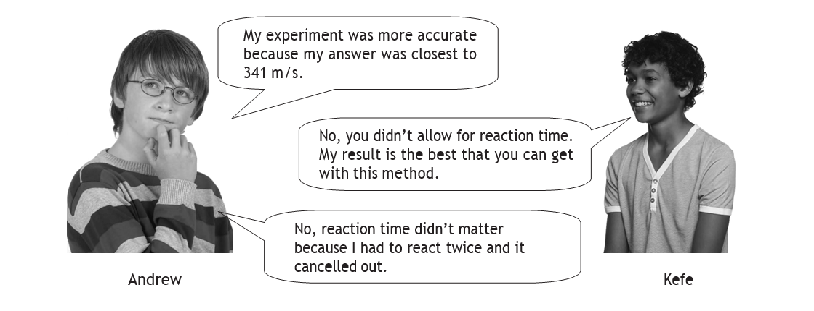

Evaluate these conclusions.
