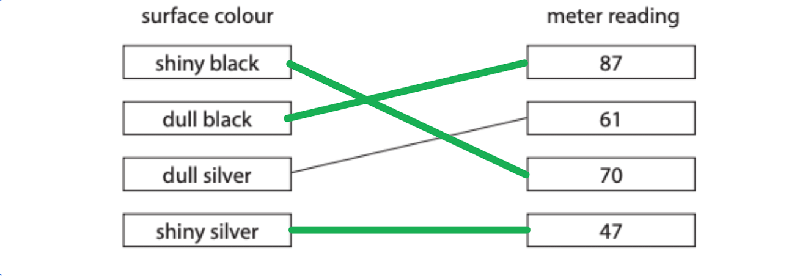
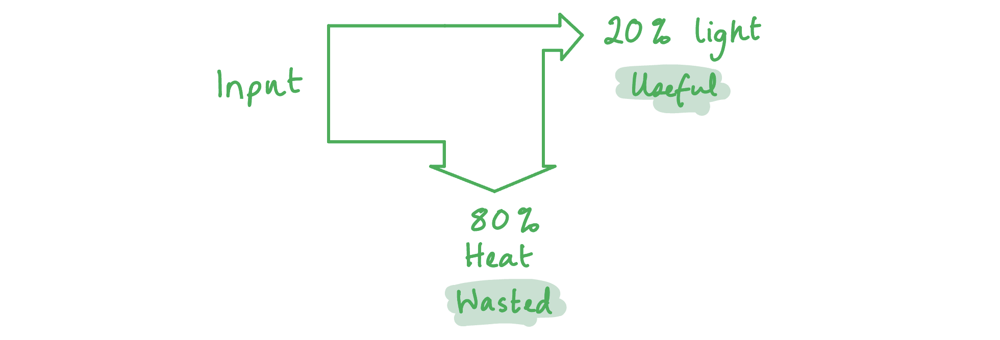
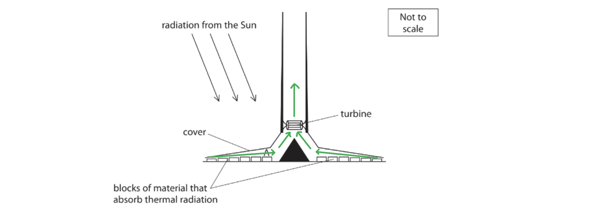

# Mark Schemes — Energy Stores & Transfers
**4. Energy Resources & Energy Transfers** · Edexcel IGCSE Physics (4PH1)

## Q1 — easy — 1 marks · exam-questions

### 1() — 1 marks
**Correct answer: A** — black

**Final answer:** **The correct answer is ****A**** because: **

- Black is the best absorber of all radiation including infrared radiation

## Q2 — easy — 1 marks · exam-questions

### 1((a)) — 1 marks
**Correct answer: A** — joule

**Final answer:** **The correct answer is ****A**** because:**

- The SI unit for energy is the joule (J)

** B **is incorrect as the kilogram (kg) is the SI unit for mass

**C **is incorrect as the newton (N) is the SI unit for force

** D **is incorrect as the watt (W) is the SI unit for power

## Q3 — easy — 8 marks · exam-questions

### 1((b)) — 4 marks
Use words from the box to complete the sentences:

- Energy from the **chemical** store of the cell **[1 mark]**
- Is transferred electrically to the **thermal** store of the bulb **[1 mark]**
- Energy is dissipated by **heating** **[1 mark]**
- And **radiation** to the surroundings **[1 mark]**

> **[mark-scheme]**
> Heating and radiation may be given in either order

### 1((c)) — 4 marks
(i) To calculate the amount of thermal energy wasted in the lamp:

- The wasted energy is the total energy in minus the energy transferred as light

Energy wasted = $50 - 36$

Energy wasted = $14 \text{J}$ **[1 mark]**

(ii) State the equation linking efficiency, useful energy output and total energy input:

$\text{efficiency} = \frac{\text{useful energy output}}{\text{total energy input}} \times 100$ **[1 mark]**

> **[mark-scheme]**
> The equation is also accepted without the × 100, which gives the efficiency as a decimal

(iii) To calculate the efficiency of the lamp:

- List the known quantities

  - Useful energy output = $36 \text{J}$
  - Total energy input = $50 \text{J}$

- Substitute the known values into the equation

$\text{efficiency} = \frac{36}{50} \times 100$ **[1 mark]**

efficiency = `72 \%` **[1 mark]**

> **[mark-scheme]**
> 1 mark for the substitution and 1 mark for the evaluation
> 
> Both 72 % and 0.72 are accepted

> **[exam-tip]**
> When a question asks you to state an equation, write it out in full. Using it correctly further down does not earn the stating mark.
> 
> Keep the useful energy output on top and the total energy input underneath. Inverting the fraction is the most common way to lose both marks here.
> 
> The useful output of a lamp is the light, not the thermal energy — the thermal energy is what is wasted.

## Q4 — easy — 1 marks · exam-questions

### 1((a)) — 1 marks
**Correct answer: C** — the walls

**Final answer:** **The correct answer is ****C**** because:**

- The diagram shows that the largest percentage of heat loss is through the walls at 35%

## Q5 — easy — 1 marks · exam-questions

### 1((b)) — 1 marks
**Correct answer: D** — 40%

**Final answer:** **The correct answer is**** D**** because:**

- Energy loss from the roof is 30%
- Energy loss from the windows is 10%
- Therefore, the total energy loss from the roof and the windows is

  - 30 + 10 = 40%
  - This is answer** D**

## Q6 — medium — 4 marks · exam-questions

### 9() — 4 marks
The hard drives work at a lower temperature when the black one is on top because:

Any** four** from:

- Heat is transferred (between the two hard drives) by conduction **OR **(in both configurations) the same total surface area is exposed; **[1 mark]**

- Thermal energy / heat / radiation is emitted; **[1 mark]**
- In the form of infrared radiation; **[1 mark]**
- More thermal energy is emitted when a larger black surface is exposed / when the black hard drive is on top / black is a good emitter of radiation; **[1 mark]**

- Less thermal energy is emitted when a larger white surface area is exposed / when the white hard drive is on top / white is a poor emitter of radiation; **[1 mark]**

- (This means that) heat will transfer between the two (surfaces / hard drives) from the hotter to the cooler until they reach the same temperature / thermal equilibrium at which point no further heat will be transferred; **[1 mark]**

**[Total: 4 marks]**

In this question, it is important to think carefully about the scenario. The hard drives heat up because they are plugged into the computer, not because they are absorbing radiation from the surroundings. Therefore, references to absorbing radiation will not gain any marks. The key point here is emitting the thermal radiation. The black hard drive is a better emitter, so energy is transferred away from the hard drives to the surroundings, and the temperature of the hard drives decreases when the black hard drive is on top.

## Q7 — medium — 12 marks · exam-questions

### 12((a)) — 4 marks
> **[mark-scheme]**
> Describe how energy is transferred from the hot plate to heat up all of the potato:
> 
> Any **four** from (1 mark each):
> 
> - Conduction from the hot plate to the pan
> - Conduction through the pan
> - Conduction from the pan to the water
> - Convection in the water
> - Conduction from the water to the potato
> - Conduction through the potato
> 
> **[4 marks]**

> **[exam-tip]**
> At every stage of your description do two things: name the method of energy transfer, and say which two objects the energy moves between. A stage that does only one of those will not score.
> 
> Vague wording such as "heating" or "transfers thermal energy" earns nothing here. Name conduction or convection each time.
> 
> Convection only happens in the water. Every solid stage — the plate, the pan and the potato — is conduction, so do not swap them round, and do not bring radiation into it.

### 12((b)) — 3 marks
> **[mark-scheme]**
> Explain whether the statement is true by describing how energy is transferred to heat up all of the potato:
> 
> Any **three** from (1 mark each):
> 
> - Microwaves are electromagnetic waves
> - Microwaves penetrate a few centimetres into the food / potato
> - The microwaves cause the water molecules to vibrate more / heat up
> - Energy is then transferred through the rest of the potato by conduction
> 
> **[3 marks]**

> **[exam-tip]**
> There are no marks for saying whether the statement is true or false, so do not spend time on it. The marks are all in the description of the energy transfer.
> 
> Say water molecules, not just "particles" or "molecules" — the microwaves act on the water specifically.
> 
> Name conduction for the last stage. Saying that the heat "spreads out" through the potato is not enough.

### 12((c)) — 5 marks
> **[mark-scheme]**
> Describe how energy is transferred to heat up all of the potato:
> 
> Any **five** from (1 mark each):
> 
> - Electromagnetic induction
> - The current in the coil creates a magnetic field around it
> - The magnetic field cuts through the metal pan
> - The magnetic field alternates / changes
> - The changing magnetic field induces a voltage across the pan
> - The voltage causes a current in the pan
> - The current causes the pan to heat up
> - Energy is transferred from the pan to the water by conduction
> - Energy is transferred through the water to the potato by convection
> 
> **[5 marks]**

> **[exam-tip]**
> Build a long answer as a chain of cause and effect: A causes B, B causes C, and so on. Marks are lost where a step is named but not linked to the one before it.
> 
> Name the effect in full. "Induction" on its own is not enough, because the question has already told you there is a coil carrying an alternating current.
> 
> Link the heating of the pan to the current in it. "The pan gets hot" without saying why does not score.

## Q8 — medium — 3 marks · exam-questions

### 9((a)) — 2 marks
Link each surface colour with the correct colour reading:

Compare the different surfaces:

- The dull black surface emits the most radiation as it <u>reflects the least</u> radiation and therefore <u>absorbs more</u> to be emitted later
- The shiny silver surface emits the least radiation as it <u>reflects the most</u> radiation and therefore <u>absorbs less</u> to be emitted later

A diagram that would score 2 marks should look like:

- Any one of the lines correct; **[1 mark]**
- All three lines correct; **[1 mark]**

**[Total: 2 marks]**

### 9((a)) — 1 marks
Write a conclusion from the knowledge that each surface has the same temperature but the sensor gives different readings for each:

- A higher reading means a higher rate of heat being emitted
- Therefore, (different surfaces) <u>emit heat / radiation at different rates</u>; **[1 mark]**

**[Total: 1 mark]**

> *The expression "different surfaces emit different **amounts** of heat / radiation" is enough to score a mark, but 'amount' is not a scientific word. It is best to use the correct terminology whenever possible.*

> *"Amount" can always be replaced by terms such as "mass', "volume" or "rate". While "amount" is accepted here, it may **not** be accepted as an answer in the paper that counts!*

## Q9 — medium — 4 marks · exam-questions

### 8((a)) — 4 marks
Explain why the air moves as shown by the arrows:

Any** four** from:

- Due to <u>convection</u>; **[1 mark]**
- Air entering (at the bottom) from outside is <u>cooler</u>; **[1 mark]**
- Heated air <u>expands</u> / molecules move apart;** [1 mark]**
- Less dense air <u>rises</u>; **[1 mark]**
- (Above the cooling tower) air <u>cools</u> and becomes more <u>dense</u>; **[1 mark]**
- Cooler / denser air <u>falls</u> (outside the cooling tower);** [1 mark]**
- The process is <u>repeated</u> / continuous / convection current formed; **[1 mark]**

**[Total: 4 marks]**

## Q10 — medium — 3 marks · exam-questions

### 8((b)) — 3 marks
Describe the energy transfers involved in this process:

Any **three** from:

- The <u>water</u> initially has energy in its <u>gravitational store</u>;** [1 mark]**
- As the water falls, energy is transferred to the <u>kinetic store of the water</u>; **[1 mark]**
- As the water turns the turbine, energy is transferred to the <u>kinetic store of the turbine</u>; **[1 mark]**
- As the turbine turns the generator, energy is transferred to the <u>kinetic store of the generator</u>; **[1 mark]**
- Energy is <u>transferred electrically</u> through cables / via the national grid; **[1 mark]**

**[Total: 3 marks]**

> *It is handy to learn these energy transfers as this is a very common example that comes up in exams!*

## Q11 — medium — 6 marks · exam-questions

### 10() — 6 marks
Describe the different ways in which energy is transferred to cook the potatoes:

Any **six** from:

- The metal spike conducts thermal energy to the potato; **[1 mark]**
- Thermal energy is conducted through the potato; **[1 mark]**
- Convection (current) occurs inside the oven; **[1 mark]**
- Due to density of air decreasing / air expanding; **[1 mark]**
- The potato receives hotter air near the top; **[1 mark]**
- Thermal energy is radiated/emitted from the black surfaces inside the oven; **[1 mark]**
- The potato absorbs thermal energy from all sides; **[1 mark]**
- Electrical energy is transferred into thermal energy in the heating element; **[1 mark]**

**[Total: 6 marks]**

## Q12 — medium — 6 marks · exam-questions

### 2((b)) — 1 marks
State what is meant by the phrase **energy is conserved:**

Any **one **from:

- The total energy (in a system) always has the same value; **[1 mark]**
- Energy cannot be created or destroyed; **[1 mark]**
- Energy input = energy output; **[1 mark]**

**[Total: 1 mark]**

### 2((c)) — 5 marks
(i) Explain what 20% efficiency means:

- 20% of the input energy / total energy; **[1 mark]**
- Is transferred usefully / as light **OR**** **80% of the input energy / total energy; **[1 mark]**

- Is wasted / transferred as heat; **[1 mark]**

(ii) Draw a labelled Sankey diagram for the lamp:

A diagram that would score 3 marks should look like:

- <u>One</u> input / total energy in arrow splitting into <u>two</u> output energy arrows; **[1 mark]**
- Input and output arrows have approximately the correct proportions; **[1 mark]**
- Output arrows correctly labelled; **[1 mark]**

**[Total: 5 marks]**

> *To make sure your proportions are correct when drawing Sankey diagrams, use a ruler!*

> *5 cm input energy = 100%*

> *Therefore, 1 cm = 20% and 4 cm = 80%*

## Q13 — medium — 5 marks · exam-questions

### 7((a)) — 4 marks
Explain how the woollen blanket helps to keep the student warm:

Any **four** from:

- The blanket reduces heat loss / traps heat; **[1 mark]**
- Air is a good insulator / reduces conduction; **[1 mark]**
- The blanket is a good insulator / reduces conduction; **[1 mark]**
- The blanket traps air reducing air movement; **[1 mark]**
- Therefore convection currents are reduced / stopped; **[1 mark]**
- Sweat cannot evaporate; **[1 mark]**
- Therefore, the cooling effect of sweating is reduced; **[1 mark]**

**[Total: 4 marks]**

### 7((b)) — 1 marks
Explain why you agree or disagree with the student:

Any **one** from:

- The student is correct because the aluminium foil reflects infrared (heat) radiation back to the student; **[1 mark]**
- The student is correct because aluminium is a poor absorber / emitter of radiation; **[1 mark]**
- The student is incorrect because aluminium foil is a good conductor / bad insulator; **[1 mark]**

**[Total: 1 mark]**

## Q14 — hard — 12 marks · exam-questions

### 12((a)) — 2 marks
The image gives the information that the temperatures of the objects shown are:

Any **two** from:

- The bear / the bear's <u>fur</u> and the snow are about the <u>same temperature</u>; **[1 mark]**
- The bear's head / nose / eyes are <u>warmer</u> than the bear's fur / the snow; **[1 mark]**
- The bear's eyes are the warmest; **[1 mark]**
- The sky is the coldest; **[1 mark]**

**[Total: 2 marks]**

> *The image shows **relative** temperatures, this means that the temperatures of the objects or parts of the objects must be compared. You may have chosen to make the same statements, but worded differently. For example: 'The snow is colder than the bears head' would be the same marking point as 'The bear's head is warmer than the snow'. This is fine and you would still get the mark. The important points here are the use of comparative language, such as warm**er**, cold**er**, warm**est**, cold**est,** and making sure that you pick two **separate objects** to compare.*

### 12((b)) — 5 marks
(i) Explain how its fur reduces the amount of thermal energy lost by the polar bear:

Any **two **from:

- The hollow hairs / fur fibres act as an <u>insulator</u>; **[1 mark]**
- <u>Air</u> is an insulator / poor conductor (of thermal energy);** [1 mark]**
- Air is trapped close to the body by the hairs / fur;** [1 mark]**
- Convection currents cannot form between the hairs; **[1 mark]**
- White fur is a poor emitter of thermal energy; **[1 mark]**

(ii) Discuss how the white fur and black skin affect the overall amount of thermal energy lost by the polar bear’s body:

Any **three** from:

- Black skin is a good <u>emitter</u> of thermal energy; **[1 mark]**
- White fur is a good <u>reflector</u> of thermal energy; **[1 mark]**
- Black skin is a good <u>absorber</u> of thermal energy; **[1 mark]**
- The reflected thermal energy is <u>absorbed</u> by the black skin; **[1 mark]**

**[Total: 5 marks]**

### 12((c)) — 5 marks
(i) Compare the absorption and reflection of ultraviolet rays by the objects shown in the image:

Any **two **from:

- Snow <u>reflects</u> / <u>does not absorb</u> UV; **[1 mark]**
- The sky <u>absorbs</u> / <u>does not reflect</u> UV; **[1 mark]**
- The bear's fur <u>absorbs</u> / <u>does not reflect</u> UV; **[1 mark]**
- The bear's eyes <u>reflect</u> / <u>do not absorb</u> UV; **[1 mark]**

(ii) Suggest why the sky appears dark, even though the Sun emits ultraviolet rays:

- The sky absorbs / does not reflect UV **OR **the sun is not included in the image; **[1 mark]**

(iii) Suggest why this radiation does not pass down to the polar bear’s skin:

Any **two** from:

- UV / light is absorbed by the hair; **[1 mark]**
- Total internal reflection cannot occur; **[1 mark]**
- Because the air inside the hairs is less dense than the hair fibres, therefore the rays will be refracted toward the normal; **[1 mark]**

**[Total: 5 marks]**

> *For part (i), verbs such as **emit **and **radiate** will not be accepted. You need to use the words **absorb** and **reflect** in your answer.*

## Q15 — hard — 2 marks · exam-questions

### 12((c)) — 2 marks
To show that the efficiency of the panel of solar cells is 12%:

- List the known quantities:

  - Total energy input, $E_{\text{total}} = 200 \text{J}$
  - Wasted energy, $E_{\text{wasted}} = 176 \text{J}$
- Calculate the useful energy output:

$E_{\text{useful}} = E_{\text{total}} - E_{\text{wasted}}$

$E_{\text{useful}} = 200 - 176 = 24 \text{J}$ **[1 mark]**

- Write down the efficiency equation:

$\text{efficiency} = \frac{\text{useful energy output}}{\text{total energy input}} \times 100$

- Substitute the known values:

`text efficiency end text equals 24 over 200 cross times 100 equals 12 percent sign` **[1 mark]**

> **[mark-scheme]**
> 1 mark for calculating the useful energy output of 24 J
> 
> 1 mark for correct substitution into the efficiency equation
> 
> - The substitution is what earns this mark, so 24 ÷ 200 = 0.12 is credited even if it is not converted into a percentage
> 
> You may also gain both marks by working with the wasted energy instead: $\frac{176}{200} \times 100$ = 88%, then useful energy transfer = 100 − 88 = 12%

> **[exam-tip]**
> The efficiency equation is not given on the equation sheet, so you need to learn it.
> 
> In a Sankey diagram, the arrow entering from the left is the total energy input. The arrows leaving are the outputs, with wasted energy usually drawn downwards and useful energy continuing to the right. Mistaking the wasted energy for the useful output is the most common error in this type of question.

## Q16 — hard — 6 marks · exam-questions

### 3((b)) — 4 marks
(i) Explain how the shiny surfaces reduce the thermal energy transferred to the liquid oxygen from the laboratory:

Any **two** from:

- Shiny surfaces reflect; **[1 mark]**
- Infrared radiation; **[1 mark]**
- So there is little / no absorption of radiation by the liquid oxygen; **[1 mark]**
- Shiny surfaces are poor emitters; **[1 mark]**

(ii) Explain how the vacuum reduces the thermal energy transferred to the liquid oxygen from the laboratory:

Any **two **from:

- In a vacuum, there are no particles; **[1 mark]**
- Therefore, there is little / no conduction; **[1 mark]**
- So there is little / no convection currents formed; **[1 mark]**

**[Total: 4 marks]**

### 3((c)) — 2 marks
A lid was not needed because:

Any **two** from:

- There is cold gas / air / oxygen just above the surface of the liquid oxygen;** [1 mark]**
- This layer of gas / air / oxygen would insulate the surface of the liquid oxygen; **[1 mark]**
- The air in the room is warmer; **[1 mark]**
- Therefore, convection currents in the air / gas / oxygen just above the surface of the liquid oxygen are unlikely to form; **[1 mark]**
- Oxygen gas would build up pressure in a sealed vessel; **[1 mark]**

**[Total: 2 marks]**

## Q17 — hard — 10 marks · exam-questions

### 9((a)) — 5 marks
Air moves as shown on the diagram because:

Any **five **from:

- <u>Energy</u> (is transferred) <u>from the sun</u> (to water and land); **[1 mark]**
- Air over the (warmer) land is <u>heated</u>; **[1 mark]**
- Warmer air over land <u>expands</u>; **[1 mark]**
- This air becomes <u>less dense</u>; **[1 mark]**
- <u>Therefore</u> this air rises; **[1 mark]**
- Cooler air over the sea becomes <u>denser</u>; **[1 mark]**
- <u>Therefore</u> this air sinks; **[1 mark]**
- Air (from the sea) moves inland to replace rising air; **[1 mark]**

**[Total: 5 marks]**

> *The mark points with an underlined "**therefore**" can only be gained if that statement is made in connection with the previous point. "Cause and effect" marks like this are common, make sure you explain where your statements come from.*

> *Phrases such as "hot air rises" are not substantial enough to gain marks.*

### 5((a)) — 5 marks
Describe how the process of convection causes this air movement:

Any **five **from:

- The air is <u>heated</u> / <u>warmed</u> (by the coal fire); **[1 mark]**
- The air <u>expands</u> / molecules <u>move apart</u>; **[1 mark]**
- This air becomes <u>less dense</u>; **[1 mark]**
- <u>Therefore</u> this (hot / less dense) air rises; **[1 mark]**
- Cooler air (from outside) displaces the warm air; **[1 mark]**
- (Above the chimney) the hot air cools / contracts / becomes denser; **[1 mark]**
- <u>Therefore</u> this (cooled / denser) air sinks; **[1 mark]**
- This process (of convection) is <u>continuous</u> / <u>repeated</u>; **[1 mark]**

**[Total: 5 marks]**

> *A mark is lost if you make a statement along the lines of "the air **particles** become less dense" or "the air **particles** expand". The particles remain exactly the same - they just move further apart - however, students can mistakenly state that the particles change size by poorly wording their statements like this.*

## Q18 — hard — 15 marks · exam-questions

### 9((a)) — 5 marks
(i) Complete the table by recording the readings shown on the meters below:

- The current is 2 A **[1 mark]**
- The voltage is 12 V **[1 mark]**

(ii) Show that the energy supplied to the heater in 20 minutes is about 30 000 J

List the known quantities:

- Time, *t *= 20 minutes
- Current, *I *= 2 A
- Voltage, *V *= 12 V

From the data booklet:

- Energy transfer, *E *= *V *× *I *× *t *

Convert the units for time from minutes into seconds:

- There are 60 seconds in 1 minute
- So, in 20 minutes there are 20 × 60 = 1200 seconds; **[1 mark]**

Substitute the known quantities into the equation for energy transfer:

- *E *= 12 × 2 × 1200 **[1 mark]**

Calculate the energy supplied to the heater, *E*:

- *E *= 28 800 J **[1 mark]**

**[Total: 5 marks]**

### 9((b)) — 5 marks
(i) To state the equation linking efficiency, useful energy output and total energy input:

- $Efficiency=\frac{Usefulenergyoutput}{Totalenergyinput}$ **[1 mark]**

(ii) To calculate the efficiency of heating the aluminium block:

List the known quantities:

- Energy output = 22 000 J
- Energy input = 30 000 J (from part a, ii))

Recall the equation for efficiency from part (i):

- $Efficiency=\frac{Usefulenergyoutput}{Totalenergyinput}$

Substitute the known quantities into the equation:

- $Efficiency=\frac{22000}{30000}$ **[1 mark]**

Calculate the efficiency of heating the aluminium block:

- $Efficiency=0.73$

**   ****OR**

- `E f f i c i e n c y space equals space 73 percent sign` **[1 mark]**

(iii) Suggest why the efficiency of the heater will be higher than this value:

- The calculation of useful energy does not allow for the energy <u>lost</u>; **[1 mark]**

(iv) State one way in which the student could increase the efficiency of heating the aluminium block:

- <u>Insulate</u> the block (to reduce energy loss); **[1 mark]**

**[Total: 5 marks]**

### 9((c)) — 5 marks
(i) Explain the shape of the graph in section **A**:

- Energy is required to raise the temperature of the <u>heater</u>; **[1 mark]**

**   OR **

- Time is required for energy to transfer between the heater and the thermometer; **[1 mark]**

(ii) Explain the shape of the graph in section **B**:

- Heat transfers through the block by <u>conduction</u>; **[1 mark]**
- The input (energy) is greater than the output (energy); **[1 mark]**

(iii) Explain the shape of the graph in section **C**:

Any **two **from:

- Energy is <u>lost</u> to the <u>surroundings</u>; **[1 mark]**
- By radiation; **[1 mark]**
- At a higher <u>rate</u>; **[1 mark]**
- Most of the heat supplied is lost **OR **energy input and output are nearly equal; **[1 mark]**

**[Total: 5 marks]**

## Q19 — hard — 12 marks · exam-questions

### 10((a)) — 5 marks
(i) State the equation linking gravitational potential energy, mass, g and height:

- Gravitational potential energy = mass × g × height **[1 mark]**

**OR**

- $\mathrm{GPE}=mgh$** [1 mark]**

(ii) Show that the gravitational potential energy gained by the man is about 4000 J:

List the known quantities:

- Mass, *m* = 78 kg
- Height, *h* = 5.0 m

From the equation sheet:

- Acceleration of freefall, g = 10 m/s2

Substitute the known values into the equation from part (i):

- $\mathrm{GPE}=78\times5.0\times10$ **[1 mark]**
- GPE = 3900 (J) **[1 mark]**

(iii) State the work done on the man and give the unit:

- Work done is equal to the energy transferred
- Therefore, *W* = 3900 **[1 mark] **J / joules **[1 mark]**

**[Total: 5 marks]**

> *Remember that when stating an equation, you will still get the marks if the equation is given in its rearranged form as long as the rearrangement is correct. *

### 10((b)) — 4 marks
(i) State the equation linking efficiency, useful energy output and total energy input:

- $\mathrm{Efficiency}=\frac{\mathrm{Useful} \mathrm{energy} \mathrm{output}}{\mathrm{Total} \mathrm{energy} \mathrm{input}}$ **[1 mark]**

(ii) Calculate the efficiency of the escalator:

List the known quantities:

- Power, P = 7.5 kW
- Number of people = 30 per minute
- Mass per person = 78 kg
- Height, *h* = 5.0 m (from part (a))

Determine the total energy input:

- Power is the rate of energy transfer
- Therefore the power rating of 7.5 kW means that 7500 J of energy is being transferred per second

  - Hence the total energy input is 7500 J per second

Determine the useful energy output:

- The people on the escalator are **gaining** gravitational potential energy as they travel upwards

  - Therefore, the **useful** energy output is the **gravitational** **potential** energy gained by the people per second

Calculate the energy output in J/s:

- $\mathrm{GPE}=mgh$

  - Taking *m* to be the total mass of 30 people
  - `G P E space equals space open parentheses 30 space cross times space 78 close parentheses space cross times space 10 space cross times space 5.0`
  - GPE = 117 000 J per minute
- Converting to GPE per second

  - $\frac{117000}{60}=1950$ J/s **[1 mark]**
- Therefore, useful energy output = 1950 J

Calculate the efficiency:

- $\mathrm{Efficiency}=\frac{1950}{7500}\times100$ **[1 mark]**
- Efficiency = 26% **[1 mark]**

**[Total: 4 marks]**

> *This question is difficult because the values are not given to you directly. There is a little bit of detective work to be done to find the values you need for the final calculation. Sometimes, there will be a little bit of leeway with the final answer to account for possible rounding errors. In this case the mark scheme allowed an answer of 27% to also get the mark. However, this is not always the case, so do not rely on it! Always work with **at least** one more significant figure or decimal place than you need in your answer to avoid rounding errors. *

### 10((c)) — 3 marks
A diagram that would score 3 marks should look like:

- Total energy in split between useful energy out and wasted energy, both drawn with arrow heads;** [1 mark]**
- Correct proportions shown for 3 kW useful energy out and 12 kW wasted energy; **[1 mark]**
- Correctly labelled useful and wasted energy outputs; **[1 mark]**

**[Total: 3 marks]**

## Q20 — hard — 9 marks · exam-questions

### 12((a)) — 6 marks
(i) Explain what happens to the air at A just under the cover:

Any **three** from:

- The air becomes hot; **[1 mark]**
- The air expands / space between particles increases; **[1 mark]**
- The air becomes less dense; **[1 mark]**
- The air rises; **[1 mark]**

(ii) On the diagram, mark the directions of the air movements over the blocks of material and through the turbine:

A diagram that would score 2 marks should look like:

- Clear inward arrows above the heat absorbing materials shown; **[1 mark]**
- Clear upward arrow inside the tower shown; **[1 mark]**

(iii) State the name of this effect:

- Convection; **[1 mark]**

**[Total: 6 marks]**

### 12((c)) — 3 marks
(i) Suggest why the SUT generates most electricity during daylight hours:

- During the day there is direct heating from the sun; **[1 mark]**

(ii) Suggest why there are blocks of material that absorb thermal radiation in the SUT:

- So that convection continues beyond daylight hours **OR **to act as a heat source for night time; **[1 mark]**

(iii) Suggest an alternative to these blocks that would improve the total energy output of the SUT:

Any **one** from:

- Water tanks (to provide hot water at night); **[1 mark]**
- Photovoltaic cells; **[1 mark]**
- Solar panels; **[1 mark]**
- Crops; **[1 mark]**
- Blocks painted (dull) black; **[1 mark]**

**[Total: 3 marks]**
