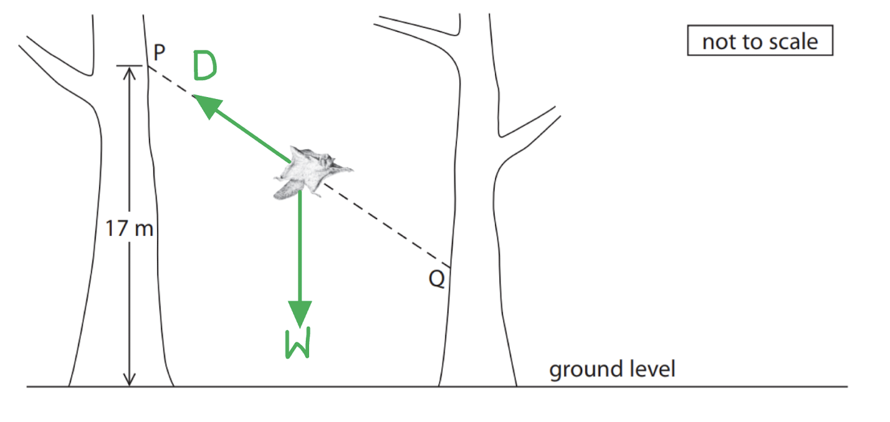
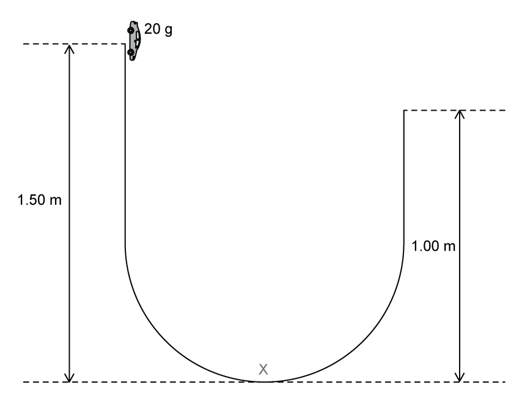

# Mark Schemes — Work, Power & Energy Resources
**4. Energy Resources & Energy Transfers** · Edexcel IGCSE Physics (4PH1)

## Q1 — easy — 1 marks · exam-questions

### 2((a)) — 1 marks
**Correct answer: B** — 960 joules per second

**Final answer:** **The correct answer is ****B**** because:**

- Power is the energy transferred per unit time, $P=\frac{E}{t}$
- Therefore, the one watt is equal to one joule per second

  - This means that 960 W is 960 joules per second (J/s)
- This is answer **B**

## Q2 — easy — 1 marks · exam-questions

### 6((a)) — 1 marks
**Correct answer: B** — turbine

**Final answer:** **The correct answer is ****B**** because:**

- The steam from the boiler is what rotates the turbine
- Therefore, energy from the thermal store of the boiler is transferred **mechanically** to the kinetic store of the turbine as the steam turns the turbine

## Q3 — easy — 1 marks · exam-questions

### 1((c)) — 1 marks
**Correct answer: A** — gravitational potential energy

**Final answer:** **The correct answer is ****A**** because:**

- Gravitational potential energy is energy stored in an object due to its position in a gravitational field
- Since the book is further above the surface of the Earth, it has a higher gravitational potential energy (converted from kinetic energy from moving) on the higher shelf

  - Therefore, the book gains gravitational potential energy

**B **is incorrect as the mass of the book does not change when it is moved.

**C **is incorrect as weight is the mass × gravitational field strength. Since neither the mass of *g* varies as the book is moved to a higher shelf, therefore the weight of the book also remains constant

**D **is incorrect as although work is done on the book to move it with a force* *over a certain distance, the question asks what the book **gains**. Work is only **done**, not **gained**. Once the book is on the higher shelf, there is no work on the book.

## Q4 — easy — 2 marks · exam-questions

### 2((a)) — 2 marks
Explain what 30 W tells you about the energy transfer in the soldering iron:

- 30 W is the <u>power rating</u>; **[1 mark]**
- It tells you the rate of energy transfer / 30 joules of energy are transferred per second; **[1 mark]**

**[Total: 2 marks]**

> *Remember that 'power' is the same as 'joules per seconds'. This is because it is defined as the 'energy transferred per unit time'.*

## Q5 — easy — 2 marks · exam-questions

### 5((a)) — 1 marks
State the type of renewable resource that this power station uses:

- Geothermal; **[1 mark]**

**[Total: 1 mark]**

### 5((a)) — 1 marks
Name another renewable resource:

Any **one** from:

- Wind (turbine); **[1 mark]**
- Hydro-electric; **[1 mark]**
- Waves; **[1 mark]**
- Tidal; **[1 mark]**
- Solar (panels / cells / photovoltaic cells); **[1 mark]**
- Biofuels / biomass / wood; **[1 mark]**

**[Total: 1 mark]**

## Q6 — medium — 1 marks · exam-questions

### 1() — 1 marks
**Correct answer: B** — 1 joule per second (1 J/s)

**Final answer:** **The correct answer is ****B**** because:**

- Power is defined as energy transferred per second
- This can be written as the equation $power=\frac{energy}{time}$

  - Energy has units of joules, J
  - Time has units of seconds, s
- From this equation, power has the units of joules per second

  - This is option **B**

## Q7 — medium — 6 marks · exam-questions

### 6((a)) — 4 marks
(i) The equation linking work done, force and distance moved is:

- Work done = force × distance moved **OR**** ***W *= *F *× *d ***[1 mark]**

(ii) To calculate the work done on the suitcase by the person:

List the known quantities:

- Horizontal force, *F *= 13 N
- Distance moved, *d *= 110 m

Recall the equation for work done from part (i):

- Work done = force × distance moved

Substitute the known quantities into the equation for work done:

- *W *= 13 × 110 **[1 mark]**
- *W *= 1430 N **[1 mark]**

(iii) To find the amount of energy transferred to the suitcase:

- Energy transferred to the suitcase = Work done on the suitcase = 1430 J **[1 mark]**

**[Total: 4 marks]**

> *You will be awarded the marks for part (i) if you provide a rearrangement of the work done equation. It is, however, much easier to remember the equation in its normal form: **work done = force × distance. *

> *In part (ii) you will be awarded full marks for your correct answer without showing the workings. It is, however, important to show your workings then if your final calculation is wrong you can still receive one mark if your method was correct. *

> *If your calculation for part (ii) is incorrect, don't worry you won't automatically get part (iii) wrong. In part (iii) if you demonstrate that you understand the energy transfer taking place, as long as your answer is the same in parts (ii) and (iii) then you will score the mark in part (iii).*

### 6((b)) — 2 marks
Any **two** from:

- Gravitational potential energy is proportional to the height (of the centre of gravity) of an object; **[1 mark]**

**   OR**

- Gravitational potential energy = mass × gravity × height / GPE = *mgh* **[1 mark]**

- When the suitcase falls the height is reduced;** [1 mark]**
- This means the height of the centre of gravity is also reduced; ** [1 mark]**

**[Total: 2 marks]**

## Q8 — medium — 4 marks · exam-questions

### 4((b)) — 4 marks
(i) The equation linking power, energy transferred and time is:

- $\mathrm{Power}=\frac{\mathrm{Energy} \mathrm{transferred}}{\mathrm{time} \mathrm{taken}}$

**OR**

- $P=\frac{E}{t}$ **[1 mark]**

(ii) Calculate the amount of energy the turbine transfers in 10 s:

List the known quantities:

- Power, *P* = 78 W
- Time taken, *t* = 10 s

Rearrange the equation from part (i) to make energy the subject:

- $E=Pt$** [1 mark]**

Substitute the known values into the equation to calculate the energy transferred:

- *E* = 78 × 10 **[1 mark]**
- E = 780 J **[1 mark]**

**[Total: 4 marks]**

## Q9 — medium — 4 marks · exam-questions

### 5((a)) — 1 marks
State the relationship between work done, force and distance moved:

- Work done = force × distance

**OR**

- $W=F\timesd$ **[1 mark]**

**[Total: 1 mark]**

### 5((b)) — 3 marks
(i) Calculate the work done moving the wheelbarrow:

List the known quantities:

- Force, *F* = 140 N
- Distance, *d* = 39 m

Substitute the known values into the equation from part (i) to calculate the work done:

- *W* = 140 × 39 **[1 mark]**
- *W* = 5460 J = 5500 J **[1 mark]**

(ii) State how much energy is transferred to the wheelbarrow:

- All of the energy is transferred to the wheelbarrow
- Therefore, energy transferred = 5500 (J) **[1 mark]**

**[Total: 3 marks]**

> *Remember that when stating an equation you will still get the marks if you provide it in its rearranged form, as long as the rearrangement is correct!*

> *For part (iii), you will still get the mark if you provide the same answer that you gave for part (ii) even if your answer for part (ii) was incorrect. Part (iii) is assessing your understanding of energy transfer, not the calculation you performed in the previous part. *

## Q10 — medium — 4 marks · exam-questions

### 7((a)) — 1 marks
The equation linking work done, force and distance is:

- Work done = force × distance

**OR**

- *W* = *Fd* **[1 mark]**

**[Total: 1 mark]**

> *Part (iii) is testing your understanding that **work done is equal to energy transferred**. Therefore, as long your answer is the same as the answer you provided in part (ii), then you get the mark even if your answer to part (ii) was incorrect!*

### 2() — 3 marks
(i) Calculate the work done moving the carton

List the known quantities:

- Force, *F* = 1.7 N
- Distance, *d* = 0.46 m

Substitute the known values into the equation from part (i):

- *W* = 1.7 × 0.46 **[1 mark]**
- *W* =  0.78 (J) **[1 mark]**

(ii) State how much energy is transferred to the carton:

- 0.78 (J) **[1 mark]**

**[Total: 3 marks]**

## Q11 — medium — 7 marks · exam-questions

### 9((c)) — 3 marks
(i) State the relationship between work done, force and distance moved:

- Work done = force × distance **[1 mark]**

**OR**

- *W *=*Fd*** [1 mark]**

(ii) Calculate the work done on the load:

List the known quantities:

- Force, *F* = 400 000 N
- Distance, *d *= 190 m

Substitute the known values into the equation from part (i):

- *W *= 400 000 × 190 **[1 mark]**
- *W* = 76 000 000 (J) / 76 MJ **[1 mark]**

**[Total: 3 marks]**

### 9((d)) — 4 marks
(i) Calculate the time needed to do this work:

List the known quantities:

- Power, *P* = 1.9 MW
- Work done, *W *= 67 MJ

From the equation sheet:

- $\mathrm{Power}=\frac{\mathrm{work} \mathrm{done}}{\mathrm{time} \mathrm{taken}}$ / $P=\frac{W}{t}$

Rearrange the equation to make t the subject:

- $t=\frac{W}{P}$ **[1 mark]**

Substitute the known values into the equation:

- $t=\frac{67}{1.9}$ **[1 mark]**
- *t* = 35 s **[1 mark]**

(ii) State the effect of using a lower average power to do this work:

Any **one** from:

- Using a lower <u>average</u> power will take longer; **[1 mark]**
- More time will be needed to raise the coal; **[1 mark]**
- The load moves more slowly; **[1 mark]**

**[Total: 4 marks]**

## Q12 — medium — 9 marks · exam-questions

### 7((a)) — 4 marks
(i) The equation linking gravitational potential energy (GPE), mass, *g* and height is:

- Gravitational potential energy = mass × *g* × height

**OR**

- GPE = *mgh ***[1 mark]**

(ii) Calculate the GPE gained by the squirrel during this climb:

List the known quantities:

- Mass, *m* = 0.19 kg
- Height, *h* = 17 m

From the equation sheet:

- Acceleration of free fall, *g* = 10 m/s2

Substitute the known values into the equation from part (i):

- GPE = 0.19 × 10 × 17 **[1 mark]**
- GPE = 32.3 J = 32 J **[1 mark]**

(iii) State the amount of work done against the force of gravity by the squirrel during this climb:

- Work done = 32 J **[1 mark]**

**[Total: 4 marks]**

> *Remember that when stating an equation, you will still get the mark if you provide the equation in its rearranged form, as long as the rearrangement is correct. *

> *Part (iii) is assessing your understanding that the energy transferred is equal to the work done. Therefore, you will get the mark if your answer is the same as the answer you provided for part (ii), even if the your answer to part (ii) was incorrect!*

### 7((b)) — 5 marks
(i) Add labelled arrows to the diagram to show the directions of the forces of weight and drag acting on the squirrel:

A diagram that would score 2 marks should look like:

- Weight / *W* / *mg* shown acting downwards; **[1 mark]**
- Drag / *D* shown acting against motion; **[1 mark]**

(ii) State the equation linking kinetic energy (KE), mass and velocity:

- $\mathrm{KE}=\frac{1}{2}\times\mathrm{mass}\times\mathrm{velocity}^{2}$

**OR**

- $\mathrm{KE}=\frac{1}{2}mv^{2}$ **[1 mark]**

(iii) Calculate the KE of the squirrel as it glides:

List the known quantities:

- Mass, *m* = 0.19 kg
- Velocity, *v* = 13 m/s

Substitute the known values into the equation from part (i) to calculate:

- $\mathrm{KE}=0.5\times0.19\times13^{2}$ **[1 mark]**
- KE = 16 (J) **[1 mark]**

**[Total: 5 marks]**

> *Remember that when stating an equation, you will still get the mark if you provide the equation in its rearranged form, as long as the rearrangement is correct. *

## Q13 — medium — 6 marks · exam-questions

### 9((a)) — 3 marks
(i) State the relationship between work done, force and distance moved:

- Work done = force × distance

**OR**

- *W* = *Fd* **[1 mark]**

(ii) Calculate the work done when the student moves his leg sideways once:

List the known quantities:

- Force, *F* = 23 N
- Distance, *d *= 34 cm

Convert distance into SI units:

- $d=\frac{34}{100}=0.34$ m

Substitute the known values into the equation from part (i):

- *W* = 23 × 0.34 **[1 mark]**
- *W* = 7.82 J =  7.8 J (2 s.f) **[1 mark]**

**[Total: 3 marks]**

> *Remember that when stating an equation, you will still get the mark if you provide the equation in its rearranged form, as long as the rearrangement is correct. It is best to write it out in words to be on the safe side though!*

### 9((b)) — 3 marks
Calculate the average power of the student during this exercise:

List the known quantities:

- Rate = 15 movements per minute
- Work done = 7.8 J (from part (a))

From the equation sheet:

- $\mathrm{Power}=\frac{\mathrm{work} \mathrm{done}}{\mathrm{time} \mathrm{taken}}$ / $P=\frac{W}{t}$

Calculate the time taken per rep:

- 15 movements in 1 minute = 15 reps in 60 s
- Time taken per movement = $\frac{60}{15}\,$= 4 s **[1 mark]**

Substitute the known values into the power equation:

- $P=\frac{7.8}{4}$ **[1 mark]**
- P = 1.955 W = 2.0 W **[1 mark]**

**[Total: 3 marks]**

> *The conversion of the time is the most confusing in this question! The 'time taken' in the power equation must be in **seconds** to get the power in joules per second (in other words, Watts). Therefore, we must convert the time taken for 1 movement from minutes **and then into seconds**.*

## Q14 — medium — 5 marks · exam-questions

### 10((a)) — 1 marks
State the equation linking gravitational potential energy, mass, g and height:

- Gravitational potential energy = mass × g × height

**OR**

- $\mathrm{GPE}=mgh$** [1 mark]**

**[Total: 1 mark]**

### 10((a)) — 4 marks
(i) Show that the gravitational potential energy gained by the man is about 4000 J:

List the known quantities:

- Mass, *m* = 78 kg
- Height, *h* = 5.0 m

From the equation sheet:

- Acceleration of freefall, g = 10 m/s2

Substitute the known values into the equation from part (i):

- GPE = 78 × 5.0 × 10 **[1 mark]**
- GPE = 3900 (J) **[1 mark]**

(ii) State the work done on the man and give the unit:

- Work done is equal to the energy transferred
- Therefore, *W* = 3900 **[1 mark] **J / joules **[1 mark]**

**[Total: 4 marks]**

> *Remember that when stating an equation, you will still get the marks if the equation is given in its rearranged form as long as the rearrangement is correct. *

## Q15 — medium — 7 marks · exam-questions

### 8((a)) — 3 marks
(i) State the equation linking gravitational potential energy, mass, g and height:

- GPE = mass × *g* × height

**OR**

- *GPE = mgh*** ****[1 mark]**

(ii) Calculate the gravitational potential energy, GPE, lost by the mass:

List the known quantities:

- Mass, *m* = 2.75 kg
- Height, *h* = 0.61 m

From the equation sheet:

- Acceleration of free fall, *g* = 10 m/s2

Substitute the known values into the equation from part (i) to calculate GPE:

- $GPE=2.75\times10\times0.61$ **[1 mark]**
- GPE = 17 (J) / 16.8 (J) / 16.775 (J) / 16. 78 (J) **[1 mark]**

**[Total: 3 marks]**

### 2() — 4 marks
(i) Explain why only some of the gravitational potential energy of the mass is transferred to the lamp:

Any **two** from:

- The system is not 100% efficient / inefficient; **[1 mark]**
- Energy is lost / wasted / dissipated to the surroundings; **[1 mark]**
- As thermal energy / heat / sound / air resistance / friction / drag; **[1 mark]**

(ii) Calculate the energy transferred to the lamp:

List the known quantities:

- Current,* I* = 0.46 A
- Voltage, *V *= 12.7 V
- Time, *t* = 1.3 s

From the equation sheet:

- $E=IVt$

Substitute the known values into the equation to calculate the energy transferred:

- $E=0.46\times12.7\times1.3$ **[1 mark]**
- E = 7.6 J **[1 mark]**

**[Total: 4 marks]**

## Q16 — medium — 8 marks · exam-questions

### 8((a)) — 4 marks
(i)   The equation linking work done, force and distance is:

- Work done = Force × Distance **OR ***W* = *F *×* d*; **[1 mark]**

(ii)   Calculate the work done by the car on the caravan:

List the known quantities:

- Resultant force, *F* = 170 N
- Distance, *d* = 110 m

Substitute values into work done equation:

- Work done = 170 × 110; **[1 mark]**
- Work done = 18 700 = 19 000 J (2 s.f.); **[1 mark]**

(iii)   The energy transferred to the caravan is:

- 18 700 **OR** 19 000 J; **[1 mark]**

**[Total: 4 marks]**

> *The definition of work done is the amount of **energy transferred**. Therefore, part (iii) is not a trick question, this answer is the same as what you got for part (ii). There will normally be an error carried forward here, so you can still get the mark for (iii) as long as its the same as (ii), even if your answer for (ii) is incorrect.*

### 8((b)) — 4 marks
(i) The equation linking kinetic energy, mass and velocity is:

- Kinetic energy = $\frac{1}{2}$ × mass × velocity **OR**** ***KE*** **=  $\frac{1}{2}mv^{2}$; **[1 mark]**

(ii) Calculate the total kinetic energy when the car and caravan travel together

List the known quantities:

- Speed, *v*  = 23 m/s
- Mass of car, *m*car = 1650 kg
- Mass of caravan, *m*caravan = 950 kg

Calculate total mass, *m*:

- *m* = *m*car + *m*caravan = 950 + 1650 = 2600 kg **[1 mark]**

Substitute values into kinetic energy equation:

- Kinetic energy = $\frac{1}{2}$ × 2600 × 232 **[1 mark]**
- Kinetic energy = 687 700 = 688 000 (2 s.f) **[1 mark]**

**[Total: 4 marks]**

## Q17 — medium — 9 marks · exam-questions

### 1((a)) — 2 marks
**One** mark for each correct letter:

- The car has the most gravitational potential energy at point **B**; **[1 mark]**
- And it goes fastest at point **E**; **[1 mark]**

**[Total: 2 marks]**

> *The car has the most GPE when it is raised furthest from the ground level. This will be at the highest peak, point B. *

> *The car has the fastest speed at point E, because energy from the gravitational potential store of the car has been transferred to the kinetic store of the car. *

### 1((b)) — 7 marks
(i) State the relationship between momentum, mass and velocity:

- Momentum = mass × velocity **OR**** ***p* =* mv*** ****[1 mark]**

(ii) Calculate the maximum momentum of the car, giving the unit:

List the known quantities:

- Mass, *m* = 900 kg
- Velocity, *v* = 15 m/s

Substitute the known values into the equation from part (i):

- *p* = 900 × 15 **[1 mark]**
- p = 13 500 = 14 000 **[1 mark] **kg m/s / N s **[1 mark]**

(iii) State the equation linking kinetic energy (KE), mass and speed:

- $\mathrm{KE}=\frac{1}{2}\timesmass\timesvelocity^{2}$

**OR**

- $\mathrm{KE}=\frac{1}{2}mv^{2}$ **[1 mark]**

(iv) Calculate the maximum KE of the car:

Substitute the known values into the equation from part (iii)

- $\mathrm{KE}=0.5\times900\times15^{2}$ **[1 mark]**
- KE = 101 250 J = 100 000 J (1 × 105 J) **[1 mark]**

**[Total: 7 marks]**

## Q18 — medium — 5 marks · exam-questions

### 2((a)) — 1 marks
One advantage of using wind turbines instead of a coal-fired power station to produce electricity is:

Any **one** from:

- Reduced running costs; **[1 mark]**
- No atmospheric pollution / carbon dioxide; **[1 mark]**
- Renewable;** [1 mark]**

**[Total: 1 mark]**

### 2((b)) — 4 marks
Coal-fired power stations are still in general use. Explain why wind turbines have not replaced them:

Any **four** from:

- The wind does not always blow;** [1 mark]**
- The turbine does not always provide output;** [1 mark]**
- Visual pollution;** [1 mark]**
- Construction of wind farms destroy habitats **OR **turbines are hazards to flying birds;** [1 mark]**
- Large sites are needed for wind farms;** [1 mark]**
- Windy locations are required for wind farms; **[1 mark]**
- Turbines are difficult to maintain in remote locations (such as off shore);** [1 mark]**
- Maintenance needs to be carried out in hazardous locations (high up / off shore); **[1 mark]**
- Single turbines produce less power than power stations;** [1 mark]**
- Many turbines needed to produce same power output as a power station;** [1 mark]**
- Building wind farms is expensive / takes a lot of time;** [1 mark]**
- Research, land acquisition and maintenance are additional costs;** [1 mark]**

**[Total: 4 marks]**

> *Marks should also be awarded for refering to the "output" as electricity production or generation. For example saying that the turbine does not always produce electricity or generate electricity would also score this mark.*

## Q19 — medium — 11 marks · exam-questions

### 5((a)) — 2 marks
(i) Explain what is meant by the term non-renewable:

- An energy source which cannot be <u>replaced</u>; **[1 mark]**

(ii) Give an example of a non-renewable energy source:

Any **one** from:

- Coal; **[1 mark]**
- Oil; **[1 mark]**
- Gas; **[1 mark]**
- Crude oil; **[1 mark]**
- Fossil fuels; **[1 mark]**
- Petrol; **[1 mark]**
- Diesel; **[1 mark]**
- Gasoline; **[1 mark]**
- Kerosene; **[1 mark]**
- Paraffin; **[1 mark]**
- Methane; **[1 mark]**
- Butane; **[1 mark]**
- Propane; **[1 mark]**
- Uranium**; [1 mark]**
- Plutonium;** [1 mark]**

**[Total: 2 marks]**

> *You will not be expected to know that plutonium is a fuel for nuclear energy but it is listed here as an acceptable answer. *

### 5((b)) — 9 marks
(i) Explain how the power is transmitted to large cities:

**At the wind farm:**

- A step-up transformer is used at the wind farm

**OR**

- The voltage is increased (for transmission); **[1 mark]**

**During transmission:**

- Power is transmitted at a low current

**OR**

- Little / no energy is wasted during transmission; **[1 mark]**

At the city:

- A step down transformer is used at the city end

**OR**

- The voltage is reduced to 230 V / for safety / for homes; **[1 mark]**

(ii) Discuss the advantages and disadvantages of building more wind farms:

**Advantages**

Any **three** from:

- Wind is a renewable resource; **[1 mark]**
- No carbon emission / air pollution / does not contribute to global warming; **[1 mark]**
- Wind is free / low running costs; **[1 mark]**
- Brings employment to local areas / good for local economy; **[1 mark]**
- Wind farms can generate large amounts of electricity; **[1 mark]**
- Wind turbines can be more <u>efficient</u> than conventional power stations; **[1 mark]**

**Disadvantages:**

Any **three** from:

- Visual pollution / some people think they blight landscapes; **[1 mark]**
- Noise pollution / can be noisy; **[1 mark]**
- Not reliable / only work when the wind blows; **[1 mark]**
- Each generator only generates a small amount of electricity / many are needed to meet the energy demands of a city; **[1 mark]**
- Costly to construct / maintain; **[1 mark]**
- Require large areas for a wind farm / can only be places in certain areas; **[1 mark]**

**[Total: 9 marks]**

## Q20 — medium — 8 marks · exam-questions

### 11((a)) — 3 marks
(i) State the equation linking gravitational potential energy (GPE), mass, *g* and height:

- GPE = mass × *g* × height

**OR**

- $\mathrm{GPE}=mgh$ **[1 mark]**

(ii) Calculate the gravitational potential energy of the ball:

List the known values:

- Mass, m = 0.25 kg
- Height, h = 1.75 m

From the equation sheet:

- Acceleration of free fall, *g* = 10 m/s2

Substitute the known values into the equation to calculate GPE:

- $\mathrm{GPE}=0.25\times10\times1.75$ **[1 mark]**
- GPE = 4.375 J = 4.4 J **[1 mark]**

**[Total: 3 marks]**

### 11((b)) — 1 marks
The kinetic energy (KE) of the ball just before it hits the ground is:

- 4.4 J (4.375 J) **[1 mark]**

**[Total: 1 mark]**

> *In this question, you can get a mark for stating whatever answer you got in part (a). The examiner is just looking for your understanding that gravitational potential energy is converted into kinetic energy as the ball falls to the ground.*

### 11((c)) — 4 marks
(i) State the equation linking kinetic energy, mass and speed:

- KE = $\frac{1}{2}$ × mass × velocity2 **OR**** **$\mathrm{KE}=\frac{1}{2}mv^{2}$ **[1 mark]**

(ii) Calculate the speed of the ball:

List the known quantities:

- Kinetic energy, KE = 3.1 J
- Mass, *m* = 0.25 kg

Rearrange the equation to make *v *the subject:

- $v=\sqrt{\frac{2\mathrm{KE}}{m}}$ **[1 mark]**

Substitute the known values to calculate speed:

- $v=\sqrt{\frac{2\times3.1}{0.25}}$ **[1 mark]**
- v = 4.98 m/s / 5 m/s **[1 mark]**

**[Total: 4 marks]**

> *If you have trouble rearranging the kinetic energy equation for the velocity, **v**, try it in steps:*

- $KE=\frac{1}{2}mv^{2}$
- *Multiplying both sides by 2 to cancel out the half:*

  - $2KE=mv^{2}$
- *Divide by **m:*

  - * *$\frac{2KE}{m}=v^{2}$
- *Square root both sides:*

  - $v=\sqrt{\frac{2KE}{m}}$* *

## Q21 — medium — 9 marks · exam-questions

### 1() — 3 marks
> **[mark-scheme]**
> Any **three **from (one mark for each point):
> 
> - Water in the reservoir has energy in its gravitational potential store
> - Energy is transferred to the kinetic store of the water (as it flows)
> - Energy is transferred to the kinetic store of the turbine (as the water causes it to turn)
> - Energy is transferred to the kinetic store of the generator (as the turbine turns the generator)
> - Energy is transferred electrically to the National Grid
> 
> **[3 marks]**

### 2() — 6 marks
> **[mark-scheme]**
> Advantages of nuclear over wind:
> 
> Any **three **from (1 mark for each point):
> 
> - Nuclear power is reliable, whereas wind is weather dependent / intermittent
> - A single nuclear power plant has a much greater power output than a large wind farm
> - Nuclear power plants require less land than wind farms (for the same power output)
> - Nuclear power plants are often considered less visually polluting than wind farms
> - Nuclear power plants do not cause harm to migrating flocks of birds, whereas wind farms can
> 
> **[3 marks]**
> 
> Disadvantages of nuclear over wind:
> 
> Any **three **from (1 mark for each point):
> 
> - Nuclear power produces radioactive waste
> - Nuclear power carries the risk of nuclear accidents / meltdown
> - Nuclear power plants have high decommissioning / set-up costs compared to wind farms
> - Nuclear fuel is non-renewable, whereas wind is renewable
> - Nuclear power requires fuel which is expensive / difficult to obtain, whereas wind is freely available
> 
> **[3 marks]**
> 
> Comparative language must be used to gain full marks.

## Q22 — hard — 10 marks · exam-questions

### 13((b)) — 3 marks
(i) State the equation linking kinetic energy, mass and velocity:

- $\mathrm{kinetic} \mathrm{energy}=\frac{1}{2}\times\mathrm{mass}\times\mathrm{velocity}^{2}$

**OR**

- $\mathrm{KE}=\frac{1}{2}mv^{2}$ **[1 mark]**

(ii) Calculate the kinetic energy of the aeroplane:

List the known quantities:

- Mass, *m* = 600 kg
- Velocity, *v* = 28 m/s

Substitute the known values into the equation from part (i):

- $\mathrm{KE}=0.5\times600\times28^{2}$ **[1 mark]**
- KE = 240 000 (J) **[1 mark]**

**[Total: 3 marks]**

### 13((c)) — 7 marks
(i) State the equation linking gravitational potential energy (GPE), mass, g and height:

- GPE = mass × *g *× height

**OR**

- GPE = *mgh ***[1 mark]**

(ii) Calculate the gravitational potential energy gained by the aeroplane:

List the known quantities:

- Mass, *m* = 600 kg (from part (a))
- Height, *h* = 1000 m

From the equation sheet:

- Acceleration of freefall, g = 10 m/s2

Substitute the known values into the equation from part (i):

- $\mathrm{GPE}=600\times10\times1000$ **[1 mark]**
- GPE = 6 000 000 (J) / 6000 kJ / 6 MJ **[1 mark]**

(iii) Show, by calculation, that the aeroplane needs this extra source of power to climb to 1000 m in 3 minutes:

Determine the power required to climb to 1000 m in 3 minutes:

- $P=\frac{E}{t}$
- $P=\frac{6000000}{3\times60}$
- *P* = 33300 W / 33.3 kW **[1 mark]**

Compare the power required with the power provided from the fuel cells:

- The fuel cells provide 24 kW
- 24 kW is less than the 33.3 kW required; **[1 mark]**
- Therefore, the rechargeable battery is required

(iv) Show that there must be more than 1300 fuel cells in the stack:

List the known quantities:

- Voltage per cell, V = 0.6 V
- Current per cell, I = 30 A

Recall the equation relating power, current and voltage to calculate the power per cell:

- Power = current × voltage
- $P=IV$
- $P=30\times0.6$
- *P* = 18 (W) (per cell) **[1 mark]**

Determine the number of cells in the stack:

- $\mathrm{Number} \mathrm{of} \mathrm{cells} \mathrm{in} \mathrm{stack}=\frac{\mathrm{Total} \mathrm{power} \mathrm{provided} \mathrm{by} \mathrm{cells} \mathrm{in} \mathrm{stack}}{\mathrm{Power} \mathrm{per} \mathrm{cell}}$
- $\frac{24000}{18}=1333$ cells **[1 mark]**
- Since 1333 cells is more than 1300, there are more than 1300 in the stack

**[Total: 7 marks]**

> *For part (iv) you may have approached the calculation differently.*

> *An alternative method would be:*

> *Calculate the energy supplied by one fuel cell:*

- *E = IVt*
- *E** = 30 × 0.6 × 180 = 3240 J *

> *Determine the number of cells in the stack:*

- $\frac{4320000}{3240}=1333$* cells*

> *If you used this method, you would also gain the full two marks.*

> *Remember to always convert your time taken into **seconds**!*

## Q23 — hard — 7 marks · exam-questions

### 8((c)) — 3 marks
List the known quantities:

- Useful power output, P = 3.1 W
- Time, t = 290 s

From the equation sheet:

- $\mathrm{Power}=\frac{\mathrm{energy} \mathrm{transferred}}{\mathrm{time}}$ / $P=\frac{W}{t}$

Rearrange the equation to make energy the subject:

- Work done, W, is equal to energy transferred, E
- Therefore, $P=\frac{E}{t}$
- Rearranging gives $E=Pt$ **[1 mark]**

Substitute in the known values to calculate energy transferred:

- $E=3.1\times290$** [1 mark]**
- *E* =  899 J = 900 J (2 s.f.) **[1 mark]**

**[Total: 3 marks]**

### 8((c)) — 4 marks
(i) State the relationship between efficiency, useful energy output and total energy input:

- $\mathrm{Efficiency}=\frac{\mathrm{useful} \mathrm{energy} \mathrm{output}}{\mathrm{total} \mathrm{energy} \mathrm{input}}\times100$ ** [1 mark]**

(ii) Calculate the total energy input:

List the known quantities:

- Useful energy output = 900 J
- Efficiency = 72%

Rearrange the efficiency equation to make total energy input the subject:

- $\mathrm{Total} \mathrm{energy} \mathrm{input}=\frac{\mathrm{Useful} \mathrm{energy} \mathrm{output}}{\mathrm{Efficiency}}$ **[1 mark]**
- Where the efficiency is $\frac{72}{100}=0.72$

Substitute in the known values to calculate the total energy input:

- $\mathrm{Total} \mathrm{energy} \mathrm{input}=\frac{900}{0.72}$ **[1 mark]**
- Total energy input = 1250 (J) **[1 mark]**

**[Total: 4 marks]**

> *If 899 W was used for the useful energy output value, then the answer to part (iii) would be  1249 (J). This would also gain full marks.*

## Q24 — hard — 6 marks · exam-questions

### 7() — 6 marks
A discussion of the advantages and disadvantages of nuclear power stations could include:

Discuss the benefits of nuclear fuel (maximum 3):

- No CO2 is emitted; **[1 mark]**
- Nuclear fuel does not contribute to global warming; **[1 mark]**
- Nuclear fuel is reliable / not weather dependant; **[1 mark]**
- There is only a small volume of waste; **[1 mark]**
- Nuclear fuel is a concentrated energy source OR there are low transport costs to bring fuel; **[1 mark]**
- Nuclear power stations are relatively small; **[1 mark]**

Discuss the disadvantages of nuclear fuel (maximum 3):

- It is difficult to dispose of the waste; **[1 mark]**
- Both the fuel and waste products can be dangerous; **[1 mark]**
- Accidents or leaks can cause radiation to spread to the surroundings; **[1 mark]**
- Decommissioning costs are very high; **[1 mark]**
- There is security risk linked to the use of radioactive products to deliberately cause harm; **[1 mark]**

**An example of an answer that would gain six marks is:**

- Nuclear fuel is reliable **[1 mark]**, but the fuel used, and the waste products are dangerous **[1 mark]**. Nuclear power stations are relatively small **[1 mark]**, however nuclear accidents or leaks can be catastrophic to the surrounding areas **[1 mark]**. In nuclear power stations, no CO2 is emitted **[1 mark]**, but it is difficult to dispose of the nuclear waste safely **[1 mark]**.

**[Total: 6 marks]**

## Q25 — hard — 5 marks · exam-questions

### 6() — 5 marks
Evaluate which types of power station would be the most suitable to meet this increased demand:

Any **five **from:

**Wind**

- Wind output power is too low to meet the demand; **[1 mark]**
- Wind output power is weather dependent / wind is unreliable; **[1 mark]**

**Gas**

- Gas output power is too low to meet demand

**OR**

- Many gas power stations would be needed to meet demand; **[1 mark]**
- Gas power stations have the fastest start up; **[1 mark]**

**Tidal**

- Tidal schemes give the highest output power; **[1 mark]**
- Tidal can only be used at fixed times; **[1 mark]**

**Nuclear**

- Nuclear output power is high; **[1 mark]**
- Nuclear takes too long to start up; **[1 mark]**

**Coal**

- Coal has the second highest output power; **[1 mark]**
- Coal is the second fastest to start up; **[1 mark]**

**Evaluation statements**

- No single option is enough to meet demand;**[1 mark]**

- Nuclear / wind / tidal would be unsuitable; **[1 mark]**

**OR**

- Coal and gas could be suitable; **[1 mark]**

**OR**

- A mixture of stations would be suitable; **[1 mark]**

**[Total: 5 marks]**

## Q26 — hard — 4 marks · exam-questions

### 8() — 4 marks
Explain how the location and the climate might affect the type of power station that the company chooses:

Any **four** from:

**Location**

- Latitude / angle of the sun; **[1 mark]**

  - Example: solar would be best for places on the equator due to a consistent amount of sunlight
  - Example: The angle of the sun would affect the efficiency of the solar array
- Suitability of the site; **[1 mark]**

  - Example: Large area required for a solar array
  - Example: No shadow from trees / hills for solar array
- Geological factors; **[1 mark]**

  - Example: Accessible source of heat / hot water from volcanic regions for geothermal
- Proximity to cities; **[1 mark]**

  - Example: More efficient transmission to closer areas / less power loss

**Climate:**

- Effects of seasons; **[1 mark]**

  - Example: Rainy seasons would increase cloud cover reducing efficiency of a solar array
- Hours of sunlight; **[1 mark]**

  - Example: Year round sunlight better for solar array
- Intensity of sunlight; **[1 mark]**

  - Example: Strong sunlight better for solar array
- Geothermal power station would be unaffected by climate; **[1 mark]**

**[Total: 4 marks]**

> *Look at the number of marks to determine how you should structure your answer for extended responses such as this. Since it is 4 marks, and you you been asked to explain how the **location** and **climate** might affect the power station, choose roughly two points for each to obtain full marks in the question. All four marks just speaking about location or just about climate will not achieve this.*

## Q27 — hard — 10 marks · exam-questions

### 11((a)) — 3 marks
(i) The equation linking gravitational potential energy, mass, height and gravitational field strength is:

- gravitational potential energy = mass × gravitational field strength × height **OR ***mgh*; **[1 mark]**

(ii) Show that the gravitational potential energy gained by the car is 2.6 MJ:

List the known quantities:

- Mass of car, *m* = 2000 kg
- Height of **C **above **B**, *h* = 128 m

From the equation sheet:

- Acceleration due to freefall, *g = *10 m/s2

Substitute values into gravitational potential energy equation:

- Gravitational potential energy gained = 2000 × 10 × 128 **[1 mark]**
- Gravitational potential energy gained = 2 560 000 = 2.56 × 106 = 2.56 MJ **[1 mark]**

**[Total: 3 marks]**

> *For part (ii), remember not to just leave your final answer in J just like it's written on your calculator, since it's asked for MJ. Therefore, make sure you're comfortable with unit prefixes and converting to standard form especially:*

- *centi (c) = × 10**–2** (e.g. 1 cm = 1 × 10**–2** m)*
- *milli (m) = × 10**–3*
- *kilo (k) = × 10**3*
- *mega (M) = × 10**6*

> *Although it is best to remember, the acceleration due to the gravity value is given on your equation sheet that you will have with you in your exam. Remember not to write 'gravity' instead of 'gravitational field strength', the examiner will not allow this.*

### 11((b)) — 5 marks
(i) The minimum kinetic energy that the car must have at **B** for it to reach **C** is:

- 2.56 MJ **[1 mark]**

(ii) The kinetic energy is related to the work done by:

- They are <u>equal</u> **OR **kinetic energy = work done; **[1 mark]**

(iii) The equation linking work done, force and distance is:

- Work done = force × distance **OR**** ****W = Fd; ****[1 mark]**

(iv) Calculate the minimum length of track needed between **A** and **B** for the car to reach **C**:

List the known quantities:

- Force, *F *= 32 kN
- Work done, *W* = 2.56 MJ

Convert 32 kN into N and 2.56 MJ to J:

- 1 kN = 1000 N therefore 32 kN = 32 000 N
- 1 MJ = 1 × 106 J therefore 2.56 MJ = 2.56 × 106 J

Rearrange work done equation for distance travelled:

- $Distance=\frac{Workdone}{Force}$

Substitute values into distance equation:

- Distance (length of track) = $\frac{2.56\times10^{6}}{32000}$**[1 mark]**
- Distance (length of track) = 80 m **[1 mark]**

**[Total: 5 marks]**

> *The minimum length of the track is the same as the distance travelled for a certain work to be done from a certain force. Remember to convert to N (for the force) and J (for the work done) since the length of track is required in **metres** (m).*

### 11((c)) — 2 marks
These conditions could cause the car to stop before it reaches **C** because:

**EITHER:**

When it is windy:

- There is extra drag / air resistance / friction on the car
- Therefore, more energy is wasted (to overcome the friction)

**OR**

When it is wet:

- There is less/no friction / it is slippier / there is less traction
- Therefore there is less grip and less energy is transferred to the car (at launch)

**[Total: 2 marks]**

> *For these kind of explanation questions, make sure to always refer back to the situation given! It is not enough just to say 'there is drag so energy is wasted'. It is better to be detailed - what is the drag force acting on? How does this affect the scenario at hand?*

## Q28 — hard — 10 marks · exam-questions

### 10((c)) — 4 marks
(i) The equation linking kinetic energy, mass and velocity is:

- $E=\frac{1}{2}mv^{2}$* ***OR**** **Kinetic energy = $\frac{1}{2}$× mass × (velocity)2** [1 mark]**

(ii) Calculate the initial velocity of the ball

List the known quantities:

- Mass of the ball, *m* = 50 g
- Energy transferred to the ball, *E* = 56 J

Rearrange kinetic energy equation for velocity, *v:*

- $v=\sqrt{\frac{2E}{m}}$

Convert 50 g to kg:

- 1 g = 0.001 kg
- 50 g = 0.050 kg **[1 mark]**

Substitute values into velocity equation:

- $v=\sqrt{\frac{2\times56}{0.050}}$ **[1 mark]**
- *v* = 47.329 = 47 m/s** [1 mark]**

**[Total: 4 marks]**

> *The reason that the 'energy transferred' to the ball is equal to the kinetic energy in (ii) is because we are asked for the **initial** velocity of the ball. When the ball is on the surface of the Moon, it has little or 0 gravitational potential, and therefore maximum kinetic energy when it is just hit. Therefore, we don't need to worry about gravitational potential energy just yet in this question, until the ball is above the surface.*

### 10((d)) — 4 marks
(i) The kinetic energy of the ball at its highest point is:

List the known quantities:

- Energy transferred to the ball = 56 J (from part a)
- Gravitational potential energy gained, GPE = 12 J

Calculate the kinetic energy at this point:

- Total energy transferred = kinetic energy + GPE
- Kinetic energy = total energy transferred – GPE
- Kinetic energy = 56 – 12 = 44 J **[1 mark]**

(ii) The equation gravitational potential energy, mass, g and height is:

- Gravitational potential energy = mass × *g* × height **OR** GPE = *mgh*; **[1 mark]**

(iii) Calculate the maximum height that the ball reached:

List the known quantities:

- Gravitational potential energy, GPE = 12 J
- Mass, *m* = 0.050 g (from part a)
- Gravitational field strength on the Moon, *g* = 1.6 N/kg

Rearrange GPE equation for height, *h*:

- $h=\frac{GPE}{mg}$

Substitute values into height equation:

- *h* = $\frac{12}{0.050\times1.6}$ **[1 mark]**
- *h* = 150 m **[1 mark]**

**[Total: 4 marks]**

### 10((e)) — 2 marks
The ball travelled further on the Moon than it would have done on Earth because:

Any **two** from:

- The value of *g */ gravitational field strength / acceleration due to gravity is lower on the Moon;** [1 mark]**
- There is less drag/air resistance on the Moon;** [1 mark]**
- The time of flight is greater on the Moon;** [1 mark]**

**[Total: 2 marks]**

> *Make sure not to say that there is 'no gravity' on the moon, as this is not true. Gravity acts everywhere in the universe, but the **gravitational field strength** on the Moon is **lower** than that on earth (10 m/s**2**), therefore, there is just **less** force due to gravity.*

## Q29 — hard — 8 marks · exam-questions

### 3((a)) — 4 marks
(i) Calculate the electrical energy transferred to the motor as it lifts the mass. Give your answer to two significant figures:

List the known quantities:

- Current, *I* = 2.1 A
- Voltage, *V* = 12 V
- Time, *t* = 1.5 s

From the equation sheet:

- $E=IVt$

Substitute the known values into the equation:

- $E=2.1\times12\times1.5$ **[1 mark]**
- *E* = 37.8 (J) **[1 mark]**

Round to two significant figures:

- *E* = 38 (J) **[1 mark]**

(ii) State the equation linking gravitational potential energy, mass, *g* and height:

- GPE = mass × *g* × height

**OR**

- $\mathrm{GPE}=mgh$ **[1 mark]**

**[Total: 4 marks]**

### 3((a)) — 4 marks
(i) Calculate the gravitational potential energy (GPE) gained by the 130 g mass:

List the known quantities:

- Mass, m = 130 g
- Height, h = 63 cm

From the equation sheet:

- Acceleration of free fall, *g* = 10 m/s2

Convert mass into SI units:

- 1000 g = 1 kg
- $\frac{130}{1000}$ = 0.13 kg

Convert height into SI units:

- 100 cm = 1 m
- $\frac{63}{100}$ = 0.63 m

Substitute the known values into the equation from part (ii):

- $\mathrm{GPE}=0.13\times10\times0.63$ **[1 mark]**
- GPE = 0.819 J = 0.82 J **[1 mark]**

(ii) Explain why the amount of GPE gained by the mass is less than the amount of electrical energy transferred to the motor:

Any** two** from:

- Some of the energy is dissipated to the surroundings as heat and sound; **[1 mark]**
- The mass has gained kinetic energy; **[1 mark]**
- The mass of the string has been ignored; **[1 mark]**
- The motor is not 100% efficient; **[1 mark]**

**[Total: 4 marks]**

## Q30 — hard — 11 marks · exam-questions

### 11((a)) — 5 marks
(i) The relationship between kinetic energy (KE), mass and velocity is:

- kinetic energy = $\frac{1}{2}$ × mass × velocity2 **OR **KE = $\frac{1}{2}$*mv*2 **[1 mark]**

(ii) Calculate the velocity of the train as it enters the station

List the known quantities:

- Mass of train and its passengers, *m* = 250 000 kg
- Total kinetic energy, KE = 18 MJ

Convert 18 MJ to J;

- 1 MJ = 1 × 106 J
- 18 MJ = 18 × 106 J **[1 mark]**

Rearrange kinetic energy equation for the velocity, *v*:

- *v *= $\sqrt{\frac{2\timesKE}{m}}$

Substitute values into velocity equation:

- *v* = `square root of fraction numerator 2 cross times open parentheses 18 cross times 10 to the power of 6 close parentheses over denominator 250 space 000 end fraction end root`**[1 mark]**
- *v *= 12 m/s **[1 mark]**

(iii) When the driver applies the brakes, the kinetic energy is:

- Transferred to surroundings **OR **heat / sound / other forms; **[1 mark]**

**[Total: 5 marks]**

### 11((b)) — 6 marks
(i) The passengers gain gravitational potential energy because:

Any **two** from:

- Gravitational potential energy is *mgh* (mass × gravitational field strength × height);** [1 mark]**
- The passengers have moved to a higher point / upwards;** [1 mark]**
- Work is done to move the passengers;** [1 mark]**
- Passengers are further from the centre of the earth (at street level compared to platform level);** [1 mark]**

(ii) The sloping parts of the tunnel affect the amount of work that needs to be done on the train by the brakes and by the motor by:

- When entering the station, the kinetic energy of the train is transferred to gravitational potential energy;** [1 mark]**
- This means there is less force required to stop the train and therefore less work is done by the brakes;** [1 mark]**
- When the leaving the station, the gravitational potential energy of the train is transferred to kinetic energy;** [1 mark]**
- This means there is less force required to accelerate the train and therefore less work done by the motor;** [1 mark]**

**[Total: 6 marks]**

> *Part (ii) is worth quite a few marks, but think about how you can split these up from the question. The question mentions two slope, one up and one down. Therefore, you are expected to comment on both. The final two marks would be to explain how both have an affect on the work done. All the possible answers could be:*

> *When entering the station:*

- *Kinetic energy is transferred to gravitational potential energy*
- *Less work is done by the brakes (to stop the train)*
- *There is less (braking) force required/needed to stop the train*
- *The train stops more quickly / brakes are needed for a shorter time to stop the train*

> *When leaving the station:*

- *Gravitational potential energy is transferred to kinetic energy*
- *Less work is done by the motor (to accelerate the train)*
- *Less force is needed (to accelerate)*
- *The train accelerates more quickly **OR** the force is needed for a shorter time (to reach the given speed)*

## Q31 — hard — 6 marks · exam-questions

### 11() — 6 marks
Use information from the diagrams and the bar charts to describe what happens to the energy, speed and position of the ball as it vibrates on the spring:

Any **six** from the following two groups:

**Relating to energy and position:**

- KE is zero at the top and bottom / greatest in the middle; **[1 mark]**
- GPE is greatest at the top / least at the bottom; **[1 mark]**
- EPE is greatest at the bottom / least at the top; **[1 mark]**
- The total energy is constant (in all three charts / positions); **[1 mark]**
- The change in GPE / EPE is greater then the change in KE; **[1 mark]**
- The change in GPE / EPE is 20 J / the change in KE is 4 J; **[1 mark]**

**Relating to speed and position:**

- The speed is greatest in the middle; **[1 mark]**
- The ball is stationary at the top / bottom; **[1 mark]**
- The velocity in the middle is v = 2.8 m/s; **[1 mark]**

**[Total: 6 marks]**

> *At the top of the oscillation:*

- *The initial speed is zero*
- *This is indicated by the graph which shows that the ball has no kinetic energy*
- *The gravitational potential energy is at its highest because the ball is furthest from the ground*
- *There is elastic potential energy due to the slight extension of the spring*
- *The total energy is the sum of the three contributing energies, KE, GPE and EPE*

> *In the middle of the oscillation:*

- *The ball accelerates as it falls, so it gains speed and kinetic energy*
- *The kinetic energy and speed of the ball will be at a maximum exactly at the centre of the oscillation*
- *The mass of the ball is given as 1 kg, so its speed can be calculated from the kinetic energy of the graph giving a value of 2.8 m/s*
- *Gravitational potential energy reduces as the ball is getting closer to ground level*
- *Elastic potential energy increases due to the increased extension of the spring*
- *The total energy is the sum of the three contributing energies, KE, GPE and EPE*

> *At the bottom of the oscillation:*

- *The speed of the ball is instantaneously zero at the very bottom of the oscillation where it changes direction*
- *The kinetic energy is therefore zero*
- *The gravitational potential energy is at its lowest as the ball is closest to the ground*
- *The elastic potential energy is at its highest as the spring is at its greatest extension*
- *The total energy remains the same throughout the oscillation because energy is conserved in the system*

## Q32 — hard — 11 marks · exam-questions

### 1() — 6 marks
Describe the energy transfers throughout the car's motion:

Before release, the child's muscles have energy in their chemical stores. This is used to hold the car above the ground. **[1 mark]** The car has gravitational potential energy due to its height above the ground. **[1 mark]**

When the car is released, the energy in the gravitational store is transferred to the kinetic store** **as it begins to move faster down the track. **[1 mark] **As the car travels, some energy is transferred to the thermal stores of the wheels and track due to friction. **[1 mark]**

At the lowest point, the car’s kinetic store is at its maximum, and its gravitational potential store is at a minimum. **[1 mark]**

As the car travels back upwards, energy is transferred from the kinetic store back to the gravitational potential store (but it reaches a lower height because energy has been dissipated)**. [1 mark]**

> **[mark-scheme]**
> Any **six** from of the following are awarded 1 mark each:
> 
> - The child uses energy from the chemical store of their muscles (to hold the car up)
> - The car initially has energy in the gravitational potential store
> - When released, energy from the car's gravitational potential store is transferred to the kinetic store
> - Some energy is dissipated into the thermal store of the car and its surroundings
> - At the lowest point, the energy in the car's gravitational potential store is at a minimum / zero
> - The energy in the car's kinetic store is maximum at the lowest point
> - As the car travels upward, energy is transferred from the kinetic store back to the gravitational potential store
> - At the highest point, the car’s kinetic energy is (momentarily) zero
> - At the car's maximum height above the end of the track, it has less gravitational potential energy than at the start

> **[exam-tip]**
> With any extended response question like this, make a plan first. Consider which energy stores are filled at different points along the car's path.
> 
> When it comes to writing your answer, put your points in a sensible order (in this case, chronologically) and use precise language. Answering in bullet points may help you present your points more clearly.

### 2() — 5 marks
(i) Draw a cross at the position where the speed of the car is greatest:

**[1 mark]**

> **[mark-scheme]**
> 1 mark for cross (X) marked at the lowest point of the track

(ii) Calculate the amount of energy in the car's gravitational store before it is released:

- List the known quantities:

  - Mass, $m=20g$
  - Acceleration of free fall, $g=10m/s^{2}$
  - Initial height, $h=1.50m$
- Convert the mass into kg:

$m=20g=0.020\mathrm{kg}$ **[1 mark]**

- Recall the formula for gravitational potential energy:

$GPE=m\timesg\timesh$

- Substitute the known quantities and calculate GPE:

$GPE=0.020\times10\times1.50$

$GPE=0.30J$ **[1 mark]**

(iii) State the amount of energy in the car's kinetic store where you have drawn a cross on the diagram:

- Consider energy conservation:

  - No resistive forces do work, so all GPE is converted to kinetic energy at the lowest point
- At the lowest point:

$KE=0.30J$ **[1 mark]**

(iv) Determine the height of the car above the end of the racetrack:

- No energy is dissipated, so GPE at the maximum height above the end of the racetrack is equal to GPE in the car's start position
- (The car's mass is constant, so) its height at this position is 1.50 m above the floor

  - The end of the racetrack is 1.00 m above the ground

$\mathrm{height} \mathrm{above} \mathrm{the} \mathrm{track}=1.50-1.00$

$\mathrm{height} \mathrm{above} \mathrm{the} \mathrm{track}=0.50m$ **[1 mark]**
