# Exam Questions — Work, Power & Energy Resources
**4. Energy Resources & Energy Transfers** · Edexcel IGCSE Physics (4PH1)
> Source: [https://www.savemyexams.com/igcse/physics/edexcel/19/topic-questions/4-energy-resources-and-energy-transfers/4-2-work-power-and-energy-resources/exam-questions/](https://www.savemyexams.com/igcse/physics/edexcel/19/topic-questions/4-energy-resources-and-energy-transfers/4-2-work-power-and-energy-resources/exam-questions/) · 32 questions · total 198 marks

## Q1 — easy — 1 marks · exam-questions

### 2((a)) — 1 mark — multiple_choice — from paper Jun 2015 · 2P
An electric kettle is connected to the 230 V mains supply. The power of the kettle is 960 W.

A power of 960 watts is the same as
- **A.** 960 joules per coulomb
- **B.** 960 joules per second
- **C.** 960 newtons per metre
- **D.** 960 newtons per second

## Q2 — easy — 1 marks · exam-questions

### 6((a)) — 1 mark — multiple_choice — from paper Jan 2012 · 2P
The diagram shows a coal-fired power station.

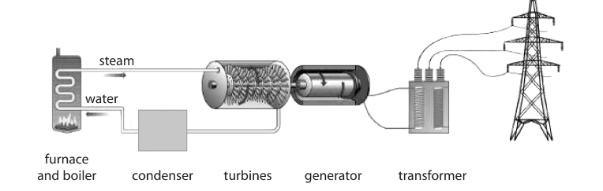

In which part of the power station is heat energy usefully transferred to a kinetic energy store?
- **A.** boiler
- **B.** turbine
- **C.** transformer
- **D.** wires

## Q3 — easy — 1 marks · exam-questions

### 1((c)) — 1 mark — multiple_choice — from paper 2016 · 2P
When a book from a low shelf is placed on a higher shelf, the book gains
- **A.** gravitational potential energy
- **B.** mass
- **C.** weight
- **D.** work

## Q4 — easy — 2 marks · exam-questions

### 2((a)) — 2 marks — command: what — structured — from paper Jun 2013 · 2P
A soldering iron is a tool used when joining electronic components in a circuit. It has an electric heater.

Soldering iron A operates when connected to the mains supply.

Soldering iron A

Soldering iron A is labelled 230 V, 30 W.

What does **30 W** tell you about the energy transfer in the soldering iron?

## Q5 — easy — 2 marks · exam-questions

### 5((a)) — 1 mark — command: what — structured — from paper Jun 2016 · 1PR
The diagram shows a type of power station used to generate electricity.

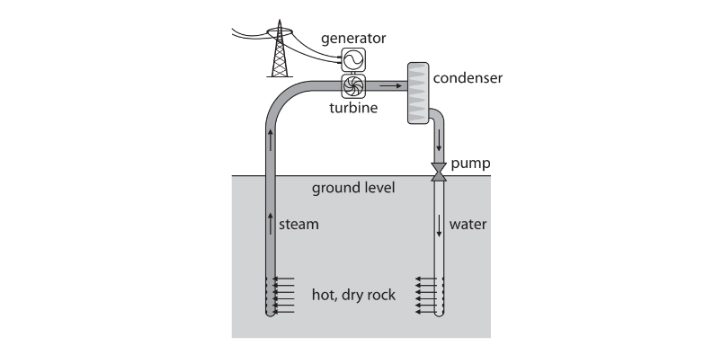

What type of renewable resource does this power station use?

### 5((a)) — 1 mark — command: name — structured — from paper 2016 June · 1PR
Name another renewable resource.

## Q6 — medium — 1 marks · exam-questions

### 1() — 1 mark — multiple_choice — from paper June 2013 · 1P
Which unit is equivalent to the power of 1 watt?
- **A.** 1 joule per coulomb (1 J/C)
- **B.** 1 joule per second (1 J/s)
- **C.** 1 newton per square metre (1 N/m2)
- **D.** 1 newton per kilogram (1 N/kg)

## Q7 — medium — 6 marks · exam-questions

### 6((a)) — 4 marks — command: multiple — structured — from paper January 2015 · 2P
A person has a suitcase with wheels.

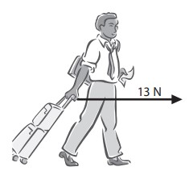

The person pulls the suitcase with a horizontal force of 13 N for 110 m.

(i) State the equation linking work done, force and distance moved.

(ii) Calculate the work done on the suitcase by the person.

work done = ............................................... J

(iii) How much energy is transferred to the suitcase?

energy transferred = ............................................... J

### 6((b)) — 2 marks — command: explain — structured — from paper January 2015 · 2P
The suitcase falls over.

Explain why it loses gravitational potential energy when it falls.

## Q8 — medium — 4 marks · exam-questions

### 4((b)) — 4 marks — command: multiple — structured — from paper Jan 2012 · 1P
The photograph shows equipment used for generating electricity from renewable sources.

On a windy day, the wind turbine transfers 78 W of power.

(i) State the equation linking power, energy transferred and time.

(ii) Calculate the amount of energy the turbine transfers in 10 s.

## Q9 — medium — 4 marks · exam-questions

### 5((a)) — 1 mark — command: state — structured — from paper Jun 2016 · 2P
A man uses a wheelbarrow to carry some logs along a flat path, as shown.

He pushes with a horizontal force of 140 N and the wheelbarrow moves 39 m.

State the relationship between work done, force and distance moved.** **

### 5((b)) — 3 marks — command: multiple — structured — from paper 2016 June · 2P
(i) Calculate the work done moving the wheelbarrow.

Work done = .........................

(ii) State how much energy is transferred to the wheelbarrow.

Energy transferred = ..............................

## Q10 — medium — 4 marks · exam-questions

### 7((a)) — 1 mark — command: state — structured — from paper Jun 2012 · 2P
Supermarkets use conveyer belts to move shopping at the till. The diagram shows a carton of milk being pulled along by a horizontal conveyer belt.

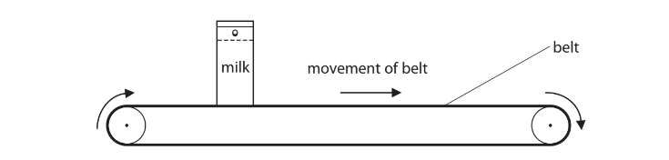

The horizontal force on the carton from the belt is 1.7 N. The carton moves a distance of 0.46 m.

State the equation linking work done, force and distance.

### 2() — 3 marks — command: multiple — structured
(i) Calculate the work done moving the carton.

Work done = ..................... J

(ii) State how much energy is transferred to the carton.

Energy transferred = ........................ J

## Q11 — medium — 7 marks · exam-questions

### 9((c)) — 3 marks — command: multiple — structured — from paper Jun 2016 · 1P
The photograph shows a machine at a coal mine.

© Andrew Curtis

The machine lifts a load weighing 400 000 N through 190 m.

(i) State the relationship between work done, force and distance moved.

(ii) Calculate the work done on the load.

Work done on load = ....................... J

### 9((d)) — 4 marks — command: multiple — structured — from paper Jun 2016 · 1P
The machine uses an average (mean) power of 1.9 MW to do 67 MJ of work.

(i) Calculate the time needed to do this work.

Time = .................. s

(ii) State the effect of using a lower average power to do this work.

## Q12 — medium — 9 marks · exam-questions

### 7((a)) — 4 marks — command: multiple — structured — from paper Jun 2015 · 1P
A flying squirrel is an animal that can glide through the air. It spreads out its limbs to stretch out a membrane that helps it to glide.

© Robert Savannah

The mass of a flying squirrel is 0.19 kg. It climbs 17 m up a tree.

(i) State the equation linking gravitational potential energy (GPE), mass, *g* and height.

(ii) Calculate the GPE gained by the squirrel during this climb.

GPE = .................. J

(iii) State the amount of work done against the force of gravity by the squirrel during this climb.

Work done = .................... J

### 7((b)) — 5 marks — command: multiple — structured — from paper Jun 2015 · 1P
The flying squirrel glides from P to Q with a velocity of 13 m/s.

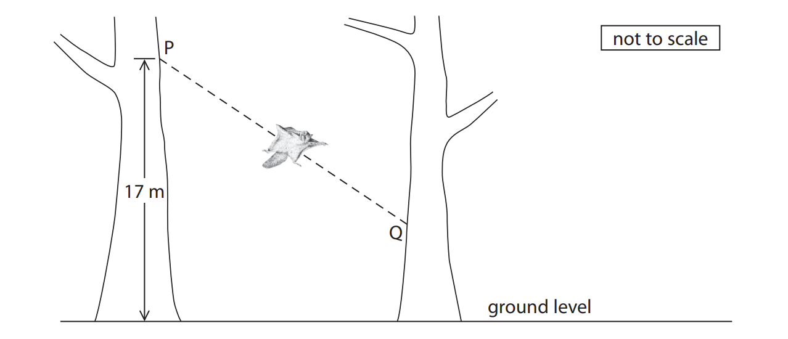

(i) Add labelled arrows to the diagram to show the directions of the forces of weight and drag acting on the squirrel.

(ii) State the equation linking kinetic energy (KE), mass and velocity.

(iii) Calculate the KE of the squirrel as it glides.

KE = ..................... J

## Q13 — medium — 6 marks · exam-questions

### 9((a)) — 3 marks — command: multiple — structured — from paper Jan 2016 · 1P
A resistance band is a stretchy plastic band that is used when doing exercises. The diagram shows a student exercising his leg by stretching a resistance band fixed to a wall.

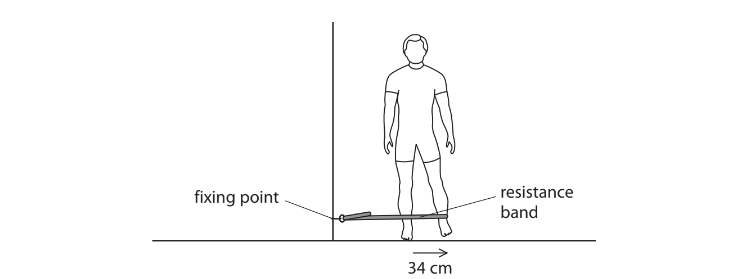

The student moves his leg 34 cm sideways as shown. The average resistance force is 23 N.

(i) State the relationship between work done, force and distance moved.

(ii) Calculate the work done when the student moves his leg sideways once.

Work done = ........................ J

### 9((b)) — 3 marks — command: calculate — structured — from paper Jan 2016 · 1P
The student repeats this movement 15 times in 1 minute. Calculate the average power of the student during this exercise.

Power = ....................... W

## Q14 — medium — 5 marks · exam-questions

### 10((a)) — 1 mark — command: state — structured — from paper Jan 2012 · 1P
A shopping centre has escalators to move people between floors.

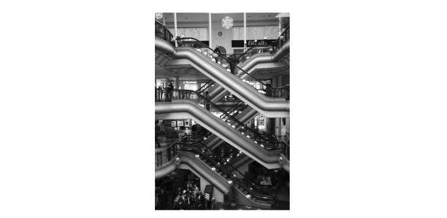

A man of mass 78 kg steps on to an escalator. The escalator lifts him a height of 5.0 m.

State the equation linking gravitational potential energy, mass, g and height.

### 10((a)) — 4 marks — command: multiple — structured — from paper 2012 January · 1P
(i) Show that the gravitational potential energy gained by the man is about 4000 J.

(ii) State the work done on the man and give the unit.

Work done = ............................... Unit ..............................

## Q15 — medium — 7 marks · exam-questions

### 8((a)) — 3 marks — command: multiple — structured — from paper Jan 2015 · 1P
A student investigates the energy transfers in a small generator. She connects the generator to a circuit that includes a lamp. She hangs a mass from a string wound around the axle. The lamp lights as the mass falls to the ground.

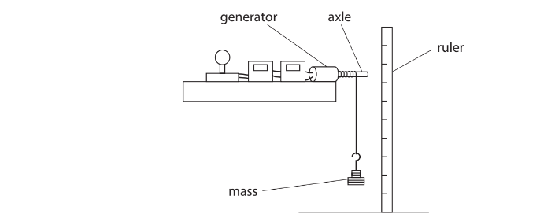

The table shows the student’s results.

| height that mass falls | 0.61 m |
|---|---|
| mass | 2.75 kg |
| time taken for mass to fall | 1.3 s |
| average current in the lamp | 0.46 A |
| average voltage across the lamp | 12.7 V |

(i) State the equation linking gravitational potential energy, mass, g and height.

(ii) Calculate the gravitational potential energy, GPE, lost by the mass.

GPE = .................................. J

### 2() — 4 marks — command: multiple — structured
(i) Explain why only some of the gravitational potential energy of the mass is transferred to the lamp.

(ii) Calculate the energy transferred to the lamp.

Energy transferred = ................................ J

## Q16 — medium — 8 marks · exam-questions

### 8((a)) — 4 marks — command: multiple — structured — from paper 2013 June · 1P
A car pulls a caravan along a horizontal road.

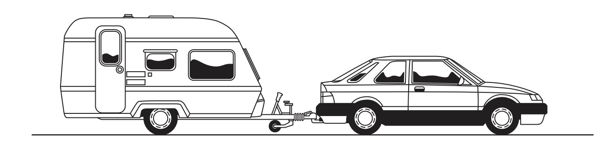

The car pulls the caravan with a resultant force of 170 N for a distance of 110 m.

(i) State the equation linking work done, force and distance.

(ii) Calculate the work done by the car on the caravan.** **

work done = ....................J

(iii) State how much energy is transferred to the caravan.

energy transferred = ....................J

### 8((b)) — 4 marks — command: multiple — structured — from paper 2013 June · 1P
The mass of the car is 1650 kg.

The mass of the caravan is 950 kg.

(i) State the equation linking kinetic energy, mass and velocity.

(ii) Calculate the total kinetic energy when the car and caravan travel together at a constant speed of 23 m/s.

Total kinetic energy = .................J

## Q17 — medium — 9 marks · exam-questions

### 1((a)) — 2 marks — command: choose — structured — from paper Jun 2015 · 2PR
The diagram shows a roller-coaster ride. The car is pulled slowly from the start to point B and then released.

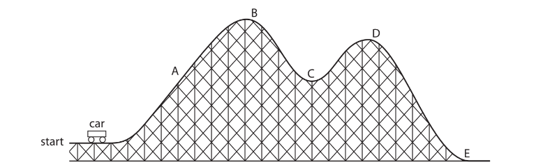

Choose letters from the diagram to complete this sentence.

The car has the most gravitational potential energy at point ........................... and it goes fastest at point ......................... .

### 1((b)) — 7 marks — command: multiple — structured — from paper Jun 2015 · 2PR
The mass of the car is 900 kg. The maximum speed of the car is 15 m/s.

(i) State the relationship between momentum, mass and velocity.

(ii) Calculate the maximum momentum of the car. Give the unit.

(iii) State the equation linking kinetic energy (KE), mass and speed.

(iv) Calculate the maximum KE of the car.

Maximum KE = ...................... J

## Q18 — medium — 5 marks · exam-questions

### 2((a)) — 1 mark — command: give — structured — from paper Jan 2013 · 2P
A coal-fired power station and a wind turbine both produce electrical power. The power station produces 1200 MW and the wind turbine produces 1.5 MW.

Give one advantage of using wind turbines instead of a coal-fired power station to produce electricity.

### 2((b)) — 4 marks — command: explain — structured — from paper Jan 2013 · 2P
Coal-fired power stations are still in general use.

Explain why wind turbines have not replaced them.

## Q19 — medium — 11 marks · exam-questions

### 5((a)) — 2 marks — command: multiple — structured — from paper Jun 2013 · 2PR
Some energy sources are renewable and other energy sources are non-renewable.

(i) Explain what is meant by the term non-renewable.

(ii) Give an example of a non-renewable energy source.

### 5((b)) — 9 marks — command: multiple — structured — from paper Jun 2013 · 2PR
The photograph shows a wind farm that generates electricity for the National Grid.

(i) Some wind farms are in remote areas.

Explain how the power is transmitted to large cities.

(ii) Some people think that wind farms are a good idea. Others disagree.

Discuss the advantages and disadvantages of building more wind farms.

## Q20 — medium — 8 marks · exam-questions

### 11((a)) — 3 marks — command: multiple — structured — from paper Jun 2013 · 1PR
A ball has a mass of 0.25 kg. A student holds the ball 1.75 m above the ground.

(i) State the equation linking gravitational potential energy (GPE), mass, *g* and height.

(ii) Calculate the gravitational potential energy of the ball.

GPE = .......................... J

### 11((b)) — 1 mark — command: state — structured — from paper Jun 2013 · 1PR
The student lets the ball fall.

State the value of the kinetic energy (KE) of the ball just before it hits the ground.

Assume that there is no air resistance.

KE = ........................... J

### 11((c)) — 4 marks — command: multiple — structured — from paper Jun 2013 · 1PR
Another ball with the same mass has a kinetic energy of 3.1 J.

(i) State the equation linking kinetic energy, mass and speed.

(ii) Calculate the speed of the ball.

Speed = .............................. m/s

## Q21 — medium — 9 marks · exam-questions

### 1() — 3 marks — command: describe — structured
A hydroelectric power (HEP) station generates electricity from water stored in a reservoir.

Describe the energy transfers involved in generating electricity in a hydroelectric power station.

### 2() — 6 marks — command: discuss — structured
Nuclear power stations and wind farms are both used to generate electricity on a large scale.

**Discuss **the advantages and disadvantages of using nuclear power stations compared with wind farms.

## Q22 — hard — 10 marks · exam-questions

### 13((b)) — 3 marks — command: multiple — structured — from paper Jun 2012 · 1P
The photograph shows a small aeroplane, of mass 600 kg.

This aeroplane has an electric motor powered by fuel cells. Fuel cells use hydrogen gas and provide an electric current.

The velocity of the aeroplane is 28 m/s.

(i) State the equation linking kinetic energy, mass and velocity.

(ii) Calculate the kinetic energy of the aeroplane.

Kinetic energy = ......................... J

### 13((c)) — 7 marks — command: multiple — structured — from paper Jun 2012 · 1P
The aeroplane takes off and climbs to a height of 1000 m.

(i) State the equation linking gravitational potential energy (GPE), mass, g and height.

(ii) Calculate the gravitational potential energy gained by the aeroplane.

(iii) The fuel cells provide a maximum total power of 24 kW. The aeroplane also carries a large rechargeable battery.

Show, by calculation, that the aeroplane needs this extra source of power to climb to 1000 m in 3 minutes.

(iv) The aeroplane uses fuel cells connected together in series in a ‘stack’. The voltage of each fuel cell is 0.6 V. The maximum current in each fuel cell is 30 A. Show that there must be more than 1300 fuel cells in the stack.

## Q23 — hard — 7 marks · exam-questions

### 8((c)) — 3 marks — command: calculate — structured — from paper Jan 2016 · 1P
A student has a bicycle with a dynamo (generator) that supplies electricity for its lights. The friction wheel, W, presses against the bicycle tyre. When the student pedals, the friction wheel turns and causes part Y to rotate.

The student cycles for 290 s. Her dynamo produces a constant useful power output of 3.1 W and is 72% efficient.

Calculate the total useful energy output.

Useful energy output = ............................. J

### 8((c)) — 4 marks — command: multiple — structured — from paper 2016 February · 1P
(i) State the relationship between efficiency, useful energy output and total energy input.

(ii) Calculate the total energy input.

Total energy input = ............................. J

## Q24 — hard — 6 marks · exam-questions

### 7() — 6 marks — command: discuss — structured — from paper 2015 June · 2PR
In 2013, the UK Government decided to build another nuclear power station at Hinckley Point.

Hinckley Point is in Somerset, a major agricultural area of the UK.

This is the third nuclear power station at the site.

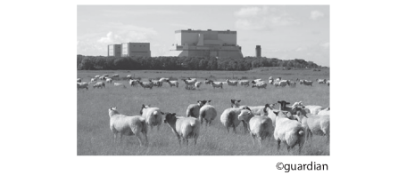

Discuss the advantages and disadvantages of nuclear power stations.

## Q25 — hard — 5 marks · exam-questions

### 6() — 5 marks — command: evaluate — structured — from paper Jun 2016 · 2PR
The table gives information about some ways to generate electrical power.

| **Type of power station** | **Maximum output power in MW** | **Time to reach maximum power** | **Relative fuel cost** |
|---|---|---|---|
| wind farm | 20 | variable | none |
| gas turbine | 600 | 15 minutes | medium |
| tidal scheme | 6000 | variable | none |
| nuclear power station | 1200 | 2 days | low |
| coal-fired power station | 1800 | 3 hours | high |

An electricity supply company has enough power stations to cover the normal demand for electricity but not enough for cold conditions. On cold days the demand for electrical power can suddenly increase by 20 000 MW.

The company needs to build new power stations to meet this increased demand.

Using only information in the table, evaluate which types of power station would be the most suitable to meet this increased demand.

## Q26 — hard — 4 marks · exam-questions

### 8() — 4 marks — command: explain — structured — from paper Jun 2014 · 2P
An energy company plans to build a new power station. The company must decide between two renewable energy projects, a geothermal power station or a solar power station.

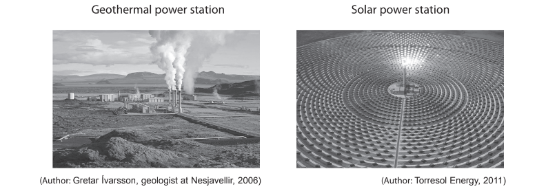

Explain how the location and the climate might affect the type of power station that the company chooses.

## Q27 — hard — 10 marks · exam-questions

### 11((a)) — 3 marks — command: multiple — structured — from paper 2013 January · 1P
The photograph shows a type of rollercoaster.

The car is launched from point **A** in the photograph, accelerates to point **B** and then rises over point **C**.

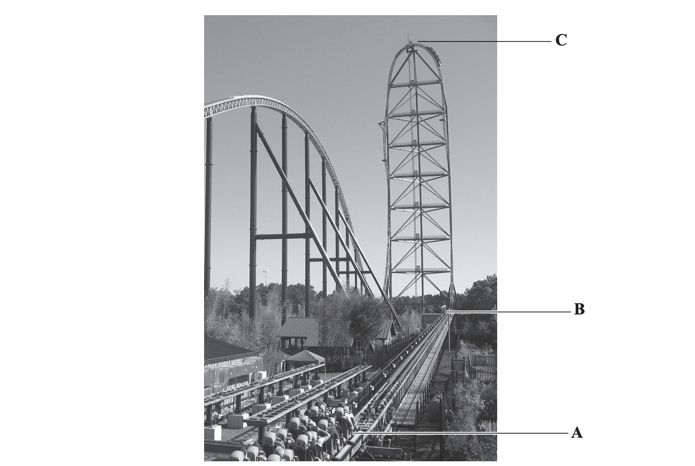

Each loaded car has a mass of 2000 kg.

**C** is 128 m above **B**.

(i) State the equation linking gravitational potential energy, mass, height and gravitational field strength.

(ii) Show that the gravitational potential energy gained by the car when it rises from **B** to **C** is about 2.6 MJ.

### 11((b)) — 5 marks — command: multiple — structured — from paper 2013 January · 1P
The car gains kinetic energy when work is done on it by the launching system between **A **and** B**.

Assume there are no energy losses.

(i) State the minimum kinetic energy that the car must have at **B** for it to reach **C**.

(ii) How is the kinetic energy gained related to the work done?

(iii) Write down the equation linking work done, force and distance.

(iv) The launching system provides a force of 32 kN.

Calculate the minimum length of track needed between **A** and **B** for the car to reach **C**.

Length of track = ............................................................ m

### 11((c)) — 2 marks — command: explain — structured — from paper 2013 · 1P
Sometimes the car does not reach **C**, but rolls backwards to the start.

This can happen when it becomes windy or the track becomes wet.

Explain why these conditions could cause the car to stop before it reaches **C**.

## Q28 — hard — 10 marks · exam-questions

### 10((c)) — 4 marks — command: multiple — structured — from paper 2014 June · 1P
In 1971, astronaut Alan Shepard hit a golf ball on the surface of the Moon.

The golf ball had a mass of 50 g and he transferred 56 J of energy to it.

(i) State the equation linking kinetic energy, mass and velocity.

(ii) Calculate the initial velocity of the ball.

initial velocity = .............................................................. m/s

### 10((d)) — 4 marks — command: multiple — structured — from paper 2014 · 1P
At its highest point the ball had gained 12 J of gravitational potential energy.

(i) State the kinetic energy of the ball at its highest point.

kinetic energy = ..............................................................J

(ii) State the equation linking gravitational potential energy, mass, g and height.

(iii) Calculate the maximum height that the ball reached.

(gravitational field strength on the Moon, g = 1.6 N/kg)

maximum height = ..............................................................m

### 10((e)) — 2 marks — command: suggest — structured — from paper 2014 · 1P
Suggest why the ball travelled further on the Moon than it would have done on Earth.

## Q29 — hard — 8 marks · exam-questions

### 3((a)) — 4 marks — command: multiple — structured — from paper Jun 2014 · 1PR
The diagram shows a motor lifting a 130 g mass.

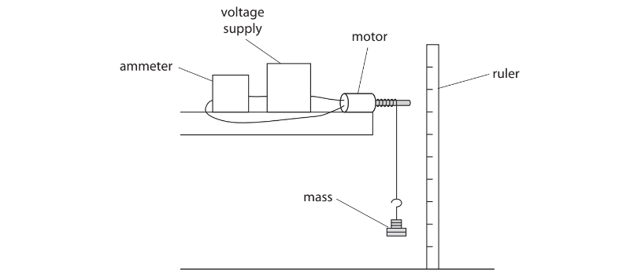

The current in the motor is 2.1A and the voltage across it is 12 V. The motor takes 1.5 s to lift the mass.

(i) Calculate the electrical energy transferred to the motor as it lifts the mass. Give your answer to two significant figures.

Energy = ............................ J

(ii) State the equation linking gravitational potential energy, mass, *g* and height.

### 3((a)) — 4 marks — command: multiple — structured — from paper 2014 July · 1PR
(i) The motor lifts a 130 g mass to a height of 63 cm. Calculate the gravitational potential energy (GPE) gained by the 130 g mass.

GPE = ...................... J

(ii) Why is the amount of GPE gained by the mass less than the amount of electrical energy transferred to the motor?

## Q30 — hard — 11 marks · exam-questions

### 11((a)) — 5 marks — command: multiple — structured — from paper 2016 · 1P
An underground train enters a station.

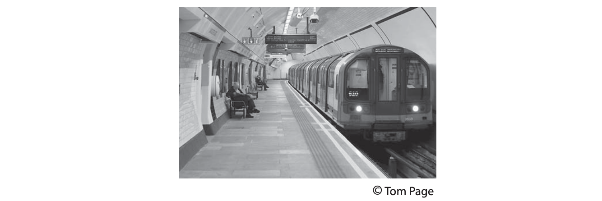

The mass of the train and its passengers is 250 000 kg.

The total kinetic energy is 18 MJ.

(i) State the relationship between kinetic energy (KE), mass and velocity.

(ii) Calculate the velocity of the train as it enters the station.

velocity = ......................................... m/s

(iii) The driver applies the brakes to stop the train.

State what happens to the kinetic energy of the train.

### 11((b)) — 6 marks — command: explain — structured — from paper 2016 · 1P
The diagram shows a section through the station.

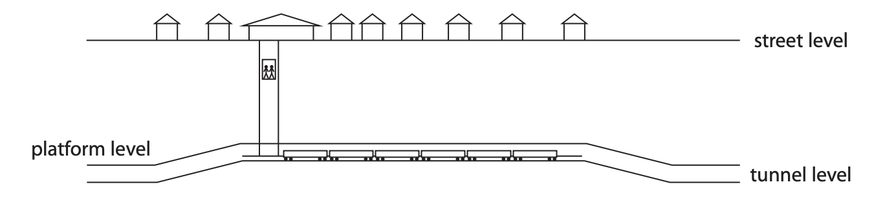

(i) The passengers who use the station are carried from platform level to street level in a lift.

Explain why these passengers gain gravitational potential energy in the lift, even when they are below ground.

(ii) The tunnel is designed so that the trains go up a slope as they enter the station and go down a slope as they leave.

The driver uses brakes to stop the train in the station and a motor to make the train move away.

Explain how the sloping parts of the tunnel affect the amount of work that needs to be done on the train by the brakes and by the motor.

## Q31 — hard — 6 marks · exam-questions

### 11() — 6 marks — command: describe — structured — from paper Jun 2015 · 1PR
A student investigates how the energies of a ball and spring change when the ball and spring vibrate together.

The diagrams and bar charts show how the energies of the ball and spring vary with the position of the ball.

The ball has a mass of 1 kg.

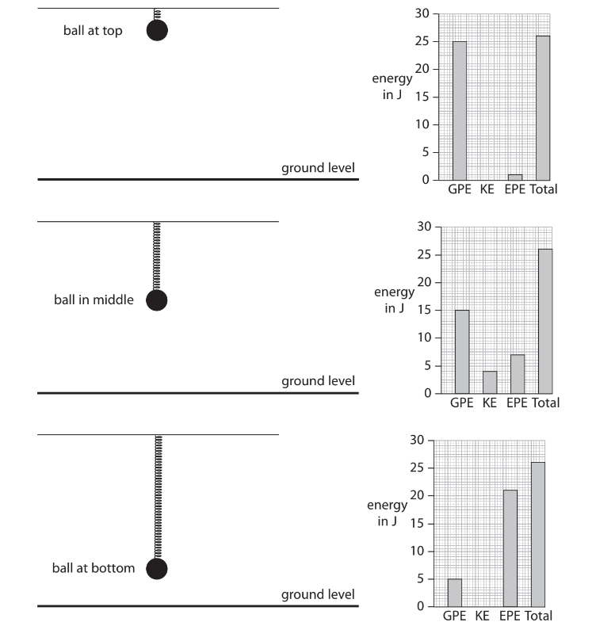

GPE = gravitational potential energy of the ball (zero at ground level)

KE = kinetic energy of the ball

EPE = elastic potential energy of the spring

Use information from the diagrams and the bar charts to describe what happens to the energy, speed and position of the ball as it vibrates on the spring.

## Q32 — hard — 11 marks · exam-questions

### 1() — 6 marks — command: describe — structured
A child is playing with a toy car on a racetrack.

The child holds the toy car at the top of the track, then releases it. The car experiences friction and air resistance as it travels along the track to the lowest point. Upon reaching the end of the track, the car leaves the track and continues up in the air.

Describe the energy transfers from just before the child releases the car to the point where the car reaches its highest point above the end of the track.

### 2() — 5 marks — command: multiple — structured
The racetrack begins at a height of 1.50 m above the floor and ends at a height of 1.00 m above the floor.

The toy car has a mass of 20 g and is released from rest at the top of the track.

For the following calculations, you may ignore the effects of friction and air resistance.

(i) On the diagram, draw a cross at the position where the speed of the car is greatest.

[1]

(ii) Calculate the amount of energy in the car's gravitational store before it is released.

[2]

(iii) State the amount of energy in the car's kinetic store where you have drawn a cross on the diagram.

[1]

(iv) The car leaves the track and rises into the air before falling again.

Determine the maximum height reached by the car above the end of the racetrack.

[1]
