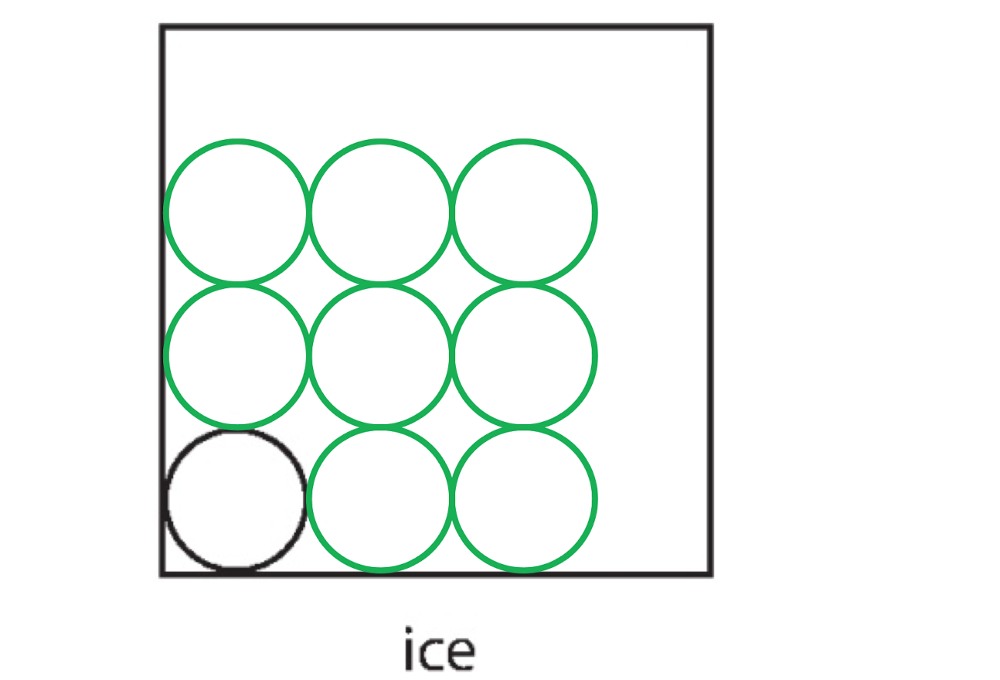
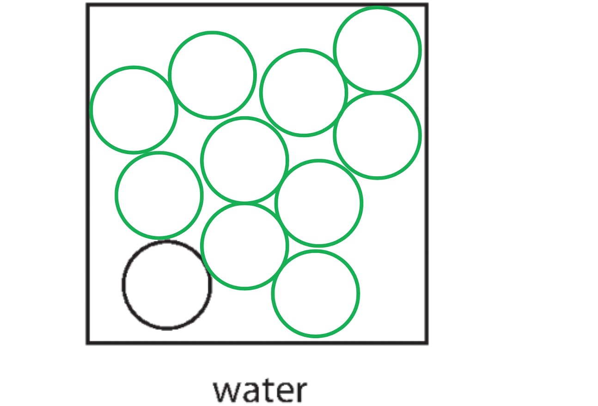
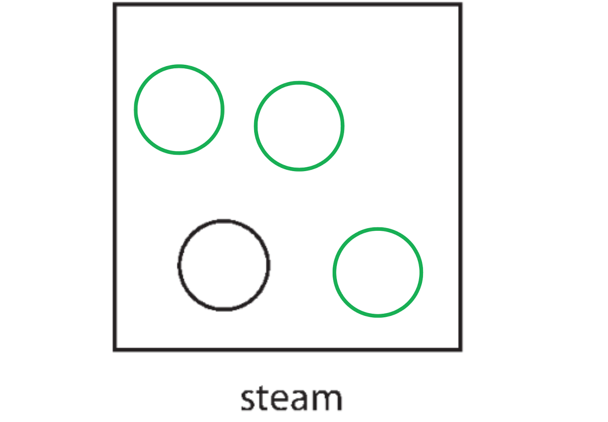
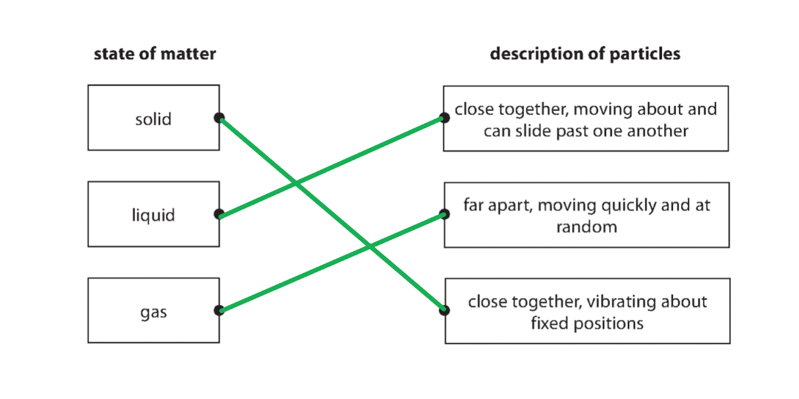
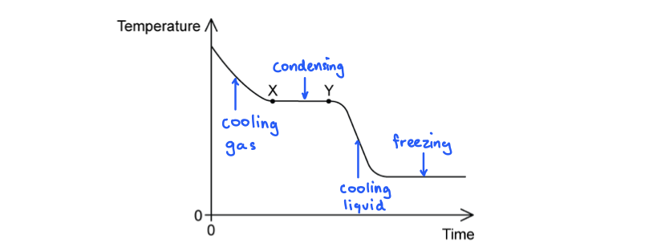
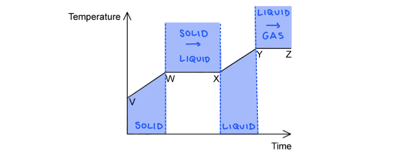
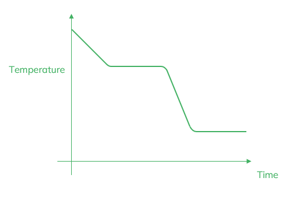
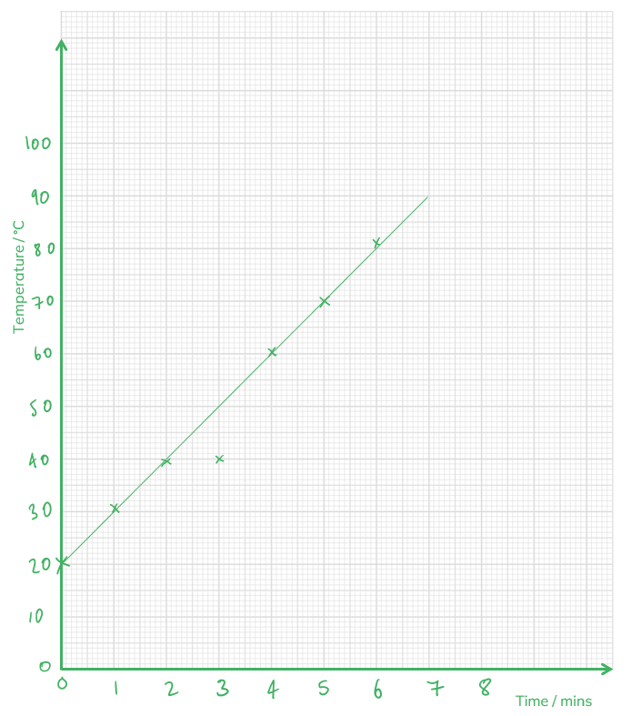
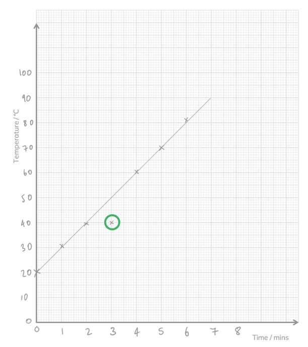
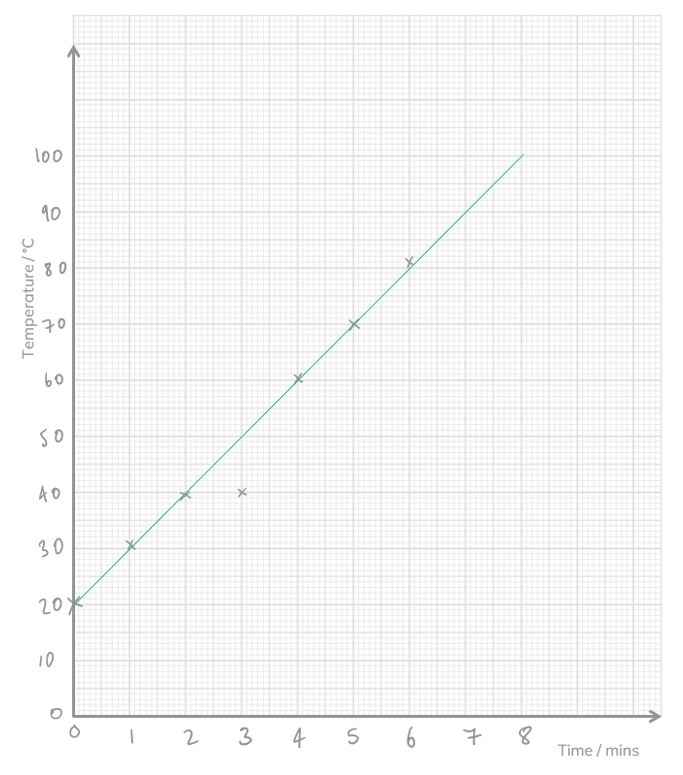

# Mark Schemes — Changes of State
**5. Solids, Liquids & Gases** · Edexcel IGCSE Physics (4PH1)

## Q1 — easy — 7 marks · exam-questions

### 1((a)) — 4 marks
Complete the diagram for ice:

- Particles in a regular arrangement; **[1 mark]**

Complete the diagram for water:

- Particles in an irregular arrangement; **[1 mark]**
- No gaps large enough to add another particle; **[1 mark]**

Complete the diagram for steam:

- Particles are random and spaced (in comparison to the water diagram); **[1 mark]**

**[Total: 4 marks]**

### 1((b)) — 3 marks
Describe how particles move in ice:

- Particles vibrate (in fixed positions); **[1 mark]**

Describe how particles move in water:

- Particles change position / move over each other; **[1 mark]**

Describe how particles move in steam:

- Random movement; **[1 mark]**

**OR**

- Range of speeds; **[1 mark]**

**[Total: 3 marks]**

## Q2 — easy — 6 marks · exam-questions

### 1() — 6 marks
State the definition of the following variables and an appropriate unit for each:

(i) *m *is:

- The mass (of the substance); **[1 mark]**
- (Measured in) kg / kilograms; **[1 mark]**

(ii) *c* is:

- Specific heat capacity (of the substance); **[1 mark]**
- (Measured in) J kg–1 K–1 / J kg–1 ºC–1;** [1 mark]**

(iii) Δ*T* is:

- The change in temperature; **[1 mark]**
- (Measured in) K / Kelvin / ºC / Degrees Celsius; **[1 mark]**

**[Total: 6 marks]**

## Q3 — easy — 6 marks · exam-questions

### 3((a)) — 2 marks
Link each state of matter with a description:

- Any one lines correct; **[1 mark]**
- All three lines correct; **[1 mark]**

**[Total: 2 marks]**

> *Multiple lines to or from a box scores no marks, always pay careful attention to how many lines you are asked to draw for each box in these questions. *

### 2() — 4 marks
Evaporation cools the water because:

- The temperature of the particles is **directly** proportional to their average **kinetic** energy; **[1 mark]**
- Energetic particles turn into **gas** as they leave the surface of the** ****liquid**; **[1 mark]**
- Gas particles have a **higher**** **average **kinetic**** **energy than the particles in the liquid, therefore, they move **faster**; **[1 mark]**
- The average **kinetic**** **energy, and therefore temperature, of the remaining particles in the liquid **decreases**; **[1 mark]**

**[Total: 4 marks]**

## Q4 — easy — 8 marks · exam-questions

### 1() — 3 marks
Describe the arrangement of the particles in a solid, a liquid and a gas:

- Particles in a solid are close together and have a regular arrangement;** [1 mark]**
- Particles in a liquid are close together / touching but randomly ordered;** [1 mark]**
- Particles in a gas are far apart and are randomly ordered;** [1 mark]**

**[Total: 3 marks]**

> *You need to be able to describe and draw these arrangements confidently.*

> *Students commonly lose marks in this type of question.*

> *Always double-check the scope of the question; here the question asks about the arrangement only, so you do not need to include information about forces, energy, volume or movement because there will be no marks awarded for this.*

> *When asked to talk about different things, make sure you make it clear which you are referring to. Instead of saying 'they are arranged...', say 'particles in a solid are arranged...' to ensure you score the marks. Examiners cannot award the mark if it is not clear which item you are referring to. *

### 2() — 3 marks
Describe the motion of the particles in a solid,  a liquid and a gas:

- In a solid, particles <u>vibrate</u> about fixed positions; **[1 mark]**
- In a liquid, particles flow over one another in random directions and are still touching;** [1 mark]**
- In a gas, particles move rapidly in random directions; **[1 mark]**

**[Total: 3 marks]**

> *When describing the motion of particles in a solid, the term 'vibrate' is a crucial keyword, make sure to include it!*

### 3() — 1 marks
State the name of the process which causes this to happen:

- Evaporation; **[1 mark]**

**[Total: 1 mark]**

### 4() — 1 marks
The puddle would dry up more quickly if there were:

- Warmer weather **OR** windier weather; **[1 mark]**

**[Total: 1 mark]**

## Q5 — easy — 5 marks · exam-questions

### 1() — 1 marks
**Correct answer: C** — The gas is condensing

**Final answer:** **The correct answer is ****C**** because:**

- The temperature of a cooling substance will remain constant whilst it is changing state

  - This is because any energy lost is used to form bonds between the molecules
  - Hence, the flat areas on the graph represent a **phase change**

- Therefore the first flat area, X to Y, is **condensation**, where a gas is turning into a liquid

**A** is incorrect as this is represented by the initial, sloped part of the graph

**B** is incorrect as this is represented by the second flat part of the graph

**D** is incorrect as this is represented by the second sloped part of the graph

### 2() — 1 marks
**Correct answer: D** — Y to Z

**Final answer:** **The correct answer is ****D**** because:**

- A substance is partially a liquid and partially a gas when it undergoes boiling
- This will be represented by a flat region of the graph, as these indicate a phase change

  - This eliminates options **A** and **C**

- The first flat section, W to X, indicates the melting phase as it must first change from solid to liquid
- Hence, Y to Z represents the boiling phase
- Therefore, the correct answer is **D**

**A** is incorrect as this represents the solid rising in temperature

**B** is incorrect as this represents the solid melting into a liquid

**C** is incorrect as this represents the liquid rising in temperature

### 3() — 3 marks
(i) The equation linking energy transferred, mass, specific heat capacity and change in temperature is:

- Energy transferred = mass × specific heat capacity × change in temperature **OR** $\DeltaQ=m\timesc\times\DeltaT$ **[1 mark]**

(ii) Calculate the energy transferred from the thermal energy store:

List the known quantities:

- Mass of water, $m$ = 0.2 kg
- Change in temperature, $\DeltaT$ = (25 − 0) = 25 °C
- Specific heat capacity of water, $c$ = 4200 J/kg °C

Substitute the values into the equation for specific heat capacity:

- $\DeltaQ=m\timesc\times\DeltaT$
- $\DeltaQ$ = 0.2 × 4200 × 25 **[1 mark]**
- Energy transferred = 21 000 J **[1 mark]**

**[Total: 3 marks]**

## Q6 — medium — 7 marks · exam-questions

### 3((a)) — 4 marks
Explain why the air moves as shown by the arrows:

Any** four** from:

- Due to convection; **[1 mark]**
- Air entering (at the bottom) from outside is cooler; **[1 mark]**
- Heated air expands / molecules move apart;** [1 mark]**
- Less dense air rises; **[1 mark]**
- (Above the cooling tower) air cools and becomes more dense; **[1 mark]**
- Cooler / denser air falls (outside the cooling tower);** [1 mark]**
- The process is repeated / continuous / convection current formed; **[1 mark]**

**[Total: 4 marks]**

### 8((b)) — 3 marks
Explain how evaporation cools the water:

Any **three **from:

- The temperature of the particles is <u>proportional</u> to their average kinetic energy; **[1 mark]**
- Energetic particles leave the surface / escape the liquid / turn into gas; **[1 mark]**
- Gas particles have a higher average kinetic energy / speed than the particles in the liquid; **[1 mark]**
- The average kinetic energy of the remaining particles in the liquid is reduced; **[1 mark]**

**[Total: 3 marks]**

## Q7 — medium — 4 marks · exam-questions

### 3((a)) — 1 marks
Convert –183 °C to a temperature on the Kelvin scale:

- To convert °C to K, add 273
- −183 + 273 = 90 (K)** [1 mark]**

**[Total: 1 mark]**

### 3((a)) — 3 marks
Use ideas about particles to describe the changes that happen when a liquid boils to form a gas:

Any** three **from:

- As the temperature increases the particles gain kinetic energy;** [1 mark]**
- As the particles gain kinetic energy they move more freely;** [1 mark]**
- As the particles move more freely, they move apart from one another;** [1 mark]**
- Particles with enough energy will escape from the liquid; ** [1 mark]**

**[Total: 3 marks]**

## Q8 — medium — 8 marks · exam-questions

### 1() — 3 marks
State three factors that determine the rate of evaporation of water:

Any **three **from:

- Temperature (of the liquid / water); **[1 mark]**
- Surface area (of the liquid / water); **[1 mark]**
- Movement of air (over the surface of the liquid / water); **[1 mark]**
- Temperature of the <u>surroundings</u>; **[1 mark]**
- Humidity (of the surrounding air); **[1 mark]**

**[Total: 3 marks]**

### 2() — 2 marks
Evaporation makes the person feel cold because:

Any **two** from:

- More energetic / faster molecules escape (from the surface of the water); **[1 mark]**
- Less energetic / slower molecules remain; **[1 mark]**
- The water is colder (than the body of the person); **[1 mark]**
- Thermal energy is transferred from the person's body / skin to the water (causing the person to feel colder); **[1 mark]**
- Evaporation requires the latent heat of vaporisation; **[1 mark]**

**[Total: 2 marks]**

### 3() — 3 marks
The variation of temperature of the water during the 9 minutes is:

Any **three** from:

- During the first 6 minutes the temperature rises; **[1 mark]**
- (Because) the internal energy of water rises (from thermal energy input); **[1 mark]**
- During the next 3 minutes temperature is constant / stays the same; **[1 mark]**
- (Because) the internal energy does not rise (at the boiling point); **[1 mark]**

**[Total: 3 marks]**

> *It's important to remember that the once the water has reached boiling point, the temperature will not increase.*

> *This is because all the energy is being used by the particles to overcome the intermolecular forces of attraction between the water molecules, turning them from a liquid into a gas.*

## Q9 — medium — 12 marks · exam-questions

### 1() — 3 marks
(i) The motion of the particles in the solid beaker:

- (They) vibrate / oscillate (around a fixed position); **[1 mark]**

(ii) The motion of the particles in the water vapour is:

- Random / haphazard / in all directions; **[1 mark]**

The molecules move:

Any **one** from:

- With high speed; **[1 mark]**
- Freely; **[1 mark]**
- In a zig-zag pattern; **[1 mark]**
- In straight lines; **[1 mark]**

**[Total: 3 marks]**

Always read the question carefully. This question asks specifically about the movement of the particles, and not the arrangement of the particles. Therefore, there will be no marks awarded for stating that the particles in solids have fixed positions and the particles in gases are far apart.

### 2() — 4 marks
A correctly drawn graph would look like:

- Temperature correctly labelled on vertical axis; **[1 mark]**
- Time correctly labelled on horizontal axis; **[1 mark]**
- Two sections drawn with negative gradient; **[1 mark]**
- Two horizontal sections drawn <u>after</u> negative gradient sections; **[1 mark]**

**[Total: 4 marks]**

> *It is essential that you memorise the shape of this graph as it is very common to see questions which involve heating or cooling curves.*

### 3() — 2 marks
Explain what is meant by the specific heat capacity of a substance:

- The amount of thermal energy needed to raise (the temperature of) of 1 kg / a unit mass (of a substance); **[1 mark]**
- By 1 ºC / 1 K; **[1 mark]**

**[Total: 2 marks]**

### 4() — 3 marks
Calculate the energy needed to boil the water to make a cup of masala chai tea.

List the known quantities:

- Change in temperature, Δ*θ* = (80 − 55) K

  - Initial temperature = 55 ºC
  - Final temperature = 80 ºC
- Specific heat capacity of water, *c* = 4200 J kg–1 K–1
- Mass of water, *m* = 170 g = 0.170 kg **[1 mark]**

Substitute into the equation for specific heat capacity to calculate the energy needed:

- $Q=mcΔθ$
- `Q space equals space 0.170 space cross times space 4200 space cross times space open parentheses 80 minus 55 close parentheses` **[1 mark]**
- Energy needed = 17 850 = 18 000 J (2 s.f) **[1 mark]**

**[Total: 3 marks]**

## Q10 — medium — 9 marks · exam-questions

### 1() — 1 marks
> **[mark-scheme]**
> - The energy required to change the temperature of <u>1 kg</u> of a substance by <u>1 degree Celsius</u> **[1 mark]**

### 2() — 5 marks
> **[mark-scheme]**
> Any **five **from (1 mark for each point):
> 
> - Mass (of glass block) is measured with a balance
> - Temperature change = final temperature - initial temperature
> - Energy supplied is measured with a joulemeter
> - Keep taking the temperature after the heater has been switched off to obtain maximum temperature
> - Use oil / petroleum jelly in the hole to ensure contact between the glass and the heater
> - Use the formula $c=\frac{\DeltaQ}{m\DeltaT}$ to calculate specific heat capacity
> 
> **[5 marks]**

> **[exam-tip]**
> You could also use an ammeter to measure current, a voltmeter to measure voltage/potential difference, and a timer to measure time, and then use the formula  $E=VIt$ to determine the energy transferred to the glass block.
> 
> However, the joulemeter used in the image does this already.

### 3() — 3 marks
To calculate the specific heat capacity of the Pyrex glass:

- List the known quantities:

  - Mass, $m=1.5\mathrm{kg}$
  - Initial temperature, $T_{i}=20^{\circ}C$
  - Final temperature, $T_{f}=35^{\circ}C$
  - Energy supplied, $\DeltaQ=18900J$
- Calculate the change in temperature:

$\DeltaT=T_{f}-T_{i}$

$\DeltaT=35-20$

$\DeltaT=15^{\circ}C$ **[1 mark]**

- Substitute the known values into the equation to calculate specific heat capacity:

$\DeltaQ=mc\DeltaT$

$c=\frac{\DeltaQ}{m\DeltaT}$

$c=\frac{18900}{1.5\times15}$ **[1 mark]**

$c=$ $840J/\mathrm{kg}^{\circ}C$** ** **[1 mark]**

## Q11 — hard — 10 marks · exam-questions

### 3((b)) — 6 marks
Explain the observations for a solid:

Any **two** from:

- Regular pattern **OR **closely packed; **[1 mark]**
- Vibrations in (fixed) position; **[1 mark]**
- Little space between particles; **[1 mark]**

Explain the observations for a liquid:

Any **two** from:

- Irregular pattern; **[1 mark]**
- (particles can) move over / past each other; **[1 mark]**
- Little space between particles; **[1 mark]**

Explain the observations for a gas:

Any **two** from:

- No pattern; **[1 mark]**
- (Particles can) move freely / fast; **[1 mark]**
- Larger space between particles; **[1 mark]**

**[Total: 6 marks]**

> *The word "vibrations" can only be used in association with the motion of particles in a solid. Vibration implies oscillation around a single, **fixed** position. *

### 3((b)) — 4 marks
(i) Give the missing temperatures:

Recall the conversion from °C to Kelvin:

- 0 °C = 273 K
- A single degree Celsius has the same size as a single Kelvin
- To move from K to °C, subtract 273 from the temperature
- To move from °C to K, add 273 to the temperature

For room temperature, convert 291 K to °C:

- 291 - 273 = <u>18 °C</u> **[1 mark]**

For the triple point of ethyne, convert −81 °C to K:

- −81 + 273 = <u>192 K</u> **[1 mark]**

(ii) State what happens to the average kinetic energy as the temperature is lowered:

- The average kinetic energy decreases; **[1 mark]**

(iii) State what happens to the volume of an ethyne molecule when the gas changes to a solid at the triple point:

- The volume remains constant / no change; **[1 mark]**

**[Total: 4 marks]**

## Q12 — hard — 7 marks · exam-questions

### 4((a)) — 3 marks
Explain why evaporation leads to cooling:

Any **three** from:

- <u>Evaporation</u> is (the process of) a <u>liquid becoming a gas</u> / vapour; **[1 mark]**
- The particles with <u>higher kinetic energy</u> / more speed <u>leave</u>; **[1 mark]**
- This <u>reduces</u> the (average kinetic) energy of particles <u>left</u>; **[1 mark]**
- (The lower energy) reduces the temperature; **[1 mark]**

**[Total: 3 marks]**

### 4((b)) — 4 marks
(i) Suggest why a runner might cool down too quickly if he does not wear a foil sheet:

Describe the processes already occurring:

- The runner is still covered in sweat; **[1 mark]** **OR**
- Evaporation is still occurring; **[1 mark]**

Suggest why the runner is cooling down now he has stopped running:

- The runner is not generating as much (new) heat (as he is performing less respiration); **[1 mark]**

(ii) The foil sheet reduces heat loss because:

**Explanation 1: the sheet reduces air flow**

- (The foil sheet acts as) a barrier to reduce particle movement; **[1 mark]**
- This reduces convection / evaporation; **[1 mark]**

**OR**

**Explanation 2: the sheet reflects radiation**

- The (shiny) surface reflects (radiation) / is a poor absorber; **[1 mark]**
- This reduces (energy loss through) radiation / infrared; **[1 mark]**

**[Total: 4 marks]**

## Q13 — hard — 4 marks · exam-questions

### 1() — 2 marks
Calculate the initial temperature of the water:

List the known quantities:

- Mass of water, *m* = 250 g = 0.250 kg
- Energy input, *E* = 85 kJ = 85 000 J
- Specific heat capacity of water, *c* = 4200 J kg–1 K–1
- Initial temperature = *T*i

Recall the temperature of the boiling point of water:

- Final temperature, *T*f = 100 ºC **[1 mark]**

Rearrange and substitute into the equation for specific heat capacity:

- $Q=mcΔT$
- $\DeltaQ=mc\DeltaT\Rightarrow\frac{\DeltaQ}{mc}=T_{f}-T_{i}\RightarrowT_{i}=T_{f}-\frac{\DeltaQ}{mc}$
- $T_{i}=100-\frac{85000}{0.250\times4200}$**[1 mark]**
- Initial temperature = 19 °C **[1 mark]**

**[Total: 3 marks]**

### 2() — 2 marks
If water had a lower specific heat capacity:

- It would require less energy to boil (per kg); **[1 mark]**
- (The water would) boil quicker / the kettle would take less time to come to a boil; **[1 mark]**

**[Total: 2 marks]**

> *If you got the first mark wrong (e.g. by saying more energy would be required), you would still be able to gain the second mark by saying the water would take longer to boil, as this shows you can correctly relate the change in energy to the change in time.*

## Q14 — hard — 7 marks · exam-questions

### 1() — 1 marks
**Correct answer: C** — 86 W

**Final answer:** **The correct answer is ****C**** because:**

- The equation relating thermal energy transferred Δ*Q* and specific heat capacity *c* is

  - Δ*Q* = *mc*Δ*T*

- So, the thermal energy transferred is:

  - Δ*Q* = 0.32 × 900 × (75 − 30) = 12 960 J

- The thermal power transferred in 2.5 minutes is therefore:

  - $P=\frac{\DeltaQ}{t}$
  - $P=\frac{12960}{2.5\times60}=86.4W$

- This is option **C**

- Power is the energy transferred per **second** - so make sure the time *t* has been converted into **seconds**

  - 1 minutes = 60 seconds

### 2() — 6 marks
An experimental method to determine the specific heat capacity of aluminium:

The following are the key physics points that will help you with your answer. You do not need to include them all, but will need to use them to write an answer as explained below:

- Use a thermometer to measure the temperature of the boiling water
- Allow enough time for the aluminium block to reach thermal equilibrium with the boiling water
- Measure the temperature of the cold water in the beaker
- Transfer the hot aluminium block to the cold water beaker
- Working quickly to minimise energy loss during transfer
- Measure the temperature of the colder water again
- Stir to ensure even heat distribution
- Measure the maximum temperature reached by the water
- Calculate the temperature rise by subtracting the initial temperature from the final temperature
- Calculate the temperature drop of the aluminium block by subtracting the final temperature from 100
- Use a balance to measure the mass of the beaker, water and aluminium
- Empty the water from the beaker, and dry both the beaker and the block
- Find the mass of the beaker and block alone
- Determine the mass of the water by subtracting the masses (of the beaker and block) from the total combined mass
- Calculate the energy gained by the water using the equation $\DeltaQ=m\timesc\times\DeltaT$
- The energy gained by the water = the energy lost by the aluminium block
- Therefore, the specific heat capacity of aluminium is $c=\frac{\DeltaQ}{m\times\DeltaT}$

**An example answer which would score 6 marks is:**

Heat up the block in the boiling water, then quickly transfer the block to the cold water beaker and measure the initial temperature of the water.

Measure the maximum temperature reached and subtract the initial temperature to find the temperature change. Calculate the energy gained by the water using $\DeltaQ=m\timesc\times\DeltaT$, which is equal to the energy lost by the aluminium.

Calculate the specific heat capacity of aluminium using $c=\frac{\DeltaQ}{m\times\DeltaT}$.

**[Total: 6 marks]**

> *Level 1 (1 - 2 marks)*

- *Steps are** **listed with no clear structure. An incomplete method is described **AND** at least one measurement is detailed.*

  - *Eg:** Heat the block in boiling water, then put it in cold water and measure the temperature reached.*

> *Level 2 (3 - 4 marks)*

- *Steps are linked** **with a clear structure. A mostly complete method is described **AND** at least two measurements are detailed **AND** some details of calculations are given.*

  - *Eg: **Heat the block in boiling water, then transfer to the cold water beaker, and measure the maximum temperature reached. Measure the mass of the water and calculate the energy transferred using *$\DeltaQ=m\timesc\times\DeltaT$

> *Level 3 (5 - 6 marks)*

- *Steps are explained with a well-developed structure. A detailed method is described AND most of the measurements are given AND clear details of the calculations are given.*

  - *Example answer is given above*

## Q15 — hard — 16 marks · exam-questions

### 1() — 7 marks
(i) State the variables which need to be measured to calculate the specific heat capacity of water:

- Mass of water; **[1 mark]**
- Temperature (rise / change); **[1 mark]**
- Energy supplied / energy from the heater; **[1 mark]**

(ii) Explain how you would measure one of these variables:

Any **one** from:

- Measure temperature at the start and end (of heating); **[1 mark]**
- Measure the mass of the empty cup; **[1 mark]**
- Zero the scales (with the empty cup) before adding water; **[1 mark]**
- Use start and end readings on the joulemeter; **[1 mark]**

(iii) State three ways to improve the experiment:

Any **three** from:

- Add a lid / cover (to the cup); **[1 mark]**
- Use insulation / lagging / a thicker cup / a better insulated cup; **[1 mark]**
- Add a stirrer; **[1 mark]**
- Use a more sensitive thermometer / digital thermometer / data logger; **[1 mark]**
- Ensure the heater is fully submerged; **[1 mark]**

**[Total: 7 marks]**

> *For questions asking you about how to improve a heating experiment such as this one, you should immediately think of insulation. If half the energy supplied to the water doesn't actually heat the water, your results will not be very reliable.*

### 2() — 4 marks
A graph which would score 4 marks would look like:

- Both axes labelled correctly; **[1 mark]**
- Scale covering more than half the graph paper;** [1 mark]**
- Points correctly plotted;** [1 mark]**
- Straight line of best fit drawn; **[1 mark]**

**[Total: 4 marks]**

### 3() — 3 marks
(i) The correctly circled anomalous point is:

- Anomalous point at (3, 40) circled; **[1 mark]**

(ii) State what the student should do with the anomalous reading:

- Ignore the reading when drawing the line of best fit; **[1 mark]**
- Repeat the experiment to take another reading; **[1 mark]**

**[Total: 3 marks]**

### 4() — 2 marks
To predict the temperature at 8 and 9 minutes:

Extend the line of best fit on the graph:

(i) At 8 minutes:

- The reading is 100°C **[1 mark]**

(ii) At 9 minutes:

- The boiling temperature of water is 100 °C
- Water will not reach a temperature higher than this, therefore after 8 minutes the line will flatten to horizontal
- (Therefore the temperature at 9 minutes is predicted to be) 100 °C **[1 mark]**

**[Total: 2 marks]**
