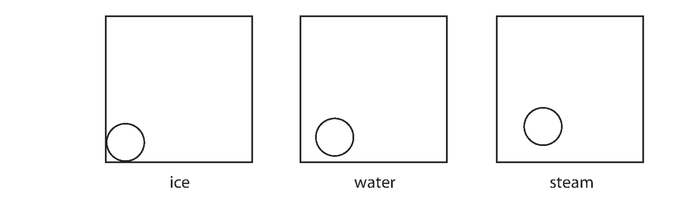
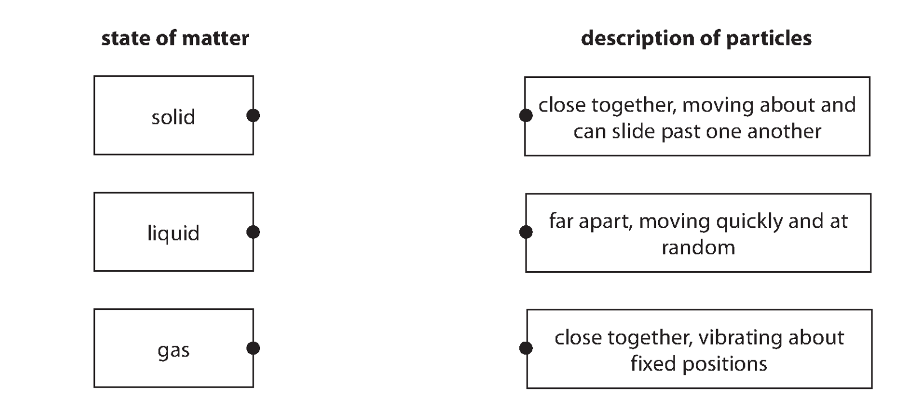
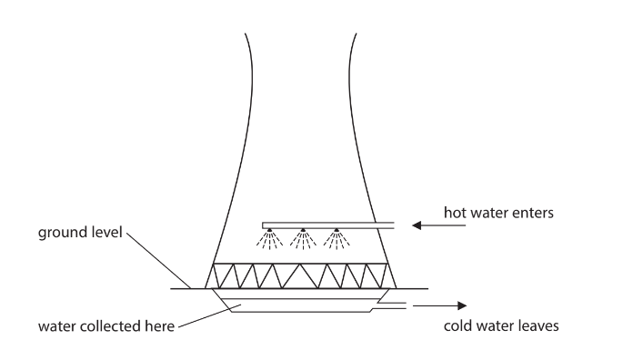
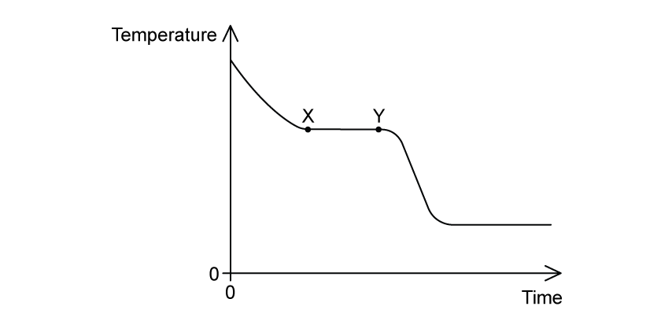
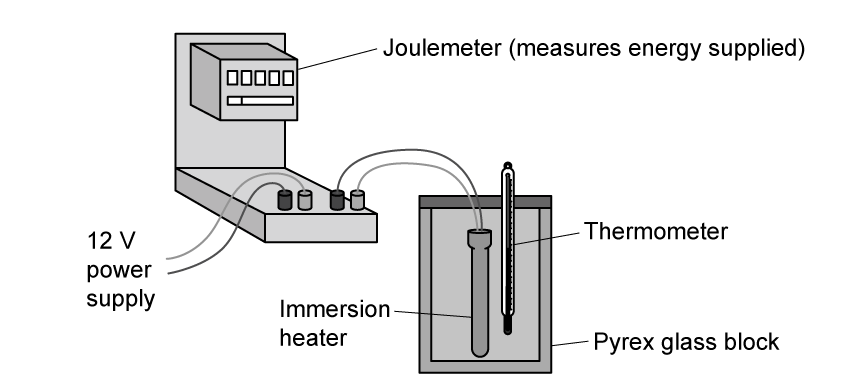
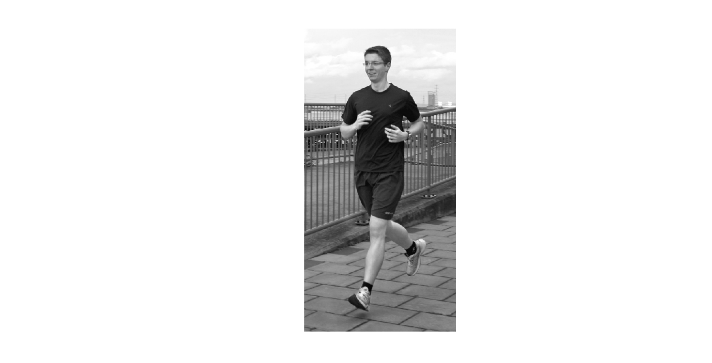
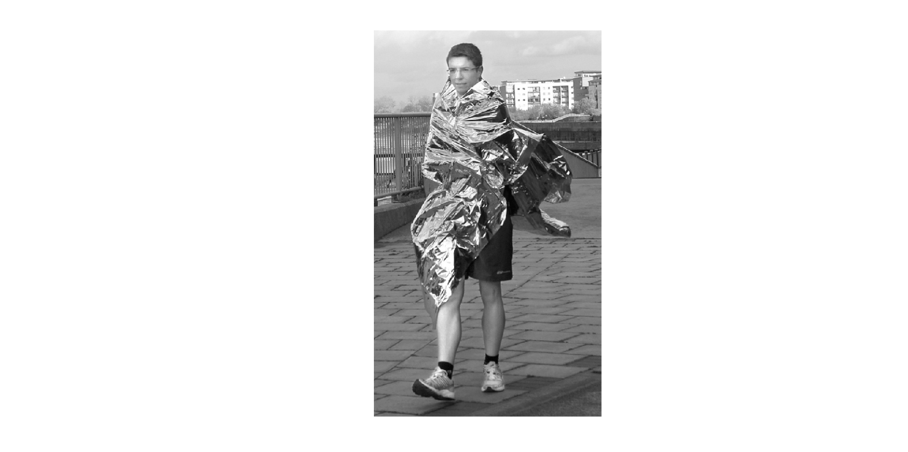
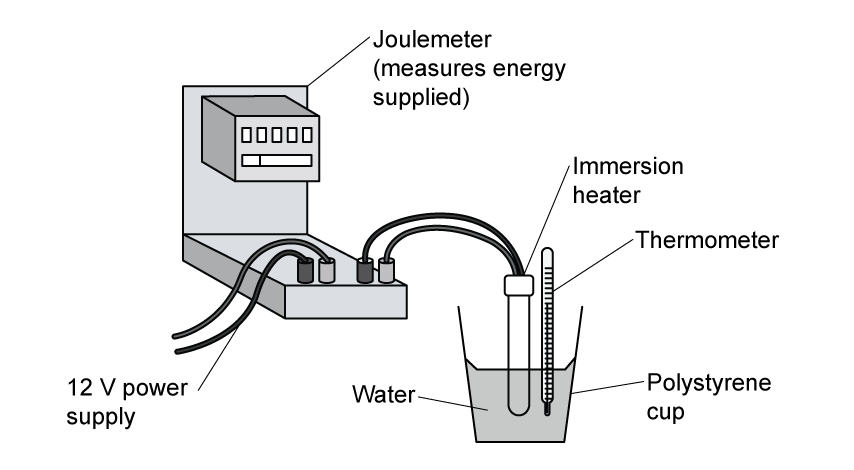

# Exam Questions — Changes of State
**5. Solids, Liquids & Gases** · Edexcel IGCSE Physics (4PH1)
> Source: [https://www.savemyexams.com/igcse/physics/edexcel/19/topic-questions/5-solids-liquids-and-gases/5-2-changes-of-state/exam-questions/](https://www.savemyexams.com/igcse/physics/edexcel/19/topic-questions/5-solids-liquids-and-gases/5-2-changes-of-state/exam-questions/) · 15 questions · total 116 marks

## Q1 — easy — 7 marks · exam-questions

### 1((a)) — 4 marks — command: complete — structured — from paper June 2014 · 2P
A student investigates ice, water and steam.

She heats up a sample of ice.

When it has all melted, she carries on heating until the water has all boiled to steam.

Complete the diagram to show how the particles are arranged in ice, water and steam.

One particle in each box has been drawn for you.

### 1((b)) — 3 marks — command: complete — structured — from paper June 2014 · 2P
Complete the table by describing how the particles move in ice, water and steam.

| **Substance** | **How the particles move** |
|---|---|
| ice |   |
| water |   |
| steam |   |

## Q2 — easy — 6 marks · exam-questions

### 1() — 6 marks — command: state — structured
The change in thermal energy, Δ*Q* is given by the equation:

$ΔQ=mcΔT$

State the definition of the following variables and an appropriate unit for each:

(i) *m*

(ii) *c*

(iii) Δ*T*

## Q3 — easy — 6 marks · exam-questions

### 3((a)) — 2 marks — command: draw — structured — from paper January 2016 · 2P
The particles in the different states of matter behave differently.

Draw a straight line linking each state of matter with the description of its particles.

### 2() — 4 marks — command: complete — structured
Hot water from the power station is sprayed into the cooling tower, as shown in the diagram. As it falls through the air, some of the hot water evaporates.

The rest of the water is collected and returned as cold water to the power station.

Complete the sentences by circling the correct words

The temperature of the particles is **directly / inversely** proportional to their average **kinetic / potential** energy

Energetic particles turn into **liquid / gas** as they leave the surface of the **liquid / gas**

Gas particles have a **higher / lower** average **kinetic / potential** energy than the particles in the liquid, therefore, they move **faster / slower**

The average **kinetic / potential** energy, and therefore temperature, of the remaining particles in the liquid **increases / decreases**

## Q4 — easy — 8 marks · exam-questions

### 1() — 3 marks — command: describe — structured
Describe the arrangement of the particles in a solid, a liquid and a gas.

### 2() — 3 marks — command: describe — structured
Describe the motion of the particles in a solid, a liquid and a gas.

### 3() — 1 mark — command: state — structured
During a dry day, a puddle on a road dries up and disappears.

State the name of the process which causes this to happen.

### 4() — 1 mark — command: describe — structured
Describe one change in the weather that would cause the puddle to dry up more quickly.

## Q5 — easy — 5 marks · exam-questions

### 1() — 1 mark — multiple_choice
A substance is cooled. The graph below shows how the temperature changes with time.

Which of the following correctly describes the physical change happening between X and Y on the graph?
- **A.** The gas is cooling
- **B.** The liquid is freezing
- **C.** The gas is condensing
- **D.** The liquid is cooling

### 2() — 1 mark — multiple_choice
A solid substance is heated at a constant rate. The graph shows how its temperature changes with time.

Which of the following regions of the graph represents the time when the substance is partially a liquid and partially a gas?
- **A.** V to W
- **B.** W to X
- **C.** X to Y
- **D.** Y to Z

### 3() — 3 marks — command: multiple — structured
A student pours 0.20 kg of water into a beaker. A thermometer placed in the water has a reading of 25 °C.

The temperature is monitored as ice is added to the beaker until the thermometer reads 0 °C.

(i) State the equation linking energy transferred, mass, specific heat capacity and change in temperature.

(ii) Calculate the amount of energy transferred by the water as it cools from 25 °C to 0 °C.

The specific heat capacity of water is 4200 J/kg °C.

energy transferred = .............................. J

## Q6 — medium — 7 marks · exam-questions

### 3((a)) — 4 marks — command: explain — structured — from paper 2016 June · 2P
A cooling tower is designed to transfer thermal energy away from a power station.

© Copyright Alan Murray-Rust

Thermal energy from the power station warms the air inside the cooling tower. Air enters through holes at the bottom of the cooling tower and leaves through the top.

Explain why the air moves as shown by the arrows.

### 8((b)) — 3 marks — command: explain — structured — from paper 2016 · 2P
Hot water from the power station is sprayed into the cooling tower, as shown. As it falls through the air, some of the hot water evaporates. The rest of the water is collected and returned as cold water to the power station.

Explain how evaporation cools the water.

## Q7 — medium — 4 marks · exam-questions

### 3((a)) — 1 mark — command: convert — structured — from paper Jun 2013 · 2P
James Dewar was a scientist who investigated liquid oxygen.

He discovered that the boiling point of liquid oxygen is –183 °C.

Convert –183 °C to a temperature on the Kelvin scale.

temperature = .......................

### 3((a)) — 3 marks — command: describe — structured — from paper June 2013 · 2P
Use ideas about particles to describe the changes that happen when a liquid boils to form a gas.

## Q8 — medium — 8 marks · exam-questions

### 1() — 3 marks — command: state — structured
The rate of evaporation of a liquid can be influenced by various factors.

State three factors that affect the rate of evaporation.

### 2() — 2 marks — command: explain — structured
A person falls into a lake. When they climb out they feel cold due to the evaporation of the water from their body.

Explain why evaporation makes the person feel cold.

### 3() — 3 marks — command: explain — structured
The person makes a cup of tea to get over the shock of falling into the water.

They heat water over a stove for 6 minutes until it boils, and continue to heat it for a further 3 minutes.

Explain how the temperature of the water changes during the 9 minutes of heating.

## Q9 — medium — 12 marks · exam-questions

### 1() — 3 marks — command: describe — structured
A lidded beaker contains water vapour.

Describe the movement of the particles in:

(i) The solid beaker

(ii) The water vapour

### 2() — 4 marks — command: sketch — structured
The water vapour is allowed to cool and the temperature is taken at regular intervals.

Sketch a graph to show the change in temperature with time.

### 3() — 2 marks — command: explain — structured
Explain what is meant by the specific heat capacity of a substance.

### 4() — 3 marks — command: calculate — structured
A mass of 170 g of water is needed to make a cup of masala chai tea which is brewed at an optimum temperature of 80 ºC. The water is boiled in a kettle from a temperature of 55 ºC from the tap.

The specific heat capacity of water = 4200 J kg–1 K–1.

Calculate the energy needed to boil the water to make a cup of masala chai tea.

energy needed = ....................................... J

## Q10 — medium — 9 marks · exam-questions

### 1() — 1 mark — command: state — structured
State what is meant by the term **specific heat capacity.**

### 2() — 5 marks — command: describe — structured
A scientist wishes to determine the specific heat capacity of Pyrex glass, which is often used in cooking equipment.

Describe a suitable method to find the specific heat capacity of the Pyrex glass block.

### 3() — 3 marks — command: calculate — structured
The scientist heats the 1.5 kg block of Pyrex glass.

The temperature of the glass block increases to 35°C from 20°C.

The energy supplied to the glass block was measured to be 18 900 J.

Calculate the specific heat capacity of the Pyrex glass.

## Q11 — hard — 10 marks · exam-questions

### 3((b)) — 6 marks — command: explain — structured — from paper January 2014 · 2P
These are some observations about samples of ice, water and steam.

|   | **Shape** | **Size** |
|---|---|---|
| ice | keeps a fixed shape | keeps a fixed size |
| water | takes the shape of the container | keeps a fixed size |
| steam | takes the shape of the container | fills the container |

Explain each of the observations in terms of the arrangement and motion of the particles.

### 3((b)) — 4 marks — command: multiple — structured — from paper January 2016 · 2P
Ethyne is a substance that is a gas at room temperature. At a temperature of -81 °C, ethyne can exist as a solid, a liquid or a gas.

This temperature is called the triple point of ethyne.

(i) Complete the table by giving the missing temperatures.

|   | **Temperature in °C** | **Temperature in kelvin** |
|---|---|---|
| room temperature |   | 291 |
| triple point of ethyne | -81 |   |

(ii) State what happens to the average kinetic energy of the gas molecules as the temperature is lowered from room temperature to the triple point of ethyne.

(iii) State what happens to the volume of an ethyne molecule when the gas changes to a solid at the triple point.

## Q12 — hard — 7 marks · exam-questions

### 4((a)) — 3 marks — command: explain — structured — from paper January 2012 · 2P
The picture shows a runner.

As he runs, the runner gets hot. To avoid overheating, his body sweats. As the sweat evaporates, it cools his body.

Use ideas about particles to explain why evaporation leads to cooling.

### 4((b)) — 4 marks — command: multiple — structured — from paper January 2014 · 2P
At the end of a long race, runners are given a shiny foil sheet to wear.

This stops them cooling down too quickly.

(i) Suggest why a runner might cool down too quickly if he does not wear a foil sheet.

(ii) Explain how the foil sheet reduces heat loss.

## Q13 — hard — 4 marks · exam-questions

### 1() — 2 marks — command: calculate — structured
A mass of 250 g of water is needed to make a cup of tea. An input of 85 kJ is needed to boil the water.

Calculate the initial temperature of the water.

Specific heat capacity of water = 4200 J kg–1 K–1.

** **initial temperature = ............................. ºC

### 2() — 2 marks — command: state — structured
Most kettles take between 1 to 4 minutes to boil, depending on the amount of water.

If water had a lower specific heat capacity, state **two** differences this would make to boiling water in an electric kettle.

## Q14 — hard — 7 marks · exam-questions

### 1() — 1 mark — multiple_choice
This question is about determining the specific heat capacity of aluminium.

A block of aluminium has a mass of 0.32 kg and an initial temperature of 30 °C. The block is heated until it has a temperature of 75 °C. This takes 2.5 minutes.

What is the average thermal power transferred away from the metal block?

You may take the specific heat capacity of aluminium to be 900 J kg−1 K−1.
- **A.** 56 W
- **B.** 75 W
- **C.** 86 W
- **D.** 112 W

### 2() — 6 marks — command: describe — structured
A student wants to determine the specific heat capacity of aluminium. They use the apparatus shown in the diagram.

** **

A piece of string is tied to the aluminium block so it can be transferred from the boiling water to the cold water.

Describe how this apparatus could be used to determine the specific heat capacity of aluminium.

Your answer should include:

- any additional pieces of equipment required

  - how to obtain the necessary measurements
  - how the measurements should be used to calculate the specific heat capacity of aluminium

## Q15 — hard — 16 marks · exam-questions

### 1() — 7 marks — command: multiple — structured
The specific heat capacity of water can be measured using the apparatus in the diagram:

(i) State the variables which need to be measured to calculate the specific heat capacity of water.

(ii) Explain how you would measure one of these variables.

(iii) State three ways the experiment could be improved.

### 2() — 4 marks — command: plot — structured
The temperature of the water is recorded every minute for 6 minutes.

| **Time (mins)** | **Temperature (°C)** |
|---|---|
| 0 | 20 |
| 1 | 31 |
| 2 | 39 |
| 3 | 40 |
| 4 | 61 |
| 5 | 70 |
| 6 | 82 |

Plot a graph of the results.

### 3() — 3 marks — command: multiple — structured
(i) Circle the anomalous point on the graph.

(ii) State what the student should do with the anomalous reading.

### 4() — 2 marks — command: predict — structured
Predict the temperature at:

(i) 8 minutes

(ii) 9 minutes
