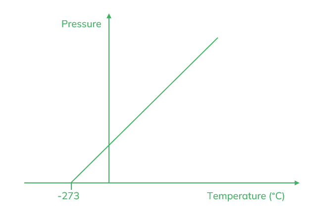
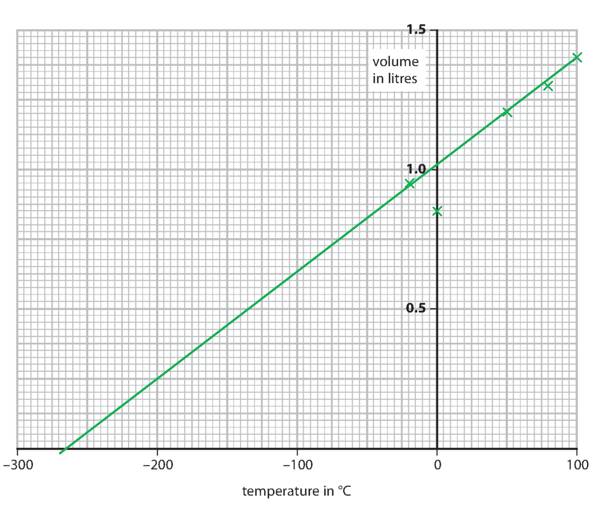
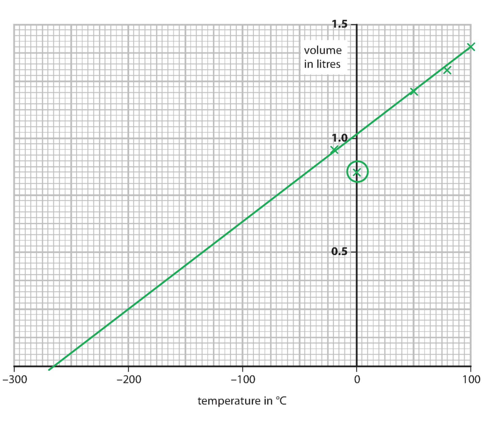
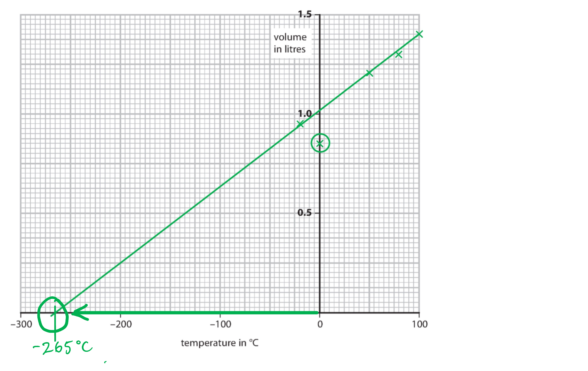
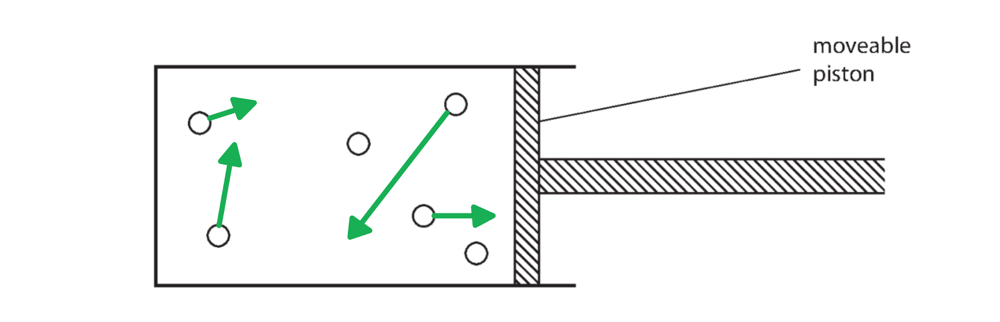
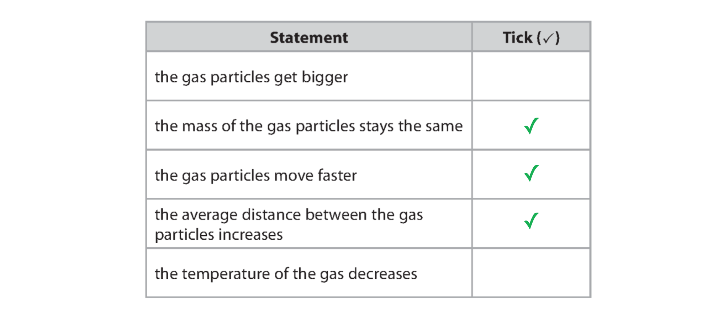
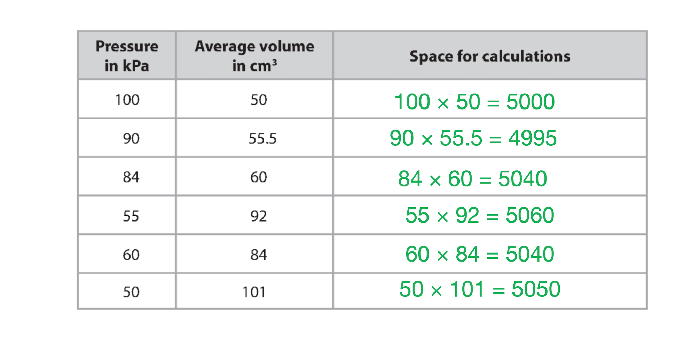

# Mark Schemes — Ideal Gases
**5. Solids, Liquids & Gases** · Edexcel IGCSE Physics (4PH1)

## Q1 — easy — 4 marks · exam-questions

### 1() — 1 marks
**Correct answer: B** — collide with the container walls with more force

**Final answer:** **The correct answer is ****B ****because:**

- As the gas is heated, the particles gain energy

  - As a result, the particles will move faster and the space between them increases
  - Therefore, the particles will collide with the walls of the container with a greater force

- This is answer **B**

**A** is incorrect as the size of the particles cannot be altered by a change in temperature

**C** is incorrect as particles would move closer together if the temperature decreased

**D** is incorrect as particles would move slower if the temperature decreased

### 2() — 1 marks
**Correct answer: B** — move slower

**Final answer:** **The correct answer is ****B ****because: **

- When gas particles are cooled:

  - They lose kinetic energy
  - So move around slower

- Hence, the correct answer is **B **

**A **is incorrect as it is the **space between** the particles that **increases** as they move around faster and not the particles themselves that expand

**C **is incorrect as the bung is **sealed** so the particles in the gas can **not evaporate**

**D **is incorrect as when cooled, **particles lose kinetic energy **rather than gain it. kinetic energy = $\frac{1}{2}mv^{2}$ so the faster the particles move, then the higher the kinetic energy as kinetic energy ∝ *v*2

- Be aware that this **increase in movement** causes:

  - More collisions between the particles and the walls of the boiling tube
  - So also** increases **the **pressure** of the gas

### 3() — 2 marks
(i) The correct order from least to most dense is:

- A → B → C **[1 mark]**

(ii) Explain this choice:

Any **one** from:

- **C** has more / the most particles (for the same volume); **[1 mark]**
- **A** has fewer / the least particles (for the same volume); **[1 mark]**
- **C** has particles closest together / least spread out / most tightly packed; **[1 mark]**
- **A** has particles furthest apart / most spread out / least tightly packed; **[1 mark]**
- **C** = solid, **B** = liquid, **A** = gas; **[1 mark]**

**[Total: 2 marks]**

> *In a **solid**:*

- *High density** – the particles are closely packed in a **regular structure*
- *The particles vibrate about **fixed positions*

> *In a **liquid**:*

- *Moderate density** – the particles are **closely packed** but in a **random structure*
- *The particles can **flow** over one another*

> *In a **gas**:*

- *Low density** – the particles are **far apart*
- *The particles **move randomly*

## Q2 — easy — 9 marks · exam-questions

### 1() — 1 marks
**Correct answer: C** — Volume decreases and pressure increases

**Final answer:** **The correct answer is ****C**** because:**

- As the piston is pushed inwards, the volume of air inside the syringe **decreases**

  - This eliminates rows **B** and **D**

- The air molecules are compressed into a smaller volume, so they will collide more frequently with the walls of the syringe
- The higher frequency of collision means there is a higher **force** per unit **area**
- Since $pressure=\frac{force}{area}$ (force per unit area), this means the pressure **increases**

  - This is row **C**

It is important to think in terms of the **frequency** of collisions between the molecules and the walls of the syringe

- This creates a greater **rate of change in momentum**
- From the forces topic, remember the **force** is equal to the **rate of change in momentum** `open parentheses F space equals fraction numerator straight capital delta p space over denominator straight capital delta t end fraction close parentheses`
- Therefore, the more frequent the collisions, the greater the force (per unit area)

### 2() — 4 marks
The correct sentences are:

- Molecules in a gas are in constant random motion at **high** speeds; **[1 mark]**
- Random motion means that the molecules do not travel in a specific path and undergo sudden changes in their motion if they collide with the **walls** of its container; **[1 mark]**
- or with other** ****molecules**;** [1 mark]**
- The random motion of tiny particles in a fluid is known as **Brownian **motion; **[1 mark]**

**[Total: 4 marks]**

### 3() — 4 marks
(i) Define absolute zero:

- The <u>temperature</u>; **[1 mark]**
- at which the molecules in a substance have <u>zero kinetic energy</u>; **[1 mark]**

(ii) State the value of absolute zero including a unit

- −273 **[1 mark] **°C** [1 mark] ****OR**
- 0** [1 mark] **K** [1 mark]**

**[Total: 4 marks]**

> *It is essential you memorise the value of absolute zero in °C as you may be asked to use this to convert from degrees to Kelvin.*

## Q3 — easy — 9 marks · exam-questions

### 1() — 1 marks
**Correct answer: D** — the volume of the air inside the cylinder

**Final answer:** **The correct answer is ****D**** because:**

- A gas will expand to fill the whole volume of the container
- Therefore the volume of air increases when the piston is moved in this direction

**A** is incorrect as the rate of collisions decreases as the air particles are more spaced out in the larger volume

**B** is incorrect as the pressure decreases because there are fewer collisions per second so the force on the container walls decreases

**C** is incorrect as no air is removed or added to the cylinder. The number of particles and therefore the mass of air remains constant

### 2() — 4 marks
(i) State the angle that this outward force makes with the wall of the tube:

- 90° / right angles / perpendicular; **[1 mark]**

** **

(ii) The equation linking the initial pressure, initial volume, final pressure and final volume is:

- Initial pressure × initial volume = Final pressure × final volume **OR ** $P_{1}V_{1}=P_{2}V_{2}$ **[1 mark]**

(iii) Calculate the final volume of air inside the tube:

List the known quantities:

- Atmospheric pressure, $P_{1}$ = 100 000 Pa
- Tube pressure, $P_{2}$ = 360 000 Pa
- Volume in the atmosphere, $V_{1}$ = 3.2 L

Substitute the known quantities:

- $P_{1}V_{1}=P_{2}V_{2}\RightarrowV_{2}=\frac{P_{1}V_{1}}{P_{2}}$
- $V_{2}=\frac{100000\times3.2}{360000}$ **[1 mark]**
- Final volume = 0.89 L **[1 mark]**

**[Total: 4 marks]**

### 3() — 4 marks
The correct sentences are:

- When the air in the bicycle pump is compressed, the **volume**** **of the gas decreases and the **pressure** increases; **[1 mark]**
- This is because the particles are moving in less space and collide **more often**; **[1 mark]**
- The **increased** pressure leads to an increase in temperature. This is because the temperature is a measure of the average **kinetic** energy of particles; **[1 mark]**
- When the air in the bicycle pump is compressed, this** ****increases**** **the energy in the **kinetic** store of the air particles and contributes to the overall **thermal**** **energy stored in the system, this is why the bicycle pump gets warm; **[1 mark]**

**[Total: 4 marks]**

## Q4 — easy — 5 marks · exam-questions

### 1() — 1 marks
**Correct answer: B** — 

**Final answer:** **The correct answer is ****B**** because:**

- If the pressure increases then the number of collisions with the walls of the container must have increased

The increase in pressure is due to increased collisions with the walls of the containers

### 2() — 1 marks
Convert 19 °C to kelvin:

- θ (°C) = T (K) − 273
- T (K) = 19 + 273 = 292 K **[1 mark]**

**[Total: 1 mark]**

> *Absolute zero, which is zero kelvin is at − 273 °C.*

> *Picture a number line if you need help remembering when to add and when to subtract 273 from your starting value.*

### 3() — 3 marks
(i) The equation linking the initial pressure, initial volume, final pressure and final volume of a gas is:

- Initial pressure × initial volume = Final pressure × final volume **OR** $P_{1}V_{1}=P_{2}V_{2}$ **[1 mark]**

(ii) Calculate the final pressure of the gas in the large balloon:

List the known quantities:

- Initial pressure, $P_{1}$ = 6.00 MPa
- Initial volume, $V_{1}$ = 10.5 cm3
- Final volume, $V_{2}$ = 1100 cm3

Substitute in known values and calculate *P*2:

- $P_{1}V_{1}=P_{2}V_{2}\RightarrowP_{2}=\frac{P_{1}V_{1}}{V_{2}}$
- $P_{2}=\frac{6.00\times10.5}{1100}$ **[1 mark]**
- Final pressure = 0.06 MPa **[1 mark]**

**[Total: 3 marks]**

## Q5 — easy — 10 marks · exam-questions

### 1() — 2 marks
An 'ideal gas' is defined as a gas which:

Any **two** from:

- Has molecules with no / negligible volume; **[1 mark]**
- Collides elastically / contains molecules which do not deform; **[1 mark]**
- Has no interactions between the molecules (except during collisions); **[1 mark]**
- Obeys the (ideal) gas laws / Boyles law / Charles’ law / Pressure law;** [1 mark]**
- (Obeys the gas laws) at all temperature / pressures; **[1 mark]**

**[Total: 2 marks]**

### 2() — 5 marks
Correctly completed sentences are:

- If the temperature of the gas increases, the kinetic energy of the molecules **increases**, hence, the average velocity of the molecules **increases**; **[1 mark]**
- As a result, the frequency of the collisions** ****increases**; **[1 mark]**
- This leads to a **larger** change in momentum in each collision; **[1 mark]**
- Since force is **directly**** **proportional to the change in momentum, a greater change in momentum leads to an** ****increase** in the force exerted by the molecules **on** the walls of the container; **[1 mark]**
- Since pressure is **directly** proportional to the force, this leads to an** ****increase**** **in the pressure of the gas; **[1 mark]**

**[Total: 5 marks]**

### 3() — 3 marks
A correctly labelled sketch graph would look like:

- Straight line drawn with positive gradient; **[1 mark]**
- Line meets the temperature axis at a negative value; **[1 mark]**
- (Absolute zero value) −273 °C correctly labelled; **[1 mark]**

**[Total: 3 marks]**

## Q6 — easy — 6 marks · exam-questions

### 1() — 1 marks
**Correct answer: D** — Decrease the size of the box

**Final answer:** **The correct answer is D**

- Density is mass divided by volume, so it is proportional to mass and inversely proportional to volume
- Decreasing the size of the box decreases the volume, which increases the density

**A** is incorrect because heating a sealed rigid box changes neither the mass nor the volume of the gas, so the density is unchanged

**B** is incorrect because increasing the size of the box increases the volume, which decreases the density

**C** is incorrect because removing gas decreases the mass, which decreases the density

### 2() — 1 marks
**Correct answer: A** — Temperature doubles

**Final answer:** **The correct answer is A**

- For a fixed mass of gas at constant volume, pressure is directly proportional to temperature
- Doubling pressure will also double temperature

### 3() — 1 marks
**Correct answer: C** — Pressure halves

**Final answer:** **The correct answer is C**

- For a fixed mass and temperature of gas, pressure is inversely proportional to volume
- Doubling volume will halve pressure

### 4() — 1 marks
**Correct answer: B** — Average speed has increased by a factor of 4

**Final answer:** **The correct answer is B**

- The Kelvin temperature of a gas is proportional to the average kinetic energy of the particles

  - Average kinetic energy is proportional to the square of the average speed of the particles
  - Therefore Kelvin temperature is proportional to the square of the average speed of the particles
- If Kelvin temperature has increased by a factor of 16, the square of the average speed of the particles has also increased by a factor of 16
- This means the average speed has increased by a factor of $\sqrt{16}=4$

### 5() — 2 marks
To calculate the temperature in kelvin:

- Recall the relationship between the Celsius and the kelvin scales

$0 \text{°C} = 273 \text{K}$

- Add 273 to the temperature in degrees Celsius

Temperature = `\left(273 + 87\right) \text{ K}` **[1 mark]**

Temperature = $360 \text{K}$ **[1 mark]**

> **[mark-scheme]**
> 1 mark for a correct conversion method, adding 273 to 87, whether or not the step is written out
> 
> 1 mark for the final answer of 360 K
> 
> 360.15 K is also accepted, from using 273.15

> **[exam-tip]**
> Give the unit as K on its own. The kelvin is not a degree, so it takes no degree symbol and is never written as "degrees kelvin".
> 
> Add 273 going from Celsius to kelvin, and subtract it coming back the other way. Sense-check the result: for any everyday temperature the kelvin value is the larger number.

## Q7 — medium — 4 marks · exam-questions

### 4((b)) — 1 marks
To find 500°C in kelvin:

- 0°C = 273 K
- 500°C = 273 + 500 = 773 K **[1 mark]**

**[Total: 1 mark]**

### 4((b)) — 3 marks
To calculate the pressure of the helium as it leaves the reactor:

List the known quantities:

- Initial temperature *T**1* = 773 K (from part (a))
- Final temperature *T**2* = 1170 K
- Initial pressure *P**1* = 8.40 MPa

From the equation sheet:

- $\frac{P_{1}}{T_{1}}=\frac{P_{2}}{T_{2}}$

Substitute in known values:

- $\frac{8.4}{773}=\frac{P_{2}}{1170}$ **[1 mark]**

Rearrange to make *P*2 the subject:

- $P_{2}=\frac{8.40}{773}\times1170$ **[1 mark]**

Evaluate *P*2:

- *P*2 = 13 MPa **[1 mark]**

**[Total: 3 marks]**

> *If °C is used instead of K then a maximum of 2 marks can be awarded. Error carried forward from part (a) is also allowed to gain 3 marks.*

## Q8 — medium — 6 marks · exam-questions

### 2((b)) — 2 marks
Describe what happens to the average kinetic energy of particles as the temperature decreases from 10 K towards 0 K:

- The average <u>kinetic energy</u> of the particles <u>decreases</u> as the temperature falls; **[1 mark]**

And any **one** from:

- The particles move slower; **[1 mark]**
- At 0 K the particles have no kinetic energy; **[1 mark]**
- At 0 K the particles are not moving; **[1 mark]**

**[Total: 2 marks]**

### 2((c)) — 4 marks
(i) Convert a temperature of 27 °C into kelvin (K):

- To convert °C into K, add 273
- 27 + 273 = 300 K **[1 mark]**

(ii) Calculate the new pressure when the temperature of the gas rises to 81°C:

List the known quantities:

- Initial pressure,* P*1 =  210 kPa
- Initial temperature, *T*1 = 27 °C
- Final temperature, *T*2 = 81 °C

From the equation sheet:

- Pressure law, $\frac{P_{1}}{T_{1}}=\frac{P_{2}}{T_{2}}$

Convert the temperatures to K:

- Initial temperature, *T*1 = 300 K (from part (i)
- Final temperature, *T*2 = 81 + 273 = 354 K** [1 mark]**

Convert kPa to Pa:

- Initial pressure,* P*1 =  210 × 1000 = 210 000 Pa

Rearrange the pressure law to make *P*2 the subject:

- $P_{2}=\frac{P_{1}T_{2}}{T_{1}}$

Substitute the known values and calculate *P*2:

- $P_{2}=\frac{210000\times354}{300}$ **[1 mark]**
- *P*2 = 247 800 Pa / 248 kPa / 250 kPa **[1 mark]**

**[Total: 4 marks]**

## Q9 — medium — 12 marks · exam-questions

### 10((a)) — 9 marks
(i) Explain how the air inside the can causes a pressure on the balloon fabric:

Any **three** from:

- Idea of continuous random movement; **[1 mark]**
- Collisions / impact with the walls / fabric; **[1 mark]**
- Idea that a force is produced (on the fabric by the bombarding molecules); **[1 mark]**
- Idea of a pressure resulting from a force over an area; **[1 mark]**

**An example of a question that would score 3 marks:**

- Air molecules are in a gaseous state and move randomly; **[1 mark]**
- This leads to particles continuously colliding with the inside of the balloon fabric; **[1 mark]**
- These collisions produce a force on the fabric's area, so a pressure is exerted on the fabric; **[1 mark]**

(ii) Explain what happens to the different parts of the model when the atmospheric pressure increases:

Any **four **from:

- Pressure inside the can stays constant (because it is sealed); **[1 mark]**
- There is a <u>pressure difference</u> across the fabric (between the inside and outside of the can); **[1 mark]**
- (There is a resultant) force acting <u>down</u> on the fabric; **[1 mark]**
- Balloon fabric moves down / becomes concave; **[1 mark]**
- The free end of the pointer moves up; **[1 mark]**

**OR**

- The taped end of the pointer moves down; **[1 mark]**

(iii) Suggest two ways that the model could be altered to increase its sensitivity to changes in atmospheric pressure:

Any **two **from:

- Longer pointer / lever; **[1 mark]**
- Narrower can diameter; **[1 mark]**
- More stretchy material; **[1 mark]**
- Less taut material; **[1 mark]**

**[Total: 9 marks]**

### 10((b)) — 3 marks
(i) State how heating the can affects the reading shown by the pointer:

Any **one** from:

- Heating the can results in a lower reading; **[1 mark]**
- (The right end of the) pointer goes <u>down</u>; **[1 mark]**
- The <u>left</u> end of the pointer goes <u>up</u>; **[1 mark]**

(ii) Explain why this happens:

State how the pressure inside the can is affected:

- (Pressure in the can) increases; **[1 mark]**

Explain why this occurs:

Any **one** from:

- Particles (inside the can) move <u>faster</u> / have <u>more kinetic energy</u>; **[1 mark]**
- (Therefore) particles hit the balloon fabric <u>more frequently</u>; **[1 mark]**
- (And) with <u>greater force</u> (because they are moving faster); **[1 mark]**

**[Total: 3 marks]**

## Q10 — medium — 9 marks · exam-questions

### 10((a)) — 3 marks
Explain how a gas exerts pressure on the inside of a container:

Any **three **from:

- Particles are in constant <u>motion</u> / have <u>kinetic energy</u>; **[1 mark]**
- In <u>random</u> directions; **[1 mark]**
- <u>Colliding</u> with container <u>walls</u>; **[1 mark]**
- This exerts a <u>force on the walls</u>; **[1 mark]**
- Pressure is a force over an area **OR **$pressure=\frac{force}{area}$ **[1 mark]**

**[Total: 3 marks]**

### 10((b)) — 3 marks
(i) State how increasing the temperature of the compressed air would affect the pressure in the can:

- Pressure inside the can would <u>increase</u>; **[1 mark]**

(ii) Explain why:

- (A higher temperature) would <u>increase</u> (average) particle speed / kinetic energy; **[1 mark]**
- Particles collide with the walls <u>of the can</u> <u>more frequently</u> / at a <u>higher speed</u> / with <u>more force</u> / <u>harder</u>; **[1 mark]**

**[Total: 3 marks]**

### 10((c)) — 3 marks
List the known quantities:

- Volume in can, *V**1* = 400 cm3
- Pressure in can, *P**1* = 5 × atmospheric pressure = 5 atm
- Pressure of air when released, *P**2* = 1 × atmospheric pressure = 1 atm

Recall the pressure and volume relationship at constant temperature:

- $P_{1}V_{1}=P_{2}V_{2}$ **[1 mark]**

Rearrange this equation for *V**2* :

- $P_{1}V_{1}=P_{2}V_{2}$
- Divide both sides by *P**2*, giving* *$\frac{P_{1}V_{1}}{P_{2}}=\frac{P_{2}V_{2}}{P_{2}}$
- `fraction numerator down diagonal strike down diagonal strike P subscript 2 end strike end strike V subscript 2 over denominator down diagonal strike P subscript 2 end strike end fraction space equals space V subscript 2`
- $V_{2}=\frac{P_{1}V_{1}}{P_{2}}$

Substitute the known quantities into this equation:

- $V_{2}=\frac{P_{1}V_{1}}{P_{2}}$
- $V_{2}=\frac{5\mathrm{atm}\times400}{1\mathrm{atm}}$ **[1 mark]**

Calculate the total volume of air delivered to the diver over time:

- `V subscript 2 space equals space fraction numerator 5 space atm space cross times space 400 over denominator 1 space atm end fraction space equals space 2000 space open parentheses cm cubed close parentheses` **[1 mark]**

**[Total: 3 marks]**

## Q11 — medium — 7 marks · exam-questions

### 3((a)) — 2 marks
Recall the conversion from °C to kelvin:

- 0°C = 273 K
- A single degree Celsius has the same size as a single kelvin
- To move from K to °C, subtract 273 from the temperature
- To move from °C to K, add 273 to the temperature

For liquid nitrogen, convert 77 K to °C:

- 77 - 273 = <u>−196 °C</u> **[1 mark]**

For water, convert 100 °C to K:

- 100 + 273 = <u>373 K</u> **[1 mark]**

**[Total: 2 marks]**

### 3((b)) — 5 marks
(i) Draw a graph to show how the volume of gas varies with temperature:

- Values from the table plotted correctly to one half-square; **[2 marks]**
- Line of best fit intersects the x-axis at a temperature between −250 °C and −300 °C; **[1 mark]**

(ii) Circle the anomalous point on your graph:

- Data point at (0, 0.85) <u>circled</u> / <u>indicated</u> otherwise on the graph; **[1 mark]**

(iii) Use your graph to find the temperature of the gas when its volume is zero:

Read the value of the x-axis when the line has a y-coordinate of 0:

- A reading from <u>your line</u> of best fit, to the nearest small square (±5 °C); **[1 mark]**

  - In the example above, this would be a range from −260 to −270 °C, as the line passes through −265 °C

**[Total: 5 marks]**

## Q12 — medium — 9 marks · exam-questions

### 3((a)) — 2 marks
Complete the diagram with arrows to show random motion:

An example of a diagram that would gain 2 marks:

- Minimum of <u>three straight arrows</u> for <u>different</u> particles (with different lengths to represent different speeds); **[1 mark]**
- Arrows are in <u>different directions</u>; **[1 mark]**

**[Total: 2 marks]**

### 3((b)) — 3 marks
Explain how the motion of the gas particles produces a pressure inside the container:

Any **three** from:

- Particles collide / impact; **[1 mark]**
- With the sides / walls of the container; **[1 mark]**
- This produces a force; **[1 mark]**
- A pressure is a force over an area **OR**** **$pressure=\frac{force}{area}$ **[1 mark]**

**[Total: 3 marks]**

### 3((c)) — 1 marks
State how pressure changes when volume is decreased:

- The pressure would increase; **[1 mark]**

**[Total: 1 mark]**

> *This result is caused by an increased frequency of collisions with the walls. When the space between walls is reduced, a particle takes less time to collide with the walls as it has less distance to cover on average. An increased frequency of collisions means a greater average force on the walls every second. Pressure is a force over an area so this leads to a greater average pressure on the walls. *

### 3((d)) — 3 marks
The correct statements are:

- One mark for each correct tick;

**[Total: 3 marks]**

> *For these types of questions, it can be helpful to evaluate each statement one at a time. If you are ever unsure of a statement, move on to the next - you may be able to deduce the answer through a process of elimination.*

> *"The gas particles get bigger":*

> *Heating a gas affects the movement of the particles but does **not** affect the size or type of particle (short of nuclear fusion!). This statement is false. *

> *"The mass of the gas particles stays the same":*

> *The particles are sealed in a closed container, no particles are added or removed. This statement is true.*

> *"The gas particles move faster":*

> *When the container is heated, energy is transferred to the thermal store of the gas. This means that the average kinetic energy of the particles increases i.e. they move faster. This statement is true. *

> *"The average distance between the gas particles increases":*

> *The piston has moved outwards as a result of a greater force from the gas particles colliding with it. This gives the particles a greater volume of space to move around in and they spread out. When comparing tightly packed particles to spread out particles, the average distance between spread out particles is greater. This statement is true. *

> *"The temperature of the gas decreases": *

> *Temperature is a measure of the average kinetic energy of particles in a gas. Energy is transferred to the thermal store of the gas, which increases the average kinetic energy of the particles. This means the temperature of the gas increases. This statement is false. *

## Q13 — medium — 11 marks · exam-questions

### 8((a)) — 1 marks
Describe an increasing temperature's effect on average speed of air molecules:

- (average speed of air molecules) increases; **[1 mark]**

**[Total: 1 mark]**

### 8((b)) — 3 marks
Explain how the hot air causes this pressure.

Any **three** from:

- Particles undergo (continuous) <u>random</u> motion; **[1 mark]**
- These collide / impact; **[1 mark]**
- With the walls (of the container); **[1 mark]**
- A force is exerted on the walls (by the bombarding particles); **[1 mark]**
- Pressure is a force over an area **OR** $pressure=\frac{force}{area}$ **[1 mark]**

**[Total: 3 marks]**

### 8((c)) — 1 marks
State why the hottest air rises to the top of the balloon:

- <u>Convection</u> (currents move hot air upwards); **[1 mark]**

**OR**

- (Hot air is) <u>less dense</u>; **[1 mark]**

**[Total: 1 mark]**

### 8((d)) — 4 marks
(i) State the equation linking density, mass and volume:

- $density=\frac{mass}{volume}$ **OR**** **$ρ=\frac{m}{V}$ **[1 mark]**

(ii) Calculate the mass of hot air in the balloon:

List the known quantities:

- Average density of hot air *ρ* = 0.95 kg/m3
- Volume of this air *V* = 2800 m3

Rearrange the density equation to make mass the subject:

- $ρ=\frac{m}{V}$
- Multiply both sides by volume, *V* , to give $ρ\timesV=\frac{m}{V}\timesV$
- On the right hand side, `fraction numerator m over denominator down diagonal strike V end fraction space cross times space down diagonal strike V space end strike space equals space m`
- This leaves $m=ρ\timesV$ **[1 mark]**

Substitute values into this rearranged density equation:

- $m=ρ\timesV$
- $m=0.95\times2800$ **[1 mark]**

Calculate the mass:

- *m* = 2660 kg **[1 mark]**

**[Total: 4 marks]**

### 8((e)) — 2 marks
(i) Suggest a reason for the decrease in the outside air pressure as the balloon rises:

Any **one** from:

- Atmospheric density decreases with height; **[1 mark]**
- Depth (from the top of the atmosphere) decreases; **[1 mark]**
- Temperature is colder / molecules move slower; **[1 mark]**

(ii) Suggest how the decrease in air pressure outside the balloon affects the hot air inside:

Any **one** from:

- Air inside (the balloon) expands; **[1 mark]**
- (Hot) air escapes (the balloon); **[1 mark]**
- Hot air cools down / need to use the burner; **[1 mark]**

**[Total: 2 marks]**

> *Often, gases and liquids behave rather similarly. The atmosphere behaves much like a liquid in this case - it increases with depth from the "top" of the atmosphere. This means the pressure is highest at the "bottom" of the atmosphere (i.e. on the ground) and decreases as you move up.*

## Q14 — medium — 4 marks · exam-questions

### 8((b)) — 1 marks
State the value of absolute zero in °C:

- Absolute zero is <u>−273</u> (°C); **[1 mark]**

**[Total: 1 mark]**

### 8((a)) — 3 marks
Explain, in terms of its molecules, how a gas exerts a pressure on the walls of its container:

Any **three** from:

- Particles undergo (continuous) <u>random</u> motion; **[1 mark]**
- These collide / impact; **[1 mark]**
- With the walls (of the container); **[1 mark]**
- A force is exerted on the walls (by the bombarding particles); **[1 mark]**
- Pressure is a force over an area **OR** $pressure=\frac{force}{area}$ **[1 mark]**

**[Total: 3 marks]**

## Q15 — hard — 7 marks · exam-questions

### 6((a)) — 6 marks
(i) Explain how the gas particles produce pressure on the spray-can walls:

Any **three** from:

- The particles collide / impact (with walls); **[1 mark]**
- They are continuously bombarding / hitting (the walls); **[1 mark]**
- This produces / exerts a force on the walls; **[1 mark]**
- Pressure = force ÷ area;** [1 mark]**

(ii) Evaluate the conclusion that gas pressure decreases as liquid leaves the can:

Make an initial statement on the conclusion:

- The student is <u>correct</u> / pressure does <u>decrease</u>; **[1 mark]**

Explain why this is the case:

Any **two** from:

- As liquid leaves, the number of gas molecules / the mass of gas remains constant; **[1 mark]**
- The gas volume increases (as it expands into the space left by the liquid); **[1 mark]**
- Pressure is inversely proportional to volume **OR**** ***PV* = constant; **[1 mark]**
- Particles collide with the walls less frequently; **[1 mark]**

**[Total: 6 marks]**

### 6((b)) — 1 marks
State how temperature affects the speed of gas particles:

- (The average speed) increases; **[1 mark]**

**[Total: 1 mark]**

## Q16 — hard — 8 marks · exam-questions

### 14((a)) — 2 marks
To calculate the new pressure of the gas:

List the known quantities:

- Volume of high pressure gas container, *V**1* = 10 cm3
- Volume of space above cream, *V**2* = 270 cm3
- Pressure in high pressure gas container, *P**1* = 10 000 kPa

Rearrange the pressure and volume relationship for a gas at constant temperature:

- $P_{1}V_{1}=P_{2}V_{2}$
- Divide both sides by *V**2** , *$\frac{P_{1}V_{1}}{V_{2}}=P_{2}$

Substitute values into this equation:

- $P_{2}=\frac{P_{1}V_{1}}{V_{2}}$
- $P_{2}=\frac{10000\times10}{270}$ **[1 mark]**

Calculate the pressure in the space above the cream:

- $P_{2}=\frac{10000\times10}{270}$
- *P**2* = 370 kPa **[1 mark]**

**[Total: 2 marks]**

> *In this question, marks are awarded for substituting values correctly, and for the final answer - rearranging the equation does not gain marks. It is beneficial, however, to rearrange the equation while it is algebraic. *

> *This is useful for two reasons:*

> *Firstly, by rearranging the algebraic terms, we see easily how terms either side of the equation cancel out and other mathematical relations - these are very hard to spot if you have already condensed two numbers. For example, the equation below can be simplified my cancelling out mass terms, **m*

> * *`up diagonal strike m g h space equals space 1 half up diagonal strike m v squared`

$gh=\frac{1}{2}v^{2}$

> *These relationships can be crucial (for example, this one shows that a falling object's velocity is independent of its mass).*

> *If however, the numbers were already substituted in (e.g. mass is 10 kg, **g **= 10 m / s**2** and height, **h** is 5 m), this relationship is not clear to see*

> *                                                                      *$500=\frac{1}{2}\times10\timesv^{2}$

> *Secondly, most of the mathematical side of physics at a higher level is done algebraically - some equations can't be solved when numbers take the place of variables. A good example of this is calculus, which becomes useful when the values of each variable are constantly changing. It's good to get in the habit of being comfortable with algebra at this stage!*

### 14((b)) — 3 marks
State how the pressure changes:

- The pressure <u>decreases</u>; **[1 mark]**

Explain how a temperature decrease causes this:

Any **two** from:

- Molecules slow down / have less kinetic energy; **[1 mark]**
- The <u>collisions with container walls</u> are <u>less frequent</u>; **[1 mark]**
- There is a <u>smaller force</u> (on the same area); **[1 mark]**

**[Total: 3 marks]**

### 14((c)) — 3 marks
(i) Suggest how gas molecules dissolving affects the pressure of the gas:

State how the pressure in the space above the cream changes:

- (Pressure) decreases; **[1 mark]**

Explain why this is the case:

Any **one** from:

- (There are) <u>fewer molecules</u> (colliding with the container walls); **[1 mark]**
- There is a <u>smaller force</u> from the molecules; **[1 mark]**

(ii) Suggest what happens to the dissolved gas as the cream leaves the can:

Any **one** from:

The gas:

- Is dissolved and leaves (the liquid); **[1 mark]**
- Expands; **[1 mark]**
- Foams the liquid; **[1 mark]**

**[Total: 3 marks]**

## Q17 — hard — 6 marks · exam-questions

### 7((b)) — 3 marks
Explain why the air inside the tyre exerts pressure:

Any **three** from:

- Particles move with continuous <u>random movement</u>; **[1 mark]**
- This leads to <u>collisions / impact;</u> **[1 mark]**
- With the inside <u>walls</u> of the tyre; **[1 mark]**
- This exerts a <u>force</u> on the walls (from the bombarding particles); **[1 mark]**
- Pressure is a force on an area; **[1 mark]**

**[Total: 3 marks]**

### 7((c)) — 3 marks
Explain why the air pressure in the tyre increases when more air is pumped in:

Any **three** from:

- Now there are <u>more particles</u> in the tyre; **[1 mark]**
- (Because of the higher temperature,) molecules have a <u>greater speed / higher kinetic energy</u>; **[1 mark]**
- More collisions **OR** more frequent collisions **OR**** **harder impacts (with tyre walls); **[1 mark]**
- Therefore there is <u>more force</u> in the inside walls; **[1 mark]**

**[Total: 3 marks]**

## Q18 — hard — 10 marks · exam-questions

### 13((a)) — 6 marks
(i) Calculate the time the diver can breathe underwater:

List the known quantities:

- Volume in cylinder, *V**1* = 8 L
- Pressure in cylinder, *P**1* = 200 × atmospheric pressure = 200 atm
- Pressure of air delivered to the diver, *P**2* = 1 × atmospheric pressure = 1 atm
- Diver needs 16 L of air per minute

Recall the pressure and volume relationship at constant temperature:

- $P_{1}V_{1}=P_{2}V_{2}$ **[1 mark]**

Rearrange this equation for *V**2* :

- $P_{1}V_{1}=P_{2}V_{2}$
- Divide both sides by *P**2*, giving* *$\frac{P_{1}V_{1}}{P_{2}}=\frac{P_{2}V_{2}}{P_{2}}$
- `fraction numerator down diagonal strike down diagonal strike P subscript 2 end strike end strike V subscript 2 over denominator down diagonal strike P subscript 2 end strike end fraction space equals space V subscript 2`
- $V_{2}=\frac{P_{1}V_{1}}{P_{2}}$

Substitute the known quantities into this equation:

- $V_{2}=\frac{P_{1}V_{1}}{P_{2}}$
- $V_{2}=\frac{200\mathrm{atm}\times8}{1\mathrm{atm}}$ **[1 mark]**

  - Here, *V**2* represents the total volume of gas released if the tank is <u>completely</u> emptied

Calculate the total volume of air delivered to the diver over time:

- $V_{2}=\frac{200\mathrm{atm}\times8}{1\mathrm{atm}}=1600L$ **[1 mark]**

Determine how long it will take for the diver to use this volume of air:

- *Total volume of air* = *volume used per minute *× *time*
- The diver uses 16 L per minute and the total volume available is 1600 L

  - 1600 = 16 × *time*
  - *time *= $\frac{1600}{16}=100$
- The diver can breathe underwater for <u>100 minutes;</u> **[1 mark]**

(ii) Suggest why the bubbles expand as they rise to the surface:

Any **combination **from:

- Pressure decreases as depth decreases; **[1 mark]**
- *Pressure *= *density *× *depth *× *g ***[1 mark]**

**OR**

- *P *= *ρhg ***[1 mark]**
- *PV *= *constant ***[1 mark]**

**OR**

- Pressure is inversely proportional to volume; **[1 mark]**
- Bubbles join together as they rise; **[1 mark]**
- Temperature increases closer to the surface; **[1 mark]**

**[Total: 6 marks]**

### 13((b)) — 4 marks
(i) Suggest how the student could measure the volume of an inflated balloon:

**Method 1: displacement method**

- Submerge the balloon in a displacement can / measuring cylinder; **[1 mark]**
- Measure the volume of water displaced; **[1 mark]**

**OR**

**Method 2: volume method**

- Measure the radius / circumference / diameter of the balloon; **[1 mark]**
- Calculate the volume (using the equation for spherical volume); **[1 mark]**

(ii) Explain why the student’s plan will not work:

- This will <u>not</u> be a <u>fair test</u>; **[1 mark]**
- Volume **/ **temperature vary / increase (as well as pressure); **[1 mark]**

**[Total: 4 marks]**

> *In part (i), there are two options for measuring volume. Generally speaking, the displacement method works well for **irregularly shaped** objects because it is difficult or impossible to mathematically calculate their volume. When an object has a **regular** shape such as a cuboid or sphere, it is possible to calculate the volume by measuring length, radius, width etc.*

> *In the above example, balloons do not have a perfectly spherical shape in real life, so this method would be easier experimentally but **less accurate** in practice. *

> *The test outlined in part (ii) is a good example of why control variables must always be considered in an experiment. Only the dependent variable (the thing being measured) and independent variable (the thing being altered by the experimenter) can change value.*

> *If another variable changes, such as temperature or volume, we are no longer seeing the relationship between **just** the dependent and independent variables, as another variable is altering the dependent variable. *

## Q19 — hard — 10 marks · exam-questions

### 7((a)) — 4 marks
Explain why the cold balloon is smaller than the warmer one:

Any **four** from:

- Particles move at lower speed / kinetic energy; **[1 mark]**
- On <u>average</u>; **[1 mark]**
- Particles hit the sides of the container <u>less frequently</u> / with <u>less energy</u>; **[1 mark]**
- This <u>reduces force</u> / <u>pressure</u> (on the balloon); **[1 mark]**
- (Then) <u>tension</u> in the rubber / balloon material; **[1 mark]**
- <u>Pulls</u> the balloon material (into a smaller size); **[1 mark]**

**[Total: 4 marks]**

### 7((b)) — 6 marks
Identify faults in the student's plan:

Any **three** **pairs **of <u>corresponding</u> faults and improvements from:

- Different time in freezer does <u>not give a range of temperatures</u> / the freezer always cools to the <u>same temperature</u>; **[1 mark]**

  - Improve by using a water bath / freezers set to different temperatures to set a range of temperatures; **[1 mark]**

- Difficult to measure the temperature of a balloon / gas with a thermometer; **[1 mark]**

  - Improve by measuring the temperature of the balloon's surroundings / water bath / freezer; **[1 mark]**

- Measuring 'size' is vague / not specific; **[1 mark]**

  - Improve by measuring a better-defined quantity such as volume / length / diameter / circumference; **[1 mark]**

- Difficult to measure a balloon's "size" with a ruler; **[1 mark]**

  - Improve by measuring <u>volume by displacing water</u> **OR **<u>circumference using tape / string</u>; **[1 mark]**

- Repetitions do not make it a fair test; **[1 mark]**

  - Improve by controlling a variable such as initial balloon volume / time taken to record final volume; **[1 mark]**

- The balloon may warm up while being measured; **[1 mark]**

  - Improve by taking the final measurement <u>quickly</u>; **[1 mark]**

- Measurements may take different lengths of time; **[1 mark]**

  - Improve by doing the whole experiment at controlled temperature / take measurements in fridge / water bath; **[1 mark]**

**[Total: 6 marks]**

> *Marks can only be gained for improvements **corresponding** to the faults you initially stated. It is not possible to gain a mark from stating improvement 5 if you only identified faults 1, 2 and 4.*

> *When laying out your answer, it is best to group your fault with the improvement. This shows you have clearly considered the link between the two.*

## Q20 — hard — 9 marks · exam-questions

### 4((a)) — 3 marks
List the known quantities:

- Atmospheric pressure, *P**1* = 101 kPa
- Initial volume of air, *V**1* = 1700 L
- Final volume of air, *V**2* = 12 L

From the equation sheet:

- $P_{1}\timesV_{1}=P_{2}\timesV_{2}$

Rearrange the given equation (Boyle's Law) to make final pressure, *p**2* the subject:

- $P_{1}\timesV_{1}=P_{2}\timesV_{2}$
- Dividing both sides by *V**2* gives $\frac{P_{1}\timesV_{1}}{V_{2}}=\frac{P_{2}\timesV_{2}}{V_{2}}$
- Cancel out the *V**2* factor on the right to give `fraction numerator P subscript 1 space cross times space V subscript 1 over denominator V subscript 2 end fraction space equals space fraction numerator P subscript 2 space cross times space down diagonal strike V subscript 2 end strike over denominator down diagonal strike V subscript 2 end strike end fraction space equals space P subscript 2`
- $P_{2}=\frac{P_{1}\timesV_{1}}{V_{2}}$ **[1 mark]**

Substitute known quantities into this rearranged equation for Boyle's Law:

- $P_{2}=\frac{P_{1}\timesV_{1}}{V_{2}}$
- $P_{2}=\frac{101\times1700}{12}$ **[1 mark]**

Calculate the pressure of air inside the gas cylinder:

- $P_{2}=\frac{101\times1700}{12}$
- *P**2* = 14 000 (kPa) **[1 mark]**

**[Total: 3 marks]**

> *Note that the pressure given in this question does not need to be converted in any way. This is because the question asks for a pressure in the same units as those given in the question. *

### 4((b)) — 4 marks
(i) State the equation linking pressure difference, height, density and *g *:

- $Pressuredifference=density\timesg\timesheight$ **OR **$P=ρ\timesg\timesh$ **[1 mark]**

(ii) Calculate the increase in pressure when the diver descends from the surface to a depth of 11 m:

List the known quantities:

- Depth, *h* = 11 m
- *g* = 10 m/s2
- Density of seawater, *ρ* = 1028 kg/m3

Substitute the known quantities into the equation for pressure difference:

- $P=ρ\timesg\timesh$
- $P=1028\times10\times11$ **[1 mark]**

Calculate the pressure difference in kPa between the surface and a depth of 11 m:

- $P=1028\times10\times11$
- *P* = 113 000 Pa (to 3 significant figures)
- *P* = 113 kPa **[1 mark]**

(iii) Calculate the total pressure on the diver at a depth of 11 m:

List the known quantities:

- Atmospheric pressure = 101 kPa
- Pressure difference between surface and 11 m depth = 113 kPa (from part (ii))

Calculate the total pressure:

- `table row total row pressure end table space equals space table row atmospheric row pressure end table space plus space table row cell pressure space from end cell row water end table`
- Total pressure* * = 101 + 113
- Total pressure = 214 kPa **[1 mark]**

**[Total: 4 marks]**

> *Total pressure at depth often confuses people because you need to add the pressure caused by the water, plus the pressure 'on top' of the water.*

### 4((c)) — 2 marks
Explanation **1**: pressure

Describe the pressure changes as the bubble rises:

- Pressure decreases (as the bubbles rise); **[1 mark]**

**OR**** **

- *P* = *ρgh ***[1 mark]**

Explain how this affects volume:

Any **one** from:

- *pV* = constant **[1 mark]**
- *p**1**V**1** *= *p**2**V**2* **[1 mark]**
- Volume is <u>inversely proportional</u> to pressure; **[1 mark]**

**OR**

Explanation **2**: temperature

Describe the temperature changes as the bubble rises:

- The water may be warmer near the surface; **[1 mark]**

Explain how this affects volume:

- (Which causes the pressure inside the bubble to increase) which causes the bubble's volume to increase; **[1 mark]**

**[Total: 2 marks]**

> *For explanation **2**, the second mark is **dependent **in the first mark. You must make reference to temperature increasing before following it with the effect on volume. *

## Q21 — hard — 12 marks · exam-questions

### 12((a)) — 3 marks
(i) To calculate the missing value:

Known quantities:

- Loading volume = 90 cm3
- Average volume = 92 cm3

Use the equation to calculate the average:

- $Average=\frac{sumofquantities}{numberofquantities}$
- Label the unknown unloading volume as $x$, $92=\frac{90+x}{2}$

Rearrange this equation to determine $x$:

- $92=\frac{90+x}{2}$
- Multiply both sides by 2, giving $2\times92=90+x$
- Subtracting 90 from both sides gives `x space equals space open parentheses 2 space cross times space 92 close parentheses space minus space 90`
- $x=94$ **[1 mark]**

(ii) Suggest why the student takes readings both when adding weights to the platform, and then again when they remove them:

Any **two** from:

- Make results more reliable; **[1 mark]**
- Produce an average reading; **[1 mark]**
- Identify anomalous results; **[1 mark]**
- There may have been a temperature change (as a result of the increased pressure); **[1 mark]**
- There may have been friction in the syringe (in one direction, not the other); **[1 mark]**

**[Total: 3 marks]**

### 12((b)) — 6 marks
(i) Suggest a reason why the axes do not start from the origin (0,0):

Any **one** from:

- Reducing the scale fills more of the grid; **[1 mark]**
- The lowest value of pressure in 50 kPa; **[1 mark]**
- The lowest value of average volume is 50 cm3; **[1 mark]**
- Pressure cannot be zero; **[1 mark]**
- Volume cannot be zero; **[1 mark]**

(ii) Discuss which line is correct for this investigation:

State a point in favour of the straight line:

- The straight line has <u>an even distribution / the same number</u> of points either side of it; **[1 mark]**

State a point in favour of the curved line:

- All points lie (nearly) on the curve; **[1 mark]**

(iii) Suggest a way that the student could make this experiment valid:

Any **one** from:

- Maintain a constant temperature; **[1 mark]**
- Standardise the time between adding / removing weight and measuring volume; **[1 mark]**
- Keep apparatus identical between experiments; **[1 mark]**
- Ensure no air escapes / enters the syringe; **[1 mark]**

(iv) Suggest two ways in which the student could improve the quality of her data:

Any **two** from:

- Increase resolution / sensitivity of instruments; **[1 mark]**
- Take further readings with values <u>in between</u> those already taken; **[1 mark]**
- Take further readings <u>above and below</u> / to <u>increase the range</u> of data already taken; **[1 mark]**

**[Total: 6 marks]**

> *Part (ii) is a "discuss" question. This means you must make arguments for **both** options. No points are awarded for "it is the straight line" or "it is the curved line".*

> *In part (iii), you may be tempted to suggest repeat measurements. While this often works in exams, the student is **already** doing this in this particular question. Ensure you have a full repertoire of suggestions for improving an experiment's validity.*

### 12((c)) — 3 marks
Recall the relationship between pressure and volume from the equation sheet:

- pressure × volume = constant

Multiply the corresponding pressures and volumes in the table together:

- One value of *P × V* correctly calculated; **[1 mark]**
- A second value of *P × V* correctly calculated; **[1 mark]**

Write a concluding statement:

- (Pressure × volume = constant within the bounds of experimental error)
- These data <u>do validate</u> Boyle's Law / the relationship between pressure and volume; **[1 mark]**

**[Total: 3 marks]**
