# Mark Schemes — Magnetism & Electromagnetism
**6. Magnetism & Electromagnetism** · Edexcel IGCSE Physics (4PH1)

## Q1 — easy — 1 marks · exam-questions

### 2((c)) — 1 marks
**Correct answer: D** — steel

**Final answer:** **The correct answer is ****D ****because:**

- Steel is an alloy of iron

  - Iron is magnetic
  - Therefore, steel is magnetic

The only metals that are magnetic are iron, nickel and cobalt. Alloys containing these metals will also be magnetic, such as steel.

## Q2 — easy — 1 marks · exam-questions

### 1((b)) — 1 marks
**Correct answer: A** — the direction of a magnetic field

**Final answer:** **The correct answer is ****A ****because:**

- The arrows in a magnetic field line show the direction of the magnetic field

  - These lines always point from North poles to South poles
  - This is option **A**

**B **is incorrect as electrostatic attraction occurs between opposite charges, whereas **magnetic** field lines refer to the force between **magnetic** poles

**C **is incorrect as electric current is the rate of flow of charge, which requires charged particles, magnetic fields can still exist without moving charged particles being present

** D **is incorrect as magnetic field **strength** is represented by the **density of magnetic field lines** (i.e. how close together the lines are)

## Q3 — easy — 1 marks · exam-questions

### 2((d)) — 1 marks
**Correct answer: C** — 

**Final answer:** **The correct answer is ****C ****because:**

- The direction of a magnetic field is from the north pole to the south pole
- So the arrows should be pointing away from the north pole and towards the south pole
- This eliminates options **A*****,***** B** and **D **
- In option **C **the field lines are pointing away from the two north poles of the magnets

Option **C** shows the magnetic field lines of two north poles of two magnets repelling each other, as the two sets of field lines are the same.

## Q4 — easy — 1 marks · exam-questions

### 1((b)) — 1 marks
**Correct answer: A** — It has uniform strength

**Final answer:** **The correct answer is ****A**** because:**

- Magnetic field strength is represented by the density (i.e. closeness) of magnetic field lines

  - If the field lines are the same distance apart everywhere in the field, the strength must be the same everywhere
  - This is option **A**

## Q5 — easy — 5 marks · exam-questions

### 6((a)) — 2 marks
Complete the diagram to show the shape of the field around the magnet:

An example of a diagram gaining 2 marks:

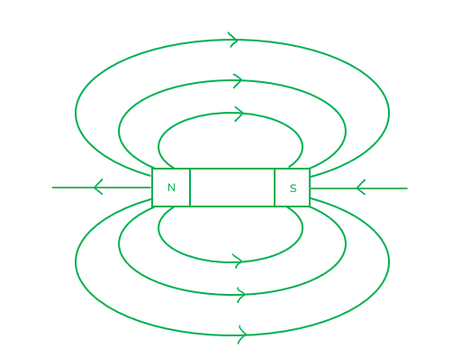

A diagram that contains any **two **from:

- At least two curved lines with the correct shape; **[1 mark]**
- Lines do not cross each other; **[1 mark]**
- Correct arrow direction shown at least once; **[1 mark]**

**[Total: 4 marks]**

### 6((b)) — 3 marks
Sketch the part of the field that is uniform and label the poles:

An example of a diagram that gains 3 marks:

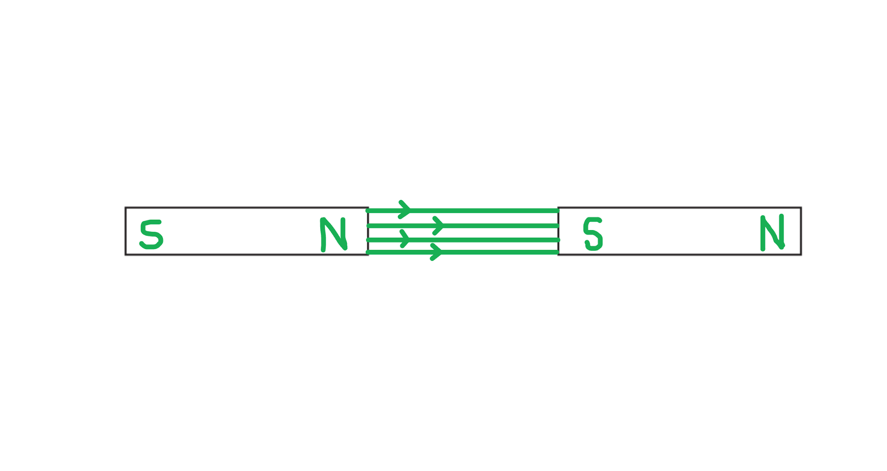

- <u>All</u> field lines are between the poles, <u>parallel and straight</u>; **[1 mark]**
- <u>Minimum</u> of <u>three</u> lines <u>equally spaced</u> between poles; **[1 mark]**
- <u>Opposite</u> poles are shown <u>adjacent</u>; **[1 mark]**

**[Total: 3 marks]**

> *Arrows are ignored in this particular question's mark scheme but it is always a good idea to include them. Arrows always point North to South for magnetic fields. *

## Q6 — medium — 5 marks · exam-questions

### 9((a)) — 1 marks
Explain what is meant by the term direct current:

- Direct current flows in one direction only; **[1 mark]**

**[Total: 1 mark]**

### 9((a)) — 4 marks
(i) Explain the purpose of the brushes and the commutator in a d.c. motor:

Any **three** from:

- The brushes provide a connection / current to the rotating commutator / coil; **[1 mark]**
- The commutator reverses the direction of the current; **[1 mark]**
- Once every half turn; **[1 mark]**
- Which reverses the field / polarity (every half turn); **[1 mark]**
- So that the force / moment is always in the same direction; **[1 mark]**
- So that the motor keeps turning in the same direction; **[1 mark]**

(ii) State what happens to the motor when both the magnetic field and the current are reversed:

Any **one** from:

- The motor still spins clockwise; **[1 mark]**
- No overall effect / the direction remains the same; **[1 mark]**
- The two changes cancel each other out; **[1 mark]**

**[Total: 4 marks]**

## Q7 — medium — 8 marks · exam-questions

### 9((a)) — 2 marks
An example of a diagram that would gain 2 marks:

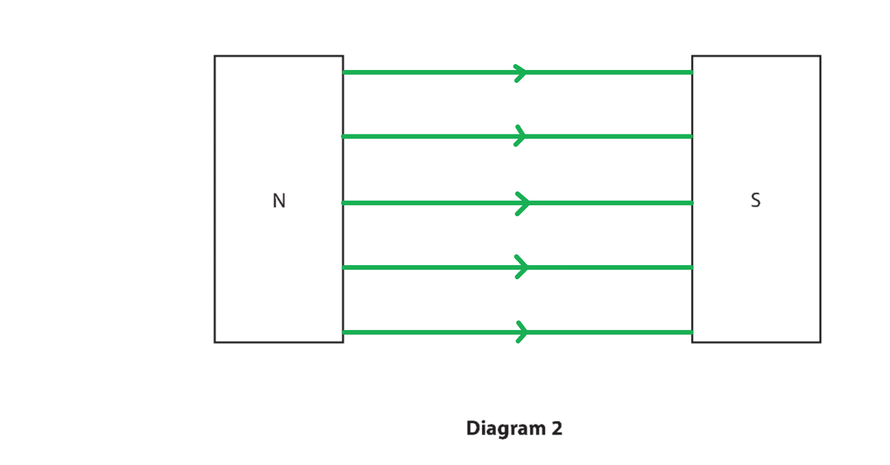

- Minimum of three lines <u>evenly spaced</u> (by eye); **[1 mark]**
- (At least one) arrow showing direction <u>from North pole to South pole</u>; **[1 mark]**

**[Total: 2 marks]**

### 9((b)) — 6 marks
(i) Suggest why the wire used in this investigation must be thick:

Any **one** from:

- It prevents large heat loss / overheating; **[1 mark]**
- It reduces resistance; **[1 mark]**
- A thin wire may melt; **[1 mark]**
- A thin wire may sag / bend; **[1 mark]**

(ii) Explain why the wire XY experiences a force when there is a current in the circuit:

Any **three** from:

- The magnetic field <u>of the wire / current</u>; **[1 mark]**
- Interacts with; **[1 mark]**
- The magnetic field <u>of the magnet(s)</u>; **[1 mark]**
- (The wire will experience a force according to) <u>the motor effect</u> / <u>Fleming's left hand rule</u>; **[1 mark]**

(iii) State two ways in which his force can be reduced:

Any **two **from:

- Reduce the current; **[1 mark]**
- Use a thinner wire; **[1 mark]**
- Switch off the current; **[1 mark]**
- Reduce voltage; **[1 mark]**
- Use less powerful magnets; **[1 mark]**
- Increase the separation of the magnets; **[1 mark]**

**[Total: 6 marks]**

## Q8 — medium — 8 marks · exam-questions

### 3((a)) — 6 marks
(i) Add to the diagram to show the shape and direction of the magnetic field pattern between the magnets:

An example of a diagram that would score 3 marks:

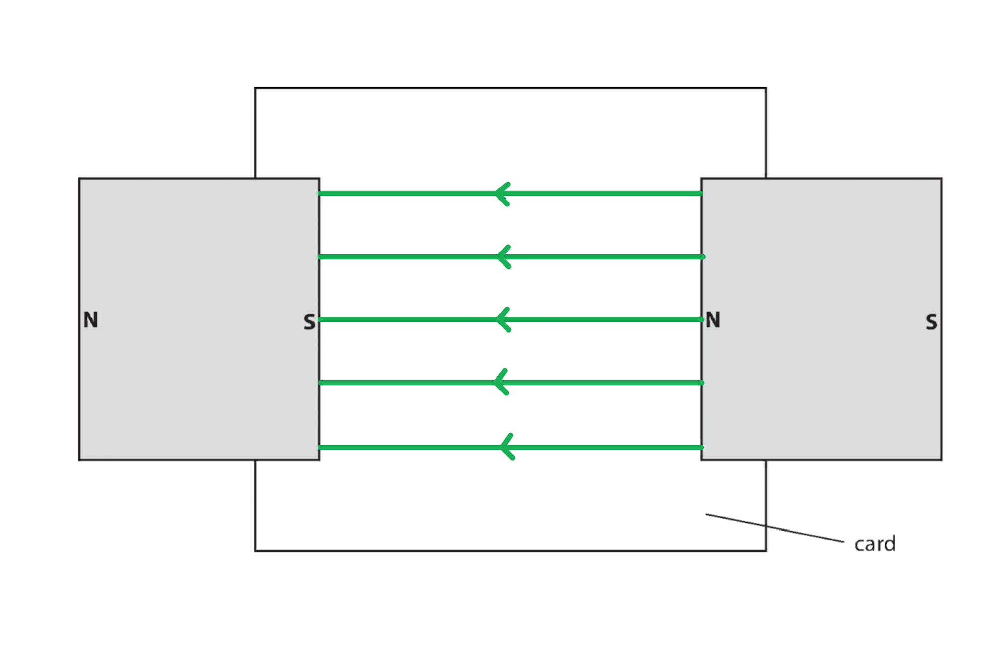

- At least one arrow showing direction from North to South; **[1 mark]**
- One horizontal line between magnets (shaded faces); **[1 mark]**
- Minimum of three horizontal lines evenly spaced; **[1 mark]**

(ii) Describe how to investigate the shape and direction of the magnetic field between the magnets:

Show the shape of the field:

Any **one** from:

- Use iron filings / powder (on the card to show the field shape); **[1 mark]**
- Use a compass / compasses (to plot field lines); **[1 mark]**

Show the direction of the field:

- Use a compass <u>to show the direction</u> of each field line; **[1 mark]**

Describe the method in further detail:

Any **one** from:

- Mark the card to show field lines; **[1 mark]**
- Move the compass along the field lines; **[1 mark]**
- Use multiple compasses; **[1 mark]**
- Repeat the process for another line; **[1 mark]**
- <u>Sprinkle</u> / <u>spread</u> the iron filings (evenly on the card); **[1 mark]**
- Tap the card (to distribute filings); **[1 mark]**

**[Total: 6 marks]**

> *In Part (ii) there are 3 marks available. You can gain one mark from each of the sections outlined above.*

> *Because you are asked to show the shape and direction, it is better to describe the compass method, however, you can still gain full marks by using the iron filing / powder method to find the shape of the field. *

### 3((b)) — 2 marks
Describe the effect of the magnetic field on the rod:

Any **two** from:

- <u>Fleming's left hand rule</u> / <u>the motor effect</u> occurs **OR** a magnetic field <u>around the rod</u> is generated; **[1 mark]**
- A force (therefore) acts on the rod; **[1 mark]**
- (Which leads to) movement of the rod; **[1 mark]**
- Out of the (plane of the) paper; **[1 mark]**

**[Total: 2 marks]**

> *Fleming's left hand rule not only tells us that a current-carrying wire in a field experiences a force, but it can also be used to predict that direction. *

> *In the example above, the **magnetic field** acts **upwards**. The **current** travels to the **right**, as shown by the arrows (this can also be inferred by the fact that the cell's positive plate is on the left).*

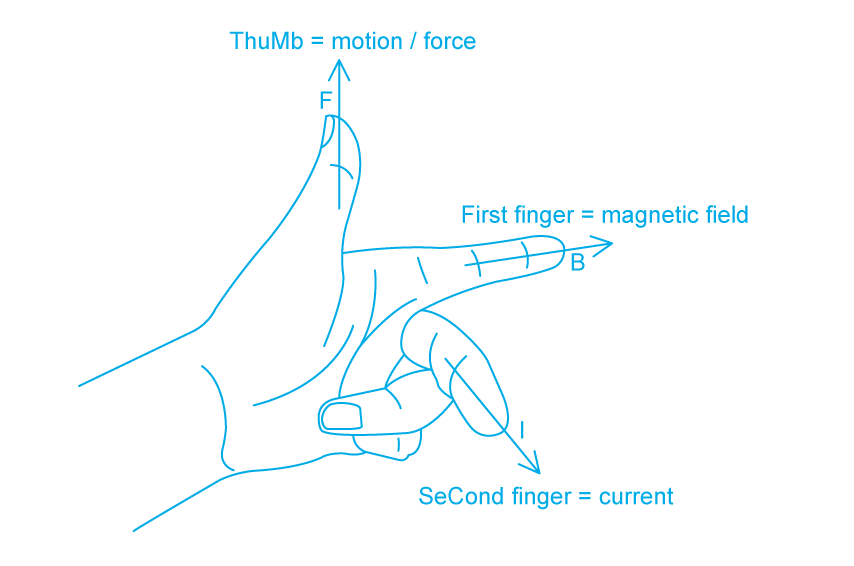

> *Using Fleming's left hand rule as above, if your first finger points upwards (as per the field) and your second points right (as per the current), it is easy to see that the force acts out the plane of the page. *

## Q9 — medium — 6 marks · exam-questions

### 4((a)) — 3 marks
Explain why the coil spins:

Any **three** from:

- A <u>current</u> travels in the wire; **[1 mark]**
- The coil (therefore) has a <u>magnetic field</u>; **[1 mark]**
- This field <u>interacts</u> with the field of the permanent magnet; **[1 mark]**
- A <u>force</u> acts on the coil / wire; **[1 mark]**
- The current reverses every half turn **OR** the force reverses every half turn; **[1 mark]**

**[Total: 3 marks]**

### 4((b)) — 3 marks
(i) Describe two ways to increase the speed of rotation of the coil in this motor:

Any **two** from:

- Increase the permanent magnet's magnetic field strength; **[1 mark]**

  - e.g. decrease distance between poles
  - e.g. use a more powerful magnet
- Increase field around the wire; **[1 mark]**

  - e.g. increase the voltage
  - e.g. increase the current
  - e.g. use more cells
  - e.g. use a thicker wire
  - e.g. use a lower resistance wire
- Increase the number of turns on the coil; **[1 mark]**

(ii) Suggest how to make the coil spin in the opposite direction:

Any **one **from:

- Reverse the current; **[1 mark]**
- Reverse the cell connections; **[1 mark]**
- Reverse the permanent magnetic field; **[1 mark]**

**[Total: 3 marks]**

## Q10 — medium — 5 marks · exam-questions

### 4((a)) — 2 marks
An example of a diagram that would gain 2 marks:

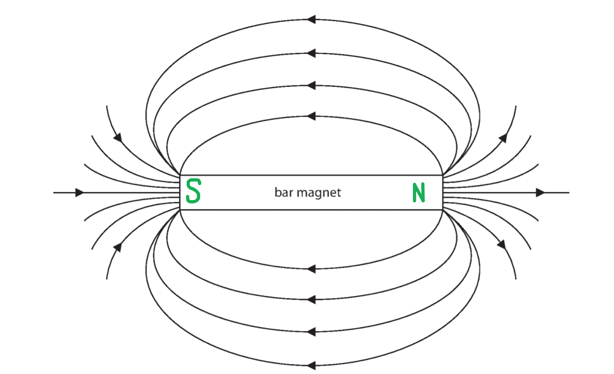

- Labels for poles are the <u>ends</u> of the magnet (within one quarter of either end); **[1 mark]**
- South on the left **ΑΝD** North on the right; **[1 mark]**

**[Total: 2 marks]**

### 4((b)) — 3 marks
**Method 1: compass**

Describe the experiment:

- Place a plotting compass at the side / end of the magnet; **[1 mark]**
- Mark the position of the end of the compass; **[1 mark]**
- Move the end of the compass needle to this new mark (and repeat); **[1 mark]**

**Method 2: iron filings**

Describe the experiment:

- Place the magnet under paper / plastic; **[1 mark]**
- Sprinkle / place iron filings over this; **[1 mark]**
- Tap the paper (gently, to reveal the pattern); **[1 mark]**

**[Total 3 marks]**

## Q11 — medium — 5 marks · exam-questions

### 5((a)) — 2 marks
State the pattern which shows a uniform field:

- Pattern **D**; **[1 mark]**

Explain why:

- The field lines are <u>parallel</u> and** **<u>straight</u>; **[1 mark]**

**[Total: 2 marks]**

> *A uniform field has the **same strength and direction at all points**. The lines being parallel is not sufficient as a description, as the field lines are parallel in pattern **A** also, but this is not a uniform field as the direction varies. *

> *Words to the effect of "parallel' are also accepted in this questions, such as "equally spaced".*

### 5((b)) — 3 marks
State the types of magnets used:

- Two (permanent / bar) magnets; **[1 mark]**

Describe their arrangement:

- Arrange the poles such that opposite poles are adjacent; **[1 mark]**
- Place the poles close together; **[1 mark]**
- The field forms between the North pole of one magnet and the South pole of the other

**[Total: 3 marks]**

## Q12 — medium — 6 marks · exam-questions

### 4((a)) — 1 marks
State why the metal plate is made of iron:

Any **one **from:

- iron is magnetic; **[1 mark]**
- Iron is magnetically soft; **[1 mark]**
- Iron loses its magnetism easily; **[1 mark]**

**[Total: 1 mark]**

### 4((b)) — 3 marks
Describe the components of an electromagnet:

- A <u>current-carrying</u> (insulated) wire; **[1 mark]**
- Is wrapped into a <u>coil</u>; **[1 mark]**
- Around an <u>iron core</u>; **[1 mark]**

**OR**** **

Draw and label a diagram:

An example of a diagram that would gain three marks:

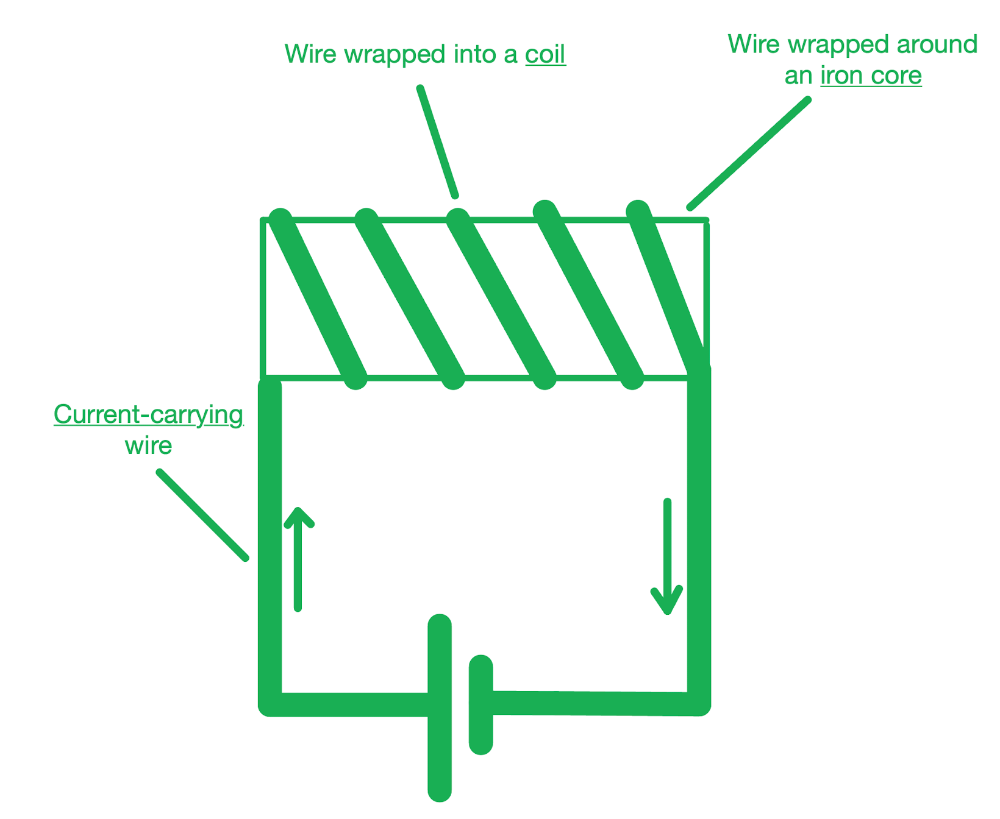

- Wire labelled as current-carrying **OR** wire connected to a cell; **[1 mark]**
- Wire clearly shown to be wrapped into a coil; **[1 mark]**
- Around a <u>labelled</u> iron core; **[1 mark]**

**[Total: 3 marks]**

### 4((c)) — 2 marks
Describe changes that allow the electromagnet to release the door when the fire alarm sounds:

- For the door to be released then the electromagnet needs to be turned off

Any **two** from:

- <u>Current</u> / <u>voltage</u> reduces / stops; **[1 mark]**
- The <u>magnetic field</u> of the electromagnet reduces / stops; **[1 mark]**
- (Therefore) the <u>force</u> holding the iron plate to the electromagnet reduces / stops; **[1 mark]**

**[Total: 2 marks]**

## Q13 — medium — 7 marks · exam-questions

### 7((a)) — 2 marks
Explain what happens to the rods:

- The rods become <u>magnetised</u> (by the magnetic field); **[1 mark]**

Explain why they move apart:

- (Their magnetic fields interact and) the rods <u>repel</u>; **[1 mark]**

**[Total: 2 marks]**

### 7((b)) — 3 marks
Suggest a material the rods could be made from:

- The rods could be made from <u>iron</u>; **[1 mark]**

Explain why they could be made from this material:

- (Iron) is capable of being <u>magnetised</u>; **[1 mark]**

Explain why this material means they move back together when the current is switched off:

- Iron is magnetically soft

**OR**

- Iron does not retain its magnetism; **[1 mark]**

**[Total: 3 marks]**

> *The first mark point may be gained by suggesting **any** magnetic material (e.g. iron, steel, cobalt, nickel), but the third mark point can only be gained if you named the material as iron. Iron is magnetically soft so it does not maintain its magnetism for long, hence why the rods move back together soon after the current stops. *

### 7((c)) — 2 marks
Explain what will happen to the magnetic field when the direct current is replaced with alternating current:

Any **two** from:

- The field (constantly) <u>switches polarity</u>; **[1 mark]**
- The field is <u>weaker</u>; **[1 mark]**
- The field <u>alternates</u> rapidly with current; **[1 mark]**
- So the rods may not have time to become <u>fully magnetised</u>; **[1 mark]**

**[Total: 2 marks]**

## Q14 — hard — 8 marks · exam-questions

### 13((a)) — 4 marks
Explain what will happen to the metal rod AB:

Any **four **from:

- There is a (clockwise) current in the rod; **[1 mark]**
- Therefore the rod has a magnetic field around it; **[1 mark]**
- The fields (of the rod and the permanent magnets) <u>interact</u>; **[1 mark]**
- This produces a <u>force</u> (on the rod); **[1 mark]**
- (As a result of) the motor effect / Fleming's left hand rule; **[1 mark]**
- The rod moves to the <u>right</u>; **[1 mark]**

**[Total: 4 marks]**

> *This is a motor effect question but you have to do some extra work to find the direction of the current and the field from the permanent magnets. *

> *To determine the field's direction, one must realise that field lines always point **from** North to South. If the North poles are facing out of the plane of the page, so too is the magnetic field. *

> *To determine the current's direction, we must use the polarity of each terminal. Current flows from positive to negative, by definition. Here, current leaves the positive terminal, travels through the rod and returns to the negative terminal. In the rod, current is travelling **upwards**. *

> *Using the left hand rule, we can see that the rod travels to the **right**. *

### 13((b)) — 4 marks
Describe how the alternating current generates a sound wave:

Any **four** from:

- Alternating current changes direction (continuously); **[1 mark]**
- The current in the coil produces an alternating magnetic field (which interacts with the permanent magnet's field); **[1 mark]**
- This produces a force on the coil / cone; **[1 mark]**
- The reversing current reverses the force direction; **[1 mark]**
- Hence the coil / cone oscillates / vibrates (back and forth); **[1 mark]**
- The cone vibrates air particles (thus generating sound waves); **[1 mark]**

**[Total 4 marks]**

## Q15 — hard — 4 marks · exam-questions

### 7((c)) — 4 marks
To describe how a loudspeaker uses an electrical supply to produce sound waves:

- Alternating <u>current (a.c.) flows through the coil</u>; **[1 mark]**
- This induces a <u>changing magnetic field</u>; **[1 mark]**
- Which <u>interacts with the magnetic field</u> of the permanent magnets; **[1 mark]**
- Therefore a <u>force acts on the coil</u> causing the coil to vibrate; **[1 mark]**

**[Total: 4 marks]**

## Q16 — hard — 8 marks · exam-questions

### 7((a)) — 4 marks
Explain why the coil starts to spin when the switch is closed:

Any **four **from:

- (When the switch is closed) there is current in the coil; **[1 mark]**
- (The current in the wires) creates a magnetic field (around the wires of the coil); **[1 mark]**
- (This magnetic) field interacts with / cuts the field created by the (permanent) magnets; **[1 mark]**
- (This generates) a force on the wires (of the coil); **[1 mark]**
- Using Fleming's left-hand rule; **[1 mark]**
- (The) force on the coil acts upwards on one side and downwards on the other side; **[1 mark]**
- This creates a turning effect / moment (on the coil); **[1 mark]**

**[Total: 4 marks]**

> *When talking about the motor effect it is important to say that the current is in the coil; it is not enough to say that there is current in the circuit. The current must be within the wire that goes between the permanent magnets. *

> *If you need a reminder of Fleming's left-hand rule:*

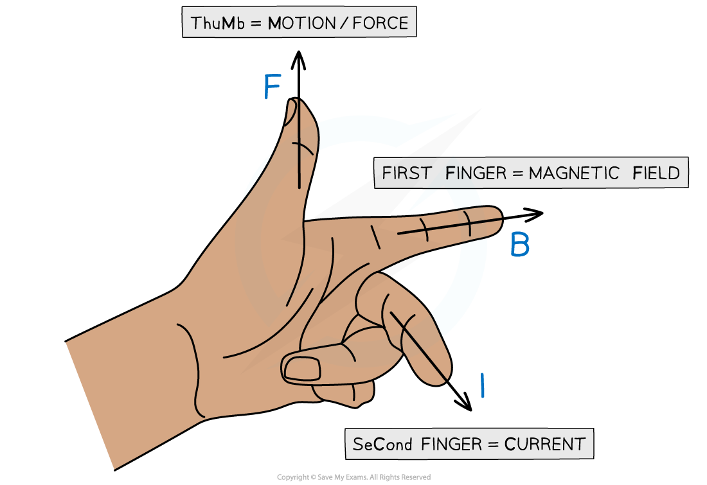

### 7((b)) — 2 marks
(i) To suggest how to make the coil spin in the opposite direction:

Any **one **from:

- Reverse the direction of the <u>current;</u> **[1 mark]**
- Reverse the <u>polarity</u> of the supply (to reverse the direction of the current); **[1 mark]**
- Reverse the direction of the magnetic field between the magnets by <u>swapping the magnets</u>; **[1 mark]**

(ii) To suggest how to make the coil spin more slowly:

Any **one **from:

- Reduce the current; **[1 mark]**
- Reduce the supply voltage; **[1 mark]**
- Increase the resistance of the circuit (to reduce the current); **[1 mark]**
- Place the coil in a weaker magnetic field / use weaker magnets; **[1 mark]**
- Have fewer turns in the coil; **[1 mark]**

**[Total: 2 marks]**

> *In part (ii) if you are discussing reducing the number of turns in the coil then you must mention the number of turns. It is not sufficient to say fewer coils or shorter wire is needed. *

### 4((c)) — 2 marks
Any **two **from:

- The radially curved magnets will allow the (magnetic) field to act all the way around; **[1 mark]**
- (The rotational) force (of the coil) increases; **[1 mark]**
- (The magnetic) force acts over a larger part of the cycle; **[1 mark]**
- (The) coil remains in the (magnetic) field for a longer time (period); **[1 mark]**
- (The) iron is magnetised; **[1 mark]**

**[Total: 2 marks]**

## Q17 — hard — 6 marks · exam-questions

### 7((a)) — 3 marks
An example of a diagram that would gain three marks:

Use the right hand rule around the coil:

- At the left hand side of the coil, the current is directed out of the plane of the page

  - Using the right hand screw rule, the field follows an anti-clockwise path around the wire here
- At the right hand side of the coil, the current is directed into the plane of the page

  - Using the right hand screw rule, the field follows a clockwise path around the wire here

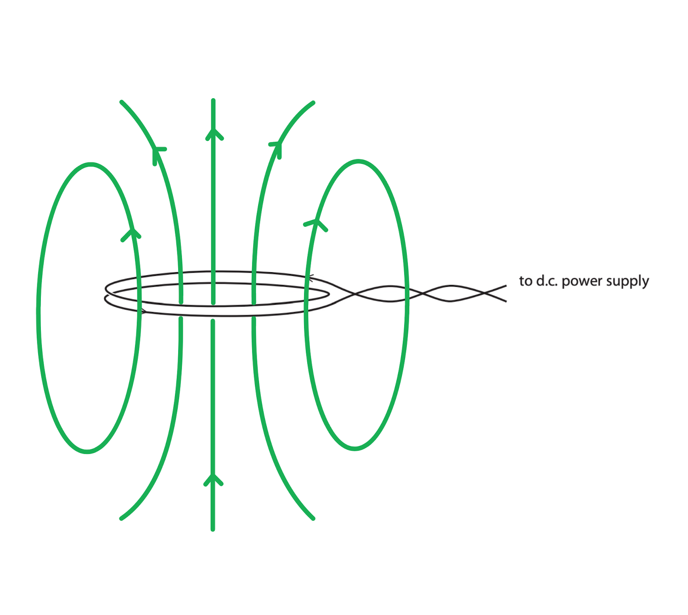

- At least one straight vertical, central field line; **[1 mark]**
- Any field line drawn circling the wire; **[1 mark]**
- Field directions correct and shown on at least two lines; **[1 mark]**

**[Total: 3 marks]**

> *As current is travelling along a wire, we know that there is a magnetic field around the wire. We must determine its direction around the wire to find the overall magnetic field through the coil. *

> *Using the right hand screw rule gives the direction of the circular field around the wire. *

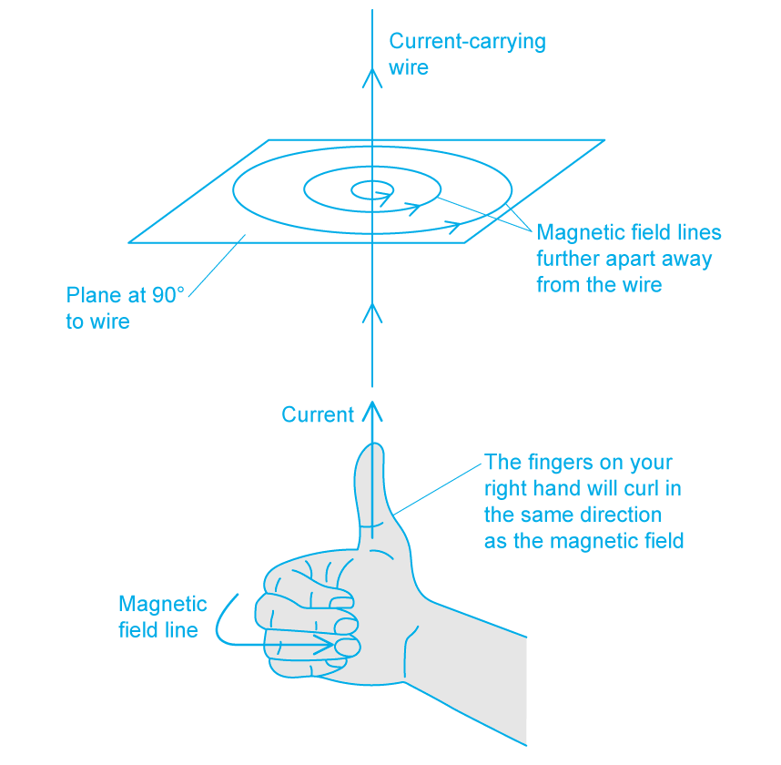

> *Using this at different points in the coil helps us piece together the overall magnetic field seen in the model answer. *

### 7((b)) — 3 marks
Explain why the coils move:

Any **three** from:

- Magnetic fields (from each coil) interact; **[1 mark]**
- Idea of either attraction or repulsion; **[1 mark]**
- Reversing current reverses force / magnetic field; **[1 mark]**
- Comparison with magnets; **[1 mark]**

  - e.g. like poles repel

An example of an answer that would gain three marks:

- Each coil produces its own magnetic field when current flows
- The magnetic fields from the coils <u>interact</u>; **[1 mark]**
- When the currents move in the same direction, there is magnetic <u>attraction</u>; **[1 mark]**
- Reversing the direction of the current of one coil reverses the direction of the force / magnetic field; **[1 mark]**
- This behaviour is similar to that of magnetic poles: like poles repel and opposite poles attract; **[1 mark]**

**[Total: 3 marks]**

## Q18 — hard — 8 marks · exam-questions

### 4((a)) — 3 marks
(i) Add arrows to two of the magnetic field lines to show the direction of the magnetic field:

A diagram that would gain one mark:

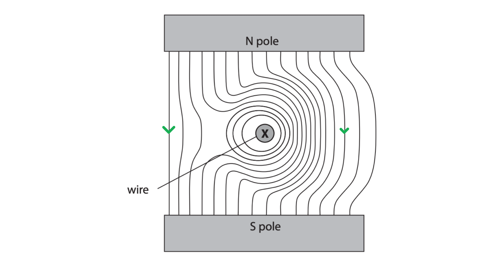

- A diagram with (at least two) arrows indicating the direction from North to South / downwards; **[1 mark]**

(ii) Draw an arrow on the diagram to show the direction of the force on the wire:

A diagram that would gain two marks:

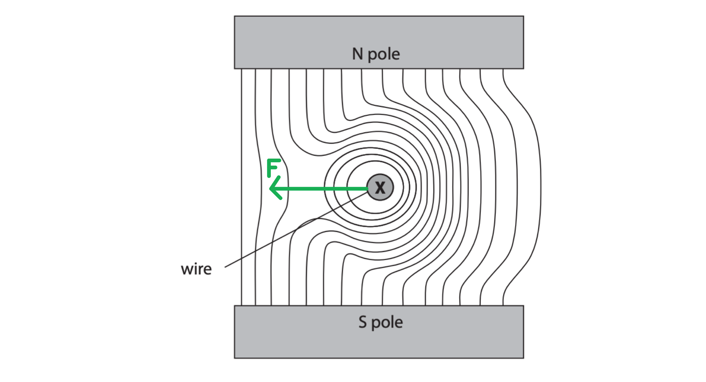

Use Fleming's left hand rule to determine the force's direction:

- The current points <u>into</u> the plane of the page
- The field acts <u>downwards</u>
- Force arrow is horizontal (by eye); **[1 mark]**
- Force arrow points to the left; **[1 mark]**

**[Total: 3 marks]**

> *In part (i), you could also gain marks by drawing arrows on the circular field lines around the wire. The direction of these could either be determined using the right hand thumb rule (from topic 6.1.9) or by observing how the path of straight North to South lines becomes altered by the wire's magnetic field. The circular field lines have a **clockwise** direction, as the current travels **into** the plane of the page. *

### 4((b)) — 2 marks
A diagram that would gain 2 marks:

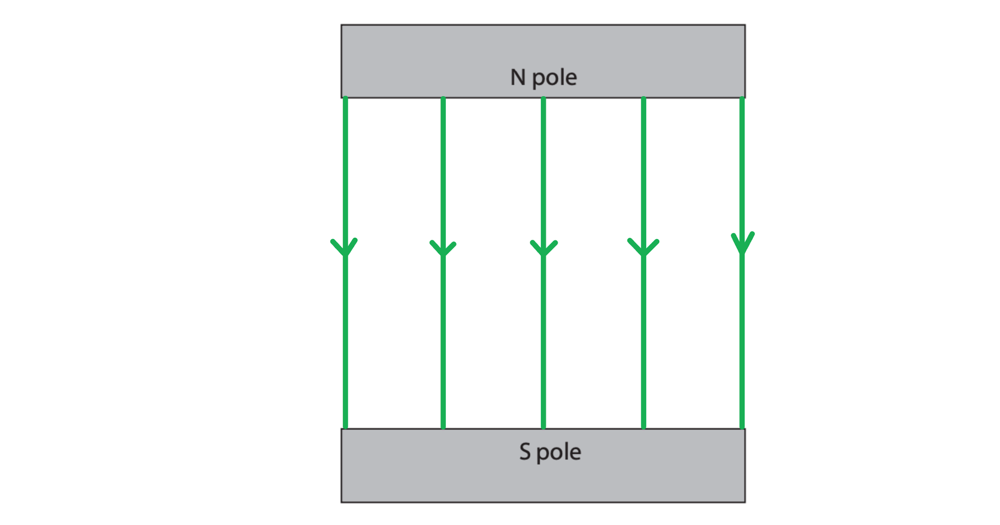

- A single straight line perpendicular to both poles **AND** between both poles; **[1 mark]**
- Additional straight lines to the side that are parallel **AND** evenly spaced (by eye); **[1 mark]**

**[Total: 2 marks]**

### 4((c)) — 3 marks
Describe the compass' position:

- Place the compass somewhere around the magnet and <u>mark its direction</u>; **[1 mark]**

Explain how to follow the field line:

- <u>Move</u> the compass so it points away from the dot and mark its direction again; **[1 mark]**
- Link the direction marks to find a field line / pattern; **[1 mark]**

**[Total: 3 mark]**

## Q19 — hard — 9 marks · exam-questions

### 1() — 4 marks
(i) Draw an arrow on diagram 1 to show the direction of the force acting on the wire:

- Using Fleming's left hand rule:

  - The first finger points in the direction of the field, from north to south
  - The second finger points in the direction of the current, into the page
  - The thumb points in the direction of the force, which is downward

> **[mark-scheme]**
> - Arrow is drawn vertically** [1 mark]**
> - Arrow is drawn pointing downward** [1 mark]**

> **[mark-scheme]**
> (ii) State two ways to increase the magnitude of the force on the wire:
> 
> - Increase the current **[1 mark]**
> - Use a stronger magnet **OR** Increase the strength of the magnetic field **[1 mark]**

### 2() — 3 marks
Draw the magnetic field produced by the current in the flat circular coil:

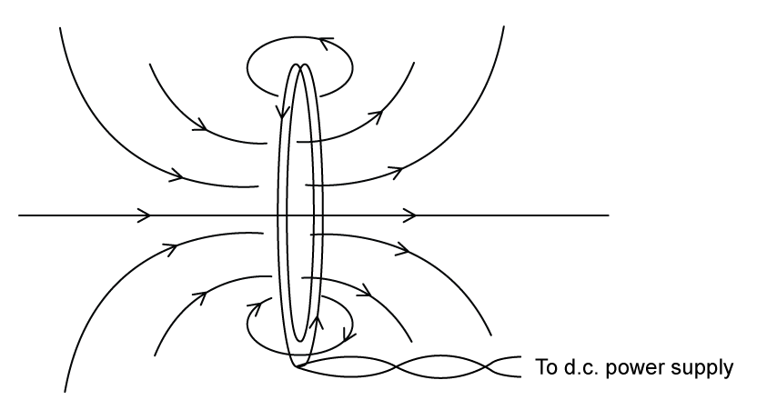

> **[mark-scheme]**
> - A straight horizontal line drawn through the centre of the loop** [1 mark]**
> - At least two curved field lines drawn circling the wire **[1 mark]**
> - Correct direction indicated by arrows **AND** Arrows drawn on at least 2 field lines  **[1 mark]**

> **[exam-tip]**
> When drawing magnetic field lines:
> 
> - Draw the centre line
> 
>   - In the dead centre of the coil, the magnetic fields from both sides reinforce each other to make a straight line
> - Draw the loops
> 
>   - Close to the wire, the field looks just like it does around a straight wire
>   - The lines must go around the wire, not start from it
> - Draw the concentric circles
> 
>   - These should curve around the wire and not touch the wire itself
>   - Ensure the field lines get further apart as they move away from the wire to show the field getting weaker
>   - The lines should never cross or touch
> - Add the directional arrows
> 
>   - Use the right-hand grip rule for solenoids to determine the direction
>   
>     - Choose a point on the coil
>     - The thumb points in the direction of the current
>     - The fingers curl in the direction of the field
>   - All the arrows must point the same way

### 3() — 2 marks
> **[mark-scheme]**
> - (From the left-hand rule) the current is directed downwards **[1 mark]**
> - (Since the ion is negatively charged, it must be moving) <u>upwards</u> **[1 mark]**

> **[exam-tip]**
> Remember that when we describe the direction of current, we are referring to conventional current - the direction that a positive charge would move.
> 
> Therefore, when using Fleming's left-hand rule to determine the direction of motion of a negative charge, it must move in the opposite direction to conventional current.
> 
> In the diagram:
> 
> - The thumb represents the force, pointing to the left
> - The first finger represents the field, pointing out of the page
> - The second finger represents the conventional current, pointing downwards
> 
> Using these facts, we can deduce that the negative ion must be moving upwards.
