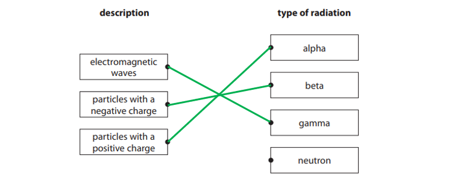
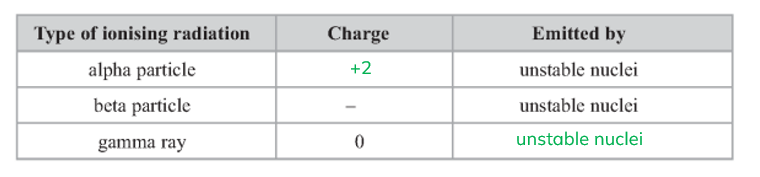
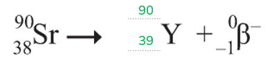
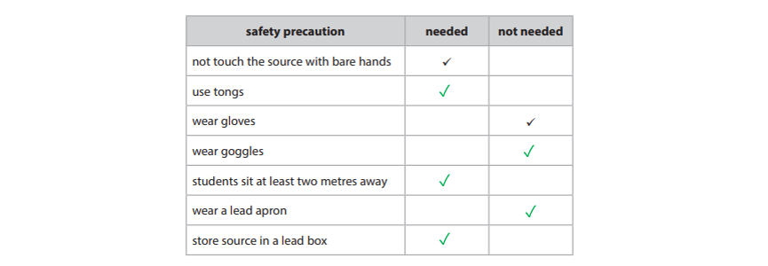
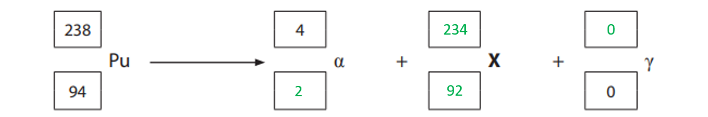
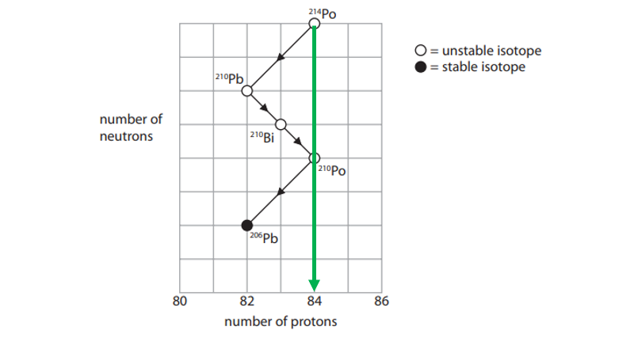
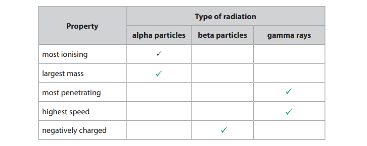
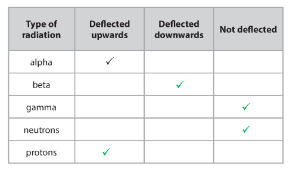

# Mark Schemes — Properties of Radiation
**7. Radioactivity & Particles** · Edexcel IGCSE Physics (4PH1)

## Q1 — easy — 1 marks · exam-questions

### 1((a)) — 1 marks
**Correct answer: C** — 14

**Final answer:** **The correct answer is C because:**

- The mass number is the same as the number of nucleons
- This is the 'top' number on a chemical symbol
- Therefore the number of nucleons is 14

## Q2 — easy — 1 marks · exam-questions

### 1((b)) — 1 marks
**Correct answer: A** — An electron

**Final answer:** **The correct answer is ****A**** because:**

- Beta emission occurs when a neutron changes into a proton and emits an electron
- Therefore the beta particle is an electron

## Q3 — easy — 1 marks · exam-questions

### 1((b)) — 1 marks
**Correct answer: B** — Beta particle

**Final answer:** **The correct answer is ****B**** because:**

- A beta particle is an electron which is emitted from the nucleus

## Q4 — easy — 6 marks · exam-questions

### 4((a)) — 2 marks
State the similarities between isotopes of the same element:

- The atoms / nuclei have the <u>same number of protons</u>; **[1 mark]**

State the differences between isotopes of the same element:

- The atoms / nuclei have <u>different numbers of neutrons;</u> **[1 mark]**

**[Total: 2 marks]**

### 4((b)) — 4 marks
(i) Describe the nature of a beta particle:

- A beta particle is an electron; **[1 mark]**

(ii) State the name of a piece of equipment that can be used to detect beta particles;

Any **one** from:

- Geiger(-Muller) tube / detector / counter; **[1 mark]**
- Photographic film; **[1 mark]**
- Zinc sulfide; **[1 mark]**
- Gold leaf electroscope; **[1 mark]**

(iii) Describe the use of a detector to show beta particles are emitted:

Describe the experiment:

- Set up an emitter of beta-radiation in line with a detector
- Arrange them so that the sheets of lead, aluminium and paper can be placed between them

Describe the relative penetration of beta-particles:

- Beta radiation penetrates paper; **[1 mark]**
- Beta radiation is absorbed / stopped by lead and by a few mm of aluminium; **[1 mark]**

**[Total: 4 marks]**

> *For part iii there are no marks for describing the experimental set up - a requirement for this will be very specifically worded. However it is worth writing a short sentence for yourself, so that your answer makes sense and you can check it before handing your paper in at the end.*

## Q5 — easy — 4 marks · exam-questions

### 7((a)) — 3 marks
A diagram which would score three marks is:

- Electromagnetic waves to gamma; **[1 mark]**
- Particles with a negative charge to beta; **[1 mark]**
- Particles with a positive charge; **[1 mark]**

**[Total: 3 marks]**

### 7((d)) — 1 marks
State another device which can be used to detect alpha radiation:

Any **one** from:

- (thin window) GM tube / Geiger counter; **[1 mark]**
- cloud chamber; **[1 mark]**
- spark chamber; **[1 mark]**
- semiconductor detector; **[1 mark]**

**[Total: 1 mark]**

## Q6 — easy — 2 marks · exam-questions

### 12((b)) — 2 marks
Explain the effect of the emission of a beta particle on a nucleus:

In terms of neutrons:

- The neutron changes (to a proton) **OR**
- The neutron number <u>decreases</u> by 1; **[1 mark]**

In terms of protons:

- The nucleus gains a proton **OR**
- Proton number i<u>ncreases</u> by 1; **[1 mark]**

**[Total: 2 marks]**

## Q7 — easy — 3 marks · exam-questions

### 1((a)) — 2 marks
A completed table which would gain two marks is:

- Correct charge of an alpha particle; **[1 mark]**
- Correct emission pathway for gamma; **[1 mark]**

**[Total: 2 marks]**

### 1((c)) — 1 marks
A completed equation which would score one mark is:

**[Total: 1 mark]**

## Q8 — medium — 3 marks · exam-questions

### 8((a)) — 1 marks
**Correct answer: B** — Background radiation

**Final answer:** **The correct answer is ****B**** because:**

- Radon gas is a natural source of radiation
- Natural sources of radiation are considered background radiation

### 8((c)) — 1 marks
**Correct answer: A** — 86

**Final answer:** **The correct answer is ****A**** because:**

- The definition of an isotopes is:

  - A version of the same element with the <u>same number of protons</u>, but <u>different numbers of neutrons</u>
- Therefore all isotopes of radon have 86 protons

### 8((c)) — 1 marks
**Correct answer: B** — 134

**Final answer:** **The correct answer is ****B**** because:**

- Mass number = number of protons + number of neutrons
- Therefore, number of neutrons = Mass number − number of protons
- Number of neutrons = 220 − 86 = 134

## Q9 — medium — 1 marks · exam-questions

### 1((a)) — 1 marks
**Correct answer: B** — 27

**Final answer:** **The correct answer is ****B**** because:**

- The number of neutrons = mass number − atomic number
- The mass number is 50 and the atomic number is 23
- Therefore the number of neutrons is 27

## Q10 — medium — 4 marks · exam-questions

### 1((a)) — 1 marks
**Correct answer: A** — Alpha particle

**Final answer:** **The correct answer is ****A**** because:**

- Alpha consists of 2 protons and 2 neutrons
- This means the overall charge is +2
- This is the greatest charge

**B **is incorrect as the charge on a beta particle is −1

**C **is incorrect as the charge on a neutron is 0

** D **is incorrect as the charge on a proton is +1

### 1((a)) — 1 marks
**Correct answer: A** — Alpha particle

**Final answer:** **The correct answer is ****A**** because:**

- Alpha consists of 2 protons and 2 neutrons
- This means the overall relative mass is 4
- This is the greatest mass

** B **is incorrect as the mass of a beta particle is negligible

**C **is incorrect as the mass of a neutron is 1

**D **is incorrect as the mass of a proton is 1

### 1((c)) — 1 marks
**Correct answer: B** — 50 cm

**Final answer:** **The correct answer is ****B ****because:**

- The range of a beta particle in air is around 50 cm

### 1((d)) — 1 marks
**Correct answer: D** — The proton number increases by 1

**Final answer:** **The correct answer is ****D**** because:**

- In beta decay a <u>neutron changes to a proton and a beta particle</u> (electron)

  - This means there is now one more proton in the nucleus
- Therefore proton number increases by 1

In beta decay, the number of nucleons in the nucleus does not change.

## Q11 — medium — 1 marks · exam-questions

### 1((a)) — 1 marks
**Correct answer: C** — Decreases by 2

**Final answer:** **The correct answer is ****C**** because:**

- An alpha particle consists of 2 protons and 2 neutrons
- Therefore, emission of an alpha particle means a reduction in proton number of 2

## Q12 — medium — 1 marks · exam-questions

### 1((b)) — 1 marks
**Correct answer: A** — Alpha particle

**Final answer:** **The correct answer is ****A**** because:**

- An alpha particle consists of 2 protons and 2 neutrons
- This means it has a mass number of 4

## Q13 — medium — 1 marks · exam-questions

### 1((b)) — 1 marks
**Correct answer: A** — Alpha particle

**Final answer:** **The correct answer is ****A**** because:**

- Gamma and X-rays are part of the electromagnetic spectrum and so have 0 charge

  - Hence they have virtually no ionising effect
- Beta-particles have a charge of −1

  - Hence they have a small ionising effect
- Alpha particles have a charge of +2

  - This is double the magnitude of the charge on the beta-particle
- Since alpha has the greatest charge, it is the most ionising

## Q14 — medium — 1 marks · exam-questions

### 1((a)) — 1 marks
**Correct answer: D** — Decreases by 4

**Final answer:** **The correct answer is ****D**** because:**

- An alpha particle consists of 2 protons and 2 neutrons

  - Therefore, emission of an alpha particle means a reduction in mass number of 4

## Q15 — medium — 2 marks · exam-questions

### 1((a)) — 1 marks
**Correct answer: B** — 53

**Final answer:** **The correct answer is ****B**** because:**

- The bottom number on an element symbol gives the number of protons
- Therefore the atomic (proton) number is 53

### 1((a)) — 1 marks
**Correct answer: D** — 131

**Final answer:** **The correct answer is ****D**** because:**

- The mass number of iodine is 131 (the mass number is the top number)
- The electron has a mass number of 0
- This means that A (the mass number for xenon) must be 131 so that the left-hand side of the equation equals the right.

## Q16 — medium — 1 marks · exam-questions

### 1((b)) — 1 marks
**Correct answer: B** — The number of protons increases

**Final answer:** **The correct answer is ****B**** because:**

- In beta minus decay a neutron becomes a proton
- Therefore the number of protons increases by one

## Q17 — medium — 8 marks · exam-questions

### 9((a)) — 6 marks
(i) The number of protons in a single atom of tritium is:

- 1 **[1 mark]**

The number of neutrons in a single atom of tritium is:

- 2 **[1 mark]**

(ii) Differences between an alpha particle and a beta particle are:

Any **three** from:

- Beta particle is negatively charged **AND**** **alpha is positively charged; **[1 mark]**
- Beta particle has lower / less mass; **[1 mark]**
- Beta particle has 1 charge but alpha has 2 charges; **[1 mark]**
- Beta particle is an electron but alpha is a helium nucleus / consists of 2 protons and 2 neutrons; **[1 mark]**
- Beta is less ionising; **[1 mark]**
- Beta has a higher speed; **[1 mark]**
- Beta particles have a larger range; **[1 mark]**
- Beta has higher penetrating ability; **[1 mark]**

(iii) Tritium cannot emit alpha particles because:

Any **one **from:

- alpha is 4 nucleons, tritium has (only) 3; **[1 mark]**
- tritium  only has 1 proton but there are 2 protons in an alpha particle; **[1 mark]**
- tritium has not got enough mass / mass number too low; **[1 mark]**
- tritium has not got enough nucleons; **[1 mark]**
- tritium has not got enough protons / the atomic number of tritium is too low; **[1 mark]**
- tritium has not got enough protons and neutrons; **[1 mark]**

**[Total: 6 marks]**

> *For part (iii) it is not enough to say tritium is too small.*

### 9((b)) — 2 marks
The sign is safe to use because:

Any **two **from:

- Energy explanation:

  - e.g. beta particles have given up all their kinetic energy on impact; **[1 mark]**
- Absorption explanation:

  - e.g. beta particles have hit (and been absorbed by) phosphor; **[1 mark]**
- Penetration explanation:

  - e.g. beta cannot penetrate (thick) glass / tube; **[1 mark]**
- Range explanation:

  - e.g. signs are further away than the range of beta; **[1 mark]**

**[Total: 2 marks]**

> *Comments about beta particles having low ionisation or no gas escaping gain no credit.*

## Q18 — medium — 11 marks · exam-questions

### 12((a)) — 2 marks
A completed table which would score 2 marks is:

- First column contains the ticks in the correct place (and ignore any extra ticks); **[1 mark]**
- Second column correct; **[1 mark]**

**[Total: 2 marks]**

### 12((b)) — 3 marks
(i) State why the teacher keeps the distance constant between the source and the detector:

- Distance is a controlled variable; **[1 mark]**

(ii) State why there is a reading when no source is used:

- Due to background radiation; **[1 mark]**

Give an example of a source of background radiation:

Any **one **from:

- Cosmic rays; **[1 mark]**
- Rocks / Earth; **[1 mark]**
- Buildings; **[1 mark]**
- Some foodstuffs e.g. coffee; **[1 mark]**
- Radon gas; **[1 mark]**

**[Total: 3 marks]**

### 12((b)) — 6 marks
(i) State which is the best absorber of radiation from the materials the teacher used:

- Lead is the best absorber of radiation; **[1 mark]**

Explain how you know that lead is the best absorber:

- It has the lowest count rate; **[1 mark]**

Name the isotope for which it has the lowest count rate:

- Barium-133; **[1 mark]**

(ii) To evaluate the student's conclusion:

Any three from:

- Stone is the worst absorber for Ba-133 or gamma; **[1 mark]**
- Because the count rate is highest when stone is used, at 10,408 counts in 30 s; **[1 mark]**
- However it may not be worse absorber than paper as paper is much thinner / paper was not tested for Ba-133; **[1 mark]**
- Stone is not the worst absorber of radiation overall, as the count rate using plastic / wood / stone is much lower for strontium-90; **[1 mark]**

**[Total: 6 marks]**

## Q19 — medium — 14 marks · exam-questions

### 6((b)) — 3 marks
(i) The two nuclei with the same number of protons are:

- Uranium-234 **AND** uranium-235; **[1 mark]**

(ii) The two nuclei with the same number of  nucleons are:

- Plutonium-238 **AND** americium-238; **[1 mark]**

(iii) The two nuclei with the same number of neutrons are:

- Uranium-235 **AND** americium-238; **[1 mark]**

**[Total: 3 marks]**

### 6((c)) — 3 marks
(i) The term unstable means the nucleus will :

Any **one** from:

- Decay; **[1 mark]**
- Emit radioactive particles; **[1 mark]**
- Emit gamma radiation; **[1 mark]**

(ii) To explain what is meant by the term half-life:

State the first half of the half-life definition:

- The time taken; **[1 mark]**

State the second half of the half-life definition:

- for (radio)activity to halve; **[1 mark]**

**OR**

- for half of (radioactive) nuclei / atoms / isotope to decay; **[1 mark]**

**[Total: 3 marks]**

### 6((d)) — 5 marks
(i) A completed decay equation that would score 4 marks is:

- Correct proton number for alpha (2); **[1 mark]**
- Correct nucleon number for gamma (0); **[1 mark]**
- Balanced top line (234); **[1 mark]**
- Balanced bottom line (92); **[1 mark]**

(ii) Using information in the table from part (a):

- The proton number is 92
- The nucleon number is 234
- Therefore the element is uranium-234; **[1 mark]**

**[Total: 5 marks]**

### 6((e)) — 3 marks
(i) Describe how this process affects the proton number of the nucleus that absorbs the electron:

- Proton number / atomic number decreases by 1; **[1 mark]**

Describe how this process affects the nucleon number of the nucleus that absorbs the electron:

- Protons and neutrons have the same mass
- Therefore nucleon number / mass number remains unchanged; **[1 mark]**

(ii) The new nucleus formed by this process can be found by:

- Americium-238 has 95 protons and 238 nucleons
- An element with 94 protons and 238 nucleons is plutonium-238; **[1 mark]**

**[Total: 3 marks]**

## Q20 — medium — 5 marks · exam-questions

### 8() — 5 marks
To explain why alpha particles and beta particles have different penetrating powers:

Any five from these ideas (in any order):

State the penetrating power of alpha particles compared to beta particles:

- alpha particles have less penetrating power / lower range; **[1 mark]**

**OR**

- beta particles have more penetrating power / greater range; **[1 mark]**

State the charge of alpha particles compared to beta particles:

- alpha particles have greater charge; **[1 mark]**

**OR**

- beta particles have less charge; **[1 mark]**

State the link between ionisation and charge:

- alpha particles cause more ionisation because they have greater charge; **[1 mark]**

**OR**

- beta particles cause less ionisation because they have less charge; **[1 mark]**

State the mass of alpha particles compared to beta particles:

- alpha particles have greater mass; **[1 mark]**

**OR**

- beta particles have less mass; **[1 mark]**

State the force acting on alpha particles compared to beta particles (in an electric field):

- alpha particles have a greater force; **[1 mark]**

**OR**

- beta particles have a smaller force; **[1 mark]**

State the rate of loss of kinetic energy of alpha particles compared to beta particles:

- alpha particles lose their energy more quickly causing ionisation; **[1 mark]**

State the role of size:

- The alpha particles are larger than beta particles so are more likely to collide with atoms; **[1 mark]**

**  **

**An example of an answer which would score 5 marks is:**

- Alpha and beta particles have different penetrating powers due to properties such as mass and charge. Alpha particles have a greater mass **[1 mark]** and charge **[1 mark] **than beta particles;
- This means that they interact / collide more readily with the particles in the medium through which they are travelling; **[1 mark]**
- Since alpha particles collide more frequently with other particles due to their size and charge they lose more kinetic energy more quickly than beta particles travelling through the same medium; **[1 mark]**
- This means that alpha particles are more easily absorbed by a medium than beta particles, so they have a lower penetrating power **[1 mark]**.

**[Total: 5 marks]**

## Q21 — medium — 5 marks · exam-questions

### 1() — 2 marks
> **[mark-scheme]**
> A similarity between the isotopes is:
> 
> - Both have the same number of protons **[1 mark]**
> 
> A difference between the isotopes is:
> 
> - Thorium-232 has four more neutrons (than thorium-228) **[1 mark]**

### 2() — 3 marks
> **[mark-scheme]**
> (i) When a nucleus decays by alpha emission:
> 
> - The number of protons decreases by 2 **[1 mark]**
> - The number of neutrons decreases by 2 **[1 mark]**
> 
> (ii) Gamma radiation is
> 
> - A high frequency / energy electromagnetic wave **[1 mark]**

## Q22 — hard — 1 marks · exam-questions

### 11((a)) — 1 marks
**Correct answer: A** — Electromagnetic waves

**Final answer:** **The correct answer is ****A**** because:**

- Gamma radiation is a form of electromagnetic radiation
- Therefore it consists of electromagnetic waves

## Q23 — hard — 1 marks · exam-questions

### 6((a)) — 1 marks
**Correct answer: D** — Americium-238

**Final answer:** **The correct answer is ****D**** because:**

- Americium-238 has the greatest number of protons (95)
- Therefore it will need the most electrons to form a neutral atom

## Q24 — hard — 1 marks · exam-questions

### 1((a)) — 1 marks
**Correct answer: D** — p = 52n = 68e = 52

**Final answer:** **The correct answer is ****D**** because:**

- The number of protons is given by the atomic number
- The atomic number is 52, therefore p = 52

  - This discounts answers **A** & **B**
- The number of neutrons = mass number − atomic number

  - Therefore n = 120 - 52 = 68
  - This discounts answer **C**

- In a neutral atom the number of electrons = number of protons

  - Therefore, e = 52
  - This is answer **D**

## Q25 — hard — 1 marks · exam-questions

### 1((b)) — 1 marks
**Correct answer: D** — Has less penetrating power

**Final answer:** **The correct answer is ****D**** because:**

- Alpha particles are larger by far than beta-particles

  - Alpha particles consist of 2 protons and 2 neutrons in comparison to the beta particle which consists of 1 electron
- Alpha therefore has less penetrating power

## Q26 — hard — 9 marks · exam-questions

### 14((a)) — 3 marks
(i) To define an isotope:

State the similarities between isotopes of the same element:

- The atoms / nuclei have the <u>same number of protons</u>; **[1 mark]**

State the differences between isotopes of the same element:

- The atoms / nuclei have <u>different numbers of neutrons;</u> **[1 mark]**

(ii) Some isotopes are described as stable because stable isotopes:

- Do not emit (ionising) radiation; **[1 mark]**

**OR**

- Do not emit alpha, beta and gamma radiation; **[1 mark]**

**[Total: 3 marks]**

### 14((b)) — 4 marks
(i) To use the grid to find the number of neutrons in `Po presubscript blank presuperscript 210`:

Read the number of protons in `Po presubscript blank presuperscript 210` from the grid:

- There are 84 protons, and 210 nucleons
- The number of neutrons = the number of nucleons − the number of protons

  - 210 − 84 = 126; **[1 mark]**

(ii) When a nucleus of `Pb presubscript blank presuperscript 210` decays to form a nucleus of `Bi presubscript blank presuperscript 210`:

State what happens to the number of protons:

- A neutron becomes a proton
- Therefore, the proton number increases by 1; **[1 mark]**

State what happens to the number of neutrons:

- The neutron number decreases by 1; **[1 mark]**

(iii) When `Pb presubscript blank presuperscript 210` decays to form `Bi presubscript blank presuperscript 210`:

- A neutron becomes a proton
- This is beta decay; **[1 mark]**

**[Total: 4 marks]**

### 14((c)) — 2 marks
To explain why the mass (nucleon) number and the atomic (proton) number do not change when a gamma ray is emitted from a nucleus:

Any **two** from:

- Gamma is not a particle; **[1 mark]**
- Gamma rays have no (rest) mass; **[1 mark]**
- Gamma rays do not have a proton number; **[1 mark]**
- Gamma rays do not contain any protons or neutrons; **[1 mark]**
- Gamma rays are electromagnetic radiation; **[1 mark]**
- No particles are lost (from the nucleus) when a gamma ray is emitted; **[1 mark]**

**[Total: 2 marks]**

## Q27 — hard — 5 marks · exam-questions

### 2((a)) — 2 marks
A table which would score 2 marks is:

- Alpha particles are made of two protons and two neutrons, beta consist of an electron and gamma rays have no mass
- Therefore alpha particles have the highest mass
- Beta particles consist of an electron

  - Therefore beta particles are negatively charged
- Gamma rays are the most penetrating as they are only slowed down by thick lead or concrete
- Gamma rays are part of the electromagnetic spectrum, therefore their speed is the speed of light

  - Therefore gamma rays are the highest speed
- *One mark for 2 or 3 ticks correct; ***[1 mark]**
- *Two marks for 4 tickets correct;*** ****[1 mark]**

**[Total: 2 marks]**

### 2((b)) — 3 marks
(i)  Calculate the number of neutrons in an alpha particle:

- The mass number − proton number = number of neutrons
- 4−2 = 2
- Therefore there are 2 neutrons; **[1 mark]**

State the number of protons in an alpha particle:

- The number of protons is given by the atomic number
- Therefore there are 2 protons; **[1 mark]**

(ii) Suggest why alpha is more ionising than beta or gamma radiation:

Any **one** from:

- Charge is larger for alpha than beta or gamma; **[1 mark]**
- Mass is larger for alpha than beta or gamma;** [1 mark]**

**[Total: 3 marks]**

## Q28 — hard — 4 marks · exam-questions

### 2((a)) — 4 marks
A completed table which would score four marks would look like:

- Beta radiation has a negative charge, so it will be deflected downwards towards the positively charged plate; **[1 mark]**
- Gamma radiation has no charge, so it will not be  deflected as it does not interact with an electric field; **[1 mark]**
- Neutrons have no charge, so they will not be  deflected as they do not interact with an electric field;** [1 mark]**
- Protons have a positive charge, so they will be deflected upwards towards the negatively charged plate; **[1 mark]**

**[Total: 4 marks]**
