# Mark Schemes — Radioactivity, Uses & Dangers
**7. Radioactivity & Particles** · Edexcel IGCSE Physics (4PH1)

## Q1 — easy — 1 marks · exam-questions

### 1((a)) — 1 marks
**Correct answer: A** — Activity

**Final answer:** **The correct answer is ****A**** because:**

- One becquerel is the number of radioactive emissions per second
- This is the activity

## Q2 — easy — 6 marks · exam-questions

### 7((b)) — 3 marks
(i) A correctly completed table which would score one mark is:

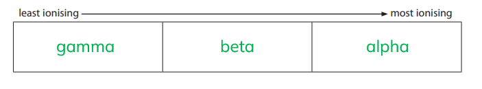

- Gamma, beta, alpha in correct order; **[1 mark]**

(ii) To describe two ways in which these ionising radiations can cause harm:

Any** two** from:

- Can damage / kill cells; **[1 mark]**
- Can cause mutation; **[1 mark]**
- Can cause cancer; **[1 mark]**
- Can cause burns; **[1 mark]**
- Can cause radiation poisoning; **[1 mark]**

**[Total: 3 marks]**

### 7((c)) — 3 marks
A completed table which would score 3 marks is:

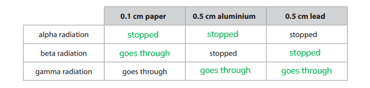

- *One mark for each correct row*

**[Total: 3 marks]**

## Q3 — easy — 9 marks · exam-questions

### 1() — 2 marks
Precautions that hospital staff might take when working with radioactivity are:

Any **two** from:

- Use short half-life isotopes; **[1 mark]**
- Use shielding / lead clothing; **[1 mark]**
- Maximise distance / work in another room; **[1 mark]**
- Conduct treatments in isolation; **[1 mark]**
- Minimise exposure time / use radiation badges; **[1 mark]**
- Consider transportation (to and from the hospital); **[1 mark]**
- Store in an appropriate container; **[1 mark]**

**[Total: 2 marks]**

### 2() — 2 marks
Other uses of radioactivity are:

Any **two** from:

- Sterilising / irradiating food;** [1 mark]**
- Sterilising medical equipment;** [1 mark]**
- Determining the age of ancient artefacts / rocks;** [1 mark]**
- Checking the thickness of materials;** [1 mark]**
- Smoke detectors / alarms;** [1 mark]**

**[Total: 2 marks]**

> *Be careful - if a question tells you not to give something as a potential answer, make sure you don't give it! This is a common mistake, so don't fall into the trap!*

### 3() — 3 marks
Correctly completed sentences are:

- If the aluminium foil gets too thin, the count rate at the detector **increases**; **[1 mark]**
- This sends a signal to a computer to push the rollers **further apart**;** ****[1 mark]**
- Beta particles are used because they **cannot **pass through a sheet of aluminium which is more than a few millimetres thick; **[1 mark]**

**[Total: 3 marks]**

### 4() — 2 marks
Gamma is the most suitable type of radiation for sterilising medical equipment because:

Any **two** from:

- It is the most penetrating out of all the types of radiation; **[1 mark]**
- It is penetrating enough to irradiate all sides of the instruments; **[1 mark]**
- Instruments can be sterilised without removing the packaging; **[1 mark]**

**[Total: 2 marks]**

> *You need to memorise the different uses of radiation, and be able to explain why different types of radiation are best suited to different uses.*

## Q4 — easy — 9 marks · exam-questions

### 1() — 1 marks
> **[mark-scheme]**
> State the definition of half-life:
> 
> - The time it takes for the number of radioactive nuclei to halve **OR** the time it takes for the activity / count rate to halve **[1 mark]**

> **[exam-tip]**
> Either definition earns the single mark, so give one of them cleanly rather than trying to combine both.
> 
> Be precise that it is the whole sample halving. An answer describing a single nucleus decaying, or splitting in half, does not score.

### 2() — 3 marks
> **[mark-scheme]**
> (i) How many half-lives are there in 10 years:
> 
> - 2 **[1 mark]**

(ii) To calculate the count rate of the cobalt-60 sample after 10 years:

- List the known quantities

  - Number of half-lives = 2
  - Initial count rate = 100 counts per minute

- Halve the count-rate once for each half-life that passes

Count-rate after 1 half-life = $\frac{100}{2} = 50$ counts per minute **[1 mark]**

Count-rate after 2 half-lives = $\frac{50}{2}$

Count-rate after 2 half-lives = **25 counts per minute** **[1 mark]**

> **[exam-tip]**
> Work one half-life at a time rather than trying to do it in a single step. Each half-life that passes halves the count rate again, so two half-lives take it to a quarter, not to a half.

### 3() — 5 marks
> **[mark-scheme]**
> (i) Why doctors wear a lead apron when they use radioactive isotopes:
> 
> - So that most of the gamma rays are absorbed by the lead and do not pass through to the doctor **[1 mark]**
> - To prevent the doctor's cells from being damaged / irradiated **[1 mark]**
> 
> (ii) The best radioactive isotope to use as a medical tracer is:
> 
> - Iodine-131 **[1 mark]**
> 
> This is because:
> 
> - Gamma radiation can pass through the body to the detector **OR** alpha radiation cannot pass through the body to the detector **[1 mark]**
> - An isotope with a shorter half-life does less damage to the patient's cells **[1 mark]**

> **[exam-tip]**
> The table gives you two things to weigh for each isotope: the type of radiation and the half-life. A good answer uses both, because either one on its own does not narrow the choice down to a single isotope.
> 
> The radiation has to escape the body to reach the detector, which rules out the alpha emitters. Of the two gamma emitters, the shorter half-life is kinder to the patient.
> 
> Whenever radiation is used medically, the damage done to cells is weighed against the benefit and kept as low as possible. That principle is what part (ii) is really testing.

## Q5 — easy — 5 marks · exam-questions

### 1() — 1 marks
**Correct answer: B** — Lead

**The correct answer is ****B**** ****because:**

- Lead can block α, β and reduce γ radiation

Aluminium will only block α and β radiation. Copper and steel will block some α, β and γ radiation, but it is not as effective as lead.

### 2() — 1 marks
**Correct answer: C** — Keep the source hot

**Final answer:** **The correct answer is ****C**** because:**

- The temperature of a source has no effect on its radioactivity

Shielding the source with lead, reducing the time spent handling the source and keeping as far away from the source as feasible are all effective ways of reducing the risk from radiation.

### 3() — 1 marks
State the half-life of the substance:

- 40 s; **[1 mark]**

**[Total: 1 mark]**

> *If the initial count-rate is 300 counts per second, then the half-life is the time it takes for this to fall to half of its starting level.*

> *Half of 300 is 150 counts per second. This takes 40 seconds.*

### 4() — 2 marks
Define and state the unit for the activity of a radioactive sample:

The activity of a radioactive sample is defined as:

- The number of nuclei (in the sample) that decay per second; **[1 mark] ****OR**
- The rate of nuclei decaying (in the sample); **[1 mark]**

The unit of activity is:

- Becquerels / Bq; **[1 mark]**

**[Total: 2 marks]**

## Q6 — medium — 7 marks · exam-questions

### 8((b)) — 2 marks
To explain why alpha particles from radon are a greater risk to health than the alpha particles from americium:

Any **two** from:

- Alpha particles are highly ionising; **[1 mark]**
- The range of alpha radiation is low; **[1 mark]**
- The penetrating power of alpha radiation is low **OR** alpha particles are blocked by skin; **[1 mark]**
- Radon (is a gas) so the particles are mobile **OR **Americium (is solid so) particles stay in place; **[1 mark]**
- Radon can be inhaled **OR **Americium stays in the smoke detector; **[1 mark]**

**[Total: 2 marks]**

This is an explain question, so you must think about cause and effect. What are the dangers of alpha radiation, and how do these apply to the different applications of the alpha sources?

Alpha is very dangerous inside the body because it is highly ionising and cannot pass through skin, therefore it can not escape the body once inside. Since radon is a gas and can be inhaled, this poses the greatest risk. The americium is a solid, and it is contained in the smoke detector, so it poses very little risk.

### 8((d)) — 5 marks
(i) Complete the graph by adding the missing unit for activity:

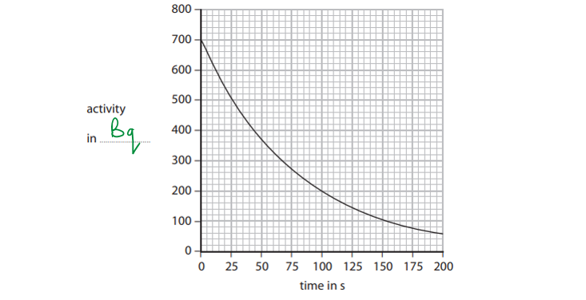

- The missing unit for activity is Bq / Becquerel(s); **[1 mark]**

(ii) To explain what is meant by the term half-life:

- The time taken; **[1 mark]**
- for (radio)activity to halve

**OR**

- for half of (radioactive) nuclei / atoms / isotope to decay; **[1 mark]**

(iii) To use the graph to find a value for the half-life of radon-220.

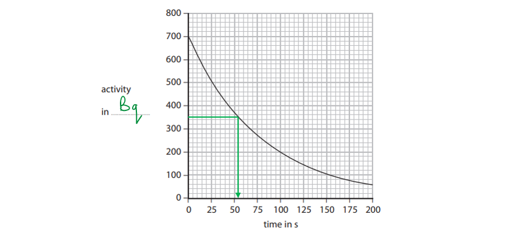

- The initial activity is 700 Bq, so half the initial activity is 350 Bq; **[1 mark]**
- Reading off the graph at 350 Bq gives a half-life of 55 s; **[1 mark]**

**[Total: 5 marks]**

## Q7 — medium — 4 marks · exam-questions

### 2((c)) — 2 marks
(i) State why the detector reading is never zero:

- (Because it is detecting) background radiation; **[1 mark]**

(ii) State why the detector reading is never constant:

- Radioactive decay is random / fluctuates; **[1 mark]**

**[Total: 2 marks]**

### 2((c)) — 2 marks
Fewer alpha particles will reach the detector if there is a fire because:

State what happens to the alpha particles:

Any **one** from:

- The alpha particles are <u>absorbed</u>; **[1 mark]**
- The alpha particles are <u>deflected</u>; **[1 mark]**
- The alpha particles are <u>stopped</u>;** [1 mark]**
- The alpha particles are <u>scattered</u>; **[1 mark]**

For the second marking point:

Give a reason why this occurs:

- The alpha particles are affected by the smoke; **[1 mark]**

**[Total: 2 marks]**

## Q8 — medium — 13 marks · exam-questions

### 6((a)) — 4 marks
(i) State a source of background radiation:

Any **one** from:

- Rocks; **[1 mark]**
- Radon (gas); **[1 mark]**
- Space; **[1 mark]**
- Cosmic rays;**[1 mark]**
- The Sun; **[1 mark]**
- Medical sources; **[1 mark]**
- From carbon atoms in living things; **[1 mark]**
- A named food (e.g. coffee); **[1 mark]**

(ii) To describe a method to correct for background radiation:

Any **three** from the following statements:

State what to do with the radioactive source:

- Remove the radioactive source; **[1 mark]**

State what to measure:

- Measure the background count rate; **[1 mark]**

State how to improve accuracy:

- Repeat the reading and find an average; **[1 mark]**

State the calculation performed:

- Subtract this value from the experimental values; **[1 mark]**

**[Total: 4 marks]**

> *Medical sources is required to obtain a mark in this question. Simply stating X-rays is not sufficient to obtain this.*

### 6((b)) — 6 marks
(i) A graph which would score five marks would look like:

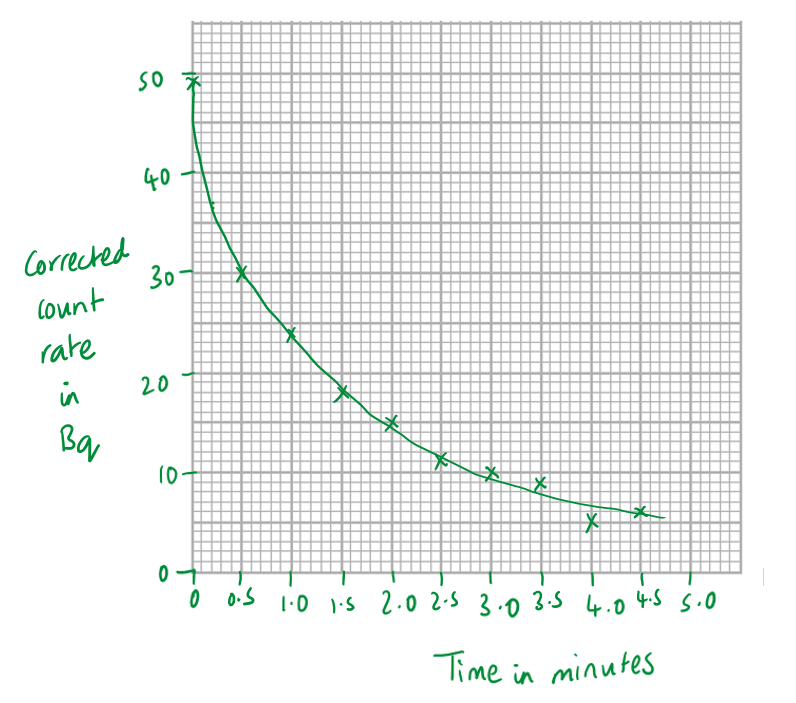

- Scale of at least half the graph paper; **[1 mark]**
- Axes labelled including units; **[1 mark]**
- Plotting to nearest small square for points 0 to 2.0; **[1 mark]**
- Plotting to nearest small square for points 2.5 to 4.5; **[1 mark]**
- Best fit line to include at least 5 points; **[1 mark]**

(ii) To find the half-life of the material:

Read the value off the graph when activity falls to half the initial value:

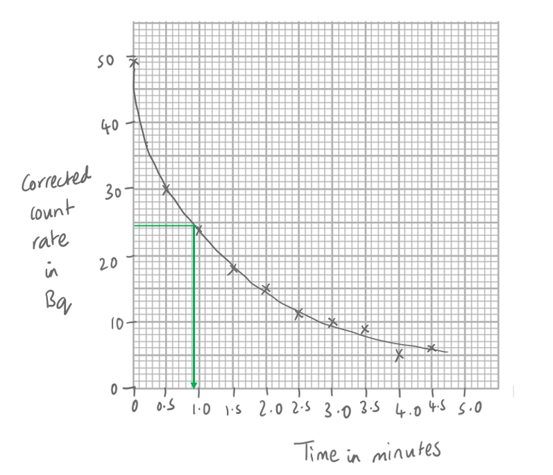

- A value between 0.8 and 1.0 minutes; **[1 mark]**

**[Total: 6 marks]**

### 6((c)) — 3 marks
The isotope technitium-99 is suitable for use as a tracer because:

State the penetrating power:

- The gamma radiation can be detected outside the body; **[1 mark]**

Describe the role of half-life:

- The half-life is long enough for the tracer to get around the body; **[1 mark]**

Comment on patient safety:

- The half-life is short enough that it falls to low levels soon after use; **[1 mark]**

**[Total: 3 marks]**

> *The radiation is not absorbed by the body's tissues does not provide enough information to be awarded a mark, as it is because the gamma radiation can be detected outside the body that makes it a suitable tracer. *

## Q9 — medium — 5 marks · exam-questions

### 7((a)) — 2 marks
A correctly completed equation would look like:

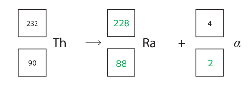

- Correct top line; **[1 mark]**
- Correct bottom line; **[1 mark]**

**[Total: 2 marks]**

> *The sum of the atomic numbers and mass numbers on both sides of the equation must be equal. The alpha particle is a helium nucleus with an atomic number of 2 and a mass number of 4.  *

### 7((b)) — 3 marks
(i)Suggest why it is safe to use radioactive glass in the camera:

- Alpha particles will be absorbed by the glass

**OR**

- Beta particles will be absorbed by the aluminium; **[1 mark]**

(ii) To explain why astronomers should not use the radioactive glass close to their eye:

Any **two** from:

- Radiation is ionising; **[1 mark]**
- The radiation would be able to travel the short distance from the glass to the eye; **[1 mark]**
- With no protection, this could damage the eye, potentially causing cell mutation or blindness; **[1 mark]**
- This is a particular risk for the astronomer since they are likely to suffer prolonged exposure; **[1 mark]**

**[Total: 3 marks] **

## Q10 — medium — 6 marks · exam-questions

### 6((a)) — 1 marks
> **[mark-scheme]**
> Explain how the background activity value should be used in the investigation:
> 
> - The background activity is subtracted from each measurement, to give the activity of the isotope alone **[1 mark]**

> **[exam-tip]**
> Background radiation is always present, so every reading the teacher takes is too high by roughly the same amount. Subtracting it from each one, rather than from the final answer, is what leaves the activity of the sample by itself.

### 6((b)) — 2 marks
> **[mark-scheme]**
> Explain what is meant by the term half-life:
> 
> - The time taken **[1 mark]**
> - For the activity to halve **OR** for half of the radioactive nuclei to decay **[1 mark]**

> **[exam-tip]**
> Half-life describes a whole sample halving, never a single nucleus splitting in two — an answer that describes one nucleus decaying does not score.
> 
> A sample never decays away completely to zero activity. Each half-life removes half of what is left, so there is always something remaining.

### 6((c)) — 3 marks
(i) Use the graph to find the half-life of the isotope:

- The initial activity is 2400 Bq, so read across from half of that, 1200 Bq, to the curve and down to the time axis

Half-life = $56 \text{s}$ **[2 marks]**

> **[mark-scheme]**
> 1 mark for evidence that the graph has been used, such as construction lines drawn to two correct points
> 
> 1 mark for a half-life of 56 s, accepting anything from 53 s to 59 s

> **[mark-scheme]**
> (ii) Suggest why the teacher measures the activity so frequently:
> 
> Any **one** from:
> 
> - More frequent readings give a smoother, better defined curve
> - The activity changes quickly
> - The isotope has a short half-life, so the decay takes very little time
> 
> **[1 mark]**

> **[exam-tip]**
> When a question says to use the graph, draw the construction lines on it. Without them you can lose the method mark even with the right value.
> 
> Start by reading the initial activity off the graph, then halve it. The half-life is the time taken to fall to that halved value, not a time you can guess from the shape of the curve.
> 
> In part (ii), the reason is about how fast this isotope decays, not about radiation safety or the stability of the sample.

## Q11 — medium — 9 marks · exam-questions

### 7((a)) — 5 marks
(i) State the mass number of the isotope:

- The mass number is the larger number at the top of the symbol

  - The mass number of strontium is 90; **[1 mark]**

(ii) To explain what is meant by the term half-life:

- The time taken; **[1 mark]**
- For (radio)activity to halve

**OR**

- For half of (radioactive) nuclei / atoms / isotope to decay; **[1 mark]**

(iii) To explain why strontium-90 in the bones is a serious health hazard:

Any **two** from:

- The beta particles emitted by strontium-90 will all be absorbed by the body; **[1 mark]**
- Beta particles can ionise tissues, which damages them and can cause mutations in DNA; **[1 mark]**
- Strontium-90 has a long half-life, so it can remain harmful for a long period of time; **[1 mark]**

**[Total: 5 marks]**

### 7((b)) — 4 marks
(i) An completed equation which would gain 2 marks is:

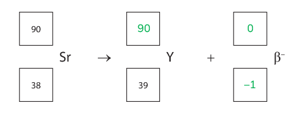

- Correct mass number of yttrium; **[1 mark]**
- Correct values for the beta particle; **[1 mark]**

(ii) To explain why strontium-90 and yttrium-90 can both be described as isotopes:

Any **two** from:

- Isotopes are atoms of the same element with different numbers of neutrons but the same number of protons;** [1 mark]**
- Since strontium and yttrium are different elements, they will have a different number of protons; **[1 mark]**
- Strontium-90 and yttrium-90 have the same number of protons as other atoms of their respective elements, so they are isotopes;** [1 mark]**

**[Total: 4 marks]**

## Q12 — medium — 2 marks · exam-questions

### 1((b)) — 2 marks
To explain why iodine-131 is suitable for this treatment.

Any **two** from:

- Beta is (moderately) ionising; **[1 mark]**
- Beta has a short range; **[1 mark]**
- Idea that Iodine-131 has a short half-life; **[1 mark]**
- Idea that iodine is absorbed (easily) by the thyroid; **[1 mark]**
- This reduces damage to healthy cells; **[1 mark]**
- Beta does not penetrate out of the body; **[1 mark]**
- Therefore the beta kills only tumour cells; **[1 mark]**

**[Total: 2 marks]**

> *An example of an answer which would gain two marks is:*

- *lodine-131 emits moderately ionising beta particles which only have a short range and so will be localised to the tumour in the body; ***[1 mark]**
- *This will reduce the damage to other healthy cells, as it is only beta particles that are emitted, these will not pass out of the body and so will be safe to use as a treatment; ***[1 mark]**

## Q13 — medium — 3 marks · exam-questions

### 1((b)) — 3 marks
To explain why beta particles are used, rather than alpha particles or gamma rays:

Any** three **from:

- Alpha particles would not be able to penetrate the aluminium foil to get to the detector; **[1 mark]**
- Gamma rays would not be affected by the thickness of the aluminium foil; **[1 mark]**
- Some beta particles will pass through the foil but some will be absorbed; **[1 mark]**
- The thicker the foil the fewer beta particles will pass through and so activity at the detector will fall; **[1 mark]**

**[Total: 3 marks]**

> *This question is worth three marks, so only three of the above points are required to gain full marks. *

## Q14 — medium — 8 marks · exam-questions

### 1() — 3 marks
To complete the nuclear equation for the decay of thorium-232 into radon-220:

- State the missing numbers for the alpha particle

  - Mass number = 4, atomic number = 2

`Th presubscript 90 presuperscript 232 space rightwards arrow space Rn presubscript 86 presuperscript 220 space plus space...... space straight alpha presubscript 2 presuperscript 4 space space space plus space...... space straight beta presubscript negative 1 end presubscript presuperscript 0`

- Determine the number of alpha decays by balancing the mass numbers

$232=220+4α$

$4α=12$

$α=3$

- Determine the number of beta decays by balancing the proton numbers

$90=86+2α-β$

`90 space equals space 86 space plus space open parentheses 2 cross times 3 close parentheses space minus space beta`

$β=86+6-90$

$β=2$

- Complete the nuclear equation by filling in the missing numbers:

`Th presubscript 90 presuperscript 232 space rightwards arrow space Rn presubscript 86 presuperscript 220 space plus space 3 space straight alpha presubscript 2 presuperscript 4 space space space plus space 2 straight beta presubscript negative 1 end presubscript presuperscript 0`

**[3 marks]**

> **[mark-scheme]**
> 1 mark for the correct numbers for alpha particle = `alpha presubscript 2 presuperscript 4`
> 
> 1 mark for the correct number of alpha decays = 3
> 
> 1 mark for the correct number of beta decays = 2

> **[exam-tip]**
> The only emission that changes mass number is alpha emission. An alpha particle contains two protons and two neutrons, so if the mass of the nucleus decreases by 4, one alpha particle has been emitted. This is why, when solving questions like this, it's best to balance the mass numbers first (the top row).

### 2() — 5 marks
> **[mark-scheme]**
> (i) Half-life is:
> 
> - The time taken for the activity of a (radioactive) substance to halve
> **OR**
> - The time taken for half of the nuclei / atoms / mass of a (radioactive) substance to decay **[1 mark]**

(ii) To calculate how long it takes for the activity of the sample to decrease:

- List the known quantities:

  - Half-life, $T_{1/2}=55.6s$
  - Initial activity of radon $=760\mathrm{Bq}$
  - Final activity of radon $=95\mathrm{Bq}$
- Determine how many half-lives have passed:

$760\mathrm{Bq}\overset{\frac{1}{2}}{\rightarrow}380\mathrm{Bq}\overset{\frac{1}{2}}{\rightarrow}190\mathrm{Bq}\overset{\frac{1}{2}}{\rightarrow}95\mathrm{Bq}$

The activity has halved 3 times

So 3 half-lives have passed **[1 mark]**

- Calculate how long this takes:

$T_{1/2}=55.6s$

$3T_{1/2}=3\times55.6s$

$\mathrm{Time} \mathrm{taken}=167s$ **[1 mark]**

> **[mark-scheme]**
> (iii) Radon gas is harmful if inhaled because:
> 
> Any **two **from (1 mark each):
> 
> - Alpha radiation is highly ionising
> - Alpha is most dangerous when in the body, as it can cause cell mutations / cancer / irradiation of internal organs
> - (Short half-life means that) activity will be very high / decays very quickly
> 
> **[2 marks]**

## Q15 — hard — 1 marks · exam-questions

### 1((c)) — 1 marks
**Correct answer: A** — 1.5 g

**Final answer:** **The correct answer is ****A**** because:**

- In 11 400 years there are 2 half-lives of 5700 years
- After one half-life the mass of carbon-14 remaining will be reduced by half

  - This leaves 3.0 g
- After a second half-life the mass of carbon-14 remaining will reduce in half again

  - This leaves 1.5 g
- Therefore the mass remaining after 11 400 years is 1.5 g

  - This is answer **A**

## Q16 — hard — 6 marks · exam-questions

### 9((c)) — 4 marks
> **[mark-scheme]**
> (i) Explain what is meant by the term half-life:
> 
> - The time taken **[1 mark]**
> - For the activity to halve **OR** for half of the radioactive nuclei to decay **[1 mark]**

> **[exam-tip]**
> "Half the time" does not earn the mark. Half-life is the time for the activity, or the number of undecayed nuclei, to fall to half — not half of some other time.
> 
> Describe the whole sample halving. An answer about one nucleus or one atom decaying does not score.

(ii) Use the graph to estimate the half-life of tritium:

- Read the initial activity off the graph at a time of 0 years

Initial activity = 1200 counts per minute

- Calculate the activity after one half-life

Activity after one half-life = $\frac{1200}{2}$

Activity after one half-life = 600 counts per minute

- Read the time off the graph at an activity of 600 counts per minute

Half-life of tritium = $13 . 5 \text{years}$ **[2 marks]**

> **[mark-scheme]**
> 1 mark for working shown, or for the construction line drawn at an activity of 600 counts per minute
> 
> 1 mark for a half-life of 13.5 years, accepting anything from 13.0 to 14.0 years

### 9((d)) — 2 marks
> **[mark-scheme]**
> Evaluate the manufacturer's claim:
> 
> - The manufacturer is correct **[1 mark]**
> - Because the activity does not fall to 400 counts per minute until about 21.5 years **OR** because the activity is still about 420 counts per minute at 20 years **[1 mark]**

> **[exam-tip]**
> "Evaluate" needs both halves: say whether the claim holds, and then give the figure from the graph that shows it. A judgement with no supporting value earns one mark at most.
> 
> Either route works. You can read the time at which the activity reaches 400, or read the activity at 20 years and compare it with 400 — pick whichever is easier to read off your graph.

## Q17 — hard — 9 marks · exam-questions

### 11((a)) — 2 marks
Explain what is meant by the term half-life:

- The time taken; **[1 mark]**
- For (radio)activity to halve

**OR**

- For half of (radioactive) nuclei / atoms / isotope to decay; **[1 mark]**

**[Total : 2 marks]**

### 11((b)) — 2 marks
Suggest why isotopes which emit alpha particles and beta particles are not suitable for this use:

Any **two** from:

- Alpha and beta particles have insufficient range / penetration; **[1 mark]**
- Alpha and beta particles would be absorbed by the patient / air; **[1 mark]**
- Alpha and beta particles are more ionising (than gamma) / they are more likely to cause cancer; **[1 mark]**

**[Total: 2 marks]**

> *'Damage cells' would also be acceptable for the final marking point.*

### 11((c)) — 5 marks
(i) To explain why the radioactivity of a radioactive sample reduces with time:

Any **two** from:

- Activity of a sample is due to the nucleus decaying / being unstable / changing into a new isotope / emitting gamma radiation; **[1 mark]**
- (After some time) fewer radioactive nuclei are left; **[1 mark]**
- This means the number of nuclei decaying per second decreases;** [1 mark]**

(ii) To calculate the activity of the technetium-99m sample after 24 hours:

List the known quantities:

- Initial activity = 420 MBq
- Half-life = 6 hours
- Time passed = 24 hours

Determine the number of half-lives in 24 hours:

- $\mathrm{Number} \mathrm{of} \mathrm{half} \mathrm{lives}=\frac{\mathrm{Time} \mathrm{passed}}{\mathrm{Half} \mathrm{life}}$
- $\mathrm{Number} \mathrm{of} \mathrm{half} \mathrm{lives}=\frac{24}{6}=4$ **[1 mark]**

State the change to activity per half-life:

- The activity will halve for every half-life that has passed; **[1 mark]**

Calculate the activity of the sample after 24 hours:

- `Activity space equals 420 cross times open parentheses 1 half close parentheses to the power of 4 equals 26 space MBq`** [1 mark]**

**[Total: 5 marks]**

> `open parentheses 1 half close parentheses to the power of 4`* is the same as *`open parentheses 1 half close parentheses cross times open parentheses 1 half close parentheses cross times open parentheses 1 half close parentheses cross times open parentheses 1 half close parentheses`* or *$\frac{1}{16}$*.*

## Q18 — hard — 9 marks · exam-questions

### 4((c)) — 3 marks
A graph which would gain three marks would look like:

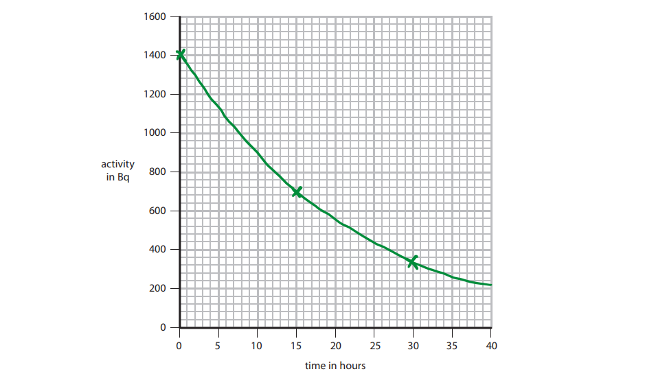

- The line goes through (0, 1400) and (15, 800); **[1 mark]**
- The line goes through (30, 350); **[1 mark]**
- The line is curved and passes through the points marked and continues past 35 hours; **[1 mark]**

**[Total: 3 marks]**

> *A tolerance of ±1 square is allowable.*

### 4((d)) — 6 marks
(i) To explain how scientists can use the radioactivity to find the age of a piece of granite:

Any **four **from:

- There is a known proportion / composition / activity when rocks are formed; **[1 mark]**
- Scientists can measure the proportion of uranium or the activity of the sample now; **[1 mark]**
- That activity can be compared with the original activity; **[1 mark]**
- The scientists can determine the time or number of half-lives elapsed; **[1 mark]**
- And hence calculate the age of the granite through knowledge of the half-life; **[1 mark]**

(ii) To suggest why the age of a piece of granite could not be found using a uranium isotope with a half-life of 15 hours:

State the role of the half-life:

- The half-life is too short

**OR**

- The decay occurs too quickly / rapidly; **[1 mark]**

Explain why this means the age cannot be determined:

- The <u>uranium isotope</u> would (all) have decayed (long ago)

**OR**

- <u>Uranium activity</u> would be too small to distinguish from background / to measure; **[1 mark]**

**[Total: 6 marks]**

## Q19 — hard — 17 marks · exam-questions

### 12((a)) — 5 marks
(i) To state two sources of background radiation:

Any **two** from:

- Radiation from rocks/buildings/radon gas; **[1 mark]**
- Cosmic radiation / radiation from the Sun / stars; **[1 mark]**
- Radiation from medical sources; **[1 mark]**
- Nuclear waste / accidents; **[1 mark]**
- Some foods e.g. coffee, bananas; **[1 mark]**

(ii) To describe how the scientist should measure the background radiation and correct the count rate readings:

Any **three** from the following statements:

State what to do with the radioactive source:

- Remove the radioactive source; **[1 mark]**

State what to measure:

- Measure the background count rate; **[1 mark]**

State how to improve accuracy:

- Repeat the reading and find an average; **[1 mark]**

State the value of the background count rate from the data table:

- The background radiation is 30 (counts per minute); **[1 mark]**

State the calculation performed:

- Subtract this value from (each) reading(s); **[1 mark]**

**[Total: 5 marks]**

### 12((a)) — 7 marks
(i) A graph which would score 5 marks is:

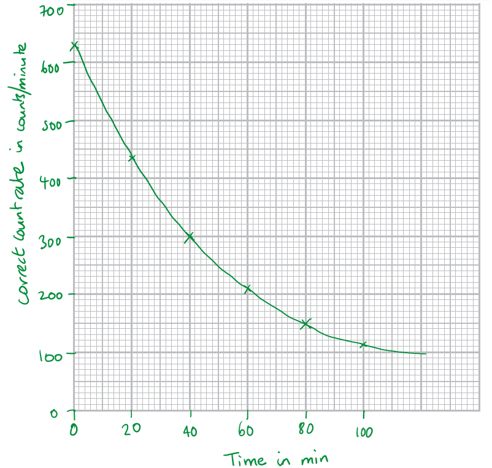

- Scale of at least half the graph paper; **[1 mark]**
- Axes labelled including units; **[1 mark]**
- Plotting to nearest small square for points 0, 20 and 40; **[1 mark]**
- Plotting to nearest small square for points 60, 80 and 100; **[1 mark]**
- Best fit line to include at least 5 points; **[1 mark]**

(ii) To find the half-life of the radioactive source:

Draw on the graph to find the time for the count rate to reduce by half; **[1 mark]**

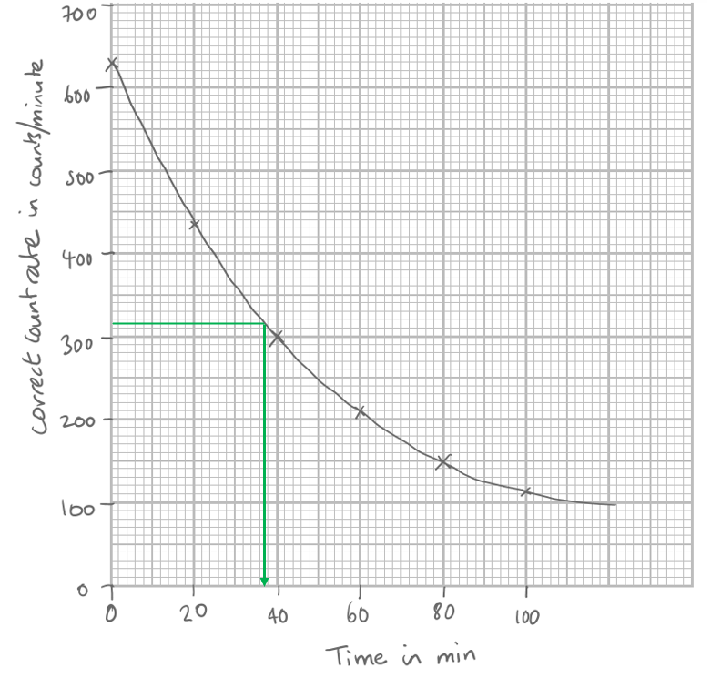

Read off the correct value for half-life:

- Value in the range 35-42 minutes; **[1 mark]**

**[Total: 7 marks]**

> *Any halving of the count rate will give the correct value of half-life, but it is usually easiest to halve the initial count rate.*

### 12((b)) — 5 marks
(i) To explain why radioactive sources can be dangerous:

State the nature the radiation emitted:

- (Radioactive sources emit) ionising radiation; **[1 mark]**

State the effect of this radiation:

Any **one **from:

- Cannot be seen; **[1 mark]**
- Can damage/harm cells; **[1 mark]**
- Can cause tumours / cancer; **[1 mark]**
- (Neutron changes) into a proton; **[1 mark]**

(ii) Describe how the risks of working with radioactive sources can be reduced.

Any **three** from:

- Reduce exposure time; **[1 mark]**
- Handle with tongs/use robotic handling/keep at a distance; **[1 mark]**
- Use shielding / work in fume cupboard; **[1 mark]**
- Wear film badge / monitor; **[1 mark]**

**[Total: 5 marks]**

> *A correct answer given in terms of quarks is also acceptable: A down quark changes to an up quark. *
