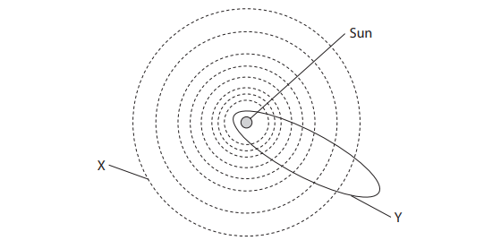
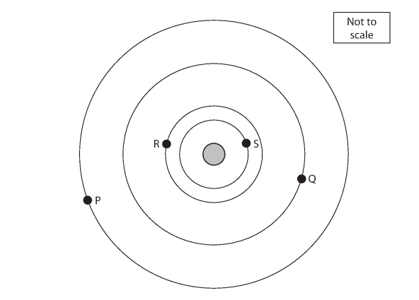
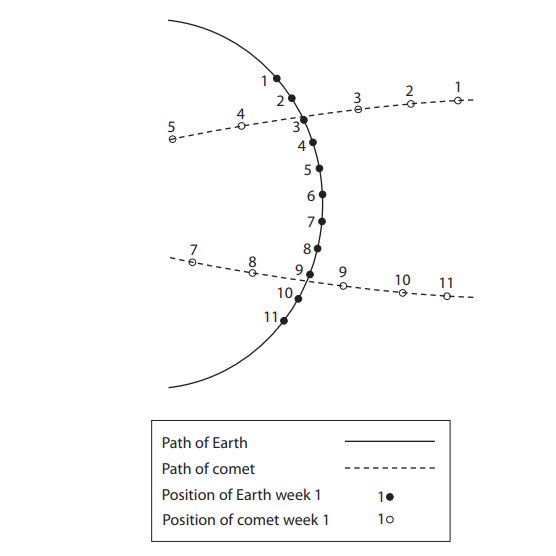
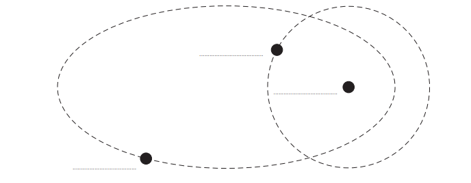
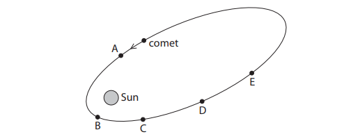
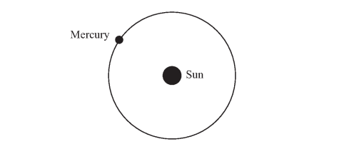

# Exam Questions — Motion in the Universe
**8. Astrophysics** · Edexcel IGCSE Physics (4PH1)
> Source: [https://www.savemyexams.com/igcse/physics/edexcel/19/topic-questions/8-astrophysics/8-1-motion-in-the-universe/exam-questions/](https://www.savemyexams.com/igcse/physics/edexcel/19/topic-questions/8-astrophysics/8-1-motion-in-the-universe/exam-questions/) · 17 questions · total 93 marks

## Q1 — easy — 3 marks · exam-questions

### 1((a)) — 1 mark — multiple_choice — from paper 2012 June · 2P
The diagram shows the orbits of some objects in the Solar System.

Path X is the orbit of a
- **A.** Comet
- **B.** Galaxy
- **C.** Planet
- **D.** Star

### 1((a)) — 1 mark — multiple_choice — from paper 2012 June · 2P
Path Y is the orbit of a
- **A.** Comet
- **B.** Galaxy
- **C.** Planet
- **D.** Star

### 1((b)) — 1 mark — multiple_choice — from paper 2012 June · 2P
The objects are held in orbit by
- **A.** Electrostatic force
- **B.** Frictional force
- **C.** Gravitational force
- **D.** Magnetic force

## Q2 — easy — 1 marks · exam-questions

### 6((a)) — 1 mark — multiple_choice — from paper 2013 June · 1P
The object at the centre of our Solar System is
- **A.** A comet
- **B.** The Earth
- **C.** The Moon
- **D.** The Sun

## Q3 — easy — 1 marks · exam-questions

### 3((a)) — 1 mark — multiple_choice — from paper 2016 January · 1P
The diagram shows four planets, P, Q, R and S, orbiting a star.

This combination of planets and a star is most like
- **A.** A galaxy
- **B.** The Milky Way
- **C.** The Solar System
- **D.** The Universe

## Q4 — easy — 6 marks · exam-questions

### 3((b)) — 1 mark — command: draw — structured — from paper 2016 January · 1P
The diagram shows four planets, P, Q, R and S, orbiting a star.

Planet Q has a moon.

On the diagram, draw the orbit of this moon.

### 3((c)) — 2 marks — command: draw — structured — from paper 2016 January · 1P
On the diagram from part (a), draw the orbit of a comet.

### 3((d)) — 1 mark — command: suggest — structured — from paper 2016 January · 1P
Planets nearer to the star take less time to orbit the star.

Suggest why.

### 3((e)) — 2 marks — command: calculate — structured — from paper 2016 January · 1P
As the planets orbit the star, the distances between the planets change.

Planet P is 200 million km from the star and planet R is 50 million km from the star.

(i) Calculate the maximum distance between planet P and planet R.

maximum distance = ........................................... million km

(ii) Calculate the minimum distance between planet P and planet R.

maximum distance = ........................................... million km

## Q5 — easy — 5 marks · exam-questions

### 10((a)) — 2 marks — command: state — structured — from paper 2014 June · 1P
The Moon orbits the Earth.

State a difference between the orbit of a moon and the orbit of a planet.

### 10((b)) — 3 marks — command: calculate — structured — from paper 2014 June · 1P
The radius of the Moon’s orbit is 385 000 km.

It takes 27 days for the Moon to complete one orbit.

Calculate the orbital speed of the Moon.

Give a suitable unit.

orbital speed = ............................. unit .........................

## Q6 — medium — 1 marks · exam-questions

### 6((a)) — 1 mark — multiple_choice — from paper 2016 June · 1P
A comet passes close to the Earth. An astronomer observes the position of the comet and the Earth on the same day each week for several weeks.

The diagram shows her observations for weeks 1 to 11.

The observation showing the comet nearest to the Earth was made during
- **A.** Week 7
- **B.** Week 8
- **C.** Week 9
- **D.** Week 10

## Q7 — medium — 1 marks · exam-questions

### 10((a)) — 1 mark — multiple_choice — from paper 2015 June · 1P
Which list gives the astronomical objects in order of size, starting with the largest?
- **A.** Galaxy - Solar System - planet - sun
- **B.** Galaxy -  Solar system - Sun - planet
- **C.** Planet - galaxy - Solar System - Sun
- **D.** Planet - Solar System - Sun - galaxy

## Q8 — medium — 1 marks · exam-questions

### 3() — 1 mark — multiple_choice — from paper 2016 January · 1P
The diagram shows four planets, P, Q, R and S, orbiting a star.

Planet P makes one complete orbit.

During this time
- **A.** Planet R makes more orbits than S
- **B.** Planet R makes fewer orbits than Q
- **C.** Planet S makes more orbits than P
- **D.** Planet Q makes fewer orbits than P

## Q9 — medium — 4 marks · exam-questions

### 2((a)) — 1 mark — command: which — structured — from paper 2015 January · 2P
Planets and comets in our Solar System orbit the Sun.

Which force causes planets and comets to orbit the Sun?

### 2((b)) — 3 marks — command: multiple — structured — from paper 2015 January · 2P
The diagram [not to scale] shows the orbits of a planet and a comet around the Sun.

(i) On the diagram, label the planet, the comet and the Sun.

(ii) Explain why it is possible for a planet and a comet in our Solar System to collide.

## Q10 — medium — 9 marks · exam-questions

### 6((a)) — 3 marks — command: multiple — structured — from paper 2016 June · 1P
A comet passes close to the Earth. An astronomer observes the position of the comet and the Earth on the same day each week for several weeks.

The diagram shows her observations for weeks 1 to 11.

(i) Complete the path for the comet between week 5 and week 7.

(ii) Mark an X on the diagram to show the position of the Sun.

(iii) Suggest why the astronomer did not observe the comet during week 6.

### 6((a)) — 3 marks — command: multiple — structured — from paper 2016 June · 1P
(i) Explain how the diagram shows that the speed of the comet changes as it moves from position 1 to position 5.

(ii) Suggest why the speed of the comet changes.

### 6((b)) — 3 marks — command: calculate — structured — from paper 2016 June · 1P
The Earth orbits the Sun once in 365 days. The radius of the Earth’s orbit is 150 000 000 km.

Calculate the orbital speed of the Earth in kilometres per hour.

## Q11 — medium — 8 marks · exam-questions

### 2((a)) — 4 marks — command: complete — structured — from paper 2016 June · 1PR
These sentences are about astronomy.

The Earth is an astronomical object.

One astronomical object smaller than the Earth is ............................ .

Two astronomical objects larger than the Earth are ............................ and ............................ .

The Milky Way is the name given to our ............................ .

Complete the sentences by writing words in the blank spaces.

### 2((b)) — 4 marks — command: multiple — structured — from paper 2016 June · 1PR
The diagram shows the path followed by a comet as it moves around the Sun.

A, B, C, D and E are points on the comet’s orbit.

(i) State the name of the force that causes the comet to orbit the Sun.

(ii) At which of the points shown is the force on the comet greatest?

(iii) Draw an arrow at point D to show the direction of the force acting on the comet.

(iv) At which of the points shown does the comet have the greatest kinetic energy?

## Q12 — medium — 8 marks · exam-questions

### 4((a)) — 3 marks — command: calculate — structured — from paper 2013 January · 1P
The planet Mercury orbits the Sun.

Mercury takes 88 days to orbit the Sun.

The average radius of the orbit is 58 million km.

Calculate the average orbital speed of Mercury. Give the unit.

### 4((b)) — 2 marks — command: multiple — structured — from paper 2013 January · 1P
Comets also orbit the Sun.

(i) Name the force that causes comets and planets to orbit the Sun.

(ii) Add to the diagram in part (a) to show the orbit of a typical comet.

### 4((b)) — 3 marks — command: multiple — structured — from paper 2013 January · 1P
The speed of a comet changes during its orbit.

(i) On the orbit you have drawn, label with the letter X the position where the comet travels at its fastest speed.

(ii) Explain why the comet travels fastest at point X.

## Q13 — hard — 11 marks · exam-questions

### 9((a)) — 1 mark — command: name — structured — from paper 2012 January · 1P
The Hubble Space Telescope is in orbit around the Earth. It detects visible light from distant objects.

Name the force that keeps the telescope in orbit around the Earth.

### 9((b)) — 4 marks — command: calculate — structured — from paper 2012 January · 1P
The Hubble Space Telescope moves in a circular orbit. Its distance above the Earth’s surface is 560 km.

The radius of the Earth is 6400 km and the Hubble Space Telescope completes one orbit in 96 minutes.

(i) Calculate the radius of the orbit of the Hubble Space Telescope.

Orbital radius = ........................ km

(ii) Calculate the Hubble Space Telescope's orbital speed in m/s.

Orbital speed = ........................ m/s

### 9((b)) — 3 marks — command: explain — structured — from paper 2012 January · 1P
The Chandra Telescope also orbits the Earth, but does not move in a circular orbit.

Its distance from the Earth and its speed change as it orbits the Earth.

It travels fastest when it is closest to the Earth.

Use ideas about energy to explain why.

### 9((b)) — 3 marks — command: multiple — structured — from paper 2012 January · 1P
The Chandra Telescope detects X-rays from distant objects.

(i) State the name of the type of wave that includes X-rays and visible light.

(ii) Describe two differences between X-rays and visible light.

## Q14 — hard — 5 marks · exam-questions

### 10((a)) — 1 mark — command: state — structured — from paper 2014 January · 1P
The Astra satellite is in an orbit around the Earth. The satellite uses microwave signals for communication.

State one property of electromagnetic waves that makes microwaves suitable for communications with a satellite in space.

### 10((b)) — 4 marks — command: calculate — structured — from paper 2014 January · 1P
The Astra satellite takes 24 hours to orbit the Earth once. It travels at a speed of 3.1 km/s.

Calculate the orbital radius of the satellite and give the unit.

Orbital radius ........................ unit …........

## Q15 — hard — 8 marks · exam-questions

### 10((b)) — 3 marks — command: state — structured — from paper 2015 June · 1P
The Earth and Mars are planets in our Solar System.

(i) State two ways in which the orbits of Earth and Mars are similar.

(ii) State one way in which the orbits of Earth and Mars are different.

### 10((c)) — 3 marks — command: calculate — structured — from paper 2015 June · 1P
Deimos is a moon that orbits the planet Mars. The radius of its orbit is 23 500 km and its time period is 1.26 days.

Calculate the orbital speed of Deimos. Give your answer to 2 significant figures.

orbital speed = ................................ km / day

### 10((d)) — 2 marks — command: explain — structured — from paper 2015 June · 1P
Enceladus is a moon that orbits the planet Saturn.

Enceladus has a similar orbital period to that of Deimos, but its orbital speed is about 10 times larger.

Explain how this is possible.

## Q16 — hard — 9 marks · exam-questions

### 6((b)) — 2 marks — command: calculate — structured — from paper 2013 June · 1P
Earth and Mars are planets in our Solar System.

The table shows some data for these planets.

| planet | radium of orbit in km | time of orbit in days |
|---|---|---|
| Earth | 150 000 000 | 365 |
| Mars | 250 000 000 | 690 |

Calculate the orbital speed of Mars in km / day.

speed = ...................................................... km / day

### 6((b)) — 2 marks — command: explain — structured — from paper 2013 June · 1P
The distance between Earth and Mars varies between 100 million km and 400 million km.

Explain why this distance is not constant. You may draw a diagram to help your answer.

### 6((c)) — 3 marks — command: show — structured — from paper 2013 June · 1P
Visible light from Mars reaches the Earth.

The speed of light is 300 000 km / s.

Show that when the planets are 170 000 000 km apart, it takes about 600 s for light to travel this distance.

### 6((c)) — 2 marks — command: suggest — structured — from paper 2013 June · 1P
Scientists land a remote-controlled vehicle on Mars. The vehicle sends images back to Earth showing its surroundings on Mars. Sometimes these images show rocks ahead that could damage the vehicle.

A scientist on Earth sends radio signals that control this vehicle.

The speed of the vehicle is limited to 0.04 m/s.

Suggest why the speed is kept low.

## Q17 — hard — 12 marks · exam-questions

### 10((a)) — 1 mark — command: which — structured — from paper 2015 June · 1PR
The table shows some data about planets in our Solar System.

| Planet | Diameter in km | Distance from Sun in 106 km | Time of orbit in Earth days or Earth years | Mass of planet in 1024 kg |
|---|---|---|---|---|
| Mercury | 4 880 | 58 | 88 d | 0.33 |
| Venus | 12 100 | 108 | 224 d | 4.9 |
| Earth | 12 800 | 150 | 365 d | 6.0 |
| Mars | 6 790 | 228 | 687 d | 0.64 |
| Jupiter | 143 000 | 778 | 11.9 y | 1 900 |
| Saturn | 121 000 | 1 427 | 29.5 y | 570 |
| Uranus | 51 000 | 2 870 | 84 y | 87 |
| Neptune | 50 000 | 4 497 | 165 y | 100 |

Use data from the table to answer these questions.

Which planet has about the same diameter as the Earth?

### 10((b)) — 1 mark — command: suggest — structured — from paper 2015 June · 1PR
Jupiter has the largest gravitational field strength.

Suggest a reason for this.

### 10((c)) — 4 marks — command: multiple — structured — from paper 2015 June · 1PR
(i) State the equation linking density, mass and volume.

(ii) Calculate the density of Neptune in kg/km3. You may assume that Neptune is a sphere and that its volume is given by

$volume=\frac{4πr^{3}}{3}$.

density = ............................................. kg /km3

### 10((d)) — 3 marks — command: calculate — structured — from paper 2015 June · 1PR
Calculate the orbital speed of Earth in km / s.

orbital speed = .......................................... km / s

### 10((e)) — 3 marks — command: evaluate — structured — from paper 2015 June · 1PR
A student says:

'The smaller the planet, the shorter its period of orbit'

Use data from the table to evaluate this statement.
