# Mark Schemes — Stellar Evolution
**8. Astrophysics** · Edexcel IGCSE Physics (4PH1)

## Q1 — easy — 7 marks · exam-questions

### 1() — 3 marks
A correct sentence using the words from the box to complete the gaps is:

- A very dense **neutron** star is left behind; **[1 mark]**
- When a large red **giant** star blows up; **[1 mark]**
- In an explosion called a **supernova**; **[1 mark]**

**[Total: 3 marks]**

### 2() — 1 marks
**Correct answer: D** — Colour

**Final answer:** **The correct answer is ****D ****because: **

- Stars are classified according to their colour

- Warm objects emit infrared and extremely hot objects emit visible light as well

  - Therefore, the **colour** they emit depends on how **hot** they are

### 3() — 3 marks
A diagram with lines drawn correctly should look like this:

- Line drawn from hot to blue; **[1 mark]**
- Line drawn from medium temperature to yellow; **[1 mark]**
- Line drawn from cold to red;** [1 mark]**

**[Total: 3 marks]**

## Q2 — easy — 5 marks · exam-questions

### 1() — 2 marks
(i) The name of the force that pulls the dust and gas together is:

- Gravity / gravitational (force); **[1 mark]**

(ii) Smaller masses which may form are called:

- Planets; **[1 mark]**

**[Total: 2 marks]**

> *In part (i) it is best to avoid the term gravity and be more specific with your answer. When the word gravity is used this could mean gravitational field strength or gravitational force.*

### 2() — 3 marks
A diagram with the correct labels should look like this:

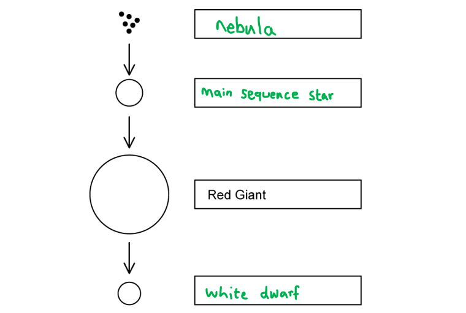

- **Nebula** in the first gap; **[1 mark]**
- **Main sequence star**** **in the second gap; **[1 mark]**
- **White dwarf**** **in the third gap; **[1 mark]**

**[Total: 3 marks]**

## Q3 — easy — 4 marks · exam-questions

### 1() — 1 marks
**Correct answer: A** — The brightness of stars if they were the same distance away from the Earth

**Final answer:** **The correct answer is ****A ****because:**

- Absolute magnitude is a measure of how bright stars are if they are all the same distance away from the Earth

### 2() — 3 marks
The three correct statements are:

| **Statement** | **Correct (✓)** |
|---|---|
| The brighter the star the larger the magnitude |   |
| The brighter the star the smaller the magnitude | **✓** |
| The dimmer the star the larger the magnitude | **✓** |
| The brightness of the star depends upon how much light the star emits | **✓** |
| The brightness of the star depends upon the radius of the star |   |
| The brightness of the star depends upon how far away the star is |   |

- The brighter the star the smaller the magnitude;** [1 mark]**
- The dimmer the star the larger the magnitude; ** [1 mark]**
- The brightness of the star depends upon how much light the star emits; ** [1 mark]**

**[Total: 3 marks]**

> *The brightness of the star depends upon how far away the star is. This is not a correct statement because the statements are about the **absolute magnitude scale**. Absolute magnitude has already considered distance. *

## Q4 — easy — 10 marks · exam-questions

### 1() — 3 marks
Stars are formed when:

- Enough dust and gas from space; **[1 mark]**
- Is pulled together; **[1 mark]**
- By gravitational attraction / gravitational force / gravity (to form a nebula); **[1 mark]**

**[Total: 3 marks]**

### 2() — 3 marks
(i) The correct sentence is:

- Nuclear **fusion** releases energy inside stars;** [1 mark]**

(ii) The correct sentence is:

- A star is stable during the 'main sequence' period in its life because the **forces ****[1 mark]**
- Within it are **balanced**** ****[1 mark]** ** **

**[Total: 3 marks]**

### 3() — 4 marks
The correct stages of the life cycle of the large star after the main sequence are:

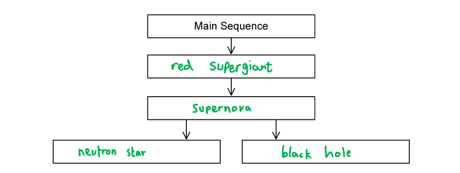

- **Red giant / supergiant** on the first line; **[1 mark]**
- **Supernova** on the second line; **[1 mark]**
- **Neutron star** in one of the boxes on the final line; **[1 mark]**
- **Black hole** in the other box on the final line; **[1 mark]**

**[Total: 4 marks]**

## Q5 — easy — 8 marks · exam-questions

### 1() — 2 marks
A HR diagram with the horizontal and vertical axes correctly labelled should look like this:

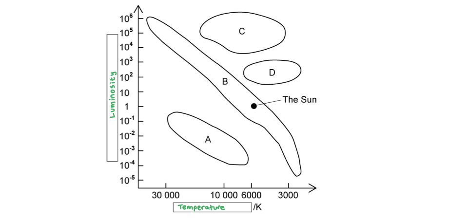

- **Temperature**** **is written on the horizontal axis; **[1 mark]**
- **Luminosity**** **is written on the vertical axis; **[1 mark]**

**[Total: 2 marks]**

### 2() — 4 marks
A table with each of the areas correctly labelled would look like this:

| **Area** | **Classification** |
|---|---|
| A | **white dwarfs ****[1 mark]** |
| B | **main sequence stars ****[1 mark]** |
| C | **supergiants**** ****[1 mark]** |
| D | **giants**** ****[1 mark]** |

**[Total: 4 marks]**

### 3() — 2 marks
Draw lines on the Hertzsprung-Russell diagram to identify the temperature and luminosity of the Sun:

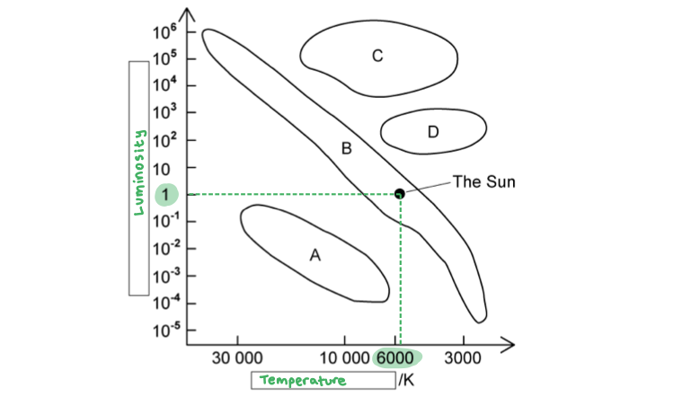

- Luminosity of the Sun = <u>1</u> LSun** [1 mark]**
- Temperature of the Sun = <u>6000</u> K** [1 mark]**

**[Total: 2 marks]**

> *The question gives you the units required for each quantity, so to gain the marks it is the number only that is required.*

## Q6 — medium — 7 marks · exam-questions

### 1() — 1 marks
The process described in the diagram is:

- The life cycle of a solar mass star / a star with a similar mass to the Sun; **[1 mark]**

**[Total: 1 mark]**

### 2() — 1 marks
**Correct answer: D** — 

**Final answer:** **The correct answer is ****D**** because:**

- The process described in stage 3 is nuclear** fusion**

  - This is when smaller nuclei join together to form a larger nucleus

- Helium nuclei are formed when hydrogen nuclei join together

  - The smaller nucleus is hydrogen
  - The larger nucleus is helium

- This is option **D**

**A & C** are incorrect as nuclear fusion takes place in stars, not fission. Fission involves very large, unstable nuclei splitting into smaller, more stable nuclei

**B** is incorrect as hydrogen consists of a singular proton, whereas helium contains 2 protons and 2 neutrons making it the larger nucleus

### 3() — 1 marks
**Correct answer: B** — stage 3

**Final answer:** **The correct answer is ****B**** because:**

- Stage 3 is the **main sequence** stage
- This is the most stable stage

  - This is because the energy released when hydrogen nuclei fuse to become helium is high enough to overcome inward gravitational forces
  - Hence, these fusion reactions prevent the star from collapsing
  - This stage ends when the supply of hydrogen in the core runs out, and this can take an extremely long time depending on the mass of the star

- This stage can last anywhere from a few billion (solar mass stars) to hundreds of billions of years (stars with much lower masses than solar mass)

### 4() — 4 marks
(i) The name of the life cycle stage in stage 4 is:

- Red giant;** [1 mark]**

(ii) In stage 4:

- Hydrogen runs out / is used up;** [1 mark]**
- Nuclei larger than helium nuclei are formed;** [1 mark]**
- The (outer layers of the) star expands and becomes more red (in colour);** [1 mark]**

**[Total: 4 marks]**

> *Remember that **fusion** occurs in **stars*

> *Fusion happens when **smaller nuclei** (smaller than iron) fuse together to form **larger nuclei*

## Q7 — medium — 11 marks · exam-questions

### 1() — 4 marks
The colour classification of stars from hottest to coolest is as follows:

| **Colour** | **Number** |
|---|---|
| Yellow-white | **Final answer:** **4** |
| Blue | **Final answer:** **1** |
| Red | **Final answer:** **7** |
| Yellow | **Final answer:** **5** |
| Yellow-orange | **Final answer:** **6** |
| White | **Final answer:** **3** |
| Blue-white | **Final answer:** **2** |

- Correct order:

  - **Hottest  **blue, blue-white, white, yellow-white, yellow, yellow-orange, red  **Coolest**

- Blue = 1 and red = 7; **[1 mark]**
- Yellow = 5 and white = 3; **[1 mark]**
- Yellow-white = 4 and blue-white = 2; **[1 mark]**
- Yellow-orange = 6; **[1 mark]**

**[Total: 4 marks]**

### 2() — 5 marks
(i) The coolest stage of a star's life cycle is:

- Red giant; **[1 mark]**

Explain why this is the coolest stage:

- Stars cool as they expand **OR **red is the coolest temperature / the lowest energy (of visible light); **[1 mark]**

(ii) The final stage in the life cycle of a star similar to the Sun is:

- White dwarf; **[1 mark]**

Explain why the colour of the star is white:

Any **two **from:

- White stars are hotter than red stars; **[1 mark]**
- The (cool) outer layers of the red giant are ejected (forming a planetary nebula); **[1 mark]**
- The (hot) core shrinks / becomes unstable / collapses to form a white dwarf; **[1 mark]**

**[Total: 5 marks]**

### 3() — 2 marks
Stars similar to the Sun are formed when:

- A giant cloud of gas and dust** OR** a star forming nebula; **[1 mark]**
- Is condensed / pulled into a smaller volume by gravity; **[1 mark]**

**[Total: 2 marks]**

## Q8 — medium — 5 marks · exam-questions

### 1() — 1 marks
**Correct answer: C** — 

**Final answer:** **The correct answer is ****C ****because:**

- A main sequence star has:

  - High luminosity
  - Low temperature

- A main sequence star has:

  - High luminosity because it is **bright**
  - Low temperature because of their colour yellow-white / yellow / blue-white

### 2() — 1 marks
**Correct answer: B** — 

**Final answer:** **The correct answer is ****B ****because:**

- The Sun will become a red giant

  - It's temperature will decrease
  - It's luminosity will increase
- So, it will move to area **B **on the H-R diagram

- **Learn** the names of **each section** of the H-R diagram and their **order** in the life cycle of the stars

### 3() — 3 marks
The white dwarf is in position:

- **D ****[1 mark]**

The temperature of a white dwarf in relation to the Sun is:

- Higher; **[1 mark]**

The luminosity of a white dwarf in relation to the Sun is:

- Lower; **[1 mark]**

**[Total: 3 marks]**

- *Don't let the **temperature axis** of the H-R diagram **throw you**!*

  - *The temperature **decreases** as it goes along*

## Q9 — medium — 8 marks · exam-questions

### 1() — 2 marks
The similarities between main sequence stars are:

- Fusion takes place in their cores; **[1 mark]**
- Hydrogen is fused into helium; **[1 mark]**

**[Total: 2 marks]**

### 2() — 2 marks
A table with ticks (✔) in the correct place to identify the correct statements regarding the relationship between a star's colour and its surface temperature looks like this:

| **Statement** | **Correct (✔)** |
|---|---|
| red stars have a relatively high temperature |   |
| blue stars have a relatively high temperature | **Final answer:** **✔** |
| yellow stars have a relatively low temperature | **Final answer:** **✔** |
| blue-white stars have a relatively low temperature |   |

- Blue stars have a relatively high temperature; **[1 mark]**
- Yellow stars have a relatively low temperature; **[1 mark]**

**[Total: 2 marks]**

### 3() — 4 marks
(i) A star with a temperature of 7000 K is:

- Canopus; **[1 mark]**

(ii) A star with a temperature of 2000 K is:

- Betelgeuse; **[1 mark]**

(iii) The largest star is likely to be:

- Betelgeuse; **[1 mark]**
- (Because it is likely to be) a red giant; **[1 mark]**

**[Total: 4 marks]**

- *Betelgeuse is bigger because it has a temperature of **2000 K*

  - *Hence, it is **red** in colour*
  - *So, must be a **red giant*
  - *A star is at its **largest **when it is a **red giant **or** supergiant*

## Q10 — medium — 6 marks · exam-questions

### 1() — 2 marks
The absolute magnitude scale is:

- A measure of the brightness / luminosity / power of an astronomical object / star; **[1 mark]**

Any **one **from

- Measured at a standard distance; **[1 mark]**
- At the same distance away from the Earth; **[1 mark]**
- At a distance of 10 parsecs; **[1 mark]**

**[Total: 2 marks]**

### 2() — 1 marks
The relationship between the absolute magnitude of a star and its brightness is:

- The brighter / more luminous the star, the smaller / lower the absolute magnitude; **[1 mark]** **OR**
- The dimmer / less bright the star, the larger / greater the absolute magnitude; **[1 mark]**

**[Total: 1 mark]**

### 3() — 3 marks
Objects placed correctly on the apparent brightness scale should look like this:

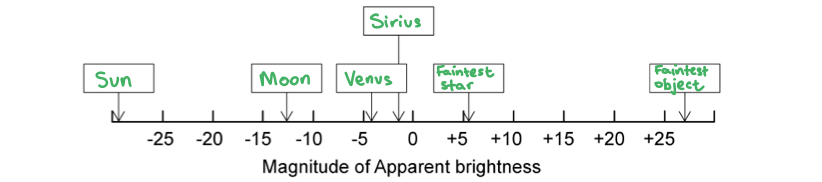

- Sun and Moon placed the correct way around; **[1 mark]**
- Venus and Sirius placed the correct way around; **[1 mark]**
- Faintest star and faintest object placed the correct way around; **[1 mark]**

**[Total: 3 marks]**

- *Remember that this scale works the **opposite way** around to what you think*

  - *Bright** objects have a **more negative** apparent brightness*
- *You should be **familiar** with these objects and their apparent brightness*

  - *Practice** adding objects to the apparent brightness scale*

## Q11 — medium — 10 marks · exam-questions

### 1() — 4 marks
A correctly labelled diagram that would score 4 marks should look like this:

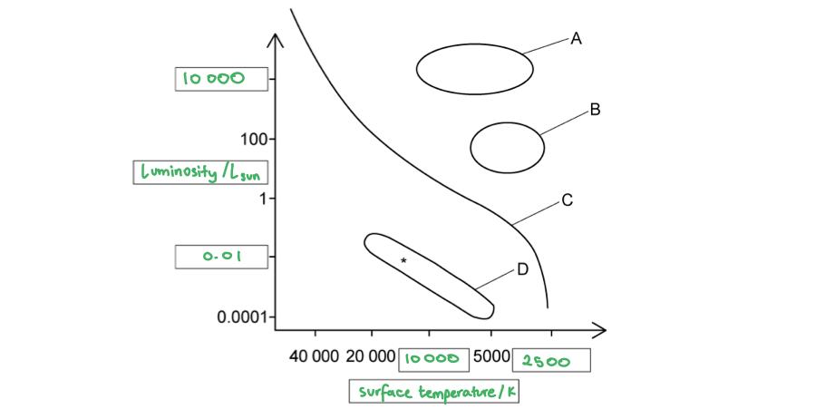

- Horizontal axis labelled with surface temperature / K; **[1 mark]**
- Vertical axis labelled with luminosity (compared to the Sun) / LSun; **[1 mark]**
- 0.01 and 10 000 correctly added to the vertical scale; **[1 mark]**
- 10 000 and 2500 correctly added to the horizontal scale; **[1 mark]**

**[Total: 4 marks]**

- *You must really look and** learn** the **scales** of the HR diagram*

  - *Try not to be confused by the **logarithmic scales** of the graph*
- *Divide** two **consecutive numbers** on the scale to work out the **common ratio** between them*

### 2() — 4 marks
The type of star found in each region are as follows:

Region A:

- Red supergiant **AND**
- (A type of star which is) extremely large and has a cool surface; **[1 mark]**

Region B:

- Red giant **AND**
- (A type of star which is) large and has a cool surface; **[1 mark]**

Region C:

- Main sequence star **AND**
- A star which fuses hydrogen into helium (in its core); **[1 mark]**

Region D:

- White dwarf **AND**
- A hot core (remnant) that cools down / emits energy (over time); **[1 mark]**

**[Total: 4 marks]**

- *Learn from memory a **description of each stage**, as well as a **description of the transition** between each stage*

### 3() — 2 marks
(i) The position of the Sun is as follows:

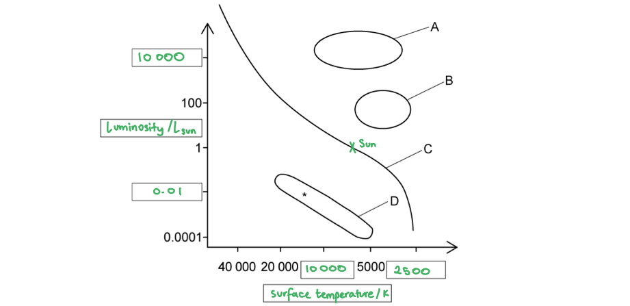

- X drawn correctly; **[1 mark]**

*X should be level with the 1 on the vertical axis and placed on the line labelled C*

(ii) The direction of the star (*) is as follows:

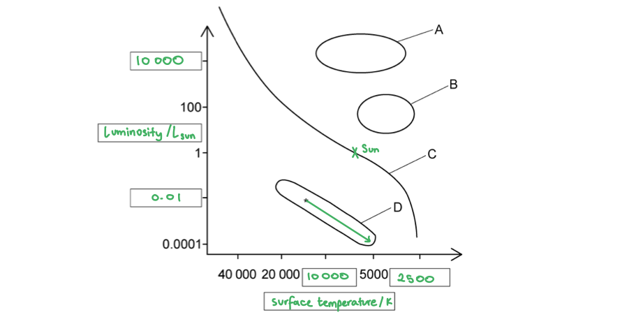

- Arrow drawn down and to the right of the (*); **[1 mark]**

**[Total: 2 marks]**

- *In part (ii)*

  - *The star **cools down**, so the arrow must point **right** along the temperature scale*
  - *The star **emits less energy**, so the arrow must **point down** along the luminosity scale*

## Q12 — medium — 10 marks · exam-questions

### 1() — 4 marks
> **[mark-scheme]**
> (i) The astronomer waits for a clear night because:
> 
> - Clouds would block her view (of the night sky)
> **OR**
> - She needs an unobstructed view (of the sky) **[1 mark]**
> 
> (ii) The astronomer travels to the countryside:
> 
> - To avoid light pollution (from towns / cities) **[1 mark]**
> 
> (iii) The property of a star that can be determined from its colour is:
> 
> - Surface temperature **[1 mark]**
> 
> (iv) The difference between the two stars is:
> 
> - The blue star is hotter than the red star (or vice versa) **[1 mark]**

### 2() — 2 marks
> **[mark-scheme]**
> Absolute magnitude is a measure of:
> 
> - The brightness (of a star) **[1 mark]**
> - at a standard distance (from Earth) **[1 mark]**

### 3() — 4 marks
> **[mark-scheme]**
> (i) When Betelgeuse was a main sequence star:
> 
> - It was larger than the Sun **[1 mark]**
> 
> Explain your answer:
> 
> - Only stars with a larger mass than the Sun will become red supergiants
> **OR**
> - Stars of a similar mass to the Sun cannot become red supergiants **[1 mark]**
> 
> (ii) In the final stages of Betelgeuse's evolution:
> 
> - It will explode as a supernova **[1 mark]**
> - It will become a neutron star or a black hole **[1 mark]**

## Q13 — hard — 16 marks · exam-questions

### 1() — 8 marks
(i) The object that forms in stage 2 is a:

- Protostar; **[1 mark]**
- (This forms when) the force of gravity / gravitational attraction pulls the cloud of <u>dust and gas</u> together; **[1 mark]**

- The greater the mass (of the dust and gas), the <u>greater</u> the gravitational force / force due to gravity;** [1 mark]**
- The greater the separation (between the dust and gas) the <u>smaller</u> the gravitational force / force due to gravity;** [1 mark]**

** **

(ii) The object that forms in stage 4 is a:

- Red giant; **[1 mark]**
- (This forms when) hydrogen runs out / is used up (in the star's core); **[1 mark]**
- (As a result, the core contracts and heats up so) fusion begins to produce nuclei larger than helium; **[1 mark]**
- The (outer layers of the) star expands and becomes a <u>red giant</u>; **[1 mark]**

**[Total: 8 marks]**

### 2() — 1 marks
**Correct answer: C** — 109 to 1011 years

**Final answer:** **The correct answer is ****C**** because:**

- Stage 3 describes the **main sequence** stage
- This stage can last anywhere from

  - A few billion years (for solar mass stars) - about 109 years
  - Up to hundreds of billions of years (for stars with much lower masses than solar mass) - about 1011 years

- So, for a low-mass star, the timescale of stage 3 is anywhere between 109 to 1011 years

  - This is option **C**

### 3() — 2 marks
The star in stage 3 remains stable for billions of years because:

- The radiation pressure and gravity / gravitational attraction are balanced / in equilibrium; **[1 mark]**
- There is sufficient / a large amount of hydrogen / fuel to last a very long time;** [1 mark]**

**[Total: 2 marks]**

> *It is important to note here that it would **not **be** **correct to write that the radiation pressure and gravity are **equal**, make sure you are clear that they are **balanced*

### 4() — 5 marks
Compare and contrast the final stages in the life cycles of low-mass and high-mass stars:

- Stage 4 = after the main sequence ends
- Stage 5 = end of the star's life

The similarities in stage 4 for low-mass and high-mass stars are:

Any **one** from:

- (This stage is triggered because) hydrogen runs out / is used up **OR **fusion reactions decrease; **[1 mark]**
- In both, the inner core shrinks / heats up / fusion starts again; **[1 mark]**
- In both, the outer part of the star expands; **[1 mark]**
- In both, the surface temperature decreases / becomes more red; **[1 mark]**

The differences in stage 4 for low-mass and high-mass stars are:

Any **one** from:

- High mass stars become <u>red supergiants</u> (whereas a low-mass star becomes a red giant); **[1 mark]**
- A red supergiant is much larger (than a red giant); **[1 mark]**
- A red supergiant will run out of nuclear fuel much faster than a red giant **OR** stage 4 is much shorter for high-mass stars; **[1 mark]**

The similarities in stage 5 for low-mass and high-mass stars are:

Any **one** from:

- (This stage is triggered because) all nuclear fuel runs out / is used up **OR **fusion reactions stop permanently; **[1 mark]**
- In both, the outer layers of the star spread out into space; **[1 mark]**
- In both, fusion takes place using elements heavier than hydrogen; **[1 mark]**

The differences in stage 5 for low-mass and high-mass stars are:

Any **two** from:

- In low-mass stars, fusion stops after helium is used up; **[1 mark]**
- In high-mass stars, fusion of heavier elements occurs (up to iron); **[1 mark]**
- Low-mass stars become white dwarfs; **[1 mark]**
- White dwarfs will gradually cool (until they become black dwarfs); **[1 mark]**
- High-mass stars explode in a supernova; **[1 mark]**
- (After supernova) it either becomes a black hole or a neutron star (depending on mass); **[1 mark]**

**[Total: 5 marks]**

- *Questions where you have to **compare two things** are tricky*
- *In your answer you must mention:*

  - *Both processes*
  - *Similarities*
  - *Differences*

## Q14 — hard — 9 marks · exam-questions

### 1() — 4 marks
(i) State the differences in mass between the stars:

- Proxima Centauri has a much lower mass than the Sun **AND**
- VY Canis Majoris has a much higher mass than the Sun; **[1 mark]**

(ii) Different masses affect the time a star remains stable in the following ways:

- Stars with lower masses (than the Sun) / Proxima Centauri will remain stable for a much longer time (than the Sun); **[1 mark]**
- Stars with higher masses (than the Sun) / VY Canis Majoris will remain stable for a much shorter time (than the Sun); **[1 mark]**
- (This is because) fusion in (the cores of) higher mass stars uses up hydrogen much faster than lower mass stars; **[1 mark]**

**[Total: 4 marks]**

### 2() — 5 marks
The evolution of the Sun & Proxima Centauri after they leave the main sequence:

Any **two** from:

- Both (Proxima Centauri and the Sun) will expand and become red giants; **[1 mark]**
- Then they will become white dwarfs; **[1 mark]**
- The white dwarfs will gradually cool (until they become black dwarfs); **[1 mark]**

The evolution of the VY Canis Majoris after leaving the main sequence:

Any **three** from:

- VY Canis Majoris will become a red supergiant; **[1 mark]**
- Then it will explode in a supernova; **[1 mark]**
- The remaining star will either be a black hole or a neutron star (depending on mass); **[1 mark]**
- The black hole does not emit light; **[1 mark]**
- The neutron star is small, produces no new heat and cools slowly;** [1 mark]**

**[Total: 5 marks]**

## Q15 — hard — 8 marks · exam-questions

### 1() — 2 marks
The correct positions of S, X and Y are as follows:

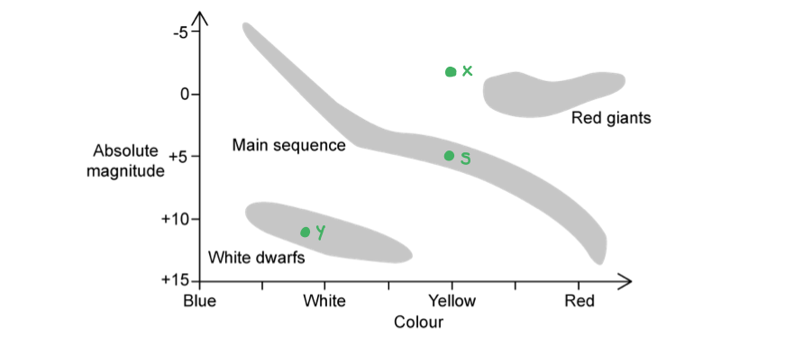

(i) The position of the Sun **S** is:

- Point **S** marked at approximately +5 absolute magnitude and yellow colour; **[1 mark]**

(ii) The position of star **X **is:

- Point **X** marked directly above point **S** (between +5 and −5 absolute magnitude and yellow colour); **[1 mark]**

(iii) The position of star **Y **is:

- Point **Y** marked to the left and below point **S** (between +5 and +15 absolute magnitude and blue/white colour); **[1 mark]**

**[Total: 3 marks]**

### 2() — 6 marks
The evolutionary stages of a star with a similar mass to the Sun:

Any **six** from:

- A nebula / cloud of dust and gas collapses / contracts and forms a protostar; **[1 mark]**
- The <u>temperature</u> / <u>brightness</u> of the protostar increases; **[1 mark]**
- (When the temperature becomes hot enough) fusion starts and the star joins the main sequence; **[1 mark]**
- The <u>brightness</u> / <u>temperature</u> of the main sequence star depends on its mass / size; **[1 mark]**
- (When hydrogen runs out) main sequence star becomes red giant; **[1 mark]**
- Red giants are <u>brighter</u> (than the main sequence star); **[1 mark]**
- Red giants (surfaces) are <u>cooler</u> (than most main sequence stars); **[1 mark]**
- (Eventually) the red giant becomes a white dwarf; **[1 mark]**
- White dwarfs are <u>less bright</u> (than red giant / main sequence stars); **[1 mark]**
- White dwarfs are <u>hotter</u> (than red giant / most main sequence stars); **[1 mark]**

**[Total: 6 marks]**

> *It can be difficult to explain concisely the different stages of the life cycle of stars - think carefully and don't be afraid to write down some ideas on paper before you start writing*

> *To get full marks on this question you must make comparisons between the brightness and temperature of the star at the different stages - don't be afraid to use the HR diagram given to help you to illustrate your answer!*

## Q16 — hard — 11 marks · exam-questions

### 1() — 6 marks
A suitable graph for the data would be:

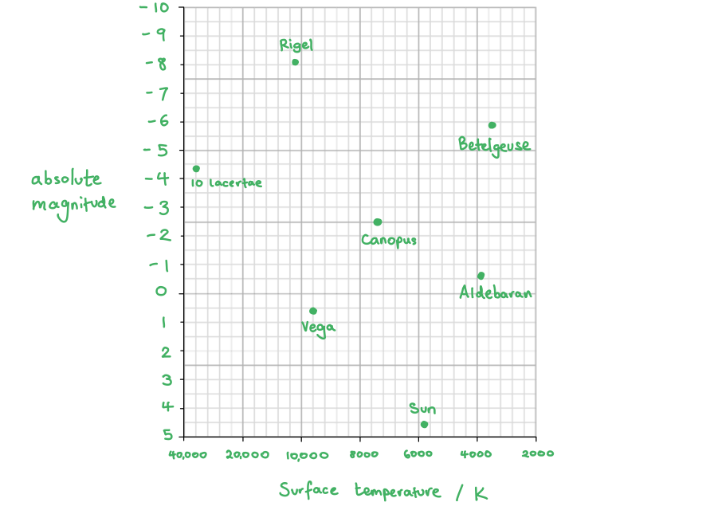

- Horizontal axis labelled 'surface temperature / K' **OR** 'colour'; **[1 mark]**
- Vertical axis labelled 'absolute magnitude' **OR** 'luminosity / LSun'; **[1 mark]**
- Sensible (log) scales for surface temperature used (1000, 5000, 10 000) **OR **colours in correct order; **[1 mark]**
- Sensible (log) scales for absolute magnitude used (multiples of 1, 2 or 5) **OR** luminosity relative to the Sun (1, 102, 104 etc); **[1 mark]**
- The graph takes up the majority of the grid; **[1 mark]**
- Points plotted correctly and labelled with the name of the star; **[1 mark]**

**[Total: 6 marks]**

> *It would be perfectly valid to plot the colour or luminosity (relative to the Sun) instead of temperature and absolute magnitude.*

> *This is how it would look:*

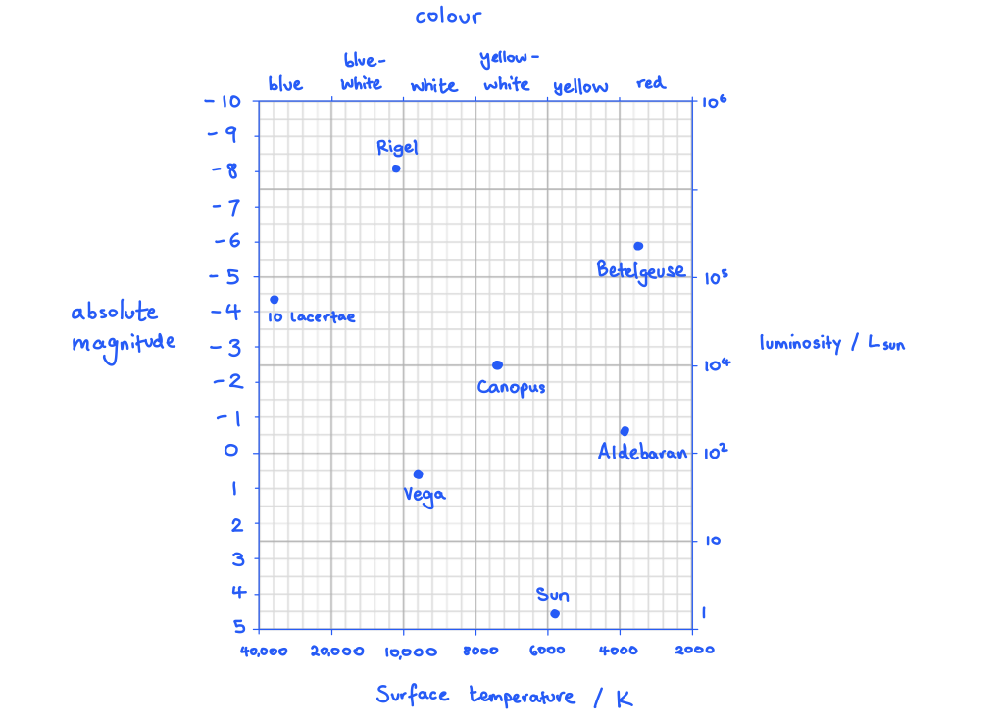

### 2() — 5 marks
(i) The regions on the graph are:

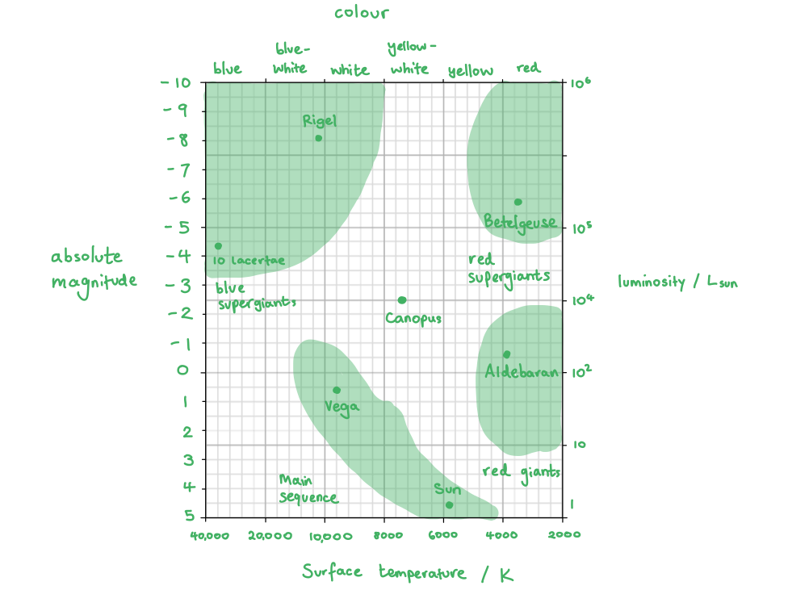

- Main sequence stars: Sun, Vega; **[1 mark]**
- Red giants: Aldebaran; **[1 mark]**
- Red supergiants: Betelgeuse; **[1 mark]**
- Blue supergiants: Rigel, 10 Lacertae; **[1 mark]**

**Final answer:** ** **

(ii) The path Canopus is likely to take is:

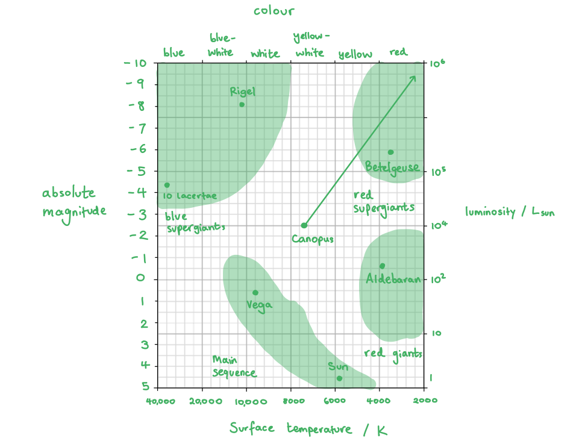

- Arrow directed towards the red supergiant region; **[1 mark]**

**[Total: 5 marks]**

> *You should be able to recognise that Canopus is a supergiant star from its location on the Hertzsprung Russell diagram.*

> *Therefore, after exhausting the hydrogen in its core, it will burn helium and heavier elements until it has exhausted all its fuel*

> *During this stage, it will continue to cool and expand as a super redgiant before exploding in a supernova, and eventually it will become a neutron star or a black hole (which is, of course, not visible on the diagram)*

## Q17 — hard — 13 marks · exam-questions

### 1() — 1 marks
**Correct answer: A** — R emits radiation with a higher mean frequency than S

**Final answer:** **The correct answer is ****A**** because:**

- From the Hertzsprung-Russell diagram:

  - R has a higher surface temperature than** **S
  - S has a greater luminosity than R

- Objects with a higher temperature will emit radiation with a shorter wavelength
- Therefore, the radiation emitted by R will have a higher frequency than radiation emitted by S

  - This is option **A**

**B** is incorrect as an object at a higher temperature will emit a shorter wavelength radiation, not longer

**C** is incorrect as the intensity of emitted radiation is related to the luminosity of the object. The greater the luminosity, the greater the intensity of the emitted radiation. The objects do not have the same luminosity, so they do not emit radiation with the same intensity

**D** is incorrect as an object at lower temperature will emit a longer wavelength radiation, not shorter

### 2() — 2 marks
The relationship between the colours and the numbers on the line is as follows:

- The hotter the temperature (> 10 000 K), the bluer/whiter the star / the shorter the wavelength of light;** [1 mark]**
- The cooler the temperature (< 10 000 K), the more red/yellow the star / the longer the wavelength of light; **[1 mark]**

**[Total: 2 marks]**

### 3() — 2 marks
(i) The Moon cannot be plotted on the Herztsprung-Russell diagram because:

Any **one** from:

- The Moon does not emit its own light; **[1 mark]**
- The Moon is not a star; **[1 mark]**
- The (surface) temperature of the Moon is too low / does not fit on the scale; **[1 mark]**

(ii) Black holes cannot be plotted on the Herztsprung-Russell diagram because:

- Black holes emit no light / have zero luminosity;** [1 mark]**

**[Total: 2 marks]**

### 4() — 8 marks
(i) For the statement:

*Object R will eventually move to the same position as object S someday.*

Some valid comments would be:

Any **two** from:

- Object S is a red giant; **[1 mark]**
- Object R will (likely) become a red supergiant; **[1 mark]**
- So R will likely have a (much) greater luminosity than S; **[1 mark]**
- The Sun is much more likely to move to (the same position as) S; **[1 mark]**

(ii) The evolutionary paths of the Sun and R are:

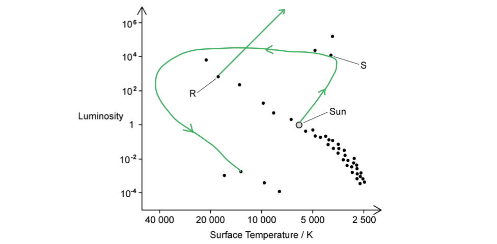

- Path of the Sun moves up and towards S; **[1 mark]**
- Path of the Sun curves left and then down (to the lower cluster of dots); **[1 mark]**
- Path of R moves up and above S; **[1 mark]**
- The arrow stops there; **[1 mark]**

(iii) Explain the paths drawn:

- The path of the Sun is (from a main sequence star) to a <u>red giant</u> at S before becoming a <u>white dwarf</u>; **[1 mark]**
- The path of R is (from a main sequence star) to a <u>super redgiant</u> (above S) before becoming a <u>neutron star</u> / <u>black hole</u> (which is not visible on the diagram); **[1 mark]**

**[Total: 8 marks]**

## Q18 — hard — 8 marks · exam-questions

### 1() — 2 marks
Complete the table:

| **Star** | **Spectral Class** | **Decimal Class** | **Absolute Magnitude** |
|---|---|---|---|
| Sun | G2 | 5.2 | 4.8 |
| Sirius B | A2 | 3.2 | 11.2 |
| Proxima Centauri | M6 | **Final answer:** **7.6** | 15.6 |
| 61 Cygni | K5 | **Final answer:** **6.5** | 7.5 |
| Betelgeuse | M1 | **Final answer:** **7.1** | −5.9 |
| Rigel | B8 | **Final answer:** **2.8** | −7.8 |
| Bellatrix | B2 | **Final answer:** **2.2** | −2.8 |
| Vega | A0 | **Final answer:** **3.0** | 0.6 |
| Barnard's Star | M4 | **Final answer:** **7.4** | 13.2 |
| Procyon B | F5 | **Final answer:** **4.5** | 13 |

- 4 or more decimal classes correct; **[1 mark]**
- All 8 decimal classes correct; **[1 mark]**

**[Total: 2 marks]**

### 2() — 6 marks
(i) A correctly drawn graph should look like:

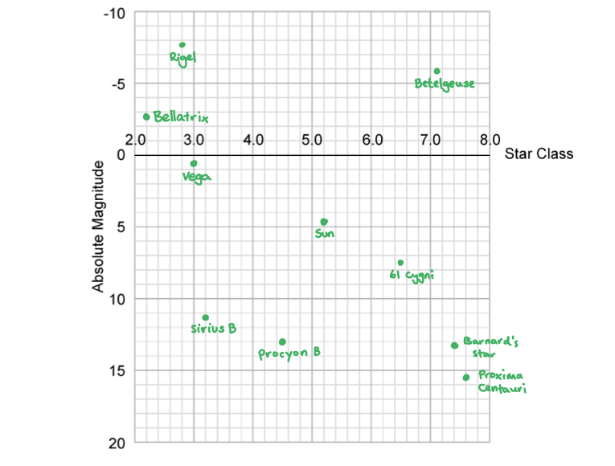

- All points plotted correctly; **[1 mark]**
- Each point labelled with the name of the star; **[1 mark]**

(ii) The location of each region on the graph:

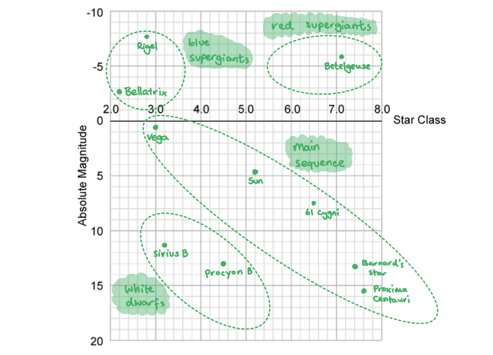

- Main sequence includes: Sun, Bellatrix, Vega, 61 Cygni, Bernard's star, Proxima Centauri; **[1 mark]**
- Red supergiant includes: Betelguese; **[1 mark]**
- Blue supergiant includes: Rigel; **[1 mark]**
- White dwarf includes: Sirius B, Procyon B; **[1 mark]**

**[Total: 6 marks]**
