# Exam Questions — Components in Series & Parallel Circuits
**2. Electricity** · Edexcel IGCSE Physics (Modular) (4XPH1) — 24/Unit 1
> Source: [https://www.savemyexams.com/igcse/physics/edexcel/modular/24/unit-1/topic-questions/electricity/components-in-series-parallel-circuits/exam-questions/](https://www.savemyexams.com/igcse/physics/edexcel/modular/24/unit-1/topic-questions/electricity/components-in-series-parallel-circuits/exam-questions/) · 20 questions · total 163 marks

## Q1 — easy — 3 marks · exam-questions

### 1() — 1 mark — multiple_choice
The diagram shows an I−V graph for an electrical component.

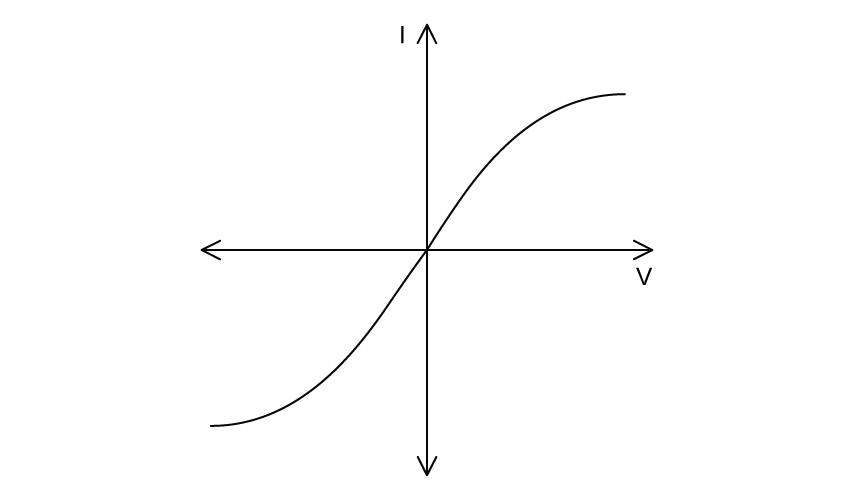

The component which produces this variation of current with potential difference is
- **A.** a fixed resistor
- **B.** a filament lamp
- **C.** a diode
- **D.** a fuse

### 2() — 1 mark — multiple_choice
The diagram shows an I−V graph for an electrical component.

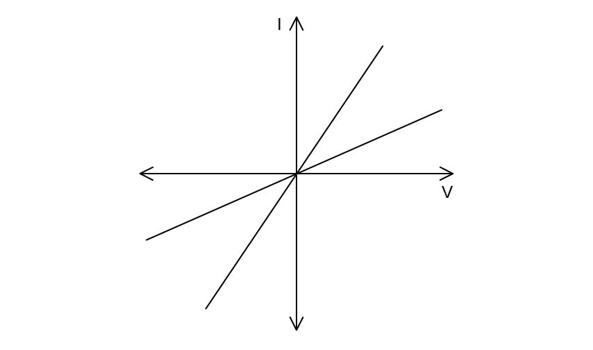

The component which produces this variation of current with potential difference is
- **A.** a fixed resistor
- **B.** a filament lamp
- **C.** a diode
- **D.** a fuse

### 3() — 1 mark — multiple_choice
The diagram shows an I−V graph for an electrical component.

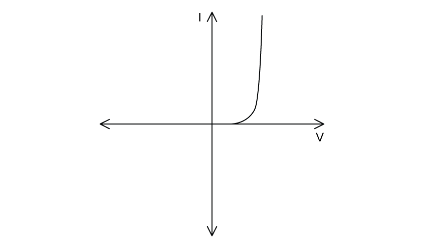

The component which produces this variation of current with potential difference is
- **A.** a fixed resistor
- **B.** a filament lamp
- **C.** a diode
- **D.** a fuse

## Q2 — easy — 6 marks · exam-questions

### 2() — 1 mark — multiple_choice — from paper 2015 June · 1P
The diagram shows a lighting circuit in a house.

Component X is
- **A.** a double insulated wire
- **B.** an earth connection
- **C.** a fuse
- **D.** a switch

### 1() — 1 mark — multiple_choice — from paper 2015 January · 1P
Most lamps at home have their own switch.

This is because the lamps are connected
- **A.** in parallel
- **B.** in series
- **C.** to a fuse
- **D.** to an earth wire

### 3() — 2 marks — command: place — structured
Place ticks next to the **two **advantages of series circuits.

| They are more difficult to install, repair and maintain |   |
|---|---|
| They are the easiest type of circuit to install, repair and maintain |   |
| They do not overheat easily because they share the same current |   |
| Adding too many lamps may cause overheating |   |

### 4() — 2 marks — command: place — structured
Place ticks next to the **two **advantages of parallel circuits.

| If one lamp fails, other lamps will still function |   |
|---|---|
| If one lamp fails, other lamps will not function |   |
| Different lamps can have different brightnesses and not affect the others |   |
| Not all lamps have the same brightness |   |

## Q3 — easy — 4 marks · exam-questions

### 1() — 1 mark — multiple_choice
The diagram shows a series circuit.

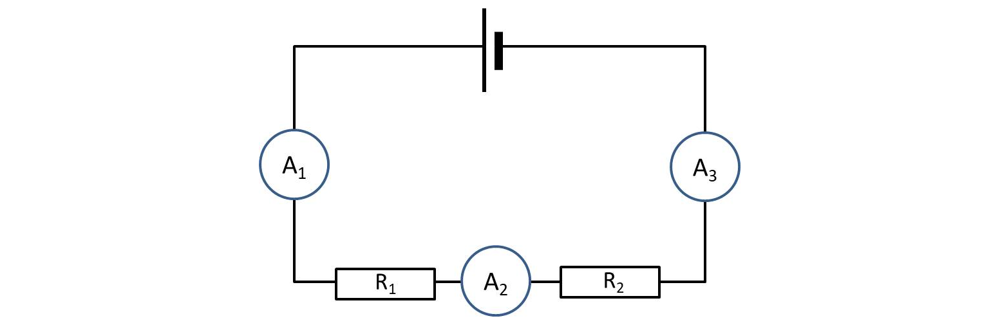

Which of the following shows the correct relationship between the readings on ammeters A1, A2 and A3?
- **A.** $A_{1}=A_{2}+A_{3}$
- **B.** $A_{1}=A_{2}=A_{3}$
- **C.** $A_{1}=A_{2}-A_{3}$
- **D.** $A_{1}=A_{3}-A_{2}$

### 2() — 3 marks — command: complete — structured
Complete the sentences to explain how a fuse protects a circuit.** **

| **larger than     smaller than     melts    falls off    starts    stops    overheating    overexciting** |
|---|

When the current becomes ........................... the value of the fuse, the fuse wire ........................... .** **This ........................... the flow of current in the circuit.

This is an important safety feature in a circuit to prevent the wires in the circuit from ........................... .

## Q4 — easy — 4 marks · exam-questions

### 7((a)) — 1 mark — command: draw — structured — from paper June 2013 · 1P
A student investigates how the resistance of a thermistor varies with temperature.

Draw the circuit symbol for a thermistor.

### 2() — 3 marks — command: sketch — structured
A light-dependent resistor (LDR) can be used as a sensor to detect light intensity.

Sketch a graph on the axes below to show how the resistance of an LDR varies as the light intensity changes.

## Q5 — easy — 9 marks · exam-questions

### 1() — 1 mark — multiple_choice — from paper 2013 June · 2P
A student has some LEDs connected in a circuit. They emit light of different colours.

When an LED is on it shows that
- **A.** there must be alternating current in the circuit
- **B.** there must be a current in the circuit
- **C.** there is a fault in the LED
- **D.** a fuse has blown

### 2() — 1 mark — multiple_choice
The diagram shows a circuit containing five LEDs connected in parallel.

What is the current at X?
- **A.** 0.17 A
- **B.** 0.26 A
- **C.** 0.43 A
- **D.** 1.38 A

### 3() — 3 marks — command: multiple — structured
(i) State the equation linking power, current and voltage.

[1]

(ii) Calculate the power of the LEDs. The voltage of the battery is 12 V.

[2]

Power = .................... W

### 4() — 4 marks — command: multiple — structured
(i) State the equation linking power, energy transferred and time.

[1]

(ii) Calculate the amount of energy transferred by the LEDs in 300 seconds.

[3]

Energy transferred = .......................... J

## Q6 — medium — 4 marks · exam-questions

### 2((a)) — 1 mark — multiple_choice — from paper Jun 2016 · 2PR
A student is given an unknown electrical component, X. He uses a circuit to investigate how the current in X varies with the voltage across it.

Which of these circuits is correct for his investigation?

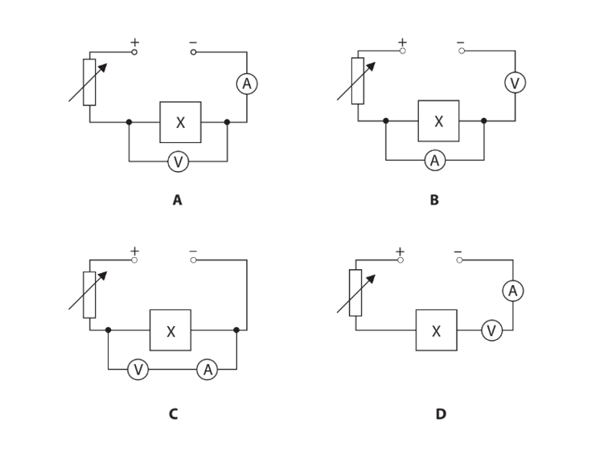
- **A.** 
- **B.** 
- **C.** 
- **D.** 

### 2((e)) — 3 marks — command: multiple — structured — from paper Jun 2015 · 1PR
This diagram shows another circuit the student is investigating.

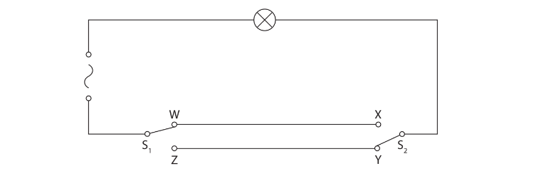

(i) Complete the table by putting a tick (**✓**) in the box if the lamp is lit and a cross (**х**) in the box if the lamp is not lit.

**(2)**

| **S****1**** position** | **S****2**** position** | **Lamp lit (✓ or х)** |
|---|---|---|
| W | X |   |
| W | Y |   |
| Z | X |   |
| Z | Y |   |

(ii) Suggest where this circuit would be useful in a house.

**(1)**

## Q7 — medium — 9 marks · exam-questions

### 7((b)) — 4 marks — command: multiple — structured — from paper June 2013 · 1P
A student uses voltmeter and ammeter readings to find the resistance at different temperatures. One set of readings is show below.

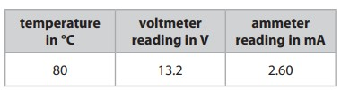

(i) State the equation linking voltage, current and resistance.

**(1)**

(ii) Show that the resistance of the thermistor at 80 °C is about 5000 Ω.

**(3)**

### 7((c)) — 5 marks — command: compare — structured — from paper June 2013 · 1P
A student uses voltmeter and ammeter readings to find the resistance at different temperatures for two different components, A and B.

The graphs show the results.

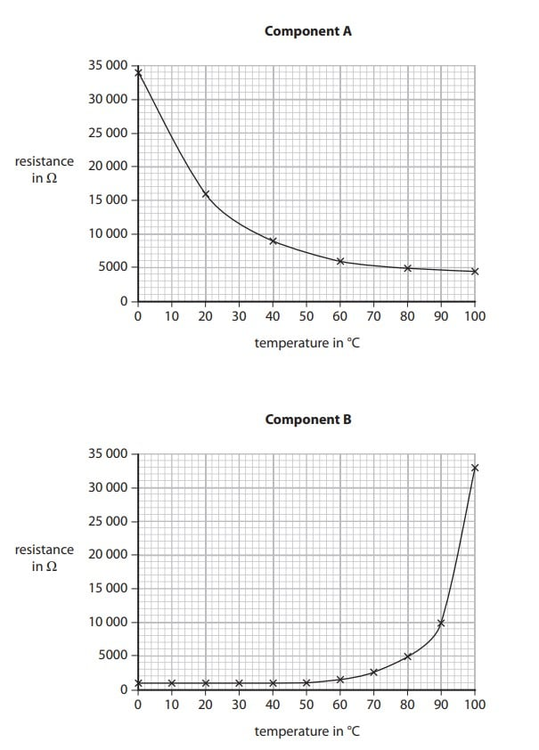

Compare the results for component A and component B.

## Q8 — medium — 8 marks · exam-questions

### 10() — 2 marks — command: add — structured — from paper June 2012 · 1P
An LED needs a minimum voltage to make it emit light.

The student investigates this minimum voltage using the circuit shown.

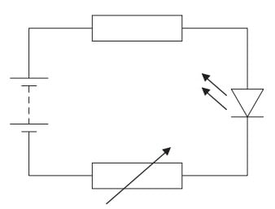

The student uses a voltmeter to measure the voltage across the LED.

Add this voltmeter to the circuit diagram.

### 5() — 4 marks — command: plot — structured — from paper June 2013 · 2P
The student gradually increases the voltage across the LED and records the minimum voltage at which the LED emits light. The results for some different LEDs are shown in the table.

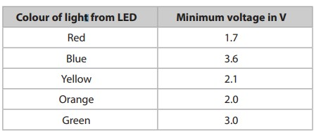

Display the results of the student's investigation on the grid.

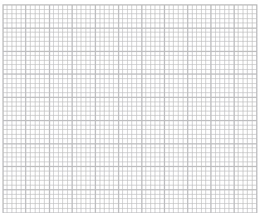

### 5() — 2 marks — command: evaluate — structured — from paper June 2013 · 2P
The student concludes:

Evaluate the student's conclusion.

## Q9 — medium — 13 marks · exam-questions

### 6((a)) — 4 marks — command: complete — structured — from paper June 2015 · 1PR
The diagram shows part of an electric circuit.

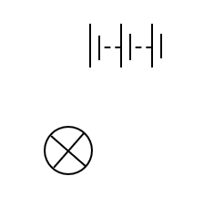

Complete the circuit diagram by adding:

- a resistor in series with the lamp and battery

  - a second lamp in parallel with the first lamp
  - a voltmeter that measures the voltage across the resistor
  - an ammeter that measures the current in the resistor

### 6((b)) — 6 marks — command: multiple — structured — from paper June 2015 · 1PR
The current in a resistor is measured for different voltages.

The table shows the results.

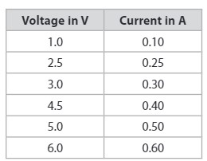

(i) Plot a graph of this data on the grid.

**(4)**

(ii) Circle the anomalous point on the graph.

**(1)**

(iii) Draw a line of best fit.

**(1)**

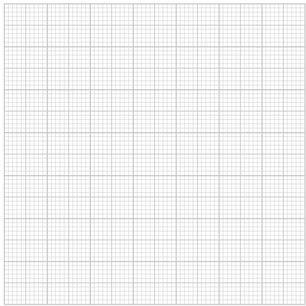

### 6() — 3 marks — command: multiple — structured — from paper June 2015 · 1PR
(i) State the equation linking voltage current and resistance.

**(1)**

(ii) Use your graph to find a value for the resistance of the resistor.

**(2)**

resistance = ............................................... Ω

## Q10 — medium — 8 marks · exam-questions

### 12((a)) — 4 marks — command: draw — structured — from paper June 2014 · 1P
The graph shows how current and voltage vary for a filament lamp.

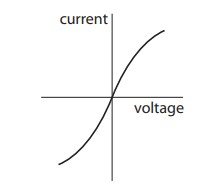

Draw a circuit diagram to show how you should connect the equipment needed to make the measurements needed to plot the graph.

### 12((b)) — 4 marks — command: multiple — structured — from paper June 2014 · 1P
The resistance of the filament lamp changes as the voltage is increased.

(i) How can you tell this from the graph?

**(1)**

(iii) Explain these changes in resistance.

**(3)**

## Q11 — medium — 9 marks · exam-questions

### 10((a)) — 6 marks — command: multiple — structured — from paper June 2013 · 1PR
A student investigates how the resistance of a piece of wire changes with voltage across the wire.

The student connects an ammeter, a voltmeter, a battery, a variable resistor and the wire in an electrical circuit.

(i) Complete the diagram to show how the student should connect the circuit.

**(3) **

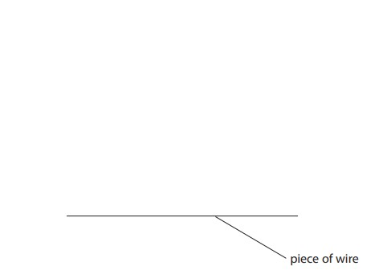

(ii) Describe what she should do to obtain a set of results for her investigation.

**(3)**

### 10((b)) — 1 mark — command: suggest — structured — from paper June 2013 · 1PR
The student keeps the temperature of the wire constant during the investigation.

Suggest why** **she does this.

**(1)**

### 10((c)) — 2 marks — command: multiple — structured — from paper June 2013 · 1PR
When the student looks at her results, she notices that the voltage across the wire is directly proportion to the current in it.

(i) State the relationship linking voltage, current and resistance.

**(1)**

(ii) The student calculates the resistance and then plots a graph of resistance against voltage.

On the axes, sketch the shape of her graph.

**(1)**

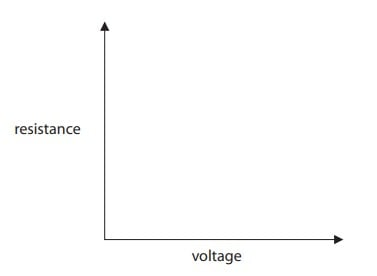

## Q12 — medium — 14 marks · exam-questions

### 10((a)) — 3 marks — command: identify — structured — from paper January 2015 · 1P
A student plans to measure the resistance of a piece of wire. He sets up this circuit and finds that it does not work.

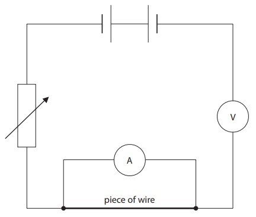

Identify the three errors in the student’s circuit.

### 10() — 5 marks — command: plot — structured — from paper January 2015 · 1P
The student uses a correct circuit to obtain these results.

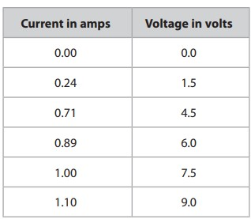

Plot a graph to show the relationship between current and voltage for the wire.

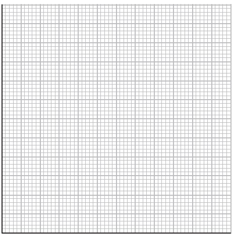

### 10() — 2 marks — command: multiple — structured — from paper January 2015 · 1P
(i)

Find the current when the voltage is 2.5 V.

**(1)**

(ii)

Suggest why the line on the graph curves.

**(1)**

### 10() — 4 marks — command: describe — structured — from paper January 2015 · 1P
Describe what else the student should do to find an accurate value for the resistance of the piece of wire at a constant temperature.

## Q13 — medium — 14 marks · exam-questions

### 2((b)) — 4 marks — command: plot — structured — from paper Jun 2016 · 2PR
A student is given an unknown electrical component, X. He uses a circuit to investigate how the current in X varies with the voltage across it.

The table shows the student’s results.

| **Voltage across X (V)** | **Current in X (A)** |
|---|---|
| 0 | 0 |
| 3.0 | 0.5 |
| 14.5 | 2.3 |
| 19.5 | 2.9 |
| 25.0 | 3.2 |
| 29.5 | 3.3 |

Plot a graph of these results and draw a curve of best fit.

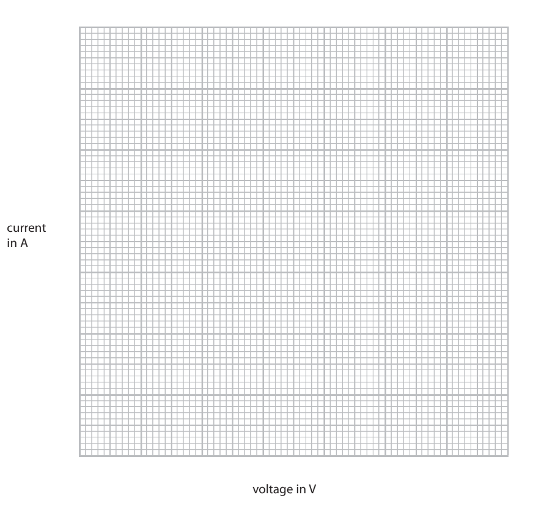

### 2((b)) — 5 marks — command: multiple — structured — from paper Jun 2016 · 2PR
(i) State the equation linking voltage, current and resistance.

**(1)**

(ii) Calculate the resistance of component X when the voltage across it is 10.0 V. Give the unit.

**(4)**

Resistance = ................................ unit ......................

### 2((b)) — 5 marks — command: multiple — structured — from paper Jun 2016 · 2PR
(i) Describe the pattern shown by the graph from part (a).

**(3)**

(ii) Suggest a conclusion for the investigation

**(2)  **

## Q14 — medium — 14 marks · exam-questions

### 1() — 4 marks — command: multiple — structured
A student investigates how the current in component **X** varies with the voltage across it. The diagram shows the circuit used for the investigation.

The student uses the variable resistor to vary the voltage across component X. The table gives the student's results.

| Voltage (V) | Current (A) |
|---|---|
| 1.0 | 0.21 |
| 2.0 | 0.43 |
| 3.0 | 0.64 |
| 4.0 | 0.80 |
| 5.0 | 0.88 |
| 6.0 | 0.94 |

(i) Plot a graph of the student's results.

[3]

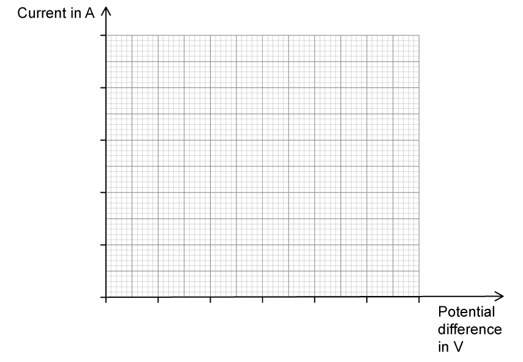

(ii) Draw the curve of best fit.

[1]

### 2() — 2 marks — command: multiple — structured
(i) Give the name of component X.

[1]

(ii) Draw the circuit symbol for this component.

[1]

### 3() — 8 marks — command: multiple — structured
(i) State the formula linking resistance, voltage and current.

[1]

(ii) Describe how resistance changes as the current through this component changes. Use data from the table to support this.

[3]

(iii) When the voltmeter has a reading of 4.0 V, the variable resistor has a resistance of 5.0 Ω.

Calculate the voltage across the cell.

[4]

## Q15 — hard — 1 marks · exam-questions

### 5((b)) — 1 mark — multiple_choice — from paper January 2016 · 1P
A student uses a circuit that contains an ammeter, a battery, a light emitting diode (LED) and a voltmeter.

He notices there is no current in the diode when the battery is reversed.

He replaces the battery with an a.c. supply.

Which graph shows how the current in the diode varies with time?

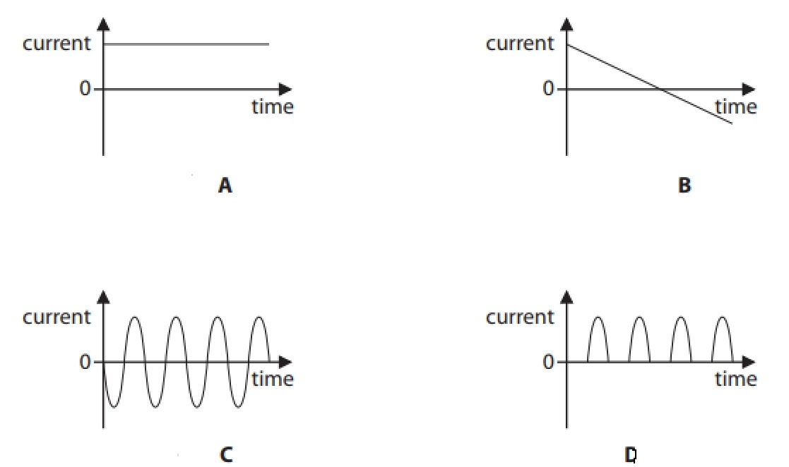
- **A.** 
- **B.** 
- **C.** 
- **D.** 

## Q16 — hard — 1 marks · exam-questions

### 2() — 1 mark — multiple_choice — from paper 2016 June · 1P
The student shines light on the LDR through a circular hole in a piece of black card, as shown in the diagram. The student repeats the experiment using cards with holes of different diameter. The distance from the card to the LDR is always 5 cm. The student varies the current in the circuit by adjusting the variable resistor.

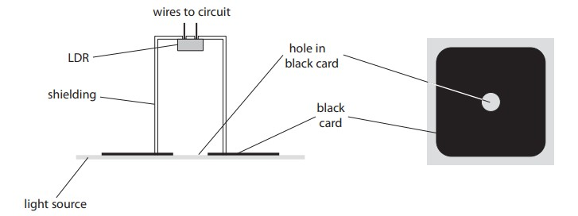

The independent variable in this experiment is:
- **A.** the brightness of the light source
- **B.** the diameter of the hole
- **C.** the distance from the card to the LDR
- **D.** the resistance of the LDR

## Q17 — hard — 13 marks · exam-questions

### 8((a)) — 8 marks — command: multiple — structured — from paper June 2014 · 1PR
A student uses this apparatus to investigate how the resistance of a thermistor changes with temperature.

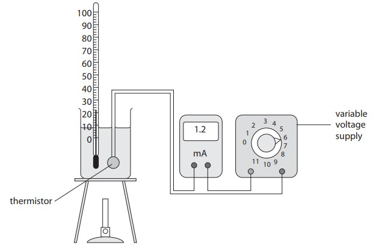

(i) Draw a circuit diagram for this investigation.

**(2)**

(ii) The student wants to measure the voltage across the thermistor. On your diagram, add a symbol to show how she should connect the voltmeter to the circuit.

**(1)**

(iii) Explain how the student can use the apparatus to investigate how the resistance of the thermistor varies with temperature between 0 °C and 100 °C.

**(5)**

### 8((b)) — 2 marks — command: suggest — structured — from paper June 2014 · 1PR
The graph shows the student’s results.

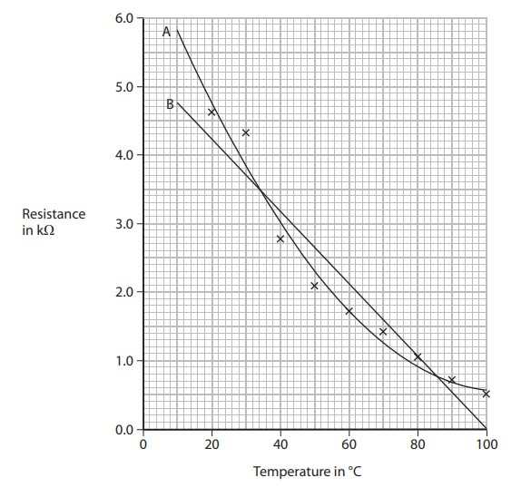

Two students discuss the line of best fit for this graph. One student thinks it is the curved line A. The other student thinks that it is the straight line B.

(i) Suggest which line is better, giving a reason for your choice.

**(1)**

(ii) Suggest why measuring the resistance of the thermistor at 10 °C could help to decide which line is better.

**(1)**

### 8((c)) — 3 marks — command: which — structured — from paper June 2014 · 1PR
These graphs show the voltage (*V*) changes with the current (*I*) for three components.

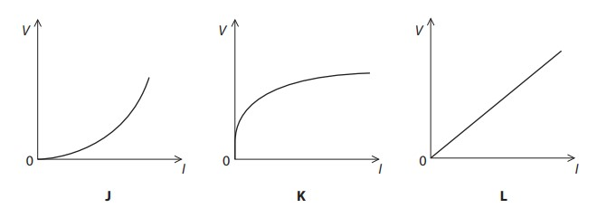

The components are a metal wire at a constant temperature, a diode and a filament lamp.

Which letter represents the correct graph for each component?

(i) Metal wire at constant temperature

**(1)**

(ii) Diode

**(1)**

(iii) Filament lamp

**(1)**

## Q18 — hard — 10 marks · exam-questions

### 5() — 2 marks — command: explain — structured — from paper June 2015 · 2PR
A student uses the following apparatus to investigate how the resistance of a thermistor changes with temperature.

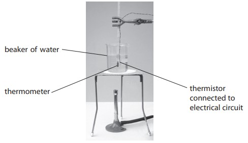

Explain why the student places the thermistor in a beaker of water.

### 5() — 6 marks — command: multiple — structured — from paper June 2015 · 2PR
The table shows the student's results.

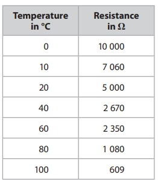

(i) Plot a graph of these results on the grid.

**(4)**

(ii) Circle the anomalous point on the graph.

**(1)**

(iii) Draw a curve of best fit.

**(1)**

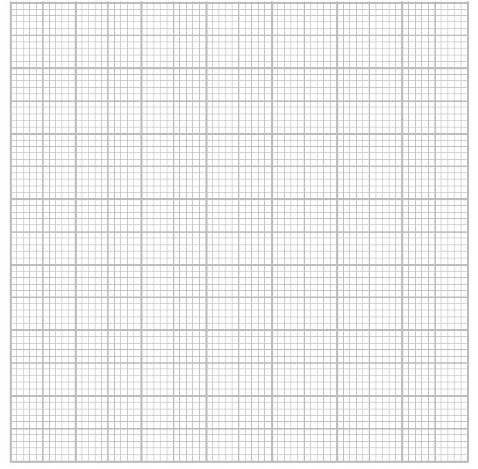

### 5((d)) — 2 marks — command: multiple — structured — from paper June 2015 · 1PR
(i) Why is the maximum temperature in the student’s investigation limited to 100°C?

**(1)**

(ii) Suggest how the student obtains readings below room temperature.

**(1)**

## Q19 — hard — 12 marks · exam-questions

### 5((a)) — 4 marks — command: multiple — structured — from paper June 2016 · 1P
The resistance of a Light Dependent Resistor (LDR) is affected by the amount of light that shines on it.

A student investigates this relationship using the circuit shown.

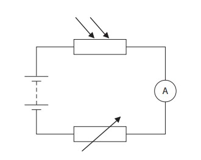

(i) The student uses a voltmeter to measure the voltage across the LDR. Add this voltmeter to the circuit diagram.

**(2)**

(ii) Explain how the student can work out the resistance of the LDR using this circuit.

**(2)**

### 5() — 1 mark — command: suggest — structured — from paper June 2016 · 1P
The student shines light on the LDR through a circular hole in a piece of black card, as shown in the diagram. The student repeats the experiment using cards with holes of different diameter. The distance from the card to the LDR is always 5 cm. The student varies the current in the circuit by adjusting the variable resistor.

The photograph shows how the student places a metal ruler to measure the diameter of one of the holes.

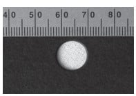

Suggest how the student can improve this technique while still using the same ruler.

### 5((c)) — 7 marks — command: multiple — structured — from paper June 2016 · 1P
The table shows the student’s results.

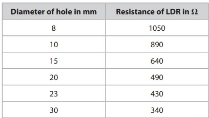

(i) Plot the student’s results on the grid.

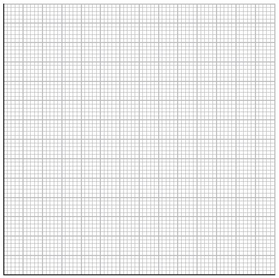

**(4)**

(ii) Draw a curve of best fit on the graph.

**(1)**

(iii) Describe the relationship between the resistance of the LDR and the diameter of the hole.

**(2)**

## Q20 — hard — 7 marks · exam-questions

### 14((a)) — 4 marks — command: multiple — structured — from paper June 2015 · 1P
A student investigates the current in a thermistor at different temperatures using the circuit shown in the diagram.

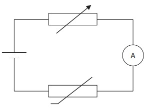

The student uses a voltmeter to check that the voltage across the thermistor stays constant throughout the investigation.

(i) Add this voltmeter to the circuit diagram.

**(2)**

(ii) Give a reason for keeping the voltage across the thermistor constant.

**(1)**

(iii) Give a reason for including the variable resistor in the circuit.

**(1)**

### 14((b)) — 3 marks — command: give — structured — from paper June 2015 · 1P
The student increases the temperature of the thermistor and records the current and temperature readings. The graph shows the student's results.

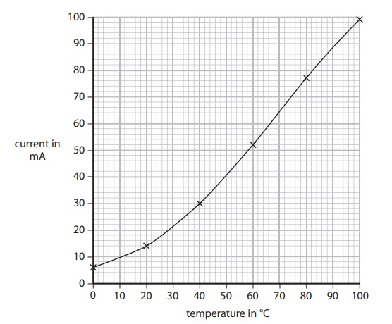

The student plans the use his circuit to make an electronic thermometer, He notices that both the scales on the graph go up to 100.

He thinks that the current reading, measured in mA, gives a direct indication of the temperature measured in °C. He labels the ammeter's scale 'temperature in °C'.

Give three reasons why the student's electronic thermometer is unlikely to show the correct temperature.

You may use information from the circuit and the graph to support your answer.
