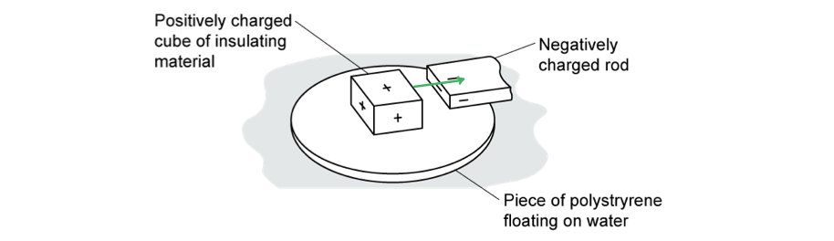
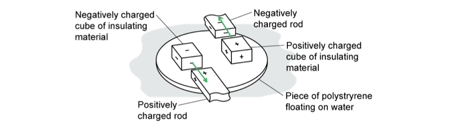

# Mark Schemes — Static Electricity
**2. Electricity** · Edexcel IGCSE Physics (Modular) (4XPH1) — 24/Unit 1

## Q1 — easy — 2 marks · exam-questions

### 2((a)) — 1 marks
**Correct answer: A** — Carbon

**The correct answer is ****A**** **because:

- Carbon can conduct electricity when it is in the form of graphite

**B, C **and** D **are incorrect as they are all electrical insulators

### 4((a)) — 1 marks
**Correct answer: C** — Silver

**The correct answer is ****C**** **because:

- All metals conduct electricity
- Non-metals do not conduct electricity

  - This eliminates options **A**, **B**, and **D **

- Silver is a metal

  - Hence the correct answer is **C**

**A, B **and** D **are incorrect as they are all electrical insulators

## Q2 — easy — 3 marks · exam-questions

### 1() — 1 marks
**Correct answer: B** — 

**The correct answer is ****B** because**:**

- For electric forces between charges:

  - Like charges repel
  - Opposite charges attract

- The pair in **B** have **opposite charges** and show an **attractive force** between them

**A** & **C** are incorrect as these show pairs of alike charges with an attractive force between them

**D** is incorrect as this shows a pair of opposite charges with a repulsive force between them

### 2() — 1 marks
**Correct answer: D** — 

**The correct answer is ****D** because:

- The rod becomes charged because **electrons** are transferred to it from the cloth

  - Therefore, the charge on the rod is **negative** because electrons are negatively charged (there is no movement of positive charge)

- The cloth becomes positively charged as it has lost negative charge, i.e. electrons

  - Therefore, the rod and the cloth have an **equal** amount of negative and positive charge, respectively

- Therefore option **D** is correct:

  - The charge on the rod is **negative** and **equal **in size to the charge on the cloth

### 3() — 1 marks
**Correct answer: D** — 

**The correct answer is ****D** because:

- The charged rod causes the charges in the water stream to **separate**

  - The positive charges are **attracted** to the negatively charged rod
  - The negative charges are **repelled** by the negatively charged rod

- The rod remains negatively charged and the surface of the water stream becomes positively charged

  - This is shown by option **D**

**A** is incorrect as this shows the correct arrangement of charges in the water stream if the rod were positively charged

**B** is incorrect as this shows an even distribution of charges in the water stream which would only be the case if there was no charged rod nearby

**C** is incorrect as this shows a water stream containing only negative charges which is not possible

## Q3 — easy — 4 marks · exam-questions

### 3((a)) — 2 marks
(a) The correct sentences are

- When a plastic rod is rubbed with a cloth, the plastic rod gains **electrons****; [1 mark]**
- After the plastic rod has been rubbed with the cloth, the plastic rod has a **negative** charge; **[1 mark]**

**[Total: 2 marks]**

> *Protons are not transferred in this process, so only answers involving electrons are appropriate. The rod has gained electrons so is now negatively charged.*

### 3((c)) — 2 marks
(b) State the hazard caused by electrostatic charges:

- There is a risk of a spark / shock / fire / damage; **[1 mark]**

Explain how the risk could be reduced:

- Connect the object to an earth connection / conducting wire **OR **by using insulation; **[1 mark]**

**[Total: 2 marks]**

## Q4 — easy — 9 marks · exam-questions

### 7((a)) — 2 marks
(a) The man gains an electric charge because:

- Electrons are transferred (between the man and the ground); **[1 mark]**
- Due to <u>friction;</u> **[1 mark]**

**[Total: 2 marks]**

### 2() — 4 marks
(b)

(i) The equation linking charge, current and time is:

- Charge = current × time **OR **$Q=I\timest$ **[1 mark]**

(ii) Calculate the average current in the spark:

List the known quantities:

- Charge, $Q$ = 0.0017 C
- Time, $t$ = 0.08 s

Substitute the known quantities into the rearranged equation for current:

- $Q=I\timest\RightarrowI=\frac{Q}{t}$ **[1 mark]**
- $I=\frac{0.0017}{0.08}$ **[1 mark]**
- *I* = 0.021 A **[1 mark]**

**[Total: 4 marks]**

### 3() — 3 marks
(c) The man receives a shock even though the button is properly earthed because...

- The lift button is made from metal, which is a **conductor**. Since the man is charged, there is a **potential difference** between him and the button; **[1 mark]**
- When he touches the button, the **electrons** that have built up on the man are transferred to the **earth** through the button; **[1 mark]**
- This movement of **electrons** is the **current** flowing through the man's body which he feels as a small electric shock; **[1 mark]**

**[Total: 3 marks]**

> *It is the current that causes an electrical shock, not the potential difference.*

> *Potential difference is a difference in energy per unit charge between two points but this can exist without any charge flowing.*

> *When charge does flow (current is non-zero), this is what we refer to as the electrical shock.*

## Q5 — easy — 4 marks · exam-questions

### 2((a)) — 1 marks
(a) To show that the rod has gained charge:

Any **one** from:

- Attracts scraps of paper; **[1 mark]**
- Deflects a stream of water; **[1 mark]**
- Attracts hair / a balloon; **[1 mark]**
- Deflects a gold leaf electroscope; **[1 mark]**
- Use a coulomb meter; **[1 mark]**

**[Total: 1 mark]**

### 2((b)) — 2 marks
(b) The plastic rod gains charge when it is rubbed because:

- Electrons; **[1 mark]**
- Are transferred / lost;** [1 mark]**

**[Total: 2 marks]**

### 3() — 1 marks
**Correct answer: B** — the negative charge has moved from the cloth to the rod

**The correct answer is ****B** because:

- The rod becomes charged because **electrons** are transferred to it from the cloth

  - This eliminates options **A** and **C**

- The charge on the rod is **negative** because electrons are negatively charged (so there is no movement of positive charge)

  - This eliminates option **D**

- The cloth then becomes positively charged as it has lost some of its electrons
- Therefore option **B** is correct:

  - The cloth becomes positively charged because the **negative charge** has moved from the **cloth** to the **rod**

## Q6 — easy — 7 marks · exam-questions

### 1() — 2 marks
> **[mark-scheme]**
> - <u>Electrons</u> are transferred **[1 mark]**
> - From the cloth to the rod **[1 mark]**

### 2() — 1 marks
**Correct answer: B** — Coulomb

**Final answer:** **The correct answer is B**

- Coulomb is the correct unit for charge

**A** is incorrect because ampere is the unit for current

**C** is incorrect because joule is the unit for energy

**D** is incorrect because watt is the unit for power

### 3() — 4 marks
> **[mark-scheme]**
> (i) Explain why it is dangerous if the charge is allowed to build up on the aircraft:
> 
> - There is the risk of a spark / discharge **[1 mark]**
> - Which could ignite the fuel / cause a fire/explosion **[1 mark]**
> 
> (ii) Explain how connecting an earth wire to the aircraft reduces this danger:
> 
> - (The earth wire/bonding line) provides a (low resistance) path for electrons to flow / discharge **[1 mark]**
> - to the ground / earth **[1 mark]**

## Q7 — medium — 6 marks · exam-questions

### 4((b)) — 2 marks
(a)

Any **two **from:

- Negative charge / electrons move; **[1 mark]**
- Charge moves through the wire from plate B to lifting sheet A; **[1 mark]**
- There is an unbalanced / net charge on A / B; **[1 mark]**
- A has gained electrons / B has lost electrons; **[1 mark]**

**[Total: 2 marks]**

> *In your answer, you must not refer to poles, as this is not relevant to the behaviour of charge in static electricity. Positive charge does not move, only negative charge. So, do not talk about "moving positive charge".*

### 4((c)) — 2 marks
(b)

Any **two **from:

- The top of the dust becomes positively charged; **[1 mark]**
- The negative charge on lifting sheet A attracts dust; **[1 mark]**
- Therefore, the force of attraction is greater than the weight of the dust; **[1 mark]**

**[Total: 2 marks]**

*In your answer, you will not be awarded a mark for just saying that "opposite charges attract" you need to be more specific in the context of the question.*

### 4((d)) — 2 marks
(c)

State the link between water molecules and charge:

- The water (molecules) have a charge; **[1 mark]**

State the interaction between different charges:

- Opposite charges attract / like charges repel

**   OR**

- Negatively charged rod attracts positively charged water;** [1 mark]**

**[Total: 2 marks]**

## Q8 — medium — 5 marks · exam-questions

### 6((a)) — 3 marks
(a)

Explain how an object becomes charged by friction:

Any **three** from:

- Friction occurs when two surfaces / materials move over one another; **[1 mark]**
- Electrons are transferred from one surface / material to the other; [**[1 mark]**
- Electrons are negatively charged; **[1 mark]**
- Therefore, the object that gains electrons becomes negatively charged **OR** the object that loses electrons becomes positively charged; **[1 mark]**

**[Total: 3 marks]**

### 6((b)) — 2 marks
(b)

Explain why the end of the tape moves back towards the roll:

Any **two** from:

- The two surfaces are oppositely charged; **[1 mark]**
- Therefore, the surfaces are attracted to each other; **[1 mark]**
- The attractive force is greater than the weight of the loose end of the tape; **[1 mark]**

**[Total: 2 marks]**

## Q9 — medium — 6 marks · exam-questions

### 6((a)) — 2 marks
(a)

Explain, in terms of moving charges, how the balloon becomes positively charged:

- Electrons move; **[1 mark]**
- <u>From</u> the balloon <u>to</u> the cloth;** [1 mark]**

**[Total: 2 marks]**

Friction between the balloon and the cloth causes the transfer of electrons. For the balloon to be positively charged, the electrons must have been transferred from the balloon to the cloth.

Look for clues in the information given. You will always have the information needed to answer the question.

### 6((b)) — 2 marks
(b)

Explain why the teacher's hair rises:

- Movement is due to attraction; **[1 mark]**
- Between the <u>positive</u> balloon and <u>negative</u> charges in the teacher's hair; **[1 mark]**

**[Total: 2 marks]**

### 6((c)) — 1 marks
(c)

Suggest why the charge remains on the balloon even when it is being held:

- The balloon is an insulator / poor conductor; **[1 mark]**

**[Total: 1 mark]**

### 6((d)) — 1 marks
(d)

Describe the motion of electrons:

Any **one** from:

- Electrons move from air / water / hair to the balloon; **[1 mark]**
- Charge moves from hair into the air / water; **[1 mark]**
- Water is a conductor so electrons move (from the balloon to water / air); **[1 mark]**

**[Total: 1 mark]**

## Q10 — medium — 6 marks · exam-questions

### 4((a)) — 3 marks
(a)

(i) Explain how a moving car becomes electrically charged:

- Friction (between the car and the ground / air); **[1 mark]**
- Leads to the transfer of <u>electrons</u>; **[1 mark]**

(ii) State why charge remains on the car after it has finished moving:

- The tyre is / there is an <u>insulating material</u> / <u>insulator</u> (between the car and the ground); **[1 mark]**

**[Total: 3 marks]**

### 4((b)) — 3 marks
(b)

(i) Suggest why it is safer to have no electrical charge on a car:

- There is a risk of shocking (the driver); **[1 mark]**

**OR**

- Charge could cause a spark / fire / explosion; **[1 mark]**

(ii) Explain how the metal strap prevents a car from becoming charged:

Any **two** from:

- The strap is a conductor; **[1 mark]**
- Current / charge flows (in the metal strap); **[1 mark]**
- Electrons flow between the car and earth **OR** the car is earthed by the strap; **[1 mark]**

**[Total: 3 marks]**** **

## Q11 — medium — 5 marks · exam-questions

### 3((a)) — 2 marks
(a)

Explain how a fuel tanker can become electrically charged while it is moving:

- Due to friction; **[1 mark]**
- Electrons are transferred (between the tanker and the ground / air);** [1 mark]**

**[Total: 2 marks]**

### 3((b)) — 3 marks
(b)

(i) Describe a possible danger of pumping fuel from an electrically-charged tanker:

- It could cause a spark / ignition / fire / explosion;** [1 mark]**

(ii) Explain how connecting the earth wire reduces the possible dangers:

- Current / charge moves in the earth wire; **[1 mark]**
- Which discharges the tanker / reduces potential difference to zero; **[1 mark]**

**[Total: 3 marks]**

## Q12 — hard — 11 marks · exam-questions

### 8((a)) — 4 marks
(a)

(i) The metal dome becomes positively charged because:

- It loses electrons / negative charge;** [1 mark]**

(ii) Calculate the mean charging current:

List the known quantities:

- Energy transferred, *E* = 0.50 J
- Voltage, *V* = 120 kV = 120 000 V
- Time, *t* = 15 s

Use the energy, voltage, current and time equation to find current:

- Energy transferred = voltage × current × time  **OR**  $E=V\timesI\timest$
- 0.50 = 120 000 × $I$ × 15 **[1 mark]**
- $I=\frac{0.50}{120000\times15}$ **[1 mark]**
- Mean charging current = 2.8 × 10−7 A **[1 mark]**

**[Total: 4 marks]**

### 8((b)) — 7 marks
(b)

(i) The thin metal case starts to move upwards because:

Any **three** from:

- The metal case loses electrons **OR** the metal case becomes (positively) charged; **[1 mark]**
- (Because) the metal case is a conductor; **[1 mark]**
- The dome and metal case both have the same charge; **[1 mark]**
- (Hence, there is) repulsion between dome and metal case; **[1 mark]**

(ii) The metal case reaches a maximum height above the metal dome because:

Any **four** from:

- The repulsive force from the dome decreases / gets weaker as separation increases; **[1 mark]**
- Weight / air resistance acts on the case; **[1 mark]**
- (Eventually, a resultant) downwards force acts on the case;**[1 mark]**
- Which causes the case to slow down; **[1 mark]**
- Kinetic energy decreases; **[1 mark]**
- Gravitational potential energy increases; **[1 mark]**
- Kinetic energy / speed becomes zero (at maximum height); **[1 mark]**

**[Total: 7 marks]**

## Q13 — hard — 10 marks · exam-questions

### 1() — 3 marks
(a) Calculate the charge supplied to the sprayer:

List the known quantities and convert to SI units:

- Current, $I$ = 6 mA = 6 × 10−3 A
- Time, $t$ = 8 minutes = 8 × 60 = 480 s **[1 mark]**

Substitute into the equation for current, charge and time:

- Charge = current × time **OR** $Q=I\timest$
- Charge = (6 × 10−3) × 480 **[1 mark]**
- Charge = 2.88 = 2.9 C **[1 mark]**

**[Total: 3 marks]**

### 2() — 4 marks
(b)

(i) The droplets of paint being given the same charge is an advantage because:

- The droplets repel each other **OR** like charges repel; **[1 mark]**
- Which causes them to spread out more / create a finer spray; **[1 mark]**

(ii) The advantage of positively charged drops and a negatively charged object is:

Any **two** from:

- The object attracts droplets **OR **opposite charges attract; **[1 mark]**
- Paint reaches the back of the object / obscure places;**[1 mark]**
- Less paint is wasted; **[1 mark]**

**[Total: 4 marks]**

### 2((c)) — 3 marks
(c) Describe an experiment to demonstrate there are two types of charge:

- Suspend two different rods with string to allow them to move freely; **[1 mark]**
- Rub both rods with different cloths to charge them; **[1 mark]**

Explain how this shows there are two types of charge:

- (Combinations of different rods) show both <u>attraction</u> **AND** <u>repulsion</u>; **[1 mark]**

**[Total: 3 marks]**

## Q14 — hard — 5 marks · exam-questions

### 1() — 2 marks
(a) The build-up of static electricity could be dangerous because:

Any **two **from:

- (During the build-up) charges become separated **OR** a potential difference forms between the ground and the plane; **[1 mark]**
- This increases the possibility of a spark forming; **[1 mark]**
- Which could ignite the fuel / cause a fire / explosion; **[1 mark]**

**[Total: 2 marks]**

> *Remember - potential difference is the difference in energy per unit charge between two points and current is the rate of flow of charge. It is important to note that a potential difference **can exist** without any charge flowing, however, current **cannot** flow without a potential difference.*

> *Make sure you understand that:*

- *Potential difference** arises from the separation of the charge*
- *Current **causes the spark or 'electric shock'*

### 7((c)) — 3 marks
(b) The cables reduce the dangers because:

Any **three** from:

- The metal cable is a conductor (to the earth); **[1 mark]**
- This allows a flow / transfer of electrons / charge; **[1 mark]**
- (Hence) charge can move to / from the ground **OR** the aircraft is earthed / grounded; **[1 mark]**
- (Which means any excess charge on the) aircraft / fuel tank can be discharged **OR** charge will not build up on the aircraft / fuel tank; **[1 mark]**

**[Total: 3 marks]**

## Q15 — hard — 12 marks · exam-questions

### 1() — 2 marks
(a) The threads are not vertical because:

- The balloons repel (each other); **[1 mark]**
- (Because) they have like / the same / both positive / both negative charges; **[1 mark]**

**[Total: 2 marks]**

### 2() — 6 marks
(b)

(i) The balloon becomes negatively charged because:

- The friction between the cloth and the balloon; **[1 mark]**
- Causes the transfer / movement of electrons / charge; **[1 mark]**
- From the cloth to the balloon; **[1 mark]**

(ii) The charge on the cloth compared to the balloon is:

- Before (rubbing the balloon), the cloth and the balloon are neutrally charged; **[1 mark]**
- After (rubbing the balloon), the cloth loses negative charge / gains an overall positive charge; **[1 mark]**
- Compared to the charge gained by the balloon, the cloth gains an equal amount of (positive) charge; **[1 mark]**

**[Total: 6 marks]**

### 3() — 4 marks
(c)

(i) When the charged balloon touches the metal cabinet:

Any **two** from:

- It discharges / becomes earthed / neutral; **[1 mark]**
- (Because) the metal cabinet is a conductor; **[1 mark]**
- (So) it allows electrons to flow through it / transfer to the earth; **[1 mark]**

(ii) The balloon sticks to the wall because:

Any **two** from:

- The charged balloon causes the charges on the wall to separate; **[1 mark]**
- The surface of the wall becomes positively charged / charged by induction **OR** the charge closest to the surface of the wall has the opposite charge to the charge on the balloon; **[1 mark]**
- Hence the balloon is attracted to the wall; **[1 mark]**

**[Total: 4 marks]**

## Q16 — hard — 8 marks · exam-questions

### 1() — 2 marks
(a) The difference between conductors and insulators in terms of electrons is:

- Conductors contain free / delocalised electrons **OR** conductors contain electrons that can move freely; **[1 mark]**
- Insulators do not contain free / delocalised electrons **OR** the electrons / charges (in insulators) cannot move / are fixed in place; **[1 mark]**

**[Total: 2 marks]**

### 2() — 3 marks
(b)

(i) The correct force arrow is as follows:

- Force arrow pointing from the insulating cube to the rod; **[1 mark]**

(ii) The piece of polystyrene:

- Moves towards the negative rod / to the right; **[1 mark]**
- (Because) opposite / unlike charges attract; **[1 mark]**

**[Total: 3 marks]**

### 3() — 3 marks
(c)

(i) The correct force arrows are as follows:

- Both arrows pointing from the insulating cube to the rod; **[1 mark]**

(ii) The piece of polystyrene:

- Rotates / turns / spins; **[1 mark]**
- (Because) the two forces cause movement in opposite directions / a moment of a force / a turning effect; **[1 mark]**

**[Total: 3 marks]**
