# Mark Schemes — Moments
**1. Forces & Motion** · Edexcel IGCSE Physics (Modular) (4XPH1) — 24/Unit 1

## Q1 — easy — 2 marks · exam-questions

### 2((a)) — 1 marks
**Correct answer: B** — N m

**The correct answer is ****B** because:

- A moment is defined as:

  - Force × distance
- Force has the unit **newtons** (N)
- Distance has the unit **metres **(m)
- Therefore, moment has the units N m

  - This is option **B**

### 2() — 1 marks
The principle of moments states:

- (For a system in equilibrium) sum of clockwise moments = sum of anticlockwise moments; **[1 mark]**

**[Total: 1 mark]**

## Q2 — easy — 1 marks · exam-questions

### 1() — 1 marks
**Correct answer: C** — 100 N × 92 cm

**Final answer:** **The correct answer is ****C**

- The moment of a force is given by

  - Moment = Force × **Perpendicular** distance (between the force and the pivot)

- Perpendicular means at **right angles** to the force

  - This eliminates options **B** and **D**

- The distance is measured between the force and the pivot

  - The **pivot** in this case is the wheel of the bin
  - This distance is 92 cm
- Hence, the moment of the 100 N force = 100 N × 92 cm

  - Therefore, option **C** is correct

> *The key to answering a moments questions is to identify: *

- *The force*
- *The pivot*
- *The perpendicular distance between the force and pivot*

> *Once you are able to identify these confidently and use them in calculations, you will have mastered moments questions!*

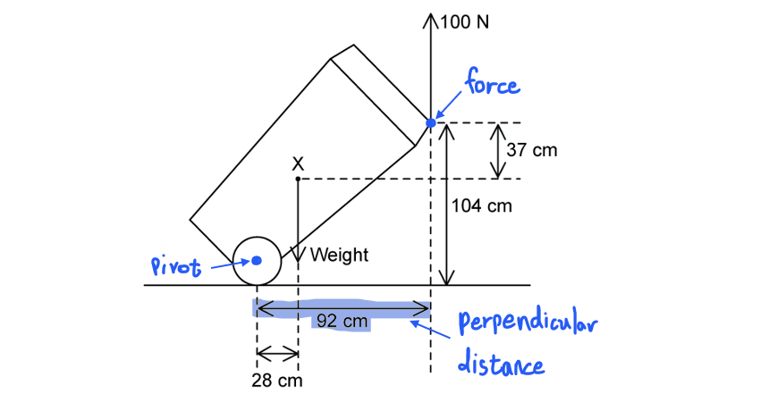

## Q3 — easy — 6 marks · exam-questions

### 1() — 1 marks
(a) A moment of a force is defined as:

- The turning effect of a force about a pivot **OR** force × perpendicular distance (between the force and pivot);** [1 mark]**

**[Total: 1 mark]**

### 2() — 1 marks
(b)

(i) The principle of moments states:

- (For a system in equilibrium) sum of clockwise moments = sum of anticlockwise moments;**[1 mark]**

(ii) State the clockwise moment due to the box on the right:

- 150 N m **[1 mark]**

**[Total: 2 marks]**

- *The seesaw is in **equilibrium*
- *The clockwise and anticlockwise moments are equal - the **resultant** **moment** is **zero*

### 3() — 2 marks
(c) Show that the weight *W* of the box is 10 N:

List the known quantities:

- Clockwise moment = 150 N m
- (Perpendicular) distance from the box to the pivot, $d$ = 1.50 m

Use the moment equation to calculate the weight:

- Moment = $F\timesd\RightarrowF=\frac{moment}{d}$
- $W=\frac{150}{1.50}$ **[1 mark]**
- $W=100N$ **[1 mark]**

**[Total: 2 marks]**

- *You must be confident with this type of simple **rearranging** in physics*

  - *In the above example, dividing **both** sides by **d** gave us force on its own*
- *Use your practice from **maths** to help you - check the revision notes from this course if you need*

  - *If you are still really struggling, equation triangles **may** help, but these are not very helpful once you get to more **complex** equations!*

### 4() — 2 marks
(d) Once the box on the left-hand side of the seesaw is removed, the seesaw will:

- Rotate clockwise / the right side will drop; **[1 mark]**

Explain why this happens:

Any **one** from:

- The resultant moment is no longer zero; **[1 mark]**
- The seesaw is no longer in equilibrium; **[1 mark]**
- There is a resultant clockwise moment; **[1 mark]**
- There is only a clockwise moment; **[1 mark]**
- There is no anticlockwise moment; **[1 mark]**

**[Total: 2 marks]**

## Q4 — easy — 3 marks · exam-questions

### 1() — 1 marks
**Correct answer: D** — The point through which the weight of an object acts

**Final answer:** **The correct answer is D**

- The centre of gravity of an object is the point through which the **weight** of the object acts

**A** is incorrect because the centre of gravity only sits at the exact middle when the object has uniform density and a symmetrical shape

**B** is incorrect because it is the weight that acts through the centre of gravity, not the mass — mass is a scalar and does not act in a direction

**C** is incorrect because gravity acts on every part of the object, and the centre of gravity is the single point where its effect can be taken to act

### 2() — 1 marks
Draw an **X** on the sign at its centre of gravity:

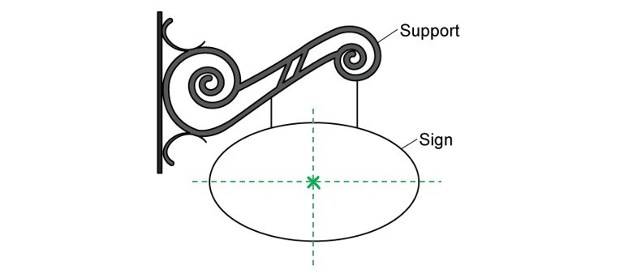

**[1 mark]**

> **[mark-scheme]**
> 1 mark for an X placed at the centre of the sign, where its two axes of symmetry cross

> **[exam-tip]**
> For a flat shape of uniform thickness, the centre of gravity sits where the lines of symmetry meet. Sketching the two lines of symmetry first makes it much easier to put the X in the right place.
> 
> Mark the sign itself, not the bracket holding it up. The question asks for the centre of gravity of the sign.

### 3() — 1 marks
Complete the sentence:

- The moment of the weight produces **a turning** effect **[1 mark]**

> **[exam-tip]**
> A moment always produces a turning, or rotational, effect. It is not a balancing effect — balancing is what happens when two moments are equal and opposite, which is a different idea.
> 
> Copy the whole phrase from the word list, including the article. Write "a turning", not just "turning", so that the completed sentence reads correctly.

## Q5 — easy — 3 marks · exam-questions

### 1() — 1 marks
**Correct answer: D** — 

**The correct answer is ****D** because:

- Moment of a force = Force × Perpendicular distance
- Moment of a force = 500 × 2.5 = 1250 N m
- The weight of the wooden pole acts downwards, so when it is lifted from the left, it acts in an **anti-clockwise**

  - This is option **D**

> *Add arrows to the diagram in the direction the moments act. *

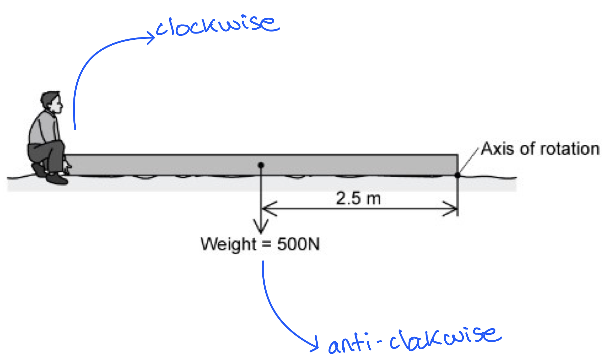

### 2() — 2 marks
(b)

(i) The correct sentence is:

- The minimum force needed to lift the end of the pole will be **smaller than** the weight of the pole;** [1 mark]**

(ii) The correct sentence is:

- This is because the **lifting force** is **further from** the axis of rotation than the **weight**;** [1 mark] ****OR**
- This is because the **weight** is **closer to** the axis of rotation than the **lifting force**; **[1 mark]**

**[Total: 2 marks]**

## Q6 — medium — 7 marks · exam-questions

### 5((a)) — 3 marks
(a)

(i) To calculate the weight of the hammer:

List the known quantities:

- Mass of hammer, *m *= 0.454 kg

From the equation list:

- Weight = mass × gravitational field strength, *W *= *mg*

Substitute in the known quantities to calculate the weight of the hammer, *W*:

- *W *= 0.454 × 10 **[1 mark]**
- *W *= 4.54 N **[1 mark]**

(ii) To state the point from which the weight acts:

- The weight acts from the <u>centre of gravity</u> / <u>centre of mass </u>of the hammer; **[1 mark]**

**[Total: 3 marks]**

### 1((b)) — 4 marks
(b)

(i) To draw an arrow on photograph **D **to show the force of the nail on the hammer:

- A diagram that should score 2 marks would look like this:

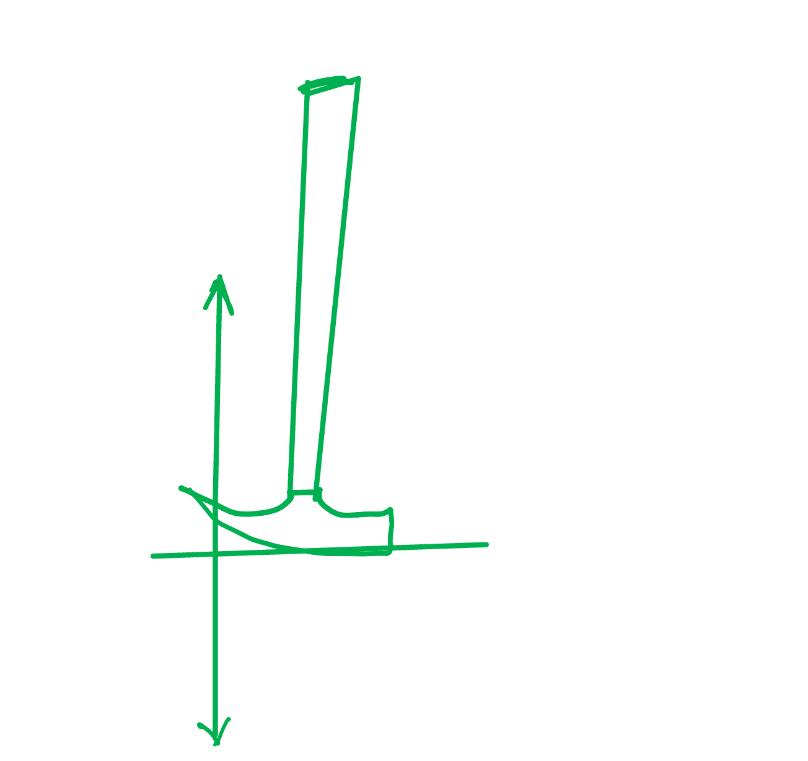

- Force acting upwards (near vertical by eye);  **[1 mark]**
- Force acting from the top of the nail (in line with *F*2) ; **[1 mark]**

(ii) To suggest ways that the student could increase the moment of the hammer:

Any **two **from:

- <u>Increase force</u> / *F*1 (from hand /** **by using two hands); **[1 mark]**
- <u>Increase distance</u> between hand and pivot **/ ***d*1; **[1 mark]**
- Keep force / *F*1 and hammer <u>perpendicular</u> to each other **OR **use a longer hammer;**[1 mark]**

**[Total: 4 marks]**

> *It is important to consider exactly how the moment of the hammer is increased. This is by either:*

> *1. Increasing the force on the hammer*

> *2. Increasing the distance the force acts away from the pivot*

> *3. Keeping the force at right angles to the hammer*

> *So, you must state in your answer the component that is being increased. Stating that using two hands would increase the moment is not sufficient. You must state that the force is increased and to do this the student could use two hands.*

> *You might have received the mark for saying use two hands but to get the mark you must say that the force will increase.*

> *Understanding moments requires really specific knowledge of the location of the distance from the force to the pivot. Therefore, references to the following are not acceptable for scoring a mark:*

- *references to d**2*
- *distance from nail to pivot*
- *the idea of a bigger [rather than longer] hammer*

## Q7 — medium — 6 marks · exam-questions

### 5((a)) — 1 marks
(a)

Mark X on the diagram to indicate the centre of gravity of the loaded wheelbarrow:

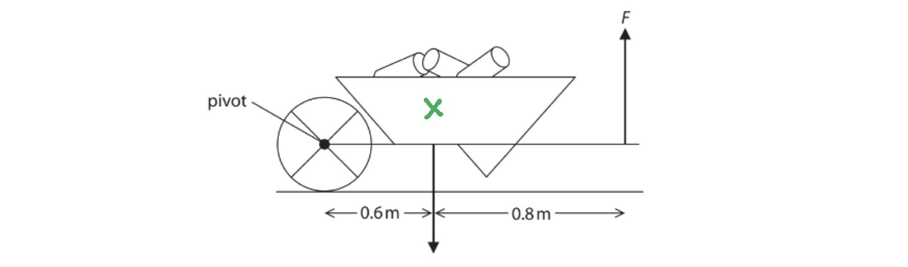

**[1 mark]**

**[Total: 1 mark]**

### 5((b)) — 5 marks
(b)

(i) State the equation linking moment, force and perpendicular distance from the pivot:

- Moment = force × distance

**OR**

- $M=F\timesd$ **[1 mark]**

(ii) Calculate the force F:

List the known quantities:

- Weight, *W* = 470 N
- Distance, *d*1, from pivot to centre of gravity = 0.6 m
- Distance,* d*2, from centre of gravity to upward acting force = 0.8 m

State the principle of moments:

- For an object in equilibrium, the sum of the anticlockwise moments is equal to the sum of the clockwise moments

**OR**

- Total clockwise moment = total anticlockwise moment;**[1 mark]**

Calculate the total distance from the pivot to the hand:

- Total distance, *d*T = *d*1 + *d*2
- *d*T = 0.6 + 0.8 = 1.4 m **[1 mark]**

Set up the equation and rearrange to make *F* the subject:

- $W\timesd_{1}=F\timesd_{T}$
- Dividing by *d*T gives $F=\frac{W\timesd_{1}}{d_{T}}$
- Substituting in the known values, $F=\frac{470\times0.6}{1.4}$ **[1 mark]**
- *F* = 200 N / 201 N / 201.4 N **[1 mark]**

**[Total: 5 marks]**

## Q8 — medium — 7 marks · exam-questions

### 3((a)) — 4 marks
(a)

(i) The equation linking moment, force and perpendicular distance from the pivot is:

- Moment = force x (perpendicular) distance (from pivot); **[1 mark]**

(ii) Calculate the reading on the newtonmeter

List the known quantities:

- Force from weight, *F**w* = 2 N
- Distance of weight from pivot, *d*W = 60 cm
- Distance of newtonmeter from pivot, *d**N** *= 10 cm

State the principle of moments:

- The total clockwise moments = The total anticlockwise moments

Determine the total clockwise moments:

- Clockwise moments = moment from the weight = 2 N × 60 cm = 120 N cm

Determine the total anticlockwise moments:

- Anticlockwise moments = *F*N × 10 cm

Equation the clockwise and anticlockwise moments and rearrange for *F*W:

- 120 N cm = *F*N × 10 cm**[1 mark]**
- *F*N* * = $\frac{120}{10}$ **[1 mark]**
- *F*N* *= 12 N **[1 mark]**

**[Total: 4 marks]**

> *It is encouraged to label the diagram to make sure you're associating the correct distances to the correct forces, for example like this:*

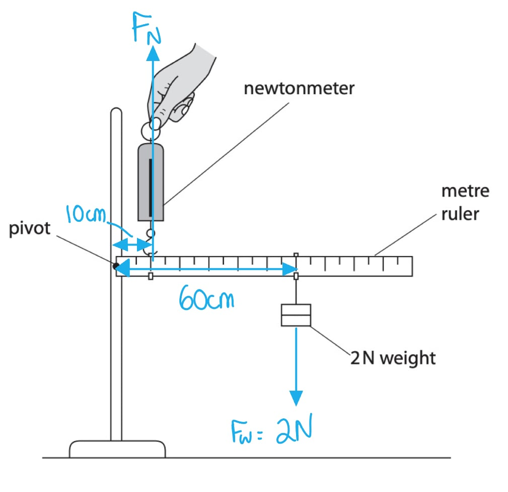

> *To know whether a force is producing a clockwise or anti-clockwise moment, imagine if that force was increased and see which direction the beam / ruler would pivot it. You can see that in this sketch:*

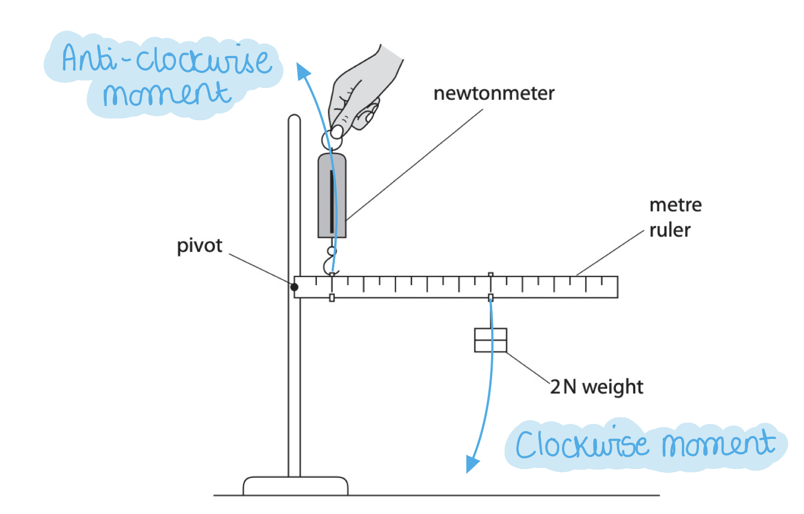

### 3((b)) — 3 marks
(b) Changing to the iron bar affects the reading on the newtonmeter by:

- It increases the force (and reading) on the newtonmeter; **[1 mark]**
- Since the weight of the bar has a moment; **[1 mark]**
- In the same (clockwise) direction as the 2 N weight; **[1 mark]**

**[Total: 3 marks]**

> *For the ruler to stay in balance, all the clockwise moments must be equal the anti-clockwise moments. The weight of the iron bar creates an **extra** clockwise moment additional to the 2 N weight downwards which the newtonmeter must now equate. Since the distance of the newtonmeter from the pivot remains the same, the force on the newtonmeter must therefore change (since moment = force × distance).*

## Q9 — medium — 8 marks · exam-questions

### 2((b)) — 5 marks
(a)

(i) Use the principle of moments to show that the upward force A is 250 N

List the known quantities:

- Length of the plank = 3 m
- Weight of the plank = 500 N

State the principle of moments:

- The total clockwise moments = the total anti-clockwise moments **[1 mark]**

Define the moment:

- Moment = Force × (perpendicular) distance from pivot**[1 mark]**

Take moments about B:

- Clockwise moment = FA × 2 m
- Anti-clockwise moment = 500 N × 1 m

Equate both moments and rearrange to calculate the upward force at A, *F*A:

- FA × 2 m = 500 N × 1 m = 500 N m **[1 mark]**
- FA = $\frac{500}{2}$= 250 N m **[1 mark]**

(ii) The value of force B is:

- 250 N **[1 mark]**

**[Total: 5 marks]**

> *There is a lot going on in part (i)! Since we are not given the 'pivot' to take the moments from, we need to decide this for ourselves. You want to choose a pivot where it is easy to calculate distances from, and where you do not know the force applied at that point (such as at B). Therefore, the force at the pivot won't appear in the equation (since the distance from the pivot would be 0!). Let's have a look at the distances:*

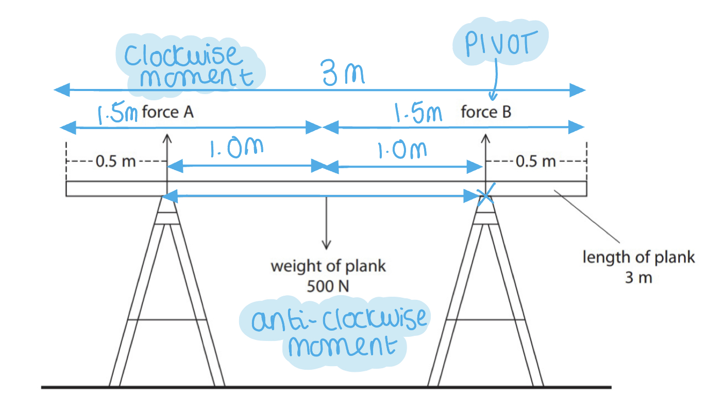

### 3((c)) — 3 marks
(b)

(i) Draw an arrow on the diagram to show the weight of the painter

A diagram that would score 1 mark should look like:

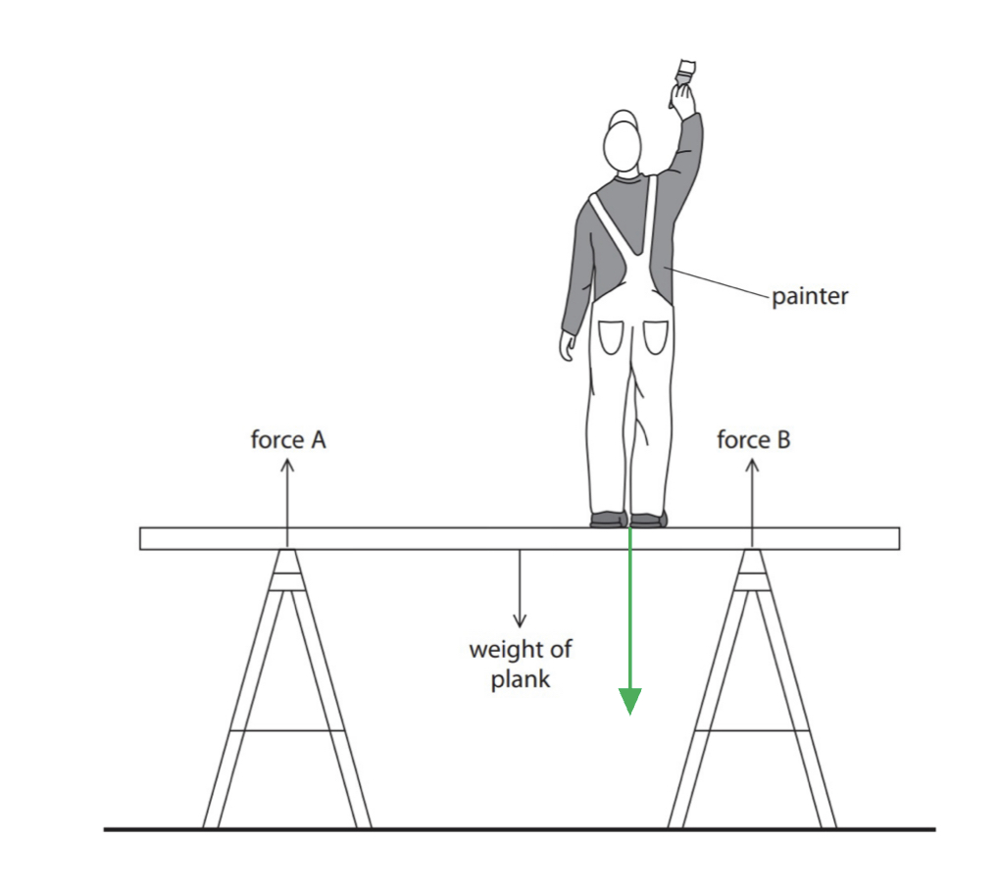

- Arrow vertically down from painter; **[1 mark]**

(ii) The changes in force A and B when the painter stands on the plank are:

- Both forces <u>increase;</u> **[1 mark]**
- With force at B larger than force at A;**[1 mark]**

> *[Total: 3 marks]*

## Q10 — medium — 4 marks · exam-questions

### 2((c)) — 4 marks
(i) The equation linking moment, force and distance is:

- Moment = Force × (Perpendicular) distance (from the pivot) **OR** Moment = F × d **[1 mark]**

(ii) Calculate the force needed to lift the suitcase:

List the known quantities:

- Force of person pulling on suitcase = $F$
- Weight of suitcase, $W$ = 150 N
- Distance of handle from pivot, $d_{1}$ = 0.87 m
- Distance of centre of mass from pivot, $d_{2}$ = 0.32 m

Calculate the anti-clockwise moment created by the weight of the suitcase:

- Moment = $F\timesd$
- Clockwise moment = $F\timesd_{1}=F\times0.87$
- Anti-clockwise moment = $150\times0.32$ **[1 mark]**

Apply the principle of moments and substitute the known quantities:

- Clockwise moments = anti-clockwise moments
- $F\timesd_{1}=W\timesd_{2}$
- $F\times0.87=150\times0.32$ **[1 mark]**

Rearrange the equation to calculate the force applied by the person on the suitcase:

- $F=\frac{150\times0.32}{0.87}=55N$ **[1 mark]**

**[Total: 4 marks]**

> *In part (i) you can give your answer in words or symbols and in any rearrangement of the equation. It is, however, best to remember the standard arrangement to avoid any confusion. *

## Q11 — hard — 3 marks · exam-questions

### 3() — 1 marks
**Correct answer: A** — 

**The correct answer is ****A** because:

- The bridge is balanced horizontally
- This means that the total upwards forces equal the total downwards forces
- The only downward force is the 15 N weight of the train

  - Therefore, force X and Y need to add up to 15 N
  - This eliminates row **B**
- The weight of the train acts down the **middle** of the bridge

  - Therefore, force X and Y must be equal since they are both the same distance from the train
- This means they must be half of 15 N each (7.5 N)

  - This is row **A**

### 3((b)) — 2 marks
(b) If the train moves from P to Q:

- (Force X would) <u>decrease</u>; **[1 mark]**
- From 15 N to 0 N;** [1 mark]**

**[Total: 2 marks]**

> *The balancing of the moments on a beam and how the forces changes as something moves across a beam are **very** common exam questions. *

> *When the train is in the middle of the beam, force X and Y are at equal distance to it. Therefore, they must have the same forces upwards to balance the train. *

> *As the train moves from P to Q, it is going further towards Force Y. This decreases the distance between the downward force of the weight of the train and the force Y, meaning Y needs to **increase** to balance this. Since moment = force × distance, for the same moment, if distance decreases the force must increase. Otherwise, the beam will break. Consequently, force X can decrease as the train is moving away from it i.e. it does not need to provide as much upwards force to balance the train.*

## Q12 — hard — 12 marks · exam-questions

### 1((a)) — 2 marks
(a)

Describe how the student could check that the ruler is horizontal

- A method involving a suitable measurement or comparison; **[1 mark]**
- An appropriate check for horizontally;**[1 mark]**

**Examples of suitable methods:**

- Measure the height of the ruler and the bench in several places; **[1 mark]**
- The height of the readings should be consistent;**[1 mark]**

**   OR**

- Set a marker level with the pivot; **[1 mark]**
- At the same height as the end of the ruler;**[1 mark]**

**   OR**

- Place the spirit level on the ruler; **[1 mark]**
- The bubble should be central; **[1 mark]**

**   OR**

- Measure the angle between stand and ruler; **[1 mark]**
- Check this is a right angle;**[1 mark]**

**[Total: 2 marks]**

> *You may also suggest other methods from the ones listed. You can also score one mark by assuming that the bench is horizontal / the stand is vertical. *

### 1((b)) — 4 marks
(b)

(i) State the equation linking moment, force and distance from the pivot:

- Moment = Force × (perpendicular) distance (from pivot); **[1 mark]**

(ii) Calculate the moment and state the unit of the 2 N weight:

List the known quantities:

- Weight, *F *= 2 N
- Distance from pivot, *d *= 60 cm = 0.6 m

Recall the equation to calculate the moment from part (i):

- Moment = Force × (perpendicular) distance (from pivot) = *Fd *

**Method 1: Keeping the units of distance in cm**

Substitute in the known quantities to calculate the moment of the 2 N weight:

- Moment = 2 × 60 **[1 mark]**
- Moment = 120 **[1 mark]**

State the units for the moment of the 2 N weight:

- Units: N cm **[1 mark]**

**Method 2: Converting the units of distance to m**

Substitute in the known quantities to calculate the moment of the 2 N weight:

- Moment = 2 × 0.6 **[1 mark]**
- Moment = 1.2 **[1 mark]**

State the units for the moment of the 2 N weight:

- Units: N m **[1 mark]**

**[Total: 4 marks]**

> *When calculating moments, as long as you keep the units in the question the same as in your answer then you can calculate with the distance in m or in cm. *

### 1((c)) — 3 marks
(c)

(i) The correct reading should be larger than 12 N because:

- (The reading should take into account) the mass / weight of the ruler;**[1 mark]**
- Weight acts downwards **OR **weight increases the (clockwise) moment; **[1 mark]**

(ii) The actual reading is only 10 N because:

- The scale on the force meter only reads from 0 N to 10 N, so any force greater than 10 N would be <u>off the scale;</u>**[1 mark]**

**[Total: 3 marks]**

> *In part (i), it can be seen that the forcemeter is going to be taking some of the weight of the ruler. Mentioning this in your examination is correct but it may not get you full marks because the forces and moments involved must be mentioned. *

> *According to the principle of moments the sum of the clockwise moments must equal the sum of the anticlockwise moments. The forcemeter in this case produces the clockwise moment. *

> *A force of 12 N at 10 cm gives a moment of 1.2 Nm. This is equal to the anticlockwise moments created by the weights. *

> *However, the sum of the anti-clockwise moments must be greater than this as the weight of the ruler also contributes to the moment. So, the clockwise moment provided by the forcemeter must also be greater. If the forcemeter is kept at 10 cm then the force it provides must be greater than 12 N. *

### 1((d)) — 3 marks
(d)

**Method 1: Using words to explain why fisherman A feels the larger force:**

- Clockwise and anticlockwise moments (about the fish) must be equal; **[1 mark]**
- Fish are closer to (fisherman) **A**; **[1 mark]**
- So, for the moment to be the same as for fisherman **B **the force exerted by fisherman **A **must be larger (By Newton's third law this means he feels the larger force);**[1 mark]**

**Method 2: Using algebra to explain why fisherman A feels the larger force:**

Taking moments about the fish:

- Label the distances along the pole:

  - Distance from fish to **A **is x
  - Distance from fish to **B **is y
- Label the forces from fisherman **A **and **B**:

  - *F**A *= force applied by fisherman **A **
  - *F**B* = force applied by fisherman **B**
- The pole is balanced:

  - So,* F**A* *x *= *F**B** y***[1 mark]**

Rearrange the equation to make *F**A *the subject:

- `F subscript A space equals space open parentheses y over x close parentheses F subscript B` **[1 mark]**

Consider the distances *x *and *y*:

- *y *> *x *
- So, *F**A *> *F**B ***[1 mark]**

**[Total: 3 marks]**

> *In this question, marks will be awarded for recognising that force and distance are inversely proportional to each other. When the distance increases the force needed to balance the moment decreases and vice versa. *

## Q13 — hard — 8 marks · exam-questions

### 2((a)) — 2 marks
(a)

(i) The lever-arm can move the bolt because:

- Pulling the lever arm to the left moves the bolt to the left; **[1 mark]**

(ii) The spring is needed because:

- It returns the lever-arm (and the bolt) to the right / its original position (once the lever is released);**[1 mark]**

**[Total: 2 marks]**

### 2((b)) — 6 marks
(b)

(i) The principle of moments states:

Any **one** from:

- (The sum of the) clockwise moments = (the sum of the) anti-clockwise moments; **[1 mark]**

- (force A × distance A) = (force B × distance B); **[1 mark]**

- *F**A**d**A* = *F**B**d**B* **[1 mark]**

(ii) Calculate the force exerted on the lever-arm at point A by the spring:

List the known quantities:

- Force applied at point B, *F**B* = 22 N
- Distance of point B from pivot, *d**B* = 110 cm
- Distance of point A from pivot, *d**B* = 38 cm
- Force applied at point A, *F**A*

Rearrange the principle of moments equation to make *F**A *the subject:

- *F**A**d**A* = *F**B**d**B*
- $F_{A}=\frac{F_{B}d_{B}}{d_{A}}$ **[1 mark]**

Substitute in the known quantities:

- $F_{A}=\frac{22\times110}{38}$ = 63.7 **[1 mark]**

Calculate the force exerted on the lever arm at part A:

- Force at point A = 64 N **[1 mark]**

(iii) If the distance from the pivot to point A increase:

Any **two **from:

- The (clockwise) moment will increase; **[1 mark]**
- The distance to B will remain the same / 110 cm; **[1 mark]**
- Hence, the force (at B) will increase (for the moments to be equal);**[1 mark]**

**[Total: 6 marks]**

> *In part (ii) be aware that you will be awarded full marks for this question as long as you complete the substitution and the rearrangement and then calculate the correct answer. The order of rearrangement and substitution does not matter. *

> *An annotated diagram will help you to do this correctly. *

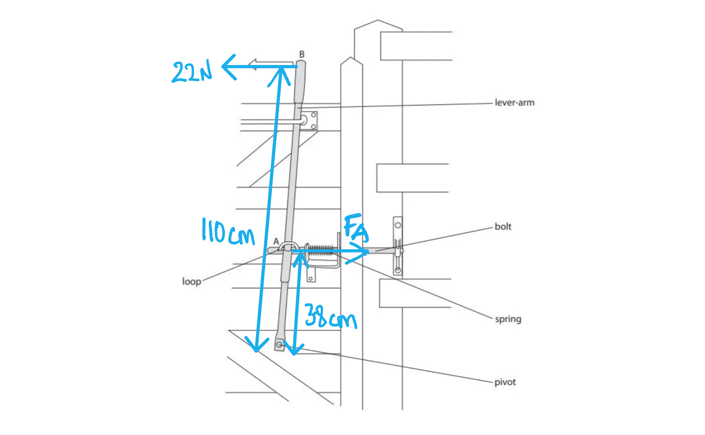

## Q14 — hard — 8 marks · exam-questions

### 8((a)) — 1 marks
(a) The missing force is:

- Weight of (the) plank; **[1 mark]**

**[Total: 1 mark]**

### 8((c)) — 3 marks
(b)

(i) The equation linking moment, force and perpendicular distance from the pivot is:

- Moment = force × perpendicular distance from the pivot;**[1 mark]**

(ii) Calculate the clockwise moment of the black about the pivot

List the known quantities:

- Force = 1200 N
- Perpendicular distance from pivot = 0.75 m

Substitute values into moment equation:

- Moment = 1200 × 0.75 **[1 mark]**
- Moment = 900 N m **[1 mark]**

**[Total: 3 marks]**

### 8((c)) — 4 marks
(c)

List the known quantities:

- Clockwise moment = 900 N m (from part b)
- Weight of plank, *F*P = 200 N
- Distance of centre of gravity of plank from pivot = $\frac{3}{2}$– 0.75 = 0.75 m

Determine distance of the force of man pushing down on the plank from pivot:

- The length of the plank is 3 m
- The pivot is 0.75 m from the other end of the plank
- Therefore, the distance from the man's hand to the pivot is 3 – 0.75 m = 2.25 m **[1 mark]**

State the principle of moments:

- The total clockwise moments equals to the total anti-clockwise moments; **[1 mark]**

Determine anti-clockwise moments:

- Both the force of the man on the plank (*F*) and the weight of the plank create the total anticlockwise moments
- (*F* × 2.25) + (200 × 0.75) **[1 mark]**

Equate clockwise and anti–clockwise moments and rearrange for the force of the man, *F*:

- (*F* × 2.25) + (200 × 0.75) = 900
- 2.25*F* + 150 = 900
- 2.25*F* = 900 – 150 = 750
- *F* = $\frac{750}{2.25}$
- *F* = 333.333 = 330 N **[1 mark]**

**[Total: 4 marks]**

> *This question is worth a lot of marks, so step through it carefully by thinking of all the forces and relevant distances. Labelling your diagram to help you calculate the distances also helps. Since the plank is 'uniform', this implies its weight (200 N force downwards) is in the **middle**. This will help you calculate any missing distances:*

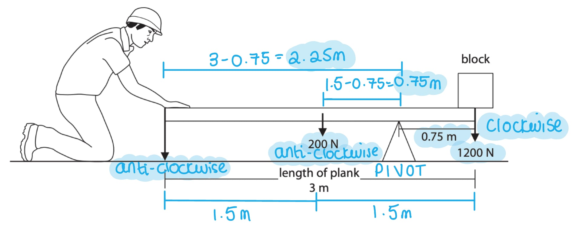

## Q15 — hard — 8 marks · exam-questions

### 1() — 1 marks
**Correct answer: A** — Distance A

**The correct answer is ****A** because:

- The independent variable is the variable that the scientist changes

  - This then causes the dependent variable to change in some way
- Since the student moves the weight along the ruler, they are changing the distance **A**

  - Therefore, this is the independent variable

### 2() — 1 marks
**Correct answer: D** — Force D

**The correct answer is ****D** because:

- A controlled variable is a variable that is <u>kept constant</u> throughout the experiment

  - Since the student moves the weight along the ruler they are <u>changing distance </u><u>**A**</u>
  - Option **A** is incorrect
- Forces B and C are changed by the change in distance, and are measured

  - This means that forces B and C are the dependent variables
  - Options **C** and **D** are incorrect
- Force D (the weight of the masses) is kept constant throughout this experiment

  - Force D is the controlled variable

### 13((b)) — 5 marks
(c)

(i) Complete the student's graph:

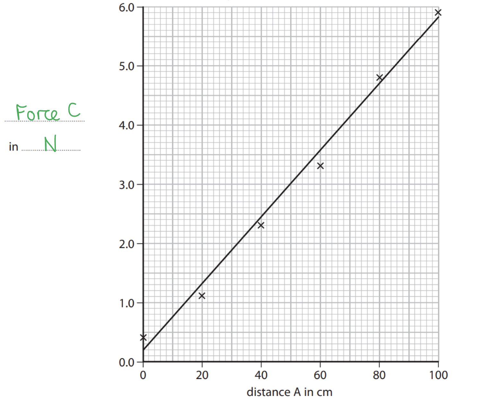

- Force (C) in N **OR** Newtons; **[1 mark]**

(ii) Plot a second line to show how force B varies with distance A

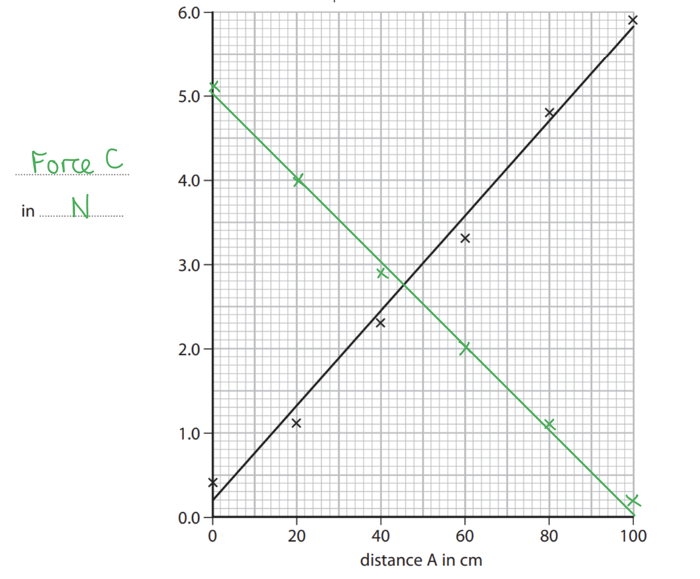

- Correct distance along ruler values plotted for force B; **[1 mark]**
- Correct newtonmeter reading values plotted for force B; **[1 mark]**
- Correct line of best fit (equal points on either side of the line); **[1 mark]**

(iii) Find distance A for which force B and force C are equal:

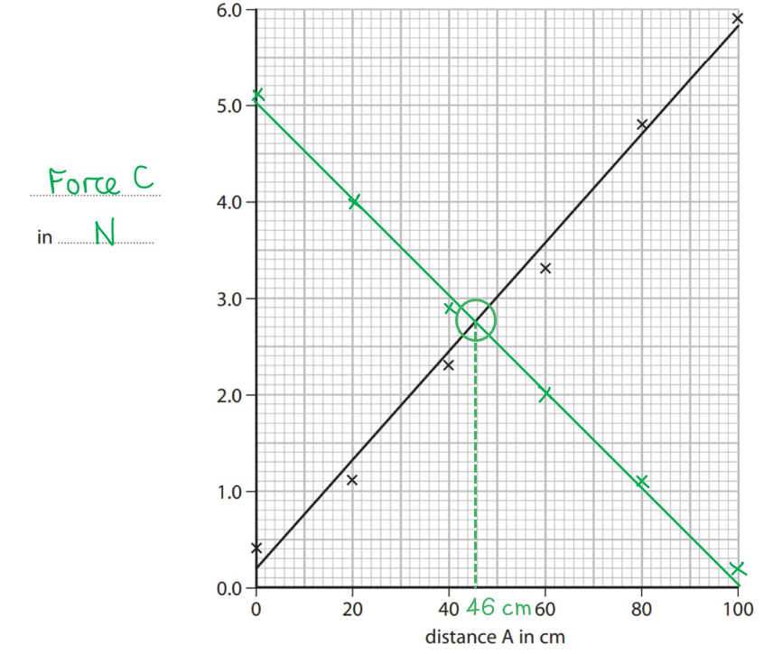

Point where both lines meet = 46 cm **[1 mark]**

**[Total: 5 marks]**

> *The line of best fit is normally judged by eye by your examiner and they will look for the line to go through roughly as many points as possible, with an equal number of points on either side of the line. Make sure you're using a sharp pencil and ruler to draw your line as neatly as possible.*

### 13((c)) — 1 marks
(d) Force B nor C are ever zero during the investigation due to:

- The force due to gravity / weight of the ruler;** [1 mark]**

**[Total: 1 mark]**

> *Avoid terms such as 'it's got a force acting or 'because of gravity'. These are too vague and you should try and use scientific terms where possible and always relate back to the context of the question. Instead of just 'the weight' state the weight of **what** exactly.*
