# Exam Questions — Moments
**1. Forces & Motion** · Edexcel IGCSE Physics (Modular) (4XPH1) — 24/Unit 1
> Source: [https://www.savemyexams.com/igcse/physics/edexcel/modular/24/unit-1/topic-questions/forces-motion/moments/exam-questions/](https://www.savemyexams.com/igcse/physics/edexcel/modular/24/unit-1/topic-questions/forces-motion/moments/exam-questions/) · 15 questions · total 86 marks

## Q1 — easy — 2 marks · exam-questions

### 2((a)) — 1 mark — multiple_choice — from paper 2013 June · 2PR
Which of the following is a unit for the **moment of a force**?
- **A.** N
- **B.** N m
- **C.** N/m
- **D.** N/m2

### 2() — 1 mark — command: state — structured
State the principle of moments.

## Q2 — easy — 1 marks · exam-questions

### 1() — 1 mark — multiple_choice
A person applies a force of 100 N to the bin to keep it stationary.

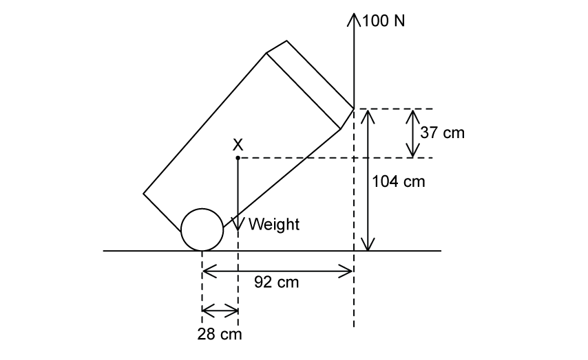

Which of the following is the correct calculation of the moment of the 100 N force?
- **A.** 100 N × 28 cm
- **B.** 100 N × 37 cm
- **C.** 100 N × 92 cm
- **D.** 100 N × 104 cm

## Q3 — easy — 6 marks · exam-questions

### 1() — 1 mark — command: state — structured
State what is meant by a **moment of a force**.

### 2() — 1 mark — command: state — structured
A uniform seesaw is in equilibrium with a box placed on each side.

The box on the left has an anticlockwise moment of 150 N m about the pivot.

The box on the right has weight *W*.

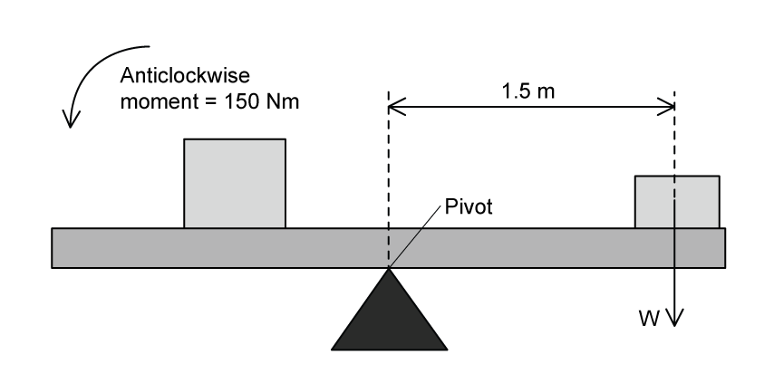

(i) State the principle of moments.

**(1)**

(ii) State the clockwise moment due to the box on the right.

**(1)**

### 3() — 2 marks — command: show — structured
Show that the weight *W* of the box on the right side of the seesaw is 100 N.

### 4() — 2 marks — command: explain — structured
The box on the left-hand side of the seesaw is now removed.

State and explain what happens to the seesaw.

## Q4 — easy — 3 marks · exam-questions

### 1() — 1 mark — multiple_choice
The centre of gravity of an object is
- **A.** The point in the exact middle of the object
- **B.** The point through which the mass of an object acts
- **C.** The point through which gravity acts
- **D.** The point through which the weight of an object acts

### 2() — 1 mark — command: draw — structured
The diagram shows a sign hanging outside of a shop.

Draw an **X** on the sign at its centre of gravity.

### 3() — 1 mark — command: complete — structured
One force which acts on the sign is its weight.

Complete the following sentence

| **a balancing     an accelerating     a turning** |
|---|

The moment of the weight produces .................................... effect.

## Q5 — easy — 3 marks · exam-questions

### 1() — 1 mark — multiple_choice
The diagram shows a person beginning to lift the end of a heavy wooden pole.

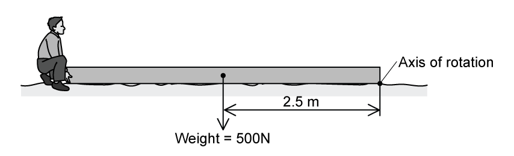

As the pole is lifted, what is the size and direction of the moment produced by the weight of the wooden pole?

|   | **moment** | **direction** |
|---|---|---|
| **A.** | 200 | clockwise |
| **B.** | 200 | anticlockwise |
| **C.** | 1250 | clockwise |
| **D.** | 1250 | anticlockwise |
- **A.** 
- **B.** 
- **C.** 
- **D.** 

### 2() — 2 marks — command: complete — structured
Complete the following sentences

| **larger than      smaller than     equal to** |
|---|

(i) The minimum force needed to lift the end of the pole will be .................................... the weight of the pole.

**(1)**

| **lifting force      weight       further from       closer to** |
|---|

(ii) This is because the .................................... is .................................... the axis of rotation than the .................................... .

**(1)**

## Q6 — medium — 7 marks · exam-questions

### 5((a)) — 3 marks — command: multiple — structured — from paper 2012 January · 2P
Photograph C shows how a student can use a claw hammer to pull a nail from a piece of wood.

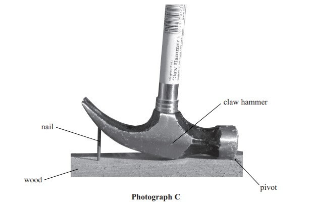

The mass of the hammer is 0.454 kg.

(i) Calculate the weight of the hammer.

**(2)**

weight = ............................................... N

(ii) From what point does this weight act?

**(1)**

### 1((b)) — 4 marks — command: multiple — structured — from paper 2013 June · 2P
Photograph **D** shows the directions of two other forces on the hammer.

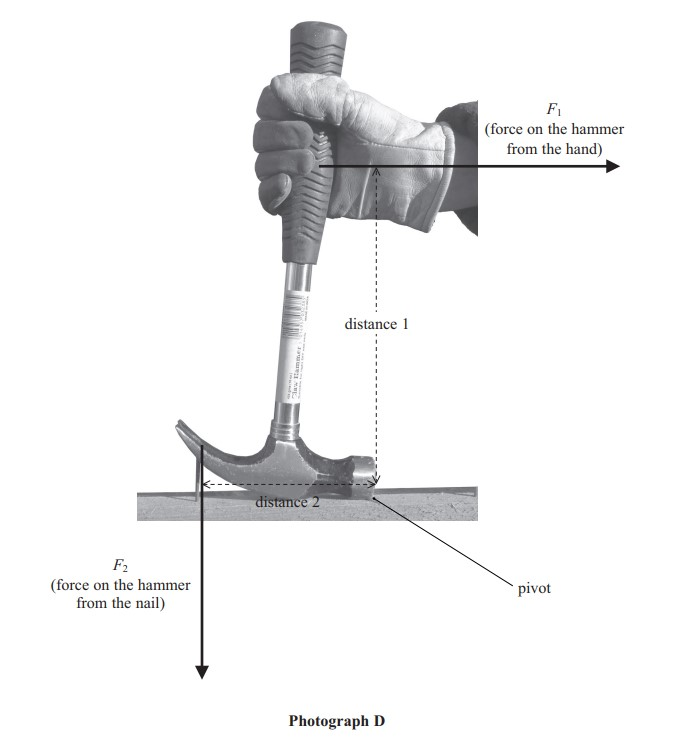

(i) Draw an arrow on photograph **D** to show the force on the nail from the hammer.

**(2)**

(ii) Suggest **two** ways that the student could increase the moment on the hammer.

**(2)**

## Q7 — medium — 6 marks · exam-questions

### 5((a)) — 1 mark — command: place — structured — from paper Jun 2012 · 1P
A man uses a wheelbarrow to carry some logs along a flat path, as shown.

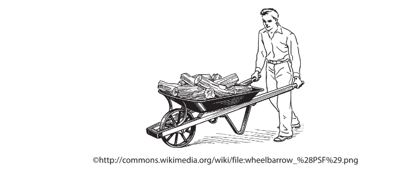

He pushes with a horizontal force of 140 N and the wheelbarrow moves 39 m.

The man stops and holds the wheelbarrow horizontally, as shown.

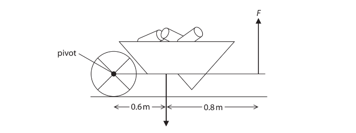

The man exerts a total upward force of FN. The weight of the loaded wheelbarrow is 470N.

Mark X on the diagram to indicate the centre of gravity of the loaded wheelbarrow.

### 5((b)) — 5 marks — command: multiple — structured — from paper 2012 June · 1P
(i) State the equation linking moment, force and perpendicular distance from the pivot.

**(1)**

(ii) Calculate the force F.

**(4)**

## Q8 — medium — 7 marks · exam-questions

### 3((a)) — 4 marks — command: multiple — structured — from paper 2015 June · 2PR
The diagram shows the apparatus used to investigate moments.

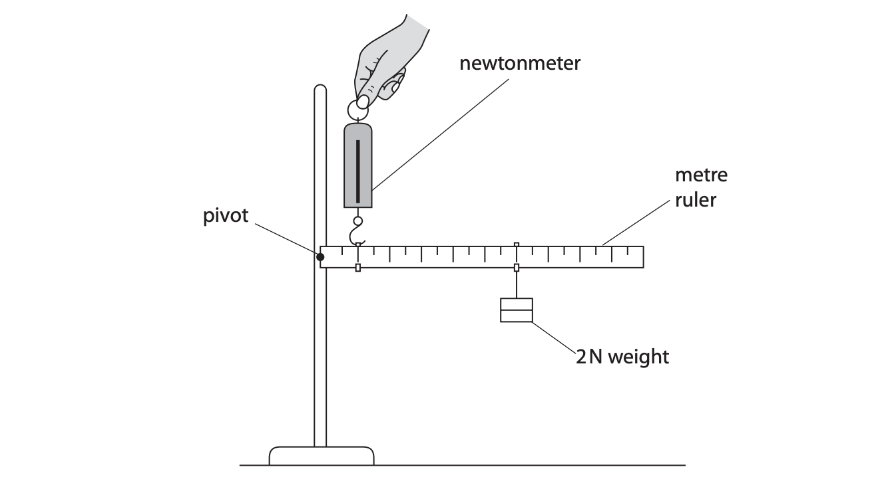

The 2 N weight is placed 60 cm from the pivot.

The newtonmeter is placed 10 cm from the pivot.

(i) State the equation linking moment, force and perpendicular distance from the pivot.

**(1)**

(ii) Calculate the reading on the newtonmeter.

Ignore the weight of the ruler.

**(3)**

reading = ............................................... N

### 3((b)) — 3 marks — command: explain — structured — from paper 2015 June · 2PR
The metre rule is replaced by an iron bar.

The iron bar is 1 m long and has a weight of 10 N.

The newtonmeter and the 2 N weight stay in their original position.

Explain how this change affects the reading on the newtonmeter.

## Q9 — medium — 8 marks · exam-questions

### 2((b)) — 5 marks — command: multiple — structured — from paper 2013 · 2PR
A painter sets up a uniform plank so he can paint a wall.

The plank is 3 m long and weighs 500 N.

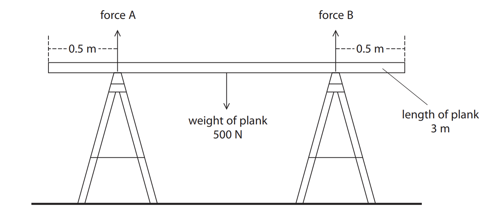

(i) Use the principle of moments to show that the upward force A is 250 N.

**(4)**

(ii) State the value of force B.

**(1)**

force B = ............................N

### 3((c)) — 3 marks — command: multiple — structured — from paper 2013 · 2PR
The painter stands on the plank as shown.

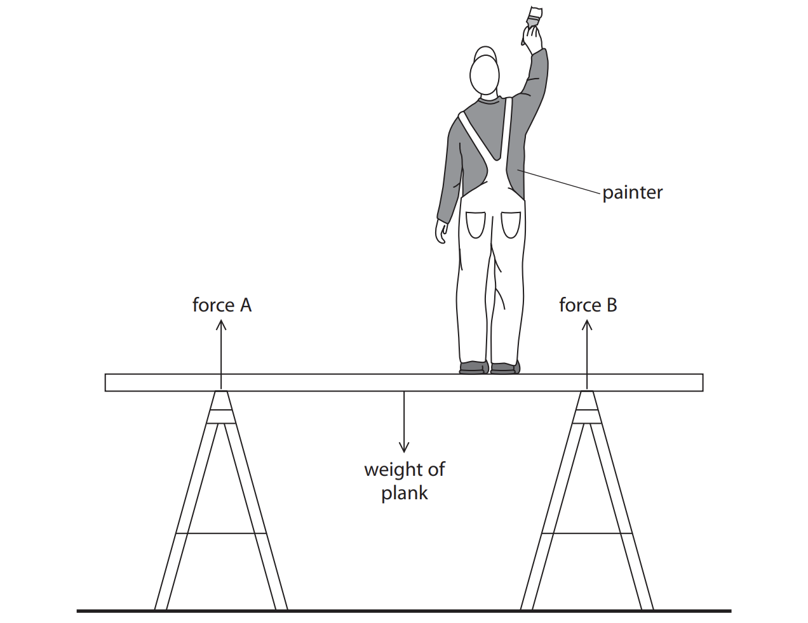

(i) Draw an arrow on the diagram to show the weight of the painter.

**(1)**

(ii) Describe the changes in forces A and B when the painter stands on the plank.

**(2)**

## Q10 — medium — 4 marks · exam-questions

### 2((c)) — 4 marks — command: multiple — structured — from paper 2015 · 2P
A person raises a suitcase by pulling on the handle with force *F*.

The weight of the suitcase is 150 N.

(i) State the equation linking moment, force and perpendicular distance from the pivot.

(ii) Calculate the force *F* that the person must apply on the handle to start raising the suitcase.

force *F* = ............................................... N

## Q11 — hard — 3 marks · exam-questions

### 3() — 1 mark — multiple_choice — from paper 2015 June · 2P
A toy train is placed on the middle of a bridge on a model railway.

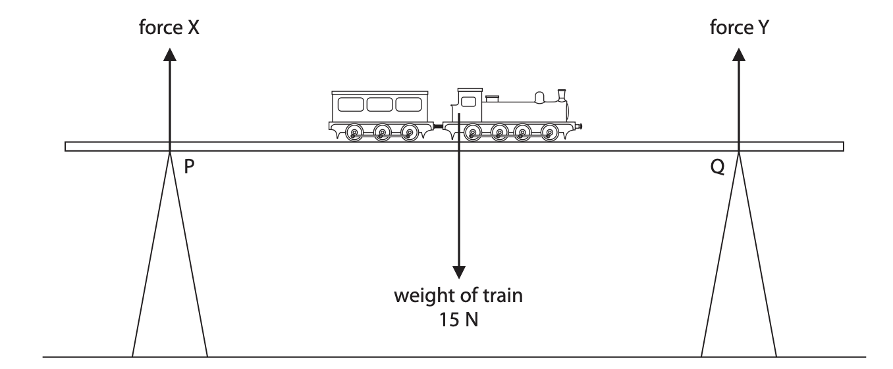

The weight of the train acts through its centre of gravity. Ignore the weight of the bridge.

Which row of the table shows the correct values for forces X and Y?

|   | force X | force Y |
|---|---|---|
| **A** | 7.5 N | 7.5 N |
| **B** | 0N | 0N |
| **C** | 0N | 15 N |
| **D** | 15N | 0N |
- **A.** 
- **B.** 
- **C.** 
- **D.** 

### 3((b)) — 2 marks — command: describe — structured — from paper 2015 · 2P
Describe how force X would change if the train moved from P to Q.

## Q12 — hard — 12 marks · exam-questions

### 1((a)) — 2 marks — command: describe — structured — from paper 2012 January · 2P
A student wants to investigate the principle of moments. He connects a ruler to a stand with a pivot and hangs a 2 N weight from the 60 cm mark on the ruler. He uses a newtonmeter to hold the ruler horizontal.

The scale on the newtonmeter reads from 0 N to 10 N.

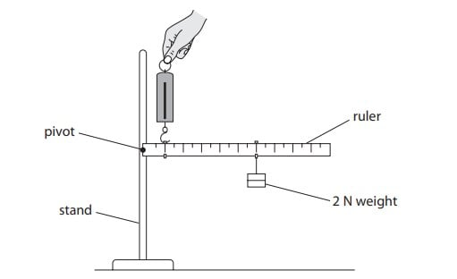

Describe how the student could check that the ruler is horizontal.

### 1((b)) — 4 marks — command: multiple — structured — from paper 2012 January · 2P
(i) State the equation linking moment, force and distance from the pivot.

**(1)**

(ii) Calculate the moment of the 2 N weight.

State the unit.

**(3)**

** **moment = ............................................... unit = ...............................................

### 1((c)) — 3 marks — command: explain — structured — from paper 2012 January · 2P
The student holds the ruler horizontal with the forcemeter at the 10 cm mark. He expects the reading on the forcemeter to be 12 N. The actual reading is 10 N.

Explain why

(i) The correct reading should be **larger** than 12 N.

**(2)**

(ii) The actual reading is only 10 N.

**(1)**

### 1((d)) — 3 marks — command: explain — structured — from paper 2012 January · 2P
A picture in the student’s textbook shows two fishermen using a pole to carry some fish.

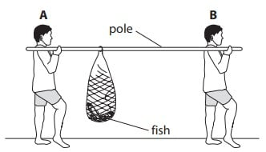

Fisherman **A** and fisherman **B** feel different forces on their shoulders.

Use ideas about moments to explain why fisherman **A** feels the larger force.

## Q13 — hard — 8 marks · exam-questions

### 2((a)) — 2 marks — command: multiple — structured — from paper 2016 June · 2PR
The diagram shows a gate with a lever-operated catch.

A loop on the bolt fits around the lever-arm at A.

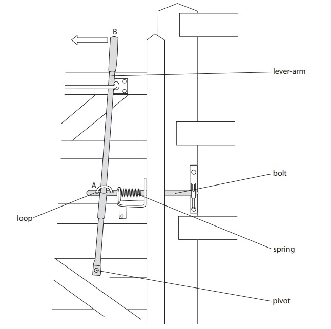

(i) Describe how the lever-arm is used to move the bolt.

**(1)**

(ii) Suggest why the spring is needed.

**(1)**

### 2((b)) — 6 marks — command: multiple — structured — from paper 2016 June · 2PR
The lever arm operates using the principle of moments.

(i) State the principle of moments.

**(1)**

(ii) The force applied at point B is 22 N. The pivot is 110 cm from point B and 38 cm from point A.

Calculate the force exerted on the lever-arm at point A by the spring.

**(3)**

force at point A = ............................................... N

(iii) Explain how the force applied at point B would need to change if the distance from the pivot to point A is increased.

**(2)**

## Q14 — hard — 8 marks · exam-questions

### 8((a)) — 1 mark — command: complete — structured — from paper 2014 January · 2P
A man uses a uniform plank to lift a block.

He holds the plank horizontal.

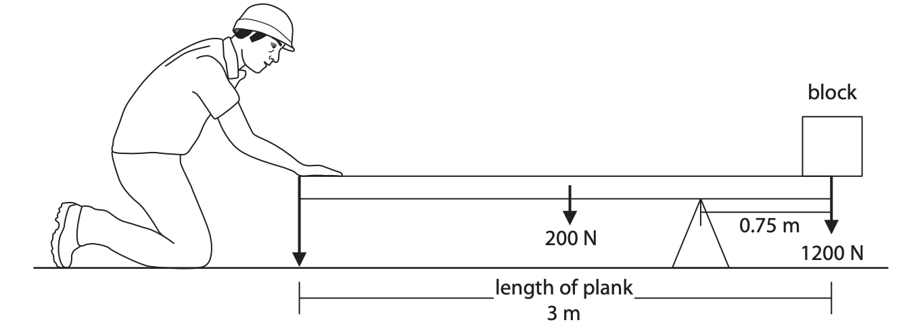

The arrows on the diagram represent three forces on the plank.

Complete the table to identify the missing force.

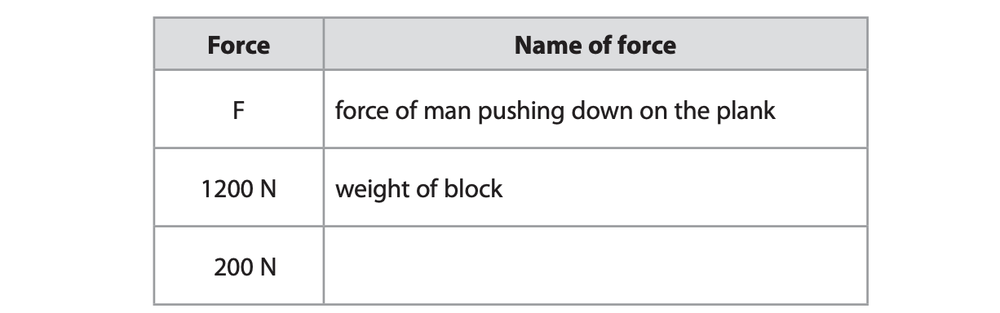

### 8((c)) — 3 marks — command: multiple — structured — from paper 2014 January · 2P
(i) State the equation linking moment, force and perpendicular distance from the pivot.

**(1)**

(ii) Calculate the clockwise moment of the block about the pivot.

**(2)**

moment = ........................................ Nm

### 8((c)) — 4 marks — command: calculate — structured — from paper 2014 January · 2P
Calculate the force of the man pushing down on the plank.

force = ........................................ N

## Q15 — hard — 8 marks · exam-questions

### 1() — 1 mark — multiple_choice — from paper 2013 June · 1P
A student investigates the vertical forces acting on the ends of a horizontal ruler when it supports a load.

The ruler hangs from two newtonmeters with a weight suspended from it as shown.

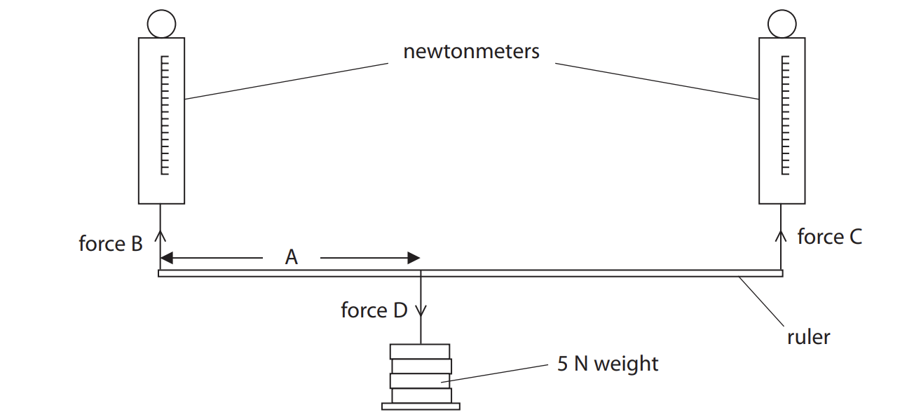

The student moves the weight along the ruler and records forces B and C by taking readings from the newtonmeters.

In this investigation, the independent variable is
- **A.** Distance A
- **B.** Force B
- **C.** Force C
- **D.** Force D

### 2() — 1 mark — multiple_choice — from paper 2013 June · 1P
In this investigation, the controlled variable is
- **A.** Distance A
- **B.** Force B
- **C.** Force C
- **D.** Force D

### 13((b)) — 5 marks — command: multiple — structured — from paper 2013 June · 1P
The student records the following readings

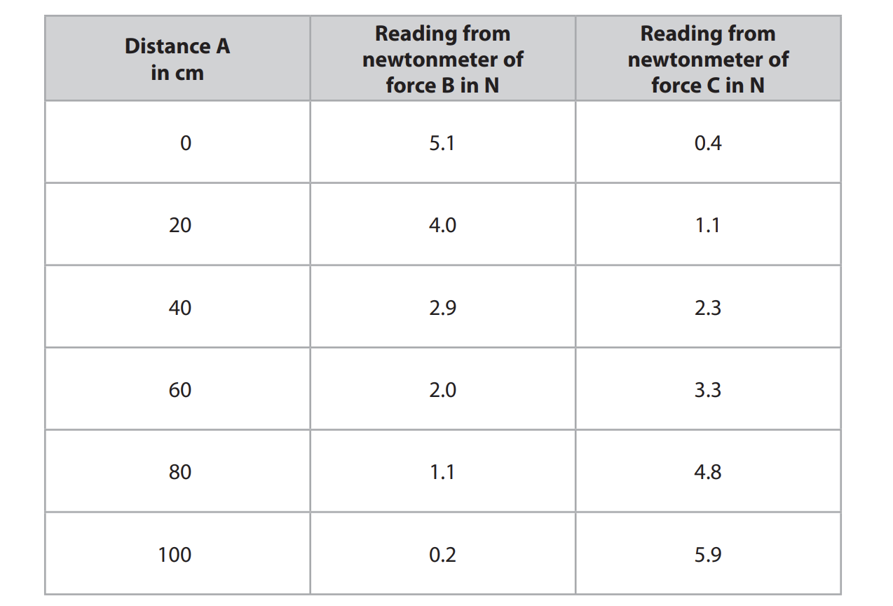

She plots this graph to show how force C changes with distance A.

(i) Complete the student's graph by labelling the vertical axis.

**   (1)**

(ii) Using the same grid and axes, plot a second line to show how force B varies with distance A.

**(3)**

(iii) Use the lines on the graph to find distance A for which force B and force C are equal.

**(1)**

distance = ................. cm

### 13((c)) — 1 mark — command: suggest — structured — from paper 2013 June · 1P
Suggest why neither force B nor force C are ever zero during the investigation.
