# Mark Schemes — Movement & Position
**1. Forces & Motion** · Edexcel IGCSE Physics (Modular) (4XPH1) — 24/Unit 1

## Q1 — easy — 3 marks · exam-questions

### 1((a)) — 1 marks
**Correct answer: B** — the horizontal part of the line

**The correct answer is ****B** because:

- On a velocity-time graph, a **horizontal line** represents a constant velocity
- This means the horizontal part of this graph shows where the toy car travels with constant velocity

  - Hence, answer **B** is correct

**A **is incorrect as the area under the line represents the distance travelled by the toy car

**C **&** D **are incorrect as the sloping lines on the graph show that the velocity is changing over time because the value of y on the graph (representing velocity) is constantly changing as the value of x (representing time) changes

### 1((b)) — 1 marks
**Correct answer: A** — the area under the line

**The correct answer is ****A**** **because:

- On a velocity-time graph:

  - The gradient of the line gives the acceleration
  - The area under the line gives the distance travelled

- Hence, answer **A** is correct

** B **is incorrect as the horizontal part of the line shows where the toy car travels with constant velocity

** C **&** D **are incorrect as the sloping lines on the graph show that the velocity is changing over time because the value of y on the graph (representing velocity) is constantly changing as the value of x (representing time) changes

### 1((c)) — 1 marks
**Correct answer: B** — the distance moved divided by the time taken

**The correct answer is ****B**** **because:

- Average velocity can be calculated using the equation

  - $\mathrm{velocity}=\frac{\mathrm{distance} \mathrm{travelled}}{\mathrm{time} \mathrm{taken}}$

- Therefore, the average velocity of the toy car is given by the distance moved divided by the time taken

  - This is answer **B**

## Q2 — easy — 11 marks · exam-questions

### 2((a)) — 2 marks
(i) State the velocity of the bus after 25 s:

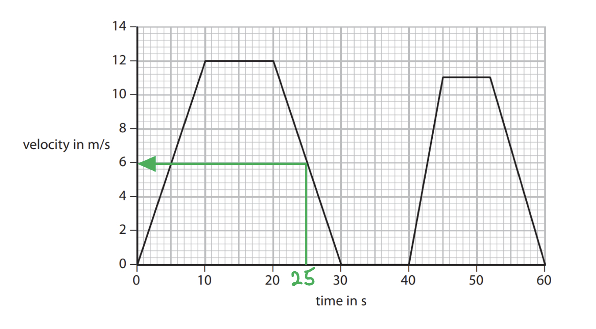

- Read the velocity off the graph at 25 s

Velocity after 25 s = $6 \text{m/s}$ **[1 mark]**

(ii) How long is the bus stationary during its journey?

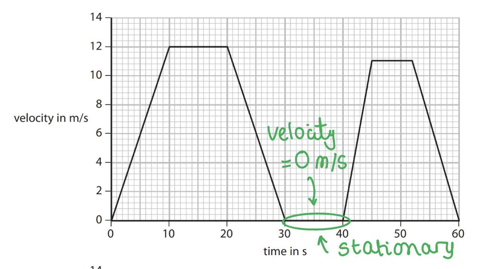

- The bus is stationary when its velocity is 0 m/s

- Read the start and the end of that section off the graph

Time stationary = $40 - 30$

Time stationary = $10 \text{s}$ **[1 mark]**

> **[exam-tip]**
> The bus is stationary for as long as the line sits on zero, so read off the whole interval rather than picking a single point on the graph.
> 
> For part (i), read carefully up from the given time to the line and check the scale on the velocity axis before you write your answer down.

### 2((b)) — 4 marks
(i) State the equation linking acceleration, change in velocity and time taken:

$\text{acceleration} = \frac{\text{change in velocity}}{\text{time taken}}$ **[1 mark]**

(ii) Calculate the acceleration of the bus during the first 10 seconds. Give the unit:

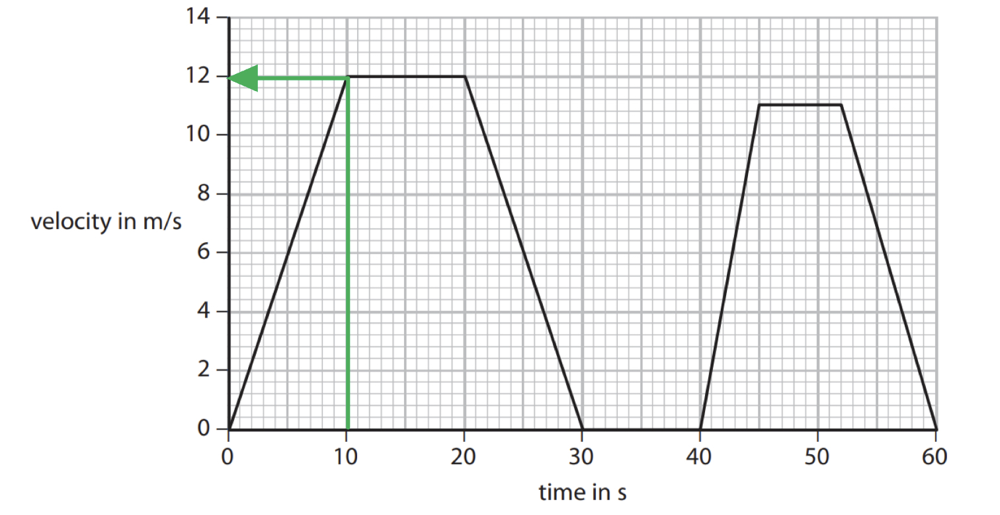

- List the known quantities

  - Time taken = $10 \text{s}$

- Determine the change in velocity during the first 10 s from the graph

Change in velocity = $12 \text{m/s}$

- Substitute the known values into the acceleration equation

Acceleration = $\frac{12}{10}$ **[1 mark]**

Acceleration = $1 . 2 \text{m/s}^{2}$ **[2 marks]**

> **[mark-scheme]**
> 1 mark for substitution into the correct equation
> 
> 1 mark for the value 1.2
> 
> 1 mark for the unit m/s2

### 2((c)) — 3 marks
(i) State the equation linking average speed, distance moved and time taken:

$\text{average speed} = \frac{\text{distance moved}}{\text{time taken}}$ **[1 mark]**

(ii) The bus moves a total distance of 390 m during the journey. Calculate the average speed of the bus:

- List the known quantities

  - Total distance moved = $390 \text{m}$

- Determine the total time for the journey from the graph

Total time taken = $60 \text{s}$

- Substitute the known values into the average speed equation

Average speed = $\frac{390}{60}$ **[1 mark]**

Average speed = $6 . 5 \text{m/s}$ **[1 mark]**

### 2((d)) — 2 marks
> **[mark-scheme]**
> Explain how the graph shows that the bus travels further in the first 30 seconds than in the last 30 seconds:
> 
> - The distance travelled by the bus is given by the area under the graph **[1 mark]**
> - The area under the graph in the first 30 s is larger than the area under the graph in the last 30 s, so the bus has travelled further **[1 mark]**

> **[exam-tip]**
> It is not enough to compare the two areas without first saying what the area represents — that statement is worth the first mark on its own.
> 
> The two features of a velocity-time graph to remember are that **distance** travelled is the **area** under the line, and **acceleration** is the **gradient** of the line.
> 
> You can compare the areas by eye, or split them into triangles and rectangles and work them out. The area of a triangle is $\frac{1}{2} \times \text{base} \times \text{height}$ and the area of a rectangle is base × height. Doing it by calculation gives 240 m for the first 30 s against 148.5 m for the last 30 s.
> 
> 

## Q3 — easy — 8 marks · exam-questions

### 2((a)) — 2 marks
> **[mark-scheme]**
> State two measuring instruments the students should use:
> 
> **Measuring length** — any **one** from:
> 
> - Metre ruler
> - Tape measure
> - Trundle wheel
> - Pedometer
> - Step counter
> 
> **[1 mark]**
> 
> **Measuring time** — any **one** from:
> 
> - Stopwatch
> - Stop clock
> - Timer
> 
> **[1 mark]**

> **[exam-tip]**
> Give exactly two instruments, one for each quantity. Listing extra instruments can cost you marks if any of them are wrong.

### 2((b)) — 3 marks
Draw a graph of distance against time for this data:

**[3 marks]**

> **[mark-scheme]**
> 1 mark for plotting all of the points correctly
> 
> 1 mark for the line joining (10, 14) to the origin
> 
> 1 mark for a smooth curve to the right of (10, 14)

> **[exam-tip]**
> This data is not a straight line, so do not draw one. Join the origin to the first point, then draw a single smooth curve through the rest by eye.
> 
> Draw the curve in one continuous stroke rather than joining the points dot to dot, and keep it smooth as it flattens out towards the end.

### 2((c)) — 1 marks
How far had Jenny walked after 35 s?

![Graph of distance walked in m on the vertical axis, labelled 0 to 35 in steps of 5, against time in s on the horizontal axis, labelled 0 to 80 in steps of 10. Seven points are plotted, at 0 s and 0 m, 10 s and 14 m, 20 s and 19 m, 30 s and 24 m, 40 s and 29 m, 50 s and 30 m, and 60 s and 31 m, with a smooth curve of best fit through them. A dashed vertical line rises from 35 s on the time axis to meet the curve, and a dashed horizontal line runs from that point across to the distance axis, where the value 27 is marked.](assets/043-graph-of-distance-walked-in-m-on-the-vertical-ax.png)

- Read up from 35 s on the time axis to the curve, then across to the distance axis

Distance walked = $27 \text{m}$ **[1 mark]**

> **[mark-scheme]**
> An answer between 26 m and 28 m is accepted

> **[exam-tip]**
> Read the value off your own curve rather than trying to work it out from the table — you are credited for reading your own graph correctly.

### 2((d)) — 2 marks
> **[mark-scheme]**
> (i) Describe how Jenny's speed changed during the investigation:
> 
> - Jenny slowed down **[1 mark]**

> **[mark-scheme]**
> (ii) What feature of the graph shows this change?
> 
> - The graph becomes less steep **OR** the graph levels off **[1 mark]**

> **[exam-tip]**
> In part (i), commit to one description of the motion. An answer saying she accelerates *and* slows down is not credited.
> 
> In part (ii), naming the feature is not enough on its own — say how it changes. "The gradient" scores nothing, while "the gradient becomes less steep" does.

## Q4 — easy — 17 marks · exam-questions

### 1() — 7 marks
> **[mark-scheme]**
> State and explain which part of the graph shows that the motorcycle has:
> 
> (i) A constant velocity:
> 
> - The horizontal line / the line between 10 s and 20 s **[1 mark]**
> - The velocity stays the same as time increases **OR** the gradient is zero **[1 mark]**
> 
> (ii) A constant acceleration:
> 
> - The sloped line / the line between 0 s and 10 s **[1 mark]**
> 
> This shows constant acceleration because, any **two** from:
> 
> - Acceleration is the gradient of the graph
> - The gradient is constant
> - The velocity increases at a constant rate
> 
> **[2 marks]**
> 
> (iii) A constant deceleration:
> 
> - The sloped line / the line between 20 s and 22.5 s **[1 mark]**
> - The gradient is negative **[1 mark]**

> **[exam-tip]**
> This is a "state and explain" question, so each part needs two things: name the section of the graph, then give the reason. Doing only one of the two costs you half the marks on that part.
> 
> Be precise about the gradient. A straight sloping line means a *constant* gradient, not one that gets steeper, and slowing down means a *negative* gradient, not simply that the line goes down.

### 2() — 7 marks
> **[mark-scheme]**
> (i) State the formula linking acceleration, change in velocity and time taken:
> 
> Any **one** from:
> 
> - $\text{acceleration} = \frac{\text{change in velocity}}{\text{time taken}}$
> - $a = \frac{v-u}{t}$
> - $a = \frac{\Deltav}{\Deltat}$
> 
> **[1 mark]**

(ii) Calculate the acceleration of the motorcycle between 0 and 10 seconds:

- Read the initial and final velocities from the graph

Initial velocity = $0 \text{m/s}$

Final velocity = $21 . 5 \text{m/s}$ **[1 mark]**

- Substitute the known values into the equation for acceleration

$\text{acceleration} = \frac{21.5-0}{10-0}$ **[1 mark]**

Acceleration = $2 . 15 \text{m/s}^{2}$ **[1 mark]**

> **[mark-scheme]**
> 1 mark for reading the final velocity from the graph
> 
> 1 mark for correct substitution into the equation for acceleration
> 
> 1 mark for the correct answer

(iii) Show that the distance travelled by the motorbike between 0 and 10 seconds is about 108 m:

- The distance travelled is the area under the velocity-time graph, which between 0 and 10 seconds is a triangle

Distance = $\frac{1}{2} \times \text{base} \times \text{height}$ **[1 mark]**

Distance = $\frac{1}{2} \times 10 \times 21 . 5$ **[1 mark]**

Distance = $107 . 5 \text{m}$ **[1 mark]**

$107 . 5 \text{m} \approx 108 \text{m}$

> **[mark-scheme]**
> 1 mark for the correct method for the area of a triangle
> 
> 1 mark for correct substitution
> 
> 1 mark for a value that rounds to 108 m

> **[exam-tip]**
> In part (i) the equation is accepted in any arrangement, but writing it with acceleration as the subject makes most sense because that is what part (ii) asks for.
> 
> Keep the two velocities straight: the starting value is the initial velocity *u*, and the value at the end is the final velocity *v*.

### 3() — 3 marks
Calculate the total distance travelled by the motorbike:

![Velocity-time graph for the motorcycle with the total distance working added in green. The whole area under the line is shaded green and divided by dashed lines into three regions: a triangle from 0 to 10 seconds labelled area = one half times 21.5 times 10, a rectangle from 10 to 20 seconds labelled area = 21.5 times 10, and a triangle from 20 to 22.5 seconds labelled area = one half times 21.5 times 2.5. Green braces along the time axis are labelled change in time = 10 s, change in time = 10 s and change in time = 2.5 s, and a green brace up the velocity axis is labelled change in velocity = 21.5 m/s.](assets/028-velocity-time-graph-for-the-motorcycle-with-the-.png)

- The total distance is the whole area under the graph, which splits into a triangle from 0 to 10 s, a rectangle from 10 to 20 s and a triangle from 20 to 22.5 s

- The area of the first triangle is 108 m, from part (b)(iii)

- Calculate the distance travelled between 10 s and 20 s

Area of rectangle = $10 \times 21 . 5$

Area of rectangle = $215 \text{m}$ **[1 mark]**

- Calculate the distance travelled between 20 s and 22.5 s

Area of triangle = $\frac{1}{2} \times 2 . 5 \times 21 . 5$

Area of triangle = $26 . 9 \text{m}$ **[1 mark]**

- Add the three areas together

Total distance = $108 + 215 + 27$

Total distance = $350 \text{m}$ **[1 mark]**

> **[mark-scheme]**
> 1 mark for the area of the rectangle between 10 s and 20 s
> 
> 1 mark for the area of the triangle between 20 s and 22.5 s
> 
> 1 mark for the correct total distance
> 
> Either 26.9 m or 27 m is accepted for the second triangle

> **[exam-tip]**
> You can also do this in one step with the area of a trapezium:
> 
> `\text{area of a trapezium} = \frac{1}{2} \times h \times \left(a + b\right)`
> 
> where *h* is the height of 21.5 m/s, *a* is the shorter parallel side of 10 s and *b* is the longer parallel side of 22.5 s.
> 
> `\text{total distance} = \frac{1}{2} \times 21.5 \times \left(10 + 22.5\right) = 349.375 \text{ m}`
> 
> That rounds to 350 m to two significant figures, which agrees with adding the three areas separately.

## Q5 — easy — 2 marks · exam-questions

### 1() — 1 marks
**Correct answer: B** — 

**The correct answer is ****B** because:

- On a velocity-time graph, a horizontal line represents a constant velocity
- Graph **B** is a velocity-time graph which shows an object moving with a velocity of 2 m/s for the whole of the 5 s shown

  - Therefore, the object in graph **B** moves with a constant velocity of 2 m/s

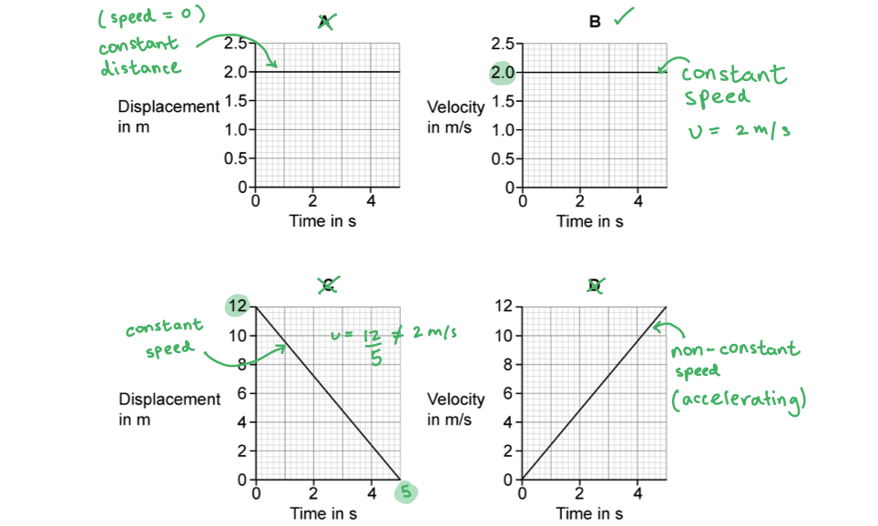

### 2() — 1 marks
**Correct answer: A** — 

**The correct answer is ****A** because:

- This object is at a displacement of 2 m from its starting point
- During the 5 s shown by the graph, the object stays at a constant displacement of 2 m

  - Therefore, the object in graph **A** is not moving

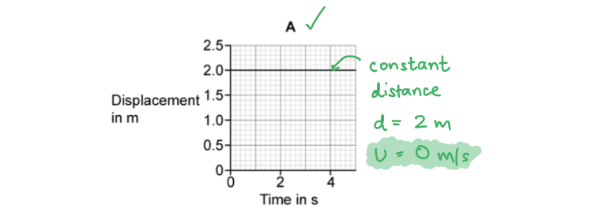

## Q6 — easy — 8 marks · exam-questions

### 1() — 2 marks
A graph of the skateboarder's distance against time once she has passed her friend:

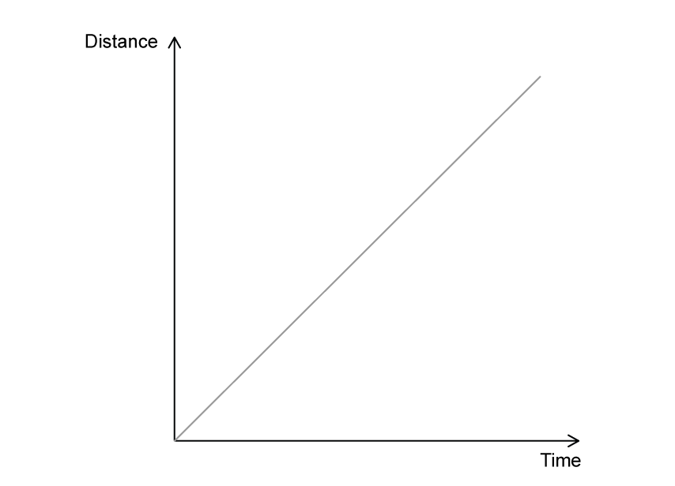

**[2 marks]**

> **[mark-scheme]**
> - A straight line with positive constant gradient **[1 mark]**
> - The line passes through the origin **[1 mark]**

### 2() — 3 marks
> **[mark-scheme]**
> (i) The force causing her acceleration is:
> 
> - Weight **[1 mark]**

(ii) A graph showing the skateboarder's velocity over time:

**[2 marks]**

> **[mark-scheme]**
> 1 mark for a straight line with a positive constant gradient
> 
> 1 mark for the line passes through the origin

### 3() — 3 marks
To calculate acceleration of the skateboarder:

- List the known quantities:

  - Initial speed, $u=3m/s$
  - Final speed, $v=10m/s$
  - Time taken, $t=5s$
- Recall the equation for acceleration:

$a=\frac{v-u}{t}$ **[1 mark]**

- Substitute the known quantities and calculate acceleration:

`table row cell a space end cell equals cell fraction numerator 10 space minus space 3 over denominator 5 end fraction end cell end table` **[1 mark]**

`table row cell a space end cell equals cell space 1.4 space straight m divided by straight s squared end cell end table` **[1 mark]**

## Q7 — medium — 10 marks · exam-questions

### 10((a)) — 7 marks
> **[mark-scheme]**
> (i) State the value of the constant speed:
> 
> - 42 m/s **[1 mark]**
> 
> Any value in the range 42 to 43 m/s is accepted

> **[exam-tip]**
> On a speed-time graph, constant speed is shown by the horizontal section of the graph

(ii) To calculate the acceleration of the aeroplane at the start of the journey:

- List the known quantities

  - Change in velocity = $42 - 0 = 42 \text{m/s}$
  - Time taken = $15 \text{s}$

- Write down the equation for acceleration

$\text{acceleration} = \frac{\text{change in velocity}}{\text{time taken}}$

- Substitute the known values into the equation

$\text{acceleration} = \frac{42}{15}$ **[1 mark]**

acceleration = $2 . 8$ **[1 mark]**

- Give the unit with the final answer

acceleration = $2 . 8 \text{m/s}^{2}$ **[1 mark]**

> **[mark-scheme]**
> 1 mark for an attempt to calculate the slope
> 
> 1 mark for the correct value
> 
> 1 mark for the correct unit

(iii) To calculate the total distance that the aeroplane travels:

**Method 1: adding the areas under the graph**

- Calculate the area under each section of the graph

Area of the first triangle = $\frac{1}{2} \times 15 \times 42 = 315 \text{m}$

Area of the rectangle = $80 \times 42 = 3360 \text{m}$

Area of the second triangle = $\frac{1}{2} \times 25 \times 42 = 525 \text{m}$ **[1 mark]**

- Add the areas together to find the total distance

Total distance = $315 + 3360 + 525$ **[1 mark]**

Total distance = $4200 \text{m}$ **[1 mark]**

**Method 2: using the area of a trapezium**

- Write down the equation for the area of a trapezium

`\text{area} = \frac{1}{2} \times \left(a + b\right) \times h`

- List the known quantities

Shorter parallel side, *a* = $95 - 15 = 80 \text{s}$

Longer parallel side, *b* = $120 \text{s}$

Height, *h* = $42 \text{m/s}$

- Substitute the known values into the equation

`\text{total distance} = \frac{1}{2} \times \left(80 + 120\right) \times 42` **[1 mark]**

Total distance = $100 \times 42$ **[1 mark]**

Total distance = $4200 \text{m}$ **[1 mark]**

> **[mark-scheme]**
> 1 mark for an attempt to calculate an area under the graph line
> 
> 1 mark for appropriate further working such as adding the areas
> 
> - The trapezium method earns both marks
> 
> 1 mark for the correct answer
> 
> - The value carried forward from part (i) is accepted, so 43 m/s gives 4300 m

> **[exam-tip]**
> The area under a speed-time graph gives the distance travelled. Splitting the graph into two triangles and a rectangle always works, but for a shape like this the trapezium method is quicker — just make sure you use the two horizontal sides of the graph as the parallel sides *a* and *b*.

### 10((b)) — 3 marks
> **[mark-scheme]**
> The airline should not use an aeroplane with more mass and a higher landing speed because:
> 
> Any **three** from (1 mark each):
> 
> - Stopping distance is affected by speed or mass
> - For a faster plane the stopping distance is greater / the runway is too short
> - For a heavier plane the stopping distance is greater / the runway is too short
> - An attempt is made to calculate the stopping distance from the graph
> - The data shows that most / all of the runway is already used
> 
> **[3 marks]**

> **[exam-tip]**
> Work in stopping distance in metres, not landing time in seconds — the length of the runway is what limits the aeroplane here.
> 
> Deal with both of the changes the question gives you. Greater mass and higher speed each lengthen the stopping distance, and an answer that covers only one of them caps your marks.
> 
> Say that the greater mass increases the stopping distance, rather than reaching for gravity or air resistance. Neither of those is what the question has changed.

## Q8 — medium — 6 marks · exam-questions

### 16((c)) — 3 marks
To calculate the distance the car travels in the first four seconds:

**Method 1: the area under the graph**

- Distance travelled = velocity × time, so on a velocity-time graph the distance travelled is the *area* under the line

- Write down the equation for the area of the triangle beneath the line

Area of a triangle = $\frac{1}{2} \times \text{base} \times \text{height}$ **[1 mark]**

- Use the graph to substitute the known quantities

Distance travelled = $\frac{1}{2} \times 4 \times 22$ **[1 mark]**

Distance travelled = $44 \text{m}$ **[1 mark]**

**Method 2: using the average velocity**

- Rearrange the equation for average speed to make the distance travelled the subject

Average speed = $\frac{\text{distance travelled}}{\text{time taken}}$

Distance travelled = average speed × time taken **[1 mark]**

- Read the average velocity from the graph and substitute the known quantities

Distance travelled = $11 \times 4$ **[1 mark]**

Distance travelled = $44 \text{m}$ **[1 mark]**

> **[mark-scheme]**
> 1 mark for an attempt at the area under the graph, or for the average speed equation
> 
> 1 mark for correct substitution of values read from the graph
> 
> 1 mark for the correct final answer of 44 m

### 16((d)) — 3 marks
> **[mark-scheme]**
> (i) State the feature that shows how the acceleration changes:
> 
> Any **one** from:
> 
> - The line is curved / not straight
> - The gradient / slope changes
> - The graph levels off
> 
> **[1 mark]**

> **[exam-tip]**
> Remember, on a velocity-time graph the acceleration is represented by the gradient of the line.

> **[mark-scheme]**
> (ii) Suggest **two** possible reasons for this change in acceleration:
> 
> Any **two** from (1 mark each):
> 
> - Air resistance / drag / wind resistance increases
> - Road resistance / (tyre) friction increases
> - The resultant force decreases
> - The road becomes steeper / goes uphill
> 
> **[2 marks]**

> **[exam-tip]**
> Give reasons about the forces acting on the car, not about what the driver does. Turning a corner, changing gear or reaching terminal velocity earn nothing here.
> 
> Name each force *and* say that it increases. Writing "air resistance" or "friction" on its own does not explain why the acceleration falls.
> 
> Check what the gradient is doing before you answer. It is getting less steep, so the acceleration is decreasing — avoid any reason that would make the car speed up.

## Q9 — medium — 12 marks · exam-questions

### 5((a)) — 2 marks
(a)

(i) The independent variable in this investigation is:

- The <u>starting height</u> of the car; **[1 mark]**

(ii) The link between the starting height of the car and its speed at the bottom of the slope is:

- The <u>higher</u> the starting height of the car, the <u>greater</u> its speed at the bottom of the slope;** [1 mark]**

**[Total: 2 marks]**

### 5((b)) — 2 marks
(b) The student should measure the starting height of the car by:

- Hold a ruler vertically and place two set squares against the base at right angles to the each other to ensure it is vertical; **[1 mark]**

- Check for zero errors if the ruler does not start at the bench; **[1 mark]**

**OR**

- Avoid parallel errors why reading the value from the ruler at eye level; **[1 mark]**

**[Total: 2 marks]**

> *The command word 'describe' involves lots of detail. Make sure to describe how you will measure a value **accurately** where possible i.e. how you will account for errors (parallax, zero-errors, human error). The way the set squares and ruler could be used are shown in the sketch below:*

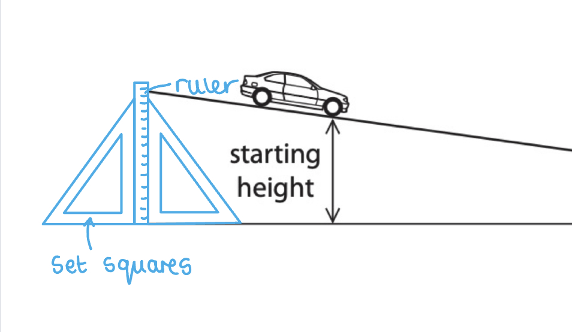

> *You may also draw a suitably labelled diagram to demonstrate how you will take the measurements as well.*

### 5((c)) — 5 marks
(c)

(i) The student will not be able to calculate the correct speed using this method because:

- The speed (of the car) might have increased / changed on the slope / accelerated;** [1 mark]**
- She has only calculated the <u>average</u> speed and not the final speed;**[1 mark]**

(ii) Describe how the student should take the measurements needed to find the speed of the car at the bottom of the slope:

- The distance travelled to be accurately measured using a ruler; **[1 mark]**
- The time will be measured from a light gate (with a card on the car) and recorded by a data logger at the end of the ramp to accurately measure when the car passes through; **[1 mark]**
- The speed at the bottom will be calculated by $\frac{2\timesdistance}{totaltime}$; **[1 mark]**

**[Total: 5 marks]**

> *It is assumed that the toy car has constant accelerated from rest. This may not be the case in reality, because of the affect of friction which has been ignored here. Remember that for a light gate to work, some sort of 'interrupter' must be on the car that momentarily stops the light passing through. This is normally a card placed on top of the object that is coming down the slope. This is how the light gate knows that something has passed through and where to start a timer in the data logger which it is connected to, for example.*

### 5((d)) — 3 marks
(d) Suggest three reasons why the student gets different results when she repeats the experiment:

Any **three** from:

- A systematic error may be present from the <u>reaction time</u> affecting the starting of a stopwatch;** [1 mark]**
- The car may start in a slightly different position each time;** [1 mark]**
- The car may travel down different paths which have different levels of friction; ** [1 mark]**
- The friction is not constant down the slope;** [1 mark]**
- The car could hit the sides of the ramp;** [1 mark]**
- The ramp may not be completely even; ** [1 mark]**
- The car may be pushed unintentionally at the start; ** [1 mark]**

**[Total: 3 marks]**

> *Avoid using the term 'human error'. This is too vague to be accepted as an answer in a practical question. Be specific, for example, by saying **reaction time**.*

## Q10 — medium — 6 marks · exam-questions

### 11((a)) — 3 marks
(a)

Use the graph to determine the final velocity:

- Time taken = 60 s
- Initial velocity = 0
- Final velocity = 78 m/s **[1 mark]**

Calculate the average acceleration:

- The average acceleration is the average rate at which the initial velocity changes to the final velocity
- Acceleration = $\frac{finalvelocity-initialvelocity}{timetaken}=\frac{78}{60}$** [1 mark]**
- Acceleration = 1.3 m/s2 **[1 mark]**

**[Total: 3 marks]**

### 11((b)) — 3 marks
(b)

Consider the forces acting on a moving aircraft

- There is a constant force produced by the engines
- When moving, there is <u>air resistance</u> / <u>drag</u> (which acts in the opposite direction to the direction of travel);** [1 mark]**

Consider the forces acting as the aircraft accelerates

- As the aircraft accelerates, its velocity increases
- Air resistance / drag increases as velocity / speed increases; **[1 mark]**
- Hence, the <u>resultant force decreases</u> as air resistance increases; **[1 mark]**
- A reduced resultant force means that the forward acceleration of the aircraft is reduced

**[Total: 3 marks]**

## Q11 — medium — 10 marks · exam-questions

### 8((a)) — 5 marks
(a)

(i) Calculate the acceleration due to gravity on the Moon

Use the graph to determine the final velocity and time taken:

- Initial velocity = 0
- Final velocity = 2.0 m/s
- Time taken = 1.26 s

Calculate the average acceleration:

- The average acceleration is the average rate at which the initial velocity changes to the final velocity
- $acceleration=\frac{finalvelocity-initialvelocity}{timetaken}=\frac{2.0}{1.26}$ **[1 mark]**
- Acceleration = 1.587

State the rounded up answer with the correct unit:

- Acceleration = 1.6** [1 mark]** m/s2** [1 mark]**

(ii) Calculate the height the hammer was dropped from

- The distance that the hammer falls can be found using:

  - Distance = speed × time
- This distance can be determined by calculating the area under the velocity-time graph

- The area under the line is a right-angled triangle, where:

  - The triangle height, or velocity = 2 m/s
  - The triangle width, or time = 1.26 s

- Height = 1⁄2 × 2 × 1.26** [1 mark]**
- Height = 1.26 m** [1 mark]**

**[Total: 5 marks]**

### 8((b)) — 1 marks
(b)

The gravitational field strength is <u>smaller on the Moon</u> than on the Earth because:

- The Moon has less mass / a lower density (than Earth); **[1 mark]**

**OR**

The gravitational field strength is <u>greater on Earth</u> than on the Moon because:

- The Earth has a greater mass / density (than the Moon);** [1 mark]**

**[Total: 1 mark]**

### 8((c)) — 4 marks
(c)

Explain why the feather reaches the ground after the hammer:

Any **four** from:

- The feather is lighter / has less mass / weighs less (than the hammer); **[1 mark]**
- Terminal velocity is reached when drag = weight; **[1 mark]**
- The feather reaches terminal velocity earlier / sooner / before the hammer;**[1 mark]**
- (This is because) a smaller (drag / air resistance) force is needed;**[1 mark]**
- (Therefore) the average / terminal velocity of the feather is lower;**[1 mark]**
- The feather falls at a slower rate than the hammer;**[1 mark]**

**An example of an answer that would score 4 marks:**

The hammer and feather are released from rest at the same time, therefore, they accelerate (due to gravity) at the same rate. However, air resistance increases as velocity increases.

The feather has less mass than the hammer, hence it has a lower weight **[1 mark]** therefore, less air resistance is required to equal its weight.

The point when air resistance is equal to the weight is known as terminal velocity **[1 mark]**

The feather reaches a lower terminal velocity **[1 mark]**than the hammer because it spends less time accelerating (as not as much air resistance needs to be built up).

The lower terminal velocity, as well as the shorter acceleration time, means the feather falls at a slower rate and reaches the ground after the hammer **[1 mark]**

**[Total: 4 marks]**

## Q12 — hard — 10 marks · exam-questions

### 5((a)) — 2 marks
> **[mark-scheme]**
> Describe the motion of the student during stages B and D:
> 
> **Stage B**
> 
> - The student cycles at a constant velocity of 5 m/s **[1 mark]**
> 
> **Stage D**
> 
> - The velocity / speed is 0 **[1 mark]**
> 
> For stage B, a constant speed of 5 m/s is accepted in place of a velocity
> 
> For stage D, also accept "stops", "stationary" or "at rest"

> **[exam-tip]**
> The line is horizontal in both stages, so the velocity is constant in each — but constant velocity and stationary are not the same thing. Read the value off the velocity axis before you describe the motion.

### 5((b)) — 1 marks
> **[mark-scheme]**
> State how the graph shows that the acceleration for stage E is greater than the acceleration for stage A:
> 
> - The gradient / slope is steeper at stage E **[1 mark]**
> 
> The reverse argument is accepted provided stage A is identified, for example "stage A has a shallower slope"
> 
> The mark is also awarded for calculating and comparing both gradients, or for a qualitative comparison of values read from the graph

> **[exam-tip]**
> For one mark the simplest correct answer is the best use of your time in the exam. Naming the steeper gradient is enough here, so there is no need to calculate anything.

### 5((c)) — 4 marks
To calculate the distance that the student travels in the last 10 s of the journey:

**Method 1: the area under the graph**

- Recognise that the distance travelled is the area under the velocity-time graph between 17 s and 27 s **[1 mark]**

- Calculate the area under stage F, which is a rectangle

Distance = $\text{velocity} \times \text{time}$

Distance = $7 \times 7$

Distance = $49 \text{m}$ **[1 mark]**

- Calculate the area under stage G, which is a right-angled triangle

Distance = $\frac{1}{2} \times \text{base} \times \text{height}$

Distance = $\frac{1}{2} \times 3 \times 7$

Distance = $10 . 5 \text{m}$ **[1 mark]**

- Add the two areas together to find the total distance

Total distance = $49 + 10 . 5$

Total distance = $59 . 5 \text{m}$ **[1 mark]**

**Method 2: the trapezium method**

- Recognise that the distance travelled is the area under the velocity-time graph between 17 s and 27 s **[1 mark]**

- Recall the equation for the area of a trapezium

Area = `\frac{1}{2} \times \left(a + b\right) \times h` **[1 mark]**

- Read the two parallel sides and the height from the graph

Width (time), *a* = $24 - 17 = 7 \text{s}$

Width (time), *b* = $27 - 17 = 10 \text{s}$

Height (velocity), *h* = $7 \text{m/s}$

- Calculate the total distance travelled

Total distance = `\frac{1}{2} \times \left(7 + 10\right) \times 7` **[1 mark]**

Total distance = $59 . 5 \text{m}$ **[1 mark]**

> **[mark-scheme]**
> Only one of the two methods is credited
> 
> The relationship between distance and the area under the graph can be implicit in the working — it does not have to be written down
> 
> A final answer of 59.5 m earns all four marks even if no working is shown

> **[exam-tip]**
> Read the boundary times off the time axis carefully and work with the intervals between them, not the times themselves. The last 10 s runs from 17 s to 27 s, so stage F is 7 s wide and stage G is 3 s wide.
> 
> Always show the areas you have worked out rather than just writing down the final number. If you misread a value off the graph you can still earn the method marks.

### 5((d)) — 3 marks
To show that the average speed of the journey is about 4 m/s:

- Write down the equation for average speed

Average speed = $\frac{\text{distance moved}}{\text{time taken}}$ **[1 mark]**

- Read the total time from the end of the graph

Total time = $27 \text{s}$

- Substitute the distance and the time into the equation

Average speed = $\frac{106.5}{27}$ **[1 mark]**

Average speed = $3 . 94 \text{m/s}$ **[1 mark]**

$3 . 94 \text{m/s} \approx 4 \text{m/s}$

> **[mark-scheme]**
> 1 mark for the correct equation, which may be written as $d / t$
> 
> 1 mark for substituting the correct distance and a suitable time
> 
> 1 mark for the correct evaluation of 3.94 m/s
> 
> A maximum of 2 marks is available where a different time is read from the graph, so 4.26 m/s (using 25 s) and 3.55 m/s (using 30 s) each earn 2 marks
> 
> A maximum of 2 marks is available for the reverse argument, for example 106.5 ÷ 4 = 26.6 s

> **[exam-tip]**
> A "show that" question gives you the answer, so all the marks sit in the working. Write the equation down, show the substitution, and quote your value to more figures than the number in the question — 3.94 m/s makes it clear the journey really does average about 4 m/s.

## Q13 — hard — 7 marks · exam-questions

### 4((a)) — 3 marks
(a)

(i) Determine the initial length of the queue:

- The initial length of the queue is given by the total distance travelled to the checkout by the person
- Initial length = Total distance travelled = 6.1 m **[1 mark]**

(ii) Explain how to work out the number of times person X is stationary:

Any **two** from:

- The flat / horizontal sections of the graph indicate the times person X has a speed of zero; **[1 mark]**
- The number of flat / horizontal sections will give the number of times that person X is stationary; **[1 mark]**
- The graph shows that the person is stationary 7 times; **[1 mark]**

**[Total: 3 marks]**

> *A tolerance of ∓½ a small square is allowed when reading data from graphs. Therefore, for part (i) an answer in the range of 6.0 m - 6.2 m would gain the mark.*

### 4((b)) — 4 marks
(b)

(i) State the equation linking average speed, distance moved and time taken:

- Average speed = $\frac{distancemoved}{timetaken}$  **[1 mark]**

(ii) Calculate the average speed of person X:

List the known quantities:

- Time taken = 7 minutes = 7 × 60 s
- Distance moved = 6.1 m (from part (a))

  - *Allow value from part (a)*

Substitute values into the force equation:

- Average speed =  $\frac{6.1}{7\times60}$  **[1 mark]**
- Average speed = 0.0145 = 0.015  **[1 mark]**

State the answer with the correct unit:

- Average speed = 0.015 m/s  **[1 mark]**

**[Total: 4 marks]**

> *Remember to use total distance and total time to calculate the average speed, and to convert the total time of 7 minutes that the person spends in the queue before reaching the checkout, to seconds by multiplying by 60.*

> *Alternatively, if you forget how to convert minutes into seconds, you could score all the marks if you state the correct unit e.g. average speed = 6.1 ÷ 7 = 0.87 m/minutes*

## Q14 — hard — 9 marks · exam-questions

### 4((c)) — 5 marks
(a)

(i) Complete the diagram to show the forces acting on the glider:

A diagram that would gain 3 marks would look like:

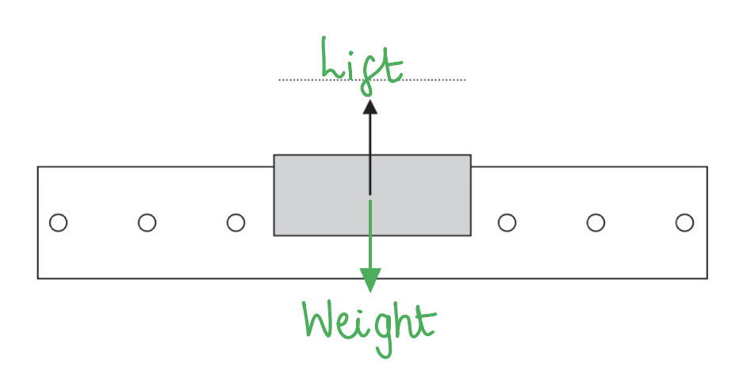

- Upward force labelled 'lift' or '(normal) reaction';** [1 mark]**
- Downward arrow drawn same size as up arrow;** [1 mark]**
- Downward force arrow labelled 'weight'; ** [1 mark]**

(ii) The effect the cushion of air has on the movement on the glider is:

Any **two** from:

- The cushion of air <u>lifts</u> the glider; ** [1 mark]**
- This <u>reduces</u> the <u>friction</u> it experiences when it moves; ** [1 mark]**
- Which means the glider will keep moving at <u>constant speed</u> / the speed does not reduce;** [1 mark]**

**[Total: 5 marks]**

> *For part (ii), make sure not to write that the air 'pushes' the glider in any way, unless you mention that it pushes the glider **upwards**.*

### 4((b)) — 4 marks
(a)

(i) The relationship between average speed, distance moved and time taken is:

- $(average)speed=\frac{distance}{time}$** [1 mark]**

(ii) Calculate the average speed of the card as it passes through the first light gate:

List the known quantities:

- Length of the card, *d* = 8.3 cm
- Time taken to pass through light gate, *t* = 314 ms

Convert 314 ms to s:

- 1 ms = 1 × 10–3 s
- 314 ms = 314 × 10–3 s

Substitute values into average speed equation:

- Average speed = $\frac{d}{t}$ = $\frac{8.3}{314\times10^{-3}}$** [1 mark]**
- Average speed = 26.433 = 26 cm/s** [1 mark]**

(iii) The time taken for the card to pass through the second light gate is:

- 314 ms** [1 mark]**

**[Total: 4 marks]**

> *Always check the marks to know how much working out a question is expecting from you. Part (iii) is only worth 1 mark, so there is very likely no calculation needed. Since the glider is moving at constant speed (as found from part (a)), and the length of the card (distance) stays the same, it must also take the card the same time to pass through the second light gate as well!*

## Q15 — hard — 11 marks · exam-questions

### 4((a)) — 2 marks
(a)

(i) The independent variable in the student's prediction is:

- The weight (of the toy car);** [1 mark]**

(ii) The dependent variable in the student's prediction is:

- The speed (of the toy car); ** [1 mark]**

**[Total: 2 marks]**

### 4((b)) — 2 marks
(b) Two factors that the student should keep constant in his investigation are:

Any **two** from:

- The angle/gradient/incline/steepness/height of the slope; ** [1 mark]**
- The car; ** [1 mark]**
- The surface of the slope; ** [1 mark]**
- The force at launch;** [1 mark]**
- The initial speed;** [1 mark]**
- The starting position/height/point (of the car); ** [1 mark]**
- The distance travelled by the car / the length of the slope; ** [1 mark]**

**[Total: 2 marks]**

### 4((c)) — 2 marks
(c)

A table that would score 2 marks should look like:

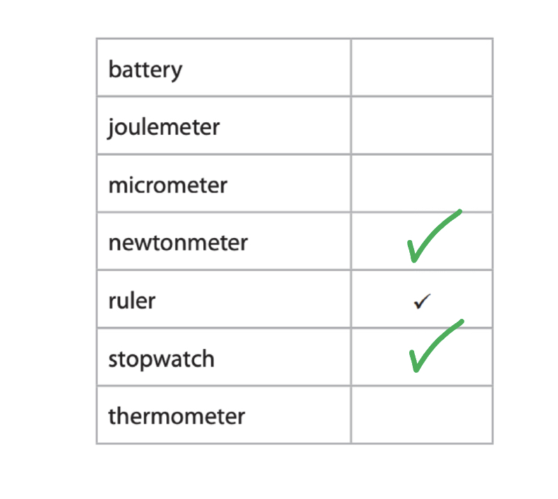

- Newtonmeter ticked; ** [1 mark]**
- Stopwatch ticked; ** [1 mark]**

**[Total: 2 marks]**

> *To know which other pieces of apparatus to use, think about what is needed to measure the independent and dependent variables.*

> *From part (a) (i), it was stated the independent variable was the weight of the car. This requires something that can measure a **force** - which is a newtonmeter*

> *From part (a) (ii), it was state the dependent variable was the speed of the car. This requires measuring **time** over a certain distance (which is already measured by the ruler). Therefore, the apparatus that can measure time is the stopwatch.*

### 5((a)) — 5 marks
(d) To test his prediction, the student should:

Any **five** from:

- Measure the weight/mass of the toy car;** [1 mark]**
- Measure the distance travelled by the car (down the slope) / start from the same point;** [1 mark]**
- Measure the time / speed with a light gate;** [1 mark]**
- Use the equation speed = $\frac{distance}{time}$; ** [1 mark]**
- Use different weights of different cars;** [1 mark]**
- Repeat the experiment **AND** calculate an average / remove any anomalies; ** [1 mark]**
- Improve the accuracy of measurements by using lights gates / consider the reaction time of a stop watch by using a light gate and data logger;** [1 mark]**

**An example of an answer that would gain 5 marks:**

- The student should measure the weight of the car using the newtonmeter
- Place the car at a known distance up the slope
- Release the car so that the initial force and speed are zero, and start the stopwatch at this point
- Measure the time taken for the car to travel down the slope
- Repeat the experiment and take an average of the times
- Use the average time to calculate the speed using the equation: speed = $\frac{distance}{time}$
- Repeat the experiment with cars of different weights, keeping the distance travelled the same each time
- To improve the accuracy in the measurement of the time, and reducing reaction time, light gates can be used

**[Total: 5 marks]**

## Q16 — hard — 5 marks · exam-questions

### 5() — 5 marks
Describe a method for determining the average speed of a cyclist:

Any **five** from:

- Determine / measure distance; ** [1 mark]**
- Determine / measure time; ** [1 mark]**
- Appropriate measuring instrument for distance **OR** time; ** [1 mark]**
- Use a suitable distance / count laps (of known length);** [1 mark]**
- Repeat experiment / calculate average time for multiple laps; ** [1 mark]**
- Speed = distance / time **OR** finding the gradient of a distance-time graph;** [1 mark]**
- Suitable experimental precaution, e.g. reaction time considered, consistent height on track, time from a predetermined consistent point; ** [1 mark]**

**An example of an answer that would gain 5 marks:**

The length of the track ** [1 mark]** can be measured using a trundle / metre ticker ** [1 mark]** and the timing of a lap can be measured using a stopwatch** [1 mark]**

Reaction time from pressing the stopwatch can be reduced by measuring the timing of multiple laps** [1 mark]**

Finally, the average speed can be calculated by dividing the measured value of distance by the measured time or *speed* = $\frac{distance}{time}$** [1 mark]**

**[Total: 5 marks]**

## Q17 — hard — 4 marks · exam-questions

### 1() — 1 marks
**Correct answer: C** — 

**Final answer:** **The correct answer is ****C**** because:**

- Velocity is equal to the change in displacement over time $v=\frac{d}{t}$
- This is the same as the gradient of a displacement-time graph
- On graph **C**, after 5 s, the displacement has decreased from 12 m to 0

  - Therefore, the velocity of this object is $v=\frac{0-12}{5}=-2.4m$

- Graph **C** has a constant, negative gradient, so it moves with a constant, negative velocity at all times between 0 and 5 s

  - Therefore, the object in graph **C** moves with a constant velocity of -2.4 m/s after 2 s

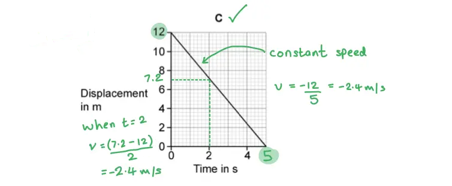

In your IGCSE exam, you will be expected to be able to calculate both positive and negative gradients and explain their significance, but you will usually only come across negative gradients on velocity-time graphs. This is because most students find it easy to explain how an object can have a positive and negative velocity, but struggle to explain how an object can have a positive and negative displacement.

### 2() — 3 marks
Calculate the distance travelled by the object in graph** D** after 5 seconds:

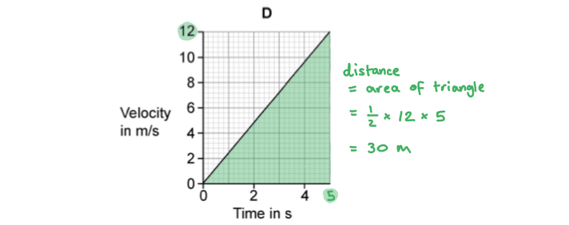

- From the graph:
- When time *t* = 5 s, velocity *v* = 12 m/s

Determine the area under the velocity-time graph:

- Area of triangle = ½ × base × height; **[1 mark]**
- Distance = ½ × 12 × 5 **[1 mark]**
- Distance = 30 m **[1 mark]**

**[Total: 3 marks]**

## Q18 — hard — 15 marks · exam-questions

### 1() — 9 marks
(i) Calculate the acceleration of the car:

- List the known quantities:

  - Initial velocity, $u=0m/s$
  - Final velocity at 500 m, $v=54m/s$
  - Distance travelled, $s=500m$
- Recall the uniform acceleration equation:

`v squared space equals space u squared space plus space open parentheses 2 cross times a cross times s close parentheses`

- Rearrange to find acceleration, $a$:

$a=\frac{v^{2}-u^{2}}{2s}$ **[1 mark]**

- Substitute the known quantities and calculate $a$:

$a=\frac{54^{2}-0^{2}}{2\times500}$ **[1 mark]**

$a=2.9m/s^{2}$ **[1 mark]**

(ii) Calculate the speed of the car as it passes the first speed sensor:

- List the known quantities:

  - Initial velocity, $u=0m/s$
  - Acceleration, $a=2.9m/s^{2}$ (from (a)(i))
  - Distance to first sensor, $s=100m$
- Rearrange the uniform acceleration equation to find $v$:

`v squared space equals space u squared space plus space open parentheses 2 cross times a cross times s close parentheses`

`v space equals space square root of u squared space plus space open parentheses 2 cross times a cross times s close parentheses end root`** [1 mark]**

- Substitute the known quantities and calculate $v$:

`v space equals space square root of 0 squared space plus space open parentheses 2 cross times 2.9 cross times 100 close parentheses end root`** [1 mark]**

$v=24m/s$** [1 mark]**

(iii) Calculate the time taken between the two sensors:

- List the known quantities:

  - Initial speed (at 100 m), $u=24m/s$ (from (a)(ii))
  - Final speed (at 500 m), $v=54m/s$
  - Acceleration, $a=2.9m/s^{2}$ (from (a)(i))
- Recall the acceleration equation:

`a space equals space fraction numerator open parentheses v space minus space u close parentheses over denominator t end fraction`

- Rearrange for $t$:

`t space equals space fraction numerator open parentheses v space minus space u close parentheses over denominator a end fraction` **[1 mark]**

- Substitute the known quantities and calculate $t$:

`t space equals space fraction numerator open parentheses 54 space minus space 24 close parentheses over denominator 2.9 end fraction` **[1 mark]**

$t=10s$ **[1 mark]**

> **[mark-scheme]**
> For each calculation, marks are awarded for:
> 
> - correct rearrangement
> - correct substitution
> - correct evaluation
> 
> Giving your answers to any number of significant figures is accepted.

### 2() — 6 marks
> **[mark-scheme]**
> (i) The car began its emergency stop at:
> 
> - 33 s **[1 mark]**
> 
> (ii) Factors which affect the braking distance of a car:
> 
> Any **two** from (1 mark each):
> 
> - Speed of the car
> - Mass of the car
> - Road conditions (e.g. wet, icy surface)
> - Condition of the tyres / brakes
> 
> **[2 marks]**

(iii) Determine the stopping distance of the car during its emergency stop:

- Identify the braking region on the graph:

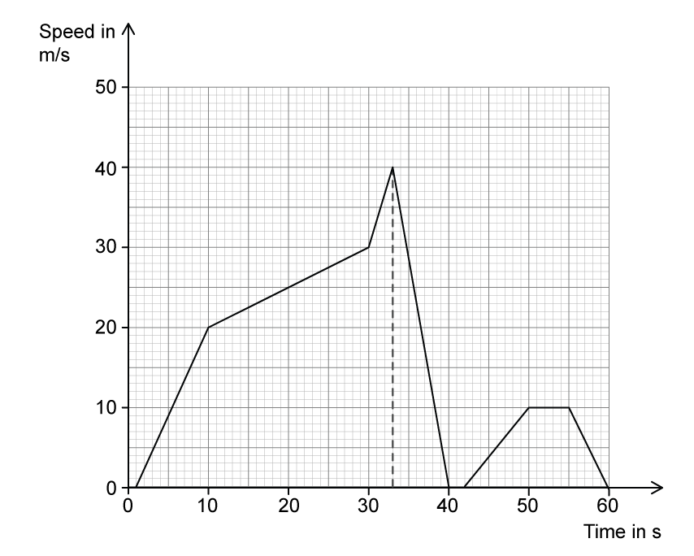

**[1 mark]**

- Recall the formula for the area of a triangle:

$A_{triangle}=\frac{1}{2}\times\mathrm{base}\times\mathrm{height}$

- Calculate the area and determine stopping distance:

`A subscript s t o p p i n g end subscript space equals space 1 half space cross times space open parentheses 40 space minus space 33 close parentheses space cross times space open parentheses 40 space minus space 0 close parentheses` **[1 mark]**

$d_{total}=140m$ **[1 mark]**

> **[mark-scheme]**
> 1 mark for identifying the braking region on the graph from 33 s to 40 s
> 
> 1 mark for calculating the area of the triangle **OR** counting the number of squares in the triangle to estimate stopping distance
> 
> 1 mark for evaluating the stopping distance in the range 135 to 145 m
