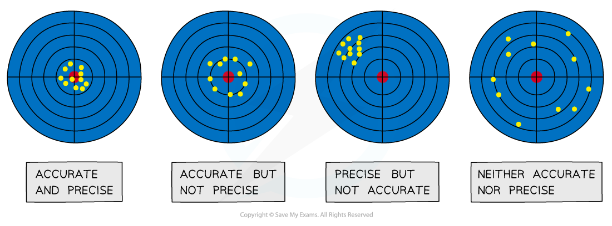
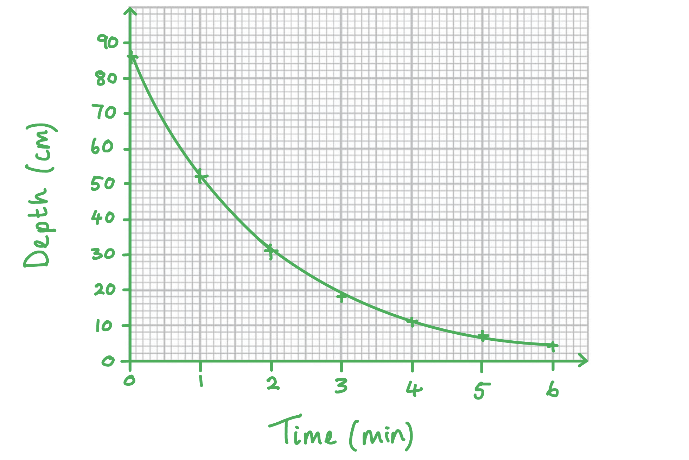
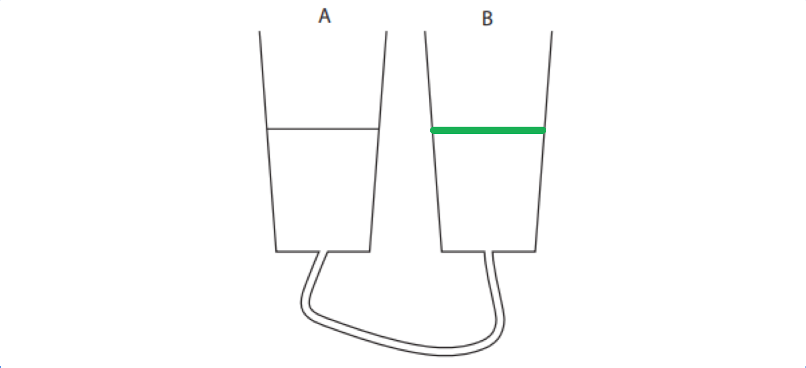
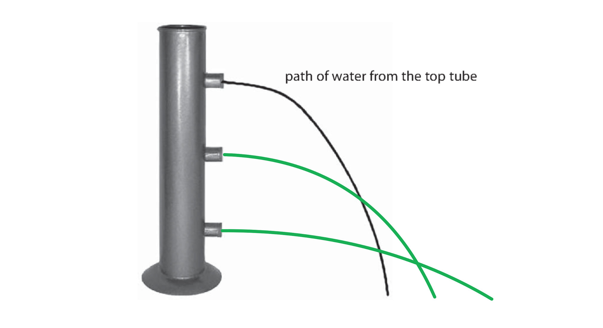
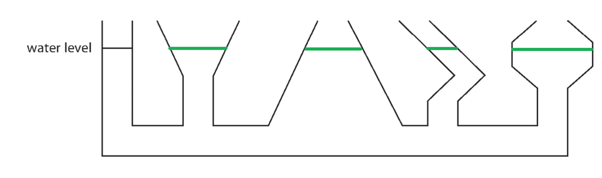
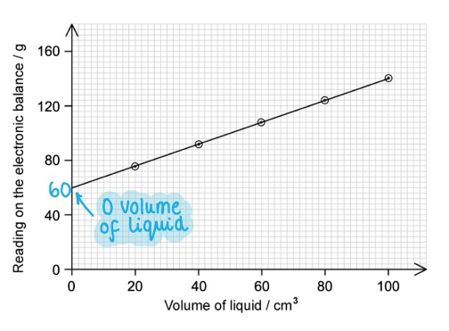
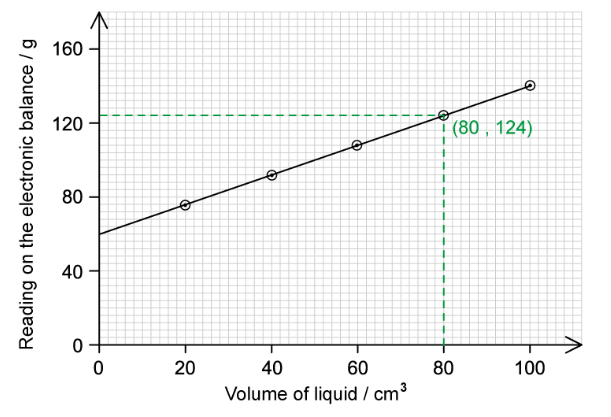
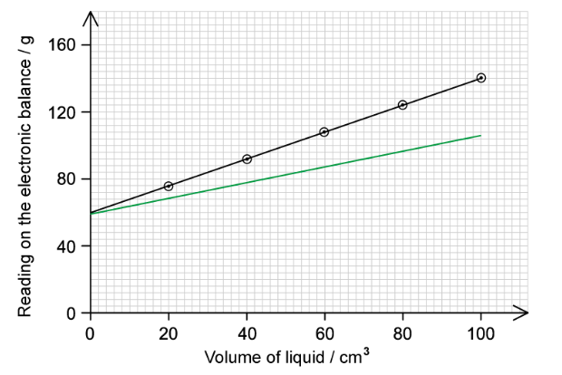

# Mark Schemes — Density & Pressure
**4. Solids, Liquids & Gases: Part 1** · Edexcel IGCSE Physics (Modular) (4XPH1) — 24/Unit 1

## Q1 — easy — 1 marks · exam-questions

### 9((b)) — 1 marks
**Correct answer: B** — Incorrect and slightly too small

**The correct answer is ****B** because:

- The mass readings are all too small
- Density depends on mass

  - If mass is incorrect, density will also be incorrect
  - This eliminates options **C** and **D**
- Density is directly proportional to mass

  - If mass is too small, density will also be too small
  - This is option **B**

## Q2 — easy — 1 marks · exam-questions

### 2((b)) — 1 marks
**Correct answer: D** — g / cm3

**The correct answer is ****D** because:

- Density is defined as mass per unit volume

  - $\mathrm{density}=\frac{\mathrm{mass}}{\mathrm{volume}}$
- Grams, g, are a unit of mass
- Volume is measured in units of length cubed, such as cm3 or m3
- The units of density are units of mass divided by units of volume

  - Option **D** is the only option with units of mass divided by units of volume, g / cm3

## Q3 — easy — 1 marks · exam-questions

### 1() — 1 marks
**Correct answer: C** — 1 newton per square metre (1 N/m2)

**The correct answer is ****C** because:

- Pressure is defined as force per unit area

  - $\mathrm{pressure}=\frac{\mathrm{force}}{\mathrm{area}}$
- Force has units of newtons, N
- Area has units of square metres, m2
- From this equation, pressure has the units of newtons per square metre

  - This is option **C**

## Q4 — easy — 8 marks · exam-questions

### 3((a)) — 2 marks
(a)

(i) Give the unit for weight:

- Newtons **OR** N; **[1 mark]**

(ii) Suggest equipment to measure weight:

Any **one** from:

- Scales; **[1 mark]**
- Weighing scale; **[1 mark]**
- Electronic / electric balance; **[1 mark]**
- Newtonmeter; **[1 mark]**

**[Total: 2 marks]**

> *In part (i), it is worth noting that newtons are **not** given a capital letter when in the middle of a sentence, but an answer of "Newtons" would still score a mark. *

> *An answer of "newtonmetre" would also be accepted for part (ii), but the correct spelling for an instrument that measures a quantity is "met**er**" e.g. ammet**er**, voltmet**er**.*

### 3((b)) — 3 marks
(b) Describe a method by which the student can record the shape of his. foot as accurately as possible:

- Draw the outline of his foot on the floor **OR** dip foot in ink to make a footprint; **[1 mark]**

State what the student should do with this outline:

- The student must determine the area of this outline / footprint; **[1 mark]**

Suggest how this area could be measured:

- This could be done by drawing the outline onto graph paper and counting squares; **[1 mark]**

**[Total: 3 marks]**

> *The third mark point may also be awarded by using the following method:*

- *Draw a rectangle around the outline of the foot on graph paper*
- *Calculate the area of the rectangle*
- *From this area, subtract the number of squares in the rectangle but not in the foot outline*
- *This gives the area of the foot*

### 3((c)) — 3 marks
(c)

(i) State the equation linking pressure, force and area:

The equation is:

- $\mathrm{Pressure}=\frac{\mathrm{Force}}{\mathrm{Area}}$ **[1 mark]**

(ii) Calculate the pressure from the student's foot on the floor:

List the known quantities:

- Weight = 650 N
- Area = 270 cm2

Substitute the known quantities into the equation from (i):

- Recognise that weight is a force and can be substituted as force in the equation
- No units need to be converted, the question asks for an answer in N / cm2
- $P=\frac{F}{A}$
- $P=\frac{650}{270}$ **[1 mark]**
- *P* = 2.4 N / cm2 **[1 mark]**

**[Total: 3 marks]**

## Q5 — easy — 8 marks · exam-questions

### 2((a)) — 1 marks
(a)

State the equation linking density, mass and volume:

- $\mathrm{density}=\frac{\mathrm{mass}}{\mathrm{volume}}$

**OR**

- $ρ=\frac{m}{V}$ **[1 mark]**

**[Total: 1 mark]**

### 2((c)) — 1 marks
(b)

State what is measured by an electronic balance:

- Mass; **[1 mark]**

**[Total: 1 mark]**

### 2((d)) — 4 marks
(c)

Describe how the student should use a measuring cylinder to make measurements accurate:

Any **two** from:

- (Read measurements with) eyes <u>at water level</u> / with a <u>perpendicular view</u>; **[1 mark]**
- To avoid <u>parallax</u> errors; **[1 mark]**
- Take measurements from the bottom of the meniscus; **[1 mark]**
- Place measuring cylinder on a <u>flat surface</u>

**OR**

- Use a <u>clean cylinder;</u> **[1 mark]**

Describe how the student should use an electronic balance to make measurements accurate:

Any **two** from:

- Place the balance on a <u>stable surface</u>

**OR**

- <u>Avoid disturbing</u> the balance; **[1 mark]**
- Set balance to <u>zero;</u> **[1 mark]**
- Find <u>mass</u> (of the cylinder) <u>without any water</u> (using tare or subtraction);**[1 mark]**

**[Total: 4 marks]**

### 2((e)) — 2 marks
(d)

(i) State one factor that she should keep the same throughout her experiment:

- Temperature

**OR**

- Type of water used; **[1 mark]**

(ii) State why it is important that she keeps this factor constant:

- This factor can also affect density / volume; **[1 mark]**

**[Total: 2 marks]**

> *If temperature is stated in part (i) then an answer of "this affects the mass of the water" is rejected, as temperature has no effect on a material's mass. It does, however, affect volume - hence why volume and density are accepted. *

*Even if water type is stated in part (ii) then an answer of "this affects the mass of the water" is still not acceptable, as the mass of water is chosen by the student - the **density** is the key quantity here.*

## Q6 — easy — 4 marks · exam-questions

### 9((a)) — 1 marks
(a)

(i) State the equation linking density, mass and volume:

- $\mathrm{density}=\frac{\mathrm{mass}}{\mathrm{volume}}$

**OR**

- $ρ=\frac{m}{V}$ **[1 mark]**

**[Total: 1 mark]**

### 9((a)) — 3 marks
(b)

Calculate the density of the brass:

List the known quantities:

- Mass of brass, *m* = 138 g
- Volume of brass, *V* = 16.3 cm3

Recall the equation from part (a):

- $ρ=\frac{m}{V}$

Substitute values into the density equation to calculate:

- $ρ=\frac{138}{16.3}$ **[1 mark]**
- *ρ* = 8.47 **[1 mark]**

Give a suitable unit:

- Units are g / cm3 **[1 mark]**

**[Total: 3 marks]**

## Q7 — medium — 5 marks · exam-questions

### 4((a)) — 2 marks
(a)

Determine two reasons why this conclusion may be wrong:

Any **two** from:

- The balance may not have been zeroed **OR** there was a zero / tare error; **[1 mark]**
- The balance may not have been levelled; **[1 mark]**
- The brass mass may have been eroded / worn; **[1 mark]**
- The brass mass could be mislabelled; **[1 mark]**
- The mass value could have a tolerance within the value measured (e.g. 500 ± 2 g); **[1 mark]**
- The battery of the scales is running out; **[1 mark]**

**[Total: 2 marks]**

> *A tare error happens when zeroing or recalibrating the scale, for instance, if you put a container on the scale that don't want to include in the measurement.*

### 4((b)) — 3 marks
(b)

Outline how to determine the other quantity required to calculate density:

Any **two** from:

- The student must measure the <u>volume</u> of the brass mass; **[1 mark]**
- Using a <u>displacement</u> method **[1 mark]**
- A sensible experimental precaution; **[1 mark]**

Determine a method for calculating density with this information:

- $\mathrm{Density}=\frac{\mathrm{Mass}}{\mathrm{Volume}}$

**OR**

- A correct density unit mentioned, kg/m3; **[1 mark]**

An example of an answer that would gain 3 marks:

- The student needs to find the volume of the brass mass; **[1 mark]**
- He should submerge the mass in a measuring cylinder of water and measure the volume of water displaced from the rise in water level; **[1 mark]**
- The student should take readings from the meniscus; **[1 mark]**
- He should use the formula $\mathrm{Density}=\frac{\mathrm{Mass}}{\mathrm{Volume}}$ to calculate the density in kg / m3; **[1 mark]**

**[Total: 3 marks]**

> *Notice that the example answer includes 4 marking points. This is best practice, just to make sure that you still gain full marks if you miss out a key word, or phase it slightly differently.*

## Q8 — medium — 14 marks · exam-questions

### 7((a)) — 4 marks
(a)

(i) State the equation for pressure difference:

- *Pressure difference *= *height *× *density *× *g *

**OR**

- *P *= *hρg ***[1 mark]**

(ii) Calculate the pressure increase from surface to 700 m:

List the known quantities:

- Height, *h* = 700 m
- Density, *ρ* = 1028 kg/m3
- Acceleration of freefall,* g* = 10 m/s2

Substitute values into the pressure difference equation to calculate:

- Pressure difference = height × density* *× *g*
- Δ*P* = 700 × 1028 × 10 **[1 mark]**
- Δ*P* = <u>7 196 000 Pa</u> **[1 mark]**

(iii) Calculate total pressure on LR5:

List the known quantities:

- Depth of LR5 = 700 m
- Pressure from seawater at 700 m = 7 196 000 Pa (from part (ii))
- Pressure from atmosphere = 1.0 × 105 Pa

Convert atmospheric pressure out of standard form:

- Pressure from atmosphere = 1.0 × 105 Pa = 100 000 Pa

Calculate total pressure:

- The boat experiences pressure from seawater <u>and</u> the atmosphere
- Total pressure = pressure from seawater + pressure from atmosphere
- Total pressure  = 7 196 000 + 100 000
- Total pressure = <u>7 296 000</u> (Pa) / 7.30 × 106 (Pa) **[1 mark]**

**[Total: 4 marks]**

### 7((b)) — 4 marks
(b)

(i) State the equation linking pressure, force and area:

- $\mathrm{Pressure}=\frac{\mathrm{Force}}{\mathrm{Area}}$

**OR**

- $P=\frac{F}{A}$ **[1 mark]**

(ii) Calculate the force:

List the known quantities:

- Pressure, *P* = 41 × 105 Pa
- Area of door, *A* = 3.1 m2

Rearrange the pressure equation:

- $P=\frac{F}{A}$
- Multiply both sides by area, *A*

  - *  *`P space cross times space A space equals space fraction numerator F over denominator up diagonal strike A end fraction space cross times up diagonal strike space A end strike`
  - $F=P\timesA$* ***[1 mark]**

Substitute in the known values to calculate:

- `F space equals space open parentheses 41 space cross times space 10 to the power of 5 close parentheses space cross times space 3.1` **[1 mark]**
- *F* = 1.27 × 107 (N) **[1 mark]**

**[Total: 4 marks]**

### 7((c)) — 1 marks
(c)

Explain why pressure in fresh water is less than that of sea water for a given depth:

- Fresh water has a <u>lower density</u> than sea water; **[1 mark]**

**[Total: 1 mark]**

> *Pressure is directly proportional to density so fresh water exerts a lower pressure for a given depth*

### 7((d)) — 5 marks
(d)

Describe an experiment to find the sample's density:

Any **five** from:

- Use an electronic balance to determine the sample's mass

**OR**

- Use a measuring cylinder to determine the sample's volume; **[1 mark]**
- Subtract the mass of the container from the balance reading / use the tare function to subtract container mass; **[1 mark]**
- Read from the bottom of the meniscus when using a measuring cylinder

**OR**

- Use a burette / pipette to measure the volume accurately; **[1 mark]**
- Take repeat measurements of mass / volume and calculate a mean value; [1 mark]
- Calculate density using $\mathrm{Density}=\frac{\mathrm{Mass}}{\mathrm{Volume}}$ **[1 mark]**
- If mass is measured in grams and volume is measured in cm3, density will have units of g / cm3 ; **[1 mark]**

**[Total: 5 marks]**

## Q9 — medium — 7 marks · exam-questions

### 4((a)) — 3 marks
(a)

(i) State the equation linking pressure, force and area:

- $\mathrm{Pressure}=\frac{\mathrm{Force}}{\mathrm{Area}}$

**OR**

- $P=\frac{F}{A}$** [1 mark]**

(ii) Calculate the pressure on the table caused by the pile of coins:

List the known quantities:

- Weight of one coin, *W* = 0.036 N
- Area of one coin, *A* = 0.0013 m2
- Number of coins = 8

Calculate the total weight of 8 stacked coins:

- Total weight = weight of one coin × number of coins
- Total weight* *= 0.036 × 8
- Total weight = 0.288 N **[1 mark]**

Substitute values into the pressure equation:

- $P_{total}=\frac{F_{total}}{A}$
- $P_{total}=\frac{0.288}{0.0013}$
- *P**total** *= 220 (Pa) **[1 mark]**

**[Total: 3 marks]**

> *The answer is given to 2 significant figures, more precisely the total pressure is 221.5 Pa. Penalties are not given for significant figures unless a specific number is asked for in the question, so watch out for this.*

### 4((b)) — 4 marks
(b)

(i) Describe how this affects the total force from the coins on the table:

- The number / mass / weight of coins is the <u>same</u>; **[1 mark]**
- Total force is therefore <u>unchanged</u> / the <u>same</u>; **[1 mark]**

(ii) Explain how this effects the pressure on the table:

State the change in pressure:

- Pressure <u>decreases</u>; **[1 mark]**

Explain this change:

Any **one **from:

- (The pressure reduces) by a factor of 8; **[1 mark]**
- The <u>same mass / weight / force</u> is spread over a <u>larger area</u>; **[1 mark]**
- Calculation of the new pressure of 28 Pa; **[1 mark]**

**[Total: 4 marks]**

> *In part (ii), an answer of just "larger surface area" is insufficient for the second mark. The equation for pressure has two terms, force and area, and you must outline how **each term** is affected before coming to a conclusion about pressure. *

## Q10 — medium — 5 marks · exam-questions

### 7((a)) — 1 marks
(a)

State the equation linking pressure, force and area:

- $\mathrm{Pressure}=\frac{\mathrm{Force}}{\mathrm{Area}}$

**OR**

- $P=\frac{F}{A}$ **[1 mark]**

**[Total: 1 mark]**

### 7((a)) — 4 marks
(b)

Calculate the force on the ground from the tyre:

List the known quantities:

- Pressure on ground from tyre, *P* = 270 kPa
- Area of tyre touching road, *A *= 0.016 m2

Rearrange the pressure equation to make force the subject:

- $P=\frac{F}{A}$
- Multiplying both sides by area, *A*, gives

  - `P space cross times space A space equals space fraction numerator F over denominator up diagonal strike A end fraction space cross times space up diagonal strike A`
  - $F=P\timesA$ **[1 mark]**

Convert the units of pressure into SI units:

- *P* = 270 kPa
- *P* = 270 × 103 Pa

Substitute values into the equation to calculate:

- `F space equals space open parentheses 270 space cross times 10 cubed close parentheses space cross times space 0.016` **[1 mark]**
- *F * = 4320 **[1 mark]**

State the units:

- N / newtons;** [1 mark]**

**[Total: 4 marks]**

> *In questions where you area asked to give the units, there are a few correct options. In the question above, we converted pressure from kPa to Pa and gave our answer in newtons, N.*

> *An equally valid method, however, would be to **keep** the pressure in units of kPa, perform the calculation and give an answer in** kilo **newtons, kN. In this case, the answer would be 4.32 kN, which is equal to 4320 N.*

> *This style of question crops up frequently in iGCSE papers and carefully considering units could save you some unit conversions.*

## Q11 — medium — 12 marks · exam-questions

### 5((a)) — 2 marks
(a)

State who is correct:

- Kalpana is correct

Explain why:

Any **two **from:

- Density is a ratio of mass and volume

**OR**

- $\mathrm{density}=\frac{\mathrm{mass}}{\mathrm{volume}}$ **[1 mark]**
- (So for a given density) as mass increases, volume increases; **[1 mark]**
- In <u>proportion</u> to one another; **[1 mark]**

**[Total: 2 marks]**

### 5((b)) — 3 marks
(b)

(i) State which measuring cylinder gives the most precise measurement:

- Measuring cylinder **A**; **[1 mark]**

Explain why this is the case:

- **A** has the smallest scale divisions

**OR**

- **A** measures to 0.2 ml; **[1 mark]**

(ii) Suggest why the most precise measuring cylinder may not give an accurate reading:

Any **one** from:

- (It may have) an incorrect scale / calibration;**[1 mark]**
- (The scale may be) misread / parallax error / not at eye level; **[1 mark]**
- The meniscus (makes it difficult to read);**[1 mark]**
- (The surface on which the measuring cylinder is placed) may not be flat; **[1 mark]**
- (The water level may be) in between divisions;**[1 mark]**

**[Total: 3 marks]**

> *Remember the difference between accuracy and precision:*

- *Precision is  how close the measurements are to each other (a small range)*
- *Accuracy is how close the measurements are to the true value* 

### 5((c)) — 4 marks
(c)

(i) State the equation linking density, mass and volume:

- $\mathrm{density}=\frac{\mathrm{mass}}{\mathrm{volume}}$

**OR**

- $ρ=\frac{m}{V}$ **[1 mark]**

(ii) Calculate the density of the stone:

List the known quantities:

- Mass of stone, *m* = 54 g
- Volume of stone, *V *= 23 cm3

Substitute  the known values into the density equation to calculate:

- $ρ=\frac{54}{23}$ **[1 mark]**
- *ρ* = 2.3 **[1 mark]**

Give a suitable unit:

- g/cm3 / grams per centimetre cubed; **[1 mark]**

**[Total: 4 marks]**

### 5((d)) — 3 marks
(d)

(i) Explain how Kalpana can use her value of density to identify the type of stone:

- Compare it to **OR** look it up in; **[1 mark]**
- A book / data table / website (of densities of different types of stone); **[1 mark]**

(ii) Suggest why Kalpana may still be unsure about the type of stone:

Any **one **from:

- Many rock types have similar / the same values of density;**[1 mark]**
- Uncertainty in her value **OR** inaccurate measurement; **[1 mark]**
- The data tables may be incomplete / not comprehensive; **[1 mark]**
- The rock may not be pure; **[1 mark]**

**[Total: 3 marks]**

## Q12 — medium — 10 marks · exam-questions

### 4((a)) — 2 marks
(a)

State the instruments the student should use to measure depth:

- <u>Metre</u> rule(r)

**OR**

- Measuring tape; **[1 mark]**

State the instruments the student should use to measure time:

- Stop watch / stop clock; **[1 mark]**

**[Total: 2 marks]**

### 4((b)) — 7 marks
(b)

(i) Plot a graph to show how the depth changes with time, and draw the curve of best fit:

An example of a graph that would score 5 marks:

- A suitable scale chosen which uses more than half of the grid; **[1 mark]**
- Axes labelled with quantities <u>and</u> units; **[1 mark]**
- Plotting of six points correct to the nearest half square; **[1 mark]**
- Plotting all points correct to the nearest half square; **[1 mark]**
- Line of best fit is a smooth curve within one small square of each point; **[1 mark]**

(ii) Describe the relationship between depth and time:

- <u>Depth</u> decreases with time; **[1 mark]**

Describe the linearity of the relationship:

Any **one** from:

- Depth decreases more slowly with time; **[1 mark]**
- The relationship is non-linear; **[1 mark]**
- There is an exponential decrease; **[1 mark]**
- Depth decreases at a decreasing rate; **[1 mark]**

**[Total: 7 marks]**

> *There are a maximum of 2 marks available for plotting the data points on the graph. Plotting six of the seven points correctly on the graph will gain you 1 mark. Plotting all the points correctly will gain you two marks. If you plot less than six points correctly you will not gain either of these marks. But you can still gain the other marks associated with the graph.*

> *In part (i), a mark is deducted for each point plotted incorrectly. There is usually a tolerance of ± half a small square, so you need to make sure you are very accurate when labelling a graph. Doing this lightly in pencil to begin with is a good idea, you don't want to confuse your examiner with scribbled out crosses or poorly rubbed out data points.*

### 4((c)) — 1 marks
(c)

Suggest a reason for the decrease in flow:

Any **one** from:

- Pressure decreases with (depth / time); **[1 mark]**
- Force changes / decreases with pressure / depth / time; **[1 mark]**
- Gravitational potential energy decreases; **[1 mark]**

**[Total: 1 mark]**

## Q13 — medium — 9 marks · exam-questions

### 4((a)) — 4 marks
(i) Circle the anomalous reading:

- A circle drawn around the reading of <u>20.44 mm</u>; **[1 mark]**

(ii) Calculate the average diameter of the coin:

- $\mathrm{Average} \mathrm{diameter}=\frac{\mathrm{sum} \mathrm{of} \mathrm{diameters}}{\mathrm{number} \mathrm{of} \mathrm{readings}}$
- $\mathrm{Average} \mathrm{diameter}=\frac{20.31+20.33+20.35+20.34+20.30+20.33+20.30}{7}$ **[1 mark]**
- $\mathrm{Average} \mathrm{diameter}=\frac{142.26}{7}$
- $\mathrm{Average} \mathrm{diameter}=20.32285714$ (mm) **[1 mark]**

Give the answer to an appropriate number of significant figures:

- Average diameter = 20.32 (mm); **[1 mark]**

**[Total: 4 marks]**

> *Remember that anomalous data are not included in a mean. The process mark is awarded for not including it.*

> *Since all the measurements were taken to a precision of 4 s.f., the final answer should be rounded to the same precision. *

### 4((b)) — 2 marks
(b)

State an opinion on whether the student is correct:

- It is acceptable to agree or disagree with the student - there are arguments to support both points of view

Support opinions stated with explanations:

Any **two** from:

- This measures a larger value (than that of a single coin); **[1 mark]**
- Taking a larger measurement might reduce (percentage) errors; **[1 mark]**
- This is not directly measuring what is required; **[1 mark]**
- There is a greater possibility of making a maths / rounding / counting error; **[1 mark]**
- The coins may have different thicknesses / be worn down / be bent; **[1 mark]**

**[Total: 2 marks]**

> *When evaluating a statement which is not clearly wrong or right, such as this one, a good answer considers **both** sides of the argument. The first two explanation bullet points agree with the student and the last three disagree and you may use any combination of these to gain 2 marks. *

### 4((c)) — 3 marks
(c)

Explain what the student must do to find the coin's density:

Any **three** from:

- Measure the <u>mass</u> of the coin; **[1 mark]**
- Using a (top pan) balance / scales; **[1 mark]**
- Take repeat readings

**OR**

- Check the balance is zeroed / on a level surface; **[1 mark]**
- Use the formula $\mathrm{density}=\frac{\mathrm{mass}}{\mathrm{volume}}$ to calculate density;** [1 mark]**
- Give density with units of mass per unit volume, such as kg / m3;** [1 mark]**

**[Total: 3 marks]**

## Q14 — medium — 5 marks · exam-questions

### 8((b)) — 1 marks
(a)

State the equation linking pressure difference, height, density and *g *:

- $\mathrm{Pressure} \mathrm{difference}=\mathrm{density}\timesg\times\mathrm{height}$

**OR**

- $P=ρgh$ **[1 mark]**

**[Total: 1 mark]**

### 8((b)) — 4 marks
(b)

Calculate the height of water in the machine when the pressure of the trapped air reaches 104 kPa:

List the known quantities:

- Pressure of the trapped air = 104 kPa
- Atmospheric pressure = 100 kPa
- Density of water, *ρ* = 1000 kg/m3

From the equation sheet:

- Acceleration of freefall,* g* = 10 m/s2

Rearrange the equation to make pressure difference the subject:

- $\mathrm{pressure} \mathrm{of} \mathrm{trapped} \mathrm{air}=\mathrm{atmospheric} \mathrm{pressure}+\mathrm{pressure} \mathrm{difference} \mathrm{caused} \mathrm{by} \mathrm{water}$
- Subtract atmospheric pressure from both sides

  - $\mathrm{pressure} \mathrm{of} \mathrm{trapped} \mathrm{air}-\mathrm{atmospheric} \mathrm{pressure}=\mathrm{pressure} \mathrm{difference} \mathrm{caused} \mathrm{by} \mathrm{water}$

Substitute in the known values to calculate:

- $\mathrm{pressure} \mathrm{difference} \mathrm{caused} \mathrm{by} \mathrm{water}=104-100$
- Pressure difference caused by water = 4 kPa **[1 mark]**

Rearrange the equation for pressure in liquid to make height the subject:

- $P=ρgh$
- Divide both sides by *ρg*

  - `fraction numerator P over denominator rho g end fraction space equals space fraction numerator up diagonal strike rho g end strike h over denominator up diagonal strike rho g end strike end fraction`
  - $h=\frac{P}{ρg}$ **[1 mark]**

Convert the pressure difference caused by water from kPa to Pa

- 4 kPa = 4000 Pa

Substitute the known values into the equation to calculate:

- $h=\frac{4000}{1000\times10}$ **[1 mark]**
- *h* = 0.4 m **[1 mark]**

**[Total: 4 marks]**

## Q15 — hard — 11 marks · exam-questions

### 9((b)) — 4 marks
(i) State the equation linking pressure difference, height, density and *g*:

- *P *= *ρ *× *g* × *h *

**OR**

- *Pressure difference* = *density *× *g* × *height ***[1 mark]**

(ii) Calculate the pressure at X:

List the known quantities:

- Density of the liquid, *ρ* = 1260 kg / m3
- Height of the column of liquid, *h* = 0.25 m
- Gravitational field strength, *g* = 10 N kg−1

Substitute the quantities into the pressure equation to calculate:

- *P *= 1260 × 10 × 0.25 **[1 mark]**
- *P* = 3150 **[1 mark]**

State the unit of pressure:

- Pa / pascals **[1 mark]**

**[Total: 4 marks]**

> *For (i), "height', "depth" and "height difference" are all accepted for **h** in the equation if written as a word equation. Make sure not to write 10 or "gravity" in place of **g.*

> *In (ii), pressure difference can just be called the pressure at X. This is because the difference is between the pressure due to the liquid at X and the pressure due to the liquid at the top of the liquid. At the top, the pressure from the liquid is zero because the volume of liquid is zero here!*

> *It is also of note that Edexcel say you can assume **g** = 10 N/m, but they will not deduct marks if you use 9.8(1) N/m.*

### 9((b)) — 7 marks
(b)

(i) Liquid level falls on the side of the dull black bulb and rises on the side of the shiny silver bulb, explain these observations:

Any **three** from:

- The black bulb <u>absorbs more radiation</u> (from the sun) than the silver bulb; **[1 mark]**
- More <u>energy is transferred</u> into the black bulb's <u>thermal / internal store</u> than in the silver bulb; **[1 mark]**
- Air particles on the black side have <u>more energy</u> transferred to them / have a <u>greater kinetic energy</u> / move <u>faster</u>; **[1 mark]**
- The pressure of the left side / black side <u>increases</u>; **[1 mark]**

(ii) Explain what would happen to the levels of the liquid if it was denser:

State how the system would behave differently:

- The <u>change</u> in height (on each side) would be <u>smaller</u> (for a denser liquid); **[1 mark]**

Explain why this happens:

- A greater pressure / force would be required to move the liquid by the same amount
- The <u>greater density</u> makes the liquid <u>more difficult to move</u>; **[1 mark]**

(iii) Explain which idea is correct:

State which idea is correct:

- Increasing the length of the tubes <u>will</u> allow the thermometer to measure higher temperatures; **[1 mark]**

Justify your choice:

Any **one **from:

- A larger difference in water level (is possible); **[1 mark]**
- A larger difference in air volume (is possible); **[1 mark]**
- A larger difference in (kinetic) energy of air particles / molecules (is possible); **[1 mark]**
- It takes a higher temperature for the water to reach the bulbs; **[1 mark]**

**[Total: 7 marks]**

> *In part (i), it would be possible to gain the marks by using correct opposing arguments for the silver bulb, e.g. "the silver bulb absorbs **less energy** into its thermal store than the black bulb".*

> *The statements in part (i) must be comparative - in the sunlight, both bulbs absorb **more** energy, the main point is that the black bulb absorbs **more energy than** the silver bulb.*

## Q16 — hard — 7 marks · exam-questions

### 14((a)) — 3 marks
(a)

(i) State the equation linking pressure difference, height, density and *g*:

- Pressure difference = height × density × *g ***[1 mark]**

**OR**

- *P* = *hρg ***[1 mark] **

(ii) Calculate the pressure at the base of container A:

Substitute the correct values into the pressure difference equation:

- Pressure difference = height × density × *g*
- Pressure difference = 0.91 × 1000 × 10 **[1 mark]**

Calculate the pressure difference:

- Pressure difference = 0.91 × 1000 × 10 = 9100 Pa **[1 mark]**

**[Total: 3 marks]**

*A maximum of 1 mark can be gained in part (ii) if height is not converted to 0.91 m, giving a pressure of 910 000 Pa. An answer using **g** = 9.81 m / s**2** is accepted also.*

### 14((b)) — 4 marks
(b)

(i) Complete the diagram:

- The water level is the same on both sides; **[1 mark]**

(ii) Explain why water flow starts then stops:

Any **three** from:

- Initially, there is a pressure difference between the two sides; **[1 mark]**
- Resulting from the difference in gravitational potential energy in the water

**OR**

- This pressure acts in all directions; **[1 mark]**
- Pressure exerts a force on the water, $\mathrm{Pressure}=\frac{\mathrm{Force}}{\mathrm{Area}}$ **[1 mark]**
- (This causes water to flow from left to right and) once the water levels are equal, the pressure has equalised (and the flow will stop); **[1 mark]**

**[Total: 4 marks]**

## Q17 — hard — 8 marks · exam-questions

### 6((a)) — 5 marks
(a)

(i) State the relationship between pressure difference, height, density and *g *:

- $\mathrm{Pressure} \mathrm{difference}=\mathrm{density}\timesg\times\mathrm{height}$

**OR**

- $P=ρ\timesg\timesh$ **[1 mark]**

(ii) Complete the diagram by drawing the paths of water you would expect to see from the other two tubes:

- Both lines drawn are curves; **[1 mark]**
- The lowest curve travels further than the top curve; **[1 mark]**

An example of a diagram that would score two marks:

(iii) Explain the pattern of the paths of water from the tubes:

- The water at the bottom of the apparatus has the greatest pressure

**OR**

- Pressure increases with depth; **[1 mark]**
- The force on the water is greatest at the bottom (of the apparatus)

**OR**

- Water leaves the tubes with greater speed at the bottom; **[1 mark]**

**[Total: 5 marks]**

### 6((b)) — 3 marks
(b)

(i) Complete the diagram by drawing the water levels in the other four sections:

- The water level is <u>constant</u> in <u>each vessel</u>; **[1 mark]**

An example of a diagram that would gain one mark:

(ii) Explain why the water fills the container in the way you have shown:

Any **two** from:

- All the vessels are connected; **[1 mark]**
- The density / type of liquid is the same in each; **[1 mark]**
- Air pressure is the same for all; **[1 mark]**
- Pressure only depends on the depth; **[1 mark]**

**[Total: 3 marks]**

## Q18 — hard — 9 marks · exam-questions

### 2((a)) — 2 marks
(a)

List the known quantities:

- Mass, *m* = 1000 kg

Recall the equation linking weight and mass:

- Weight = mass × *g *

From the equation sheet:

- Acceleration of free fall, *g* = 10 m/s2

Substitute in the known values to calculate:

- *W* = 1000 × 10
- *W *= 10 000 **[1 mark]**

State the unit:

- N / newtons; **[1 mark]**

**[Total: 2 marks]**

### 2((b)) — 3 marks
(b)

(i) State the equation linking density, mass and volume:

- $density=\frac{mass}{volume}$

**OR**

- $ρ=\frac{m}{V}$ **[1 mark]**

(ii) Calculate the volume of the concrete cube:

List the known quantities:

- Density of concrete cube = 2300 kg/m3
- Mass of concrete cube = 1000 kg

Rearrange the density equation to make volume the subject:

- $ρ=\frac{m}{V}$
- Multiply both sides by volume, *V* , to give

  - `rho V space equals space fraction numerator m over denominator down diagonal strike V end fraction down diagonal strike V`
  - $ρV=m$
- Divide both sides by density, *ρ *, to give

  - `fraction numerator down diagonal strike rho V over denominator down diagonal strike rho end fraction space equals space m over rho`
  - $V=\frac{m}{ρ}$

Substitute the known values into the equation to calculate:

- $V=\frac{1000}{2300}$ **[1 mark]**
- *V* = 0.43 (m3) **[1 mark]**

**[Total: 3 marks]**

### 2((c)) — 4 marks
(c)

(i) State the type of graph shown:

- Bar chart / graph; **[1 mark]**

(ii) Give a reason why a line graph is not an appropriate way to display these data:

Any **one** from:

- The (density) data are discontinuous / discrete / categoric; **[1 mark]**
- Materials have non-numerical values / are not quantifiable;**[1 mark]**
- Material types are categories; **[1 mark]**
- A line graph would indicate continuity; **[1 mark]**

(iii) Compare the densities of cork and water:

Compare the densities qualitatively:

- Cork is less dense

**OR **

- Water is more dense / denser; **[1 mark]**

Use numerical values from the graph to support this statement:

Any **one** from:

- Cork is $\frac{1}{4}$ / 25% as dense as water; **[1 mark]**
- Cork is 4 times less dense than water; **[1 mark]**
- Water is 4 times as dense as cork; **[1 mark]**
- The density of cork is 250 kg / m3 **AND** the density of water is 1000 kg / m3; **[1 mark]**

**[Total: 4 marks]**

## Q19 — hard — 7 marks · exam-questions

### 1() — 1 marks
(a) Determine the mass of the empty measuring cylinder:

- 60 g **[1 mark]**

**[Total: 1 mark]**

> *Allow an answer in the range of  58 g - 62 g*

> *When the measuring cylinder is empty there will be no liquid in it, hence the mass of the empty measuring cylinder will be the reading on the electronic balance when the **volume** is 0.*

### 2() — 4 marks
c) To identify the liquid which the student used:

List the known quantities:

- Mass of empty measuring cylinder = 60 g

  - *Allow value from part (b)*

Choose a point on Figure 1 to get the reading on the electronic balance and the volume of the liquid:

Use this point to state the volume, *V*, and calculate the mass of the mass of the liquid, *m*:

- *V* = 80 cm3
- *m* = *y* coordinate (reading on balance) – 60
- *m* = 124 – 60 = 64 g **[1 mark]**

Calculate the density of the liquid:

- $ρ=\frac{m}{V}=\frac{64}{80}=0.8g\mathrm{cm}^{-3}$** [1 mark]**

Convert units g cm–3 to kg m–3:

- 0.8 g cm–3 = 800 000 g m–3 = 800 kg m–3 **[1 mark]**

Identify the liquid from** **the table:

- The liquid is <u>ethanol</u>;** [1 mark]**

**[Total: 4 marks]**

> *A tolerance of ∓½ a small square is allowed for the mark. Therefore, for example, if you read the volume as 78 cm**3**, then you would gain full marks for a correct calculation using this value. *

### 3() — 2 marks
(c) A graph which would score two marks would look like:

- Line starts at the same point as original line, (0, 60); **[1 mark]**
- Gradient of the line is less steep / straight line drawn by student beneath original line; **[1 mark]**

**[Total: 2 marks]**

> *A liquid with lower density will have a smaller gradient because the gradient of this line is equal to the density.*

> *This is from the equation:*

$ρ=\frac{m}{V}$

> *The gradient from the graph is equal to:*

$Gradient=\frac{\Deltay}{\Deltax}=\frac{\Deltareadingonthebalance}{\Deltavolumeofliquid}$

> *Since the reading on the balance is equal to the mass, the gradient is therefore equal to the density.*
