# Exam Questions — Density & Pressure
**4. Solids, Liquids & Gases: Part 1** · Edexcel IGCSE Physics (Modular) (4XPH1) — 24/Unit 1
> Source: [https://www.savemyexams.com/igcse/physics/edexcel/modular/24/unit-1/topic-questions/solids-liquids-gases/density-pressure/exam-questions/](https://www.savemyexams.com/igcse/physics/edexcel/modular/24/unit-1/topic-questions/solids-liquids-gases/density-pressure/exam-questions/) · 19 questions · total 132 marks

## Q1 — easy — 1 marks · exam-questions

### 9((b)) — 1 mark — multiple_choice — from paper January 2015 · 1P
The volume of a piece of brass is 16.3 cm3.

A student measures its mass using an electronic balance.

The mass of the brass is 138 g.

The student notices that the electronic balance has a zero error, so it shows mass readings that are all slightly too small.

Which sentence best describes the measured density?
- **A.** Incorrect and slightly too large
- **B.** Incorrect and slightly too small
- **C.** Correct because the student used three significant figures
- **D.** Correct because the mass of the block is more than zero

## Q2 — easy — 1 marks · exam-questions

### 2((b)) — 1 mark — multiple_choice — from paper January 2012 · 1P
Which is a correct unit for density?
- **A.** g / cm
- **B.** kg / cm
- **C.** g / cm2
- **D.** g / cm3

## Q3 — easy — 1 marks · exam-questions

### 1() — 1 mark — multiple_choice — from paper June 2013 · 1P
Which unit is the same as a pressure of 1 pascal?
- **A.** 1 joule per coulomb (1 J/C)
- **B.** 1 joule per second (1 J/s)
- **C.** 1 newton per square metre (1 N/m2)
- **D.** 1 newton per kilogram (1 N/kg)

## Q4 — easy — 8 marks · exam-questions

### 3((a)) — 2 marks — command: multiple — structured — from paper June 2014 · 1P
A student wants to calculate the pressure he exerts on the floor when he stands on one foot. He records these measurements.

(i) Complete the table by adding the unit for weight.

**(1)**

(ii) Which piece of equipment should the student use to measure his weight?

**(1)**

### 3((b)) — 3 marks — command: suggest — structured — from paper June 2014 · 1P
Suggest how the student measured the area of the floor in contact with his foot.

### 3((c)) — 3 marks — command: multiple — structured — from paper June 2014 · 1P
(i) State the equation linking pressure, force and area.

**(1)**

(ii) Calculate the pressure that the student's foot exerts on the floor.

**(2)**

Pressure = ..................................... N/cm2

## Q5 — easy — 8 marks · exam-questions

### 2((a)) — 1 mark — command: state — structured — from paper January 2012 · 1P
A student measures the density of water.

She uses a measuring cylinder and an electronic balance.

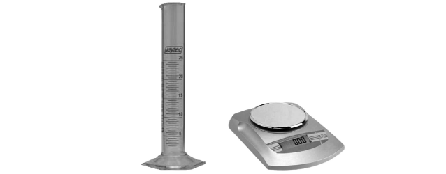

State the equation linking density, mass and volume.

### 2((c)) — 1 mark — command: complete — structured — from paper January 2012 · 1P
Complete the table to show what is measured by an electronic balance.

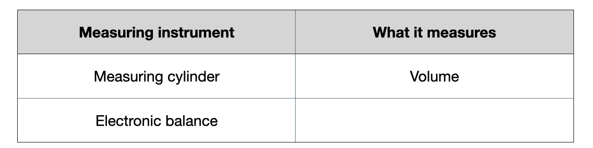

### 2((d)) — 4 marks — command: describe — structured — from paper January 2012 · 1P
Describe how the student should use each instrument to make her measurements as accurate as possible.

Measuring cylinder:

Electronic balance:

### 2((e)) — 2 marks — command: multiple — structured — from paper January 2012 · 1P
The student wants to make sure her experiment is a fair test.

(i) State one factor that she should keep the same throughout her experiment.

**(1)**

(ii) Why is it important that she keeps this factor constant?

**(1)**

## Q6 — easy — 4 marks · exam-questions

### 9((a)) — 1 mark — command: state — structured — from paper January 2015 · 1P
The volume of a piece of brass is 16.3 cm3.

A student measures its mass using an electronic balance.

The mass of the brass is 138 g.

State the equation linking density, mass and volume.

### 9((a)) — 3 marks — command: calculate — structured — from paper 2015 January  · 1P
Calculate the density of brass. Give the unit.

density = ..................................... unit ...................

## Q7 — medium — 5 marks · exam-questions

### 4((a)) — 2 marks — command: evaluate — structured — from paper June 2013 · 1P
The object shown in the photograph is an old, brass mass.

It is marked 500 g.

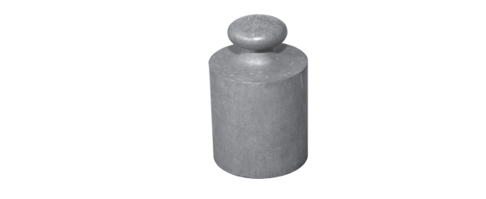

A student puts the mass on an electronic balance.

The electronic balance reading is 498.2 g.

The student concludes:

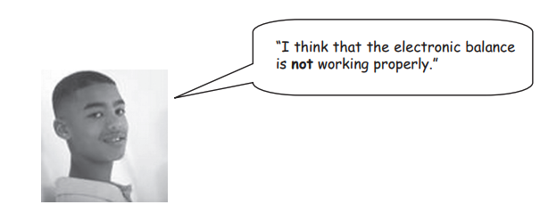

Evaluate this conclusion.

### 4((b)) — 3 marks — command: what — structured — from paper June 2013 · 1P
The student wants to find the density of the old, brass mass. First, he obtains a correct value for the mass. What else must he do to find the density?

## Q8 — medium — 14 marks · exam-questions

### 7((a)) — 4 marks — command: multiple — structured — from paper June 2013 · 1PR
The LR5 is a specialist submarine for underwater rescues.

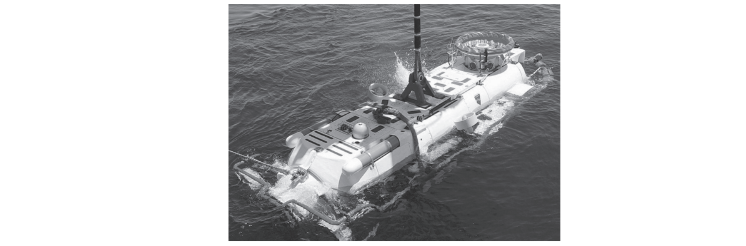

The average density of sea water is 1028 kg / m3.

(i) State the equation linking pressure difference, depth, density and *g*.

**(1)**

(ii) Calculate the increase in pressure as the LR5 descends from the surface to a depth of 700 m.

**(2)**

increase in pressure = ..................................... Pa

(iii) Atmospheric pressure is 1.0 × 105 Pa. Calculate the total pressure on the LR5 when it is at a depth of 700 m.

**(1)**

total pressure = ..................................... Pa

### 7((b)) — 4 marks — command: multiple — structured — from paper June 2013 · 1PR
On another descent, the LR5 experiences a total pressure of 41 × 105 Pa. The entrance to the LRS is through an access door which has an area of 3.1 m2.

(i) State the equation linking pressure, force and area.

**(1)**

(ii) Calculate the force on the outside of the door.

**(3)**

Force = ..................................... N

### 7((c)) — 1 mark — command: explain — structured — from paper June 2013 · 1PR
The LRS is tested in fresh water. The density of fresh water is 1000 kg / m3. Explain why the pressure on the submarine in the fresh water is less than the pressure in sea at the same depth.

### 7((d)) — 5 marks — command: describe — structured — from paper June 2013 · 1PR
A student is given a sample of liquid labelled sea water.

Describe an experiment that the student could carry out to find the density of the sample.

## Q9 — medium — 7 marks · exam-questions

### 4((a)) — 3 marks — command: multiple — structured — from paper June 2012 · 1P
A student places a pile of coins on a table, as shown in photograph **A**.

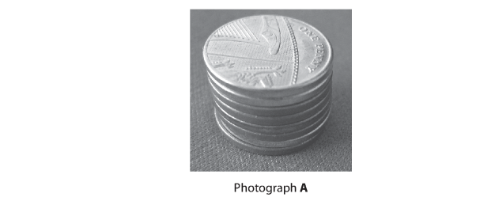

There are 8 coins in the pile.

The weight of each coin is 0.036 N.

The area of each coin is 0.0013 m2.

(i) State the equation linking pressure, force and area.

**(1)**

(ii) Calculate the pressure on the table caused by the pile of coins.

**(2)**

pressure = ..................................... Pa

### 4((b)) — 4 marks — command: multiple — structured — from paper June 2012 · 1P
The student then spreads the 8 coins out on the table as shown in photograph **B**.

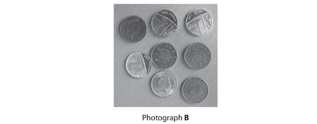

(i) Describe how this affects the total force from the coins on the table.

**(2)**

(ii) Explain how this affects the pressure on the table caused by the coins.

**(2)**

## Q10 — medium — 5 marks · exam-questions

### 7((a)) — 1 mark — command: state — structured — from paper January 2015 · 1P
The photograph shows a car tyre that needs to be inflated.

Author: Ildar Sagdejev

The tyre exerts a pressure on the road of 270 kPa.

The area of the tyre touching the road is 0.016 m2.

State the equation linking pressure, force and area.

### 7((a)) — 4 marks — command: calculate — structured — from paper 2015 January  · 1P
Calculate the force exerted on the road by the tyre. Give the unit.

force = ..................................... unit.................

## Q11 — medium — 12 marks · exam-questions

### 5((a)) — 2 marks — command: explain — structured — from paper January 2013 · 1P
Kalpana finds a small stone.

To help her identify the type of stone, Kalpana decides to find its density.

Kalpana explains why she thinks this will help.

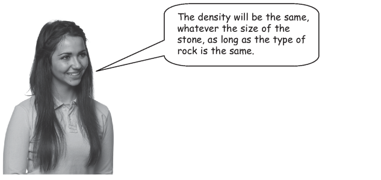

Her friend, Christine, disagrees.

Who is correct — Kalpana or Christine?

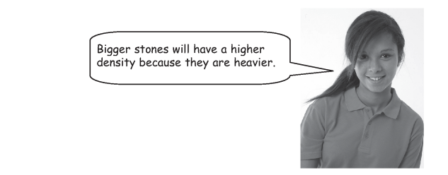

Explain your answer.

### 5((b)) — 3 marks — command: multiple — structured — from paper January 2013 · 1P
Kalpana uses a measuring cylinder to find the volume of water displaced by the stone.

She has three measuring cylinders to choose from.

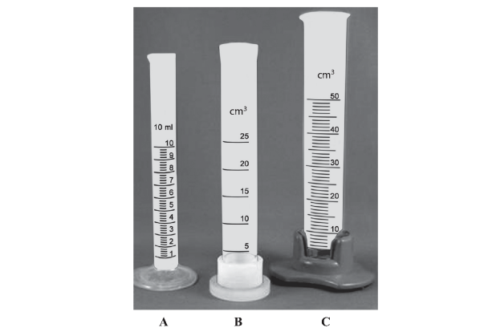

(i) Which measuring cylinder would give the most **precise** measurement? Explain your answer.

**(2)**

(ii) The most precise measuring cylinder may not give an **accurate** reading. Suggest why.

**(1)**

### 5((c)) — 4 marks — command: multiple — structured — from paper January 2013 · 1P
The table shows the measurements that Kalpana makes.

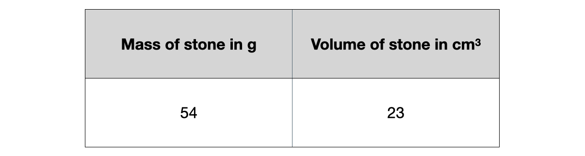

(i) State the equation linking density, mass and volume.

**(1)**

(ii) Calculate the density of the stone.

State your answer to an appropriate number of significant figures.

Give the unit.

**(3)**
 density = ..................................... unit ....................

### 5((d)) — 3 marks — command: multiple — structured — from paper January 2013 · 1P
(i) How can Kalpana use her value of density to identify the type of stone?

**(2)**

(ii) Kalpana may still be unsure about the type of stone.

Suggest why.

**(1)**

## Q12 — medium — 10 marks · exam-questions

### 4((a)) — 2 marks — command: which — structured — from paper June 2015 · 2P
The photograph shows a water barrel with a tap.

The barrel is used to store rainwater.

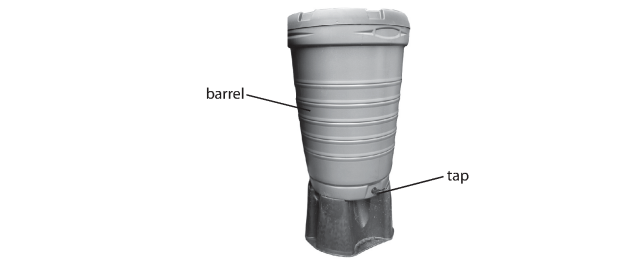

A student investigates the water depth in the barrel.

She measures the depth and then opens the tap.

As water flows out of the barrel, she measures the depth every minute.

The table shows her results.

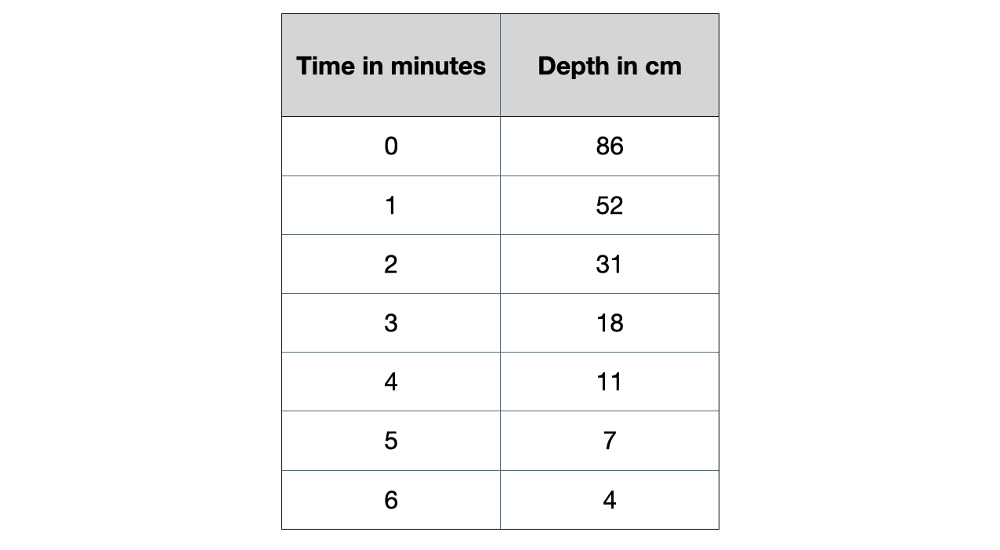

Which two measuring instruments should the student use in her investigation?

### 4((b)) — 7 marks — command: multiple — structured — from paper June 2015 · 2P
(i) Plot a graph to show how the depth changes with time, and draw the curve of best fit..

**(5)**

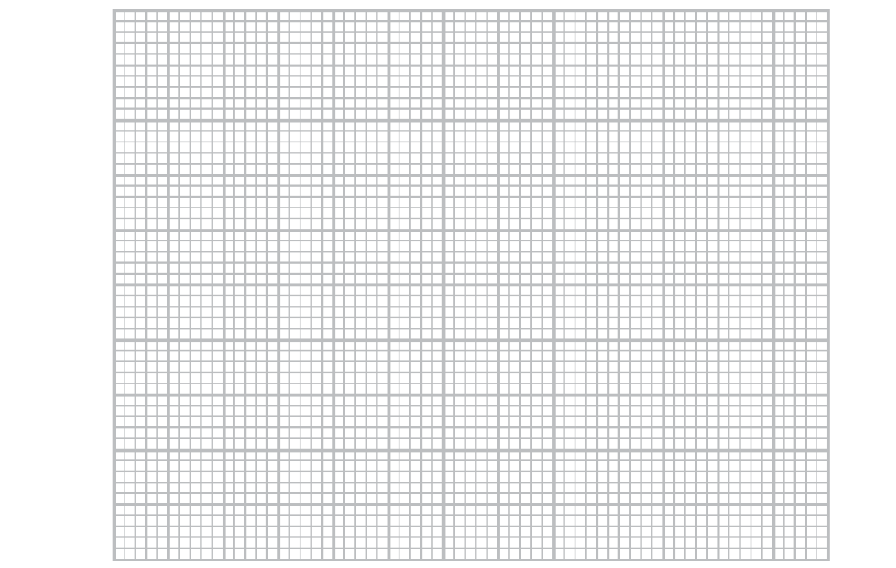

** **(ii) Describe the relationship between depth and time.

**(2)**

### 4((c)) — 1 mark — command: suggest — structured — from paper June 2015 · 2P
The student notices that the water flows out less quickly as time passes. Suggest a reason for the decrease in flow.

## Q13 — medium — 9 marks · exam-questions

### 4((a)) — 4 marks — command: multiple — structured — from paper June 2012 · 2P
A student measures the diameter of a coin.

She uses the digital calliper shown in the photograph.

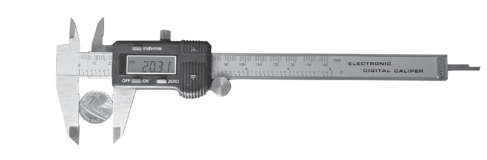

The digital calliper gives readings to the nearest 0.01 mm.

The student measures the diameter of the coin eight times.

Her readings are shown below.

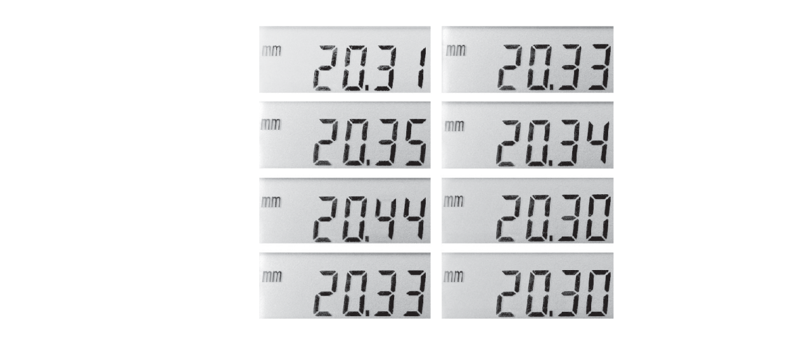

(i) Circle the anomalous reading.

**(1)**

(ii) Calculate the average diameter of the coin.

**(3)**

average = ..................................... mm

### 4((b)) — 2 marks — command: explain — structured — from paper June 2012 · 2P
The student wants to find the thickness of a coin.

She takes several similar coins and measures them together as shown.

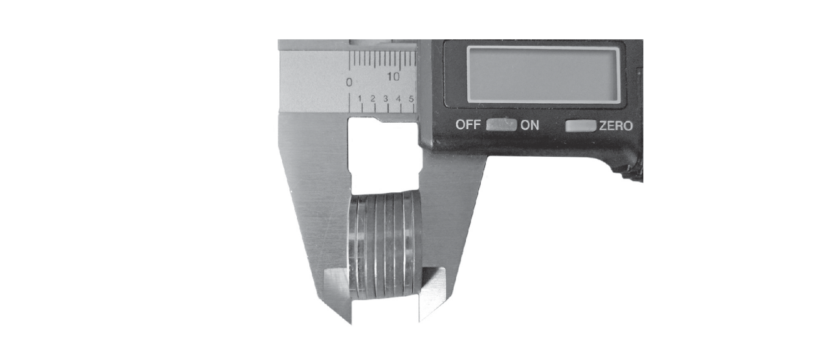

She says:

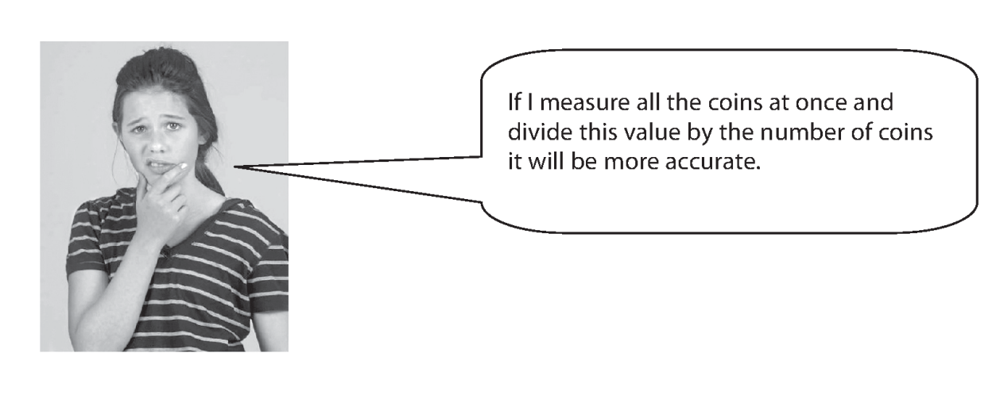

Do you agree with the student?

Explain why.

### 4((c)) — 3 marks — command: what — structured — from paper June 2012 · 2P
The student wants to find the density of the coin. She uses her values for the diameter and thickness of the coin to calculate its volume. What else must she do to find the density of the coin?

## Q14 — medium — 5 marks · exam-questions

### 8((b)) — 1 mark — command: state — structured — from paper June 2015 · 1PR
A pressure switch is used in a washing machine to control the flow of water.

The water pushes on a flexible container and compresses some trapped air.

When the pressure of this trapped air reaches 104 kPa, the pressure switch turns the water off.

The pressure of the trapped air is given by this relationship

`table row cell table row cell pressure space of space the end cell row cell trapped space air end cell end table space equals space end cell end table table row atmospheric row pressure end table space plus space table row cell pressure space difference end cell row cell caused space by space water end cell end table`

State the equation linking pressure difference, height, density and *g*.

### 8((b)) — 4 marks — command: calculate — structured — from paper 2015 June  · 1PR
Calculate the height of water in the machine when the pressure of the trapped air reaches 104 kPa and the switch operates.

[atmospheric pressure = 100 kPa, density of water = 1000 kg/m3] **     **

height of water = .......................... m

## Q15 — hard — 11 marks · exam-questions

### 9((b)) — 4 marks — command: multiple — structured — from paper June 2014 · 1P
John Leslie invented a differential thermometer.

The diagram shows this thermometer.

The bulbs are filled with air and are connected by a tube which contains liquid.

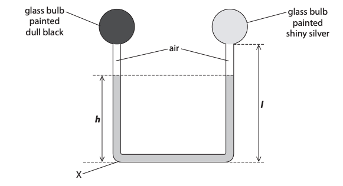

(i) State the equation linking pressure difference, height, density and *g.*

**(1)**

(ii) The density of the liquid is 1260 kg / m3 .

Calculate the pressure due to the liquid at X when the height, *h*, of the column of liquid is 0.25 m.

Give the unit.

**(3)**

Pressure = ............................. unit .....................

### 9((b)) — 7 marks — command: explain — structured — from paper 2014 June  · 1PR
(i) The student places the differential thermometer in bright sunlight for a few minutes.

She observes that the liquid level

- falls on the side of the dull black bulb making h lower

  - rises on the side of the shiny silver bulb

Use ideas about heat transfer and particle theory to explain these observations.

**(3)**

(ii) Explain what would happen to the levels of the liquid if the student repeated the experiment with a denser liquid in the thermometer.

**(2)**

(iii) Two students discuss the effect of changing the length, *l*, of the tube on both sides, while keeping the total volume of liquid constant.

**   **

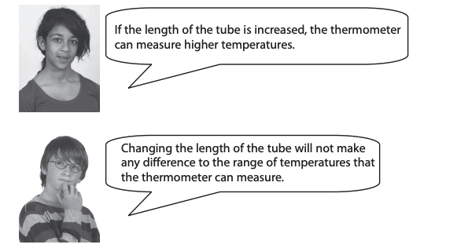

Explain which of these ideas is correct.

**(2)**

## Q16 — hard — 7 marks · exam-questions

### 14((a)) — 3 marks — command: multiple — structured — from paper June 2013 · 1P
The photograph shows two containers that store rainwater.

The containers have taps that are joined by a pipe.

The taps are closed.

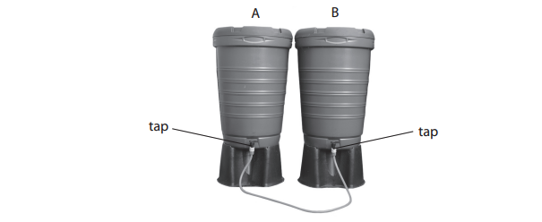

The diagram shows the water levels inside the containers.

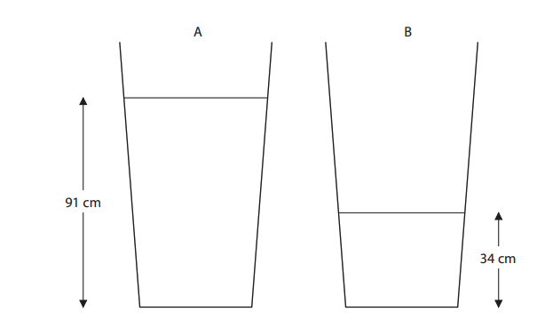

The density of water is 1000 kg / m3.

(i) State the equation linking pressure difference, height, density and *g*.

**(1)**

(ii) Calculate the pressure that the water causes at the base of container A.

**(2)**

pressure = ..................................... Pa

### 14((b)) — 4 marks — command: multiple — structured — from paper June 2013 · 1P
When the taps are opened, water flows in the pipe for some time. The diagram shows the final water level in container A.

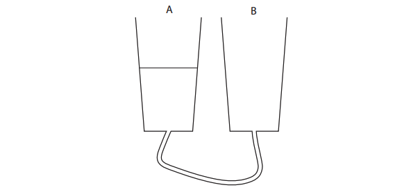

(i) Complete the diagram to show the final water level in container B.

**(1)**

(ii) Explain why the water starts to flow and then stops.

**(3)**

## Q17 — hard — 8 marks · exam-questions

### 6((a)) — 5 marks — command: multiple — structured — from paper June 2016 · 1PR
This question is about pressure in a liquid.

A teacher uses this apparatus to demonstrate pressure difference in water.

The apparatus is hollow and has three short tubes at different depths.

The teacher completely fills the apparatus with water.

Water comes out of all the tubes.

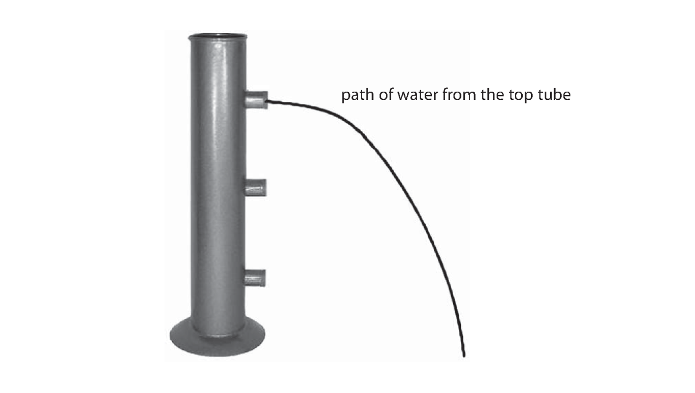

(i) State the relationship between pressure difference, height, density and *g*.

**(1)**

(ii) The diagram shows the path of water coming from the top tube.

Complete the diagram by drawing the paths of water you would expect to see from the other two tubes.

**(2)**

(iii) Explain the pattern of the paths of water from the tubes.

**(2)**

### 6((b)) — 3 marks — command: multiple — structured — from paper June 2016 · 1PR
In another demonstration, the teacher uses this container.

The container is made of glass and each section has a different shape.

The teacher pours water into the container until it reaches the level shown in the left-hand section.

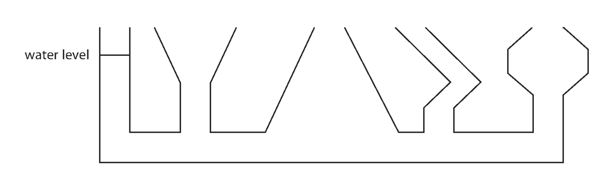

(i)  Complete the diagram by drawing the water levels in the other four sections.

**(1)**

(ii) Explain why the water fills the container in the way you have shown.

**(2)**

## Q18 — hard — 9 marks · exam-questions

### 2((a)) — 2 marks — command: state — structured — from paper January 2016 · 2P
The photograph shows some large concrete cubes.

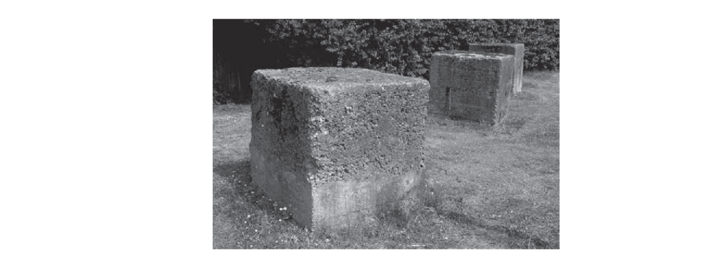

The mass of one of the concrete cubes is 1000 kg.

State the weight of this concrete cube.

Give the unit.

weight of concrete cube  = ..................................... unit .................

### 2((b)) — 3 marks — command: multiple — structured — from paper January 2016 · 2P
The density of this concrete cube is 2300 kg/m3.

(i) State the equation linking density, mass and volume.

**(1)**

(ii) Calculate the volume of this concrete cube.

**(2)**

volume of concrete cube  = ..................................... m3

### 2((c)) — 4 marks — command: multiple — structured — from paper January 2016 · 2P
The graph shows the volumes of 1000 kg of some other materials.

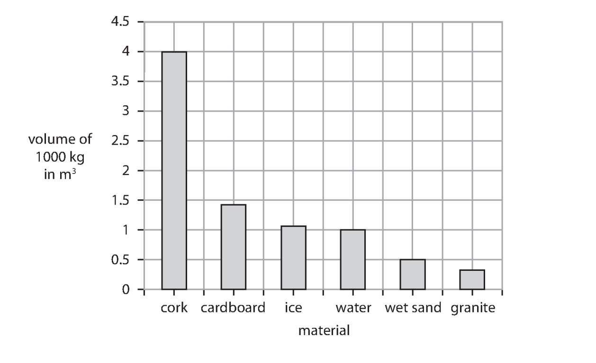

(i) State the type of graph shown.

**(1)**

(ii) Give a reason why a line graph is not an appropriate way to display these data.

**(1)**

(iii) Use information from the graph to compare the densities of cork and water.

**(2)**

## Q19 — hard — 7 marks · exam-questions

### 1() — 1 mark — command: determine — structured
A student takes an empty measuring cylinder and places it on an electronic balance.

She records the mass and then adds an unknown liquid to the measuring cylinder. She records the volume of liquid in the measuring cylinder and the reading on the electronic balance.

She repeats this process and plots her results on a graph.

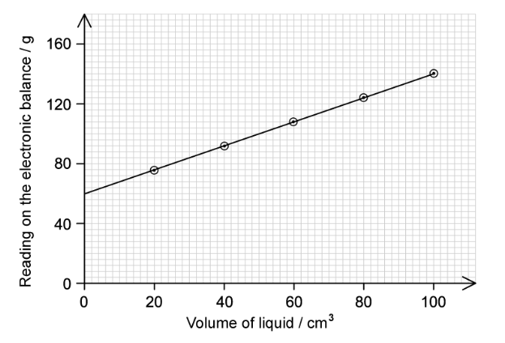

Determine the mass of the empty measuring cylinder.

### 2() — 4 marks — command: identify — structured
The table shows four different liquids and their densities.

| **Liquid** | **Density (kg / m****3****)** |
|---|---|
| Ethanol | 800 |
| Water | 1000 |
| Petrol | 700 |
| Castor oil | 900 |

Using the data from the graph and your answer to part (a) to identify the liquid which the student used.

The following data may be useful:

1 m3 = 1 × 106 cm3

### 3() — 2 marks — command: draw — structured
The student repeats the experiment with a liquid which has a lower density. The same measuring cylinder was used for both experiments.

Draw a line on the graph to show the results she would expect to obtain from this second liquid.
