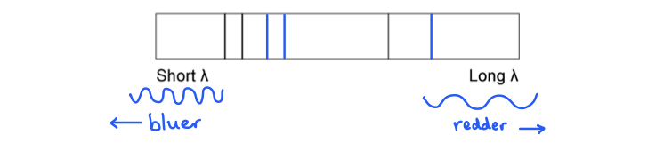
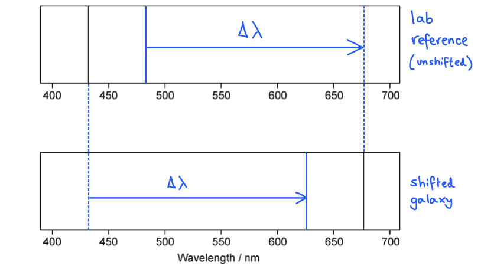

# Mark Schemes — Cosmology
**9. Astrophysics** · Edexcel IGCSE Physics (Modular) (4XPH1) — 24/Unit 2

## Q1 — easy — 7 marks · exam-questions

### 1() — 2 marks
> **[mark-scheme]**
> Define redshift:
> 
> - The fractional increase in wavelength **OR** decrease in frequency **[1 mark]**
> - Due to the source and the observer moving away from each other **[1 mark]**

> **[exam-tip]**
> This is worth two marks, so give both halves: what is observed to change, and why it changes. An answer that only describes the shift in wavelength earns one mark.
> 
> Say that the source and the observer are moving away from each other. Vague references to the universe expanding, or to galaxies being far away, are not enough on their own.

### 2() — 1 marks
**Correct answer: C** — 

**Final answer:** **The correct answer is C**

- When light undergoes redshift its wavelength **increases**
- This means the frequency **decreases**
- The speed of light is unchanged, and the three quantities are linked by the wave equation

$v = f λ$

### 3() — 4 marks
Complete the boxes on the diagram with words or phrases from the list:

**[4 marks]**

> **[mark-scheme]**
> 1 mark for each correct label

> **[exam-tip]**
> Start from the direction the light source is moving. The observer it is moving away from sees the longer wavelength and lower frequency, and the observer it is moving towards sees the shorter wavelength and higher frequency — so the two shifts sit on opposite sides of the diagram.

## Q2 — easy — 15 marks · exam-questions

### 1() — 3 marks
> **[mark-scheme]**
> Define the Doppler effect:
> 
> - The change in the observed frequency / wavelength of a wave **[1 mark]**
> - When there is *relative* motion **[1 mark]**
> - Between the source of the waves and the observer **[1 mark]**

> **[exam-tip]**
> The word doing the work here is *relative*. Saying only that the source is moving caps you at two marks, because the effect happens whenever the source and the observer move relative to one another — either one can be moving, or both, towards or away from each other at different speeds.
> 
> Give the general definition rather than an example. A change in pitch as an ambulance passes, or the redshift of a distant galaxy, are instances of the Doppler effect rather than definitions of it.

### 2() — 2 marks
> **[mark-scheme]**
> State the two properties which are observed to have changed due to the Doppler effect:
> 
> - Frequency **[1 mark]**
> - Wavelength **[1 mark]**

### 3() — 3 marks
> **[mark-scheme]**
> (i) State the property of the sound wave which increases:
> 
> - Wavelength **[1 mark]**
> 
> (ii) State the property of the sound wave which decreases:
> 
> - Frequency **[1 mark]**
> 
> (iii) State the property of the sound wave which remains constant:
> 
> - Speed **[1 mark]**

> **[exam-tip]**
> Picture the wave being stretched out behind a source that is moving away. The wavelength gets longer, so the frequency must fall.
> 
> Speed is the one that does not change. The Doppler effect alters how the wave is observed, not how fast it travels through the medium.

### 4() — 7 marks
Complete the sentences by circling the correct words:

- When the source starts to move **away from** the observer, the wavelength of the wave broadens **[1 mark]**
- For sound waves, sound therefore appears at a **lower** frequency to the observer **[1 mark]**
- For light waves, the light shifts towards **red** due to its **lower** frequency **[1 mark]**
- When the source starts to move **towards** the observer, the wavelength of the wave shortens **[1 mark]**
- For sound waves, sound therefore appears at a **higher** frequency to the observer **[1 mark]**
- For light waves, the light shifts towards **blue** due to its **higher** frequency **[1 mark]**
- This is because **red** light has a longer wavelength than **blue** light **[1 mark]**

> **[exam-tip]**
> Work through the passage in order rather than jumping about. Each sentence follows from the one before it, so once you have decided whether the source is approaching or receding, the frequency and the colour shift both follow.
> 
> Red is at the long-wavelength, low-frequency end of the visible spectrum and blue is at the short-wavelength, high-frequency end. Fix that one fact and the light sentences answer themselves.

## Q3 — easy — 11 marks · exam-questions

### 1() — 1 marks
**Correct answer: B** — 1 and 2

**The correct answer is ****B** because:

- **Redshift **is an increase in the observed wavelength of electromagnetic radiation emitted from **receding** stars and galaxies (those ones which are moving away from us)

  - The light emitted from distant galaxies appears redshifted in comparison with light emitted on the Earth
- This means that redshift in the light from distant galaxies is evidence that

  - The Universe is expanding
  - This supports the Big Bang Theory

### 2() — 4 marks
(b) The correct sentences are:

Each correct sentence scores **one** mark:

- After the discovery of Doppler redshift, astronomers began to realise that almost all the galaxies in the universe are **receding**; **[1 mark]**
- This led to the idea that the universe must be **expanding**; **[1 mark]**
- This caused the light waves to **stretch out** as they travel through space, shifting them towards the **red** end of the spectrum; **[1 mark]**
- The more shifted the light from a galaxy is, the **faster** the galaxy is moving away from Earth; **[1 mark]**

**[Total: 4 marks]**

### 3() — 6 marks
(c) The correct sentences are:

Each correct sentence scores **one** mark:

- Around 14 billion years ago, the Universe began from a very small region that was extremely **hot** and dense; **[1 mark]**
- Then there was a giant explosion, which is known as the **Big Bang**; **[1 mark]**
- This caused the universe to **expand** from a single point to form the universe today; **[1 mark]**
- Each point expands away from the others and the universe **cools** due to this; **[1 mark]**
- This is seen as galaxies move away from each other, and the further away they are the **faster** they move; **[1 mark]**
- As a result of the initial **explosion**, the Universe continues to expand; **[1 mark]**

**[Total: 6 marks]**

## Q4 — easy — 3 marks · exam-questions

### 1() — 1 marks
**Correct answer: A** — light from galaxies is red shifted

**The correct answer is ****A** because:

- Redshift is an **increase** in the observed wavelength of electromagnetic radiation emitted from **receding** stars and galaxies
- The light from distant galaxies has a longer wavelength than the same EM radiation viewed on Earth
- This shows that the distant galaxies are moving **away** from Earth (and from each other)
- This is evidence that the Universe is expanding

You need to understand redshift and how it provides evidence for Universal expansion and the Big Bang theory. The opposite (when a galaxy is moving **towards** Earth) is called 'blue shift'.

### 2() — 1 marks
**Correct answer: A** — the galaxy is moving towards the Earth

**The correct answer is ****A** because:

- The change in the wavelength of the observed light can tell us about the motion of the galaxy relative to the Earth

  - If it is moving **away **from the Earth, the wave will spread out, hence the wavelength will **increase** and appear more **red **(hence the term 'red shift')
  - If it is moving **towards **the Earth, the wave will bunch together, hence the wavelength will **decrease **and appear more **blue **(hence the term 'blue shift')

- The astronomer observes that the wavelength of light is shifted towards the **blue** end of the spectrum
- Therefore, its wavelength has **decreased **and hence, it is moving **towards **the Earth

  - This is option** A**

### 3() — 1 marks
**Correct answer: D** — all the lines move towards the 'long λ' side by the same amount

**The correct answer is ****D**** **because:

- When an object is moving away from an observer the wavelength of the light **increases**, or becomes **longer**
- As the wavelength of light increases, it moves towards the red end of the spectrum, hence the name **red** shift
- All the lines will be shifted by the **same** amount

  - Therefore, option **D **is correct

## Q5 — easy — 11 marks · exam-questions

### 1() — 3 marks
(a)

(i) The name of the theory is:

- The Big Bang (Theory);** ****[1 mark]**

(ii) The names of two observations that support this theory:

- (Galactic) red-shift; **[1 mark]**
- Cosmic Microwave Background Radiation (CMBR); **[1 mark]**

**[Total: 3 marks]**

### 2() — 3 marks
(b) The correct ticks (✔) are as follows:

| **Statement** | **Correct (✔)** |
|---|---|
| The universe began 14 million years ago |   |
| There was a giant explosion known as the big bang | **✔** |
| This caused the universe to expand from a single point | **✔** |
| It heated as it expanded to form the universe today |   |
| Each point in the universe expands away from the others | **✔** |
| So, the further away galaxies are the slower they are moving |   |

- *One mark for each correct tick*

**[Total: 3 marks]**

- The universe began 14 **billion** and not 14 million years ago
- The universe has **cooled** and not heated as it has expanded
- The further away galaxies are, the **faster** they are moving

### 3() — 5 marks
(c) The correct ticks (✔) are as follows:

| **Statement** | **Evidence from Galactic Redshift** | **Evidence from CMB Radiation** |
|---|---|---|
| Astronomers discovered radiation in the microwave region of the electromagnetic spectrum coming from all directions |   | **✔** |
| Radiation is in the microwave region because the radiation initially from the big bang has redshifted as the Universe has expanded |   | **✔** |
| Observations of light spectrums from supernovae indicate that distant galaxies are receding | **✔** |   |
| Galaxies that are further away are moving faster, as their distance is proportional to their speed | **✔** |   |
| Light spectrums from distant galaxies show that light is redshifted which is evidence of the universe expanding | **✔** |   |

- *Each correct tick scores 1 mark*

** ****[Total: 5 marks]**

## Q6 — medium — 9 marks · exam-questions

### 1() — 3 marks
(a) Explain the term* *galactic redshift:

- An<u> increase</u> in the observed <u>wavelength</u> of <u>light</u> emitted from <u>distant galaxies</u>; **[1 mark]**
- When <u>compared</u> to the wavelength of similar light <u>on Earth</u>; **[1 mark]**
- Galactic redshift is evidence that the Universe is <u>expanding</u>; **[1 mark]**

**[Total: 3 marks]**

### 2() — 2 marks
(b) Explain why galactic redshift provides evidence to support the Big Bang theory:

- If the Universe is expanding, then it must have been closer together in the past; **[1 mark]**
- The expansion of the Universe can be extrapolated back to its point of origin (the Big Bang); **[1 mark]**

**[Total: 2 marks]**

- *If the Universe is expanding at a measurable rate, then it makes sense that if we were able to rewind this expansion we would find a point in time where the Universe existed at a single point in time and space (called a singularity).*
- *This is the point at which the Big Bang is thought to have occurred.*
- *By doing this, scientists have been able to estimate the age of the Universe to be about 13.7 billion years old.*

### 3() — 4 marks
Describe and explain what can be deduced from cosmic microwave background radiation (CMBR):

- CMBR is detected in all directions throughout the universe / everywhere / appears to be the same in all directions; **[1 mark]**
- Which implies that all parts of the universe were in contact at one time / came from a single point/singularity; **[1 mark]**
- CMBR is considered to be energy left over from the Big Bang; **[1 mark]**
- The wavelength of the radiation has expanded into the microwave region of the electromagnetic spectrum; **[1 mark]**
- This is evidence that the Universe has expanded; **[1 mark]**

**[Total: 4 marks]**

> *Initially, the CMBR would have been high energy radiation, towards the gamma end of the spectrum. As the Universe expanded, the wavelength of the radiation increased.*

> *Over time, it has increased so much that it is now in the microwave region of the spectrum.*

## Q7 — medium — 2 marks · exam-questions

### 1() — 1 marks
**Correct answer: A** — 

**The correct answer is ****A** because:

- If the train is moving towards the observer then the wavelength of the sound waves is going to become shorter

  - This eliminates answer **D**
- If wavelength is shorter, then, because $c=fλ$, a decrease in wavelength will result in an increase in frequency

  - This eliminates answer** C**
- The pitch of a sound is linked to its frequency

  - A higher frequency means a higher pitch
  - Therefore the correct answer is **A**

### 2() — 1 marks
**Correct answer: B** — When a car starts to move away from an observer, the sound from the exhaust appears at a lower frequency to the observer than the driver

**The correct answer is ****B** because:

- The noise from the exhaust of a car moving away from an observer will have a lower frequency of sound due to the Doppler effect
- This is answer **B**

**A** is incorrect as  When a galaxy moves towards the Earth the spectral absorption lines observed will have a **shorter** wavelength

**C** is incorrect as When a train moves towards a station, it's horn will sound **higher** to the passengers on the platform compared to the passengers in the train

**D** is incorrect as Light from a star moving **away from** the Earth is redshifted

## Q8 — medium — 9 marks · exam-questions

### 1() — 4 marks
(a) Calculate the wavelength of the same spectral line from the galaxy as measured by the observer on Earth:

List the known quantities:

- Speed of galaxy away from the Earth, $v$ = 6 × 107 m/s
- Speed of light, $c$ = 3.0 × 108 m/s
- Wavelength of hydrogen line, $λ_{0}$ = 400 nm

Calculate the change in observed wavelength, $\Deltaλ$:

- $\frac{Δλ}{λ_{0}}=\frac{v}{c}$
- $Δλ=400\times\frac{6\times10^{7}}{3\times10^{8}}$ **[1 mark]**
- $\Deltaλ$ = 80 nm **[1 mark]**

Calculate the new wavelength $λ$:

- Change in wavelength: $\Deltaλ=λ-λ_{0}\Rightarrowλ=\Deltaλ+λ_{0}$

  - Since the galaxy is moving **away **from Earth, $\Deltaλ$ is positive

- Wavelength* *= 400 + 80 **[1 mark]**
- Wavelength = 480 nm **[1 mark]**

**[Total: 4 marks]**

- *The key here is that the galaxy is moving away, and so the new wavelength is longer than the laboratory observed wavelength.*

### 2() — 4 marks
(b) Calculate the relative speed of the galaxy:

List the known quantities:

- Wavelength of spectral line on Earth, *λ*0 = 530 nm
- Wavelength of spectral line from the galaxy, *λ* = 535.3 nm
- Speed of light, *c* = 3.0 × 108 m/s
- Speed of galaxy away from the Earth = *v *

Calculate the change in wavelength, $\Deltaλ$:

- $\Deltaλ=λ-λ_{0}$
- $\Deltaλ$ = 535.3 − 530 = 5.3 nm **[1 mark]**

Rearrange the equation to make *v* the subject:

- $\frac{Δλ}{λ_{0}}=\frac{v}{c}\Rightarrowv=c\times\frac{Δλ}{λ_{0}}$
- `v space equals space fraction numerator 5.3 space cross times space open parentheses 3.0 cross times 10 to the power of 8 close parentheses over denominator 530 end fraction` **[1 mark]**
- Relative speed of the galaxy = 3.0 × 106 m/s **[1 mark]**

**[Total: 3 marks]**

### 3() — 1 marks
**Correct answer: B** — A greater redshift means a faster speed of recession

**The correct answer is ****B** because:

- Redshift led to the idea that the <u>space between galaxies is expanding</u>, not the galaxies themselves

  - This eliminates answer **A**
- Redshift shows that <u>most of</u> the galaxies in the universe are moving away from a single point:

  - This eliminates answer **C**
- Whilst redshift does cause a change in frequency, it doesn't cause a change in speed of electromagnetic waves

  - This eliminates answer **D**
- It is correct that a greater redshift indicates a greater speed of recession

  - Therefore, the correct answer is **B**

Take extra care in questions that may appear simple that small changes to words haven't changed the whole meaning of the sentence! On first glance a number of these statements might appear correct.

## Q9 — medium — 12 marks · exam-questions

### 1() — 3 marks
(a) Describe the main ideas of the Big Bang theory:

- The Universe started with an explosion / Big Bang; **[1 mark]**
- All matter and energy was concentrated at a (single) point; **[1 mark]**
- The explosion caused the universe to expand** **from this (single) point; **[1 mark]**

**[Total: 3 marks]**

### 2() — 4 marks
(b) State and explain the two pieces of evidence which support the Big Bang Theory of the origin of the Universe:

- (Galactic) red-shift; **[1 mark]**
- Since the light observed from <u>distant</u> stars has red-shifted this shows that the universe is expanding; **[1 mark]**
- Cosmic Microwave Background Radiation (CMBR); **[1 mark]**
- Electromagnetic radiation was produced shortly after the Big Bang and has now been red-shifted / has cooled into the microwave region; **[1 mark]**

**[Total: 4 marks]**

> *It is essential that you can state and explain these two critical pieces of evidence for the Big Bang.*

### 3() — 3 marks
(c) State and explain what type of electromagnetic radiation the CMBR will change into over the next few billion years:

- Radio waves; **[1 mark]**
- Since the Universe continues to accelerate outwards / expand; **[1 mark]**
- Therefore red-shift increases / the wavelength of the CMBR increases; **[1 mark]**

**[Total: 3 marks]**

### 4() — 2 marks
(d) Explain why our understanding of the beginning of the universe is just a theory:

- There is no experimental / physical evidence to check the theory; **[1 mark]**
- Because the temperatures / energies are too high to reproduce; **[1 mark]**

**[Total: 2 marks]**

> *We have evidence that points towards the Big Bang in the form of redshift and the CMBR, however this is not proof.*

## Q10 — medium — 10 marks · exam-questions

### 1() — 5 marks
(a)

List the known quantities:

- Observed wavelength of the source, $λ$ = 400 nm
- Reference wavelength, $λ_{0}$ = 300 nm
- Speed of light in space, $c$ = 3.00 × 108 m/s

(i) Calculate the change in wavelength between the light from the star and the galaxy:

- $\Deltaλ=λ-λ_{0}$
- $\Deltaλ$ = 400 − 300 **[1 mark]**
- Change in wavelength = 100 nm **[1 mark]**

(ii) Calculate the speed, $v$ at which the galaxy is moving relative to the Earth:

- Doppler shift of a galaxy:   $\frac{λ-λ_{0}}{λ_{0}}=\frac{\Deltaλ}{λ_{0}}=\frac{v}{c}$

Substitute the known quantities into the equation:

- `100 over 300 space equals space fraction numerator v over denominator open parentheses 3 space cross times space 10 to the power of 8 close parentheses end fraction` **[1 mark]**

Rearrange the equation to make $v$ the subject:

- `v space equals space fraction numerator 100 space cross times space open parentheses 3 space cross times space 10 to the power of 8 close parentheses over denominator 300 end fraction` **[1 mark]**
- Relative speed of the galaxy = 1 × 108 m/s **[1 mark]**

**[Total: 5 marks]**

### 2() — 5 marks
(b) Calculate the observed wavelength of light on Earth:

List the known quantities:

- Reference wavelength, $λ_{0}$ = 450 nm
- Velocity of the galaxy, $v$ = 2.0 × 104 m/s
- Speed of light in a vacuum, $c$ = 3.0 × 108 m/s

Determine the change in wavelength:

- $\frac{\Deltaλ}{λ_{0}}=\frac{v}{c}$
- `fraction numerator increment lambda over denominator 450 end fraction space equals space fraction numerator open parentheses 2.0 cross times 10 to the power of 4 close parentheses over denominator open parentheses 3.0 cross times 10 to the power of 8 close parentheses end fraction` **[1 mark]**
- `increment lambda space equals space 450 space cross times space fraction numerator open parentheses 2.0 cross times 10 to the power of 4 close parentheses over denominator open parentheses 3.0 cross times 10 to the power of 8 close parentheses end fraction` **[1 mark]**
- $\Deltaλ$ = 0.03 nm **[1 mark]**

Determine the observed wavelength of light on Earth:

- $\Deltaλ=λ-λ_{0}\Rightarrowλ=\Deltaλ+λ_{0}$
- $λ$ = 0.03 + 450 **[1 mark]**
- Wavelength observed on Earth = 450.03 nm **[1 mark]**

**[Total: 5 marks]**

## Q11 — medium — 9 marks · exam-questions

### 1() — 5 marks
> **[mark-scheme]**
> (i) Describe what is meant by the term red-shift:
> 
> - An increase in the wavelength (of light) **[1 mark]**
> - From a source which is moving away from the observer **[1 mark]**
> 
> (ii) Explain how red-shift provides evidence for the Big Bang theory:
> 
> - The further away a galaxy is, the greater the red-shift **[1 mark]**
> - This indicates that galaxies are moving away from each other / the universe is expanding **[1 mark]**
> - Hence, the universe must have started from a single point **[1 mark]**

### 2() — 4 marks
Show that the velocity of the galaxy is approximately 19 000 km/s:

- List the known quantities:

  - Reference wavelength, $λ_{0}=500.0\mathrm{nm}$
  - Observed wavelength, $λ=531.0\mathrm{nm}$
  - Speed of light, $c=3.00\times10^{5}\mathrm{km}/s$
- Determine the change in wavelength:

$\Deltaλ=λ-λ_{0}$

$\Deltaλ=531.0-500.0$

$\Deltaλ=31.0\mathrm{nm}$ **[1 mark]**

- Write out the equation for the Doppler shift of light

$\frac{\Deltaλ}{λ_{0}}=\frac{v}{c}$

- Rearrange to make velocity of the galaxy, $v$, the subject:

$v=\frac{\Deltaλc}{λ_{0}}$

`v space equals space fraction numerator 31.0 space cross times space open parentheses 3.00 cross times 10 to the power of 5 close parentheses over denominator 500.0 end fraction` **[1 mark]**

$v=18600\mathrm{km}/s$ **[1 mark]**

`v space equals space 18 space 600 space km divided by straight s space equals space 19 space 000 space space km divided by straight s space open parentheses 2 space straight s. straight f. close parentheses` **[1 mark]**

> **[mark-scheme]**
> In a show that question, you must show all your working to gain full marks.
> 
> You must also calculate your final answer to a higher precision than the value given in the question. That means you need to give your answer to a greater number of significant figures.
> 
> You need to **show that** your calculated value rounds to the value given in the question, in order to gain full marks.

> **[exam-tip]**
> You may have noticed that we did not convert the units into SI units.
> 
> This is because the equation used is a ratio.
> 
> $\frac{\Deltaλ}{λ_{0}}=\frac{v}{c}$
> 
> - The units for wavelengths cancel out as long as they are the same as each other (nm and nm)
> - The units for velocity cancel out, as long as they are the same as each other (km/s and km/s)
> 
> You would still gain full marks if you did convert to SI units. However, if you can spot opportunities where it is safe not to do so, this can save you time in the exam and reduce the risk of power of ten errors.

## Q12 — hard — 7 marks · exam-questions

### 1() — 3 marks
(a) Compare the motions of galaxy X and galaxy Y relative to Earth:

Determine the change in wavelength for galaxy X:

- $\Deltaλ=λ-λ_{0}$
- $\Deltaλ_{X}$ = 486.40 − 486.14 = 0.26 nm
- (Therefore,) galaxy X is moving <u>away from</u> the Earth; **[1 mark]**

Determine the change in wavelength for galaxy Y:

- $\Deltaλ_{Y}$ = 484.85 − 486.14 = −1.29 nm
- (Therefore,) galaxy Y is moving <u>towards</u> the Earth; **[1 mark]**
- (And) galaxy Y is moving <u>faster</u> than galaxy X; **[1 mark]**

**[Total: 3 marks]**

> *If Δ**λ** is **negative** then the galaxy is **moving away** from the Earth. This is also known as **redshift**.*

> *If Δ**λ **is **positive** then the galaxy is **moving towards** the Earth. This is also known as **blueshift**.*

### 2() — 4 marks
(b) Calculate the speed of galaxy Y relative to the Earth:

List the known quantities:

- Wavelength in laboratory, $λ_{0}$ = 486.14 nm
- Wavelength from galaxy Y, $λ$* *= 484.85 nm
- Speed of light, *c* = 3.0 × 108 m/s

Calculate the change in wavelength, Δ*λ*

- $\Deltaλ=λ-λ_{0}$ = 484.85 − 486.14
- $\Deltaλ$* *= (−)1.29 nm **[1 mark]**

Rearrange the equation and substitute values, to calculate *v*:

- $\frac{Δλ}{λ_{0}}=\frac{v}{c}\Rightarrowv=c\times\frac{Δλ}{λ_{0}}$ **[1 mark]**
- `v space equals space open parentheses 3.0 cross times 10 to the power of 8 close parentheses space cross times space fraction numerator 1.29 over denominator 486.14 end fraction`**[1 mark]**
- Speed of galaxy Y = 796 067 = 7.96 × 105 m/s **[1 mark]**

**[Total: 4 marks]**

## Q13 — hard — 8 marks · exam-questions

### 1() — 1 marks
**Correct answer: B** — 0.0339 *c*

**The correct answer is ****B** because:

- The shifted wavelength (observed from the galaxy) is $λ$ = 610 nm
- The unshifted wavelength (as measured in the laboratory) is  $λ_{0}$ = 590 nm
- To calculate the velocity of a galaxy, the following formula can be used

  - $\frac{λ-λ_{0}}{λ_{0}}=\frac{\Deltaλ}{λ_{0}}=\frac{v}{c}$
- Rearranging to make velocity the subject, and substituting the values

  - $v=\frac{λ-λ_{0}}{λ_{0}}\timesc$
  - `v space equals space fraction numerator open parentheses 610 space minus space 590 close parentheses over denominator 590 end fraction cross times c` = 0.033898 × *c*

- This answer rounds to 0.0339 *c*, which is option **B**

**A** is incorrect as the change is wavelength is divided by the wavelength of light from the galaxy rather than the known wavelength from laboratory observations

**C** is incorrect as this value is too close to the speed of light - the calculation has been reversed so that the galaxy's speed is about 97% of light speed rather than being about 3% of it

**D** is incorrect as this is the speed of light, so a galaxy cannot be moving this fast

### 2() — 3 marks
(b)

(i) The speed of galaxy T compared to the speed of galaxy S:

- Since speed = $\frac{distance}{time}$
- Speed and distance are directly proportional or $v\proptod$
- So, if distance of galaxy T is twice the distance of galaxy S
- Speed of (galaxy) T is <u>twice</u> the speed of galaxy S **OR** speed of (galaxy T) = 2 × 0.0339 *c* = 0.0678 *c*; **[1 mark]**

(ii) The change in wavelength of light from galaxy T compared to the light from galaxy S:

List the known quantities:

- Shifted wavelength of light from galaxy S, $λ$ = 610 nm
- Unshifted wavelength from lab, $λ_{0}$ = 590 nm

Determine the change in wavelength of light from galaxy T:

- Change in wavelength of light from galaxy S, $\Deltaλ$ = 610 − 590 = 20 nm **[1 mark]**
- From the Doppler shift equation $\frac{\Deltaλ}{λ_{0}}=\frac{v}{c}$, so $\Deltaλ\proptov$
- So for a galaxy with twice the speed, it will also have twice the change in wavelength

- Change in wavelength of light from galaxy T, $\Deltaλ$ = 2 × 20 = 40 nm **[1 mark]**

**[Total: 3 marks]**

### 3() — 4 marks
(c) Comparing the speeds of the two galaxies provides evidence for the Big Bang theory because:

Any **four** from:

- The more distant / faster galaxy (T) shows greater red shift; **[1 mark]**
- The more distant galaxy (T) is travelling faster; **[1 mark]**
- (Which suggests) the universe is expanding; **[1 mark]**
- (Expansion suggests that) at an earlier point in time **OR** at the beginning / origin of time; **[1 mark]**
- The universe was a single point; **[1 mark]**

**[Total: 4 marks]**

## Q14 — hard — 2 marks · exam-questions

### 1() — 1 marks
**Correct answer: D** — 

**The correct answer is ****D** because:

- When light is redshifted, its wavelength **increases**

  - This means it gets closer to the red end of the visible spectrum i.e. closer to the 700 nm end

- The question gives us the relationship between redshift and distance to the galaxy

  - The further away the galaxy, the further the light was shifted
  - This means that the farthest galaxy is the one with the greatest change in wavelength (towards the red end)

- The unshifted wavelengths of hydrogen are 434 nm and 486 nm
- The spectrum which shows the shifted wavelengths closest to the 700 nm (red) end is option **D**

  - Therefore, galaxy **D** is the farthest away galaxy

**A** is incorrect as these wavelengths have shifted slightly to the right, but not as much as **C** and **D**

**B** is incorrect as these wavelengths have shifted to the left, which means they are blue-shifted and are moving towards us, not away

**C** is incorrect as these wavelengths have shifted to the right, more than **A**, but not as much as **D**

It can be initially very daunting to see a question with an unfamiliar context. Always read the question carefully and underline any key information you might need to use to solve the problem

Start with the things that you know. You know that redshift is the increase in wavelength. And the question tells you that the galaxy with the largest redshift will be the furthest away.

It can be useful to annotate diagrams to try and visualise what is going on. For example, if you compare the original, unshifted diagram, to option D, you will see that it has the largest change in wavelength Δλ

### 2() — 1 marks
**Correct answer: A** — `H subscript 0 space end subscript equals space fraction numerator c open parentheses lambda subscript 2 space end subscript minus space lambda subscript 1 close parentheses over denominator d space lambda subscript 1 end fraction`

The correct answer is **A **because:

- The equation for galactic redshift can be found in the data booklet:

  - $\frac{λ-λ_{0}}{λ_{0}}=\frac{\Deltaλ}{λ_{0}}=\frac{v}{c}$

- Where:

  - Unshifted wavelength, *λ**0* = *λ**1*
  - Shifted wavelength, *λ* =* λ**2*
  - Change in wavelength, Δ*λ* = (*λ*2 − *λ*1)

- Insert the Hubble equation into the Doppler equation:

  - $v=H_{0}d$
  - $\frac{\Deltaλ}{λ}=\frac{v}{c}=\frac{H_{0}d}{c}$
  - `fraction numerator open parentheses lambda subscript 2 minus lambda subscript 1 close parentheses over denominator lambda subscript 1 end fraction space equals space fraction numerator H subscript 0 d over denominator c end fraction`

- Rearranging for the Hubble constant, *H*0 gives:

  - `H subscript 0 space end subscript space equals space space fraction numerator c open parentheses lambda subscript 2 space end subscript minus space lambda subscript 1 close parentheses over denominator d space lambda subscript 1 end fraction`

- This is option **A**

- The key to Doppler shift questions is making sure you are clear about which values, or symbols, represent:

  - The **unshifted** wavelength / frequency i.e. the wavelength / frequency as measured in a laboratory / on Earth
  - The **shifted** wavelength / frequency i.e. the wavelength / frequency of the light from the object being observed

- Once you have identified these, then the rest of the question should become much simpler to decipher

## Q15 — hard — 15 marks · exam-questions

### 1() — 3 marks
(a) The Doppler effect is defined as:

- The <u>observed change</u> in the frequency / wavelength of a wave; **[1 mark]**
- Emitted by a source moving <u>relative</u> to a (stationary observer); **[1 mark]**

In the context of the motion of a star relative to the Earth:

- The wavelength (of light from the star) will appear redshifted / increased or blue-shifted / decreased (compared to the wavelength measured in the laboratory); **[1 mark]**

**[Total: 3 marks]**

There are lots of ways this can be phrased. The key is to note that the observed wavelength/frequency has changed, and that therefore the light from the star has changed wavelength/frequency.

We assume the Earth is stationary for the purposes of questions on the Doppler effect, but in reality, it is of course moving! The reason we don't usually take this into account is the increased complexity of calculation involved.

### 2() — 6 marks
(b)

(i) Calculate the speed of the star, *v*, relative to the Earth:

List the known quantities:

- Wavelength in laboratory, $λ_{0}$ = 656.61 nm
- Wavelength from the star, $λ$* *= 656.54 nm
- Speed of light, *c* = 3.0 × 108 m/s

Calculate the change in wavelength, Δ*λ*

- $\Deltaλ=λ-λ_{0}$ = 656.54 − 656.61
- Δ*λ *= (−)0.07 nm **[1 mark]**

Rearrange the equation and substitute values, to calculate *v*:

- $\frac{Δλ}{λ_{0}}=\frac{v}{c}\Rightarrowv=c\times\frac{Δλ}{λ_{0}}$ **[1 mark]**
- `v space equals space open parentheses 3.0 cross times 10 to the power of 8 close parentheses space cross times space fraction numerator 0.07 over denominator 656.61 end fraction` **[1 mark]**
- Speed of the star = 31 982 = 3.2 × 104 m/s **[1 mark]**

(ii) Determine if the star is moving away from or towards the Earth:

- (Since Δ*λ* is negative) the wavelength has decreased; **[1 mark]**
- (A decrease in wavelength means) the star is moving <u>towards</u> the Earth; **[1 mark]**

**[Total: 6 marks]**

> *If Δ**λ** is **positive** then the star is **moving away** from the Earth. This is also known as **redshift**.*

> *If Δ**λ **is **negative** then the star is **moving towards** the Earth. This is also known as **blueshift**.*

### 3() — 4 marks
(c) Determine the frequency of the spectral line from the star:

List the known quantities:

- Unshifted wavelength, *λ**0* = 567.34 nm
- Speed of the star, *v *= 3.2 × 104 m/s (from part b)
- Speed of light, *c* = 3.0 × 108 m/s

Determine the change in wavelength:

- $\frac{λ-λ_{0}}{λ_{0}}=\frac{\Deltaλ}{λ_{0}}=\frac{v}{c}$
- `increment lambda space equals space open parentheses lambda space minus space lambda subscript 0 close parentheses space equals space fraction numerator v lambda subscript 0 over denominator c end fraction space equals space fraction numerator open parentheses 3.2 cross times 10 to the power of 4 close parentheses space cross times space 567.34 over denominator 3.0 cross times 10 to the power of 8 end fraction`
- $\Deltaλ$ = 0.0594 = 0.06 nm **[1 mark]**

Determine the shifted wavelength:

- $λ=λ_{0}+\Deltaλ$ = 567.34 + 0.06
- $λ$ = 567.40 nm **[1 mark]**

Convert the shifted wavelength into shifted frequency:

- $f=\frac{c}{λ}=\frac{3.0\times10^{8}}{567.40\times10^{-9}}$ **[1 mark]**
- Frequency = 5.29 × 1014 Hz **[1 mark]**

**[Total: 4 marks]**

### 4() — 2 marks
(d) If the star were travelling towards the Earth:

- The change in wavelength, Δ*λ* would be negative (unshifted wavelength *λ**0* > shifted wavelength *λ*)
- (This means the) observed wavelength (of star light) would be <u>shorter</u>; **[1 mark]**
- The light would appear more blue / be blueshifted; **[1 mark]**

**[Total: 2 marks]**

> *The term 'blueshift' isn't commonly used. Redshift is in common use but is more accurately applied to the general observed increase in wavelength of galaxies due to the expansion of the universe, rather than to individual star motion.*

## Q16 — hard — 8 marks · exam-questions

### 1() — 3 marks
(a) The evolution of the Universe from the Big Bang until the present day is as follows:

- The universe began as a hot / dense point **OR** the universe started as a single point; **[1 mark]**
- The universe has expanded since the Big Bang; **[1 mark]**
- The universe has cooled since the Big Bang; **[1 mark]**

**[Total: 3 marks]**

### 2() — 5 marks
(b) The evidence that supports the Big Bang theory is as follows:

Any **five** from:

- (One piece of evidence is) the presence of cosmic microwave background radiation / CMBR; **[1 mark]**
- The CMBR comes from all directions **OR** the CMBR is uniform (throughout the universe); **[1 mark]**
- CMBR (began as gamma radiation and) wavelength increased (as Universe expanded); **[1 mark]**
- (Another piece of evidence is) the red-shift of galaxies; **[1 mark]**
- The more distant / faster galaxies show a greater redshift; **[1 mark]**
- Redshift indicates that galaxies are moving away from each other; **[1 mark]**
- (Another piece of evidence is) the relative abundance / large amount of helium (in the Universe); **[1 mark]**
- Helium formed when the Universe was hot enough to fuse protons; **[1 mark]**
- The current ratio of hydrogen to helium in the Universe is consistent with Big Bang models; **[1 mark]**

**[Total: 5 marks]**
