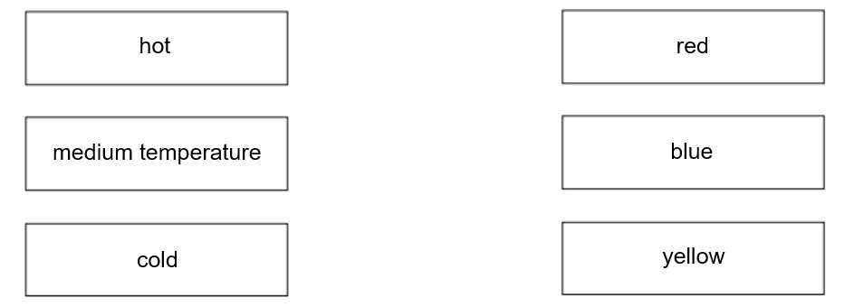
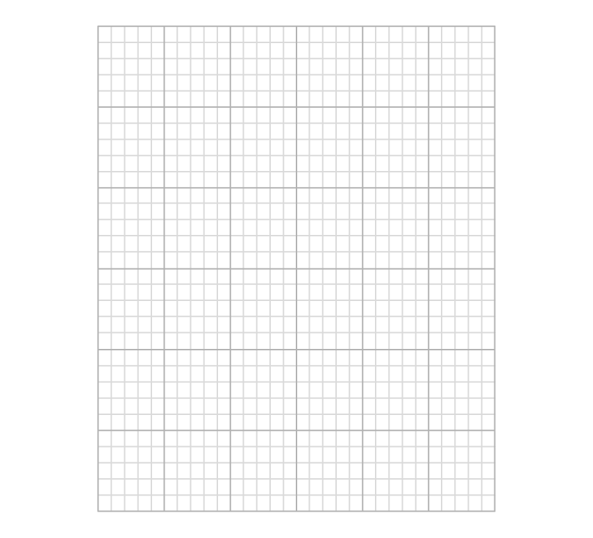
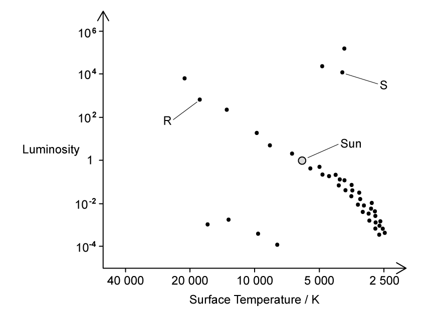
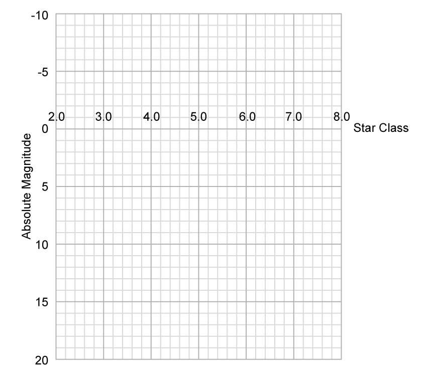

# Exam Questions — Stellar Evolution
**9. Astrophysics** · Edexcel IGCSE Physics (Modular) (4XPH1) — 24/Unit 2
> Source: [https://www.savemyexams.com/igcse/physics/edexcel/modular/24/unit-2/topic-questions/astrophysics/stellar-evolution/exam-questions/](https://www.savemyexams.com/igcse/physics/edexcel/modular/24/unit-2/topic-questions/astrophysics/stellar-evolution/exam-questions/) · 18 questions · total 157 marks

## Q1 — easy — 7 marks · exam-questions

### 1() — 3 marks — command: add — structured
The sentence gives information about the life cycle of a star.

Add words from the box in the gaps to make a sentence that is correct.

| **electron             supernova             giant             dwarf             momentum            neutron** |
|---|

A very dense .................................. star is left behind when a large red .................................. star blows up in an explosion called a ..................................

### 2() — 1 mark — multiple_choice
Which of the following statements is a property used to classify stars?
- **A.** Radius
- **B.** Distance from the Earth
- **C.** The times when it is visible to observers on Earth
- **D.** Colour

### 3() — 3 marks — command: draw — structured
Draw lines between the colour and the temperature to show the correct colour and temperature of the stars.

## Q2 — easy — 5 marks · exam-questions

### 1() — 2 marks — command: state — structured
This paragraph is from a website.

| *A star forms when enough dust and gas are pulled together. Masses smaller than a star may also be formed when dust and gas are pulled together.* |
|---|

(i) State the name of the force that pulls the dust and gas together.

**(1)**

(ii) State the name of the *mass smaller than a star that may form when the gas and dust are pulled together*.

**(1)**

### 2() — 3 marks — command: label — structured
The diagram shows part of the life cycle of a star with a similar mass to the Sun.

| **black dwarf          nebula          fusion          white dwarf          main sequence star** |
|---|

Use words from the box to label the stages in the life cycle.

## Q3 — easy — 4 marks · exam-questions

### 1() — 1 mark — multiple_choice
What is the absolute magnitude of a star a measure of?
- **A.** The brightness of stars if they were the same distance away from the Earth
- **B.** The temperature of stars
- **C.** The density of star clusters
- **D.** The distance the star is away from the Earth

### 2() — 3 marks — command: tick — structured
The table gives some statements about the absolute magnitude scale.

Add ticks (✔) to the table to show which three statements are correct.

| **Statement** | **Correct (✔)** |
|---|---|
| The brighter the star the larger the magnitude |   |
| The brighter the star the smaller the magnitude |   |
| The dimmer the star the larger the magnitude |   |
| The brightness of the star depends upon how much light the star emits |   |
| The brightness of the star depends upon the radius of the star |   |
| The brightness of the star depends upon how far away the star is |   |

## Q4 — easy — 10 marks · exam-questions

### 1() — 3 marks — command: describe — structured
Describe how stars are formed.

### 2() — 3 marks — command: add — structured
Add words from the box in the gaps to make the sentences correct.

| **decay          balanced          fission          resultant forces          fusion          forces** |
|---|

(i) Nuclear ...................................... releases energy inside stars.

**(1)**

(ii) A star is stable during the 'main sequence' period in its life because the ...................................... within it are ...................................... **. **

**(2)**

### 3() — 4 marks — command: complete — structured
The life cycle of a star after the 'main sequence' period depends on the size of the star.  A particular star is much larger in size than the Sun.

Complete the stages of the life cycle of this star.

## Q5 — easy — 8 marks · exam-questions

### 1() — 2 marks — command: label — structured
The Hertzsprung-Russell (HR) diagram is used to classify stars.

Label the horizontal and vertical axis of the diagram by writing in the boxes.

### 2() — 4 marks — command: identify — structured
The words in the box detail the different classifications of stars.

| **supergiants            white dwarfs          main sequence stars          giants** |
|---|

Identify the correct classification, by writing in the table below, for each of the areas A, B, C and D as shown on the HR diagram.

| **Area** | **Classification** |
|---|---|
| A |   |
| B |   |
| C |   |
| D |   |

### 3() — 2 marks — command: identify — structured
The Sun is labelled on the HR diagram.

Identify its temperature and luminosity.

luminosity of the Sun = ................... LSun

temperature of the Sun = ................... K

## Q6 — medium — 7 marks · exam-questions

### 1() — 1 mark — command: identify — structured
The diagram shows some incomplete notes about a stellar process. An astronomer left the notes to a colleague for them to decipher.

Identify the process described in the diagram.

### 2() — 1 mark — multiple_choice
The colleague wants to include some extra detail in stage 3.

Which of the following correctly describes the physical process outlined in stage 3 and the 'smaller nuclei' and 'bigger nuclei' that are mentioned?

|   | **physical process** | **smaller nucleus** | **larger nucleus** |
|---|---|---|---|
| **A** | nuclear fission | hydrogen | helium |
| **B** | nuclear fusion | helium | hydrogen |
| **C** | nuclear fission | helium | hydrogen |
| **D** | nuclear fusion | hydrogen | helium |
- **A.** 
- **B.** 
- **C.** 
- **D.** 

### 3() — 1 mark — multiple_choice
The longest stage in this process is
- **A.** stage 2
- **B.** stage 3
- **C.** stage 4
- **D.** stage 5

### 4() — 4 marks — command: multiple — structured
(i) State the name given to the star in stage 4.

**(1)**

(ii) Explain what happens in stage 4.

**(3)**

## Q7 — medium — 11 marks · exam-questions

### 1() — 4 marks — command: place — structured
The colour of visible light a star emits tells us how hot or cold it is.

The table contains the colour classifications of the visible light emitted from stars.

Place a number from 1 − 7 in each box to put them in order from hottest (1) to coolest (7).

| **Colour** | **Number** |
|---|---|
| Yellow-white |   |
| Blue |   |
| Red |   |
| Yellow |   |
| Yellow-orange |   |
| White |   |
| Blue-white |   |

### 2() — 5 marks — command: explain — structured
(i) Identify and explain the coolest stage of a star's life cycle.

**(2)**

(ii) Identify and explain the final stage and colour in the life cycle of a star similar in size to the Sun.

**(3)**

### 3() — 2 marks — command: explain — structured
Explain how stars like the Sun are formed.

## Q8 — medium — 5 marks · exam-questions

### 1() — 1 mark — multiple_choice
What are the properties of luminosity and temperature for a main sequence star?

|   | **Luminosity** | **Temperature** |
|---|---|---|
| **A** | low | low |
| **B** | low | high |
| **C** | high | low |
| **D** | high | high |
- **A.** 
- **B.** 
- **C.** 
- **D.** 

### 2() — 1 mark — multiple_choice
A Hertzsprung-Russell (H-R) diagram is a plot of luminosity against temperature for a range of stars.

One group on the H-R diagram is the main sequence.

Once hydrogen fusion has ceased in its core, the Sun (labelled S) will move to a new position on the H-R diagram above.

What is the new position of the Sun?
- **A.** 
- **B.** 
- **C.** 
- **D.** 

### 3() — 3 marks — command: describe — structured
State the letter for the position of a white dwarf on the H-R diagram and describe its temperature and luminosity in relation to the Sun.

## Q9 — medium — 8 marks · exam-questions

### 1() — 2 marks — command: describe — structured
Most of the stars in the universe are main sequence stars, including the sun.

Describe the similarities between main sequence stars.

### 2() — 2 marks — command: tick — structured
The table gives some statements about the relationship between a star's colour and its surface temperature.

Add ticks (✔) to the table to show which two statements are correct.

| **Statement** | **Correct (✔)** |
|---|---|
| red stars have a relatively high temperature |   |
| blue stars have a relatively high temperature |   |
| yellow stars have a relatively low temperature |   |
| blue-white stars have a relatively low temperature |   |

### 3() — 4 marks — command: multiple — structured
The table shows the colour and surface temperature of several known stars.

| **Colour** | **Surface Temperature (K)** | **Example** |
|---|---|---|
| red | < 3500 | Betelgeuse |
| orange | 3500 - 5000 | Aldebaran |
| yellow | 5000 - 6000 | Sun |
| yellow-white | 6000 - 7500 | Canopus |
| white | 7500 - 10 000 | Vega |
| blue-white | 10 000 - 25 000 | Rigel |
| blue | > 25 000 | 10 Lacertae |

(i) Identify a star with a temperature of 7000 K.

**(1)**

(ii) Identify a star with a temperature of 2000 K.

**(1)**

(iii) State and explain which of the stars you identified is likely to be the largest.

**(2)**

## Q10 — medium — 7 marks · exam-questions

### 1() — 2 marks — command: define — structured
Define what is meant by the **absolute magnitude scale**.

### 2() — 2 marks — command: identify — structured
Identify two statements that correctly describe the relationship between the absolute magnitude of a star and its brightness.

### 3() — 3 marks — command: write — structured
A selection of celestial objects and some information about their apparent brightness is detailed below.

| **Object** | **Information** |
|---|---|
| Venus | Venus has a higher absolute magnitude than the Moon |
| Moon | The Moon is the closest object to Earth |
| Sirius | Sirius has an apparent brightness of nearly zero |
| Faintest star | The faintest star that can be seen by the naked eye |
| Sun | The Sun is the brightest star as viewed from Earth |
| Faintest object | The faintest object that can be seen by the naked eye |

Write each object into the correct place on the apparent brightness scale.

## Q11 — medium — 10 marks · exam-questions

### 1() — 4 marks — command: complete — structured
The Hertzsprung-Russell diagram is shown below.

Label the axis and complete the missing numbers on the scale.

### 2() — 4 marks — command: describe — structured
State and describe the type of star each of the letters A, B, C and D represent.

### 3() — 2 marks — command: multiple — structured
Add the following to the diagram.

(i) A cross (X) to show the position of the Sun.

**(1)**

(ii) Draw an arrow on the diagram to show the direction the star labelled (*) would move as it cools down and emits less energy.

**(1)**

## Q12 — medium — 10 marks · exam-questions

### 1() — 4 marks — command: multiple — structured
An amateur astronomer waits for a clear night and travels to the countryside far from any towns or cities.

She observes two stars with her telescope. One star appears blue, and the other appears red.

(i) Suggest why the astronomer waits for a clear night.

[1]

(ii) Suggest why she travels to the countryside.

[1]

(iii) Give the property of a star that can be determined from its colour.

[1]

(iv) State a difference between the two stars based on their appearance.

[1]

### 2() — 2 marks — command: state — structured
The astronomer determines that the stars have a similar absolute magnitude.

State what is meant by the term absolute magnitude.

### 3() — 4 marks — command: multiple — structured
The astronomer determines that the red star she has observed is Betelgeuse, the closest red supergiant star to Earth.

(i) Suggest whether Betelgeuse was larger or smaller than the Sun when it was a main sequence star. Explain your answer.

[2]

(iii) Describe what will happen to Betelgeuse in the final stages of its evolution.

[2]

## Q13 — hard — 16 marks · exam-questions

### 1() — 8 marks — command: explain — structured
The table shows the 5 stages of the life cycle of a star that has a similar mass to the Sun.

| **Stage 1** | Initially, there is a massive cloud of dust and gas in space. |
|---|---|
| **Stage 2** |   |
| **Stage 3** | Hydrogen nuclei join together to make helium nuclei |
| **Stage 4** |   |
| **Stage 5** | The star eventually becomes unstable. An outer layer of dust and gas is ejected leaving behind a core. The core collapses due to gravity. |

(i) State and explain what happens in stage 2 of the diagram.

Include specific references to the relationships between

- the masses of the bodies involved and the forces acting between them

  - the separation of the bodies involved and the forces acting between them

**(4)**

(ii) State and explain what happens in stage 4 of the diagram.

**(4)**

### 2() — 1 mark — multiple_choice
The timescale of stage 3 is in the order of
- **A.** 105 to 106 years
- **B.** 106 to 107 years
- **C.** 109 to 1011 years
- **D.** 1012 to 1015 years

### 3() — 2 marks — command: explain — structured
Explain why the star remains stable during stage 3 for the length of time you selected in part (b).

### 4() — 5 marks — command: contrast — structured
For stars with much larger masses than our Sun, stages 1 to 3 are almost exactly the same as lower mass stars. For the later stages, 4 and 5, the processes begin to differ.

Compare and contrast the final two stages in stars with much larger masses than our Sun and stars with similar masses to our Sun.

## Q14 — hard — 9 marks · exam-questions

### 1() — 4 marks — command: multiple — structured
The table contains information on the mass of different stars.

| **Star Name** | **Star Mass / kg** |
|---|---|
| Earth's Sun | 1.989 × 1030 |
| Proxima Centauri | 2.446 × 1029 |
| VY Canis Majoris | 3.381 × 1031 |

(i) Compare the masses of Proxima Centauri and VY Canis Majoris to the Sun.

**(1)**

(ii) Explain how these differences will affect the time these stars can remain stable.

**(3)**

### 2() — 5 marks — command: describe — structured
Describe what will happen to each of the stars after they leave the main sequence stage.

## Q15 — hard — 8 marks · exam-questions

### 1() — 2 marks — command: add — structured
#### Separate: Physics Only

A Hertzsprung‑Russell diagram shows how different astronomical objects may be classified according to their colour and absolute magnitude.

The diagram shows three stages of evolution for stars of similar mass to the Sun.

(i) Add an **S** to the Hertzsprung-Russell diagram to show the position of the Sun.

**(1)**

(ii) Star **X** has the same surface temperature as the Sun but would be brighter than the Sun if it were the same distance away from Earth as the Sun.

Add an **X** to the Hertzsprung-Russell diagram to show the position of star** X**.** **

**(1)**

(iii) Star **Y** has a hotter surface temperature than the Sun but would be dimmer than the Sun if it were the same distance away from Earth as the Sun.

Add a **Y** to the Hertzsprung-Russell diagram to show the position of star **Y**.

**(1)**

### 2() — 6 marks — command: describe — structured
Describe the evolution of stars of similar mass to the Sun.

You should refer to the temperature and brightness of the stars in your answer.

## Q16 — hard — 11 marks · exam-questions

### 1() — 6 marks — command: plot — structured
#### Separate: Physics Only

An amateur astronomer is compiling a list of stars he can see through his telescope along with their temperature, colour, absolute magnitude and brightness relative to our Sun.

His observations so far are detailed in the table.

| **Star** | **Surface Temperature (K)** | **Colour** | **Absolute Magnitude** | **Brightness relative to the Sun** |
|---|---|---|---|---|
| Betelgeuse | 3500 | red | −5.9 | 100 000 |
| Aldebaran | 3900 | orange | −0.6 | 400 |
| Sun | 5800 | yellow | 4.6 | 1 |
| Canopus | 7400 | yellow-white | −2.5 | 14 000 |
| Vega | 9600 | white | 0.6 | 40 |
| Rigel | 11 000 | blue-white | −8.1 | 120 000 |
| 10 Lacertae | 36 000 | blue | −4.4 | 25 000 |

Present the data on a suitable graph using the grid below.

### 2() — 5 marks — command: multiple — structured
Canopus has already passed through the red giant branch after exhausting all of the hydrogen in its core. The rest of the stars listed are either in their main sequence or red giant stages.

(i) On your graph, identify the following regions:

- Main sequence

  - Red giants
  - Red supergiants
  - Blue supergiants

**(4)**

(ii) Draw an arrow on your graph to show the path Canopus is likely to take in its next evolutionary stage.

**(1)**

## Q17 — hard — 13 marks · exam-questions

### 1() — 1 mark — multiple_choice
#### Separate: Physics Only

The editor of a science magazine is writing an article on the Hertzsprung-Russell diagram.

All objects on a Hertzsprung-Russell diagram emit electromagnetic radiation. The editor is particularly interested in objects R and S, as shown in the diagram.

Which of the following statements about object R and object S is correct?
- **A.** R emits radiation with a higher mean frequency than S
- **B.** R emits radiation with a longer mean wavelength than S
- **C.** S and R both emit radiation with the same intensity
- **D.** S emits radiation with a shorter mean wavelength than R

### 2() — 2 marks — command: describe — structured
Describe the relationship between the colours and values of temperature on the Hertzsprung-Russel diagram.

### 3() — 2 marks — command: suggest — structured
The editor requires more information to complete the article.

(i) The Moon is the brightest object in the night sky.

Suggest why the Moon cannot be shown on the Hertzsprung-Russell diagram.

**(1)**

(ii) Suggest why black holes are not plotted on the Hertzsprung-Russell diagram..

**(1)**

### 4() — 8 marks — command: multiple — structured
The editor plots the location of the Sun on the Hertzsprung-Russell diagram.

He states that object R will eventually move to the same position as object S someday.

(i) Comment on the validity of the editor's statement.

**(2)**

(ii) The editor wants to compare the evolutionary path of the Sun with the path of object R.

Draw the evolutionary paths of the Sun and object R on the Hertzprung-Russell diagram.

**(4)**

(iii) Explain the paths you have drawn in (ii).

**(2)**

## Q18 — hard — 8 marks · exam-questions

### 1() — 2 marks — command: complete — structured
#### Separate: Physics Only

An astronomer is collecting data for stars with a range of spectral classes and wants to plot a graph of spectral class against absolute magnitude to see if any patterns can be identified.

The data the astronomer has collected is shown in the table below.

| **Star** | **Spectral Class** | **Decimal Class** | **Absolute Magnitude** |
|---|---|---|---|
| Sun | G2 | 5.2 | 4.8 |
| Sirius B | A2 | 3.2 | 11.2 |
| Proxima Centauri | M6 |   | 15.6 |
| 61 Cygni | K5 |   | 7.5 |
| Betelgeuse | M1 |   | −5.9 |
| Rigel | B8 |   | −7.8 |
| Bellatrix | B2 |   | −2.8 |
| Vega | A0 |   | 0.6 |
| Barnard's Star | M4 |   | 13.2 |
| Procyon B | F5 |   | 13 |

Complete the data from the table using the conversion table below.

| **Spectral Class** | **Decimal Class** |
|---|---|
| O | 1 (e.g. 1.1 = O1) |
| B | 2 |
| A | 3 |
| F | 4 |
| G | 5 |
| K | 6 |
| M | 7 |

### 2() — 6 marks — command: multiple — structured
(i) On the grid below, plot a graph of absolute magnitude against star class using the data from the table in (a).

**(2)**

(ii) On your graph, indicate the following regions:

- Main sequence
- Red supergiants
- Blue supergiants
- White dwarfs

**(4)**

