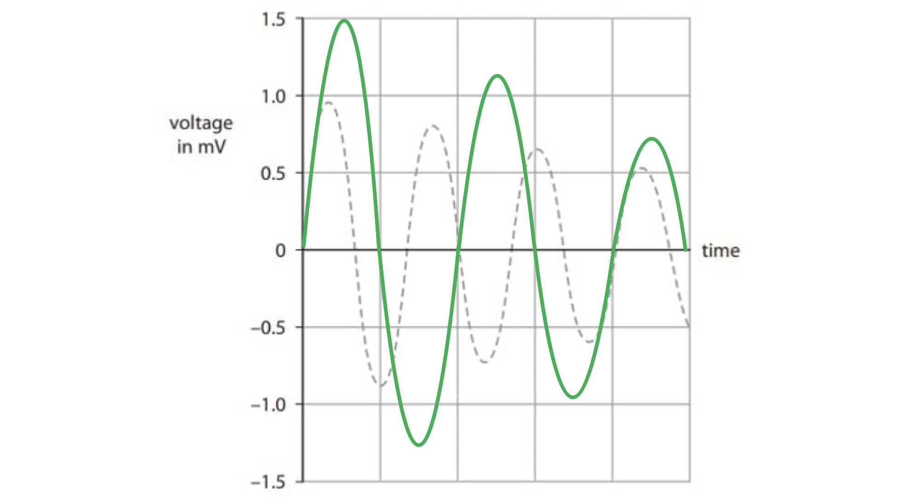
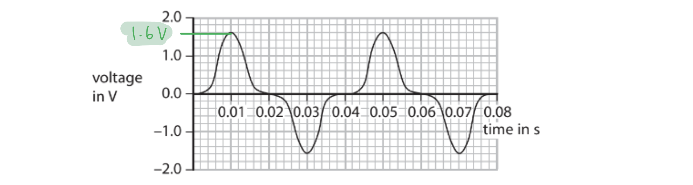
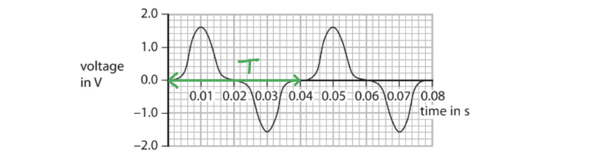
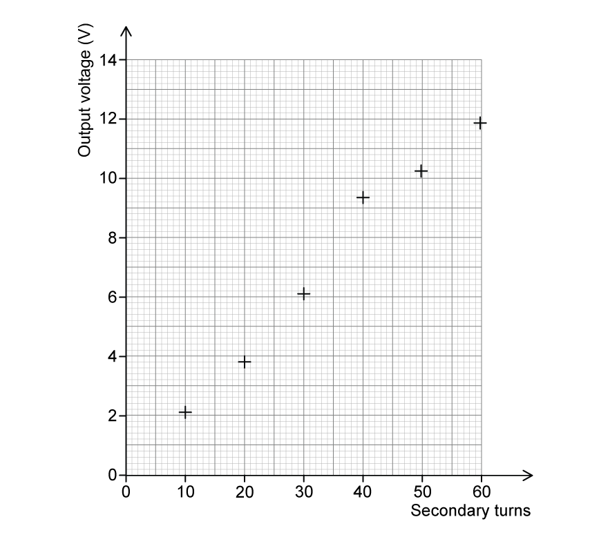
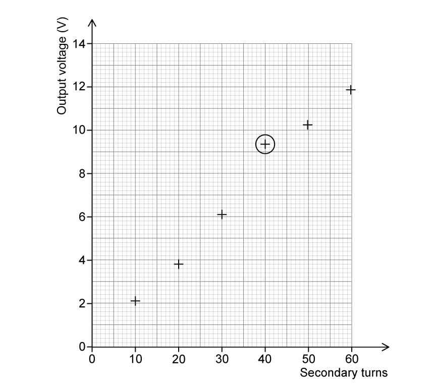
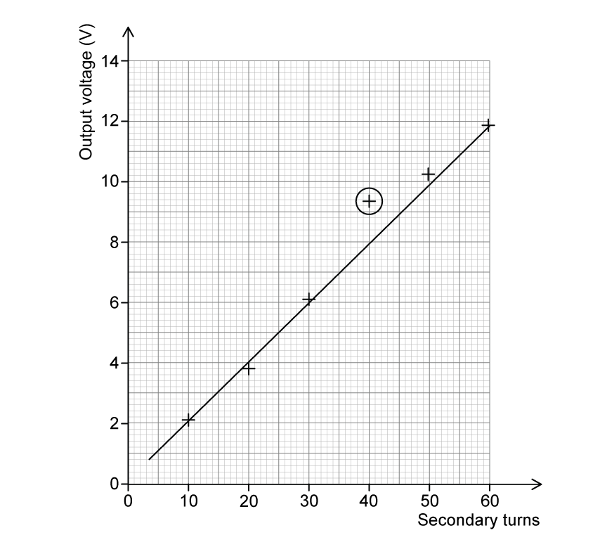

# Mark Schemes — Electromagnetic Induction
**7. Magnetism & Electromagnetism** · Edexcel IGCSE Physics (Modular) (4XPH1) — 24/Unit 2

## Q1 — easy — 1 marks · exam-questions

### 1((b)) — 1 marks
**Correct answer: B** — efficiency of transmission

**The correct answer is ****B** because:

- Stepping up the voltage reduces the current in the wires according to the power equation where *P = VI*

  - This reduces heating in the wires
- Therefore <u>efficiency is improved</u> as less energy is lost to heating

**A** is incorrect as current and voltage are inversely proportional according to the power equation, *P = VI*

**C** is incorrect as increased voltage decreases current so it decrease the energy lost as heat

**D** is incorrect as resistance in the wires will increase as the wires get hot

## Q2 — easy — 1 marks · exam-questions

### 1((c)) — 1 marks
**Correct answer: C** — transformer

**The correct answer is ****C**** **because:

- Electrical energy is transmitted through the power grid at higher and lower voltages by using transformers

  - Step down transformers reduce the voltage to make it safe for use
- Therefore **C** is the correct option

## Q3 — easy — 1 marks · exam-questions

### 7((a)) — 1 marks
**Correct answer: B** — more than the number of secondary turns

**The correct answer is ****B**** **because:

- For a transformer the ratio of the number of coils in the primary to the secondary = ratio of voltages in the primary to the secondary
- Hence the number of turns must be smaller in the primary coil compared to the secondary coil
- So, the correct answer is **B **

## Q4 — easy — 12 marks · exam-questions

### 1() — 4 marks
(a) A correctly completed table would look like:

| Soft-iron core | **D** |
|---|---|
| Primary coil | **B** |
| A.C. voltage supply | **A** |
| Secondary coil | **C** |

- *One mark for each correct answer*

**[Total: 4 marks]**

### 2() — 2 marks
(b) Describe what this current produces in part D:

- An alternating; **[1 mark]**
- Magnetic field; **[1 mark]**

**[Total: 2 marks]**

> *Make sure you memorise the key functions of the transformer.*

### 3() — 4 marks
(c) Correctly completed sentences would look like:

- When there are **fewer** turns in the primary coil than in secondary coil, the device is called a step-up transformer; **[1 mark]**
- When there are **more** turns in the primary coil than in the secondary coil, the device is called a step-down transformer; **[1 mark]**
- Step-up transformers** increase** the voltage; **[1 mark]**
- Step-down transformers **decrease** the voltage; **[1 mark]**

**[Total: 4 marks]**

> *Step-UP transfomers increase the voltage*

> *Step-DOWN transformers decrease the voltage*

### 4() — 2 marks
(d) State two advantages of transmitting electricity at high voltages rather than at low voltages:

Any **two **from:

- Smaller current in the wires; **[1 mark]**
- Smaller drop in p.d. / voltage across the cables; **[1 mark]**
- A smaller heating effect; **[1 mark]**
- Less energy wasted / transmission is more efficient; **[1 mark]**
- Thinner cables can be used; **[1 mark]**
- Fewer pylons are needed; **[1 mark]**
- Electricity can be transmitted over long(er) distances;**[1 mark]**

**[Total: 2 marks]**

## Q5 — easy — 6 marks · exam-questions

### 1() — 3 marks
(a) Correctly completed sentences are:

- Electrical power is generated at **a power station**; **[1 mark]**
- Electricity is transmitted over long distances by transmission lines that are part of **the national grid**; **[1 mark]**
- Electricity is transmitted at high voltages so that **heat loss is reduced**; **[1 mark]**

**[Total: 3 marks]**

> *Make sure you can write these sentences in full by yourself - you might be expected to describe the process of high-voltage transmission without the prompts!*

### 2() — 1 marks
**Correct answer: D** — Transformers have primary and secondary coils.

**The correct answer is ****D **because:

- Transformers can step-up (increase) and step-down (decrease) voltages

  - Therefore options **A** and** B** are both incorrect
- Transformers only work with alternating current, they do not work with direct current

  - Therefore option **C** is also incorrect

- **However, **transformers have primary and secondary coils

  - This is answer **D**

### 3() — 2 marks
c)

List the known quantities:

- Primary voltage, $V_{p}=230V$
- Primary current, $I_{p}=0.020A$
- Secondary voltage, $V_{s}=5.0V$

Substitute the values into the transformer equation:

- $I_{s}=\frac{V_{p}\timesI_{p}}{V_{s}}$
- $I_{s}=\frac{230\times0.02}{5}$ **[1 mark]**

Calculate the secondary current, $I_{s}$:

- $I_{s}=0.9A$ **[1 mark]**

**[Total: 2 marks]**

> *Always write out all your working out before putting any numbers into your calculator. This will help you to make sure that you have matched the correct numbers with the correct symbols.*

## Q6 — medium — 3 marks · exam-questions

### 2((b)) — 3 marks
Describe the structure of a step-down transformer:

Diagram **OR** description showing any **three** from:

- A primary and secondary coil; **[1 mark]**
- A soft iron core; **[1 mark]**
- The primary / input coil has more turns;**[1 mark]**
- Insulated wires / core lamination; **[1 mark]**

**[Total: 3 marks]**

## Q7 — medium — 11 marks · exam-questions

### 7((a)) — 3 marks
(a)

(i)

To state the equation linking input power and output power for the transformer:

- Input power = Output power

**   OR**

- *I**p**V**p* = *I**s**V**s*

**   OR**

- *I**in**V**in* = *I**out**V**out ***[1 mark]**

(ii)

To calculate the output current of the transformer:

List the known quantities:

- Input current, *I**p *= 2 A
- Input voltage, *V**p* = 230 V
- Output voltage, *V**s* = 110 V

Recall the equation linking power input and output of a transformer from part (i):

- *I**p**V**p* = *I**s**V**s*

Rearrange the equation to make output current, *I**s* the subject and substitute the known quantities into the equation:

- $I_{s}=\frac{I_{p}V_{p}}{V_{s}}$
- $I_{s}=\frac{2\times230}{110}$**[1 mark]**

Calculate the output current, *I**s*:

- $I_{s}=4A$ **[1 mark]**

**[Total: 3 marks]**

### 7((b)) — 3 marks
(b)

(i)

To state the equation linking input voltage, output voltage and turns ratio for the transformer:

- `fraction numerator Input space open parentheses primary close parentheses space voltage over denominator Output space open parentheses secondary close parentheses space voltage end fraction space equals space fraction numerator number space of space turns space on space the space primary space coil over denominator number space of space turns space on space the space secondary space coil end fraction`

**   OR**

- $\frac{V_{p}}{V_{s}}=\frac{n_{p}}{n_{s}}$ **[1 mark]**

(ii)

To calculate the number of turns on the secondary coil of the transformer:

List the known quantities:

- Input voltage, *V**p* = 230 V
- Output voltage, *V**s* = 110 V
- Number of turns on primary coil, *n**p* = 1200

Recall the equation from part (i):

- $\frac{V_{p}}{V_{s}}=\frac{n_{p}}{n_{s}}$

Rearrange the equation to make the number of turns on the secondary coil the subject:

- $n_{s}=\frac{n_{p}V_{s}}{V_{p}}$

Substitute in the known quantities:

- $n_{s}=\frac{1200\times110}{230}$**[1 mark]**

Calculate the number of turns on the secondary coil, *n**s*:

- $n_{s}=570$ **[1 mark]**

**[Total: 3 marks]**

### 7((c)) — 5 marks
(c)

Any **five **from:

- (A transformer) steps up / increases or steps down / decreases the voltage; **[1 mark]**
- (The) current in the (primary) coil produces a magnetic field / flux; **[1 mark]**
- (The) current changes /alternates / has a frequency of 50 Hz; **[1 mark]**
- This causes a (changing) magnetic field / flux in the (iron) core; **[1 mark]**
- The (iron) core strengthens / concentrates the magnetic field / flux; **[1 mark]**
- (This) induces a current (in the secondary coils); **[1 mark]**
- The (magnetic) field lines interact with the (secondary) coils; **[1 mark]**
- This induces a voltage in the secondary coils; **[1 mark]**
- (The) transformer won't work with a steady direct current / d.c.; **[1 mark]**

**[Total: 5 marks]**

## Q8 — medium — 5 marks · exam-questions

### 9() — 5 marks
Any **five **from:

- Voltage is increased (with a step-up transformer);**[1 mark]**
- (Therefore) current is reduced; **[1 mark]**
- When current is reduced the amount of heat lost from the wires is also reduced **OR** When current is high a large amount of heat is lost from the wires; **[1 mark]**
- (Therefore) less energy / power is lost / wasted (in the transmission of the electricity); **[1 mark]**
- (This can be calculated using the equation for power, current and resistance) *P *= *I**2**R*;**[1 mark]**
- (Transmission) cables are made more efficient through the use of a good conductor (of electricity) / a conductor with low resistance / cables with a large diameter;**[1 mark]**
- The construction of the transformer is made more efficient through the use of low resistance coils / coils wrapped on top of each other / soft iron core / laminated core;**[1 mark]**
- A step-down transformer <u>reduces voltage</u> **OR** <u>increases current</u>; **[1 mark]**

**[Total: 5 marks]**

## Q9 — medium — 5 marks · exam-questions

### 7((b)) — 3 marks
(a)

(i)

To state the equation linking primary voltage, primary current, secondary voltage and secondary current for a transformer:

- Voltage in the primary coil × Current in the primary coil = Voltage in the secondary coil × Current in the secondary coil

**   OR **

- *V**p**I**p* = *V**s**I**s* **[1 mark]**

(ii)

To calculate the secondary current, assuming that the transformer is 100% efficient:

List the known quantities:

- Primary voltage, *V**p* = 230 V
- Secondary voltage, *V**s* = 12 V
- Primary current, *I**p *= 0.25 A

Recall the equation linking primary voltage, primary current, secondary voltage and secondary current for a transformer from part (i):

- *V**p**I**p* = *V**s**I**s *

Rearrange the equation to make secondary current *I**s* the subject:

- $I_{s}=\frac{V_{p}I_{p}}{V_{s}}$

Substitute in the known quantities:

- $I_{s}=\frac{230\times0.25}{12}$**[1 mark]**

Calculate the value of the current through the secondary coil, *I**s*:

- *I**s* = 4.8 A **[1 mark]**

**[Total: 3 marks]**

> *For part (i) you can provide your answer in any rearrangement of voltage and current that you remember for a transformer. *

### 7((c)) — 2 marks
(b)

Any **two **from:

- Energy / power is lost as heat; **[1 mark]**
- The efficiency (of the transformer) is not 100%; **[1 mark]**
- So, less energy / power / voltage / current will be available (for use by the laptop); **[1 mark]**
- The resistance of the transformer increases with temperature; **[1 mark]**

**[Total: 2 marks]**

## Q10 — medium — 11 marks · exam-questions

### 8((a)) — 3 marks
(a)

(i) The type of transformer that reduces voltage:

- Step-down (transformer); **[1 mark]**

(ii) The core is made of a soft magnetic material, such as iron because:

- Magnetic field in the core alternate/changes (quickly); **[1 mark]**
- Iron loses magnetism quickly/easily; **[1 mark]**

**[Total: 3 marks]**

### 8((b)) — 3 marks
(b)

(i) The equation linking the input (primary) and output (secondary) voltages and the turns ratio of a transformer:

- $\frac{\mathrm{input} \mathrm{voltage}}{\mathrm{output} \mathrm{voltage}}=\frac{\mathrm{primary} \mathrm{turns}}{\mathrm{secondary} \mathrm{turns}}$ **OR **$\frac{V_{p}}{V_{s}}=\frac{N_{p}}{N_{s}}$ **OR **$\frac{V_{1}}{V_{2}}=\frac{N_{1}}{N_{2}}$ **OR **$\frac{V_{s}}{V_{p}}=\frac{N_{s}}{N_{p}}$ **[1 mark]**

(ii) To calculate the output voltage:

List the known quantities:

- Primary turns, *N**p* = 520
- Secondary turns, *N**s* = 30
- Input voltage (on the primary coil), *V**p* = 44 V

Rearrange the equation from part (i) to make output voltage, *V**s*, the subject:

- $V_{s}=\frac{N_{s}V_{p}}{N_{p}}$

Substitute the values:

- $V_{s}=\frac{30\times44}{520}$**[1 mark]**

Calculate the final answer:

- $V_{s}=2.5V$ ; **[1 mark]**

**[Total: 3 marks]**

> *You will see the transformer equation written in different ways, using the shorthand 'in/out', '1/2' and 'p/s' for input and output, coil 1 and 2, and the primary and secondary coils.*

> *Learn the one which makes most sense to you and stick to it, so that you get your calculations correct. If you aren't sure, check with your teacher that your version of the equation matches one of those above.*

### 8((c)) — 5 marks
(c)

(i) The vibrations cannot be heard because:

- Humans cannot hear ultrasound **OR **human hearing has an upper range **OR **the frequency is too high for humans to hear; **[1 mark]**
- The highest frequency is <u>20 000 Hz</u>; **[1 mark]**

(ii) To calculate the frequency of the pulses:

List the known quantities:

- Time period of pulses, *T* = 1.5 ms

Convert milliseconds to seconds:

- *T* = 1.5 ms = 1.5 × 10−3 s **OR **= 0.0015 s; **[1 mark]**

Use the equation linking frequency and time period:

- $f=\frac{1}{T}$
- $f=\frac{1}{0.0015}=666.67$**[1 mark]**

Round the answer to 2 significant figures:

- *f *= 670 Hz **[1 mark]**

**[Total: 5 marks]**

## Q11 — medium — 9 marks · exam-questions

### 5((a)) — 4 marks
(a)

(i) Name the type of transformer shown in the diagram:

- There are more turns on the primary coil than the secondary coil
- This is a <u>step-down</u> transformer; **[1 mark]**

(ii) The equation linking the input (primary) and output (secondary) voltages and the primary and secondary turns:

- $\frac{\mathrm{input} \mathrm{voltage}}{\mathrm{output} \mathrm{voltage}}=\frac{\mathrm{primary} \mathrm{turns}}{\mathrm{secondary} \mathrm{turns}}$ **OR **$\frac{V_{p}}{V_{s}}=\frac{N_{p}}{N_{s}}$ **OR **$\frac{V_{1}}{V_{2}}=\frac{N_{1}}{N_{2}}$ **OR **$\frac{V_{s}}{V_{p}}=\frac{N_{s}}{N_{p}}$ **[1 mark]**

(ii) To calculate the number of turns on the primary coil:

List the known quantities:

- Secondary turns, *N**s* = 100
- Input voltage (on the primary coil), *V**p* = 230 V
- Output voltage (on the secondary coil), *V**s* = 25 V

Rearrange the equation from part (i) to make primary turns, *N**p*, the subject:

- $N_{p}=\frac{N_{s}V_{p}}{V_{s}}$

Substitute the values:

- $N_{p}=\frac{100\times230}{25}$**[1 mark]**

Calculate the final answer:

- $N_{p}=920$ ; **[1 mark]**

**[Total: 4 marks]**

> *You will see the transformer equation written in different ways, using the shorthand 'in/out', '1/2' and 'p/s' for input and output, coil 1 and 2, and the primary and secondary coils.*

> *Learn the one which makes most sense to you and stick to it, so that you get your calculations correct. If you aren't sure, check with your teacher that your version of the equation matches one of those above.*

### 5((b)) — 5 marks
(b)

To explain how a transformer works:

Any **five **from:

- It steps up or down the <u>voltage</u>; **[1 mark]**
- Current (in primary coil) <u>produces</u> a magnetic field/flux;**[1 mark]**
- Current changes/alternates/has frequency of 50 Hz; **[1 mark]**
- Causes (changing) magnetic field in the core;**[1 mark]**
- Core strengthens the magnetic field; **[1 mark]**
- Field lines interact with the (secondary) coil; **[1 mark]**
- This <u>induces</u> a voltage in the secondary coil; **[1 mark]**
- Transformers need a.c/won't work with d.c ; **[1 mark]**

**An example of an answer which would score 5 marks:**

Transformers work by stepping up or stepping down **[1 mark]** an input voltage

Alternating current **[1 mark]** in the primary coil produces an alternating magnetic field **[1 mark]**. This field is strengthened by the iron core **[1 mark]**

The magnetic field interacts with the secondary coil [1 mark] and induces an alternating voltage **[1 mark]**

**[Total: 5 marks]**

> *The example answer actually has six of the marking points. You won't get more marks for really learning these answers thoroughly, but you will get full marks every time if you can quickly write down the full response after memorising it step by step.*

## Q12 — medium — 4 marks · exam-questions

### 3((b)) — 4 marks
Explain how the current produces movement of the coil:

Any **four** from:

- A current flows through the coil; **[1 mark]**
- The current induces a magnetic field (around the wires of the coil); **[1 mark]**
- The induced magnetic field interacts with the magnetic field (of the permanent magnet); **[1 mark]**
- Causing a force on the wire;**[1 mark]**
- Using Fleming's left hand rule;**[1 mark]**
- The force is directed upwards on one side of the coil and downwards on the other side of the coil (producing a turning effect on the coil); **[1 mark]**
- The commutator reverses the current every half turn (so that the current is always flowing in the same direction which causes the coil to rotate); **[1 mark]**

**[Total: 4 marks]**

## Q13 — hard — 6 marks · exam-questions

### 3((b)) — 2 marks
(a)

(i) A transformer which increases the voltage from a lower to a higher value is called:

- A step-up transformer; **[1 mark]**

(ii) The relationship between input (primary) voltage, output (secondary) voltage, primary turns and secondary turns:

- $\frac{inputvoltage}{outputvoltage}=\frac{turnsinprimarycoil}{turnsinsecondarycoil}$

**OR**

- ** **$\frac{V_{p}}{V_{s}}=\frac{N_{p}}{N_{s}}$ , where* V**p* and *V**s* = the voltage in the primary and secondary coils respectively and *N**p* and *N**s* = the number of turns in the primary and secondary coils respectively;**[1 mark]**

**[Total: 2 marks]**

### 3((b)) — 4 marks
(b)

(i) To calculate the number of turns on the secondary coil:

List the known quantities:

- Number of turns in primary coil, *N**p* = 110
- Voltage in primary coil,* V**p* = 230 V
- Voltage in secondary coil, *V**s* = 2000 V

Rearrange the equation from part (ii) to make turns in secondary coil, *N**s*, the subject:

- $N_{s}=\frac{N_{p}\timesV_{s}}{V_{p}}$ **[1 mark]**

Substitute the known quantities and calculate:

- $N_{s}=\frac{110\times2000}{230}=956.5$ **[1 mark]**

Answer to two significant figures:

- The number of turns = 957; **[1 mark]**

(ii) The reason why there is a plastic mesh on the outside of the device:

- Plastic is an electrical insulator **AND **so it protects the user from the high voltage; **[1 mark]**

**[Total: 4 marks]**

## Q14 — hard — 5 marks · exam-questions

### 11((a)) — 3 marks
(a)

(i)

To explain why a voltage is induced:

- Changing magnetic field / flux / field lines (due to the motion of the magnet); **[1 mark]**
- Changes within the coil / cuts the coil; **[1 mark]**

(ii)

To state **one **way to increase this voltage:

Any **one **from:

- Faster / more energetic movement / shaking (of the magnet will increase the size of the force); **[1 mark]**
- More turns on the coil; **[1 mark]**
- Stronger magnet / magnetic field; **[1 mark]**

**[Total: 3 marks]**

> *In part (i) it is important you understand electromagnetic induction and exactly how it works. The rate of change of magnetic field through a conductor is proportional to the voltage induced across the conductor. In your answer, you must refer to the relative motion between the coil/wire and magnetic field. It is not sufficient to just say that the magnet is moving. *

> *In part (ii) if referring to the coil you must say it is the **number **of turns that must increase and not the length of the wire or the size of the coil, or even saying more coils/loops. If referring to the magnet, you must say that the magnet or magnetic field must be stronger and not that a bigger magnetic is needed or another magnet should be added.*

### 11((b)) — 2 marks
(b)

- LED wastes less energy / produces less heat (than a filament lamp); **[1 mark]**
- Useful energy output ÷ total energy output is larger for the LED

**   OR**

- Useful output is closer to the total (energy) input; **[1 mark]**

**[Total: 2 marks]**

## Q15 — hard — 8 marks · exam-questions

### 14((a)) — 5 marks
(a)

(i)

To explain why the data logger records a varying voltage:

Any **two **from:

- Voltage / current is <u>induced</u>; **[1 mark]**
- (Because) the field in the coil is changing / field lines cut; **[1 mark]**
- Current / voltage changes direction when the magnetic field does;**[1 mark]**
- The (moving) magnet slows down causing a decrease in amplitude / voltage; **[1 mark]**

(ii)

To state which feature of the graph shows that the voltage is alternating:

- Voltage / current changes direction

**   OR **

- Graph is both positive <u>and </u>negative (voltage / current);**[1 mark]**

(iii)

To suggest why the voltage changes as shown by the graph:

Any **two **from:

- Direction of the magnet changes;**[1 mark]**
- Amount of field (lines) cut / the rate of flux cutting changes; **[1 mark]**
- Direction of flux cutting changes; **[1 mark]**
- Magnet slows down / changes speed;**[1 mark]**
- As (the movement of the magnet) gets less so does the voltage; **[1 mark]**

**[Total: 5 marks]**

### 14((b)) — 3 marks
(b)

A graph that would score 3 marks should look like this:

- The trace is alternating and diminishes (gets smaller); **[1 mark]**
- The amplitude of the trace is larger; **[1 mark]**
- The frequency of the trace is lower; **[1 mark]**

**[Total: 3 marks]**

## Q16 — hard — 7 marks · exam-questions

### 13((a)) — 4 marks
(a)

(i) Explain why the voltmeter shows a reading:

State why the voltmeter shows a reading:

- There is a voltage; **[1 mark]**

Explain the cause of this:

Any **one** from:

- There is a change in (magnetic) flux;**[1 mark]**
- The <u>magnetic field </u>(through the coil) is <u>changing</u>; **[1 mark]**
- This voltage is an <u>induced</u> voltage; **[1 mark]**

(ii) The magnet is released from a greater height. Explain how this affects the voltmeter.

State how the voltmeter is affected:

- There is a greater voltage (recorded) / greater deflection; **[1 mark]**

Explain what is causing this:

- The rate of <u>change</u> of flux / magnetic field is greater; **[1 mark]**

**[Total: 4 marks]**

### 13((b)) — 3 marks
(b)

(i) State how the voltmeter reading changes when the same magnet moves more slowly into the coil:

- The deflection / maximum voltage is <u>smaller</u>; **[1 mark]**

(ii) State how the voltmeter reading changes when the same magnet moves into a coil with more turns:

- The deflection / maximum voltage is <u>greater</u>; **[1 mark]**

(iii) State how the voltmeter reading changes when the same magnet is reversed so the S-pole enters the coil first:

- The deflection / maximum voltage is in the <u>opposite direction</u> (but has the same magnitude); **[1 mark]**

**[Total: 3 marks]**

## Q17 — hard — 8 marks · exam-questions

### 8((a)) — 2 marks
(a)

Describe two ways that the student can make the pointer move to the right:

Any **two** from:

- Reverse the magnet (put the N end into the coil); **[1 mark]**
- Reverse the connections at the ammeter; **[1 mark]**
- Move the magnet out of the coil;**[1 mark]**

**[Total: 2 marks]**

> *Remember that these changes must be made independently of one another. If two of the alterations were made at the same time, their effects would cancel out and the ammeter would still point left.*

### 8((b)) — 6 marks
(b)

(i) Complete the key for the diagram by giving the names of parts Y and Z:

- Y = magnet; **[1 mark]**
- Z = coil (of wire); **[1 mark]**

(ii) State the maximum output voltage of the dynamo:

From the graph:

- <u>1.6</u> V determined from the peak of the graph; **[1 mark]**

(iii) Calculate the frequency of the output voltage:

From the equation sheet:

- Frequency, $f=\frac{1}{T}$

Determine the time period, *T*, from the graph:

- The time period, *T*, is the time taken for one complete oscillation / cycle

- <u>0.04</u> s determined from one complete oscillation; **[1 mark]**

Substitute the known values into the equation to calculate *f:*

- $f=\frac{1}{0.04}$
- *f* = 25 (Hz) **[1 mark]**

(iv) Apart from changing the speed of the friction wheel, suggest how the output voltage of the dynamo can be increased:

- Use a stronger magnet

**OR**

- Increase the number of turns on the coil; **[1 mark]**

**[Total: 6 marks]**

## Q18 — hard — 12 marks · exam-questions

### 1() — 3 marks
> **[mark-scheme]**
> - (Step-up transformers are used to) increase the voltage / potential difference **[1 mark]**
> - Which reduces the current (flowing through the cables) **[1 mark]**
> - Reducing heating / energy loss **[1 mark]**

### 2() — 5 marks
(i) Plot the student's results on the grid:

> **[mark-scheme]**
> - Use of a suitable scale** AND** graph covers at least half of the grid **[1 mark]**
> - Secondary turns on x-axis **AND** output voltage on y-axis **[1 mark]**
> - All points plotted correctly to within $\pm$½ a small square **[1 mark]**

(ii) Circle the anomalous data point:

> **[mark-scheme]**
> - Anomalous data point identified at (40, 9.4) **[1 mark]**

(iii) Draw a line of best fit:

> **[mark-scheme]**
> - One straight continuous line drawn that passes through/near the origin **AND** An equal number of points above and below the line **[1 mark]**

### 3() — 1 marks
> **[mark-scheme]**
> The relationship shown by the student's data is:
> 
> - Directly proportional **[1 mark]**

### 4() — 3 marks
Using data from your graph, calculate the input voltage of the transformer:

- Select one data point from the line of best fit

  - $N_{s}=10$, $V_{s}=2.0$
- State the transformer equation:

$\frac{V_{p}}{V_{s}}=\frac{N_{p}}{N_{s}}$

- Rearrange to make the input voltage, $V_{p}$, the subject:

$V_{p}=\frac{N_{p}V_{s}}{N_{s}}$ **[1 mark]**

- Substitute the known values into the equation to calculate:

$V_{p}=\frac{200\times2.0}{10}$ **[1 mark]**

$V_{p}=$ $40V$**  ****[1 mark]**

> **[mark-scheme]**
> Full marks are awarded for correct calculations using any pair of values from a data point that lies on the line of best fit.
