# Exam Questions — Electromagnetic Induction
**7. Magnetism & Electromagnetism** · Edexcel IGCSE Physics (Modular) (4XPH1) — 24/Unit 2
> Source: [https://www.savemyexams.com/igcse/physics/edexcel/modular/24/unit-2/topic-questions/magnetism-electromagnetism/electromagnetic-induction/exam-questions/](https://www.savemyexams.com/igcse/physics/edexcel/modular/24/unit-2/topic-questions/magnetism-electromagnetism/electromagnetic-induction/exam-questions/) · 18 questions · total 115 marks

## Q1 — easy — 1 marks · exam-questions

### 1((b)) — 1 mark — multiple_choice — from paper 2015 January  · 2P
Electrical energy can be transmitted using a high voltage of 132 kV.

Using a high voltage increases the
- **A.** current in the wires
- **B.** efficiency of transmission
- **C.** energy lost as heat
- **D.** resistance of the wires

## Q2 — easy — 1 marks · exam-questions

### 1((c)) — 1 mark — multiple_choice — from paper 2015 January ·  2P
Electrical energy can be transmitted using a high voltage of 132 kV.

The high voltage can be reduced using a
- **A.** generator
- **B.** magnet
- **C.** transformer
- **D.** transmitter

## Q3 — easy — 1 marks · exam-questions

### 7((a)) — 1 mark — multiple_choice — from paper January 2013 · 2P
The number of turns on the primary coil of a step-down transformer is:
- **A.** the same as the number of secondary turns
- **B.** more than the number of secondary turns
- **C.** less than the number of secondary turns
- **D.** zero

## Q4 — easy — 12 marks · exam-questions

### 1() — 4 marks — command: match — structured
Transformers are used in the National Grid.

Match parts A to D with the correct descriptions below.

| Soft-iron core |   |
|---|---|
| Primary coil |   |
| A.C. voltage supply |   |
| Secondary coil |   |

### 2() — 2 marks — command: describe — structured
There is an alternating current (a.c.) in the primary coil.

Describe what this current produces in part D.

### 3() — 4 marks — command: complete — structured
The following passage is about transformers.

Complete the sentences.

When there are ......................... turns in the primary coil than in the secondary coil, the device is called a step-up transformer.

When there are ......................... turns in the primary coil than in the secondary coil, the device is called a step-down transformer.

Step-up transformers  ......................... the voltage.

Step-down transformers ......................... the voltage.

### 4() — 2 marks — command: state — structured
Transformers are used to step-up the voltage for transmission from power stations to homes and businesses.

State two advantages of transmitting electricity at high voltages rather than at low voltages.

## Q5 — easy — 6 marks · exam-questions

### 1() — 3 marks — command: complete — structured
Complete the following sentences using one of the phrases from the box below.

| efficiency is reduced the national grid a power station heat loss is reduced a transformer |
|---|

Electrical power is generated at ............................ . Electricity is transmitted over long distances by transmission lines that are part of .............................. . Electricity is transmitted at high voltages so that .............................. .

### 2() — 1 mark — multiple_choice
Transformers have many applications in appliances and the National Grid.

Select the correct statement:
- **A.** Transformers can only step-up voltages.
- **B.** Transformers can only step-down voltages.
- **C.** Transformers can work with direct current.
- **D.** Transformers have primary and secondary coils.

### 3() — 2 marks — command: calculate — structured
In a step-down transformer the primary voltage is 230 V, the primary current is 0.02 A and the secondary voltage is 5 V.

Calculate the current in the secondary coil Use the equation

$I_{s}=\frac{V_{p}\timesI_{p}}{V_{s}}$

## Q6 — medium — 3 marks · exam-questions

### 2((b)) — 3 marks — command: describe — structured — from paper Jun 2013 · 2P
Describe the structure of a step-down transformer. You may draw a labelled diagram to help your answer.

## Q7 — medium — 11 marks · exam-questions

### 7((a)) — 3 marks — command: multiple — structured — from paper June 2014 · 2P
The diagram shows a transformer that is 100% efficient.

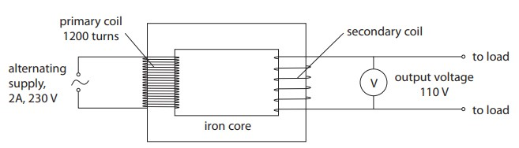

(i) State the equation linking input power and output power for the transformer.

**(1)**

(ii) Calculate the output current of the transformer.

**(2)**

output current = ............................................... A

### 7((b)) — 3 marks — command: multiple — structured — from paper June 2014 · 2P
(i) State the equation linking input voltage, output voltage and turns ratio for the transformer.

**(1)**

(ii) Calculate the number of turns on the secondary coil of the transformer.

**(2)**

number of turns = ...............................................

### 7((c)) — 5 marks — command: explain — structured — from paper June 2014 · 2P
Explain how a transformer works. In your answer, you should include the reasons for using

- two coils
- an iron core
- an alternating supply

## Q8 — medium — 5 marks · exam-questions

### 9() — 5 marks — command: explain — structured — from paper January 2016 · 2P
Explain how the transmission of electrical power is made more efficient by using step-up or step-down transformers.

## Q9 — medium — 5 marks · exam-questions

### 7((b)) — 3 marks — command: multiple — structured — from paper January 2013 · 2P
A laptop battery charger contains a step-down transformer.

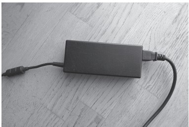

This transformer is designed to reduce the voltage from 230 V to 12 V.

The primary current is 0.25 A.

(i) State the equation linking primary voltage, primary current, secondary voltage and secondary current for a transformer.

**(1)**

(ii) Calculate the secondary current, assuming that the transformer is 100% efficient.

**(2)**

secondary current = ............................................... A

### 7((c)) — 2 marks — command: suggest — structured — from paper January 2013 · 2P
A student notices that the charger becomes warm when it is working.

Suggest how this will affect the output of the transformer.

## Q10 — medium — 11 marks · exam-questions

### 8((a)) — 3 marks — command: multiple — structured — from paper 2015 June  · 2P
The photographs show how an electric toothbrush fits on its charger.

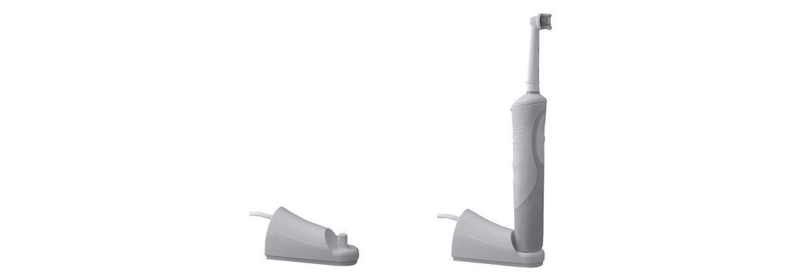

The charger and the toothbrush each have a coil of wire inside them.

The diagram shows how the two coils are linked by a U-shaped core.

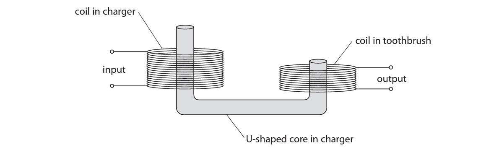

This arrangement of core and coils acts as a transformer that reduces voltage.

(i) Name the type of transformer that reduces voltage.

**(1)**

(ii) Explain why the core is made of a soft magnetic material, such as iron.

**(2)**

### 8((b)) — 3 marks — command: multiple — structured — from paper 2015 June  · 2P
(i) State the equation linking the input (primary) and output (secondary) voltages and the turns ratio of a transformer.

**(1)**

(ii) The transformer has 520 primary turns and 30 secondary turns.

The input voltage to the transformer is 44 V.

Calculate the output voltage.

**(2)**

### 8((c)) — 5 marks — command: multiple — structured — from paper 2015 June  · 2P
(i) The alternating current in the transformer has a frequency of 27 000 Hz.

The toothbrush vibrates at the same frequency when it is being charged.

Explain why these vibrations cannot be heard.

**(2)**

(ii) A circuit in the toothbrush delivers regular pulses of direct current.

There is a pulse every 1.5 ms.

Calculate the frequency of the pulses.

**(3)**

frequency =  ............................ Hz

## Q11 — medium — 9 marks · exam-questions

### 5((a)) — 4 marks — command: multiple — structured — from paper 2014 June  · 2PR
The diagram shows parts of a transformer.

The input voltage to the transformer is 230 V a.c.

The output of the transformer is 25 V a.c.

There are 100 turns on the secondary coil.

(i) Name the type of transformer shown in the diagram.

**(1)**

(ii) State the equation linking input (primary) voltage, output (secondary) voltage, primary turns and secondary turns.

**(1)**

(iii) Calculate the number of turns on the primary coil.

**(2)**

number of turns =  ...........................

### 5((b)) — 5 marks — command: explain — structured — from paper 2014 June  · 2PR
Explain how a transformer works.

In your answer, you should include the reasons for using

- two coils
- the iron core
- an alternating supply

## Q12 — medium — 4 marks · exam-questions

### 3((b)) — 4 marks — command: explain — structured — from paper Jun 2014 · 1PR
The diagram shows an electric motor and the direction of current.

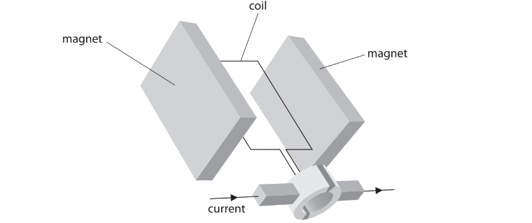

Explain how the current produces movement of the coil.

## Q13 — hard — 6 marks · exam-questions

### 3((b)) — 2 marks — command: multiple — structured — from paper 2016 June  · 2PR
The transformer supplies an output voltage of 2000 V a.c. to the wire grid.    The input voltage to the transformer is 230 V a.c.

(i) Give the name of this type of transformer.

**(1)**

(ii) State the relationship between input (primary) voltage, output (secondary) voltage, primary turns and secondary turns.

**(1)**

### 3((b)) — 4 marks — command: multiple — structured — from paper 2016 June  · 2PR
(i) There are 110 turns on the primary coil.

Calculate the number of turns on the secondary coil.

number of turns = ..........................

**(3)**

(ii) Suggest a reason why there is a plastic mesh on the outside of the device.

**(1)**

## Q14 — hard — 5 marks · exam-questions

### 11((a)) — 3 marks — command: multiple — structured — from paper June 2012 · 1P
Photograph **E **shows a rechargeable torch.

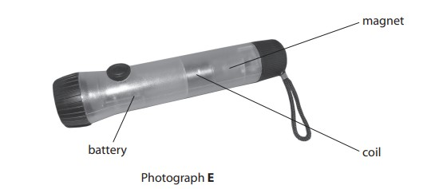

When a student shakes the torch, the magnet moves through the coil and back again.

This induces a voltage across the ends of the coil.

The voltage is used to provide current to recharge the battery.

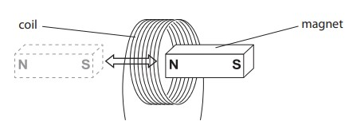

(i) Explain why a voltage is induced.

**(2)**

(ii) State **one **way to increase this voltage.

**(1)**

### 11((b)) — 2 marks — command: explain — structured — from paper June 2012 · 1P
Photograph **F **shows the components inside the torch.

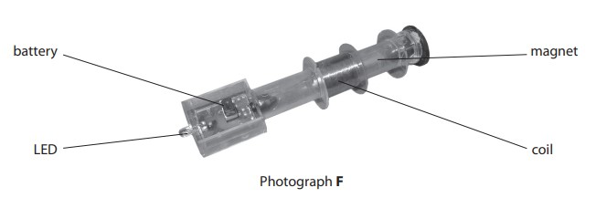

The torch uses a light-emitting diode (LED) to provide light.

The manufacturer of the torch states that

"An LED is a more efficient source of light than a filament lamp."

Explain this statement in terms of energy transfer.

## Q15 — hard — 8 marks · exam-questions

### 14((a)) — 5 marks — command: multiple — structured — from paper January 2015 · 1P
A student investigates how to produce a voltage. He hangs a magnet from a spring, above a coil that is connected to a data logger.

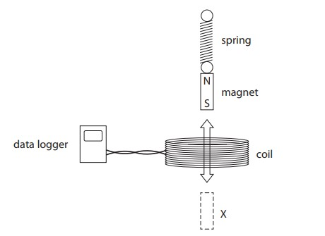

The student pulls the magnet through the coil to X and then releases it. The magnet moves up and down through the coil. The data logger produces this graph of voltage against time.

(i) Explain why the data logger records a varying voltage.

**(2)**

(ii) Which feature of the graph shows that the voltage is alternating?

**(1)**

(iii) Suggest why the voltage changes as shown by the graph.

**(2)**

### 14((b)) — 3 marks — command: sketch — structured — from paper January 2015 · 1P
The student repeats the experiment using two magnets taped together.

Compared to one magnet, these two magnets take a longer time to move up and down. The dotted line on the grid shows the original graph for one magnet.

On the same grid, sketch the graph that would be produced using two magnets.

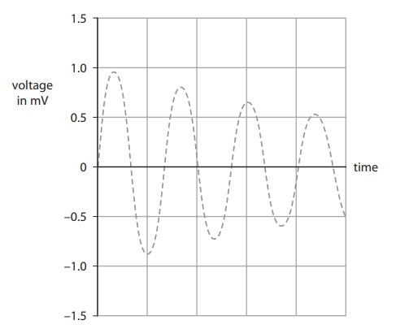

## Q16 — hard — 7 marks · exam-questions

### 13((a)) — 4 marks — command: explain — structured — from paper June 2013  · 1PR
The diagram shows a magnet held above a coil. The coil is connected to a voltmeter.

The magnet is released and falls into the coil.

(i) Explain why the voltmeter shows a reading.

**(2)**

(ii) The magnet is released from a greater height. How does this affect the voltmeter? Explain your answer.

**(2)**

### 13((b)) — 3 marks — command: state — structured — from paper June 2013 · 1PR
State how the voltmeter reading changes when the same magnet

(i) moves more slowly into the coil.

**(1)**

(ii) moves into a coil with more turns.

**(1)**

(iii) is reversed so the S-pole enters the coil first.

**(1)**

## Q17 — hard — 8 marks · exam-questions

### 8((a)) — 2 marks — command: describe — structured — from paper Jan 2016 · 1P
A student uses this apparatus to investigate electromagnetic induction.

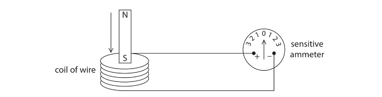

When the S pole of the magnet is moved into the coil, the pointer on the sensitive ammeter moves to the left.

Describe two ways that the student can make the pointer move to the right.

### 8((b)) — 6 marks — command: multiple — structured — from paper Jan 2016 · 1P
The student has a bicycle with a dynamo (generator) that supplies electricity for its lights. The diagram shows the dynamo. The friction wheel, W, presses against the bicycle tyre. When the student pedals, the friction wheel turns and causes part Y to rotate.

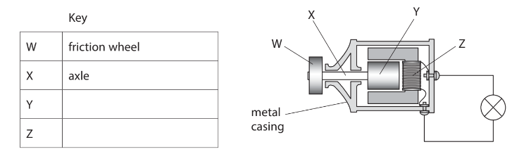

(i) Complete the key for the diagram by giving the names of parts Y and Z.

**(2)**

(ii) The graph shows how the output voltage of the dynamo varies with time as the student pedals steadily.

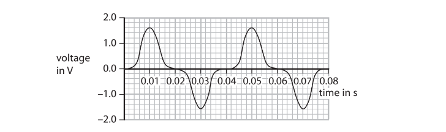

State the maximum output voltage of the dynamo.

**(1)**

Maximum output voltage = ........................... V

(iii) Calculate the frequency of the output voltage.

**(2)**

Frequency = ........................ Hz

(iv) Apart from changing the speed of the friction wheel, suggest how the output voltage of the dynamo can be increased.

**(1)**

## Q18 — hard — 12 marks · exam-questions

### 1() — 3 marks — command: explain — structured
Explain why step-up transformers are used in the large-scale transmission of electricity.

### 2() — 5 marks — command: multiple — structured
A student investigates how the number of turns on the secondary coil affects the output voltage of a transformer.

The input voltage and number of turns on the primary coil are kept constant.

The table shows the student's results.

| Secondary turns (*N*s) | Output voltage (*V*s) in V |
|---|---|
| 10 | 2.1 |
| 20 | 3.8 |
| 30 | 6.2 |
| 40 | 9.4 |
| 50 | 10.3 |
| 60 | 11.9 |

(i) Plot the student's results on the grid below.

[3]

(ii) Circle the anomalous data point.

[1]

(iii) Draw a line of best fit.

[1]

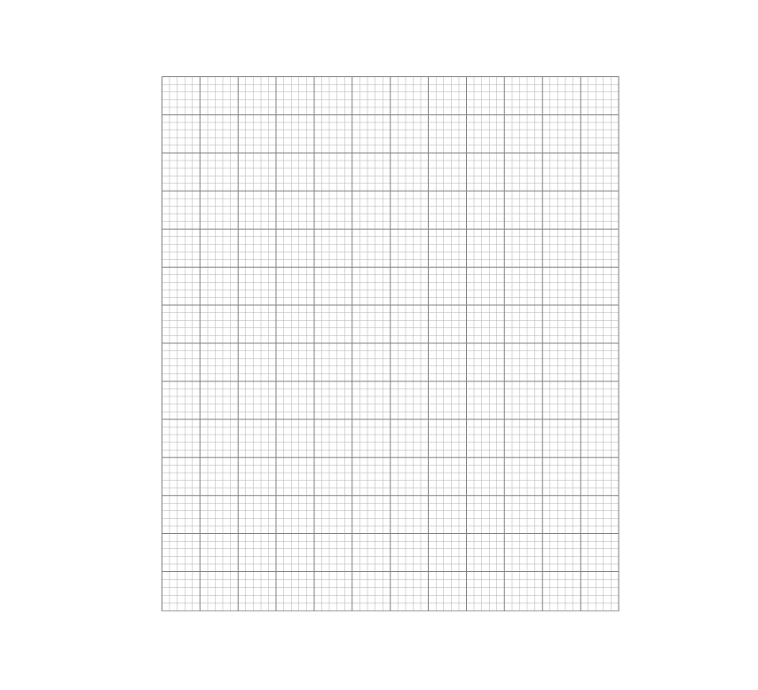

### 3() — 1 mark — command: describe — structured
Describe the relationship between the number of secondary turns and the output voltage shown in the student's data.

### 4() — 3 marks — command: calculate — structured
The primary coil of the transformer has 200 turns.

Using data from your graph, calculate the input voltage of the transformer.
