# Exam Questions — Magnetism & Electromagnetism
**7. Magnetism & Electromagnetism** · Edexcel IGCSE Physics (Modular) (4XPH1) — 24/Unit 2
> Source: [https://www.savemyexams.com/igcse/physics/edexcel/modular/24/unit-2/topic-questions/magnetism-electromagnetism/magnetism-electromagnetism/exam-questions/](https://www.savemyexams.com/igcse/physics/edexcel/modular/24/unit-2/topic-questions/magnetism-electromagnetism/magnetism-electromagnetism/exam-questions/) · 19 questions · total 102 marks

## Q1 — easy — 1 marks · exam-questions

### 2((c)) — 1 mark — multiple_choice — from paper January 2016 · 1P
Some metals and alloys are magnetic.

Which of these is magnetic?
- **A.** aluminium
- **B.** copper
- **C.** gold
- **D.** steel

## Q2 — easy — 1 marks · exam-questions

### 1((b)) — 1 mark — multiple_choice — from paper June 2013 · 1P
What does the arrow on a magnetic field line show?
- **A.** the direction of a magnetic field
- **B.** the electrostatic attraction
- **C.** the presence of an electric current
- **D.** the strength of a magnetic field

## Q3 — easy — 1 marks · exam-questions

### 2((d)) — 1 mark — multiple_choice — from paper 2016 January 1P2d · 1P
Which of these field patterns is correct?

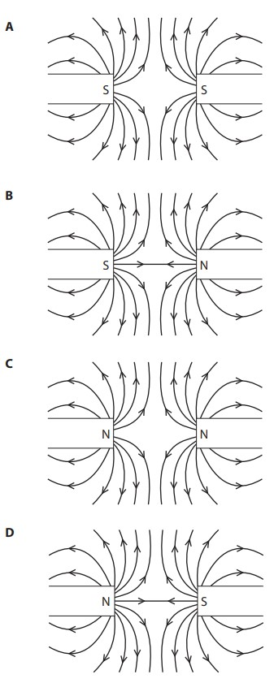
- **A.** Option A
- **B.** Option B
- **C.** Option C
- **D.** Option D

## Q4 — easy — 1 marks · exam-questions

### 1((b)) — 1 mark — multiple_choice — from paper June 2013 · 1P
What do equal spaces between magnetic field lines show about the magnetic field?
- **A.** It has uniform strength
- **B.** It goes from a S-pole to a N-pole.
- **C.** It must be caused by a current.
- **D.** It must be caused by a bar magnet.

## Q5 — easy — 5 marks · exam-questions

### 6((a)) — 2 marks — command: complete — structured — from paper June 2015 · 1P
Magnetic fields can have different shapes.

The diagram shows a bar magnet. Complete the diagram to show the shape of the field around the magnet.

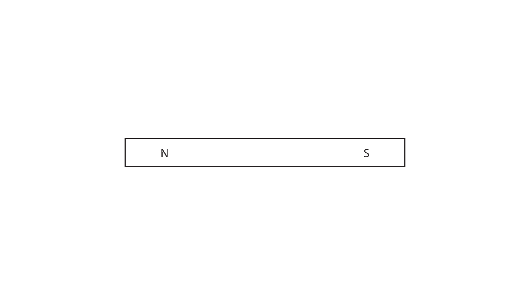

### 6((b)) — 3 marks — command: sketch — structured — from paper June 2015 · 1P
The diagram shows two bar magnets. They produce a uniform magnetic field.

On the diagram, sketch the part of the field that is uniform and label the poles.

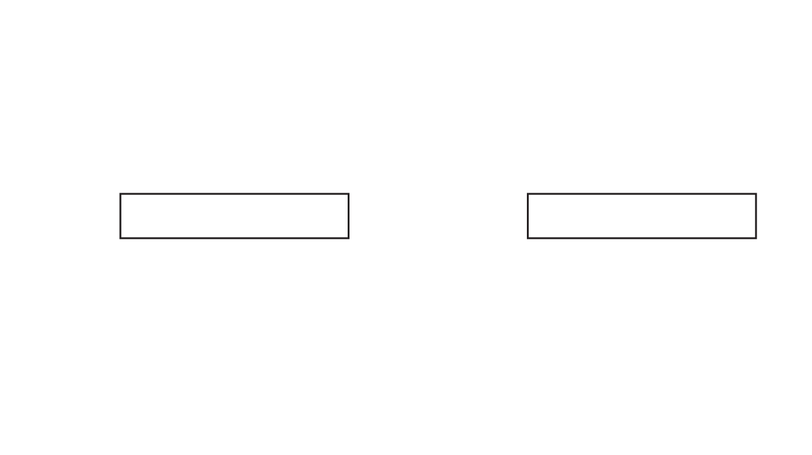

## Q6 — medium — 5 marks · exam-questions

### 9((a)) — 1 mark — command: explain — structured — from paper Jun 2016 · 1P
The diagram shows an electric motor.

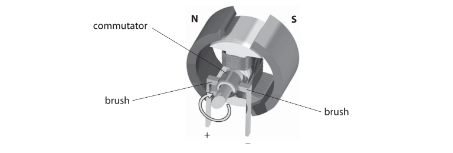

This electric motor needs a direct current (d.c).

Explain what is meant by the term direct current.

### 9((a)) — 4 marks — command: multiple — structured — from paper 2016 June  · 1P
(i) Explain the purpose of the brushes and the commutator in a d.c. motor.

**(3)**

(ii) The motor turns clockwise when the direction of the current goes from + to – . State what happens to the motor when both the magnetic field and the current are reversed.

**(1)**

## Q7 — medium — 8 marks · exam-questions

### 9((a)) — 2 marks — command: draw — structured — from paper June 2015 · 1PR
Diagram 1 shows some of the apparatus used to investigate the force on a current-carrying wire, XY, in a magnetic field.

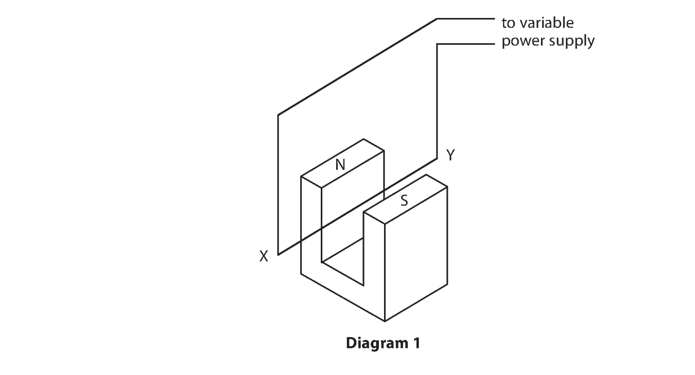

Diagram 2 shows the poles of the magnet viewed from above.

Draw the uniform magnetic field between the poles.

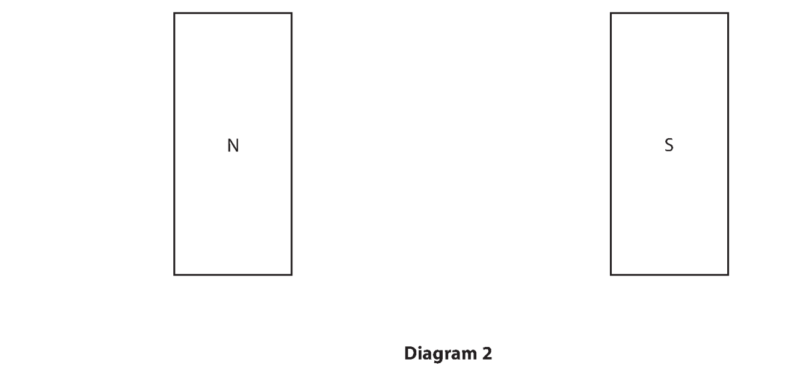

### 9((b)) — 6 marks — command: multiple — structured — from paper June 2015 · 1PR
The current-carrying wire XY is at right angles to the magnetic field. The current in the wire is 10 A.

(i) Suggest why the wire used in this investigation must be thick.

**(1)**

(ii) Explain why the wire XY experiences a force when there is a current in the circuit.

**(3)**

(iii) State two ways in which this force can be reduced.

**(2)**

## Q8 — medium — 8 marks · exam-questions

### 3((a)) — 6 marks — command: multiple — structured — from paper June 2013 · 1P
The diagram shows a piece of card and two wide bar magnets.

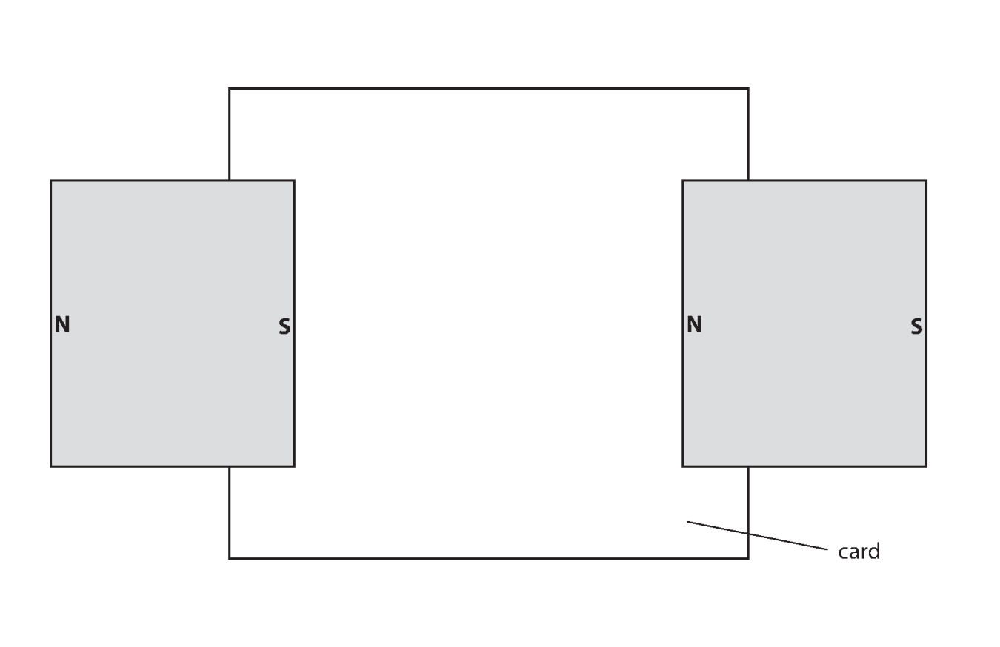

(i) Add to the diagram to show the shape and direction of the magnetic field pattern between the magnets.

**(3)**

(ii) Describe how to investigate the shape and direction of the magnetic field between the magnets.

**(3)**

### 3((b)) — 2 marks — command: describe — structured — from paper June 2013 · 1P
A metal rod, X Y, is placed in a magnetic field as shown.

Wires from a cell are connected to the ends of the rod so that there is a current from X to Y.

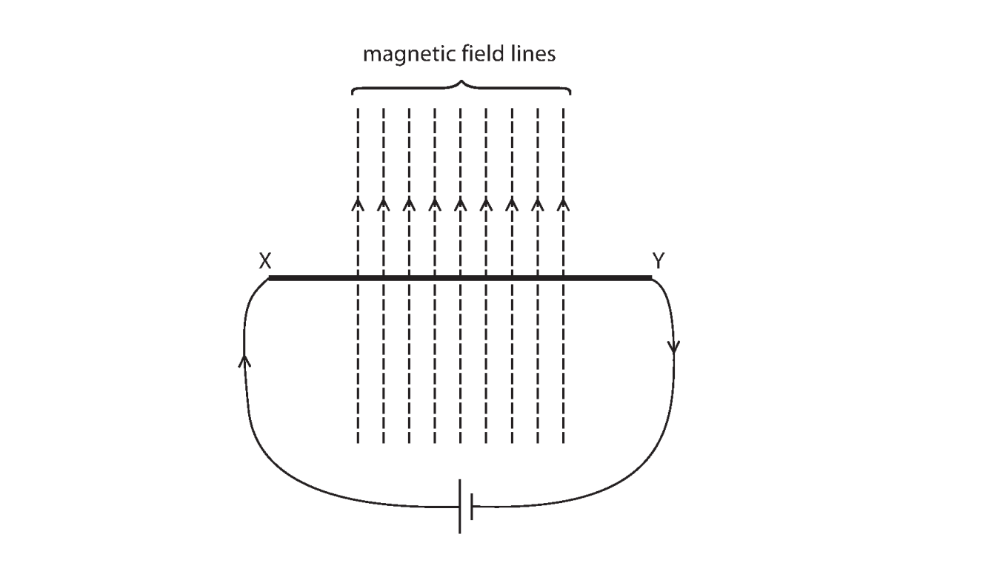

Describe the effect on the rod.

## Q9 — medium — 6 marks · exam-questions

### 4((a)) — 3 marks — command: explain — structured — from paper June 2013 · 1PR
The photograph shows a simple d.c. electric motor.

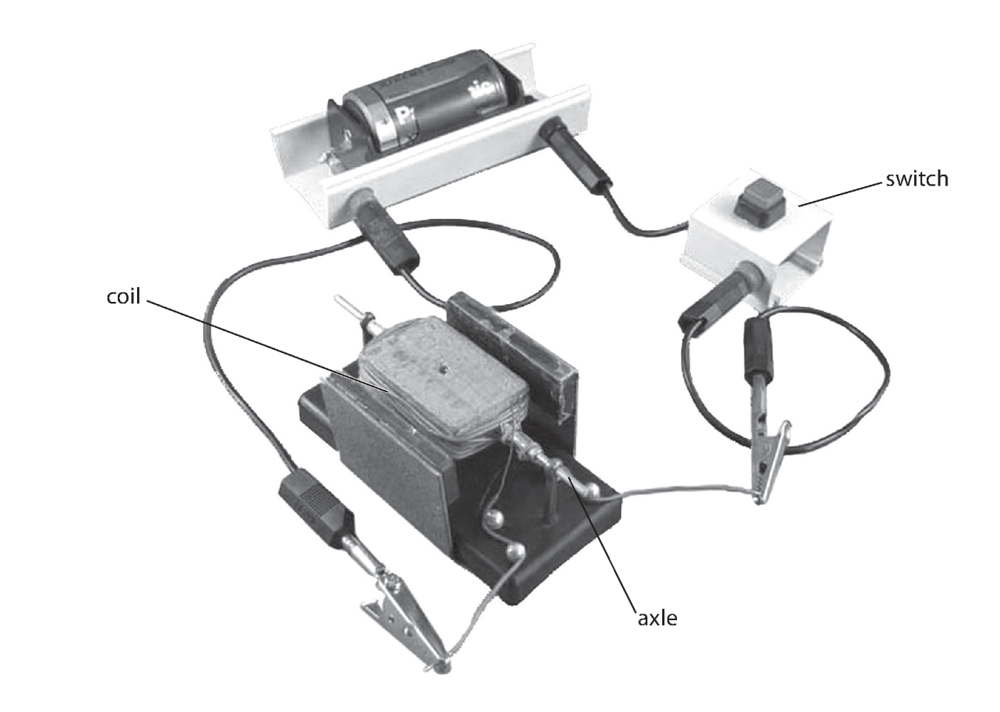

When the switch is closed the coil spins. Explain why this happens.

### 4((b)) — 3 marks — command: multiple — structured — from paper June 2013 · 1PR
(i) Describe two ways to increase the speed of rotation of the coil in this motor.

**(2)**

(ii) Suggest how to make the coil spin in the opposite direction.

**(1)**

## Q10 — medium — 5 marks · exam-questions

### 4((a)) — 2 marks — command: complete — structured — from paper January 2014 · 1P
The diagram shows the magnetic field pattern around a bar magnet.

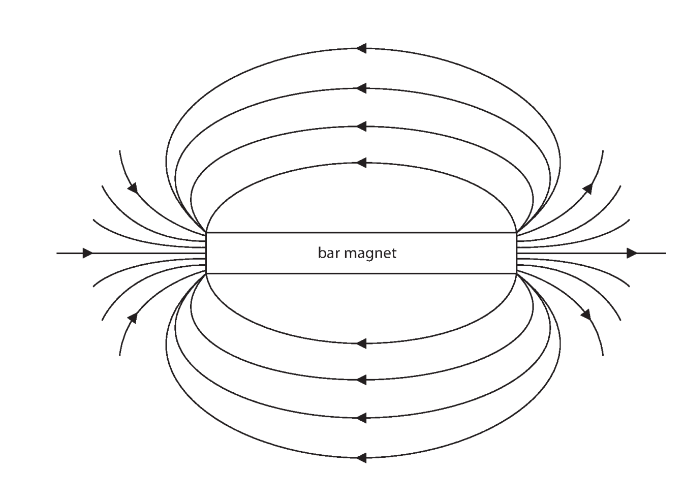

Complete the diagram above by labelling the poles on the bar magnet.

### 4((b)) — 3 marks — command: describe — structured — from paper January 2014 · 1P
Describe an experiment to investigate the shape of the magnetic field pattern of a bar magnet. You may draw a diagram to help your answer.

## Q11 — medium — 5 marks · exam-questions

### 5((a)) — 2 marks — command: explain — structured — from paper January 2012 · 1P
A magnetic field pattern can be shown using lines.

The diagram shows some magnetic field patterns.

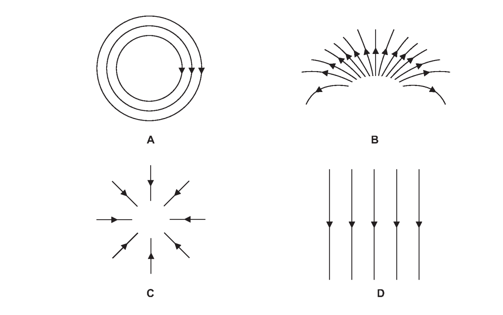

Which pattern shows a **uniform** magnetic field? Explain your answer.

### 5((b)) — 3 marks — command: explain — structured — from paper January 2012 · 1P
Explain how to produce a uniform magnetic field.

## Q12 — medium — 6 marks · exam-questions

### 4((a)) — 1 mark — command: state — structured — from paper June 2015 · 2PR
This photograph shows an electromagnetic device used to keep a door open.

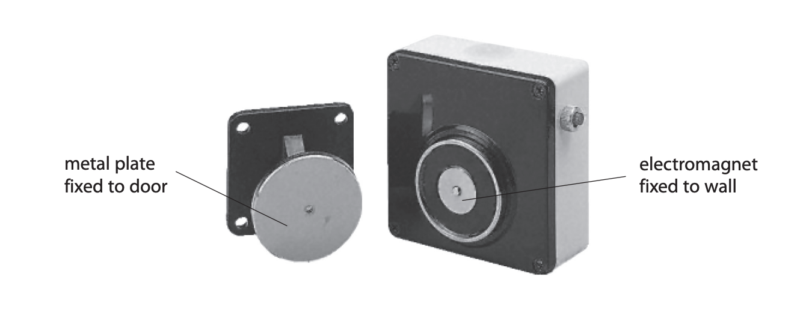

The electromagnet attracts the metal plate to hold the door open.

The electromagnet is connected to a fire alarm circuit.

When the fire alarm sounds, the door is released and it closes.

State why the metal plate is made of iron.

### 4((b)) — 3 marks — command: describe — structured — from paper June 2015 · 2PR
Describe the construction of an electromagnet. You may draw a diagram to help your answer.

### 4((c)) — 2 marks — command: describe — structured — from paper June 2015 · 2PR
Describe the changes that allow the electromagnet to release the door when the fire alarm sounds.

## Q13 — medium — 7 marks · exam-questions

### 7((a)) — 2 marks — command: explain — structured — from paper January 2014 · 2P
The diagram shows two identical metal rods placed inside a coil of wire.

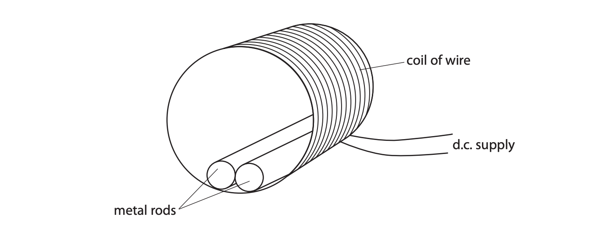

When a direct current is supplied to the coil, a magnetic field forms and the metal rods move apart. Explain why the metal rods move apart.

### 7((b)) — 3 marks — command: suggest — structured — from paper January 2014 · 2P
When the current is switched off, the metal rods return to their starting places.

Suggest what material the metal rods are made from. Explain your answer.

### 7((c)) — 2 marks — command: explain — structured — from paper January 2014 · 2P
The direct current in the coil is replaced by an alternating current.

Explain what will happen to the magnetic field.

## Q14 — hard — 8 marks · exam-questions

### 13((a)) — 4 marks — command: explain — structured — from paper June 2016 · 1PR
A student uses this apparatus to investigate what happens to a current-carrying conductor in a magnetic field.

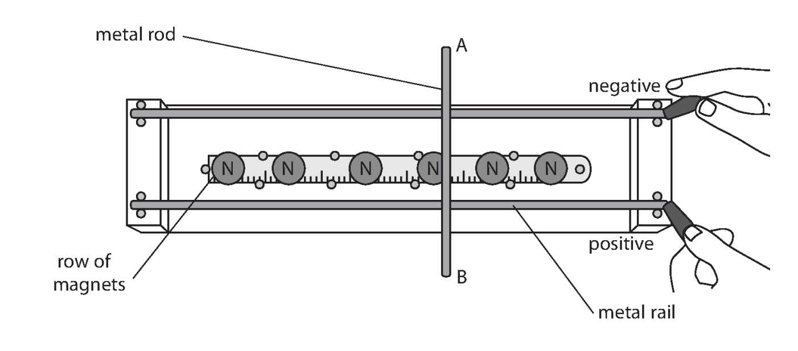

The student connects the two parallel horizontal metal rails to the positive and negative terminals of a power supply.

The metal rod AB rests across the rails and is free to move.

Explain what happens to the metal rod AB.

### 13((b)) — 4 marks — command: describe — structured — from paper June 2016 · 1PR
This diagram shows the construction of a simple loudspeaker.

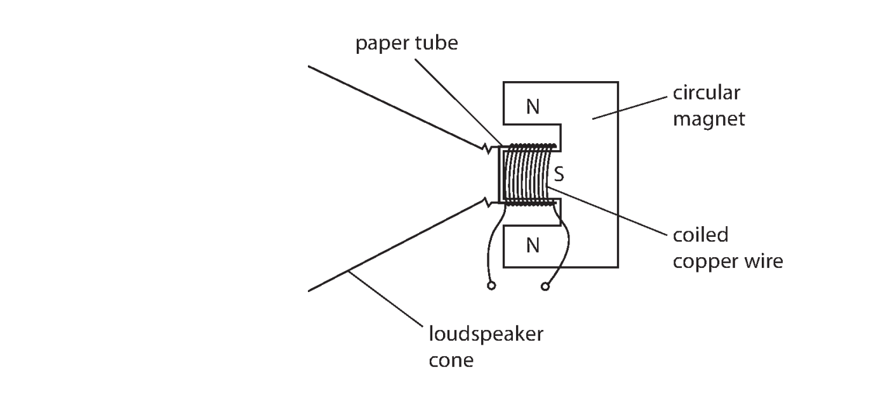

A coil of wire is wrapped around a paper tube attached to the loudspeaker cone. When there is an alternating current in the coil, the cone moves.

Describe how the alternating current generates a sound wave. You may draw a diagram if it helps your answer.

## Q15 — hard — 4 marks · exam-questions

### 7((c)) — 4 marks — command: describe — structured — from paper 2013 January  · 1P
In a radio, sound is produced by a loudspeaker. The diagram shows the construction of a loudspeaker.

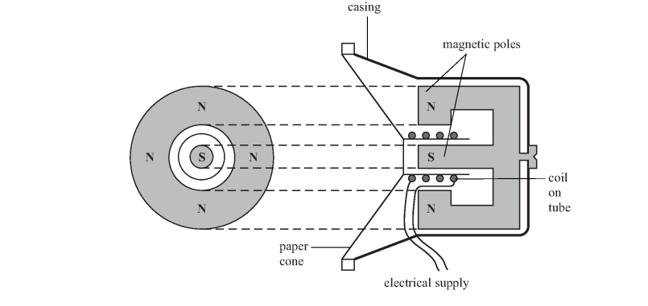

Describe how a loudspeaker uses an electrical supply to produce sound waves. ** **

## Q16 — hard — 8 marks · exam-questions

### 7((a)) — 4 marks — command: explain — structured — from paper June 2014 · 1P
The photograph shows a small electric motor.

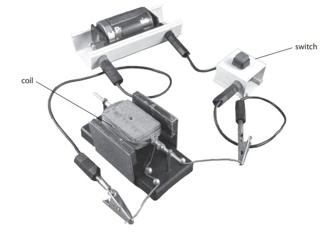

Explain why the coil starts to spin when the switch is closed.

### 7((b)) — 2 marks — command: suggest — structured — from paper June 2014 · P1
(i) Suggest how to make the coil spin in the opposite direction.

**(1)**

(ii) Suggest how to make the coil spin more slowly.

**(1)**

### 4((c)) — 2 marks — command: suggest — structured — from paper June 2013 · 1PR
In a different motor, the magnets are curved and there is a piece of iron inside the coil. The iron increases the strength of the magnetic field through the coil.

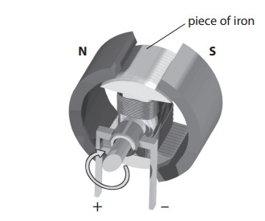

Suggest how the curved magnets and the piece of iron improve the performance of the electric motor.

## Q17 — hard — 6 marks · exam-questions

### 7((a)) — 3 marks — command: sketch — structured — from paper January 2016 · 2P
A direct current passes around a flat, circular coil as shown.

On the diagram, sketch the magnetic field caused by the current in the coil.

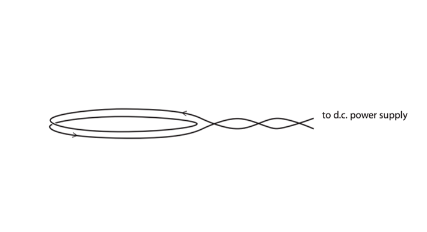

### 7((b)) — 3 marks — command: explain — structured — from paper January 2016 · 2P
The coil is suspended vertically so that it is free to swing. A second, identical coil is placed beside it.

| When direct currents pass, as shown, the two coils move together, | 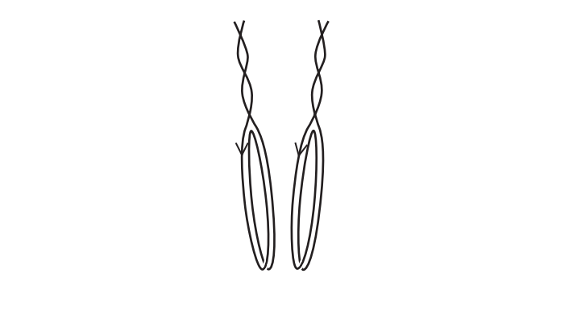 |
|---|---|
| When the current in the right-hand coil is reversed, the two coils move apart. | 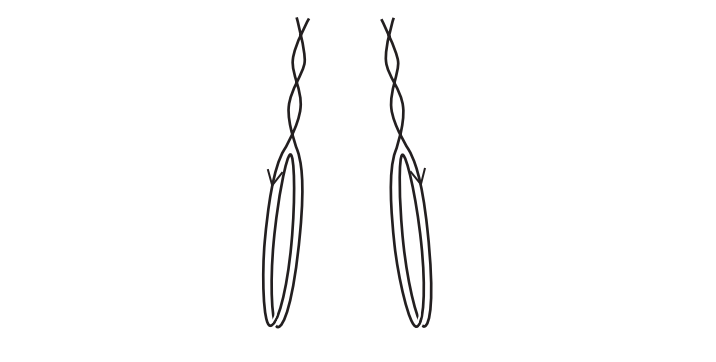 |

Explain why the coils move in this way.

## Q18 — hard — 8 marks · exam-questions

### 4((a)) — 3 marks — command: multiple — structured — from paper June 2016 · 2P
Magnetic field lines show the shape and direction of a magnetic field.

The diagram shows a cross-section through a wire placed between two magnetic poles. The wire carries electric current into the page at **X**. The shape of the magnetic field is shown.

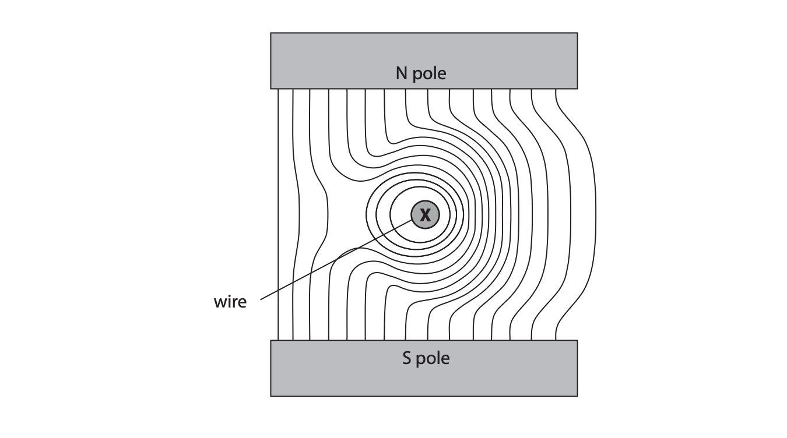

(i) Add arrows to two of the magnetic field lines to show the direction of the magnetic field.

**(1)**

(ii) Draw an arrow on the diagram to show the direction of the force on the wire.

Label this arrow **F**.

**(2)**

### 4((b)) — 2 marks — command: sketch — structured — from paper June 2016 · 2P
The wire is removed and the magnetic field between the poles changes.

Sketch the new magnetic field.

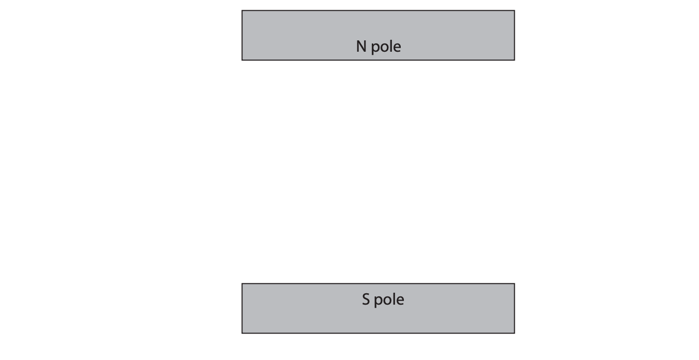

### 4((c)) — 3 marks — command: explain — structured — from paper June 2016 · 2P
Explain how you could use a plotting compass to investigate the magnetic field around a bar magnet. You may draw a diagram to help your answer.

## Q19 — hard — 9 marks · exam-questions

### 1() — 4 marks — command: multiple — structured
Diagram 1 shows a wire carrying a current located between two magnetic poles.

The direction of the current is into the page.

**Diagram 1**

(i) Draw an arrow on diagram 1 to show the direction of the force acting on the wire.

Assume that the magnetic field is uniform.

[2]

(ii) State two ways to increase the magnitude of the force on the wire.

[2]

### 2() — 3 marks — command: draw — structured
Diagram 2 shows a flat circular coil carrying a current.

**Diagram 2**

On diagram 2, draw the magnetic field produced by the current in the flat circular coil.

### 3() — 2 marks — command: determine — structured
Diagram 3 shows a negatively charged ion placed in a uniform magnetic field directed out of the page.

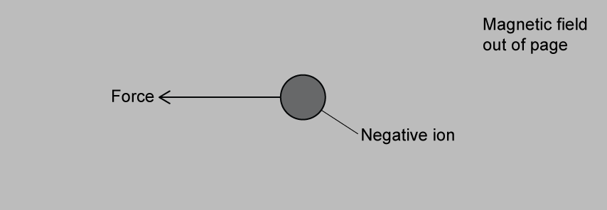

**Diagram 3**

The force exerted on the ion acts to the left due to the magnetic field.

Use the left-hand rule to determine the direction of motion of the ion in the magnetic field.
