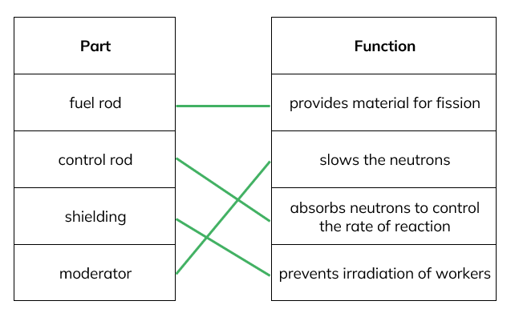
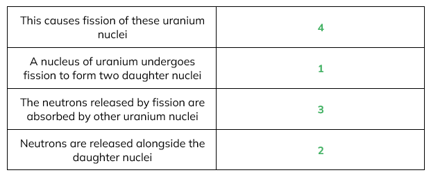
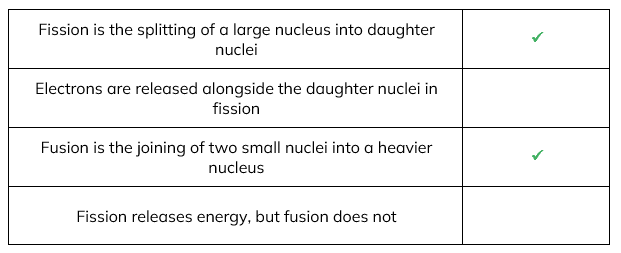
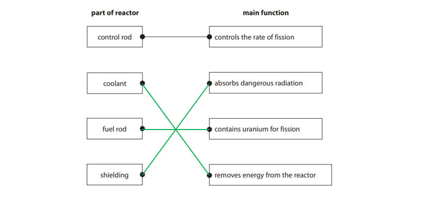
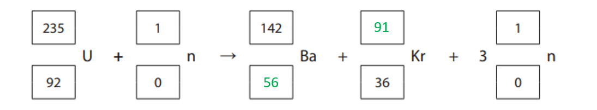
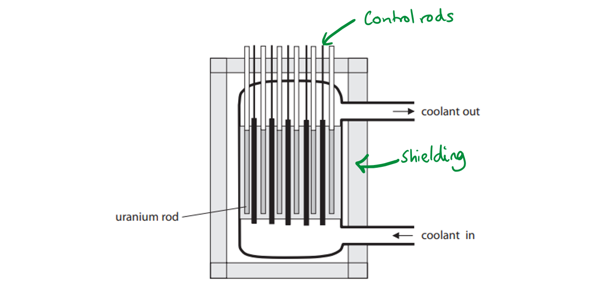
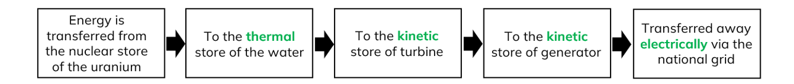
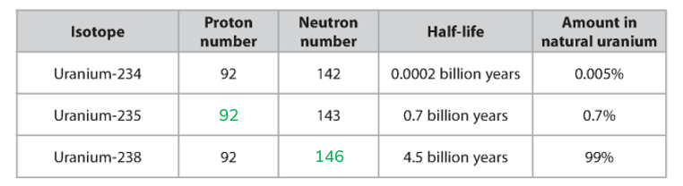

# Mark Schemes — Fission & Fusion
**8. Radioactivity & Particles** · Edexcel IGCSE Physics (Modular) (4XPH1) — 24/Unit 2

## Q1 — easy — 1 marks · exam-questions

### 1((a)) — 1 marks
**Correct answer: A** — fission

**The correct answer is ****A** because:

- The splitting of a nucleus into two daughter nuclei is known as <u>fission</u>

## Q2 — easy — 9 marks · exam-questions

### 1() — 4 marks
(a) A table which which would score 4 marks would look like:

- *One mark for each correct line*

**[Total: 4 marks]**

### 2() — 3 marks
(b)

(i) The correct sentence is:

- Fission is the **splitting** of a nucleus; **[1 mark]**

(ii) The correct sentence is:

- Fusion is the **joining** of two nucleii; **[1 mark]**

(iii) The correct sentence is:

- Fusion occurs naturally in the **Sun**; **[1 mark]**

**[Total: 3 marks]**

### 3() — 2 marks
(c) The two conditions needed for nuclear fusion are:

- High temperature; **[1 mark]**
- High pressure; **[1 mark]**

**[Total: 2 marks]**

- *Be very careful not to mix up fusion and fission:*

  - *Fusion is the** joining** of two smaller nuclei*
  - *Fission is the **splitting** of one larger nucleus*

## Q3 — easy — 6 marks · exam-questions

### 1() — 1 marks
**Correct answer: C** — the splitting of a larger nucleus into two smaller nuclei

**The correct answer is ****C** because:

- The definition of nuclear fission is the splitting of a larger nucleus into two smaller nuclei

**A** is incorrect as this was known as alchemy and is not relevant

**B** is incorrect as radioactive waste material is produced in nuclear fission

**D** is incorrect as fission gives out more energy than it takes in

### 2() — 3 marks
(a) The correct sentences are:

- Some of the **daughter** nuclei produced in nuclear fission; **[1 mark]**
- Are highly radioactive and emit **high** energy neutrons when they decay; **[1 mark]**
- Concrete **shielding **can be used to absorb the neutrons; **[1 mark]**

**[Total: 3 marks]**

### 3() — 1 marks
**Correct answer: A** — the creation of a larger nucleus from smaller nuclei

**The correct answer is ****A** because:

- The definition of fusion is the creation of a larger nucleus from smaller nuclei

**B** is incorrect as this is beta decay

**C** is incorrect as the Sun does not cool due to fission, but heats up

**D** is incorrect as fusion does not occur in the core of the Earth

### 4() — 1 marks
**Correct answer: B** — hydrogen-1

**The correct answer is B** because:

- Only hydrogen from this list can undergo fusion

The other elements would undergo fission as they have very large nuclei

## Q4 — easy — 6 marks · exam-questions

### 1() — 1 marks
(a) The element which undergoes fission in a nuclear reactor is:

- Uranium(-235); **[1 mark]**

**[Total: 1 mark]**

### 2() — 1 marks
(b)  The particle released during fission which can enable further fission reactions is:

- A neutron; **[1 mark]**

**[Total: 1 mark]**

### 3() — 4 marks
(c) A correctly completed table would look like:

- *One mark for each correctly numbered sentence*

**[Total: 4 marks]**

> *Written out in order these sentences are:*

1. *A nucleus of uranium undergoes fission to form two daughter nuclei*
2. *Neutrons are released alongside the daughter nuclei*
3. *The neutrons released by fission are absorbed by other uranium nuclei*
4. *This causes fission of these uranium nuclei*

> *This is a common exam question - make sure you can write this explanation out on your own!*

## Q5 — easy — 8 marks · exam-questions

### 1() — 4 marks
(a) The correct sentences are:

- The moderator in a nuclear reactor is often made from **graphite**;** ****[1 mark]**
- The moderator is used to **slow** neutrons; **[1 mark]**
- The control rods in a nuclear reactor are often made from **boron**;** ****[1 mark]**
- The control rods are used to **absorb** neutrons; **[1 mark]**

**[Total: 4 marks]**

### 2() — 2 marks
(b) A table with ticks in the correct boxes would look like:

- *One mark for each correct tick*

**[Total: 2 marks]**

> *For the second statement, this is incorrect as it is neutrons which are released, not electrons.*

> *For the fourth statement, this is incorrect as both fission and fusion release energy*

### 3() — 1 marks
**Correct answer: D** — high temperature and high pressure

**The correct answer is**** D** because:

- Nuclear fusion requires high temperature and pressure

### 4() — 1 marks
(d) State why these conditions are necessary:

- To overcome electrostatic repulsion; **[1 mark]**

**[Total: 1 mark]**

## Q6 — medium — 1 marks · exam-questions

### 1((b)) — 1 marks
**Correct answer: A** — Absorbing some of the neutrons

**The correct answer is ****A** because:

- The control rods are made of boron which absorbs neutrons
- Therefore the role of the control rods is to absorb some of the neutrons

## Q7 — medium — 8 marks · exam-questions

### 2((a)) — 2 marks
(a)

A diagram which would score two marks is:

- **3 lines correct = 2 marks**
- **1 or 2 lines correct = 1 mark**

**[Total: 2 marks]**

### 2((b)) — 1 marks
(b)

In a fission reaction, energy is transferred from the nuclear store of the particles to the:

- Kinetic store; **[1 mark]**

**[Total: 1 mark]**

### 2((c)) — 2 marks
(c)

Describe the role of the moderator in a fission reactor:

- To slow neutrons / to reduce the kinetic energy of neutrons; [1 mark]

Explain the role of the moderator in a fission reactor:

Any **one** from:

- (Which) allows fission to continue; **[1 mark]**
- (Which) causes (induced) fission; **[1 mark]**
- (So) neutrons can be absorbed by <u>uranium</u>; **[1 mark]**

**[Total: 2 marks]**

### 2((d)) — 3 marks
(d)

To explain what is meant by controlled nuclear fission in terms of neutrons:

Any** three** from:

- Each fission (of a nucleus) is caused by a single neutron / a nucleus splits when a neutron has been absorbed; **[1 mark]**
- Each fission releases more than one neutron; **[1 mark]**
- Excess neutrons can speed up the reaction; **[1 mark]**
- (More) fissions release excess energy; **[1 mark]**
- Control rods absorb neutrons; **[1 mark]**
- Control rods regulate the rate of fussion/reaction; **[1 mark]**

**[Total: 3 marks]**

Answers which talk about 'blocking' neutrons gain no credit, however 'control rods speed up or slow down the rate of fission' would be worth a mark.

## Q8 — medium — 4 marks · exam-questions

### 1((a)) — 3 marks
(a)

To describe what happens when nuclear fission of uranium occurs:

Any **three** from:

- The neutron is absorbed by (a uranium) nucleus; **[1 mark]**
- (Uranium nucleus) splits; **[1 mark]**
- (Producing 2) daughter nuclei; **[1 mark]**
- Extra neutrons are released; **[1 mark]**

**[Total: 3 marks]**

> *Accept the following:*

- *The neutron collides with / hits / bombards the nucleus for the first marking point*
- *The nucleus 'breaks up' for the second marking point*

> *For the final two points the wording must be plural - daughter nucl**ei** and neutron**s** released. Daughter cells cannot gain a mark.*

### 1((b)) — 1 marks
(b)

The energy store that gives the daughter nuclei high speed is:

- Kinetic energy store; **[1 mark]**

**[Total: 1 mark]**

## Q9 — medium — 7 marks · exam-questions

### 12((a)) — 5 marks
(a)

To describe nuclear fission and how the chain reaction is controlled:

Any **five** from:

- Nucleus absorbs / hit by neutron; **[1 mark]**
- Nucleus splits into (two) fragments / parts / daughter atoms / daughter nuclei; **[1 mark]**
- Extra neutrons are released; **[1 mark]**
- (Kinetic) energy is released; **[1 mark]**
- Released neutrons hit further (uranium) nuclei; **[1 mark]**
- Moderator slows down the neutrons / makes it more likely for a neutron to be absorbed; **[1 mark]**
- Control rods absorb extra neutrons; **[1 mark]**
- Idea that control rods help prevent a “runaway” chain reaction;**[1 mark]**

**[Total: 5 marks]**

> *If the wrong particle is consistently used, for example 'electron' instead of 'neutron' the maximum marks awarded can be 4*

> *Cells or molecules are not acceptable terms.*

### 12((b)) — 1 marks
(b)

Name the energy store that is filled after the nucleus splits in a fission reaction:

- Kinetic energy store;**[1 mark]**

**[Total: 1 mark]**

### 12((c)) — 1 marks
(c)

The shielding improves safety by:

- Absorbing radiation / particles / energy **[1 mark]**

**[Total: 1 mark]**

'Stops radiation / particles from escaping' would gain 1 mark.

'Radioactivity escaping' would gain no marks.

## Q10 — medium — 9 marks · exam-questions

### 11((a)) — 2 marks
(a)

A completed equation that would score 2 marks is:

- Proton number of Barium = 56; **[1 mark]**
- Nucleon number of Krypton = 91; **[1 mark]**

**[Total: 2 marks]**

### 11((b)) — 3 marks
(b)

To explain how nuclear fission can lead to a chain reaction:

Any **three** from:

- Neutrons are released; **[1 mark]**
- Neutrons are slowed by moderator; **[1 mark]**
- Neutrons can be absorbed by other (uranium) nuclei; **[1 mark]**
- Neutrons cause further fission reactions; **[1 mark]**

**[Total: 3 marks]**

### 11((c)) — 4 marks
(c)

(i) A labelled diagram which would score 2 marks is:

- Control rods labelled correctly; **[1 mark]**
- Shielding labelled correctly; **[1 mark]**

(ii) To explain why the shielding is needed:

Any **two** from:

- Reactor material / waste is radioactive; **[1 mark]**
- (Radiation) ionises cells / tissues / organs / body / causes cancer; **[1 mark]**
- Radiation is very penetrating; **[1 mark]**

**[Total: 4 marks]**

## Q11 — hard — 8 marks · exam-questions

### 4((a)) — 5 marks
(a)

(i) The name of a fuel that could be used is:

- Uranium (U) **OR **Plutonium (Pu); **[1 mark]**

(ii) Explain what is meant by fission products:

- (Particles) formed after fission / after uranium breaks up; **[1 mark]**

Give an example of a fission product:

Any **one** from:

- Neutron; **[1 mark]**
- Daughter nuclei; **[1 mark]**
- Named products such as Xenon; **[1 mark]**

(iii) Explain why it is important to contain these fission products:

Any **one** from:

- The products are (still) radioactive; **[1 mark]**
- The products emit ionising radiation; **[1 mark]**
- The products are harmful to people / the environment; **[1 mark]**

Explain why this containment must be for a long time:

- The products last for a long time / have a long half-life; **[1 mark]**

**[Total: 5 marks]**

### 4((a)) — 3 marks
(b)

(i) The function of a moderator in a nuclear reactor is:

- To slow down the neutrons; **[1 mark]**

(ii) To explain why it is dangerous to remove most of the control rods from the reactor:

Any **two** from:

- Fewer neutrons would be absorbed; **[1 mark]**
- Fission rate would increase / reactor would become critical; **[1 mark]**
- Too much energy would be produced; **[1 mark]**
- Meltdown of the core / reactor could occur; **[1 mark]**

**[Total: 3 marks]**

In part (ii) students commonly answer 'it turns into a bomb'. This is incorrect!

## Q12 — hard — 11 marks · exam-questions

### 6((a)) — 1 marks
(a)

Name the process shown in the diagram:

- Nuclear <u>fission</u>; **[1 mark]**

**[Total: 1 mark]**

### 6((b)) — 3 marks
(b)

Explain how the process shown in the diagram can lead to a chain reaction:

- The <u>nucleus</u> splits; **[1 mark]**
- Releasing <u>neutrons</u>; **[1 mark]**
- Which hit / collide with different uranium <u>nuclei</u>; **[1 mark]**

**[Total: 3 marks]**

You need to be very specific with the terminology to get the marks for this question. You need to talk specifically about the nuclei, not more generally about atoms. Remember that fission is a nuclear reaction, therefore we are looking specifically about the nuclei of atoms.

### 6((c)) — 2 marks
(c)

Explain the energy transfer taking place in this reaction:

- Energy is transferred <u>from</u> the <u>nuclear</u> energy <u>store</u> of the uranium <u>nuclei</u>; **[1 mark]**
- <u>To</u> the <u>kinetic</u> energy <u>store</u> of the <u>neutrons</u> and the <u>daughter nuclei</u>; **[1 mark]**

**[Total: 2 marks]**

### 6((d)) — 5 marks
(d)

(i) The purpose of a moderator is:

- To slow down the <u>neutrons</u>; **[1 mark]**

(ii) **One** mark for each correct box:

**[Total: 5 marks]**

## Q13 — hard — 16 marks · exam-questions

### 12((a)) — 5 marks
(a)

(i) A completed table which would score 2 marks would look like:

- Proton number of uranium is always 92

  - Therefore proton number of uranium-235 is <u>92</u>; **[1 mark]**
- Neutron number = mass number − proton number

  - 238 − 92 = 146
  - Therefore neutron number of uranium-238 is 146; **[1 mark]**

(ii) To explain what is meant by the term half-life:

- The time taken; **[1 mark]**
- for (radio)activity to halve

**OR**

- for half of (radioactive) nuclei / atoms / isotope to decay; **[1 mark]**

(iii) Suggest why uranium-238 is the most common isotope of uranium:

- Uranium-238 has the longest half-life (4.5 billion years)

**OR**

- The other isotopes of uranium have decayed more quickly; **[1 mark]**

**[Total: 5 marks]**

### 12((b)) — 3 marks
(b) The products of the fission of uranium nuclei are:

Any** three** from:

- Neutrons; **[1 mark]**
- Daughter nuclei; **[1 mark]**
- A correctly named daughter nucleus e.g. strontium; **[1 mark]**
- A different correctly named daughter nucleus e.g. xenon; **[1 mark]**
- Gamma (radiation) / thermal energy; **[1 mark]**

**[Total: 3 marks]**

### 12((c)) — 3 marks
(c)

(i) The purpose of the moderator is:

Any **one** from:

- To slow down the neutrons; **[1 mark]**
- To increase the rate of fission; **[1 mark]**
- To increase the absorption of neutrons by uranium / fuel; **[1 mark]**

(ii) When a control rod is removed from the reactor:

Any **two** from:

- Rate of reaction increases; **[1 mark]**
- Fewer neutrons absorbed by control rod / more neutrons collide with uranium; **[1 mark]**
- Temperature increases; **[1 mark]**

**[Total: 3 marks]**

### 12((d)) — 5 marks
(d) To explain why it is difficult to make the surrounding area safe again after a serious nuclear accident:

Any **five** from:

- The radiation is harmful / presents a danger to life; **[1 mark]**
- The radioactive material has high activity levels; **[1 mark]**
- The radioactive material has long half-life / half-lives; **[1 mark]**
- It can be difficult for (emergency) workers to access the area, making it more difficult to clean up; **[1 mark]**

  - For example they may need short safe working times or protective clothing
- There will be a need for special handling equipment (which may be in shorter supply / expensive) / there is a difficulty in removing material; **[1 mark]**
- There may need to be an extensive time for radiation levels to reduce / a large exclusion zone which is not safe to enter (for long periods); **[1 mark]**
- Radioactive material can mix with the local environment and be hard to remove; **[1 mark]**

  - For example, soil, plants, water, air
- Material may be spread far beyond the accident site by fire, wind or water; **[1 mark]**

**[Total: 5 marks]**

## Q14 — hard — 15 marks · exam-questions

### 1() — 5 marks
(a) Describe the process of nuclear fission:

- The fuel rods are made of uranium(-235); **[1 mark]**
- A nucleus of uranium absorbs a neutron; **[1 mark]**
- The nucleus formed splits because it is unstable; **[1 mark]**
- The nucleus splits into two smaller nuclei called daughter nuclei **AND** two or three neutrons; **[1 mark]**
- The energy released is transferred into the kinetic energy store of the fission products; **[1 mark]**

**[Total: 5 marks]**

### 2() — 6 marks
(b) Explain the role of the moderator and the control rods:

- The moderator slows down neutrons; **[1 mark]**
- This enables them to be absorbed by other nuclei to cause a chain reaction; **[1 mark]**
- The moderator is often made from graphite **OR** water; **[1 mark]**
- The control rods absorb neutrons; **[1 mark]**
- This enables the rate of reaction to be controlled **OR** the chain reaction to be stopped; **[1 mark]**
- The control rods are often made of boron; **[1 mark]**

**[Total: 6 marks]**

### 3() — 4 marks
(b) Explain how a chain reaction can occur in the reactor:

- The uranium nucleus absorbs a neutron; **[1 mark]**
- The nucleus splits; **[1 mark]**
- Releasing neutrons; **[1 mark]**
- These are absorbed by more uranium nuclei; **[1 mark]**

**[Total: 4 marks]**

> *You must talk about **nuclei**, not atoms of uranium to get the marks.*

## Q15 — hard — 6 marks · exam-questions

### 1() — 1 marks
**Correct answer: C** — The products of fusion include daughter nuclei and neutrons

**The incorrect answer is ****C** because:

- It is the products of **fission** which include daughter nuclei and neutrons

Be very careful to not confuse fission and fusion!

### 2() — 1 marks
**Correct answer: B** — The rate of reaction of fusion can be increased using neutrons

(b) **The incorrect answer is ****B** because:

- The rate of reaction of **fission** can be increased using neutrons

### 3() — 1 marks
(c) State and explain which quantity is greater, *m*R or *m*P:

- The mass of the reactants / *m*R is greater; **[1 mark]**
- (This is because) energy is released when the reactants fuse together; **[1 mark]**

**[Total: 2 marks]**

> *This is a challenging question to make you think. It involves the introduction of new information which you need to consider carefully using what you already know to reach a conclusion. Questions like this tend to occur near the end of an IGCSE paper, so it is important to be prepared for them.*

### 4() — 3 marks
(d) Calculate the amount of energy released. Give the unit.

List the known quantities:

- Mass difference, Δ*m* = 2.8 × 10–30 kg
- Speed of light, *c* = 3.00 × 108 m/s

Substitute the known quantities into the equation from part c, $ΔE=Δmc^{2}$:

- `straight capital delta E equals open parentheses 2.8 cross times 10 to the power of negative 30 end exponent close parentheses cross times open parentheses 3.00 cross times 10 to the power of 8 close parentheses squared` **[1 mark]**
- $ΔE=2.5\times10^{-13}$ **[1 mark]**

Suggest a unit:

- Joules / J **[1 mark]**

**[Total: 3 marks]**

Sometimes you may be asked to use unfamiliar equations. Take each step slowly and ensure you rearrange and substitute in values carefully.
