# Exam Questions — Fission & Fusion
**8. Radioactivity & Particles** · Edexcel IGCSE Physics (Modular) (4XPH1) — 24/Unit 2
> Source: [https://www.savemyexams.com/igcse/physics/edexcel/modular/24/unit-2/topic-questions/radioactivity-particles/fission-fusion/exam-questions/](https://www.savemyexams.com/igcse/physics/edexcel/modular/24/unit-2/topic-questions/radioactivity-particles/fission-fusion/exam-questions/) · 15 questions · total 115 marks

## Q1 — easy — 1 marks · exam-questions

### 1((a)) — 1 mark — multiple_choice — from paper 2015 June · 1P
The diagram shows a nuclear reactor.

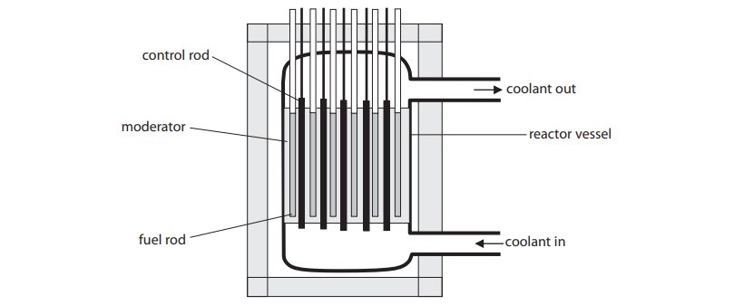

A uranium nucleus in the fuel rod may split when a neutron hits it.

This process of splitting is known as ...
- **A.** fission
- **B.** moderation
- **C.** reflection
- **D.** refraction

## Q2 — easy — 9 marks · exam-questions

### 1() — 4 marks — command: match — structured
The diagram shows a nuclear reactor.

Match each part of the reactor to its function:

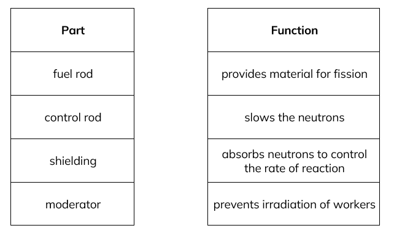

### 2() — 3 marks — command: complete — structured
The sentences relate to nuclear fission and fusion.

Use words from the box to complete the passage.

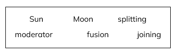

(i) Fission is the ............... of a nucleus

**(1)**

(ii) Fusion is the ............... of two nucleii

**(1)**

(iii) Fusion occurs naturally in the ...............

**(1)**

### 3() — 2 marks — command: state — structured
State two conditions needed for nuclear fusion.

## Q3 — easy — 6 marks · exam-questions

### 1() — 1 mark — multiple_choice
Nuclear fission is defined as
- **A.** the process of transmuting mercury into gold
- **B.** a process which does not produce radioactive waste material
- **C.** the splitting of a larger nucleus into two smaller nuclei
- **D.** a process which takes in more energy than it releases

### 2() — 3 marks — command: complete — structured
The passage describes some of the properties of fission.

Use words from the box to complete the passage.

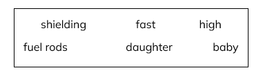

Some of the ............... nuclei produced in nuclear fission are highly radioactive and emit ............... energy neutrons when they decay. Concrete ............... can be used to absorb the neutrons.

### 3() — 1 mark — multiple_choice
Nuclear fusion is defined as
- **A.** the creation of a larger nucleus from smaller nuclei
- **B.** the emission of an electron from the nucleus
- **C.** the cooling of the Sun
- **D.** a natural process which occurs in the core of the Earth

### 4() — 1 mark — multiple_choice
An example of an element that might undergo fusion is
- **A.** polonium-210
- **B.** hydrogen-1
- **C.** americium-241
- **D.** krypton-84

## Q4 — easy — 6 marks · exam-questions

### 1() — 1 mark — command: state — structured
State the element which undergoes fission in a nuclear reactor.

### 2() — 1 mark — command: state — structured
State the particle released during fission of this substance which can enable further fission reactions.

### 3() — 4 marks — command: arrange — structured
The following passage is about chain reactions.

Arrange the sentences into the correct order by numbering them 1 to 4.

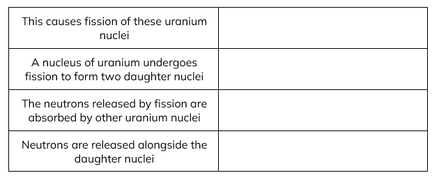

## Q5 — easy — 8 marks · exam-questions

### 1() — 4 marks — command: complete — structured
The following passage is about control rods and moderators in a nuclear reactor.

Select words from the box to complete the sentences.

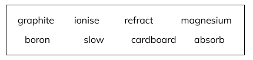

The moderator in a nuclear reactor is often made from ............... .  The moderator is used to ............... neutrons.

The control rods in a nuclear reactor are often made from ............... . The control rods are used to ............... neutrons.

### 2() — 2 marks — command: tick — structured
This passage is about the differences between nuclear fission and fusion.

Tick the correct statements in the table below

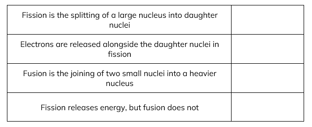

### 3() — 1 mark — multiple_choice
Which of the following are the correct conditions for nuclear fusion to occur?
- **A.** low temperature and low pressure
- **B.** low temperature and high volume
- **C.** high temperature and low volume
- **D.** high temperature and high pressure

### 4() — 1 mark — command: state — structured
State why these conditions are necessary.

## Q6 — medium — 1 marks · exam-questions

### 1((b)) — 1 mark — multiple_choice — from paper 2015 June · 1P
The control rods control the reaction in a nuclear reactor by
- **A.** Absorbing some of the neutrons
- **B.** Cooling the reactor vessel
- **C.** Removing uranium nuclei from the reaction
- **D.** Slowing the neutrons slightly

## Q7 — medium — 8 marks · exam-questions

### 2((a)) — 2 marks — command: draw — structured — from paper Jun 2016 · 1P
The diagram shows the main parts of a nuclear reactor.

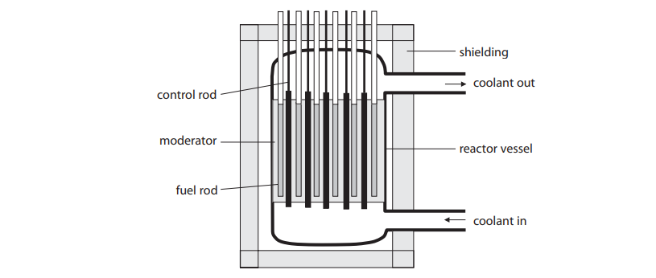

Draw a line linking each part of the reactor with its main function.

The first one has been done for you.

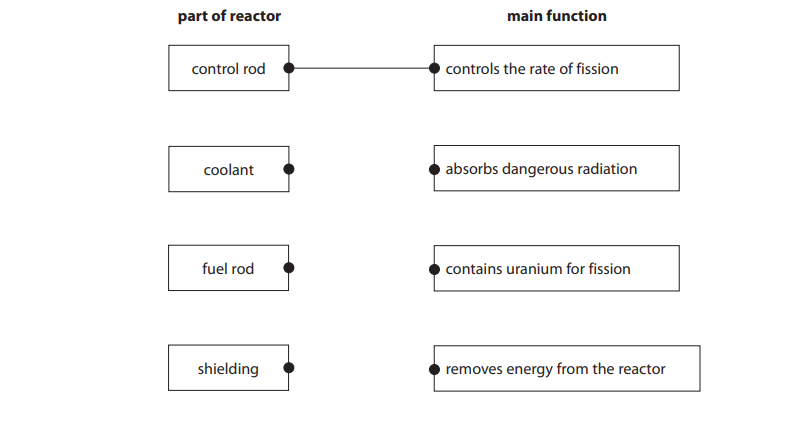

### 2((b)) — 1 mark — command: which — structured — from paper Jun 2016 · 1P
In a fission reaction, energy is transferred from the nuclear store of the particles to which store?

### 2((c)) — 2 marks — command: explain — structured — from paper Jun 2016 · 1P
Explain the role of the moderator in a fission reaction.

### 2((d)) — 3 marks — command: explain — structured — from paper Jun 2016 · 1P
Explain, in terms of neutrons, what is meant by controlled nuclear fission.

## Q8 — medium — 4 marks · exam-questions

### 1((a)) — 3 marks — command: describe — structured — from paper Jun 2015 · 1PR
A student finds this representation of nuclear fission on a website.

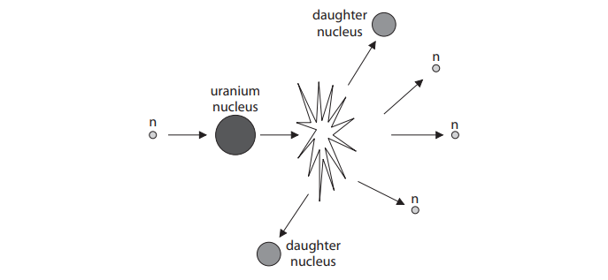

Describe what happens when nuclear fission of uranium occurs.

### 1((b)) — 1 mark — command: name — structured — from paper Jun 2015 · 1PR
The daughter nuclei move off with high speed.

Name the energy store that gives them high speed.

## Q9 — medium — 7 marks · exam-questions

### 12((a)) — 5 marks — command: describe — structured — from paper Jun 2013 · 1PR
The diagram shows the main parts of a nuclear reactor.

In the nuclear reactor uranium−235 nuclei undergo fission in a controlled chain reaction.

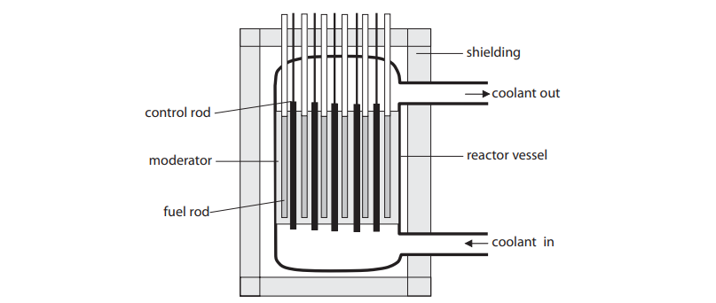

Describe nuclear fission and how the chain reaction is controlled.

Use terms from the diagram to help you.

### 12((b)) — 1 mark — command: name — structured — from paper Jun 2013 · 1PR
Name the energy store that is filled after the nucleus splits in a fission reaction.

### 12((c)) — 1 mark — command: how — structured — from paper Jun 2013 · 1PR
How does the shielding improve safety?

## Q10 — medium — 9 marks · exam-questions

### 11((a)) — 2 marks — command: complete — structured — from paper 2014 June · 1P
In a nuclear reactor, a uranium-235 nucleus absorbs a neutron and fission occurs.

Complete the equation below that shows a typical fission reaction.

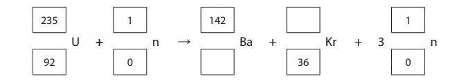

### 11((b)) — 3 marks — command: explain — structured — from paper 2014 June · 1P
Explain how nuclear fission can lead to a chain reaction.

### 11((c)) — 4 marks — command: multiple — structured — from paper Jun 2014 · 1P
The diagram shows a nuclear reactor.

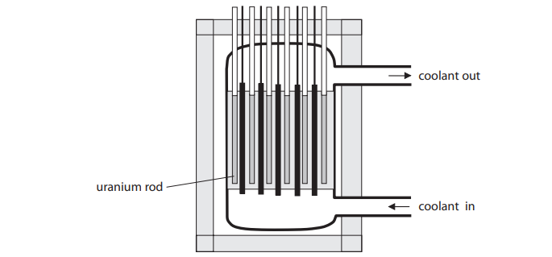

(i) On the diagram, label the control rods and the shielding.

**(2)**

(ii) Explain why the shielding is needed.

**(2)**

## Q11 — hard — 8 marks · exam-questions

### 4((a)) — 5 marks — command: multiple — structured — from paper 2016 June · 2PR
The diagram shows the fuel used in some nuclear reactors.

The fuel is contained inside spheres.

The silicon carbide layer of each sphere is designed to contain the fission products for at least one million years.

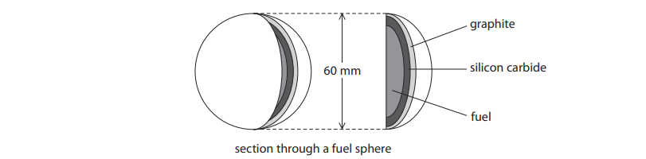

(i) Give the name of a fuel that could be used.

**(1)**

(ii) Explain what is meant by the term **fission products**.

**(2)**

(iii) Explain why it is important to contain these fission products for such a long time.

**(2)**

### 4((a)) — 3 marks — command: multiple — structured — from paper Jun 2016 · 2PR
The graphite layer in every fuel sphere acts as a moderator.

(i) State the function of the moderator in a nuclear reactor.

**(1)**

(ii) The nuclear reactor also contains boron control rods.

Explain why it is dangerous to remove most of the control rods from the reactor.

**(2)**

## Q12 — hard — 11 marks · exam-questions

### 6((a)) — 1 mark — command: name — structured — from paper Jan 13 · P1
The diagram shows a neutron colliding with a nucleus of uranium-235, producing a number of products.

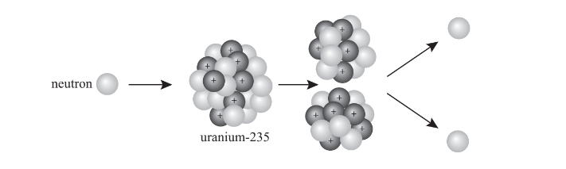

Name the process shown in the diagram.

### 6((b)) — 3 marks — command: explain — structured — from paper Jan 13 · P1
Explain how the process shown in the diagram can lead to a chain reaction.

### 6((c)) — 2 marks — command: explain — structured — from paper Jan 2013 · P1
This process releases energy.

Explain the energy transfer taking place in this reaction.

### 6((d)) — 5 marks — command: multiple — structured — from paper Jan 2013 · P1
The energy released in this process can be used in a nuclear power station.

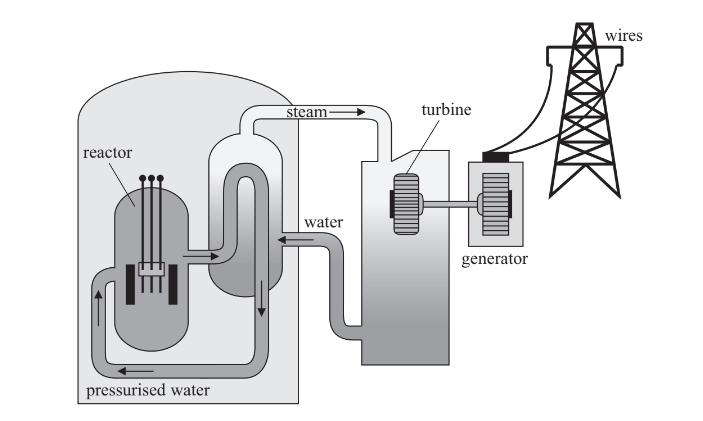

(i) The pressurised water acts as a coolant. It also acts as a moderator.

What is the purpose of a moderator?

**(1)**

(ii) Complete the chart below to show the main useful energy transfers in a nuclear power station.

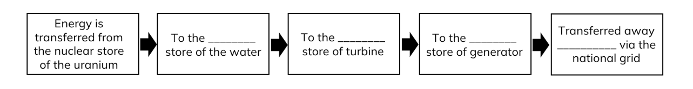

**(4)**

## Q13 — hard — 16 marks · exam-questions

### 12((a)) — 5 marks — command: multiple — structured — from paper 2013 June · 1P
Nuclear power stations use a uranium isotope as fuel.

The table shows information about three isotopes of uranium.

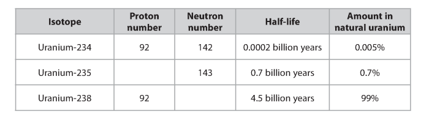

(i) Complete the table by filling in the missing numbers.

**(2)**

(ii) Explain what is meant by the term half-life.

**(2)**

(iii) Suggest why uranium-238 is the most common isotope of uranium.

**(1)**

### 12((b)) — 3 marks — command: what — structured — from paper 2013 June · 1P
What are the products of the fission of uranium nuclei?

### 12((c)) — 3 marks — command: multiple — structured — from paper 2013 June · 1P
The diagram shows the reactor in a nuclear power station.

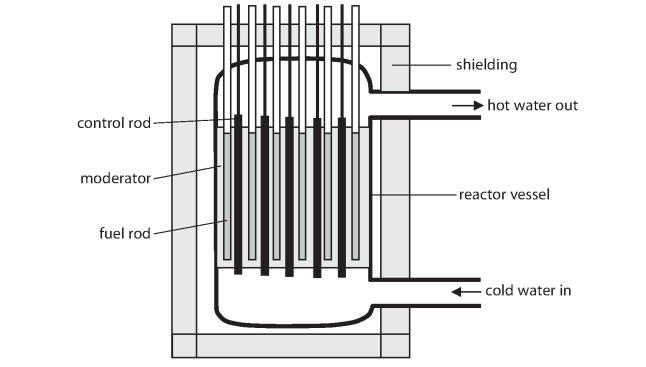

(i) What is the purpose of the moderator?

**(1)**

(ii) Describe what happens in the reactor when a control rod is removed.

**(2)**

### 12((d)) — 5 marks — command: explain — structured — from paper 2013 June · 1P
There have been several accidents at nuclear power stations. The most serious accident caused an explosion in the reactor. This explosion spread material from inside the reactor to the surrounding area.

Explain why it is difficult to make the surrounding area safe again after a serious nuclear accident.

## Q14 — hard — 15 marks · exam-questions

### 1() — 5 marks — command: explain — structured
Nuclear fission occurs in nuclear reactors.

Describe the process of nuclear fission in the reactor, including the material used in the fuel rod. Explain what happens to the energy released.

### 2() — 6 marks — command: suggest — structured
Explain the role of the moderator and the control rods. Suggest materials which would be suitable to use for each one.

### 3() — 4 marks — command: explain — structured
Explain how a chain reaction can occur in the reactor.

## Q15 — hard — 6 marks · exam-questions

### 1() — 1 mark — multiple_choice
Which of the following statements about nuclear power is incorrect?
- **A.** An advantage of nuclear power is that it produces no carbon dioxide
- **B.** Concrete shielding is a helps ensure harmful radiation does not escape from a nuclear reactor
- **C.** The products of fusion include daughter nuclei and neutrons
- **D.** The moderator slows down neutrons

### 2() — 1 mark — multiple_choice
Which of the following statements about nuclear fusion is incorrect?
- **A.** Fusion requires high temperature and pressure
- **B.** The rate of reaction of fusion can be increased using neutrons
- **C.** Fusion occurs in the Sun
- **D.** Fusion involves light nuclei

### 3() — 1 mark — command: explain — structured
Energy and mass can be converted using the equation:

$changeinenergy=changeinmass\timesspeedoflight^{2}$

$ΔE=Δmc^{2}$

Fusion and fission are examples of when this conversion process occurs.

A particular fusion reaction that can occur is:

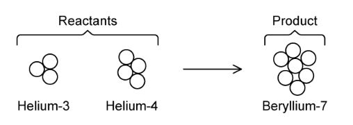

In this reaction:

- Mass of reactants *m*R = mass of helium−3 + mass of helium−4
- Mass of product *m*P = mass of beryllium−7
- Energy is released

State and explain which quantity is greater, *m*R or *m*P.

### 4() — 3 marks — command: calculate — structured
The difference in mass of the reactants and products was found to be 2.8 × 10–30 kg.

The speed of light is 3.00 × 108 m/s.

Calculate the amount of energy released. Give the unit.
