# Mark Schemes — Reflection & Refraction
**5. Waves** · Edexcel IGCSE Physics (Modular) (4XPH1) — 24/Unit 2

## Q1 — easy — 1 marks · exam-questions

### 6((a)) — 1 marks
**Correct answer: D** — refraction

**The correct answer is ****D** because:

- The wavefronts change direction at a boundary
- This is a description of refraction

## Q2 — easy — 1 marks · exam-questions

### 11((a)) — 1 marks
**Correct answer: D** — 

**The correct answer is ****D** because:

- The law of reflection states that the angle of reflection is equal to the angle of incidence

  - Only option **D** has the two angles drawn equally

**A** is incorrect as the angle of reflection is smaller than the angle of incidence

**B** is incorrect as the angle of reflection is larger than the angle of incidence

**C** is incorrect as the reflected ray has been drawn going behind the mirror

## Q3 — easy — 1 marks · exam-questions

### 3((a)) — 1 marks
**Correct answer: D** — Option D

**The correct answer is ****D** because:

- The angle of refraction is measured between the normal and the refracted ray

**A** and **B** are incorrect as these angles are both next to the incident ray, not the refracted ray

**C** is incorrect as the angle is measured between the refracted ray and the boundary, rather than the normal

## Q4 — easy — 4 marks · exam-questions

### 3((a)) — 2 marks
(a)

Describe the effect of refraction:

Any **two **from:

- The waves change

  - direction; **[1 mark]**
  - speed; **[1 mark]**
  - wavelength; **[1 mark]**

**[Total: 2 marks]**

### 3((b)) — 2 marks
(b)

(i) A correctly drawn normal would look like:

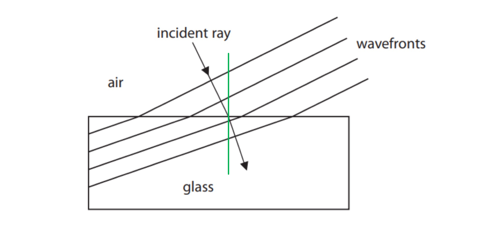

- Normal meets the <u>ray</u> at the <u>boundary</u> **AND **normal at <u>90° to the boundary</u>; **[1 mark]**

(ii) A correctly labelled angle of incidence would look like:

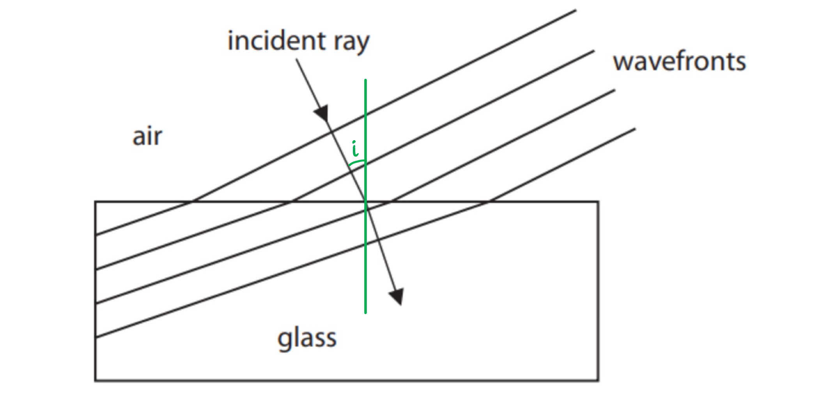

- Angle marked between the <u>ray and the normal</u> **AND **labelled *i* ; **[1 mark]**

**[Total: 2 marks]**

## Q5 — easy — 6 marks · exam-questions

### 2((a)) — 3 marks
(a)

(i) The name of the process shown in the diagram:

Observe that all of the ray is reflected inside the prism:

- Total; **[1 mark]**
- Internal reflection; **[1 mark]**

(ii) The angle labelled θ:

- Angle of reflection **OR **θ > critical angle **OR **45°; **[1 mark]**

**[Total: 3 marks]**

### 2((b)) — 3 marks
(b)

A correctly completed ray looks like:

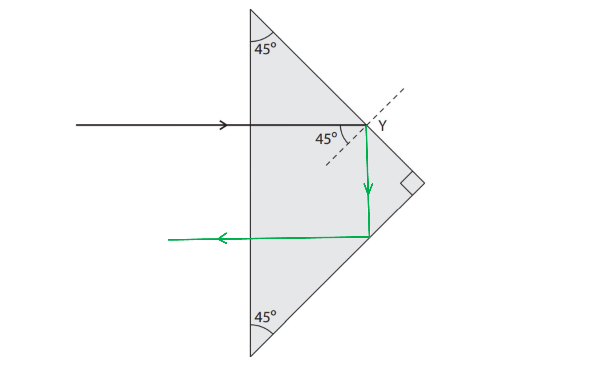

- Internal reflection at Y; **[1 mark]**
- Second internal reflection at the next surface; **[1 mark]**
- Both angles 90° (by eye) **AND **emerging ray parallel to incident ray (by eye); **[1 mark]**

**[Total: 3 marks]**

> *Success in exam questions in this topic depends on being able to **quickly **draw **accurate **diagrams. While you are revising, have your pencil, ruler and rubber handy and practice.*

> *Don't assume that because you can recognise a diagram it means you can also draw it!*

## Q6 — medium — 7 marks · exam-questions

### 12((a)) — 4 marks
(a)

(i) The definition of total internal reflection:

Any **two **from:

- Reflection <u>inside</u> a material; **[1 mark]**
- Reflection is inside the <u>more optically dense</u> medium/ the medium with <u>higher refractive index</u>; **[1 mark]**
- <u>All</u> the light is reflected; **[1 mark]**
- Occurs when the incident angle is larger than the critical angle;** [1 mark]**

(ii) Uses of total internal reflection:

Any **two **from:

- <u>Optical fibres</u>

  - for <u>communication</u>; **[1 mark]**
  - endoscopes/medical uses;** [1 mark]**
  - decorative lamps;** [1 mark]**
- Safety reflectors;** [1 mark]**
- <u>Prisms</u> in

  - binoculars/ telescope; **[1 mark]**
  - camera; **[1 mark]**
  - periscope; **[1 mark]**
  - range-finder; **[1 mark]**

**[Total: 4 marks]**

### 12((b)) — 3 marks
(b)

(i) The equation linking critical angle and refractive index:

- $n=\frac{1}{\mathrm{sin}c}$ (where *n* = refractive index and *c* = critical angle); **[1 mark]**

(ii) To calculate refractive index:

List the known quantities:

- Critical angle, *c* = 42°

Substitute into the equation from part (i)

- $n=\frac{1}{\mathrm{sin}42}=\frac{1}{0.669}$**[1 mark]**
- Refractive index *n* = 1.49 OR 1.5 **[1 mark]**

**  **

**[Total: 3 marks]**

## Q7 — medium — 8 marks · exam-questions

### 11((a)) — 2 marks
(a)

To explain why the ray of light is refracted towards the normal:

Compare the two materials:

- The light is travelling from air to glass
- Therefore it is passing from a less dense medium to a more dense one

Explain the consequence of moving from less dense to more dense medium:

- The refractive index of glass is higher than for air; **[1 mark]**
- The speed will decrease **OR **the wavelength will increase; **[1 mark]**

**[Total: 2 marks]**

### 11((b)) — 6 marks
(b)

(i) The equation linking refractive index and critical angle:

- $\mathrm{sin}c=\frac{1}{n}$ **OR **$n=\frac{1}{\mathrm{sin}c}\,$ **[1 mark]**

(ii) To show that the refractive index of opal is about 1.5:

List the known quantities:

- Critical angle, *c* = 43°

Using the equation from part (i), substitute the value:

- `n space equals fraction numerator 1 over denominator sin space open parentheses 43 close parentheses end fraction` **[1 mark]**

Calculate for *n*:

- `n space equals fraction numerator 1 over denominator sin space open parentheses 43 close parentheses end fraction equals fraction numerator 1 over denominator 0.682 end fraction equals 1.47` **[1 mark]**

(iii) To explain why rays of light inside a diamond are more likely to be totally internally reflected than those inside an opal:

Any **three **points from:

- Larger refractive index leads to a smaller critical angle;**[1 mark]**
- Total internal reflection happens when the angle of incidence is larger than the critical angle;**[1 mark]**
- Diamond will have a larger range of possible angles for TIR;**[1 mark]**
- for diamond: `sin open parentheses c close parentheses space equals space 1 over n equals 1 fourth equals 0.25` therefore *c* = 14° **[1 mark]**
- Only angles between 43-90° will cause total internal reflection in opal; **[1 mark]**

**An example answer which would score full marks is:**

- Diamond has a larger refractive index, giving it a smaller critical angle **[1 mark]**of 14°. **[1 mark]**
- Therefore all rays with incident angles between 14-90° degrees cause TIR in diamond, **[1 mark]** but only those between 43-90° cause TIR in opal. **[1 mark]**

**[Total: 6 marks]**

> *With a 'show that' question like part (ii) the answer you calculate will never be the exact answer given in the question. You will get a result which **rounds to** the value in the question.*

> *For this reason you **must show your working**. Some students try to just write the answer down. The examiner has seen this trick before! Show your steps and you will get full marks.*

> *The example answer in part (iii) is a typical example of a question where, if you write carefully in bullet points, you will probably give more of the marking points than are needed. But this is better (and in the end quicker) than writing half a page of notes that don't explain the answer.*

## Q8 — medium — 3 marks · exam-questions

### 1((a)) — 1 marks
(a)

Observe what happens at A and name it:

- The ray has been completely reflected, with no refraction
- This is total internal reflection; **[1 mark]**

**[Total: 1 mark]**

### 1((b)) — 2 marks
(b)

(i) To draw the position of the second prism inside the dotted square:

Observe the change in direction of the rays:

- The rays have entered the box at the top and turned 90° to the right

Therefore a correct position for the prism looks like:

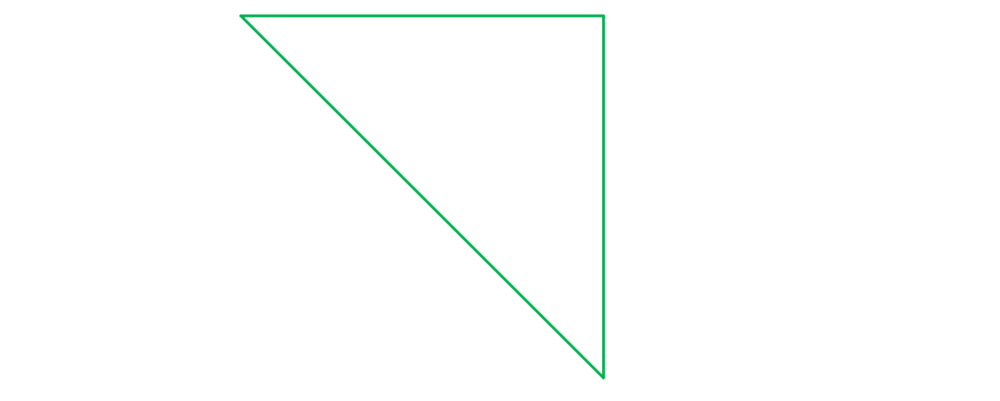

- Correct orientation: **[1 mark]**

(ii) A correct diagram of the path of light through the second prism looks like:

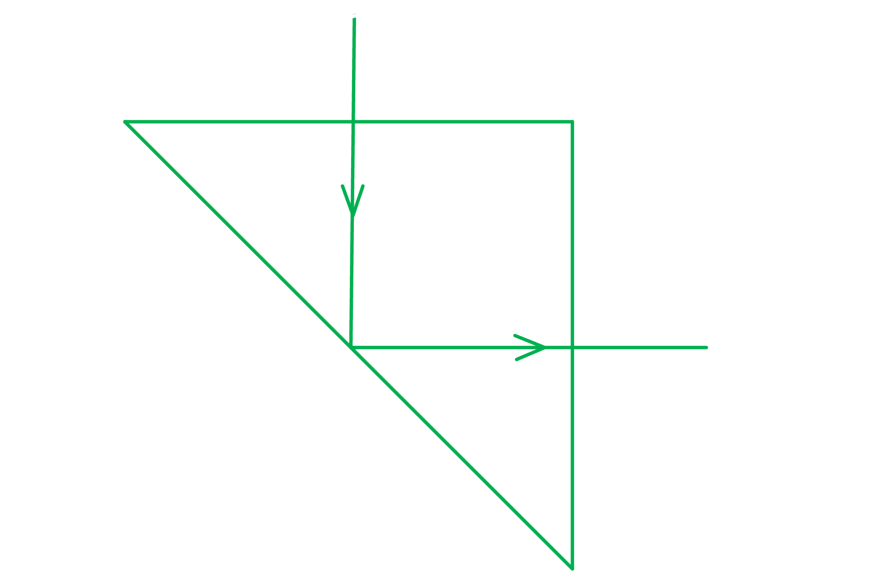

- Ray enters at top of prism **AND **reflects **AND **leaves to the right; **[1 mark]**

**[Total: 2 marks]**

## Q9 — medium — 10 marks · exam-questions

### 6((a)) — 6 marks
(a)

(i) The normal for this refraction would be:

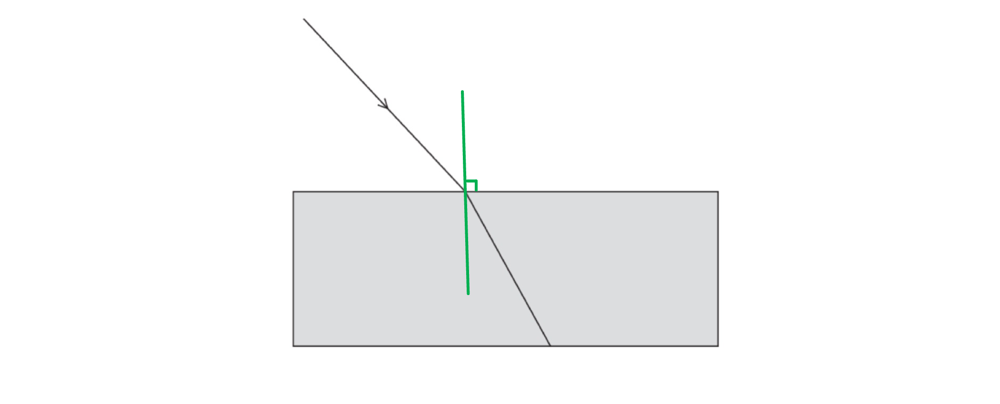

- Line crosses the point where the ray and boundary meet **AND **line is at 90° (by eye) to the boundary; **[1 mark]**

(ii)  The angle of refraction would be:

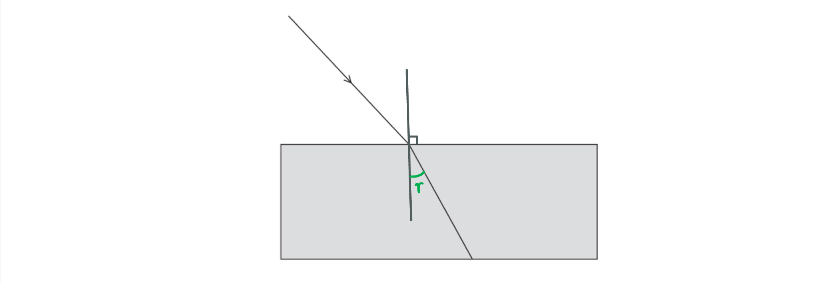

- Angle of refraction marked between the normal and the refracted ray; **[1 mark]**

(iii)  The angle of refraction is measured using a protractor:

- Angle of refraction = 27° **OR **in the range 24 - 30° **[1 mark]**

(iv)  To state the relationship between refractive index, angle of incidence and angle of refraction:

Recall the equation linking these variables:

- $n=\frac{\mathrm{sin}i}{\mathrm{sin}r}$ **[1 mark]**

(v) To calculate the refractive index of the glass:

List the known quantities:

- Angle of incidence,* i *= 43°
- Angle of refraction, *r* = 27°

Substitute into the equation from part (iv):

- `n space equals space fraction numerator sin space open parentheses 43 close parentheses over denominator sin space open parentheses 27 close parentheses end fraction` **[1 mark]**

Calculate to find the value for n:

- `n space equals space fraction numerator sin space open parentheses 43 close parentheses over denominator sin space open parentheses 27 close parentheses end fraction space equals space 1.5` **[1 mark]**

**[Total: 6 marks]**

### 6((b)) — 4 marks
(b)

(i) The name given to the effect shown:

The rays are reflecting inside the fibre:

- This is <u>total internal reflection</u>; **[1 mark]**

(ii) To explain what is happening to the light in the glass fibre:

Describe total internal reflection:

- Light reflects (inside the fibre); **[1 mark]**
- Because the angle of incidence is larger than the critical angle; **[1 mark]**
- Because light travels more slowly in glass;**[1 mark]**

**[Total: 4 marks]**

## Q10 — medium — 8 marks · exam-questions

### 2((a)) — 3 marks
(a)

A correct ray diagram would look like:

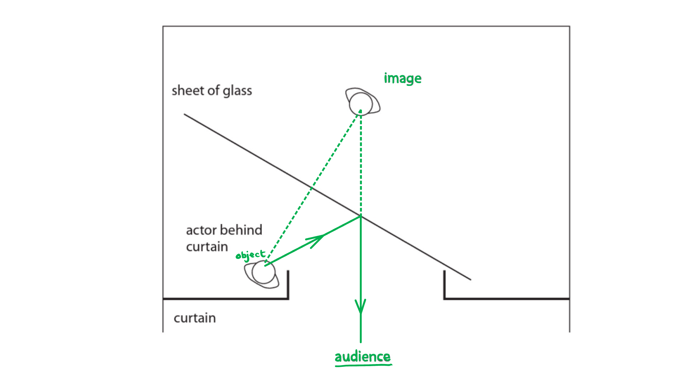

- Reflected ray vertical from glass to audience; **[1 mark]**
- Reflected ray continues as virtual ray to image; **[1 mark]**
- One of: construction line OR normal line between actor and image; **[1 mark]**

**[Total: 3 marks]**

### 2((b)) — 1 marks
(b)

A virtual image:

Any **one **from:

- Cannot be formed on a screen; **[1 mark]**
- Rays do not come from there; **[1 mark]**
- Rays diverge/do not cross after reflection; **[1 mark]**
- Image formed by extending rays backwards;**[1 mark]**

**[Total: 1 mark]**

### 2((c)) — 4 marks
(c)

(i) An example of a wave that travels as a longitudinal wave:

Any **one **from:

- Sound; **[1 mark]**
- Ultrasound;**[1 mark]**
- Earthquake p-/pressure waves; **[1 mark]**
- Deep water waters; **[1 mark]**

(ii) To describe the difference between transverse waves and longitudinal waves:

Any **three **from:

Describe longitudinal waves:

- Longitudinal waves have oscillations parallel; **[1 mark]**
- To direction of travel/energy transfer;**[1 mark]**

Describe transverse waves:

- Transverse waves have oscillations perpendicular; **[1 mark]**
- To direction of travel/energy transfer; **[1 mark]**

**A diagram which scores 3 marks looks like:**

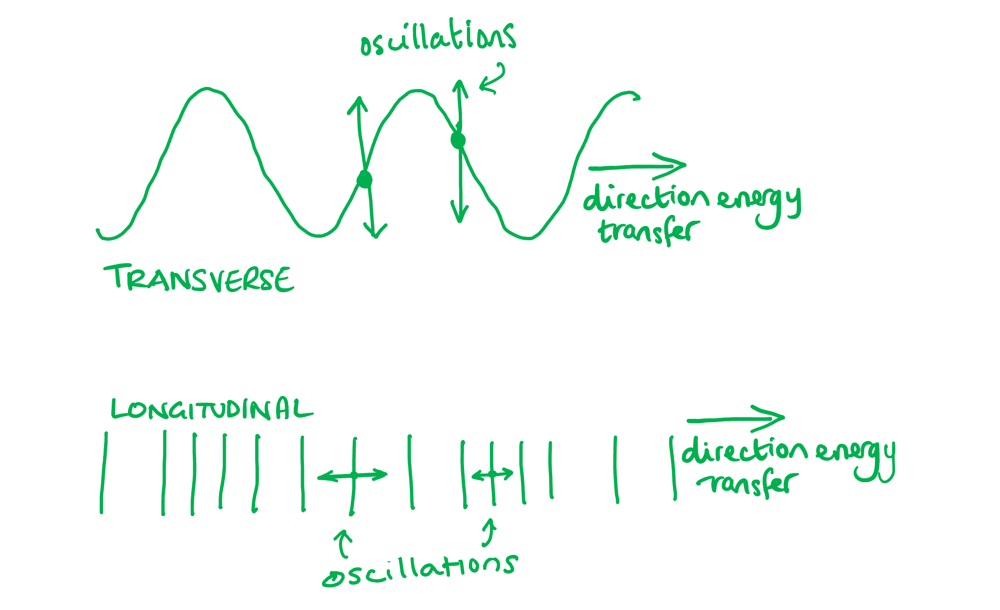

**[Total: 4 marks]**

> *When you are describing the difference between two things make sure that you **use their names** in your descriptions, so that the examiner is sure you understand which is transverse and which longitudinal.*

> *This even counts in a diagram - label your diagrams so that you get the marks not just for the direction of oscillation but also for knowing the full definition, including the **name**.*

## Q11 — medium — 9 marks · exam-questions

### 2((a)) — 4 marks
(a)

(i) The correct statement of the Law of Reflection is:

- When light reflects from the surface of a plane mirror, the angle of incidence is **equal to **the angle of reflection; **[1 mark]**

(ii) A complete diagram to show how an image is formed by a plane mirror looks like:

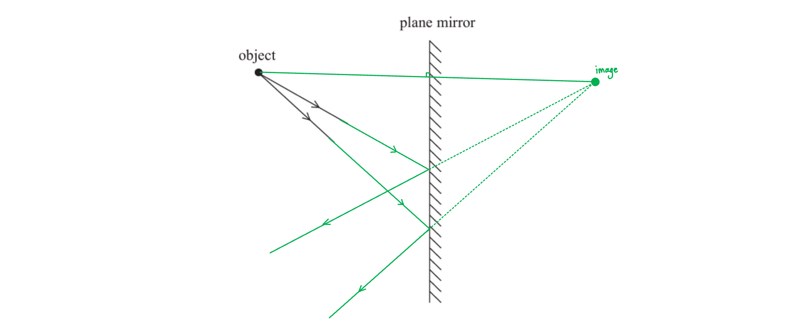

Any **two **marks from:

- Rays continue to mirror and then reflect so that the angle of reflection = the angle of incidence (by eye);** [1 mark]**
- Rays are projected behind the mirror (by eye); **[1 mark]**
- Line perpendicular (by eye) to mirror connects object and image;** [1 mark]**

(iii) The diagram shows a **virtual image** because:

Use the definition of a virtual image:

- Rays do not meet at the image **OR **rays had to be extended virtually to meet;** [1 mark]**

**[Total: 4 marks]**

### 2((b)) — 5 marks
(b)

(i) A correctly completed diagram showing the path of the ray of light looks like:

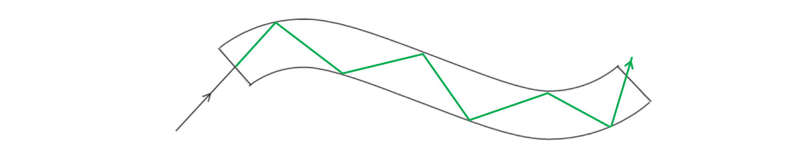

- Reflections shown inside the fibre; **[1 mark]**
- At least three reflections shown;** [1 mark]**

(ii) Two conditions for total internal reflection:

- The angle of incidence is greater than the critical angle **OR***** ****i* > *c *; **[1 mark]**
- Ray travels from more (optically) dense to less (optically) dense; **[1 mark]**

(iii) An advantage of sending signals using optical fibres:

Any **one **from:

- Signals are clearer/have less noise; **[1 mark]**
- Cables don't heat up/lose energy (as much as metal wires); **[1 mark]**
- More data carried; **[1 mark]**
- More information per second; **[1 mark]**

**[Total: 5 marks]**

## Q12 — medium — 10 marks · exam-questions

### 4((a)) — 1 marks
(a)

A definition of refraction is:

- A change in direction/speed of waves at a boundary/change from one medium to another; **[1 mark]**

**[Total: 1 mark]**

### 4((b)) — 2 marks
(b)

A correct diagram showing the angles of incidence and refraction looks like:

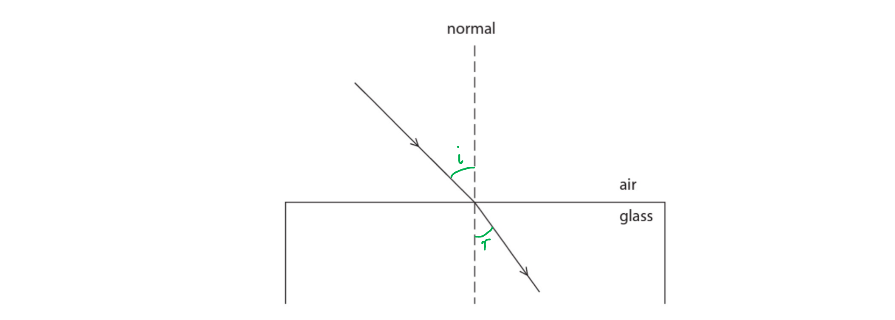

- Angle of incidence correctly labelled either *i *or 'angle of incidence'; **[1 mark]**
- Angle of refraction correctly labelled either *r *or 'angle of refraction'; **[1 mark]**

**[Total: 2 marks]**

> *Remember that the normal line is added to give a point to measure to and from. The angles you are interested in are those between the **ray and the normal**, **not** the ray and the block.*

### 4((c)) — 7 marks
(c)

(i) The equation linking refractive index, angle of incidence and angle of refraction.

- $n=\frac{\mathrm{sin}i}{\mathrm{sin}r}$ **OR **$refractiveindex=\frac{\mathrm{sin}i}{\mathrm{sin}r}$ **[1 mark]**

(ii) To describe how the student should carry out the experiment:

Any **four **from:

What the student should measure:

- Angle of incidence; **[1 mark]**
- Angle of refraction; **[1 mark]**

How the measurements should be made:

- Draw around the block; **[1 mark]**
- Mark the incident and emergent rays; **[1 mark]**
- (Remove the block and) add the refracted ray; **[1 mark]**
- Repeat for a range of values; **[1 mark]**

How the student should use a graph to find the refractive index:

Any **two **from:

- Plot a graph of sin(i) against sin(r); **[1 mark]**
- Graph will be a straight line;**[1 mark]**
- Gradient = refractive index; **[1 mark]**

**An example of an answer which scores 6 marks is:**

- Place the block in the centre of the paper and draw a line around it; **[1 mark]**
- Shine the light onto the block and mark the incident and emergent rays; **[1 mark]**
- Do this for five different rays between 10° and 80°;**[1 mark]**
- Remove the block and add the refracted ray for each reading; **[1 mark]**
- Measure and record the angle of incidence **[1 mark]** and angle of refraction for the readings; **[1 mark]**
- Plot a graph of sin(i) against sin(r);**[1 mark]**
- The gradient of the graph = refractive index;**[1 mark]**

**[Total: 7 marks]**

> *The example answer actually scores nearly all the marking points, although the marks available are a maximum of six.*

> *Since this is **Core Practical 5: Investigating Snell's Law** you can **expect it to be a high-scoring question in the exam**. For this reason memorise the steps so that you can quickly write them down.*

> *This is a more efficient way to get marks than trying to second-guess what the examiner may be awarding marks for.*

## Q13 — medium — 10 marks · exam-questions

### 6((a)) — 8 marks
(a)

(i) A complete table with the missing values of sin *r*:

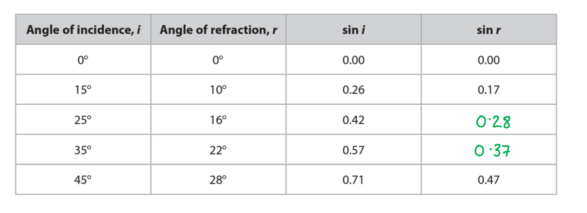

- **One **mark for each correct

(ii) A correct graph looks like:

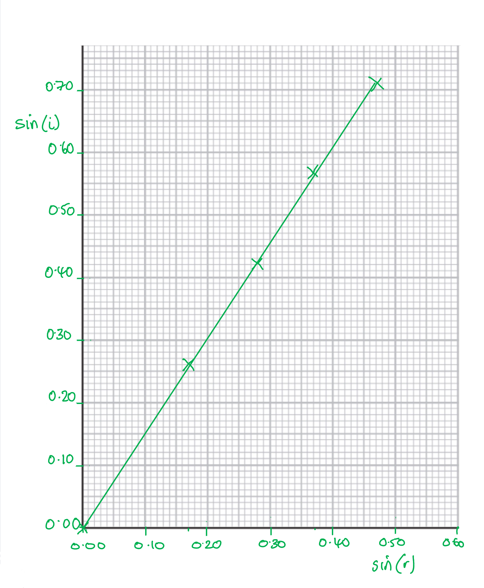

- Correct axes, both labelled; **[1 mark ****each****]**
- Scales fill up more than half of the page in both directions;** [1 mark ****each****]**
- Plots all correct to within one half a square; **[1 mark]**

(iii) To use the graph to find the refractive index:

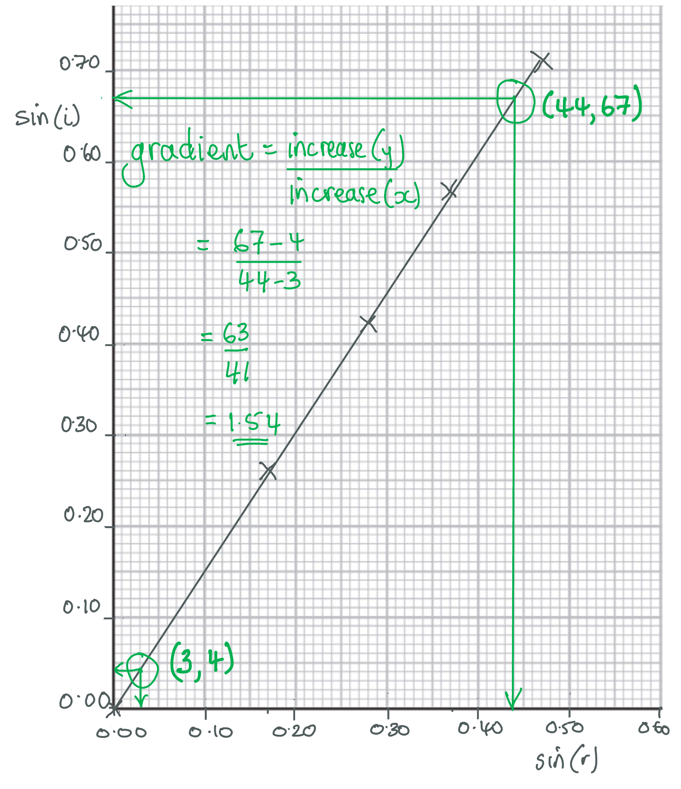

- Attempt to calculate gradient <u>clearly marked on graph</u>; **[1 mark]**
- Answer in the range 1.48 - 1.54; **[1 mark]**

**[Total: 8 marks]**

> *Many students try to save time in exams by skipping showing their working, or doing calculations in their heads. But some marks are literally awarded for **showing that you know what the method is** - rather than actually getting the correct answer!*

> *Always show all your working so that the examiner can give you all the marks.*

### 6((b)) — 2 marks
(b)

Two reasons why a graph is better than calculating the answer:

Any **two **from:

- All the data gathered is included **OR **the gradient is an <u>average</u> value; **[1 mark]**
- Anomalies are excluded; **[1 mark]**
- Uncertainties and errors can be accounted for; **[1 mark]**

**[Total: 2 marks]**

## Q14 — medium — 11 marks · exam-questions

### 5((a)) — 4 marks
(a)

A correctly completed diagram looks like:

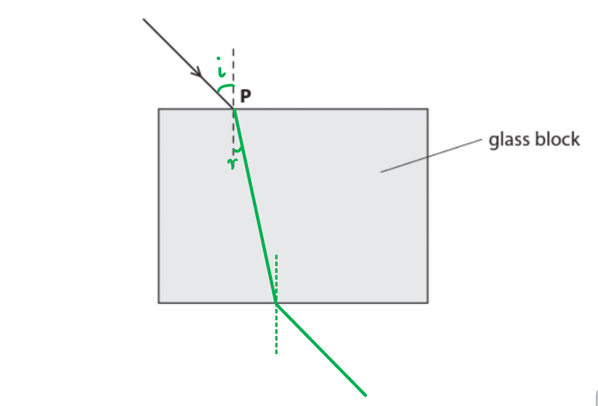

- Refraction in the glass towards the normal; **[1 mark]**
- Angle of incidence **AND **angle of refraction both marked at upper surface; **[1 mark]**
- Refraction at lower surface away from normal; **[1 mark]**
- Emergent ray parallel to incident ray (by eye); **[1 mark]**

**[Total: 4 marks]**

> *The question doesn't ask you to draw the second normal line, where the ray emerges. However, it's always best to draw diagrams correctly every time, so you are in the habit and give better answers more quickly.*

> *A quick check that your emergent and incident rays are parallel is to simply align your ruler with the incident ray, then slide it across the page to the position for the emergent one.*

### 5((b)) — 4 marks
(b)

(i) A correctly completed table looks like:

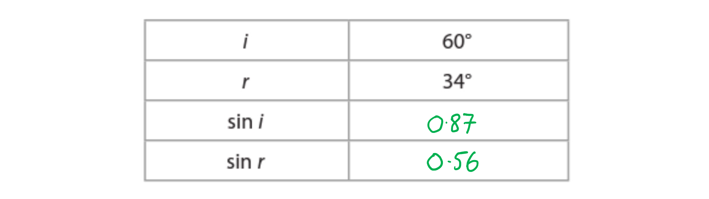

- Both correct; **[1 mark]**

(ii)  The equation that links refractive index, angle of incidence (*i*) and angle of refraction (*r*):

- $n=\frac{\mathrm{sin}i}{\mathrm{sin}r}$ **[1 mark]**

(iii) To calculate the refractive index of the glass:

Substitute the values from the table in part (i) into the equation in part (ii):

- $n=\frac{0.87}{0.56}$
- *n* = 1.554 **OR** 1.55 **[1 mark]**

Round answer to correct significant figures:

- *n* = 1.6 **[1 mark]**

**[Total: 4 marks]**

### 5((c)) — 3 marks
(c)

To obtain a more accurate value for the refractive index of glass:

Any **three **points from:

- Do <u>repeat readings</u> and take an <u>average</u>;**[1 mark]**
- Change the <u>angle of incidence/</u><u>*i*</u> to <u>increase the range</u>;**[1 mark]**
- Plot a graph of sin(i) against sin(r); **[1 mark]**
- Find gradient of graph / calculate refractive index; **[1 mark]**
- Named experimental precaution: use a thinner beam **OR **mark lines with thin pencil **OR **block held in position / can't move **OR ** ignore anomalous readings **OR **darker room; **[1 mark]**

**[Total: 3 marks]**

## Q15 — medium — 9 marks · exam-questions

### 6((a)) — 6 marks
(a)

(i) A correctly drawn and labelled diagram of the apparatus needed to find the refractive index of a glass block would look like:

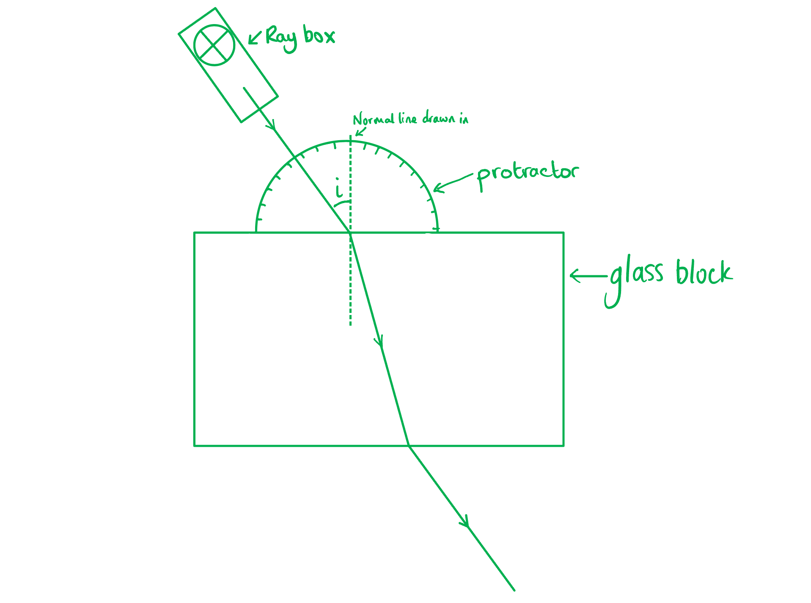

Any **two **marks from:

- Ray box **OR **optical pins shown; **[1 mark]**
- Protractor <u>shown being used</u>; **[1 mark]**
- At least one correct refraction (angle smaller on entering glass and larger when leaving it);**[1 mark]**

(ii) The measurements to find the refractive index are:

- Angle of incidence; **[1 mark]**
- Angle of refraction; **[1 mark]**

(iii) To find the refractive index:

- Calculate sin(i) and sin(r); **[1 mark]**
- Use the equation `n space equals space fraction numerator sin open parentheses i close parentheses over denominator sin open parentheses r close parentheses end fraction
` **[1 mark]**

**[Total: 6 marks]**

> *In experiment diagrams you must show the equipment being used, **not **draw each piece to illustrate it.*

> *The aim of an experiment diagram is to show someone else how to set up and use the equipment to do the same experiment that you did.*

> *When measuring angles you may have thought of another method. It would also be correct to set up the equipment so that the critical angle was being measured. In this case your diagram would need to show the emergent ray lying along the edge of the block.*

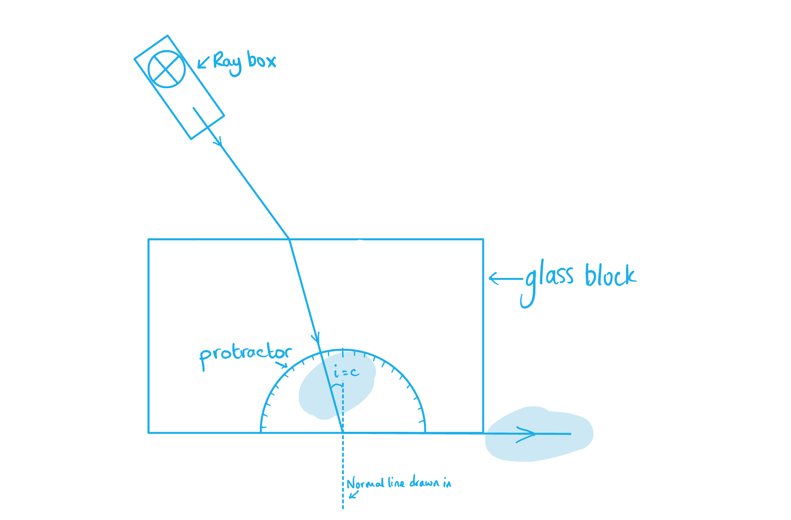

> *In this case the equation would be *`n space equals space fraction numerator 1 over denominator s i n open parentheses c close parentheses end fraction`

### 6((b)) — 3 marks
(b)

(i) A diagram with the incident ray emerging from the plastic looks like:

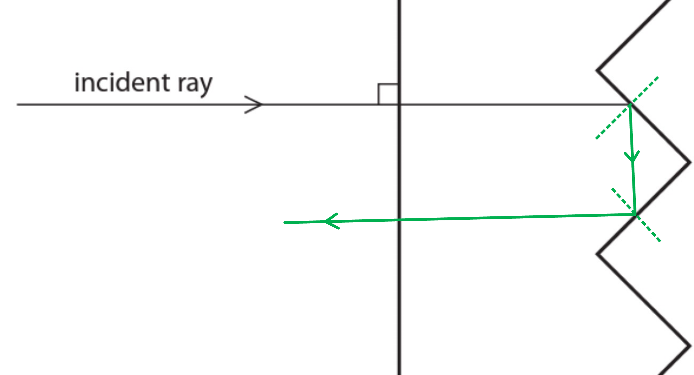

- Reflection at first back surface **AND **rays drawn with a ruler/clearly straight lines; **[1 mark]**
- Reflection at second back surface **AND **emergent ray parallel to incident ray (by eye);**[1 mark]**

(ii) As it enters the plastic the incident ray:

- Is refracted **OR **slows down **OR **the wavelength gets shorter/decreases; **[1 mark]**

**[Total: 3 marks]**

> *Although the mark scheme for part (i) does not give any marks directly for drawing the normal line, you should always draw it in, as shown.*

> *The reason is that the marks **do **depend on getting the angles of reflection very close to exact (hence the need for the emergent ray to be parallel to the incident ray). Constructing your diagram properly - by including the normal - gets you these 'accuracy marks'.*

## Q16 — medium — 10 marks · exam-questions

### 1() — 6 marks
> **[mark-scheme]**
> (i) State what is meant by refraction:
> 
> - A wave passes from one medium to another and changes direction** [1 mark]**

(ii) Draw the normal at the point where the ray meets the glass:

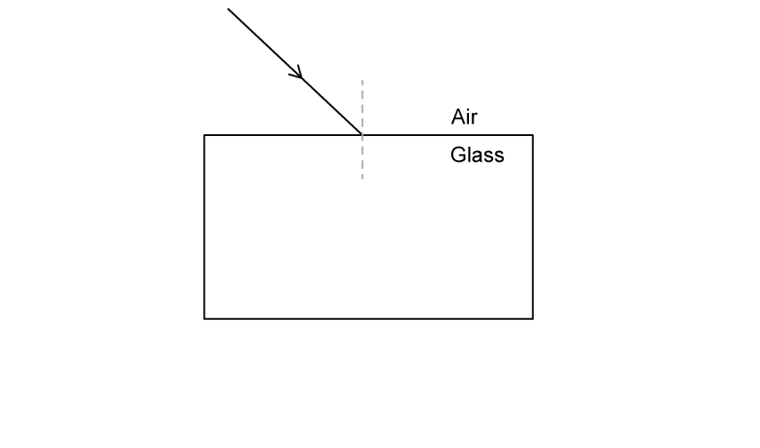

**[1 mark]**

> **[mark-scheme]**
> 1 mark for the normal perpendicular to the block’s surface at the exact point where the light ray meets the glass **AND **drawn** **in both the air and the block

(iii) Draw the path of the ray of light in the glass and label the angles of incidence and refraction:

**[2 marks]**

> **[mark-scheme]**
> 1 mark for drawing the refracted ray straight and bending towards the normal
> 
> 1 mark for the angles of incidence and refraction correctly labelled between the ray and the normal

(iv) Draw the path of the light as it exits the glass block:

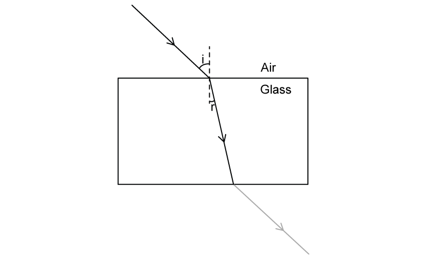

**[2 marks]**

> **[mark-scheme]**
> 1 mark for the ray drawn bending away from the normal
> 
> 1 mark for the ray drawn parallel to the ray before it enters the block

### 2() — 2 marks
Calculate the refractive index of the glass:

- List the known quantities:

  - Angle of incidence, $i=46^{\circ}$
  - Angle of refraction, $r=28^{\circ}$
- Recall the refractive index equation:

$n=\frac{\mathrm{sin}i}{\mathrm{sin}r}$

- Substitute the known quantities into the refractive index equation:

$n=\frac{\mathrm{sin}46^{\circ}}{\mathrm{sin}28^{\circ}}$ **[1 mark]**

- Evaluate the final answer:

$n=1.5$ **[1 mark]**

> **[mark-scheme]**
> Final answer can be given to any number of significant figures e.g. 1.532...

### 3() — 2 marks
> **[mark-scheme]**
> If the glass block were replaced with a plane mirror:
> 
> - The light ray would reflect **[1 mark]**
> - At an angle (of reflection) of 46°
> **OR**
> - The angle of reflection would equal the angle of incidence **[1 mark]**

## Q17 — hard — 1 marks · exam-questions

### 12((b)) — 1 marks
**Correct answer: B** — Option  B

**The correct answer is ****B** because:

- The ray of light is passing from a more dense to a less dense medium
- Therefore the angle of refraction must be less than the angle of incidence

  - Option **A** is eliminated
- The angle of incidence is less than the critical angle
- Therefore the ray will be refracted at an angle less than 90°

  - Options **C** and **D** are eliminated

## Q18 — hard — 14 marks · exam-questions

### 7((a)) — 2 marks
(a)

The correctly completed table looks like:

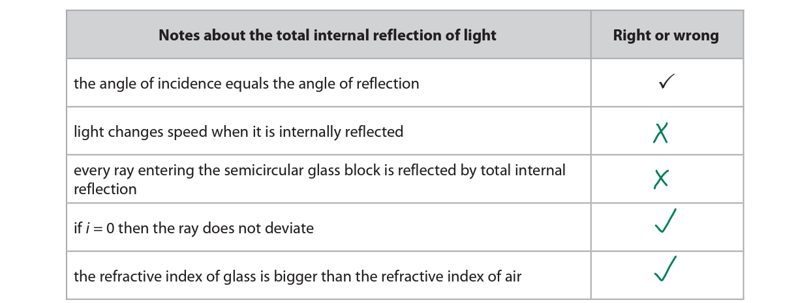

Any 3 or more correct;** [2 marks]**

Any 2 correct; **[1 mark]**

**[Total: 2 marks]**

> *Take care when reading multiple options like this group.*

> *For example, although light does change speed during **refraction **(as it passes from one medium to another) it does not change speed when being **reflected**. And not all rays undergo total internal reflection - only those where the angle of incidence is greater than the critical angle **(i > c)**.*

> *The refractive index of a vacuum (and hence air) is 1.00 - everything else has a higher value.*

### 7((b)) — 3 marks
(b)

A correct diagram of the rays of light looks like:

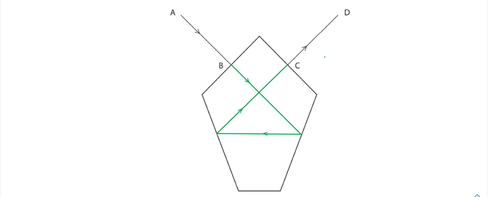

- Exactly two internal reflections shown; **[1 mark]**
- Internal reflections joined by a horizontal line; **[1 mark]**
- Final reflected line does not deviate as it rejoins the ray shown in the question; **[1 mark]**

**[Total: 3 marks]**

> *You may see mark schemes which require arrows to be marks on rays of light, and others which allow them to be left off. You won't know what your examiner is looking for, so play it safe and get your diagram 100 % right every time - by including the arrows to show the direction of the rays.*

> *And... remember to use a **ruler and pencil** when constructing diagrams, just in case!*

### 7((c)) — 5 marks
(c)

(i) To calculate critical angle from refractive index:

List the known quantity:

- Refractive index, *n* = 1.5

Write the correct equation:

- $\mathrm{sin}c=\frac{1}{n}$ **[1 mark]**

Substitute the known quantities:

- $\mathrm{sin}c=\frac{1}{1.5}=0.667$**[1 mark]**

Calculate the final answer:

- `c space equals space sin to the power of negative 1 end exponent open parentheses 0.667 close parentheses space equals space 42 degree`**[1 mark]**

(ii) To explain why the refractive index has no unit:

Any **two **points from:

- $n=\frac{\mathrm{sin}i}{\mathrm{sin}r}$ **[1 mark]**
- refractive index is a <u>ratio</u>/only a <u>number;</u> **[1 mark]**
- sine is a <u>ratio</u>/only a <u>number;</u> **[1 mark]**

**[Total: 5 marks]**

> *Note that although the final answer, 42°, is given in the question, it is not a 'known quantity'. The point of making this list at the outset is to prepare yourself for calculating by*

> *- naming the variables (eg: **n**) to remind yourself of the correct equation*

> *- spotting any numbers (such as km) which need to be converted to SI units*

> *If you write down the final answer (42°) as your known quantity you are at risk of 'reverse calculating', which means showing that if the answer is 42° then the question must have been n = 1.5. This isn't what you were asked to do, so it won't get full marks.*

> *The step made when calculating the final answer involves an inverse sine function, sin**−1**(). *

> *This was used on both sides:*

$sinc=0.667$

`s i n to the power of negative 1 end exponent open parentheses s i n space c close parentheses space equals space s i n to the power of negative 1 end exponent open parentheses 0.667 close parentheses`

> *The inverse sine function effectively 'undoes' a sine function. This leaves just **c** on the left hand side. *

*Also, when working with sines and cosines, ensure your calculator is set to degrees and not radians. Radians are another unit for measuring angles. If you are unsure of how to do this, it is well worth doing some research into your specific calculator (and make sure this is the one you will be using in your exam).*

### 7((d)) — 4 marks
(d)

(i) The point (1.5, 42°) added to the graph would be:

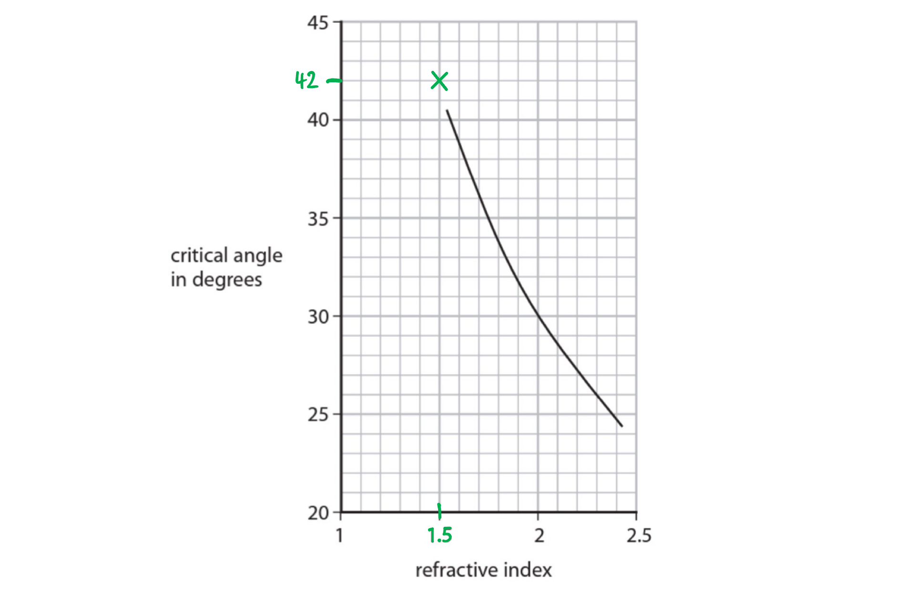

- Plot must be neatly drawn in a thin line, exactly on the point as shown; **[1 mark]**

(ii) The point (1.5, 42°) is **not **anomalous because:

On the graph, sketch the extended line at the end of the existing one:

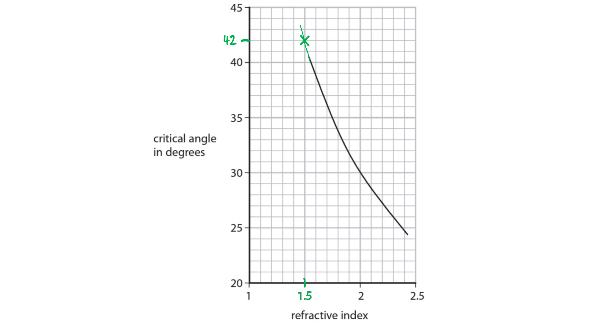

- If the line was extended/extrapolated it would go through the point; **[1 mark]**

(iii) The axes of the graph do not start from zero because:

Any **two **from:

Explain why starting after zero is helpful:

- Ignoring numbers which will not be plotted makes fuller use of the grid/the plotted line take up more space on the page: **[1 mark]**

Explain why it can be done in this case:

- The smallest value of *n* = 1 (so the numbers 0-1 will not be used); [1 mark]
- The critical angle, *c* > 20°; **[1 mark]**

**[Total: 4 marks] **

## Q19 — hard — 16 marks · exam-questions

### 7((a)) — 3 marks
(a)

The equipment to investigate Snell's Law also includes:

Any three from:

- pencil/pen/paper; **[1 mark]**
- protractor; **[1 mark]**
- ruler/straight edge;** [1 mark]**
- light <u>source</u>; **[1 mark]**
- optical pins; **[1 mark]**

**[Total: 3 marks]**

> *This is a required practical so it must be in your revision notes. A clearly labelled diagram in your notes will help you visualise and remember the full list of equipment.*

### 7((b)) — 5 marks
(b)

(i) A correctly drawn normal looks like:

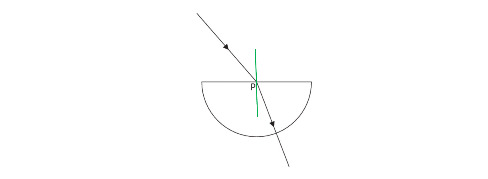

- Line goes through P and is at 90° to the edge of the block;** [1 mark]**

(ii) The angle of incidence and refraction are:

Measure the angle between the ray of light **and the normal**:

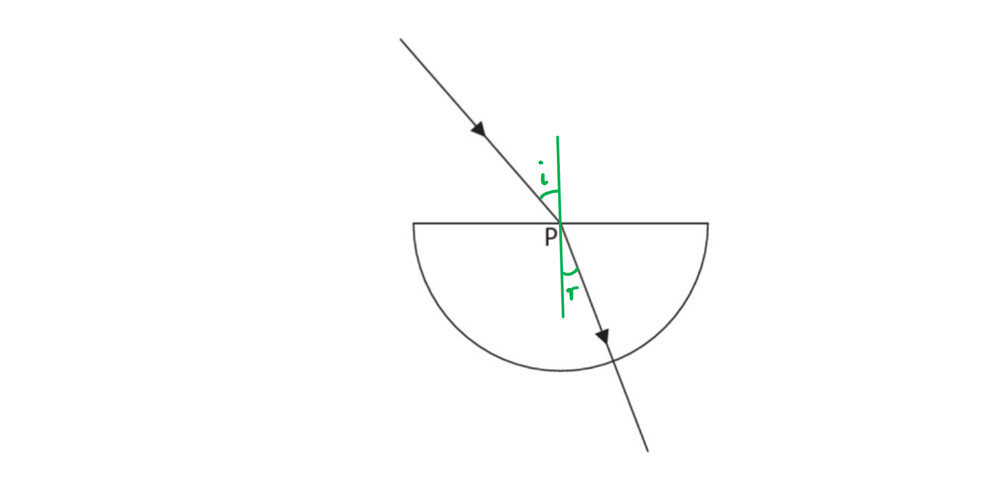

- Angle of incidence,* i* = 41° **[1 mark] **
- Angle of refraction, *r* = 21° **[1 mark] **

(iii) The light changes direction at P because:

Describe what happens at P:

- The light enters a medium with higher/different density/refractive index;** [1 mark]**

Explain why the light changes direction:

- Therefore the <u>speed</u> **OR **<u>wavelength</u> <u>changes</u>; **[1 mark]**

**[Total: 5 marks]**

> *When measuring angles you will usually be allowed ± 1° on either side of the correct answer. However, don't rely on this to allow yourself to take shortcuts. The rest of the question may rely on your initial measurement having been correct.*

> *Remember that frequency is caused by the oscillations of the source, it won't change because the light enters a glass block or is refracted later on. Therefore it is the speed (and hence the wavelength) which is forced to change during refraction.*

### 7((c)) — 8 marks
(c)

(i) A graph of the data would look like:

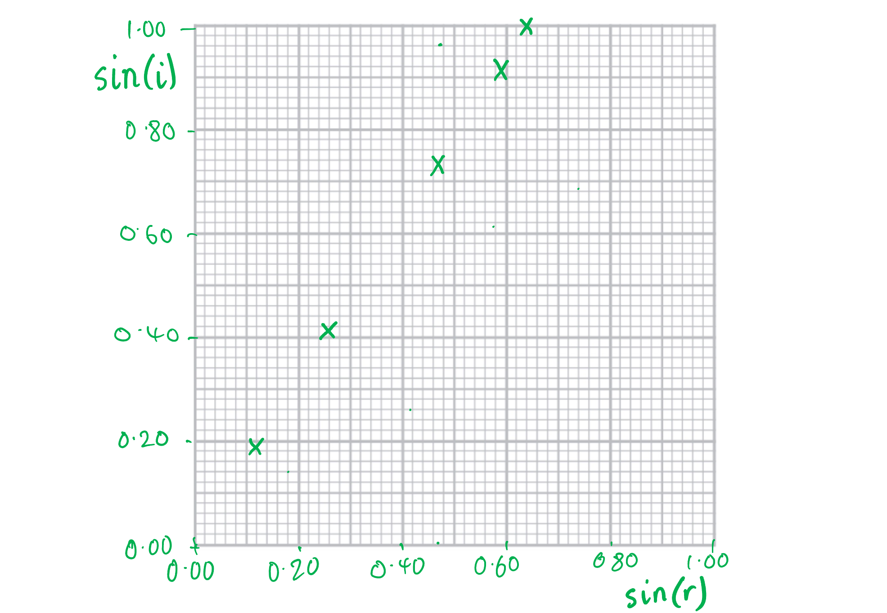

- x-axis labelled correctly and the scale is marked in equal, even increments, going from 0.00-1.00; **[1 mark]**
- y-axis labelled correctly and the scale is marked in equal, even increments, going from 0.00-1.00; **[1 mark]**
- Axes are the right way round with sin *i *on x-axis and sin* r *on y-axis;** [1 mark]**
- All plots correct to within half a small square; **[1 mark]**

(ii) A straight line of best fit looks like:

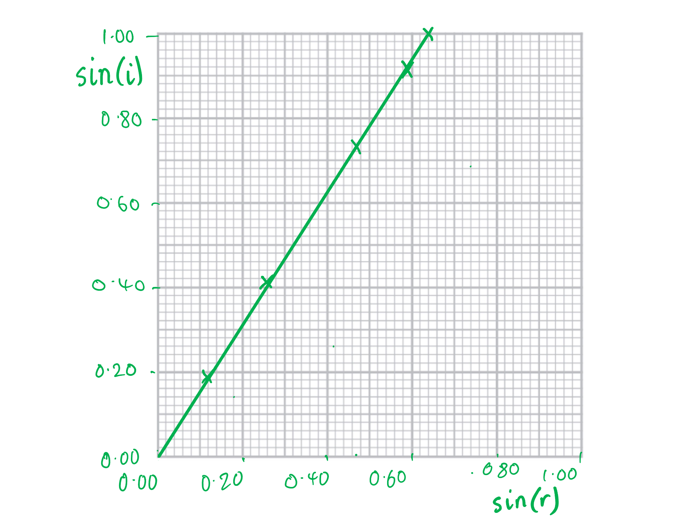

- A straight line passing through the points/with equal spread of points on each side **AND **through the origin; **[1 mark]**

(iii) The relationship between refractive index, sin *i *and sin *r*:

- $n=\frac{\mathrm{sin}i}{\mathrm{sin}r}$ **[1 mark]**

(iv) To find the refractive index from the graph:

Compare the graph and equation:

- The slope of the graph is found using $gradient=\frac{increasey}{increasex}=\frac{\mathrm{sin}i}{\mathrm{sin}r}\,$
- Therefore slope of the graph = refractive index

Find the gradient of the graph:

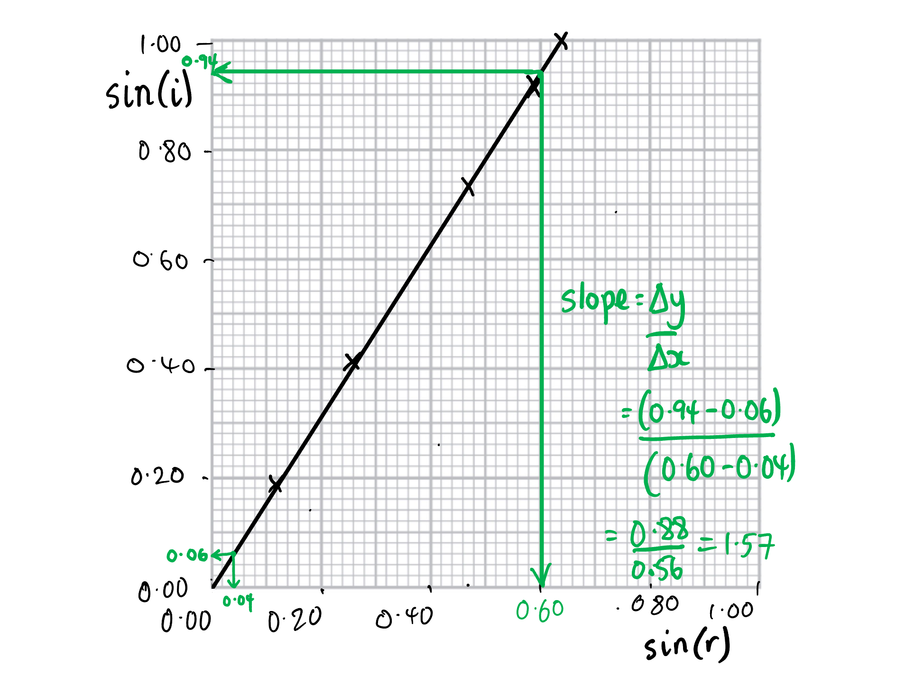

- Correctly reading data from graph; **[1 mark]**
- Correct answer (can be in the range 1.54-1.60); **[1 mark]**

**[Total: 8 marks]**

> *When taking a gradient from a graph the examiner will allow a small range of answers to allow for slightly different lines of best fit. However the range is kept small so that your graph must be carefully and accurately drawn. Doing this quickly (remember in exams you should time yourself to cover about one mark per minute) is a skill you will need to practice.*

> *Always use pencil **- mistakes are common in graphs and are very hard to correct when nothing can be erased!*

## Q20 — hard — 19 marks · exam-questions

### 4((a)) — 9 marks
(a)

(i) Refraction means:

- A change in direction/speed of a wave (as it passes from one medium to another); **[1 mark]**

(ii) A correct normal line looks like:

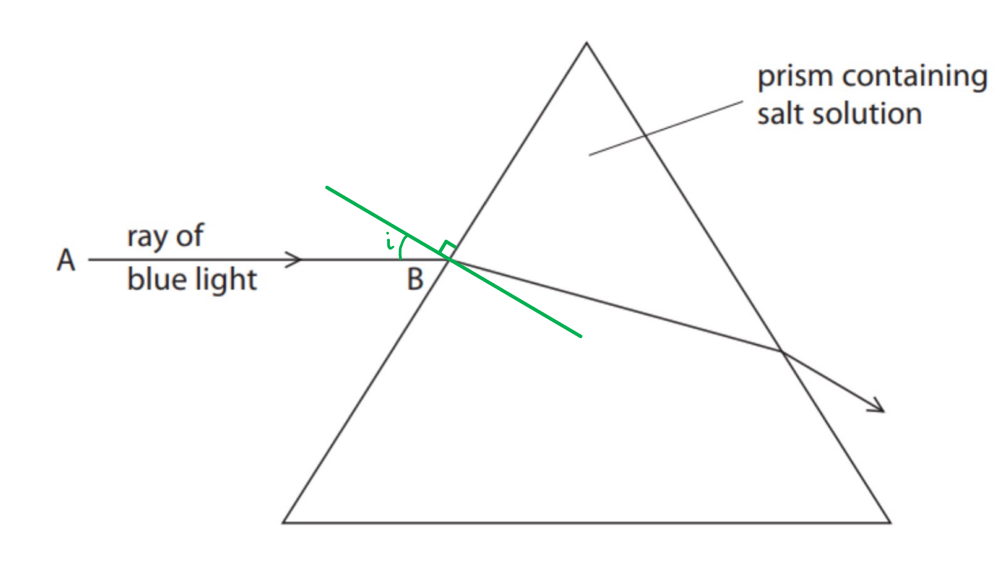

- Normal is at 90° to boundary/right angle marked; **[1 mark]**
- Angle of incidence clearly labelled; **[1 mark]**
- Angle of incidence,* i *= 32°/falls in the range 31-34°; **[1 mark]**

(iii) A possible path for the red light through the solution and out of the prism looks like:

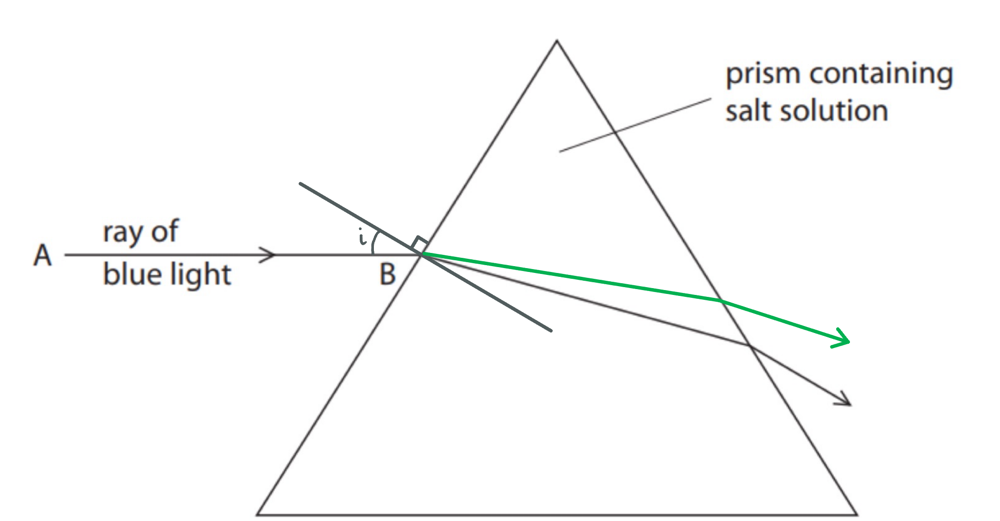

- The red light

  - Is refracted (so the angle of refraction is less than the angle of incidence); **[1 mark]**
  - Has a larger angle of refraction than the blue light as it enters the prism; **[1 mark]**
  - Has a smaller angle of refraction than the blue light as it leaves the prism; **[1 mark]**

(iv) If the student used a salt solution with a higher refractive index:

Recall the effect of higher refractive index on amount of refraction:

- The higher the value of *n*, the more refraction is seen
- <u>On entering the prism</u> (the blue) light will refract more  **OR **it will be nearer the normal **OR **'*r *' will be smaller; **[1 mark]**
- <u>On leaving the prism</u> (the blue) light will refract more  **OR **there will be more deviation than before; **[1 mark]**

**[Total: 9 marks]**

### 4((b)) — 10 marks
(b)

(i) A correct graph and curve of best fit would look like:

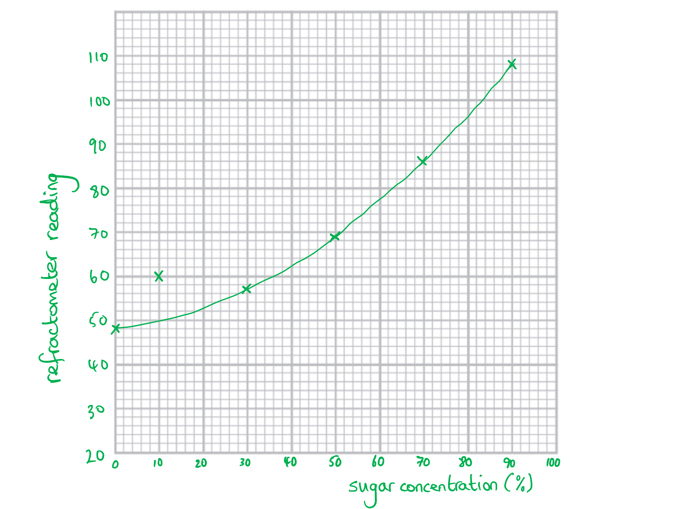

- x-axis correctly labelled with unit; **[1 mark]**
- y-axis correctly labelled with unit; **[1 mark]**
- Both scales correctly marked, with even spacing between values; **[1 mark]**
- Plotted line covers at least half the grid in both directions; **[1 mark]**
- All plots correct to within half a small square; **[1 mark]**

(ii) To identify the anomalous point and correct reading:

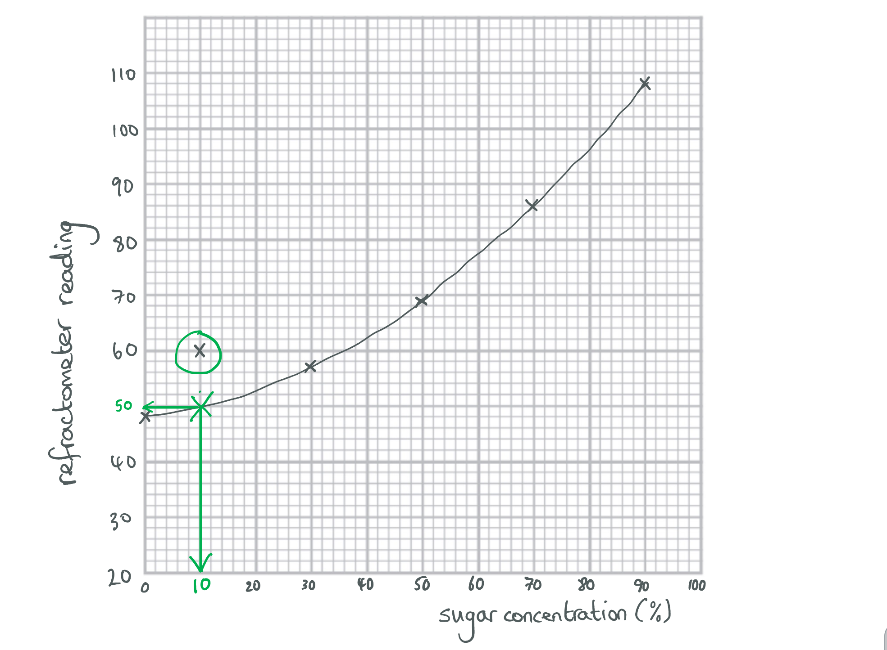

- Plot at (10, 60) circled; **[1 mark]**
- Reading at 10 % should be 50 (±1);**[1 mark]**

(iii) The sugar concentration when the refractometer reading is 80:

Extrapolate from the point on the line where reading = 80:

- The concentration = 63 % **[1 mark]**

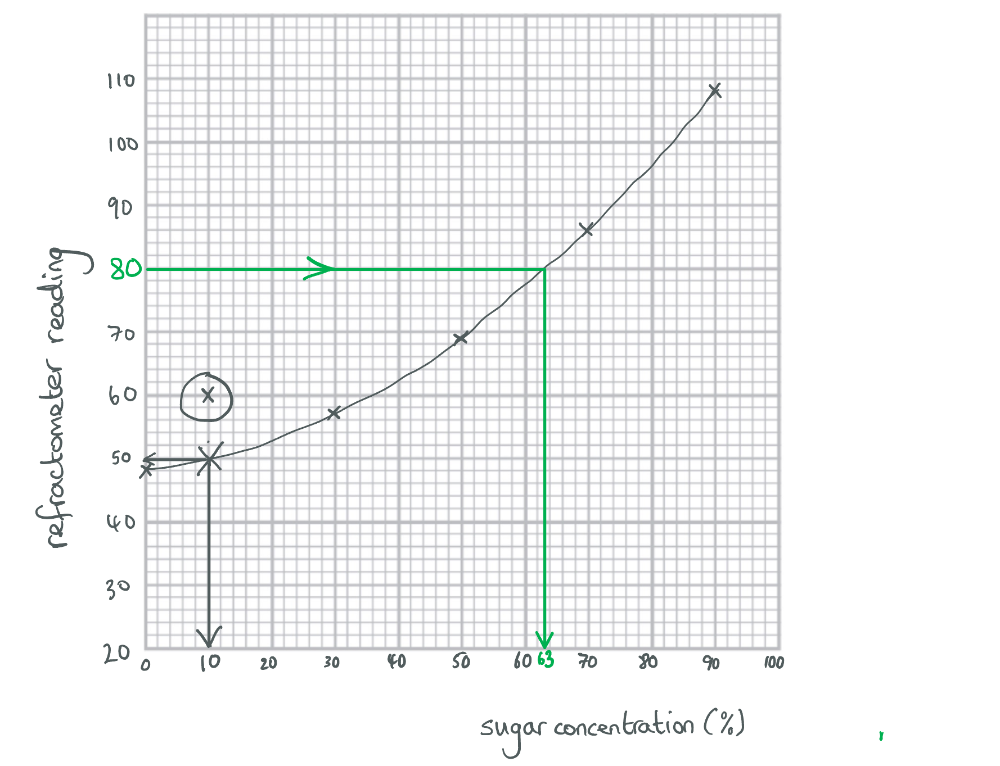

(iv) The pattern shown by the graph:

Any **two **from:

- The slope has positive gradient **OR **there is a positive correlation **OR **as concentration increases the reading increases; **[1 mark]**
- (The line is) not linear **OR **the gradient changes;**[1 mark]**
- Line does not go through origin; **[1 mark]**

**[Total: 10 marks]**

> *Make sure you clearly mark on the graph how you have found your answers. If you made a mistake early one but the examiner can follow your working, you may still get marks for 'error carried forward'. This means that your wrong answer still gets you marks, as long as your working was correct, and clear!*

*For part (iii), the answer is clearly dependent on your line. However, if you get a completely different value for sugar concentration by using the same method as our solution, something has gone wrong.*

## Q21 — hard — 4 marks · exam-questions

### 11((b)) — 4 marks
To use a glass block to find an accurate value for the refractive index of glass:

Any **four** from:

- Use of optical pins/ray box; **[1 mark]**
- Use of a protractor; **[1 mark]**
- (Change the angle of incidence) to get a range of readings; **[1 mark]**
- $n=\frac{\mathrm{sin}i}{\mathrm{sin}r}$ **[1 mark]**
- Calculate to find refractive index **OR **plot a graph of sin *i *against sin *r*; **[1 mark]**
- Get an average value from calculations **OR **calculate the slope of the graph; **[1 mark]**
- State an experimental precaution **OR **improvement to method; **[1 mark]**

**An example answer which would score 4 marks is:**

Direct a ray of light at the block using a ray box; **[1 mark]**

Using a sharp pencil, **[1 mark]** carefully mark the incident and emergent rays;

Vary the angle of incidence from about 10° to 80°, marking the rays each time; **[1 mark]**

Remove the block and mark the refracted ray, then use a protractor **[1 mark]**measure the angles of incidence and angles of refraction;**[1 mark]**

Plot a graph of sin *i *against sin *r*, **[1 mark]**the gradient is the refractive index; **[1 mark]**

**[Total: 4 marks]**

## Q22 — hard — 9 marks · exam-questions

### 15((a)) — 2 marks
(a)

A completed diagram showing the path of the ray of light looks like:

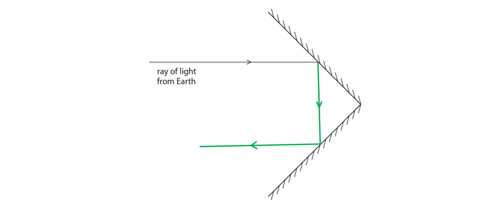

- Reflection at first surface is at 90° to incoming ray / angle of reflection = 90° **[1 mark]**
- Final ray is parallel (by eye) with the first one; **[1 mark]**

**[Total: 2 marks]**

### 15((b)) — 3 marks
(b)

To show that the Moon is about 400 000 km from the Earth:

List the known quantities:

- Speed of light, *s* = 300 000 km/s
- Time, *t *= 2.6 s

Use the equation for speed:

- $s=\frac{d}{t}$

Rearrange to make distance the subject:

- $d=s\timest$

Substitute the values and calculate:

- $d=300000\times2.6$; **[1 mark]**
- $d=780000$

Since the light has travelled to the Moon and back, divide total distance by 2 to find the distance from Earth to Moon:

- Distance to the Moon = 780 000 ÷ 2 **[1 mark]**
- Distance = 390 000;**[1 mark]**

**[Total: 3 marks]**

> *There is another way to approach this calculation, which is to take half the value of time given in the question. Either route will give you the correct answer.*

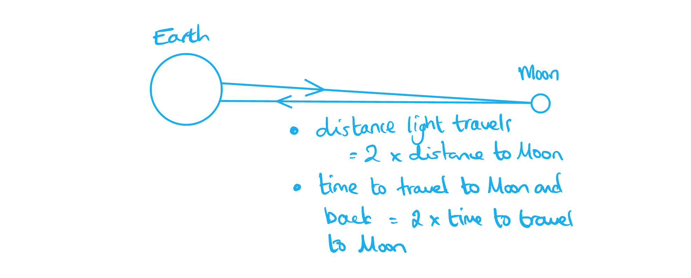

### 15((c)) — 4 marks
(c)

(i) The information which can deduced about the orbit of the Moon from the information in the graph:

Any **three **points from:

Notice that time for light to travel between Moon and Earth varies:

- Therefore the distance from Earth to Moon varies; **[1 mark]**
- Moon's orbit is not circular; **[1 mark]**

Compare the times taken:

- Moon's orbit takes about one month / is regular; **[1 mark]**
- Using the data, for example, largest time difference = (2.70 - 2.47) = 0.23 s; **[1 mark]**

(ii) The further information about the orbit of the Moon which can be inferred is:

Any **one **point from:

Notice that time for light to travel between Moon and Earth is increasing:

- Therefore the <u>Moon's orbital radius is increasing</u>; **[1 mark]**

Draw a conclusion based on this:

- The Moon is <u>moving away from Earth</u>; [1 mark]
- Therefore the <u>gravitational force is becoming weaker</u>; **[1 mark]**

**[Total: 4 marks]**

## Q23 — hard — 13 marks · exam-questions

### 7((a)) — 3 marks
(a)

To describe how a sound wave moves through the air:

Any **three **from:

- (Sound is a) longitudinal wave; **[1 mark]**
- Particles vibrate/oscillate; **[1 mark]**
- Parallel to the direction of motion of the wave/energy transfer; **[1 mark]**
- In a series of compressions and rarefactions **OR **as a pressure wave; **[1 mark]**

**[Total: 3 marks]**

### 7((b)) — 5 marks
(b)

(i) State the precision of Andrew’s readings:

Notice the fractions of a second Andrew's readings have been taken to:

- The readings are recorded in hundredths of seconds
- Therefore the precision = 0.01 s;**[1 mark]**

(ii) The equation linking speed, distance travelled and time taken:

- $speed=\frac{distance}{time}$ **OR **$s=\frac{d}{t}$ **[1 mark]**

(iii) The students' completed table looks like:

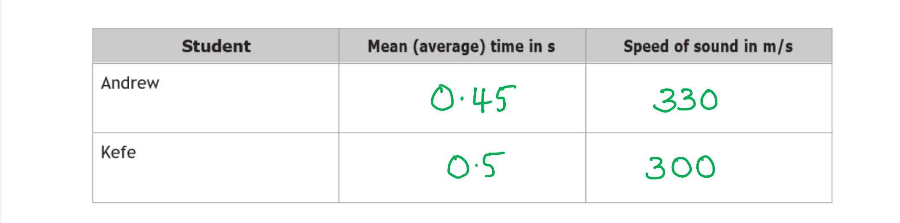

- Each column correct; **[1 mark]**
- Answers for mean times correct; **[1 mark]**
- Significant figures correct (Andrew's readings **both **to 2 s.f. **AND **Kefe's readings **both **to 1 s.f.); **[1 mark]**

**[Total: 5 marks]**

> *Being able to calculate a mean is a critical skill in any science exam. In part (iii) you must recall that the average is the sum of the values divided by the total number of values. *

### 7((c)) — 5 marks
(c)

To evaluate the students' conclusions:

Any **five **from:

Describe what reaction time means:

- Reaction time is:

  - The amount of time between hearing the sound and stopping the stopwatch; **[1 mark]**
  - It affects readings; **[1 mark]**
  - By different amounts (depending on the person);**[1 mark]**
  - Usually taken to be 0.1 s; **[1 mark]**

Describe how reaction time affects readings:

- Reaction time:

  - Does not cancel out (if start and stop the stopwatch);**[1 mark]**
  - Must be taken into account;**[1 mark]**
  - Is large compared to reading/is about 25 % of the reading/causes a large percentage error; **[1 mark]**

Analyse the student's statements:

- (Reaction time is to 1 s.f. so) time should only be measured to 1 s.f.; **[1 mark]**
- Therefore final answer should be to 1 s.f. **OR **answer to 3 s.f. not appropriate; **[1 mark]**
- Kefe is correct; **[1 mark]**
- Closer to accepted value is not the same as more accurate; **[1 mark]**

**An example of an answer which scores 5 marks:**

Kefe is correct because; **[1 mark]**

He is including reaction time, which is about 0.1 s of each reading [1 mark] depending on the person using the stopwatch; **[1 mark]**

This means it is creating a large percentage error [1 mark] as the readings are only about 0.4-0.5 s; **[1 mark]**

The final answer should only be given to 1 s.f. since the initial readings should have been to 1 s.f.; **[1 mark]**

Reaction time affects the readings twice - when you start and stop the stopwatch - so it does not cancel out; **[1 mark]**

**[Total: 5 marks]**

> *Andrew's idea that two reaction time errors cancel out is a common misconception. Starting and stopping the watch would only cancel out if every single time the reaction time error had exactly the same effect. We can't be sure of this. *

> *Errors in readings like this one are called **uncertainties **because **we cannot be certain** how far from the true value our reading is. For this reason we include an 'uncertainty' (in this case 0.1 s) so that we can say a range of possible values (0.4 ± 0.1 s) which we are certain about.*

> *In science it is better to be clear about your level of uncertainty than to try to pretend that you have made a measurement which is 100 % accurate. There is no such thing!*
