# Mark Schemes — Sound
**5. Waves** · Edexcel IGCSE Physics (Modular) (4XPH1) — 24/Unit 2

## Q1 — easy — 3 marks · exam-questions

### 9((a)) — 1 marks
**Correct answer: C** — longitudinal waves

**The correct answer is ****C** because:

- Sound waves have particles which oscillate **parallel** to the direction of energy transfer
- Therefore, sound waves are **longitudinal waves**

**A** is incorrect as electromagnetic waves are transverse waves such as gamma rays, light and microwaves

**B** is incorrect as ionising radiation usually refers to gamma waves

**D** is incorrect as transverse waves oscillate perpendicular to the direction of travel of the wave

### 2() — 1 marks
**Correct answer: C** — quiet sound waves have a large amplitude

**The incorrect answer is ****C** because:

- Amplitude and volume of a sound wave are related

  - A larger amplitude gives a louder sound
  - Therefore, a quiet sound wave requires a small amplitude

- Hence, statement **C** is incorrect

**A** is correct as all waves, including sound waves, can be reflected, refracted and transmitted. Remember that reflected sound waves are called 'echoes'

**B** is correct as pitch and frequency of a sound wave are related and a higher frequency gives a higher pitch

**D** is correct as sound waves are longitudinal

### 3((b)) — 1 marks
**Correct answer: D** — 45 000 Hz

**The correct answer is ****D** because:

- The frequency range of human hearing is approximately 20 Hz to 20 000 Hz
- The frequency of ultrasound is 20 000 Hz and above
- Therefore, only 45 000 Hz would be classified as ultrasound

## Q2 — easy — 3 marks · exam-questions

### 5() — 1 marks
**Correct answer: A** — amplitude

**The correct answer is ****A**** **because:

- Amplitude changes depending on the energy of the wave
- Therefore, a **louder** sound wave is indicated by a **larger amplitude**

**B** is incorrect as pitch is affected by frequency

**C** is incorrect as wave speed depends on the medium it is travelling through

**D** is incorrect as wavelength is linked to frequency, they are directly proportional according to the wave equation

### 5() — 1 marks
**Correct answer: B** — frequency

**The correct answer is ****B**** **because:

- Pitch changes as frequency changes
- A higher frequency sound wave creates a higher pitch

**A** is incorrect as  amplitude is affected by energy

**C** is incorrect as wave speed depends on the medium it is travelling through

**D** is incorrect as  wavelength is linked to frequency since they are directly proportional, but it is frequency which measures pitch

### 3((a)) — 1 marks
**Correct answer: B** — 

**The correct answer is ****B**** **because:

- The amplitude of the wave indicates the amount of energy
- Hence, the louder sounds are produced by the waves with larger amplitudes

  - Therefore,** B** and **D** are the loudest sounds

- Frequency is defined as the number of complete waves per second and corresponds to the pitch
- Hence, the fewer complete waves, the lower the frequency and hence, pitch

  - Therefore,** A** and **B** show the lowest pitch waves

- Since wave **B** is both loud and has a low frequency (pitch), this is the correct graph

## Q3 — easy — 4 marks · exam-questions

### 1() — 1 marks
(a) The relationship between frequency and pitch is:

- Higher frequency gives higher pitch **OR **lower frequency gives lower pitch; **[1 mark]**

**[Total: 1 mark]**

### 2() — 3 marks
(b)

(i) The equation linking wave speed, frequency and wavelength:

- $v=fλ$ **OR **speed = frequency × wavelength; **[1 mark]**

(ii) Calculate the wavelength of sound waves:

List the known quantities:

- Speed of sound, *v* = 340 m/s
- Frequency,* f* = 160 Hz

Rearrange the equation and substitute the values:

- $v=fλ\Rightarrowλ=\frac{v}{f}$
- $λ=\frac{340}{160}=2.125$ **[1 mark]**
- Wavelength = 2.1 m**[1 mark]**

**[Total: 3 marks]**

## Q4 — easy — 7 marks · exam-questions

### 1() — 1 marks
(a) Sound waves are longitudinal waves because:

- Particles (in a sound wave) oscillate / vibrate <u>parallel</u> to the direction of the wave; **[1 mark]**

**[Total: 1 mark]**

### 2() — 4 marks
(b)

(i) The correct sentence is:

- **A** is **a microphone**; **[1 mark]**
- **B** is **an oscilloscope**; **[1 mark]**

(ii) The correct sentence is:

- The distance $x$ marked on the diagram measures **the amplitude** of the sound wave; **[1 mark]**

(iii) The correct sentence is:

- The distance $x$ becomes smaller. This is because the sound has become **quieter**; **[1 mark]**

**[Total: 4 marks]**

### 3() — 2 marks
(c) Astronauts in space cannot hear sounds from outside their spacesuits because:

- Sound cannot travel through a vacuum **OR** there is no medium for the sound to travel through; **[1 mark]**
- (Because) there is nothing in space / there are no particles between the astronauts and the source (of the sound); **[1 mark]**

**[Total: 2 marks]**

## Q5 — easy — 2 marks · exam-questions

### 3((b)) — 1 marks
(a) Find the time period of wave P:

**Method 1: Calculate from frequency**

Use the equation linking frequency and time period:

- $T=\frac{1}{f}$

Substitute and calculate:

- $T=\frac{1}{250}=0.004$
- Time period of wave P,* T* = 0.004 s **[1 mark]**

**OR**

**Method 2: Calculate using the graph**

Use the graph to find the time for one complete oscillation:

- Each square = 0.001 s (from the question)
- One full wavelength covers 4 squares
- Therefore *T* = 0.004 s [**[1 mark]**

**[Total: 1 mark]**

### 3((b)) — 1 marks
(b) Find the frequency of wave Q:

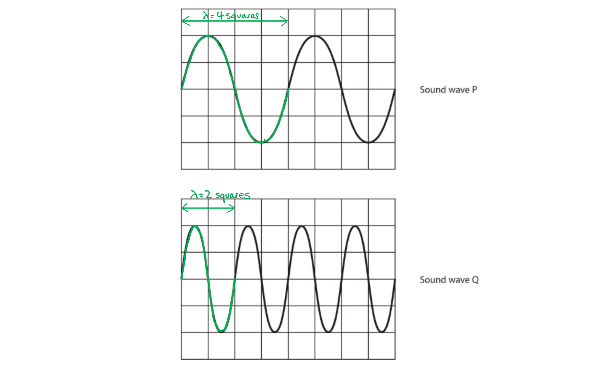

- The wavelength of Q is half the wavelength of P
- Since $f=\frac{v}{λ}$, frequency and wavelength are inversely proportional
- Therefore the frequency of Q = 2 × frequency of P = 2 × 250 Hz
- Frequency of wave Q = 500 Hz **[1 mark]**

**[Total: 1 mark]**

## Q6 — medium — 1 marks · exam-questions

### 3((b)) — 1 marks
**Correct answer: C** — the same as the amplitude of sound wave P

**The correct answer is ****C** because:

- Amplitude is the maximum displacement from the equilibrium or mean position

  - This means that amplitude is half of the height of a wave from trough to crest
- Wave **P** is four boxes high so has an amplitude of two boxes
- Wave **Q** is also four boxes high, so also has amplitude of two boxes

  - Only **C** states that they are the same

## Q7 — medium — 4 marks · exam-questions

### 3() — 2 marks
(a) The technician halves the equation because:

- Speed is calculated using $speed=\frac{distance}{time}$
- $distance=speed\timestime$; **[1 mark]**

Explain why the distance must be halved:

- The total distance travelled is twice the depth, since the ultrasound has reflected and returned
- Therefore, depth = $\frac{1}{2}$ × total distance; **[1 mark]**

**[Total: 2 marks]**

### 2() — 2 marks
(b)  How a change in speed affects the wavelength:

- (Frequency is the number of oscillations per second so) it is set by the source (of the ultrasound) and is constant / does not change; **[1 mark]**
- (Since $v=fλ$) velocity is directly proportional to wavelength **OR **as speed increases, wavelength increases; **[1 mark]**

**[Total: 2 marks]**

## Q8 — medium — 10 marks · exam-questions

### 2((a)) — 4 marks
(a)

(i) The frequency of the ultrasound emitted by the cleaner:

List the known quantities:

- There are 96 million vibrations per second

Recall the definition and units of frequency:

- Frequency is the number of complete oscillations per second and it is measured in hertz (Hz)

State the answer and correct units:

- Frequency of the ultrasound = 96 000 000; **[1 mark]**
- Units = hertz/Hz; **[1 mark]**

(ii)  How the cleaner removes plaque:

Describe the vibrations being passed along:

- (The vibrations of the cleaner) make the plaque vibrate/shakes the plaque (off the teeth)/breaks the plaque down; **[1 mark]**

(iii) Water is sprayed on the tip of the cleaner to:

Any **one **from:

- Clean off the debris/plaque; **[1 mark]**
- Cool the tip of the cleaner;**[1 mark]**
- Reduce friction/damage to the tooth;**[1 mark]**

**[Total: 4 marks]**

> *You may have given the value for frequency in a different format.*

> *For example:*

- *96 million = 96 000 000 = 96 × 10**6** Hz*

> *Or using prefixes:*

- *96 million Hz = 96 000 **k**Hz = 96 **M**Hz*

> *It is important to practice using standard form and prefixes, and any correct answer will get the full marks. Just be sure that your value and units match.*

> *Parts (ii) and (iii) of this question are asking you to use your 'scientific common sense' to work out what a likely answer is. Thinking about how vibrations get passed along in waves will hopefully give you the idea of the plaque being shaken off the tooth. Then the water is there to wash away the debris (which otherwise would stay in the mouth or be swallowed). You might also think of the heat generated by all that motion and realise that the water has a cooling effect.*

> *Avoid reaching for ideas which are not connected to the relevant physics.** For example, a toothbrush scrapes off plaque, but that isn't what is happening here. If sound has been mentioned, think vibrations, not friction!*

### 2((b)) — 4 marks
(b)

(i) The equation linking wave speed, frequency and wavelength is:

- $v=fλ$ **OR **velocity = frequency × wavelength; **[1 mark]**

(ii) To calculate the frequency, in MHz, of the ultrasound waves:

List the known quantities:

- Wavelength, *λ* = 0.00044 m
- Speed, s = 1540 m/s

Rearrange the equation stated in part (i) to make frequency the subject:

- $f=\frac{v}{λ}$ **[1 mark]**

Substitute the values and calculate:

- $f=\frac{1540}{0.00044}$
- *f* = 3.5 × 106 Hz **[1 mark]**

State the final answer in MHz:

- Frequency = 3.5 MHz; **[1 mark]**

**[Total: 4 marks]**

### 2((c)) — 2 marks
(c)

Any **two **from:

Differences between ultrasound and ultraviolet waves include:

- Ultrasound is longitudinal **OR **ultraviolet is transverse; **[1 mark]**
- Ultrasound needs a medium **OR **ultraviolet is electromagnetic; **[1 mark]**
- Ultraviolet has a much higher frequency than ultrasound; **[1 mark]**
- Ultraviolet has a much higher speed than ultrasound; **[1 mark]**
- Ultraviolet travels at the speed of light; **[1 mark]**

**[Total: 2 marks]**

## Q9 — medium — 9 marks · exam-questions

### 3((a)) — 2 marks
(a)

To explain the meaning of the pitch of a sound:

- Pitch is <u>frequency</u>; **[1 mark]**
- (This means whether) a sound is high or low **OR **high pitched sounds have high frequency **OR **low pitched sounds have low frequency; **[1 mark]**

**[Total: 2 marks]**

### 3((b)) — 4 marks
(b)

(i) Two instruments that she will need for these measurements include:

Name an instrument for measuring length:

- Ruler **OR **measuring tape; **[1 mark]**

Name an instrument for measuring frequency of a sound:

- Oscilloscope **OR **mobile phone app **OR **data logger **OR **(guitar or other instrument) tuner; **[1 mark]**

(ii) The dependent and independent variable are:

Recall that the dependent variable is measured after changes have been made:

- Dependent = frequency/pitch of the sound; **[1 mark]**

Recall that the independent variable is changed to investigate the result of those changes:

- Independent = length of the pipe; **[1 mark]**

**[Total: 4 marks]**

> *The question asks for 'instruments she will need for **measurements**'. Be careful of answering too quickly. If you misread the question as 'what other **equipment **will she need' you might have mentioned a microphone, for example.*

### 3((c)) — 3 marks
(c)

Three ways to improve this investigation are:

Any **three **from:

- Repeat **AND **take an average; **[1 mark]**
- Use a larger range of values; **[1 mark]**
- Add intermediate values; **[1 mark]**
- Improve precision **AND **name an instrument to use;**[1 mark]**
- Control variables **AND **name a control variable; **[1 mark]**
- Plot a graph of frequency against length; **[1 mark]**
- Identify and remove anomalous results; **[1 mark]**

**[Total: 3 marks]**

> *When asked to improve an investigation it is always worth mentioning taking an **average of three or more repeat readings**.*

> *Control variables** are also crucial, but think of a sensible one to control. In this investigation, where air is being blown into a pipe, controlling the air flow (maybe by blowing with a machine) is a good idea.*

> *Precision is increased by **using an instrument with smaller increments**, so measuring length using a ruler marked in mm would work for that point.*

## Q10 — medium — 5 marks · exam-questions

### 1() — 3 marks
(a)

(i) A correct line of best fit looks like:

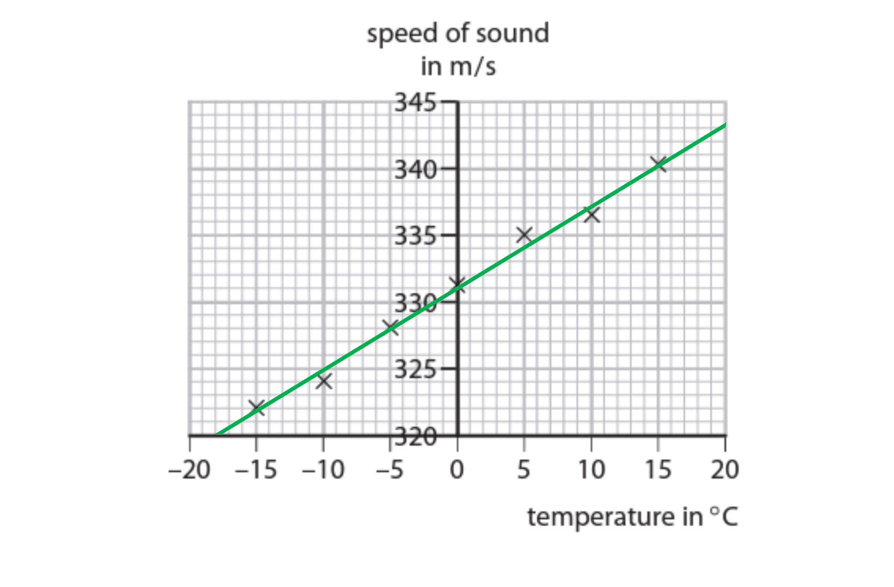

- A straight line drawn with a ruler **AND **a good average of the plotted points;**[1 mark]**

(ii) To find the speed of sound when the air temperature is 20 °C:

Draw a line connecting the point at 20 °C with the equivalent speed of sound:

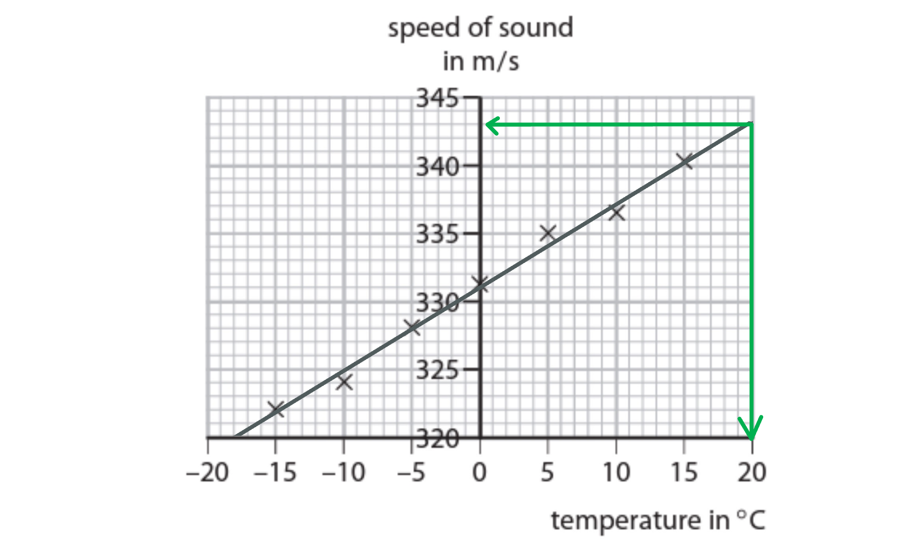

- Method clearly shown on graph; **[1 mark]**
- *v* = 343 m/s; **[1 mark]**

**[Total: 3 marks]**

### 2() — 2 marks
(b)

To explain how the decrease in temperature affects wavelength:

Any **two **points from:

- Speed of sound decreases; **[1 mark]**
- Frequency stays constant; **[1 mark]**
- Wavelength decreases; **[1 mark]**

**[Total: 2 marks]**

> *The trick with questions like this one is to remember that **frequency comes from the vibrations of the source**. It is not affected by anything that happens after the wave 'sets off'.*

> *Frequency is constant.*

> *Then, since **v = fλ**, velocity and wavelength are **directly proportional**. If one decreases, so does the other.*

## Q11 — hard — 6 marks · exam-questions

### 6((a)) — 4 marks
(a)

To calculate the distance between the boat and the nearest fish:

List the known quantities:

- Time to hear echo = 0.26 s
- Speed of sound in water, *s *= 1.5 km/s = 1500 m/s **[1 mark]**

Recall that the sound received is an echo:

- Therefore, time to the fish = half of total time
- Time,$t=\frac{1}{2}\times0.26=0.13s$**[1 mark]**

Use the equation for speed and distance:

- $s=\frac{d}{t}\Rightarrowd=s\timest$
- $d$ = 1500 × 0.13 **[1 mark]**
- Distance = 195 m **[1 mark]**

**[Total: 4 marks]**

### 6((b)) — 2 marks
(b)

A reason for this difference in time:

Explain why the echo takes longer to return to the boat:

- The echo takes longer because the depth is changing

Explain why the depth of the shoal could appear to change:

Any **two **points from:

- Reflected from different depths within the shoal;**[1 mark]**
- Fish move/changing depth; **[1 mark]**
- Reflections from sea bed; **[1 mark]**
- So reflected pulses travel different distances;**[1 mark]**

**[Total: 2 marks]**

> *This question requires you to apply your scientific common sense to a new situation. Once you have realised that if the time changes, then the distance must be changing, then you just need to explain how that could happen.*

> *As usual a quick sketch may help you to solve the problem.*

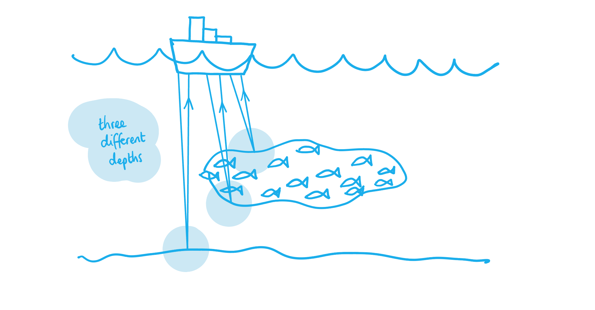

## Q12 — hard — 11 marks · exam-questions

### 3((b)) — 5 marks
(a)

(i) A correct graph and line of best fit looks like:

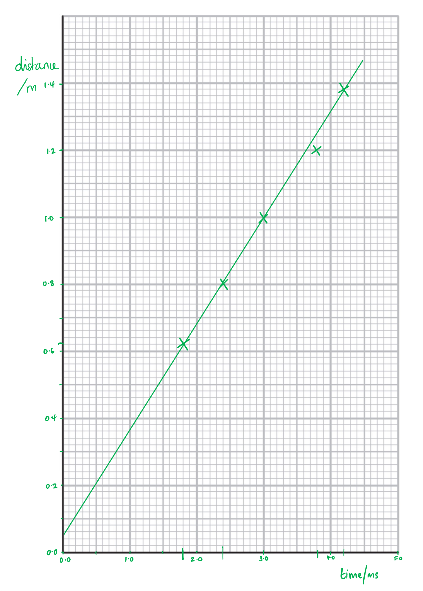

- Both axes labelled with correct units;** [1 mark]**
- Correct scales, evenly spaced, taking up at least half the page in both directions; **[1 mark]**
- First 3 plots correct; **[1 mark]**
- Next 2 plots correct; **[1 mark]**
- Line of best fit averages the points and extends beyond them; **[1 mark]**

**[Total: 5 marks]**

> *A line of best fit is meant to **average the data points**. Always use a clear ruler so that you can see how many plots are on either side of your line. The number should be equal, with as many actual plots on the line as possible.*

> *It's very important to draw the graph and line correctly, because later marking points rely on it. *

### 3((b)) — 6 marks
(b)

(i) Use the graph to find the speed of sound in air:

- Since speed = distance ÷ time, the gradient of the graph = speed of sound

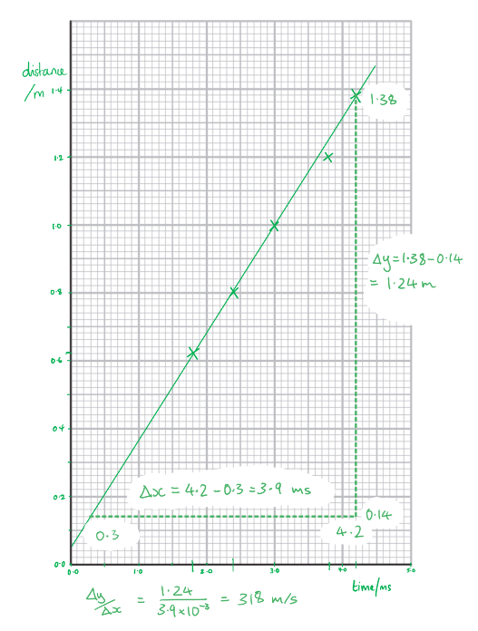

- Clearly marked attempt to find gradient of graph;** [1 mark]**
- Correct value (according to graph) in the range 310-350; **[1 mark]**
- Units given in m/s; **[1 mark]**

(ii) To make this experiment valid, the following must be controlled or kept the same:

Any **one **from:

- The point on the block which is hit with the hammer; **[1 mark]**
- Microphone **OR **timer **OR **wires;**[1 mark]**
- The way the hammer lands / reduce the amount of bounce back; **[1 mark]**
- Temperature; **[1 mark]**
- <u>Force</u> of hitting the block; **[1 mark]**

(iii) Two ways to improve the quality of the data include:

Any **two **from:

- Repeat readings at each distance; **[1 mark]**
- Measure distance to the sensor of the microphone; **[1 mark]**
- Use a wider range of distance readings **OR **start at less than 0.62 m **OR **continue after 1.38 m; **[1 mark]**
- Make increments smaller **OR **make intermediate readings between the points; **[1 mark]**

**[Total: 6 marks]**

> *In part (i) the range of acceptable values for the speed of sound shows you the range of lines of best fit the examiner is prepared to accept.*

## Q13 — hard — 10 marks · exam-questions

### 9((b)) — 5 marks
(a)

To describe an experiment to measure the speed of sound in air:

- Use the equation, $speed=\frac{distance}{time}$ **[1 mark]**
- Measure a distance sound travels in a particular time **OR **measure the time sound takes to travel a particular distance; **[1 mark]**
- Ensure that the time or distance is realistic (e.g. placing microphones 1 m apart, or standing 150 m from the source of sound); **[1 mark]**
- State the measuring instrument **AND **describe how to make the measurement; **[1 mark]**
- Repeat the readings **AND **take an average; **[1 mark]**

**An example of an answer that would score 5 marks:**

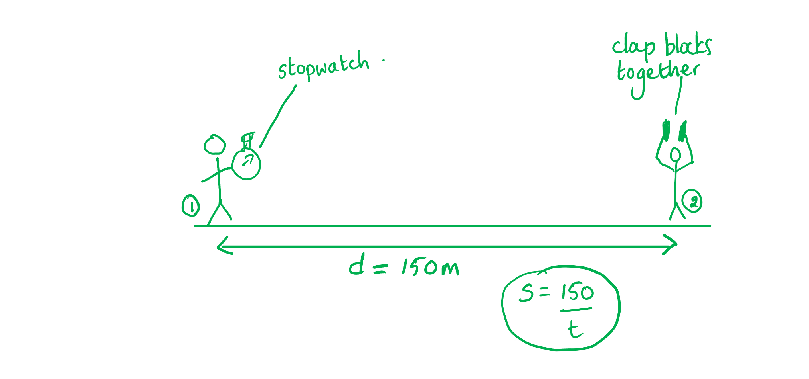

- Speed-distance equation is shown; **[1 mark]**
- Distance has been measured;**[1 mark]**
- Realistic distance between students shown; **[1 mark]**

Describe how the readings are taken:

- Student 2 claps the blocks together. Student 1 <u>starts the stopwatch</u> when they <u>see the blocks meet</u> and <u>stops it when they hear the sound</u>; **[1 mark]**
- The students do three repeat readings, then calculate the average time;**[1 mark]**

**[Total: 5 marks]**

> *A diagram is an excellent way to communicate ideas and methods in science. Your examiner is a physicist themselves, so they are very happy to award marks for parts of the answer which are clearly expressed on a diagram. And it saves you a lot of writing!*

### 9((c)) — 5 marks
(b)

(i) To estimate the speed of sound in air 6000 m above sea level:

Use the graph by drawing a line from 6000 m to the slope and extending to the x-axis:

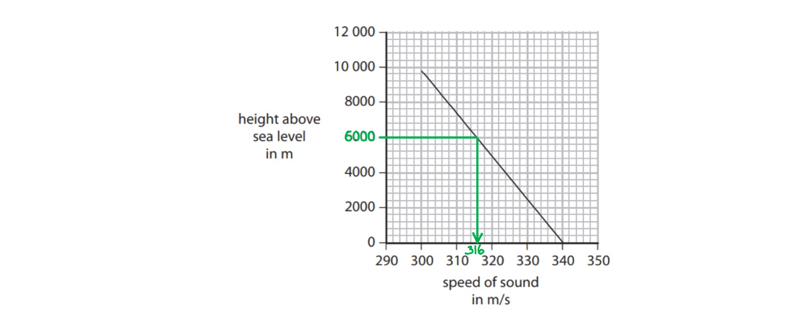

Read the speed of sound which corresponds with 6000 m

- Speed of sound = 316 m/s [**1 mark]**

(ii) To describe the pattern shown by the graph:

Describe the relationship between the variables shown by the slope:

- As height above sea level increases, the speed of sound decreases; **[1 mark]**
- The change is linear **OR **speed decreases at a constant rate; **[1 mark]**

(iii) Do you agree with the student?

Any **two **marks from:

Use the graph to analyse the student's statement:

- At higher altitudes the speed of sound is slower; **[1 mark]**
- Therefore the plane can travel faster than sound at slower speeds;**[1 mark]**

Draw a conclusion:

- Agree with the student **OR **the student is correct; **[1 mark]**

**[Total: 5 marks]**

## Q14 — hard — 10 marks · exam-questions

### 1() — 5 marks
(a) Calculate the speed of sound from the oscilloscope trace:

List the known quantities:

- Wavelength of the sound wave, *λ* = 1.3 m
- Time-base: 1 square = 1 ms = 1 × 10−3 s

Determine the period of the sound wave:

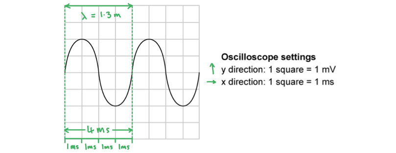

- Period = time to complete one oscillation or wavelength
- Period = 4 squares
- Period = 4 × 1 ms = 4 ms **[1 mark]**
- Period = 4 ms = 4 × 10−3 s **[1 mark]**

Determine the frequency of the sound wave:

- Frequency = 1 ÷ period, or $f=\frac{1}{T}$
- $f=\frac{1}{4\times10^{-3}}$
- Frequency = 250 Hz **[1 mark]**

Determine the speed of sound:

- Speed = frequency × wavelength, or $v=f\timesλ$
- Speed = 1.3 × 250 **[1 mark]**
- Speed = 325 = 330 m/s **[1 mark]**

**[Total: 5 marks]**

### 2() — 5 marks
(b) A valid evaluation of the student's alternative method is:

Any **five **points from:

- The measurement of time may not be accurate due to reaction time;**[1 mark]**
- The distance of 50 m is too short (to get an accurate value of time); **[1 mark]**
- The timescale is too short to be measured by a human (accurately) e.g. if *v* = 340 m/s, *d* = 50 m, time ≈ 50/340 = 0.15 s; **[1 mark]**
- It may be difficult for the teacher to flash the light and make the sound at the same time; **[1 mark]**
- A metre ruler is not appropriate to measure this distance **OR** the student should use a trundle wheel / tape measure; **[1 mark]**
- It would be easy to miscount the number of ruler lengths;**[1 mark]**
- The student would have to account for the zero error on the ruler; **[1 mark]**
- The measurement of distance could be affected by the ruler not going in a straight line or uneven ground;**[1 mark]**
- The student does not mention if he will take repeat readings; **[1 mark]**

**[Total: 5 marks]**

## Q15 — hard — 13 marks · exam-questions

### 1() — 3 marks
(a) The difference in the average speeds of A and B is:

- Buzzer B has twice the (average) speed (compared to A) **OR** buzzer A has half the (average) speed (compared to B); **[1 mark]**
- (Because) B travels twice the distance (of A) **OR** (because) A travels half the distance (of B); **[1 mark]**
- In the same time (period) **OR** (average) speed = distance/time taken; **[1 mark]**

**[Total: 3 marks]**

### 2() — 5 marks
(b) Calculate the wavelength of the sound wave from the oscilloscope trace:

List the known quantities:

- Speed of the sound wave, *v *= 340 m/s
- Time-base: 1 square = 2 ms = 2 × 10−3 s

Determine the period of the sound wave:

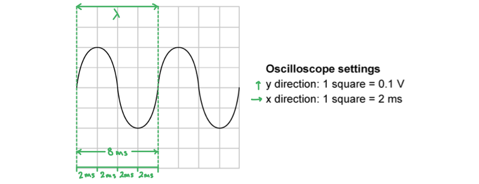

- Period = time to complete one oscillation or wavelength
- Period = 4 squares
- Period = 4 × 2 ms = 8 ms **[1 mark]**
- Period = 8 ms = 8 × 10−3 s **[1 mark]**

Determine the frequency of the sound wave:

- Frequency = 1 ÷ period, or $f=\frac{1}{T}$
- $f=\frac{1}{8\times10^{-3}}$
- Frequency = 125 Hz **[1 mark]**

Determine the wavelength of the sound wave:

- Speed = frequency × wavelength, or $v=f\timesλ$
- $v=f\timesλ\Rightarrowλ=\frac{v}{f}$
- $λ=\frac{340}{125}$ **[1 mark]**
- Wavelength = 2.72 = 2.7 m **[1 mark]**

**[Total: 5 marks]**

### 3() — 5 marks
(c) An experimental method for measuring the speed of sound in air:

Any **five** from:

- The students stand a large distance (at least 100 m) from each other **OR** (echo method) stand a large distance (at least 50 m) from a wall; **[1 mark]**
- Measure the distance with a tape measure / trundle wheel; **[1 mark]**
- Start timing when the blocks are seen to be hit together **OR** (echo method) hit the blocks in a rhythm (so echos and hits are heard as equally spaced); **[1 mark]**
- Stop timing when the sound (from blocks being hit together) is heard **OR** (echo method) record total time for a large number of hits and use time = total time / number of hits; **[1 mark]**
- Measure the time with a stop-clock / stopwatch; **[1 mark]**
- Take (several) repeats and determine the mean; **[1 mark]**
- Use speed (of sound) = distance / time **OR** (echo method) speed (of sound) = 2 × distance / time; **[1 mark]**
- Use a distance-time graph to find speed from gradient; **[1 mark]**

**[Total: 5 marks]**

## Q16 — hard — 6 marks · exam-questions

### 1() — 1 marks
**Correct answer: A** — A longitudinal wave which can be reflected and refracted

**Final answer:** **The correct answer is A**

- Sound waves are longitudinal waves

  - Therefore, statements **C** and **D** can be eliminated
- Sound waves can be reflected and refracted

  - Therefore, statement **A **is correct

### 2() — 3 marks
(i) To determine the time period of the sound wave:

- Determine the time taken for 1 complete oscillation

  - 1 square = 5.0 ms
  - $1\mathrm{ms}=1\times10^{-3}s$
  - $5.0\mathrm{ms}=5.0\times10^{-3}s$

1 complete oscillation = 4 squares **[1 mark]**

`T space equals space 4 space cross times space open parentheses 5.0 cross times 10 to the power of negative 3 end exponent close parentheses`

$T=$** **$2.0\times10^{-2}s$** ** **OR**  $0.02s$** ****[1 mark]**

(ii) To calculate the frequency of the sound wave:

$f=\frac{1}{T}$

$f=\frac{1}{0.02}$

$f=$ $50\mathrm{Hz}$** ** **[1 mark]**

### 3() — 2 marks
Sketch the trace for a sound that is louder and has a higher pitch:

- A louder sound has a greater amplitude
- A higher pitch has a smaller time period

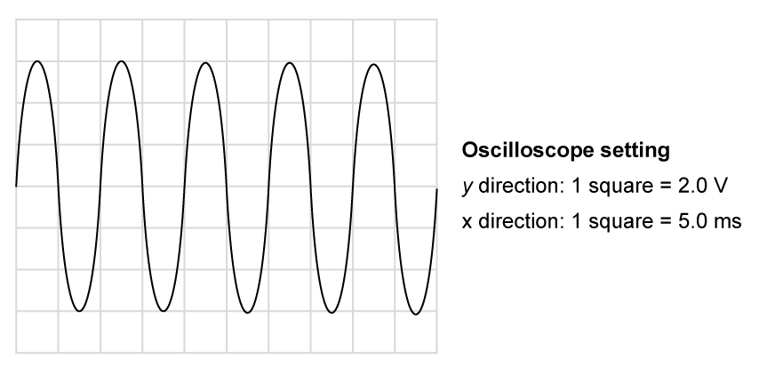

> **[mark-scheme]**
> - Amplitude is greater than 2 squares** [1 mark]**
> - Period is less than 4 squares **[1 mark]**
