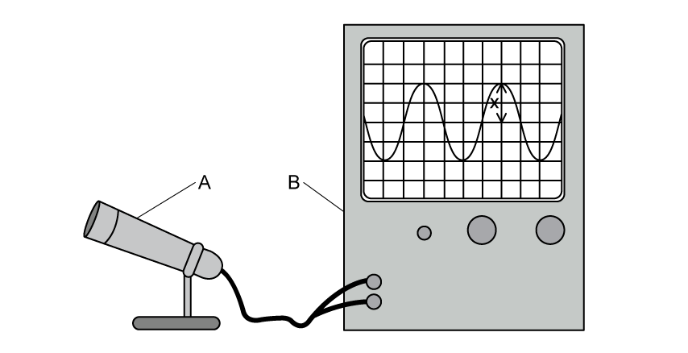
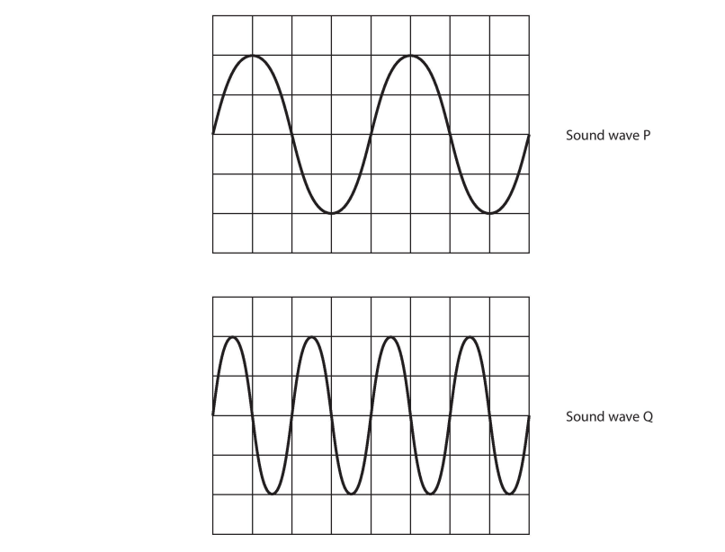
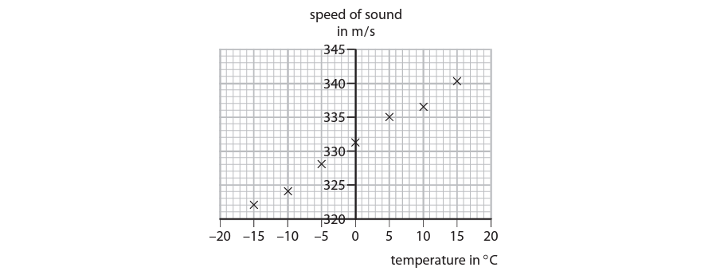
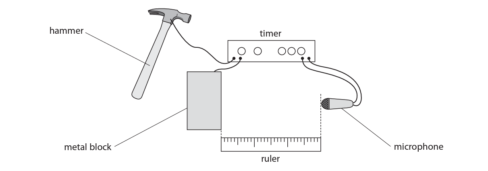
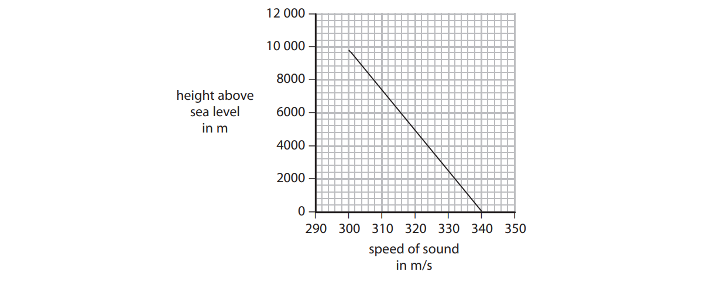

# Exam Questions — Sound
**5. Waves** · Edexcel IGCSE Physics (Modular) (4XPH1) — 24/Unit 2
> Source: [https://www.savemyexams.com/igcse/physics/edexcel/modular/24/unit-2/topic-questions/waves/sound/exam-questions/](https://www.savemyexams.com/igcse/physics/edexcel/modular/24/unit-2/topic-questions/waves/sound/exam-questions/) · 16 questions · total 104 marks

## Q1 — easy — 3 marks · exam-questions

### 9((a)) — 1 mark — multiple_choice — from paper 2012 June  · 1P
Sound waves are
- **A.** electromagnetic waves
- **B.** ionising radiation
- **C.** longitudinal waves
- **D.** transverse waves

### 2() — 1 mark — multiple_choice
Which statement about sound waves is incorrect?
- **A.** sound waves can be reflected, refracted and transmitted
- **B.** high pitch sound waves have a high frequency
- **C.** quiet sound waves have a large amplitude
- **D.** sound waves are longitudinal

### 3((b)) — 1 mark — multiple_choice — from paper 2016 June  · 1P
The frequency of ultrasound waves is outside the range of human hearing.

Which of the following could be a frequency of an ultrasound wave?
- **A.** 45 Hz
- **B.** 450 Hz
- **C.** 4500 Hz
- **D.** 45 000 Hz

## Q2 — easy — 3 marks · exam-questions

### 5() — 1 mark — multiple_choice — from paper 2014 June  · 2P
A signal generator produces sounds from a loudspeaker.

Which property of the sound wave should be increased in order to make the sound louder?
- **A.** amplitude
- **B.** frequency
- **C.** speed
- **D.** wavelength

### 5() — 1 mark — multiple_choice — from paper 2014 June  · 2P
Which property of the sound wave should be increased in order to make a higher pitched sound?
- **A.** amplitude
- **B.** frequency
- **C.** speed
- **D.** wavelength

### 3((a)) — 1 mark — multiple_choice — from paper 2014 June  · 2PR
The graphs show oscilloscope traces produced by four different sounds.

The oscilloscope settings are the same for each trace.

Which graph shows the trace for the loudest sound at the lowest pitch?
- **A.** 
- **B.** 
- **C.** 
- **D.** 

## Q3 — easy — 4 marks · exam-questions

### 1() — 1 mark — command: state — structured
A foghorn makes a loud, low-pitched warning sound when a ship is moving in fog.

State the relationship between the frequency of a sound wave and the pitch of the sound.

### 2() — 3 marks — command: multiple — structured
The foghorn emits sound waves with a frequency of 160 Hz.

The speed of sound is 340 m/s.

(i) State the equation linking wave speed, frequency and wavelength.

**(1)**

(ii) Calculate the wavelength of these sound waves.

**(2)**

wavelength = ...................... m

## Q4 — easy — 7 marks · exam-questions

### 1() — 1 mark — command: state — structured
State why sound waves are classed as longitudinal waves.

### 2() — 4 marks — command: complete — structured
A student uses two pieces of equipment, **A** and **B**, to display a sound wave.

(i) Use words from the box to complete the sentence

**(2)**

| **a loudspeaker    a microphone    an oscilloscope    a screen ** |
|---|

**A** is ............................................ and **B** is ............................................ .

(ii) Use words from the box to complete the sentence

**(1)**

| **the amplitude    half the amplitude    the frequency    half the frequency** |
|---|

The distance $x$ marked on the diagram measures ......................................... of the sound wave.

(iii) Use words from the box to complete the sentence

**(1)**

| **louder    quieter     a higher pitch    a lower pitch** |
|---|

The distance $x$ becomes smaller. This is because the sound has become ........................................... .

### 3() — 2 marks — command: explain — structured
Explain why astronauts in space cannot hear sounds from outside their spacesuits.

## Q5 — easy — 2 marks · exam-questions

### 3((b)) — 1 mark — command: find — structured — from paper 2015 January  · 1P
A microphone is connected to a data logger, which displays each sound wave as a graph.

The diagrams below show oscilloscope traces for two different sound waves P and Q.

The graphs have the same scales. In the horizontal direction: 1 square = 0.001 s

The frequency of sound wave P is 250 Hz.

Find the time period of sound wave P.

** **period of wave P = ........................ s

### 3((b)) — 1 mark — command: find — structured — from paper 2015 January ·  1P
Find the frequency of sound wave Q.

** **frequency of wave Q = ....................... Hz

## Q6 — medium — 1 marks · exam-questions

### 3((b)) — 1 mark — multiple_choice — from paper 2015 January  · 1P
A microphone is connected to a data logger, which displays each sound wave as a graph. The diagrams show the graphs for two different sound waves.

The amplitude of sound wave Q is
- **A.** larger than the amplitude of sound wave P
- **B.** smaller than the amplitude of sound wave P
- **C.** the same as the amplitude of sound wave P
- **D.** zero

## Q7 — medium — 4 marks · exam-questions

### 3() — 2 marks — command: explain — structured — from paper June 2016 · 1P
One type of wave used in hospitals is ultrasound. Ultrasound waves are used to make images of internal organs.

A scanner emits an ultrasound wave into the patient and records any reflections.

The scanner records the time from when a wave is emitted to when its reflection is received.

A technician calculates the depth of the reflection using the equation

depth = $\frac{1}{2}$ × (speed of ultrasound in patient × time recorded by scanner)

Explain why the technician uses the value $\frac{1}{2}$ in the equation.

### 2() — 2 marks — command: explain — structured
An ultrasound wave travels faster in the patient than it does in air.

Explain how a change in speed affects the wavelength of the ultrasound wave.

## Q8 — medium — 10 marks · exam-questions

### 2((a)) — 4 marks — command: multiple — structured — from paper 2014 June  · 1PR
Ultrasound waves are sound waves with a very high frequency. They are often used for medical purposes.

Dentists use ultrasound waves to clean patients’ teeth.

The diagram shows an ultrasound cleaner removing plaque from teeth.

The tip of the ultrasound cleaner vibrates 96 million times per second and is sprayed with water.

(i) State the frequency of the ultrasound emitted by the cleaner and give the unit.

**(2)**

frequency = ....................... unit .....

(ii) Suggest how the cleaner removes plaque.

**(1)**

(iii) Suggest why water is sprayed on the tip of the cleaner.

**(1)**

### 2((b)) — 4 marks — command: multiple — structured — from paper 2014 June  · 1PR
(i) State the equation linking wave speed, frequency and wavelength.

**(1)**

(ii) The ultrasound waves have a wavelength of 0.00044 m and travel at a speed of 1540 m/s in the fluid.

Calculate the frequency, in MHz, of the ultrasound waves.

**(3)**

### 2((c)) — 2 marks — command: suggest — structured — from paper 2014 June ·  1PR
Other waves also have medical uses.

Ultraviolet waves are used by doctors to cure some skin conditions.

Suggest two differences between ultrasound waves and ultraviolet waves.

## Q9 — medium — 9 marks · exam-questions

### 3((a)) — 2 marks — command: explain — structured — from paper 2016 June ·  2P
A student investigates how air vibrates in a plastic pipe.

She blocks one end of the pipe and blows across the other end.

The pipe emits a sound with a steady pitch. The student uses a microphone to monitor the sound.

Explain the meaning of the pitch of a sound.

### 3((b)) — 4 marks — command: name — structured — from paper 2016 June  · 2P
The student measures the length of the pipe and the frequency of the microphone signal for two different lengths of pipe.

(i) Name two instruments that she will need for these measurements.

**(2)**

(ii) Name the dependent and independent variables in her investigation.

**(2)**

### 3((c)) — 3 marks — command: suggest — structured — from paper 2016 June ·  2P
The student collects this data.

Suggest three ways to improve this investigation.

## Q10 — medium — 5 marks · exam-questions

### 1() — 3 marks — command: multiple — structured
A foghorn makes a loud, low-pitched warning sound when a ship is moving in fog.

A student investigates how the speed of sound in air varies with temperature.

The student’s results are shown on the graph.

(i) Draw a straight line of best fit on the graph.

**(1)**

(ii) Use the graph to find the speed of sound when the air temperature is 20 °C.

**(2)**

**   ** speed of sound =  ................................ m/s

### 2() — 2 marks — command: explain — structured
The air temperature decreases while the foghorn continues to emit sound waves with a frequency of 160 Hz.

Explain how this decrease in temperature affects the wavelength of the sound waves.

## Q11 — hard — 6 marks · exam-questions

### 6((a)) — 4 marks — command: calculate — structured — from paper 2014 January  · 1P
Echo sounding is used to detect fish in the sea.

Sound waves are emitted from a fishing boat. Some of the sound waves are reflected by fish and detected back at the boat.

The shortest time between the sound waves being emitted and detected is 0.26 s.

The speed of sound in water is 1.5 km/s.

Calculate the distance between the boat and the nearest fish.

distance = ....................... m

### 6((b)) — 2 marks — command: suggest — structured — from paper 2014 January · 1P
Each sound wave is emitted for a very short time.

The reflected sound wave received at the boat lasts for a longer time.

Suggest a reason for this difference in time.

## Q12 — hard — 11 marks · exam-questions

### 3((b)) — 5 marks — command: plot — structured — from paper 2015 January  · 1P
The diagram shows the equipment used by a student to measure the speed of sound in air.

The student measures the distance between the front of the metal block and the microphone.

She then uses this method to measure the time taken for sound to travel from the metal block to the microphone.

- start the timer by hitting the metal block with the hammer
- stop the timer when the sound produced reaches the microphone
- record the time taken for sound to reach the microphone in milliseconds

The student repeats the experiment six times, changing the distance between the metal block and the microphone for each experiment.

The table shows her results.

Use the student’s results to plot a graph of distance against time and draw the straight line of best fit.

### 3((b)) — 6 marks — command: multiple — structured — from paper 2015 January  · 1P
(i) Use your graph to find the speed of sound in air and give the unit.

**(3)**

speed = ......................... unit .....................

(ii) Suggest how the student could make this experiment valid (a fair test).

**(1)**

(iii) Suggest two ways that the student could improve the quality of her data.

**(2)**

## Q13 — hard — 10 marks · exam-questions

### 9((b)) — 5 marks — command: describe — structured — from paper 2012 June ·  1P
Describe an experiment to measure the speed of sound in air.

You may draw a diagram to support your answer.

### 9((c)) — 5 marks — command: multiple — structured — from paper 2012 June  · 1P
The speed of sound in air is different for different heights above sea level.

The graph shows how the speed of sound varies with height.

(i) Use the graph to estimate the speed of sound in air 6000 m above sea level.

**(1)**

** **speed = ................... m/s

(ii) Describe the pattern shown by the graph.

**(2)**

(iii) Some aeroplanes can travel faster than the speed of sound.

When an aeroplane travels faster than the speed of sound it causes a shock wave. People on the ground hear this shock wave as a sonic boom.

A student says

Do you agree with the student?

Explain why.

**(2)**

## Q14 — hard — 10 marks · exam-questions

### 1() — 5 marks — command: calculate — structured
A student uses an oscilloscope to determine the speed of sound.

The diagram shows the oscilloscope trace the student obtains along with the oscilloscope settings used.

The student uses two microphones and a ruler to determine that the wavelength of the sound wave is 1.3 m

Use the oscilloscope trace to calculate the speed of the wave.** **

speed = .............................................................. m/s

### 2() — 5 marks — command: evaluate — structured
The student also uses an alternative method to determine the speed of sound.

He follows the following method:

1. The student stands 50 m away from his teacher, measuring the distance with a metre ruler.
2. The teacher makes a loud sound and flashes a light at the same time.
3. The student starts the stopwatch when he sees the flash of light.
4. He stops the stopwatch when he hears the loud sound.

The speed of sound is then calculated using the formula

speed of sound = $\frac{distance}{timetaken}$

Evaluate whether this method could produce an accurate value for the speed of sound in air.

## Q15 — hard — 13 marks · exam-questions

### 1() — 3 marks — command: explain — structured
The diagram shows two identical buzzers connected with springs.

Spring A is connected to a post.

A force acts on the apparatus for a short period of time, pulling both buzzers to the right.

During this time, buzzer A moves 2 cm and buzzer B moves 4 cm.

Explain the difference between the average speeds of buzzers A and B.

### 2() — 5 marks — command: determine — structured
The diagram shows the oscilloscope trace produced.

The trace represents the sound wave received by the microphone from buzzer A.

Determine the wavelength of the sound wave.

The speed of sound in air is 340 m/s.

** **wavelength = ............................... m

### 3() — 5 marks — command: describe — structured
Two students do an experiment to measure the speed of sound in air.

They carry out the experiment outdoors in a wide‑open space and plan to use two blocks of wood which they will hit together to produce a loud noise.

Describe how the students should use their equipment to measure the speed of sound in air.

## Q16 — hard — 6 marks · exam-questions

### 1() — 1 mark — multiple_choice
Which of the following statements describes a sound wave?
- **A.** A longitudinal wave which can be reflected and refracted
- **B.** A longitudinal wave which can be reflected only
- **C.** A transverse wave which can be reflected and refracted
- **D.** A transverse wave which can be refracted only

### 2() — 3 marks — command: multiple — structured
A student connects a microphone to an oscilloscope to display a sound wave.

The diagram shows the trace on the oscilloscope screen.

(i) Determine the time period of the sound wave.

[2]

(ii) Calculate the frequency of the sound wave.

[1]

### 3() — 2 marks — command: sketch — structured
The student adjusts the signal generator to produce a sound that is louder and has a higher pitch.

On the grid below, sketch the trace that would be seen on the screen.

